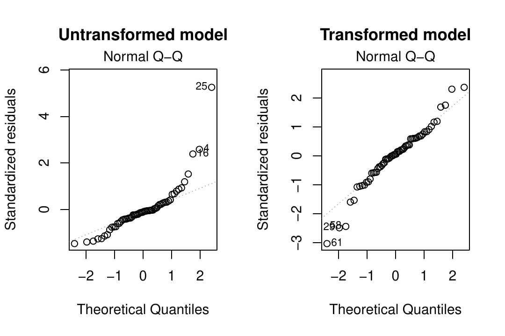
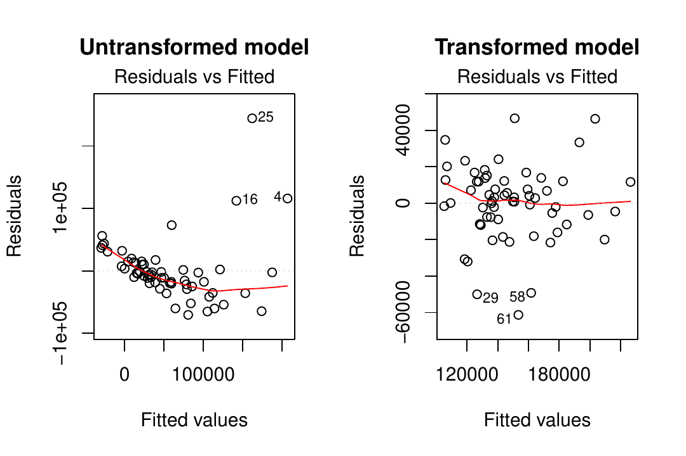
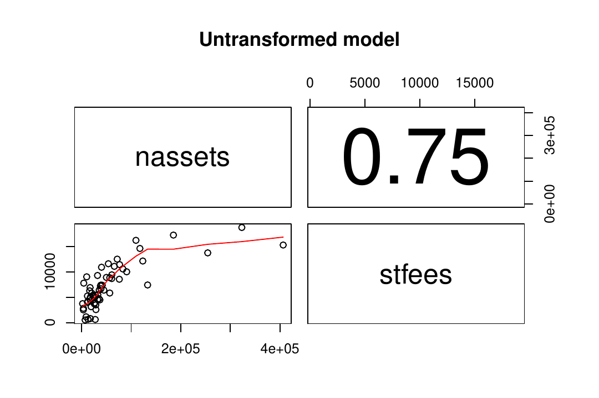
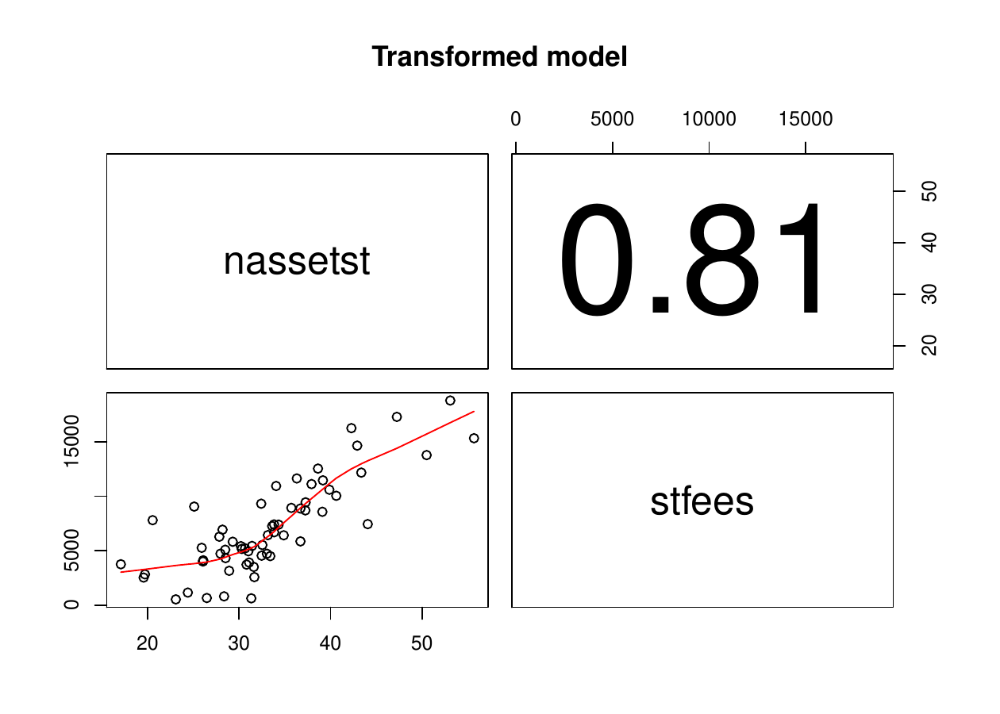

# Introduction {#trafo:intro}

To study the relation between two or more variables, the linear
regression model is one of the most employed statistical methods. For an
appropriate usage of this model, a set of assumptions needs to be
fulfilled. These assumptions are, among others, related to the
functional form and to the error terms, such as linearity and
homoscedasticity. However, in practical applications, these assumptions
are not always satisfied. This leads to the question of how to move on
with the analysis in such cases. One way to proceed is to conduct the
analysis ignoring the model assumption violations which is, of course,
not recommended as it would likely yield misleading results. An
alternative solution is to use more complex methods such as generalized
linear regression models or non-parametric methods, as they might fit
the data and problem better. A third method--and the focus of the
present work-- is the application of suitable transformations.
[Throughout the current manuscript, we use the term transformations to
refer to the application of monotonic functions to the response variable
of a linear regression model]{style="color: black"}. For more flexible
transformation functions, please refer to (e.g.) @Hothorn2018.

Transformations have the potential to correct certain violations of
model assumptions and by doing so, allow an analysis to continue with
the linear regression model. Due to its convenience, transformations
such as the logarithm or the Box-Cox [@Box1964] are commonly applied in
many branches of sciences; for example in economics [@Hossain2011] and
neuroscience [@Morozova2016]. In order to simplify the choice and the
usage of transformations in the linear regression model, the R package
[*trafo*](https://CRAN.R-project.org/package=trafo) [@Medina2017] is
developed. The present work is inspired by the framework proposed in
@Rojas-Perilla2018 [pp. 9-45] and extends other existing R packages that
provide transformations.

Many packages that contain transformations do not specifically focus on
the use of transformations
[@Venables2002; @Fox2011; @Molina2015; @Ribeiro2016]. They often only
include widely used transformations like the logarithmic or the Box-Cox
transformation family. [The package
[*car*](https://CRAN.R-project.org/package=car) [@Fox2011] expands the
selection of transformations; it includes the Box-Cox, the Tukey
[@Tukey1957], and the Yeo-Johnson [@Yeo2000] transformation families,
and uses the maximum likelihood approach for the estimation of the
transformation parameter [@Box1964]. The package
[*rcompanio*](https://CRAN.R-project.org/package=rcompanio)
[@Mangiafico2019] focuses on the Tukey transformation with estimation
via goodness of fit tests. In addition to the logarithm and Box-Cox, the
package
[*bestNormalize*](https://CRAN.R-project.org/package=bestNormalize)
[@Peterson2019] also includes the glog [see e.g.  @Durbin2002] and
Yeo-Johnson transformations.]{style="color: black"} An exponential
transformation proposed by @Manly1976 is provided in the package
[*caret*](https://CRAN.R-project.org/package=caret) [@Kuhn2008] and the
multiple parameter Johnson transformation [@Johnson49] in the packages
[*Johnson*](https://CRAN.R-project.org/package=Johnson) [@Fernandez2014]
and [*jtrans*](https://CRAN.R-project.org/package=jtrans) [@Wang2015].
While the packages [*MASS*](https://CRAN.R-project.org/package=MASS)
[@Venables2002] and [*car*](https://CRAN.R-project.org/package=car)
[@Fox2011] solely provide the maximum likelihood approach for the
estimation of the transformation parameter for the Box-Cox family, the
package [*AID*](https://CRAN.R-project.org/package=AID) [@Dag2017]
includes a wide range of methods, mostly based on goodness of fit tests
like the Shapiro-Wilk or the Anderson-Darling test. Though the use of
these methods is limited to the Box-Cox transformation. For a summary of
the various transformations available in R packages, please see Table
[1](#tab:trafo_comp).

::: {#tab:trafo_comp}
  ------------------------------------------------------------------------------------------------------------------------------------------------------------------------------------------------------------------------------------------------------------------------------------------------------------------------------------------------------------------------------------------------------------------------------------------------------------------------------------------------------------------------------------------------------------------------------------------------------------------------------------------------------------------------------------------------------------------------
                                       [*AID*](https://cran.r-project.org/web/packages/AID/index.html)   [*bestNormalize*](https://cran.r-project.org/web/packages/bestNormalize/index.html)   [*car*](https://cran.r-project.org/web/packages/car/index.html)   [ *caret*](https://cran.r-project.org/web/packages/caret/index.html)   [*Johnson*](https://cran.r-project.org/web/packages/Johnson/index.html)   [*jtrans*](https://cran.r-project.org/web/packages/jtrans/index.html)   [*MASS*](https://cran.r-project.org/web/packages/MASS/index.html)   [*rcompanion*](https://https://cran.r-project.org/web/packages/rcompanion/index.html)   [*trafo*](https://cran.r-project.org/web/packages/trafo/index.html)
  ----------------------------------- ----------------------------------------------------------------- ------------------------------------------------------------------------------------- ----------------------------------------------------------------- ---------------------------------------------------------------------- ------------------------------------------------------------------------- ----------------------------------------------------------------------- ------------------------------------------------------------------- --------------------------------------------------------------------------------------- ---------------------------------------------------------------------
  *Transformation*                                                                                                                                                                                                                                                                                                                                                                                                                                                                                                                                                                                                                                   

  Log                                                                $✗$                                                                         $✗$                                                                         $✗$                                                                 $✗$                                                                                                                                                                                                                     $✗$                                                                                                                                                          $✗$

  Log (shift)                                                        $✗$                                                                         $✗$                                                                         $✗$                                                                                                                                                                                                                                                                                         $✗$                                                                                                                                                          $✗$

  Glog                                                                                                                                           $✗$                                                                                                                                                                                                                                                                                                                                                                                                                                                                                                                                  $✗$

  Neglog                                                                                                                                                                                                                                                                                                                                                                                                                                                                                                                                                                                                                                                                              $✗$

  Reciprocal                                                                                                                                     $✗$                                                                         $✗$                                                                                                                                                                                                                                                                                                                                                                                                                                                      $✗$

  Tukey                                                                                                                                                                                                                      $✗$                                                                                                                                                                                                                                                                                                                                                                       $✗$                                           

  Box-Cox                                                            $✗$                                                                         $✗$                                                                         $✗$                                                                 $✗$                                                                                                                                                                                                                     $✗$                                                                                                                                                          $✗$

  Box-Cox (shift)                                                    $✗$                                                                                                                                                     $✗$                                                                                                                                                                                                                                                                                                                                                                                                                                                      $✗$

  Log-shift opt                                                                                                                                                                                                                                                                                                                                                                                                                                                                                                                                                                                                                                                                       $✗$

  Bickel-Docksum                                                                                                                                                                                                                                                                                                                                                                                                                                                                                                                                                                                                                                                                      $✗$

  Yeo-Johnson                                                                                                                                    $✗$                                                                         $✗$                                                                 $✗$                                                                      $✗$                                                                      $✗$                                                                                                                                                                                                                                $✗$

  Square Root (shift)                                                                                                                                                                                                                                                                                                                                                                                                                                                                                                                                                                                                                                                                 $✗$

  Manly                                                                                                                                                                                                                                                                                          $✗$                                                                                                                                                                                                                                                                                                                                                                                  $✗$

  Modulus                                                                                                                                                                                                                                                                                                                                                                                                                                                                                                                                                                                                                                                                             $✗$

  Dual                                                                                                                                                                                                                                                                                                                                                                                                                                                                                                                                                                                                                                                                                $✗$

  Gpower                                                                                                                                                                                                                                                                                                                                                                                                                                                                                                                                                                                                                                                                              $✗$

  Customized                                                                                                                                                                                                                                                                                                                                                                                                                                                                                                                                                                                                                                                                          $✗$

  *Estimation method*                                                                                                                                                                                                                                                                                                                                                                                                                                                                                                                                                                                                                                

  Maximum likelihood theory                                          $✗$                                                                                                                                                     $✗$                                                                 $✗$                                                                                                                                                                                                                     $✗$                                                                                                                                                          $✗$

  Distribution moments optimization                                                                                                                                                                                                                                                                                                                                                                                                                                                                                                                                                                                                                                                   $✗$

  Divergence minimization                                                                                                                                                                                                                                                                                                                                                                                                                                                                                                                                                                                                                                                             $✗$

  Via goodness of fit tests                                          $✗$                                                                                                                                                                                                                                                                                                                                                                           $✗$                                                                                                                                                 $✗$                                           

  Rank-mapping                                                                                                                                   $✗$                                                                                                                                                                                                                                                                                                                                                                                                                                                                                                 

  Via percentiles                                                                                                                                                                                                                                                                                                                                                         $✗$                                                                                                                                                                                                                                                                        
  ------------------------------------------------------------------------------------------------------------------------------------------------------------------------------------------------------------------------------------------------------------------------------------------------------------------------------------------------------------------------------------------------------------------------------------------------------------------------------------------------------------------------------------------------------------------------------------------------------------------------------------------------------------------------------------------------------------------------

  : Table 1: Overview of available transformations and estimation
  methods in R packages
:::

[]{#tab:trafo_comp label="tab:trafo_comp"}

It is noticeable that most of the above-mentioned packages do not help
the user in the process of deciding which transformation is actually
suitable according to the users needs. Furthermore, most packages do not
provide tools to "eyeball" whether the employed transformation improves
the data with regard to fulfilling the model assumptions. Package
*trafo* combines and extends the features provided by the packages
mentioned above. Additionally to transformations that are already
provided by existing packages, the *trafo* package includes, among
others, the Bickel-Doksum [@Bickel1981], modulus [@John1980], the neglog
[@Whittaker2005] and glog [see e.g.  @Durbin2002] transformations that
are modifications of the Box-Cox and the logarithmic transformation in
order to deal with negative values in the response variable. The
selection of estimation methods for the transformation parameter is
enlarged by methods based on moments and divergence measures [see e.g. 
@Taylor1985; @Yeo2000; @Royston2011]. The main benefits of the package
*trafo* can be summarized as follows:

-   An initial check can be conducted that helps to decide if and which
    transformation is useful for the researchers' needs.
-   The untransformed model and a model with a transformed dependent
    variable can be easily compared under the light of the model
    assumptions (more on this below). Alternatively, two transformed
    models can be run and compared simultaneously
-   Extensive diagnostics are provided in order to check if the
    transformation helps to fulfill the model assumptions normality,
    homoscedasticity, and linearity.

# Transformations and estimation methods {#trafo:sec:trafo}

The equation describing and summarizing the relationship between a
continuous outcome variable $y$ and different covariates $x$ (either
categorical or continuous) is defined by
$y_i=\textbf{x}_i^{T}\boldsymbol{\beta} + e_i$, with $i=1,\ldots,n$.
This is also known as the linear regression model and is composed by a
deterministic and a random component, which rely on different
assumptions. Among others, these assumptions can be summarized as
follows:

-   [Normality (N): The conditional distribution of $y$ given $x$
    follows a normal distribution. This is an optional, but often
    desired assumption (e.g. [@Box1964]).]{style="color: black"}
-   Homoscedasticity (H): The conditional variance of $y$ given $x$ is
    constant.
-   Linearity (L): The conditional expectation of the outcome variable
    $y$ given the continuous covariates $x$ is a linear function in $x$.

As already mentioned, different approaches have been proposed to
overcome the violations of these model assumptions. Some of them include
alternative estimation methods of the regression terms or more complex
regression models [see e.g.  @Nelder1972; @Berry1993]. In the present
manuscript, we focus on defining a parsimonious modification for the
model, such as the usage of non-linear transformations of the outcome
variable. The transformations implemented in the package *trafo*
particularly help to achieve normality. However, most of them
simultaneously correct other assumptions (see also Table
[2](#trafo:tab:trafo_wo) and Table [3](#trafo:tab:trafos_one)).\
[We classify transformations in two groups: non-parametric
transformations and data-driven transformations with a transformation
parameter that needs to be estimated.]{style="color: black"} The first
set of transformations presented in Table [2](#trafo:tab:trafo_wo)
comprises, among others, the logarithmic transformation, which is
considered due to its popularity and straightforward application.

::: {#trafo:tab:trafo_wo}
  -----------------------------------------------------------------------------------------------------------------------------------------------------
  Transformation   Source                                              Formula                                    Support               N     H     L
  ---------------- --------------------------------------------------- ------------------------------ ------------------------------- ----- ----- -----
  Log (shift)      [@Box1964]                                          $\log(y+s)$                     $y  \in \{-\text{s};\infty\}$   $✗$   $✗$   $✗$

  Glog             [ [@Rocke2001]]{style="color: black"}               $\log(y+\sqrt{y^2+1})$               $y \in \mathbb{R}$         $✗$   $✗$   $✗$

                   [@Durbin2002]                                                                                                                  

                   [ [@Huber2002; @Huber2003]]{style="color: black"}                                                                              

  Neglog           [@Whittaker2005]                                    $\text{Sign}(y) \log(|y|+1)$         $y \in \mathbb{R}$         $✗$   $✗$  

  Reciprocal       [@Tukey1957]                                        $\frac{1}{y}$                            $y \neq 0$             $✗$   $✗$  
  -----------------------------------------------------------------------------------------------------------------------------------------------------

  : Table 2: Non-parametric transformations
:::

[]{#trafo:tab:trafo_wo label="trafo:tab:trafo_wo"}

The data-driven transformations presented in Table
[3](#trafo:tab:trafos_one) are dominated by the Box-Cox transformation
and its modifications or alternatives, e.g.  the modulus or
Bickel-Doksum transformation. More flexible versions of the logarithmic
transformation, as the log-shift opt, or the Manly transformation, an
exponential transformation, are also included in the package *trafo*.

::: {#trafo:tab:trafos_one}
  -----------------------------------------------------------------------------------------------------------------------------------------------------------------------------------------------
  Transformation        Source           Formula                                                                                                            Support               N     H     L
  --------------------- ---------------- ------------------------------------------------------------------------------------------------------- ------------------------------ ----- ----- -----
  Box-Cox (shift)       @Box1964         $\begin{cases} \frac{(y+s)^{\lambda} -1}{\lambda} &if  \lambda \neq 0; \\                                $y \in \{-\text{s};\infty\}$   $✗$   $✗$   $✗$
                                         			\log(y+s) & if  \lambda = 0. \end{cases}$                                                                                                          

  Log-shift opt         @Feng2016        $\log(y+\lambda)$                                                                                        $y \in \{-\text{s};\infty\}$   $✗$   $✗$   $✗$

  Bickel-Docksum        @Bickel1981      $\frac{|y|^\lambda \text{Sign}(y)-1}{\lambda}\,\,\,\,\,\,\text{if}\,\,\,\,\,\, \lambda > 0$                   $y\in \mathbb{R}$         $✗$   $✗$  

  Yeo-Johnson           @Yeo2000         $\begin{cases} \frac{(y+1)^{\lambda} -1}{\lambda} &if  \lambda \neq 0, y\geq 0;  \\                           $y\in \mathbb{R}$         $✗$   $✗$  
                                         			\text{log}(y+1) & if  \lambda = 0,y\geq 0;  \\ 	                                                                                                    
                                         			\frac{(1-y)^{2-\lambda} -1}{\lambda-2} &if  \lambda \neq 2, y< 0; \\                                                                               
                                         			-\text{log}(1-y) & if  \lambda = 2, y< 0. \end{cases}$                                                                                             

  Square Root (shift)   @Medina2017      $\sqrt{y+\lambda}$                                                                                            $y\in \mathbb{R}$         $✗$   $✗$  

  Manly                 @Manly1976       $\begin{cases} \frac{e^{\lambda y} -1}{\lambda} &if  \lambda \neq 0; \\                                       $y \in \mathbb{R}$        $✗$   $✗$  
                                         			y & if  \lambda = 0. \end{cases}$                                                                                                                  

  Modulus               @John1980        $\begin{cases} \text{Sign}(y)\frac{\left(|y|+1\right)^{\lambda} -1}{\lambda} &if  \lambda \neq 0; \\          $y \in \mathbb{R}$        $✗$        
                                         			\text{Sign}(y) \log\left(|y_{}|+1\right) & if  \lambda = 0. \end{cases}$                                                                           

  Dual                  @Yang2006        $\begin{cases}                                                                                                      $y>0$               $✗$        
                                         			\frac{(y^\lambda - y^{-\lambda})}{2 \lambda}   & if \lambda  > 0;\\                                                                                
                                         			                                                                                                                                                   
                                         			\log (y) &  if \lambda = 0. \\                                                                                                                     
                                         			                                                                                                                                                   
                                         			                                                                                                                                                   
                                         			\end{cases}$                                                                                                                                       

  Gpower                @Kelmansky2013   $\begin{cases} \frac{(y+\sqrt{y^2+1})^{\lambda} -1}{\lambda} &if  \lambda \neq 0; \\                          $y\in \mathbb{R}$         $✗$        
                                         			\log(y+\sqrt{y^2+1}) & if  \lambda = 0. \end{cases}$                                                                                               
  -----------------------------------------------------------------------------------------------------------------------------------------------------------------------------------------------

  : Table 3: Data-driven transformations.
:::

[]{#trafo:tab:trafos_one label="trafo:tab:trafos_one"}

Table [2](#trafo:tab:trafo_wo) and [3](#trafo:tab:trafos_one) provide
information about the range $y$ that is supported by the transformation.
Some transformations are only suitable for positive values of $y$. This
is generally true for the logarithmic and Box-Cox transformations.
However, in case that the dependent variable contains negative values,
the values are shifted by a deterministic shift $s$ such that
$y + s > 0$ by default in package *trafo*. Furthermore, the tables
highlights which assumptions the transformation helps to achieve.
[Kindly note that we are proposing general suggestions and the benefits
of transformations depend on the data]{style="color: black"}. For
specific properties of each transformation we refer to the further
references. The square root shift transformation with a data-driven
shift in analogy to the log-shift opt transformation is, to the best of
our knowledge, firstly implemented in this work. In contrast, a square
root transformation with deterministic shift, for example, is suggested
in @Bartlett1947.

[Below, we summarize the collection of methods included in *trafo* to
estimate the parameters of the transformations presented in Table
[3](#trafo:tab:trafos_one)]{style="color: black"}. The benefit of each
estimation method depends on the research analysis and the underlying
data.

::: {style="color: black"}
-   Maximum likelihood theory [@Box1964]
-   Distribution moments optimization: Skewness or kurtosis
    [[@Carroll1987; @Royston2011; @Rojas-Perilla2018]]{style="color: black"}
-   Divergence minimization: Following Kolmogorov-Smirnov (KS),
    Cramér-von-Mises (KM) or Kullback-Leibler (KL) measurements
    [[@cramer1928; @Kolmogorov1933; @Smirnov1939; @Kullback1951; @Johnson80; @Rojas-Perilla2018]]{style="color: black"}
:::

The maximum likelihood estimation method finds the set of values for the
transformation parameter that maximizes the likelihood function of the
dataset under the selected transformation [@Box1964]. This is a standard
approach that is also implemented in several of the mentioned R packages
[@Venables2002; @Fox2011]. However, since the maximum likelihood
estimation is rather sensitive to outliers, the skewness or kurtosis
optimization might be preferable for the estimation of the
transformation parameter in the presence of outliers [see e.g. 
@Royston2011]. The use of kurtosis over skewness optimization depends
entirely on the shape of the distribution of the data and the goal of
the analyst -- skewness optimizations corrects for asymmetry and
kurtosis for light or heavy tails. Additionally, if the focus lies on
comparing the whole distribution of the transformed data with a normal
distribution, and not only on some moments, different divergence
measures as the KS, KM or KL can be used [see e.g.  @Yeo2000]. For all
estimation methods, a range on which the functions are evaluated needs
to be proposed. Therefore, default values are set for the predefined
transformations. For more information about different estimation methods
we refer to @Rojas-Perilla2018 [pp. 9-45].

[Since the user can only decide if the transformation is helpful by
checking the above mentioned assumptions, the package *trafo* contains a
wide range of diagnostic checks [e.g. 
@Anderson1954; @Shapiro1965; @Breusch1979]]{style="color: black"}. A
smaller selection is used in the fast check that helps to decide if a
transformation might be useful. Table [4](#trafo:tab:diag) summarizes
the implemented diagnostic checks that are simultaneously returned for
the untransformed and a transformed model or two differently transformed
models and indicates which diagnostics are conducted in the fast check.

::: {#trafo:tab:diag}
  --------------------------------------------------------------------------------------------
  Assumption         Diagnostic check                                              Fast check
  ------------------ ------------------------------------------------------------ ------------
  Normality          Skewness and kurtosis                                            $✗$

                     [Shapiro-Wilk/Anderson-Darling test]{style="color: black"}       $✗$

                     Quantile-quantile plot                                       

                     Histograms                                                   

  Homoscedasticity   Breusch-Pagan test                                               $✗$

                     Residuals vs. fitted plot                                    

                     Scale-location                                               

  Linearity          Scatter plots between $y$ and $x$                                $✗$

                     Observed vs. fitted plot                                     
  --------------------------------------------------------------------------------------------

  : Table 4: Diagnostic checks provided in the package *trafo*.
:::

Additionally, plots are provided that help to detect outliers such as
the Cook's distance plot and influential observations by the residuals
vs leverage plot.

Another feature of the package *trafo* is the possibility of defining a
customized transformation. Thus, a user can also use the infrastructure
of the package for a transformation that suits the individuals needs
better than the predefined transformations. However, in this version of
the package *trafo* the user needs to define the transformation and the
standardized transformation in order to use this feature. For the
derivation of the standardized transformation of all predefined
transformations, see the Appendix.

### Applications

[The usage of transformations in practice may help to meet model
assumptions but it can also lead to complexities as the interpretation
of parameters and standard errors in inference or back-transformation
biases in prediction [@Rojas-Perilla2018]. For instance, it is
questionable how to address the estimation of the transformation
parameter in inference. @Box1964 point out that after applying the
Box-Cox transformation to the outcome variable, the transformation
parameter should be treated as fixed and known and the subsequent
analysis could be done in the transformed scale. However, @Bickel1981
emphasize that estimating a transformation parameter in a model could
overestimate the parameters' variance yielding conservative confidence
intervals. In prediction, on the other hand, lost interpretability of
parameters and standard errors may be less important but the
back-transformation could lead to a bias neglecting the non-linearity of
the transformation [see e.g.  @Mosimann2018].]{style="color: black"}

[Nevertheless, several studies show how transformations can be useful in
applications. @Pek2017 demonstrate how the log transformation can be
used for describing the relation between earnings and years of
experience and the reciprocal transformation for the effect of
intelligence quotient (IQ) on performance on mental sum problems. The
logarithm and the Box-Cox transformation are often applied in
econometric research, e.g.  to describe monetary policies
[@Zarembka1968; @Zarembka1974]. Transformations have also been used to
improve the functional form in studies of demand functions for meat
[@chang1977], travel costs [@vaughan1982], and recreation [@ziemer1980]
in the U.S and for import equations in the Republic of Ireland
[@boylan1982]. Another research field for the application of
transformations is genetics [@Huber2003]. The data sets often exhibit a
high variability and non-normality problems. To address this, the glog
and gpower can be useful in practice
[@Durbin2002; @Kelmansky2013].]{style="color: black"}

[When using package *trafo* for applications, it should be noted that
the package focuses on finding a suitable transformation with regards to
fulfilling specific model assumptions, the user still has to decide if
the transformation is reasonable in a specific application. The
following section shows which functionalities the package provides for
the user.]{style="color: black"}

# Case study {#trafo:sec:study}

In order to show the functionality of the package *trafo*, we present --
in form of a case study -- the steps a user faces when checking the
assumptions of the linear model. For this illustration, we use the data
set called `University` from the R package
[*Ecdat*](https://CRAN.R-project.org/package=Ecdat) [@Croissant2016].
This data set contains variables measuring the equipment and costs of
university teaching and research. These data can be made available as
follows:

``` r
R> library(Ecdat)
R> data(University)
```

A practical question for the head of a university could be how study
fees (`stfees`) raise the universities net assets (`nassets`). Both
variables are metric. Thus, a linear regression could help to explain
the relation between these two variables. A linear regression model can
be conducted in R using the `lm` function.

``` r
R> linMod <- lm(nassets ~ stfees, data = University)
```

The features in the package *trafo* that help to find a suitable
transformation for this model and to compare different models are
summarized in Table [5](#trafo:tab:functions) and illustrated in the
next subsections.

::: {#trafo:tab:functions}
  --------------------------------------------------------------------------------
             Function Description
  ------------------- ------------------------------------------------------------
      `assumptions()` Enables a fast check whether A transformation is suitable.

         `trafo_lm()` Compares the untransformed model with a transformed model.

    `trafo_compare()` Compares two differently transformed models.

      `diagnostics()` Returns information about the transformation and different

                      diagnostics checks in form of tests.

             `plot()` Returns graphical diagnostics checks.
  --------------------------------------------------------------------------------

  : Table 5: Core functions of package *trafo*.
:::

### Finding a suitable transformation {#trafo:sec:fast_check}

It is well known that the reliability of the linear regression model
depends on the assumptions presented above. In this section, we focus on
presenting how the user can decide and assess which (and whether)
transformations help to fulfill these model assumptions. A first fast
check of these model assumptions can be used in the package *trafo* in
order to find out if the untransformed model meets these assumptions or
if using a transformation seems suitable. The fast check can be
conducted by the function `assumptions`. [This function returns the
skewness, the kurtosis and the Shapiro-Wilk/Anderson-Darling test for
normality, the Breusch-Pagan test for homoscedasticity and scatter plots
between the dependent and the explanatory variables for checking the
linear relation]{style="color: black"}. All possible arguments of the
function `assumptions` are summarized in Table
[6](#trafo:tab:assumptions). In the following, we only show the returned
normality and homoscedasticity tests. The results are ordered by the $p$
value of the Shapiro-Wilk and Breusch-Pagan test.

``` r
R> assumptions(linMod)
```

``` r
The default lambdarange for the log shift opt transformation is calculated 
dependent on the data range. The lower value is set to -2035.751 and the upper 
value to 404527.249
	
The default lambdarange for the square root shift transformation is calculated 
dependent on the data range. The lower value is set to -2035.751 and the upper 
value to 404527.249
	
Test normality assumption 
              Skewness Kurtosis Shapiro_W Shapiro_p
logshiftopt    -0.4201   4.0576    0.9741    0.2132
boxcox         -0.4892   4.2171    0.9621    0.0527
bickeldoksum   -0.4892   4.2171    0.9621    0.0527
gpower         -0.4892   4.2171    0.9621    0.0527
modulus        -0.4892   4.2171    0.9621    0.0527
yeojohnson     -0.4892   4.2171    0.9621    0.0527
dual           -0.4837   4.2180    0.9619    0.0519
sqrtshift       0.6454   5.2752    0.9504    0.0139
log            -1.1653   5.1156    0.9140    0.0004
neglog         -1.1651   5.1150    0.9140    0.0004
glog           -1.1653   5.1156    0.9140    0.0004
untransformed   2.4503  12.7087    0.7922    0.0000
reciprocal     -3.7260  19.0487    0.5676    0.0000
	
Test homoscedasticity assumption 
              BreuschPagan_V BreuschPagan_p
modulus               0.1035         0.7477
yeojohnson            0.1035         0.7477
boxcox                0.1035         0.7476
bickeldoksum          0.1036         0.7476
gpower                0.1035         0.7476
dual                  0.1128         0.7369
logshiftopt           0.1154         0.7341
neglog                0.7155         0.3976
log                   0.7158         0.3975
glog                  0.7158         0.3975
reciprocal            1.6109         0.2044
sqrtshift             5.4624         0.0194
untransformed         9.8244         0.0017
```

Following the Shapiro-Wilk test, the log-shift opt transformation yields
a transformed outcome variable that is (statistically) normally
distributed ($p = 0.2132$). The same applies for the Box-Cox,
Bickel-Doksum, gpower, modulus and Yeo-Johnson transformations though at
lower significance level ($\alpha = 0.05$ ). For improving the
homoscedasticity assumption, all transformations help except the square
root (shift) transformation. As mentioned before, default values for the
range of lambda for all transformations are predefined and these are
used in this fast check. Since the default values for the log-shift opt
and square root (shift) transformation depend on the range of the
response variable, the chosen range is reported in the return. The Manly
transformation is not in the list since the default lambda range for the
estimation of the transformation parameter is not suitable for this data
set. For such a case, the user can change the lambda range for the
transformations manually. Similarly, the user can change the estimation
methods for the transformation parameter. For instance, if symmetry is
of special interest for the user the skewness minimization might be a
better choice than the default maximum likelihood method. In this case
study all assumptions are assumed to be equally important. Thus, we
choose the Box-Cox transformation for the further illustrations even
though some other transformations would be suitable as well.

::: {#trafo:tab:assumptions}
  ----------------------------------------------------------------------------------------------
    Argument Description                                                   Default
  ---------- ------------------------------------------------------------- ---------------------
    `object` Object of class `lm`.                                         

    `method` Estimation method for the transformation parameter.           Maximum likelihood

       `std` Normal or standardized transformation.                        Normal

       `...` Addtional arguments can be added, especially for changing     Default values of

             the lambda range for the estimation of the parameter, e.g.    lambda range of

             `manly_lr = c(0.000005,0.00005)`.                             each transformation
  ----------------------------------------------------------------------------------------------

  : Table 6: Arguments of function `assumptions`.
:::

### Comparing the untransformed model with a transformed model

For a more detailed comparison of the transformed model with the
untransformed model, a function called `trafo_lm` (for the arguments see
Table [7](#trafo:tab:trafo_lm)) can be used as follows:

``` r
R> linMod_trafo <- trafo_lm(linMod)
```

The Box-Cox transformation is the default option such that only the `lm`
object needs to be given to the function. The object `linMod_trafo` is
of class `trafo_lm` and the user can conduct the methods `print`,
`summary` and `plot` in the same way as for an object of class `lm`. The
difference is that the new methods simultaneously return the results for
both models, the untransformed model and the transformed model.
Furthermore, a method called `diagnostics` helps to compare results of
normality and homoscedasticity tests. In the following, we will show the
return of the `diagnostics` method and some selected plots in order to
check the normality, homoscedasticity, and the linearity assumption of
the linear regression model.

``` r
R> diagnostics(linMod_trafo)
```

``` r
Diagnostics: Untransformed vs transformed model 
	
Transformation:  boxcox  
Estimation method:  ml  
Optimal Parameter:  0.1894257  
	
Residual diagnostics:
	
Normality:
Pearson residuals:
                      Skewness  Kurtosis Shapiro_W    Shapiro_p
Untransformed model  2.4503325 12.708681 0.7921672 6.024297e-08
Transformed model   -0.4892222  4.217105 0.9620688 5.267566e-02
	
Heteroscedasticity:
                    BreuschPagan_V BreuschPagan_p
Untransformed model      9.8243555     0.00172216
Transformed model        0.1035373     0.74762531
```

The first part of the output shows information of the applied
transformation. As chosen, the Box-Cox transformation is used with the
optimal transformation parameter around 0.19 which is estimated using
the maximum likelihood approach that is also set as default. The optimal
transformation parameter differs from 0, which would be equal to the
logarithmic transformation, and 1, which means that no transformation is
optimal. The Shapiro-Wilk test rejects normality of the residuals of the
untransformed model but it does not reject normality for the residuals
of the transformed model on a 5% level of significance. Furthermore, the
skewness shows that the residuals in the transformed model are more
symmetric and the kurtosis is closer to 3, the value of the kurtosis of
the normal distribution. The results of the Breusch-Pagan test clearly
show that homoscedasticity is rejected in the untransformed model but
not in the transformed model. These two findings can be supported by
diagnostic plots shown in Figure [1](#trafo:fig:plot1).

``` r
R> plot(linMod_trafo)
```

<figure id="trafo:fig:plot1">
<table>
<caption> </caption>
<tbody>
<tr class="odd">
<td style="text-align: center;"></td>
<td style="text-align: center;"></td>
</tr>
<tr class="even">
<td style="text-align: center;">(a) <span>Q-Q plots of the error
terms.</span></td>
<td style="text-align: center;">(b) <span>Residuals versus
fitted.</span></td>
</tr>
</tbody>
</table>
<figcaption>Figure 1: <span id="trafo:fig:plot1"
label="trafo:fig:plot1"></span> Selection of diagnostic plots obtained
by using <code>plot(linMod_trafo)</code>. (a) shows Q-Q plots error
terms of the untransformed and the transformed model. (b) shows the
residuals against the fitted values of the untransformed and the
transformed model.</figcaption>
</figure>

In order to evaluate the linearity assumption, scatter plots of the
dependent variable against the explanatory variable can help. Figure
[2](#trafo:fig:plot2) shows that the assumption of linearity is violated
in the untransformed model. [The upper panel shows the Pearson
correlation coefficient.]{style="color: black"} In contrast, the
relation between the transformed net assets and the study fees seems to
be linear.

<figure id="trafo:fig:plot2">
<table>
<caption> </caption>
<tbody>
<tr class="odd">
<td style="text-align: center;"></td>
<td style="text-align: center;"></td>
</tr>
</tbody>
</table>
<figcaption>Figure 2: <span id="trafo:fig:plot2"
label="trafo:fig:plot2"></span> Selection of obtained diagnostic plots
by using <code>plot(linMod_trafo)</code>. (a) shows the scatter plot of
the untransformed net assets and the study fees (b) shows scatter plot
of the transformed net assets and the study fees. The numbers specify
the correlation coefficient between the dependent and independent
variable.</figcaption>
</figure>

As shown above, the user can obtain diagnostics for an untransformed and
a transformed model with only a little more effort in comparison to
fitting the standard linear regression model without transformation.
While we only show the example with the default transformation, the user
can also easily change the transformation and the estimation method. For
instance, the user could choose the log-shift opt transformation with
the skewness minimization as estimation method.

``` r
R> linMod_trafo2 <- trafo_lm(object = linMod, trafo = ''logshiftopt'', 
+   method = "skew")
```

::: {#trafo:tab:trafo_lm}
  -------------------------------------------------------------------------------------------------
          Argument Description                                           Default
  ---------------- ----------------------------------------------------- --------------------------
          `object` Object of class `lm`.                                 

           `trafo` Selected transformation.                              Box-Cox

          `lambda` Estimation or a self-selected numeric value.          Estimation

          `method` Estimation method for the transformation parameter.   Maximum likelihood

     `lambdarange` Determines range for the estimation of the            Default lambdarange

                   transformation parameter.                             for each transformation.

             `std` Normal or standardized transformation.                Normal

    `custom_trafo` Add customized transformation.                        None
  -------------------------------------------------------------------------------------------------

  : Table 7: Arguments of function `trafo_lm`.
:::

### Compare two transformed models

The user can also compare different transformations within the frame of
the model assumptions. Oftentimes the logarithm is blindly used without
much consideration about its usefulness. In order to compare the
logarithm with (e.g.) the selected Box-Cox transformation, the user
needs to specify two objects of class `trafo` as follows:

``` r
R> boxcox_uni <- boxcox(linMod)
R> log_uni <- logtrafo(linMod)
```

The utility of `trafo` objects is twofold. First, the user can use the
functions for each transformation in order to simply receive the
transformed vector. The `print` method gives first information about the
vector and the method `as.data.frame` returns the whole data frame with
the transformed variable in the last column. The variable is named as
the dependent variable with an added t.

``` r
R> head(as.data.frame(boxcox_uni))
```

``` r
    nassets stfees nassetst
1   3669.71   2821 19.71248
2  12156.00   4037 26.07723
3 185203.00  17296 47.24867
4 323100.00  18800 53.08840
5  32154.00   9314 32.42140
6  41669.00   7388 34.31882		
```

Second, the objects can be used to compare linear models with
differently transformed dependent variable using function
`trafo_compare`. The arguments of this functions are shown in Table
[8](#trafo:tab:trafo_compare). The user creates an object of class
`trafo_compare` by:

``` r
R> linMod_comp <- trafo_compare(object = linMod,
+   trafos = list(boxcox_uni, log_uni))
```

For this object, the user can use the same methods as for an object of
class `trafo_lm`. In this work, we only want to show the return of
method `diagnostics`.

``` r
R> diagnostics(linMod_comp)
```

``` r
Diagnostics of two transformed models 
	
Transformations:  Box-Cox and Log 
Estimation methods:  ml  and no estimation 
Optimal Parameters:  0.1894257  and no parameter 
	
	
Residual diagnostics:
	
Normality:
Pearson residuals:
          Skewness Kurtosis Shapiro_W    Shapiro_p
Box-Cox -0.4892222 4.217105 0.9620688 0.0526756632
Log     -1.1653028 5.115615 0.9140135 0.0003534879
	
Heteroscedasticity:
        BreuschPagan_V BreuschPagan_p
Box-Cox      0.1035373      0.7476253
Log          0.7158162      0.3975197		
```

The first part of the return points out that the Box-Cox transformation
is a data-driven transformation with a transformation parameter while
the logarithmic transformation does not adapt to the data. Furthermore,
we can see that normality is rejected for the model with a logarithmic
transformed dependent variable, while it is not rejected when the
Box-Cox transformation is used. The violation of the homoscedasticity
assumption can be fixed by both transformations.

::: {#trafo:tab:trafo_compare}
  -------------------------------------------------------------
    Argument Description                              Default
  ---------- ---------------------------------------- ---------
    `object` Object of class `lm`.                    

    `trafos` List of objects of class `trafo`.        

       `std` Normal or standardized transformation.   Normal
  -------------------------------------------------------------

  : Table 8: Arguments of function `trafo_compare`.
:::

# Additional features {#trafo:sec:custom}

## Extract the transformed model and vector

The *trafo* package provides focused but limited methods to analyze the
model. However, the transformed model can be easily extracted from the
`trafo_lm` object.

``` r
R> class(linMod_trafo$trafo_mod) 
[1] "lm"
```

The extracted object is of class `lm` such that all available methods
for \"lm\" objects can also be used for the extracted object.\
\
Similarly, it is possible to get the transformed vector.

``` r
R> head(linMod_custom$trafo_mod$model)
      nassetst stfees
1     13466771   2821
2    147768336   4037
3  34300151209  17296
4 104393610000  18800
5   1033879716   9314
6   1736305561   7388
```

## Customized transformation

[As summarized in the introduction, many R packages, including package
*trafo*, provide a large number of transformations. Naturally, we do not
include the comprehensive list of available transformations as this
would be a too ambitious task, though we do acknowledge that depending
on the needs of the user, a non-implemented transformation might be of
interest [for the wide range of possible transformations, see e.g. 
@Rojas-Perilla2018]. Motivated by this, we include the option to employ
our framework-- e.g.  the estimation of the transformation parameter --
with transformations not provided in our package. In the following
lines, we show the application of this future using the Tukey
transformation [@Tukey1957].]{style="color: black"}\
In a first step, the transformation and the standardized or scaled
transformation need to be defined.

``` r
R> tukey <- function(y, lambda = lambda) {
+   lambda_cases <- function(y, lambda = lambda) {
+   lambda_absolute <- abs(lambda)
+   if (lambda_absolute <= 1e-12) {  
+       y <- log(y)
+   } else {
+       y <- y^2
+   }
+   return(y)}
+   y <- lambda_cases(y = y, lambda = lambda)
+   return(y = y)} 

R> tukey_std <- function(y, lambda) {
+   gm <- exp(mean(log(y)))
+   if (abs(lambda) > 1e-12) {
+     y <- (y^lambda) / (lambda * ((gm)^(lambda - 1)))
+   } else {
+     y <- gm * log(y)
+   }
+   return(y)}
```

Second, the user inserts the two functions as a list argument to the
`trafo_lm` function. Furthermore, the user needs to specify for the
`trafo` argument if the transformation is without a parameter
(`”custom_wo”`) or with one parameter (`”custom_one”`). The Tukey
transformation relies on a transformation parameter. Thus, a
`lambdarange` argument will be speified.

``` r
R> linMod_custom <- trafo_lm(linMod, trafo = "custom_one", 
+   lambdarange = c(0, 2), custom_trafo = list(tukey, tukey_std))
```

One limitation of this feature is the necessity to insert both the
transformation and the scaled transformation since the latter is often
not known. Furthermore, the framework is only suitable for
transformations without and with one transformation parameter.

# Conclusions and future developments {#trafo:sec:conclusion}

Although transformations were developed in the absence of efficient
machines as an alternative to high memory-consumming methods, they are
still a parsimonious way to meet model assumptions for linear regression
model. We showed how the package *trafo* helps the user to easily decide
whether and which transformations are suitable to fulfill normality,
homoscedasticity, and linearity. To the best of our knowledge *trafo* is
the only R package that supports this decision process. Furthermore, the
package *trafo* provides an extensive collection of transformations
usable in linear regression models and a wide range of estimation
methods for the transformation parameter. In future versions, we plan to
enlarge this collection as well as providing similar functionality for
other types of data, e.g.  count data. Additionally, more methods that
are available for the class `lm` could be developed for objects of class
`trafo_lm`. We would also like to expand the infrastructure for linear
mixed regression models.

# Acknowledgment

We thank Prof. Dr. Timo Schmid for fruitful discussions.

[]{#trafo:sec:appendix label="trafo:sec:appendix"}

# Appendix: Likelihood derivation of the transformations

## Log (shift) transformation

Let $J(y)$ denote the Jacobian of a transformation from $y_i$ to
$y_i^{*}$. In order to obtain $z^*_{i}$, the scaled log (shift)
transformation, given by $\frac{y_{i}^{*}}{J(y)^{1/n}}$, and for
simplicity, we use a modification of the definition of the geometric
mean, denoted by $\bar{y}_{\text{LS}}$. Therefore, the Jacobian, the
scaled, and the inverse of the log (shift) transformation are given
below.

The log (shift) transformation presented in Table
[2](#trafo:tab:trafo_wo) is defined as:
$$\begin{aligned}
y_{i}^*= 
\log\left(y_{i}+s\right).
\end{aligned}$$

In case, the fixed shift parameter $s$ would not be necessary, the
standard logarithm function (logarithmic transformation with $s=0$) is
applied.

The modification of the definition of the geometric mean for this
transformation is:
$$\begin{aligned}
\bar{y}_{LS}=\Bigg[\prod_{i=1}^{n}y_i+s\Bigg]^{\frac{1}{n}}.
\end{aligned}$$
Therefore, the expression of the Jacobian is defined as:
$$\begin{aligned}
J(\boldsymbol{y})&=\prod_{i=1}^{n}\frac{d y_{i}^{*}}{dy}\\
&=\prod_{i=1}^{n}\frac{1}{y_i+s}\\
&=\bar{y}_{LS}^{-n}.
\end{aligned}$$
The scaled transformation is given by:
$$\begin{aligned}
z^*_{i}&=\log\left(y_{i}+s\right) \bar{y}_{LS}.
\end{aligned}$$
The inverse function of the log (shift) transformation is denoted as:
$$\begin{aligned}
f(y_i)&=\log\left(y_{i}+s\right) \\
y_i^*&= \log\left(y_{i}+s\right)\\
y_i&=e^{y_i^*}-s\\
\Rightarrow f^{-1}\left(y_i^*\right)&=e^{y_i^*}-s.
\end{aligned}$$

## Glog transformation {#trafo:sec:glog}

Let $J\left(y\right)$ denote the Jacobian of a transformation from $y_i$
to $y_i^{*}$. In order to obtain $z^*_{i}$, the scaled glog
transformation, given by $\frac{y_{i}^{*}}{J\left(y\right)^{1/n}}$, and
for simplicity, we use a modification of the definition of the geometric
mean, denoted by $\bar{y}_{\text{GL}}$. Therefore, the Jacobian, the
scaled, and the inverse of the glog transformation are given below.

The glog transformation presented in Table [2](#trafo:tab:trafo_wo) is
defined as:
$$\begin{aligned}
y_{i}^*{}= 
\log\left(y_i+\sqrt{y_i^2+1}\right) \,\,if \,\, \lambda = 0.
\end{aligned}$$
The modification of the definition of the geometric mean for this
transformation is:
$$\begin{aligned}
\bar{y}_{GL}=\left[\prod_{i=1}^{n}1+y_i^2\right]^{\frac{1}{n}}.
\end{aligned}$$
Therefore, the expression of the Jacobian is defined as:
$$\begin{aligned}
J\left(\boldsymbol{y}\right)&=\prod_{i=1}^{n}\frac{d y_{i}^{*}}{dy}\\
&=\prod_{i=1}^{n}\frac{1}{y_i+\sqrt{y_i^2+1}}\left(1+\frac{2y_i}{2\sqrt{y_i^2+1}}\right)\\
&=\prod_{i=1}^{n}\frac{1}{y_i+\sqrt{y_i^2+1}}\left(\frac{y_i+\sqrt{y_i^2+1}}{\sqrt{y_i^2+1}}\right)\\
&=\prod_{i=1}^{n}\frac{1}{\sqrt{y_i^2+1}}\\
&=\bar{y}_{GL}^{\frac{-n}{2}}.
\end{aligned}$$
The scaled transformation is given by:
$$\begin{aligned}
z^*_{i}&=\log\left(y_i+\sqrt{y_i^2+1}\right) \bar{y}_{GL}^{\frac{1}{2}}.
\end{aligned}$$
The inverse function of the glog transformation is denoted as:
$$\begin{aligned}
f(y_i)&=\log\left(y_i+\sqrt{y_i^2+1}\right) \\
y_{i}^*&= \log\left(y_i+\sqrt{y_i^2+1}\right)\\
e^{y_{i}^*}-y_i&=\sqrt{y_i^2+1}\\
\left(e^{y_{i}^*}-y_i\right)^2&=y_i^2+1\\
e^{y_{i}^{*2}}-2e^{y_{i}^*}y_i&=1\\
y_i&=-\frac{\left(1-e^{y_{i}^{*2}}\right)}{2e^{y_{i}^*}}\\
\Rightarrow f^{-1}\left(y_{i}^{*}\right)&=-\frac{\left(1-e^{y_{i}^{*2}}\right)}{2e^{y_{i}^*}}.
\end{aligned}$$

## Neglog transformation

Let $J(y)$ denote the Jacobian of a transformation from $y_i$ to
$y_i^{*}$. In order to obtain $z^*_{i}$, the scaled neglog
transformation, given by $\frac{y_{i}^{*}}{J(y)^{1/n}}$, and for
simplicity, we use a modification of the definition of the geometric
mean, denoted by $\bar{y}_{\text{NL}}$. Therefore, the Jacobian, the
scaled, and the inverse of the neglog transformation are given below.

The neglog transformation presented in Table [2](#trafo:tab:trafo_wo) is
defined as:
$$\begin{aligned}
y_{i}^*{}= 
\text{sign}(y_i) \log \left(|y_{i}|+1\right).
\end{aligned}$$
The modification of the definition of the geometric mean for this
transformation is:
$$\begin{aligned}
\bar{y}_{NL}=\Bigg[\prod_{i=1}^{n}(|y_{i}|+1) \Bigg]^{\frac{1}{n}}.
\end{aligned}$$
Therefore, the expression of the Jacobian comes to:
$$\begin{aligned}
J(\boldsymbol{y})&=\prod_{i=1}^{n}\frac{d y_{i}^{*}}{dy}\\
&=\prod_{i=1}^{n}\text{sign}(y_{i})\frac{1}{|y_i|+1}\\
&=\text{sign}\bigg(\prod_{i=1}^{n}y_{i}\bigg)\bigg(\prod_{i=1}^{n}|y_i|+1\bigg)^{-1}\\
&=\text{sign}\bigg(\prod_{i=1}^{n}y_{i}\bigg)\bar{y}_{NL}^{-n}.
\end{aligned}$$
The scaled transformation is given by:
$$\begin{aligned}
z^*_{i}&=\text{sign}(y_i) \log \left(|y_{i}|+1\right) \text{sign}\bigg(\prod_{i=1}^{n}y_{i}\bigg)\bar{y}_{NL}.
\end{aligned}$$
The inverse function of the neglog transformation is denoted as:
$$\begin{aligned}
f(y_i)&=\text{sign}(y_i) \log \left(|y_{i}|+1\right) \\
y_{i}^*&= \text{sign}(y_i) \log \left(|y_{i}|+1\right) \\
|y_i|&=e^{\text{sign}(y_{i}^*)y_{i}^*}-1\\
\Rightarrow f^{-1}(y_{i}^*)&=\pm\left[e^{\text{sign}(y_{i}^*)y_{i}^*}-1\right].
\end{aligned}$$

## Reciprocal transformation

Let $J(y)$ denote the Jacobian of a transformation from $y_i$ to
$y_i^{*}$. In order to obtain $z^*_{i}$, the scaled reciprocal
transformation, given by $\frac{y_{i}^{*}}{J(y)^{1/n}}$, and for
simplicity, we use a modification of the definition of the geometric
mean, denoted by $\bar{y}_{\text{R}}$. Therefore, the Jacobian, the
scaled, and the inverse of the reciprocal transformation are given
below.

The reciprocal transformation presented in Table
[2](#trafo:tab:trafo_wo) is defined as:
$$\begin{aligned}
y_{i}^*= 
\frac{1}{y_i}.
\end{aligned}$$
The definition of the geometric mean is:
$$\begin{aligned}
\bar{y}_{R}=\Bigg[\prod_{i=1}^{n}y_i\Bigg]^{\frac{1}{n}}.
\end{aligned}$$
Therefore, the expression of the Jacobian is defined as:
$$\begin{aligned}
J(\boldsymbol{y})&=\prod_{i=1}^{n}\frac{d y_{i}^{*}}{dy}\\
&=\prod_{i=1}^{n}-\frac{1}{y_i^2}\\
&=-\bar{y}_{R}^{-2n}.
\end{aligned}$$
The scaled transformation is given by:
$$\begin{aligned}
z^*_{i}&=-\frac{1}{y_i} \bar{y}_{R}^2.
\end{aligned}$$
The inverse function of the reciprocal transformation is denoted as:
$$\begin{aligned}
f(y_i)&=\frac{1}{y_i} \\
y_{i}^*&= \frac{1}{y_i}\\
y_i&=\frac{1}{y_{i}^*}\\
\Rightarrow f^{-1}(y_{i}^*)&=\frac{1}{y_{i}^*}.
\end{aligned}$$

## Box-Cox (shift) transformation

$$\begin{aligned}
y_{i}^{*}(\lambda) = \begin{cases}\frac{(y_{i}+s)^{\lambda} -1}{\lambda} &if  \lambda \neq 0 \,\,\,\,\,(A); \\ 
\log(y_{i}+s) & if  \lambda = 0 \,\,\,\,\,(B). \end{cases} 	
\end{aligned}$$

### Box-Cox (shift) transformation case (A)

Let $J(\lambda,y)$ denote the Jacobian of a transformation from $y_i$ to
$y_i^{*}(\lambda)$. In order to obtain $z^*_{i}(\lambda)$, the scaled
Box-Cox (shift)(A) transformation, given by
$\frac{y_{i}^{*}(\lambda)}{J(\lambda,y)^{1/n}}$, and for simplicity, we
use a modification of the definition of the geometric mean, denoted by
$\bar{y}_{\text{BC}}$. Therefore, the Jacobian, the scaled, and the
inverse of the Box-Cox (shift)(A) transformation are given below.

The Box-Cox (shift)(A) transformation presented in Table
[3](#trafo:tab:trafos_one) is defined as:
$$\begin{aligned}
y_{i}^*{(\lambda)}= 
\frac{(y_{i}+s)^{\lambda} -1}{\lambda} \,\,if \,\, \lambda \neq 0.
\end{aligned}$$
In case, the fixed shift parameter $s$ is not necessary for making the
dataset positive, the standard Box-Cox transformation (with $s=0$) is
applied.

The definition of the geometric mean is:
$$\begin{aligned}
\bar{y}_{BC}=\Bigg[\prod_{i=1}^{n}y_{i}+s \Bigg]^{\frac{1}{n}}.
\end{aligned}$$
Therefore, the expression of the Jacobian comes to:
$$\begin{aligned}
J(\lambda,\boldsymbol{y})&=\prod_{i=1}^{n}\frac{d y_{i}^{*}(\lambda)}{dy}\\
&=\prod_{i=1}^{n}\frac{\lambda (y_{i}+s)^{\lambda-1}}{\lambda}\\
&=\prod_{i=1}^{n} (y_{i}+s)^{\lambda-1}\\
&=\bar{y}_{BC}^{n(\lambda-1)}.
\end{aligned}$$
The scaled transformation is given by:
$$\begin{aligned}
z^*_{i}(\lambda)&=\frac{(y_{i}+s)^{\lambda} -1}{\lambda}\frac{1}{\bar{y}_{BC}^{\lambda-1}}.
\end{aligned}$$
The inverse function of the Box-Cox (shift)(A) transformation is denoted
as:
$$\begin{aligned}
f(y_i)&=\frac{(y_{i}+s)^{\lambda} -1}{\lambda} \\
y_{i}^*&= \frac{(y_{i}+s)^{\lambda} -1}{\lambda}\\
y_{i}&= (\lambda y_{i}^*+1)^\frac{1}{\lambda}-s \\
\Rightarrow f^{-1}(y_{i}^*)&=(\lambda y_{i}^*+1)^\frac{1}{\lambda}-s.
\end{aligned}$$

### Box-Cox (shift) transformation case (B)

This case is exactly equal to the log (shift) case.

## Log-shift opt transformation

Let $J(\lambda,y)$ denote the Jacobian of a transformation from $y_i$ to
$y_i^{*}(\lambda)$. In order to obtain $z^*_{i}(\lambda)$, the scaled
log-shift opt transformation, given by
$\frac{y_{i}^{*}(\lambda)}{J(\lambda,y)^{1/n}}$, and for simplicity, we
use a modification of the definition of the geometric mean, denoted by
$\bar{y}_{\text{LSO}}$. Therefore, the Jacobian, the scaled, and the
inverse of the log-shift opt transformation are given below.

The log-shift opt transformation presented in Table
[3](#trafo:tab:trafos_one) is defined as:
$$\begin{aligned}
y_{i}^*{(\lambda)}= 
\log(y_{i}+\lambda).
\end{aligned}$$
The modification of the definition of the geometric mean for this
transformation is:
$$\begin{aligned}
\bar{y}_{LSO}=\Bigg[\prod_{i=1}^{n}y_i+\lambda\Bigg]^{\frac{1}{n}}.
\end{aligned}$$
Therefore, the expression of the Jacobian is defined as:
$$\begin{aligned}
J(\lambda,\boldsymbol{y})&=\prod_{i=1}^{n}\frac{d y_{i}^{*}(\lambda)}{dy}\\
&=\prod_{i=1}^{n}\frac{1}{y_i+\lambda}\\
&=\bar{y}_{LSO}^{-n}.
\end{aligned}$$
The scaled transformation is given by:
$$\begin{aligned}
z^*_{i}(\lambda)&=\log(y_{i}+\lambda) \bar{y}_{LSO}.
\end{aligned}$$
The inverse function of the log-shift opt transformation is denoted as:
$$\begin{aligned}
f(y_i)&=\log(y_{i}+\lambda) \\
y_{i}^*&= \log(y_{i}+\lambda)\\
y_i&=e^{y_{i}^*}-\lambda\\
\Rightarrow f^{-1}(y_{i}^*)&=e^{y_{i}^*}-\lambda.
\end{aligned}$$

## Bickel-Docksum transformation

Let $J(\lambda,y)$ denote the Jacobian of a transformation from $y_i$ to
$y_i^{*}(\lambda)$. In order to obtain $z^*_{i}(\lambda)$, the scaled
Bickel-Docksum transformation, given by
$\frac{y_{i}^{*}(\lambda)}{J(\lambda,y)^{1/n}}$, and for simplicity, we
use a modification of the definition of the geometric mean, denoted by
$\bar{y}_{\text{BD}}$. Therefore, the Jacobian, the scaled, and the
inverse of the Bickel-Docksum transformation are given below.

The Bickel-Docksum transformation presented in Table
[3](#trafo:tab:trafos_one) is defined as:
$$\begin{aligned}
y_{i}^*{(\lambda)}= 
\frac{|y_{i}|^\lambda\text{sign}(y_{i})-1 }{\lambda} \,\,if  \,\, \lambda > 0
.
\end{aligned}$$
The modification of the definition of the geometric mean for this
transformation is:
$$\begin{aligned}
\bar{y}_{BD}=\Bigg[\prod_{i=1}^{n}|y_{i}| \Bigg]^{\frac{1}{n}}.
\end{aligned}$$
Therefore, the expression of the jacobian comes to:
$$\begin{aligned}
J(\lambda,\boldsymbol{y})&=\prod_{i=1}^{n}\frac{d y_{i}^{*}(\lambda)}{dy}\\
&=\prod_{i=1}^{n}\frac{\text{sign}(y_{i})\lambda|y_{i}|^{\lambda-1}}{\lambda}\\
&=\text{sign}\bigg(\prod_{i=1}^{n}y_{i}\bigg)\bigg(\prod_{i=1}^{n}|y_i|\bigg)^{\lambda-1}\\
&=\text{sign}\bigg(\prod_{i=1}^{n}y_{i}\bigg)\bar{y}_{BD}^{n(\lambda-1)}.
\end{aligned}$$
The scaled transformation is given by:
$$\begin{aligned}
z^*_{i}(\lambda)&=\frac{|y_{i}|^\lambda\text{sign}(y_{i})-1 }{\lambda}\frac{1}{\text{sign}\bigg(\prod_{i=1}^{n}y_{i}\bigg)\bar{y}_{BD}^{(\lambda-1)}}.
\end{aligned}$$
The inverse function of the Bickel-Docksum transformation is denoted as:
$$\begin{aligned}
f(y_i)&=\frac{|y_{i}|^\lambda\text{sign}\left(y_{i}\right)-1 }{\lambda}\\
y_{i}^*&= \frac{|y_{i}|^\lambda\text{sign}\left(y_{i}\right)-1 }{\lambda}\\
|y_i|&=\left[\text{sign}(y_{i}^*) \left(y_{i}^*\lambda+1\right)\right]^\frac{1}{\lambda}\\
\Rightarrow f^{-1}(y_{i}^*)&=\pm\left[\text{sign}(y_{i}^*) \left(y_{i}^*\lambda+1\right)\right]^\frac{1}{\lambda}.
\end{aligned}$$

## Yeo-Johnson transformation

$$\begin{aligned}
\label{trafo:eq:convex}
y_{ij}^{*}\left(\lambda\right) = \begin{cases} \frac{\left(y_{i}+1\right)^{\lambda} -1}{\lambda} &if  \lambda \neq 0, y_{i}\geq 0 \,\,\,\,\,\left(A\right);  \\ 
\text{log}\left(y_{i}+1\right) & if  \lambda = 0,y_{i}\geq 0 \,\,\,\,\,\left(B\right);  \\ 	
-\frac{\left(1-y_{i}\right)^{2-\lambda} -1}{2-\lambda} &if  \lambda \neq 2, y_{i}< 0 \,\,\,\,\,\left(C\right); \\
-\text{log}\left(1-y_{i}\right) & if  \lambda = 0, y_{i}< 0 \,\,\,\,\,\left(D\right). \end{cases} 
\end{aligned}   (\#eq:trafoeqconvex)$$

### Yeo-Johnson transformation case (A)

This case is exactly equal to the Box-Cox (shift) case (A), with $s=1$.

### Yeo-Johnson transformation case (B)

This case is exactly equal to the log (shift) case, with $s=1$.

### Yeo-Johnson transformation case (C)

Let $J\left(\lambda,y\right)$ denote the Jacobian of a transformation
from $y_i$ to $y_i^{*}\left(\lambda\right)$. In order to obtain
$z^*_{i}\left(\lambda\right)$, the scaled Yeo-Johnson(C) transformation,
given by
$\frac{y_{i}^{*}\left(\lambda\right)}{J\left(\lambda,y\right)^{1/n}}$,
and for simplicity, we use a modification of the definition of the
geometric mean, denoted by $\bar{y}_{\text{YC}}$. Therefore, the
Jacobian, the scaled, and the inverse of the Yeo-Johnson(C)
transformation are given below.

The Yeo-Johnson(C) transformation presented in Table
[3](#trafo:tab:trafos_one) is defined as:
$$\begin{aligned}
y_{i}^*{(\lambda)}= 
-\frac{\left(1-y_{i}\right)^{2-\lambda} -1}{2-\lambda} \,\,if \,\, \lambda \neq 2 \,\,and \,\, y_{i}< 0.
\end{aligned}$$
The modification of the definition of the geometric mean for this
transformation is:
$$\begin{aligned}
\bar{y}_{YC}=\left[\prod_{i=1}^{n}1-y_{i} \right]^{\frac{1}{n}}.
\end{aligned}$$
Therefore, the expression of the Jacobian comes to:
$$\begin{aligned}
J(\lambda,\boldsymbol{y})&=\prod_{i=1}^{n}\frac{d y_{i}^{*}\left(\lambda\right)}{dy}\\
&=\prod_{i=1}^{n}\frac{\left(2-\lambda\right)\left(1-y_i\right)^{1-\lambda}}{2-\lambda}\\
&=\prod_{i=1}^{n} \left(1-y_{i}\right)^{1-\lambda}\\
&=\bar{y}_{YC}^{n\left(1-\lambda\right)}.
\end{aligned}$$
The scaled transformation is given by:
$$\begin{aligned}
z^*_{i}\left(\lambda\right)&=-\frac{\left(1-y_{ij}\right)^{2-\lambda} -1}{2-\lambda}\bar{y}_{YC}^{n\left(1-\lambda\right)}.
\end{aligned}$$
The inverse function of the Yeo-Johnson(C) transformation is denoted as:
$$\begin{aligned}
f\left(y_i\right)&=-\frac{\left(1-y_{i}\right)^{2-\lambda} -1}{2-\lambda}  \\
y_{i}^*&= -\frac{\left(1-y_{i}\right)^{2-\lambda} -1}{2-\lambda} \\
-y_{i}^*\left(2-\lambda \right) &= \left(1-y_{i}\right)^{2-\lambda}-1 \\
y_{i}&= 1-\left[-y_{i}^*\left(2-\lambda \right)+1\right]^{\frac{1}{2-\lambda}} \\
\Rightarrow f^{-1}(y_{i}^*)&=1-\left[-y_{i}^*(2-\lambda)+1\right]^{\frac{1}{2-\lambda}}.
\end{aligned}$$

### Yeo-Johnson transformation case (D)

Let $J\left(y\right)$ denote the Jacobian of a transformation from $y_i$
to $y_i^{*}$. In order to obtain $z^*_{i}$, the scaled Yeo-Johnson(D)
transformation, given by $\frac{y_{i}^{*}}{J\left(y\right)^{1/n}}$, and
for simplicity, we use a modification of the definition of the geometric
mean, denoted by $\bar{y}_{\text{YD}}$. Therefore, the Jacobian, the
scaled, and the inverse of the Yeo-Johnson(D) transformation are given
below.

The Yeo-Johnson(D) transformation presented in Table
[3](#trafo:tab:trafos_one) is defined as:
$$\begin{aligned}
y_{i}^*= 
-\log\left(1-y_{i}\right).
\end{aligned}$$
The modification of the definition of the geometric mean for this
transformation is:
$$\begin{aligned}
\bar{y}_{YD}=\left[\prod_{i=1}^{n}1-y_i\right]^{\frac{1}{n}}.
\end{aligned}$$
Therefore, the expression of the Jacobian is defined as:
$$\begin{aligned}
J(\lambda,\boldsymbol{y})&=\prod_{i=1}^{n}\frac{d y_{i}^{*}}{dy}\\
&=\prod_{i=1}^{n}\frac{1}{1-y_i}\\
&=\bar{y}_{YD}^{-n}.
\end{aligned}$$
The scaled transformation is given by:
$$\begin{aligned}
z^*_{i}&=-\log\left(1-y_{i}\right) \bar{y}_{YD}.
\end{aligned}$$
The inverse function of the Yeo-Johnson(D) transformation is denoted as:
$$\begin{aligned}
f(y_i)&=-\log\left(1-y_{i}\right) \\
y_{i}^*&= -\log\left(1-y_{i}\right)\\
y_i&=-e^{-y_{i}^*}+1\\
\Rightarrow f^{-1}\left(y_{i}^*\right)&=-e^{-y_{i}^*}+1.
\end{aligned}$$

## Square root-shift opt transformation

Let $J\left(\lambda,y\right)$ denote the Jacobian of a transformation
from $y_i$ to $y_i^{*}\left(\lambda\right)$. In order to obtain
$z^*_{i}$, the scaled square root-shift opt transformation, given by
$\frac{y_{i}^{*}\left(\lambda\right)}{J\left(\lambda,y\right)^{1/n}}$,
and for simplicity, we use a modification of the definition of the
geometric mean, denoted by $\bar{y}_{\text{SR}}$. Therefore, the
Jacobian, the scaled, and the inverse of the square root-shift opt
transformation are given below.

The square root-shift opt transformation presented in Table
[3](#trafo:tab:trafos_one) is defined as:
$$\begin{aligned}
y_{i}^*(\lambda)= 
\sqrt{y_i+\lambda}.
\end{aligned}$$
The definition of the geometric mean is:
$$\begin{aligned}
\bar{y}_{SR}=\Bigg[\prod_{i=1}^{n}y_i + \lambda\Bigg]^{\frac{1}{n}}.
\end{aligned}$$
Therefore, the expression of the Jacobian is defined as:
$$\begin{aligned}
J\left(\lambda,\boldsymbol{y}\right)&=\prod_{i=1}^{n}\frac{d y_{i}^{*}}{dy}\\
&=\prod_{i=1}^{n}-\frac{1}{2\sqrt{y_i+\lambda}}\\
&=\frac{1}{2}\bar{y}_{SR}^{\frac{-n}{2}}.
\end{aligned}$$
The scaled transformation is given by:
$$\begin{aligned}
z^*_{i}&=-\frac{1}{y_i} \bar{y}_{SR}^2.
\end{aligned}$$
The inverse function of the square root-shift opt transformation is
denoted as:
$$\begin{aligned}
f\left(y_i\right)&= \sqrt{y_i+\lambda} \\
y_{i}^*&=  \sqrt{y_i+\lambda}\\
y_i&=y_{i}^{*2}-\lambda\\
\Rightarrow f^{-1}\left(y_{i}^*\right)&=y_{i}^{*2}-\lambda.
\end{aligned}$$

## Manly transformation

$$\begin{aligned}
y_{i}^*{\left(\lambda\right)}=\begin{cases} 
\frac{e^{\lambda y_{i}}-1}{\lambda} & if \lambda \neq 0 \,\,\,\,\,\left(A\right);\\
y_{i}& if \lambda = 0 \,\,\,\,\,\left(B\right).\end{cases} 
\end{aligned}$$

### Manly transformation case (A)

Let $J\left(\lambda,y\right)$ denote the Jacobian of a transformation
from $y_i$ to $y_i^{*}\left(\lambda\right)$. In order to obtain
$z^*_{i}\left(\lambda\right)$, the scaled Manly(A) transformation, given
by
$\frac{y_{i}^{*}\left(\lambda\right))}{J\left(\lambda,y\right)^{1/n}}$,
and for simplicity, we use a modification of the definition of the
geometric mean, denoted by $\bar{y}_{\text{M}}$. Therefore, the
Jacobian, the scaled, and the inverse of the Manly(A) transformation are
given below.

The Manly(A) transformation presented in Table
[3](#trafo:tab:trafos_one) is defined as:
$$\begin{aligned}
y_{i}^*{\left(\lambda\right)}= 
\frac{e^{\lambda y_{i}}-1}{\lambda} \,\, if \,\,\lambda \neq 0
.
\end{aligned}$$
The modification of the definition of the geometric mean for this
transformation is:
$$\begin{aligned}
\bar{y}_{M}&=\left[\prod_{i=1}^{n}e^{y_{i}} \right]^{\frac{1}{n}}\\
&=\left[e^{\sum_{i=1}^{n}y_{i}} \right]^{\frac{1}{n}}\\
&=e^{\bar{y}}.
\end{aligned}$$
Therefore, the expression of the Jacobian comes to:
$$\begin{aligned}
J\left(\lambda,\boldsymbol{y}\right)&=\prod_{i=1}^{n}\frac{d y_{i}^{*}\left(\lambda\right)}{dy}\\
&=\prod_{i=1}^{n}\frac{\lambda e^{\lambda y_{i}}}{\lambda} \\
&=\left(\prod_{i=1}^{n} e^{ y_{i}}\right)^\lambda \\
&=\bar{y}_{M}^{\lambda n}\\
&=e^{\lambda n \bar{y}}.
\end{aligned}$$
The scaled transformation is given by:
$$\begin{aligned}
z^*_{i}\left(\lambda\right)&=\frac{e^{\lambda y_{i}}-1}{\lambda}\frac{1}{\bar{y}_{M}^{\lambda}}  \\
&=\frac{e^{\lambda y_{i}}-1}{\lambda}\frac{1}{e^{\lambda\bar{y}}}.
\end{aligned}$$
The inverse function of the Manly(A) transformation is denoted as:
$$\begin{aligned}
f\left(y_i\right)&=\frac{e^{\lambda y_{i}}-1}{\lambda}  \\
y_{i}^*&= \frac{e^{\lambda y_{i}}-1}{\lambda} \\
\lambda y_{i}^*+1&= e^{\lambda y_{i}} \\
y_{i}&= \frac{\log\left(\lambda y_{i}^*+1\right)}{\lambda} \\
\Rightarrow f^{-1}(y_{i}^*)&=\frac{\log\left(\lambda y_{i}^*+1\right)}{\lambda}.
\end{aligned}$$

### Manly transformation case (B)

The variable remains equal, $y_{i}^* = y_{i}$.

## Modulus transformation

$$\begin{aligned}
y_{i}^{*}\left(\lambda\right) = \begin{cases} \text{sign}\left(y_i\right)\frac{\left(|y_{i}|+1\right)^{\lambda} -1}{\lambda} &if  \lambda \neq 0 \,\,\,\,\,\left(A\right); \\ 
\text{sign}(y_i) \log\left(|y_{i}|+1\right) & if  \lambda = 0 \,\,\,\,\,\left(B\right). \end{cases} 	
\end{aligned}$$

### Modulus transformation case (A)

Let $J\left(\lambda,y\right)$ denote the Jacobian of a transformation
from $y_i$ to $y_i^{*}\left(\lambda\right)$. In order to obtain
$z^*_{i}\left(\lambda\right)$, the scaled modulos(A) transformation,
given by
$\frac{y_{i}^{*}\left(\lambda\right)}{J\left(\lambda,y\right)^{1/n}}$,
and for simplicity, we use a modification of the definition of the
geometric mean, denoted by $\bar{y}_{\text{MA}}$. Therefore, the
Jacobian, the scaled, and the inverse of the modulus(A) transformation
are given below.

The modulus(A) transformation presented in Table
[3](#trafo:tab:trafos_one) is defined as:
$$\begin{aligned}
y_{i}^*{\left(\lambda\right)}= 
\text{sign}\left(y_i\right)\frac{\left(|y_{i}|+1\right)^{\lambda} -1}{\lambda} \,\,if\,\, \lambda \neq 0
.
\end{aligned}$$
The modification of the definition of the geometric mean for this
transformation is:
$$\begin{aligned}
\bar{y}_{MA}=\left[\prod_{i=1}^{n}|y_{i}|+1 \right]^{\frac{1}{n}}.
\end{aligned}$$
Therefore, the expression of the Jacobian comes to:
$$\begin{aligned}
J\left(\lambda,\boldsymbol{y}\right)&=\prod_{i=1}^{n}\frac{d y_{i}^{*}(\lambda)}{dy}\\
&=\prod_{i=1}^{n}\frac{\text{sign}\left(y_{i})\lambda(|y_{i}|+1\right)^{\lambda-1}}{\lambda}\\
&=\text{sign}\left(\prod_{i=1}^{n}y_{i}\right)\left(\prod_{i=1}^{n}|y_i|+1\right)^{\lambda-1}\\
&=\text{sign}\left(\prod_{i=1}^{n}y_{i}\right)\bar{y}_{MA}^{n\left(\lambda-1\right)}.
\end{aligned}$$
The scaled transformation is given by:
$$\begin{aligned}
z^*_{i}\left(\lambda\right)&=\text{sign}\left(y_i\right)\frac{\left(|y_{i}|+1\right)^{\lambda} -1}{\lambda}\frac{1}{\text{sign}\left(\prod_{i=1}^{n}y_{i}\right)\bar{y}_{MA}^{\left(\lambda-1\right)}}.
\end{aligned}$$
The inverse function of the modulus(A) transformation is denoted as:
$$\begin{aligned}
f\left(y_i\right)&=\text{sign}\left(y_i\right)\frac{\left(|y_{i}|+1\right)^{\lambda} -1}{\lambda} \\
y_{i}^*&= \text{sign}(y_i)\frac{\left(|y_{i}|+1\right)^{\lambda} -1}{\lambda} \\
|y_i|&=\left[\text{sign}\left(y_{i}^*\right)\lambda +1\right]^\frac{1}{\lambda}-1\\
\Rightarrow f^{-1}(y_{i}^*)&=\pm\left[\left(\text{sign}(y_{i}^*)\lambda +1\right)^\frac{1}{\lambda}-1\right].
\end{aligned}$$

### Modulus transformation case (B)

This case is exactly equal to the neglog transformation case.

## Dual power transformation

$$\begin{aligned}
y_{i}^*{(\lambda)}= \begin{cases} \frac{y_{i}^{\lambda} - y_{i}^{-\lambda} }{2\lambda}  &if  \lambda > 0 \,\,\,\,\, \left(A\right); \\
\log\left(y_{i}\right) & if  \lambda = 0 \,\,\,\,\, \left(B\right). \end{cases} 	
\end{aligned}$$

### Dual power transformation case (A)

Let $J\left(\lambda,y\right)$ denote the Jacobian of a transformation
from $y_i$ to $y_i^{*}\left(\lambda\right)$. In order to obtain
$z^*_{i}\left(\lambda\right)$, the scaled dual power(A) transformation,
given by
$\frac{y_{i}^{*}\left(\lambda\right)}{J\left(\lambda,y\right)^{1/n}}$,
and for simplicity, we use a modification of the definition of the
geometric mean, denoted by $\bar{y}_{\text{DA}}$. Therefore, the
Jacobian, the scaled, and the inverse of the dual power(A)
transformation are given below. The dual power(A) transformation
presented in Table [3](#trafo:tab:trafos_one) is defined as:
$$\begin{aligned}
y_{i}^*{\left(\lambda\right)}= \frac{y_{i}^{\lambda} - y_{i}^{-\lambda} }{2\lambda}  \,\,if \,\, \lambda > 0.
\end{aligned}$$
The modification of the definition of the geometric mean for this
transformation is:
$$\begin{aligned}
\bar{y}_{DA}=\left[\prod_{i=1}^{n}\left(y_{i}^{\lambda-1}+y_{i}^{-\lambda-1}\right)\right]^{\frac{1}{n}}.
\end{aligned}$$
Therefore, the expression of the Jacobian comes to:
$$\begin{aligned}
J\left(\lambda,\boldsymbol{y}\right)&=\prod_{i=1}^{n}\frac{d y_{i}^{*}\left(\lambda\right)}{dy}\\
&=\prod_{i=1}^{n}\frac{\lambda y_{i}^{\lambda-1} + \lambda y_{i}^{-\lambda-1} }{2\lambda}\\
&=\frac{1}{2}\bar{y}_{DA}^{n}.
\end{aligned}$$
The scaled transformation is given by:
$$\begin{aligned}
z^*_{i}(\lambda)&= \frac{y_{i}^{\lambda} - y_{i}^{-\lambda} }{2\lambda} \frac{2}{\bar{y}_{DA}}.
\end{aligned}$$
The inverse function of the dual power(A) transformation is found by
solving the quadratic by completing the square as:
$$\begin{aligned}
f\left(y_i\right)&=\frac{y_{i}^{\lambda} - y_{i}^{-\lambda} }{2\lambda}\\
y_{i}^*&= \frac{y_{i}^{\lambda} - y_{i}^{-\lambda} }{2\lambda} \\
2\lambda y_{i}^*&=y_{i}^{\lambda} - y_{i}^{-\lambda} \\
2\lambda y_{i}^*&=y_{i}^{\lambda} - \frac{1}{y_{i}^{\lambda}} \\
2\lambda y_{i}^*&=  \frac{y_{i}^{2\lambda}-1}{y_{i}^{\lambda}} \\
2\lambda y_{i}^*y_{i}^{\lambda}&=  y_{i}^{2\lambda}-1 \\
1+\lambda^2y_{i}^{*2}&=  y_{i}^{2\lambda}-2\lambda y_{i}^*y_{i}^{\lambda}+\lambda^2y_{i}^{*2} \\
1+\lambda^2y_{i}^{*2}&=(y_{i}^{\lambda}-\lambda y_{i}^*)^2\\
\sqrt{1+\lambda^2y_{i}^{*2}}+\lambda y_{i}^*&=y_{i}^{\lambda}\\
y_{i}&=\left[\sqrt{1+\lambda^2y_{i}^{*2}}+\lambda y_{i}^*\right]^\frac{1}{\lambda}\\
\Rightarrow f^{-1}(y_{i}^*)&=\left[\sqrt{1+\lambda^2y_{i}^{*2}}+\lambda y_{i}^*\right]^\frac{1}{\lambda}.
\end{aligned}$$

### Dual power transformation case (B)

This case is exactly equal to the Box-Cox (shift) transformation, case
(B).

## Gpower transformation

$$\begin{aligned}
y_{i}^*{(\lambda)}=			\begin{cases} \frac{\left(y_i+\sqrt{y_i^2+1}\right)^{\lambda} -1}{\lambda} &if  \lambda \neq 0\,\,\,\,\, \left(A\right);\\ 
\log\left(y_i+\sqrt{y_i^2+1}\right) & if  \lambda = 0\,\,\,\,\, \left(B\right). \end{cases} 	
\end{aligned}$$

### Gpower transformation case (A)

Let $J\left(\lambda,y\right)$ denote the Jacobian of a transformation
from $y_i$ to $y_i^{*}\left(\lambda\right)$. In order to obtain
$z^*_{i}\left(\lambda\right)$, the scaled gpower(A) transformation,
given by $\frac{y_{i}^{*}(\lambda)}{J\left(\lambda,y\right)^{1/n}}$, and
for simplicity, we use a modification of the definition of the geometric
mean, denoted by $\bar{y}_{\text{GA}}$. Therefore, the Jacobian, the
scaled, and the inverse of the gpower(A) transformation are given below.

The gpower(A) transformation presented in Table
[3](#trafo:tab:trafos_one) is defined as:

$$\begin{aligned}
y_{i}^*{\left(\lambda\right)}= 
\frac{\left[y_i+\sqrt{y_i^2+1}\right]^{\lambda} -1}{\lambda} \,\,if \,\, \lambda \neq 0.
\end{aligned}$$
The modification of the definition of the geometric mean for this
transformation is:

$$\begin{aligned}
\bar{y}_{GA}=\left[\prod_{i=1}^{n}\left(y_{i}+\sqrt{y_i^2+1}\right)^{\lambda-1}\left(1+\frac{y_i}{\sqrt{y_i^2+1}}\right)\right]^{\frac{1}{n}}.
\end{aligned}$$
Therefore, the expression of the Jacobian comes to:
$$\begin{aligned}
J(\lambda,\boldsymbol{y})&=\prod_{i=1}^{n}\frac{d y_{i}^{*}\left(\lambda\right)}{dy}\\
&=\prod_{i=1}^{n}\frac{\lambda\left(y_i+\sqrt{y_i^2+1}\right)^{\lambda-1}\left(1+\frac{2y_i}{2\sqrt{y_i^2+1}}\right)}{\lambda}\\
&=\bar{y}_{GA}^{n}.
\end{aligned}$$
The scaled transformation is given by:
$$\begin{aligned}
z^*_{i}\left(\lambda\right)&= \frac{\left[y_i+\sqrt{y_i^2+1}\right]^{\lambda} -1}{\lambda} \frac{1}{\bar{y}_{GA}}.
\end{aligned}$$
The inverse function of the gpower(A) transformation is denoted as:
$$\begin{aligned}
f(y_i)&=\frac{\left[y_i+\sqrt{y_i^2+1}\right]^{\lambda} -1}{\lambda} \\
y_{i}^*&= \frac{\left[y_i+\sqrt{y_i^2+1}\right]^{\lambda} -1}{\lambda}  \\
\lambda y_{i}^*+1&= \left[y_i+\sqrt{y_i^2+1}\right]^{\lambda}\\
\left(\lambda y_{i}^*+1\right)^\frac{1}{\lambda}&= y_i+\sqrt{y_i^2+1}\\
\left[\left(\lambda y_{i}^*+1\right)^\frac{1}{\lambda}-y_i\right]^2&= \left[\sqrt{y_i^2+1}\right]^2\\
\left(\lambda y_{i}^*+1\right)^\frac{2}{\lambda}-2y_i(\lambda y_{i}^*+1)^\frac{1}{\lambda}+y_i^2&= y_i^2+1\\
-y_i(\lambda y_{i}^*+1)^\frac{1}{\lambda}&= \frac{1-\left(\lambda y_{i}^*+1\right)^\frac{2}{\lambda}}{2}\\
y_i&= -\left[\frac{1-(\lambda y_{i}^*+1)^\frac{2}{\lambda}}{2 (\lambda y_{i}^*+1)^\frac{1}{\lambda}}\right]\\
\Rightarrow f^{-1}(y_i)&=-\left[\frac{1-(\lambda y_i+1)^\frac{2}{\lambda}}{2 (\lambda y_i+1)^\frac{1}{\lambda}}\right].
\end{aligned}$$

### Gpower transformation case (B)

This case is exactly equal to the glog transformation case.
