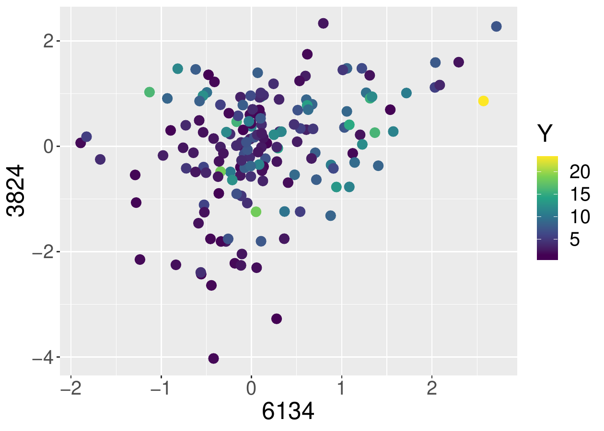
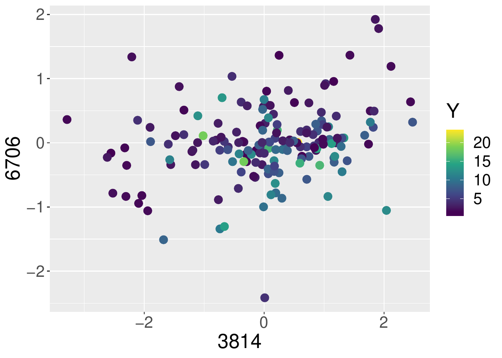

::: article
# Introduction

In a recent paper @cox2017large outline a procedure for regression
analysis when there are more explanatory features than study
individuals, a situation that arises particularly in genomics. Their
emphasis is on understanding the true data-generating mechanism rather
than prediction. The distinction is important. For prediction there may
be several models that are essentially equally effective and any choice
between them is rather arbitrary. On the other hand, since different
well-fitting models typically have different subject-matter
implications, it is insufficient, and often misleading, to report an
arbitrary one. Even if the immediate goal is prediction, a causal
explanation is likely to produce more stable and more generalizable
predictions. A key message of @cox2017large is that if there are several
models that fit the data essentially equally well, one should aim to
specify as many as is feasible. This view is in contraposition to that
implicit in the use of the lasso [@tibshirani1996regression] and other
variable selection methods, which produce a single model effective for
prediction.

The methods of @cox2017large are summarized in Section
[2](#sec:methods). Software implementing these ideas in R has been
written by @hoeltgebaum2018 and is available in the
[*HCmodelSets*](https://CRAN.R-project.org/package=HCmodelSets) package.
The software supports most widely used models of dependency including
the linear model, the linear logistic model for binary data
[@cox1958regression], and the proportional hazards model fitted by
partial likelihood [@cox1972regression; @cox1975partial]. The present
article aims to provide a detailed guide to usage based on simple
examples.

# Methodology {#sec:methods}

Suppose that data are available on $n$ units, for each of which an
outcome $y$ is observed along with a vector $x$ of $d$ potential
explanatory variables, where $d$ is much larger than $n$. For progress
an assumption of sparsity is needed, and the most explicit and
interpretable such assumption is that relatively few of the potential
explanatory features have a real effect, an assumption central to the
formulation of the lasso and similar penalized regression procedures.

@cox2017large suggest a different approach whose aim is essentially a
confidence set of models. There are three stages to a discussion, and
conditionally on the first two, the resulting set of models can be made
to have the formal statistical properties associated with confidence
sets.

In the first stage, an initial reduction is made in which a large number
of variables are discarded on the basis that they have no explanatory
power, or that any explanatory power that they appear to have is
explained away by other variables. The assessment is made by fitting a
suitable low-dimensional regression model several times to each
variable, each time alongside a different set of $k$ companion
variables. A variable is retained for further study if it satisfies a
particular criterion in at least half of the analyses in which it
appears. The sets of variables to be considered together are specified
by a partially balanced incomplete block design [@yates1936new] in which
variable indices are arranged in a hypercube of appropriate dimension.
This initial dimension is determined by $d$ and a constraint on $k$ to
mitigate the effect of dependence between $p$-values, or the associated
test statistics, in any single analysis. Ideally $k$ will be between 10
and 15; see §7 of @battey2018large for a discussion of this choice.
Successive reductions are made using arrangements in successively
lower-dimensional hypercubes, where the criterion for retaining
variables in each stage is guided by the theoretical discussion of
@battey2018large, the need to keep the number of rows, columns, etc., of
successive hypercubes ideally $\leq 15$, and the requirement for a
degree of stability over rerandomization of the variable indices in the
hypercube. Thus, judgement is required at various stages.

On the resulting set of variables, of which there will be roughly 10-20
by construction, an exploratory analysis is performed, of the kind that
is standard in much statistical work. For instance, inspection of
interaction plots or probability plots of $t$ statistics. The objective
is to detect possible nonlinearities or outliers.

All variables retained through the reduction phase and any squared or
interaction terms suggested at the exploratory phase comprise the so
called comprehensive model. All low dimensional subsets of the
comprehensive model are then tested for their compatibility with the
data using a likelihood ratio test, and all models that pass this test
are reported. If, among this set, there are models that contain
interaction terms without the corresponding main effects, the main
effects are added.

For the resulting sets of models to have the formal statistical
properties associated with confidence sets, conditional on the first two
phases, it is necessary to either split the sample, see @cox1975note for
a discussion, or to adjust standard tests of model adequacy in account
of the alternative hypothesis being selected in the light of the data.

# Illustration of usage: a simple reproducible example {#sec:illustrations}

## Some simple data generating processes {#sec:dgp}

We illustrate the functions available in *HCmodelSets*, and their
appropriate usage, using simple examples. These functions include `DGP`,
which can be used to reproduce the simulation study of @battey2018large
and to explore further sensitivities.

``` r
library(HCmodelSets)
dgp = DGP(s=5, a=3, sigStrength=1, rho=0.9, n=100, 
		intercept=5, noise=1, var=1, d=1000, DGP.seed = 2018)
```

This generates normally distributed responses as
$Y_{i}=\mu+x_{i}^{T}\beta + \varepsilon_{i}$ ($i=1,\ldots, n$) where, in
the present example `n = 100`, $\mu$` = intercept = 5`, the
$\varepsilon_{i}$ are independently standard normally distributed and
the $x_{i}$ are realizations of a `d = 1000` dimensional normal random
vector of mean zero and covariance matrix $\Sigma$. The vector of
regression coefficients $\beta$ is sparse in the sense that only `s = 5`
entries are non-zero, equal to `sigStrength = 1`, and $\Sigma$ is such
that a correlation `rho = 0.9` is induced between the corresponding
entries of $x_{i}$, the so called signal variables, and among `a = 3` of
the remaining variables. All potential explanatory variables have
variance `var = 1`. The results of the subsequent analysis can be
reproduced by setting `DGP.seed = 2018` as above, but this argument is
not needed.

With the appropriate modification to its arguments, the `DGP` function
also generates survival times from a proportional hazards model with
Weibull baseline hazard. The hazard function for the $i$th individual is
$$h_i(t;\beta)=\kappa \tau(\tau t)^{\kappa-1}\exp\{x_{i}^{T}\beta\},$$
where $h(t)=\kappa \tau(\tau t)^{\kappa-1}$ is the Weibull hazard
function. From this, the density and distribution functions of survival
times conditional on $x_{i}$ are obtained as
$$\begin{aligned}
	f_{i}(t;\beta)&=&\kappa \tau (\tau t)^{\kappa -1}\exp\{x_{i}^{T}\beta\}\exp\{-e^{x_{i}^{T}\beta}(\tau t)^{\kappa}\}, \\
	F_{i}(t;\beta)&=& \exp\{-e^{x_{i}^{T}\beta}(\tau t)^{\kappa}\}.
\end{aligned}$$

Thus, given covariates $x_{i}$, uncensored survival times from the above
proportional hazards model are generated as
$T_{i}=\{-\log U/(\tau^\kappa e^{x_{i}^{T}\beta})\}^{1/\kappa}$, where
$U$ is a uniform random variable on $(0,1)$.

In the section entitled [4](#sec:simulations) a minor modification to
the previous code is given to generate (potentially censored) survival
time data from this model. Simulation results for the procedure fitted
to both types of data are also reported in the same section.

## Reduction phase

Based on the previous output, typical usage of the function
`Reduction.Phase` is:

``` r
out = Reduction.Phase(X = dgp$X,Y = dgp$Y,
		family = gaussian, seed.HC = 1012)
```

In particular, this arranges the indices of the columns of `dgp$X` in a
hypercube of appropriate dimension, and fits a linear regression model
to each set of variables indexed by the rows, columns, etc., of the
hypercube. Other choices of the argument `family` are illustrated in
section entitled [5](#sec:real). The arrangement of the variable indices
in the hypercube is at random. However, `seed.HC = 1012` allows the
results of the analyses reported here to be reproduced. If the argument
`dmHC` is left unspecified (the recommendation), as in this example, the
dimension of the initial hypercube is set to be the smallest dimension
such that the number of rows, columns etc., is no greater than 15. Thus,
the present example initially has the 1000 variable indices arranged in
a $10\times 10 \times 10$ cube.

Because the comprehensive model obtained from the full data achieves
better fit than an arbitrary model embedding the one to be tested, a
test of adequacy of the smaller model rejects too often in hypothetical
repeated application. It is therefore usually sensible to split the
sample in two and use, say 70%, for the reduction and exploratory
phases, and the remaining 30% for construction of the conditional
confidence sets of models. The appropriate modification to the previous
code, so that only the first 70 observations are used for the reduction
phase, is:

``` r
outSplit1 = Reduction.Phase(X = dgp$X[1:70,],
		Y = dgp$Y[1:70], family = gaussian, seed.HC = 1012)
```

If the initial sample size is rather small and the model to be fitted is
non-Gaussian, the sample size available for the final phase of the
procedure is likely to be too small for the distribution of the maximum
likelihood estimator to be well-approximated by its asymptotic
distribution. Correspondingly, the coverage probability of the
confidence sets of models conditional on the reduction phase is likely
to differ from the nominal value. This could be mitigated through a
Bartlett correction to the likelihood ratio statistic, but this has not
been implemented in the current version of the package. See
@bartlett1937properties [@barndorff1984bartlett] and
@barndorff1994inference (p133, p152--53) for a discussion of the theory
of Bartlett correction.

A strong reassurance over the security of one's conclusions is given if
the set of retained variables does not alter much upon rerandomization
of the arrangement of the variable indices in the (hyper)cube, and this
is a suitably cautious check in practice. Indeed, if the answers so
obtained differ appreciably, the suggestion is that too severe a
reduction has been performed. Thus we consider also the outcome
`outSplit2`, obtained when no argument `seed.HC` is provided, so that
variable indices are arranged in their original order. Some variables
will appear in all or almost all analyses.

``` r
outSplit2 = Reduction.Phase(X = dgp$X[1:70,],
		Y = dgp$Y[1:70], family = gaussian)
```

The outcomes `outSplit1` and `outSplit2` of the previous two analyses
are two lists of variable indices from each successive reduction. Only
the latter reductions are of ultimate interest, but the intermediate
reductions should be inspected to ensure that the number of variables
retained is not so large as to be detrimental to the subsequent stage of
the reduction. In the present example, the final lists of variables are
arrived at by an implementation of the default decision rules, to some
extent guided by the analysis of @battey2018large. These are to retain
variables if they are among the two most significant in at least half
the analyses in which they appear in the first stage reduction, and if
they are significant at the 1% level in at least half the analysis in
which they appear in subsequent reductions. The 1% threshold is
arbitrary and judgement should be exercised if the output of such an
analysis is unreasonable, for instance if too many variables are
retained in any stage of the reduction. This is particularly important
when the initial number of variables is very large, so that variables
are initially arranged in a four or five dimensional hypercube. The
[5](#sec:real) illustrates appropriate use of judgement through the
optional argument `vector.signif` of the `Reduction.Phase` function. The
objective of the reduction phase is to reduce the number of candidate
signal variables to ideally not more than 20, to be subjected to more
detailed joint analysis.

The sorted lists of retained variables using the default decision rules
and the two initial arrangements of variables indices in the cube are:

``` r
v1=sort(outSplit1$List.Selection$`Hypercube with dim 2`$numSelected1)
v2=sort(outSplit2$List.Selection$`Hypercube with dim 2`$numSelected1)
v1
#> [1] 46 51 66 156 229 263 272 319 423 496 531 559 735 804 827 897 929 984 1000
v2
#> [1] 46 156 272 291 319 397 531 559 642 827 897 929 984
```

Of these variables, ten are in common, an appreciable overlap. The
indices of the five true signal variables are contained in `v1` and `v2`
(and their intersection). These are

``` r
dgp$TRUE.idx
#> [1] 46 531 559 897 929 
```

Usage of the other functions in the package is illustrated using the
output of the second analysis, i.e., the variables in `v2`.

An alternative to the reduction phase is to use a deliberately
undertuned lasso fit. The lasso is typically fitted by the coordinate
descent algorithm in general regression settings, or by the least angle
regression algorithm in the linear model. Thus, the practical
implementation of the lasso is essentially forward selection. By
contrast, the reduction phase of @cox2017large is a version of backward
elimination. Both forward selection and backward elimination are likely
to be effective in many cases, although a theoretical elucidation of the
conditions on the design matrix to ensure this has not been attempted.
If the objective is to obtain a superset of the comprehensive model, as
here, backward elimination has advantages in simpler settings. See
[4](#sec:simulations) for an empirical comparison in idealized examples.

The lasso, fitted by coordinate descent as implemented in the R package
[*glmnet*](https://CRAN.R-project.org/package=glmnet), and undertuned to
produce at least the same number of variables as in `v2`, is obtained by

``` r
library(glmnet)
lasso.fit = glmnet(x = dgp$X[1:70,],y = dgp$Y[1:70])
n.coefs = apply(coef(lasso.fit), 2, function(x) length(which(x!=0))) 
idx.coefs = which(n.coefs == length(v2))
if(length(idx.coefs)==0){
	idx.coefs = min(which(n.coefs >= length(v2)))}
lasso.var = which(coef(lasso.fit)[,idx.coefs[1]]!=0) 
```

In the present example, the associated variables excluding the
intercept, are

``` r
lasso.var[-1]-1
#> [1] 40 46  161 341 384 511 531  559  827 897  929  984
```

Seven of these are in common with `v1` and `v2`, including the five
signal variables.

## Exploratory phase

The analysis discussed by @cox2017large is intended to be largely
exploratory, and a key aspect of the procedure is that it allows
informal checks, standard in much statistical work. The function
`Exploratory.Phase` automates some, but by no means all, of what would
typically take place in an exploratory data analysis, and is provided as
a rough guide. Usage of the `silent` argument is illustrated in the
[5](#sec:real) section, in which `silent = FALSE` forces a certain
degree of judgement to be exercised.

The following code detects potentially important squared or interaction
terms among the variables whose indices are stored in `v2`.

``` r
out.exp.phase = Exploratory.Phase(X = dgp$X[1:70,],
		Y = dgp$Y[1:70], list.reduction = v2, 
		family = gaussian, signif = 0.01)
```

Neither squared terms nor interaction terms are suggested as potentially
important.

## Model selection phase

The final stage of the procedure is to test all low-dimensional subsets
of the comprehensive model for compatibility with the data. The
comprehensive model is that containing all variables from the reduction
phase and any squared or interaction terms suggested at the exploratory
phase, of which there are none in the present example. Usage is:

``` r
out.MS = ModelSelection.Phase(X = dgp$X[71:100,],
		Y = dgp$Y[71:100], list.reduction = v2, signif = 0.01)
```

The appropriate modification to the arguments of this function when
squared or interaction terms are to be considered is illustrated in the
[5](#sec:real) section.

The above finds all models of dimension 5 or smaller whose likelihood
ratio test against the comprehensive is not rejected at the
`signif = 0.01` significance level. The optional argument `modelSize`
specifies the maximum size of the models to be searched over. The true
model appears in the set of all well-fitting models identified, i.e., in
the list of models displayed by `out.MS$goodModels$‘Model Size 5‘`. All
models that are found to be compatible with the data should be reported.
Specifically, the output of the function `ModelSelection.Phase` should
be used to produce (sometimes large) tables like those appearing in the
supplementary file of @cox2017large, available at:
<https://www.pnas.org/content/pnas/suppl/2017/07/20/1703764114.DCSupplemental>

Provided that the sample is split as in the example above, such tables
constitute a conditional confidence set of models. Conditional on the
reduction phase, these have, in principle, exact nominal coverage in the
linear regression model and asymptotically nominal coverage in more
general regression models fitted by maximum likelihood.

# Illustration of performance in some idealized settings {#sec:simulations}

The present section explores empirical sensitivities of the procedure to
modifications to the data generating mechanism. Several aspects are of
interest: sensitivity of the reduction phase as described by
@cox2017large (a version of backward elimination) and of the undertuned
lasso (a version of forward selection) in terms of retaining the true
model in its entirety; efficacy of the model confidence sets in terms of
their coverage probabilities and size. Full sample and split sample
properties of both approaches are considered.

It is an open problem to elucidate the conditions on the design matrix
and signal strength in order for the procedure based on traversal of
successively lower dimensional hypercubes to retain a reasonably sized
superset of the true set of signal variables with quantifiable high
probability. Some related discussion for the undertuned lasso is given
by @buhlmann2011statistics chapter 7 and @belloni2013least.

In the tables below, $\mathcal{S}$ is the true set of signal variables,
$\widehat{\mathcal{S}}$ is the set of variables surviving the reduction
phase, $\mathcal{M}$ is the set of low-dimensional models whose
likelihood ratio test against the comprehensive model is not rejected at
the 1% level. In all the simulation experiments considered, the first
stage of the reduction phase arranges the 1000 variables in a
$10\times10\times 10$ cube and retains variables if they are among the
two most significant in at least two of the three analyses in which they
appear. The second stage reduction is tuned so that approximately 10-20
variables are retained through the reduction phase, however the
associated threshold for the significance tests is fixed across Monte
Carlo replications so that the number of retained variables is random.
Results for the linear model with a sample of size $n=100$ are reported
in Table 1, where 'CB' is the procedure of @cox2017large implemented
using *HCmodelSets* package. The threshold of the second-stage
significance test is 0.1%.

  ---------- ---------- -------- ---------------------- -------------------------------------------------- --------------- ------------- ------------- ---------------------------------- ------------- ------------------------------------------------- -------------
                                                         pr($\mathcal{S}\subseteq \widehat{\mathcal{S}}$)                                               pr($\mathcal{S}\in \mathcal{M}$)                 $\mathbb{E}|\mathcal{M}\backslash \mathcal{S}|$  

   $v_{S0}$   $v_{C0}$   $\rho$   [signal]{.underline}                      undertuned                       undertuned         CB            CB                       CB                      CB                              CB                              CB

                                         noise                             lasso (full)                     lasso (split)     (full)        (split)                  (full)                  (split)                         (full)                          (split)

      1          1        0.9              1                               1.00 (0.04)                       0.99 (0.08)    1.00 (0.00)   1.00 (0.00)             0.57 (0.49)              0.98 (0.14)                     6.16 (7.25)                     16.3 (28.6)

      1          1        0.9             0.6                              0.94 (0.24)                       0.84 (0.37)    0.98 (0.15)   0.83 (0.37)             0.41 (0.49)              0.83 (0.38)                     4.93 (4.82)                     16.1 (31.5)

      1          1        0.5              1                               0.92 (0.27)                       0.87 (0.34)    1.00 (0.00)   1.00 (0.00)             0.56 (0.50)              0.98 (0.13)                     4.63 (5.89)                     8.73 (18.7)

      1          1        0.5             0.6                              0.85 (0.36)                       0.75 (0.43)    0.99 (0.11)   0.85 (0.35)             0.39 (0.49)              0.84 (0.36)                     2.29 (2.73)                     8.68 (19.2)

      1          3        0.9              1                               1.00 (0.04)                       0.99 (0.08)    1.00 (0.04)   0.99 (0.08)             0.62 (0.49)              0.96 (0.19)                     24.6 (24.8)                     77.2 (126)

      1          3        0.9             0.6                              0.92 (0.27)                       0.79 (0.41)    0.97 (0.16)   0.81 (0.39)             0.48 (0.50)              0.79 (0.41)                     22.7 (18.4)                     44.6 (78.1)

      1          3        0.5              1                               0.97 (0.16)                       0.92 (0.27)    1.00 (0.00)   1.00 (0.00)             0.59 (0.49)              0.98 (0.13)                     10.9 (14.0)                     14.3 (36.1)

      1          3        0.5             0.6                              0.89 (0.31)                       0.82 (0.39)    0.97 (0.17)   0.87 (0.34)             0.36 (0.48)              0.85 (0.35)                     3.66 (5.01)                     10.3 (25.0)

      5          1        0.9              1                               0.98 (0.15)                       0.95 (0.21)    1.00 (0.00)   1.00 (0.00)             0.94 (0.23)              0.98 (0.13)                     7.15 (7.19)                     80.4 (85.7)

      5          1        0.9             0.6                              0.79 (0.40)                       0.57 (0.50)    1.00 (0.04)   0.98 (0.15)             0.89 (0.31)              0.96 (0.19)                     40.9 (35.7)                      146 (149)

      5          1        0.5              1                               1.00 (0.04)                       0.98 (0.15)    1.00 (0.00)   1.00 (0.00)             0.96 (0.20)              0.99 (0.11)                     0.01 (0.10)                     8.64 (13.0)

      5          1        0.5             0.6                              0.99 (0.10)                       0.96 (0.21)    1.00 (0.00)   0.99 (0.10)             0.88 (0.32)              0.98 (0.15)                     1.18 (2.04)                     51.6 (64.2)

      5          3        0.9              1                               0.99 (0.11)                       0.95 (0.22)    1.00 (0.00)   1.00 (0.00)             0.94 (0.24)              0.98 (0.15)                     16.7 (18.4)                      212 (202)

      5          3        0.9             0.6                              0.77 (0.42)                       0.51 (0.50)    1.00 (0.06)   0.96 (0.20)             0.86 (0.35)              0.94 (0.24)                     101 (88.2)                       418 (351)

      5          3        0.5              1                               1.00 (0.00)                       1.00 (0.00)    1.00 (0.00)   1.00 (0.00)             0.96 (0.20)              0.98 (0.14)                     0.01 (0.10)                     20.0 (35.0)

      5          3        0.5             0.6                              1.00 (0.06)                       0.98 (0.13)    1.00 (0.00)   0.99 (0.12)             0.89 (0.32)              0.96 (0.20)                     2.85 (4.03)                      123 (137)
  ---------- ---------- -------- ---------------------- -------------------------------------------------- --------------- ------------- ------------- ---------------------------------- ------------- ------------------------------------------------- -------------

  : Table 1: Monte Carlo estimates and their estimated standard errors
  (in parentheses) from 500 Monte Carlo draws from the linear model with
  parameter combinations as displayed. In the split sample case, 70
  observations are used for reduction and 30 for construction of the
  confidence sets of models.

The same experiment is performed on survival time data, generated
according to a proportional hazards model with Weibull baseline hazard
as described in the section entitled [3.1](#sec:dgp). The survival times
are censored, with the censoring times generated from an exponential
distribution of rate $0.1$. In particular, our previous code fragment is
modified so that in each Monte Carlo replication, data are generated as:

``` r
dgp = DGP(s=Vs0, a=Vc0, sigStrength=sigNoise, rho=corr, n=150, intercept=0, 
		DGP.seed = (n.rand + cont.error),
		var=1, d=1000, type.response = "S", scale=1, shape=1, rate=0.1)
```

adopting the values `c(1,5)` for `Vs0`, `c(1,3)` for `Vc0`, `c(0.9,0.5)`
for `corr` and `c(1,0.6)` for `sigNoise` as previously done for the
linear theory model in Table 1.

In the notation of Section [3.1](#sec:dgp), the parameters of the
Weibull distribution are set as $\tau$` = scale = 1`, and
$\kappa$` = shape = 1`. Knowledge of the baseline hazard is ignored and
the data are fit by partial likelihood as implemented in the `coxph`
function of the
[*survival*](https://CRAN.R-project.org/package=survival) package.
Summary statistics over 500 Monte Carlo replications are reported in
Table 2. The threshold of the second-stage significance test is 0.25%.

  ---------- ---------- -------- ---------------------- -------------------------------------------------- --------------- ------------- ------------- ---------------------------------- ------------- ------------------------------------------------- -------------
                                                         pr($\mathcal{S}\subseteq \widehat{\mathcal{S}}$)                                               pr($\mathcal{S}\in \mathcal{M}$)                 $\mathbb{E}|\mathcal{M}\backslash \mathcal{S}|$  

   $v_{S0}$   $v_{C0}$   $\rho$   [signal]{.underline}                      undertuned                       undertuned         CB            CB                       CB                      CB                              CB                              CB

                                         noise                             lasso (full)                     lasso (split)     (full)        (split)                  (full)                  (split)                         (full)                          (split)

      1          1        0.9              1                               1.00 (0.00)                       1.00 (0.00)    1.00 (0.00)   1.00 (0.00)             0.03 (0.17)              0.95 (0.23)                     54.1 (92.2)                     1273 (1490)

      1          1        0.9             0.6                              0.99 (0.12)                       0.94 (0.24)    1.00 (0.04)   0.97 (0.17)             0.00 (0.04)              0.89 (0.31)                     15.6 (57.3)                     1863 (2264)

      1          1        0.5              1                               1.00 (0.00)                       1.00 (0.00)    1.00 (0.00)   1.00 (0.00)             0.04 (0.21)              0.95 (0.21)                     57.4 (97.4)                     962 (1085)

      1          1        0.5             0.6                              1.00 (0.00)                       0.98 (0.13)    0.99 (0.08)   0.96 (0.20)             0.00 (0.00)              0.90 (0.31)                     13.0 (31.6)                     1734 (2374)

      1          3        0.9              1                               1.00 (0.00)                       0.99 (0.09)    1.00 (0.00)   1.00 (0.04)             0.07 (0.25)              0.95 (0.22)                      102 (209)                      2468 (2738)

      1          3        0.9             0.6                              0.97 (0.18)                       0.90 (0.30)    0.98 (0.13)   0.95 (0.21)             0.01 (0.09)              0.91 (0.29)                     45.0 (98.5)                     3182 (3700)

      1          3        0.5              1                               1.00 (0.00)                       1.00 (0.00)    1.00 (0.00)   1.00 (0.00)             0.07 (0.25)              0.95 (0.22)                      105 (158)                      1094 (1090)

      1          3        0.5             0.6                              1.00 (0.00)                       1.00 (0.06)    1.00 (0.00)   0.97 (0.17)             0.00 (0.04)              0.91 (0.28)                     18.6 (51.1)                     1955 (2859)

      5          1        0.9              1                               0.98 (0.15)                       0.90 (0.30)    1.00 (0.00)   1.00 (0.04)             0.78 (0.41)              0.91 (0.29)                     30.9 (46.5)                     916 (1165)

      5          1        0.9             0.6                              0.79 (0.41)                       0.52 (0.50)    1.00 (0.00)   0.99 (0.08)             0.59 (0.49)              0.94 (0.24)                      136 (180)                      2216 (2390)

      5          1        0.5              1                               1.00 (0.00)                       1.00 (0.00)    1.00 (0.00)   1.00 (0.00)             0.80 (0.40)              0.91 (0.28)                     0.00 (0.09)                     59.0 (118)

      5          1        0.5             0.6                              1.00 (0.00)                       0.99 (0.12)    1.00 (0.00)   1.00 (0.04)             0.54 (0.50)              0.90 (0.31)                     1.46 (4.22)                      382 (572)

      5          3        0.9              1                               0.98 (0.13)                       0.86 (0.35)    1.00 (0.00)   1.00 (0.04)             0.80 (0.40)              0.86 (0.35)                     46.4 (66.2)                     1383 (1682)

      5          3        0.9             0.6                              0.71 (0.45)                       0.48 (0.50)    1.00 (0.00)   0.99 (0.11)             0.63 (0.48)              0.90 (0.30)                      242 (310)                      2846 (2603)

      5          3        0.5              1                               1.00 (0.00)                       1.00 (0.00)    1.00 (0.00)   1.00 (0.00)             0.83 (0.38)              0.87 (0.34)                     0.09 (1.03)                     73.4 (175)

      5          3        0.5             0.6                              1.00 (0.00)                       0.99 (0.11)    1.00 (0.00)   1.00 (0.04)             0.59 (0.49)              0.90 (0.30)                     2.35 (5.25)                      575 (925)
  ---------- ---------- -------- ---------------------- -------------------------------------------------- --------------- ------------- ------------- ---------------------------------- ------------- ------------------------------------------------- -------------

  : Table 2: Monte Carlo estimates and their estimated standard errors
  (in parentheses) from 500 Monte Carlo draws from the Weibull
  proportional hazards model with parameter combinations as displayed.

The results are qualitatively similar to those for the linear model. The
main difference is that the coverage probability of the confidence sets
of models, conditional on all variables being retained through the first
stage reduction, is lower than the 0.99 nominal level. The reason is
that the distribution theory underpinning the associated likelihood
ratio tests is, in principle, exact for the linear model and is at best
asymptotically valid for most other types of regression model. This
could be mitigated through a Bartlett correction to the likelihood ratio
statistic, but this has not been implemented in the current version of
the package. The results of Table 2 are for $n=150$ with 100
observations used for reduction and 50 for construction of confidence
sets of models in the split sample case. As mentioned previously,
adjustments to the likelihood ratio statistic to improve the $\chi^2$
approximation to its distribution are possible, but these have not been
implemented in *HCmodelSets*.

# Real example {#sec:real}

We now illustrate the use of *HCmodelSets* to construct conditional
confidence sets of models for the survival times of lymphoma patients.
The data[^1] are from the study of @alizadeh2000distinct and also used
by @simon2011regularization. There are measurements on $d=7399$ genetic
variants for $n=240$ patients. The indices of these variables are
arranged in a 4 dimensional hypercube, which is the default starting
dimension. As before, the data are divided into those to be used in the
reduction and exploratory phases and those to be used in the model
selection phases.

``` r
data(LymphomaData)
x = t(patient.data$x)
y = patient.data$time
status = patient.data$status
# Data Splitting
X.in = x[1:168,]
Y.in = y[1:168]
status.in = status[1:168]
Y = cbind(Y.in,status.in)
X.out = x[169:240,]
Y.out = y[169:240]
status.out = status[169:240] 
```

The first stage decision rule is to retain all variables that are among
the two most significant in at least two of the three analyses in which
they appear. The decision rules for the remaining reduction stages are
specified by the argument `vector.signif` in the `Reduction.Phase`
function:

``` r
library(HCmodelSets)
out.1 = Reduction.Phase(X = X.in,Y = Y,Cox.Hazard = TRUE,
		vector.signif = c(2,0.0025,0.001), seed.HC = 2)
```

The choice `vector.signif = c(2,0.0025,0.001)` means that the second
stage decision rule retains variables if they are significant at the
0.25% level in at least two of the three analyses in which they appear
and the third stage decision rule retains variables if they are
significant at the 0.1% level in at least one of the two analyses in
which they appear. This choice was determined by checking that the
numbers of variables retained through each stage of the reduction is
sensible, that the number of variables ultimately retained is within the
target range, and that the outcome is not too sensitive to changes to
the original arrangement of the variable indices in the hypercube. The
set of variables ultimately retained is

``` r
v1 = out.1$List.Selection$`Hypercube with dim 2`$numSelected1
sort(v1)
#> [1] 1188 1660 1825 2437 2879 2902 3172 3177 3800 3814 3822 3824 5027 6134 6706 6896 7357 
```

Rerandomizing the variable indices in the hypercube produces the set of
variables

``` r
out.2 = Reduction.Phase(X = X.in,Y = Y,Cox.Hazard = TRUE,
		vector.signif = c(2,0.0025,0.001), seed.HC = 11)
v2 = out.2$List.Selection$`Hypercube with dim 2`$numSelected1
sort(v2)
#> [1] 1188 1675 1714 1825 1984 2437 2900 3172 3800 3811 3818 3819 3822 3833  4126  
	5027  6134  6706  7069  7357 
```

Ten of the variables in the original list of 17 are also in the second
list. The lasso, undertuned to select at least the same number of
variables as in `v1` produces an overlap of 8 variables with `v1`,
namely,

``` r
library(glmnet)
lasso.fit = glmnet(X.in, Surv(Y.in,status.in), 
		family = "cox", alpha = 1)
n.coefs = apply(coef(lasso.fit), 2, function(x) length(which(x!=0)))
idx.coefs = which(n.coefs == length(v1))
if(length(idx.coefs)==0){
	idx.coefs = min(which(n.coefs >= v1))}
lasso.var = which(coef(lasso.fit)[,idx.coefs[1]]!=0)
lasso.var
#> [1] 394 1072 1188 1456 1662 1681 1825 2902 3172 3180 3801
	3822 4882 5027 6134 6896 7357 
```

The variable 3801, found by the lasso, has empirical correlation greater
than 0.9 with variable 3800 in `v1` and `v2`.

The exploratory phase now uses significance tests as an informal guide
to suggesting potential squared or interaction terms. For each of the
variables in `v1`, a regression is fitted by partial likelihood with its
squared term added. Extreme $t$ statistics on squared terms suggest a
potentially important effect. The linear interactions of pairs of
variables are checked in a similar way, with `silent = FALSE` in
`Exploratory.Phase` producing plots of the response variable as a
function of pairs of variables for any interaction suggested as
potentially important. Example usage is

``` r
out.exp.phase =  Exploratory.Phase(X=X.in,Y=Y,
		list.reduction = v1, silent = FALSE, 
		Cox.Hazard = TRUE, signif=0.01)                                           
```

which produces a sequence of plots and questions of the form

``` r
Discard interaction term? [Y/N].
```

For illustrative purposes, we answer `N` (no) to the questions for which
the plots are displayed in Figure 1, although the suggestion from an
interaction plot ought to be much stronger to justify an interaction's
inclusion. See @cox2017large for an example.

<figure id="iteractions">
<p></p>
<figcaption>Figure 1: Interaction plots of variables (6134, 3824) and
(3814, 6706)</figcaption>
</figure>

Thus we have 20 variables in all, the seventeen variables contained in
`v1`, one squared term contained in
`out.Exploratory.Phase$mat.select.SQ` and two interaction terms given by
the rows of `out.Exploratory.Phase$mat.select.INTER`. The analysis
proceeds as follows:

``` r
sq.terms = out.exp.phase$mat.select.SQ
in.terms = out.exp.phase$mat.select.INTER
out.MS = ModelSelection.Phase(X = X.out,
		Y = cbind(Y.out,status.out), 
		list.reduction = v1,Cox.Hazard = TRUE, sq.terms = sq.terms, 
		in.terms = in.terms,signif = 0.05, modelSize = 7)
```

Sets of well-fitting models of different sizes, up to `modelSize = 7`,
are contained in the list `out.MS$goodModels`. For instance,
`out.MS$goodModels$‘Model Size 2‘` produces a list of well-fitting
models of size 2. If there are models for which an interaction term is
present without the corresponding main effects, the main effects are
added. Thus, there are 23 models of size 2, statistically
indistinguishable from the comprehensive model at the 5% significance
level.

Of all the well-fitting models identified 72% involve the variable 3824
and 70% involve the variable 6134. A very small proportion of models
contain neither 3814 nor 6134. Indeed variables 3814 and 6134 occur
frequently, but rarely together. Table 3 reports the proportion of
models containing variable A, given that they do not contain variable B,
say. While one should be cautious over overinterpretting the output,
these give an indication of which variables might be substitutes for one
another. The variables have been ordered, from left to right and from
top to bottom, in order of their frequency of appearance in the sets of
models. For typographical reasons their indices have been recoded as:
1=1188; 2=1660; 3=1825; 4=2437; 5=2879; 6=2902; 7=3172; 8=3177; 9=3800;
10=3814; 11=3822; 12=3824; 13=5027; 14=6134; 15=6706; 16=6896; 17=7357;
18=squared term on 3814; 19=interaction between 6134 and 3824;
20=interaction between 3814 and 6706. For an example of other summary
tables of potential interest, see the supplementary file of
@cox2017large.

  ---- ------ ------ ------ ------ ------ ------ ------ ------ ------ ------ ------ ------ ------ ------ ------ ------ ------ ------ ------ ------
   A     B                                                                                                                                  

         12     14     19     10     4      15     20     3      7      9      18     1      11     17     13     5      6      16     2      8

   12          0.26   0.24   0.87   0.81   0.84   0.76   0.75   0.77   0.74   0.72   0.73   0.73   0.72   0.72   0.71   0.71   0.71   0.71   0.70

   14   0.22          0.20   0.85   0.80   0.83   0.75   0.74   0.75   0.73   0.71   0.72   0.71   0.70   0.71   0.70   0.69   0.69   0.69   0.69

   19   0.00   0.00          0.82   0.75   0.79   0.69   0.67   0.70   0.65   0.63   0.65   0.63   0.62   0.63   0.61   0.61   0.61   0.61   0.60

   10   0.75   0.73   0.73          0.47   0.35   0.37   0.45   0.46   0.44   0.47   0.47   0.48   0.47   0.47   0.48   0.48   0.48   0.47   0.48

   4    0.62   0.63   0.63   0.45          0.41   0.48   0.48   0.40   0.46   0.47   0.43   0.43   0.45   0.44   0.43   0.44   0.44   0.45   0.44

   15   0.68   0.68   0.68   0.31   0.40          0.31   0.42   0.43   0.43   0.42   0.43   0.43   0.44   0.44   0.44   0.44   0.45   0.44   0.44

   20   0.48   0.47   0.48   0.28   0.43   0.26          0.40   0.40   0.40   0.40   0.39   0.39   0.39   0.40   0.39   0.39   0.39   0.39   0.39

   3    0.44   0.44   0.44   0.34   0.41   0.36   0.38          0.38   0.39   0.37   0.37   0.37   0.37   0.36   0.37   0.37   0.37   0.38   0.37

   7    0.48   0.48   0.48   0.37   0.32   0.37   0.38   0.38          0.39   0.37   0.37   0.38   0.38   0.38   0.38   0.37   0.37   0.36   0.37

   9    0.38   0.38   0.38   0.30   0.35   0.34   0.35   0.35   0.35          0.35   0.34   0.32   0.34   0.34   0.34   0.33   0.34   0.34   0.34

   18   0.33   0.34   0.32   0.33   0.37   0.32   0.33   0.33   0.32   0.34          0.34   0.33   0.33   0.33   0.33   0.33   0.33   0.33   0.33

   1    0.35   0.35   0.35   0.32   0.31   0.32   0.32   0.32   0.32   0.32   0.33          0.32   0.32   0.33   0.32   0.32   0.32   0.32   0.32

   11   0.32   0.31   0.30   0.32   0.28   0.29   0.30   0.30   0.31   0.29   0.30   0.31          0.30   0.30   0.30   0.31   0.30   0.30   0.30

   17   0.29   0.29   0.28   0.30   0.30   0.30   0.29   0.30   0.30   0.30   0.29   0.30   0.30          0.29   0.30   0.30   0.30   0.30   0.30

   13   0.30   0.30   0.28   0.30   0.29   0.30   0.31   0.28   0.30   0.30   0.30   0.31   0.30   0.29          0.29   0.30   0.29   0.30   0.30

   5    0.25   0.25   0.24   0.28   0.26   0.28   0.27   0.27   0.28   0.28   0.27   0.27   0.28   0.28   0.27          0.28   0.27   0.27   0.27

   6    0.24   0.23   0.22   0.28   0.26   0.27   0.26   0.26   0.26   0.26   0.27   0.27   0.27   0.27   0.27   0.27          0.27   0.27   0.27

   16   0.23   0.23   0.22   0.27   0.25   0.28   0.26   0.26   0.25   0.26   0.26   0.26   0.26   0.26   0.26   0.26   0.26          0.26   0.26

   2    0.23   0.23   0.21   0.27   0.27   0.27   0.26   0.27   0.25   0.26   0.26   0.26   0.26   0.26   0.26   0.26   0.26   0.26          0.26

   8    0.20   0.20   0.18   0.26   0.24   0.26   0.24   0.24   0.24   0.24   0.24   0.24   0.24   0.24   0.25   0.24   0.24   0.25   0.25  
  ---- ------ ------ ------ ------ ------ ------ ------ ------ ------ ------ ------ ------ ------ ------ ------ ------ ------ ------ ------ ------

  : Table 3: The proportion of the models in the confidence set not
  containing variable $B$ that contain variable $A$, i.e.
  $|\mathcal{M}(A\cap \neg B)|/|\mathcal{M}(\neg B)|$, where
  $\mathcal{M}(\neg B)$ is the set of models in the confidence set that
  do not contain variable $B$.

# Summary {#sec:summary}

In the context of regression with a large number of potential
explanatory variables @cox2017large emphasize that if there are several
statistically indistinguishable explanations of the data, one should aim
to specify as many as is feasible, a view that is in contraposition to
that implicit in the use of the lasso and similar methods. The approach
of @cox2017large entails reducing the set of variables to those that
potentially have an individual effect on the response, followed by more
detailed joint exploration, requiring judgement at various stages. We
have discussed the R implementation of these new ideas in *HCmodelSets*.
Matlab code is also available at
<http://wwwf.imperial.ac.uk/~hbattey/softwareCube.html>.

### Acknowledgments {#acknowledgments .unnumbered}

We thank D. R. Cox for valuable comments and M. Avella Medina for a
helpful reference. The work of H. H. Hoeltgebaum was fully supported by
the National Council for Research and Development, CNPq, Ministry of
Science and Technology, Brazil. The development of *HCmodelSets* and the
work of H. S. Battey was supported by a UK Engineering and Physical
Sciences Research Fellowship (grant number EP/P002757/1). We also would
like to thank the anonymous referees for helpful comments.
:::

[^1]: Avaliable at <https://www.jstatsoft.org/article/view/v039i05>
