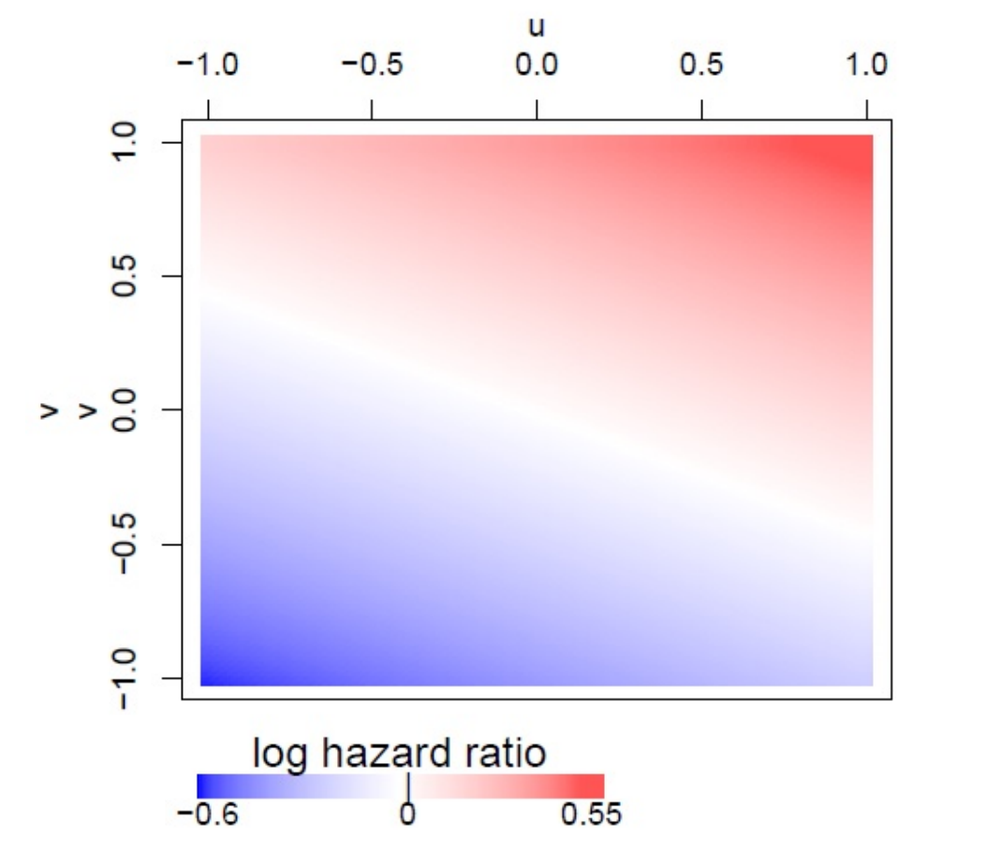
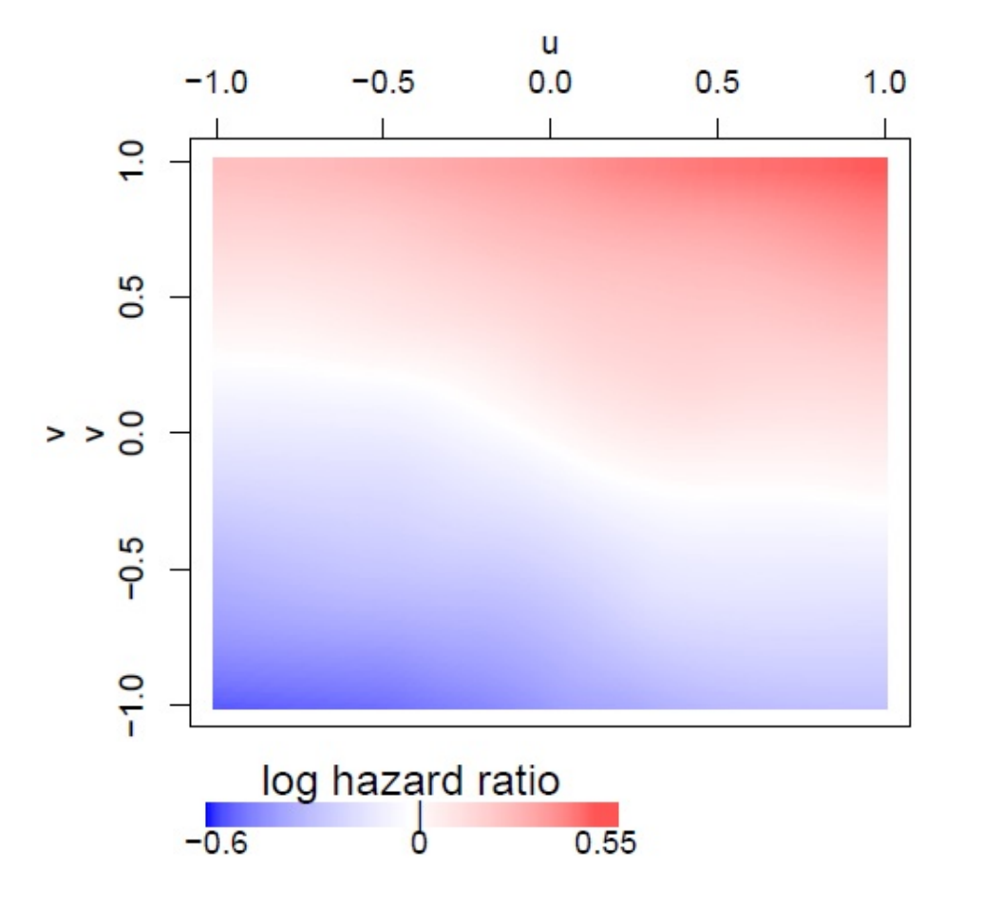
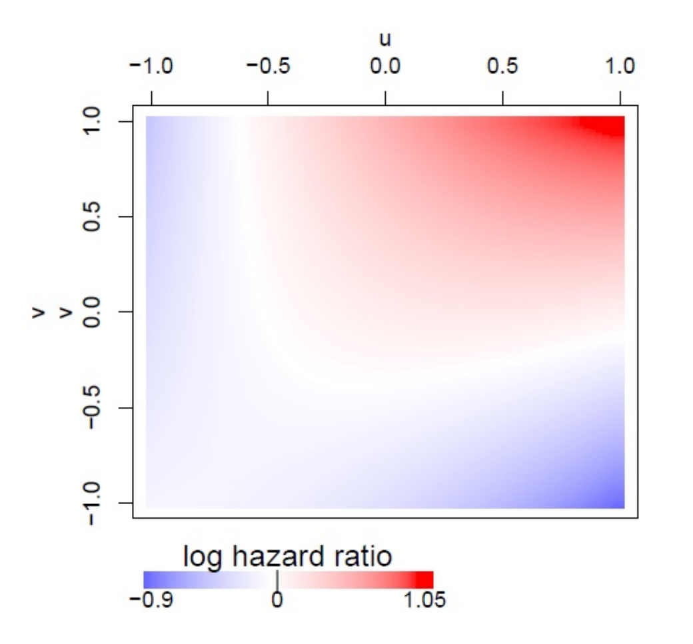
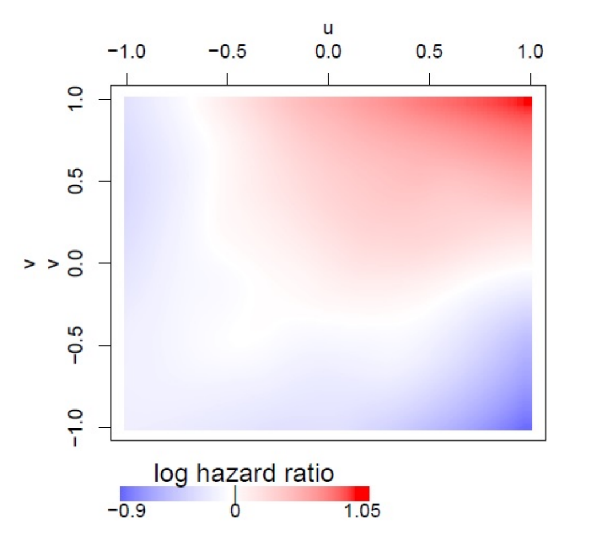
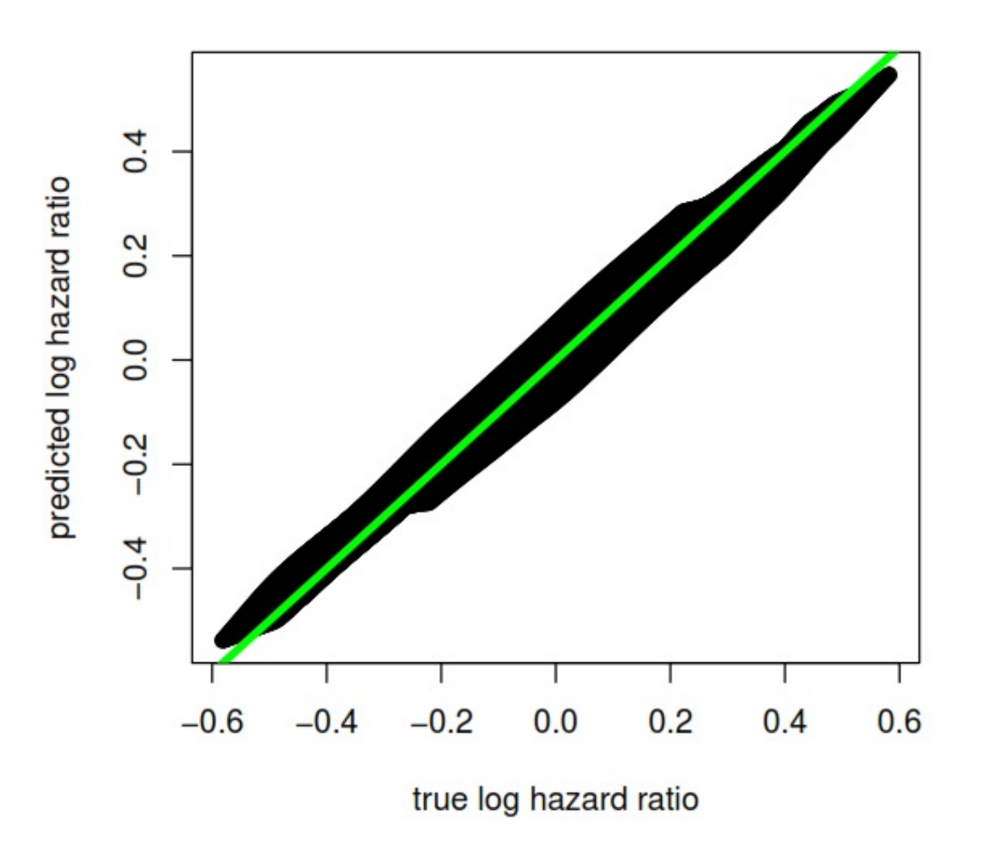
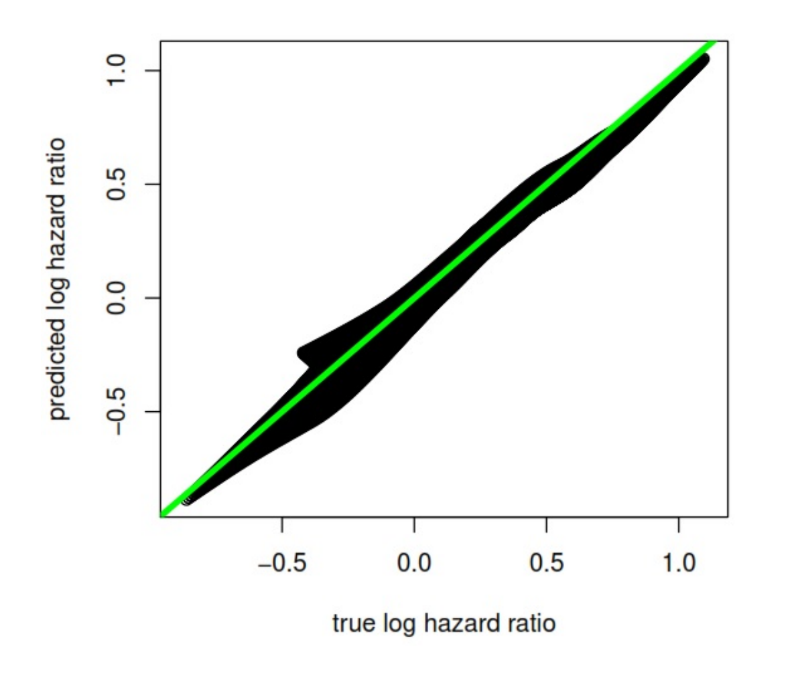

# Introduction

In spatial epidemiology studies, mapping crude and adjusted spatial
distributions of disease risk is a useful tool for identifying risk
factors of public health concern [@Elliott]. The underlying (or crude)
geographic pattern of disease is often what is observed by public health
practitioners, but these patterns may be due to important
spatially-varying predictors such as socioeconomic status,
race/ethnicity, or environmental exposures. Individual-level spatial
analyses can provide insight regarding disease risk by adjusting for
these variables without aggregation bias (also known as ecological
bias). Disease risks often have complex spatial patterns that are
subject to high variability due to sparsity. Smoothing provides an
efficient method to deal with these issues by borrowing strength from
adjacent observations to reduce variability while allowing for
non-parametric flexibility when estimating the spatial distribution of
risk. Generalized additive models (GAMs), originally proposed by
@Hastie, are common model-based approaches for mapping point-based
epidemiologic
data[@Webster; @Vieira; @Baker; @Akullian; @Bristow; @Hoffman]. GAMs
provide a unified statistical framework that allows for the adjustment
of individual-level risk factors when evaluating spatial variability in
a flexible way. The flexibility provided by GAMs, together with the
intuitive nature of many smoothing techniques, make them an ideal choice
for modeling complex spatial associations.\
There are a number of `R` packages implementing GAMs and related models
[@R]. The *gam* package [@GAM] provides an implementation of the GAM
framework of @Hastie by providing two types of commonly used smoothing
methods: cubic loess smoothing splines for univariate variables and
local kernel smoothing (LOESS) for multivariate variables. The
*mgcv*[@mgcv; @gamm] package implements cubic smoothing splines and
tensor product smooths, an extension of cubic splines to
multi-dimentions. *mgcv* also provides various criterion to aid in the
selection of model complexity via the choice of effective degrees of
freedom and provides functions to fit generalized additive mixed effects
models (GAMMs) for correlated data. Package *gamlss* [@gamlss; @gamlss2]
implements an extension of the GAM that incorporates selected
distributions outside of the exponential family. With respect to
censored survival data, parametric additive models can be fit using both
the *gamlss.cens* package [@gamlsscens] and the *VGAM* package [@vgam].
Bayesian inferences for the spatial analysis of survival data based on
the parametric proportional hazards model are implemented in package
*spatsurv*[@spatsurv; @spatsurv2]. However, parametric models assume a
full distribution of the survival times, and misspecifying the
distribution may yield bias for estimates. Cox proportional hazards
models, which are semi-parametric without specifying a form for
underlying hazard function, are more robust for survival analysis
including mulitple adjusted variables.\
A variety of `R` packages incorporate Cox proportional hazards models
and spatial smoothing term. The R interface to
*BayesX*[@BayesX; @BayesX2; @BayesX3], *R2BayesX*[@r2bayesX], provides
survival spatial analysis based on structured additive models (STAR)
without specifying the baseline hazard. *mboost*[@mboost] implements
boosting for optimizing penalized likehood function, and as an extention
of *mboost*, *gamboostMSM*[@gamboostMSM] provides estimates for
multistate models. *mgcv* also incorporates `’coxph’` family in the
model fitting. However these packages use cubic, B- and/or P- splines as
smoothing methods; none offer LOESS. LOESS adapts to varying data
densities by defining a local neighborhood based on a fixed proportion
(\"span\") of the observations; this is especially useful for spatial
analyses as population densities typically vary within any study
region.\
Therefore, none of the above packages provide an implementation of the
Cox proportional hazards additive model for censored survival data that
allows for multivariate loess smoothing of covariates such as
geolocation parameters, despite the fact that spatial effect estimation
in the context of survival outcomes is of great interest in epidemiology
studies [@Henderson; @Bristow]. Moreover, displaying spatial predictions
on a map with irregular geographic boundaries is a non-trivial effort,
often handled by exporting statistical predictions to separate
specialized geographic information system (GIS) software such as
`ArcGIS` that requires a paid user license [@Webster; @Vieira] or by
omitting geographic boundaries altogether[@Akullian]. At best, these
limitations and complexities pose a significant barrier to researchers
not already well versed in both GAMs and GIS methods and at worst may
lead to reporting errors due to the inefficient transfer of estimates
between separate software packages.\
To address the above deficiencies of current software,
[*MapGAM*](https://CRAN.R-project.org/package=MapGAM) was built to
provide a single `R` package that allows for estimating, predicting, and
visualizing covariate-adjusted spatial effects using individual-level
data. The package estimates covariate-adjusted spatial associations with
a univariate or survival outcome via GAMs that include a non-parametric
bivariate smooth term of geolocation parameters. Estimation and mapping
methods are implemented for continuous, discrete, and right-censored
survival data. In addition, support functions for efficient control
sampling in case-control studies and inferential procedures for testing
global and pointwise spatial effects are implemented. We have found that
a unified system for estimating and visualizing covariate-adjusted
spatial effects on outcomes arising from the most commonly encountered
epidemiologic study designs greatly facilitates efficient and
reproducible analyses in these settings.\
This article serves as an introduction and illustration of the *MapGAM*
package. The remainder of the manuscript is organized as follows:
Section [2](#gam) provides an overview of the methodology implemented in
*MapGAM* for estimating and visualizing spatial effects in the context
of a generalized additive model for continuous, binary or count outcome
data. An illustrative example using *MapGAM* to analyze hypothetical
case-control data from the state of Massachusetts is also provided.
Section [3](#gamcox) considers estimating spatial effects on
right-censored survival times via a Cox proportional hazards additive
model. The estimation procedures implemented in *MapGAM* are provided
and a brief simulation study considers the performance of the proposed
fitting methods in various settings. In Section [4](#inference) we
consider inference procedures associated with spatial modeling and
illustrate how to use the package to perform a global test of a spatial
effect and calculate confidence intervals for predictions at each
spatial prediction point. Section [5](#discussion) concludes with
discussion of the utility of the *MapGAM* package and considers possible
extensions of the package in future research.

# Spatial effect on a univariate outcome {#gam}

We consider estimating and visualizing covariate-adjusted spatial
effects in the context of a GAM for continuous, binary or count outcome
data. The spatial effect can be estimated by fitting a GAM model with a
bivariate smoothing term for the two geolocation parameters. Typical
models will also include additional adjustment for demographic
characteristics and other risk factors that may serve as potential
confounding factors in the association between location and the outcome
of interest.

## Generalized additive model {#gam_model}

We consider modeling observations that are distributed on a map with
$u_i$ and $v_i$ denoting the geographical parameters for the $i^{th}$
observation, $i=1,\dots,n$. Let $Y_i$ denote the outcome and $X_i$
denote a vector of adjustment covariates. Further suppose that the
distribution of the outcome belongs to the exponential family. The GAM
then assumes that
$$g(\mu_i) =\eta_i= \beta_0 + X_i^\top\beta +f(u_i, v_i),$$
where $g(\cdot)$ is the link function for mean of the outcome
$\mu_i =\mathbb{E}[Y_i]$ and the variance of the outcome is defined by
the assumed probability model and denoted as
$V_i \equiv Var(Y_i) = V(\mu_i, \phi)$; a function of the mean and
nuisance parameter $\phi$. $\beta$ denotes a vector of coefficients
associated with adjustment covariate $X_i$ and $f(u_i, v_i)$ represents
the spatial effects, which is a nonlinear function of location.

When fitting the model, we separate the spatial effect into parametric
and nonparametric portions:
$f(u_i,v_i) = \gamma_1u_i +\gamma_2v_i +s_i$, and the model becomes
$$\label{eta1}
g(\mu_i) =\eta_i= \beta_0 + \tilde{X}_i^\top\tilde{\beta} +s_i,   (\#eq:eta1)$$
where $\tilde{X}_i=[X_i, u_i, v_i]$ and
$\tilde{\beta} = [\beta^\top, \gamma_1, \gamma_2]^\top$. The parametric
part of the spatial effect is fit jointly with other adjustment
variables using least squares, while the nonparametric term is fit using
a nonparametric smoother. To ensure identifiability, we constrain the
model so that $\sum_i{s_i} = 0$.\
A local scoring procedure [@Hastie] is used to fit the model. Let $l$
denote the log-likelihood function based upon one observations
$Y=[Y_1,\dots,Y_n]^\top$, which is a function of
$\eta=[\eta_1,\dots,\eta_n]^\top$. To estimate the parameters of the
model we seek to maximize the expected log likelihood:
$$\label{max}
\mathbb{E}(l(\hat{\eta}_i,Y_i)) = \max_{\eta_i} \mathbb{E}(l(\eta_i,Y_i)),~for~i=1, \cdots, n   (\#eq:max)$$

where the expectation is taken over the joint distribution of $X$ and
$Y$. This has intuitive appeal since it seeks to choose a model that
maximizes the likelihood of all possible future observations. Under
standard regularity conditions (namely the ability to interchange
integration and differentiation), we obtain
$$\label{dmax}
\mathbb{E}[dl/d\eta_i]_{\hat{\eta}_i} = 0,   (\#eq:dmax)$$
While there is no general closed for solution to Eq.(\@ref(eq:dmax)), a
first-order Taylor series expansion leads to an iterative estimating
procedure given by
$$\eta_i^{new} = \eta_i^{old}-\mathbb{E}[dl/d\eta_i]|_{\eta^{old}_i}/\mathbb{E}[d^2l/d\eta_i^2]|_{\eta^{old}_i},$$
which is equivalent to
$$\label{etaupdate}
\eta_i^{new} = \mathbb{E}\left[\eta_i-\frac{dl/d\eta_i}{\mathbb{E}[d^2l/d\eta_i^2]}\right]_{\eta_i^{old}}.   (\#eq:etaupdate)$$
In the exponential family case, we can compute the first and second
derivatives of the expected log likelihood as
$$\frac{dl}{d\eta_i} = (Y_i-\mu_i) V_i^{-1} \left(\frac{d\mu_i}{d\eta_i}\right),$$
and
$$\label{dl2}
\frac{d^2l}{d\eta_i^2} = (Y_i-\mu_i) V_i^{-1} \left(\frac{d}{d\eta_i}\right)\left[V_i^{-1}\left(\frac{d\mu_i}{d\eta_i}\right)\right] - \left(\frac{d\mu_i}{d\eta_i}\right)^2V_i^{-1}.   (\#eq:dl2)$$
Then taking the expectation (conditional on $X$) of Eq.(\@ref(eq:dl2))
we obtain
$$\label{edl2}
E\left.\left[\left(\frac{d^2l}{d\eta_i^2}\right)\right|X\right]= - \left(\frac{d\mu_i}{d\eta_i}\right)^2V_i^{-1}.   (\#eq:edl2)$$
Hence $\eta_i$ is updated in the GLM case by
$$\label{update}
\eta_i^{new} = E\left.\left[\eta_i + (Y_i-\mu_i)\left(\frac{d\eta_i}{d\mu_i}\right)\right|_{\eta_i^{old}, \mu_i^{old}}\right].   (\#eq:update)$$
Further, letting $Y_w^{old}=[Y_{w1}^{old},\cdots,Y_{wn}^{old}]^\top$
denote the working response computed in terms of $\eta^{old}$ and
$\mu^{old}$ and given by
$$\label{wkrp}
Y_{wi}^{old}=\left.\eta_i + (Y_i-\mu_i)\left(\frac{d\eta_i}{d\mu_i}\right)\right|_{\eta_i^{old}, \mu_i^{old}},   (\#eq:wkrp)$$
we obtain from Eq.(\@ref(eq:eta1)), Eq.(\@ref(eq:update)), and
Eq.(\@ref(eq:wkrp)),
$$E[Y_{wi}^{old}] = \beta_0^{new} + \tilde{X_i}^\top\tilde{\beta}^{new} + s_i^{new}.$$
The coefficients $\tilde{\beta}_0^{new}$, $\tilde{\beta}^{new}$ and
nonparametric term, $s$, must be estimated in order to obtain an updated
value of $\eta^{new}$ in Eq.(\@ref(eq:update)). If no parametric linear
predictor term is included in the model (beyond the spatial smoothing
term), the updated $s^{new}$ can be estimated by regressing the working
response $Y_w^{old}$ on a bivariate smoother for $u$ and $v$. However,
with the parametric linear predictor term included in the model, the
backfitting algorithm can be used to update $\beta_0$ ,$\tilde{\beta}$
and $s$, as is done in the *gam* package. Specifically, we begin by
defining $W=[W_1, \cdots, W_n]^\top$ as
$$\label{weight1}
W_i=(d\mu_i/d\eta_i)^2V_i^{-1}|_{\eta_i^{old}, \mu_i^{old}}   (\#eq:weight1)$$
and initializing $s=0$. The backfitting procedure then loops through the
following three steps until the mean squared error does not further
decrease relative to a defined convergence criteria:

1.  Update $\beta_0$ and $\tilde{\beta}$ by fitting a linear regression
    model with $Y^{old}_w-s$ as the response and corresponding weight
    $W$;

2.  Update $\hat{s}$ by regressing response
    $Y^{old}_w-\beta_0-\tilde{\mathbf{X}}\tilde{\beta}$ on a bivariate
    smoother for $u$ and $v$ with weight $W$;

3.  Calculate $s=\hat{s}-1^\top\hat{s}$.

Thus, the general algorithm for fitting a generalized additive model
within the *MapGAM* package is:

1.  Initialize $s=0$. Initialize $\beta_0$ and $\tilde{\beta}$ by
    fitting a generalized linear regression model with all the adjusted
    covariates and geolocation parameters included in the model (ie.
    omitting $s$).

2.  Loop:

    1.  With the current estimated $\beta_0$, $\tilde{\beta}$ and $s$,
        calculate $\eta^{old}$ as well as working response $Y^{old}_w$
        and $W$ using Eq.(\@ref(eq:eta1)), Eq.(\@ref(eq:wkrp)) and
        Eq.(\@ref(eq:weight1)) respectively.

    2.  Update $\beta_0$, $\tilde{\beta}$ and $s$ via the backfitting
        algorithm.

3.  Repeat 2. until convergence.

A locally weighted scatterplot smoother (LOESS)
[@Loess1; @Loess2; @Loess3] is utilized as the bivariate smoothing
function for the two geolocation parameters $u$ and $v$ in the *MapGAM*
package. The smoothing parameter defining the neighborhood used to
select the $K$ nearest observations points for smoothing may be user
specified or automatically chosen by minimizing AIC [@Webster].

## Estimating and mapping a spatial effect

In the *MapGAM* package, typical spatial applications will start with
the `predgrid()` function to create a regular grid of points within the
study area, potentially restricted to points within optional map
boundaries (e.g., a country, state, or regional map obtained from the
*maps* package or imported from a shapefile). Crude or
covariate-adjusted odds ratios, hazard ratios, or other effect estimates
are then obtained for each grid point using the `modgam()` function to
smooth by geolocation. `modgam()` provides compatible and flexible
interfaces, acting as a wrapper function to the `gam()` function in the
*gam* package. Specifically, the model can be specified via a formula
statement, or for users less familiar with writing model formulas in R,
the formula can be omitted in which case the model is specified
implicitly by structuring the data so that the first column of the data
represents the outcome to be modeled (or the first two columns for
survival objects), the next two columns represent the parameters for
geolocation, and the remaining columns represent the adjustment
covariates to be included in the model. With the model specified,
`modgam()` proceeds by calling the `gam()` function to estimate model
parameters, then calls `mypredict.gam()` to generate predictions for the
specified grid. The `optspan()` function can be used to find an optimal
span size (proportion of data size included in the neighborhood) for the
LOESS smoother. Optionally, the `modgam()` function can call `optspan()`
to choose the optimal span for fitting the model in an automated
fashion.\
Considering the estimated spatial effect $f(u_i,v_i)$ for the $i^{th}$
location, researchers are often interested in the spatial effect
difference (or ratio, log-ratio) comparing each location to a defined
reference. To obtain spatial effect estimates, one can specify
`type="spatial"`, then `modgam()` provides three options for the choice
of reference: the median of $f(u_i,v_i)$, $i=1,\dots,n$, the mean of
$f(u_i,v_i)$, $i=1,\dots,n$, or an estimated spatial effect value at a
user-specified geolocation. Alternatively, specifying `reference="none"`
will produce prediction estimates based upon the linear predictor for
each covariate combination in the prediction dataset (including the
model intercept). To produce estimates of effects for all adjustment
covariates, the option `type="all"` may be specified. The result of
`modgam()` is an object of class `modgam()` that can be summarized by
class-defined printing, summarizing and plotting methods. Specifically,
a heatmap of the predicted values from a fitted model can be generated
using either the `colormap()` or `plot()` functions. For tailored plots,
the `trimdata()` and `sampcont()` functions can be used to restrict data
to those areas within a specified set of map boundaries and to conduct
simple or spatiotemporal stratified sampling from eligible controls--a
useful feature for analysis of data from large cohorts.

## Application to case-control data from Massachusetts {#example}

In this section we present an illustrative example using *MapGAM* to
analyze hypothetical case-control data from Massachusetts. `MAdata` is a
simulated case-control study dataset available in the *MapGAM* package.
Contained in the dataset are $90$ cases and $910$ controls with randomly
generated geolocations across Massachusetts, geocoded on a Lambert
projection (in meters). `MAmap` provides a map of Massachusetts using
the same projection. The dataset also contains three randomly generated
potential adjustment covariates: smoking, mercury exposure and selenium
exposure. A summary of the dataset follows:

``` r
R> data("MAdata")
R> data("MAmap")
R> summary(MAdata)
```

``` r
           Case          Xcoord           Ycoord          Smoking     
 Min.   :0.00   Min.   : 35354   Min.   :778430   Min.   :0.000  
 1st Qu.:0.00   1st Qu.:111465   1st Qu.:869089   1st Qu.:0.000  
 Median :0.00   Median :183100   Median :891067   Median :0.000  
 Mean   :0.09   Mean   :175054   Mean   :889081   Mean   :0.177  
 3rd Qu.:0.00   3rd Qu.:236826   3rd Qu.:919684   3rd Qu.:0.000  
 Max.   :1.00   Max.   :327861   Max.   :954253   Max.   :1.000  
    Mercury          Selenium     
 Min.   :0.1418   Min.   :0.2049  
 1st Qu.:0.7206   1st Qu.:0.8573  
 Median :1.0010   Median :1.1836  
 Mean   :1.1471   Mean   :1.3590  
 3rd Qu.:1.4017   3rd Qu.:1.6844  
 Max.   :5.6298   Max.   :5.8963  
```

The geolocations of the observations are shown in Figure [1](#MAdata),
which can be generated with the following code:

``` r
R> plot(MAmap)
R> points(MAdata$Xcoord, MAdata$Ycoord, col = MAdata$Case + 1)
```

{#MAdata
width="100%" alt="graphic without alt text"}

We first start with generating a prediction grid for the map using
`predgrid()`.

``` r
library("PBSmapping")		
R> gamgrid <- predgrid(MAdata, map = MAmap)  
```

After defining a prediction grid, `modgam()` is used to fit a GAM model
based on the `MAdata` and generate predictions on the defined grid. A
formula expression indicates that the indicator `Case` is specified as
the response, and two spatial parameters `Xcoord` and `Ycoord` are
included in `lo()` to specify a geospatial smoothing term. In addition,
potential confounders `Smoking`, `Mercury` and `Selenium` are also
adjusted for in the model as linear terms. Argument `sp` is used to
specify the span size for the spatial smoothing term. A specification of
`sp = null` (the default) implies that an optimal span will be selected.
Note that if the model formula is not supplied, the data must be
structuring so that the outcome is in the first column, the two spatial
parameters are in the second and third columns and the adjustment
variables are in other columns. In that case, specifying `m="adjusted"`
will include all other columns of the data as linear terms in the model
and `m="crude"` will fit only the two spatial parameters (the `m`
argument is ignored if a model formula is supplied). For this particular
example, the resulting call to `modgam()` using the formula statement is
given as follows:

``` r
R> fit1 <- modgam(Case ~ lo(Xcoord, Ycoord) + Smoking + Mercury +  
+  Selenium, data = MAdata, rgrid = gamgrid, sp = NULL,  
+  type = "spatial", verbose = FALSE)
R> fit1
```

``` r
Call:
modgam(formula = Case ~ lo(Xcoord, Ycoord) + Smoking + Mercury + 
    Selenium, data = MAdata, rgrid = gamgrid, sp = NULL, type = "spatial", 
    verbose = FALSE)

Model:
Case ~ lo(Xcoord, Ycoord, span = 0.3, degree = 1) + Smoking + 
    Mercury + Selenium
Family: binomial Link: logit

Coefficients:
                                     (Intercept) 
                                   -6.911648e+00 
lo(Xcoord, Ycoord, span = 0.3, degree = 1)Xcoord 
                                    2.363118e-06 
lo(Xcoord, Ycoord, span = 0.3, degree = 1)Ycoord 
                                    4.376156e-06 
                                         Smoking 
                                    1.533433e+00 
                                         Mercury 
                                    5.729589e-01 
                                        Selenium 
                                   -6.431932e-01 
```

Coefficients in the above output represent log-odds ratios. The
interpretation of parametric terms remain the same as the usual logistic
regression model. For example, we estimate the odds of disease is
estimated to be $e^{1.53}=4.63$-fold higher when comparing smokers to
non-smokers with similar location and exposure to mercury and selenium.

The interpretation of the smoothed spatial terms is best done
graphically. A heatmap of the estimated spatial effect predictions
(representing the odds ratio comparing the odds at each location to the
median odds across all locations) can be generated using the `modgam`
plotting routine via a call to the `plot()` function. This in turn
relies upon the `colormap()` function defined within *MapGAM*. The
resulting heatmap is displayed in Figure [2](#heat_MA). The `exp`
argument is used to specify whether the heatmap is drawn on the scale of
the odds ratio (`exp=TRUE`) or the log odds ratio (`exp=FALSE`).

``` r
R> plot(fit1, exp = TRUE, MAmap, contours = "response")
```

{#heat_MA width="100%"
alt="graphic without alt text"}

# Estimating spatial effects for right-censored survival data  {#gamcox}

To quantify spatial effects on censored survival outcomes, *MapGAM*
implements a Cox proportional hazards additive model with a bivariate
(two geolocation parameters) smoothing term. The incorporation of a
bivariate smoother within the Cox model is not, to the best of our
knowledge, currently implemented within `R`. In this section, we briefly
introduce the methodology implemented in *MapGAM* as an extension of the
GAM methods previously discussed for GLMs, provide a limited simulation
study to illustrate the validity of the methodology in selected settings
and provide an example of applying the *MapGAM* package to estimate
spatial effects on censored survival data using hypothetical survival
times derived from the state of California.

## Fitting the Cox proportional hazards additive model

Suppose we observe right-censored survival data that is distributed on a
map with $u_i$ and $v_i$ as the geographical parameters for the $i^{th}$
observation, $i=1,\dots,n$. Let $T_i$ denote the observed followup time
and $\delta_i$ denote the indicator of whether or not $T_i$ represents
the true failure time for observation $i$. Further, let $\tilde{X}_i$ be
a vector including adjustment covariates $X$ and geolocations $(u,v)$
corresponding to observation $i$. The Cox proportional hazards additive
model used in the *MapGAM* package incorporates a bivariate smoother
into the Cox proportional hazards model [@Kelsall] as
$$\lambda_i(t)=\lambda_0(t)\exp\{\tilde{X}_i^\top\tilde{\beta} +s_i\},$$
where $\lambda_i(t)$ represents the hazard function for observation $i$
evaluated at time $t$ and $\lambda_0(t)$ denotes the baseline hazard
(ie. the hazard of an observation with all covariate values equal to $0$
and location with $s=0$, where again $s$ is a smooth function of spatial
coordinates $u$ and $v$). Define the linear predictor
$$\eta_i = \tilde{X}_i^\top\tilde{\beta} + s_i.$$
For ease of exposition, consider the case of no tied failure times. Then
the partial likelihood and log-partial likelihood are given by
$$PL = \prod_{j\in D}{\frac{e^{\eta_j}}{\sum_{k\in R_j}{e^{\eta_k}}}},$$
and
$$\label{logPL}
l = \sum_{j\in D}\left[\eta_j-\log\left(\sum_{k\in R_j}{e^{\eta_k}}\right)\right],   (\#eq:logPL)$$
respectively, where $D$ represents the set of indices of all unique
failures and $R_j = \{k|T_k \ge T_j\}$ denotes the risk set just prior
to time $T_j$. In the event of tied failure times, *MapGAM* defaults to
the use of the Efron approximation [@Efron] for the partial likelihood:
$$\prod_{j\in D}{\frac{\prod_{k\in F_j}e^{\eta_k}}{\prod_{k=1}^{|F_j|}\left[\sum_{l\in R_j}{e^{\eta_l}}-\sum_{l\in F_j}{e^{\eta_l}(k-1)/|F_j|}\right]}},$$
where $F_j$ is the set of indices of the failures occurring at time
$T_j$, and $|F_j|$ is the number of indices in the set $F_j$.\
Letting $l$ denote the log-partial likelihood in Eq.(\@ref(eq:logPL)),
we again seek to solve the maximization problem provided in
Eq.(\@ref(eq:max)). The solution can be found iteratively using
Eq.(\@ref(eq:etaupdate)). We can compute the first and second
derivatives of the log-partial likelihood with respect to $\eta_i$ for
observation $i$ as
$$\frac{dl}{d\eta_i} = \delta_i -\sum_{j: i\in R_j}\frac{e^{\eta_i}}{\sum_{k\in R_j}e^{\eta_k}} ,$$
and
$$\frac{d^2l}{d\eta_i^2} = -\sum_{j: i\in R_j}\frac{e^{\eta_i}}{\sum_{k\in R_j}e^{\eta_k}}+\sum_{j: i\in R_j}\frac{e^{2\eta_i}}{\left(\sum_{k\in R_j}e^{\eta_k}\right)^2}.$$
The Cox model is a semi-parametric model without any specification for
the distribution of the survival times, so it is not possible to
calculate a close form for the expectation of the second derivatives for
the log partial likelihood as required in Eq.(\@ref(eq:edl2)). So before
updating $\eta$, a GAM model can be fitted using the second derivatives
as responses to estimate the expectation of the second derivatives of
log-partial likelihood.

To this end, we modify the local scoring procedure presented in Section
[2.1](#gam_model) by noting that in Eq.(\@ref(eq:etaupdate)), with an
estimate $\eta^{old}$, the new estimate for $\eta$ can be obtained using
the following two steps:

1.  Estimate $\mathbb{E}[d^2l/d\eta_i^2]$ by fitting a generalized
    additive model using $[d^2l/d\eta_i^2], ~i=1,\cdots,n$ as responses,
    including the linear predictor of $\tilde{X}$ and a bivariate
    smoother of geolocation parameters;

2.  Estimate $\eta^{new}$ using the backfitting algorithm described in
    Section [2.1](#gam_model) with
    $W_i=-1/\hat{\mathbb{E}}[d^2l/d\eta_i^2]$ as weights and
    $Y^{old}_{wi}=\eta_i^{old} - [dl/d\eta_i]|_{\eta_i^{old}}/\hat{\mathbb{E}}[d^2l/d\eta_i^2]$
    as working responses.

## Simulation examples {#simulation}

In this section we assess the performance of our proposed method for
fitting the Cox proportional hazards additive model using two simulation
studies. In both simulation settings, two spatial parameters ($u$, $v$)
and adjustment covariate $x$ are generated from a uniform distribution
with range from $-1$ to $1$. Survival times were then simulated from an
exponential distribution with a hazard function. The first simulation
example assumes a linear effect of all covariates on the log-hazard and
that the effect of adjustment covariate $x$ does not interact with the
effect of the spatial parameters $u$ and $v$.
$$\label{linear}
\lambda = 0.03\exp\left\{\log(0.7)x+ \log(1.2)u + \log(1.5)v\right\}.   (\#eq:linear)$$
In the second simulation example, the spatial parameters have a
nonlinear effect on the log-hazard, while the adjustment covariate $x$
has a linear effect that does not interact with the spatial coordinates.
The hazard function used in the second simulation example is
$$\label{nonlinear}
\lambda = 0.03\exp\left\{\log(0.7)x+ \log(1.2)u + \log(1.5)v+\log(0.8)u^2+\log(1.8)uv\right\}.   (\#eq:nonlinear)$$
The true data-generating heatmaps of the two examples are shown in
Figures [3](#heatmap_simulation)a and [3](#heatmap_simulation)c,
respectively. When we set a seed of 269, with $N=5000$ sampled data
points. The survival times under the first (second) simulation setting
range from $0.0011 (0.0011)$ to $316.5 (396.8)$, and have a median of
$22.66 (24.16)$. In both settings, censoring times were randomly sampled
from a $Uniform(0, 70)$ distribution and observed times were taken to be
the minimum of the true failure time and censoring time for each
observation, yielding approximately 41.6% and 43.9% censoring in
scenario 1 and 2, respectively. Code for this simulation is provided in
the Appendix. Cox proportional hazards additive models were fit and the
spatial effect of the points on an equally-spaced grid ($201\times201$)
extended across $u\in[-1,1]$ and $v\in[-1,1]$ were predicted using the
`modgam` function from the *MapGAM* package. Smoothing span sizes of
$0.4$ and $0.2$ were utilized for scenario 1 and 2, respectively. In
each case, these values roughly correspond to the automated span size
chosen when optimizing AIC.\
Figure [3](#heatmap_simulation)b and [3](#heatmap_simulation)d display
the estimated spatial effects for example data sets using the first
(linear relationship) and second (nonlinear relationship) simulation
settings, respectively. Comparing the estimated values in Figures
[3](#heatmap_simulation)b and [3](#heatmap_simulation)d to the
corresponding true data generating values displayed in Figures
[3](#heatmap_simulation)a and [3](#heatmap_simulation)d, we can see that
the additive proportional hazards model implemented in *MapGAM*
accurately recreates the true spatial effects (either linear or
nonlinear) giving rise to the data. In addition, two scatterplots of the
estimated versus true spatial effect are provided in Figure
[4](#comparison_simulation)a and [4](#comparison_simulation)b, again
illustrating that the additive proportional hazards method outlined
above is able to correctly identify the spatial effects present in the
data with minimal bias.

<figure id="heatmap_simulation">
<table>
<caption> </caption>
<tbody>
<tr class="odd">
<td style="text-align: center;"></td>
<td style="text-align: center;"></td>
</tr>
<tr class="even">
<td style="text-align: center;">(a) <span>Truths for linear spatial
effect</span></td>
<td style="text-align: center;">(b) <span>Estimates for linear spatial
effect</span></td>
</tr>
<tr class="odd">
<td style="text-align: center;"></td>
<td style="text-align: center;"></td>
</tr>
<tr class="even">
<td style="text-align: center;">(c) <span>Truths for nonlinear spatial
effect</span></td>
<td style="text-align: center;">(d) <span>Estimates for nonlinear
spatial effect</span></td>
</tr>
</tbody>
</table>
<figcaption>Figure 3: Heatmaps of the the log-hazard ratio comparing the
hazard of the location to the median hazard for two simulation examples
with <span class="math inline">5000</span> simulated observations. For
the first simulation example with linear spatial effect on log-hazards:
 a.) estimated log-hazard ratio; b.) true log-hazard ratio; For the
second simulation example with nonlinear spatial effect on log-hazards:
 c.) true log-hazard ratio; d.) estimated log-hazard ratio.</figcaption>
</figure>

<figure id="comparison_simulation">
<table>
<caption> </caption>
<tbody>
<tr class="odd">
<td style="text-align: center;"></td>
<td style="text-align: center;"></td>
</tr>
<tr class="even">
<td style="text-align: center;">(a) <span>Linear spatial
effect</span></td>
<td style="text-align: center;">(b) <span>Nonlinear spatial
effect</span></td>
</tr>
</tbody>
</table>
<figcaption>Figure 4: Comparisons of the true log-hazard ratio and the
estimated log-hazard ratio for two simulation examples with <span
class="math inline">5000</span> simulated observations: (a) result for
the first simulation example with linear spatial effect; (b) result for
the second simulation example with nonlinear spatial
effect.</figcaption>
</figure>

## Application to right-censored California data {#application:CAdata}

In this section we use the *MapGAM* package to estimate and visualize
spatial effects for a dataset simulated from information on censored
survival times of California ovarian cancer patients. These are data
contained in the object `CAdata` within the *MapGAM* package. The
original source is the California advanced-stage invasive epithelial
ovarian cancer patients reported to the California Cancer Registry from
1996 to 2006 [@Bristow]. After removing patients with age \<25 and \>80
for identifiability reasons, and adding random noise to the geolocation
parameters, `CAdata` represents a random draw of size $N=5,000$
observations from the original dataset. Observed times and failure
status were simulated based upon the observed distribution found in the
original dataset. Potential covariates available in the dataset include
age and insurance type (6 categories in total: Managed Care, Medicare,
Medicaid, Other Insurance, Not Insured and Unknown). A summary of
`CAdata` is as follows:

``` r
R> data("CAdata")
R> summary(CAdata)
```

``` r
       time               event              X                 Y          
 Min.   : 0.004068   Min.   :0.0000   Min.   :1811375   Min.   :-241999  
 1st Qu.: 1.931247   1st Qu.:0.0000   1st Qu.:2018363   1st Qu.: -94700  
 Median : 4.749980   Median :1.0000   Median :2325084   Median : -60387  
 Mean   : 6.496130   Mean   :0.6062   Mean   :2230219   Mean   :  87591  
 3rd Qu.: 9.609031   3rd Qu.:1.0000   3rd Qu.:2380230   3rd Qu.: 318280  
 Max.   :24.997764   Max.   :1.0000   Max.   :2705633   Max.   : 770658  
      AGE         INS      
 Min.   :25.00   Mcd: 431  
 1st Qu.:53.00   Mcr:1419  
 Median :62.00   Mng:2304  
 Mean   :61.28   Oth: 526  
 3rd Qu.:71.00   Uni: 168  
 Max.   :80.00   Unk: 152  
```

`CAmap` is the map file for California State. The geolocations of the
observations are plotted in Figure [5](#CAdata).

{#CAdata width="100%" alt="graphic without alt text"}

``` r
R> data("CAmap")
R> plot(CAmap)
R> points(CAdata$X,CAdata$Y)
```

Below we generate the object `CAgrid` for the state of California using
the `predgrid()` function and estimate spatial effects on the relative
risk of death from a Cox proportional hazards additive model using the
`modgam()` function. As with the previous example, coeficients for
parametric terms in the model are interpretable as the would be in a
standard (non-GAM) fit of the data. In this case, the coefficients for
these terms represent log-hazard ratios. For example, we estimate that
the hazard ratio comparing two subpopulations differing in age by 1 year
but having similar insurance status is approximately $e^{1.026}=1.03$.
The smoothed spatial terms are again best intepreted graphically. A
heatmap of the hazard ratio comparing the estimated hazard at each
location to the median hazard across all locations is plotted using the
plotting routines defined for `modgam` objects via `plot()`. The
resulting heatmap is displayed in Figure [6](#heat_CA).

``` r
R> CAgrid = predgrid(CAdata[, c("X","Y")], map = CAmap,
+   nrow = 186, ncol = 179)
R> fit2 <- modgam(Surv(time, event) ~ AGE + factor(INS) + lo(X, Y), 
+   data = CAdata, rgrid = CAgrid, sp = 0.3, verbose = FALSE)
R> plot(fit2, CAmap, exp = T, border.gray = 0.5)
R> fit2
```

``` r
Call:
modgam(formula = Surv(time, event) ~ AGE + factor(INS) + lo(X, 
    Y), data = CAdata, rgrid = CAgrid, sp = 0.3, verbose = FALSE)

Model:
Surv(time, event) ~ lo(X, Y) + AGE + factor(INS)
span:  0.3 

Coefficients:
           AGE factor(INS)Mcr factor(INS)Mng factor(INS)Oth factor(INS)Uni 
    0.02657848     0.03657777     0.05251440     0.16770033     0.26790051 
factor(INS)Unk 
    0.07594159 
```

{#heat_CA width="100%"
alt="graphic without alt text"}

# Inference for spatial effects {#inference}

## Making inferences

In addition to providing point estimates associated with each spatial
location, *MapGAM* provides pointwise standard errors as well confidence
intervals. This inference is returned by the `modgam` function when the
option `se.fit=TRUE` is specified. The estimated pointwise standard
errors for spatial effects are derived from the sum of two variance
curves: one from the parametric terms associated with location,
$\gamma_1u_i + \gamma_2v_i$, and the other from the non parametric term,
$s_i$[@Hastiebook]. Briefly, variance estimation requires computation of
the *operation matrix* $G_i$ for each smooth term $s_i$, such that
$s_i=G_iz$, where $z$ is the working response from the last iteration of
the fitting algorithm described in Section 2.1 and is asymptotically
distributed as a Gaussian random variable. From this, the covariance
matrix for the estimated $s_i$ is given by $G_iCov(z)G_i^\top$, which
can be estimated by $\hat{\phi}G_iW^{-1}G_i^\top$, where $W$ is a
diagonal matrix with elements defined by the weights used in the last
iteration of the fitting algorithm and $\hat{\phi}$ is an overdispersion
parameter estimated using Pearson's Chi square statistic. The operation
matrix, $G_i$, tends to be computationally expensive to obtain for
non-parametric or semi-parametric smoothing procedures, and hence
approximations are often used when estimating $G_iCov(z)G_i^\top$. One
approach is to approximate $\hat{\phi}G_iW^{-1}G_i^\top$ by
$\hat{\phi}G_iW^{-1}$, which is generally conservative for
non-projection smoothers [@Hastiebook]. In this case, $G_i$ can be
orthogonally decomposed into $G_i=H_i+N_i$, where $H_i$ can be obtained
as the design matrix corresponding to the parametric portion of the
linear predictor, and $N_i$ corresponds to the non-parametric portion.
Thus, the variance of the estimated smooth term can be approximated via
a decomposition of two variance components: (i) the variance from the
parametric portion of the linear predictor which captures the
correlation all parametric terms that are fitted together, and (ii) the
variance from the non-parametric portion of linear predictor reflecting
the marginal information obtained in the smoothing terms.\
`modgam` conducts a global test for spatial effects via a likelihood
ratio test by comparing the deviance between a full model (including the
spatial smoother) and a reduced model (omitting the spatial smoother).
For the full model, the degrees of freedom of the non-parametric term
are computed as $tr(S)-1$, where $S$ denotes the smoothing matrix, and
the degrees of freedom of the parametric portion are $p+3$ ($p+2$ for
survival data). Thus, the degrees of freedom of the full model are
$tr(S)+p+2$ (tr(S)+p+1), and the degrees of freedom for the likelihood
ratio test statistic are $tr(S)+1$. The function `modgam` will return
the p-value for the likelihood ratio test automatically. In addition,
`modgam` also performs a permutation test of the global spatial effect
and pointwise significance [@Kelsall; @Webster] . The function will
return the results of the permutation test when `permute=N.permt` is
specified in the function call, where `N.permt` denotes the desired
number of permutations used to generate the permutation distribution.\
For visualizing inference for spatial effects, the `plot` function will
plot all point estimates along with the associated lower and higher band
of confidence intervals provided that `se.fit=TRUE` is specified in the
original `modgam` call. By setting \"contours = intervals\", areas with
confidence intervals excluding $0$ (on the log estimated effect scale)
will be indicated on the map by plotting the contours of an indicator
vector created to indicate whether $0$ is below, between or above the
confidence intervals at the grid points. By setting \"contours =
permrank\", contours will be added to indicate significant areas that
had a pointwise permutation based p value less than a specified
threshold (default of .05).

## An example

Returning to the `CAdata` example presented in Section
[3.3](#application:CAdata), we consider visualizing spatial inference.
Setting `se.fit=TRUE`, `modgam` function returns pointwise standard
errors and confidence intervals. In `fit3` below, the resulting standard
errors can be obtained via the call `fit3$se`. The resulting confidence
intervals can be plotted via the `plot` function, and are shown in
Figure [7](#Intervals).

``` r
R> fit3 <- modgam(Surv(time, event) ~ AGE + factor(INS) + lo(X, Y),
+  data = CAdata, rgrid = CAgrid, sp = 0.3, verbose = FALSE, 
+  se.fit = TRUE)
R> plot(fit3, CAmap, exp = True, mapmin = 0.2, mapmax = 5, 
+  border.gray = 0.7, contours = "interval")
R> fit3
```

``` r
Call:
modgam(formula = Surv(time, event) ~ AGE + factor(INS) + lo(X, 
    Y), data = CAdata, rgrid = CAgrid, sp = 0.3, se.fit = TRUE, 
    verbose = FALSE)

Model:
Surv(time, event) ~ lo(X, Y) + AGE + factor(INS)
span:  0.3 

Coefficients:
           AGE factor(INS)Mcr factor(INS)Mng factor(INS)Oth factor(INS)Uni 
    0.02657848     0.03657777     0.05251440     0.16770033     0.26790051 
factor(INS)Unk 
    0.07594159 
```

{#Intervals width="100%"
alt="graphic without alt text"}

# Concluding remarks {#discussion}

GAMs provide a unified statistical framework that allows for the
adjustment of individual-level risk factors when evaluating spatial
variability in a flexible way. Given the complex nature of spatial
patterns, GAMs provide an improved framework over traditional parametric
modeling of spatial patterns. The `MapGAM` package introduced here
provides a fairly comprehensive and user-friendly set of tools for both
fitting GAMs to a variety of outcomes and visualizing complex spatial
effects. Of course, one must be careful of overfitting observed data
given the flexibility afforded by the GAM framework. As such, care is
needed when choosing the degree of flexibility utilized in model
specifications and honest assessments of out-of-sample predictive
performance should be considered.\
Bivariate LOESS smoothing with standard error estimation is
computationally intensive, especially in the context of GAMs and
proportional hazards models. For example, with 5000 observations, a span
size of 0.2, and a binomial outcome `modgam` took about 1 second to
provide estimates without standard errors but about 50 seconds with
standard error estimates (`se.fit=TRUE`) on recent personal computers.
For the same span size and number of observations but with a
proportional hazards model, `modgam` took about 40 seconds without
standard errors and about 70 seconds with standard errors. Although
slower than we might like, the run times for `se.fit=TRUE` are much
faster than the pointwise permutation test we previously employed which
required a 1000-fold increase in run times [@Webster].\
Estimating and mapping spatial distributions of disease risk is
extremely useful for identifying health disparities, and mapping risk
surfaces that are adjusted for individual-level confounding variables is
of great interest to epidemiologists. By developing and actively
maintaining a convenient `R` package, `MapGAM`, we intend to facilitate
mapping crude and covariate-adjusted spatial effects for the most common
probability models used to characterize the relationship of disease risk
to spatial location and other factors. In the future we hope to improve
the flexibility of the package by expanding the incorporated smoothing
methods, including the addition of basis expansion and tensor product
methods, allowing for smoothing over more than two dimensions, and
expanding the `sampcont` function to include additional sampling methods
such as matching. Further research on the development and implementation
of adaptive smoothing methods that allow for the amount of smoothing to
vary depending on the local extent of a spatial effect is currently in
progress, and may be added to the package in a future update. In
addition, while spatial correlation is accounted for via the fixed
effects smoothed spatial term in the models we have presented,
correlation may also arise if repeated measures on sampling units are
taken through time. This is currently beyond the scope of the package,
but is an area of our current research.

# Acknowledgments

Funding for the project was provided by NIH NIEHS Grant No. P42ES007381.

# Appendix

We have conducted simulations to assess the performance of the proposed
method for fitting the Cox proportional hazards additive mode in Section
[3.2](#simulation). Data was generated by the function `sim.sample.data`
under the settings described in Section [3.2](#simulation).

``` r
R> sim.sample.data <- function(f, N = 5000){
+     set.seed(269)
+     u <- runif(N, -1, 1)
+     v <- runif(N, -1, 1)
+     x <- runif(N, -1, 1)
+     lambda <- 0.03 * exp(f(u, v, x))
+     eventTime <- rexp(N, lambda)
+     censTime <- runif(N, 0, 70)
+     time <- ifelse(eventTime <= censTime, eventTime, censTime)
+     event <- (eventTime <= censTime) * 1
+     obs.data <- data.frame(time = time, event = event, u = u, v = v, x = x)
+     new.data <- data.frame(u = rep(seq(-1, 1, 0.01), each = 201),
+                           v = rep(seq(-1, 1, 0.01), 201))
+     truth <- f(new.data$u, new.data$v, 0)
+     list(obs = obs.data, new = new.data, truth = truth - median(truth))
+ }
```

The first simulation example assumes a linear effect of all covariates
on the log-hazard as shown in Eq. \@ref(eq:linear). The following code
generates the data for the first simulation example and estimates the
spatial effect using `modgam()` function.

``` r
R> f.linear <- function(u, v, x){
+   log(0.7) * x + log(1.2) * u + log(1.5) * v
+ }
R> data.linear <- sim.sample.data(f.linear)
R> fit.linear <- modgam(Surv(time, event) ~ lo(u, v) + x, 
+  data = data.linear$obs, rgrid = data.linear$new, 
+  family = "survival", sp = 0.4)
```

The second simulation example assumes a nonlinear effect of spatial
parameters on the log-hazard as shown in Eq. \@ref(eq:nonlinear). The
following code generates the data for the second simulation example and
estimates the spatial effect using `modgam()` function.

``` r
R> f.nonlinear <- function(u,v,x){
+   log(0.7)*x + log(1.2)*u + log(1.5)*v+log(0.8)*u^2+log(1.8)*u*v
+ }
R> data.nonlinear <- sim.sample.data(f.nonlinear)
R> fit.nonlinear <- modgam(Surv(time, event) ~ lo(u, v) + x,
+  rgrid = data = data.nonlinear$obs, data.nonlinear$new, 
+  family = "survival", sp = 0.2)
```

Heatmaps of the log-hazard ratio comparing the hazard of the location to
the median hazard for the two simulation examples are generated using
the following code:

``` r
R> par(mfrow = c(2, 2))
R> obj.linear <- list(grid = data.linear$new, fit = data.linear$truth)
R> colormap(obj.linear, axes = T, arrow = F, mapmin = -0.6, mapmax = 0.55, 
+  legend.name = "log hazard ratio", legend.cex = 1.3, legend.add.line = 0,
+  col.seq = diverge_hsv(201))
R> mtext("(a) Truths for linear spatial effect", side = 1, line = 4)
R> plot(fit.linear, mapmin = -0.6, mapmax = 0.55, axes =T, arrow = F, 
+  legend.cex = 1.3)
R> mtext("(b) Estimates for linear spatial effect", side = 1, line = 4)
R> obj.nonlinear <- list(grid = data.nonlinear$new, 
+  fit = data.nonlinear$truth)
R> colormap(obj.nonlinear, axes = T, arrow = F, mapmin = -0.9, 
+  mapmax = 1.05, legend.name = "log hazard ratio", legend.cex = 1.3,
+  legend.add.line = 0, col.seq = diverge_hsv(201))
R> mtext("(c) Truths for nonlinear spatial effect", side = 1 , line = 4)
R> plot(fit.nonlinear, mapmin = -0.9, mapmax = 1.05, axes = T, 
+  arrow = F, legend.cex = 1.3)
R> mtext("(d) Estimates for nonlinear spatial effect", side = 1, line = 4)
```

Comparisons of the true log-hazard ratio and the esimated log-hazard
ratio for the two simulation examples are plotted using the following
code:

``` r
R> par(mfrow = c(1, 2), mai = c(1.3, 0.8, 0.4, 0.4))
R> plot(data.linear$truth, fit.linear$fit, xlab = "true log hazard ratio",
+  ylab = "predicted log hazard ratio")
R> abline(0, 1, lwd = 4, col = "green")
R> mtext("(a) Linear spatial effect", side = 1, line = 4.5)
R> plot(data.nonlinear$truth, fit.nonlinear$fit, 
+  xlab = "true log hazard ratio", ylab = "predicted log hazard ratio")
R> abline(0, 1, lwd = 4, col = "green")
R> mtext("(b) Nonlinear spatial effect", side = 1, line = 4.5)
```
