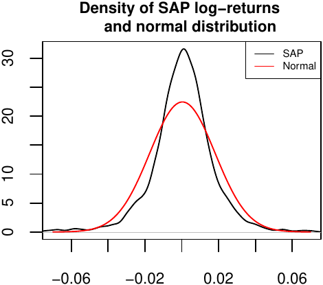
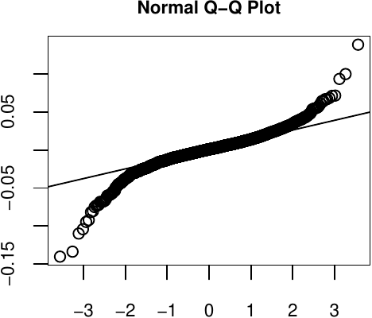

::: article
# Introduction

During the history of financial mathematics mankind has developed many
useful theories how to describe financial markets. While the models in
asset pricing are generally covered by the central limit theorem (CLT)
arguments, these arguments do not cover the tail behaviour and thus are
usually not appropriate in the risk management with its focus on the
tails of the distribution. A simple illustration might be the
log-returns distribution of the German multinational software
corporation [SAP](https://en.wikipedia.org/wiki/SAP_SE). Clearly, the
tails are much heavier than in the case of normal distribution with the
same mean and standard deviation. This behavior can be frequently found
in a number of financial assets.

<figure id="texordummylabel1">

<figcaption>Figure 1: Left: Densities of the normal distribution and
daily SAP log-returns from January 2007 to October 2017. Right:
Quantile-quantile plot of the normal distribution against SAP
log-returns.</figcaption>
</figure>

A more interesting result can be seen from the quantile-quantile plot.
While the normal distribution fails in the tails, it excels in the
center. This suggests to use a more suitable distribution which can
catch the fat tails presented above, yet follows a normal distribution
in the center.

A simple answer to this idea is the concept of composite distributions
(also known as spliced distributions) and mixture models, where one
assumes that the distribution is a finite mixture of component
distributions defined as
$$\label{composite}
F(x)=\sum_{i=1}^{n}w_{i}F_{i}\left (x|B_{i}  \right ), \qquad f(x)=\sum_{i=1}^{n}\frac{w_{i}}{F_{i}\left (  B_{i} \right )}1_{B_{i}}\left ( x \right )f_{i}(x)   (\#eq:composite)$$
and
$$\label{mixture}
F(x)=\sum_{i=1}^{n}w_{i}F_{i}\left (x  \right ), \qquad f(x)=\sum_{i=1}^{n}w_{i}f_{i}\left (x  \right ),   (\#eq:mixture)$$
respectively, where $w_{1},w_{2},\ldots,w_{n}$ are positive weights that
sum up to one, $B_{1},B_{2}, \ldots ,B_{n}$ are Borel sets giving a
disjoint partition of the support, $1_{B_{i}}$ is the indicator function
of a set $B_{i}$, and $F_{1},F_{2},\ldots,F_{n}$ are the probability
distributions over $\mathbb{R}$ with $F_{i}(B_{i})>0$ for all
$i=1,2,\ldots,n$. Obviously, the composite models are a specific case of
the mixture models, where the corresponding probability distribution
functions are truncated to some disjoint support. For the presented
data, a three-component composite model with the first and third
component being some heavy-tailed distribution and its negative
transform, respectively, is clearly something that might be appropriate.
Note that this also suggests the need of a transformation framework that
would be able to perform monotonic transformations on the random
variables that represent these exceedance distributions. This innovation
is motivated by the fact that even though most of the extreme value
distributions belong to the location-scale family, without a decreasing
transformation these distributions cannot be used for modeling of heavy
left tails.

Moreover, composite models have gained a fair amount of attention in
actuarial loss modeling. Most frequently one employs models composed of
two components, where the first is based on the log-normal distribution
and defined on the positive reals, and the second distribution is chosen
according to the data set to model extreme measurements. Common choices
for these tail-modeling distributions are, for instance, the generalized
Pareto distribution or the Burr distribution. Such models have been
proposed by various authors, for more details see @2b, @3c and @5.

To offer a general framework for univariate distributions and for
mixtures in general, package
[*mistr*](https://CRAN.R-project.org/package=mistr) is specifically
designed to create such models, evaluate or even fit them. This article
introduces *mistr* and illustrates with several examples how these
distributions can be created and used.

# Distributions in R

{width="20.0%"
alt="mistr logo"}

R currently employs the naming convention \[prefix\]\[name\], where
\[name\] corresponds to the name of the desired distribution and
\[prefix\] is one of 'p', 'd', 'q' or 'r', indicating, respectively, the
distribution, density and quantile functions, or random number
generation. However, there are many of restrictions in this concept.
What would be desirable is that one would be able to treat a
distribution as a variable and so to be able to send it to a function or
perform transformations on the random variable it represents.

Naturally, one way to do this is by using the object oriented system in
R. To even improve this idea, one can use some favored dispatching
mechanism, like S3 or S4, to let the computer decide how to handle the
corresponding distribution correctly and which functions to use. In
particular, the prefixes p, d, q, and r can still be just smartly
evaluated as generic functions with appropriate methods. Moreover, with
such a system we can add other useful calls and so take the distribution
operations to the next level, such as monotonic transformation of a
distribution. Additionally, once these objects containing all necessary
information about the distributions are defined, they can be then reused
for the purpose of the mixture and composite distributions.

This approach has already been used in the package
[*distr*](https://CRAN.R-project.org/package=distr) [@7], which provides
a conceptual treatment of distributions by means of S4 classes. A parent
class [*Distribution*]{.medium} allows to create objects and contains a
slot for parameters as well as for the four methods mentioned above,
`p()`, `d()`, `q()`, and `r()`. While *distr* provides several classes
for distributions and finite mixtures in general, like many similar
packages, to the best of our knowledge it does not contain any
generating functions for the composite distributions. In particular, the
only packages available for composite models are
[*CompLognormal*](https://CRAN.R-project.org/package=CompLognormal)
[@2b], [*evmix*](https://CRAN.R-project.org/package=evmix) [@evmix],
[*OpVar*](https://CRAN.R-project.org/package=OpVar) [@OpVaR],
[*ReIns*](https://CRAN.R-project.org/package=ReIns) [@ReIns] and
[*gendist*](https://CRAN.R-project.org/package=gendist) [@gendist],
which do not offer a general framework for composite models with more
than two components. Whereas *distr* provides an impressive
functionality-rich and extensible framework implemented in S4, we
decided after careful deliberation to realize *mistr* based on a
self-contained, light-weight framework using S3. This offers to adjust
the representations and settings of the distributions exactly to the
required needs by either mixture or composite models.

The framework provided by package *mistr* currently supports all
distributions that are included in the *stats* package and, in addition,
it offers some extreme value distributions like generalized Pareto,
Pareto, Frechet, and Burr. In case that the user would like to use a
distribution that is not directly supported by the framework, a new
distribution can be implemented in a very simple way. This procedure is
documented in detail in the [Extensions
vignette](https://cran.r-project.org/web/packages/mistr/vignettes/mistr-extensions.pdf)
of the package.

As was already mentioned, the objects in R that represent a distribution
need to contain all the necessary information. This is, of course, for
the purpose of evaluating the distribution function or quantile function
at suitable points just the knowledge of the parameters. Since the
framework we propose is beyond a simple distribution evaluation, the
representation is a little bit more complex. A simple random variable or
a distribution is in our framework represented by the distribution
family which the distribution follows, together with the proper
parameters and some additional information that corresponds to the
distribution. This information is either stored as a type of class or as
attributes in a list. The framework then uses the S3 dispatching
mechanism to use this information, and hence it works with the
distribution. Such a representation allows to go beyond the simple p, d,
q, and r evaluation and enables to define new and more complicated
functions.

An example is the left-hand limit of the cumulative distribution
function. It might not look of crucial importance to be able to evaluate
$F(x-)=\mathbb{P}(X<x)$, but this function plays a huge role in the
transformations and composite distributions. Of course, this function
differs from the standard distribution function only if it is applied to
a distribution with a positive probability mass in the point of
interest. For this reason we simply characterize the ("pseudo") support
by the three parameters "from", "to" and "by". While the parameters
"from" and "to" specify the range in which the distribution takes
positive values, the parameter "by", which is only a part of the
lattice-valued distributions, describes the deterministic step in the
support and for most known discrete distributions is equal to one, since
they have support just on the integers. It might of course differ for
some distributions, which have support only on even numbers, or some
scaled distributions. It is essential that this parametrization allows
to perfectly define the support of a distribution, and hence allows to
do more complicated operations and calculations, e.g., the left-hand
limit of the distribution function. In the case the user would like a
distribution with no equally distanced outcomes, one can perform a
non-linear transformation, which will be dealt with in the next chapter.

::: {#combining-distributions}
## Combining distributions
:::

Having the framework defined for the simple distributions, it is desired
to combine these objects in order to define a larger class of
distributions. The framework currently supports the mixture and
composite models given in, respectively, \@ref(eq:mixture) and
\@ref(eq:composite).

Following the definition of the composite models in the univariate case,
the interval representation of the truncation allows to use a sequence
of breakpoints
$$-\infty=\beta_{0}<\beta_{1}\leq\beta_{2}\leq \dots \leq \beta_{n-1}<\beta_{n}=\infty$$
to fully characterize the partitions $B_{1},B_{2}, \ldots ,B_{n}$. Note
that if $F_{i}$ is continuous, to ensure that the interval has positive
probability we must take $\beta_{i-1}<\beta_{i}$.

This allows to define $\lambda_1=0$ and for all $i=2,\ldots,n,$
$$\lambda _{i}=\left\{\begin{matrix}
F_{i}(\beta_{i-1})  & \text{if } \beta_{i-1}\notin B_{i},  \\ 
F_{i}(\beta_{i-1^{}}-)  & \text{otherwise},
\end{matrix}\right.$$
where as before $F_{i}(\beta_{i-1^{}}-)$ is the left-hand limit
$\mathbb{P}(X_{i}<x)$, and for all $i=1,2,\ldots,n-1,$
$$\rho _{i}=\left\{\begin{matrix}
F_{i}(\beta_{i})  & \text{if }  \beta_{i}\in B_{i},  \\ 
F_{i}(\beta_{i^{-}}) & \text{otherwise},
\end{matrix}\right.$$
with $\rho_{n}=1$. Then for any $x \in B_{i}$
$$F_{i}\left ( \left (  -\infty,x  \right ] \cap B_{i} \right )=\left\{\begin{matrix}
  F_{i}\left ( x  \right )-  F_{i}\left ( \beta_{i-1}  \right )  & \text{if }  \beta_{i-1}\notin B_{i},\\ 
  F_{i}\left ( x  \right )-  F_{i}\left ( \beta_{i-1}  -\right )  & \text{if }  \beta_{i-1}\in B_{i}.
\end{matrix}\right.$$
This means that for every $x \in B_{i}$ we can write the distribution as
$F_{i}\left ( \left ( -\infty,x \right ] \cap B_{i} \right )=F_{i}\left ( x \right )-\lambda _{i}$.

The straightforward implication of the above equations is that
$\sup_{x\in B_{i}}F_{i}\left ( x \right )=\rho _{i}$. Thus,
$$F_{i}\left ( B_{i} \right )=\rho _{i}-\lambda_{i}.$$
Hence, if we define $p_{i}=\sum_{j:j\leq i}w_{i}$ the composite
distribution satisfies
$$F(x)=p_{i-1}+w_{i}\frac{F_{i}(x)-\lambda_{i}}{F_{i}(B_{i})}=p_{i-1}+w_{i}\frac{F_{i}(x)-\lambda_{i}}{\rho_{i}-\lambda_{i}}, \quad \forall x\in B_{i}$$
and, in addition,
$$p_{i-1}\leq F(x)\leq p_{i} , \quad \forall x\in B_{i} \quad \text{and} \quad \sup_{x\in B_{i}}F(x)=p_{i}.$$

If we take some $p \in (0,1)$, then since $\sum_{i}p_{i}=1$, there
exists $i$ such that $p_{i-1}<p<p_{i}$ or $p=p_{i}$. From this it
follows that

$$F(x)\geq p \Leftrightarrow F_{i}(x)\geq \lambda_{i}+\frac{p-p_{i}}{w_{i}}\left ( \rho_{i}-\lambda_{i} \right ),$$
which implies
$$F^{-1}(p)=F^{-1}_{i} \left (\lambda_{i}+\frac{p-p_{i}}{w_{i}}\left ( \rho_{i}-\lambda_{i} \right )  \right ), \quad \text{for } p_{i-1}<p\leq p_{i}.$$
Using the quantile transformation method and the above quantile function
we can easily simulate from our composite distribution.

Therefore, to fully specify a composite distribution, in addition to the
mixture specifications, one needs to set the values that correspond to
the breakpoints, which split $\mathbb{R}$ into disjoint partitions.
Moreover, if at least one distribution is not absolutely continuous, it
might be desired to specify to which adjacent interval should the
breakpoint be included.

# Computational framework

The objects representing a simple distribution can be created very
easily. The creator functions follow a standard naming convention from R
where the "dist" suffix is appended to the name of a distribution, and
the parameters are entered as arguments. Thus, an object representing
normal distribution with mean equal to 1 and standard deviation equal to
3 can be created as follows:

``` r
N <- normdist(mean = 1, sd = 3)
N
```

``` r
#>  Distribution       Parameters
#>     Normal    mean = 1, sd = 3
```

Once the objects are created, they can be used for evaluation of various
functions. The most commonly employed functions clearly will be the
methods for `print()` already demonstrated, and the methods for the
functions `p()`, `d()`, `q()` and `r()`. These can be easily evaluated
as

``` r
d(N, c(1, 2, 3))
```

``` r
#> [1] 0.1329808 0.1257944 0.1064827
```

``` r
p(N, c(1, 2, 3))
```

``` r
#> [1] 0.5000000 0.6305587 0.7475075
```

``` r
q(N, c(0.1, 0.2, 0.3))
```

``` r
#> [1] -2.8446547 -1.5248637 -0.5732015
```

``` r
r(N, 3)
```

``` r
#> [1]  1.8144430 -2.6908086  0.2704776
```

Additional important functions provided by *mistr* are `plim()` and
`qlim()`, which implement, respectively, the already mentioned left-hand
limit of the cumulative distribution function $F(x-)=\mathbb{P}(X<x)$
and its pseudoinverse
$$Q(p+) = \inf\left \{ x\in\mathbb{R}: p <  \mathbb{P}\left (X \leq x  \right ) \right \}.$$
Note that the function `qlim()` plays a very important role when dealing
with the transformations, and just as `plim()`, in the case of
continuous distributions it simplifies to `q()`. Clearly if $-X$ has a
positive probability mass at $x$, then
$$q=P(-X \leq x)= 1-P(X < -x) \Rightarrow -Q_{X}(1-q+)=x.$$

``` r
B <- binomdist(size = 12, prob = 0.3)
plim(B, c(-3, 0, 3, 12))
```

``` r
#> [1] 0.0000000 0.0000000 0.2528153 0.9999995
```

``` r
qlim(B, plim(B, c(0, 3, 7, 12)))
```

``` r
#> [1]  0  3  7 12
```

::: {#adding-transformation}
## Adding transformation
:::

Once the objects that represent a single distribution are created, we
can use this representation to go beyond the scope of a simple
distribution function evaluation. The knowledge of the distributions
class and support range that is stored inside the object opens the doors
for more complicated operations. One such an operation is the ability to
perform monotone transformations of random variables.

The transformation framework currently allows for all standard monotone
transformations like addition, subtraction, multiplication, division,
logarithm, exponential and monotonic power transformations, where in
case of binary operators a numeric value must be used as the second
operand. Moreover, it is provided with the knowledge of invariant and
direct transformations that correspond to the distributions it offers.
This information is stored as a generic function that directly
dispatches on the class of distribution family and not on the class
[*univdist*]{.medium} to prevent losing any information about the
distribution. An example might be the exponential distribution where a
multiplication with a positive scalar rather keeps the family and
changes the parameters. On the other hand, a positive power
transformation will directly create a Weibull distribution with
appropriate parameters.

``` r
E <- expdist(2)

E * 2
```

``` r
#>  Distribution   Parameters
#>  Exponential    rate = 1
```

``` r
E^2
```

``` r
#>  Distribution                Parameters
#>    Weibull    shape = 0.5, scale = 0.25
```

If the transformation is necessary and continuous on the support of the
distribution, the transformation dispatches on the class
[*univdist*]{.medium}. For any untransformed distribution, this function
will change the whole class and the class of the distribution family is
removed since the random variable does not follow the distribution
anymore. However, the information is stored for the case the
distribution would need to untransform itself later. The function then
builds an expression for the transformation and inverse transformation,
along with a print expression and an expression for the derivative of
the inverse transformation. Besides these list members, also a history
member is stored, a list that records the information about the old
transformations and becomes really handy when it comes to an inverse
transformation of the previous one, or updating a transformation. A
simple example of a transformation and update follows.

``` r
E2 <- E * -2
E3 <- E2 * 5
E3
```

``` r
#>    Trafo Distribution Parameters
#>  -10 * X  Exponential   rate = 2
```

The next example uses the normal distribution that we created in the
last chapter.

``` r
Norm_trafo <- (N - 1)^(1/3)
Norm_trafo
```

``` r
#>    Trafo Distribution       Parameters
#>  X^(1/3)       Normal mean = 0, sd = 3
```

Note that the $X-1$ transformation is not displayed in the Trafo column
as it is an invariant transformation that rather changed the parameter
mean from 1 to 0.

The methods that evaluate the transformed distribution are called in the
same fashion as the non-transformed distributions. Additionally, the new
pseudo description of the support can be returned using `sudosupport()`,
which gives two numeric values ("From" and "To") describing the range of
the support.

``` r
Binom_trafo <- -3 * log(B + 4)

q(Binom_trafo, c(0.05, 0.5, 0.95))
```

``` r
#> [1] -6.907755 -6.238325 -4.828314
```

``` r
plim(Binom_trafo, c(-6, -5, 0))
```

``` r
#> [1] 0.5074842 0.9149750 1.0000000
```

``` r
sudo_support(Binom_trafo)
```

``` r
#>      From        To 
#> -8.317766 -4.158883
```

## Visualization

In addition, the `plot()` and `autoplot()` generics can be called. These
methods are offered for any distribution object in the *mistr* package
and return the plot of PDF or PMF and CDF of a given object. The
function uses the introduced `d()` and `p()` functions to evaluate the
required values. While the `plot()` methods offer a plot constructed
using base plotting, the `autoplot()` offers an alternative plot that is
created using the
[*ggplot2*](https://CRAN.R-project.org/package=ggplot2) package
[@ggplot2].

``` r
par(mai = c(0.4, 0.4, 0.2, 0.2))
plot(Norm_trafo, xlim1 = c(-2.5, 2.5), ylab1 = "", cex.axis = 0.75)
```

{#texordummylabel2
width="100%" alt="graphic without alt text"}

``` r
library(ggplot2)
autoplot(Norm_trafo, xlim1 = c(-2.5, 2.5))
```

{#texordummylabel3
width="100%" alt="graphic without alt text"}

Other plot functions offered for the *mistr* distribution objects are
`QQplot()` and `QQplotgg()`. The methods for this functions graphically
compare the empirical quantiles of two data sets, or quantiles of two
distribution objects, or quantiles of a distribution with the empirical
quantiles of a sample. If quantiles of a continuous distribution are
compared with a sample, a pointwise asymptotic confidence bound for this
data is offered. This confidence "envelope" is based on the asymptotic
results of the order statistics. For a distribution $F$ as the number of
observations $n$ tends to infinity, the $p^{th}$ sample quantile is
asymptotically distributed as
$$X_{\left (\left [ np \right ]  \right )} \sim AN\left ( F^{-1}\left ( p \right ),\frac{p(1-p)}{n\left [ f\left ( F^{-1}\left ( p \right ) \right ) \right ]^{2}} \right ),$$
where $f(x)$ and $F^{-1}(p)$ are the density function and quantile
function associated with $F(x)$, respectively. More details can be found
on the [order statistics Wikipedia
page](https://en.wikipedia.org/wiki/Order_statistic) or in [@wilks], for
example. For alternative bounds see [@ggqq].

``` r
QQplotgg(Norm_trafo, r(Norm_trafo, 1000), conf = 0.99, ylab = NULL, xlab = NULL)
```

{#texordummylabel4
width="100%" alt="graphic without alt text"}

::: {#combining-objects}
## Combining objects
:::

::: {#mixtures}
### Mixtures
:::

Mixture distributions are fully specified by the components $F_{i}(x)$
(i.e., the distributions) and by the weights $w_{i}$ that correspond to
these components. Function `mixdist()` allows to create mixtures by
specifying these characterizations. This can be done in two ways. First,
the user may specify the distribution names (names from
\[prefix\]\[name\] functions), the list of appropriate parameters of
these distributions, and a sequence of weights. An example of such a
call follows.

``` r
mixdist(c("norm", "unif"), list(c(2, 2), c(1, 5)), weights = c(0.5, 0.5))
```

``` r
#> Mixture distribution with: 
#>  
#>   Distribution       Parameters       Weight
#> 1    Normal    mean = 2, sd = 2          0.5
#> 2   Uniform    min = 1, max = 5          0.5
```

Another way is to use the objects that have already been defined. Since
the parameters are already stored inside the object, all the function
requires are the objects and the weights. This also allows to use
transformed distributions from the last chapter or more complicated
objects, which will be presented later. This means that the transformed
normal and binomial distributions together with an exponential
distribution can be reused for mixture distribution as:

``` r
M <- mixdist(Norm_trafo, Binom_trafo, expdist(0.5), weights = c(0.4, 0.2, 0.4))
```

The information about the mixture can be accessed via multiple S3
methods. The components can be extracted using square brackets `[]`, the
weights can be obtained using `weights()`, and just as with standard
distributions, the parameters are obtainable using `parameters()`.

Other interesting methods are those for `q` and `qlim` and
[*mixdist*]{.medium} objects. While finding the CDF and PDF of the
mixture model is straightforward, an explicit general expression for
quantile function of the mixture model is not available. However, it can
be found numerically as a solution of a unit-root problem:
$$\sum_{i=1}^{n}w_{i}F_{i}\left (Q(p)  \right )-p=0 .$$
What is more, one can show that the quantile of a mixture distribution
$Q(p)$ can always be found within the range of its components quantiles,
and hence
$$\min_{i\in\left \{ 1,\dots, n \right \}}Q_{i}(p)\leq Q(p)\leq \max_{i\in\left \{ 1,\dots, n \right \}}Q_{i}(p),$$
where $Q_{i}(\cdot)$ is the quantile function of the i-th component.
This specifies the needed interval for the root finder that will then
iteratively find the solution. Additionally, further problems are solved
to return the correct values. To show how this algorithm works we
perform a simple test and create a fully discrete mixture for which a
decreasing transformation is applied. As the following plot reveals, all
the values are calculated correctly.

``` r
DM <- mixdist(3 * binomdist(12, 0.4), -2*poisdist(2) + 12, weights=c(0.5, 0.5))
y <- c(0.05, 0.4, p(-DM, c(-5, -10, -15)), 0.95)
x <- q(-DM, y)
autoplot(-DM, which = "cdf", only_mix = TRUE, xlim1 = c(-37, 0)) +
         annotate("point", x, y, col = "white")
```

{#texordummylabel5
width="100%" alt="graphic without alt text"}

Finally, since inverse transform sampling is not efficient for mixture
distributions, it can be replaced by first sampling according to the
weights $w_{i}$ and then, conditionally on that, by drawing from the
selected component, similarly as in the
[*actuar*](https://CRAN.R-project.org/package=actuar) package [@actuar].
This approach is implemented in the corresponding method of the `r()`
function. This allows to draw from a mixture much faster than the
inverse quantile transform method and can also be reused later for
composite distributions. Besides the quantile function and other main
functions for evaluation, one can call other generic functions that are
designed for the class [*mixdist*]{.medium}, e.g. `sudosupport()`.

``` r
sudo_support(M)
```

``` r
#> From   To 
#> -Inf  Inf
```

Since the mixture models are in fact distributions, one can perform
transformations of mixture random variables as well. It is easy to show
that a transformation of a mixture random variable is the same as if we
applied the same transformation to all of its components. In addition,
since the support of the components is a subset of the mixture's
support, if the framework allows to transform the mixture, then it does
the components as well. Now using the mixture we created, we can perform
a decreasing non-linear transformation. An example of `r()` and
`autoplot()` follows.

``` r
M_trans <- -2 * (M)^(1/3)
r(M_trans, 4)
```

``` r
#> [1]  1.757693  2.247355  2.387137 -1.986538
```

``` r
autoplot(M_trans)
```

{#texordummylabel6
width="100%" alt="graphic without alt text"}

::: {#composite-distributions}
### Composite distributions
:::

Function `compdist()` creates composite distributions, which like
mixture distributions can be done in two ways. Either one can directly
use the objects or let the function create these objects by specifying
the sequence of names and a list of parameters. In the following
example, we will directly proceed with the first method where we define
some objects inside the `compdist()` call to create a composite
distribution. Besides these objects one needs to set the sequences of
weights and breakpoints. Additionally, one may determine for each
breakpoint to which partition should the breakpoint be included. This
can be set by the argument `break.spec` with values 'R' or 'L', where
'R' and 'L' stand for right (i.e., include breakpoint to the interval on
the right of the breakpoint) and left (i.e., include to the interval on
the left), respectively. If this argument is not stated, the algorithm
will by default set all intervals to be left-closed, i.e., right-open.
This can be nicely seen from the following example where a linearly
transformed Pareto distribution and a geometric distribution are
combined with a normal distribution into a composite model.

``` r
C <- compdist(-paretodist(1, 1), normdist(0, 2), geomdist(0.3) + 2, 
              weights = c(0.15, 0.7, 0.15), breakpoints = c(-3, 3),
              break.spec = c("L", "R"))
C
```

``` r
#> Composite distribution with: 
#>  
#>   Trafo Distribution           Parameters Weight Truncation
#> 1  -X       Pareto   scale = 1, shape = 1   0.15  (-Inf,-3]
#> 2 none      Normal     mean = 0, sd = 2     0.70   (-3,3)  
#> 3 X + 2    Geometric      prob = 0.3        0.15   [3,Inf)
```

The argument `break.spec` is set to ("L", "R"), and thus the breakpoint
$-3$ belongs to the first partition while the second breakpoint is
affiliated to the partition on the right. This can be observed from the
print of the distribution, more precisely from the Truncation column,
where the parentheses are printed according to this argument.

The package also permits to use the same breakpoint twice. This
possibility allows to define a partition on a singleton, and hence to
create a mass of probability. If this feature is used, the `break.spec`
needs to be specified with "R" and "L", for the first and second
identical breakpoint, respectively, or not set at all. If the
`break.spec` is not used, the source code will change `break.spec` such
that this single point with probability mass is a closed set. This
feature can become particularly useful when the user wants to create a
distribution that is, for example, absolutely continuous on both the
negative and positive reals and has positive mass at zero.

``` r
C2 <- compdist(-expdist(2), poisdist(), expdist(2),
               weights = c(0.25, 0.5, 0.25), breakpoints = c(0, 0))
C2
```

``` r
#> Composite distribution with: 
#>  
#>   Trafo Distribution Parameters Weight Truncation
#> 1  -X    Exponential  rate = 2    0.25   (-Inf,0)
#> 2 none     Poisson   lambda = 1   0.50    [0,0]  
#> 3 none   Exponential  rate = 2    0.25   (0,Inf)
```

Note that the distribution assigned to this singleton has to be a
discrete distribution with support on that point, otherwise the interval
will have zero probability.

As for any distribution, the framework offers many methods that can be
used to obtain additional information or evaluate the composite
distribution. One can extract the parameters, weights, or the support in
the same manner as with mixture distributions. In addition, calling
`breakpoints()` extracts the splicing points. Finally, there are methods
for `plot()` and `autoplot()` where the components are shown by default,
which again can be turned off using the `onlymix = TRUE` argument.

``` r
par(mai = c(0.4, 0.4, 0.2, 0.2))
plot(C, xlim1 = c(-15, 15), ylab1 = "", cex.axis = 0.75, mtext_cex = 0.75)
```

{#texordummylabel7
width="100%" alt="graphic without alt text"}

``` r
autoplot(C2, text_ylim = 0.01)
```

{#texordummylabel8
width="100%" alt="graphic without alt text"}

Analogously to the mixture distributions, the framework also supports
the transformations of composite random variables. Thus, using the
composite distribution we defined, we propose an example of a linear
transformation.

``` r
C_trans <- -0.5 * (C + 7)
```

Even with such a distribution, the user still can evaluate all functions
"of interest". To support this, an example follows where the function
`q()` and `r()` are used, and the functions `p()` and `d()` are
represented graphically using the `autoplot()` method.

``` r
q(C_trans, c(0.075, 0.5, 0.7, 0.9))
```

``` r
#> [1] -5.500000 -3.500000 -2.833235 -1.250000
```

``` r
r(C_trans, 4)
```

``` r
#> [1] -4.635072 -3.161199 -5.500000 -4.817573
```

``` r
autoplot(C_trans, xlim1 = c(-10,5))
```

{#texordummylabel9
width="100%" alt="graphic without alt text"}

::: {#combining-mixture-and-composite-distributions}
## Combining mixture and composite distributions
:::

A significant advantage of object oriented programming is that the
dispatching mechanism automatically knows how to treat a given object.
This allows to combine mixture and composite models into more
complicated mixtures and composite distributions. Therefore, we can take
the transformed mixture and the transformed composite distribution that
we created in the last chapter to compose a composite distribution with
these distributions as components. What is more, we can perform further
transformations of such a distribution.

``` r
C3 <- compdist(M_trans - 3, C_trans, weights = c(0.5, 0.5), breakpoints = -4.5)
C3_trans <- -2 * C3 + 2
```

Thus, the object `C3trans` is a transformed composite distribution that
contains a transformed mixture and a transformed composite distribution,
from which both additionally contain many transformed and untransformed
distributions. Even in such complex models, the user may evaluate the
most complicated functions like `plim()` and `qlim()`. The functions
`d()` and `p()` can be again best represented graphically, where both
distributions can easily be recognized from previous chapters.

``` r
autoplot(C3_trans, xlim1 = c(0,20), text_ylim = 0.01, grey = TRUE)
```

{#texordummylabel9
width="100%" alt="graphic without alt text"}

``` r
plim(C3_trans, c(6, 10, 12))
```

``` r
#> [1] 0.09667553 0.42195189 0.62458021
```

``` r
qlim(C3_trans, c(0.3, 0.5, 0.7))
```

``` r
#> [1]  8.785363 11.000000 12.327907
```

As the `print()` output for such a hierarchical distribution does not
contain lot of information, one can alternatively use `summary()` for
which the package provides methods, which are particularly useful for
the hierarchical distributions. The printed result of this call consists
of all the necessary information, and much more as well. Nevertheless,
since the result of `summary()` on the `C3_trans` object is two pages
long, the demonstration is left to the reader.

To finish this chapter and to show that the user may go even further, we
present an example where we combine the last object with another
distribution from this chapter into a mixture distribution. The
distribution is directly plotted using autoplot().

``` r
autoplot(mixdist( C3_trans, C2 + 5, weights = c(0.7, 0.3)), xlim1 = c(0, 15))
```

{#texordummylabel10
width="100%" alt="graphic without alt text"}

# Data modeling

While the previous chapters were aimed at showing the "muscles" (i.e.,
generality) of the framework, in this last chapter we will focus on
examples using real data. In particular, we will present a simple
fitting for two specific composite distributions.

As motivated in the introduction, the models in financial and actuarial
mathematics suggest employing distributions which can capture the wide
variety of behaviors in tails while still following the normal
distribution in the center. In the two-tailed case, this suggests to use
a three components composite distribution, where the first and third
component will be used to model the extreme cases, i.e., the tails, and
the second component will try to catch the center of the empirical
distribution.

The first model offered by *mistr* is the Pareto-Normal-Pareto (PNP)
model. This means that a $-X$ transformation of a Pareto random variable
will be used for the left tail, normal distribution for the center and
again Pareto for the right tail. From this it follows that the PDF of
the model can be written as:
$$f(x)= \left\{\begin{matrix}
w_{1}\frac{f_{-P}(x)}{F_{-P}(\beta_{1} )} & \text{   if}& -\infty< x< \beta_{1},\\
w_{2}\frac{f_{N}(x)}{F_{N}(\beta_{2} )-F_{N}(\beta_{1} )} & \text{ if}& \beta_{1}\leq x<\beta_{2},   \\
w_{3}\frac{f_{P}(x)}{1-F_{P}(\beta_{2} )} & \text{  if} &\beta_{2}  \leq x< \infty,
\end{matrix}\right.$$
where $f_{P}(x)=f_{-P}(-x)$ and $F_{P}(x)=1-(K/x)^\alpha$ are the
density and distribution function of a Pareto distribution with
$F_{-P}(x)=1-F_{P}(-x)$. $f_{N}(x)$ and $F_{N}(x)$ are the PDF and CDF
of the normal distribution, respectively.

If we follow the properties of a Pareto distribution, the conditional
probability distribution of a Pareto-distributed random variable, given
that the event is greater than or equal to $\gamma>K$, is again a Pareto
distribution with parameters $\gamma$ and $\alpha$. This means that the
conditional distribution
$f_{P}(x|K,\alpha)/(1-F_{P}(\beta_{2} |K,\alpha))=f_{P}(x|\beta_{2},\alpha)$
if $\beta_{2}>K$. On the other hand, if $\beta_{2}<K$ the distribution
cannot be continuous as the support of a Pareto distribution starts at
$K$. The same can be shown for the transformed distribution and hence we
can rewrite the PDF as
$$f(x)= \left\{\begin{matrix}
w_{1}f_{-P}(x|-\beta_{1},\alpha_{1}) & \text{  if}& -\infty< x< \beta_{1},\\
w_{2}\frac{f_{N}(x|\mu,\sigma)}{F_{N}(\beta_{2}|\mu,\sigma)-F_{N}(\beta_{1}|\mu,\sigma )} & \text{ if}& \beta_{1}\leq x<\beta_{2},   \\
w_{3}f_{P}(x|\beta_{2},\alpha_{2}) & \text{  if} &\beta_{2}  \leq x< \infty,
\end{matrix}\right. \quad  
\text{where} \quad  \begin{matrix}
\beta_{1}<0<\beta_{2},\\
\alpha_{1},\alpha_{2}> 0.
\end{matrix}$$

The condition $\beta_{1}<0<\beta_{2}$ follows from the fact that the
scale parameter has to be positive. Thus, such a model can be fully used
only with demeaned data sample or with data with a mean close to zero.
This is of course not a problem for stock returns, which are the aim of
this chapter. What is more, one can show that the density is continuous
if for the shape parameters it holds that
$$\alpha_{1} =-\beta_{1} \frac{w_{2}f_{N}(\beta_{1}|\mu,\sigma)}{w_{1}\left (F_{N}(\beta_{2}|\mu,\sigma)-F_{N}(\beta_{1}|\mu,\sigma )  \right )},$$

$$\quad \alpha_{2} =\beta_{2} \frac{w_{2}f_{N}(\beta_{2}|\mu,\sigma)}{w_{3}\left (F_{N}(\beta_{2}|\mu,\sigma)-F_{N}(\beta_{1}|\mu,\sigma )  \right )}.$$
This condition is not only natural when modelling the real data, it
additionally solves the possible instability effects at estimation once
observations come to lie close to breakpoints. Due to the fact that a
composite distribution can be represented as a mixture of truncated
distributions that are truncated to a disjoint support, the weight of
each component can be estimated as the proportion of points that
correspond to each of the truncated regions. Obviously, this condition
ensures that the empirical and estimated CDF match on each of the
breakpoints. Thus, conditionally on the fact that the breakpoints are
known, similarly as in [@Erlang], the weights can be computed as
$$w_{1}=\frac{\sum_{i=1}^{n}1_{\{x_{i}< \beta_{1}\}}}{n}  \text{, }  w_{2}=\frac{\sum_{i=1}^{n}1_{\{\beta_{1}\leq x_{i}<\beta_{2}\}}}{n}, 
w_{3}=\frac{\sum_{i=1}^{n}1_{\{\beta_{2}\leq x_{i}\}}}{n},$$
where $1_{\{\cdot\}}$ is the indicator function and $x_{i}$ is the i-th
data value. These conditions decrease the number of parameters from 11
to 4 and imply the density function of the form:
$$f(x|\beta_{1},\beta_{2},\mu,\sigma).$$

This model is offered by the function `PNPfit()` which takes the data
and a named vector of starting values with names `break1`, `break2`,
`mean`, and `sd` and returns a list of class [*compfit*]{.medium}. Other
arguments are passed to the optimizer which then maximizes the
likelihood of the above specified model. The optimization is handled by
the `mle2()` function from
[*bbmle*](https://CRAN.R-project.org/package=bbmle) package [@mle]. To
demonstrate this, we will take the same data we used in the introduction
to fit a PNP model with the default starting values.

``` r
PNP_model <- PNP_fit(stocks$SAP)

PNP_model
```

``` r
#> Fitted composite Pareto-Normal-Pareto distribution: 
#> 
#> Breakpoints: -0.019304 0.020518 
#> Weights: 0.092443 0.82135 0.086207 
#> 
#> Parameters: 
#>   scale1   shape1     mean       sd   scale2   shape2 
#> 0.019304 1.773598 0.000961 0.012950 0.020518 2.198590 
#> 
#> Log-likelihood: 7400.117,  Average log-likelihood: 2.7146
```

If the fitted object is printed, the function prints all the parameters
together with the log-likelihood that was achieved by the optimization.
In addition, the average log-likelihood is printed, which is just the
log-likelihood divided by the size of the data set. The user can extract
parameters using `parameters()`, weights using `weights()`, and
breakpoints using `breakpoints()`. The `distribution()` function can be
used to extract the distribution with fitted parameters that can be used
for evaluation.

Finally, again `plot()` and `autoplot()` methods are offered, which give
a Q-Q plot of the fitted distribution and the data, and the CDF and PDF
plot of the fitted distribution, which overlap with the empirical CDF
and PDF of the data set. Again, the `which` argument can extract the
proposed plots separately (i.e., `which = "pdf"`). Other arguments are
passed to the the plot calls.

``` r
plot(PNP_model, ylab1 = "", ylab2 = "")
```

{#texordummylabel11
width="100%" alt="graphic without alt text"}

The plots indicate an overall nice fit where all quantiles are in the
confidence bound.

The second model offered is a similar distribution to the previous one,
except we will replace the Pareto distributions by the generalized
Pareto distributions (GPD)
$$F_{GPD}(x)=\left\{\begin{matrix}
1-\left ( 1+\xi \frac{x-\theta }{\gamma} \right )^{-1/\xi  }  &  \text{if } \xi\neq0,\\
 1-\exp\left (  -\frac{x-\theta }{\gamma}\right )&  \text{if } \xi=0.
\end{matrix}\right.$$
This means that the PDF of this model can be written as:
$$f(x)= \left\{\begin{matrix}
w_{1}\frac{f_{-GPD}(x)}{F_{-GPD}(\beta_{1} )} & \text{ if}& -\infty< x< \beta_{1},\\
w_{2}\frac{f_{N}(x)}{F_{N}(\beta_{2} )-F_{N}(\beta_{1} )} & \text{ if}& \beta_{1}\leq x<\beta_{2},   \\
w_{3}\frac{f_{GPD}(x)}{1-F_{GPD}(\beta_{2} )} & \text{  if} &\beta_{2}  \leq x< \infty.
\end{matrix}\right.$$

The same way as in the PNP model, the scale parameters can be eliminated
by the continuity conditions, weights by the above mentioned condition
and in addition, under current settings and the continuity conditions,
the value of the conditional GPD distribution depends on the location
parameter only through the conditions $-\beta_{1}\geq\theta_{1}$ and
$\beta_{2}\geq\theta_{2}$. This suggests to choose without any loss in
the model $-\beta_{1}=\theta_{1}$ and $\beta_{2}=\theta_{2}$. This PDF
is then fully characterized by
$$f(x|\beta_{1},\beta_{2},\mu,\sigma,\xi_{1},\xi_{2}),$$
where the only restriction on the parameters is
$-\infty<\beta_{1}<\beta_{2}<\infty$.

These conditions decrease the number of parameters from 13 to 6. What is
more, the function `GNGfit()` contains the argument `breakfix`, which
fixes the breakpoints from the vector of starting values, and so
decreases the number of parameters to 4 if `TRUE` is assigned. In this
case, the breakpoints are fixed and weights are computed before the
optimization. The function `GNGfit()` takes the data, the named vector
of starting values with names `break1`, `break2`, `mean`, `sd`, `shape1`
and `shape2`, the `break_fix` argument and the argument `midd`, which is
by default set to be equal to the mean of the data. The `midd` value is
used to split $\mathbb{R}$ into two sub-intervals and then the first
breakpoint is optimized on the left of the `midd` value and the second
breakpoint on the right.

The function returns a list of class [*compfit*]{.medium}. The results
can be then extracted, printed or visualized in the same way as the
results of `PNPfit()`.

``` r
GNG_model <- GNG_fit(stocks$SAP)

GNG_model
```

``` r
#> Fitted composite GPD-Normal-GPD distribution: 
#> 
#> Breakpoints: -0.019414 0.019353 
#> Weights: 0.091343 0.812546 0.096112 
#> 
#> Parameters: 
#>     loc1   scale1   shape1     mean       sd     loc2   scale2   shape2 
#> 0.019414 0.013439 0.150141 0.000907 0.011696 0.019353 0.010842 0.096832 
#> 
#> Log-likelihood: 7423.245,  Average log-likelihood: 2.7231
```

``` r
autoplot(GNG_model)
```

{#texordummylabel12
width="100%" alt="graphic without alt text"}

The log-likelihood has increased to 7423.2 with the average of 2.723 per
data-point. In this model, the generalized Pareto distribution explains
the first 9.1% from the left tail and the last 9.6% from the right tail.
Since the GPD generalizes the Pareto distribution, the higher likelihood
is a reasonable result. Moreover, the QQ-plot suggests an almost perfect
fit.

The result of these estimations is a proper continuous parametric set-up
that describes the distribution of the data. What is more, the
distribution has been fitted as a whole with respect to the continuity
conditions. This means that the tails take into account the whole
distribution, which allows to calculate the risk measures with an even
higher precision as when only the tails are modeled.

::: {#risk-measures}
## Risk measures
:::

Package *mistr* provides a function `risk()` which can be used for rapid
calculations of point estimates of prescribed quantiles, expected
shortfalls and expectiles (in the following table denoted as VaR, ES and
Exp, respectively). For more details on these measures see
@McNeil:2015:QRM:2811305. As input parameters this function needs the
output of the function `PNPfit()` or `GNGfit()` and a vector of the
desired levels. As an example we illustrate this function on our fitted
object.

``` r
risk(GNG_model, c(0.02, 0.05, 0.07, 0.1, 0.2, 0.3))
```

``` r
#>   level         VaR         ES         Exp
#> 1  0.02 0.042341368 0.06220519 0.032240507
#> 2  0.05 0.027889909 0.04520065 0.021949976
#> 3  0.07 0.023062791 0.03952074 0.018526202
#> 4  0.10 0.018245509 0.03380624 0.015091608
#> 5  0.20 0.010642738 0.02386181 0.008851640
#> 6  0.30 0.006167236 0.01867190 0.005168659
```

These results can be also visualized if arguments `plot` or `ggplot` are
set to `TRUE`.

# Summary

We introduced a new extensible framework for mixture and composite
distributions in R via the *mistr* package. It offers creation and
manipulation of simple distributions which can be combined into more
complicated distributions to offer more generality in the current data
modeling. Furthermore, the framework provides multiple methods
specifically designed to describe and visualize the distributions or
functions capable of fitting the two pre-defined composite distributions
introduced in the last chapter.

The package is additionally equipped with the possibility to extend the
current list of known distributions and monotone transformations by
letting the user add these in a very simple way. This procedure is
documented in detail in the [Extensions
vignette](https://cran.r-project.org/web/packages/mistr/vignettes/mistr-extensions.pdf).
Finally, we will keep adding multiple extensions and distributions to
extend the generality even more.
:::
