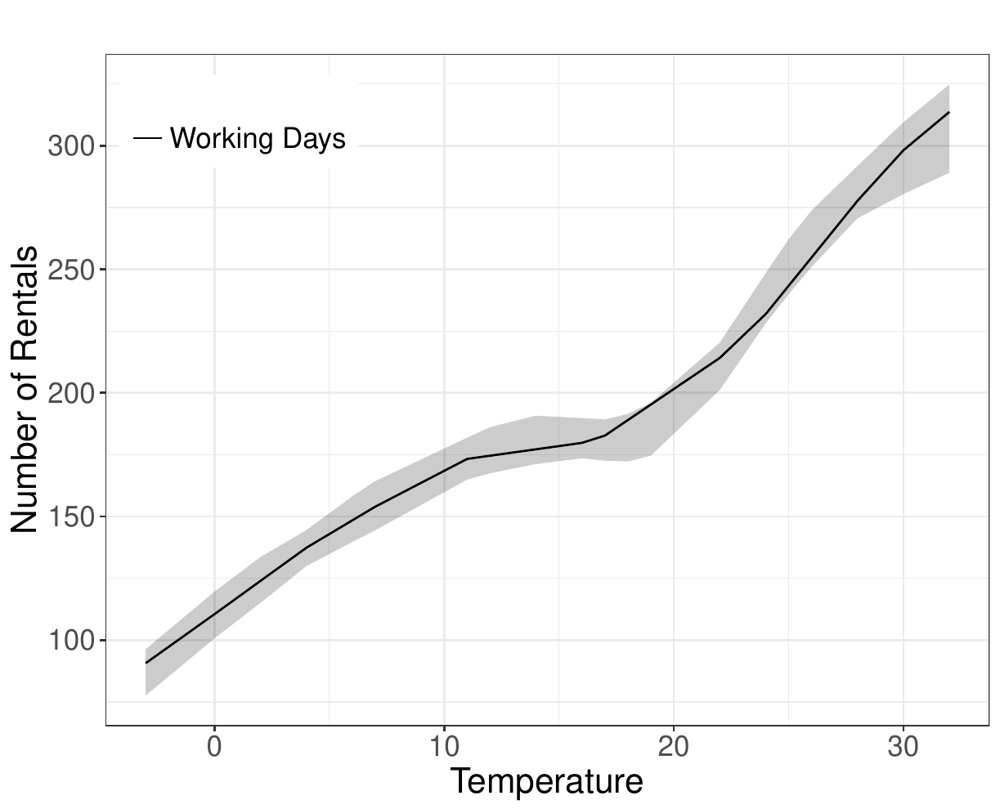
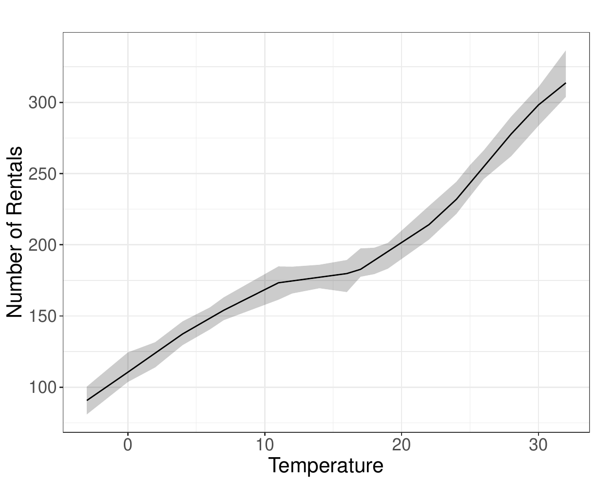
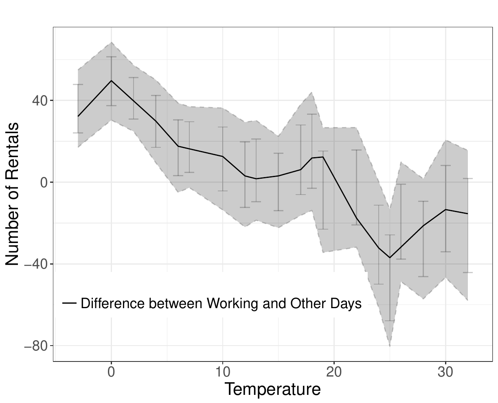
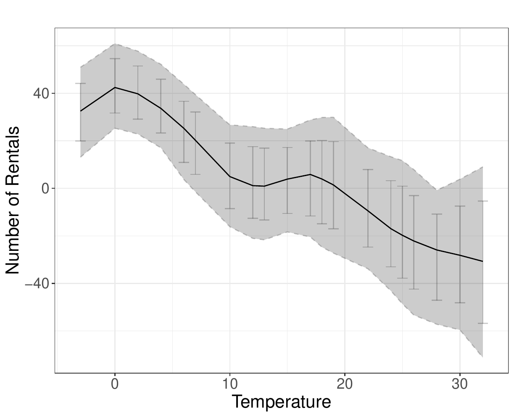

# Introduction {#sec:intro}

Nonparametric partitioning-based least squares regression estimation is
an important method for estimating conditional expectation functions in
statistics, economics, and other disciplines. These methods first
partition the support of covariates and then construct a set of local
basis functions on top of the partition to approximate the unknown
regression function or its derivatives. Empirically popular basis
functions include splines, compactly supported wavelets, and piecewise
polynomials. For textbook reviews on classical and modern nonparametric
regression methodology see, among others, @Fan-Gijbels_1996_Book,
@Gyorfi-etal_2002_book, @Ruppert-Wand-Carroll_2009_book, and
@Harezlak-Ruppert-Wand_2018_book. For a review on partitioning-based
approximations in nonparametrics and machine learning see
[@Zhang-Singer_2010_Book] and references therein.

This article gives a detailed discussion of the software package
*lspartition*, available for R, which implements partitioning-based
least squares regression estimation and inference. This package offers
several features which improve on existing tools, leveraging the recent
results of @Cattaneo-Farrell_2013_JoE and
@Cattaneo-Farrell-Feng_2020_AoS, and delivering data-driven methods to
easily implement partitioning-based estimation and inference, including
optimal tuning parameter choices and uniform inference results such as
confidence bands. We cover splines, compactly supported wavelets, and
piecewise polynomials, in a unified way, encompassing prior methods and
routines previously unavailable without manual coding by researchers.
Piecewise polynomials generally differ from splines and wavelets in that
they do not enforce global smoothness over the partition, but in the
special cases of zero-degree bases on a tensor-product partition, the
three basis choices (i.e., zero-degree spline, Haar wavelet, and
piecewise constant) are equivalent.

The first contribution offered by *lspartition* is a data-driven choice
of the number of partitioning knots that is optimal in an integrated
mean squared error (IMSE) sense. A major hurdle to practical
implementation of any nonparametric estimator is tuning parameter
choice, and by offering several feasible IMSE-optimal methods for
splines, compactly supported wavelets, and piecewise polynomials,
*lspartition* provides practitioners with tools to overcome this
important implementation issue.

However, point estimation optimal tuning parameter choices yield invalid
inference in general, and the IMSE-optimal choice is no exception. The
second contribution of *lspartition* is the inclusion of robust bias
correction methods, which allow for inference based on optimal point
estimators. *lspartition* implements the three methods studied by
@Cattaneo-Farrell-Feng_2020_AoS, which are based on novel bias
expansions therein. Both the bias and variance quantities are kept in
pre-asymptotic form, yielding better bias correction and standard errors
robust to conditional heteroskedasticity of unknown form. Collectively,
this style of robust bias correction has been proven to yield improved
inference in other nonparametric contexts
[@Calonico-Cattaneo-Farrell_2018_JASA; @Calonico-Cattaneo-Farrell_2019_wp].

The third main contribution is valid inference, both pointwise and
uniformly in the support of the conditioning variables. When robust bias
correction is employed, this inference is valid for the IMSE-optimal
point estimator, allowing the researcher to combine an optimal partition
for point estimation and a "faithful" measure of uncertainty (i.e., one
that uses the same nonparametric estimation choices, here captured by
the partition). In particular, *lspartition* delivers valid confidence
*bands* that cover the entire regression function and its derivatives.
These data-driven confidence bands are constructed by approximating the
distribution of $t$-statistic processes, using either a plug-in approach
or a bootstrap approach. Importantly, the construction of confidence
bands does not employ (asymptotic) extreme value theory, but instead
uses the strong approximation results of
@Cattaneo-Farrell-Feng_2020_AoS, which perform substantially better in
samples of moderate size.

Last but not least, the package also offers a convenient function to
implement estimation and inference for linear combinations of regression
estimators of different groups with all the features mentioned above.
This function can be used to analyze conditional treatment effects in
random control trials in particular, or for two-sample comparisons more
generally. For example, a common question in applications is whether two
groups have the same "trend" in a regression function, and this is often
answered in a restricted way by testing a single interaction term in a
(parametric) linear model. In contrast, *lspartition* delivers a valid
measure of this difference nonparametrically and uniformly over the
support of the conditioning variables, greatly increasing its
flexibility in applications.

All of these contributions are fully implemented for splines, wavelets,
and piecewise polynomials through the following four functions included
in the package *lspartition*:

-   `lsprobust()`. This function implements estimation and inference for
    partitioning-based least squares regression. It takes the
    partitioning scheme as given, and constructs point and variance
    estimators, bias correction, conventional and robust bias-corrected
    confidence intervals, and simulation-based conventional and robust
    bias-corrected uniform inference measures (e.g., confidence bands).
    Three approximation bases are provided: B-splines,
    Cohen-Daubechies-Vial wavelets, and piecewise polynomials. When the
    partitioning scheme is not specified, the companion function
    `lspkselect()` is used to select a tensor-product partition in a
    fully data-driven fashion.
-   `lspkselect()`. This function implements data-driven procedures to
    select the number of knots for partitioning-based least squares
    regression. It allows for evenly-spaced and quantile-spaced knot
    placements, and computes the corresponding IMSE-optimal choices. Two
    selectors are provided: rule of thumb (ROT) and direct plug-in (DPI)
    rule.
-   `lsplincom()`. This function implements estimation and robust
    inference procedures for linear combinations of regression
    estimators of multiple groups based on `lsprobust()`. Given a
    user-specified linear combination, it offers all the estimation and
    inference methods available in the functions `lsprobust()` and
    `lspkselect()`.
-   `lsprobust.plot()`. This function builds on
    [*ggplot2*](https://CRAN.R-project.org/package=ggplot2) [@ggplot2],
    and is used as a wrapper for plotting results. It plots regression
    function curves, robust bias-corrected confidence intervals and
    uniform confidence bands, among other possibilities.

The paper continues as follows. The next section describes the basic
setup including a brief introduction to partitioning-based least squares
regression and the empirical example to be used throughout to illustrate
features of *lspartition*. The third section discusses data-driven
IMSE-optimal selection of the number of knots and gives implementation
details. Estimation and inference implementation is covered in the
fourth section, including bias correction methods. The last section
provides concluding remarks. We defer to
[@Cattaneo-Farrell-Feng_2020_AoS] for complete theoretical and technical
details. Statements below are sometimes specific versions of a general
case therein.

# Setup {#sec:setup}

We assume that $\{(y_i, \mathbf{x}_i')':1\leq i \leq n\}$ is an observed
random sample of a scalar outcome $y_i$ and a $d$-vector of covariates
$\mathbf{x}_i\in\mathcal{X}\subset\mathbb{R}^d$. The object of interest
is the regression function
$\mu(\mathbf{x})=\mathbb{E}[y_i|\mathbf{x}_i=\mathbf{x}]$ or its
derivative, the latter denoted by
$\partial^{\mathbf{q}}\mu(\mathbf{x})=\partial^{[\mathbf{q}]}\mu(\mathbf{x})/\partial x_1^{q_1}\cdots\partial x_d^{q_d}$,
for a $d$-tuple $\mathbf{q}=(q_1, \ldots, q_d)'\in\mathbb{Z}_+^d$ with
$[\mathbf{q}]=\sum_{j=1}^{d}q_j$.

Estimation and inference is based on least squares regression of $y_i$
on set of basis functions of $\mathbf{x}_i$ which are themselves built
on top of a partition of the support $\mathcal{X}$. A partition, denoted
by $\Delta=\{\delta_l\subset\mathcal{X}: 1\leq l \leq \kappa\}$, is a
collection of $\kappa$ disjoint open sets such that the closure of their
union is $\mathcal{X}$. For a partition, a set of basis functions, each
of order $m$ and denoted by $\mathbf{p}(\mathbf{x})$, is constructed so
that each individual function (i.e., each element of the vector
$\mathbf{p}(\mathbf{x})$) is nonzero on a fixed number of contiguous
$\delta_l$. *lspartition* allows for three such bases: piecewise
polynomials, B-splines, and Cohen-Daubechies-Vial wavelets
[@Cohen_1993_ACHA]. For the first two bases, the order $m$ of the basis
can be any positive integer, and any derivative of $\mu$ up to total
order $(m-1)$ can be estimated employing such a basis. For wavelets, the
current version allows for $m\leq 4$ (i.e., up to cubic wavelets), and
$\mathbf{q}=(0, \ldots, 0)$. The package takes $m=2$ (linear basis) as
default. To fix ideas, consider $d=1$ with piecewise constants. Each
$\delta_l$ is an interval and $\mathbf{p}(\mathbf{x})$ collects all the
indicator functions $\mathbf{1}\{x\in \delta_l\}$, $1\leq l\leq\kappa$.

Once the basis $\mathbf{p}(\mathbf{x})$ is constructed, the final
estimator of $\partial^\mathbf{q}\mu(\mathbf{x})$, for $[\mathbf{q}]<m$,
is
$$\label{eq: point estimate}
\widehat{\partial^\mathbf{q}\mu}(\mathbf{x})=\partial^\mathbf{q}\mathbf{p}(\mathbf{x})'\widehat{\boldsymbol{\beta}}, \qquad \text{where} \qquad \widehat{\boldsymbol{\beta}}=\underset{\mathbf{b}\in\mathbb{R}^K}{\arg\min}\sum_{i=1}^{n}\left(y_i-\mathbf{p}(\mathbf{x}_i)'\mathbf{b}\right)^2.   (\#eq:-point-estimate)$$
When $\mathbf{q}=\mathbf{0}$, we write
$\widehat{\mu}(\cdot)=\widehat{\partial^\mathbf{0}\mu}(\cdot)$ for
simplicity.

The approximation power of such estimators increases with the
granularity of the partition $\Delta$ and the order $m$. We take the
latter as fixed in practice. The most popular structure of $\Delta$ in
applications is a tensor-product form, which partitions each covariate
marginally into intervals and then sets $\Delta$ to be the set of all
tensor (Cartesian) products of these intervals
([@Cattaneo-Farrell-Feng_2020_AoS] consider more general cases). For
this type of partition, the user must choose the *number* and
*placement* of the partitioning knots in each dimension. *lspartition*
allows for three knot placement types: user-specified, evenly-spaced,
and quantile-spaced. In the first case, the user has complete freedom to
choose both the number and positions of knots for each dimension. In the
latter two cases, the knot placement scheme is pre-specified, and hence
only the number of subintervals for each dimension needs to be chosen.

We denote the number of knots in the $d$ dimensions of the regressor
$\mathbf{x}_i$ by
$\boldsymbol{\kappa}=(\kappa_1, \ldots, \kappa_d)\in\mathbb{Z}_+^d$,
which can be either specified by users or selected by data-driven
procedures (see Section [3](#sec:selection) below). Moreover, for
wavelet bases, motivated by the standard multi-resolution analysis, we
provide an option `J` for the regression command `lsprobust()`, which
indicates the resolution level of a wavelet basis. This gives
$\kappa_\ell = 2^{J_\ell}, \ell = 1, \ldots d$, for a resolution
$J_\ell$ [see @Chui_2016_Book for a review]. In any case, the tuning
parameter to be chosen is
$\kappa = \kappa_1 \times \cdots \times \kappa_d$. In the next section
we choose $\kappa$ to minimize the IMSE of the estimator
\@ref(eq:-point-estimate).

## Package and data

We will showcase the main aspects of *lspartition* using a running
empirical example. The package is available in R and can be installed as
follows:

``` r
> install.packages("lspartition", dependencies = TRUE)
> library(lspartition)
```

The data we use come from Capital Bikeshare, and is available at
<http://archive.ics.uci.edu/ml/datasets/Bike+Sharing+Dataset/>. For the
first 19 days of each month of 2011 and 2012 we observe the outcome
`count`, the total number of rentals and the covariates `atemp`, the
"feels-like" temperature in Celsius, and `workingday`, a binary
indicator for working days (versus weekends and holidays). The data is
summarized as follows.

``` r
> data <- read.csv("bikesharing.csv", header = TRUE)
> summary(data)
     count           atemp           workingday    
 Min.   :  1.0   Min.   :-14.997   Min.   :0.0000  
 1st Qu.: 42.0   1st Qu.:  5.998   1st Qu.:0.0000  
 Median :145.0   Median : 15.997   Median :1.0000  
 Mean   :191.6   Mean   : 15.225   Mean   :0.6809  
 3rd Qu.:284.0   3rd Qu.: 24.999   3rd Qu.:1.0000  
 Max.   :977.0   Max.   : 44.001   Max.   :1.0000  
```

We will investigate nonparametrically the relationship between
temperature and number of rentals and compare the two groups defined by
the type of days:

``` r
> y <- data$count
> x <- data$atemp
> g <- data$workingday
```

The sample code that follows will use this designation of `y`, `x`, and
`g`.

# Partitioning scheme selection {#sec:selection}

We will now briefly describe the IMSE expansion and its use in tuning
parameter selection. To differentiate the original point estimator of
\@ref(eq:-point-estimate) and the post-bias-correction estimators, we
will add a subscript $``0"$ to the original estimator:
$\widehat{\partial^\mathbf{q}\mu}_0(\mathbf{x})$. The three bias
corrections discussed below will add corresponding subscripts of 1, 2,
and 3. We first discuss the bias and variance of
$\widehat{\partial^\mathbf{q}\mu}_0(\mathbf{x})$, and then use these for
minimizing the IMSE. Throughout, $\approx$ denotes that the
approximation holds for large sample in probability, $\asymp$ indicates
an asymptotic rate, and $\mathbb{E}_n[\cdot]$ denotes the sample average
over $1\leq i \leq n$. To simplify notation, we may write the estimator
as
$$\widehat{\partial^\mathbf{q}\mu}_0(\mathbf{x}) := \widehat{\boldsymbol{\gamma}}_{\mathbf{q},0}'\mathbb{E}_n[\mathbf{p}(\mathbf{x}_i) y_i], \quad\text{ where }\quad \widehat{\boldsymbol{\gamma}}_{\mathbf{q},0}(\mathbf{x})' := \partial^\mathbf{q}\mathbf{p}(\mathbf{x})'  \mathbb{E}_n[ \mathbf{p}(\mathbf{x}_i) \mathbf{p}(\mathbf{x}_i)']^{-1}.$$
Again, note the subscript "0"; the bias-corrected estimators are of the
same form (see below).

## Bias and variance

The bias expansion for the
$\widehat{\partial^\mathbf{q}\mu}_0(\mathbf{x})$ is:
$$\begin{aligned}
\mathbb{E}[\widehat{\partial^\mathbf{q}\mu}_0(\mathbf{x})|\mathbf{X}] - \partial^{\mathbf{q}}\mu(\mathbf{x})
&=\widehat{\boldsymbol{\gamma}}_{\mathbf{q},0}(\mathbf{x})'\mathbb{E}_n[\mathbf{p}(\mathbf{x}_i)\mu(\mathbf{x}_i)] - \partial^{\mathbf{q}}\mu(\mathbf{x}) \label{eq: implicit bias}
\end{aligned}   (\#eq:-implicit-bias)$$

$$\begin{aligned}
&\approx
\mathscr{B}_{m, \mathbf{q}}(\mathbf{x})-\widehat{\boldsymbol{\gamma}}_{\mathbf{q},0}(\mathbf{x})'\mathbb{E}_n[\mathbf{p}(\mathbf{x}_i)\mathscr{B}_{m, \mathbf{0}}(\mathbf{x}_i)]. \label{eq: explicit bias}
\end{aligned}   (\#eq:-explicit-bias)$$
$\mathscr{B}_{m, \mathbf{q}}(\cdot)$ is the leading approximation error
in the $L_\infty$-norm and the second term is the accompanying error
from the linear projection of $\mathscr{B}_{m, \mathbf{0}}(\cdot)$ onto
the space spanned by the basis functions. The form of each of these is
complex, and depends on the basis, but what is crucial for the present
purposes is that the form is known and the only unknown elements are
derivatives of order $m$, $\partial^{\mathbf{u}}\mu(\mathbf{x})$,
$[\mathbf{u}]=m$. [@Cattaneo-Farrell-Feng_2020_AoS] derive exact
expressions for splines, wavelets, and piecewise polynomials. Both bias
terms will, in general, contribute to the same order, and both will
matter in finite samples. However, the second term in
\@ref(eq:-explicit-bias) will be higher order if the bases are carefully
constructed so that $\mathscr{B}_{m, \mathbf{0}}(\cdot)$ is orthogonal
to $\mathbf{p}(\cdot)$ in $L_2$ with respect to the Lebesgue measure.
*lspartition* allows users to choose whether the projection of the
leading error is used in partitioning scheme selection, as well as
estimation and inference.

The conditional variance is straightforward from least squares algebra
and takes the familiar sandwich form. With
$\sigma^2(\mathbf{x}_i)=\mathbb{V}\left[y_i|\mathbf{x}_i\right]$, we
have
$$\mathbb{V}[\widehat{\partial^{\mathbf{q}}\mu}_0(\mathbf{x})|\mathbf{X}]=\frac{1}{n}
\widehat{\boldsymbol{\gamma}}_{\mathbf{q},0}(\mathbf{x})'\bar{\boldsymbol{\Sigma}}_0\widehat{\boldsymbol{\gamma}}_{\mathbf{q},0}(\mathbf{x}), \qquad \text{where} \qquad \bar{\boldsymbol{\Sigma}}_0=\mathbb{E}_n\left[\mathbf{p}(\mathbf{x}_i)\mathbf{p}(\mathbf{x}_i)'\sigma^2(\mathbf{x}_i)\right].$$
Only $\sigma^2(\mathbf{x}_i)$ is unknown here, and will be replaced by a
residual-based estimator. In particular *lspartition* allows for the
standard Heteroskedasticity-Consistent (HC) class of estimators via the
options `hc0`, `hc1`, `hc2`, `hc3`. See @Long-Ervin_2000_AS for a review
in the context of least squares regression.

## Integrated mean squared error

In general, for a weighting function $w(\mathbf{x})$,
[@Cattaneo-Farrell-Feng_2020_AoS] derive the following (conditional)
IMSE expansion:
$$\mathtt{IMSE}[\widehat{\partial^{\mathbf{q}}\mu}(\cdot)|\mathbf{X}] \approx
\frac{1}{n}\mathscr{V}_{\boldsymbol{\kappa}, \mathbf{q}} +
\mathscr{B}_{\boldsymbol{\kappa}, \mathbf{q}},$$
where the $n$-varying quantities
$\mathscr{V}_{\boldsymbol{\kappa}, \mathbf{q}}$ and
$\mathscr{B}_{\boldsymbol{\kappa}, \mathbf{q}}$ correspond to fixed-$n$
approximations to the variance and squared bias, respectively, and are
asymptotically of order
$\mathscr{V}_{\boldsymbol{\kappa}, \mathbf{q}} \asymp \kappa^{1+2[\mathbf{q}]/d}$
and
$\mathscr{B}_{\boldsymbol{\kappa}, \mathbf{q}} \asymp \kappa^{-2(m-[\mathbf{q}])/d}$.

Under regularity conditions on the partition and basis used,
[@Cattaneo-Farrell-Feng_2020_AoS] derive explicit leading constants in
this expansion. *lspartition* implements IMSE-minimization for the
common simple case where $\Delta$ is a tensor product of marginally
formed intervals where the same number of intervals are used for each
dimension. Specifically,
$\Delta_\ell=\{\underline{x}_\ell = t_{\ell, 0} < t_{\ell,1} < \cdots <t_{\ell, \bar{\kappa}-1} < t_{\ell, \bar{\kappa}} = \bar{x}_\ell\}$
partitions $\mathcal{X}_\ell$ into $\bar{\kappa}$ subintervals, and the
complete partition $\Delta=\otimes_{\ell=1}^d\Delta_\ell$, where
$\otimes$ denotes tensor (Cartesian) product. Thus, the IMSE-optimal
number of cells of a tensor-product partition is
$\kappa_{\mathtt{IMSE}}= \bar{\kappa}_{\mathtt{IMSE}}^d \asymp n^{\frac{d}{2m+d}}$.

To select $\bar{\kappa}_{\mathtt{IMSE}}$, or equivalently
$\kappa_{\mathtt{IMSE}}$, assume that the partitioning knots
$\{0=t_{\ell, 0}<t_{\ell,1}<\cdots<t_{\ell, \bar{\kappa}-1} < t_{\ell, \bar{\kappa}}=1\}$
are generated as quantiles of some marginal distributions
$G_\ell(\cdot)$, $\ell=1, \ldots, d$, that is, for
$l=0, 1, \ldots, \bar{\kappa}$ and $\ell=1, \ldots, d$,
$$t_{\ell, l} = G_\ell^{-1}\left(\frac{l}{\bar{\kappa}}\right),$$
where $G_\ell^{-1}(v) = \inf\{x\in\mathbb{R}: G_\ell(x)\geq v \}$. Then,
the IMSE-optimal choice for $\mathbf{q}=\mathbf{0}$ is
$$\bar{\kappa}_{\mathtt{IMSE},\mathbf{0}}=\bigg\lceil \left(\frac{2m \mathscr{B}_{G,\mathbf{0}}}{d\mathscr{V}_{\mathbf{0}}}\right)^{\frac{1}{2m+d}}n^{\frac{1}{2m+d}}\bigg\rceil,$$
where $\lceil x \rceil$ is a ceiling operator that outputs the smallest
integer that is no less than $x$ and $\mathscr{B}_{G,\mathbf{0}}$ is a
(squared) bias term that may depend on the marginals $G_\ell$ and, as
before, is entirely known up to $m^{th}$ order derivatives:
$\partial^{\mathbf{u}}\mu(\mathbf{x})$, $[\mathbf{u}]=m$.

## Implementation details

Two popular choices of partitioning schemes are evenly-spaced partitions
(`ktype="uni"`), which sets $G_\ell(\cdot)$ to be the uniform
distribution over the support of the data, and quantile-spaced
partitions (`ktype="qua"`), which sets $G_\ell(\cdot)$ to be the
empirical distribution function of each covariate. The package
*lspartition* implements both partitioning schemes, and for each case
offers two IMSE-optimal tuning parameter selection procedures: rule of
thumb (`imse-rot`) and direct plug-in (`imse-dpi`) choices. We close
this section with a brief description of the implementation details and
an illustration using real data.

**Rule-of-Thumb Choice**

The rule-of-thumb choice is based on the special case of
$\mathbf{q}=\mathbf{0}$. Let the weighting function $w(\mathbf{x})$ be
the density of $\mathbf{x}_i$. The implementation steps are summarized
in the following:

-   **Bias constant**. The unknown quantities in the bias constants are:
    $\partial^{\mathbf{u}}\mu(\cdot)$, $\mathbf{u}\in \Lambda_m$, which
    is estimated by a global polynomial regression of degree $(m+2)$;
    and the density of $\mathbf{x}_i$, which is either assumed to be
    uniform or estimated by a trimmed-from-below Gaussian reference
    model (controlled by the option `rotnorm`).
-   **Variance constant**. The unknown quantities in the variance
    constants are: the conditional variance
    $\sigma^2(\mathbf{x})=\mathbb{E}[y_i^2|\mathbf{x}_i=\mathbf{x}]-(\mathbb{E}[y_i|\mathbf{x}_i=\mathbf{x}])^2$,
    which is estimated by global polynomial regressions of degree
    $(m+2)$; and the density of $\mathbf{x}_i$, which is either assumed
    to be uniform or estimated by a trimmed-from-below Gaussian
    reference model.
-   **Rule-of-thumb $\hat{\bar{\kappa}}_{\mathtt{rot}}$**. Using the
    above results, a simple rule-of-thumb choice of $\bar\kappa$ is
    $$\hat{\bar\kappa}_{\mathtt{rot}}=\bigg\lceil\left(
    	\frac{2m \widehat{\mathscr{B}}_{G,\mathbf{0}} }
    	{d\widehat{\mathscr{V}}_{\mathbf{0}}}
    	\right)^{\frac{1}{2m+d}} n^{\frac{1}{2m+d}}\bigg\rceil,$$
    where $\widehat{\mathscr{B}}_{G,\mathbf{0}}$ and
    $\widehat{\mathscr{V}}_{\mathbf{0}}$ are the estimates of bias and
    variance constants respectively. While this choice of $\bar\kappa$
    is obtained under strong parametric assumptions, it still exhibits
    the correct convergence rate
    ($\hat{\bar\kappa}_{\mathtt{rot}}\asymp n^{\frac{1}{2m+d}}$).

The command `lspkselect()` implements the rule-of-thumb selection
(`kselect="imse-rot"`). For example, we focus on a subsample of bike
rentals during working days (`g==1`), and then the selected number of
knots are reported in the following:

``` r
> summary(lspkselect(y, x, kselect = "imse-rot", subset = (g == 
+ 1)))
Call: lspkselect

Sample size (n)                            =    7412
Basis function (method)                    =    B-spline
Order of basis point estimation (m)        =    2
Order of derivative (deriv)                =    (0)
Order of basis bias correction (m.bc)      =    3
Knot placement (ktype)                     =    Uniform
Knot method  (kselect)                     =    imse-rot

=======================
         IMSE-ROT
       k     k.bc
=======================
       5        9
=======================
```

In this example, for the point estimator based on an evenly-spaced
partition, the rule-of-thumb estimate of the IMSE-optimal number of
knots is $\mathtt{k}=5$, and for the derivative estimators used in bias
correction for later inference, the rule-of-thumb choice is
$\mathtt{k.bc=9}$.

**Direct Plug-in Choice**

Assuming the weighting $w(\mathbf{x})$ is equal to the density of
$\mathbf{x}_i$, the package *lspartition* implements a direct-plug-in
(DPI) procedure summarized by the following steps.

-   **Preliminary choice of $\bar\kappa$**. Implement the rule-of-thumb
    procedure to obtain $\hat{\bar\kappa}_{\mathtt{rot}}$.
-   **Preliminary regression**. Given the user-specified basis, knot
    placement scheme, and rule-of-thumb choice
    $\hat{\bar\kappa}_{\mathtt{rot}}$, implement a partitioning-based
    regression of order $(m+1)$ to estimate all necessary order-$m$
    derivatives; denote these by
    $\widehat{\partial^\mathbf{u}\mu}_{\mathtt{pre}}(\cdot)$,
    $[\mathbf{u}]=m$.
-   **Bias constant**. Construct an estimate
    $\widehat{\mathscr{B}}_{m,\mathbf{q}}(\cdot)$ of the leading error
    $\mathscr{B}_{m,\mathbf{q}}(\cdot)$ by replacing
    $\partial^\mathbf{u}\mu(\cdot)$ by
    $\widehat{\partial^\mathbf{u}\mu}_{\mathtt{pre}}(\cdot)$.
    $\widehat{\mathscr{B}}_{m, \mathbf{0}}(\cdot)$ can be obtained
    similarly. Then, use the pre-asymptotic version of the conditional
    bias to estimate the bias constant:
    $$\widehat{\mathscr{B}}_{\boldsymbol{\kappa},\mathbf{q}} =
    	\frac{1}{n}\sum_{i=1}^{n}\left(\widehat{\mathscr{B}}_{m, \mathbf{q}}(\mathbf{x}_i)
    	-\widehat{\boldsymbol{\gamma}}_{\mathbf{q},0}(\mathbf{x}_i)'\mathbb{E}_n[\mathbf{p}(\mathbf{x}_i)\mathscr{B}_{m,\mathbf{0}}(\mathbf{x}_i)]\right)^2.$$
    As mentioned before, for the three bases considered in the package
    *lspartition*, the second term in the conditional bias is of smaller
    order under some additional conditions. We employ this property to
    simplify the estimate of bias constant for wavelets. For splines and
    piecewise polynomials, however, users may specify whether the
    projection of the leading error is taken into account in the
    selection procedure (see option `proj`).
-   **Variance constant**. Implement a partitioning-based series
    regression of order $m$ with
    $\bar\kappa=\hat{\bar\kappa}_{\mathtt{rot}}$, and then use the
    pre-asymptotic version of the conditional variance to estimate the
    variance constant. Specifically, let $\widehat{\epsilon}_i$ be the
    regression residuals and
    $\widehat{\boldsymbol{\Sigma}}_0=\mathbb{E}_n[\mathbf{p}(\mathbf{x}_i)\mathbf{p}(\mathbf{x}_i)' w_i \widehat{\epsilon}^2_i]$
    be an estimate of
    $\boldsymbol{\Sigma}_0=\mathbb{E}[\mathbf{p}(\mathbf{x}_i)\mathbf{p}(\mathbf{x}_i)'\sigma^2(\mathbf{x}_i)]$,
    where different weights $w_i$ are used to construct different HC
    variance estimators. Then set
    $$\widehat{\mathscr{V}}_{\boldsymbol{\kappa}, \mathbf{q}} =
    	\frac{1}{n}\sum_{i=1}^{n}\widehat{\boldsymbol{\gamma}}_{\mathbf{q},0}(\mathbf{x}_i)'\widehat{\boldsymbol{\Sigma}}_0
    	\widehat{\boldsymbol{\gamma}}_{\mathbf{q},0}(\mathbf{x}_i).$$
-   **Direct plug-in $\bar\kappa$**. Collecting all these results, a
    direct plug-in choice of $\bar\kappa$ is
    $$\hat{\bar\kappa}_{\mathtt{dpi}}=
    	\bigg\lceil\left(\frac{2(m-[\mathbf{q}])\hat{\bar\kappa}_{\mathtt{rot}}^{2(m-[\mathbf{q}])}\widehat{\mathscr{B}}_{\boldsymbol{\kappa},\mathbf{q}}}{(d+2[\mathbf{q}])\hat{\bar\kappa}_{\mathtt{rot}}^{-(d+2[\mathbf{q}])}\widehat{\mathscr{V}}_{\boldsymbol{\kappa},\mathbf{q}}}\right)^{\frac{1}{2m+d}} n^{\frac{1}{2m+d}}\bigg\rceil.$$

The following shows the results of the direct plug-in procedure based on
the real data:

``` r
> summary(lspkselect(y, x, kselect = "imse-dpi", subset = (g == 
+ 1)))
Call: lspkselect

Sample size (n)                            =    7412
Basis function (method)                    =    B-spline
Order of basis point estimation (m)        =    2
Order of derivative (deriv)                =    (0)
Order of basis bias correction (m.bc)      =    3
Knot placement (ktype)                     =    Uniform
Knot method  (kselect)                     =    imse-dpi

=======================
         IMSE-DPI
       k     k.bc
=======================
       8       10
=======================
```

The direct plug-in procedure gives more partitioning knots than the
rule-of-thumb, leading to a finer partition. For point estimation,
$\hat{\bar\kappa}_{\mathtt{dpi}}=8$ knots are suggested, while for bias
correction purpose, it selects $\hat{\bar\kappa}_{\mathtt{dpi}}=10$
knots to estimate derivatives in the leading bias. Quantile-spaced knot
placement is obtained by adding `ktype = "qua"`.

# Estimation and inference {#sec:estimationandinference}

This section reviews and illustrates the estimation and inference
procedures implemented. A crucial ingredient is the bias correction that
allows for valid inference after tuning parameter selection.

## Point estimation and bias correction

The estimator $\widehat{\partial^{\mathbf{q}}\mu}_0(\mathbf{x})$ is
IMSE-optimal from a point estimation perspective when implemented using
the choice $\kappa_{\mathtt{IMSE}}$ to form $\Delta$, but conventional
inference methods based on this resulting point estimator will be
invalid. More precisely, the ratio of bias to standard error in the
$t$-statistic is non-negligible, requiring either ad-hoc undersmoothing
or some form of bias correction. In addition to the (uncorrected) point
estimate in \@ref(eq:-point-estimate), the package *lspartition*
implements the three bias correction options derived by
[@Cattaneo-Farrell-Feng_2020_AoS] for valid (pointwise and uniform)
inference. All these strategies resort to a higher-order basis,
$\tilde{\mathbf{p}}(\mathbf{x})$, of order $\tilde{m}>m$. The partition
$\tilde{\Delta}$ where $\tilde{\mathbf{p}}(\mathbf{x})$ is built on may
be different from $\Delta$ but need not be. These approaches allow
researchers to combine an optimal point estimate
$\widehat{\partial^\mathbf{q}\mu}_0(\mathbf{x})$ based on the
IMSE-optimal $\kappa_{\mathtt{IMSE}}$ with inference based on the same
tuning parameter and partitioning scheme choices.

Our bias correction strategies are based on \@ref(eq:-implicit-bias) and
\@ref(eq:-explicit-bias), where the only unknowns are $\mu(\cdot)$,
$\partial^{\mathbf{q}}\mu(\cdot)$, and $\partial^{\mathbf{u}}\mu(\cdot)$
for $[\mathbf{u}]=m$. These are summarized as follows; see
[@Cattaneo-Farrell-Feng_2020_AoS] for details.

-   **Approach 1: Higher-order-basis bias correction**. Use
    $\tilde{\mathbf{p}}(\mathbf{x})$ to construct a higher-order least
    squares estimator $\widehat{\partial^\mathbf{q}\mu}_1(\mathbf{x})$
    which takes exactly the same form as
    $\widehat{\partial^\mathbf{q}\mu}_0(\mathbf{x})$ but has less bias.
    If we substitute $y_i$ and
    $\widehat{\partial^{\mathbf{q}}\mu}_1(\mathbf{x})$ for
    $\mu(\mathbf{x}_i)$ and $\partial^\mathbf{q}\mu(\mathbf{x})$ in
    \@ref(eq:-implicit-bias) respectively and subtract this estimated
    bias from $\widehat{\partial^\mathbf{q}\mu}_0(\mathbf{x})$, the
    resulting "bias-corrected" estimator is equivalent to
    $\widehat{\partial^{\mathbf{q}}\mu}_1(\mathbf{x})$. This option is
    called by `bc="bc1"`.
-   **Approach 2: Least squares bias correction**. Construct
    $\widehat{\partial^{\mathbf{q}}\mu}_1(\mathbf{x})$ and substitute it
    for $\partial^\mathbf{q}\mu(\mathbf{x})$ in
    \@ref(eq:-implicit-bias), but replace $\mu(\mathbf{x}_i)$ by
    $\hat{\mu}_1(\mathbf{x}_i)$ rather than $y_i$. The least squares
    bias-corrected estimator
    $\widehat{\partial^\mathbf{q}\mu}_2(\mathbf{x})$ is obtained by
    subtracting this estimated bias from
    $\widehat{\partial^\mathbf{q}\mu}_0(\mathbf{x})$. The supplement to
    [@Cattaneo-Farrell-Feng_2020_AoS] discusses in detail how this
    approach relates to higher-order-basis bias correction and when they
    are equivalent. This option is called by `bc="bc2"`.
-   **Approach 3: Plug-in bias correction**. Referring to
    \@ref(eq:-explicit-bias), use $\tilde{\mathbf{p}}(\mathbf{x})$ to
    construct $\widehat{\partial^{\mathbf{u}}\mu}_1(\mathbf{x})$ for all
    needed $\mathbf{u}$. Substitute
    $\widehat{\partial^{\mathbf{u}}\mu}_1(\mathbf{x})$ and
    $\widehat{\partial^{\mathbf{u}}\mu}_1(\mathbf{x}_i)$ for
    $\partial^{\mathbf{u}}\mu(\mathbf{x})$ and
    $\partial^{\mathbf{u}}\mu(\mathbf{x}_i)$ in
    $\mathscr{B}_{m, \mathbf{q}}(\mathbf{x})$ and
    $\mathscr{B}_{m, \mathbf{0}}(\mathbf{x}_i)$, respectively.
    Subtracting this estimated bias from
    $\widehat{\partial^\mathbf{q}\mu}_0(\mathbf{x})$ leads to a plug-in
    bias-corrected estimator
    $\widehat{\partial^\mathbf{q}\mu}_3(\mathbf{x})$. This option is
    called by `bc="bc3"`.

The optimal (uncorrected) point estimator ($j=0$) and the three
bias-corrected estimators ($j=1,2,3$) can be written in a unified form
for a given $j=0,1,2,3$ as
$$\widehat{\partial^\mathbf{q}\mu}_j(\mathbf{x})=\widehat{\boldsymbol{\gamma}}_{\mathbf{q},j}(\mathbf{x})'\mathbb{E}_n[\boldsymbol{\Pi}_j(\mathbf{x}_i)y_i].$$
These estimators only differ in
$\widehat{\boldsymbol{\gamma}}_{\mathbf{q},j}(\cdot)$ and
$\boldsymbol{\Pi}_j(\cdot)$, which depend in different ways on
$\mathbf{p}(\mathbf{x})$ and $\tilde{\mathbf{p}}(\mathbf{x})$. See
[@Cattaneo-Farrell-Feng_2020_AoS] for exact formulas.

## Pointwise inference

Pointwise inference relies on a Gaussian approximation for the
$t$-statistics, which holds for any $j=0,1,2,3$:
$$\widehat{T}_j(\mathbf{x})=
\frac{\widehat{\partial^{\mathbf{q}}\mu}_j(\mathbf{x})-\partial^{\mathbf{q}}\mu(\mathbf{x})}
{\sqrt{\widehat{\Omega}_j(\mathbf{x})/n}}
\rightsquigarrow \mathsf{N}(0, 1).$$
where
$\widehat{\Omega}_j(\mathbf{x})/n=\widehat{\boldsymbol{\gamma}}_{\mathbf{q},j}(\mathbf{x})'\widehat{\boldsymbol{\Sigma}}_j\widehat{\boldsymbol{\gamma}}_{\mathbf{q},j}(\mathbf{x})/n$
is an estimator of the conditional variance of
$\widehat{\partial^\mathbf{q}\mu}_j(\cdot)$, and $\rightsquigarrow$
denotes convergence in distribution.
$\widehat{\boldsymbol{\Sigma}}_j(\mathbf{x})=\mathbb{E}_n[\boldsymbol{\Pi}_j(\mathbf{x}_i)\boldsymbol{\Pi}_j(\mathbf{x}_i)'w_i\widehat{\epsilon}_{i,j}^2]$
is a consistent estimator of
$\boldsymbol{\Sigma}_j=\mathbb{E}[\boldsymbol{\Pi}_j(\mathbf{x}_i)\boldsymbol{\Pi}_j(\mathbf{x}_i)\sigma^2(\mathbf{x}_i)]$,
where $\widehat{\epsilon}_{i,j}=y_i-\widehat{\mu}_j(\mathbf{x}_i)$ and
the $w_i$'s are additional weights leading to various HC variance
estimators. Then nominal $100(1-\alpha)$-percent symmetric confidence
intervals are
$$\label{eq: CI}
I_j(\mathbf{x})=\left[\widehat{\partial^\mathbf{q}\mu}_j(\mathbf{x})-\Phi_{1-\alpha/2}
\sqrt{\widehat{\Omega}_j(\mathbf{x})/n},\quad \widehat{\partial^\mathbf{q}\mu}_j(\mathbf{x})-
\Phi_{\alpha/2}\sqrt{\widehat{\Omega}_j(\mathbf{x})/n}\right],   (\#eq:-CI)$$
where $\Phi_u$ is the $u^{th}$ quantile of the standard normal
distribution.

For conventional confidence intervals ($j=0$), (asymptotically) correct
coverage relies on undersmoothing ($\kappa \gg \kappa_{\mathtt{IMSE}}$)
that renders the bias negligible relative to the standard error in large
samples. Though straightforward in theory, it is difficult to implement
in a principled way. In comparison, given the IMSE-optimal tuning
parameter, all three bias-corrected estimators ($j=1,2,3$) have only
higher-order bias, and thus the corresponding confidence intervals based
on these estimators will have asymptotically correct coverage.
Importantly, the Studentization quantity
$\widehat{\Omega}_j(\mathbf{x})/n$ also captures the additional
variability introduced by bias correction.

We now illustrate the pointwise inference features of `lsprobust()`
using the bike rental data. The previous result of knot selection based
on the DPI procedure will be employed. Specifically, we set `nknot=8`
for point estimation. For higher-order-basis bias correction
(`bc="bc1"`), the same number of knots is used to correct bias by
default, while for plug-in bias correction (`bc="bc3"`), we use $10$
knots (`bnknot=10`) to estimate the higher-order derivatives in the
leading bias. One may leave these options unspecified and then the
command `lsprobust()` will automatically implement knot selection using
the command `lspkselect()`.

``` r
> est_workday_bc1 <- lsprobust(y, x, neval = 20, bc = "bc1", nknot = 8, 
+ subset = (g == 1))
> est_workday_bc3 <- lsprobust(y, x, neval = 20, bc = "bc3", nknot = 8, 
+ bnknot = 10, subset = (g == 1))
> summary(est_workday_bc1)
Call: lprobust

Sample size (n)                             =    7412
Num. covariates (d)                         =    1
Basis function (method)                     =    B-spline
Order of basis point estimation (m)         =    2
Order of derivative (deriv)                 =    (0)
Order of basis bias correction (m.bc)       =    3
Smoothness point estimation (smooth)        =    0
Smoothness bias correction (bsmooth)        =    1
Knot placement (ktype)                      =    Uniform
Knots method (kselect)                      =    User-specified
Uniform inference method (uni.method)       =    NA
Num. knots point estimation (nknot)         =    (8)
Num. knots bias correction (bnknot)         =    (8)

=================================================================
      Eval               Point      Std.       Robust B.C.       
       X1          n      Est.     Error      [ 95% C.I. ]       
=================================================================
1     -2.998    7412    90.667     5.316    [77.610 , 96.347]    
2     -0.002    7412   110.509     3.909   [100.736 , 119.604]   
3      1.998    7412   123.937     3.580   [115.071 , 133.583]   
4      3.998    7412   137.364     5.183   [129.929 , 144.504]   
5      5.998    7412   148.437     3.627   [139.724 , 158.148]   
-----------------------------------------------------------------
6      7.001    7412   153.989     3.571   [144.494 , 164.327]   
7     11.001    7412   173.306     5.690   [164.945 , 181.894]   
8     11.997    7412   174.599     4.600   [167.492 , 186.141]   
9     13.997    7412   177.194     3.771   [171.250 , 190.769]   
10    15.997    7412   179.789     5.300   [173.561 , 189.839]   
-----------------------------------------------------------------
11    17.000    7412   182.743     5.708   [172.595 , 189.229]   
12    18.003    7412   189.044     4.662   [172.267 , 191.494]   
13    19.000    7412   195.303     4.070   [174.665 , 196.009]   
14    22.003    7412   214.165     5.899   [201.197 , 220.363]   
15    24.003    7412   231.911     5.770   [228.211 , 248.431]   
-----------------------------------------------------------------
16    24.999    7412   243.335     4.760   [239.920 , 262.104]   
17    26.002    7412   254.833     4.486   [251.063 , 273.840]   
18    28.002    7412   277.755     6.284   [270.701 , 291.816]   
19    30.002    7412   298.199     7.278   [280.463 , 309.527]   
20    32.002    7412   313.696     6.596   [289.109 , 324.772]   
-----------------------------------------------------------------
=================================================================
```

The above table summarizes the results for pointwise estimation and
inference, including point estimates, conventional standard errors, and
robust confidence intervals based on higher-order-basis bias correction
for $20$ quantile-spaced evaluation points. We can use the companion
plotting command `lsprobust.plot()` to visualize the results:

``` r
> lsprobust.plot(est_workday_bc1, xlabel = "Temperature", ylabel = "Number of Rentals", 
+ legendGroups = "Working Days") + theme(text = element_text(size = 17), 
+ legend.position = c(0.15, 0.9))
> ggsave("output/pointwise1.pdf", width = 6.8, height = 5.5)
> lsprobust.plot(est_workday_bc3, xlabel = "Temperature", ylabel = "Number of Rentals") + 
+ theme(text = element_text(size = 17), legend.position = "none")
> ggsave("output/pointwise2.pdf", width = 6.8, height = 5.5)
```

<figure id="figure:pointwise">
<table>
<caption> </caption>
<tbody>
<tr class="odd">
<td style="text-align: center;"></td>
<td style="text-align: center;"></td>
</tr>
<tr class="even">
<td style="text-align: center;">(a) Higher-order-basis bias
correction</td>
<td style="text-align: center;">(b) Plug-in bias correction</td>
</tr>
</tbody>
</table>
<figcaption>Figure 1: Estimated relationship between the number of
rentals (<code>y</code>-axis) and temperature (<code>x</code>-axis)
during working days. The solid curves are the point estimates, and the
shaded regions are robust confidence intervals. a shows the results
based on higher-order-basis correction, and b shows the results based on
plug-in bias correction. We see that as the temperature increases, so
does the number of rentals, and that <code>lspartition</code> gives a
valid visualization of this trend.</figcaption>
</figure>

The result is displayed in Figure [1](#figure:pointwise). As the
temperature gets higher, the number of rentals increases as expected.
Both panels show the same point estimator, $\widehat{\mu}_0$. We plot
both the robust confidence intervals based on higher-order-basis bias
correction (Figure [1](#figure:pointwise)a) and plug-in bias correction
(Figure [1](#figure:pointwise)b). Since the higher-order-basis approach
is equivalent to a quadratic spline fitting, the resulting confidence
interval has a smoother shape.

## Uniform inference

To obtain uniform inference (over the support of $\mathbf{x}$),
[@Cattaneo-Farrell-Feng_2020_AoS] establish Gaussian approximations for
the *whole* $t$-statistic processes, and propose several sampling-based
approximations which are easy to implement in practice. To be concrete,
for each $j=0,1,2,3$, there exists a Gaussian process $Z_j(\cdot)$ such
that $\widehat{T}_j(\cdot)\approx_d Z_j(\cdot)$. This Guassian process
is given by
$$Z_j(\cdot)=\frac{\boldsymbol{\gamma}_{\mathbf{q},j}(\cdot)'\boldsymbol{\Sigma}_j^{1/2}}{\sqrt{\Omega_j(\cdot)}}\mathsf{N}_{K_j},$$
where $K_j=\dim(\boldsymbol{\Pi}_j(\cdot)) \propto \kappa$,
$\boldsymbol{\gamma}_{\mathbf{q},j}(\cdot)$ and $\Omega_j(\cdot)$ are
population counterparts of
$\widehat{\boldsymbol{\gamma}}_{\mathbf{q},j}(\cdot)$ and
$\widehat{\Omega}_j(\cdot)$, and $\mathsf{N}_{K_j}$ is a
$K_j$-dimensional standard normal random vector. The notation
$\approx_d$ means that the two processes are asymptotically equal in
distribution in the following sense: in a sufficiently rich probability
space, we have identical copies of $\widehat{T}_j(\cdot)$ and
$Z_j(\cdot)$ whose difference converges in probability to zero
uniformly.

The Gaussian stochastic process $Z_j(\cdot)$ is not feasible in practice
because it involves unknown population quantities. Thus, the package
*lspartition* offers two options for implementation: *plug-in* or
*bootstrap*.

-   **Plug-in**. Replace all unknowns in $Z_j(\cdot)$ by some consistent
    estimators:
    $$\widehat{Z}_j(\cdot)=
    	\frac{\widehat{\boldsymbol{\gamma}}_{\mathbf{q},j}(\cdot)'\widehat{\boldsymbol{\Sigma}}_j^{1/2}}
    	{\sqrt{\widehat{\Omega}_j(\cdot)}} \mathsf{N}_{K_j}.$$
    [@Cattaneo-Farrell-Feng_2020_AoS] show that $\widehat{Z}_j(\cdot)$
    delivers a valid distributional approximation to
    $\widehat{T}_j(\cdot)$. In practice one may obtain many simulated
    realizations of $\widehat{Z}_j(\cdot)$ by sampling from the
    $K_j$-dimensional standard normal distribution *conditional on the
    data*. This option is called by `uni.method="pl"`.
-   **Bootstrap**. Construct a bootstrapped version of the approximation
    process (conditional on the data):
    $$\widehat{z}_j^*(\cdot)= \frac{\widehat{\boldsymbol{\gamma}}_{\mathbf{q},j}(\cdot)'\mathbb{E}_n[\boldsymbol{\Pi}_j(\mathbf{x}_i)\widehat{\epsilon}_{i,j}^*]}
    	{\sqrt{\widehat{\Omega}^*_j(\cdot)/n}},$$
    where
    $\widehat{\Omega}^*_j(\cdot)=\widehat{\boldsymbol{\gamma}}_{\mathbf{q},j}(\cdot)'\mathbb{E}_n[\boldsymbol{\Pi}_j(\mathbf{x}_i)\boldsymbol{\Pi}_j(\mathbf{x}_i)'(\widehat{\epsilon}^*_{i,j})^2]\widehat{\boldsymbol{\gamma}}_{\mathbf{q},j}(\cdot)$,
    $\widehat{\epsilon}_{i,j}^*=\omega_i\widehat{\epsilon}_{i,j}$ and
    $\{\omega_i\}_{i=1}^n$ is an i.i.d sequence of bounded random
    variables with zero mean and unit variance.
    [@Cattaneo-Farrell-Feng_2020_AoS] show that this bootstrapped
    process also approximates $Z_j(\cdot)$ conditional on the data. Thus
    one can implement bootstrapping by sampling from the distribution of
    $\omega_i$ given the data. In the package *lspartition*, the
    $\omega_i$'s are taken to be Rademacher variables, and this option
    is called by `uni.method="wb"`.

Importantly, these strong approximations apply to the whole
$t$-statistic processes, and thus can be used to implement general
inference procedures based on transformations of $\widehat{T}_j(\cdot)$.
The main regression command `lsprobust()` will output the the following
quantities for uniform analyses upon setting `uni.out=TRUE`:

-   `t.num.pl, t.num.wb1, t.num.wb2`. The numerators of approximation
    processes except the "simulated components", which are evaluated at
    a set of pre-specified grid points $\mathcal{K}$. Suppose that
    $\mathcal{K}$ contains $L$ grid points. Then for the plug-in method,
    the numerator, stored in `t.num.pl`, is the $L\times K_j$ matrix
    $\left\{\widehat{\boldsymbol{\gamma}}_{\mathbf{q},j}(\mathbf{x})'\widehat{\boldsymbol{\Sigma}}_j^{1/2}/\sqrt{n}:
    	\mathbf{x}\in\mathcal{K}\right\}$. For wild bootstrap, the numerator
    is separated to `t.num.wb1` and `t.num.wb2`, which are
    $\left\{\widehat{\boldsymbol{\gamma}}_{\mathbf{q},j}(\mathbf{x})'/n: \mathbf{x}\in\mathcal{K}\right\}$
    and
    $(\boldsymbol{\Pi}_j(\mathbf{x}_1),\ldots, \boldsymbol{\Pi}(\mathbf{x}_n))'$
    respectively.
-   `t.denom`. The denominator of approximation processes, i.e.,
    $\Big\{\sqrt{\widehat{\Omega}_j(\mathbf{x})/n}:\mathbf{x}\in\mathcal{K}\Big\}$,
    stored in a vector of length $L$.
-   `res`. Residuals from the specified bias-corrected regression
    (needed for bootstrap-based approximation).

For example, the following command requests the necessary quantities for
uniform inference based on the plug-in method:

``` r
> est_workday_bc1 <- lsprobust(y, x, bc = "bc1", nknot = 4, uni.method = "pl", 
+ uni.ngrid = 100, uni.out = T, subset = (g == 1))
> round(est_workday_bc1$uni.output$t.num.pl[1:5, ], 3)
       [,1]   [,2]  [,3]   [,4]  [,5]   [,6]  [,7]
[1,] 30.549 -4.923 2.311 -1.470 0.779 -0.451 0.121
[2,] 27.104 -3.553 1.746 -1.162 0.620 -0.354 0.090
[3,] 23.856 -2.285 1.236 -0.880 0.474 -0.266 0.062
[4,] 20.803 -1.117 0.780 -0.624 0.341 -0.185 0.037
[5,] 17.946 -0.052 0.379 -0.395 0.221 -0.113 0.014
```

We list the first $5$ rows of the numerator matrix. Each row corresponds
to a grid point. Since we use a linear spline for point estimation and
set `nknot=4`, the higher-order-basis bias correction is equivalent to
quadratic spline fitting. Thus the numerator matrix has $7$ columns
corresponding to the quadratic spline basis.

As a special application, these results can be used to construct uniform
confidence bands, which builds on the suprema of
$|\widehat{T}_j(\cdot)|$. The function `lsprobust()` computes the
critical value to construct confidence bands. Specifically, it generates
many simulated realizations of $\widehat{Z}_j(\cdot)$ or
$\widehat{z}^*_j(\cdot)$ using the methods described above, and then
obtains an estimated $100(1-\alpha)$-quantile of
$\sup_{\mathbf{x}\in\mathcal{X}}|\widehat{Z}_j(\mathbf{x})|$ or
$\sup_{\mathbf{x}\in\mathcal{X}}|\widehat{z}^*_j(\mathbf{x})|$ given the
data, denoted by $q_j(1-\alpha)$. Then, $(1-\alpha)$ confidence band for
$\partial^\mathbf{q}\mu(\mathbf{x})$ is given by
$$\widehat{\partial^\mathbf{q}\mu}_j(\mathbf{x})\pm q_j(1-\alpha)\sqrt{\widehat{\Omega}_j(\mathbf{x})/n}.$$
For example, the following command requests a critical value for
constructing confidence bands:

``` r
> est_workday_bc1 <- lsprobust(y, x, neval = 20, bc = "bc1", uni.method = "pl", 
+ nknot = 8, subset = (g == 1), band = T)
> est_workday_bc1$sup.cval
     95% 
2.993436 
```

Once the critical value is available, the command `lsprobust.plot()` is
able to visualize confidence bands:

``` r
> lsprobust.plot(est_workday_bc1, CS = "all", xlabel = "Temperature", 
+ ylabel = "Number of Rentals", legendGroups = "Working Days") + 
+ theme(text = element_text(size = 17), legend.position = c(0.15, 
+ 
+ 0.9))
> ggsave("output/uniform1.pdf", width = 6.8, height = 5.5)
```

![Figure 2: Estimated relationship between the number of rentals
(`y`-axis) and temperature (`x`-axis) during working days. The solid
curve shows the point estimates, the error bars show the robust
confidence intervals, and the shaded region shows the robust confidence
band based on the plug-in method with higher-order-basis bias
correction. We see that the uniform coverage of the confidence band
makes it wider than a single pointwise interval and that `lspartition`
allows both to be cleanly
displayed.](output/uniform1.png){#figure:cbplug-in width="100%"
alt="graphic without alt text"}

The result is displayed in Figure [2](#figure:cbplug-in). Since we set
`CS="all"`, the command simultaneously plots pointwise confidence
intervals (error bars) and a uniform confidence band (shaded region).

It is also possible to specify other bias correction approaches or
uniform methods:

``` r
> est_workday_bc3 <- lsprobust(y, x, neval = 20, bc = "bc3", nknot = 8, 
+ bnknot = 10, uni.method = "wb", subset = (g == 1), band = T)
> est_workday_bc3$sup.cval
     95% 
3.009244 
> lsprobust.plot(est_workday_bc3, CS = "all", xlabel = "Temperature", 
+ ylabel = "Number of Rentals", legendGroups = "Working Days") + 
+ theme(text = element_text(size = 17), legend.position = c(0.15, 
+ 
+ 0.9))
> ggsave("output/uniform2.pdf", width = 6.8, height = 5.5)
```

, we see that using the
bootstrap to measure uncertainty produces similar results, as expected
from the theory.](output/uniform2.png){#figure:cbbootstrap width="100%"
alt="graphic without alt text"}

The result is displayed in Figure [3](#figure:cbbootstrap). In this
example, the critical values based on different methods are quite close,
but in general their difference could be more pronounced in finite
samples. See [@Cattaneo-Farrell-Feng_2020_AoS] for some simulation
evidence.

## Linear combinations

The package *lspartition* also includes a function `lsplincom()`, which
implements estimation and inference for a linear combination of
regression functions of different subgroups. To be concrete, consider a
random trial with $G$ groups. Let $\mu(\mathbf{x}; g)$ be the
conditional expectation function (CEF) for group $g$, $g=1, \ldots, G$.
The parameter of interest is
$\theta(\mathbf{x})=\sum_{g=1}^{G}r_g\partial^\mathbf{q}\mu(\mathbf{x}; g)$,
i.e., a linear combination of CEFs (or derivatives thereof) for
different groups. To fix ideas, consider the most common application,
the difference between two groups (or the conditional average treatment
effect). Here, $G=2$, $\mathbf{q}=\mathbf{0}$, and $(r_1, r_2)=(-1, 1)$.
Then
$\theta(\mathbf{x})  = \mathbb{E}[y_i|\mathbf{x}_i=\mathbf{x}, g=1] - \mathbb{E}[y_i|\mathbf{x}_i=\mathbf{x}, g=0]$.

To implement estimation and inference for $\theta(\mathbf{x})$,
`lsplincom()` first calls `lsprobust()` to obtain a point estimate
$\widehat{\partial^\mathbf{q}\mu}_0(\mathbf{x};g)$ and all other objects
for each group. The tuning parameter for each group can be selected by
the data-driven procedures above. Then the point estimate of
$\theta(\mathbf{x})$ is
$$\widehat{\theta}_0(\mathbf{x})=\sum_{g=1}^{G}r_g\widehat{\partial^\mathbf{q}\mu}_0(\mathbf{x}).$$

The standard error of $\widehat{\theta}_j(\mathbf{x})$ can be obtained
simply by taking the appropriate linear combination of standard errors
for each $\widehat{\partial^\mathbf{q}\mu}_j(\mathbf{x}; g)$ and their
estimated covariances. Robust confidence intervals can be similarly
constructed as in \@ref(eq:-CI).

`lsplincom()` also allows users to construct confidence bands for
$\theta(\cdot)$. Specifically, it requests `lsprobust()` to output the
numerators (`t.num.pl` for "plug-in", or `t.num.wb1` and `t.num.wb2` for
"bootstrap") and denominators (`t.denom`) of the feasible approximation
processes $\widehat{Z}_j(\cdot)$ or $\widehat{z}^*(\cdot)$. Let
$\mathbf{U}_j(\cdot;g)$ and $\mathbf{v}_j(\cdot;g)$ denote the numerator
and denominator from group $g$ based on bias correction approach $j$,
$g=1, \ldots, G$ and $j=1,2,3$. The approximation process for the
$t$-statistic process based on $\widehat{\theta}_j(\mathbf{x})$ is
$$\widehat{Z}_{j, \theta}(\cdot)=
\frac{\sum_{g=1}^{G} r_g \mathbf{U}_j(\cdot; g) \mathsf{N}_{g, K_{j,g}}}
{\sqrt{\sum_{g=1}^{G}r_g^2\mathbf{v}_{j,g}(\cdot)^2}},$$
where $\{\mathsf{N}_{g, K_{j,g}}\}_{g=1}^G$ is a collection of
independent standard normal vectors, and $K_{j,g}$ indicates the
dimension of $\mathsf{N}_{g, K_{j,g}}$. As discussed before, the
dimensionality of these normal vectors depends on the particular bias
correction approach and may vary across groups since the selected number
of knots may be different across groups. The bootstrap approximation
process $\widehat{z}^*_{j, \theta}(\cdot)$ can be constructed similarly.

Given these processes, inference is implemented by sampling from $G$
standard normal vectors ("plug-in\" method) or $G$ groups of Rademacher
vectors given the data. Then critical values used to construct
$100(1-\alpha)$ confidence bands for $\theta(\cdot)$ are estimated
similarly by $100(1-\alpha)$ empirical quantiles of
$\sup_{\mathbf{x}\in\mathcal{X}}|\widehat{Z}_{j,\theta}(\mathbf{x})|$ or
$\sup_{\mathbf{x}\in\mathcal{X}}|\widehat{z}^*_{j, \theta}(\mathbf{x})|$.

As an illustration, we compare the number of rentals during working days
and other time periods (weekends and holidays) based on linear splines
and plug-in bias correction. To begin with, we first estimate the
conditional mean function for each group using the command
`lsprobust()`.

``` r
> est_workday <- lsprobust(y, x, neval = 20, bc = "bc3", nknot = 8, 
+ subset = (g == 1))
> est_nworkday <- lsprobust(y, x, neval = 20, bc = "bc3", nknot = 8, 
+ subset = (g == 0))
> lsprobust.plot(est_workday, est_nworkday, legendGroups = c("Working Days", 
+ "Nonworking Days"), xlabel = "Temperature", ylabel = "Number of Rentals", 
+ lty = c(1, 2)) + theme(text = element_text(size = 17), legend.position = c(0.2, 
+ 0.85))
> ggsave("output/diff1.pdf", width = 6.8, height = 5.5)
```

The pointwise results for each group are displayed in Figure
[4](#figure:diff1). The shaded regions represent confidence intervals.
Clearly, when the temperature is low, two regions are well separated,
implying that people may rent bikes more during working days than
weekends or holidays when the weather is cold.

{#figure:diff1
width="100%" alt="graphic without alt text"}

Next, we employ the command `lsplincom()` to formally test this result.
We specify `R=(-1, 1)`, denoting that $-1$ is the coefficient of the
conditional mean function for the group `workingday==0` and $1$ is the
coefficient of the conditional mean function for the group
`workingday==1`.

``` r
> diff <- lsplincom(y, x, data$workingday, R = c(-1, 1), band = T, 
+ cb.method = "pl")
> summary(diff)
Call: lprobust

Sample size (n)                            =    10886
Num. covariates (d)                        =    1
Num. groups (G)                            =    2
Basis function (method)                    =    B-spline
Order of basis point estimation (m)        =    2
Order of derivative (deriv)                =    (0)
Order of basis bias correction (m.bc)      =    3
Smoothness point estimation (smooth)       =    0
Smoothness bias correction (bsmooth)       =    1
Knot placement (ktype)                     =    Uniform
Knots method (kselect)                     =    imse-dpi
Confidence band method (cb.method)         =    Plug-in

=========================================================
      Eval       Point      Std.       Robust B.C.       
       X1         Est.     Error      [ 95% C.I. ]       
=========================================================
1     -2.998    32.170     6.077    [24.120 , 47.837]    
2     -0.002    49.661     5.552    [37.497 , 61.394]    
3      1.998    39.749     4.553    [30.882 , 51.186]    
4      3.998    29.838     6.463    [17.013 , 42.425]    
5      5.998    17.571     7.049     [3.137 , 30.514]    
---------------------------------------------------------
6      7.001    16.300     6.121     [4.717 , 29.559]    
7      9.997    12.569     7.733    [-4.275 , 26.973]    
8     11.997     3.039     8.339   [-12.379 , 19.761]    
9     13.000     1.653     7.540    [-9.502 , 21.073]    
10    15.000     3.060     6.664   [-13.960 , 14.078]    
---------------------------------------------------------
11    17.000     6.118     8.836    [-6.110 , 27.954]    
12    18.003    11.823     9.513    [-2.996 , 33.270]    
13    19.000    12.311     9.746   [-23.007 , 15.243]    
14    22.003   -17.533     8.520   [-20.891 , 15.791]    
15    24.003   -32.221    10.024   [-49.905 , -11.277]   
---------------------------------------------------------
16    24.999   -36.962    11.016   [-67.843 , -25.825]   
17    26.002   -31.760     9.171   [-37.713 , -1.062]    
18    28.002   -21.347     8.789   [-46.161 , -9.332]    
19    30.002   -13.412    11.053   [-34.039 , 8.122]     
20    32.002   -15.438    11.606   [-44.170 , 1.813]     
---------------------------------------------------------
=========================================================
```

The pointwise results are summarized in the above table. Clearly, when
the temperature is low, the point estimate of the rental difference is
significantly positive since the robust confidence intervals do not
cover $0$. In contrast, when the temperature is above 7, it is no longer
significant. This implies that the difference in the number of rentals
between working days and other periods is less pronounced when the
weather is warm. Again, we can use the command `lsprobust.plot()` to
plot point estimates, confidence intervals and uniform band
simultaneously:

``` r
> lsprobust.plot(diff, CS = "all", xlabel = "Temperature", ylabel = "Number of Rentals", 
+ legendGroups = "Difference between Working and Other Days") + 
+ theme(text = element_text(size = 17), legend.position = c(0.36, 
+ 
+ 0.2))
> ggsave("output/diff2.pdf", width = 6.8, height = 5.5)
```

In addition, some basic options for the command `lsprobust()` may be
passed on to the command `lsplincom()`. For example, the following code
generates a smoother fit of the rental difference by setting `m=3`:

``` r
> diff <- lsplincom(y, x, data$workingday, R = c(-1, 1), band = T, 
+ cb.method = "pl", m = 3)
> lsprobust.plot(diff, CS = "all", xlabel = "Temperature", ylabel = "Number of Rentals") + 
+ theme(text = element_text(size = 17), legend.position = "none")
> ggsave("output/diff3.pdf", width = 6.8, height = 5.5)
```

<figure id="figure:diff">
<table>
<caption> </caption>
<tbody>
<tr class="odd">
<td style="text-align: center;"></td>
<td style="text-align: center;"></td>
</tr>
<tr class="even">
<td style="text-align: center;">(a) Linear basis (<span
class="math inline"><em>m</em> = 2</span>)</td>
<td style="text-align: center;">(b) Quadratic basis (<span
class="math inline"><em>m</em> = 3</span>)</td>
</tr>
</tbody>
</table>
<figcaption>Figure 5: Estimated difference in the number of rentals
between working and nonworking days. The <code>y</code>-axis plots the
difference in the number of rentals, and the <code>x</code>-axis plots
the temperature. The solid curves show the point estimates, error bars
show the robust confidence intervals, and the shaded regions show the
robust confidence bands. Results in a are based on a linear basis, and
those in b are based on a quadratic basis. The uniformly valid
confidence bands used here provide an assessment of the difference
between the groups overall, compared to the pointwise results in Figure
.</figcaption>
</figure>

The results are shown in Figure [5](#figure:diff). The confidence band
for the difference is constructed based on the plug-in distributional
approximation computed previously. It leads to an even stronger
conclusion: the entire difference as a function of temperature is
significantly positive *uniformly* over a range of low temperatures
since the confidence band is above zero when the temperature is low.

# Summary

We gave an introduction to the software package *lspartition*, which
offers estimation and robust inference procedures (both pointwise and
uniform) for partitioning-based least squares regression. In particular,
splines, wavelets, and piecewise polynomials are implemented. The main
underlying methodologies were illustrated empirically using real data.
Finally, installation details, scripts replicating the numerical results
reported herein, links to software repositories, and other companion
information, can be found in the package's website:

<https://nppackages.github.io/lspartition/>.

