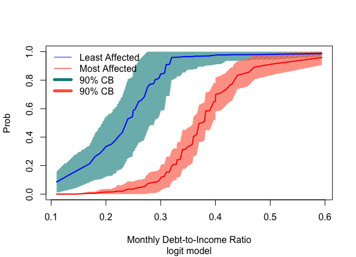
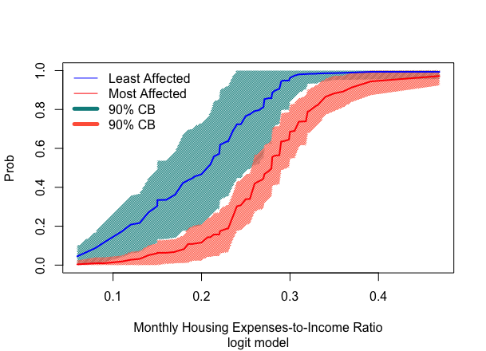
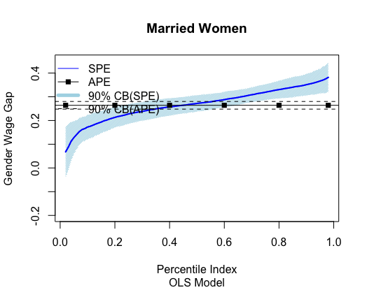
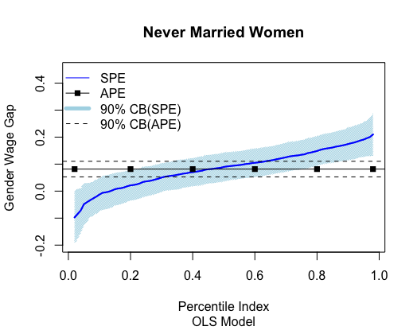
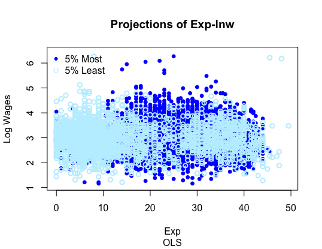
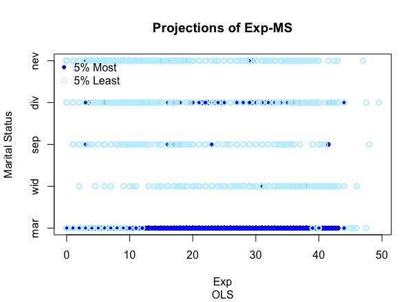

::: article
# The sorted effects method

Many empirical questions in econometrics, machine learning and
statistics boil down to studying how changes in a key variable $T$
affect an outcome variable of interest $Y$, holding fixed some control
variables $W$. Such effects are called predictive partial effects (PEs),
or treatment or structural partial effects when they have a causal or
structural interpretation. Depending on the context, researchers often
work with models that feature nonlinearity in the key variable of
interest or nonlinearity in parameters. The first kind of models
includes mean and quantile regressions in which $T$ is interacted with
$W$, while the second type includes generalized linear models such as
logit and probit. The methods implemented in
[*SortedEffects*](https://CRAN.R-project.org/package=SortedEffects) are
designed to estimate and make inference on PEs in nonlinear models.

In nonlinear models the PEs vary with the underlying control variables.
Consider the probit model as an example. The conditional probability of
$\left\{Y=1\right\}$ is
$$\Pr\left(Y = 1 \mid T=t,W=w\right) =\Phi\left(t\beta+w'\gamma\right),$$
where $\Phi$ denotes CDF of standard normal distribution. Then, the PE
of changing $T$ on $Y$, holding $W$ fixed at $w$, is
$$\Phi\left(\beta+w'\gamma\right)-\Phi\left(w'\gamma\right)$$
when $T$ is binary with values $0$ and $1$, or
$$\phi\left(t\beta+w'\gamma\right)\beta, \quad \phi\left(u\right) = \partial \Phi\left(u\right)/ \partial u,$$
when $T$ is continuous. Since $W$ typically differ among observational
units, the PEs are heterogeneous.

More generally, suppose we have a regression function $g\left(X\right)$
corresponding to some characteristic of $Y$ conditional on the
covariates $X:=\left[T, W\right]$. Let $\Delta\left(x\right)$ denote the
PE of $T$ on $Y$, holding $W$ fixed. Then,
$$\Delta\left(x\right)=g\left(t_{1}, w\right)-g\left(t_{0}, w\right)$$
if $T$ is discrete and takes values $t_0$ and $t_1$, or
$$\Delta\left(x\right)=\partial g\left(t, w\right)/ \partial t$$
if $T$ is continuous and $t \mapsto g\left(t,w\right)$ is
differentiable. As $\Delta\left(x\right)$ is a function of $x$, the PE
of an observational unit, $\Delta\left(X\right)$, is a random variable
with a distribution induced by the distribution of $X$. A popular
statistic to summarize the heterogeneity of $\Delta\left(X\right)$ is
the average partial effect (APE):
$$E\left[\Delta(X)\right]=\int\Delta\left(x\right)d\mu\left(x\right),$$
where $\mu$ denotes the distribution of $X$ in the population of
interest. However, the APE might provide an incomplete summary of
$\Delta\left(X\right)$ as it neglects all the heterogeneity by design.

@sorted:2018 proposed the sorted partial effect (SPE) method to provide
a more complete summary of $\Delta\left(X\right)$. This method consists
on reporting the entire set of PEs, sorted in increasing order and
indexed by a user-specified ranking in the population of interest. More
specifically, the SPEs are defined as percentiles of the PE in the
population of interest, that is
$$\Delta^{*}_{\mu}\left(u\right)=u^{th}-\text{quantile of } \Delta\left(X\right), \quad X \sim \mu.$$
The SPEs are also useful to conduct classification analysis (CA). This
analysis consists of two steps. First, classify the observational units
with PEs above or below some thresholds defined by tail SPEs in the most
or least affected groups. Second, report and compare the moments or
distributions of the outcome and covariates in the two groups.

To apply the methods in practice, we need to replace $\Delta$ and $\mu$
by sample analogs $\hat \Delta$ and $\hat \mu$, and quantify the
sampling uncertainty. @sorted:2018 derived the theoretical underpinnings
of the resulting empirical SPEs. We refer the interested reader to that
paper for details. We expect the method to be helpful to a large
audience. For example, medical researchers are often interested in
estimating the treatment effect of a drug. Treated units can experience
different effects due to individual characteristics such as age and
health status. The
[*SortedEffects*](https://CRAN.R-project.org/package=SortedEffects)
package thus provides a way to visualize the heterogeneity in the
effect. Researchers can also define the most and least affected groups
and compare their characteristics.

The rest of the vignette proceeds as follows. We first introduce the
main functions within the
[*SortedEffect*](https://CRAN.R-project.org/package=SortedEffect)
package and use an application to racial-based discrimination in
mortgage lending to illustrate the command options. Then we provide
another application to gender wage gap using the Current Population
Survey (CPS) data. The empirical results show that the SPE method is
effective in uncovering heterogeneous effects and demographic
differences between the most and least affected groups in both
applications.

# The [*SortedEffects*](https://CRAN.R-project.org/package=SortedEffects) package

## Functions in the package

The package contains three main commands: `spe`, `ca`, and `subpop`. The
package adds three methods to the generic `plot()` (`plot.spe`,
`plot.ca` and `plot.subpop`) and `summary()` (`summary.spe`,
`summary.ca` and `summary.subpop`). In practice, users only need to type
`plot` and `summary` since the generic commands will automatically
dispatch the appropriate method. In this section we explain the options
in each function respectively. Lastly we briefly explain the bootstrap
procedures for inference and bias correction. We provide the
mathematical expressions and an application to racial discrimation in
mortgage lending to facilitate the understanding of the options of the
commands.

## spe

The command `spe` provides estimation and inference methods for the SPE
and APE. The general syntax is:

``` r
spe(fm, data, method = c("ols", "logit", "probit", "QR"), 
    var_type = c("binary", "continuous", "categorical"), var, compare, subgroup = NULL, 
    samp_weight = NULL, us = c(1:9)/10, alpha = 0.1, taus = c(5:95)/100, 
    b = 500, parallel = FALSE, ncores = detectCores(), seed = 1, bc = TRUE,
    boot_type = c("nonpar", "weighted"))
```

The option `fm` stores the user-specified regression formula to estimate
the PEs, which assigns the outcome $Y$ on the left-hand-side of a $\sim$
operator, and the covariates $X$ on the right-hand-side, separated by
`+` operators. The option `data` specifies the data set that contains
the variables for the analysis. The user needs to specify the variable
of interest $T$ in `var` as a string. The package accommodates four
regression methods to estimate the PE, $\Delta\left(x\right)$: OLS
(default), probit (`"probit"`), logit (`"logit"`) and quantile
regression (`"QR"`).[^1] If `"QR"` is called, then the user needs to
further specify the quantile indexes with `taus`. The default is
`taus = c(5:95)/100`.

The option `samp_weight` allows the user to input sampling weights. When
`samp_weight = NULL`, the default, the package automatically uses a
vector of ones, i.e. no sampling weights are used.

The package provides three options for the variable of interest `var`:

1.  `var_type = "binary"` if `var` is a binary variable such as a black
    or female indicator.

2.  `var_type = "categorical"` if `var` is a categorical (factor)
    variable with more than 2 levels. One example is means of
    transportation with labels `"bus"`, `"train"` or `"bike"`. In this
    case, the user needs to further specify the two labels to be
    compared with the option `compare`. If the user is interested in the
    effect of changing from bus to bike, then
    `compare = c("bus", "bike")`. If the data only have levels, say
    `"1", "2"` and `"3"`, the users need to input levels instead.

3.  `var_type = "continuous"` if `var` is a continuous variable. The
    package obtains the PEs using a central difference numerical
    derivative of the form:
    $$f'\left(x\right)=\lim_{h\rightarrow 0}\frac{f\left(x+h\right)-f\left(x-h\right)}{2h},$$
    where $h$ is set to be `1e-7`. We avoid the symbolic derivative
    because it cannot correctly interpret terms involving `I()` for
    transformations of the variables such as powers, and can therefore
    cause erroneous estimation. The code of this part is inspired by
    Thomas Leeper's vignette on the
    [*margins*](https://CRAN.R-project.org/package=margins) package
    [@margins].

The option `subgroup` allows the user to specify the population of
interest. The default is `NULL`, which corresponds to the entire
population. If the user is interested in subpopulations, say households
whose `income` is lower than $10,000$ dollars, and the data in use is
called `Data`, then the user can set
`subgroup = Data[, "income"] < 10000`. When $T$ is a binary treatment
indicator, the user can specify that the population of interest is the
treated population with `subgroup = Data[, var] == 1`. Note that users
cannot input subgroup directly to the `data` option or using the
`subset` option because the SPE methods use the whole sample to estimate
the PEs. The option `subgroup` only specifies the population for the
estimation of $\mu$, the distribution of $X$.

The option `us` specifies the set of quantile indexes corresponding to
the estimated SPE to be reported. The mathematical definition of each
empirical SPE is
$$\widehat{\Delta}^{*}_{\widehat{\mu}}\left(u\right) = u^{th}-\text{quantile of } \widehat{\Delta}\left(X\right), \quad X \sim \widehat{\mu}.$$

The empirical SPE function
$$\left\{u\mapsto \widehat{\Delta}^{*}_{\widehat{\mu}}\left(u\right): u\in\mathcal{U}\right\}, \quad \mathcal{U}\subset\left[0,1\right]$$
then outputs the SPEs with quantile indexes in the set $\mathcal{U}$.
The option `us` specifies $\mathcal{U}$. For example,
`us = c(0.25, 0.5, 0.75)` specifies to report the SPEs corresponding to
the three quartiles.

The option `alpha` specifies the significance level of the confidence
bands. The default is `alpha = 0.1`, i.e. $90\%$ confidence level. The
option `b` specifies the number of bootstrap repetitions. The default is
`b = 500`.

The package supports two types of bootstrap: nonparametric
(`boot_type = "nonpar"`) and weighted with standard exponential weights
(`boot_type = "weighted"`). The user can fix the random seed for
bootstrap simulation with the option `seed` and decide whether or not to
bias-correct the estimates with the option `bc`. The default is
`bc = TRUE`. Bootstrap and bias-correction will be discussed in section
2.5. The package features parallel computing, which is convenient to
speed up the bootstrap. The user can use the option `parallel` to turn
on or off parallel computing. If `parallel = TRUE`, the option `ncores`
allows the user to specify the number of cores in the parallel
computing. The default is `ncores = detectCores()`, where
`detectCores()` is a command of the package
[*parallel*](https://CRAN.R-project.org/package=parallel).

The output of `spe` is a list containing four components: `spe`, `ape`,
`us` and `alpha`. As the names indicate, `spe` stores the results for
the SPE, and `ape` stores the results for the APE. Each component is a
list with four elements: the estimates, lower and upper bounds of the
uniform confidence bands, and bootstrapped standard errors obtained as
rescaled interquartile ranges; see @sorted:2018. The other two
components respectively store the percentile indices of the SPE and
significance level of the confidence bands, which are used in the
functions `plot.spe` and `summary.spe`.

The `plot.spe` function plots the result of `spe` in one graph that
includes the SPEs, APE and their corresponding confidence bands. Its
general syntax is

``` r
plot.spe(object, ylim = NULL, main = NULL, sub = NULL, xlab = "Percentile Index", 
         ylab = "Sorted Effects", ...)
```

where `object` is the output of `spe`. The range of the x-axis is fixed
to be the range of user-specified quantile index `us`. The options
`ylim`, `xlab` and `ylab` respectively denote range of the y-axis and
labels of the two axes. The options `main` and `sub` allow users to
specify the main and sub titles of the plot. The option `...` is an
argument of the generic `plot` command that allows for further graphic
parameters.

The syntax of `summary.spe` is as follows

``` r
summary.spe(object, result = c("sorted", "average"), ...)
```

If `result = "sorted"`, the method provides a table that contain the SPE
percentile indexes, estimates, bootstrap standard errors, pointwise and
uniform confidence bands. If `result = "average"`, the methods tabulates
APE estimate, bootstrap standard error and confidence interval.

We illustrate the usage of the command with an empirical application to
racial discrimination in mortgage lending. We use data on mortgage
applications in Boston from 1990 [@data]. The Federal Reserve Bank of
Boston collected these data in relation to the Home Mortgage Disclosure
Act (HMDA), which was passed to monitor minority access to the mortgage
market. To retrieve the data from the package, issue the command

``` r
data("mortgage")
```

The outcome variable, $Y$, is `deny`, a binary indicator for mortgage
denial. The key variable of interest, $T$, is `black`, a binary
indicator for the applicant being black, while the control variables,
$W$, are financial and demographical characteristics that might affect
the mortgage decision of the bank. These characteristics include the
debt-to-income ratio (`p_irat`), expenses-to-income ratio (`hse_inc`),
bad consumer credit (`ccred`), bad mortgage credit (`mcred`), credit
problems (`pubrec`), denied mortgage insurance (`denpmi`), medium
loan-to-house value (`ltv_med`), high loan-to-house value (`ltv_high`),
self employed (`selfemp`), single (`single`), and high school graduate
(`hischl`). The regression formula for the estimation of the PEs is
specified as:

``` r
fm <- deny ~ black + p_irat + hse_inc + ccred + mcred + pubrec + ltv_med + ltv_high + 
      denpmi + selfemp + single + hischl
```

We invoke the `spe` command to calculate the bias-corrected estimates of
the SPE at the quantile indexes
$\left\{0.02, 0.03, \ldots, 0.98 \right\}$ for the entire population
using a logit model.

``` r
test <- spe(fm = fm, data = mortgage, var = "black", method = "logit", us = c(2:98)/100, 
            b = 500, bc = TRUE)
```

The output `test` includes the estimates and confidence bands for the
APE and SPE in the entire population. We use `plot` to visualize the
results.

``` r
plot(x = test, ylim = c(0, 0.25), ylab = "Change in Probability", 
     main = "APE and SPE of Being Black on the Prob of Mortgage Denial",
     sub = "Logit Model")
```

{#fig1 width="100%"
alt="graphic without alt text"}

The result in Figure ([1](#fig1)) shows significant heterogeneity in the
SPEs, with the PEs ranging from 0 to 14%. The APE misses this
heterogeneity, and therefore provides an incomplete picture of the
effects.

We can also tabulate the result using `summary`. First, we apply the
command to the APE and display the results in Table ([1](#table1)).

``` r
summary(test, result = "average")
```

::: {#table1}
  ---------------------------------------
            Est      SE   90% LB   90% UB
  ----- ------- ------- -------- --------
    APE   0.051   0.019    0.021    0.081

  ---------------------------------------

  : Table 1: Bias-corrected estimate and 90% band for APE of black
  indicator on probability of mortgage denial.
:::

Next, we obtain the results for the SPE. To save space we only show the
first 15 rows of `summary(test)` in Table ([2](#table2)). The columns
labelled as PLB and PUB correspond to the lower and upper pointwise
confidence bands, whereas the columns labelled as ULB and UUB correspond
to their uniform counterparts.

``` r
summary(test)
```

::: {#table2}
  --------------------------------------------------------------
             Est      SE   90% PLB   90% PUB   90% ULB   90% UUB
  ------ ------- ------- --------- --------- --------- ---------
    0.02   0.011   0.005     0.003     0.018     0.001     0.020

    0.03   0.012   0.005     0.004     0.020     0.002     0.022

    0.04   0.013   0.006     0.004     0.022     0.002     0.024

    0.05   0.014   0.006     0.004     0.023     0.002     0.025

    0.06   0.014   0.006     0.004     0.024     0.002     0.026

    0.07   0.015   0.007     0.004     0.026     0.002     0.028

    0.08   0.016   0.007     0.005     0.027     0.003     0.029

    0.09   0.017   0.007     0.005     0.029     0.003     0.031

     0.1   0.018   0.007     0.006     0.030     0.003     0.032

    0.11   0.018   0.008     0.005     0.031     0.003     0.033

    0.12   0.019   0.008     0.006     0.031     0.004     0.034

    0.13   0.019   0.008     0.006     0.032     0.004     0.035

    0.14   0.020   0.008     0.007     0.034     0.004     0.036

    0.15   0.021   0.008     0.007     0.034     0.004     0.037

    0.16   0.021   0.009     0.007     0.035     0.004     0.038
  --------------------------------------------------------------

  : Table 2: Bias-corrected estimates and 90% pointwise and uniform
  bands for SPE of black indicator on probability of mortgage denial.
:::

## ca

The command `ca` provides estimation and inference methods for the CA.
The general syntax is:

``` r
ca(fm, data, method = c("ols", "logit", "probit", "QR"),
   var_type = c("binary", "continuous", "categorical"), var,
   compare, subgroup = NULL, samp_weight = NULL, taus = c(5:95)/100,
   u = 0.1, interest = c("moment", "dist"),
   t = c(1, 1, rep(0, dim(data)[2] - 2)), cl = c("both", "diff"),
   cat = NULL, alpha = 0.1, b = 500, parallel = FALSE,
   ncores = detectCores(), seed = 1, bc = TRUE,
   range_cb = c(1:99)/100, boot_type = c("nonpar", "weighted"))
```

The first step in the CA is to classify the observational units in most
and least affected groups based on some tail SPEs. The option `u`
specifies the quantile index of the tail SPEs. Thus, the $u$-least
affected group includes the observational units with
$\widehat{\Delta}(X)<\widehat{\Delta}^{*}_{\widehat{\mu}}\left(u\right)$
and the $u$-most affected group the units with
$\widehat{\Delta}(X)>\widehat{\Delta}^{*}_{\widehat{\mu}}\left(1-u\right)$.
The default is `u = 0.1` to obtain the 10% least and most affected
groups. The option `subgroup` specifies the population of interest and
has the same syntax as in the `spe` command.

Let
$\widehat{\Lambda}^{-u}_{\widehat{\Delta}, \widehat{\mu}}\left(t\right)$
and
$\widehat{\Lambda}^{+u}_{\widehat{\Delta}, \widehat{\mu}}\left(t\right)$
denote the objects of interest in the least and most affected groups for
the CA. Define
$$\widehat{\Lambda}^{u}_{\widehat{\Delta}, \widehat{\mu}}\left(t\right) := \left[\widehat{\Lambda}^{-u}_{\widehat{\Delta}, \widehat{\mu}}\left(t\right), \widehat{\Lambda}^{+u}_{\widehat{\Delta}, \widehat{\mu}}\left(t\right)\right].$$
These objects are indexed by the vector $t$, which specifies the
variables of interest among the outcome and covariates. The option `t`
is a vector that specifies $t$. Suppose the data has 5 variables
(`"a", "b", "c", "d", "e"`) and we are interested in `"a"` and `"c"`,
then we can either set `t = c("a", "c")` directly or
`t = c(1, 0, 1, 0, 0)`. The second approach requires the user to know
the order of the variables in the data set, which can be found with the
command `View`.

Let $Z$ denote the set of variables of interest. The package provides
two types of objects of interest. If `interest = "moment"`, then
$\widehat{\Lambda}^{u}_{\widehat{\Delta}, \widehat{\mu}}\left(t\right)$
include the means of the variables in $Z$ for the least and most
affected groups. If `interest = "dist"`, then
$\widehat{\Lambda}^{u}_{\widehat{\Delta}, \widehat{\mu}}\left(t\right)$
includes the distributions of the variables in $Z$ for the least and
most affected groups.

If `interest = "moment"`, `ca` estimates and makes inference on features
of the chosen variables of interest in the least and most affected
groups. These features are specified with the option `cl`. For example,
if `cl = "both"`, the command estimates the mean of the variables in the
two affected groups. On the other hand, `cl = "diff"` estimates the
differences of the means of the variables between the two groups.

If `interest = "dist"`, the option `range_cb` specifies the region of
interest for the domain of the distribution[^2]. For example, if the
variable of interest `x` is discrete, we can specify the region of
interest as the support of `x` with `range_cb = NULL`. If `x` is
continuous, we can specify `range_cb = c(1:99)/100` if we are interested
in the percentiles with indexes
$\left\{0.01, 0.03, \ldots, 0.99\right\}$. The default is
`range_cb = c(1:99)/100`. The choice `range_cb = NULL` shuts down this
feature by settimg the region of interest as all the distint values of
the variable.

The output of `ca` depends on the choice of `interest`. For
`interest = "moment"`, the output is a list containing the estimates of
$\widehat{\Lambda}^{u}_{\widehat{\Delta}, \widehat{\mu}}\left(t\right)$,
bootstrapped standard errors, pointwise and adjusted p-values. The null
hypothesis for the p-values is that the estimated coefficient is zero.
The p-values are adjusted for multiplicity to account for joint testing
for all variables. In addition, users can adjust the pointwise p-values
to account for joint testing for all simulataneous tests of categories
within a factor. For example, if the variables of interest include a
marital status factor `"ms"` with labels
`("nevermarried", "married", "divorced", "separated", "widowed")`, then
users could consider adjusting the pointwise p-values within this
factor. To illustrate how to define the option `cat`, suppose we have
selected specified 3 variables of interest: `t = c("a", "b", "c")`.
Without loss of generality, assume `"a"` is not a factor, while `"b"`
and `"c"` are two factors. Then we need to specify `cat` as
`cat = c("b", "c")`. If `cat = NULL`, we report the unadjusted pointwise
p-values. If `interest = "dist"`, the output is a list containing the
rearranged estimates, upper confidence bands and lower confidence bands
for the variables of interest in both groups.

When `interest = "moment"`, the user can use method `summary.ca` to
tabulate the output. The general syntax is

``` r
summary.ca(object, ...)
```

If `cl = "both"`, the p-values are omitted from the table. When
`interest = "dist"`, users can plot the output for better visualization.
The general syntax is

``` r
plot.ca(object, var, main = NULL, sub = NULL, xlab = NULL, ylab = NULL, ...)
```

The user needs to input the variable for plotting with the option `var`.
Note that the variable must be one of the variables specified in `t`.

Returning to the mortgage denial example, we classify the 10% least and
most affected applicants and compare their characteristics. The
variables of interest include `deny`, `black` and all the controls. We
first specify `t` to reflect the choice of variables of interest[^3]

``` r
t <- c("deny", "p_irat", "black", "hse_inc", "ccred", "mcred", "pubrec", "denpmi", 
       "selfemp", "single", "hischl", "ltv_med", "ltv_high")
```

Then we invoke the `ca` command and summarize the result.

``` r
CA <- ca(fm = fm, data = mortgage, var = "black", method = "logit", cl = "both", 
         t = t, b = 500, bc = TRUE)
summary(CA)
```

::: {#table3}
  ---------------------------------------
               Most     SE   Least     SE
  ---------- ------ ------ ------- ------
        deny   0.45   0.03    0.09   0.04

      p_irat   0.39   0.01    0.25   0.02

       black   0.38   0.03    0.06   0.02

     hse_inc   0.28   0.01    0.21   0.02

       ccred   4.80   0.26    1.28   0.09

       mcred   2.01   0.06    1.36   0.10

      pubrec   0.46   0.05    0.05   0.02

      denpmi   0.01   0.01    0.04   0.03

     selfemp   0.17   0.04    0.04   0.03

      single   0.61   0.06    0.09   0.07

      hischl   0.93   0.03    1.00   0.01

     ltv_med   0.59   0.06    0.05   0.04

    ltv_high   0.12   0.04    0.01   0.01
  ---------------------------------------

  : Table 3: Bias-corrected estimates and standard errors for the
  average characteristics of the groups with the 10% most and least
  effected applicants by the racial mortgage denial gap.
:::

Table ([3](#table3)) shows that the 10% of the applicants most affected
by the racial mortgage denial gap are more likely to have either of the
following characteristics relative to the 10% of the least affected
applicants: mortgage denied, high debt-to-income ratio, black, high
expense-to-income ratio, bad consumer or credit scores, credit problems,
self employed, single, no high school diploma, and medium or high
loan-to-income ratio.

Next we test if the differences in the characteristics between the two
groups are statistically significant. To do so we set `cl = "diff"`,
which means taking difference between the two groups. The full command
is as follows

``` r
CAdiff <- ca(fm = fm, data = mortgage, var = "black", t = t, method = "logit", 
             cl = "diff", b = 500, bc = TRUE)
summary(CAdiff)
```

::: {#table4}
  -----------------------------------------------
               Estimate     SE   JP-vals   P-vals
  ---------- ---------- ------ --------- --------
        deny       0.36   0.05      0.00     0.00

      p_irat       0.14   0.02      0.00     0.00

       black       0.32   0.04      0.00     0.00

     hse_inc       0.07   0.02      0.13     0.00

       ccred       3.52   0.28      0.00     0.00

       mcred       0.65   0.15      0.01     0.00

      pubrec       0.41   0.05      0.00     0.00

      denpmi      -0.03   0.04      1.00     0.23

     selfemp       0.13   0.06      0.48     0.02

      single       0.53   0.10      0.00     0.00

      hischl      -0.06   0.03      0.48     0.02

     ltv_med       0.54   0.07      0.00     0.00

    ltv_high       0.10   0.03      0.10     0.00
  -----------------------------------------------

  : Table 4: Bias-corrected estimates, standard errors, and p-values for
  the differences in average characteristics between the groups with the
  10% most and least affected applicants by the racial mortgage denial
  gap. P-values are for the hypothesis that the difference is zero.
  P-vals are pointwise p-values for each difference and JP-vals are
  joint p-values that account for simultaneous inference on all the
  differences.
:::

Table ([4](#table4)) shows the results. The joint p-values account for
the fact that we conduct simultaneous inference on 13 differences of
variables. We employ the so-called "single-step" methods for controlling
the family-wise error rate and obtain the p-values by bootstrap. We find
that 8 differences are jointly statistically different from zero at the
5% level and 9 at the 10% level.

We also plot the distributions of monthly debt-to-income ratio
(`p_irat`) and monthly housing expenses-to-income ratio (`hse_inc`) for
both groups. Such plots are useful if the user wants to visualize if
there is stochastic dominance between the two groups. To do so we use
the `ca` command and change the `interest` to `"dist"`.

``` r
t2 <- c("p_irat", "hse_inc")
CAdist <- ca(fm = fm, data = mortgage, var = "black", method = "logit", t = t2, 
             b = 500, interest = "dist")
plot(CAdist, var = "p_irat", ylab = "Prob", xlab = "Monthly Debt-to-Income Ratio", 
     sub = "logit model")
plot(CAdist, var = "hse_inc", ylab = "Prob", 
     xlab = "Monthly Housing Expenses-to-Income Ratio", sub = "logit model")
```

<figure id="fig2">
<p></p>
<figcaption>Figure 2: Output of <code>plot.ca</code>. Bias-corrected
estimates and 90% confidence bands for the distribution of
<code>p_irat</code> and <code>hse_inc</code> in the 10% most and least
affected groups by the racial mortgage denial gap. Confidence bands
obtained by bootstrap with 500 replications.</figcaption>
</figure>

Figure ([2](#fig2)) shows that for both variables the distribution in
the most affected group first-order stochastically dominates the
distribution in least affected group.

## subpop

In addition to means and distributions, we can conduct inference on the
sets of most and least affected units. Let $\mathcal{Z}$ be a compact
subset of the support of the outcome and covariates. Define
$$\mathcal{M}^{-u}\equiv \left\{\left(x,y\right)\in\mathcal{Z}: \Delta\left(x\right)\leq\Delta^{*}_{\mu}\left(u\right)\right\}$$
as the set of the least affected units and
$$\mathcal{M}^{+u}\equiv \left\{\left(x,y\right)\in\mathcal{Z}: \Delta\left(x\right)\geq\Delta^{*}_{\mu}\left(1-u\right)\right\}$$
as the set of the most affected units. The command `subpop` provides
estimation and inference methods for these sets. The general syntax is

``` r
subpop(fm, data, method = c("ols", "logit", "probit", "QR"),
       var_type = c("binary", "continuous", "categorical"), var, compare, 
       subgroup = NULL, samp_weight = NULL, taus = c(5:95)/100, u = 0.1, alpha = 0.1, 
       b = 500, seed = 1, parallel = FALSE, ncores = detectCores(), 
       boot_type = c("nonpar", "weighted"))
```

No new option is introduced in the command. For theoretical details, we
refer the reader to @setinf.

The output of `subpop` is a list containing six components: `cs_most`,
`cs_least`, `u`, `subgroup`, `most` and `least`. As the names indicate,
`cs_most` and `cs_least` denote the confidence sets for the most and
least affected groups. `u` stores the percentile index that defines the
most and least affected groups. `subgroup` stores the indicators for the
population of interest specified with the option `subgroup`. `most` and
`least` store the estimates of the most and least affected units
respectively. The first four components are used in `plot.subpop` and
the last two components can be visualized with `summary.subpop`.

The general syntax of `summary.subpop` is

``` r
summary.subpop(object, affected = c("most", "least"), vars = NULL, ...)
```

The option `object` is the output of `subpop`. The option `affected`
allows users to tabulate either the most or the least affected units,
and the option `vars` provides summary statistics for user-specified
variables of interest. The summary statistics include the minimum, 1st
quartile, median, mean, 3rd quaritle and maximum. The default is `NULL`,
which produces summary statistics of all the variables.

The `plot.subpop` function plots 2-dimensional projections of the
confidence sets for the most and least affected units with respect to
two variables. The general syntax is

``` r
plot.subpop(object, varx, vary, xlim = NULL, ylim = NULL, main = NULL, sub = NULL, 
            xlab = NULL, ylab = NULL, overlap = FALSE, ...)
```

The user needs to specify the two variables for the projection with
`varx` and `vary`, and `object` should be specified as the output of
`subpop`. The option `overlap` allows users to either keep or drop
common observations in both confidence sets. The default is
`overlap = FALSE`, which drops the observations.

We estimate the 10% most and least affected applicants in the mortgage
application.

``` r
set_b <- subpop(fm, data = mortgage, method = "logit", var = "black", u = 0.1, 
                alpha = 0.1, b = 500)
```

Using `summary`, we can estimate the most/least affected applicants and
report summary statistics of the variables of interest in the most/least
affected groups. Table [5](#table5) lists the estimated most affected
applicants. For the purpose of illustration we only show the first ten
rows and columns.

``` r
groups <- summary(set_b, vars = c("p_irat", "hse_inc"))
most_affected <- groups$most_affected
```

::: {#table5}
  ---------------------------------------------------------------------------------------------
         deny   p_irat   black   hse_inc   loan_val   ccred   mcred   pubrec   denpmi   selfemp
  ---- ------ -------- ------- --------- ---------- ------- ------- -------- -------- ---------
     1   1.00     0.46    0.00      0.27       0.84    5.00    2.00     0.00     0.00      0.00

     2   1.00     0.38    0.00      0.26       0.88    6.00    1.00     1.00     0.00      0.00

     3   0.00     0.40    0.00      0.34       0.80    2.00    2.00     0.00     0.00      1.00

     4   1.00     0.24    0.00      0.23       0.90    5.00    2.00     0.00     0.00      0.00

     5   0.00     0.38    0.00      0.25       0.80    6.00    2.00     1.00     0.00      0.00

     6   0.00     0.36    0.00      0.13       0.95    5.00    2.00     0.00     0.00      0.00

     7   0.00     0.35    0.00      0.27       0.90    6.00    2.00     0.00     0.00      0.00

     8   1.00     0.30    0.00      0.30       0.50    6.00    2.00     1.00     0.00      0.00

     9   1.00     0.37    0.00      0.23       0.80    6.00    2.00     1.00     0.00      0.00

    10   1.00     0.39    0.00      0.27       0.90    6.00    2.00     1.00     0.00      0.00
  ---------------------------------------------------------------------------------------------

  : Table 5: Elements of the estimated group of the 10% most affected
  applicants by racial mortgage denial gap.
:::

We can also report summary statistics of the variables of interest in
the most and least affected groups using the output of `summary`. Table
([6](#table6)) reports summary statistics for `p_irat` and `hse_inc` for
the applicants in the most affected group.

``` r
sum_stats_most <- groups$stats_most
```

::: {#table6}
  ---------------------------------
                   p_irat   hse_inc
  -------------- -------- ---------
             Min     0.16      0.01

    1st Quartile     0.34      0.23

          Median     0.37      0.28

            Mean     0.39      0.28

    3rd Quartile     0.42      0.32

             Max     1.16      0.74
  ---------------------------------

  : Table 6: Summary statistics of the estimated group of the 10% most
  affected applicants by racial mortgage denial gap.
:::

We finally plot the projection of the confidence sets for the most and
least affected applicants with respect to `p_irat` and `hse_inc`. Figure
([3](#fig3)) keeps the overlapped observations and shows that the most
affected applicants tend to have higher levels of debt to income and
expenses to income ratios.

``` r
plot(set_b, varx = mortgage$p_irat, vary = mortgage$hse_inc, xlim = c(0, 1.5), 
     ylim = c(0, 1.5), xlab = "Debt/Income", ylab = "Housing expenses/Income", 
     overlap = TRUE)
```

{#fig3 width="100%"
alt="graphic without alt text"}

## Inference

@sorted:2018 derived the asymptotic distributions and bootstrap validity
for the estimators of the SPE and classification analysis. The package
uses bootstrap to compute standard errors and critical values for tests
and confidence bands.

The package features nonparametric and weighted bootstrap. When
`boot_type = "nonpar"`, the package draws samples with replacement of
the variables and `samp_weight` and run all estimation commands weighted
by `samp_weight`. When `boot_type = "weighted"`, the package draws
weights from the standard exponential distribution and runs all
estimation commands weighted by the product of these weights and
`samp_weight`. We use the
[*boot*](https://CRAN.R-project.org/package=boot) package [@boot], which
is flexible enough to accommodate both types.

**Inference on SPE** The $\left(1-\alpha\right)$-uniform confidence band
of $\Delta^{*}_{\mu}\left(u\right)$ in $\mathcal{U}$ is
$$\left[\widehat{\Delta}^{*}_{\widehat{\mu}}-\widehat{t}_{1-\alpha}\left(\mathcal{U}\right)\widehat{\Sigma}\left(u\right)^{1/2}/\sqrt{n}, \quad \widehat{\Delta}^{*}_{\widehat{\mu}}+\widehat{t}_{1-\alpha}\left(\mathcal{U}\right)\widehat{\Sigma}\left(u\right)^{1/2}/\sqrt{n}\right],$$
where $\widehat{t}_{1-\alpha}\left(\mathcal{U}\right)$ is a bootstrapped
uniform critical value and $\widehat{\Sigma}\left(u\right)^{1/2}$ is a
boostrapped standard error of
$\widehat{\Delta}^{*}_{\widehat{\mu}}\left(u\right)$.[^4] To deal with
the possibility that the end-point functions of the confidence band
$u \mapsto \widehat{\Delta}^{*}_{\widehat{\mu}}\pm\widehat{t}_{1-\alpha}\left(\mathcal{U}\right)\widehat{\Sigma}\left(u\right)^{1/2}/\sqrt{n}$
be nonincreasing, we monotonize these functions via rearrangement
[@rearrangement]. The $\left(1-\alpha\right)$-pointwise confidence band
of $\Delta^{*}_{\mu}\left(u\right)$ is obtained replacing
$\widehat{t}_{1-\alpha}\left(\mathcal{U}\right)$ by the
$\left(1-\alpha/2\right)$-quantile of the standard normal distribution.

**Inference on CA** The joint $p$-value for the hypothesis
$\Lambda^{+u}_{\Delta, \mu}\left(t\right) = \Lambda^{-u}_{\Delta, \mu}\left(t\right)$
for all $t\in\mathcal{T}$ is
$$\Pr\left(\hat{t}^{u}\left(\mathcal{T}\right) > \sup_{t\in\mathcal{T}} \frac{|c'\widehat{\Lambda}^{u}_{\widehat{\Delta}, \widehat{\mu}}(t)c|}{\sqrt{c'\hat{\Sigma}^{u}\left(t\right)c}}\right),$$
where $c=\left(-1,1\right)'$, $\hat{t}^{u}\left(\mathcal{T}\right)$ is a
bootstrap estimator of
$$t^{u}\left(\mathcal{T}\right) = \sup_{t\in\mathcal{T}} \frac{|c'\widehat{\Lambda}^{u}_{\widehat{\Delta}, \widehat{\mu}}\left(t\right)c - c'\Lambda^{u}_{\Delta, \mu}\left(t\right)c|}{\sqrt{c'\Sigma^{u}\left(t\right) c}},$$
and $\hat{\Sigma}^{u}\left(t\right)$ is a bootstrap estimator of
$\Sigma^{u}\left(t\right)$, the asymptotic variance of
$\widehat{\Lambda}^{u}_{\widehat{\Delta}, \widehat{\mu}}\left(t\right)$.[^5]
The poitwise $p$-value for the hypothesis
$\Lambda^{+u}_{\Delta, \mu}\left(t\right) = \Lambda^{-u}_{\Delta, \mu}\left(t\right)$
is obtained by setting $\mathcal{T} = \left\{t\right\}$.

**Inference on sets of least/most affected units** The outer
$\left(1-\alpha\right)$-confidence set for $\mathcal{M}^{-u}$ is
$$\mathcal{C}\mathcal{M}^{-u}\left(1-\alpha\right)=\left\{\left(x, y\right)\in\mathcal{Z}: \widehat{\Sigma}^{-1/2}\left(x, u\right)\sqrt{n}\left[\widehat{\Delta}\left(x\right)-\widehat{\Delta}^{*}_{\mu}\left(u\right)\right]\leq\hat{c}\left(1-\alpha\right)\right\},$$
where $\widehat{\Sigma}\left(x, u\right)$ is an estimator of the
asymptotic variance of
$\widehat{\Delta}\left(x\right)-\widehat{\Delta}^{*}_{\mu}\left(u\right)$.
Similarly the outer $\left(1-\alpha\right)$-confidence set for
$\mathcal{M}^{+u}$ is
$$\mathcal{C}\mathcal{M}^{+u}(1-\alpha)=\left\{\left(x, y\right)\in\mathcal{Z}: \widehat{\Sigma}^{-1/2}\left(x, 1-u\right)\sqrt{n}\left[\widehat{\Delta}^{*}_{\mu}\left(1-u\right)-\widehat{\Delta}\left(x\right)\right]\leq\tilde{c}\left(1-\alpha\right)\right\}.$$
The critical value $\hat{c}\left(1-\alpha\right)$ is the
$\left(1-\alpha\right)$-quantile of the statistic:
$$\tilde{V}^{*}_{\infty}=\sup_{\left\{x\in\mathcal{X}:\widehat{\Delta}\left(x\right)=\widehat{\Delta}^{*}_{\mu}\left(u\right)\right\}}\widehat{\Sigma}^{-1/2}\left(x, u\right)\sqrt{n}\left(\left[\tilde{\Delta}\left(x\right)-\tilde{\Delta^{*}_{\mu}}\left(u\right)\right]-\left[\widehat{\Delta}\left(x\right)-\widehat{\Delta}^{*}_{\mu}\left(u\right)\right]\right).$$
while the critical value $\tilde{c}\left(1-\alpha\right)$ is the
$\left(1-\alpha\right)$-quantile of the statistic:
$$\tilde{V}^{**}_{\infty}=\sup_{\left\{x\in\mathcal{X}:\widehat{\Delta}\left(x\right)=\widehat{\Delta}^{*}_{\mu}\left(1-u\right)\right\}}\widehat{\Sigma}^{-1/2}\left(x, 1-u\right)\sqrt{n}\left(\left[\tilde{\Delta}\left(x\right)-\tilde{\Delta^{*}_{\mu}}\left(1-u\right)\right]-\left[\widehat{\Delta}\left(x\right)-\widehat{\Delta}^{*}_{\mu}\left(1-u\right)\right]\right).$$
To implement
$\sup\left\{x\in\mathcal{X}: \widehat{\Delta}\left(x\right)=\widehat{\Delta}^{*}_{\mu}\left(u\right)\right\}$
in the code, we find the minimum of
$|\widehat{\Delta}\left(x\right)-\widehat{\Delta}^{*}_{\widehat{\mu}}\left(u\right)|$
among all $x$'s.

**Bias-correction** Nonlinear estimators are prone to finite-sample
bias, and bootstrap methods can estimate the bias up to some asymptotic
order. To bias correct the SPE, replace
$\widehat{\Delta}^{*}_{\widehat{\mu}}$ with
$2\widehat{\Delta}^{*}_{\widehat{\mu}}-\overline{\Delta^{*}_{\mu}}$,
where $\overline{\Delta^{*}_{\mu}}$ is the mean of bootstrap draws.
Similarly, for CA we replace
$\widehat{\Lambda}^{u}_{\widehat{\Delta}, \widehat{\mu}}\left(t\right)$
with
$2\widehat{\Lambda}^{u}_{\widehat{\Delta}, \widehat{\mu}}\left(t\right) - \overline{\Lambda^{u}_{\Delta, \mu}}$,
where $\overline{\Lambda^{u}_{\Delta, \mu}}$ is the mean of the
bootstrap draws. Bias-corrected estimates and corresponding inference
will be reported if `bc = TRUE`, the default.

# Gender wage gap application

We analyze the gender wage gap using data from the U.S. March Supplement
of the Current Population Survey (CPS) in 2015. The gender wage gap
measures the difference in wages between female and male workers with
the same observable characteristics. The SPE method allows us to look
for heterogeneity in the gender wage gap and to identify the
characteristics of the most and least affected workers. To retrieve the
data, issue the command

``` r
data(wage2015)
```

The data contain the following variables: log hourly wages (`lnw`); a
marital status factor `ms` with 5 categories
`widowed, divorced, separated, nevermarried, married`; CPS sampling
weights (`weight`); a indicator for female worker (`female`); an
education attainment factor `educ` with 5 categories `lhs` (less than
high school graduate), `hsg` (high school graduate), `sc` (some
college), `cg` (college) and `ad` (advanced degree); a region factor
`region` with 4 categories `mw` (midwest), `so` (south), `we` (west) and
`ne` (northeast); potential work experience `exp1` computed as
$\max\left\{0, \text{age - years of educ} -7\right\}$; 4 powers of
experience (`exp2, exp3, exp4`); an occupation factor `occ` with 5
categories `manager`, `service`, `sales`, `construction` and
`production`, and an industry factor `ind` with 12 categories `minery`,
`construction`, `manufacture`, `retail`, `transport`, `information`,
`finance`, `professional`, `education`, `leisure`, `services` and
`public`.

The CPS data contains sampling weights in the variable `weight`, so we
will set `samp_weight = wage2015$weight`. Because women in general earn
less than men, the PEs are predominately negative if we use the `female`
indicator. To facilitate the interpretation of most and least affected
groups we create an indicator called `male`, which assigns 0 to female
workers instead.

``` r
wage2015$male <- 1 - wage2015$female
```

We apply OLS regression to estimate the PEs using the following
specification

``` r
fmla1 <- lnw ~ male*(ms + (exp1 + exp2 + exp3 + exp4)*educ + occ + ind + region)
```

We first look at the SPE of the gender wage gap at the quantile indexes
$\left\{0.02, 0.03, \ldots, 0.98\right\}$ in the population of women via
the command `spe` and plot the result. We specify that the population of
interest is female workers with `subgroup = wage2015[,"female"] == 1`.

``` r
gap <- spe(fm = fmla1, data = wage2015, samp_weight = wage2015$weight, 
           var = "male", subgroup = wage2015[,"female"] == 1, boot_type = "weighted", 
           us = c(2:98)/100, b = 500, bc = FALSE)

plot(x = gap, main = "APE and SPE of Gender Wage Gap for Women", sub = "OLS Model", 
     xlab = "Percentile Index", ylab = "Gender Wage Gap", ylim = c(-0.1, 0.45))
```

{#fig4 width="100%"
alt="graphic without alt text"}

Figure ([4](#fig4)) shows large heterogeneity in the gender wage gap
that is missed if we only report the APE.

We also compare the SPE across subsets of women defined by marital
status. We implement this by changing the `subgroup` options as follows

``` r
fem_mar <- wage2015[, "female"] == 1 & wage2015[, "ms"] == "married"
fem_nev <- wage2015[, "female"] == 1 & wage2015[, "ms"] == "nevermarried"

gap_mar <- spe(fm = fmla1, data = wage2015, samp_weight = wage2015$weight, 
               var = "male",  subgroup = fem_mar, us = c(2:98)/100, b = 500, 
               bc = FALSE, boot_type = "weighted")

gap_nev <- spe(fm = fmla1, data = wage2015, samp_weight = wage2015$weight,
               var = "male", subgroup = fem_nev, us = c(2:98)/100, b = 500,
               bc = FALSE, boot_type = "weighted")

plot(x = gap_mar, main = "Married Women", sub = "OLS Model", xlab = "Percentile Index", 
     ylab = "Gender Wage Gap", ylim = c(-0.2, 0.45))

plot(x = gap_nev, main = "Never Married Women", sub = "OLS Model", 
     xlab = "Percentile Index",  ylab = "Gender Wage Gap", ylim = c(-0.2, 0.45))
```

Figure ([5](#fig5)) shows the results for the two subpopulations. Here
we find large heterogeneity not only between married and never married
women, but also within these more narrowly defined subpopulations.

<figure id="fig5">
<p></p>
<figcaption>Figure 5: Estimates and 90% confidence bands for the APE and
SPE of the gender wage gap for married and never married women.
Confidence bands obtained by weighted bootstrap with 500
replications.</figcaption>
</figure>

Now we compare the differences in characteristics of the 5% most and
least affected women using weighted bootstrap with $500$ repetitions. We
pick the following variables

``` r
tw <- c("lnw", "female", "ms", "educ", "region", "exp1", "occ", "ind")
```

Since many variables arecategory indicators of the same factor, we can
specify `cat` as follows to get categorical p-values.

``` r
cat <- c("ms", "educ", "region", "occ", "ind")
```

Then we issue the `ca` command and tabulate the mean characteristics of
the two groups

``` r
Char <- ca(fm = fmla1, data = wage2015, samp_weight = wage2015$weight, var = "male", 
           t = tw, cl = "both", b = 500, subgroup = wage2015[,"female"] == 1, 
           boot_type = "weighted", bc = FALSE, u = 0.05)
```

Table ([7](#table7)) reports the estimates and standard errors obtained
by weighted bootstrap with 500 replications. We find that, compared to
the 5% least affected women, the 5% most affected women are much more
likely to be married, much less likely to be never married, less likely
to have an advanced degree, live in the South, don't live in Northeast
and West, possess more potential experience, are more likely to have
sales and non-managerial occupations, and work more often in
manufacture, retail, transport and finance, and less often in education
and leisure industries.

``` r
summary(Char)
```

::: {#table7}
  ------------------------------------------------
                        Most     SE   Least     SE
  ------------------ ------- ------ ------- ------
  lnw                   2.97   0.10    3.02   0.06

  female                1.00   0.00    1.00   0.00

  exp1                 26.58   2.01    8.47   2.54

  occ_manager           0.21   0.13    0.77   0.08

  occ_service           0.04   0.03    0.12   0.06

  occ_sales             0.56   0.14    0.10   0.05

  occ_construction      0.00   0.01    0.01   0.01

  occ_production        0.19   0.08    0.01   0.01

  ind_minery            0.00   0.02    0.00   0.00

  ind_construction      0.00   0.01    0.01   0.01

  ind_manufacture       0.19   0.09    0.02   0.01

  ind_retail            0.17   0.14    0.03   0.02

  ind_transport         0.14   0.07    0.00   0.00

  ind_information       0.00   0.02    0.01   0.02

  ind_finance           0.43   0.17    0.02   0.01

  ind_professional      0.04   0.06    0.05   0.03

  ind_education         0.00   0.03    0.56   0.09

  ind_leisure           0.00   0.00    0.21   0.08

  ind_services          0.00   0.00    0.09   0.05

  ind_public            0.02   0.05    0.02   0.01

  educ_lhs              0.04   0.04    0.04   0.02

  educ_hsg              0.26   0.13    0.04   0.05

  educ_sc               0.50   0.15    0.12   0.06

  educ_cg               0.14   0.11    0.34   0.10

  educ_ad               0.07   0.07    0.46   0.08

  ms_married            1.00   0.02    0.02   0.04

  ms_widowed            0.00   0.00    0.03   0.07

  ms_separated          0.00   0.00    0.03   0.03

  ms_divorced           0.00   0.01    0.07   0.04

  ms_nevermarried       0.00   0.00    0.85   0.12

  region_mw             0.29   0.09    0.28   0.06

  region_so             0.47   0.11    0.25   0.06

  region_we             0.12   0.06    0.22   0.05

  region_ne             0.13   0.07    0.25   0.06
  ------------------------------------------------

  : Table 7: Bias-corrected estimates and standard errors for the
  average characteristics of the groups with the 5% most and least
  affected women by the gender wage gap.
:::

We also test the statistical significance of the mean differences. Table
[8](#table8) shows that the differences mentioned above are significant
after controlling for simultaneous inference within categories, but only
the differences in marital status, potential experience and education
industry remain jontly significant at the 5% level.

``` r
Chardiff <- ca(fm = fmla1, data = wage2015, samp_weight = wage2015$weight, var = "male", 
               t = tw, cl = "diff", b = 500, cat = cat,  bc = FALSE, u = 0.05
               subgroup = wage2015[, "female"] == 1,  boot_type = "weighted",)
summary(Chardiff)
```

::: {#table8}
  -----------------------------------------------------------
                       Estimate     SE   JP-vals   Cat P-vals
  ------------------ ---------- ------ --------- ------------
  lnw                     -0.06   0.12      1.00         0.32

  female                   0.00   0.00           

  exp1                    18.12   3.49      0.09         0.00

  occ_manager             -0.55   0.18      0.49         0.03

  occ_service             -0.08   0.08      1.00         0.88

  occ_sales                0.46   0.17      0.67         0.09

  occ_construction        -0.01   0.02      1.00         1.00

  occ_production           0.18   0.09      0.89         0.24

  ind_minery               0.00   0.02      1.00         1.00

  ind_construction        -0.01   0.02      1.00         1.00

  ind_manufacture          0.18   0.10      0.97         0.79

  ind_retail               0.14   0.14      1.00         0.99

  ind_transport            0.14   0.07      0.90         0.63

  ind_information         -0.00   0.04      1.00         1.00

  ind_finance              0.41   0.18      0.86         0.58

  ind_professional        -0.00   0.08      1.00         1.00

  ind_education           -0.56   0.10      0.07         0.04

  ind_leisure             -0.21   0.09      0.79         0.50

  ind_services            -0.09   0.05      0.98         0.82

  ind_public              -0.00   0.06      1.00         1.00

  educ_lhs                 0.00   0.05      1.00         1.00

  educ_hsg                 0.22   0.16      1.00         0.64

  educ_sc                  0.38   0.16      0.77         0.13

  educ_cg                 -0.21   0.16      1.00         0.69

  educ_ad                 -0.39   0.12      0.37         0.01

  ms_married               0.98   0.05      0.00         0.00

  ms_widowed              -0.03   0.07      1.00         0.97

  ms_separated            -0.03   0.03      1.00         0.83

  ms_divorced             -0.07   0.05      0.99         0.56

  ms_nevermarried         -0.85   0.12      0.02         0.01

  region_mw                0.01   0.15      1.00         1.00

  region_so                0.22   0.17      1.00         0.50

  region_we               -0.10   0.11      1.00         0.75

  region_ne               -0.13   0.12      1.00         0.71
  -----------------------------------------------------------

  : Table 8: Bias-corrected estimates, standard errors, and p-values for
  the differences in average characteristics between the groups of the
  5% most and least affected women by the gender wage gap. P-values are
  for the hypothesis that the difference is zero. JP-vals are joint
  p-values that account for simultaneous inference on all the
  differences and Cat JP-vals are joint p-values that account for
  simultaneous inference within the categories `ms`, `educ`, `region`,
  `occ` and `ind`.
:::

Lastly we use show the functionality of the command `subpop`. We plot
projections of 90% confidence sets for the 5% most and least affected
group with respect to two pairs of variables: log wages and potential
experience, and marital status and potential experience. The estimated
sets are obtained by weighted bootstrap with 500 repetitions and we drop
the overlapped observations.

``` r
set <- subpop(fm = fmla1, data = wage2015, var = "male", samp_weight = wage2015$weight, 
              boot_type = "weighted", b = 500, subgroup = wage2015[, "male"] == 0, 
              u = 0.05)

plot(set, varx = wage2015$exp1, vary = wage2015$lnw, main = "Projections of Exp-lnw", 
     sub = "OLS", xlab = "Exp", ylab = "Log Wages")

plot(set, varx = wage2015$exp1, vary =wage2015$ms, main = "Projections of Exp-MS", 
     sub = "OLS", xlab = "Exp", ylab = "Marital Status")
```

<figure id="fig6">
<p></p>
<figcaption>Figure 6: Projections of the 90% confidence sets for the
groups of the 5% most affected women by the gender wage gap with respect
to <code>exp</code> and <code>lnw</code> (left panel), and
<code>exp</code> and <code>ms</code> (right panel). Confidence regions
obtained by weighted bootstrap with 500 replications.</figcaption>
</figure>

Figure ([6](#fig6)) shows that there are relatively more least affected
women with low experience at all wage levels, more high affected women
with high wages with between 15 and 45 years of experience, and more
least affected women which are not married at all experience levels.

# Acknowledgements

We thank the editor Norman Matloff, Thomas Leeper and an anonymous
referee for valuable suggestions on the paper and package. We gratefully
acknowledge research support from the NSF.
:::

[^1]: We use the
    [*quantreg*](https://CRAN.R-project.org/package=quantreg) package to
    conduct quantile regression [@quantreg].

[^2]: Note that `cl` doesn't have any bearing when `interest = "dist"`.

[^3]: Alternatively, we can use `View(mortgage)` to locate the variables
    and set `t <- c(rep(1, 4), 0, rep(1, 7), 0, 0, 1, 1)`.

[^4]: See Algorithm 2.1 in @sorted:2018 for details.

[^5]: See Algorithm 2.2 in @sorted:2018 for details.
