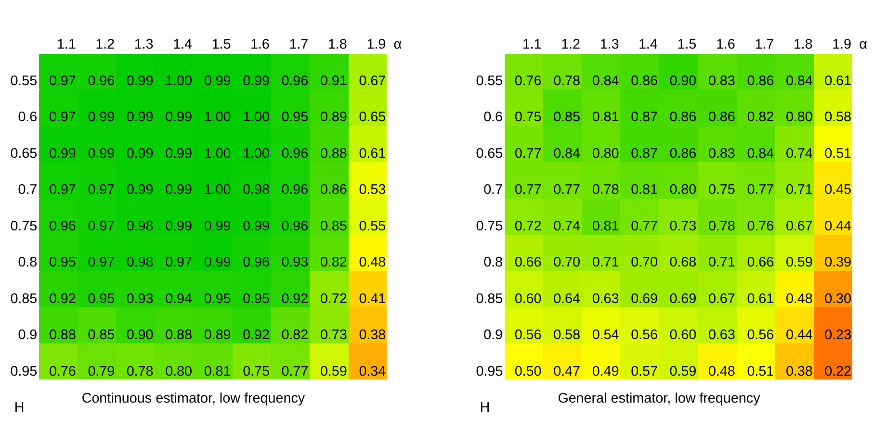
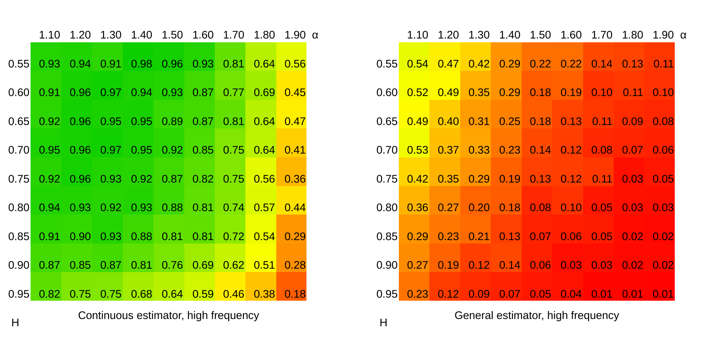

# Introduction {#sec:JSSintro}

The linear fractional stable motion (shortly, lfsm)
$(X_t)_{t \in \mathbb R}$ on a filtered space
$(\Omega, \mathcal F, (\mathcal F_t)_{t \in \mathbb{R}}, \mathbb{P})$ is
defined via
$$\label{eq:lfsm_def}
X_t = \int_\mathbb{R} \left\{ (t-s)^{H-1/\alpha}_+ - (-s)^{H-1/\alpha}_+ \right\}
d L_s, \qquad x_+:= \max\{x,0\},   (\#eq:lfsm-def)$$
where $L_s$ is a symmetric $\alpha$-stable Lévy motion,
$\alpha \in (0,2)$, with the scaling parameter $\sigma>0$ and the
self-similarity parameter $H \in (0,1)$. The lfsm is heavy-tailed
process with infinite variance and long-range dependence. A good
overview on the role which this process plays in natural sciences is
done by @Watk. One could also find a review of stochastic properties of
lfsm in [@MOP18].

We proceed with introduction to existing software, with interest towards
study of numerical properties of statistical estimators for lfsm as the
main motivation. So far, there is no standard approach for software
development to operating the general class of stochastic processes
driven by Lévy processes. Moreover, there was no systematic indexed and
pier-reviewed software for simulating sample paths of lfsm and related
estimators prior to [*rlfsm*](https://CRAN.R-project.org/package=rlfsm).
There is a particularly simple and useful numerical algorithm for
simulating lfsms developed by @StoevTaqqu04. Other methods for
simulation of the processes can be found in [@wu2004] and [@bierme08].
The paper [@StoevTaqqu04] contains a minimalistic implementation of lfsm
generator as a MATLAB function. However, some useful packages, that
could be used in numerical routines with Lévy-driven processes (e.g. to
create lfsm generator and perform unit testing), exist and have been
implemented in R. For instance, R package
[*somebm*](https://CRAN.R-project.org/package=somebm) [@somebm] contains
functions for generation of fractional Brownian motion (fBM). Currently
archived by CRAN *dvfBm* [@dvfBm] has routines for generation of fBm and
estimator of the Hurst parameter of the latter.
[*stabledist*](https://CRAN.R-project.org/package=stabledist)
[@stabledist] and [*stable*](https://CRAN.R-project.org/package=stable)
[@stable] contain different functions for stable distributions and
random variables. A generator of random variables of the kind has been
also implemented in MATLAB (see the code in Chapter 1.7 in
[@samorodnitsky1994stable]).

The paper is organized as follows. In Section [2](#section:Rfunctions)
we present the simulation method for sample paths of lfsm and its
implementation in our `path` function. Then, we present functions for
finite sample studies of statistical estimators, and some other
functions. Section [3](#sec:parameterestimation) describes
implementations of the high- and the low-frequency parameter estimators
and discusses reasons behind their numerical behavior. Finally, in
Section [4](#sec:S4) we suggest an object oriented system that
simplifies software programming of Lévy-driven integrals.

# Basic R functions {#section:Rfunctions}

## Types of data we use

The latest version of the package (1.0.0) suggests that we work with two
types of sample paths. In the low-frequency setting we only use points
spaced 1 temporal index apart from each other, $X_1, X_2, \dots, X_n$.
In the case of high-frequency, we use points with discretization equal
to the length of the path vector, $X_{1/n}, X_{2/n}, \dots, X_{1}$. This
division is dictated by two issues: 1) the same division in the setting
of limit theorems obtained by @MOP18, and 2) the fact that there is no
inference technique for an arbitrary mixture of the two frequencies.
Consequently, temporal coordinates of low-frequency lfsm coincide with
point index (compare `coordinates` and `point_num` in the example in
Section [2.2](#subsection:Simulations)) which varies from 0 to $N$.
Analogously, in case of high-frequency scheme, temporal coordinates
equal to point indexes divided by the total number of sampled points.
When after sampling the index set is different from either
$(1, 2, \dots, N)$ or $(1/n, 2/n, \dots, 1)$, rescaling in time should
be performed using the equality
$(a^H X_t)_{t\geq0} \ {\buildrel d \over = } \ (X_{at})_{t\geq0}$ with
$a>0$ provided that $H$ is known or obtained via preliminary estimation.

## Simulation method for the linear fractional stable motion {#subsection:Simulations}

In this section, we start with a discussion on the simulation method of
the lfsm proposed by @StoevTaqqu04 which is implemented in R by us. In
particular, simulation of sample paths is done via Riemann-sum
approximations of its symmetric $\alpha$-stable stochastic integral
representation while Riemann-sums are computed efficiently by using the
Fast Fourier Transform algorithm. In R, we introduce `path` function
that creates sample paths of the lfsm. The idea underlying this sample
path generator is that it should be always possible not only to obtain
lfsm path, but also the underlying Lévy motion, generated during the
procedure, and since the core function of lfsm is deterministic it
should allow for lfsm path generation based on a given Lévy motion, and,
in theory, otherwise (not always). For this reason generators of both
processes were separated into independent parts (see Figure
[1](#fig:scheme_of_path_generator)).

{#fig:scheme_of_path_generator width="100%"
alt="graphic without alt text"}

The function `path` can be used by

``` r
path(N,m,M,alpha,H,sigma,freq='L',disable_X=FALSE,
     levy_increments=NULL,seed=NULL)
```

Parameters `N, m, M` regard to the index of the process, or time, if
applicable. `m` and `M` are the only means to control precision of the
integral computation. `N` is a number of points of the lfsm to generate.
`m` is a discretization parameter that corresponds to the number of
points where Lévy motion is sampled between two nearby indexes (e.g. $N$
and $N-1$). `M` is the truncation parameter, i.e. number of points after
which the integrated function is set to zero; `freq` stands for the
frequency of the motion which can take two values: `H` for
high-frequency and `L` for the low-frequency setting. This is the switch
between the two data types. `disable_X` is needed to disable computation
of `X`, the default value is `FALSE`, when it is `TRUE`, only a Lévy
motion is returned, which in turn reduces the computation time. `seed`
is a parameter that performs seeding of the lfsm generator. Technically,
in the `path` the seed is set just before Lévy increments are generated.
The `path` function returns a list containing the lfsm, the underlying
Lévy motion, the point number of the motions from 0 to $N$ (`point_num`)
and the corresponding coordinate which depends on the frequency, the
parameters ($\sigma, \alpha, H$) that were used to generate the lfsm,
and the predefined frequency.

Generation of symmetric $\alpha$-stable (s$\alpha$s) random variables is
powered by function `rstable` from package *stabledist* with `S0`
parametrization based on the Zolotarev's representation for an
$\alpha$-stable distribution with some modifications. `S0` is used in
order to make `sigma` a scale parameter of the motion and to get exempt
from computing the normalization constant $C_{H,\alpha}$ presented in
[@StoevTaqqu04] and is given by
$$\label{constant}
C_{H,\alpha} := 
\left( \int_{\mathbb R} \left| (1-s)_+^{H-1/\alpha} - (-s)_+^{H-1/\alpha}\right|^\alpha ds \right)^{1/\alpha}.   (\#eq:constant)$$

### The discrete convolution based algorithm and particularities of indexing

As it was mentioned in the beginning of Section
[2.2](#subsection:Simulations), one of the features of `path` is the
ability to operate on a pair lfsm - Lévy motion and to switch between
them. We recall that direct computation of the sum approximating the
integral in the definition of lfsm (\@ref(eq:lfsm-def)) would involve
number of operations proportional to $NMm$, which makes the method slow.
Instead, the original algorithm by @StoevTaqqu04 suggests computing
increments of lfsm with the help of
$$\label{convSum}
W(n):=\sum_{j=1}^{mM} {a}_{H,m} (j) Z_\alpha (n-j),   (\#eq:convSum)$$
where $W(mk)$ is a discretized and truncated version of the increments
of the lfsm, and in the limit has the same distribution as them

$$\label{lfsm_increms}
\{W(mk),\text{ } k=1,\dots,N\} \xrightarrow[m \to \infty; M \to \infty]{d} \{X(k)-X(k-1),\text{ } k=1,\dots,N\};   (\#eq:lfsm-increms)$$

$Z_\alpha(k)$ are i.i.d. s$\alpha$s random variables that have indexes
$-mM,\dots,mN-1$ and scaling parameter equal to 1, and
$$\label{constantA}
{a}_{H,m} (j) 
:=
C_{H, \alpha}^{-1} (m, M) \left(  (j/m)^{H-1/\alpha} - (j/m-1)_+^{H-1/\alpha}\right) m^{-1/\alpha}, \ j \in \mathbb N   (\#eq:constantA)$$
with
$$\label{constantC2}
C_{H, \alpha} (m, M)
:= m^{-1} \left( \sum_{j=1}^{mM} \left|(j/m)^{H-1/\alpha} - (j/m-1)_+^{H-1/\alpha} \right|^\alpha\right)^{1/\alpha}.   (\#eq:constantC2)$$

{#fig:discr_convol_example
width="100%" alt="graphic without alt text"}

Let us consider an example which will recur and evolve throughout this
section. Consider computing sum (\@ref(eq:convSum)) where $m=1$, $M=3$,
and $N=6$ (see Figure [2](#fig:discr_convol_example)). The two rightmost
cells for $W(n)$ are left empty because there is no sense in computing
them without truncation of $a$.

A method based on the discrete convolution theorem is used to obtain
$W(mk)$. The theorem relies on Discrete Fourier Transform (DFT), which
needs to perform a number of operations proportional to
$(mN+mM)\log(mN+mM)$ instead of $NMm$. In order to understand how this
method works, we review several definitions and theorems.


**Definition 1**. *For any sequence $x_n$, $n \in \mathbb {N}$,
Discrete-Time Fourier Transform (DTFT) is defined as
$$X=\mathrm{DTFT}\{x_n\}(\omega) = \sum_{n=-\infty}^{\infty} x_n \exp(- i n \omega).$$
*

*The reverse transform, IDTFT, is defined as
$$x_n=\mathrm{IDTFT}\{X\} = \frac{1}{2\pi} \int_0^{2 \pi} X (\omega) e^{i \omega n} d \omega.$$
*


::: {#defi:conv .defi}

**Definition 2**. *Discrete convolution of two infinite sequences
$\{A_n\}_{n \in \mathbb {N}}$ and $\{B_n\}_{n \in \mathbb {N}}$ is
$$(A * B)[n]:=\sum_{m=-\infty}^{\infty} A[m]B[n-m].$$
*
:::

There is a convolution theorem for discrete sequences which says that
the discrete convolution of two sequences is equal to the Inverse
Discrete Fourier Transform (IDFT) of the multiplication of the direct
transforms of the sequences:

::: {#theor:Conv_th .theo}
**Theorem 3**. *For any discrete sequences $x_n$ and $y_n$,
$n \in \mathbb {N}$, it holds that
$$(x * y)[n] = \mathrm{IDTFT}[\mathrm{DTFT}\{x_n\}( \cdot ) \times \mathrm{DTFT}\{y_n\}(\cdot)].$$
*
:::

::: defi
**Definition 4**. *Let $x_n$, $n \in \mathbb {N}$ be a sequence. Then
$\{x_N\}[n]$, $n \in \mathbb {N}$ is called $N$-periodic summation of
the sequence:*


$$\{x_N\}[n]:=\sum_{k \in \mathbb {N}} x[n+kN].$$

:::

It is straightforward that the periodic summation in the definition
above has period $N$. In our case, the latter theorem is applicable even
though we will be interested in a finite sequence of length $\tilde N$.
The sequence is padded with zeros to form an infinite one, and a
periodic summation of a the length $\tilde N$ is just a periodic
extension of it.

{#fig:per_sum width="100%"
alt="graphic without alt text"}

DTFT is not directly useful for simulation purpose, that is why we need
a special case of Theorem [3](#theor:Conv_th), Circular Convolution
Theorem which reduces DTFT to DFT.

::: defi
**Definition 5**. *The DFT of a finite sequence $x_n$ of length $N$ is
defined as
$$X_k= \mathrm{DFT}_k (x_n):= \sum_{n=0}^{N-1}x_n \exp(-2 \pi ikn/ N).$$
*

*The IDFT is
$$x_n:= \frac{1}{N} \sum_{k=0}^{N-1}X_k \exp(2 \pi ikn/ N).$$
*
:::

::: {#theor:Circ_conv_th .theo}
**Theorem 6**. *
$$(x_N * y)[n] = \mathrm{IDFT}\{\mathrm{DFT}(x_N) \mathrm{DFT}(y_N)\}$$
*
:::

Returning to the task of computing the sum in (\@ref(eq:convSum)), we
consider two vectors: $a$ of length $mM$ and $Z$ of length $m(M+N)$.
Here, we again index vectors starting with zero, not one. If we extend
$Z$ periodically, pad $a$ with zeros to make an infinite sequence, and
compute $(a*Z_{m(N+M)})[n]$, values with indexes
$[mM; \text{ } m(N+M)-1]$ would coincide with the result of a
convolution of $a$ and $Z$. The first $mM$ values would be meaningless.
This gives an idea how to use Circular Convolution Theorem for
computation of (\@ref(eq:convSum)): instead of $a*Z$ we compute one
period of $(a*Z_{m(N+M)})[n]$ through the left part of
[4](#theor:Circ_conv_th) and leave only meaningful values. Figure
[4](#fig:Lx_comp) illustrates the use of Circular Convolution Theorem
with periodic extensions of $Z$ and padded $a$ to compute
(\@ref(eq:convSum)). In this case results with indexes -1 and -2 are
meaningless and should be discarded.

{#fig:Lx_comp width="100%" alt="graphic without alt text"}

Although the setup of the example as is on Figure [4](#fig:Lx_comp) is
fastest, it is impossible to use it directly, because in some situations
truncation parameter $M$ is larger than $N$, the number of points of
lfsm sample path that is needed to be simulated. In this case `path`
function performs an index shift using the following property:
$$\label{eq:shift}
    \begin{split}
        (a*x_c)[n] :=& \sum_{k=-\infty}^{+\infty} a[k] \cdotp x[n-k-c] 
        \\
        =&\sum_{k=-\infty}^{+\infty} a[k] \cdotp x[\tilde n-k] = (a*x)[\tilde n-c] 
    \end{split}   (\#eq:shift)$$
This property is illustrated by Figure [5](#fig:Conv_index_shift),
wherein sequence $x[n]$ is shifted by 2 to the right, so $c=2$.
Accordingly, the resulting convolution also gets shifted 2 notches to
the right (compare Figures [5](#fig:Conv_index_shift) and
[2](#fig:discr_convol_example)). In general, according to
(\@ref(eq:shift)), when $x[n]$ is shifted to assign index zero to the
first value, the resulting convolution sequence also starts from the
first meaningful value. Thus, `path` always keeps the first $Nm$ as the
result of convolution operation and discards the rest.

{#fig:Conv_index_shift width="100%"
alt="graphic without alt text"}

### Examples

In the next example, we show how one can use the above function to
generate a sample path and to provide its visualization. Compare the
procedure with the similar one from Section
[4.1.1](#subsubsec:S4_examples).

``` r
 # Path generation
 List<-path(N=2^10-600,m=256,M=600,alpha=1.8,H=0.8,
                sigma=1,freq='L',disable_X=FALSE,seed=3)
 str(List)

   List of 7
    $ point_num      : int [1:425] 0 1 2 3 4 5 6 7 8 9 ...
    $ coordinates    : int [1:425] 0 1 2 3 4 5 6 7 8 9 ...
    $ lfsm           : num [1:425] 0 -1.3969 0.0159 1.6487 1.87 ...
    $ levy_motion    : num [1:425] 0 -21.8 28.3 42.1 38.1 ...
    $ levy_increments: num [1:262144] -0.292 -0.708 -1.49 0.517 0.803 ...
    $ pars           : Named num [1:3] 1.8 0.8 1
       ..- attr(*, "names")= chr [1:3] "alpha" "H" "sigma"
    $ frequency      : chr "L"

 # Normalized paths
 Norm_lfsm<-List[['lfsm']]/max(abs(List[['lfsm']]))
 Norm_oLm<-List[['levy_motion']]/max(abs(List[['levy_motion']]))

 # Visualization of the paths
 plot(Norm_lfsm, col=2, type="l", ylab="coordinate")
 lines(Norm_oLm, col=3)
 leg.txt <- c("lfsm", "oLm")
 legend("topright", legend = leg.txt, col =c(2,3), pch=1)
```

The result of the chart rendering is shown on Figure
[6](#fig:PlotRlfsm). The following example shows how to switch `path`
function in order to alter between simulation of lfsm from scratch and
computing based on an existing sample path of the Lévy motion.

{#fig:PlotRlfsm width="100%"
alt="graphic without alt text"}

``` r

 m<-256; M<-600; N<-2^12-M
 alpha<-1.8; H<-0.8; sigma<-1.8
 seed<-2

 # Creating Levy motion
 levyIncrems<-path(N=N, m=m, M=M, alpha, H, sigma, freq='L',
                        disable_X=T, levy_increments=NULL, seed=seed)

 # Creating lfsm based on the levy motion
 lfsm_full<-path(m=m, M=M, alpha=alpha, 
                     H=H, sigma=sigma, freq='L',
                     disable_X=F, 
                     levy_increments=levyIncrems$levy_increments,
                     seed=seed)

 sum(levyIncrems$levy_increments==
        lfsm_full$levy_increments)==length(lfsm_full$levy_increments)


[1] TRUE
```

In the example the Lévy motion is generated without computing the lfsm,
which was done by setting `disable_X=TRUE`, and saved to variable
`levyIncrems`. After that, `path` was given the obtained Lévy increments
and, basing on them, generated an lfsm path. As one can observe, the
Lévy increments from the both objects produced by `path` are identical.
The same holds when we obtain an lfsm path from the above procedure and
one-step simulation of lfsm with seeding. These two facts are used in
automated tests provided for *rlfsm* package.

## MCestimLFSM and numerical properties of statistical estimators {#subsection:MCestimLFSM}

In order to study numerical properties of the estimation procedures
developed in [@MOP18], we created a technique, that could be used in
solving this problem for any pair stochastic process and an estimator.
The approach was implemented in `MCestimLFSM` function (Figure
[9](#fig:Num_prop)). The main motivation here is that for some
estimators we have limit theorems, but we do not have theory which
describes estimator behavior when the length of a path is relatively
small, and thus, for instance, we cannot use closed-form expressions to
obtain confidential intervals. In the following examples we show how to
use functions `MCestimLFSM`, `PLot_vb`, and `Plot_dens` for studying
empirical variance, bias and a density function of an estimator. In the
first example, we study `GenLowEstim` estimator, and its bias and
variance dependencies on the length of the sample paths. In particular,
one would be able to determine starting from which path length the
estimator loses significant bias influence.

``` r

 library(rlfsm)
 library(gridExtra)
 registerDoParallel()

 m<-25; M<-55
 p<-.4; p_prime<-.2
 t1<-1; t2<-2
 k<-2

 NmonteC<-5e2
 alpha<-1.8; H<-0.8; sigma<-0.3

 S<-seq(from = 100, to = 2e3, by =50)
 tilda_ests<-MCestimLFSM(s=S, fr='L', Nmc=NmonteC, m=m, M=M, 
                              alpha=alpha,H=H,sigma=sigma, 
                              GenLowEstim,t1=t1,t2=t2,p=p)
                      
# Structure of tilda_ests                    
 names(tilda_ests)
[1] "data"      "data_nor"  "means"     "sds"       "biases"    "Inference" "params"    "freq"                      

# Structure of BSdM is as follows

 head(round(tilda_ests$means,2))
  alpha    H sigma   s
1  1.76 0.67  0.25 100
2  1.81 0.70  0.27 150
3  1.81 0.71  0.27 200
4  1.82 0.73  0.28 250
5  1.83 0.74  0.28 300
6  1.83 0.75  0.29 350

 head(round(tilda_ests$biases,2))
  alpha     H sigma   s
1 -0.04 -0.13 -0.05 100
2  0.01 -0.10 -0.03 150
3  0.01 -0.09 -0.03 200
4  0.02 -0.07 -0.02 250
5  0.03 -0.06 -0.02 300
6  0.03 -0.05 -0.01 350

 head(round(tilda_ests$sds,2))	
  alpha    H sigma   s
1  0.19 0.23  0.09 100
2  0.14 0.20  0.08 150
3  0.13 0.19  0.08 200
4  0.13 0.19  0.07 250
5  0.10 0.17  0.06 300
6  0.11 0.17  0.06 350

 Plot_vb(tilda_ests)
```

.](VB.png){#fig:VB
width="100%" alt="graphic without alt text"}

Figure [7](#fig:VB) shows that when
$(\sigma, \alpha, H) = (0.3, 1.8, 0.8)$, estimator `GenLowEstim` could
be considered unbiased starting approximately from 1000 points.

The second example compares empirical standardized densities of
estimates, obtained by `GenLowEstim` with the limiting standard normal
ones, Figure [8](#fig:empirDists).

``` r
 S<-c(1e2,1e3,1e4)
 tilda_ests<-MCestimLFSM(s=S, fr='L', Nmc=NmonteC ,m=m, M=M,
                              alpha=alpha, H=H, sigma=sigma,
                              GenLowEstim,t1=t1,t2=t2,p=p)
                
 l_plot<-Plot_dens(par_vec=c('sigma','alpha','H'), MC_data=tilda_ests,
                       Nnorm=1e7)
 ggg<-grid.arrange(l_plot[[1]],l_plot[[2]],l_plot[[3]],nrow=1,ncol=3)
```

.](empirDists.png){#fig:empirDists
width="90.0%" alt="graphic without alt text"}

In short, in these examples for different path lengths `s`, `NmonteC`
lfsm paths are simulated. To each path we apply tilde-statistic (see
Section [3.2](#ParEstGen)), therefore obtaining `NmonteC` estimates
$(\tilde \sigma_{low}, \tilde \alpha_{low}, \tilde H_{low})$ for every
$s$, which in turn, are used to calculate biases, standard deviations,
and density functions (also, for each $s$ separately).

### MCestimLFSM architecture and optimization

It is important to notice that generation of lfsm is numerically heavy
routine and also a large number of estimates is needed to compare their
empirical distributions with the limiting ones. The latter task gave
`MCestimLFSM` its name. Thus, in order to make computations feasible in
terms of time and memory use, the architecture of `MCestimLFSM` must be
well-optimized. Apparently, a multi-core setup is crucial for dealing
with the task.

{#fig:Num_prop
width="80.0%" alt="graphic without alt text"}

Having fixed a path length, the whole procedure behind `MCestimLFSM`
could be split in two parts. First, we need to obtain samples for each
estimator. Second, we obtain statistics of these samples (see Figure
[9](#fig:Num_prop)). Once finished, `MCestimLFSM` proceeds to the next
length value until reaches the end of the vector of lengths.

In the first part, we generate $N_\text{Monte Carlo}$ lfsm paths of the
length `s[i]` via `path_fast` function. To each of the paths we apply
all the estimators to obtain $H$, $\alpha$, and $\sigma$ estimates.
During this stage, we use a `foreach`-based parallel loop, where each
node simulates a path, computes and returns the statistics removing the
path from memory. `path_fast` is an unavailable for users version of
`path` with significantly reduced functionality for the sake of saving
execution time. The further desired enlargement of the node task by
adding generation of the whole set of paths instead of just one, making
the loop over `s[i]` parallel, leads to extreme memory consumption as
well as unequal distribution of load among nodes. The number of numeric
values in the set of paths equals to $N_\text{Monte Carlo} \times s[i]$.
Simulations, performed in [@MOP18] showed that normal distribution is
attained by estimators at $s=10^3$. Given the fact that we need at least
$10^5$ Monte Carlo trials for a neat histogram of a distribution, one
can obtain the amount of memory required to store a matrix of size
$N_\text{Monte Carlo} \times s[i]$, which makes 763Mb, while some
estimators require 80Gb per node. That is the reason why in the current
version of `MCestimLFSM` the loop over `s` is sequential, and the one
over `NmonteC` is parallel.

During the second part, averages and standard deviations of the samples
are computed, and subsequently used to compute the standardized
empirical distributions. So that, the three characteristics naturally
come together within the same numerical procedure. So far there is no
empirical evidence that parallel execution in this section makes
`MCestimLFSM` more efficient.

Such architecture is of great use when the number of nodes available for
computations exceeds the number of path length, and the length $s[i]$
differs significantly from $s[j]$ when $i \neq j$.

## On some of the other basic functions

In this part, we will describe aspects of some of the other R functions
implemented in the package.

### Higher-order increments

These increments are the main building block for all statistics we use
(see Section [3](#sec:parameterestimation)). They are defined as
$k$-th iterated increments of step $r$ of a sample path. In particular,
$\Delta_{i,1}^{n,1} X:=X_{\frac{i}{n}} - X_{\frac{i-1}{n}}$, and
$\Delta_{i,2}^{n,1} X:=X_{\frac{i}{n}} - 2X_{\frac{i-1}{n}}+X_{\frac{i-2}{n}}$.
In *rlfsm*, we built two functions for computation of objects of this
class- `increment()` and `increments()`. The former accepts a vector of
points at which a user wants to evaluate higher-order increments, and
computes them using formula
$$\begin{aligned}
\label{ho_increments}
\Delta_{i,k}^{n,r} X:= \sum_{j=0}^k (-1)^j \binom{k}{j} X_{(i-rj)/n}.
\end{aligned}   (\#eq:ho-increments)$$
Before evaluation of (\@ref(eq:ho-increments)), the function checks the
condition $i < kr$. Evaluation of the increments on a sample path of
length $N$ takes $(k+1)(N-kr)$ operations- $k+1$ sums for $N-kr$ points.
`increments()` computes increments iteratively on the whole set of path
points. The first iteration gives $N-r$ increments, the second- $N-2r$
and so on. Thus, the total number of performed operations is
$$\sum_{j=1} ^k (N-jr) = kN - r(k+1)k/2.$$
It is clear that `increments()` is faster on sample paths with large
number of points, but slower when the increment order is high. As we
will show later, orders greater than $\sim 10$ are not usable for
statistical inference. That is the reason why in all statistics we use
either `increments()` or its hidden "relatives".

### A visualization method for sample paths

We introduce a pair of functions which makes a panel plot of sample
paths produced by processes with different parameters. `Path_array`
takes a set of $\alpha$-$H$ values, generates a path for each
combination, and stacks the paths together in a data frame. In the
produced data frame all the paths are tagged with $\alpha$ and $H$
values. `Plot_list_paths()` takes the data frame as an argument and
plots the sample paths on different panels based on their $(\alpha,H)$
values. This functionality is powered by `facet_wrap()` from
[*ggplot2*](https://CRAN.R-project.org/package=ggplot2) [@ggplot2_book].
For discontinuous paths `Plot_list_paths()` draws an overlapping
semitransparent line joining neighbouring points in order to highlight
jumps.

``` r
 l=list(H=c(0.2,0.5,0.8), alpha=c(0.5,1,1.5), freq="H")
 arr<-Path_array(N=300, m=30, M=100, l=l, sigma=0.3)
 head(arr)
  n          X alpha   H freq
1 1  0.0000000   0.5 0.2    H
2 2  0.2329891   0.5 0.2    H
3 3  1.1218238   0.5 0.2    H
4 4 -6.1284620   0.5 0.2    H
5 5 -2.2450357   0.5 0.2    H
6 6  3.4979978   0.5 0.2    H

 str(arr)
'data.frame':	2709 obs. of  5 variables:
 $ n    : num  1 2 3 4 5 6 7 8 9 10 ...
 $ X    : num  0 0.233 1.122 -6.128 -2.245 ...
 $ alpha: Factor w/ 3 levels "0.5","1","1.5": 1 1 1 1 1 1 1 1 1 1 ...
 $ H    : Factor w/ 3 levels "0.2","0.5","0.8": 1 1 1 1 1 1 1 1 1 1 ...
 $ freq : Factor w/ 1 level "H": 1 1 1 1 1 1 1 1 1 1 ...
 
 Plot_list_paths(arr) 
```

{#fig:scheme_of_path width="100%"
alt="graphic without alt text"}

# Parameter estimation of the linear fractional stable motion {#sec:parameterestimation}

In this section, we describe estimators for the parameters $H$,
$\alpha$, and $\sigma$ that are obtained in the recent paper by @MOP18,
and their implementation in R.

## Parameter estimation in the continuous case {#ParEstCont}

First, we consider the case $H- 1/ \alpha>0$ which leads us to the
important property that the lfsm $(X_t)_{t \in R}$ is locally continuous
of any order up to $H-1/\alpha$. Moreover, this condition implies the
following restrictions
$$\alpha \in (1,2) \quad \text{and} \quad H \in (1/2,1)$$
that allow us to use the law of large numbers in Theorem 1.1 of [@BLP]
when $p<1$, and the central limit theorem in Theorem 1.2 of [@BLP] when
$p<1/2$, $k\geq 2$ and $H<k-1/\alpha$.

Now, we consider consistent estimators for the self-similarity parameter
$H$ in high- and low-frequency setting, defined by
$$\begin{aligned}
\widehat H_{high} (p,k)_n
:=&
\frac{1}{p} \log_2 
\left(
\frac{\sum_{i=2k}^n \left| \Delta_{i,k}^{n,2} X\right|^p}{\sum_{i=2k}^n \left| \Delta_{i,k}^{n,1} X\right|^p}
\right),
\\
\widehat H_{low} (p,k)_n
:=&
\frac{1}{p} \log_2 
\left(
\frac{\sum_{i=2k}^n \left| \Delta_{i,k}^{2} X\right|^p}{\sum_{i=2k}^n \left| \Delta_{i,k}^{1} X\right|^p}
\right).
\end{aligned}$$
Both estimators for $H$ are based upon a ratio statistic that compares
power variations at two different frequencies.

Let us define the following two statistics
$$\begin{aligned}
\label{V}
V_{high} (f; k,r)_n := \frac{1}{n} \sum_{i=rk}^n f \left( n^H \Delta_{i,k}^{n,r} X \right) \quad
V_{low} (f; k,r)_n := \frac{1}{n} \sum_{i=rk}^n f \left( n^H \Delta_{i,k}^{r} X \right),
\end{aligned}   (\#eq:V)$$
where $f: \mathbb R \to \mathbb R$ is a measurable function. Estimators
for the stability index $\alpha$ of the driving stable motion in high
and low frequency setting are based on the empirical characteristic
functions given by
$$\varphi_{high} (t;H, k)_n := V_{high} (\psi_t; k)_n\ \ \  \text{and} \ \ \  \varphi_{low} (t;k)_n := V_{low} (\psi_t; k)_n$$
with $\psi_t (x):=\cos (tx)$, for two different values $t_1$ and $t_2$
such that $t_2>t_1>0$. Let us note that the empirical characteristic
function $\varphi_{high} (t;H, k)_n$ depends on the parameter $H$ while
$\varphi_{low} (t;k)_n$ does not. Thus, we should infer the
self-similarity parameter $H$ by $\widehat H_{high} (p,k)_n$ and then we
should use the plug-in estimator
$\varphi_{high} (t;\widehat H_{high} (p,k)_n, k)_n$ to infer the
stability index $\alpha$ in high-frequency setting. Estimators for the
parameter $\alpha$ are given by
$$\begin{aligned}
{2}
\widehat \alpha_{high}
&:= \frac{\log | \log \varphi_{high} (t_2; \widehat H_{high} (p,k)_n, k)_n|  -  \log | \log \varphi_{high} (t_1; \widehat H_{high} (p,k)_n, k)_n|}{\log t_2 - \log t_1},
\\
\widehat \alpha_{low}
&:= \frac{\log | \log \varphi_{low} (t_2;k)_n|  -  \log | \log \varphi_{low} (t_1; k)_n|}{\log t_2 - \log t_1}.
\end{aligned}$$

Estimators for the scale parameter $\sigma$ in high- and low-frequency
are also based on the empirical characteristic functions which are
defined for one value of $t>0$. Further, we define a function
$h_{k,r}: R \to R$ as follows:
$$h_{k,r} (x) = \sum_{j=0}^k (-1)^j \binom{k}{j} (x-rj)_+^{H-1/\alpha}, \quad x\in R,$$
where $k,r \in N$, and let
$\|h_{k,r}\|_\alpha^\alpha := \int_R |h_{k,r} (s)|^\alpha ds$. Let us
note that the function $h_{k,r}$ depends on two parameters $\alpha$ and
$H$ which need to be pre-estimated. Estimators for the parameter
$\sigma$ are expressed as
$$\begin{aligned}
{2}
\widehat \sigma_{high}
&:= \left(
- \log \varphi_{high} (t_1;  \widehat H_{high} (p,k)_n, k)
\right)^{1/\widehat \alpha_{high}} / t_1 \| h_{k,1} \|_{\widehat \alpha_{high}},
\\
\widehat \sigma_{low}
&:= \left(
- \log \varphi_{low} (t_1; k)
\right)^{1/\widehat \alpha_{low}} / t_1 \| h_{k,1} \|_{\widehat \alpha_{low}}.
\end{aligned}$$

## Parameter estimation in the general case {#ParEstGen}

Here, we consider general case when an explicit lower bound for $\alpha$
is unknown. First, we consider estimators which are obtained in low
frequency setting. Consistent estimator for parameter $H$ for any
$p \in (1,1/2)$ is obtained by
$$\widehat H_{low} (-p,k)_n
:=
\frac{1}{p} \log_2 
\left(
\frac{\sum_{i=2k}^n \left| \Delta_{i,k}^{2} X\right|^{-p}}{\sum_{i=2k}^n \left| \Delta_{i,k}^{1} X\right|^{-p}}
\right).$$
Next, we consider two-step procedure to choose the order of increments
$k$, since we should be in the domain of attraction of Theorem 1.2 of
[@BLP] that requires $k>H+1/\alpha$. That's why we consider the
preliminary estimator of $\alpha$ with $k=1$ that is consistent given by
$$\widehat \alpha^0_{low} (t_1,t_2)_n
=
\frac{\log | \log \varphi_{low} (t_2;1)_n|  -  \log | \log \varphi_{low} (t_1; 1)_n|}{\log t_2 - \log t_1}.$$
Since we do not know if $\widehat \alpha^0_{low} (t_1,t_2)_n$ is in the
domain of attraction, we define the estimator of the parameter $k$ as
$$\hat k_{low} (t_1,t_2)_n 
:=
2+ \lfloor{\widehat \alpha^0_{low} (t_1,t_2)_n^{-1}}\rfloor.$$
In the second step we use estimator
$\hat k_{low} := \hat k_{low} (t_1,t_2)_n$ for the estimation of
parameters $H$, $\alpha$ and $\sigma$. In particular, we get the
following consistent estimators
$$\begin{aligned}
{2}
\widehat H_{low} (-p,\hat k_{low})_n
&=
\frac{1}{p} \log_2 
\left(
\frac{\sum_{i=2\hat k_{low}}^n \left| \Delta_{i,\hat k_{low}}^{2} X\right|^{-p}}{\sum_{i=2\hat k_{low}}^n \left| \Delta_{i,\hat k_{low}}^{1} X\right|^{-p}}
\right),
\\
\tilde \alpha_{low} (\hat k_{low}; t_1,t_2)_n
&=
\frac{\log | \log \varphi_{low} (t_2; \hat k_{low})_n|  -  \log | \log \varphi_{low} (t_1; \hat k_{low})_n|}{\log t_2 - \log t_1},
\\
\tilde \sigma_{low} (\hat k_{low}; t_1,t_2)_n
&=
\left(
- \log \varphi_{low} (t_1; \hat k_{low})
\right)^{1/\tilde \alpha_{low}} / t_1 \| h_{\hat k_{low},1} \|_{\tilde \alpha_{low}}.
\end{aligned}$$

Next, we consider two-stage estimation procedure in the general case in
high-frequency setting which is the same as in the low-frequency
setting. For $p \in (0,1/2)$ we compute
$\widehat H_{high} (-p)_n = \widehat H_{high} (-p,1)_n$ and, therefore,
we can define the preliminary estimator of $\alpha$ by
$$\widehat \alpha^0_{high} (p, p^\prime)_n
=
\phi^{-1} 
\left(
\frac{V_{high} (f_{-p^\prime}, \widehat H_{high} (-p)_n)_n^p }{V_{high} (f_{-p}, \widehat H_{high} (-p)_n)_n^{p^\prime}}
\right)$$
with
$$\phi (\widehat \alpha^0_{high} (p, p^\prime)_n)
:=
\frac
{\left(2 / \widehat \alpha^0_{high} (p, p^\prime)_n\right)^{p- p^\prime} a_{-p}^{p^\prime} \Gamma(p^\prime /  \widehat \alpha^0_{high} (p, p^\prime)_n)^p}
{a_{-p^\prime}^p \Gamma(p /  \widehat \alpha^0_{high} (p, p^\prime)_n)^{p^\prime}}$$
where $p, p^\prime \in (0,1/2)$ such that $p \neq p^\prime$, and
$V_{high} (f_{-p}, \widehat H_{high} (-p)_n)_n$ is given in formula
(\@ref(eq:V)) with $k=1$, $f_{-p}(x)=|x|^{-p}$ and preliminary estimator
$\widehat H_{high} (-p)_n$ for the parameter $H$. It is remarkable that
$\phi (\cdot)$ is always invertible for all $p \neq p^\prime$ (see @DI).
Consequentially, we can define the estimator of $k$ in high-frequency
setting by
$$\hat k_{high} 
 :=
\hat k_{high} (p, p^\prime)_n 
=
2+ \lfloor\widehat \alpha^0_{high} (p, p^{\prime})_n^{-1}\rfloor.$$
Thus, consistent estimators of $H$, $\alpha$ and $\sigma$, in
high-frequency setting are given by
$$\begin{aligned}
{3}
\widehat H_{high} (-p,\hat k_{high})_n
&=
\frac{1}{p} \log_2 
\left(
\frac{\sum_{i=2 \hat k_{high}}^n \left| \Delta_{i,\hat k_{high}}^{n,2} X\right|^{-p}}{\sum_{i=2\hat k_{high}}^n \left| \Delta_{i,\hat k_{high}}^{n,1} X\right|^{-p}}
\right),
\\
\tilde \alpha_{high} (\hat k_{high}; t_1,t_2)_n
&=
\phi^{-1} 
\left(
\frac{V_{high} (f_{-p^\prime}, \widehat H_{high} (-p, \hat k_{high})_n; \hat k_{high} )_n^p }{V_{high} (f_{-p}, \widehat H_{high} (-p,\hat k_{high})_n; \hat k_{high})_n^{p^\prime}}
\right),
\\
\tilde \sigma_{high} (\hat k_{high}; p, p^\prime)_n
&=
\left(
\frac{\tilde \alpha_{high} a_{-p} V_{high} (f_{-p}, \widehat H_{high} (-p)_n)_n}{2 \Gamma (p / \tilde \alpha_{high})}
\right)^{- \frac{1}{p}} /  \| h_{\hat k_{high},1} \|_{\tilde \alpha_{high}}.
\end{aligned}$$

## Implementation in R

We introduce function `ContinEstim` for performing statistical inference
according to Section [3.1](#ParEstCont) when $H-1/ \alpha >0$.

``` r
ContinEstim(t1, t2, p, k, path, freq)
```

The function is basically comprised by simpler functions `alpha_hat`,
`H_hat` and `sigma_hat` responsible for retrieving the corresponding
parameters. `sigma_hat` is called using `tryCatch` as the former may
return an error due to numerical integration in `Norm_alpha`.

General low-frequency estimation technique, described in Section
[3.2](#ParEstGen) is implemented in `GenLowEstim`.

``` r
GenLowEstim(t1, t2, p, path, freq = "L")
```

This estimator first sets a preliminary $k$ to be equal to 1, and uses
it to compute preliminary parameters $H_0$ and $\alpha_0$. Using these
$H_0$ and $\alpha_0$, a new $k$ is obtained through
`2+floor(alpha_0(̂-1))`, and then the new $k$ is used for the same
estimation procedure as in `ContinEstim`. This approach induces an
effect, which does not exist in the case when `ContinEstim` is applied.
When $\alpha$ is smaller than, or close to $2/N$, where $N$ is the
observed lfsm path length, the computational errors are more frequent.
These extra errors occur when the preliminary estimation of k appears to
exceed $N/2$, making it impossible to compute
$\Delta_{i,\hat k_{low}}^{2} X$ in statistic
$\widehat H_{low} (-p,\hat k_{low})_N$. In case of other sample path
realizations $k<H+1/\alpha$, and it is still possible to obtain the
estimates which happen to converge to the true value
$(\widehat H,\widehat\alpha,\widehat\sigma)$, because in this case one
would be in the domain of attraction of Theorem 2.2 of [@MOP18]. Though,
the limiting distribution is not stable anymore, and the rate of
convergence depends on $\alpha$ and $H$. Real distributions of estimates
in this case are left unexplored.

High-frequency estimator from the same section was implemented in
`GenHighEstim`.

``` r
GenHighEstim(p, p_prime, path, freq, low_bound = 0.01, up_bound = 4)
```

## Estimate deterioration

Although the general high- and low-frequency estimators presented in
Section [3.2](#ParEstGen) have important advantages, namely closed form
expressions for distribution functions and non-suboptimal convergence
rates, they also reveal two drawbacks in performance. Due to condition
and error handling, the time performances of the general estimators are
much worse than those of the continuous ones. On top of that, the
plug-in estimators (because of their nature) have much less probability
of obtaining an estimate at all. The main idea is as follows: the more
statistics are used in a plug-in estimator, the higher the probability
to stumble upon a numerical error during the estimation procedure. We
illustrate this effect by the following experiment, wherein the general
high- and low-frequency estimators are compared to the corresponding
continuous ones. For each pair from a set of parameters $(H,\alpha)$,
`NmonteC` sample paths of the both frequencies were generated, and to
each of them the relevant procedures `ContinEstim`, `GenLowEstim` and
`GenHighEstim` were applied (see "Estimate deterioration experiment" in
the supplementary materials). Then, the rates of successful computation
results were computed. The result of estimation was considered
"successful" if during the procedure all three parameters were obtained,
no error occurred, and the estimates are meaningful, namely
$(\widehat H,\widehat\alpha) \in (0,1) \times (0,2)$.

<figure id="fig:Estim_Succ_Compar_low">
<table>
<caption> </caption>
<tbody>
<tr class="odd">
<td style="text-align: center;"></td>
<td style="text-align: center;"></td>
</tr>
<tr class="even">
<td style="text-align: center;">Comparison of success rates for
ContinEstim and GenLowEstim. Low frequency case. Path length N=200,
number of sample paths NmonteC=300.</td>
<td style="text-align: center;">Comparison of success rates for
ContinEstim and GenHighEstim. High frequency case. Path length N=200,
number of sample paths NmonteC=300.</td>
</tr>
</tbody>
</table>
<figcaption>Figure 11: Comparison of success rates of
estimators</figcaption>
</figure>

This experiment shows (Figures [11](#fig:Estim_Succ_Compar_low)a and
[[fig:Estim_Succ_Compar_high]](#fig:Estim_Succ_Compar_high)b) that in
both high- and low-frequency cases `ContinEstim` gives much better
precision than the corresponding general estimator. The outcome is
rigorous in low-frequency technique since `ContinEstim` and
`GenLowEstim` have the same set of tuning parameters. On the other hand,
the high-frequency estimators have non-coinciding parameter sets, and
thus, without fine tuning, the result is merely intuitive. One could
observe that in general estimation near the boundaries of the interval
$(\widehat H,\widehat\alpha) \in (0,1) \times (0,2)$ produces more
errors, which is partly due to the fact that near the boundaries it is
easier to obtain an estimate outside the interval. Such an estimate is
removed by `Errfilter` function in the experiment.

## Zones with different convergence regimes in the low-frequency case {#zones_converg}

In order to show how the general low-frequency estimation works in
practice, we peform a numerical experiment whose code could be found in
section "Zones with different convergence" of the accompanying .R file.
We set a constant $\sigma$ and choose two sets of parameters- one for
$\alpha$ and one for $H$. Then, for each combination of them a number
$N_{mc}=500$ of sample paths is created. All path lengths are set to a
constant $N=1000$. To each path we apply several statistics. One of them
is `k_new<-2+floor(alpha_0(̂-1))` where `alpha_0` is obtained via
`alpha_hat` with parameters `k=1`, `freq=``L` plugged-in. This provides
us simulated distribution of $\widehat k_{low}$ (Figure
[12](#fig:hist_of_k)). Also, we fix a set `k_ind = seq(1,8,by=1)` and,
given a path, for each of these k's extract statistics
$\varphi_{low}(t,k=k_{ind})_n$ and
$\hat\alpha_{low}(t_1,t_2;k=k_{ind})_n$, see Figures [13](#fig:phi_on_k)
and [14](#fig:alpha_est_on_k).

Three regimes of performance of `GenLowEstim` (read, the general
low-frequency estimator $\widehat \alpha_{low} (k,t_1,t_2)_n$) are
observed. To a large extend, only parameter $\alpha$ determines which
regime is in presence.

Due to small variance of $\widehat \alpha^0_{low} (t_1,t_2)_n$ (Figure
[14](#fig:alpha_est_on_k)), when $\alpha \in (1,2)$ the estimation
$\hat k_{low} (t_1=1,t_2=2)_n$ returns 2 except from the boundaries,
where edge effects are observed. This results in the fact that in cases
when statistics $\widehat k_{low} (1,2)_n$ can be computed without
stumbling on numerical errors performances of `GenLowEstim` and low
frequency `ContinEstim` are the same. At the same time, statistic
$\widehat \alpha_{low} (k,t_1,t_2)_n$ is not far from its limit value
for $k<3$, that's why the parameter estimation of the LFSM is
technically possible by `ContinEstim` and `GenLowEstim` at such length
of the sample path.

{#fig:hist_of_k width="100%"
alt="graphic without alt text"}

When $\alpha$ is near $1$ there is a transition between the regime with
values of $\widehat  k_{low} (1,2)_n$ concentrated at point $k=2$, and
the regime where $\widehat  k_{low} (1,2)_n$ is highly dispersed. This
shift is characterized by only two values of $\widehat k_{low} (1,2)_n$:
2 and 3. Such behavior of the estimated order of increments is due to
the fact that when $\alpha^{-1}  \in N$
$$\mathbb P\left( \widehat{k}_{\text{low}}  = 2+ 
 \alpha^{-1}  \right) \to \lambda  \qquad \text{and} \qquad  
\mathbb P\left( \widehat{k}_{\text{low}}  = 1+ 
 \alpha^{-1}  \right) \to 1- \lambda$$
for some constant $\lambda \in (0,1)$, see [@MOP18], Section 4.1.
Surprisingly, $\lambda$ is close to $0.5$ throughout the whole set of
$H$'s (Figure [12](#fig:hist_of_k)). There are no
$\widehat k_{low} (1,2)_n$ higher than 3 observed because the
preliminary estimation of $\alpha$ is still quite precise as one can see
from the middle row on Figure [14](#fig:alpha_est_on_k). After obtaining
$\widehat k_{low} (1,2)_n$ equal to either 2 or 3,
$\widehat \alpha_{low} (\widehat k_{low} (1,2)_n,t_1,t_2)_n$ is computed
again quite precisely, but worse than in the continuous case.

At $\alpha<1$ $\widehat \alpha_{low} (k,t_1,t_2)_n$ has high variance
regardless of what k is chosen, therefore different values are obtained
when computing $\widehat k_{low} (1,2)_n$. These values plugged-in to
$\widehat \alpha_{low} (k,t_1,t_2)_n$ produce again very dispersed
estimates of parameter $\alpha$. This mechanism explains why
$\widetilde \alpha_{low}$ has higher variance in discontinuous case
$(H-1/\alpha <0)$ than in continuous (see the numerical study in Section
5 in [@MOP18]).

The way $\widetilde \alpha_{low}$ behaves could be explained using
pic.([13](#fig:phi_on_k)), where $\varphi_n$ and $V_{low}(\psi_t,k)_n$
are plotted. Cases wherein $\widehat \alpha_{low}$ performs poorly
coinside with ones wherein $\varphi_n$ and $V_{low}(\psi_t,k)_n$ are
significantly distant from each other, so convergence
$V_{low}(\psi_t,k)_n \xrightarrow{a.s.} \varphi_n(t;k)$ isn't observed
at the given length of sample paths, which ruins the whole idea of
$(\sigma, \alpha)$ estimation. Of course, this effect doesn't affect
$H$-estimation because it is based on ratio statistic, which has a
different form.

{#fig:phi_on_k width="100%"
alt="graphic without alt text"}

{#fig:alpha_est_on_k width="100%"
alt="graphic without alt text"}

# S4 classes for Lèvy-driven motions {#sec:S4}

Here we describe a simple S4 system (a short introduction to S4 classes
is given in [@wickham2014], Chapter OO field guide) that could be used
to simplify manipulations with the two types of observations of the
linear fractional stable motion. Additionally, we present a possible way
to extend the system so that it encompasses more general stochastic
processes. The system aims to be helpful in

-   passing "attributes" (frequency, $\sigma,\alpha, H$) from objects to
    functions automatically (without additional developer's efforts).
-   hiding complicated details of interfaces from users.
-   using generics to protract functions on different objects by means
    of inheritance. For instance, plotting function written for lfsm
    could be used for other types of stochastic integral.

## Classes for simulated lfsm

Here we describe the least general classes- "SimulatedLfsmLow" and
"SimulatedLfsmHigh", objects of which are obtained by simulating low-
and high-frequency linear fractional stable motions.

{#SimulatedLfsm width="100%"
alt="graphic without alt text"}

Figure [15](#SimulatedLfsm) shows their internal structure. Roughly
speaking, these classes were designed to contain minimum information
that could fully describe a simulated LFSM path. Indicators of frequency
and a process type are included in the name of a class, which is
supposed to make a method dispatch more straightforward, without
additional condition blocks. Moreover, all generic functions distinct
high- and low-frequency schemes of all types with the help of class
names. The same holds for motion types. Parameters $H, \alpha, \sigma$,
as well as Lévy motion, coordinates and the lfsm itself are written in
corresponding slots.

### Examples {#subsubsec:S4_examples}

In the following example we see how an instance of class
"SimulatedLfsmLow" is created and then plotting and inference is
performed using generic functions `plot` and `ContinInfer`. First, we
register classes, methods and one generic from "S4 classes examples" in
the supplementary materials.

``` r
N<-3000; m<-65; M<-300
sigma<-0.3; alpha<-1.8; H<-0.8
p<-.4; t1<-1; t2<-2; k<-2

# Make an object of S4 class SimulatedLfsmLow
 List <-  path(N,m,M,alpha,H,sigma,freq='L',disable_X=FALSE,seed=3)

# Make an object of parameters
 prmts<-new("AlpaHSigma",alpha=List$pars[['alpha']],
 H=List$pars[['H']],sigma=List$pars[['sigma']])
 X_sim <- new("SimulatedLfsmLow", Process = List$lfsm,
                coordinates = List$coordinates, pars = prmts,
                levy_motion = List$levy_motion)
                
# structure of the instance
 str(X_sim)

  Formal class 'SimulatedLfsmLow' [package ".GlobalEnv"] with 4 slots
    ..@ pars       :Formal class 'AlpaHSigma' [package ".GlobalEnv"] with 3 slots
    .. .. ..@ alpha: num 1.8
    .. .. ..@ H    : num 1.8
    .. .. ..@ sigma: num 1.8
    ..@ levy_motion: num [1:3497] 0 -15 -19.8 -21.2 -24.1 ...
    ..@ Process    : num [1:3497] 0 -0.542 -0.912 -1.12 -1.276 ...
    ..@ coordinates: int [1:3497] 0 1 2 3 4 5 6 7 8 9 ...
    
# plot the motion
 plot(X_sim)
```

{#SimulatedLfsmPlot width="100%"
alt="graphic without alt text"}

``` r
 ContinInfer(x=X_sim,t1=t1,t2=t2,k=k,p=p)

    $alpha
    [1] 1.870217

    $H
    [1] 0.8314528

    $sigma
    [1] 0.3227219
```

In this example, the plot function takes almost no effort, compared to
the similar one from Section [2.2](#subsection:Simulations), which is
due to the fact, that there has been a method defined for generic `plot`
and object "SimulatedLfsmLow". The last function, `ContinInfer`, is a
generic which has a registered method for class "StochasicProcLow",
general stochastic processes in low-frequency setting. Since
"SimulatedLfsmLow" inherits from "StochasicProcLow", the generic
dispatched this method and performed statistical inference.
`ContinInfer` was designed to perform inference according to Theorem 3.1
from [@MOP18] and is based on R function `ContinInfer`. One can see that
`plot` (and, less obviously, `ContinInfer`) used "Low" from the name of
the class to perform computations.

# Acknowledgments

The authors acknowledge financial support from the project "Ambit
fields: probabilistic properties and statistical inference" funded by
Villum Fonden. Stepan Mazur acknowledges financial support from the
internal research grants at Örebro University, and from the project
"Models for macro and financial economics after the financial crisis"
(Dnr: P18-0201) funded by Jan Wallander and Tom Hedelius Foundation. The
authors would like to thank Prof. Mark Podolskij for significant
discussions. Dmitry Otryakhin thanks Dr. Firuza Mamedova for valuable
remarks on the draft of this paper.
