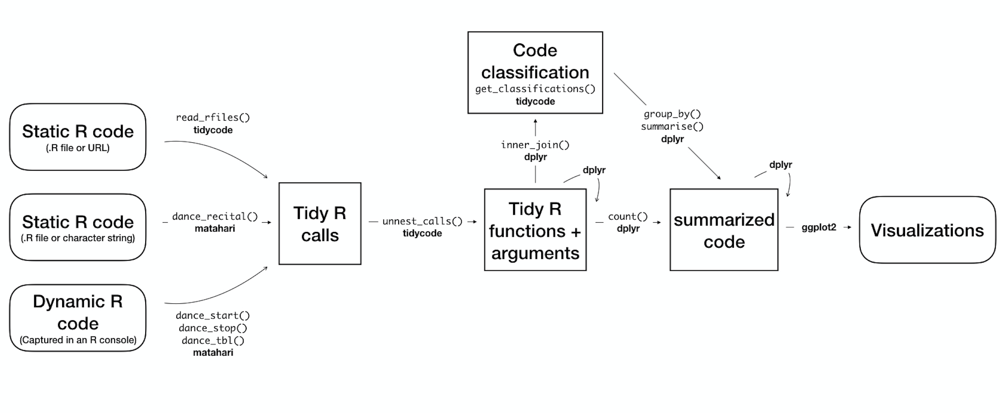
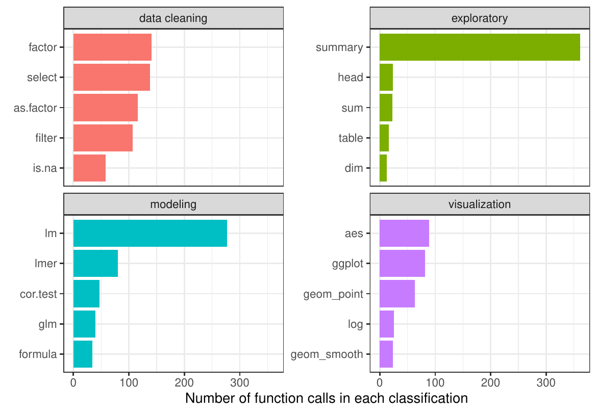
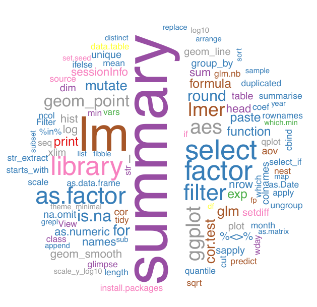
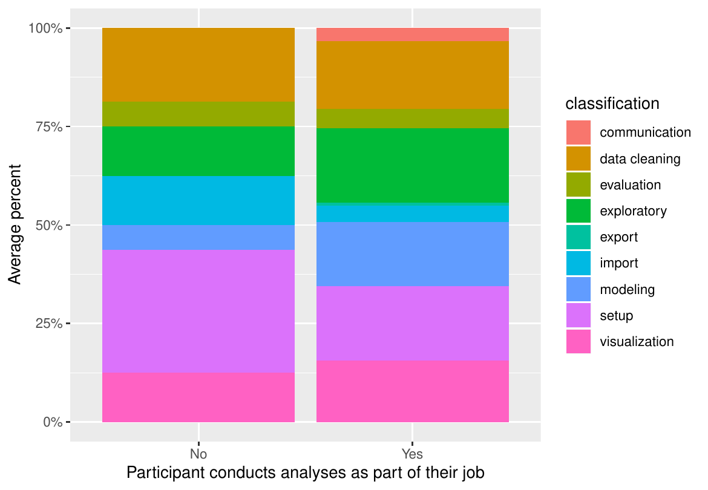

::: article
::: {#introduction}
## Introduction
:::

With the current emphasis on reproducibility and replicability, there is
an increasing need to examine how data analyses are conducted
[@ref-Goecks:2010ea; @ref-Peng:2011et; @ref-McNutt:2014bq; @ref-Miguel:2014hr; @ref-Ioannidis:2014cm; @ref-Richard:2014cn; @ref-Leek:2015kp; @ref-Nosek:2015bz; @ref-Sidi:2018hk].
In order to accurately replicate a result, the exact methods used for
data analysis need to be recorded, including the specific analytic steps
taken as well as the software utilized [@ref-Waltemath:2016jw]. Studies
across multiple disciplines have examined the global set of possible
data analyses that can be conducted on a specific data
set [@ref-silberzhan2018many]. While we are able to define this global
set, very little is known about the actual variation that exists between
researchers. For example, it is possible that the true range of data
analysis choices is realistically a much more narrow set than the global
sets that are presented. There is a breadth of excellent research and
experiments examining how people read visual
information [@ref-majumder2013validation; @ref-loy2017model; @ref-wickham2015visualizing; @ref-buja2009statistical; @ref-loy2016variations],
for example the Experiments on Visual Inference detailed here:
(<http://mamajumder.github.io/html/experiments.html>), but not how they
actually make analysis choices, specifically analysis *coding* choices.
In addition to not knowing about the "data analysis choice" variability
between researchers, we also do not know which portions of the data
analysis pipeline result in the most variability in the ultimate
research result. We seek to build tools to analyze these two aspects of
data analysis:

1.  The between researcher variability in data analysis choices

2.  The aspects within the data analysis pipeline that contribute to the
    variability in results

Specifically, we have designed a framework to conduct such analyses and
created two R packages that allow for the study of data analysis code
conducted in R. In addition to answering these crucial questions for
broad research fields, we see these tools having additional concrete use
cases. These tools will facilitate data science and statistics pedagogy,
allowing researchers and instructors to investigate how students are
conducting data analyses in the classroom. Alternatively, a researcher
could use these tools to examine how collaborators have conducted a data
analysis. Finally, these tools could be used in a meta-manner to explore
how current software and tools in R are being utilized.

::: {#tidy-principles}
### Tidy principles
:::

We specifically employ *tidy* principles in our proposed packages.
*Tidy* refers to an implementation strategy propagated by Hadley Wickham
and implemented by the Tidyverse team at RStudio [@ref-wickham2016r]
Here, by *tidy* we mean our packages adhere to the following principles:

1.  Our functions follow the principles outlined in *R packages*
     [@ref-wickham2015r] as well as the [tidyverse style
    guide](http://style.tidyverse.org) [@ref-tidystyle].

2.  Our output data sets are tidy, as in:

-   Each variable has its own column.
-   Each observation has its own row.
-   Each value has its own cell.

By implementing these tidy principles, and thus outputting tidy data
frames, we allow for data manipulation and analysis to be conducted
using a specific set of tools, such as those included in the
[*tidyverse*](https://CRAN.R-project.org/package=tidyverse) meta
package [@ref-tidyverse].

Ultimately, we create a mechanism to utilize methods created for natural
language processing; here the substrate is *code* rather than natural
language. We model our tools to emulate the
[*tidytext*](https://CRAN.R-project.org/package=tidytext)
package [@ref-silge2016tidytext; @ref-silge2017text]; instead of
analyzing tokens of text, we are analyzing tokens of code.

We present two packages,
[*matahari*](https://CRAN.R-project.org/package=matahari), a package for
logging everything that is typed in the R console or in an R script, and
[*tidycode*](https://CRAN.R-project.org/package=tidycode), a package
with tools to allow for analyzing R calls in a tidy manner. In this
paper, we first explain how these packages work. We then demonstrate two
examples, one that analyzes data collected from an online experiment,
and one that analyzes "old" data via previously created R scripts.

::: {#methods}
## Methods
:::

We have created two R packages,
[*matahari*](https://CRAN.R-project.org/package=matahari) and
[*tidycode*](https://CRAN.R-project.org/package=tidycode). The former is
a way to log R code, the latter allows the user to analyze R calls on
the function-level in a tidy manner. Figure 1 is a flowchart of the
process described in more detail below. This flowchart is adapted from
Figure 2.1 in *Text Mining with R: A Tidy
Approach* [@ref-silge2017text].

<figure id="fig:fig1">

<figcaption>Figure 1: A flowchart of a typical analysis that uses <a
href="https://CRAN.R-project.org/package=matahari"><em>matahari</em></a>
and <a
href="https://CRAN.R-project.org/package=tidycode"><em>tidycode</em></a>
to analyze and classify R code.</figcaption>
</figure>

We demonstrate how to create these tidy data frames of R code and then
emulate the data analysis workflow similar to that put forth in the tidy
text literature.

::: {#terminology}
### Terminology
:::

In this paper, we refer to R "expressions" or "calls" as well as R
"functions" and "arguments". An R call is a combination of an R function
with arguments. For example, the following is an R call (Example 1).

``` r
library(tidycode)
```

**Example 1.** R call, library

Another example of an R call is the following piped chain of functions
from the [*dplyr*](https://CRAN.R-project.org/package=dplyr) package
(Example 2).

``` r
starwars %>%
  select(height, mass)
```

**Example 2.** Piped R call

Specifically, we know something is a call in R if `is.call()` is `TRUE`.

``` r
quote(starwars %>%
  select(height, mass)) %>%
  is.call()
```

``` r
#> [1] TRUE
```

Calls in R are made up of a function or name of a function, and
arguments. For example, the call `library(tidycode)` from Example 1 is
comprised of the function `library()` and the argument `tidycode`.
Example 2 is a bit more complicated. The piped code can be rewritten, as
seen in Example 3.

``` r
`%>%`(starwars, select(height, mass))
```

**Example 3.** Rewritten piped R call

From this example, it is easier to see that the function for this R call
is `%>%` with two arguments, `starwars` and `select(height, mass)`.
Notice that one of these arguments is an R call itself,
`select(height, mass)`.

::: {#matahari}
### matahari
:::

[*matahari*](https://CRAN.R-project.org/package=matahari) is a simple
package for logging R code in a tidy manner. It can be installed from
CRAN using the following code.

``` r
install.packages("matahari")
```

There are three ways to use the matahari package:

1.  Record R code as it is typed and output a tidy data frame of the
    contents

2.  Input a character string of R code and output a tidy data frame of
    the contents

3.  Input an R file containing R code and output a tidy data frame of
    the contents

In the following sections, we will split these into two categories, tidy
logging from the R console (1) and tidy logging from an R script (2 and
3).

::: {#tidy-logging-from-the-r-console}
#### Tidy logging from the R console
:::

In order to begin logging from the R console, the `dance_start()`
function is used. Logging is paused using `dance_stop()` and the log can
be viewed using `dance_tbl()`. For example, the following code will
result in the subsequent tidy data frame.

``` r
library(matahari)
dance_start()
1 + 2
"here is some text"
sum(1:10)
dance_stop()
dance_tbl()
```

``` r
#> # A tibble: 6 x 6
#>   expr        value             path       contents   selection dt                  
#>   <list>      <list>            <list>     <list>     <list>    <dttm>             
#> 1 <languag... <S3: sessionIn... <lgl [1... <lgl [1... <lgl [1]> 2018-09-11 22:22:12
#> 2 <languag... <lgl [1]>         <lgl [1... <lgl [1... <lgl [1]> 2018-09-11 22:22:12
#> 3 <languag... <lgl [1]>         <lgl [1... <lgl [1... <lgl [1]> 2018-09-11 22:22:12
#> 4 <chr [1]>   <lgl [1]>         <lgl [1... <lgl [1... <lgl [1]> 2018-09-11 22:22:12
#> 5 <languag... <lgl [1]>         <lgl [1... <lgl [1... <lgl [1]> 2018-09-11 22:22:12
#> 6 <languag... <S3: sessionIn... <lgl [1... <lgl [1... <lgl [1]> 2018-09-11 22:22:12
```

**Example 4.** Logging R code from the R console using
[*matahari*](https://CRAN.R-project.org/package=matahari)

The resulting tidy data frame consists of 6 columns: `expr`, the R call
that was run, `value`, the value that was output, `path`, if the code
was run within RStudio, this will be the path to the file in focus,
`contents`, the file contents of the RStudio editor tab in focus,
`selection`, the text that is highlighted in the RStudio editor tab in
focus, and `dt`, the date and time the expression was run. By default,
`value`, `path`, `contents` and `selection` will not be logged unless
the argument is set to `TRUE` in the `dance_start()` function. For
example, if the analyst wanted the output data frame to include the
values computed, they would input `dance_start(value = TRUE)`.

In this particular data frame, there are 6 rows. The first and final
rows report the R session information at the time when `dance_start()`
was initiated (row 1) and when `dance_stop()` was run (row 6). The
second row holds the R call `dance_start()`, the first command run in
the R console, was run; the third row holds `1 + 2`, the fourth holds
`here is some text`, and the fifth holds `sum(1:10)`.

``` r
dance_tbl()[["expr"]]
```

``` r
#> [[1]]
#> sessionInfo()
#> 
#> [[2]]
#> dance_start()
#> 
#> [[3]]
#> 1 + 2
#> 
#> [[4]]
#> [1] "here is some text"
#> 
#> [[5]]
#> sum(1:10)
#> 
#> [[6]]
#> sessionInfo()
```

These functions work by saving an invisible data frame called `.dance`
that is referenced by `dance_tbl()`. Each time `dance_start()` is
subsequently run after `dance_stop()`, new rows of data are added to
this data frame. This invisible data frame exists in a new environment
created by the [*matahari*](https://CRAN.R-project.org/package=matahari)
package. We can remove this data frame by running `dance_remove()`.

This data frame can be manipulated using common R techniques. Below, we
rerun the same code as above, this time saving the values that are
computed in the R console by using the `value = TRUE` parameter.

``` r
dance_start(value = TRUE)
1 + 2
"here is some text"
sum(1:10)
dance_stop()
tbl <- dance_tbl()
```

As an example of the type of data wrangling that this tidy format allows
for, using [*dplyr*](https://CRAN.R-project.org/package=dplyr) and
[*purrr*](https://CRAN.R-project.org/package=purrr), we can manipulate
this to only examine expressions that result in numeric values.

``` r
library(dplyr)
library(purrr)

t_numeric <- tbl %>%
  mutate(
    numeric_output = map_lgl(value, is.numeric)
  ) %>%
  filter(numeric_output)

t_numeric
```

``` r
#> # A tibble: 3 x 7
#>   expr       value     path      contents  selection dt                  numeric_output
#>   <list>     <list>    <list>    <list>    <list>    <dttm>              <lgl>         
#> 1 <language> <int [1]> <lgl [1]> <lgl [1]> <lgl [1]> 2019-04-29 22:39:05 TRUE          
#> 2 <language> <dbl [1]> <lgl [1]> <lgl [1]> <lgl [1]> 2019-04-29 22:39:05 TRUE          
#> 3 <language> <int [1]> <lgl [1]> <lgl [1]> <lgl [1]> 2019-04-29 22:39:05 TRUE 
```

Here, three rows are output, since we have filtered to only calls with
numeric output:

1.  The `dance_start()` call (this defaults to have a numeric value of
    1)

2.  The `1 + 2` call, resulting in a `value` of `3`

3.  The `sum(1:10)`, resulting in a `value` of `55`

::: {#tidy-logging-from-an-r-script}
#### Tidy logging from an R script
:::

In addition to allowing for the logging of everything typed in the R
console, the [*matahari*](https://CRAN.R-project.org/package=matahari)
package also allows for the logging of pre-created R scripts. This can
be done using the `dance_recital()` function, which allows for either a
.R file or a character string of R calls as the input. For example, if
we have a code file called `sample_code.R`, we can run
`dance_recital("sample_code.R")` to create a tidy data frame.
Alternatively, we can enter code directly as a string of text, such as
`dance_recital("1 + 2")` to create the tidy data frame. Below
illustrates this functionality.

``` r
code_file <- system.file("test", "sample_code.R", package = "matahari")
dance_recital(code_file)
```

``` r
#> # A tibble: 7 x 6
#>   expr       value     error             output    warnings  messages 
#>   <list>     <list>    <list>            <list>    <list>    <list>   
#> 1 <language> <dbl [1]> <NULL>            <chr [1]> <chr [0]> <chr [0]>
#> 2 <chr [1]>  <chr [1]> <NULL>            <chr [1]> <chr [0]> <chr [0]>
#> 3 <language> <dbl [1]> <NULL>            <chr [1]> <chr [0]> <chr [0]>
#> 4 <language> <NULL>    <S3: simpleError> <NULL>    <NULL>    <NULL>   
#> 5 <language> <chr [1]> <NULL>            <chr [1]> <chr [1]> <chr [0]>
#> 6 <language> <NULL>    <NULL>            <chr [1]> <chr [0]> <chr [1]>
#> 7 <language> <NULL>    <NULL>            <chr [1]> <chr [0]> <chr [0]>
```

**Example 5.** R call, Logging code from a .R file using
[*matahari*](https://CRAN.R-project.org/package=matahari)

``` r
code_string <- '
4 + 4
"wow!"
mean(1:10)
stop("Error!")
warning("Warning!")
message("Hello?")
cat("Welcome!")
'
dance_recital(code_string)
```

``` r
#> # A tibble: 7 x 6
#>   expr       value     error             output    warnings  messages 
#>   <list>     <list>    <list>            <list>    <list>    <list>   
#> 1 <language> <dbl [1]> <NULL>            <chr [1]> <chr [0]> <chr [0]>
#> 2 <chr [1]>  <chr [1]> <NULL>            <chr [1]> <chr [0]> <chr [0]>
#> 3 <language> <dbl [1]> <NULL>            <chr [1]> <chr [0]> <chr [0]>
#> 4 <language> <NULL>    <S3: simpleError> <NULL>    <NULL>    <NULL>   
#> 5 <language> <chr [1]> <NULL>            <chr [1]> <chr [1]> <chr [0]>
#> 6 <language> <NULL>    <NULL>            <chr [1]> <chr [0]> <chr [1]>
#> 7 <language> <NULL>    <NULL>            <chr [1]> <chr [0]> <chr [0]>
```

**Example 6.** Logging code from a character string using
[*matahari*](https://CRAN.R-project.org/package=matahari)

The resulting tidy data frame from `dance_recital()`, as seen in
Examples 5 and 6, is different from that of `dance_tbl()`. This data
frame has 6 columns. The first is the same as the `dance_tbl()`, `expr`,
the R calls in the .R script or string of code. The subsequent columns
are, `value`, the computed result of the R call, `error`, which contains
the resulting error object from a poorly formed call, `output`, the
printed output from a call, `warnings`, the contents of any warnings
that would be displayed in the console, and `messages`, the contents of
any generated diagnostic messages. Now that we have a tidy data frame
with R calls obtained either from the R console or from a .R script, we
can analyze them using the
[*tidycode*](https://CRAN.R-project.org/package=tidycode) package.

The development version of the
[*matahari*](https://CRAN.R-project.org/package=matahari) package can be
found on GitHub at <https://github.com/jhudsl/matahari>. Users can
submit feature requests, issues, and bug reports here.

::: {#tidycode}
### tidycode
:::

The goal of [*tidycode*](https://CRAN.R-project.org/package=tidycode) is
to allow users to analyze R scripts, calls, and functions in a tidy way.
There are two main tasks that can be achieved with this package:

1.  We can "tokenize" R calls

2.  We can classify the functions run into one of nine potential data
    analysis categories: "Setup", "Exploratory", "Data Cleaning",
    "Modeling", "Evaluation","Visualization", "Communication", "Import",
    or "Export".

The [*tidycode*](https://CRAN.R-project.org/package=tidycode) package
can be installed from CRAN in the following manner.

``` r
install.packages("tidycode")
```

``` r
library(tidycode)
```

We can first create a tidy data frame using the
[*matahari*](https://CRAN.R-project.org/package=matahari) package.
Alternatively, we can use a function in the
[*tidycode*](https://CRAN.R-project.org/package=tidycode) package that
wraps the `dance_recital()` function called `read_rfiles()`. This
function allows you to read in multiple .R files or links to .R files.
There are a few example files included in the
[*tidycode*](https://CRAN.R-project.org/package=tidycode) package. The
paths to these files can be accessed via the `tidycode_example()`
function. For example, running the following code will give the file
path for the `example_analysis.R` file.

``` r
tidycode_example("example_analysis.R")
```

``` r
#> [1] "/Library/Frameworks/R.framework/Versions/3.5/Resources/library/tidycode/extdata/example_analysis.R"
```

Running the function without any file specified will supply a vector of
all available file names.

``` r
tidycode_example()
```

``` r
#> [1] "example_analysis.R" "example_plot.R"
```

We can use these example files in the `read_rfiles()` function.

``` r
df <- read_rfiles(tidycode_example(c("example_analysis.R", "example_plot.R")))
df
```

``` r
#> # A tibble: 9 x 3
#>   file                                                       expr      line
#>   <chr>                                                      <list>   <int>
#> 1 /Library/Frameworks/R.framework/Versions/3.5/Resources/li~ <langua~     1
#> 2 /Library/Frameworks/R.framework/Versions/3.5/Resources/li~ <langua~     2
#> 3 /Library/Frameworks/R.framework/Versions/3.5/Resources/li~ <langua~     3
#> 4 /Library/Frameworks/R.framework/Versions/3.5/Resources/li~ <langua~     4
#> 5 /Library/Frameworks/R.framework/Versions/3.5/Resources/li~ <langua~     5
#> 6 /Library/Frameworks/R.framework/Versions/3.5/Resources/li~ <langua~     6
#> 7 /Library/Frameworks/R.framework/Versions/3.5/Resources/li~ <langua~     7
#> 8 /Library/Frameworks/R.framework/Versions/3.5/Resources/li~ <langua~     1
#> 9 /Library/Frameworks/R.framework/Versions/3.5/Resources/li~ <langua~     2
```

This will give a tidy data frame with three columns: `file`, the path to
the file, `expr` the R call, and `line` the line the call was made in
the original .R file.

We can then use the `unnest_calls()` function to create a data frame of
the calls, splitting each into the individual functions and arguments.
We liken this to the
[*tidytext*](https://CRAN.R-project.org/package=tidytext)
`unnest_tokens()` function. This function has two parameters, `.data`,
the data frame that contains the R calls, and `input` the name of the
column that contains the R calls. In this case, the data frame is `m`
and the input column is `expr`.

``` r
u <- unnest_calls(df, expr)
u
```

``` r
#> # A tibble: 35 x 4
#>    file                                             line func   args       
#>    <chr>                                           <int> <chr>  <list>     
#>  1 /Library/Frameworks/R.framework/Versions/3.5/R~     1 libra~ <list [1]> 
#>  2 /Library/Frameworks/R.framework/Versions/3.5/R~     2 libra~ <list [1]> 
#>  3 /Library/Frameworks/R.framework/Versions/3.5/R~     3 <-     <list [2]> 
#>  4 /Library/Frameworks/R.framework/Versions/3.5/R~     3 %>%    <list [2]> 
#>  5 /Library/Frameworks/R.framework/Versions/3.5/R~     3 %>%    <list [2]> 
#>  6 /Library/Frameworks/R.framework/Versions/3.5/R~     3 mutate <named lis~
#>  7 /Library/Frameworks/R.framework/Versions/3.5/R~     3 /      <list [2]> 
#>  8 /Library/Frameworks/R.framework/Versions/3.5/R~     3 (      <list [1]> 
#>  9 /Library/Frameworks/R.framework/Versions/3.5/R~     3 ^      <list [2]> 
#> 10 /Library/Frameworks/R.framework/Versions/3.5/R~     3 (      <list [1]> 
#> # ... with 25 more rows
```

This results is a tidy data frame with two additional columns: `func`
the name of the function called and `args` the arguments of the function
called. Because this function takes a data frame as the first argument,
it works nicely with the tidyverse data manipulation packages. For
example, we could get the same data frame as above by using the
following code.

``` r
df %>%
  unnest_calls(expr)
```

``` r
#> # A tibble: 35 x 4
#>    file                                             line func   args       
#>    <chr>                                           <int> <chr>  <list>     
#>  1 /Library/Frameworks/R.framework/Versions/3.5/R~     1 libra~ <list [1]> 
#>  2 /Library/Frameworks/R.framework/Versions/3.5/R~     2 libra~ <list [1]> 
#>  3 /Library/Frameworks/R.framework/Versions/3.5/R~     3 <-     <list [2]> 
#>  4 /Library/Frameworks/R.framework/Versions/3.5/R~     3 %>%    <list [2]> 
#>  5 /Library/Frameworks/R.framework/Versions/3.5/R~     3 %>%    <list [2]> 
#>  6 /Library/Frameworks/R.framework/Versions/3.5/R~     3 mutate <named lis~
#>  7 /Library/Frameworks/R.framework/Versions/3.5/R~     3 /      <list [2]> 
#>  8 /Library/Frameworks/R.framework/Versions/3.5/R~     3 (      <list [1]> 
#>  9 /Library/Frameworks/R.framework/Versions/3.5/R~     3 ^      <list [2]> 
#> 10 /Library/Frameworks/R.framework/Versions/3.5/R~     3 (      <list [1]> 
#> # ... with 25 more rows
```

We can further manipulate this, for example we could select just the
`func` and `args` columns using
[*dplyr*](https://CRAN.R-project.org/package=dplyr)'s `select()`
function.

``` r
df %>%
  unnest_calls(expr) %>%
  select(func, args)
```

``` r
#> # A tibble: 35 x 2
#>    func    args            
#>    <chr>   <list>          
#>  1 library <list [1]>      
#>  2 library <list [1]>      
#>  3 <-      <list [2]>      
#>  4 %>%     <list [2]>      
#>  5 %>%     <list [2]>      
#>  6 mutate  <named list [1]>
#>  7 /       <list [2]>      
#>  8 (       <list [1]>      
#>  9 ^       <list [2]>      
#> 10 (       <list [1]>      
#> # ... with 25 more rows
```

The `get_classifications()` function calls a classification data frame
that we curated that classifies the individual functions into one of
nine categories: setup, exploratory, data cleaning, modeling,
evaluation, visualization, communication, import, or export. This can
also be merged into the data frame. For this classification analysis, we
are using an `inner_join()`, keeping only the functions that are
classified, similar to the workflow for a *sentiment analysis* in
[*tidytext*](https://CRAN.R-project.org/package=tidytext) [@ref-silge2017text].
If you did not want to remove unclassified functions from your
dataframe, the `left_join()` function would be appropriate.

``` r
u %>%
  inner_join(get_classifications()) %>%
  select(func, classification, lexicon, score)
```

``` r
#> # A tibble: 322 x 4
#>    func    classification lexicon       score
#>    <chr>   <chr>          <chr>         <dbl>
#>  1 library setup          crowdsource 0.687  
#>  2 library import         crowdsource 0.213  
#>  3 library visualization  crowdsource 0.0339 
#>  4 library data cleaning  crowdsource 0.0278 
#>  5 library modeling       crowdsource 0.0134 
#>  6 library exploratory    crowdsource 0.0128 
#>  7 library communication  crowdsource 0.00835
#>  8 library evaluation     crowdsource 0.00278
#>  9 library export         crowdsource 0.00111
#> 10 library setup          leeklab     0.994  
#> # ... with 312 more rows
```

There are two lexicons for classification, `crowdsource` and `leeklab`.
The former was created by volunteers who classified R code using the
[classify shiny application](https://lucy.shinyapps.io/classify). The
latter was curated by [Jeff Leek's Lab](https://jtleek.com). To select a
particular lexicon, you can specify the `lexicon` parameter. For
example, the following code will merge in the `crowdsource` lexicon
only.

``` r
u %>%
  inner_join(get_classifications("crowdsource")) %>%
  select(func, classification, score)
```

``` r
#> # A tibble: 271 x 3
#>    func    classification   score
#>    <chr>   <chr>            <dbl>
#>  1 library setup          0.687  
#>  2 library import         0.213  
#>  3 library visualization  0.0339 
#>  4 library data cleaning  0.0278 
#>  5 library modeling       0.0134 
#>  6 library exploratory    0.0128 
#>  7 library communication  0.00835
#>  8 library evaluation     0.00278
#>  9 library export         0.00111
#> 10 library setup          0.687  
#> # ... with 261 more rows
```

It is possible for a function to belong to multiple classes. This will
result in multiple lines (and multiple classifications) for a given
function. By default, these multiple classifications are included along
with the prevalence of each, indicated by the `score` column. To merge
in only the most prevalent classification, set the `include_duplicates`
option to `FALSE`.

``` r
u %>%
  inner_join(get_classifications("crowdsource", include_duplicates = FALSE)) %>%
  select(func, classification)
```

``` r
#> # A tibble: 33 x 2
#>    func    classification
#>    <chr>   <chr>         
#>  1 library setup         
#>  2 library setup         
#>  3 <-      data cleaning 
#>  4 %>%     data cleaning 
#>  5 %>%     data cleaning 
#>  6 mutate  data cleaning 
#>  7 /       data cleaning 
#>  8 (       data cleaning 
#>  9 ^       modeling      
#> 10 (       data cleaning 
#> # ... with 23 more rows
```

In text analysis, there is the concept of "stopwords". These are often
small common filler words you want to remove before completing an
analysis, such as "a" or "the". In a tidy *code* analysis, we can use a
similar concept to remove some functions. For example we may want to
remove the assignment operator, `<-`, before completing an analysis. We
have compiled a list of common stop functions in the `get_stopfuncs()`
function to anti join from the data frame.

``` r
u %>%
  inner_join(get_classifications("crowdsource", include_duplicates = FALSE)) %>%
  anti_join(get_stopfuncs()) %>%
  select(func, classification)
```

``` r
#> # A tibble: 15 x 2
#>    func       classification
#>    <chr>      <chr>         
#>  1 library    setup         
#>  2 library    setup         
#>  3 mutate     data cleaning 
#>  4 select     data cleaning 
#>  5 options    setup         
#>  6 summary    exploratory   
#>  7 plot       visualization 
#>  8 library    setup         
#>  9 select     data cleaning 
#> 10 filter     data cleaning 
#> 11 is.na      data cleaning 
#> 12 is.na      data cleaning 
#> 13 ggplot     visualization 
#> 14 aes        visualization 
#> 15 geom_point visualization
```

The development version of the
[*tidycode*](https://CRAN.R-project.org/package=tidycode) package can be
found on GitHub at
[https://github.com/jhudsl/tidycode](https://github.com/LucyMcGowan/tidycode).
Users can submit feature requests, issues, and bug reports here.

::: {#examples}
## Examples
:::

::: {#online-experiment-p-hack-athon}
### Online experiment: P-hack-athon
:::

This first example demonstrates how to use the
[*matahari*](https://CRAN.R-project.org/package=matahari) and
[*tidycode*](https://CRAN.R-project.org/package=tidycode) packages to
analyze data from a prospective study, using the "recording"
capabilities of the
[*matahari*](https://CRAN.R-project.org/package=matahari) package to
capture the code as participants run it. Recently, we launched a
"p-hack-athon" where we encouraged users to analyze a dataset with the
goal of producing the smallest p-value (IRB \# IRB00008885, Not Human
Subjects Research Classification, Johns Hopkins Bloomberg School of
Public Health IRB). We captured the code the participants ran using the
`dance_start()` and `dance_stop()` functions from the
[*matahari*](https://CRAN.R-project.org/package=matahari) package. This
resulted in a tidy data frame of R calls for each participant. We use
the [*tidycode*](https://CRAN.R-project.org/package=tidycode) package to
analyze these matahari data frames.

::: {#setup}
#### Setup
:::

``` r
library(tidyverse)
library(tidycode)

## load the dataset, called df
load("data/df_phackathon.Rda")
```

The data from the "p-hack-a-thon" is saved as a data frame called `df`.
This includes data from 29 participants. We have bound the `expr` column
from the [*matahari*](https://CRAN.R-project.org/package=matahari) data
frame for each participant. Using the `unnest_calls()` function, we
unnest each of these R calls into a function and it's arguments.

``` r
tbl <- df %>%
  unnest_calls(expr)
```

We can then remove the "stop functions" by doing an anti join with the
`get_stopfuncs()` function and merge in the crowd-sourced
classifications with the `get_classifications()` function.

``` r
classification_tbl <- tbl %>%
  anti_join(get_stopfuncs()) %>%
  inner_join(get_classifications("crowdsource", include_duplicates = FALSE))
```

::: {#classifications}
#### Classifications
:::

We can use common data manipulation functions from
[*dplyr*](https://CRAN.R-project.org/package=dplyr). For example, on
average, "data cleaning" functions made up 36.4% of the functions run by
participants (Table 1).

``` r
classification_tbl %>%
  group_by(id, classification) %>%
  summarise(n = n()) %>%
  mutate(pct = n / sum(n)) %>%
  group_by(classification) %>%
  summarise(`Average percent` = mean(pct) * 100) %>%
  arrange(-`Average percent`)
```

::: {#tab:tab1}
  ----------------------------------
  classification     Average percent
  ---------------- -----------------
  data cleaning                36.40

  visualization                23.17

  exploratory                  21.32

  setup                        18.87

  modeling                     17.69

  mport                         8.58

  communication                 5.14

  evaluation                    3.62

  export                        0.82
  ----------------------------------

  : Table 1: Average percent of functions spent on each task.
:::

We can also examine the most common functions in each classification.

``` r
func_counts <- classification_tbl %>%
  count(func, classification, sort = TRUE) %>%
  ungroup()

func_counts
```

``` r
#> # A tibble: 152 x 3
#>    func      classification     n
#>    <chr>     <chr>          <int>
#>  1 summary   exploratory      361
#>  2 lm        modeling         277
#>  3 factor    data cleaning    141
#>  4 select    data cleaning    138
#>  5 library   setup            128
#>  6 as.factor data cleaning    116
#>  7 filter    data cleaning    107
#>  8 aes       visualization     89
#>  9 ggplot    visualization     82
#> 10 lmer      modeling          80
#> # ... with 142 more rows
```

``` r
func_counts %>%
  filter(classification %in% c("data cleaning", "exploratory", "modeling", "visualization")) %>%
  group_by(classification) %>%
  top_n(5) %>%
  ungroup() %>%
  mutate(func = reorder(func, n)) %>%
  ggplot(aes(func, n, fill = classification)) +
  theme_bw() +
  geom_col(show.legend = FALSE) +
  facet_wrap(~classification, scales = "free_y") +
  scale_x_discrete(element_blank()) +
  scale_y_continuous("Number of function calls in each classification") +
  coord_flip()
```

<figure id="fig:fig2">

<figcaption>Figure 2: Functions that contribute to data cleaning,
exploratory analysis, modeling and visualization classifications in
p-hack-athon trial. This plot ranks the most common functions in each
classification and displays the top 5, with the x-axis representing the
number of times the given function was called. For example, by far the
most common function classified as "exploratory" is the ‘summary()‘
function. The most common function classified as "modeling" is the
‘lm()‘ function.</figcaption>
</figure>

We could then examine a word cloud of the functions used, colored by the
classification. We can do this using the
[*wordcloud*](https://CRAN.R-project.org/package=wordcloud) library.

``` r
library(wordcloud)

classification_tbl %>%
  count(func, classification) %>%
  with(
    wordcloud(func, n,
      colors = brewer.pal(9, "Set1")[factor(.$classification)],
      random.order = FALSE,
      ordered.colors = TRUE
    )
  )
```

<figure id="fig:fig3">

<figcaption>Figure 3: Word cloud of functions used in the p-hack-athon
trial, colored by classification. This provides another view of the most
common functions run in the p-hack-athon. The size of the function
corresponds to the number of times the function is called. For example,
the ‘summary()‘ function is the largest, as this was the most frequently
called function. The color of the function corresponds to the
classification of the function: red: communication, blue: data cleaning,
green: evaluation, purple: exploratory, orange: export, yellow: import,
brown: modeling, pink: setup, grey: visualization.</figcaption>
</figure>

Additionally, we could examine the variability in the types of functions
used between groups. For example, we asked participants whether they
perform analyses as part of their job. 82.76% of participants (n = 24)
answered "Yes".

``` r
classification_tbl %>%
  group_by(id, analysis_job, classification) %>%
  summarise(n = n()) %>%
  mutate(pct = n / sum(n)) %>%
  group_by(analysis_job, classification) %>%
  summarise(n = n()) %>%
  mutate(avg_pct = n / sum(n)) %>%
  ggplot(aes(x = analysis_job, y = avg_pct, fill = classification)) + 
  geom_bar(stat = "identity") + 
  scale_y_continuous("Average percent", labels = scales::percent) + 
  scale_x_discrete("Participant conducts analyses as part of their job")
```

<figure id="fig:fig4">

<figcaption>Figure 4: Variability in the types of functions used by
whether the participant performs analyses as part of their job. The bar
on the left represents the distribution of average classifications among
those who do not perform analyses as part of their job, the bar on the
right represents the distribution of the average classifications among
those who do perform analyses as part of their job. It appears that
users who conduct analyses as part of their jobs ran a larger percentage
of functions classified as "modeling", "exploratory", and
"communication", whereas those who do not ran a larger percentage of
"setup" functions. Of note, among those who do not conduct analyses as
part of their job, there were 0 functions used that classify as
"communication".</figcaption>
</figure>

Figure 4 demonstrates the variability in the types of functions users
ran, split by whether they conduct analyses as part of their jobs. It
appears that users who conduct analyses as part of their jobs ran a
larger percentage of functions classified as "modeling", "exploratory",
and "communication", whereas those who do not ran a larger percentage of
"setup" functions. Of note, among those who do not conduct analyses as
part of their job, there were 0 functions used that classify as
"communication". Had this experiment been run on a larger scale, we
could potentially draw inference on the differences between these two
groups and how they choose to code.

::: {#static-analysis}
### Static Analysis
:::

This second example demonstrates how to use the
[*matahari*](https://CRAN.R-project.org/package=matahari) and
[*tidycode*](https://CRAN.R-project.org/package=tidycode) packages to
analyze data from a retrospective study, or static R scripts. Here, we
use the `read_rfiles()` function from the
[*tidycode*](https://CRAN.R-project.org/package=tidycode) package. This
wraps the `dance_recital()`
[*matahari*](https://CRAN.R-project.org/package=matahari) function and
allows for multiple file paths or URLs to be read, resulting in a tidy
data frame. As an example, we are going to scrape all of the .R files
from two of the most widely used data manipulation packages, the
[*data.table*](https://CRAN.R-project.org/package=data.table) package
[@ref-datatable] and the
[*dplyr*](https://CRAN.R-project.org/package=dplyr) package. We are
going to use the [*gh*](https://CRAN.R-project.org/package=gh) package
[@ref-gh] to scrape these files from GitHub.

::: {#setup-1}
#### Setup
:::

We access the files via GitHub using the `gh()` function from the
[*gh*](https://CRAN.R-project.org/package=gh) package. This gives a list
of download URLs that can be passed to the `read_rfiles()` function from
the [*tidycode*](https://CRAN.R-project.org/package=tidycode) package.

``` r
library(tidyverse)
library(gh)
library(tidycode)

dplyr_code <- gh("/repos/tidyverse/dplyr/contents/R") %>%
  purrr::map("download_url") %>%
  read_rfiles()

datatable_code <- gh("/repos/Rdatatable/data.table/contents/R") %>%
  purrr::map("download_url") %>%
  read_rfiles()
```

::: {#data-cleaning}
#### Data Cleaning
:::

We can combine these two tidy data frames. We will do some small data
manipulation, removing R calls that were either `NULL` or `character`.
For example, in the [*dplyr*](https://CRAN.R-project.org/package=dplyr)
package some .R files just reference data frames as a character string.

``` r
pkg_data <- bind_rows(
  list(
    dplyr = dplyr_code,
    datatable = datatable_code
  ),
  .id = "pkg"
) %>%
  filter(
    !map_lgl(expr, is.null),
    !map_lgl(expr, is.character)
  )
```

::: {#analyze-r-functions}
#### Analyze R functions
:::

Now we can use the
[*tidycode*](https://CRAN.R-project.org/package=tidycode)
`unnest_calls()` function to create a tidy data frame of the individual
functions along with the arguments used to create both packages. Notice
here we are not performing an anti join on "stop functions". For this
analysis, we are interested in examining some key differences in the
commonly used functions contained the two packages. Common operators may
actually be of interest, so we do not want to drop them from the data
frame. We can count the functions by package.

``` r
func_counts <- pkg_data %>%
  unnest_calls(expr) %>%
  count(pkg, func, sort = TRUE)

func_counts
```

``` r
#> # A tibble: 1,163 x 3
#>    pkg       func         n
#>    <chr>     <chr>    <int>
#>  1 datatable =         1640
#>  2 dplyr     <-        1634
#>  3 datatable if        1590
#>  4 datatable {         1172
#>  5 dplyr     {         1047
#>  6 dplyr     function   724
#>  7 datatable !          616
#>  8 datatable <-         579
#>  9 datatable [          564
#> 10 datatable length     557
#> # ... with 1,153 more rows
```

Using this data frame, we can visualize which functions are most
commonly called in each package.

``` r
top_funcs <- func_counts %>%
  group_by(pkg) %>%
  top_n(10) %>%
  ungroup() %>%
  arrange(pkg, n) %>%
  mutate(i = row_number())

ggplot(top_funcs, aes(i, n, fill = pkg)) +
  theme_bw() +
  geom_col(show.legend = FALSE) +
  facet_wrap(~pkg, scales = "free") +
  scale_x_continuous(
    element_blank(),
    breaks = top_funcs$i,
    labels = top_funcs$func,
    expand = c(0, 0)
  ) +
  coord_flip()
```

 and
[*dplyr*](https://CRAN.R-project.org/package=dplyr) package development.
The y-axis displays the 10 most frequently used functions for each
package, the x-axis represents the number of times that function is
implemented. This allows us to examine coding style, for example the
most frequent function in the
[*data.table*](https://CRAN.R-project.org/package=data.table) packages
is '=', compared to '\<-' in the
[*dplyr*](https://CRAN.R-project.org/package=dplyr) package. The authors
of [*data.table*](https://CRAN.R-project.org/package=data.table) use the
'=' as an assignment operator at times, explaining this
difference.](dagostino-mcgowan_files/figure-latex/fig5-1.png){#fig:fig5
width="100%" alt="graphic without alt text"}

We can glean a few interesting details from Figure 5. First, the
[*data.table*](https://CRAN.R-project.org/package=data.table) authors
sometimes use the `=` as an assignment operator, resulting in this being
the most frequent function used. The
[*dplyr*](https://CRAN.R-project.org/package=dplyr) authors always use
`<-` for assignment, therefore this is the most frequent function seen
in this package [@ref-tidystyle]. Additionally, the
[*dplyr*](https://CRAN.R-project.org/package=dplyr) authors often create
modular code as a combination of small functions to complete specific
tasks. This may explain why `function` is the third most frequent R call
in this package, and less prevalent in the
[*data.table*](https://CRAN.R-project.org/package=data.table) package.
This just serves as a glimpse of what can be accomplished with these
tools.

::: {#discussion}
## Discussion
:::

We have designed a framework to analyze the data analysis pipeline and
created two R packages that allow for the study of data analysis code
conducted in R. We present two packages,
[*matahari*](https://CRAN.R-project.org/package=matahari), a package for
logging everything that is typed in the R console or in an R script, and
[*tidycode*](https://CRAN.R-project.org/package=tidycode), a package
with tools to allow for analyzing R calls in a tidy manner. These tools
can be applied both to prospective studies, where a researcher can
intentionally record code typed by participants, and retrospectively,
where the researcher can retrospectively analyze code. We believe that
these tools will help shape the next phase of reproducibility and
replicability, allowing the analysis of code to inform data science
pedagogy, examine how collaborates conduct data analyses, and explore
how current software tools are being utilized.

::: {#acknowledgements}
## Acknowledgements
:::

We would like to extend a special thank you to the members of the Leek
Lab at Johns Hopkins Bloomberg School of Public Health as well as
volunteers who used the "classify" shiny application for helping
classify R functions.
:::
