# Introduction

Directional statistics deals with data observed at a set of spatial
directions, which are usually positioned on the surface of the unit
sphere or star-shaped random particles. Spherical methods are important
research tools in geospatial, biological, palaeomagnetic and
astrostatistical analysis, just to name a few. The books
[@fisher; @mardia] provide comprehensive overviews of classical
practical spherical statistical methods. Various stochastic and
statistical inference modelling issues are covered in
[@Yadrenko; @marinucci_peccati_2011].

The CRAN Task View [*Spatial*](https://CRAN.R-project.org/view=Spatial)
shows several packages for Earth-referenced data mapping and analysis.
All currently available R packages for spherical data can be classified
in three broad groups.

The first group provides various functions for working with geographic
and spherical coordinate systems and their visualizations. Probably the
most commonly used R package to represent spatial maps and data is
[*sp*](https://CRAN.R-project.org/package=sp) [@sp]. It includes tools
for spatial selection, referencing and plotting spatial data as maps. It
has comprehensive hierarchical classes and methods for spatial 2d and 3d
data. Another example,
[*sphereplot*](https://CRAN.R-project.org/package=sphereplot)
[@sphereplot], uses [*rgl*](https://CRAN.R-project.org/package=rgl)
[@rgl] to create 3d visualizations in the spherical coordinate system.
The functions `car2sph` and `sph2car` implement transformations between
Cartesian and spherical coordinates. The package
[*geosphere*](https://CRAN.R-project.org/package=geosphere) [@geosphere]
includes functions for computing distances, directions and areas for
geographic coordinates.

The second group covers various numerical procedures that can be useful
for spherical approximations and computations. For example,
[*SpherWave*](https://CRAN.R-project.org/package=SpherWave) [@CircNNTSR]
is developed to implement the spherical wavelets and conduct the
multiresolution analysis on the sphere. Functions for numerical
integration over high-dimensional spheres and balls are provided in the
package
[*SphericalCubature*](https://CRAN.R-project.org/package=SphericalCubature)
[@SphericalCubature].

The third group provides statistical tools for spherical data analysis.
In this group, the most commonly used packages are
[*RandomFields*](https://CRAN.R-project.org/package=RandomFields)
[@RandomFields] and [*geoR*](https://CRAN.R-project.org/package=geoR)
[@geoR]. These packages provide a number of tools for model estimation,
spatial inference, simulation, kriging, spectral and covariance
analyses. Most of their underlying models are for 2d or 3d data, but
some additional spherical models are listed for future developments. The
package [*Directional*](https://CRAN.R-project.org/package=Directional)
[@Directional] has functions for von Mises-Fisher kernel density
estimation, discriminant and regression analysis on the sphere. The
package [*gensphere*](https://CRAN.R-project.org/package=gensphere)
[@gensphere] implements multivariate spherical distributions.
[*CircNNTSR*](https://CRAN.R-project.org/package=CircNNTSR) [@CircNNTSR]
provides functions for statistical analysis of spherical data by means
of non-negative trigonometric sums. The package
[*VecStatGraphs3D*](https://CRAN.R-project.org/package=VecStatGraphs3D)
[@VecStatGraphs3D] conducts statistical analysis on 3d vectors. It
includes estimation of parameters and some spherical test. Another
example is the package [*sm*](https://CRAN.R-project.org/package=sm)
[@sm] for spherical regression analysis and non-parametric density
estimation.

There are also several R packages developed for spherical data in
astronomy[^1]. For example,
[*cosmoFns*](https://CRAN.R-project.org/package=cosmoFns) [@cosmoFns]
and [*CRAC*](https://CRAN.R-project.org/package=CRAC) [@CRAC] implement
functions to compute spherical geometric quantities useful for
cosmological research. The package
[*FITSio*](https://CRAN.R-project.org/package=FITSio) [@FITSio] reads
and writes files in one of standard astronomical formats, FITS (Flexible
Image Transport System).
[*spider*](https://CRAN.R-project.org/package=spider) [@spider] includes
functions for all-sky grid/scatter plots under various astronomical
coordinate systems (equatorial, ecliptic, galactic). The package
[*astro*](https://CRAN.R-project.org/package=astro) [@astro] provides
functions for basic cosmological statistics and FITS file manipulations.

In recent years the spatial analysis and theory of spherical data have
been strongly motivated by the studies on the Cosmic Microwave
Background (CMB) radiation data collected by NASA and European Space
Agency missions COBE, WMAP and Planck and usually stored in the
Hierarchical Equal Area isoLatitude Pixelation (HEALPix) format.
Cosmologists have developed comprehensive Python and MATLAB software
packages[^2] to work with CMB and HEALPix data.

Although the mentioned before R packages can be used for geographic or
spherical coordinate referenced data, comprehensive and easy to use
tools for CMB and HEALPix data are not available in R, which motivated
the authors to design the package
[*rcosmo*](https://CRAN.R-project.org/package=rcosmo) [@rcosmo].

The aims of the package *rcosmo* are

-   to give convenient access and integrated in one package tools for
    analysis and visualisation of CMB and HEALPix data to the R
    statistical community;
-   to develop R functions for models and methods in spherical
    statistics that are not available in the existing R packages;
-   to extend familiar R classes to spherical HEALPix data making them
    cross-compatible and intuitively interactable with many existing R
    statistical packages.

The HEALPix format has numerous advantages to classical geographic
representations of spherical data, see [@originalHealpix]. R
implementation of computationally expensive statistical and geometrical
methods, such as nearest neighbour searches, empirical covariance
function estimation, uniform sampling, spectral density estimation, in a
way that takes advantage of the HEALPix data structure, could be useful
for geostatistics and other applications. It can reduce algorithmic
complexity and computational time. Various data processing,
manipulation, visualisation and statistical analysis tasks are achieved
efficiently in *rcosmo* , using optimised C++ code where necessary.

# Basics of CMB data

In the Standard Cosmological Model, the Cosmic Microwave Background is
redshifted microwave frequency light that is believed to have originated
around 14 billion years ago. CMB is the main source of data about the
early universe and seeds of future galaxies. Bell Labs physicists Arno
Penzias and Robert Wilson received the Nobel prize in physics in 1978
for their famously happenstance discovery of CMB radiation as an
inconvenient background "noise" during their experimentation with the
Holmdel Horn Antenna radio telescope [@{[66]}].

Over a decade later, NASA's Cosmic Microwave Background Explorer (COBE)
satellite mission produced the first detailed full CMB sky map
[@{[70]}]. Referred to as the dawn of precision cosmology, COBE results
provided fine constraints on many cosmological parameters. Particular
attention has been paid to the existence of CMB anisotropies and
associated non-Gaussianity, usually investigated through the CMB angular
power spectrum [@{[66]}]. The Wilkinson Microwave Anisotropy Probe, was
launched in 2001 by NASA and returned more precise measurements of CMB
[@{[69]}]. Then, the third and most detailed space mission to date was
conducted by the European Space Agency, via the Planck Surveyor
satellite [@{[68]}]. The radiation that astronomers detect today forms
an expanding spherical surface of radius approximately 46.5 billion
light years. The next generation of CMB experiments, CMB-S4, LiteBIRD,
and CORE, will consist of highly sensitive telescopes. It is expected
that these experiments will provide enormous amount of CMB measurements
and maps to nearly the cosmic variance limit.

The term "CMB data" refers to a broad range of location tagged
quantities describing properties of the CMB. For example, the Infrared
Science Archive by Caltech's Infrared Processing and Analysis Center
(IPAC) hosts curated CMB products from the North American Space Agency
(NASA)[^3].

To produce CMB maps (see Figure [5](#window-plot)), the products of the
Planck mission data (in the range of frequencies from $30$ to $857$ GHz)
are separated from foreground noise using one of the four detailed
methods named COMMANDER, NILC, SEVEM and SMICA[^4]. These CMB maps are
provided at either low resolution ($N_{\text{side}} = 1024$, i.e., $10$
arcmin resolution), or high resolution ($N_{\text{side}} = 2048$, i.e.,
$5$ arcmin resolution). The maps include temperature intensity and
polarisation data, as well as common masks for identifying regions where
the reconstructed CMB is untrusted.

Our focus will mostly be on the CMB temperature intensity data. In
Planck CMB products, these data are stored as 4-byte floating point
binary numbers in $K_{\text{cmb}}$ defined as the unit in which a black
body spectrum at $2.725$ Kelvin (K) is flat with respect to the
frequency [@{[65]}].

The map of the CMB temperature is usually modelled as a realization of
an isotropic Gaussian random field on the unit sphere. The Appendix
introduces a statistical model and basic notations of spherical random
fields. More details can be found, for example, in the monographs
[@marinucci_peccati_2011], [@Yadrenko] and the paper [@leonenko2018].

# *rcosmo* package

The current version of the *rcosmo* package can be installed from CRAN.
A development release is available from GitHub
(<https://github.com/frycast/rcosmo>).

The package offers various tools for

-   Handling and manipulating of CMB radiation and other spherical data,
-   Working with Hierarchical Equal Area isoLatitude Pixelation of a
    sphere (Healpix),
-   Spherical geometry,
-   Various statistical analysis of CMB and spherical data,
-   Visualisation of HEALPix data.

Most of *rcosmo* features were developed for CMB, but it can also be
used for other spherical data.

The package has more than 100 different functions. Figure [1](#map)
shows the core functions available in *rcosmo* and some typical data
analysis flow sequences.

{#map width="100%"
alt="graphic without alt text"}

Rather than attempting a systematic description of each functions, the
remainder of this paper shows broad classes of methods implemented in
*rcosmo* with particular examples of core functions. A reproducible
version of the code in this paper for the current version of *rcosmo* is
available in the folder \"Research materials\" from the
website <https://sites.google.com/site/olenkoandriy/>.

# Visualisation tools

Interactive visualisations of spherical data are a focus point of
*rcosmo* . Standard Python and MATLAB tools for CMB and HEALPix
visualization use the Mollweide projection of the unit sphere to the 2d
plane. This is an equal-area projection, but it distorts spherical
angles and distances. In contrast *rcosmo* employs the `OpenGL` powered
3d visualization device system *rgl* for R to allow 3d interactive plots
of data on the unit sphere.

The generic `plot` function produces interactive 3d vector graphics that
may be easily exported to a HTML document. Some examples of using
different plot functions are provided later in the paper. The results of
`plot.CMBDataFrame` are given in Figures [5](#window-plot) and
[6](#annulus-plot). For an example of using `plot.HPDataFrame` see
Figure [15](#world-plot) and examples of using `plot.CMBWindow` are
shown in Figures [5](#window-plot) and [7](#triang). For better
visualization some figures produced by the R code in this paper were
rotated and zoomed in before including in the article.

By default, the Planck colour scale is applied to CMB intensity data for
plotting[^5]. Additional features such as automatic plot legends,
alternative colour scales, and greater configurability are planned for
future releases. In addition, *rcosmo* provides a variety of 2d plot
functionality to support visualisation of statistical analysis results
and some additional 3d plot functionality for demonstrating HEALPix
pixel properties.

# *rcosmo* classes

Four R classes have been developed to support HEALPix data
representation and analysis in the package *rcosmo* : `"CMBDat"`,
`"CMBDataFrame"`, `"HPDataFrame"` and `"CMBWindow"`. First three are
main parent classes of objects to store spherical data. The class
`"CMBWindow"` is used to choose observation windows.

-   The function `CMBDat` creates objects of class `"CMBDat"`. `CMBDat`
    objects are lists containing header information, other metadata and
    a data slot. Data slots may include standard information about CMB
    intensity (I), polarisation (Q, U), PMASK and TMASK. It also may
    contain a `mmap` object that points to the CMB map data table in a
    FITS file. As for standard data frames new data slots can be created
    to store other types of spherical data.
-   The function `CMBDataFrame` creates objects of class
    `"CMBDataFrame"`. These class is a special modification of
    `"data.frame"` that also carries metadata about, e.g., the HEALPix
    ordering scheme, coordinate system, and nside parameter (i.e., the
    resolution of the HEALPix grid that is being used). Each row of a
    `CMBDataFrame` is associated with a unique HEALPix pixel index.
-   The class `"HPDataFrames"` is a type of `"data.frame"` designed to
    carry data located on the unit sphere. Unlike `"CMBDataFrame"`,
    `"HPDataFrames"` may have repeated pixel indices. It allows to store
    multiple data points falling within a given pixel in different rows
    of `HPDataFrame` objects.
-   The function `CMBWindow` creates objects of class `"CMBWindow"`.
    These objects are polygons, spherical discs, or their compliments,
    unions and intersections.

As the main *rcosmo* data classes are special modifications of
`"data.frame"` it means that spatial objects produced by *rcosmo* can be
subsequently processed by other R packages/functions that work with
standard data frames. The `rbind` and `cbind` generics that work with
the `"data.frame"` class have been customised in *rcosmo* to preserve
the validity of `CMBDataFrame` objects.

# Getting data into rcosmo

In this section, we demonstrate how to import CMB data in the typical
case of a full sky map stored as a FITS file. Such maps can be sourced
from the NASA/IPAC Infrared Science Archive[^6].

The function `downloadCMBMap` can be used to download Planck CMB maps.
One can specify the type of map (`COMMANDER`, `NILC`, `SEVEM` or
`SMICA`), the resolution ($N_{\text{side}} = 1024$ or $2048$), and save
it in a working directory with a specified file name.

The map `COM_CMB_IQU-smica_1024_R2.02_full.fits` used in most of the
examples in this paper is a FITS file of approximate size 200 megabytes.
This map has the resolution $N_{\text{side}} = 1024$, so it contains
$N_{\text{pix}} = 12\times1024^2 = 12582912$ pixels, each having its own
intensity $I$, polarisation $Q,U,$ temperature mask value
$T_{\text{mask}} \in \{0,1\}$ and polarisation mask value
$P_{\text{mask}} \in \{0,1\}$.

After downloading the map with `downloadCMBMap` and applying the
function `CMBDataFrame`, we obtain an object of class `"CMBDataFrame"`.

``` r
> library(rcosmo)
> filename <- "CMB_map_smica1024.fits"
> downloadCMBMap(foreground = "smica", nside = 1024, filename)
> sky<-CMBDataFrame(filename) 
> str(sky)
Classes ‘CMBDataFrame’ and 'data.frame':	12582912 obs. of  1 variable:
 $ I: num  -9.20e-05 -8.04e-05 -8.99e-05 -7.71e-05 -7.01e-05 ...
 - attr(*, "nside")= int 1024
 - attr(*, "ordering")= chr "nested"
 - attr(*, "resolution")= num 10
...
```

An alternative to the above act of reading the entire map into memory is
to take a random sample of points on the sphere. This is achieved
without reading the entire map into R memory. Simple random sampling in
*rcosmo* will be discussed further under the section on statistical
functions.

``` r
> set.seed(0); s <- 2e6; 
> cmb_sample <- CMBDataFrame(filename, sample.size = s, include.m = T, include.p = T)
> cmb_sample
A CMBDataFrame
# A tibble: 2,000,000 x 5
           I        Q            U TMASK PMASK
       <dbl>    <dbl>        <dbl> <int> <int>
1 -0.0000771  5.45e-9 -0.000000718     0     0
2 -0.0000701 -7.10e-8 -0.000000730     0     0
...
10 -0.0000710  8.25e-8 -0.000000618     0     0
# ... with 1,999,990 more rows
```

# Use of memory mapping

The standard library for reading data from FITS files is a collection of
C and FORTRAN subroutines called `CFITSIO`. In R, the package *FITSio*
[@FITSio] is the only general FITS file reader that the authors are
aware of. However, importing a full sky CMB map with approximately 12
million intensity samples from a FITS file using *FITSio* took too long
when development of *rcosmo* began. We were able to reduce the necessary
run time to under 4 seconds with the *rcosmo* function `CMBDat`.
*rcosmo* still substantially outperforms the last version of *FITSio*.
In the following example we used the CMB map with `SMICA` foreground
separation and $N_{side} = 2048$ (having approximately 50 million
intensity samples) to test it on a modern laptop[^7].

``` r
> filename1 <- "CMB_map_smica2048.fits"
> downloadCMBMap(foreground = "smica", nside = 2048, filename1)
> system.time(sky <- CMBDataFrame(filename1))
   user  system elapsed 
   1.36    0.29    1.73

> system.time(fits <- FITSio::readFITS(filename1))
   user  system elapsed 
 822.28   90.05  942.14 
```

The approach used in *rcosmo* is based on a novel application of the
*mmap* package by Jeffrey Ryan [@mmap]. The package *mmap* is a highly
optimised interface to `POSIX mmap` and Windows `MapViewOfFile`. Using
*mmap* in *rcosmo* required an update of *mmap* to support big-Endian
byte order. The current version of *mmap* allows us to import data from
a FITS binary table very efficiently, one row at a time, using a C
struct data type. Ideally, for a typical *rcosmo* user, the details of
using *mmap* are abstracted away while the user constructs and interacts
with `"CMBDataFrame"` objects.

Another use of *mmap* in *rcosmo* concerns the elimination of the need
to read a large full sky CMB map into R memory. Often it is unmanageable
to read the entire contents of a FITS file. For example, it may not be
possible to obtain sufficiently large blocks of continguous memory from
the operating system when importing more than a few hundred megabytes of
data as a numeric vector. In *rcosmo* , integration of *mmap* allows one
to maintain a C-style pointer at a particular byte-offset to the target
binary file (e.g., the FITS file), so that data can be read into R
memory on command from this offset. In the following example, only rows
$1,2,4,7$ and $11$ are read into memory from the file.

``` r
> v <- c(1,2,4,7,11)
> sky <- CMBDataFrame(filename, spix = v, include.p = T, include.m = T,
 coords = "spherical")
> sky
A CMBDataFrame
# A tibble: 5 x 7
  theta   phi          I        Q            U TMASK PMASK
  <dbl> <dbl>      <dbl>    <dbl>        <dbl> <int> <int>
1  1.57 0.785 -0.0000920  6.47e-8 -0.000000657     0     0
2  1.57 0.786 -0.0000804 -9.19e-9 -0.000000694     0     0
3  1.57 0.785 -0.0000771  5.45e-9 -0.000000718     0     0
4  1.57 0.786 -0.0000663 -5.81e-8 -0.000000751     0     0
5  1.57 0.783 -0.0000836  7.60e-8 -0.000000697     0     0

> pix(sky)
[1]  1  2  4  7 11
```

The next section discusses the HEALPix data structure. HEALPix ordering
schemes can be used to map coordinates on the sphere to row indices in a
FITS binary table. Combining this feature with the technique in the
above example allows *rcosmo* to efficiently import random samples of
data from a variety of geometric regions of the sphere without ever
having to import the entire CMB map. This is particularly useful on
larger maps and will become increasingly important in future as advances
in cosmology allow for higher resolution CMB maps to be produced.

# Introduction to HEALPix {#healpix-intro}

Present generation Cosmic Microwave Background experiments produce data
with up to 5 arcminutes resolution on the sphere. For a full-sky map,
this amounts to approximately 50 million pixels, each describing
distinct location, intensity, polarisation and other attributes. The
statistical analysis of such massive datasets, and associated
discretisation of functions on the sphere, can involve prohibitive
computational complexity and non-adequate sampling in the absence of an
appropriate data structure. The Hierarchical Equal Area isoLatitude
Pixelation is a geometric structure designed to meet this demand using a
self-similar refinable mesh. It is currently the most widely used
pixelation for storing and analysing CMB data [@originalHealpix].

The package *rcosmo* provides various tools to visualize and work with
the HEALPix structure.

HEALPix initially divides the sphere into 12 equiareal base pixels. To
visualise these with *rcosmo* , we can first generate a `CMBDataFrame`
at some low resolution (e.g, $N_{\text{side}} = 64$) and then take three
separate window subsets in the pixels that we intend to colour, as shown
in Figure [2](#fig-base-pixels)a). Note that, while all HEALPix pixels
are 4-sided, their edges are not geodesics, i.e., they are not spherical
quadrillaterals [@{[39]}].

``` r
> ns <- 64; rand <- rnorm(12 * ns ^ 2)
> cmbdf <- CMBDataFrame(nside = ns, I = rand, ordering = "nested")
> w1 <- window(cmbdf, in.pixels = c(1,9))
> w2 <- window(cmbdf, in.pixels = c(2,10))
> w3 <- window(cmbdf, in.pixels = c(4,12))
> plot(w1, col = "blue", back.col = "white", xlab = '', ylab = '', zlab = '')
> plot(w2, col = "green", add = TRUE)
> plot(w3, col = "orange", add = TRUE)
> displayPixelBoundaries(nside = 1,ordering = "nested",incl.labels = 1:12,col ="red")
```

Each of the 12 base pixels can be further subdivided into 4 equiareal
4-sided pixels. For a demonstration, we can create another window subset
based on a higher resolution `CMBDataFrame` and display the outputs in
Figure [2](#fig-base-pixels)b.

``` r
>  ns <- 256; rand <- rnorm(12 * ns ^ 2)
>  w21 <- window(CMBDataFrame(nside = ns, I = rand, ordering ="nested"), in.pixels = 1)
>  plot(w21, col = "light blue", back.col = "white", add = TRUE, size = 1.2)
>  displayPixelBoundaries(nside=2,ordering="nested",incl.labels=c(1,2,3,4),col ="black")
>  plot(window(cmbdf,in.pixels = 2), col = "green", add = TRUE)
>  plot(window(cmbdf,in.pixels = 4), col = "purple", add = TRUE)
>  plot(window(cmbdf,in.pixels = 5), col = "orange", add = TRUE)
>  plot(window(cmbdf,in.pixels = 6), col = "red", add = TRUE) 
```

This process of subdivision can be repeated until a desired resolution
is achieved. At the required resolution, the number of edge segments per
base pixel edge is referred to as the $N_{\text{side}}$ parameter, and
satisfies $N_{\text{pix}} = 12N_{\text{side}}^2$, where we use
$N_{\text{pix}}$ to denote the total number of pixels.

<figure id="fig-base-pixels">
<table>
<caption> </caption>
<tbody>
<tr class="odd">
<td style="text-align: center;">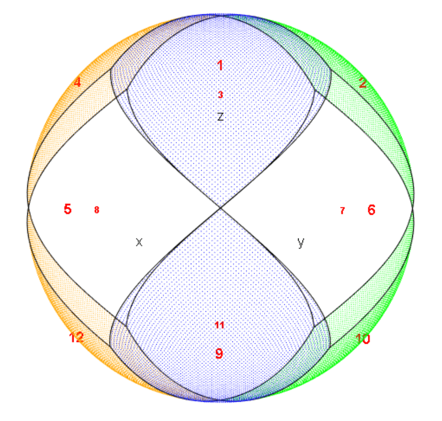</td>
<td style="text-align: center;">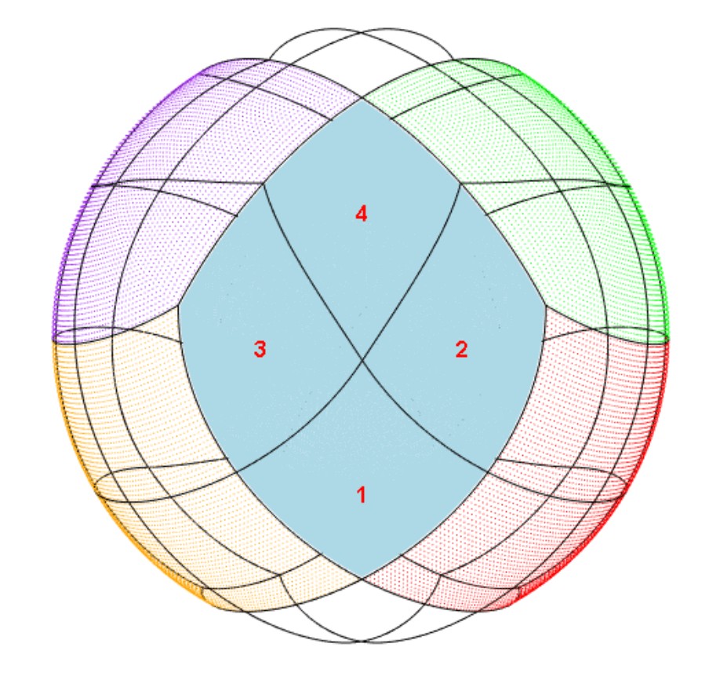</td>
</tr>
<tr class="even">
<td style="text-align: center;">(a) HEALPix base pixel boundaries</td>
<td style="text-align: center;">(b) HEALPix nested ordering</td>
</tr>
</tbody>
</table>
<figcaption>Figure 2: (a): HEALPix base pixel boundary visualisation.
The 12 base pixels are labelled 1 to 12; (b): HEALPix nested ordering
visualisation at <span
class="math inline"><em>N</em><sub>side</sub> = 2.</span> Pixels 1, 2, 3
and 4 (labelled) all fall within base pixel 1 (coloured
solid).</figcaption>
</figure>

At a given $N_{\text{side}}$, the HEALPix representation provides a
bijection from the first $12N_{\text{side}}^2$ natural numbers $P$ to a
set of locations $L$ on the unit sphere. We refer to $P$ as the set of
pixel indices and $L$ as the set of pixel centers. For assigning the
pixel indices to the pixel centers there are two approaches, known
respectively as the \"ring\" and \"nested\" ordering schemes. The nested
scheme is demonstrated with the numbering in Figure
[2](#fig-base-pixels)b. The ring scheme is demonstrated in
Figure [3](#fig-ring-pixels).

<figure id="fig-ring-pixels">
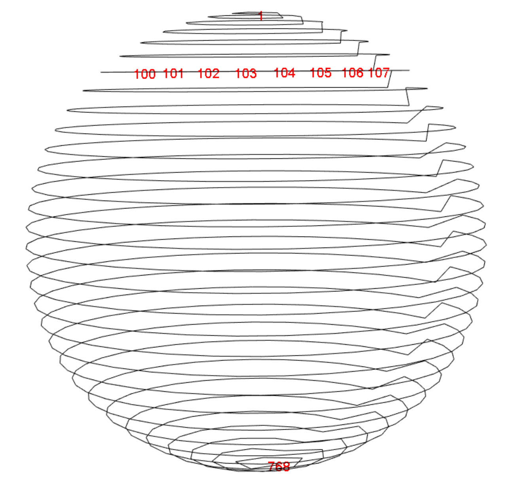
<figcaption>Figure 3: HEALPix ring ordering scheme visualisation. The
black line traces in order through pixel centers from 1 to <span
class="math inline"><em>N</em><sub>pix</sub> = 768</span>. The locations
of pixels 100 to 107 are labelled.</figcaption>
</figure>

``` r
> cmbdf <- CMBDataFrame(nside = 8, ordering = "ring")
> plot(cmbdf, type = 'l', col = "black", back.col = "white")
> tolabel <- c(1,100:107,768)
> plot(cmbdf[tolabel,], labels = tolabel, col = "red", add = TRUE)
```

Regardless of the choice of ordering scheme, all HEALPix pixel centers
lie on $4N_{\text{side}} - 1$ rings of constant latitude. This feature
facilitates fast discrete spherical harmonic transforms, since the
associated Legendre functions need only be evaluated once per
isolatitude ring of pixel centers [@originalHealpix].

Many tasks gain or lose efficiency with the choice of ordering scheme.
For example, nearest neighbour searches are best conducted in the nested
scheme [@originalHealpix]. As such, every object of class
`"CMBDataFrame"` or `"HPDataFrame"` has an attribute named `ordering` to
indicate which of the two schemes is being used. This allows
*rcosmo* functions to choose the most efficient scheme for each task,
performing any necessary conversions with the internal functions
`nest2ring` and `ring2nest`.

# HEALPix functions

For working directly with HEALPix properties there are a number of
*rcosmo* functions. Some core functions are shown in Figure [1](#map) in
the yellow colour, other are internal and some were exported. Broadly,
there are the following categories:

-   Working with ordering schemes,
-   Navigating the nested ordering hierarchy,
-   Geometric functions involving pixel indices,
-   Visualising the HEALPix structure.

The main ordering functions include converting between two ordering
schemes and getting information about a type of ordering (`ordering`
generic and internals `nest2ring` and `ring2nest`). For example, the
`ordering` generic function is useful for getting and setting the
ordering attribute of a `CMBDataFrame` or `HPDataFrame`.

``` r
> sky <- CMBDataFrame(nside = 2, ordering = "ring"); ordering(sky)
[1] "ring"
> ordering(sky) <- "nested"; ordering(sky)
[1] "nested"
```

*rcosmo* functions for navigating the HEALPix structure provide various
tools to investigate local neighbourhoods of specific pixels and
relative positions of pixels at different levels of the nested ordering
hierarchy, see, for example, `ancestor`, `pixelWindow`, `neighbours`,
etc. Since the nested ordering is self-similar, many of these functions
are resolution independent.

For example, the $k^{\text{th}}$ ancestor of a pixel index $p$ at
resolution $j := \log_2(N_{\text{side}})$ is the pixel index $p_a$ to
which $p$ belongs, $k$ steps up the hierarchy (i.e., at resolution
$j - k$). It turns out that $p_a$ is a function $p_a = f(p,k)$ that is
independent of $j$. The following example produces the ancestors of
pixel $p = 10^3$, for $k = 1,2,\ldots, 5,$ using the internal function
`ancestor`.

``` r
> ancestor(1e3, 1:5)
[1] 250  63  16   4   1
```

A function that is not resolution independent is `pixelWindow`. In the
following code, `pixelWindow` retrieves all pixels at resolution
$j_2 = 5$ that lie within pixel $p = 1$, specified at resolution
$j_1 = 1.$ The result is shown in Figure [4](#pixel-plot).

``` r
p <- 1; j1 <- 1; j2 <- 5
P <- pixelWindow(j1 = j1, j2 = j2, pix.j1 =  p)
displayPixels(spix = P, j = j2, plot.j = j2)
```

<figure id="pixel-plot">
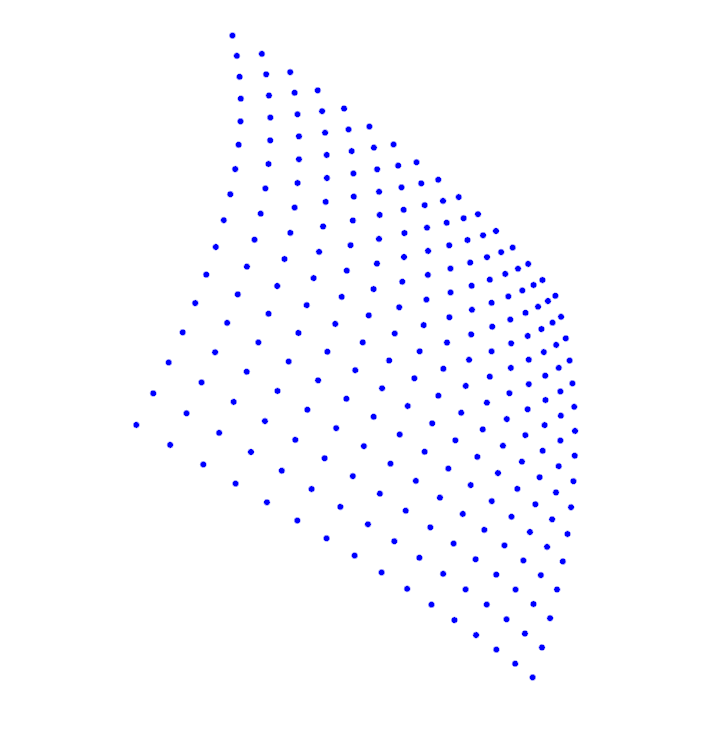
<figcaption>Figure 4: All pixel centers (at resolution 5), within pixel
1 (at resolution 1)</figcaption>
</figure>

The group of *rcosmo* functions that includes `pix2coords`, `pixelArea`,
`nestSearch`, etc., computes spherical geometric properties in relation
to by pixel indices. For example, the `nestSearch` function searches a
pixel closest to a point in 3d space. It uses an algorithm that achieves
a high level of efficiency using the nested hierarchy. A comparison, via
[*microbenchmark*](https://CRAN.R-project.org/package=microbenchmark)
[@microbenchmark], with a basic linear search algorithm which we call
`geoDistSearch` reveals the following.

``` r
> library(microbenchmark)
> geoDistSearch <- function(target, nside, spix) {
    xyz <- pix2coords(nside = nside, spix = spix)
    dists <- geoDist(xyz, target)
    return(xyz[which.min(dists),])}
 
> t <- data.frame(x = 0.6, y = 0.8, z = 0)
> nside <- 16; p <- 1:(12*(nside)^2)
> mb <- microbenchmark::microbenchmark(
    geoDistSearch(target = t, nside = nside, spix = p),
    nestSearch(target = t, nside = nside))
> summary(mb)$median[1]/summary(mb)$median[2]
[1]  283.9834
```

From the above, it was observed that `nestSearch` was over $200$ times
faster than `geoDistSearch` at finding the closest pixel center at
$N_{\text{side}}  = 16$ to the point $(x,y,z) = (0.6, 0.8, 0).$ With
`nestSearch`, the closest pixel to a target point is found by checking
only $12+4\log_2(N_{\text{side}})$ pixels rather than
$12N_{\text{side}}^2.$ When $N_{\text{side}} = 2048$, only
$12+4\log_2(2048) = 56$ pixels must be checked from over 50 million.

# Subsetting and combining spherical regions {#CMB:subsetting}

*rcosmo* functions for selecting and visualizing spherical regions can
be broadly divided in the following groups:

-   Creating basic `CMBWindow` objects (polygons or spherical discs),
-   Combining different sub-regions by using compliments, unions and
    intersections to create a new `CMBWindow` object,
-   Plotting a region with boundary and inside points,
-   Extracting data from a given `CMBDataFrame` restricted to a
    `CMBWindow` region.

Class `CMBWindow` is designed to carry geometrical information
describing the interior or exterior of spherical figures (polygons,
spherical discs (caps), and their complements, unions and
intersections). The polygons can be non-convex, though `CMBWindow`
carries a boolean attribute `assumedConvex` that should be set to
`TRUE`, if the polygon is known in advance to be convex. In this case
special methods that decrease computation times are applied.

A `CMBWindow` object can be created using the `CMBWindow` function. The
code below illustrates the creation of two `CMBWindow`s that correspond
to the Dragon and Scorpion constellations. Files of constellation
boundaries[^8] include coordinates of spherical polygons vertices that
correspond to each constellation. The function `hms2deg` converts
celestial coordinates (hours, minutes, seconds) to the degrees format.
Then \"phi\" and \"theta\" columns of the `data.frame` `CB` are used to
create CMBWindow objects. To inspect these `CMBWindow` objects using
interactive 3D graphics, we can pass them to the generic plot function.
Below, we also plot the CMB map as a background. The resulting plot is
displayed in Figure [5](#window-plot).

``` r
> download.file("https://www.iau.org/static/public/constellations/txt/dra.txt",
  "bound1.txt")
> x1 <- readLines("bound1.txt")
> x1 <- gsub("\\|", " ", x1)
> Constellation_Boundary1 <- read.table(text = x1,col.names=c("H","M","S","D","Con_N"))
> download.file("https://www.iau.org/static/public/constellations/txt/sgr.txt",
  "bound2.txt")
> x2 <- readLines("bound2.txt")
> x2 <- gsub("\\|", " ", x2)
> Constellation_Boundary2 <- read.table(text = x2,col.names=c("H","M","S","D","Con_N"))
 
> CB0 <- Constellation_Boundary1
> deg <- celestial::hms2deg(CB0[,1],CB0[,2],CB0[,3])
> CB1 <- data.frame(pi*deg/180, pi*CB0[,4]/90)
> colnames(CB1) <- c("phi","theta")
> polygon1 <- CMBWindow(phi = CB1$phi, theta = CB1$theta)
> plot(cmb_sample, back.col = "white")
> plot(polygon1, lwd=2)
```

After repeating the steps above for the Scorpion constellation we obtain
and the second `CMBWindow` object `polygon2` in Figure
[5](#window-plot).

<figure id="window-plot">
<table>
<caption> </caption>
<tbody>
<tr class="odd">
<td style="text-align: center;">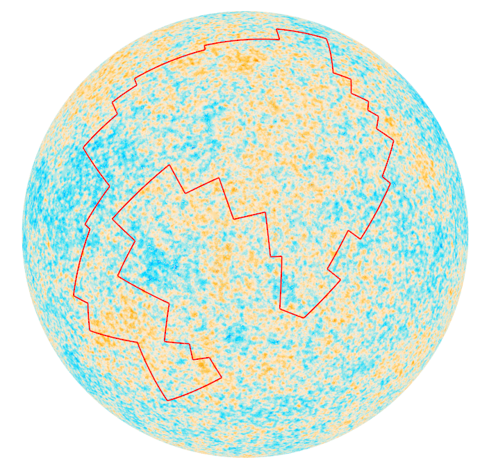</td>
<td style="text-align: center;">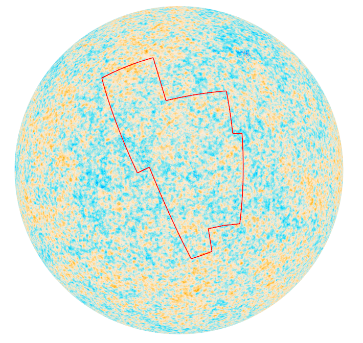</td>
</tr>
<tr class="even">
<td style="text-align: center;">(a) The Dragon</td>
<td style="text-align: center;">(b) The Scorpion</td>
</tr>
</tbody>
</table>
<figcaption>Figure 5: Boundary visualisation of polygon CMBWindow
objects, plotted against <span class="math inline">10<sup>5</sup></span>
CMB intensities.</figcaption>
</figure>

Note that for the `CMBWindow` polygons defined above, entire polygons
lie within any one hemisphere of $\mathbb{S}_2.$ To obtain `CMBWindow`
objects that occupy more than one hemisphere, we can specify a polygon
or disc exterior (complement in $\mathbb{S}_2$) using the
`set.minus = TRUE` parameter. For example, the following command gives
the exterior of a spherical cap with a base radius 0.5.

``` r
> d.exterior <- CMBWindow(theta = pi/2, phi = 0, r = 0.5, set.minus = TRUE)
```

To specify more complicated regions, we can combine multiple `CMBWindow`
objects into a `list`. For example, the following command results in the
list containing d.exterior and the interior of a spherical disc (cap) of
base radius 1 (disc's radius is computed on the sphere surface), which
is a spherical segment shown in Figure [6](#annulus-plot).

``` r
> wins <- list(d.exterior, CMBWindow(theta = pi/2, phi = 0, r = 1))
```

<figure id="annulus-plot">
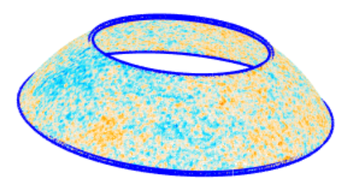
<figcaption>Figure 6: CMB intensity data extracted from an
<code>CMBDataFrame</code> object by the <code>window</code> function.
</figcaption>
</figure>

By passing `CMBWindow` objects to the `window` function, one can extract
data from a `CMBDataFrame` or `mmap` object. Below, using the above
spherical window `wins` the `CMBDataFrame` named `sky.annulus` is
created and plotted in Figure [6](#annulus-plot).

``` r
> df <- CMBDataFrame(filename)
> sky.annulus <- window(df, new.window = wins)
> plot(sky.annulus, back.col = "white")
> plot(wins[[1]], lwd = 5, col="blue"); plot(wins[[2]], lwd = 5, col="blue")
```

# Spherical geometry functions

Several basic tools for spherical geometry are implemented in *rcosmo* :

-   Converting between different coordinate systems on the sphere,
-   Computing geodesic distances between points and windows,
-   Calculating spherical angles,
-   Computing areas of spherical figures,
-   Triangulating spherical polygons.

The currently implemented core geometric functions are shown in
Figure [1](#map) in the orange colour. Some other spherical geometric
tools are specified for the HEALPix representation or `CMBWindows` and
are shown in the green colour.

For example, the functions `geoArea` computes the area of a figure on
the unit sphere that is encompassed by its pixels.

``` r
> geoArea(sky.annulus)
[1] 2.11917
```

Another example is the function `maxDist` that computes the maximum
geodesic distance either between all points in a `data.frame` pairwise,
or between all points in a `data.frame` and a target point.

``` r
> p <- c(0,0,1)
> maxDist(sky.annulus, p)
[1] 2.570114
```

Various geometric problems require triangulations of spherical polygons.
For a polygonal `CMBWindow` the function `triangulate` produces a set of
spherical triangles with pairwise disjoint interiors and the union
equals to the original polygon. For example, Figure [7](#triang) shows a
triangulation of the Dragon constellation spherical polygon.

<figure id="triang">
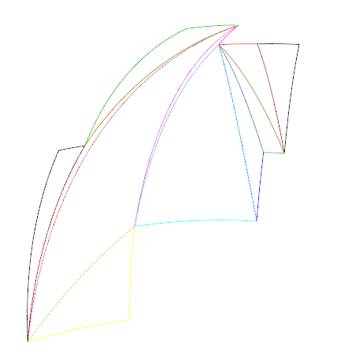
<figcaption>Figure 7: Triangulation of a spherical polygon.</figcaption>
</figure>

``` r
> win1 <- triangulate(polygon2)
> for (i in 1:11) {plot(win1[[i]],  col=i)}
```

# Statistical functions

In this section we overview core statistical functions implemented in
*rcosmo* . The package provides various tools for statistical analysis
of spherical data that can be broadly divided in the following types:

-   Spherical random sampling,
-   Univariate spherical statistics and plots,
-   Multivariate statistics for data from different `CMBWindows`,
-   Measures of spatial dependencies.

The main currently implemented statistical functions are shown in
Figure [1](#map) in the blue colour. Below we provide few examples of
functions for each type.

## Random sampling

An immediate advantage of equiareal HEALPix pixel sizes is that simple
random sampling is not regionally dependent [@originalHealpix]. That is,
a simple random sample of pixel indices produces an approximately
uniform sample of locations on the sphere.

To get a simple random sample from a `CMBDataFrame` one can use the
function `sampleCMB`. This function returns a `CMBDataFrame` which size
equals to the function's parameter `sample.size`. This new object has
rows that comprise a simple random sample of the rows from the input
CMBDataFrame.

``` r
> set.seed(0)
> sampleCMB(df, sample.size = 3)
A CMBDataFrame
# A tibble: 3 x 1
           I
       <dbl>
1 -0.0000198
2 -0.000307 
3 -0.0000915
```

## Univariate spherical statistics and plots

There are several methods in *rcosmo* for statistical analysis and
visualisation of CMB temperature intensity data. For example, function
`summary` produces a CMBDataFrame summary that includes information
about window's type and area, total area covered by observations, and
the main statistics for the intensity data in the spherical window.

``` r
> summary(sky.annulus)
=============================  CMBDataFrame Object  ============================
Number of CMBWindows:  2 
+-----------------------------+
|                             |
|   Window type: minus.disc   |
|   Window area: 11.7972      |
|                             |
+-----------------------------+

+-------------------------+
|                         |
|   Window type: disc     |
|   Window area: 2.8884   |
|                         |
+-------------------------+
METHOD  = 'smica   '           / Separation method                               
Total area covered by all pixels:  2.11917 
~~~~~~~~~~~~~~~~~~~~~~~~~~~~~~~~~~~~~~~~~~~~~~~~~~~~~~~~~~~~~~~~~~~~~~~~~~~~~~~~
Intensity quartiles
Min.    1st Qu.     Median       Mean    3rd Qu.       Max. 
-7.609e-04 -6.908e-05 -6.208e-07 -1.487e-06  6.737e-05  7.697e-04 
================================================================================
```

The function `entropyCMB` returns an estimated entropy for specified
column intensities and `CMBWindow`.

``` r
> entropyCMB(cmbdf = df, win = d.exterior, intensities = "I")
[1] 2.13523
```

The first Minkowski functional `fmf` returns an area of the spherical
region, where the intensities are above of the specified threshold level
$\alpha.$

``` r
> fmf(cmbdf = sky.annulus, alpha = 0, intensities = "I")
[1] 1.054269
```

`fRen` computes values of the sample fractal scaling exponent on the
grid of $N$ uniformly spaced points in the interval \[q.min, q.max\].
The scaling exponent describes fractal properties of random fields and
can be used for testing departures from Gaussianity, see
[@leonenko2013]. For example, Figure [8](#Renyi) shows that the sample
scaling exponent is an approximate strait line for for the data in
`CMBWindow` `sky.annulus`. Thus, there is not enough evidence for
substantial multifractality of the random field based on the data in
this `CMBWindow`. More details can be found in the paper
[@leonenko2020].

``` r
> Tq <- fRen(cmbdf = sky.annulus, q.min = 1.01, q.max = 10, N = 20, intensities = "I")
> plot(Tq[,1], Tq[,2], ylab =expression(T[q]), xlab = "q", main = "Sample fractal
 scaling exponent", pch = 20, col = "blue")
```

<figure id="Renyi">
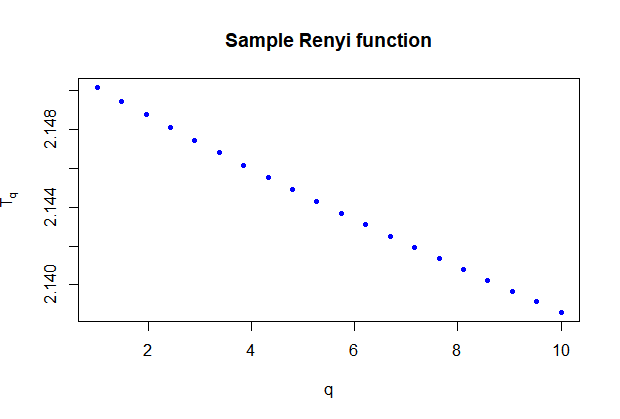
<figcaption>Figure 8: Sample fractal scaling exponent of
<code>sky.annulus</code> on [1.01,10].</figcaption>
</figure>

The function `plotAngDis` helps to visualise the marginal distributions
of temperature intensities versus $\theta$ and $\phi$ angles. It
produces scatterplots and barplots of the corresponding means computed
over bins, see Figure [9](#AngDis).

<figure id="AngDis">
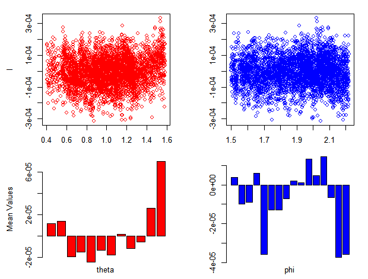
<figcaption>Figure 9: Distributions of temperature versus <span
class="math inline"><em>θ</em></span> and <span
class="math inline"><em>ϕ</em></span> angles for the Scorpion
constellation region.</figcaption>
</figure>

``` r
> df1 <- sampleCMB(df, sample.size = 100000)
> cmbdf.win <- window(df1, new.window = polygon2)
> plotAngDis(cmbdf.win, intensities = "I")
```

## Multivariate statistics for data from different CMBWindows.

There are several *rcosmo* functions for comparison of data from two or
more `CMBWindows`. For example, the function `qqplotWin` is a
modification of the standard `qqplot` to produces a QQ plot of quantiles
of observations in two `CMBWindows` against each other for a specified
CMBDataFrame column.

The example below shows that the distributions of temperatures in the
Dragon and Scorpion constellations are similar.

``` r
> qqplotWin(df1, polygon1, polygon2)
```

<figure id="qqplot">
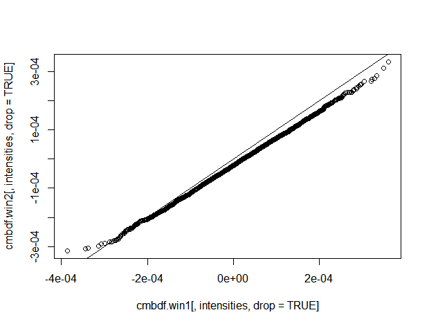
<figcaption>Figure 10: QQ plot of observations in the Dragon vs Scorpion
constellation regions.</figcaption>
</figure>

The function `qstatq` can be used to measure spatial stratified
heterogeneity in a list of `CMBWindows`. It takes values in $[0, 1],$
where 0 corresponds to no spatial stratified heterogeneity, 1 means a
perfect heterogeneity case. For example, the results below shows that
there is not enough evidence for spatial stratified heterogeneity, i.e.
the value of the temperature intensities are not different in these two
`CMBWindows`.

``` r
> lw <- list(polygon1, polygon2)
> qstat(df1, lw)
[1] 0.01089514
```

## Investigating spatial dependencies

This section presents some of *rcosmo* tools for the analysis of spatial
dependencies in spherical data.

As the geodesic and Euclidean distances are different, covariance
functions on $\mathbb{R}^{3}$ can not be used directly for
$\mathbb{S}^2.$ The package implemented several parametric models of
covariance functions (\@ref(eq:covar)) on the sphere, see theoretical
foundations in [@gneiting2013]. *rcosmo* uses the package
[*geoR*](https://CRAN.R-project.org/package=geoR) and extends its list
of general spatial models and some functions to the spherical case.
Currently available choices of covariance models are
`matern, exponential, spherical, powered.exponential, cauchy,`
`gencauchy,` `pure.nugget, askey,` `c2wendland, c4wendland, sinepower,`
and `multiquadric.` The default option is `matern`.

The function `covmodelCMB` computes values of theoretical covariance
functions given the separation distance of locations. The function
returns the value of the covariance $\Gamma(h)$ at the geodesic distance
$h.$ The covariance model uses the general form
$\Gamma(h) =\sigma^2\cdot \rho(h/\psi),$ where the variance $\sigma^2$
and the range $\psi$ are vertical and horizontal scaling parameters
respectively.

For example, the following command computes the value of the Askey
covariance function with the parameters $\sigma^2=1,$ $\psi = \pi,$ and
$\kappa = 4$ at the geodesic distance $h = \pi/4.$

``` r
> covmodelCMB(pi/4, cov.pars = c(1, pi), kappa = 4, cov.model = "askey" )
[1] 0.3164062
```

The command `plotcovmodelCMBPlot` is designed to produce quick plots of
theoretical covariance functions. The result for the Askey covariance
function is shown in Figure [11](#Askey).

``` r
> plotcovmodelCMB("askey", phi = pi/4, to  = pi/2, kappa = 4)
```

{#Askey
width="100%" alt="graphic without alt text"}

If a random fields is isotropic its covariance function depends only on
a geodesic distance between locations. In this case the function
`covCMB` can be used to compute an empirical covariance function for
intensity data in a `CMBDataFrame` or `data.frame`. Output is given up
to a maximal geodesic distance `max.dist`, which can be chosen between 0
and $\pi$ (by default equals $\pi$).

``` r
> df1 <- sampleCMB(df, sample.size = 100000)
> Cov <- covCMB(df1, max.dist = 0.03, num.bins = 10)
> Cov$v
 [1] 1.041607e-08 6.955709e-09 4.305906e-09 3.180806e-09
 [5] 2.675364e-09 2.436718e-09 2.407982e-09 2.316794e-09
 [9] 2.319271e-09 2.308250e-09 2.263268e-09
```

Obtained estimated covariance values can be visualised using the command

``` r
> plot(Cov)
```

{#somelabel1 width="100%" alt="graphic without alt text"}

The function `variofitCMB` estimates parameters of variogram models (see
equation (\@ref(eq:vario)) for the link between covariance and variogram
functions) by fitting a parametric model from the list `covmodelCMB` to
a sample variogram estimated by the function `variogramCMB`. This
function is built on and extends `variofit` from the package
[*geoR*](https://CRAN.R-project.org/package=geoR) to specific
*rcosmo* covariance models on the sphere.

In the example below the Matern variogram is fitted to the empirical
variogram on the interval $[0,0.1]$ using the ordinary least squares
method, see Figure [13](#fitted).

``` r
> varcmb <- variogramCMB(df1, max.dist = 0.1, num.bins = 30)
> ols <- variofitCMB(varcmb,  fix.nug=FALSE, wei="equal", cov.model= "matern")
> plot(varcmb)
> lines(ols, lty=2)
```

{#fitted width="100%"
alt="graphic without alt text"}

The package also has tools to work with angular power spectra of
spherical random fields. The CMB power spectrum data are freely
available from the section \"Cosmology products\" of the Planck Legacy
Archive[^9]. They can be easily downloaded in a ready-to-use
*rcosmo* format by the function `downloadCMBPS`.

The function `covPwSp` uses values of an angular power spectra to
provide a covariance estimate by equation (\@ref(eq:covar)). As the
argument of the covariance function in equation (\@ref(eq:covar)) is
$\cos\Theta$ the following code uses the inverse transformation `acos`
to plot the covariance estimate as a function of angular distances in
Figure [14](#spec).

``` r
> COM_PowerSpectra <- downloadCMBPS(link=1)
> Cov_est <- covPwSp(COM_PowerSpectra[,1:2], 2000)
> plot(acos(Cov_est[,1]), Cov_est[,2], type ="l", xlab ="angular distance", 
  ylab ="Estimated Covariance")
```

{#spec width="100%"
alt="graphic without alt text"}

# Converting other spherical data to HEALPix format

While the HEALPix is the main representation in cosmological
applications there are numerous spherical data, for example, in
geosciences, that use different coordinate systems and spherical
formats. This example shows how non-HEALPix spherical data can be
converted to the HEALPix format for *rcosmo* analysis.

A `HPDataFrame` is suitable for storing data that is located on a
sphere, but has not been preprocessed to suit HEALPix structured
storage. There are various ways to assign HEALPix pixel indices to the
rows of a `HPDataFrame`. This example presents the way when a desired
resolution is specified in advance. Then the `HPDataFrame` constructor
automatically assigns pixel indices based on coordinates provided. A row
is assigned the pixel index of its closest pixel center. *rcosmo* also
has the option of automatic computing of a required resolution for given
data to assign data locations to unique pixels.

As an example we use the database with the latitude and longitude of
over 13 thousand world's large cities and towns available from the World
Cities Database[^10]. First, cities latitudes and longitudes in degrees
are converted to spherical coordinates $(\theta,\phi)$ in radians. Then
, we create and visualize `HPDataFrame` at the resolution `nside` =
1024, see Figure [15](#world-plot).

``` r
> worldcities <- read.csv("worldcities.csv")
> sph <- geo2sph(data.frame(lon = pi/180*worldcities$lng, lat = pi/180*worldcities$lat))
> df1 <- data.frame(phi = sph$phi, theta = sph$theta, I = rep(1,nrow(sph)))
> hp <- HPDataFrame(df1, auto.spix = TRUE, nside = 1024)
> plot(hp, size = 3, col = "darkgreen", back.col = "white")
```

{#world-plot width="100%"
alt="graphic without alt text"}

Some other examples of converting directional and star-shaped data into
*rcosmo* formats are given in [@olenko2].

# Summary and future directions

This article introduces the package *rcosmo* for analysis of CMB,
HEALPix and other spherical data. The package integrates the HEALPix
representation and various spherical geometric and statistical methods
in a convenient unified framework. It opens efficient handling and
analysis of HEALPix and CMB data to the R statistical community.
*rcosmo* also introduces several new spherical statistical models and
methods that were not available in R before. The package can also be
very useful for researchers working in geosciences.

There are several possible extensions that would be useful to the
package. Some of them include:

-   integrating with available Python and C++ HEALPix software,
-   including new spherical statistical models and methods,
-   further development of spherical spectral and multifractal methods,
-   adding new visualisation tools,
-   improved use of memory mapping to use on extremely high resolution
    images.

# Acknowledgements

This research was partially supported under the Australian Research
Council's Discovery Projects funding scheme (project number
DP160101366). We are thankful to the anonymous referee for suggestions
that helped to improve the paper. We also would like to thank V.V. Anh,
P.Broadbridge, N.Leonenko, I.Sloan, and Y.Wang for their comments on
early drafts of *rcosmo* and discussions of CMB and spherical
statistical methods, and J.Ryan for developing and extending the *mmap*
package.

# Appendix: Statistical model

Consider a sphere in the three-dimensional Euclidean space
$\mathbb{S}^2=\left\{ \mathbf{x}\in \mathbb{R}^{3}:\Vert \mathbf{x}\Vert =1\right\} \subset \mathbb{R}^{3} .$

A spherical random field on a probability space $(\Omega ,\mathcal{F%
  },\mathbf{P})$, denoted by
$$T=\left\{ T(\theta ,\varphi )=T_{\omega }(\theta ,\varphi ):0\leq \theta
  \leq \pi ,\text{ }0\leq \varphi \leq 2\pi ,\ \omega \in \Omega \right\} ,$$
or $\widetilde{T}=\{\widetilde{T}(\mathbf{x})$ $,$
$\mathbf{x}\in \mathbb{S}^2\},$ is a stochastic function defined on the
sphere $\mathbb{S}^2.$

The field $\widetilde{T}(\mathbf{x})$ is called isotropic on the sphere
$\mathbb{S}^2$ if its mean $\mathbf{E}T(\theta ,\varphi )=c=constant$
and the covariance function $\mathbf{E}T(\theta
  ,\varphi )T(\theta ^{\prime },\varphi ^{\prime })$ depends only on the
angular distance $\Theta =\Theta _{PQ}$ between the points $P=(\theta
  ,\varphi )$ and $Q=(\theta ^{\prime },\varphi ^{\prime })$ on
$\mathbb{S}^2.$

A real-valued second-order mean-square continuous spherical random field
$T$ can be expanded in the series
$$T(\theta ,\varphi )=\sum_{l=0}^{\infty }\sum_{m=-l}^{l}a_{lm}Y_{lm}(\theta
  ,\varphi ),
  \label{field}   (\#eq:field)$$
where $\{Y_{lm}(\theta ,\varphi )\}$ represents the complex spherical
harmonics and $a_{lm}$ are random variables.

If a random field is isotropic then
$$\mathbf{E}a_{lm}a_{l^{\prime }m^{\prime }}^{\ast }=\delta _{l}^{l^{\prime
  }}\delta _{m}^{m^{\prime }}C_{l},\quad -l\leq m\leq l,\quad -l^{\prime }\leq
  m^{\prime }\leq l^{\prime },\quad l\ge 0.$$
Thus, $\mathbf{E}|a_{lm}|^{2}=C_{l},$ $m=0,\pm 1,...,\pm l.$ The series
$\left\{ C_{1},C_{2},...,C_{l},...\right\}$ is called the angular power
spectrum of the isotropic random field $T(\theta ,\varphi ).$

The covariance function of the isotropic random fields $T$ has the
following representation
$$\Gamma(\cos\Theta )= \mathbf{E}T(\theta ,\varphi )T(\theta ^{\prime },\varphi
  ^{\prime})=\frac{1}{4\pi }\sum_{l=0}^{\infty}(2l+1)C_{l}P_{l}(\cos\Theta),
  \label{covar}   (\#eq:covar)$$
where $P_l(\cdot)$ is the $l$-th Legendre polynomial and
$\sum_{l=0}^{\infty }(2l+1)C_{l}<\infty.$

The variogram (semivariogram) function is defined by
$$\label{vario}
  \gamma(h) =\Gamma(0) - \Gamma(h).   (\#eq:vario)$$

The package uses observations of the field $T$ at HEALPix points. There
are two main approaches in the statistical analysis of $T$ that are
realised in *rcosmo* . First approach directly uses the observations for
parameter estimation and hypothesis tests. For example, the classical
estimator of the isotropic variogram $\gamma(h)$ takes the form of
$$\hat{\gamma}(h)=\frac{1}{2N_h}\sum_{(\mathbf{x}_1,\mathbf{x}_2)\in N_h} \left(T(\mathbf{x}_1) - T(\mathbf{x}_2)\right)^2,$$
where $N_h$ is the set of the spherical location pairs at the geodesic
distance $h.$ The second approach is spectrum-based. Initially, the
estimates $\hat{a}_{lm}$ are computed by inverting (\@ref(eq:field)).
Then, empirical covariance functions and variograms can be obtained by
substituting the estimated values of the angular power spectrum
$$\hat{C}_{l}=\frac{1}{2l+1}\sum_{m=-l}^l|\hat{a}_{lm}|^2$$
in equations \@ref(eq:covar) and \@ref(eq:vario).


[^1]: see the list in
    <https://asaip.psu.edu/forums/software-forum/459833927>

[^2]: <https://healpix.sourceforge.io/>,
    <https://healpy.readthedocs.io>,
    <http://sufoo.c.ooco.jp/program/healpix.html>

[^3]: hosted at the link <http://irsa.ipac.caltech.edu>

[^4]: <https://wiki.cosmos.esa.int/planckpla2015/index.php/Astrophysical_component_separation>

[^5]: Colour scale is available here:
    https://github.com/zonca/paperplots/tree/master/data

[^6]: hosted by Caltech at the link
    <http://irsa.ipac.caltech.edu/data/Planck/release_2/>

[^7]: Laptop specifications: Microsoft Surface Laptop with 7th Gen Intel
    Core m3 (i5) processor; 8GB LPDDR3 SDRAM (1866MHz)

[^8]: available at <https://www.iau.org/public/themes/constellations/>

[^9]: hosted at the link <https://pla.esac.esa.int/pla/>

[^10]: hosted at the link <https://simplemaps.com/data/world-cities>
