::: article
::: {#introduction}
## Introduction
:::

Too often machine learning (ML) models are summarized using a single
metric (e.g., cross-validated accuracy) and then put into production.
Although we often care about the predictions from these models, it is
becoming routine (and good practice) to also better understand the
predictions! Understanding how an ML model makes its predictions helps
build trust in the model and is the fundamental idea of the emerging
field of interpretable machine learning (IML).[^1] For an in-depth
discussion on IML, see @molnar-2019-iml. In this paper, we focus on
global methods for quantifying the importance[^2] of features in an ML
model; that is, methods that help us understand the global contribution
each feature has to a model's predictions. Computing variable importance
(VI) and communicating them through variable importance plots (VIPs) is
a fundamental component of IML and is the main topic of this paper.

While many of the procedures discussed in this paper apply to any model
that makes predictions, it should be noted that these methods heavily
depend on the accuracy and importance of the fitted model; hence,
unimportant features may appear relatively important (albeit not
predictive) in comparison to the other included features. For this
reason, we stress the usefulness of understanding the scale on which VI
scores are calculated and take that into account when assessing the
importance of each feature and communicating the results to others.
Also, we should point out that this work focuses mostly on *post-hoc
interpretability* where a trained model is given and the goal is to
understand what features are driving the model's predictions.
Consequently, our work focuses on functional understanding of the model
in contrast to the lower-level mechanistic understanding
[@montavon-2018-methods]. That is, we seek to explain the relationship
between the model's prediction behavior and features without explaining
the full internal representation of the model.[^3]

VI scores and VIPs can be constructed for general ML models using a
number of available packages. The
[*iml*](https://CRAN.R-project.org/package=iml) package [@R-iml]
provides the `FeatureImp()` function which computes feature importance
for general prediction models using the permutation approach (discussed
later). It is written in [*R6*](https://CRAN.R-project.org/package=R6)
[@R-R6] and allows the user to specify a generic loss function or select
one from a pre-defined list (e.g., `loss = "mse"` for mean squared
error). It also allows the user to specify whether importance is
measured as the difference or as the ratio of the original model error
and the model error after permutation. The user can also specify the
number of repetitions used when permuting each feature to help stabilize
the variability in the procedure. The `iml::FeatureImp()` function can
also be run in parallel using any parallel backend supported by the
[*foreach*](https://CRAN.R-project.org/package=foreach) package
[@R-foreach].

The [*ingredients*](https://CRAN.R-project.org/package=ingredients)
package [@R-ingredients] also provides permutation-based VI scores
through the `feature_importance()` function. (Note that this function
recently replaced the now deprecated
[*DALEX*](https://CRAN.R-project.org/package=DALEX) function
`variable_importance()` [@R-DALEX].) Similar to `iml::FeatureImp()`,
this function allows the user to specify a loss function and how the
importance scores are computed (e.g., using the difference or ratio). It
also provides an option to sample the training data before shuffling the
data to compute importance (the default is to use `n_sample = 1000`),
which can help speed up computation.

The [*mmpf*](https://CRAN.R-project.org/package=mmpf) package [@R-mmpf]
also provides permutation-based VI scores via the
`mmpf::permutationImportance()` function. Similar to the *iml* and
*ingredients* implementation, this function is flexible enough to be
applied to any class of ML models in R.

The [*varImp*](https://CRAN.R-project.org/package=varImp) package
[@R-varImp] extends the permutation-based method for RFs in package
[*party*](https://CRAN.R-project.org/package=party) [@R-party] to
arbitrary measures from the
[*measures*](https://CRAN.R-project.org/package=measures) package
[@R-measures]. Additionally, the functions in *varImp* include the
option of using the conditional approach described in
@strobl-2019-conditional which is more reliable in the presence of
correlated features. A number of other RF-specific VI packages exist on
CRAN, including, but not limited to,
[*vita*](https://CRAN.R-project.org/package=vita) [@R-vita],
[*rfVarImpOOB*](https://CRAN.R-project.org/package=rfVarImpOOB)
[@R-rfVarImpOOB],
[*randomForestExplainer*](https://CRAN.R-project.org/package=randomForestExplainer)
[@R-randomForestExplainer], and
[*tree.interpreter*](https://CRAN.R-project.org/package=tree.interpreter)
[@R-tree.interpreter].[^4].

The [*caret*](https://CRAN.R-project.org/package=caret) package
[@R-caret] includes a general `varImp()` function for computing
model-specific and filter-based VI scores. Filter-based approaches,
which are described in @applied-kuhn-2013, do not make use of the fitted
model to measure VI. They also do not take into account the other
predictors in the model. For regression problems, a popular filter-based
approach to measuring the VI of a numeric predictor $x$ is to first fit
a flexible nonparametric model between $x$ and the target $Y$; for
example, the locally-weighted polynomial regression (LOWESS) method
developed by @robust-cleveland-1979. From this fit, a pseudo-$R^2$
measure can be obtained from the resulting residuals and used as a
measure of VI. For categorical predictors, a different method based on
standard statistical tests (e.g., $t$-tests and ANOVAs) can be employed;
see @applied-kuhn-2013 for details. For classification problems, an area
under the ROC curve (AUC) statistic can be used to quantify predictor
importance. The AUC statistic is computed by using the predictor $x$ as
input to the ROC curve. If $x$ can reasonably separate the classes of
$Y$, that is a clear indicator that $x$ is an important predictor (in
terms of class separation) and this is captured in the corresponding AUC
statistic. For problems with more than two classes, extensions of the
ROC curve or a one-vs-all approach can be used.

If you use the [*mlr*](https://CRAN.R-project.org/package=mlr) interface
for fitting ML models [@R-mlr], then you can use the
`getFeatureImportance()` function to extract model-specific VI scores
from various tree-based models (e.g., RFs and GBMs). Unlike *caret*, the
model needs to be fit via the *mlr* interface; for instance, you cannot
use `getFeatureImportance()` on a
[*ranger*](https://CRAN.R-project.org/package=ranger) [@R-ranger] model
unless it was fit using *mlr*.

While the *iml* and *DALEX* packages provide model-agnostic approaches
to computing VI, *caret*, and to some extent, *mlr*, provide
model-specific approaches (e.g., using the absolute value of the
$t$-statistic for linear models) as well as less accurate filter-based
approaches. Furthermore, each package has a completely different
interface (e.g., *iml* is written in R6). The
[*vip*](https://CRAN.R-project.org/package=vip) package [@R-vip] strives
to provide a consistent interface to both model-specific and
model-agnostic approaches to feature importance that is simple to use.
The three most important functions exported by *vip* are described
below:

-   `vi()` computes VI scores using model-specific or model-agnostic
    approaches (the results are always returned as a tibble
    [@R-tibble]);
-   `vip()` constructs VIPs using model-specific or model-agnostic
    approaches with
    [*ggplot2*](https://CRAN.R-project.org/package=ggplot2)-style
    graphics [@R-ggplot2];
-   `add_sparklines()` adds a novel sparkline representation of feature
    effects (e.g., partial dependence plots) to any VI table produced by
    `vi()`.

There's also a function called `vint()` (for variable interactions) but
it is experimental and will not be discussed here; the interested reader
is pointed to @greenwell-simple-2018. Note that `vi()` is actually a
wrapper around four workhorse functions, `vi_model()`, `vi_firm()`,
`vi_permute()`, and `vi_shap()`, that compute various types of VI
scores. The first computes model-specific VI scores, while the latter
three produce model-agnostic ones. The workhorse function that actually
gets called is controlled by the `method` argument in `vi()`; the
default is `method = "model"` which corresponds to model-specific VI
(see `?vip::vi` for details and links to further documentation).

::: {#constructing-vips-in-r}
## Constructing VIPs in R
:::

We'll illustrate major concepts using the Friedman 1 benchmark problem
described in @multivariate-friedman-1991 and @bagging-breiman-1996:

$$Y_i = 10 \sin\left(\pi X_{1i} X_{2i}\right) + 20 \left(X_{3i} - 0.5\right) ^ 2 + 10 X_{4i} + 5 X_{5i} + \epsilon_i, \quad i = 1, 2, \dots, n,
\label{eqn:friedman1}   (\#eq:eqnfriedman1)$$

where $\epsilon_i \stackrel{iid}{\sim} N\left(0, \sigma^2\right)$. Data
from this model can be generated using the `vip::gen_friedman()`. By
default, the features consist of 10 independent variables uniformly
distributed on the interval $\left[0,1\right]$; however, only 5 out of
these 10 are actually used in the true model. The code chunk below
simulates 500 observations from the model in Equation
\@ref(eq:eqnfriedman1) with $\sigma = 1$; see `?vip::gen_friedman` for
details.

``` r
trn <- vip::gen_friedman(500, sigma = 1, seed = 101)  # simulate training data
tibble::as_tibble(trn)  # inspect output
```

``` r
#> # A tibble: 500 x 11
#>        y     x1    x2    x3    x4     x5      x6    x7    x8    x9   x10
#>    <dbl>  <dbl> <dbl> <dbl> <dbl>  <dbl>   <dbl> <dbl> <dbl> <dbl> <dbl>
#>  1 14.9  0.372  0.406 0.102 0.322 0.693  0.758   0.518 0.530 0.878 0.763
#>  2 15.3  0.0438 0.602 0.602 0.999 0.776  0.533   0.509 0.487 0.118 0.176
#>  3 15.1  0.710  0.362 0.254 0.548 0.0180 0.765   0.715 0.844 0.334 0.118
#>  4 10.7  0.658  0.291 0.542 0.327 0.230  0.301   0.177 0.346 0.474 0.283
#>  5 17.6  0.250  0.794 0.383 0.947 0.462  0.00487 0.270 0.114 0.489 0.311
#>  6 18.3  0.300  0.701 0.992 0.386 0.666  0.198   0.924 0.775 0.736 0.974
#>  7 14.6  0.585  0.365 0.283 0.488 0.845  0.466   0.715 0.202 0.905 0.640
#>  8 17.0  0.333  0.552 0.858 0.509 0.697  0.388   0.260 0.355 0.517 0.165
#>  9  8.54 0.622  0.118 0.490 0.390 0.468  0.360   0.572 0.891 0.682 0.717
#> 10 15.0  0.546  0.150 0.476 0.706 0.829  0.373   0.192 0.873 0.456 0.694
#> # ... with 490 more rows
```

From Equation \@ref(eq:eqnfriedman1), it should be clear that features
$X_1$--$X_5$ are the most important! (The others don't influence $Y$ at
all.) Also, based on the form of the model, we'd expect $X_4$ to be the
most important feature, probably followed by $X_1$ and $X_2$ (both
comparably important), with $X_5$ probably being less important. The
influence of $X_3$ is harder to determine due to its quadratic nature,
but it seems likely that this nonlinearity will suppress the variable's
influence over its observed range (i.e., 0--1).

# Model-specific VI

Some machine learning algorithms have their own way of quantifying the
importance of each feature, which we refer to as model-specific VI. We
describe some of these in the subsections that follow. One particular
issue with model-specific VI scores is that they are not necessarily
comparable across different types of models. For example, directly
comparing the impurity-based VI scores from tree-based models to the the
absolute value of the $t$-statistic in linear models.

## Decision trees and tree ensembles

Decision trees probably offer the most natural model-specific approach
to quantifying the importance of each feature. In a binary decision
tree, at each node $t$, a single predictor is used to partition the data
into two homogeneous groups. The chosen predictor is the one that
maximizes some measure of improvement $i^t$. The relative importance of
predictor $X$ is the sum of the squared improvements over all internal
nodes of the tree for which $X$ was chosen as the partitioning variable;
see @classification-breiman-1984 for details. This idea also extends to
ensembles of decision trees, such as RFs and GBMs. In ensembles, the
improvement score for each predictor is averaged across all the trees in
the ensemble. Fortunately, due to the stabilizing effect of averaging,
the improvement-based VI metric is often more reliable in large
ensembles; see @hastie-elements-2009 [p. 368].

RFs offer an additional method for computing VI scores. The idea is to
use the leftover out-of-bag (OOB) data to construct validation-set
errors for each tree. Then, each predictor is randomly shuffled in the
OOB data and the error is computed again. The idea is that if variable
$X$ is important, then the validation error will go up when $X$ is
perturbed in the OOB data. The difference in the two errors is recorded
for the OOB data then averaged across all trees in the forest. Note that
both methods for constructing VI scores can be unreliable in certain
situations; for example, when the predictor variables vary in their
scale of measurement or their number of categories [@party2007a], or
when the predictors are highly correlated [@strobl-2019-conditional].
The *varImp* package discussed earlier provides methods to address these
concerns for random forests in package *party*, with similar
functionality also built into the
[*partykit*](https://CRAN.R-project.org/package=partykit) package
[@R-partykit]. The *vip* package also supports the conditional
importance described in [@strobl-2019-conditional] for both *party*- and
*partykit*-based RFs; see `?vip::vi_model` for details. Later on, we'll
discuss a more general permutation method that can be applied to any
supervised learning model.

To illustrate, we fit a CART-like regression tree, RF, and GBM to the
simulated training data. (**Note:** there are a number of different
packages available for fitting these types of models, we just picked
popular implementations for illustration.)

``` r
# Load required packages
library(rpart)          # for fitting CART-like decision trees
library(randomForest)   # for fitting RFs
library(xgboost)        # for fitting GBMs

# Fit a single regression tree
tree <- rpart(y ~ ., data = trn)

# Fit an RF
set.seed(101)  # for reproducibility
rfo <- randomForest(y ~ ., data = trn, importance = TRUE)

# Fit a GBM
set.seed(102)  # for reproducibility
bst <- xgboost(
  data = data.matrix(subset(trn, select = -y)),
  label = trn$y,
  objective = "reg:squarederror",
  nrounds = 100,
  max_depth = 5,
  eta = 0.3,
  verbose = 0  # suppress printing
)
```

Each of the above packages include the ability to compute VI scores for
all the features in the model; however, the implementation is rather
package-specific, as shown in the code chunk below. The results are
displayed in Figure [1](#fig:vi-plots) (the code to reproduce these
plots has been omitted but can be made available upon request).

``` r
# Extract VI scores from each model
vi_tree <- tree$variable.importance
vi_rfo <- rfo$variable.importance  # or use `randomForest::importance(rfo)`
vi_bst <- xgb.importance(model = bst)
```

<figure id="fig:vi-plots">
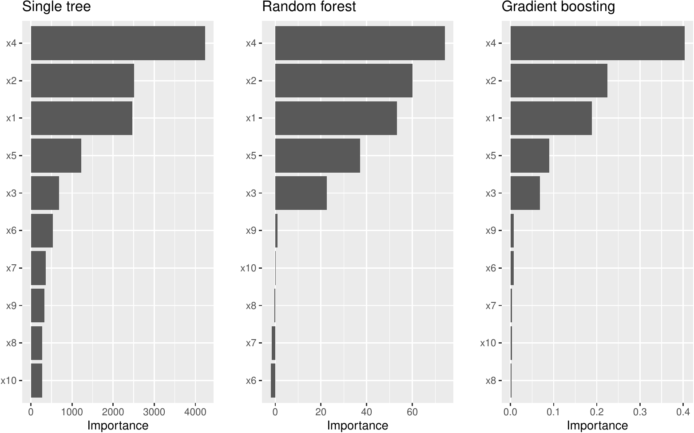
<figcaption>Figure 1: Model-specific VIPs for the three different
tree-based models fit to the simulated Friedman data.</figcaption>
</figure>

As we would expect, all three methods rank the variables `x1`--`x5` as
more important than the others. While this is good news, it is
unfortunate that we have to remember the different functions and ways of
extracting and plotting VI scores from various model fitting functions.
This is one place where *vip* can help...one function to rule them all!
Once *vip* is loaded, we can use `vi()` to extract a tibble of VI
scores.[^5]

``` r
# Load required packages
library(vip)

# Compute model-specific VI scores
vi(tree)  # CART-like decision tree
```

``` r
#> # A tibble: 10 x 2
#>    Variable Importance
#>    <chr>         <dbl>
#>  1 x4            4234.
#>  2 x2            2513.
#>  3 x1            2461.
#>  4 x5            1230.
#>  5 x3             688.
#>  6 x6             533.
#>  7 x7             357.
#>  8 x9             331.
#>  9 x8             276.
#> 10 x10            275.
```

``` r
vi(rfo)   # RF
```

``` r
#> # A tibble: 10 x 2
#>    Variable Importance
#>    <chr>         <dbl>
#>  1 x4           74.2
#>  2 x2           59.9
#>  3 x1           53.3
#>  4 x5           37.1
#>  5 x3           22.5
#>  6 x9            1.05
#>  7 x10           0.254
#>  8 x8           -0.408
#>  9 x7           -1.56
#> 10 x6           -2.00
```

``` r
vi(bst)   # GBM
```

``` r
#> # A tibble: 10 x 2
#>    Variable Importance
#>    <chr>         <dbl>
#>  1 x4          0.403
#>  2 x2          0.225
#>  3 x1          0.189
#>  4 x5          0.0894
#>  5 x3          0.0682
#>  6 x9          0.00802
#>  7 x6          0.00746
#>  8 x7          0.00400
#>  9 x10         0.00377
#> 10 x8          0.00262
```

Notice how the `vi()` function always returns a tibble[^6] with two
columns: `Variable` and `Importance` (the exceptions are
coefficient-based models which also include a `Sign` column giving the
sign of the corresponding coefficient, and permutation importance
involving multiple Monte Carlo simulations, but more on that later).
Also, by default, `vi()` always orders the VI scores from highest to
lowest; this, among other options, can be controlled by the user (see
`?vip::vi` for details). Plotting VI scores with `vip()` is just as
straightforward. For example, the following code can be used to
reproduce Figure [1](#fig:vi-plots).

``` r
p1 <- vip(tree) + ggtitle("Single tree")
p2 <- vip(rfo) + ggtitle("Random forest")
p3 <- vip(bst) + ggtitle("Gradient boosting")

# Display plots in a grid (Figure 1)
grid.arrange(p1, p2, p3, nrow = 1)
```

Notice how the `vip()` function always returns a `"ggplot"` object (by
default, this will be a bar plot). For large models with many features,
a Cleveland dot plot is more effective (in fact, a number of useful
plotting options can be fiddled with). Below we call `vip()` and change
a few useful options (the resulting plot is displayed in Figure
[2](#fig:dot-plot)). Note that we can also call `vip()` directly on a
`"vi"` object if it's already been constructed.

``` r
# Construct VIP (Figure 2)
library(ggplot2)  # for theme_light() function
vip(bst, num_features = 5, geom = "point", horizontal = FALSE,
    aesthetics = list(color = "red", shape = 17, size = 5)) +
  theme_light()
```

<figure id="fig:dot-plot">
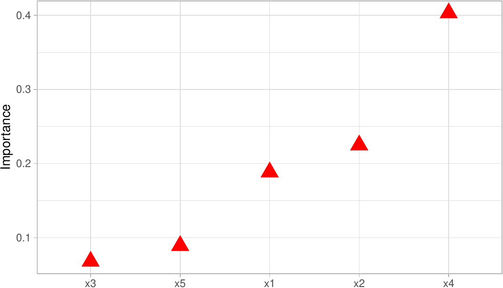
<figcaption>Figure 2: Illustrating various plotting
options.</figcaption>
</figure>

::: {#linear-models}
## Linear models
:::

In multiple linear regression, or linear models (LMs), the absolute
value of the $t$-statistic (or some other scaled variant of the
estimated coefficients) is commonly used as a measure of VI.[^7] The
same idea also extends to generalized linear models (GLMs). In the code
chunk below, we fit an LM to the simulated Friedman data (`trn`)
allowing for all main effects and two-way interactions, then use the
`step()` function to perform backward elimination. The resulting VIP is
displayed in Figure [3](#fig:vip-step).

``` r
# Fit a LM
linmod <- lm(y ~ .^2, data = trn)
backward <- step(linmod, direction = "backward", trace = 0)

# Extract VI scores
(vi_backward <- vi(backward))
```

``` r
#> # A tibble: 21 x 3
#>    Variable Importance Sign
#>    <chr>         <dbl> <chr>
#>  1 x4            14.2  POS
#>  2 x2             7.31 POS
#>  3 x1             5.63 POS
#>  4 x5             5.21 POS
#>  5 x3:x5          2.46 POS
#>  6 x1:x10         2.41 NEG
#>  7 x2:x6          2.41 NEG
#>  8 x1:x5          2.37 NEG
#>  9 x10            2.21 POS
#> 10 x3:x4          2.01 NEG
#> # ... with 11 more rows
```

``` r
# Plot VI scores; by default, `vip()` displays the top ten features
pal <- palette.colors(2, palette = "Okabe-Ito")  # colorblind friendly palette
vip(vi_backward, num_features = length(coef(backward)),  # Figure 3
    geom = "point", horizontal = FALSE, mapping = aes(color = Sign)) +
  scale_color_manual(values = unname(pal)) +
  theme_light() +
  theme(axis.text.x = element_text(angle = 45, hjust = 1))
```

<figure id="fig:vip-step">
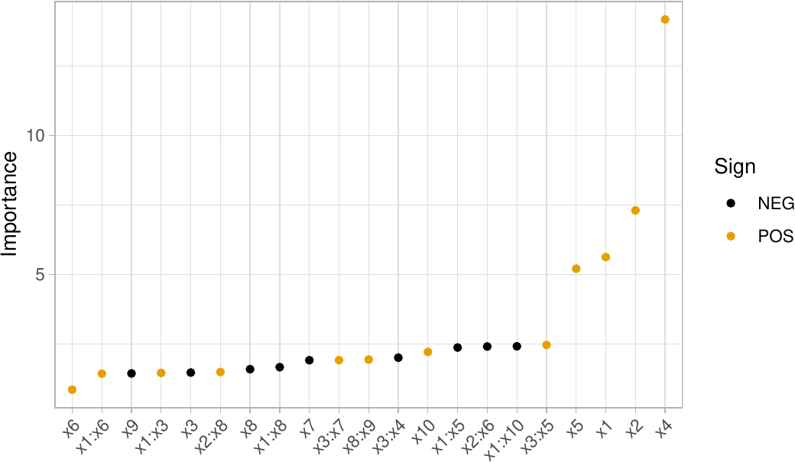
<figcaption>Figure 3: Example VIP from a linear model fit to the
simulated Friedman data. The points are colored according to the sign of
the associated coefficient.</figcaption>
</figure>

A major limitation of this approach is that a VI score is assigned to
each term in the model, rather than to each individual feature! We can
solve this problem using one of the model-agnostic approaches discussed
later.

Multivariate adaptive regression splines (MARS), which were introduced
in @multivariate-friedman-1991, is an automatic regression technique and
can be seen as a generalization of LMs and GLMs. In the MARS algorithm,
the contribution (or VI score) for each predictor is determined using a
generalized cross-validation (GCV) statistic (though, other statistics
can also be used; see `?vip::vi_model` for details). An example using
the [*earth*](https://CRAN.R-project.org/package=earth) package
[@R-earth-fixed] is given below (the results are plotted in Figure
[4](#fig:vip-earth)):

``` r
# Load required packages
library(earth)

# Fit a MARS model
mars <- earth(y ~ ., data = trn, degree = 2, pmethod = "exhaustive")

# Extract VI scores
vi(mars, type = "gcv")
```

``` r
#> # A tibble: 10 x 2
#>    Variable Importance
#>    <chr>         <dbl>
#>  1 x4            100
#>  2 x1             83.2
#>  3 x2             83.2
#>  4 x5             59.3
#>  5 x3             43.5
#>  6 x6              0
#>  7 x7              0
#>  8 x8              0
#>  9 x9              0
#> 10 x10             0
```

``` r
# Plot VI scores (Figure 4)
vip(mars)
```

<figure id="fig:vip-earth">
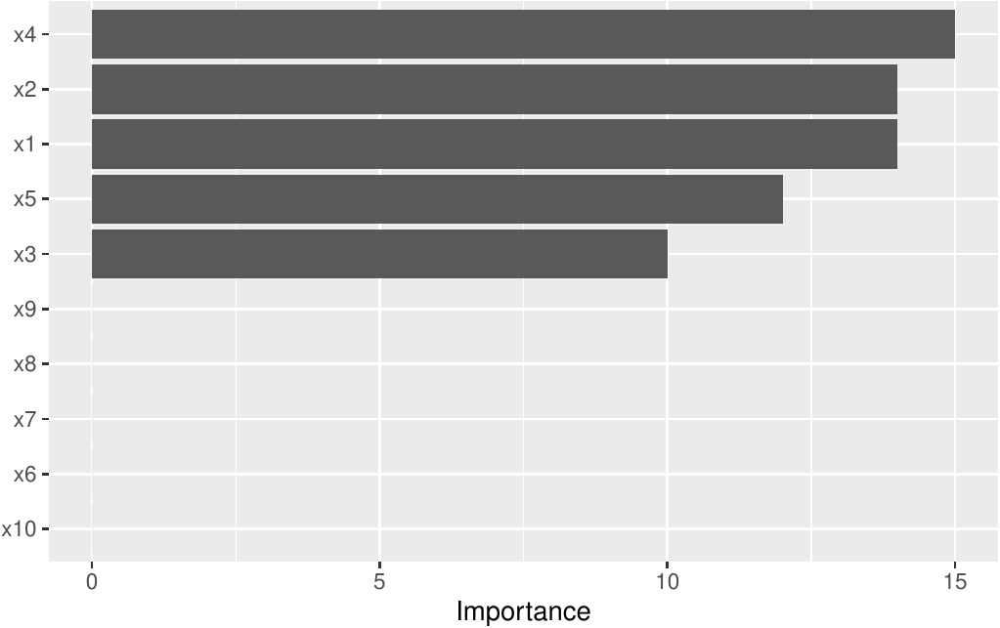
<figcaption>Figure 4: Example VIP from a MARS model fit to the simulated
Friedman data.</figcaption>
</figure>

To access VI scores directly in *earth*, you can use the
`earth::evimp()` function.

::: {#neural-networks}
## Neural networks
:::

For neural networks (NNs), two popular methods for constructing VI
scores are the Garson algorithm [@interpreting-garson-1991], later
modified by @back-goh-1995, and the Olden algorithm
[@accurate-olden-2004]. For both algorithms, the basis of these VI
scores is the network's connection weights. The Garson algorithm
determines VI by identifying all weighted connections between the nodes
of interest. Olden's algorithm, on the other hand, uses the products of
the raw connection weights between each input and output neuron and sums
these products across all hidden neurons. This has been shown to
outperform the Garson method in various simulations. For DNNs, a similar
method due to @data-gedeon-1997 considers the weights connecting the
input features to the first two hidden layers (for simplicity and
speed); but this method can be slow for large networks. We illustrate
these two methods below using `vip()` with the
[*nnet*](https://CRAN.R-project.org/package=nnet) package [@R-nnet] (see
the results in Figure [5](#fig:vip-nnet)).

``` r
# Load required packages
library(nnet)

# Fit a neural network
set.seed(0803)  # for reproducibility
nn <- nnet(y ~ ., data = trn, size = 7, decay = 0.1,
           linout = TRUE, trace = FALSE)

# Construct VIPs
p1 <- vip(nn, type = "garson")
p2 <- vip(nn, type = "olden")

# Display plots in a grid (Figure 5)
grid.arrange(p1, p2, nrow = 1)
```

<figure id="fig:vip-nnet">
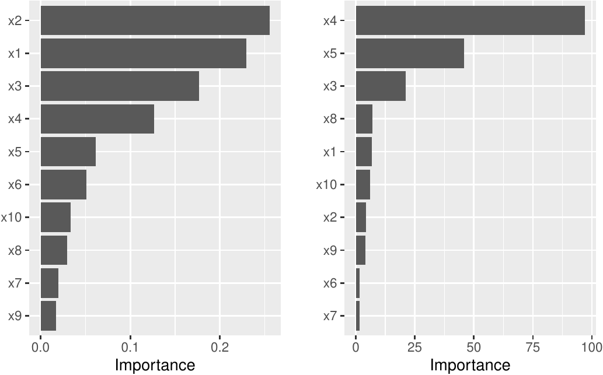
<figcaption>Figure 5: Example VIPs from a single-hidden-layer NN fit to
the simulated Friedman data.</figcaption>
</figure>

# Model-agnostic VI

Model-agnostic interpretability separates interpretation from the model.
Compared to model-specific approaches, model-agnostic VI methods are
more flexible and can be applied to any supervised learning algorithm.
In this section, we discuss model-agnostic methods for quantifying
global feature importance using three different approaches: 1) a simple
variance-based approach, 2) permutation-based feature importance, and 3)
Shapley-based feature importance.

## Variance-based methods

Our first model-agnostic method is based on a simple *feature importance
ranking measure* (FIRM); for details, see @greenwell-simple-2018,
@zien-2009-feature, and @scholbeck-2019-sampling. The specific approach
used here is based on quantifying the "flatness" of the effects of each
feature.[^8] Feature effects can be assessed using *partial dependence
plots* (PDPs) [@friedman-2001-greedy] or *individual conditional
expectation* (ICE) curves [@goldstein-peeking-2015]. PDPs and ICE curves
help visualize the effect of low cardinality subsets of the feature
space on the estimated prediction surface (e.g., main effects and
two/three-way interaction effects.). They are also model-agnostic and
can be constructed in the same way for any supervised learning
algorithm. Below, we fit a projection pursuit regression (PPR) model
(see `?stats::ppr` for details and references) and construct PDPs for
each feature using the [*pdp*](https://CRAN.R-project.org/package=pdp)
package @pdp2017. The results are displayed in Figure [6](#fig:pdp-ppr).
Notice how the PDPs for the uninformative features are relatively flat
compared to the PDPs for features `x1`--`x5`!

<figure id="fig:pdp-ppr">
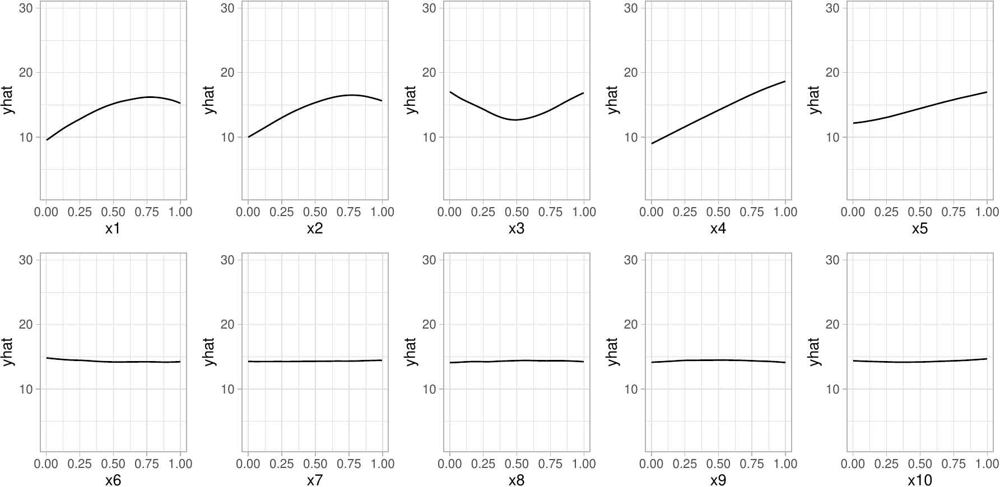
<figcaption>Figure 6: PDPs of main effects in the PPR model fit to the
simulated Friedman data.</figcaption>
</figure>

Next, we compute PDP-based VI scores for the fitted PPR and NN models.
The PDP method constructs VI scores that quantify the relative
"flatness" of each PDP (by default, this is defined by computing the
standard deviation of the $y$-axis values for each PDP). To use the PDP
method, specify `method = "firm"` in the call to `vi()` or `vip()` (or
just use `vi_firm()` directly):

``` r
# Fit a PPR model (nterms was chosen using the caret package with 5 repeats of
# 5-fold cross-validation)
pp <- ppr(y ~ ., data = trn, nterms = 11)

# Construct VIPs
p1 <- vip(pp, method = "firm") + ggtitle("PPR")
p2 <- vip(nn, method = "firm") + ggtitle("NN")

# Display plots in a grid (Figure 7)
grid.arrange(p1, p2, ncol = 2)
```

<figure id="fig:pdp-ppr-nn">
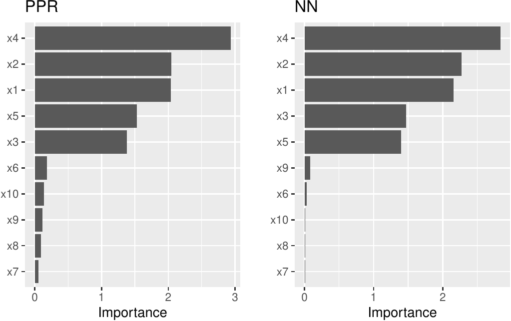
<figcaption>Figure 7: PDP-based feature importance for the PPR and NN
models fit to the simulated Friedman data.</figcaption>
</figure>

In Figure [7](#fig:pdp-ppr-nn) we display the PDP-based feature
importance for the previously obtained PPR and NN models. These VI
scores essentially capture the variability in the partial dependence
values for each main effect.

The ICE curve method is similar to the PDP method, except that we
measure the "flatness" of each individual ICE curve and then aggregate
the results (e.g., by averaging). If there are no (substantial)
interaction effects, using ICE curves will produce results similar to
using PDPs (which are just averaged ICE curves). However, if strong
interaction effects are present, they can obfuscate the main effects and
render the PDP-based approach less useful (since the PDPs for important
features can be relatively flat when certain interactions are present;
see @goldstein-peeking-2015 for details). In fact, it is probably safest
to always use ICE curves when employing the FIRM method.

Below, we display the ICE curves for each feature in the fitted PPR
model using the same $y$-axis scale; see Figure [8](#fig:ice-ppr).
Again, there is a clear difference between the ICE curves for features
`x1`--`x5` and `x6`--`x10`; the later being relatively flat by
comparison. Also, notice how the ICE curves within each feature are
relatively parallel (if the ICE curves within each feature were
perfectly parallel, the standard deviation for each curve would be the
same and the results will be identical to the PDP method). In this
example, the interaction term between `x1` and `x2` does not obfuscate
the PDPs for the main effects and the results are not much different.

<figure id="fig:ice-ppr">
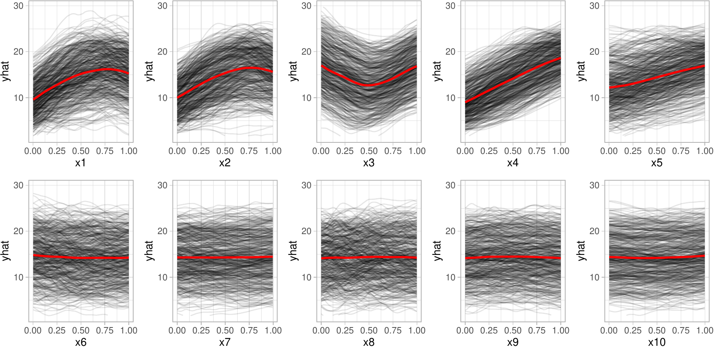
<figcaption>Figure 8: ICE curves for each feature in the PPR model fit
to the simulated Friedman data. The red curve represents the PDP (i.e.,
the averaged ICE curves).</figcaption>
</figure>

Obtaining the ICE-based feature importance scores is also
straightforward, just specify `ice = TRUE` when using the FIRM approach.
This is illustrated in the code chunk below and the results, which are
displayed in Figure [9](#fig:vip-ice-ppr-nn), are similar to those
obtained using the PDP method.

``` r
# Construct VIPs
p1 <- vip(pp, method = "firm", ice = TRUE) + ggtitle("PPR")
p2 <- vip(nn, method = "firm", ice = TRUE) + ggtitle("NN")

# Display plots in a grid (Figure 9)
grid.arrange(p1, p2, ncol = 2)
```

<figure id="fig:vip-ice-ppr-nn">
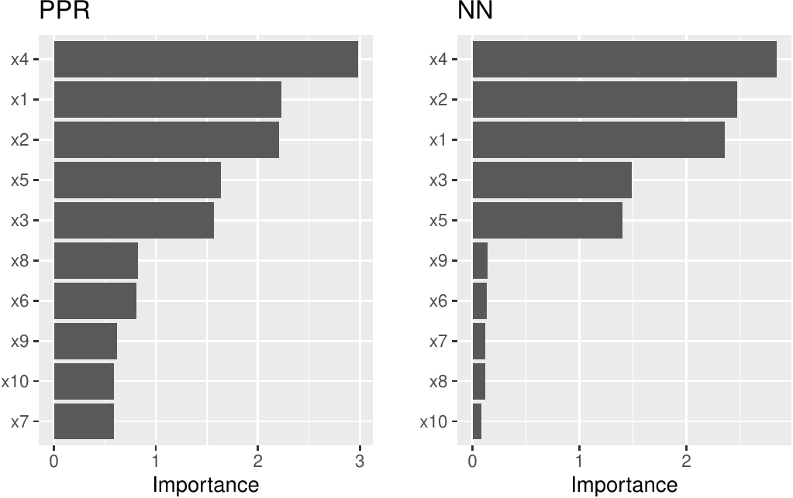
<figcaption>Figure 9: ICE-based feature importance for the PPR and NN
models fit to the simulated Friedman data.</figcaption>
</figure>

When using `method = "firm"`, the feature effect values are stored in an
attribute called `"effects"`. This is a convenience so that the feature
effect plots (e.g., PDPs and ICE curves) can easily be reconstructed and
compared with the VI scores, as demonstrated in the example below (see
Figure [10](#fig:pdp-from-attr)):

``` r
# Construct PDP-based VI scores
(vis <- vi(pp, method = "firm"))
```

``` r
#> # A tibble: 10 x 2
#>    Variable Importance
#>    <chr>         <dbl>
#>  1 x4           2.93
#>  2 x2           2.05
#>  3 x1           2.04
#>  4 x5           1.53
#>  5 x3           1.38
#>  6 x6           0.183
#>  7 x10          0.139
#>  8 x9           0.113
#>  9 x8           0.0899
#> 10 x7           0.0558
```

``` r
# Reconstruct PDPs for all 10 features (Figure 10)
par(mfrow = c(2, 5))
for (name in paste0("x", 1:10)) {
  plot(attr(vis, which = "effects")[[name]], type = "l", ylim = c(9, 19), las = 1)
}
```

<figure id="fig:pdp-from-attr">
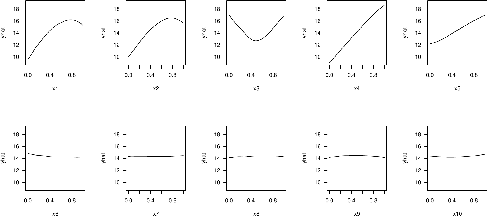
<figcaption>Figure 10: PDPs for all ten features reconstructed from the
<code>pdp</code> attribute of the <code>vis</code> object.</figcaption>
</figure>

## Permutation method

The permutation method exists in various forms and was made popular in
@random-breiman-2001 for RFs, before being generalized and extended in
@fisher-model-2018. The permutation approach used in *vip* is quite
simple and is outlined in Algorithm [1](#alg:permute) below. The idea is
that if we randomly permute the values of an important feature in the
training data, the training performance would degrade (since permuting
the values of a feature effectively destroys any relationship between
that feature and the target variable). This of course assumes that the
model has been properly tuned (e.g., using cross-validation) and is not
over fitting. The permutation approach uses the difference between some
baseline performance measure (e.g., training $R^2$, AUC, or RMSE) and
the same performance measure obtained after permuting the values of a
particular feature in the training data (**Note:** the model is NOT
refit to the training data after randomly permuting the values of a
feature). It is also important to note that this method may not be
appropriate when you have, for example, highly correlated features
(since permuting one feature at a time may lead to unlikely data
instances).

Let $X_1, X_2, \dots, X_j$ be the features of interest and let
$\mathcal{M}_{orig}$ be the baseline performance metric for the trained
model; for brevity, we'll assume smaller is better (e.g., classification
error or RMSE). The permutation-based importance scores can be computed
as follows:

1.  For $i = 1, 2, \dots, j$:

    1.  Permute the values of feature $X_i$ in the training data.

    2.  Recompute the performance metric on the permuted data
        $\mathcal{M}_{perm}$.

    3.  Record the difference from baseline using
        $imp\left(X_i\right) = \mathcal{M}_{perm} - \mathcal{M}_{orig}$.

2.  Return the VI scores
    $imp\left(X_1\right), imp\left(X_2\right), \dots, imp\left(X_j\right)$.

<figure id="alg:permute">
<figcaption>Algorithm 1: A simple algorithm for constructing permutation-based VI
scores. []{#alg:permute label="alg:permute"}</figcaption>
</figure>

Algorithm [1](#alg:permute) can be improved or modified in a number of
ways. For instance, the process can be repeated several times and the
results averaged together. This helps to provide more stable VI scores,
and also the opportunity to measure their variability. Rather than
taking the difference in step (c), @molnar-2019-iml [sec. 5.5.4] argues
that using the ratio $\mathcal{M}_{perm} / \mathcal{M}_{orig}$ makes the
importance scores more comparable across different problems. It's also
possible to assign importance scores to groups of features (e.g., by
permuting more than one feature at a time); this would be useful if
features can be categorized into mutually exclusive groups, for
instance, categorical features that have been one-hot-encoded.

To use the permutation approach in *vip*, specify `method = "permute"`
in the call to `vi()` or `vip()` (or you can use `vi_permute()`
directly). Note that using `method = "permute"` requires specifying a
few additional arguments (e.g., the training data, target name or vector
of target values, a prediction function, etc.); see `?vi_permute` for
details.

An example is given below for the previously fitted PPR and NN models.
Here we use $R^2$ (`metric = "rsquared"`) as the evaluation metric. The
results, which are displayed in Figure [11](#fig:vip-permute-ppr-nn),
agree with those obtained using the PDP- and ICE-based methods.

``` r
# Plot VI scores
set.seed(2021)  # for reproducibility
p1 <- vip(pp, method = "permute", target = "y", metric = "rsquared",
          pred_wrapper = predict) + ggtitle("PPR")
p2 <- vip(nn, method = "permute", target = "y", metric = "rsquared",
          pred_wrapper = predict) + ggtitle("NN")

# Display plots in a grid (Figure 11)
grid.arrange(p1, p2, ncol = 2)
```

<figure id="fig:vip-permute-ppr-nn">
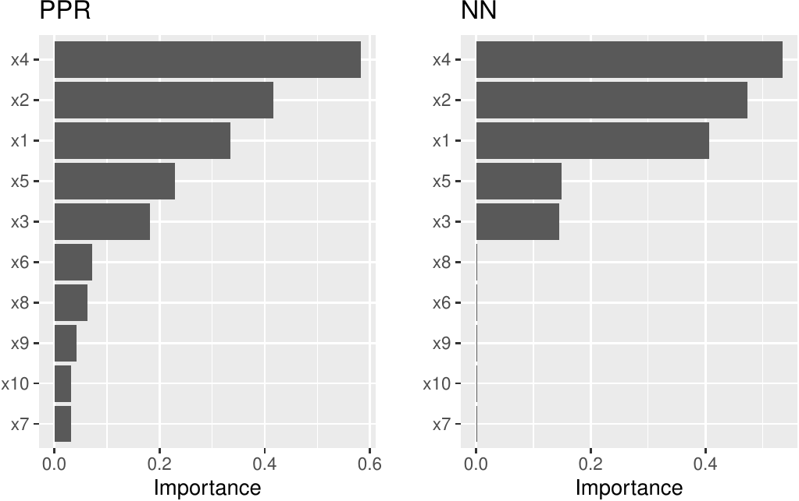
<figcaption>Figure 11: Permutation-based feature importance for the PPR
and NN models fit to the simulated Friedman data.</figcaption>
</figure>

The permutation approach introduces randomness into the procedure and
therefore should be run more than once if computationally feasible. The
upside to performing multiple runs of Algorithm [1](#alg:permute) is
that it allows us to compute standard errors (among other metrics) for
the estimated VI scores, as illustrated in the example below; here we
specify `nsim = 10` to request that each feature be permuted 10 times
and the results averaged together. (Additionally, if `nsim > 1`, you can
set `geom = "boxplot"` in the call to `vip()` to construct boxplots of
the raw permutation-based VI scores. This is useful if you want to
visualize the variability in each of the VI estimates; see Figure
[12](#fig:vip-boxplots) for an example.)

``` r
# Use 10 Monte Carlo reps
set.seed(403)  # for reproducibility
vis <- vi(pp, method = "permute", target = "y", metric = "rsquared",
          pred_wrapper = predict, nsim = 15)
vip(vis, geom = "boxplot")  # Figure 12
```

<figure id="fig:vip-boxplots">
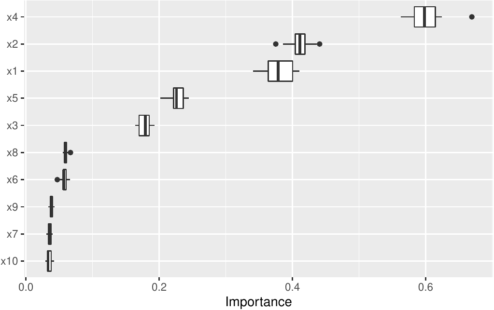
<figcaption>Figure 12: Boxplots of VI scores using the permutation
method with 15 Monte Carlo repetitions.</figcaption>
</figure>

All available performance metrics for regression and classification can
be listed using the `list_metrics()` function, for example:

``` r
list_metrics()
```

``` r
#>      Metric                       Description                             Task
#> 1  accuracy           Classification accuracy Binary/multiclass classification
#> 2     error           Misclassification error Binary/multiclass classification
#> 3       auc            Area under (ROC) curve            Binary classification
#> 4   logloss                          Log loss            Binary classification
#> 5      mauc Multiclass area under (ROC) curve        Multiclass classification
#> 6       mae               Mean absolute error                       Regression
#> 7       mse                Mean squared error                       Regression
#> 8        r2                         R squared                       Regression
#> 9  rsquared                         R squared                       Regression
#> 10     rmse           Root mean squared error                       Regression
#> 11      sse             Sum of squared errors                       Regression
```

We can also use a custom metric (i.e., loss function). Suppose for
example you want to measure importance using the mean absolute error
(MAE):

$$MAE = \frac{1}{n}\sum_{i = 1}^n\left|Y_i - \widehat{f}\left(\boldsymbol{X}_i\right)\right|,$$

where $\widehat{f}\left(\boldsymbol{X}_i\right)$ is the predicted value
of $Y_i$. A simple function implementing this metric is given below
(note that, according to the documentation in `?vi_permute`,
user-supplied metric functions require two arguments: `actual` and
`predicted`).

``` r
mae <- function(actual, predicted) {
  mean(abs(actual - predicted))
}
```

To use this for computing permutation-based VI scores just pass it via
the `metric` argument (be warned, however, that the metric used for
computing permutation importance should be the same as the metric used
to train and tune the model). Also, since this is a custom metric, we
need to specify whether a smaller value indicates better performance by
setting `smaller_is_better = TRUE`. The results, which are displayed in
Figure [13](#fig:vip-nn-mae), are similar to those in Figure
[11](#fig:vip-permute-ppr-nn), albeit a different scale.

``` r
# Construct VIP (Figure 13)
set.seed(2321)  # for reproducibility
pfun <- function(object, newdata)  predict(object, newdata = newdata)
vip(nn, method = "permute", target = "y", metric = mae,
    smaller_is_better = TRUE, pred_wrapper = pfun) +
  ggtitle("Custom loss function: MAE")
```

<figure id="fig:vip-nn-mae">
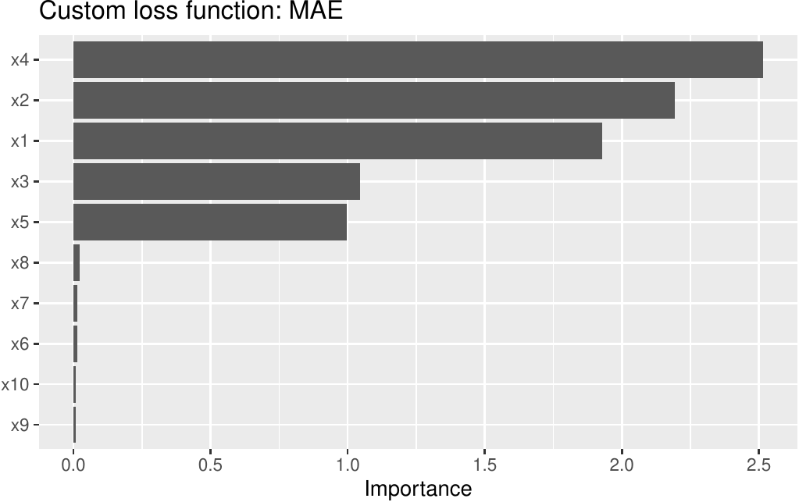
<figcaption>Figure 13: Permutation-based VI scores for the NN model fit
to the simulated Friedman data. In this example, permutation importance
is based on the MAE metric.</figcaption>
</figure>

Although permutation importance is most naturally computed on the
training data, it may also be useful to do the shuffling and measure
performance on new data! This is discussed in depth in @molnar-2019-iml
[sec. 5.2]. For users interested in computing permutation importance
using new data, just supply it to the `train` argument in the call to
`vi()`, `vip()`, or `vi_permute()`. For instance, suppose we wanted to
only use a fraction of the original training data to carry out the
computations. In this case, we could simply pass the sampled data to the
`train` argument as follows:

``` r
# Construct VIP (Figure 14)
set.seed(2327)  # for reproducibility
vip(nn, method = "permute", pred_wrapper = pfun, target = "y", metric = "rmse",
    train = trn[sample(nrow(trn), size = 400), ]) +  # sample 400 observations
  ggtitle("Using a random subset of training data")
```

<figure id="fig:vip-permute-nn-sample">
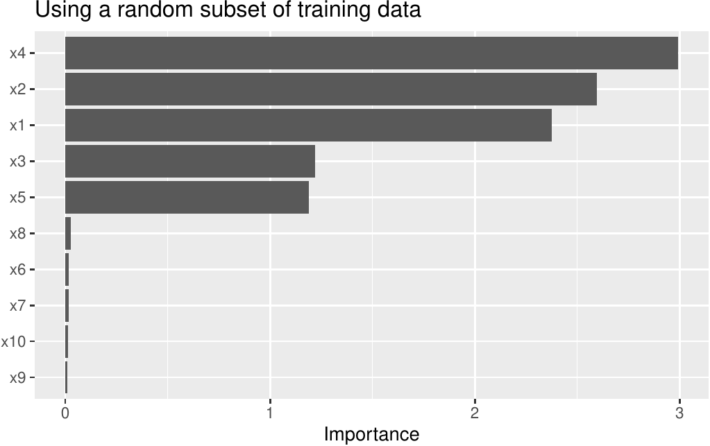
<figcaption>Figure 14: Permutation-based feature importance for the NN
model fit to the simulated Friedman data. In this example, permutation
importance is based on a random sample of 400 training
observations.</figcaption>
</figure>

When using the permutation method with `nsim > 1`, the default is to
keep all the permutation scores as an attribute called `"raw_scores"`;
you can turn this behavior off by setting `keep = FALSE` in the call to
`vi_permute()`, `vi()`, or `vip()`. If `keep = TRUE` and `nsim > 1`, you
can request all permutation scores to be plotted by setting
`all_permutation = TRUE` in the call to `vip()`, as demonstrated in the
code chunk below (see Figure [15](#fig:vip-nn-mae-all)). This also let's
you visually inspect the variability in the permutation scores within
each feature.

``` r
# Construct VIP (Figure 15)
set.seed(8264)  # for reproducibility
vip(nn, method = "permute", pred_wrapper = pfun, target = "y", metric = "mae",
    nsim = 10, geom = "point", all_permutations = TRUE, jitter = TRUE) +
  ggtitle("Plotting all permutation scores")
```

<figure id="fig:vip-nn-mae-all">
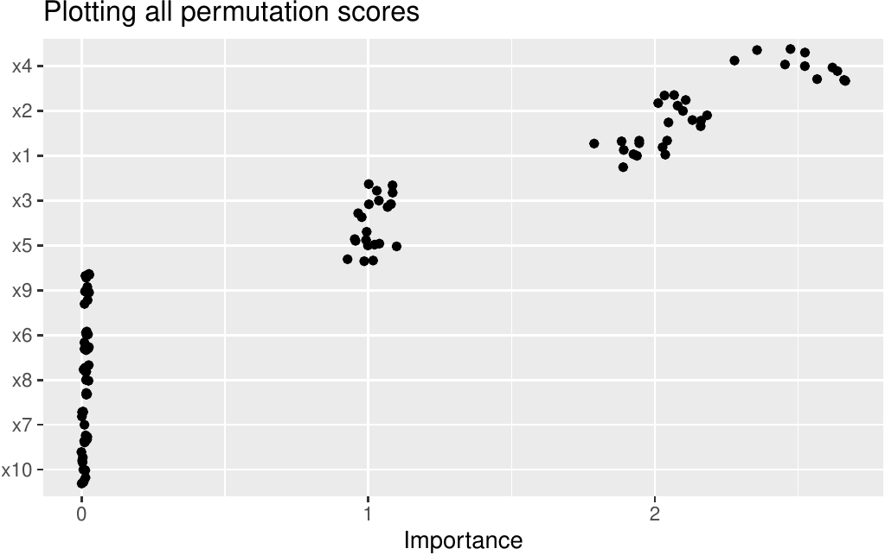
<figcaption>Figure 15: Permutation-based feature importance for the NN
model fit to the simulated Friedman data. In this example, all the
permutation importance scores (points) are displayed for each feature
along with their average (bars).</figcaption>
</figure>

### Benchmarks

In this section, we compare the performance of four implementations of
permutation-based VI scores: `iml::FeatureImp()` (version 0.10.0),
`ingredients::feature_importance()` (version 1.3.1),
`mmpf::permutationImportance` (version 0.0.5), and `vip::vi()` (version
0.2.2.9000).

We simulated 10,000 training observations from the Friedman 1 benchmark
problem and trained a random forest using the *ranger* package. For each
implementation, we computed permutation-based VI scores 100 times using
the
[*microbenchmark*](https://CRAN.R-project.org/package=microbenchmark)
package [@R-microbenchmark]. For this benchmark we did not use any of
the parallel processing capability available in the *iml* and *vip*
implementations. The results from *microbenchmark* are displayed in
Figure [16](#fig:benchmark) and summarized in the output below. In this
case, the *vip* package (version 0.2.2.9000) was the fastest, followed
closely by *ingredients* and *mmpf*. It should be noted, however, that
the implementations in *vip* and *iml* can be parallelized. To the best
of our knowledge, this is not the case for *ingredients* or *mmpf*
(although it would not be difficult to write a simple parallel wrapper
for either). The code used to generate these benchmarks can be found at
<http://bit.ly/2TogXrq>.

<figure id="fig:benchmark">
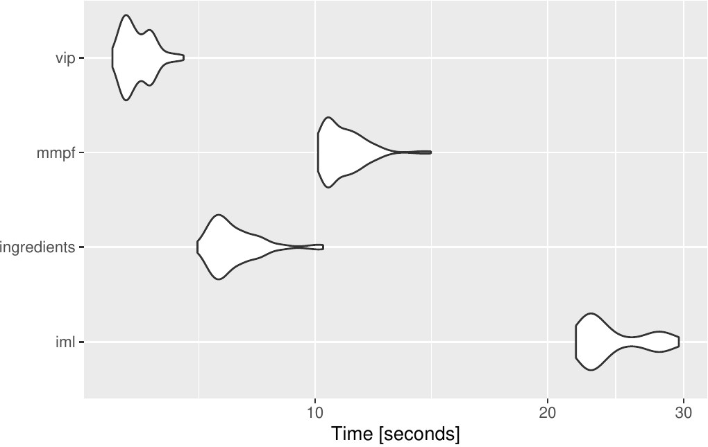
<figcaption>Figure 16: Violin plots comparing the computation time from
three different implementations of permutation-based VI scores across
100 simulations.</figcaption>
</figure>

## Shapley method

Although *vip* focuses on global VI methods, it is becoming increasing
popular to asses global importance by aggregating local VI measures; in
particular, Shapley explanations [@strumbelj-2014-explaining]. Using
Shapley values (a method from coalitional game theory), the prediction
for a single instance $x^\star$ can be explained by assuming that each
feature value in $x^\star$ is a "player" in a game with a payout equal
to the corresponding prediction $\widehat{f}\left(x^\star\right)$.
Shapley values tell us how to fairly distribute the "payout" (i.e.,
prediction) among the features. Shapley values have become popular due
to the attractive fairness properties they posses
[@lundberg_unified_2017]. The most popular implementation is available
in the Python *shap* package [@lundberg_unified_2017]; although a number
of implementations are now available in R; for example, *iml*,
[*iBreakDown*](https://CRAN.R-project.org/package=iBreakDown)
[@R-iBreakDown], and
[*fastshap*](https://CRAN.R-project.org/package=fastshap) [@R-fastshap].

Obtaining a global VI score from Shapley values requires aggregating the
Shapley values for each feature across the entire training set (or at
least a reasonable sample thereof). In particular, we use the mean of
the absolute value of the individual Shapley values for each feature.
Unfortunately, Shapley values can be computationally expensive, and
therefore this approach may not be feasible for large training sets
(say, \>3000 observations). The *fastshap* package provides some relief
by exploiting a few computational tricks, including the option to
perform computations in parallel (see `?fastshap::explain` for details).
Also, fast and exact algorithms [@lundberg-explainable-2019] can be
exploited for certain classes of models.

Starting with *vip* version 0.2.2.9000 you can now use `method = "shap"`
in the call to `vi()` (or use `vi_shap()` directly) to compute global
Shapley-based VI scores using the method described above (provided you
have the *fastshap* package installed)---see `?vip::vi_shap` for
details. To illustrate, we compute Shapley-based VI scores from an
[*xgboost*](https://CRAN.R-project.org/package=xgboost) model
[@R-xgboost] using the Friedman data from earlier; the results are
displayed in Figure [17](#fig:vi-shap).[^9] (**Note:** specifying
`include_type = TRUE` in the call to `vip()` causes the type of VI
computed to be displayed as part of the axis label.)

``` r
# Load required packages
library(xgboost)

# Feature matrix
X <- data.matrix(subset(trn, select = -y))  # matrix of feature values

# Fit an XGBoost model; hyperparameters were tuned using 5-fold CV
set.seed(859)  # for reproducibility
bst <- xgboost(X, label = trn$y, nrounds = 338, max_depth = 3, eta = 0.1,
               verbose = 0)

# Construct VIP (Figure 17)
vip(bst, method = "shap", train = X, exact = TRUE, include_type = TRUE)
```

<figure id="fig:vi-shap">
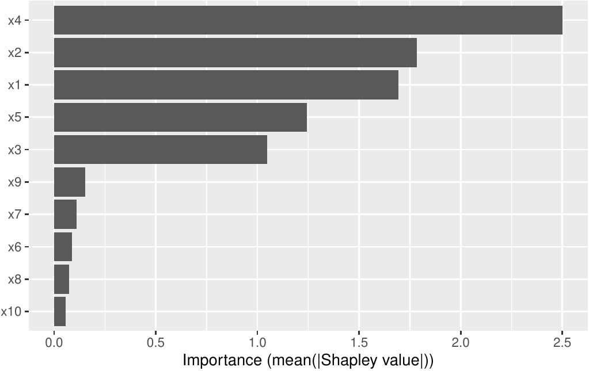
<figcaption>Figure 17: Shapley-based VI scores from an XGBoost model fit
to the simulated Friedman data.</figcaption>
</figure>

# Drawbacks of existing methods

As discussed in @hooker-2019-stop, permute-and-predict methods---like
PDPs, ICE curves, and permutation importance---can produce results that
are highly misleading.[^10] For example, the standard approach to
computing permutation-based VI scores involves independently permuting
individual features. This implicitly makes the assumption that the
observed features are statistically independent. In practice, however,
features are often not independent which can lead to nonsensical VI
scores. One way to mitigate this issue is to use the conditional
approach described in @strobl-2019-conditional; @hooker-2019-stop
provides additional alternatives, such as permute-and-relearn
importance. Unfortunately, to the best of our knowledge, this approach
is not yet available for general purpose. A similar modification can be
applied to PDPs [@parr-2019-technical][^11] which seems reasonable to
use in the FIRM approach when strong dependencies among the features are
present (though, we have not given this much thought or consideration).

We already mentioned that PDPs can be misleading in the presence of
strong interaction effects. This drawback, of course, equally applies to
the FIRM approach using PDPs for computing VI scores. As discussed
earlier, this can be mitigated by using ICE curves instead. Another
alternative would be to use accumulated local effect (ALE) plots
[@apley-2016-visualizing] (though we haven't really tested this idea).
Compared to PDPs, ALE plots have the advantage of being faster to
compute and less affected by strong dependencies among the features. The
downside, however, is that ALE plots are more complicated to implement
(hence, they are not currently available when using `method = "firm"`).
ALE plots are available in the
[*ALEPlot*](https://CRAN.R-project.org/package=ALEPlot) [@R-ALEPlot] and
*iml* packages.

@hooker-2007-generalized also argues that feature importance (which
concern only main effects) can be misleading in high dimensional
settings, especially when there are strong dependencies and interaction
effects among the features, and suggests an approach based on a
generalized functional ANOVA decomposition---though, to our knowledge,
this approach is not widely implemented in open source.

# Use sparklines to characterize feature effects

Starting with *vip* 0.1.3, we have included a new function
`add_sparklines()` for constructing HTML-based VI tables; however, this
feature requires the [*DT*](https://CRAN.R-project.org/package=DT)
package [@R-DT]. The primary difference between `vi()` and
`add_sparklines()` is that the latter includes an `Effect` column that
displays a sparkline representation of the partial dependence function
for each feature. This is a concise way to display both feature
importance and feature effect information in a single (interactive)
table. See `?vip::add_sparklines` for details. We illustrate the basic
use of `add_sparklines()` in the code chunk below where we fit a
*ranger*-based random forest using the
[*mlr3*](https://CRAN.R-project.org/package=mlr3) package
[@R-mlr3].[^12]

``` r
# Load required packages
library(mlr3)
library(mlr3learners)

# Fit a ranger-based random forest using the mlr3 package
set.seed(101)
task <- TaskRegr$new("friedman", backend = trn, target = "y")
lrnr <- lrn("regr.ranger", importance = "impurity")
lrnr$train(task)

# First, compute a tibble of VI scores using any method
var_imp <- vi(lrnr)

# Next, convert to an HTML-based data table with sparklines
add_sparklines(var_imp, fit = lrnr$model, train = trn)  # Figure 18
```

<figure id="fig:sparklines">
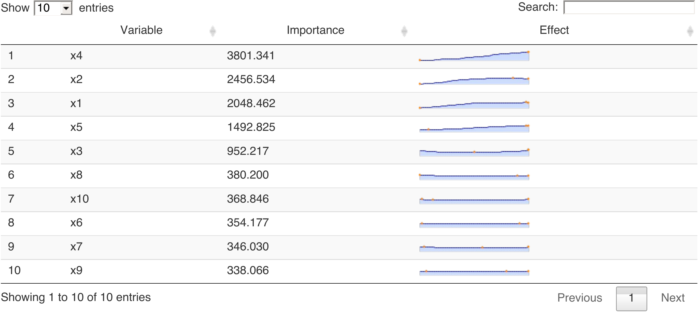
<figcaption>Figure 18: Variable importance scores along with a sparkline
representation of feature effects.</figcaption>
</figure>

# Ames housing example

For illustration, we'll use the Ames housing data [@ames-cock-2011]
which are available in the
[*AmesHousing*](https://CRAN.R-project.org/package=AmesHousing) package
[@R-AmesHousing]. These data describe the sale of individual residential
properties in Ames, Iowa from 2006--2010. The data set contains 2930
observations, 80 features (23 nominal, 23 ordinal, 14 discrete, and 20
continuous), and a continuous target giving the sale price of the home.
The version we'll load is a cleaned up version of the original data set
and treats all categorical variables as nominal (see
`?AmesHousing::make_ames` for details).

Using the R package
[*SuperLearner*](https://CRAN.R-project.org/package=SuperLearner)
[@R-SuperLearner], we trained five models using 5-fold cross-validation:
a GBM using the *xgboost* package, an RF using the *ranger* package, a
MARS model using the *earth* package, a GLMNET model using the
[*glmnet*](https://CRAN.R-project.org/package=glmnet) package
[@R-glmnet], and a support vector regression model using the
[*kernlab*](https://CRAN.R-project.org/package=kernlab) package
[@R-kernlab]. The magnitude of the coefficients from the meta learner
indicate which models contribute the most (if at all) to new
predictions.

``` r
# Load the Ames housing data
ames <- AmesHousing::make_ames()
X <- subset(ames, select = -Sale_Price)
y <- ames$Sale_Price

# Load required packages
library(SuperLearner)

# List of base learners
learners <- c("SL.xgboost", "SL.ranger", "SL.earth", "SL.glmnet", "SL.ksvm")

# Stack models
set.seed(840)  # for reproducibility
ctrl <- SuperLearner.CV.control(V = 5L, shuffle = TRUE)
sl <- SuperLearner(Y = y, X = X, SL.library = learners, verbose = TRUE,
                   cvControl = ctrl)
sl
```

``` r
#>
#> Call:
#> SuperLearner(Y = y, X = X, SL.library = learners, verbose = TRUE, cvControl = ctrl)
#>
#>
#>
#>                      Risk       Coef
#> SL.xgboost_All  580713682 0.41384425
#> SL.ranger_All   666208088 0.08083034
#> SL.earth_All    553872844 0.50532541
#> SL.glmnet_All   908881559 0.00000000
#> SL.ksvm_All    6784289108 0.00000000
```

In the code chunks below we request permutation-based VI scores and a
sparkline representation of the PDPs for the top ten features. For this
we need to define a couple of wrapper functions: one for computing
predictions (for the permutation VI scores), and one for computing
averaged predictions (for the PDPs).

``` r
# Prediction wrapper functions
imp_fun <- function(object, newdata) {  # for permutation-based VI scores
  predict(object, newdata = newdata)$pred
}
par_fun <- function(object, newdata) {  # for PDPs
  mean(predict(object, newdata = newdata)$pred)
}
```

To speed up the process, we perform the computations in parallel by
setting `parallel = TRUE` in the calls to `vi()` and `add_sparklines()`.
Note that we first need to set up a parallel backend for this to work.
Both *vip* and *pdp* use
[*plyr*](https://CRAN.R-project.org/package=plyr) [@R-plyr]---which
relies on *foreach*---so any parallel backend supported by the *foreach*
package should work. Below we use a socket approach with the
[*doParallel*](https://CRAN.R-project.org/package=doParallel) backend
[@R-doParallel] using a cluster of size five.

``` r
# Setup parallel backend
library(doParallel) # load the parallel backend
cl <- makeCluster(5) # use 5 workers
registerDoParallel(cl) # register the parallel backend

# Permutation-based feature importance
set.seed(278)  # for reproducibility
var_imp <- vi(sl, method = "permute", train = X, target = y, metric = "rmse",
              pred_wrapper = imp_fun, nsim = 5, parallel = TRUE)

# Add sparkline representation of feature effects (# Figure 19)
add_sparklines(var_imp[1L:10L, ], fit = sl, pred.fun = par_fun, train = X,
               digits = 2, verbose = TRUE, trim.outliers = TRUE,
               grid.resolution = 20, parallel = TRUE)
```

<figure id="fig:ames-sparklines">
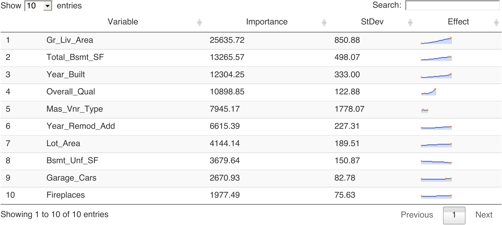
<figcaption>Figure 19: VIP with sparkline representation of feature
effects for the top ten features from a Super Learner fit to the Ames
housing data.</figcaption>
</figure>

``` r
# Shut down cluster
stopCluster(cl)
```

# Summary

VIPs help to visualize the strength of the relationship between each
feature and the predicted response, while accounting for all the other
features in the model. We've discussed two types of VI: model-specific
and model-agnostic, as well as some of their strengths and weaknesses.
In this paper, we showed how to construct VIPs for various types of
"black box" models in R using the *vip* package. We also briefly
discussed related approaches available in a number of other R packages.
Suggestions to avoid high execution times were discussed and
demonstrated via examples. This paper is based on *vip* version
0.2.2.9000. In terms of future development, *vip* can be expanded in a
number of ways. For example, we plan to incorporate the option to
compute group-based and conditional permutation scores. Although not
discussed in this paper, *vip* also includes a promising statistic
(similar to the variance-based VI scores previously discussed) for
measuring the relative strength of interaction between features.
Although VIPs can help understand which features are driving the model's
predictions, ML practitioners should be cognizant of the fact that none
of the methods discussed in this paper are uniformly best across all
situations; they require an accurate model that has been properly tuned,
and should be checked for consistency with human domain knowledge.

# Acknowledgments

The authors would like to thank the anonymous reviewers and the Editor
for their helpful comments and suggestions. We would also like to thank
the members of the 84.51$^{\circ}$ Interpretable Machine Learning
Special Interest Group for their thoughtful discussions on the topics
discussed herein.
:::

[^1]: Although "interpretability" is difficult to formally define in the
    context of ML, we follow @doshivelez-2017-rigorous and describe
    "interpretable" as the "...ability to explain or to present in
    understandable terms to a human."

[^2]: In this context "importance" can be defined in a number of
    different ways. In general, we can describe it as the extent to
    which a feature has a \"meaningful\" impact on the predicted
    outcome. A more formal definition and treatment can be found in
    @laan-2006-statistical.

[^3]: We refer the reader to @poulin-2006-visual,
    @caruana-2015-intelligible, @bibal-2016-intterpretability, and
    @bau-2017-network, for discussions around model structure
    interpretation.

[^4]: These packages were discovered using
    [*pkgsearch*](https://CRAN.R-project.org/package=pkgsearch)'s `ps()`
    function [@R-pkgsearch] with the key phrases "variable importance"
    and "feature importance".

[^5]: In order to avoid deprecation warnings due to recent updates to
    *tibble* and *ggplot2*, the code examples in this article are based
    on the latest development versions of both *vip* (version
    0.2.2.9000) and *pdp* (version 0.7.0.9000); the URL to the
    development version of each package is available on its associated
    CRAN landing page.

[^6]: Technically, it's a tibble with an additional `"vi"` class.

[^7]: Since this approach is biased towards large-scale features it is
    important to properly standardize the predictors (before fitting the
    model) or the estimated coefficients.

[^8]: A similar approach is taken in the
    [*vivo*](https://CRAN.R-project.org/package=vivo) package [@R-vivo].

[^9]: Note that the `exact = TRUE` option is only available if you have
    *fastshap* version 0.0.4 or later

[^10]: It's been argued that approximate Shapley values share the same
    drawback, however, @janzing-2019-feature makes a compelling case
    against those arguments.

[^11]: A basic R implementation is available at
    <https://github.com/bgreenwell/rstratx>.

[^12]: **Note:** Here we use the `...` argument to pass the original
    training to `pdp::partial()`; this is to avoid conflicts caused by
    *mlr3*'s
    [*data.table*](https://CRAN.R-project.org/package=data.table)
    backend [@R-data.table].
