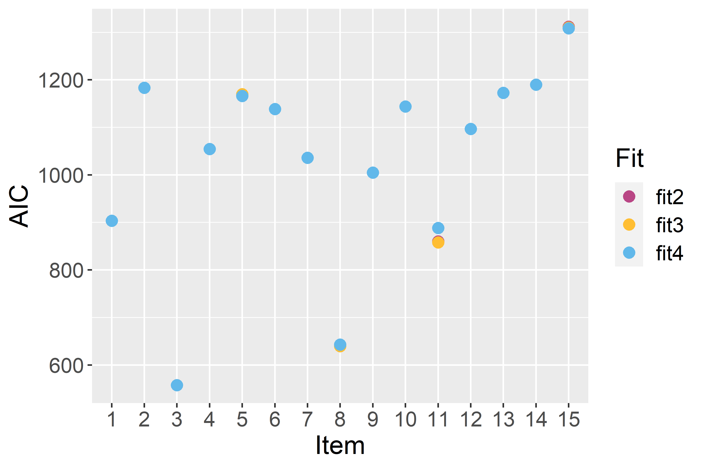
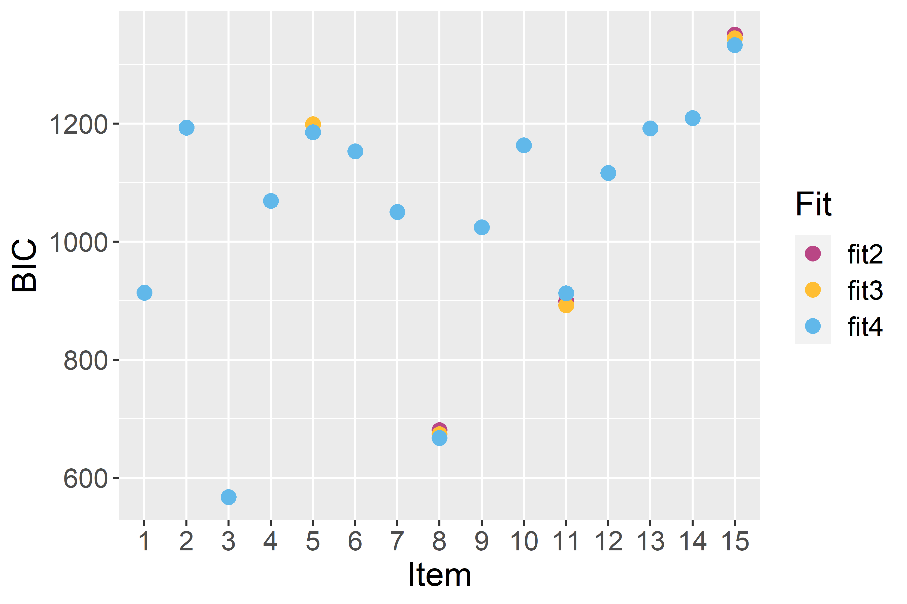
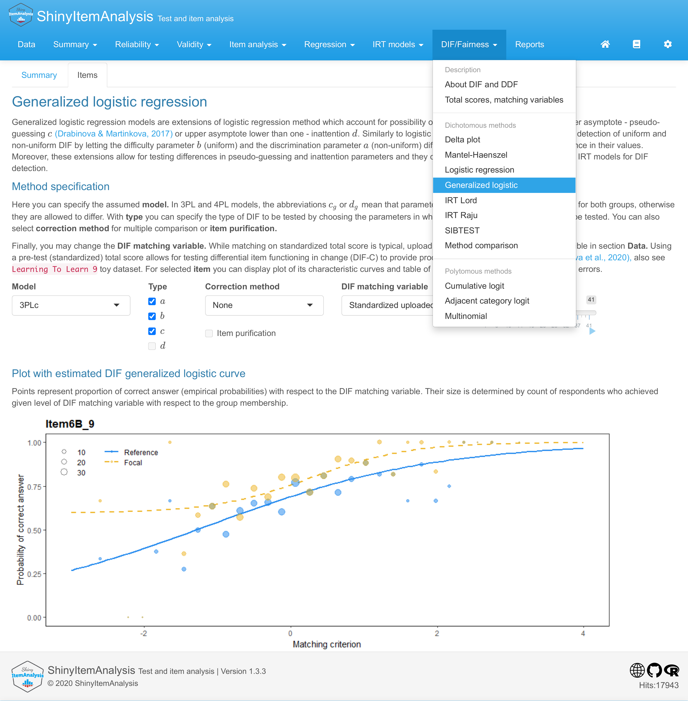

# Introduction

Differential item functioning (DIF) is a phenomenon studied in the field
of psychometrics which occurs when two subjects with the same ability or
knowledge but from different social groups have a different probability
of answering a specific test item correctly. DIF may signal bias and
therefore potential unfairness of the measurement, so, DIF analysis
should be used routinely in development and validation of educational
and psychological tests [@martinkova2017checking].

In recent decades, various methods for DIF detection have been proposed
by many different authors and examples of their (non-exhaustive)
overviews can be found in [@penfield2006dif] or [@magis2010difr].
Generally, DIF detection methods can be classified into two groups --
those based on item response theory (IRT) models and those based on
other approaches (referenced here as non-IRT). IRT models assume that
ability is latent and needs to be estimated, whereas non-IRT methods use
the total test score (or its standardization) for an approximation of
ability level. IRT models can be found more conceptually and
computationally challenging, while non-IRT methods are in general easier
to implement and interpret.

Another distinction of DIF detection methods can be made with respect
to the nature of the DIF that can be detected. Some methods, such as the
Mantel-Haenszel test [@mantel1959statistical] or IRT methods using the
Rasch model [@rasch1993probabilistic], can only detect so-called uniform
DIF, a situation whereby an item is consistently advantageous to one
group across all levels of ability. Other methods, for instance logistic
regression [@swaminathan1990detecting] or methods using a 2 parameter
logistic (2PL) IRT model, can also detect a non-uniform DIF, a situation
when an item is advantageous to one group for some parts of ability
levels while for other parts of ability levels the other group is
in a more favourable position. DIF can be described as a difference in
item parameters between the two groups. Uniform DIF can be then viewed
as the difference in item difficulties (location of the inflexion point
in the item characteristic curve) whereas non-uniform DIF also comprises
a difference in item discrimination (slope at the inflexion point in the
item characteristic curve). Most methods for DIF detection, with the
important exception of methods based on 3PL and 4PL IRT models, are
limited to testing differences in difficulty and discrimination and do
not account for the possibility that an item can be guessed without
necessary knowledge or incorrectly answered due to inattention, let
alone the possibility to test for differences in related parameters.

There are several packages on the Comprehensive R Archive Network (CRAN,
<https://CRAN.Rproject.org/>) which implement various methods for DIF
detection. The [*difR*](https://CRAN.R-project.org/package=difR) package
[@magis2010difr] includes a number of DIF detection methods among
dichotomous items, inclusive of non-IRT methods as well as those based
on IRT models. The
[*DIFlasso*](https://CRAN.R-project.org/package=DIFlasso)
[@schauberger2017diflasso] and
[*DIFboost*](https://CRAN.R-project.org/package=DIFboost)
[@schauberger2016difboost] packages implement penalty approach and
boosting techniques in the IRT Rasch model. The
[*GDINA*](https://CRAN.R-project.org/package=GDINA) package
[@ma2019gdina] offers the implementation of generalized deterministic
inputs, noisy, and gate model. The
[*mirt*](https://CRAN.R-project.org/package=mirt) package
[@chalmers2012mirt] provides DIF detection based on various IRT models
including those for dichotomous as well as ordinal or nominal items. The
[*lordif*](https://CRAN.R-project.org/package=lordif) package
[@seung2016lordif] brings an iterative method based on a mixture of
ordinal logistic regression and an IRT approach for DIF detection.
Finally, the
[*psychotree*](https://CRAN.R-project.org/package=psychotree) package
[@strobl2015rasch] offers a method build on model-based recursive
partitioning to detect latent groups of subjects exhibiting uniform DIF
under the Rasch model. Mentioned packages do not allow for detecting
differences in guessing and inattention, do not offer possibility of
various matching criteria, and/or they assume IRT models which may
become computationally demanding.

A potential gap in DIF methodology can be filled by generalizations of
logistic regression models implemented
within the [*difNLR*](https://CRAN.R-project.org/package=difNLR) package
described here. These nonlinear extensions include estimations of
pseudo-guessing parameters as proposed by [@drabinova2017detection].
However, the *difNLR* package goes further by introducing a wide range
of nonlinear regression models which cover both guessing and
the possibility of inattention and allow for the testing of group
differences in these parameters or their combinations. Moreover, in the
case of ordinal data from rating scales or items allowing for partial
credit, the *difNLR* package is able to detect differential use of the
scale among groups by adjacent category logit or cumulative logit
models. Finally, in the case of nominal data from multiple choice items,
the package offers a multinomial model to test for so-called
differential distractor functioning [DDF, @green1989method], a situation
when respondents with the same ability or knowledge but from different
social groups are attracted differently by offered distractors
(incorrect option choices). In addition, the *difNLR* package provides
features such as item purification [see e.g., @lord1980applications] or
corrections for multiple comparisons [see e.g., @kim2013effect].

This paper gives a detailed description of the *difNLR* package with
functional examples, from data generation, through the model fitting, to
interpretation of the results and their graphical representation, while
separate parts are dedicated to features and troubleshooting. To bring
the concepts together, we conclude by illustrative real data example
connecting the usage of the main functions of the package.

The main advantage of non-IRT DIF detection methods implemented within
the *difNLR* package is their flexibility with respect to the issue of
guessing or inattention, while they retain pleasant properties such as
low ratio of convergence issues when compared to IRT models
[@drabinova2017detection]. In addition to that, the *difNLR* provides
DIF and DDF detection methods among ordinal and nominal data and thus
offers a wide range of techniques to deal with an important topic
of detecting potentially unfair items. For users who are new to `R`,
interactive implementation of *difNLR* functions within the
[*ShinyItemAnalysis*](https://CRAN.R-project.org/package=ShinyItemAnalysis)
package [@martinkova2018shinyitemanalysis] with toy datasets may be
helpful.

# Generalized logistic models for DIF and DDF detection

The class of generalized logistic models described here includes
nonlinear regression models for DIF detection in dichotomously scored
items, cumulative logit and adjacent category logit models for DIF
detection in ordinal items, and a multinomial model for DDF detection in
the case when items are nominal (e.g., multiple-choice).

## Nonlinear regression models for binary items

Nonlinear regression models for DIF detection among binary items are
extensions of the logistic regression method
[@swaminathan1990detecting]. These extensions account
for the possibility that an item can be guessed, in other words
correctly answered without possessing the necessary knowledge, i.e.,
lower asymptote of the item characteristic curve can be larger than zero
[@drabinova2017detection]. Similarly, these models account for a
situation when an item is incorrectly answered by a person with high
ability, e.g., due to inattention or lack of time, i.e., upper asymptote
of the item characteristic curve can be lower than one.

The probability of a correct answer on item $i$ by person $p$ is then
given by
$$\begin{aligned}
\label{fit_dif}
	\mathrm{P}(Y_{ip} = 1| X_p, G_p) = c_{iG_p} + (d_{iG_p}-c_{iG_p})\frac{e^{a_{iG_p}(X_p - b_{iG_p})}}{1 + e^{a_{iG_p}(X_p - b_{iG_p})}},
\end{aligned}   (\#eq:fit-dif)$$
where $X_p$ is a variable describing observed knowledge or ability of
person $p$ and $G_p$ stands for their membership to social group
($G_p = 1$ for focal group, usually seen as the disadvantaged one,
$G_p = 0$ for the reference group). Terms
$a_{iG_p}, b_{iG_p} \in \mathbb{R}$, and $c_{iG_p}, d_{iG_p} \in [0, 1]$
represent discrimination, difficulty, probability of guessing, and a
parameter related to the probability of inattention in item $i$, while
they can differ for the reference and the focal group (denoted by the
index $G_p$). Further, we use parametrization
$a_{iG_p} = a_{i} + a_{i\text{DIF}} G_p$, where $a_{i\text{DIF}}$ is a
difference between the focal and the reference group in discrimination
(analogously for other parameters). In other words, $a_{i0} = a_i$
for the reference group and $a_{i1} = a_{i} + a_{i\text{DIF}}$ for the
focal group. Thus, there are eight parameters for each item in total.
For simplicity of the formulas, we stick with the notation of
$a_{iG_p}$, $b_{iG_p}$, $c_{iG_p}$, and $d_{iG_p}$.

The class of models determined by equation \@ref(eq:fit-dif) contains a
wide range of methods for DIF detection. For instance, with
$d_{iG_p} = 1$, we get a nonlinear model for the detection of DIF
allowing for differential guessing in groups as presented
by [@drabinova2017detection]. Assuming moreover $c_{iG_p} = 0$, one can
obtain a classical logistic regression model for the detection of
uniform and non-uniform DIF as proposed by [@swaminathan1990detecting].

In contrast to IRT models, model \@ref(eq:fit-dif) assumes that
knowledge $X_p$ is represented by the total test score or its
standardized form (Z-score) and thus the described method belongs
to the class of non-IRT approaches. As such, model \@ref(eq:fit-dif) can
be seen as a proxy to the 4PL IRT model for DIF detection. While
estimation of the asymptote parameters is notoriously challenging in IRT
models, it was shown that generalized logistic models require a smaller
sample size to be fitted while they keep pleasant properties in terms of
power and rejection rates [@drabinova2017detection].

The *difNLR* package offers two approaches to estimate parameters of
model \@ref(eq:fit-dif). The first option is the nonlinear least squares
method [@dennis1981adaptive; @ritz2008nonlinear], that is, minimization
of the residual sums of squares (RSS) for item $i$ with respect to item
parameters:
$$\begin{aligned}
    \text{RSS}(a_{ig_p}, b_{ig_p}, c_{ig_p}, d_{ig_p}) = \sum_{p = 1}^n \left\{y_{ip} - c_{ig_p} - \frac{(d_{ig_p} - c_{ig_p})}{1 + e^{-a_{ig_p}(x_p - b_{ig_p})}}\right\}^2,
\end{aligned}$$
where $n$ denotes number of respondents, $y_{ip}$ is the response of
respondent $p$ to the item $i$, $x_p$ is their (standardized) test
score, and $g_p$ is their group membership. The second option is the
maximum likelihood method. Likelihood function of item $i$
$$\begin{aligned}
    \text{L}(a_{ig_p}, b_{ig_p}, c_{ig_p}, d_{ig_p}) = \prod_{p = 1}^n \left\{c_{ig_p} + \frac{d_{ig_p}-c_{ig_p}}{1 + e^{-a_{ig_p}(x_p - b_{ig_p})}}\right\}^{y_{ip}} \left\{1 - c_{ig_p} - \frac{d_{ig_p}-c_{ig_p}}{1 + e^{-a_{ig_p}(x_p - b_{ig_p})}}\right\}^{1 - y_{ip}}
\end{aligned}$$
is maximized with respect to item parameters.

## Regression models for ordinal and nominal items

The logistic regression procedure which estimates the probability of the
correct answer can be extended to estimate the probability of partial
credit scores or option choices. When the responses are ordinal, DIF
detection can be performed using the cumulative logit regression model
[see e.g., @agresti2010analysis Chapter 3]. For $K + 1$ outcome
categories, i.e., $Y \in \left\{0, 1, \dots, K\right\}$, the cumulative
probability is
$$\begin{aligned}
\label{fit_diford_cum}
	\mathrm{P}(Y_{ip} \geq k| X_p, G_p) = \frac{e^{a_{iG_p}(X_p - b_{ikG_p})}}{1 + e^{a_{iG_p}(X_p - b_{ikG_p})}},
\end{aligned}   (\#eq:fit-diford-cum)$$
for $k = 1, \dots, K$, where $\mathrm{P}(Y_{ip} \geq 0| X_p, G_p) = 1$
and $b_{ikG_p} = b_{ik} + b_{iDIF}G_p$. The parameter $b_{iDIF}$ can be
interpreted as the difference in difficulty of item $i$ between the
reference and the focal group. The parameter $b_{ik}$ can be seen as
category $k$ specific difficulty of item $i$ which is the same for both
groups. The category probability is then given by
$$\begin{aligned}
	\mathrm{P}(Y_{ip} = k| X_p, G_p) = \mathrm{P}(Y_{ip} \geq k| X_p, G_p) - \mathrm{P}(Y_{ip} \geq k + 1| X_p, G_p),
\end{aligned}$$
for categories $k = 0, \dots, K - 1$ while
$\mathrm{P}(Y_{ip} = K| X_p, G_p) = \mathrm{P}(Y_{ip} \geq K| X_p, G_p)$.
Again, knowledge is represented by observed (standardized) total test
score $X_p$ and therefore model \@ref(eq:fit-diford-cum) can be seen as
a proxy to a graded response IRT model [@samejima1969estimation].

Another approach for DIF detection in ordinal data is the adjacent
category logit model [see e.g., @agresti2010analysis Chapter 4], which
for $K + 1$ outcome categories is given by
$$\begin{aligned}
	\log\frac{\mathrm{P}(Y_{ip} = k | X_p, G_p)}{\mathrm{P}(Y_{ip} = k - 1 | X_p, G_p)} = a_{iG_p}(X_p - b_{ikG_p}),
\end{aligned}$$
where $k = 1, \dots, K$ and $b_{ikG_p} = b_{ik} + b_{iDIF}G_p$. The
category probability takes the following form:
$$\begin{aligned}
\label{fit_diford_adj}
	\mathrm{P}(Y_{ip} = k| X_p, G_p) = \frac{e^{\sum_{l = 0}^k a_{iG_p}(X_p - b_{ilG_p})}}{\sum_{j = 0}^K e^{\sum_{l = 0}^j a_{iG_p}(X_p - b_{ilG_p})}},
\end{aligned}   (\#eq:fit-diford-adj)$$
where $k = 1, \dots, K$ and parameters for $k = 0$ are set to zero,
i.e., $a_{iG_p}(X_p - b_{i0G_p}) = 0$ and hence
$\mathrm{P}(Y_{ip} = 0| X_p, G_p) = \frac{1}{\sum_{j = 0}^K e^{\sum_{l = 0}^j a_{iG_p}(X_p - b_{ilG_p})}}$.
As such, an adjacent category logit model \@ref(eq:fit-diford-adj) can
be seen as a proxy to the rating scale IRT model [@andrich1978rating].
Both models, cumulative logit and adjacent category logit, are estimated
by iteratively re-weighted least squares.

When responses are nominal (e.g., multiple choice), DDF detection can be
performed with the multinomial model. Considering that $k = 0, \dots, K$
possible option choices are offered, with $k = 0$ being the correct
answer and other ones distractors, the probability of choosing
distractor $k$ is given by
$$\begin{aligned}
\label{fit_ddfmlr}
	\mathrm{P}(Y_{ip} = k| X_p, G_p) =  \frac{e^{a_{ikG_p}(X_p - b_{ikG_p})}}{\sum_{l = 0}^{K} e^{a_{ilG_p}(X_p - b_{ilG_p})}},
\end{aligned}   (\#eq:fit-ddfmlr)$$
while for the correct answer $k = 0$ the parameters are set to zero,
i.e., $a_{i0G_p}(X_p - b_{i0G_p}) = 0$ and thus
$\mathrm{P}(Y_{ip} = 0| X_p, G_p) = \frac{1}{\sum_{l = 0}^{K} e^{a_{ilG_p}(X_p - b_{ilG_p})}}$.
In contrast to ordinal models \@ref(eq:fit-diford-cum) and
\@ref(eq:fit-diford-adj), discrimination $a_{ikG_p}$ and difficulty
$b_{ikG_p}$ are category-specific and they may vary between groups.
The parameters are estimated via neural networks.

# Implementation in examples

The *difNLR* package provides implementation of the methods to detect
DIF and DDF based on generalized logistic models. Specifically,
a nonlinear regression model \@ref(eq:fit-dif), cumulative logit model
\@ref(eq:fit-diford-cum), adjacent category model
\@ref(eq:fit-diford-adj), and multinomial model \@ref(eq:fit-ddfmlr) are
available within functions `difNLR()`, `difORD()`, and `ddfMLR()` (see
Table [1](#tab1)). All three functions were designed to correspond to
one of the most widely used `R` packages for DIF detection -- *difR*
[@magis2010difr].

::: {#tab1}
  ---------------------------------------------------------------------------------------------------------------------------------------------------------------------------------------------------
  Function     Description
  ------------ --------------------------------------------------------------------------------------------------------------------------------------------------------------------------------------
  `difNLR()`   Performs DIF detection procedure for dichotomous data based on a nonlinear regression model (generalized logistic regression) and either likelihood-ratio or F test of the submodel.

  `difORD()`   Performs DIF detection procedure for ordinal data based on either an adjacent category logit model or a cumulative logit model and likelihood ratio test of the submodel.

  `ddfMLR()`   Performs DDF detection procedure for nominal data based on a multinomial log-linear regression model and likelihood ratio test of the submodel.
  ---------------------------------------------------------------------------------------------------------------------------------------------------------------------------------------------------

  : Table 1: DIF and DDF detection methods available in the *difNLR*
  package.
:::

## DIF detection

In this part, we discuss implementation and usage of the `difNLR()`
function which offers a wide range of methods for DIF detection among
dichotomous data based on a generalized logistic regression model
\@ref(eq:fit-dif). The full syntax of the `difNLR()` function is

``` r
difNLR(
  Data, group, focal.name, model, constraints, 
  type = "all", method = "nls", match = "zscore", 
  anchor = NULL, purify = FALSE, nrIter = 10, 
  test = "LR", alpha = 0.05, p.adjust.method = "none", 
  start, initboot = TRUE, nrBo = 20
)
```

To detect DIF using the `difNLR()` function, the user always needs to
provide four pieces of information: 1. the binary data set, 2. the group
membership vector, 3. the indication of the focal group, and
4. the model.

#### Data. 

`Data` is a `matrix` or a `data.frame` with rows representing
dichotomously scored respondents' answers (1 correct, 0 incorrect) and
columns which correspond to the items. In addition, `Data` may contain
the vector of group membership. If so, the `group` is a column
identifier of the `Data`. Otherwise, the `group` must be a dichotomous
vector of the same length as the number of rows (respondents) in `Data`.
The name of the focal group is specified in `focal.name` argument.

#### Data generation. 

To run a simulation study or to create an illustrative example, the
*difNLR* package contains a data generator `genNLR()`, which can be used
to generate dichotomous, ordinal, or nominal data. The type of items to
be generated can be specified via `itemtype` argument:
`itemtype = "dich"` for dichotomous items, `"ordinal"` for ordinal
items, and `"nominal"` for nominal items.

For the generation of dichotomous items, discrimination and difficulty
parameters need to be specified within `a` and `b` arguments in the form
of matrices with two columns. The first column stands for the reference
group and the second one for the focal group. Each row of matrices
corresponds to one item. Additionally, one can provide guessing and
inattention parameters via arguments `c` and `d` in the same way
as for discriminations and difficulties. By default, values of guessing
parameters are set to 0 in both groups, and the values of inattention
parameters to 1 in both groups.

Distribution of the underlying latent trait is considered to be
Gaussian. The user can specify its mean and standard deviation via
arguments `mu` and `sigma` respectively. By default, mean is 0 and
standard deviation is 1 and they are the same for both groups.

Furthermore, the user needs to provide a sample size (`N`) and the ratio
of respondents in the reference and focal group (`ratio`). The latent
trait for both groups is then generated and together with item
parameters is used to generate item data. Output of the `genNLR()`
function is a `data.frame` with items represented by columns and
responses to them represented by rows. The last column is a group
indicator, where 0 stands for a focal group and 1 indicates a reference
group.

To illustrate generation of dichotomously scored items and to exemplify
basic DIF detection with a `difNLR()` function, we create an example
dataset. We choose discrimination $a$, difficulty $b$, guessing $c$, and
inattention $d$ parameters for 15 items. Parameters are then set the
same for both groups.

``` r
# discrimination
a <- matrix(rep(c(1.00, 1.12, 1.45, 1.25, 1.32, 1.38, 1.44, 0.89, 1.15,
                  1.30, 1.29, 1.46, 1.16, 1.26, 0.98), 2), ncol = 2)
# difficulty
b <- matrix(rep(c(1.34, 0.06, 1.62, 0.24, -1.45, -0.10, 1.76, 1.96, -1.53,
                  -0.44, -1.67, 1.91, 1.62, 1.79, -0.21), 2), ncol = 2)
# guessing
c <- matrix(rep(c(0.00, 0.00, 0.00, 0.00, 0.00, 0.17, 0.18, 0.05, 0.10,
                  0.11, 0.15, 0.20, 0.21, 0.23, 0.24), 2), ncol = 2)
# inattention
d <- matrix(rep(c(1.00, 1.00, 1.00, 0.92, 0.87, 1.00, 1.00, 0.88, 0.93,
                  0.94, 0.81, 0.98, 0.87, 0.96, 0.85), 2), ncol = 2)
```

For items 5, 8, 11, and 15, we introduce DIF caused by various sources:
In item 5, DIF is caused by a difference in difficulty; in item 8 by
discrimination; in item 11, the reference and focal groups differ
in inattention, and in item 15 in guessing.

``` r
b[5, 2] <- b[5, 2] + 1
a[8, 2] <- a[8, 2] + 1
d[11, 2] <- 1
c[15, 2] <- 0
```

We generate dichotomous data with 500 observations in the reference
group and 500 in the focal group. We assume that an underlying latent
trait comes from a standard normal distribution for both groups (default
setting). The output is a `data.frame` where the first 15 columns are
dichotomously scored answers of 1,000 respondents and the last column is
a group membership variable.

``` r
set.seed(42)
df <- genNLR(N = 1000, a = a, b = b, c = c, d = d)
head(df[, c(1:5, 16)])
  Item1 Item2 Item3 Item4 Item5 group
1     0     1     1     1     1     0
2     0     1     1     0     1     0
3     0     1     0     0     1     0
4     1     1     1     0     1     0
5     1     1     0     1     1     0
6     0     1     0     0     1     0

DataDIF <- df[, 1:15]
groupDIF <- df[, 16]
```

#### Model. 

The last necessary input of the `difNLR()` function is specification of
the model to be estimated. This can be made by `model` argument. There
are several predefined models, all of them based on the 4PL model stated
in equation \@ref(eq:fit-dif) (see Table [2](#tab2)).

::: {#tab2}
  -------------------------------------------------------------------------------------------------------------
  Model annotation       Description
  ---------------------- --------------------------------------------------------------------------------------
  `"4PL"`                4PL model

  `"4PLcdg"`, `"4PLc"`   4PL model with an inattention parameter set equal for the two groups

  `"4PLcgd"`, `"4PLd"`   4PL model with a guessing parameter set equal for the two groups

  `"4PLcgdg"`            4PL model with a guessing and an inattention parameters set equal for the two groups

  `"3PLd"`               3PL model with an inattention parameter and $c = 0$

  `"3PLc"`, `"3PL"`      3PL model with a guessing parameter and $d = 1$

  `"3PLdg"`              3PL model with an inattention parameter set equal for the two groups

  `"3PLcg"`              3PL model with a guessing parameter set equal for the two groups

  `"2PL"`                Logistic regression model, i.e. $c = 0$ and $d = 1$

  `"1PL"`                1PL model with a discrimination parameter set equal for the two groups

  `"Rasch"`              1PL model with a discrimination parameter fixed on value of 1 for the two groups
  -------------------------------------------------------------------------------------------------------------

  : Table 2: Predefined models for the `model` argument in the
  `difNLR()` function.
:::

We are now able to perform the basic DIF detection with a 4PL model for
all the items on a generated example dataset `DataDIF`.

``` r
(fit1 <- difNLR(DataDIF, groupDIF, focal.name = 1, model = "4PL"))
Detection of all types of differential item functioning
using generalized logistic regression model

Generalized logistic regression likelihood ratio chi-square statistics
based on 4PL model 

Parameters were estimated with nonlinear least squares

Item purification was not applied
No p-value adjustment for multiple comparisons

       Chisq-value P-value    
Item1   6.2044      0.1844    
Item2   0.2802      0.9911    
Item3   2.7038      0.6086    
Item4   5.8271      0.2124    
Item5  48.0052      0.0000 ***
Item6   7.2060      0.1254    
Item7   3.2390      0.5187    
Item8  16.8991      0.0020 ** 
Item9   2.1595      0.7064    
Item10  4.6866      0.3210    
Item11 69.5328      0.0000 ***
Item12  8.1931      0.0848 .  
Item13  2.5850      0.6295    
Item14  2.9478      0.5666    
Item15 20.6589      0.0004 ***

Signif. codes: 0 '***' 0.001 '**' 0.01 '*' 0.05 '.' 0.1 ' ' 1

Detection thresholds: 9.4877 (significance level: 0.05)

Items detected as DIF items:
 Item5
 Item8
 Item11
 Item15
```

The output returns values of the test statistics for DIF detection,
corresponding p-values, and set of items which are detected as
functioning differently. All items (5, 8, 11, and 15) are correctly
identified.

Estimates of parameters can be viewed with `coef()` method. Method
`coef()` returns a list of parameters, which can be simplified to a
matrix by setting `simplify = TRUE`. Each row then corresponds to one
item and columns indicate parameters of the estimated model.

``` r
round(coef(fit1, simplify = TRUE), 3)
           a      b     c     d   aDif   bDif  cDif   dDif
Item1  1.484  1.294 0.049 1.000  0.000  0.000 0.000  0.000
Item2  1.176  0.153 0.000 1.000  0.000  0.000 0.000  0.000
Item3  1.281  1.766 0.001 1.000  0.000  0.000 0.000  0.000
Item4  1.450  0.421 0.000 1.000  0.000  0.000 0.000  0.000
Item5  1.965 -1.147 0.000 0.868 -0.408  0.769 0.023 -0.006
Item6  1.458 -0.527 0.000 0.954  0.000  0.000 0.000  0.000
Item7  0.888  1.392 0.000 1.000  0.000  0.000 0.000  0.000
Item8  1.162  1.407 0.000 0.866 -0.117  0.974 0.007  0.134
Item9  1.482 -1.337 0.000 0.928  0.000  0.000 0.000  0.000
Item10 1.375 -0.570 0.007 0.967  0.000  0.000 0.000  0.000
Item11 1.071 -1.027 0.000 0.969  1.173 -0.499 0.000  0.011
Item12 1.051  1.560 0.080 1.000  0.000  0.000 0.000  0.000
Item13 1.009  1.348 0.084 1.000  0.000  0.000 0.000  0.000
Item14 1.093  1.659 0.141 1.000  0.000  0.000 0.000  0.000
Item15 0.875 -0.565 0.000 0.945  0.205  0.348 0.000 -0.142
```

The user can also print standard errors of the estimates using an option
`SE = TRUE`. For example, estimated difference in difficulty between the
reference and the focal groups in item 5 is 0.769 with standard error of
0.483.

``` r
round(coef(fit1, SE = TRUE)[[5]], 3)
             a      b     c     d   aDif  bDif  cDif   dDif
estimate 1.965 -1.147 0.000 0.868 -0.408 0.769 0.023 -0.006
SE       0.844  0.404 0.307 0.044  1.045 0.483 0.345  0.093
```

The `difNLR()` function provides a visual representation of the item
characteristic curves using
the [*ggplot2*](https://CRAN.R-project.org/package=ggplot2) package
[@wickham2016ggplot2] and its graphical environment. Curves are always
based on results of a DIF detection procedure -- when an item displays
DIF, two curves are plotted, one for the reference and one for the focal
group. Curves are accompanied by points representing empirical
probabilities, i.e., proportions of correct answers with respect to the
ability level and group membership. Size of the points is determined by
the number of respondents at this ability level. Characteristic curves
may simply be rendered with method `plot()` and by specifying items to
be plotted. We show here characteristic curves for DIF items only
(Figure [1](#fig:plot)).

``` r
plot(fit1, item = fit1$DIFitems)
```

{#fig:plot width="98.0%"
alt="graphic without alt text"}

Besides predefined models (see Table [2](#tab2)), all parameters of the
model can be further constrained using argument `constraints` specifying
which parameters should be set equally for the two groups. For example,
choice `"ac"` in 4PL model means that discrimination parameter $a$ and
pseudo-guessing parameter $c$ are set equally for the two groups while
the remaining parameters ($b$ and $d$) are not. In addition, both
arguments `model` and `constraints` are item-specific, meaning that a
single value for all items can be introduced as well as a vector
specifying the setting for each item. While the model specification can
be challenging, this offers a wide range of models for DIF detection
which goes hand in hand with the complexity of the offered method.

Furthermore, via `type` argument one can specify which type of DIF to
test. Default option `type = "all"` allows one to test the difference in
any parameter which is not constrained to be the same for both groups.
Uniform DIF (difference in difficulty $b$ only) can be tested by setting
`type = "udif"`, while nonuniform DIF (difference also in discrimination
$a$) by setting `type = "nudif"`. With the argument `type = "both"`, the
differences in both parameters ($a$ and $b$) are tested. Moreover, to
identify DIF in more detail, one can determine in which parameters the
difference should be tested. The argument `type` is also item-specific.

``` r
# item-specific model
model <- c("1PL", rep("2PL", 2), rep("3PL", 2), rep("3PLd", 2), rep("4PL", 8))
fit2 <- difNLR(DataDIF, groupDIF, focal.name = 1, model = model, type = "all")
fit2$DIFitems
[1]  5  8 11 15
# item-specific type
type <- rep("all", 15)
type[5] <- "b"; type[8] <- "a"; type[11] <- "c"; type[15] <- "d"
fit3 <- difNLR(DataDIF, groupDIF, focal.name = 1, model = model, type = type)
fit3$DIFitems
[1] 5
# item-specific constraints
constraints <- rep(NA, 15)
constraints[5] <- "ac"; constraints[8] <- "bcd";
constraints[11] <- "abd"; constraints[15] <- "abc"
fit4 <- difNLR(DataDIF, groupDIF, focal.name = 1, model = model,
               constraints = constraints, type = type)
fit4$DIFitems
[1]  5  8 11 15
```

In `fit2` we allowed different models for items. In `fit3`, when items
were intended to function differently, we tested only the difference in
those parameters which were selected to be a source of DIF when we
generated data, while using the same item-specific models as for `fit2`.
Finally, in items which were intended to function differently we
constrained all other parameters to be the same for both groups
in `fit4`. As expected, models `fit2` and `fit4` correctly identified
all DIF items, while `fit3` detected only item 5.

The `difNLR()` function offers two techniques to estimate parameters of
a generalized logistic regression model \@ref(eq:fit-dif). With a
default option `method = "nls"`, nonlinear least square estimation is
applied using a `nls()` function from the
[*stats*](https://CRAN.R-project.org/package=stats) package. With an
option `method = "likelihood"`, the maximum likelihood method is used
via an `optim()` function again from the *stats* package. Moreover, with
an argument `test`, the user can specify what test of a submodel should
be used to analyze DIF. The default option is the likelihood-ratio test.

Fit of selected models can be examined using information criteria,
specifically Akaike's criterion [AIC, @akaike1974new] and Schwarz's
Bayesian criterion [BIC, @schwarz1978estimating].

``` r
df <- data.frame(AIC = c(AIC(fit2), AIC(fit3), AIC(fit4)),
                 BIC = c(BIC(fit2), BIC(fit3), BIC(fit4)),
                 Fit = paste0("fit", rep(2:4, each = 15)),
                 Item = as.factor(rep(1:15, 3)))
ggplot(df, aes(x = Item, y = AIC, col = Fit)) + 
  geom_point(size = 3) +
  scale_color_manual(values = c("#b94685", "#ffbe33", "#61b8ea"))
ggplot(df, aes(x = Item, y = BIC, col = Fit)) + 
  geom_point(size = 3) +
  scale_color_manual(values = c("#b94685", "#ffbe33", "#61b8ea"))
```

<figure id="fig:crit">
<table>
<caption> </caption>
<tbody>
<tr class="odd">
<td style="text-align: center;"></td>
<td style="text-align: center;"></td>
</tr>
<tr class="even">
<td style="text-align: center;">(a) <span>AIC.</span></td>
<td style="text-align: center;">(b) BIC.</td>
</tr>
</tbody>
</table>
<figcaption>Figure 2: Information criteria for item models.</figcaption>
</figure>

While there is, not surprisingly, no difference between information
criteria of the three models for non-DIF items, a distinction may be
observed in DIF items. AIC suggests that model `fit3` fits best to items
8 and 11 and model `fit4` to items 5 and 15, while BIC indicates that
for item 8 model `fit4` is the most suitable. However the differences
are small (Figure [2](#fig:crit)). Fit measures can also be displayed
for specific items.

``` r
logLik(fit3, item = 8)
'log Lik.' -312.7227 (df=7)
logLik(fit4, item = 8)
'log Lik.' -316.4998 (df=5)
```

Fitted values and residuals can be standardly calculated with methods
`fitted()` and `residuals()`, again for all items or for those specified
via `item` argument. This also holds for predicted values and method
`predict()`. Predictions for any new respondents can be obtained by
`group` and `match` arguments representing group membership and the
value of matching criterion (e.g., standardized total score) of the new
respondent. For example, with `fit1` in item 5, new respondents with
average performance (`match = 0`) have approximately a 22% lower
probability of a correct answer if they come from a focal rather than
reference group.

``` r
predict(fit1, item = 5, group = c(0, 1), match = 0)
   item match group      prob
1 Item5     0     0 0.7851739
2 Item5     0     1 0.5624883
```

This can also be observed when comparing item characteristic curves for
the reference and the focal group in item 5 (see upper left Figure
[1](#fig:plot)).

## DIF detection among ordinal data

Here we show implementation and usage of the `difORD()` function which
offers two models -- cumulative logit model \@ref(eq:fit-diford-cum) and
adjacent category logit model \@ref(eq:fit-diford-adj) to detect DIF
among ordinal data. The full syntax of the `difORD()` function is

``` r
difORD(
  Data, group, focal.name, model = "adjacent", 
  type = "both", match = "zscore",
  anchor = NULL, purify = FALSE, nrIter = 10, p.adjust.method = "none",
  parametrization = "irt", alpha = 0.05
 )
```

To detect DIF among ordinal data using the `difORD()` function, the user
needs to provide four pieces of information: 1. the ordinal data set, 2.
the group membership vector, 3. the indication of the focal group, and
4. the model to be fitted.

#### Data. 

`Data` takes a similar format as used for the `difNLR()` function,
however, rows represent ordinally scored respondents' answers instead of
dichotomous. Specifications of `group` and `focal.name` remain the same.

#### Data generation. 

Data generator `genNLR()` is able to generate ordinal data using an
adjacent category logit model \@ref(eq:fit-diford-adj) by setting
`itemtype = "ordinal"`. For polytomous items (ordinal or nominal), `a`
and `b` have the form of matrices as well as for dichotomous data but
each column now represents parameters of partial scores (or
distractors). For example, to generate an item with 4 partial scores
(i.e., 0-3), the user needs to provide 3 sets of discrimination and
difficulty parameters. The parameters for minimal partial scores (i.e.,
0; or correct answer in the case of nominal data) do not need to be
specified because their probabilities are calculated as a complement to
the sums of the partial scores probabilities. Guessing and inattention
parameters are disregarded.

To illustrate usage of the `difORD()` function, we created an example
ordinal dataset with 5 items, each scored with a range of 0-4. We first
generated discrimination parameters $a$ and difficulties $b$ from a
uniform distribution for partial scores $k = 1, \dots, 4$ for each item.
In an adjacent category logit model \@ref(eq:fit-diford-adj), parameter
$b_{ik}$ corresponds to an ability level for which the response
categories $k$ and $k-1$ intersect in item $i$. For this reason and to
create well-functioning items, parameters $b_{ik}$ are sorted so that
$b_{ik} < b_{ik + 1}$. The parameters are set the same for both the
reference and focal group.

``` r
set.seed(42)
# discrimination
a <- matrix(rep(runif(5, 0.25, 1), 8), ncol = 8)
# difficulty
b <- t(sapply(1:5, function(i) rep(sort(runif(4, -1, 1)), 2)))
```

For the first two items we introduce uniform and non-uniform DIF
respectively.

``` r
b[1, 5:8] <- b[1, 5:8] + 0.1
a[2, 5:8] <- a[2, 5:8] - 0.2
```

Using parameters `a` and `b` of an adjacent category logit model, we
generated ordinal data with a total sample size of 1,000 (500
observations per group). The first 5 columns of dataset `DataORD`
represent ordinally scored items, while the last column represents a
group membership variable.

``` r
DataORD <- genNLR(N = 1000, itemtype = "ordinal", a = a, b = b)
summary(DataORD)
Item1   Item2   Item3   Item4   Item5       group    
 0:488   0:376   0:417   0:530   0:556   Min.   :0.0  
 1:229   1:237   1:331   1:226   1:253   1st Qu.:0.0  
 2:150   2:195   2:170   2:129   2:123   Median :0.5  
 3: 93   3:114   3: 71   3: 83   3: 47   Mean   :0.5  
 4: 40   4: 78   4: 11   4: 32   4: 21   3rd Qu.:1.0  
                                         Max.   :1.0
```

#### Model. 

The last input of the `difORD()` function which needs to be specified is
`model`. It offers two possibilities. With an option
`model = "cumulative"` a cumulative logit model \@ref(eq:fit-diford-cum)
is fitted, while with an option `model = "adjacent"` (default) DIF
detection is performed using an adjacent category logit model
\@ref(eq:fit-diford-adj). The parameters for both models are estimated
via `vgam()` function from the
[*VGAM*](https://CRAN.R-project.org/package=VGAM) package
[@yee2010vgam].

#### DIF detection with cumulative logit model. 

In this part we exemplify usage of the `difORD()` function to fit a
cumulative logit model for DIF detection among ordinal data. The `group`
argument is introduced here by specifying the name of the group
membership variable in `DataORD` dataset, i.e., `group = "group"`.
Knowledge is represented by observed standardized total score, i.e.,
standardized sum of all item scores.

``` r
(fit5 <- difORD(DataORD, group = "group", focal.name = 1, model = "cumulative"))
Detection of both types of Differential Item
Functioning for ordinal data using cumulative logit
regression model

Likelihood-ratio Chi-square statistics

Item purification was not applied
No p-value adjustment for multiple comparisons

      Chisq-value P-value   
Item1  7.4263      0.0244 * 
Item2 13.4267      0.0012 **
Item3  0.6805      0.7116   
Item4  5.6662      0.0588 . 
Item5  2.7916      0.2476   

Signif. codes: 0 '***' 0.001 '**' 0.01 '*' 0.05 '.' 0.1 ' ' 1

Items detected as DIF items:
 Item1
 Item2
```

Output provides test statistics for the likelihood ratio test,
corresponding p-values, and the set of items which were detected as
functioning differently. Items 1 and 2 are correctly identified as DIF
items.

Similarly as for the `difNLR()` function, characteristic curves can be
imaged with the `plot()` method. Besides characteristic curves, the
method `plot()` for the cumulative logit model also offers the plot of
cumulative probabilities. This can be achieved using
`plot.type = "cumulative"`, while with `plot.type = "category"`
characteristic curves are shown. The plot of cumulative probabilities
shows only 4 partial scores and does not show the cumulative probability
of $\mathrm{P}(Y_{ip} \geq 0)$ since it is always equal to 1. Note that
category probability of the highest score corresponds to its cumulative
probability (Figure [3](#fig3)).

``` r
plot(fit5, item = "Item1", plot.type = "cumulative")
plot(fit5, item = "Item1", plot.type = "category")
```

{#fig3 width="100%"
alt="graphic without alt text"}

Similarly to the `difNLR()` function, `difORD()` offers fit measures
provided by `AIC()`, `BIC()`, and `logLik()` S3 methods, and method
`coef()` to print the estimated parameters of the fitted model.

#### DIF detection with adjacent logit model. 

We illustrate here the fitting of an adjacent category logit model for
DIF detection using the `difORD()` function. The group argument is now
introduced by specifying the identifier of a group membership variable
in `Data` (i.e., `group = 6`).

``` r
(fit6 <- difORD(DataORD, group = 6, focal.name = 1, model = "adjacent"))
Detection of both types of Differential Item
Functioning for ordinal data using adjacent category
logit model

Likelihood-ratio Chi-square statistics

Item purification was not applied
No p-value adjustment for multiple comparisons

      Chisq-value P-value   
Item1  8.9024      0.0117 * 
Item2 12.9198      0.0016 **
Item3  1.0313      0.5971   
Item4  4.3545      0.1134   
Item5  2.3809      0.3041   

Signif. codes: 0 '***' 0.001 '**' 0.01 '*' 0.05 '.' 0.1 ' ' 1

Items detected as DIF items:
 Item1
 Item2
```

Output again provides test statistics for the likelihood ratio test,
corresponding p-values, and the set of items which were detected as
functioning differently. Items 1 and 2 are correctly identified as DIF
items. Characteristic curves can again be rendered using the `plot()`
method (Figure [4](#fig4)).

``` r
plot(fit6, item = fit6$DIFitems)
```

{#fig4 width="100%"
alt="graphic without alt text"}

Function `difORD()` offers the possibility to specify parametrization of
regression coefficients with an argument `parametrization`. By default,
IRT parametrization as stated in \@ref(eq:fit-diford-cum) and
\@ref(eq:fit-diford-adj) is utilized using `parametrization = "irt"`,
but also classical intercept-slope parametrization
(`parametrization = "classic"`) with the effect of group membership and
its interaction with matching criterion as covariates may be applied,
i.e., $b_{0kG_p} + b_{1G_p} X_p$ instead of
$a_{iG_p}(X_p - b_{ikG_p}))$. The DIF detection is the same as with IRT
parametrization, the only difference can be found in parameter
estimates:

``` r
fit6a <- difORD(DataORD, group = 6, focal.name = 1, model = "adjacent",
                parametrization = "classic")
# coefficients with IRT parametrization
round(coef(fit6)[[1]], 3)
    b1     b2     b3     b4      a  bDIF1  bDIF2  bDIF3  bDIF4   aDIF 
 0.013  0.603  1.500  2.500  1.776 -0.042 -0.121 -0.240 -0.374  0.273 
# coefficients with classical intercept-slope parametrization
round(coef(fit6a)[[1]], 3)
(Intercept):1 (Intercept):2 (Intercept):3 (Intercept):4       x   group   x:group 
       -0.023        -1.070        -2.664        -4.441   1.776   0.082     0.273     
```

Note that estimated discrimination for the reference group (parameter
`a`) corresponds to the effect of matching criterion `x`, and in both
cases their value is 1.776 for item 1. The same holds for the difference
in discrimination and the effect of interaction between the matching
criterion and group membership.

## DDF detection among nominal data

Function `ddfMLR()` offers DDF detection among nominal data with the
multinomial model \@ref(eq:fit-ddfmlr). Here we illustrate its
implementation and usage on a generated example. The full syntax of the
`ddfMLR()` function is:

``` r
ddfMLR(
  Data, group, focal.name, key, 
  type = "both", match = "zscore", 
  anchor = NULL, purify = FALSE, nrIter = 10, p.adjust.method = "none",
  parametrization = "irt", alpha = 0.05
)
```

To detect DDF among nominal data using the `ddfMLR()` function, the user
needs to provide four pieces of information: 1. the unscored data set,
2. the key of correct answers, 3. the group membership vector, and 4.
the indication of the focal group. The parameters are estimated via
`multinom()` function from the
[*nnet*](https://CRAN.R-project.org/package=nnet) package
[@venables2002modern].

#### Data. 

The format of `Data` argument is similar to previously described
functions. However, rows here represent respondents' unscored answers
(e.g., in ABCD format). The `group` and `focal.name` is specified as in
`difNLR()` or `difORD()` functions.

#### Data generation. 

Data generator `genNLR()` can be used to generate nominal data using a
multinomial model \@ref(eq:fit-ddfmlr) by setting
`itemtype = "nominal"`. Specification of arguments `a` and `b` is the
same as for ordinal items, however, it now represents parameters for
distractors (incorrect answers).

To create an illustrative example dataset of nominal data, we must first
generate discrimination $a$ and difficulty $b$ parameters from a uniform
distribution for distractors of 10 items. The parameters are set the
same for the reference and the focal group. For the first 5 items, we
consider only two distractors (i.e., three item choices in total). For
the last 5 items, we consider three distractors (i.e., four item choices
in total).

``` r
set.seed(42)
# discrimination
a <- matrix(rep(runif(30, -2, -0.5), 2), ncol = 6)
a[1:5, c(3, 6)] <- NA
# difficulty
b <- matrix(rep(runif(30, -3, 1), 2), ncol = 6)
b[1:5, c(3, 6)] <- NA
```

For item 1, we introduce DDF by difference in discrimination and for
item 6 by difference in difficulty.

``` r
a[1, 4] <- a[1, 1] - 1; a[1, 5] <- a[1, 2] + 1 
b[6, 4] <- b[6, 1] - 1; b[6, 5] <- b[6, 2] - 1.5
```

Finally, we generate nominal data with 500 observations in each group,
i.e. 1,000 in total. The first 10 columns of the generated dataset
`DataDDF` represent the unscored answers of respondents and the last
column describes a group membership variable.

``` r
DataDDF <- genNLR(N = 1000, itemtype = "nominal", a = a, b = b)
head(DataDDF)
  Item1 Item2 Item3 Item4 Item5 Item6 Item7 Item8 Item9 Item10 group
1     B     B     C     A     C     B     B     D     B      B     0
2     C     A     B     A     C     C     B     B     C      C     0
3     B     C     C     B     C     C     B     C     B      D     0
4     B     A     C     A     C     B     A     B     B      B     0
5     B     B     C     B     C     B     A     C     A      B     0
6     B     A     A     A     A     B     B     A     A      A     0
```

The correct answers in the generated dataset are denoted by A for each
item; the key is hence a vector of As with a length of 10.

Now we have all the necessary inputs to fit a multinomial model
\@ref(eq:fit-ddfmlr) using the `ddfMLR()` function. The `group` argument
is introduced here by specifying the name of group membership variable
in `Data` (i.e., `group` = \"group\"). For the generated data, the total
score is calculated as number of correct answers (i.e., number of As on
a given row) and the matching criterion is then its standardized value
(Z-score).

``` r
(fit7 <- ddfMLR(DataDDF, group = "group", focal.name = 1, key = rep("A", 10)))
Detection of both types of Differential Distractor
Functioning using multinomial log-linear regression model

Likelihood-ratio chi-square statistics

Item purification was not applied
No p-value adjustment for multiple comparisons

       Chisq-value P-value    
Item1  29.5508      0.0000 ***
Item2   1.1136      0.8921    
Item3   1.0362      0.9043    
Item4   4.1345      0.3881    
Item5   7.4608      0.1134    
Item6  47.0701      0.0000 ***
Item7   1.3285      0.9701    
Item8   2.3629      0.8835    
Item9  10.4472      0.1070    
Item10  3.5602      0.7359    

Signif. codes: 0 '***' 0.001 '**' 0.01 '*' 0.05 '.' 0.1 ' ' 1

Items detected as DDF items:
 Item1
 Item6
```

The output again summarizes the statistics of likelihood ratio test of a
submodel, corresponding p-values, and the set of items identified as
DDF. As expected, items 1 and 6 are detected as DDF.

Their characteristic curves can be displayed with a `plot()` method
while the name of the reference and focal group can be modified via
`group.names` argument (Figure [5](#fig:DDF)). This option is also
available for functions `difNLR()` and `difORD()` and their plotting
methods.

``` r
plot(fit7, item = fit7$DDFitems, group.names = c("Group 1", "Group 2"))
```

{#fig:DDF width="100%"
alt="graphic without alt text"}

Similarly as for `difNLR()` and `difORD()`, item fit measures are
offered via `AIC()`, `BIC()`, and `logLik()` S3 methods. Parameter
estimates can be obtained using the method `coef()`.

## Further features

The *difNLR* covers user-friendly features that are common in standard
DIF software -- various matching criteria, anchor items, item
purification, and p-value adjustments. These features are available for
all main functions -- `difNLR()`, `difORD()`, and `ddfMLR()`.

#### Matching criterion. 

The models covered in the *difNLR* package are extensions of the
logistic regression model described by [@swaminathan1990detecting] who
considered the total test score as an observed ability $X_p$. While this
approach is well rooted in the psychometric research, note that it may
lead to contradictions, e.g. when a nonzero item score is predicted
for a respondent with a zero total test score. In the *difNLR* package,
the default observed ability considered in all three main functions is
the standardized total score. However, this estimate can be changed
using the `match` argument. Besides default option `"zscore"`
(standardized total score), it can also be the total test score
(`match = "score"`) or any numeric vector of the same length as the
number of respondents. It is hence possible to use, for instance, latent
trait estimates provided by some IRT models, or to use a pre-test score
instead of the total score of the current test to be examined and
analyze DIF in the context of item validity.

#### Anchor items and item purification. 

Including DIF items into the calculation of matching criterion can lead
to a potential bias and misidentification of DIF and non-DIF items. With
an argument `anchor`, one can specify which items are supposed to be
used for the calculation of matching criterion.

In the following examples, we go back to our generated dichotomous
dataset `DataDIF` and the `difNLR()` function. For illustration, we take
only items 1-6 and we apply some features with the 4PL model. Matching
criterion is now calculated as a total test score based on items 1-6.
Similar examples can also be illustrated with functions `difORD()` and
`ddfMLR()`.

We start with not specifying the anchor items. This indicates that any
item can be considered as DIF one.

``` r
fit8a <- difNLR(DataDIF[, 1:6], groupDIF, focal.name = 1, match = "score", 
                model = "4PL", type = "all")
fit8a$DIFitems
[1] 5 6
```

Initial fit `fit8a` detected items 5 a 6 as functioning differently. Now
we can set all items excluding these two as the anchors.

``` r
fit8b <- difNLR(DataDIF[, 1:6], groupDIF, focal.name = 1, match = "score", 
                model = "4PL", type = "all", anchor = 1:4)
fit8b$DIFitems
[1] 5
```

With a test score based only on DIF-free items 1-4 (i.e., excluding
potentially unfair items 5 and 6 detected in previous run from
calculation of the total score), we detected only item 5 as functioning
differently. We could again fit the model excluding only item 5 from
calculation of matching criterion.

The process of including and omitting DIF and potentially unfair items
could be demanding and time consuming. However, this process can be
applied iteratively and automatically. This procedure is called item
purification [@lord1980applications; @marco1977item] and it has been
shown that it can improve DIF detection. Item purification can be
accessed with a `purify` argument. This can only be done when
the matching criterion is either the total score or Z-score. The maximal
number of iterations is determined by the `nrIter` argument, where the
default value is 10.

``` r
fit9 <- difNLR(DataDIF[, 1:6], groupDIF, focal.name = 1, match = "score", 
               model = "4PL", type = "all", purify = TRUE)
```

Item purification was run with 2 iterations plus one initial step. The
process of including and excluding items into the calculation of
matching criterion can be found in the `difPur` element of the output.

``` r
fit9$difPur
      Item1 Item2 Item3 Item4 Item5 Item6
Step0     0     0     0     0     1     1
Step1     0     0     0     0     1     0
Step2     0     0     0     0     1     0
```

In the initial step, items 5 and 6 were identified as DIF as it was
shown with `fit8a`. The matching criterion was then calculated as the
sum of the correct answers in items 1-4 as demonstrated by `fit8b`. In
the next step, only item 5 was identified as DIF and the matching
criterion was based on items 1-4 and 6. The result of the DIF detection
procedure was the same in the next step and the item purification
process thus ended.

#### Multiple comparison corrections. 

As the DIF detection procedure is done item by item, corrections for
multiple comparisons may be considered [see @kim2013effect]. For
example, applying Holm's adjustment [@holm1979simple] results in item 5
being detected as DIF.

``` r
fit10 <- difNLR(DataDIF[, 1:6], groupDIF, focal.name = 1, match = "score", 
                model = "4PL", type = "all", p.adjust.method = "holm")
fit10$DIFitems
[1] 5
```

And of course, item purification and multiple comparison corrections can
be combined in a way that the p-value adjustment is applied for a final
run of the item purification.

``` r
fit11 <- difNLR(DataDIF[, 1:6], groupDIF, focal.name = 1, match = "score", 
                model = "4PL", type = "all", p.adjust.method = "holm", 
                purify = TRUE)
fit11$DIFitems
[1] 5
```

While all three approaches correctly identify item 5 as a DIF item, the
significance level varies:

``` r
round(fit9$pval, 3)
[1] 0.144 0.974 0.244 0.507 0.000 0.126
round(fit10$adj.pval, 3)
[1] 1.000 1.000 1.000 0.747 0.000 0.137
round(fit11$adj.pval, 3)
[1] 0.629 1.000 0.733 1.000 0.000 0.629
```

## Troubleshooting

In this section, we focus on several issues which can be encountered
when fitting generalized logistic regression models and using the
features offered in the *difNLR* package.

#### Convergence issues. 

First, there is no guarantee that the estimation process in the
`difNLR()` function will always end successfully. For instance, in the
case of a small sample size, convergence issues may appear.

The easiest way to fix such issues is to specify different starting
values. Various starting values can be applied via a `start` argument as
a list with named numeric vectors as its elements. Each element needs to
include values for the parameters `a`, `b`, `c`, and `d` of the
reference group and the differences between reference and focal groups
denoted by `aDif`, `bDif`, `cDif`, and `dDif`. However, there is no need
to determine initial values manually. In the instance of convergence
issues, the initial values are by default automatically re-calculated
based on bootstrapped samples and applied only to models that failed to
converge. This is also performed when starting values were initially
introduced via a `start` argument. This feature can be turned off by
setting `initboot = FALSE`. In such a case, no estimates are obtained
for items that failed to converge. To demonstrate described situations,
we now use a sample of our original simulated data set.

``` r
# sampled data
set.seed(42)
sam <- sample(1:1000, 420)
# using re-calculation of starting values
fit12a <- difNLR(DataDIF[sam, ], groupDIF[sam], focal.name = 1, model = "4PL",
                 type = "all")
Starting values were calculated based on bootstraped samples. 

# turn off option of re-calculating starting values
fit12b <- difNLR(DataDIF[sam, ], groupDIF[sam], focal.name = 1, model = "4PL",
                 type = "all", initboot = FALSE)
Warning message:
Convergence failure in item 3 
Convergence failure in item 14
```

With an option `initboot = TRUE` in `fit12a`, starting values were
re-calculated and no convergence issue occurred. When setting
`initboot = FALSE` in `fit12b` we observed convergence failures in items
3 and 14.

The re-calculation process is by default performed up to twenty times,
but the number of runs can be increased via the `nrBo` argument.

Another option is to apply the maximum likelihood method instead of
nonlinear least squares to estimate parameters.

``` r
fit13 <- difNLR(DataDIF[sam, ], groupDIF[sam], focal.name = 1, model = "4PL",
                type = "all", method = "likelihood")
```

There is no convergence issue in `fit13` using the maximum likelihood
estimation in contrast to `fit12b` and nonlinear least squares option.

#### Item purification. 

Issues may also occur when applying an item purification process.
Although this is rare in practice, there is no guarantee that the
process will end successfully. This can be observed, for instance, when
we use `DataDIF` with the first 12 items only.

``` r
fit14 <- difNLR(DataDIF[, 1:12], groupDIF, focal.name = 1, model = "4PL",
                type = "all", purify = TRUE)
Warning message:
Item purification process not converged after 10 iterations.
Results are based on the last iteration of the item purification.
```

The maximum number of item purification iterations can be increased via
the `nrIter` argument. However, in our example this would not
necessarily lead to success as the process was not able to decide
whether or not to include item 1 in the calculation of matching
criterion.

``` r
fit14$difPur
       Item1 Item2 Item3 Item4 Item5 Item6 Item7 Item8 Item9 Item10 Item11 Item12
Step0      0     0     0     0     1     0     0     1     0      0      1      0
Step1      1     0     0     0     1     0     0     1     0      0      1      0
Step2      0     0     0     0     1     0     0     1     0      0      1      0
Step3      1     0     0     0     1     0     0     1     0      0      1      0
Step4      0     0     0     0     1     0     0     1     0      0      1      0
Step5      1     0     0     0     1     0     0     1     0      0      1      0
Step6      0     0     0     0     1     0     0     1     0      0      1      0
Step7      1     0     0     0     1     0     0     1     0      0      1      0
Step8      0     0     0     0     1     0     0     1     0      0      1      0
Step9      1     0     0     0     1     0     0     1     0      0      1      0
Step10     0     0     0     0     1     0     0     1     0      0      1      0
```

In this context, we advise considering such items as DIF to be on the
safe side. As a general rule, any suspicious item should be reviewed by
content experts. Not every DIF item is necessarily unfair, however even
in such a case, understanding the reasons behind DIF may inform
educators and help provide the best assessment and learning experience
to all individuals involved.

# Real data example

To illustrate the work with the *difNLR* package, we present a real data
example from a study exploring the effect of student tracking on gains
in learning competence [@martinkova2020academic]. The `LearningToLearn`
dataset presented here is available in the *ShinyItemAnalysis* package
[@shinyitemanalysis2020]. It contains dichotomously scored responses of
782 students in total; 391 from a basic school (BS) track and 391 from a
selective academic school (AS) track, whereas each student answered
exactly the same test questions in Grade 6 and Grade 9. The sample was
created from a larger dataset of 2,917 + 1,322 students using propensity
score matching with the aim of obtaining similar baseline achievement
and socio-economic characteristics of the students in both tracks.
In addition, the matching algorithm required an exact match of the LtL
total score in Grade 6 (i.e., exactly the same total score value in each
matched pair of BS and AS students).

We demonstrate the three main functions of the *difNLR* package using
items from the most difficult subscale 6, called Mathematical concepts,
which consists of 8 multiple-choice items (6A, 6B, ..., 6H) with four
response options. We first test for DIF in Grade 6 using the `difNLR()`
function to provide a detailed analysis of between-group differences on
the baseline. Then, to get a more detailed insight into the differences
in student gains after three years of education in two different tracks,
we perform an analysis of the differential item functioning in change
[DIF-C; @martinkova2020academic] using student item responses in Grade 9
and then also using the nominal and ordinal data of item changes from
Grade 6 to Grade 9.

To identify items functioning differently on the baseline, we use a
reduced dataset `LtL6_gr6` which includes only student responses to
eight subscale 6 items collected in Grade 6 and a group membership
variable `track`. We further use a standardized total test score
achieved in Grade 6 as an estimate of the students' ability.

``` r
data("LearningToLearn", package = "ShinyItemAnalysis")
# dichotomous items for Grade 6
LtL6_gr6 <- LearningToLearn[, c("track", paste0("Item6", LETTERS[1:8], "_6"))]
head(LtL6_gr6)
     track Item6A_6 Item6B_6 Item6C_6 Item6D_6 Item6E_6 Item6F_6 Item6G_6 Item6H_6
3453    AS        0        0        0        0        0        0        0        1
3456    AS        0        0        0        1        1        1        0        0
3458    AS        0        0        0        0        0        1        0        1
3464    AS        0        0        0        1        0        0        0        1
3474    AS        0        1        0        0        1        1        0        1
3491    AS        0        0        1        0        0        1        0        0
# standardized total score achieved in Grade 6
zscore6 <- LearningToLearn$score_6
```

[@martinkova2020academic] hypothesized that, on the baseline, DIF found
in this difficult subscale may possibly be caused by differences in
guessing. To test this hypothesis, we can use the 3PL generalized
logistic model which allows for detecting group differences in item
difficulty, item discrimination, as well as the probability of guessing.

``` r
fitex1 <- difNLR(Data = LtL6_gr6, group = "track", focal.name = "AS", model = "3PL", 
                 match = zscore6)
fitex1$DIFitems
[1] 8
```

Using the 3PL model, the eighth item (i.e., item 6H) was identified as
DIF, while this DIF may have been caused by difference in any of the
three item parameters.

In this eighth item (ninth column in the `LtL_gr6` dataset), we now test
a more specific hypothesis that DIF is caused by differences in guessing
. This can be done by adding `type = "c"`.

``` r
fitex2 <- difNLR(Data = LtL6_gr6[, c(1, 9)], group = "track", focal.name = "AS", 
                 model = "3PL", type = "c", match = zscore6)
fitex2$DIFitems
[1] 1
```

When specifically analyzing differences in the pseudo-guessing parameter
$c$, we again detected a significant DIF in this item (6H). According to
the model, for BS the estimated probability of guessing was close to
0.25, which is to be expected in multiple-choice items providing four
response options. In contrast, for AS the probability of guessing was
close to 0 (Figure [6](#fig:example1)).

``` r
plot(fitex2, item = fitex2$DIFitems)
```

{#fig:example1 width="100%"
alt="graphic without alt text"}

We further perform DIF-C analysis to get a more detailed insight into
the differences between AS and BS students in item gains. In contrast to
DIF analysis, we use pre-test achievement in DIF-C analysis as the
matching criterion while testing for group differences in the post-test,
or in changes from pre-test to post-test.

In what follows, we demonstrate use of the `difNLR()`, `difORD()`, and
`ddfMLR()` functions to provide evidence of DIF-C as described above. We
first create a dataset `LtL6_gr9` which consists of student responses in
Grade 9 to subscale 6 items and the track variable.

``` r
# dichotomous items for Grade 9
LtL6_gr9 <- LearningToLearn[, c("track", paste0("Item6", LETTERS[1:8], "_9"))]
head(LtL6_gr9)
     track Item6A_9 Item6B_9 Item6C_9 Item6D_9 Item6E_9 Item6F_9 Item6G_9 Item6H_9
3453    AS        1        0        0        1        0        1        0        1
3456    AS        1        1        1        1        1        1        1        1
3458    AS        1        1        0        1        1        1        0        0
3464    AS        0        0        0        0        1        0        0        1
3474    AS        1        1        0        1        0        1        0        0
3491    AS        1        1        0        1        1        1        0        1
```

We then use the standardized total score achieved in Grade 6 as an
estimate of baseline ability to explore the functioning of items in
Grade 9 and the possible differences in their parameters between BS and
AS tracks. We next use the 3PL generalized logistic regression model and
the `difNLR()` function, as in the previous example.

``` r
fitex3 <- difNLR(Data = LtL6_gr9, group = "track", focal.name = "AS", model = "3PL",
                 match = zscore6)
fitex3$DIFitems
[1] 1 2
```

The first two easier items of the subscale (i.e., items 6A and 6B) were
identified as functioning differently in Grade 9 when accounting for the
standardized total score in Grade 6. The differences between tracks can
be illustrated by comparing the probabilities of answering item 6A
correctly in Grade 9 by students with various baseline abilities: A
low-performing student, average-performing student, and student
performing above average, specifically, students with standardized total
scores in Grade 6 equal to -1, 0, and 1. Method `predict()` also offers
calculation of confidence intervals using delta method approach. Note
that applying delta method in this case can result in confidence
intervals slightly exceeding probability bounds 0 and 1.

``` r
predict(
  fitex3,
  match = rep(c(-1, 0, 1), 2), 
  group = rep(c(0, 1), each = 3),
  item = 1, 
  interval = "confidence"
)
      item match group      prob  lwr.conf  upr.conf
1 Item6A_9    -1     0 0.6785773 0.6188773 0.7382773
2 Item6A_9     0     0 0.7773050 0.7269066 0.8277034
3 Item6A_9     1     0 0.8781427 0.8114574 0.9448280
4 Item6A_9    -1     1 0.7802955 0.7187001 0.8418909
5 Item6A_9     0     1 0.8431045 0.7869886 0.8992204
6 Item6A_9     1     1 0.9290780 0.8549489 1.0032071
```

A low-performing student in Grade 6 from BS track has around 10% lower
probability of answering item 6A correctly in Grade 9 than a student
with the same baseline ability level but from AS track (68%, 95% CI =
\[62, 74\] vs. 78% \[72, 84\]). Similarly, the probability is 78% \[73,
83\] vs. 84% \[79, 90\] for average-performing students and 88% \[81,
94\] vs. 93% \[85, 100\] for those performing above average in Grade 6.
Note that confidence intervals may overlap even in case when
differential item functioning is significant among the two groups.

A second method for testing DIF-C proposed in [@martinkova2020academic]
is based upon a multinomial model \@ref(eq:fit-ddfmlr). To demonstrate
the usage of `ddfMLR()` we use a restricted dataset of variables
combining information about responses in Grades 6 and 9 into four
response patterns: \"00\" indicating that the student did not answer
correctly in either of the grades (did not improve); \"10\" meaning that
the student answered correctly in Grade 6 but incorrectly in Grade 9
(deteriorated); \"01\" standing for a situation where the student
answered incorrectly in Grade 6 but correctly in Grade 9 (improved);
\"11\" describing the case where the student answered correctly in both
grades (did not deteriorate). These variables denoted as `"changes"` can
be extracted directly from the `LearningToLearn` dataset.

``` r
# nominal data for changes between 6th and 9th grade
LtL6_change <- LearningToLearn[, c("track", paste0("Item6", LETTERS[1:8], "_changes"))]
summary(LtL6_change[, 1:4])
track    Item6A_changes Item6B_changes Item6C_changes
 BS:391   00:113         00:186         00:465        
 AS:391   10: 33         10: 33         10: 36        
          01:431         01:414         01:252        
          11:205         11:149         11: 29    
```

We then fit a multinomial model \@ref(eq:fit-ddfmlr) with the `ddfMLR()`
function on `LtL6_change` data, again using the standardized total score
achieved in Grade 6 as an estimate of a student's baseline ability, and
by using the vector of patterns `"11"` as the argument `key`.

``` r
fitex4 <- ddfMLR(Data = LtL6_change, group = "track", focal.name = "AS", 
                 key = rep("11", 8), match = zscore6)
fitex4$DDFitems
[1] 2 5
```

Using the multinomial model, we identified items 2 and 5 (i.e., items 6B
and 6E) as DIF-C items. In both items, the AS track was favoured in
patterns \"01\" and \"11\", meaning that AS students had a higher
probability of improving (pattern \"01\") or not deteriorating (pattern
\"11\") than students with the same baseline standardized total score
from the BS track. On the contrary, students with the same baseline
standardized total score had a higher probability of not improving
(pattern \"00\") or even deteriorating (pattern \"10\") in the BS track
than in the AS track (Figure [7](#fig:example2)).

``` r
plot(fitex4, item = fitex4$DDFitems)
```

{#fig:example2
width="100%" alt="graphic without alt text"}

Finally, we introduce a third method for testing DIF-C using ordinal
regression models. For this purpose, we create an ordinal dataset
combining information about student responses in Grade 6 and Grade 9
into three categories: Score \"0\" means that the student deteriorated,
i.e., answered correctly in Grade 6 but incorrectly in Grade 9; score
\"1\" indicates no change in the accuracy of the answer, i.e., either
correct or incorrect in both grades; and the best score \"2\" stands for
improvement, i.e., the student did not answer correctly in Grade 6 but
answered correctly in Grade 9.

``` r
# ordinal data for change between Grade 6 and 9
LtL6_change_ord <- data.frame(
  track = LtL6_change$track,
  sapply(LtL6_change[, -1], 
         function(x) as.factor(ifelse(x == "10", 0, ifelse(x == "01", 2, 1))))
)
summary(LtL6_change_ord[, 1:4])
 track    Item6A_changes Item6B_changes Item6C_changes
 BS:391   0: 33          0: 33          0: 36         
 AS:391   1:318          1:335          1:494         
          2:431          2:414          2:252 
```

We then fit an adjacent category logit model \@ref(eq:fit-diford-cum),
as we are mainly interested in the baseline ability needed to move from
one ordinal category into the next one.

``` r
fitex5 <- difORD(Data = LtL6_change_ord, group = "track", focal.name = "AS",
                 model = "adjacent", match = zscore6)
fitex5$DIFitems
[1] 2 4 5 
```

Using the ordinal model, we identified items 2, 4, and 5 (i.e., items
6B, 6D, and 6E) as functioning differently. In all the items, AS track
was favoured in the improvement category \"2\", while BS students had a
higher probability of deteriorating (category \"0\") and no change
(category \"1\") when compared to AS students with the same baseline
ability. The probability of belonging to category \"2\" was decreasing
with an increasing baseline ability in items 6B and 6D, which is
reasonable since the students with a higher baseline ability were more
likely to have already answered these items correctly while in Grade 6.
On the contrary, the probability of falling into the deteriorating
category \"0\" was slightly increasing with baseline ability in these
items, which can be explained as a tendency for over-thinking or
inattention in very well-performing students. Trends were different in
item 6E, where category probabilities seemed to be stable for all
baseline ability levels, however, differences between the BS and AS
track remained the same as for items 6B and 6D, favouring the AS track
in the improving category \"2\" (Figure [8](#fig:example3)).

``` r
plot(fit5, item = fit5$DIFitems)
```

{#fig:example3 width="100%"
alt="graphic without alt text"}

All three approaches, using functions `difNLR()`, `difORD()`, and
`ddfMLR()` jointly confirmed DIF-C in item 6B. Conclusions regarding
other items were somewhat ambiguous, nevertheless, this is to be
expected given the fact that each approach used different data (binary,
nominal, and ordinal) which contained slightly different information.

Similar analysis can be conducted using an interactive environment of
the *ShinyItemAnalysis* application [@martinkova2018shinyitemanalysis]
which offers complex psychometric analysis including some
functionalities implemented via *difNLR* package (see Figure
[9](#fig:shiny)). The datasets used in the real data example are
included in the application; moreover, the user may upload and analyze
interactively their own datasets as well.

<figure id="fig:shiny">
<p><span></span></p>
<figcaption>Figure 9: Generalized logistic model for DIF detection using
<em>ShinyItemAnalysis</em>.</figcaption>
</figure>

# Summary

This article introduced the `R` package *difNLR* version 1.3.5 for DIF
and DDF detection with extensions of a logistic regression model. The
release version of the *difNLR* package is hosted on CRAN and the newest
development version on GitHub, which can be accessed by
`devtools::install_github("`\
`adelahladka/difNLR")`. The current paper offered a description of the
implementation of its three main functions `difNLR()`, `difORD()`, and
`ddfMLR()` using simulated examples as well as a real data example
with a longitudinal dataset `LearningToLearn` from
the *ShinyItemAnalysis* package.

While the *difR* package already offers a classical logistic regression
model for DIF detection via its function `difLogistic()`, the *difNLR*
offers a wide range of methods based on extensions of the original
model. The package is user-friendly since its model-fitting functions
were designed to behave like the analogous functions in the *difR*
package. Hence users who are already proficient in DIF detection among
dichotomous items using `R` will find it easy to follow DIF and DDF
detection via *difNLR*. In addition, the *difNLR* package offers various
S3 methods, including graphical representation of characteristic curves
using the *ggplot2* environment, various fit measures, extraction
of fitted values and residuals as well as a prediction for a generalized
logistic model.

Described models are also accessible via shiny application
*ShinyItemAnalysis* which provides not only an interactive environment
with a number of toy datasets including the real dataset analyzed here,
but also a selected `R` code which can serve as a springboard for those
new to `R`.

Future plans for the *difNLR* package include extensions of its
functionality. In the `difNLR()` function, this comprises more options
for estimation algorithms, as well as fine-tuning of the starting values
to prevent convergence issues and to improve accuracy of the nonlinear
models. We also plan to implement methods to extract fitted values and
residuals for the `difORD()` and `ddfMLR()` functions together with
their prediction via `predict()` method. Further, we would like to offer
confidence and prediction intervals and their graphical representation
for all three main functions. Finally, considered extensions include
generalizations for longitudinal data with more time points.

In summary, the *difNLR* package provides various methods for DIF and
DDF detection and can thus serve as a complex tool for detection of
between-group differences in various contexts of educational and
psychological tests and their items.

# Acknowledgments

We gratefully thank Jon Kern, Eva Potužníková, Michal Kulich, and
anonymous reviewers for helpful comments to previous versions of this
manuscript. We also thank Jan Netík for computational assistance. The
work was supported by the long-term strategic development financing of
the Institute of Computer Science (Czech Republic RVO 67985807).

