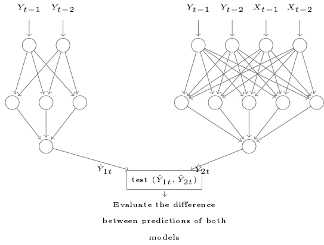

::: article
# Introduction

The study of dependencies between variables is an important step in the
analysis of multi-variate time series. Not surprisingly, it can be
exploited in causal discovery for financial and neuroscience datasets,
in feature selection to determine the most important variables as inputs
of prediction models, *etc*. Standard measures like correlation and
mutual information are very used for analyzing relationships between
time series. Because these measures are symmetrical, they do not provide
enough information concerning the transfer of information over time from
one variable to another one. Therefore, in cases where we are interested
in approximating non-symmetrical dependencies between variables,
causality is more adequate than correlation measures.

In the literature, two main causality measures have been well
investigated in the field of time series analysis; the Granger causality
test [@granger1980], and the Transfer entropy [@schreiber2000]. The
Granger causality is based on the principle that a variable causes
another variable if it contains useful information in terms of
prediction. Consequently, it is mainly linked to the idea of using of a
prediction model to test the causality. The Transfer entropy in the
other hand is based on information theory and has gained an increasing
attention during recent years. It measures the flow of information
between variables using the conditional Shannon entropy. Although these
two measures seem radically different, an interesting finding has been
presented in [@barnett2009] showing that they are equivalent for
variables that follow a normal distribution. In addition, Transfer
entropy is considered as a non-linear alternative for the Granger
causality, since it does not model the relationships between variables
using a statistical model, instead, it is based on information theory.

This article covers a theoretical description of methods implemented in
the *NlinTS* package [@NlinTS]. Particularly, we focus on methods and
models that are related to causality measures. This package includes the
Granger causality test. To deal with non-linear dependencies between
time series, we propose an non-linear extension of the Granger causality
test using feed-forward neural networks. The package includes also an
implementation of Transfer entropy. Two versions are provided, one for
discrete variables, and the second is an estimate for continuous
variables based on the k-nearest neighbors approach
[@kraskov2004estimating]. Therefore, We detail the Granger causality
test, the proposed non-linear Granger causality test, the VARNN (Vector
Auto-Regressive Neural Network) model, since it is used in the later.
Then, we represent the Transfer entropy, including the original
formulation and the continuous estimation, starting by the estimate of
the entropy and the mutual information, because they will be useful to
understand the Transfer entropy estimator.

It is worth to mention that there are several R packages that contain an
implementation of the Granger causality test, such as
[*vars*](https://CRAN.R-project.org/package=vars) [@vars],
[*lmtest*](https://CRAN.R-project.org/package=lmtest) [@lmtest].
However, for Transfer entropy, especially for the continuous estimation,
we found only the
[*RTransferEntropy*](https://CRAN.R-project.org/package=RTransferEntropy)
package [@RTransferEntropy]. The approach used for estimating the
Transfer entropy for continuous variables is based on discretization
methods, by transforming continuous variables to discrete, then,
applying Shannon Transfert entropy. In this paper, our approach is based
on the same principle proposed in @kraskov2004estimating to estimate the
mutual information, which inherits from the Kozachenko-Leonenko
estimator of the Shannon entropy.

The organization of the paper is as follows, the two first sections are
for the theoretical formulation of the causality tests and the Transfer
entropy measures. The third section provides R code examples of the
presented measures, illustrating the usage of the implemented methods.
Finally, the last section summarizes this paper.

# The Granger causality test {#suseb:gc}

The Granger causality test [@granger1980] is the classical method to
test the causality between time series. To test if a variable $X$ causes
another variable $Y$, the principle of this test is to predict $Y$ using
its own history, and to predict it using it history plus the history of
the variable $X$, and finally to evaluate the difference between these
two situations to see if the added variable has some effect on the
predictions of the target variable.

Formally, two VAR (p) (Vector Auto-Regressive) models are considered.
The first one uses the precedent values of $Y$, and the second uses both
passed values of $X$ and $Y$ in order to predict $Y$:
$$\begin{aligned}
\text{Model}_1 \quad Y_t &=\alpha_{0}  + \sum_{i=1}^{p}{\alpha_{i}Y_{t-i} } + U_{t}, \\
\text{Model}_2 \quad Y_t &=\alpha_{0}  + \sum_{i=1}^{p}{\alpha_{i}Y_{t-i} } + \sum_{i=1}^{p}{\beta_{i}X_{t-i} } + U_{t},
\end{aligned}$$
where $p$ is the lag parameter, $[\alpha_0, \dots, \alpha_p]$ and
$[\beta_0, \dots, \beta_p]$ are the parameters of the models, and $U$ is
a white noise error term.

To quantify the causality, we have to evaluate the variances of the
errors of Model$_1$ and Model$_2$. In this case, the Granger causality
index (GCI) can be used, and it is expressed as follows:
$$\text{GCI} = log
\left(\frac{\sigma_1^2}{\sigma_2^2}\right),$$

where $\sigma_1^2$ and ${\sigma_2}^2$ are the variances of the errors of
Model$_1$ and Model$_2$ *resp*. In order to evaluate the statistical
significance of the difference between these variances, the Fisher test
can be used, where the statistic is as follows:
$$F = \frac{\left(RSS_1 - RSS_2\right) / p}{RSS_2 / \left(n - 2p - 1\right)}.$$
RSS$_1$ and RSS$_2$ are the residual sum of squares related to Model$_1$
and Model$_2$ *resp*., and $n$ is the size of the lagged variables. Two
hypotheses have to be considered:

-   $H_0$: $\forall i \in \{1,\dots, p\}, \beta_{i} = 0$,
-   $H_1$: $\exists i \in \{1,\dots, p\},$ $\beta_{i} \neq 0$.

$H_0$ is the hypothesis that $X$ does not cause $Y$. Under $H_0$, $F$
follows the Fisher distribution with $\left(p, n - 2p - 1\right)$ as
degrees of freedom.

# A non-linear Granger causality test {#suseb:ngc}

Using artificial neural networks (ANNs) may be very important when
computing causalities, especially for time series that change
non-linearly over time. We take advantage from the characteristics of
ANNs and propose an implementation of an extended version of the Granger
causality test using the VARNN model. Before describing the proposed
causality test, let us first present briefly the VARNN model which is
also available in the package as a prediction model.

#### The VARNN model:

Consider a training dataset that consists of a multivariate time series
containing one target variable $Y$, and $k$ predictor variables
$\{Y_{1}, \dots, Y_{k}\}$. The VARNN (p) model is a multi-layer
perceptron neural network model that takes into account the $p$ previous
values of the predictor variables and the target variable ($Y$) in order
the predict future values of $Y$. We made this choice to allow for the
possibility of predicting each target variable with a specific set of
predictors, since target variables do not necessarily have the same
predictors. First, the model reorganizes the data in a form of a
supervised learning form with respect to the lag parameter. The
optimization algorithm used to update the weights of the network is
based on the Stochastic Gradient Descent (SGD) algorithm. The Adam
algorithm can also be used to update the learning rate while using SGD
[@Adam]. The global function of the VARNN ($p$) can be written as
follows:

$$\begin{aligned}
Y_t &=\Psi_{nn} \left(Y_{t-1}, \dots, Y_{t-p}, \dots,  Y_{k\left(t-1\right)}, \dots, Y_{k\left(t-p\right)}\right) +  U_{t},
\end{aligned}$$
where $\Psi_{nn}$ is the network function, and $U_{t}$ represents the
error terms.

#### A causality test using the VARNN model:

Consider two variables $X$ and $Y$. Similarly to the Granger causality,
to test the causality from $X$ to $Y$, two prediction models are
considered, the first takes into account the passed values of the target
time series, and the second takes the passed values of the target and
the predictor time series,

$$\begin{aligned}
    \text{Model}_1: \quad Y_{t} &=  \Psi_{1nn} \left(Y_{t-1}, \dots, Y_{t-p}\right) + U_{t}, \\
    \text{Model}_2: \quad Y_{t} &=  \Psi_{2nn} \left(Y_{t-1}, \dots, Y_{t-p}, X_{t-1}, \dots, X_{t-p}\right) + U_{t},
\end{aligned}$$

where $\Psi_{1nn}$ and $\Psi_{2nn}$ are the network functions of
Model$_1$ and Model$_2$ *resp*., using the VARNN model. Then, we
evaluate the difference between these two models by comparing the
residual sum of squares of their errors, and the evaluation is carried
out using the Fisher test to examine the null hypothesis (the hypothesis
that $X$ does not cause $Y$). Figure [1](#fig:caus-nn) shows an
illustration of the used structure of the causality model.

The difference compared to the classical test, is that instead of using
$2$ VAR models (univariate and bivariate), two VARNN models are used.
Therefore, we have to change the statistic of the Fisher test because
there are more parameters in the VARNN models than in the VAR model. In
this case, the statistic of test is as follows:

$$F = \frac{\left(RSS_1 - RSS_2\right) / \left(d_2 - d_1\right)}{RSS_2 / \left(n - d_2\right)},$$
where $d_1$ and $d_2$ are the number of parameters of the univariate and
the bivariate model *resp*. They depend on the chosen structure (number
of layers and of neurons).

Let us emphasize an important point about this causality. It is evident
that computing causalities using ANNs may has the classical drawback of
increasing the computational time. This is not exactly precise in some
cases, because suppose that we have a large number of time series and we
have to compute causalities between all variables. Also, suppose that
relationships between variables change over time. Therefore, this
implies that we need to recalculate the causalities periodically or
after each change. In addition, the basic formulations of the classical
causality measures (Granger causality test and Transfer entropy) are not
adaptive, which means they do not make it possible to update the new
values by using the old ones. In the other hand, with ANNs, the first
computation of causalities may be slow compared to the Granger test or
the Entropy Transfer, but if we have new observations in the time
series, the model adapts more quickly thanks to the learning properties
of ANNs.

<figure id="fig:caus-nn">


<figcaption>Figure 1: Illustration of the ANN model for the Granger
causality test.</figcaption>
</figure>

# Transfer entropy {#suseb:dTE}

Transfer entropy [@schreiber2000] between two time series $X$ and $Y$,
measures the information flow from $X$ to $Y$. It was developed to
overcome the main drawback of mutual information, which provides the
common information between two variables (symmetric measure), but does
not consider the transfer of information from one variable to the other.
To avoid this problem, time delay parameters are included in the
equation of the mutual information to specify the direction of
information:
$$\begin{aligned}
T_{X \to Y} &= \sum_{Y_t,Y^{q}_t,X^{p}_t}{P\left(Y_t,Y^{q}_t,X^{p}_t\right)  log \left(\frac{P \left(Y_t \mid Y^{q}_{t}, X^{p}_{t}\right)}{P \left(Y_t \mid Y^{q}_{t}\right)}\right)} \\
	            & = I \left(Y_t; X_{t}^{p}| Y_{t}^{q}\right),
\end{aligned}$$

where $Z^{l}_t = \left(Z_{t-1},\ldots,Z_{t-l}\right)$ for $Z = X, Y$,
$p, q$ are the time delay parameters for $X$ and $Y$ *resp*., $P$
represents the probability, and $I$ represents the mutual information
symbol. The transfer entropy can also be seen as the difference between
two conditional entropies, where in the first one, only past values of
$Y$ are used, and in the second, both $X$ and $Y$ are considered:
$$\begin{aligned}
TE_{X \to Y} &= H\left (Y_t | \left(Y_{t-1}, \dots, Y_{t-q}\right)\right) \\
            & -  H\left(Y_t | \left(Y_{t-1}, \dots, Y_{t-q}\right), (X_{t-1}, \dots, X_{t-p}\right)),
\end{aligned}$$

where $H$ represents the conditional entropy. Note that this expression
resembles, in some sense, the principle of the Granger causality test
which compares two prediction models.

## A continuous estimation of Shannon Transfer entropy {#suseb:cTE}

In this section, we describe the estimation of Transfer entropy based on
the k-nearest neighbors. First, we show the entropy estimator
represented in @kraskov2004estimating. Then, we show the mutual
information estimator that is based on an extended formulation based on
the same principal. Then, we use this approach to estimate the Transfer
entropy.

#### Entropy estimation {#par:contentropy}

The basic approach for estimating the entropy of continuous variables is
based on binning the data, in order to get back to the classical
definition of Shannon entropy. However, more efficient approaches are
proposed by estimating directly the continuous entropy:
$$\begin{aligned}
H\left(X\right) = -\int{p\left(x\right)log \left(x\right) dx},
\end{aligned}$$

where $p$ represents the density function of $X$. One estimation of the
continuous entropy of a random variable $X$ with $n$ realizations is the
expected value of $log \left(p\left(X\right)\right)$:
$$\begin{aligned}
\hat{H}\left(X\right) = -\frac{1}{n}\sum_{1}^{n}{\hat{log \left(p\left(x_i\right)\right)}}
\end{aligned}$$

The main point of the Kozachenko-Leonenko estimator to approximate
$log \left(p\left(x_i\right)\right)$ by considering $p\left(x_i\right)$
constant in the sphere centered at $x_i$, with radius the distance from
$x_i$ to the k-nearest neighbors of each point. We do not show the
details of the mathematical proof, but just the obtained formula:
$$\begin{aligned}
\label{eq:entr}
\hat{H}\left(X\right) = \Gamma \left(n\right) -\Gamma \left(k\right)  + log \left(c\right) + \frac{m}{n} \sum_{i=1}^{n}{d_i},
\end{aligned}   (\#eq:entr)$$

where $\Gamma$ is the gamma function, $m$ is the dimension of $X$,
*i.e*, the number of variables, $d_i$ is twice the distance from $x_i$
to its $k^{th}$ neighbor, and $c$ is the volume of the unit ball of
dimension $m$. To compute the distances between two points $x_i$ and
$x_j$, we use the max norm, $|x_i - x_j|$, therefore, $c = 1$, and
$log\left(c\right) = 0$. In the rest of the equations, for simplicity,
we neglect this term.

#### Mutual Information estimation {#par:contmi}

The mutual information between two variables $X$ and $Y$ having $n$
observations can be expressed as follows:
$$\begin{aligned}
\label{eq:MI}
I\left(X; Y\right) = H\left(X\right) + H \left(Y\right) - H \left(X, Y\right).
\end{aligned}   (\#eq:MI)$$

It is possible to adopt the Kozachenko-Leonenko approach to estimate the
mutual information. In this case, we need to estimate the individual
entropy of each variable and the joint entropy. For the joint entropy,
it can be computed using the same way by considering the joint space
spanned by $X$ and $Y$. Let $z_i = \left(x_i, y_i\right)$ for $i$
$\in [1,n]$, and $d_i$ be the distance for $z_i$ to its $k^{th}$
neighbor. The estimate of the joint entropy can be expressed as follows:
$$\begin{aligned}
\label{eq:join}
\hat{H}\left(X, Y\right) =  \Gamma \left(n\right) - \Gamma \left(k\right)   + \frac{m_x + m_y}{n} \sum_{i=1}^{n}{d_i},
\end{aligned}   (\#eq:join)$$
where $m_x$ and $m_y$ are the dimensions of $X$ and $Y$.

In @kraskov2004estimating, two new methods have been proposed to improve
the Kozachenko-Leonenko estimator for mutual information. The first
method is based on the idea that when estimating $H\left(X\right)$ and
$H \left(Y\right)$, we do not have to use the same $k$ as used in the
joint entropy, but instead, it is more precise to use the number of
neighbors of each variable separately. Thus, the estimate of the
individual entropy, of $X$ for example, is the following:
$$\begin{aligned}
\label{eq:X}
\hat{H}\left(X\right)  =   \Gamma \left(n\right) - \frac{1}{n}\sum_{i=1}^{n}{\Gamma\left(nx \left(i\right) + 1\right)}  + \frac{m}{n} \sum_{i=1}^{n}{d_i},
\end{aligned}   (\#eq:X)$$

where $nx \left(i\right)$ is the number of points where the distance
from $X_i$ is strictly less than $d_i/2$. As for $Y$,
$\hat{H} \left(Y\right)$ is computed with the same way. Finally, based
on Equations \@ref(eq:MI), \@ref(eq:join) and \@ref(eq:X), the mutual
information estimator is as follows:
$$\begin{aligned}
\label{eq:MIE}
\hat{I}\left(X; Y\right) =  \Gamma \left(k\right) + \Gamma \left(n\right) -  \frac{1}{n}\sum_{i=1}^{n}{\left(\Gamma\left(n_x \left(i\right) + 1\right) + \Gamma\left(n_y \left(i\right) + 1\right)\right)}
\end{aligned}   (\#eq:MIE)$$

Following the same method and generalizing the previous formulation to
$l$ variables$\{X_1, \dots, X_l\}$, the multivariate mutual information
estimator is as follows:
$$\begin{aligned}
\label{eq:MMIE}
\hat{I}\left(X_1, \dots, X_l\right) =  \Gamma \left(k\right) + \left(l-1\right)\Gamma \left(n\right) -  \frac{1}{n}\sum_{i=1}^{n}{\left(\Gamma\left(n_{1}\left(i\right)  + 1\right) + \dots + \Gamma\left(n_{l} \left(i\right)  + 1\right)\right)},
\end{aligned}   (\#eq:MMIE)$$

where $n_{j}\left(i\right)$, for
$\left(j,i\right) \in [1,l] \times [1,n]$, is the number of points where
the distance from the point $X_{ji}$ is strictly less than $d_i/2$.

The motivation behind the second estimator of mutual information
presented in @kraskov2004estimating is that the Kozachenko-Leonenko
estimation of the joint entropy ($H\left(X, Y\right)$ in the bi-variate
case) may be more precise than the first estimator if we consider that
the density is constant in hyper-rectangles instead of hyper-cubes.
Based on this remark, the second estimate of the mutual information of
$l$ variables $\{X_1, \dots, X_l\}$, with $n$ observations, can be
expressed as follows:
$$\begin{aligned}
\label{eq:EMI}
\hat{I}\left(X_1, \dots, X_l \right) =  \Gamma \left(k\right) + \frac{l-1}{k} +  \left(l-1\right)\Gamma \left(n\right) -  \frac{1}{n}\sum_{i=1}^{n}\left({\Gamma\left(n_{1} \left(i\right) + \dots + \Gamma\left(n_{l} (i\right)\right) }\right),
\end{aligned}   (\#eq:EMI)$$

where $n_ {j} \left(i\right)$, for
$\left(j,i\right) \in [1,l] \times [1,n]$, is the number of points where
the distance from the $X_{ji}$ is less (not strictly) than $d_{ji}/2$,
and $d_{ji}$ is the distance from $X_{ji}$ to its $k^{th}$ neighbor.

#### Transfert entropy estimation {#par:tecont}

Let us use the first strategy used by Kraskov for mutual information
estimation to estimate the Transfer entropy. Let $X$ and $Y$ be two time
series. The goal is to estimate the Transfer entropy from $X$ to $Y$,
with time delay parameters $p$ and $q$ *resp*.

$$\label{eq:TE}
\hat{TE}_{X \to Y} = \hat{H}\left(Y_t | Y_{t-1}, \dots, Y_{t-q}\right)
             -  \hat{H}\left(Y_t | \left(Y_{t-1}, \dots, Y_{t-p}\right), \left(X_{t-1}, \dots, X_{t-p}\right)\right).   (\#eq:TE)$$

Consider the following notations :

-   $Y^{m}_{t} = \{Y_{t-1}, \dots, Y_{t-q}\}$
-   $X^{m}_{t} = \{X_{t-1}, \dots, X_{t-p}\}$
-   $Y^{f}_{t}= \{Y_{t}, Y^{m}_{t}\}$
-   $X^{f}_{t} = \{X_{t}, X^{m}_{t}\}$
-   $Z^{m}_{t}= \{Y^{m}_{t}, X^{m}_{t}\}$
-   $Z^{f}_{t}= \{Y^{f}_{t},Y^{m}_{t}, X^{m}_{t}\}$

We can rewrite then Equation \@ref(eq:TE) as follows:
$$\begin{aligned}
\label{eq:cTE}
\hat{TE}_{X \to Y} &= \hat{H}\left(Y_t, Y_p\right) -  \hat{H}\left(Y_t |  X_p, Y_p\right), \\ \nonumber
            & = \hat{H}\left(Y_t, Y_p\right) - \hat{H} \left(Y_p\right) - \hat{H}\left(Y_t,  X_p, Y_p\right) + \hat{H}\left(X_p, Y_p\right)\\ \nonumber
            & = \hat{H}\left(Y^{f}_{t}\right) - \hat{H} \left(Y^{m}_{t}\right) - \hat{H}\left(Z^{f}_{t}\right) + \hat{H}\left(Z^{m}_{t}\right).
\end{aligned}   (\#eq:cTE)$$

The maximum joint space is defined by
$Z^{f}_{t} = \{Y_t,  Y^{m}_{t}, X^{m}_{t}\}$. Consider that $Z^{f}_{t}$
contains $n$ observations. The first step is to computes the distances
$d_i$, *i.e.*, the distance from the point $z_i$ to its $k^{th}$
neighbor, for $i \in [1, n]$. In the same way as estimating mutual
information, we compute the maximal joint entropy
$\hat{H}\left(Z^{f}_{t}\right)$ using the Kozachenko-Leonenko estimator,
and the other terms by projecting the number of neighbors in each
marginal space using the Kraskov approach:

$$\begin{aligned}
  \hat{H}\left(Z^{f}_{t}\right) &=  -\Gamma \left(k\right) + \Gamma \left(n\right)  + \frac{p + q + 1}{n} \sum_{i=1}^{n}{d_i}, \\ \nonumber
  \hat{H}\left(Y^{f}_{t}\right) &=  - \frac{1}{n}\sum_{i=1}^{n}{\Gamma\left(n_{y_f} \left(i\right) + 1\right)} + \Gamma \left(n\right) + \frac{p + 1}{n} \sum_{i=1}^{n}{d_i},\\ \nonumber
  \hat{H}\left(Y^{m}_{t}\right) &=  - \frac{1}{n}\sum_{i=1}^{n}{\Gamma\left(n_{y_m} \left(i\right) + 1\right)} + \Gamma \left(n\right) +  \frac{p}{n} \sum_{i=1}^{n}{d_i},\\ \nonumber
  \hat{H}\left(Z^{m}_{t}\right) &=  - \frac{1}{n}\sum_{i=1}^{n}{\Gamma\left(n_{z_m} \left(i\right) + 1\right)} + \Gamma \left(n\right) + \frac{p + q}{n} \sum_{i=1}^{n}{d_i}, \nonumber
\end{aligned}$$

where $n_{y_f} \left(i\right)$, $n_{y_m} \left(i\right)$ and
$n_{z_m} \left(i\right)$ are the numbers of points where the distance
from the point $Y^f_{i}$, $Y^m_{i}$, and $Z^m_{i}$ *resp*., is strictly
less than $d_i/2$, for $i \in [1, n]$. By replacing each oh these terms
in Equation \@ref(eq:cTE), we obtain:
$$\begin{aligned}
\hat{TE}_{X \to Y} &= \Gamma \left(k\right) - \Gamma \left(n\right) -  \frac{\left(p+1\right) - p - \left(p+q+1\right) + \left(p+q\right) }{n} \sum_{i=1}^{n}{d_i} \\ \nonumber
					& +   \frac{1}{n}\sum_{i=1}^{n}{ \left(- \Gamma\left(n_{y_f} \left(i\right) + 1\right)  +  \Gamma\left(n_{y_m} \left(i\right) + 1\right)  - \Gamma\left(n_{z_m} \left(i\right) + 1\right)\right)}, \nonumber
\end{aligned}$$

By simplifying this expression, the Transfer entropy estimator can be
expressed as follows:
$$\begin{aligned}
\hat{TE}_{X \to Y} & = \Gamma \left(k\right) - \Gamma \left(n\right) +   \frac{1}{n}\sum_{i=1}^{n}{ \left(\Gamma\left(n_{y_m} \left(i\right) + 1\right) - \Gamma\left(n_{y_f} \left(i\right) + 1\right)   - \Gamma\left(n_{z_m} \left(i\right) + 1\right)\right)}.
\end{aligned}$$

And this is the classical Transfer entropy estimator investigated and
discussed in @vicente2011transfer
[@lizier2014jidt; @zhu2015contribution].

## Normalizing the Transfer entropy

The values obtained by the Transfer entropy (TE) are not normalized, and
practically, it is hard to quantify the causality in this case.
Normalizing the values of TE between $0$ and $1$ simplifies the
interpretation of the amounts of transferred information. For discrete
data, The Transfer entropy from a variable $X$ to a variable $Y$ has a
maximum value $H\left(Y_t|Y^{m}_{t}\right)$. Thus, the normalized TE
(NTE) can be obtained by dividing TE by its maximum value:
$$\begin{aligned}
\label{eq:NTE}
NTE = \frac{\hat{H}\left(Y_t | Y^{m}_{t}\right) - \hat{H}\left(Y_t | Y^{m}_{t},X^{m}_{t} \right)}{\hat{H}\left(Y_t | Y^{m}_{t}\right)}
\end{aligned}   (\#eq:NTE)$$

In @gourevitch2007, a preparation step is added to compute NTE to
consider data that contain noise. It consists of subtracting first the
average of TE by shuffling the variable $X$ several times (rearranged it
randomly):
$$\begin{aligned}
NTE = \frac{TE_{X \to Y} - \sum_{i=1}^{n}{TE_{X_{shuffled} \to Y}}}      {\hat{H}\left(Y_t | Y^{m}_{t}\right)}
\end{aligned}$$

In the package, we implemented just the first normalization (*cf.*
Equation \@ref(eq:NTE)), because the second one depends on the way of
shuffling the variable $X$. But it can be obtained easily by computing
the NTE with the original variables, and the average of NTE with several
shuffled variables of $X$.

Concerning continuous Transfer entropy, the term
$\hat{H}\left(Y_t | Y^{m}_{t}\right)$ may be negative, which means that
if we apply the same method to normalize the discrete TE, we will not
obtain values in $[0,1]$. To avoid this problem, we adopt another
approach presented in @Duan2013:
$$\begin{aligned}
NTE = \frac{TE_{X \to Y} - \sum_{i=1}^{n}{TE_{X_{shuffled} \to Y}}}      {{H}_0 - \hat{H}\left(Y_t | Y^{m}_{t}\right)},
\end{aligned}$$

where $H_0$ is the maximum entropy of $Y$ by considering the uniform
distribution, *i.e*., $H_0 = log \left(Y_{max} - Y_{min}\right)$, and
$Y_{max}$ and $Y_{min}$ are the maximum and the minimum values of $Y$.

# R code examples

In this section, we demonstrate worked examples about the usage of the
methods implemented in the package and discussed theoretically in the
two previous sections. We use financial time series from the package
[*timeSeries*](https://CRAN.R-project.org/package=timeSeries)
[@timeSeries]. We will present the classical Granger causality test, the
VARNN prediction model, and the proposed non-linear Granger causality
test. These functionalities are provided via
[*Rcpp*](https://CRAN.R-project.org/package=Rcpp) modules. We present
also the functions associated to Transfer entropy measures, including
the discrete and continuous estimate. Since other entropy measures are
implemented, we will present them as well, such as the entropy and the
mutual information.

## The Granger causality test {#the-granger-causality-test}

The `causality.test` module is based on an *Rcpp* module. The two first
arguments of the constructor of this module are two numerical vectors,
(the goal is to test if the second vector causes the first one). The
third argument is the lag parameter, which is an integer value. The last
argument is logical (false by default) for the option of making data
stationary using the Augmented Dickey-Fuller test, before performing the
causality test.

``` r
library (timeSeries)
library (NlinTS)
data = LPP2005REC
# Construct the causality model from the second column to the first one,
# with a lag equal to 2, and without taking into account stationarity
model = causality.test (data[,1], data[,2], 2, FALSE)
```

The `causality.test` module has a `summary` method to show all the
results of the test, and $3$ properties: the Granger causality index;
`gci` (*cf.* [2](#suseb:gc)), the statistic of the test (`Ftest`), and
the p-value (the probability of non causality) of the test (`pvalue`).

``` r
# Compute the causality index, the Ftest, and the pvalue of the test
model$summary ()
model$gci
model$Ftest
model$pvalue
```

## The VARNN model

The `varmlp` module represents the implementation of the VARNN model. It
is an *Rcpp* module, where the constructor takes as arguments a
numerical Dataframe. Each column represents a variable, and the first
column is the target variable. Note that the Dataframe may contain one
column. In this case, the model will be univariate (ARNN model). The
second argument is the lag parameter, then, a numerical vector
representing the size of the hidden layers of the network, then, an
integer argument for the number of iterations to train the model. Other
arguments with default values are available about using the bias neuron,
the activation functions to use in each layer, the learning rate, and
the optimization algorithm. More details about these arguments can be
found in the manual of the package [@NlinTS].

``` r
library (timeSeries)
library (NlinTS)

# Load the data
data = LPP2005REC

# The lag parameter
lag = 1

# The training set
train_data = data[1:(nrow (data) - 1), ]

# Build and train the model
model = varmlp (train_data, 1, c(10,5), 100)
```

The `varmlp` module has $3$ methods. The method named `forecast` compute
predictions from an input `dataframe`, in other words, to test the
model. And a method `train` update the parameters of the model from new
data.

``` r
# Predict the last row of the data
predictions = model$forecast (train_data)

# Show the predictions
print (predictions[nrow (predictions),])

# Update the model (two observations are required at least since lag = 1)
model$train (data[nrow (data) - lag: nrow (data)])
```

## The non-linear Granger causality test

Similarly to the previous test, the `nlin_causality.test` is an *Rcpp*
module. The two first arguments of the constructor of this module are
two numerical vectors, (the goal is to test if the second causes the
first). The third argument is the lag parameter. The next two arguments
are two numerical vectors representing the size of the hidden layers
used in models $1$ and $2$, *resp*. The next argument is an integer for
the number of the iterations to train the networks. Similarly to the
`varmlp` model, other arguments with default values are available about
the bias neuron, the activation functions, the learning rate, and the
optimization algorithm. The manual of the package contain more details
concerning these arguments [@NlinTS]. The following is an example of
using the non-linear causality test:

``` r
library (timeSeries)
library (NlinTS)
data = LPP2005REC
# Build and train the  model 
model = nlin_causality.test (data[,1], data[,2], 2, c(2), c(4))
```

The `nlin_causality.test` module returns the same values as the
`causality.test`; a `summary` method to show all the results of the
test, and $3$ properties; the Granger causality index (`gci`), the
statistic of the test (`Ftest`), and the p-value of the test (`pvalue`).

``` r
# Compute the causality index, the Ftest, and the pvalue of the test
model$summary ()
model$gci
model$Ftest
model$pvalue
```

## The discrete entropy

The function `entropy_disc` permits to compute the Shannon entropy,
where the first argument is a discrete vector, and the second argument
is the logarithm function to use ($log_2$ by default):

``` r
library (NlinTS)
# The entropy of an integer vector
print (entropy_disc (c(3,2,4,4,3)))
```

## The continuous estimation of the entropy

The function `entropy_disc` permits to compute the continuous estimation
of Shannon entropy, where the first argument is a numerical vector, and
the second argument is the number of neighbors (see
[4.1.0.1](#par:contentropy)):

``` r
library (timeSeries)
library (NlinTS)
# Load data
data = LPP2005REC
# The entropy of the first column with k = 3
print (entropy_cont (data[,1], 3))
```

## The discrete mutual information

The function `mi_disc` permits to compute the Shannon multivariate
mutual information, where the first argument is an integer dataframe,
and the second argument is the logarithm function to use ($log_2$ by
default):

``` r
library (NlinTS)
# Construct an integer dataframe with 2 columns
df = data.frame (c(3,2,4,4,3), c(1,4,4,3,3))
# The mutual information between columns of df
mi = mi_disc (df)
print (mi)
```

## The continuous estimation of the mutual information

The function `mi_cont` permits to compute the continuous estimate of the
mutual information between two variables. The two first arguments are
two vectors, and the third argument is the number of neighbors (see
[4.1.0.2](#par:contmi)):

``` r
library (timeSeries)
library (NlinTS)
# Load data
data = LPP2005REC
# The mutual information between of the two first columns of the data with k = 3
print (mi_cont (data[,1], data[,2], 3))
```

## The discrete Transfer entropy

The function associated to the discrete TE is named `te_disc`. The two
first arguments are two integer vectors. Here we allow the two time
series to have different lag parameters. Therefore, the second two
arguments are the lag parameters associated to the first and the second
arguments *resp*. The next argument indicates the logarithm function to
use ($log_2$ by default). The last argument is logical for the option of
normalizing the value of TE, with a false value by default. The
`te_disc` function returns the value of Transfer entropy from the second
variable to the first variable:

``` r
library (NlinTS)
# The transfer entropy between two integer vectors with lag = 1 to 1
te = te_disc (c(3,2,4,4,3), c(1,4,4,3,3), 1, 1)
print (te)
```

## The continuous estimation of the Transfer entropy

The associated function is named `te_cont`. The two first arguments are
two vectors. Then, the second two arguments are the associated lag
parameters for the first and the second arguments *resp*. The fifth
argument is the number of neighbors. The last argument is logical for
the option of normalizing the value of TE, with a false value by
default. The `te_cont` function returns the value of Transfer entropy
from the second variable to the first one:

``` r
library (timeSeries)
library (NlinTS)
# Load data
data = LPP2005REC
# The transfer entropy between two columns with lag = 1 and k = 3
te = te_cont (data[,1], data[,2], 1, 1, 3)
print (te)
```

# Conclusion

In this paper, we have presented methods of our *NlinTS* package for
computing causalities in time series. We have considered two main
measures well studied in the literature, the Granger causality test and
the Transfer entropy. The Transfer entropy is originally formulated for
discrete variables. For continuous variables, we adopted a k-nearest
neighbors estimation based on the same strategy used to estimate the
Mutual Information in @kraskov2004estimating. To deal with non-linear
time series, we have proposed another causality measure as an extension
of the Granger causality test using an artificial neural network.
Finally, we showed examples for the usage of these methods.
:::
