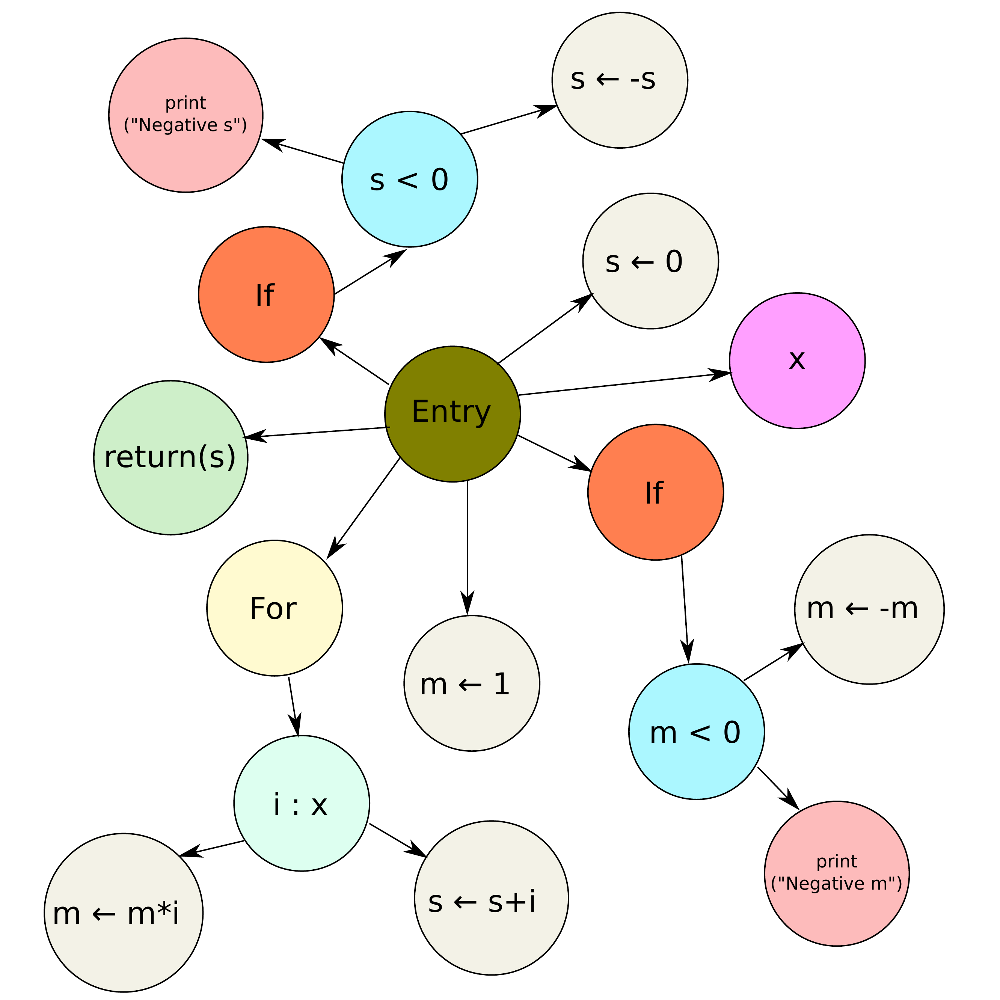
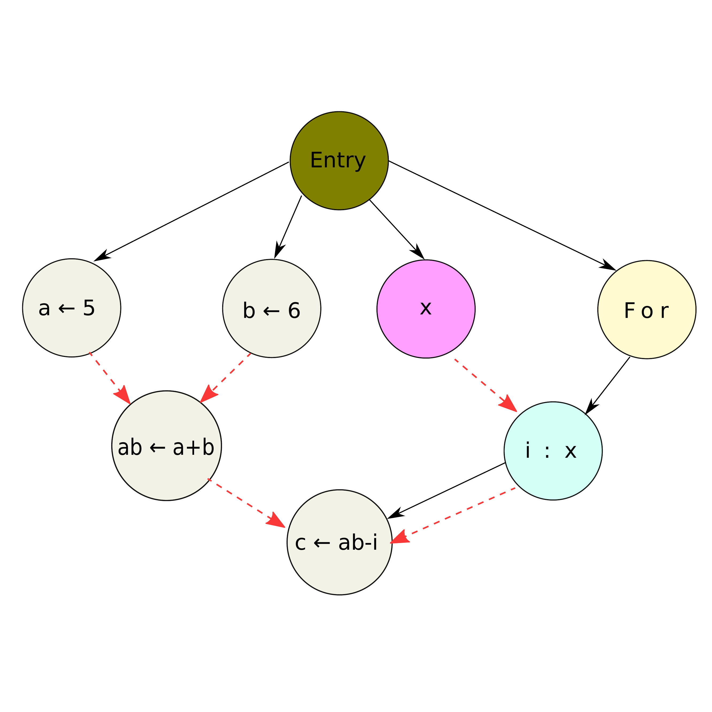
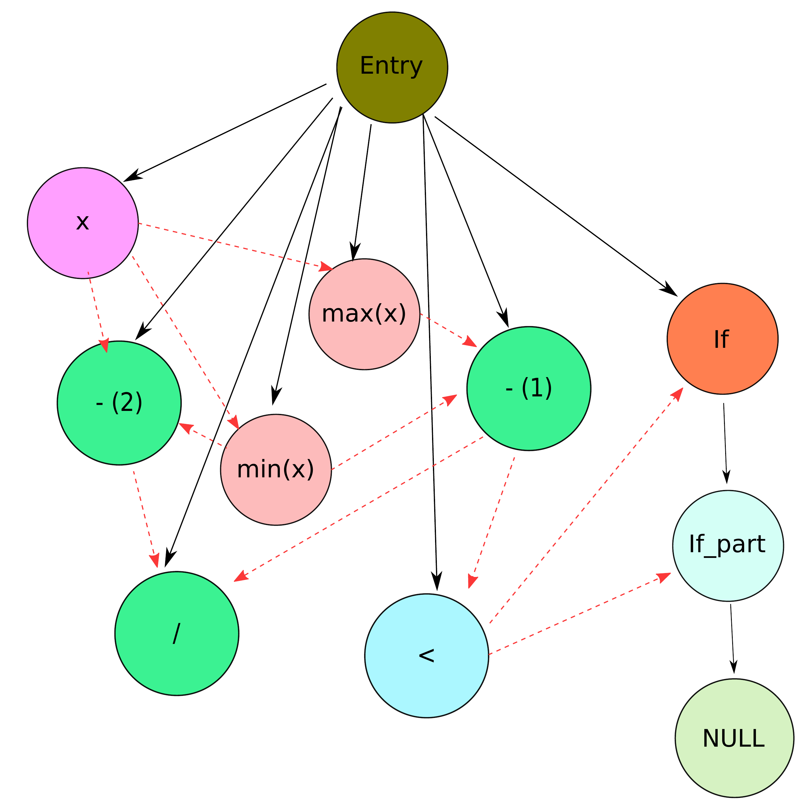
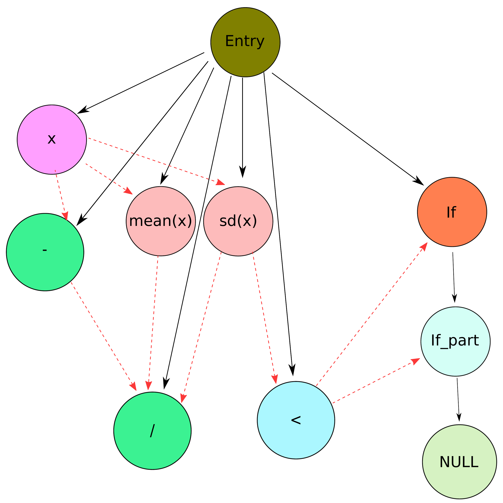

::: article
# Introduction {#sec:intro}

In recent years there has been a rise in the availability of tools
related to code quality, including inspecting run-time memory
usage [@10.5555/2342821.2342849], evaluating unit tests
coverage [@testing], discovering abstract topics to which source code is
related [@6178887; @5069496; @McBurney:2014:ITM:2597008.2597793; @Linstead:2007:MCC:1321631.1321709; @Maskeri:2008:MBT:1342211.1342234],
finding parts of code related to a particular bug
submission [@Lukins:2008:SCR:1447565.1448044], and checking for
similarities between programs. With regards to the latter, quantitative
measures of similarity between source code chunks play a key role in
such practically important areas as software engineering, where
encapsulating duplicated code fragments into functions or methods is
considered a good development practice or in computing education, where
any cases of plagiarism should be brought to a tutor's attention, see
[@Misic2016; @Noor2017; @Roy:2009:CEC:1530898.1531101; @Rattan20131165; @Ali_overviewand; @Hage:2011:PDJ:2043594.2043597; @martins_et_al:OASIcs:2014:4566].
Existing approaches towards code clone detection can be classified based
on the abstraction level at which they inspect programs' listings.

-   *Textual* -- the most straightforward representation, where a
    listing is taken as-is, i.e., as raw text. Typically, string
    distance metrics (like the Levenshtein one; see, e.g., [@Loo]) are
    applied to measure similarity between pairs of the entities tested.
    Then some (possibly approximate) nearest neighbour search data
    structures seek matches within a larger code base. Hash functions
    can be used for the same purpose, where fingerprints of code
    fragments might make the comparison faster, see, e.g.,
    [@Johnson:1993:IRS:962289.962305; @Manber94findingsimilar; @EffectiveCloneDetection].
    Another noteworthy approach involves the use of Latent Semantic
    Analysis [@Marcus:2001:IHC:872023.872542] for finding natural
    clusters of code chunks.
-   *Lexical* (token-based) -- where a listing is transformed into
    tokens, which are generated by the parser during the lexical
    analysis stage. This form is believed to be more robust than the
    textual one, as it is invariant to particular coding styles
    (indentation, layout, comments, etc.). Typically, algorithms to
    detect and analyse common token sub-sequences are used
    [@1019480; @1183002; @1610609; @Wise:1992:DSS:135250.134564; @Prechelt:00; @Hummel:2011:IMC:1985404.1985409; @Schleimer:2003:WLA:872757.872770].
-   *Syntactic* -- an approach based on abstract syntax trees (ASTs).
    Contrary to the previous representation, which is "flat" by its
    nature, here the code is represented in a hierarchical manner. This
    makes it possible to, for instance, distinguish between a top-level
    statement and a code block that is executed *within* the `else`
    clause of an `if-else` construct. One way to quantify the similarity
    of ASTs is to find common sub-trees. This might be an uneasy task,
    therefore, e.g., in [@Baxter:1998:CDU:850947.853341] a hash function
    is used to project a sub-tree into a discrete single value, so that
    only the sub-trees in the same bucket are compared against each
    other. Another way involves the computation of diverse tree metrics
    (based on node type count, their distribution, connectivity, etc.)
    so that each AST is represented as a feature vector. Then the
    feature vectors can be compared against each other directly in a
    pairwise fashion [@565012; @777743; @wastk] or by means of some
    cluster analysis-based approach [@Jiang:2007:DSA:1248820.1248843].
-   *Semantic* -- the most sophisticated representation involving a set
    of knowledge-based, language-dependent transformations of a
    program's abstract syntax tree. Usually, a data structure commonly
    known as a Program Dependence Graph (PDG) is created, see below for
    more details. In such a data structure, the particular order of
    (control- or data-) *independent* code lines is negligible. A
    popular approach to measure similarity between a pair of PDGs
    concerns searching for (sub)isomorphisms of the graphs, see
    [@Komondoor:2001:USI:647170.718283; @Liu:2006:GDS:1150402.1150522; @Qu:2014:PMC:2564929.2564999].

There are a few generally available software solutions whose purpose is
to detect code clones, e.g., MOSS (see
<http://theory.stanford.edu/~aiken/moss/> and
[@Schleimer:2003:WLA:872757.872770]) and JPlag (see <http://jplag.de/>
and [@Prechelt:00]), see also [@Misic2016; @Vandana2018] for an
overview. These tools are quite generic, offering built-in support for
popular programming languages such as Java, C#, C++, C, or Python.

Unfortunately, there is no package of this kind that natively supports
the R language, which is the GNU version of S (see, e.g.,
[@Chambers1998:BlueBook; @SPro]). It is a serious gap: R is amongst the
most popular languages[^1], and its use has a long, successful track
record, particularly with respect to all broadly-conceived statistical
computing, machine learning, and other data science activities
[@RDScience]. With some pre-processing, MOSS and JPlag *can* be applied
on R code chunks, but the accuracy of code clones detection is far from
optimal. This is due to the fact that, while at a first glance being an
imperative language, R allows plenty typical functional constructs (see
the next section for more details and also, e.g.,
[@ProgrammingData; @AdvancedR; @Chambers2008:SoftDA]). On the one hand,
its syntax resembles that of the C language, with curly braces to denote
a nested code block and classical control-flow expressions such as
`if..else` conditionals, or `while` and `for` (for each) loops. On the
other hand, R's semantics is based on the functional Scheme
language [@AbelsonSussman], which is derived from Lisp. Every expression
(even one involving the execution of a `for` loop) is in fact a call to
a function or any combination thereof, and each function is a
first-class object that (as a rule of thumb) has no side effects.
Moreover, users might choose to prefer applying
*Map--Filter--Reduce*-like expressions on container objects instead of
the classical control-flow constructs or even mix the two approaches.
Also, the possibility of performing the so-called *nonstandard
evaluation* (metaprogramming) allows to change the meaning of certain
expressions during run-time. For instance, the popular forward-pipe
operator, `%>%`, implemented in the
[*magrittr*](https://CRAN.R-project.org/package=magrittr) [@magrittr]
package, allows for converting a pipeline of function calls to a
mutually nested series of calls.

In this paper we describe a new algorithm that aims to fill the
aforementioned gap (based on [@BartoszukPhd2018]). The method's
implementation is included in the
[*SimilaR*](https://CRAN.R-project.org/package=SimilaR)[^2] package. It
transforms the analysed code base into a Program Dependence Graph that
takes into account the most common R language features as well as the
most popular development patterns in data science. Due to this, the
algorithm is able to detect cases of plagiarism quite accurately.
Moreover, thanks to a novel, polynomial-time approximate graph
comparison algorithm, its implementation has relatively low run-times.
This enables to conduct an analysis of a software repository whose size
is significant.

This paper is set out as follows. First we introduce the concept of a
*Program Dependence Graph* along with its R language-specific
customisations. Then we depict a novel algorithm for quantifying
similarity of two graphs. Further on we provide some illustrative
examples for the purpose of showing the effects of applying particular
alterations to a Program Dependence Graph. What is more, we demonstrate
the main features of the *SimilaR* package version 1.0.8. Then we
perform an experiment involving the comparison of the complete code-base
of two CRAN packages.

# Program Dependence Graph {#sec:pdg}

A *Program Dependence Graph* (PDG) is a directed graph representing
various relations between individual expressions in a source code chunk.
As we mentioned in the introduction, it is among the most sophisticated
data structures used for the purpose of code clones detection. First
proposed by [@Ferrante:1987:PDG:24039.24041], it forms the basis of many
algorithms, see, e.g.,
[@Liu:2006:GDS:1150402.1150522; @Qu:2014:PMC:2564929.2564999; @Gabel:2008:SDS:1368088.1368132; @Krinke:2001:ISC:832308.837142; @Horwitz:1991:ECP:2697702.2697827; @Komondoor:2001:USI:647170.718283; @JoC; @8387232].

#### Abstract Syntax Tree.

To create a PDG, we first need to construct an *Abstract Syntax Tree*
(AST) of a given program. In R, it is particularly easy to compute the
AST corresponding to any expression, due to its built-in support for
*reflection* that facilitates metaprogramming. For instance, the
`parse()` function can be called to perform lexical analysis of a code
fragment, yielding a sequence of language objects. Moreover, a basic
version of a function to print an AST takes just few lines of code:

``` r
R> show_ast <- function(x) {
+      as.list_deep <- function(x) # convert to a plain list (recursively)
+          { if (is.call(x)) lapply(as.list(x), as.list_deep) else x }
+      x <- substitute(x)   # expression that generated the argument
+      str(as.list_deep(x)) # pretty-print
+  }
```

Let us visualise the AST corresponding to expression
`d <- sum((x-y)*(x-y))`.

``` r
R> show_ast(d <- sum((x-y)*(x-y)))
```

``` r
List of 3
 $ : symbol <-
 $ : symbol d
 $ :List of 2
  ..$ : symbol sum
  ..$ :List of 3
  .. ..$ : symbol *
  .. ..$ :List of 2
  .. .. ..$ : symbol (
  .. .. ..$ :List of 3
  .. .. .. ..$ : symbol -
  .. .. .. ..$ : symbol x
  .. .. .. ..$ : symbol y
  .. ..$ :List of 2
  .. .. ..$ : symbol (
  .. .. ..$ :List of 3
  .. .. .. ..$ : symbol -
  .. .. .. ..$ : symbol x
  .. .. .. ..$ : symbol y
```

In R, both a constant (numeric, logical, string, etc.) and a symbol
(name) constitute what we call a *simple expression*. A *compound
expression* is in turn a sequence of $n+1$ expressions (simple or
compound ones) $\langle f, a_1, \dots, a_n\rangle$, $n\ge 0$, which
represents a call to $f$ with arguments $a_1,\dots,a_n$ (which we are
typically used to denote as $f(a_1, \dots, a_n)$).

The above AST can be written in the Polish (prefix) notation as

$$\left\langle
\text{\tt`{}<-`{}}, \text{\tt d}, \left\langle
    \text{\tt sum}, \left\langle
        \text{\tt`{}*`{}}, \left\langle
%
                \text{\tt`{}-`{}}, \text{\tt x}, \text{\tt y}
%
            \right\rangle,
            \left\langle
%
                \text{\tt`{}-`{}}, \text{\tt x}, \text{\tt y}
%
            \right\rangle
        \right\rangle
    \right\rangle
\right\rangle$$

Such a notation is used in Scheme and Lisp; we skipped a call to `(` for
readability, as `(e)` is equivalent to `e` for each expression `e`.
Alternatively, the above can be written as

$$\text{\texttt{
`{}<-'{}(d, sum(`{}*`{}(`{}-`{}(x, y), `{}-`{}(x, y))))
}}$$

in the "functional" form. Let us emphasise that even an application of a
binary operator (here: `<-`, `*`, and `-`) corresponds to some function
call. Hence `x-y` is just a syntactic sugar for `‘-‘(x, y)`. Moreover,
other expressions such as `if..else` and loops also correspond to some
function calls. For example:

``` r
R> show_ast(for(i in 1:5) {
+      print("i = ", i)
+      if (i %% 2 == 0) print(":)") else print(":$")
+  })
```

``` r
List of 4
 $ : symbol for
 $ : symbol i
 $ :List of 3
  ..$ : symbol :
  ..$ : num 1
  ..$ : num 5
 $ :List of 3
  ..$ : symbol {
  ..$ :List of 3
  .. ..$ : symbol print
  .. ..$ : chr "i = "
  .. ..$ : symbol i
  ..$ :List of 4
  .. ..$ : symbol if
  .. ..$ :List of 3
  .. .. ..$ : symbol ==
  .. .. ..$ :List of 3
  .. .. .. ..$ : symbol %%
  .. .. .. ..$ : symbol i
  .. .. .. ..$ : num 2
  .. .. ..$ : num 0
  .. ..$ :List of 2
  .. .. ..$ : symbol print
  .. .. ..$ : chr ":)"
  .. ..$ :List of 2
  .. .. ..$ : symbol print
  .. .. ..$ : chr ":$"
```

::: {#tab:pdgcolors}
  ---------------------------------------------------------------------------------------------------------------------
    **Id** **Color**      **Type**                                             **Description**
  -------- -------------- --------------------------- -----------------------------------------------------------------
         0 Olive          `Entry `                                    marks the beginning of a function

         1 Light yellow   `Header `                                                 loop

         2 --             `Next `                                                  `next`

         3 --             `Break `                                                 `break`

         4 Orange         `If `                                           a conditional expression

         5 Light blue     `If_part `                               an expression to execute conditionally

         6 Gray           `assignment `                         an assignment expression, e.g., `name <- val`

         7 Violet         `parameter `                                      a function parameter

         8 --             `oneBracketSingle `                 an expression involving `[i]`, e.g., `vector[-1]`

         9 --             `oneBracketDouble `                          an expression involving `[i,j]`

        10 --             `oneBracketTripleOrMore `             an expression involving `[i,j,k,`$\ldots$`]`

        11 --             `twoBrackets `                an expression involving `[[i]]`, e.g., `list[["nameditem"]]`

        12 --             `dollar `                            an expression involving `$`, e.g., `df$column`

        13 --             `funNoArguments `                       a function call with no actual parameters

        14 Red            `funOneArgument `                       a function call with one actual parameter

        15 --             `funTwoArguments `                     a function call with two actual parameters

        16 --             `funThreeArguments `                  a function call with three actual parameters

        17 --             `funFourOrMoreArguments `          a function call with four or more actual parameters

        18 --             `stopifnot `                                     a call to `stopifnot()`

        19 --             `logicalOperator `               a logical operator-based expression, e.g., `&`, or `!`

        20 Green          `arithmeticOperator `        an arithmetic operator-based expression, e.g., `+`, `-` or `*`

        21 Blue           `comparisonOperator `        a comparison operator-based expression, e.g., `==`, `<=` or `<`

        22 Green          `return `                                         a call to `return()`

        23 Cyan           `colon `                           a colon operator-based expression, e.g., `from:to`

        24 Dark green     `symbol `                                            a symbol (name)

        25 Dark green     `constant `                          a constant value, e.g., `1`, `"string"` or `NA`
  ---------------------------------------------------------------------------------------------------------------------

  : Table 1: Assumed Program Dependence Graph vertex types for the R
  language.
:::

#### Vertex and edge types.

The *vertices* of a PDG represent particular expressions, such as a
variable assignment, a function call or a loop header. Each vertex is
assigned its own *type*, reflecting the kind of expression it
represents. The comprehensive list of vertex types for the R language
code-base used in *SimilaR* is given in Table [1](#tab:pdgcolors). The
number of distinct types is a kind of compromise between the algorithm's
sensitivity and specificity. It was set empirically based on numerous
experiments ([@BartoszukPhd2018]).

We may also distinguish two types of edges: *control dependency* and
*data dependency* ones. The former represents the branches in a
program's control flow that result in a conditional execution of
expressions such as `if-else`-constructs or loops. A subgraph of a PDG
consisting of all the vertices and only the *control dependency* edges
is called a *Control Dependence Subgraph* (CDS).

The latter edge vertex type is responsible for modelling data flow
relations: there is an edge from a vertex $v$ to a vertex $u$, whenever
a variable assigned in the expression corresponding to $v$ is used in
the computation of the expression related to $u$. A spanning subgraph of
a PDG that consists solely of the *data dependency* edges is called a
*Data Dependence Subgraph* (DDS).

Hence, a PDG of a function `F()` is a vertex- and edge-labelled directed
graph $F=(V_F, E_F, \zeta_F, \xi_F)$, where $V_F$ is the set of its
vertices, $E_F\subseteq V_F\times V_F$ denotes the set of edges
($(v,u)\in E_F$ whenever there is an edge from $v$ to $u$),
$\zeta_F: V_F\to \{\mathtt{Entry}, \mathtt{Header}, \dots, \mathtt{constant}\}
=\{0,\dots,25\}$ gives the type of each vertex and
$\xi_F: E_F\to \{\mathtt{DATA}, \mathtt{CONTROL}\}$ marks if an edge is
a data- or control-dependency one. Note that each PDG is rooted -- there
exists one and only one vertex $v$ with indegree $0$ and
$\zeta_F(v)=\mathtt{Entry}$.

Example code chunks with the corresponding dependence graphs are
depicted in Figures [1](#fig:CDS) and [2](#fig:PDG). The meaning of
vertex colors is explained in Table [1](#tab:pdgcolors).

<figure id="fig:CDS">
<div class="sourceCode" id="cb1"><pre class="sourceCode r"><code class="sourceCode r"><span id="cb1-1"><a href="#cb1-1" aria-hidden="true" tabindex="-1"></a>sum <span class="ot">&lt;-</span> <span class="cf">function</span>(x)</span>
<span id="cb1-2"><a href="#cb1-2" aria-hidden="true" tabindex="-1"></a>{</span>
<span id="cb1-3"><a href="#cb1-3" aria-hidden="true" tabindex="-1"></a>  s <span class="ot">&lt;-</span> <span class="dv">0</span></span>
<span id="cb1-4"><a href="#cb1-4" aria-hidden="true" tabindex="-1"></a>  m <span class="ot">&lt;-</span> <span class="dv">1</span></span>
<span id="cb1-5"><a href="#cb1-5" aria-hidden="true" tabindex="-1"></a>  <span class="cf">for</span>(i <span class="cf">in</span> x) {</span>
<span id="cb1-6"><a href="#cb1-6" aria-hidden="true" tabindex="-1"></a>    s <span class="ot">&lt;-</span> s <span class="sc">+</span> i</span>
<span id="cb1-7"><a href="#cb1-7" aria-hidden="true" tabindex="-1"></a>    m <span class="ot">&lt;-</span> m <span class="sc">*</span> i</span>
<span id="cb1-8"><a href="#cb1-8" aria-hidden="true" tabindex="-1"></a>  }</span>
<span id="cb1-9"><a href="#cb1-9" aria-hidden="true" tabindex="-1"></a></span>
<span id="cb1-10"><a href="#cb1-10" aria-hidden="true" tabindex="-1"></a>  <span class="cf">if</span>(s <span class="sc">&lt;</span> <span class="dv">0</span>) {</span>
<span id="cb1-11"><a href="#cb1-11" aria-hidden="true" tabindex="-1"></a>    s <span class="ot">&lt;-</span> <span class="sc">-</span>s</span>
<span id="cb1-12"><a href="#cb1-12" aria-hidden="true" tabindex="-1"></a>    <span class="fu">print</span>(<span class="st">&quot;Negative s&quot;</span>)</span>
<span id="cb1-13"><a href="#cb1-13" aria-hidden="true" tabindex="-1"></a>  }</span>
<span id="cb1-14"><a href="#cb1-14" aria-hidden="true" tabindex="-1"></a>  <span class="cf">if</span>(m <span class="sc">&lt;</span> <span class="dv">0</span>) {</span>
<span id="cb1-15"><a href="#cb1-15" aria-hidden="true" tabindex="-1"></a>    m <span class="ot">&lt;-</span> <span class="sc">-</span>m</span>
<span id="cb1-16"><a href="#cb1-16" aria-hidden="true" tabindex="-1"></a>    <span class="fu">print</span>(<span class="st">&quot;Negative m&quot;</span>)</span>
<span id="cb1-17"><a href="#cb1-17" aria-hidden="true" tabindex="-1"></a>  }</span>
<span id="cb1-18"><a href="#cb1-18" aria-hidden="true" tabindex="-1"></a>  <span class="fu">return</span>(s)</span>
<span id="cb1-19"><a href="#cb1-19" aria-hidden="true" tabindex="-1"></a>}</span></code></pre></div>

<figcaption>Figure 1: An example function and the respective Control
Dependence Subgraph.</figcaption>
</figure>

<figure id="fig:PDG">
<div class="sourceCode" id="cb1"><pre class="sourceCode r"><code class="sourceCode r"><span id="cb1-1"><a href="#cb1-1" aria-hidden="true" tabindex="-1"></a>sum <span class="ot">&lt;-</span> <span class="cf">function</span>(x)</span>
<span id="cb1-2"><a href="#cb1-2" aria-hidden="true" tabindex="-1"></a>{</span>
<span id="cb1-3"><a href="#cb1-3" aria-hidden="true" tabindex="-1"></a>   a <span class="ot">&lt;-</span> <span class="dv">5</span></span>
<span id="cb1-4"><a href="#cb1-4" aria-hidden="true" tabindex="-1"></a>   b <span class="ot">&lt;-</span> <span class="dv">6</span></span>
<span id="cb1-5"><a href="#cb1-5" aria-hidden="true" tabindex="-1"></a>   <span class="cf">for</span>(i <span class="cf">in</span> x)</span>
<span id="cb1-6"><a href="#cb1-6" aria-hidden="true" tabindex="-1"></a>   {</span>
<span id="cb1-7"><a href="#cb1-7" aria-hidden="true" tabindex="-1"></a>     c <span class="ot">&lt;-</span> a <span class="sc">+</span> b <span class="sc">-</span> i</span>
<span id="cb1-8"><a href="#cb1-8" aria-hidden="true" tabindex="-1"></a>   }</span>
<span id="cb1-9"><a href="#cb1-9" aria-hidden="true" tabindex="-1"></a>}</span></code></pre></div>

<figcaption>Figure 2: An example function and the corresponding Program
Dependence Graph; solid and dashed arrows represent control and data
dependency edges, respectively.</figcaption>
</figure>

The most basic version of an algorithm to create a PDG based on an
abstract syntax tree is described in [@Harrold93efficientconstruction].
Let us note the fact that a CDS is a subgraph of an AST: it provides the
information about certain expressions being nested within other ones,
e.g., that some assignment is part (child) of a loop's body.
Additionally, an AST includes a list of local variables and links them
with expressions that rely on them. This is a crucial piece of
information used to generate DDS.

Note that, however, a PDG created for the purpose of code clones
detection cannot be treated as a straightforward extension of a raw AST.
The post-processing procedure should be carefully customised taking into
account the design patterns and coding practices of a particular
programming language. Hence, below we describe the most noteworthy
program transforms employed in the *SimilaR* package so that it is
invariant to typical *attacks*, i.e., transforms changing the way the
code is written yet not affecting its meaning.

#### Unwinding nested function calls.

As mentioned above, in R, as in any functional language, functions play
a key role. A code chunk can be thought of as a sequence of expressions,
each of which is composed of function calls. Base or external library
functions are used as a program's building blocks and often very complex
tasks can be written with only few lines of code.

For instance, given a matrix $\mathbf{X}\in\mathbb{R}^{d\times n}$
representing $n$ vectors in $\mathbb{R}^d$ and a vector
$\mathbf{y}\in\mathbb{R}^d$, the closest vector in $\mathbf{X}$ to
$\mathbf{y}$ with respect to the Euclidean metric can be determined by
evaluating `X[,which.min(apply((X-y)^2, 2, sum))]`. This notation is
very concise and we can come up with many equivalent forms of this
expression written in a much more loquacious fashion.

Therefore, in *SimilaR*, hierarchies of nested calls, no matter their
depth, are always recursively unwound by introducing as many auxiliary
assignments as necessary. For instance, `f(g(x))` is decomposed as
`gx <- g(x); f(gx)`. This guarantees that all their possible variants
are represented in the same way in the PDG.

#### Forward-pipe operator, `%>%`

Related to the above is the *magrittr*'s forward-pipe operator, `%>%`,
which has recently gained much popularity within the R users' community.
Even though the operator is just a syntactic sugar for forwarding an
object into the next function call/expression, at the time of writing of
this manuscript, the package has been used as a direct dependency by
over 700 other CRAN packages. Many consider it very convenient, as it
mimics the "left-to-right" approach known from object-orientated
languages like Java, Python or C++. Instead of writing (from the inside
and out) `f(g(x), y)`, with *magrittr* we can use the syntax
`x %>% g %>% f(y)` (which would normally be represented as `x.g().f(y)`
in other languages). To assure proper similarity evaluation, *SimilaR*
unwinds such expressions in the same manner as nested function calls.

#### Calls within conditions in control-flow expressions.

An expression serving as a Boolean condition in an `if` or a `while`
construct might be given as a composition of many function calls. The
same might be true for an expression generating the container to iterate
over in a `for` loop. PDG vertices representing such calls are placed on
the same level as their corresponding control-flow expressions so that
they can be unwound just as any other function call.

#### Canonicalization of conditional statements.

The following code chunk:

``` r
if (cond) {
  return(A)
} else {
  return(B)
}
```

is semantically equivalent to:

``` r
if (cond)
  return(A)
return(B)
```

This exploits the fact that the code after the `if` statement is only
executed whenever the logical condition is false. To avoid generating
very different control dependencies, we always unwind the former to the
latter by putting the code-richer branch outside of a conditional
statement.

#### Tail call to `return()`.

The return value that is generated by evaluating a sequence of
expressions wrapped inside curly braces (the `‘{‘()` function) is
determined by the value of its last expression. If a function's body is
comprised of such a code block, the call to `return()` is optional if it
is used in the last expression. However, many users write it anyway.
Therefore, a special vertex of type `return()` have been introduced to
mark an expression that generates the output of a function.

#### *Map*-like functions.

Base R supports numerous *Map*-like operations that are available in
many programming languages. The aim of the members of the `*apply()`
family (`apply()`, `lapply()`, `sapply()`, etc.) is to perform a given
operation on each element/slice of a given container. These are unwound
as an expression involving a `for` loop. For instance, a call to
`ret <- lapply(l, fun, ...)` can be written as

``` r
ret <- list(); for (el in l) ret[[length(ret)+1]] <- fun(el, ...)
```

#### Variable duplication.

To prevent redundant assignments such as `xcopy <- x` made just in order
to refer to the original value under a new alias, a hierarchical
variable dictionary is kept to generate *data dependency* edges
properly.

#### Memoization.

In pure functional languages it is assumed that functions have no side
effects, i.e., the same arguments are mapped to the same return value.
In R it is of course not always technically true (e.g., when the
pseudo-random number generator is involved), but such an assumption
turns out to be helpful in our context. Therefore, if a function call
instance is invoked more than once, its value is memorised by
introducing a new variable.

#### Dead code.

Many plagiarism detection algorithms can be easily misled by adding
random code that does not affect the main computations. In *SimilaR*,
such *dead code* is identified and removed. This is done by iteratively
deleting all vertices whose outdegree is zero (except those of type
`return`).

To sum up, *SimilaR* guarantees that the Program Dependence Graph is the
same regardless of the order of independent function calls, unwinding
nested function calls, the use of the forward-pipe operator, etc. Hence,
it is invariant to the most typical attacks. Moreover, it has been
implemented in such a way that new kinds of transformations can be
easily added in the future, as the R development practices and common
program design patterns evolve.

# Comparing Program Dependence Graphs {#sec:similar}

In our setting, code similarity assessment reduces to a comparison
between a pair of Program Dependence Graphs. In this section we are
interested in an algorithm $\mu$ such that $\mu(F, G)\in[0,1]$
represents a similarity degree between two PDGs $F$ and $G$. A
similarity of $1$ denotes that two PDGs are identical, while $0$ means
that they are totally different. Alternatively, we might be interested
in a non-symmetric measure $\tilde{\mu}(F,G)\in[0,1]$ representing the
degree to which the source code of $F$ is *contained* within $G$.

Ideally, an algorithm to compare two PDGs should enjoy the following
properties:

-   it should be *flexible* in the sense that introducing a "small
    difference" in one of the graphs should not affect the estimated
    similarity degree significantly;
-   it should be *fast* to execute so that computing numerous pairwise
    similarities can be performed in a reasonable time span.

Due to the latter, we immediately lose our interest in all currently
known *exact* algorithms to find subgraph isomorphisms or maximum common
subgraphs because of their exponential-time complexity (the problems are
NP-hard; see, e.g., [@Complexity]). To recall, two graphs are isomorphic
whenever there exists a mapping between the two graphs' vertices
preserving the node adjacencies.

In the *SimilaR* package, we use a modified version (for increased
flexibility and better performance in the plagiarism detection problem)
of an algorithm described in [@Shervashidze:2011:WGK:1953048.2078187],
which itself is based on the Weisfeiler--Lehman isomorphism test
[@W:L:GraphIsomorphism] and graphs kernels. Note that the base method
has been successfully used in many applications, e.g., in
cheminformatics [@Aaltodoc] and programming autonomous
robots [@Luperto:2019:PGS:3332934.3332962].

In each of the $h$ iterations of the SimilaR algorithm, we assign new
labels to the vertices of a PDG based on their neighbours' labels. While
in the original algorithm [@Shervashidze:2011:WGK:1953048.2078187], two
vertices are considered diverse already when one of their neighbours has
been assigned a different label, here we might still be assigning the
same label if the vertices' adjacency differs only slightly. Our
approach turns out to be more robust [@BartoszukPhd2018] against minor
code changes or some vertices being missing in the graph.

#### SimilaR algorithm at a glance.

Before we describe every step of the algorithm in detail, let us take a
look at it from a bird's-eye perspective. If we are to assign each
vertex a new label that is uniquely determined by their current type as
well the labels allocated to their neighbours, two identical graphs will
always be coloured the same way, no matter how many times we reiterate
the labelling procedure. In particular, after $h$ iterations, a vertex's
label depends on the types of vertices whose distance from it is at most
$h$.

We are of course interested in assigning equivalent labels to vertices
in graphs that are not necessarily identical, but still *similar* to
each other. Otherwise, two vertices which have all but one neighbour in
common, would get distinct labels. After $h$ iterations, all the
vertices at distance at most $h$ would all already be assigned different
colours. This would negatively affect the overall graph similarity
assessment.

In order to overcome this problem, we introduce the concept of vertex
*importance*, which is based upon the number of vertices that depend on
a given node. Only *important enough* differences in the vertex
neighbourhoods will be considered as sufficient to trigger a different
labelling. Then, after $h$ iterations, two vectors of label type counts
can be compared with each other to arrive at a final graph similarity
degree.

#### SimilaR algorithm in detail.

The following description of the SimilaR algorithm will be illustrated
based on a comparison between two functions, `clamp1()` (whose PDG from
now on we will denote with $F=(V_F, E_F, \zeta_F, \xi_F)$, see
Fig. [3](#fig:clamp)) and `standardise()` (denoted
$G=(V_G, E_G, \zeta_G, \xi_G)$, see Fig. [4](#fig:standardise)).

::: {#tab:importancesClamp}
  --------------------------------------------------------------------------------------------------------------------------------
                  $v$   *Entry*      *x*   *min(x)*   *max(x)*   *- (1)*     *\<*     *If*   *If_part*   *NULL*   *- (2)*      */*
  ------------------- --------- -------- ---------- ---------- --------- -------- -------- ----------- -------- --------- --------
    raw $\delta_F(v)$    $7.80$   $3.04$     $1.35$     $1.12$    $0.93$   $0.65$   $0.30$      $0.20$   $0.10$    $0.21$   $0.10$

           normalised    $0.49$   $0.19$     $0.09$     $0.07$    $0.06$   $0.04$   $0.02$      $0.01$   $0.01$    $0.01$   $0.01$
  --------------------------------------------------------------------------------------------------------------------------------

  : Table 2: Vertex importance degrees in `clamp1()` (sum $=15.79$,
  median $=0.04$).
:::

::: {#tab:importancesStandarize}
  ------------------------------------------------------------------------------------------------------------------------
                  $v$   *Entry*      *x*   *sd(x)*     *\<*     *If*   *If_part*   *NULL*   *mean(x)*      *-*      */* 
  ------------------- --------- -------- --------- -------- -------- ----------- -------- ----------- -------- -------- --
    raw $\delta_G(v)$    $4.33$   $1.71$    $0.93$   $0.65$   $0.30$      $0.20$   $0.10$      $0.33$   $0.21$    $0.1$ 

           normalised    $0.49$   $0.19$    $0.10$   $0.07$   $0.03$      $0.02$   $0.01$      $0.04$   $0.02$   $0.01$ 
  ------------------------------------------------------------------------------------------------------------------------

  : Table 3: Vertex importance degrees in `standardise()` (sum $=8.86$,
  median $=0.03$).
:::

::: {#tab:labelsClamp}
  -------------------------------------------------------------------------------------------------------------------
               $v$   *Entry*   *x*   *min(x)*   *max(x)*   *- (1)*   *\<*   *If*   *If_part*   *NULL*   *- (2)*   */*
  ---------------- --------- ----- ---------- ---------- --------- ------ ------ ----------- -------- --------- -----
      $\zeta_F(v)$         0    24         14         14        20     21      4           5       25        20    20

    $\zeta_F^1(v)$         0     1          2          2         3      4      5           6        7         3     3

    $\zeta_F^2(v)$         7     1          2          2         8      3      4           5        0         6     6

    $\zeta_F^3(v)$         8     5          6          6         7      1      2           3        0         4     4
  -------------------------------------------------------------------------------------------------------------------

  : Table 4: `clamp1()`: Labels assigned to vertices in each iteration.
:::

::: {#tab:labelsStandarize}
  -----------------------------------------------------------------------------------------------------
               $v$   *Entry*   *x*   *sd(x)*   *\<*   *If*   *If_part*   *NULL*   *mean(x)*   *-*   */*
  ---------------- --------- ----- --------- ------ ------ ----------- -------- ----------- ----- -----
      $\zeta_G(v)$         0    24        14     21      4           5       25          14    20    20

    $\zeta_G^1(v)$         0     1         2      4      5           6        7           2     3     3

    $\zeta_G^2(v)$         7     1         9      3      4           5        0           2     6     6

    $\zeta_G^3(v)$        12     9        10      1      2           3        0          11     4     4
  -----------------------------------------------------------------------------------------------------

  : Table 5: `standardise()`: Labels assigned to vertices in each
  iteration.
:::

<figure id="fig:clamp">
<div class="sourceCode" id="cb1"><pre class="sourceCode r"><code class="sourceCode r"><span id="cb1-1"><a href="#cb1-1" aria-hidden="true" tabindex="-1"></a>R<span class="sc">&gt;</span> clamp1 <span class="ot">&lt;-</span> <span class="cf">function</span>(x)</span>
<span id="cb1-2"><a href="#cb1-2" aria-hidden="true" tabindex="-1"></a><span class="sc">+</span>  {</span>
<span id="cb1-3"><a href="#cb1-3" aria-hidden="true" tabindex="-1"></a><span class="sc">+</span>    <span class="cf">if</span> (<span class="fu">max</span>(x)<span class="sc">-</span><span class="fu">min</span>(x) <span class="sc">&lt;</span> <span class="fl">1e-5</span>)</span>
<span id="cb1-4"><a href="#cb1-4" aria-hidden="true" tabindex="-1"></a><span class="sc">+</span>      <span class="cn">NULL</span></span>
<span id="cb1-5"><a href="#cb1-5" aria-hidden="true" tabindex="-1"></a><span class="sc">+</span>    <span class="cf">else</span></span>
<span id="cb1-6"><a href="#cb1-6" aria-hidden="true" tabindex="-1"></a><span class="sc">+</span>      (x <span class="sc">-</span> <span class="fu">min</span>(x))<span class="sc">/</span>(<span class="fu">max</span>(x)<span class="sc">-</span><span class="fu">min</span>(x))</span>
<span id="cb1-7"><a href="#cb1-7" aria-hidden="true" tabindex="-1"></a><span class="sc">+</span>  }</span></code></pre></div>

<figcaption>Figure 3: The <code>clamp1()</code> function with the
respective PDG.</figcaption>
</figure>

<figure id="fig:standardise">
<div class="sourceCode" id="cb1"><pre class="sourceCode r"><code class="sourceCode r"><span id="cb1-1"><a href="#cb1-1" aria-hidden="true" tabindex="-1"></a>R<span class="sc">&gt;</span> standardise <span class="ot">&lt;-</span> <span class="cf">function</span>(x)</span>
<span id="cb1-2"><a href="#cb1-2" aria-hidden="true" tabindex="-1"></a><span class="sc">+</span>  {</span>
<span id="cb1-3"><a href="#cb1-3" aria-hidden="true" tabindex="-1"></a><span class="sc">+</span>    <span class="cf">if</span> (<span class="fu">sd</span>(x) <span class="sc">&lt;</span> <span class="fl">1e-5</span>)</span>
<span id="cb1-4"><a href="#cb1-4" aria-hidden="true" tabindex="-1"></a><span class="sc">+</span>      <span class="cn">NULL</span></span>
<span id="cb1-5"><a href="#cb1-5" aria-hidden="true" tabindex="-1"></a><span class="sc">+</span>    <span class="cf">else</span></span>
<span id="cb1-6"><a href="#cb1-6" aria-hidden="true" tabindex="-1"></a><span class="sc">+</span>      (x <span class="sc">-</span> <span class="fu">mean</span>(x))<span class="sc">/</span><span class="fu">sd</span>(x)</span>
<span id="cb1-7"><a href="#cb1-7" aria-hidden="true" tabindex="-1"></a><span class="sc">+</span>  }</span></code></pre></div>

<figcaption>Figure 4: The <code>standardise()</code> function with the
respective PDG.</figcaption>
</figure>

1.  **Vertex importance degrees.** Firstly, each vertex in $F$ is
    assigned an importance degree, $\delta_F: V_F\to\mathbb{R}_+$,
    $$\delta_F(v) = 0.1
    + \sum_{(v,u)\in E_F} \left(
    1+0.1\mathbb{I}_{\xi_F((v,u))=\mathtt{DATA}}
    \right)\delta_F(u),$$
    where $\mathbb{I}_{\text{cond}}$ is an indicator function with value
    $1$ if $\text{cond}$ is true and $0$ otherwise. In other words, a
    vertex $v$ with outdegree equal to $0$ has importance
    $\delta(v) = 0.1$. Otherwise, its importance degree is set to
    $\delta(v) = 0.1$ plus the sum of importances of its outgoing
    control-dependent neighbours plus the sum of importances of its
    outgoing data-dependent neighbours multiplied by $1.1$.

    Note that if $F$ is an acyclic graph, then it has a topological
    ordering, i.e., an arrangement of the vertices such that every edge
    is directed from earlier to later in the sequence. In such a case
    $\delta_F$ is well-defined. Otherwise, we shall be computing the
    importance degrees in the depth-first manner.

    Next, the importance degrees are normalised,
    $\delta_F(v) \mapsto \delta_F(v)/\sum_{u\in V_F} \delta_F(u)$.
    Tables [2](#tab:importancesClamp)
    and [3](#tab:importancesStandarize) give the importance degrees of
    the vertices in the two graphs studied.

2.  **Vertex labels.** Recall from the previous section that each vertex
    $v\in V_F, u\in  V_G$ has been assigned a label,
    $\zeta_F(v),\zeta_G(u)\in\{0,\dots,25\}$, based on the type of
    operation it represents (see Tables [4](#tab:labelsClamp) and
    [5](#tab:labelsStandarize)).

    In the $i$-th (out of $h$ in total, here we fix $h=3$; see
    [@BartoszukPhd2018] for discussion) iteration of the SimilaR
    algorithm, we assign new labels $\zeta_F^i$, $\zeta_G^i$ according
    to the labels previously considered.

    1.  **Iteration $i=1$.** In the first iteration, the initial labels,
        $\zeta_F,\zeta_G$, are simply remapped to consecutive integers.
        This yields $\zeta_F^1$ and $\zeta_G^1$ as given in
        Tables [4](#tab:labelsClamp) and [5](#tab:labelsStandarize).

    2.  **Iterations $i=2$ and $i=3$.** In subsequent iterations, we
        seek groups of similar vertices so as to assign them the same
        label. Two vertices $v,u\in V_F\cup V_G$ are considered
        *similar* (with no loss in generality, we are assuming
        $v\in V_F$ and $u\in V_G$ below), whenever they have been
        assigned the same label in the previous iteration *and* have
        outgoing neighbours with the same labels. However, for greater
        flexibility, we allow for the neighbourhoods to differ slightly
        -- unmatched neighbours of lesser importance degrees will not be
        considered significant. Formally, $v\in V_F$ and $u\in V_G$ are
        similar, whenever $\zeta_F^{i-1}(v)=\zeta_G^{i-1}(u)$ and:
        $$\sum_{(v, w)\in E_F, \zeta_F^{i-1}(w)\not\in C(v, u) } \delta_F(w) \le \min\{ M_F, M_G \},$$
        where
        $C(v, u) = \{ \zeta_F^{i-1}(w): (v,w)\in E_F \} \cap \{\zeta_G^{i-1}(w): (u,w)\in E_G \}$
        denotes the *multiset* of common neighbours' vertex labels and
        $M_F$ and $M_G$ denote the medians of importance degrees of
        vertices in $F$ and $G$, respectively.

        The above similarity relation in obviously reflexive and
        symmetric. When we compute its transitive closure, we get an
        equivalence relation whose equivalence classes determine sets of
        vertices that shall obtain identical labels.

        For instance, let $i=2$ and $v$ be the *Entry* vertex in $F$ and
        $u$ be the *Entry* vertex in $u$. We have
        $\zeta_F^1(v) = \zeta_G^1(u) = 0$. Outgoing neighbours of $v$
        have types: $1$ (*x*), $3$ (*- (2)*), $3$ (*/*), $2$ (*min(x)*),
        $2$ (*max(x)*), $4$ (*\<*), $3$ (*- (1)*) and $5$ (*If*).
        Neighbours of $u$ are labelled as $1$ (*x*), $3$ (*-*), $2$
        (*mean(x)*), $3$ (*/*), $2$ (*sd(x)*), $4$ (*\<*), $5$ (*If*).
        Hence, $v$ has one unmatched neighbour of type $3$ (here: an
        arithmetic operation). However, as there are $3$ such neighbours
        of $v$ (importances: $0.01, 0.01, 0.06$) and $2$ of $u$
        (importances: $0.01, 0.02$), we need a rule for determining the
        left-out importance degree. Here, for greater algorithm's
        flexibility, we always assume that the unmatched importances are
        considered in an increasing order. Therefore, we get that
        $0.01 \le \min\{M_F,  M_G\}=\min\{0.04, 0.03\}=0.03$ and thus
        $v$ and $u$ are considered similar.

        As another example, let $i=3$ and $v$ be the *x* vertex in $F$
        and $u$ be the *x* vertex in $G$. We have
        $\zeta_F^2(v)=\zeta_G^2(u)=1$. Their neighbours are: *- (2)*
        (importance=0.01; type=6), *min(x)* (importance=0.09; type=2),
        *max(x)* (importance=0.07; type=2) and *-* (importance=0.02;
        type=6), *mean(x)* (importance=0.04; type=2), *sd(x)*
        (importance=0.10; type=9). The sum of the importance degrees of
        the unmatched neighbours is now equal to $0.07+0.10 > 0.03$,
        hence, $u$ and $v$ are not considered similar. They are also not
        in the transitive closure with respect to the other
        similarities. Therefore, they will be assigned different labels.

3.  **Partial similarity degrees.** Let $m$ be the maximal integer label
    assigned above and
    $\mathbf{L}_F^i=(\mathbf{L}_{F,1}^i,\dots,\mathbf{L}_{F,m}^i)$ be a
    vector of label counts, where $\mathbf{L}_{F,j}^i =
    |\{v\in V_F: \zeta^i_F(v)=j\}|$, see Table [6](#tab:countsClamp). We
    define $\mathbf{L}_G^i$ in much the same way, see
    Table [7](#tab:countsStandarize). We introduce the following
    "partial" similarity measures of the label sequences -- the
    symmetric:
    $$\mu(\mathbf{L}_F^i, \mathbf{L}_G^i) = 1 - \frac{\sum^{m}_{k=1} |\mathbf{L}_{F,k}^i - \mathbf{L}_{G,k}^i|}{\sum^{m}_{k=1} \mathbf{L}_{F,k}^i + \sum^{m}_{k=1} \mathbf{L}_{G,k}^i}$$
    and its nonsymmetric version:
    $$\tilde{\mu}(\mathbf{L}_F^i, \mathbf{L}_G^i) = \frac{\sum^{m}_{k=1} \min(\mathbf{L}_{F,k}^i, \mathbf{L}_{G,k}^i)}{\sum^{m}_{k=1} \mathbf{L}_{F,k}^i}.$$
    The partial similarities for $i=1,2,3$ are given in
    Table [8](#tab:similarityMeasures).

    ::: {#tab:countsClamp}
      ---------------------------------------------------------------------------------------------------------------------------------
                         $j$   **0**   **1**   **2**   **3**   **4**   **5**   **6**   **7**   **8**   **9**   **10**   **11**   **12**
      ---------------------- ------- ------- ------- ------- ------- ------- ------- ------- ------- ------- -------- -------- --------
        $\mathbf{L}^1_{F,j}$       1       1       2       3       1       1       1       1       0       0        0        0        0

        $\mathbf{L}^2_{F,j}$       1       1       2       1       1       1       2       1       1       0        0        0        0

        $\mathbf{L}^3_{F,j}$       1       1       1       1       2       1       2       1       1       0        0        0        0
      ---------------------------------------------------------------------------------------------------------------------------------

      : Table 6: `clamp1()`: Label counts in each iteration.
    :::

    ::: {#tab:countsStandarize}
      ---------------------------------------------------------------------------------------------------------------------------------
                         $j$   **0**   **1**   **2**   **3**   **4**   **5**   **6**   **7**   **8**   **9**   **10**   **11**   **12**
      ---------------------- ------- ------- ------- ------- ------- ------- ------- ------- ------- ------- -------- -------- --------
        $\mathbf{L}^1_{G,j}$       1       1       2       2       1       1       1       1       0       0        0        0        0

        $\mathbf{L}^2_{G,j}$       1       1       1       1       1       1       2       1       0       1        0        0        0

        $\mathbf{L}^3_{G,j}$       1       1       1       1       2       0       0       0       0       1        1        1        1
      ---------------------------------------------------------------------------------------------------------------------------------

      : Table 7: `standardise()`: Label counts in each iteration.
    :::

    ::: {#tab:similarityMeasures}
      ---------------------------------------------------------------------------------------------------------------------------------------------------
              $i$   $\mu(\mathbf{L}_F^i, \mathbf{L}_G^i)$   $\tilde{\mu}(\mathbf{L}_F^i, \mathbf{L}_G^i)$   $\tilde{\mu}(\mathbf{L}_G^i, \mathbf{L}_F^i)$
      ----------- --------------------------------------- ----------------------------------------------- -----------------------------------------------
            **1**                                  $0.95$                                          $0.91$                                          $1.00$

            **2**                                  $0.86$                                          $0.82$                                          $0.90$

            **3**                                  $0.57$                                          $0.55$                                          $0.60$

        **Final**                                  $0.79$                                          $0.76$                                          $0.83$
      ---------------------------------------------------------------------------------------------------------------------------------------------------

      : Table 8: Similarity measures in each iteration.
    :::

4.  **Final similarity degrees.** The overall similarity degree is
    defined as the arithmetic mean of the $h=3$ partial similarities
    (reported in Table [8](#tab:similarityMeasures)):
    $$\label{Eq:MuSymmetric}
    \begin{aligned}
    \mu(F, G) &=& \frac{1}{h} \sum_{i=1}^h \mu(\mathbf{L}_F^i, \mathbf{L}_G^i)& =& \frac{0.95+0.86+0.57}{3} &=& 0.79,
    \end{aligned}   (\#eq:EqMuSymmetric)$$
    We obtain its nonsymmetric versions in the same way:
    $$\label{Eq:MuNonSymmetric}
    \begin{aligned}
    \tilde{\mu}(F, G) &=& \frac{1}{h} \sum_{i=1}^h \tilde\mu(\mathbf{L}_F^i, \mathbf{L}_G^i) &=&\frac{0.91+0.82+0.55}{3} &= &0.76, \\
    \tilde{\mu}(G, F) &=& \frac{1}{h} \sum_{i=1}^h \tilde\mu(\mathbf{L}_G^i, \mathbf{L}_F^i) &=&\frac{1.00+0.90+0.60}{3}&= &0.83. \\
    \end{aligned}   (\#eq:EqMuNonSymmetric)$$

Having discussed the algorithms behind the *SimilaR* package, let us
proceed with the description of its user interface.

# Illustrative examples {#sec:simple}

The *SimilaR* package can be downloaded from CRAN and installed on the
local system via a call to:

``` r
R> install.packages("SimilaR")
```

Here we are working with version 1.0.8 of the package.

Once the package is loaded and its namespace is attached by calling:

``` r
R> library("SimilaR")
```

two functions are made available to a user. `SimilaR_fromTwoFunctions()`
is responsible for assessing the similarity between a pair of function
objects (R is a functional language, hence assuming that functions
constitute basic units of code seem natural). Moreover,
`SimilaR_fromDirectory()`, which we shall use in the next section, is a
conveniently vectorised version of the former, performing the comparison
of all the scripts in a given directory.

Let us evaluate the similarity between the $F=\text{\texttt{clamp1()}}$
and $G=\text{\texttt{standardise()}}$ functions defined above:

``` r
R> SimilaR_fromTwoFunctions(clamp1, standardise) # aggregation="sym"
```

``` r
   name1       name2   SimilaR decision
1 clamp1 standardise 0.7954545        1
```

Here, denotes the (symmetric) measure $\mu(F,G)\in[0,1]$ as given by
Eq. \@ref(eq:EqMuSymmetric). uses a built-in classifier model to assess
whether such a similarity degree is considered significant (`1`) or not
(`0`).

To obtain the non-symmetric measures, $\tilde{\mu}(F,G)$ and
$\tilde{\mu}(G,F)$ (see Eq. \@ref(eq:EqMuNonSymmetric)), we pass
`aggregation="both"` as an argument:

``` r
R> SimilaR_fromTwoFunctions(clamp1, standardise, aggregation="both")
```

``` r
   name1       name2 SimilaR12 SimilaR21 decision
1 clamp1 standardise 0.7575758 0.8333333        1
```

#### Example: `clamp2()`.

Let us recall the source code of the `clamp1()` function:

``` r
R> clamp1
```

``` r
function(x)
{
  if (max(x)-min(x) < 1e-5)
    NULL
  else
    (x - min(x))/(max(x)-min(x))
}
```

By applying numerous transformations described above, we may arrive at
its following version:

``` r
R> library("magrittr")
R> clamp2 <- function(y)
+  {
+    longName <- y                   # variable duplication
+    longName2 <- min
+    z <- { sum(longName**2) }       # dead code
+    min_y <- longName %>% longName2 # forward-pipe
+    max_y <- y %>% max
+    max_y_min_y <- max_y-min_y # memoization
+    if(!(max_y_min_y >= 1e-5)) # canonicalization of the if statement
+    {
+      return(NULL)
+    }
+    ((y - min_y)/max_y_min_y) # tail call to return removed
+  }
```

*SimilaR* correctly identifies the two functions as equivalent:

``` r
R> SimilaR_fromTwoFunctions(clamp1, clamp2, aggregation="both")
```

``` r
   name1  name2 SimilaR12 SimilaR21 decision
1 clamp1 clamp2         1         1        1
```

#### Example: A vectorised version of `clamp1()`.

Let us now consider two different vectorised versions of the `clamp1()`
function for list-type inputs. The first one is based on a call to
`lapply()`, which takes care of applying a given anonymous function on
each list member:

``` r
R> clamp1_vectorised1 <- function(x) {
+      x %>% lapply(function(y) {
+          if (max(y)-min(y) < 1e-5) {
+              {{{{NULL}}}}
+          } else {
+              {{{{(y - min(y))/(max(y)-min(y))}}}}
+          }
+      })
+  }
```

The second function unwinds the Map-like construct, adding a `for`-loop
instead. It also relies on some domain knowledge, namely, that a new
list is pre-allocated with `NULL`s.

``` r
R> clamp1_vectorised2 <- function(x) {
+      n <- length(x)
+      res <- vector("list", n) # NULLs
+      for (i in 1:n) { # assumed n>0
+          m <- min(x[[i]])
+          mm <- max(x[[i]])-m
+          if (mm >= 1e-5)
+              res[[i]] <- (x[[i]] - m)/mm
+      }
+      return(res)
+  }
```

Note that the function only works for non-empty input lists.

The pairwise comparison yields:

``` r
R> SimilaR_fromTwoFunctions(clamp1_vectorised1, clamp1_vectorised2,
+      aggregation="both")
```

``` r
               name1              name2 SimilaR12 SimilaR21 decision
1 clamp1_vectorised1 clamp1_vectorised2 0.7833333 0.9215686        1
```

Which indicates a significant degree of similarity, which is indeed the
case.

# A case study {#sec:real}

In the previous section we illustrated that *SimilaR* is easily able to
identify the code chunks that can be transformed *onto* each other. Now
we shall demonstrate its usefulness in a real-world scenario: let us
compare the code-base of two R packages:
[*nortest*](https://CRAN.R-project.org/package=nortest) [@nortest] and
[*DescTools*](https://CRAN.R-project.org/package=DescTools)
[@DescTools]. The former implements five significance tests for
normality, while the latter advertises itself as

> *A collection of miscellaneous basic statistic functions and
> convenience wrappers for efficiently describing data. \[...\] Many of
> the included functions can be found scattered in other packages and
> other sources written partly by Titans of R. The reason for collecting
> them here, was primarily to have them consolidated in ONE instead of
> dozens of packages (which themselves might depend on other packages
> which are not needed at all), and to provide a common and consistent
> interface as far as function and arguments naming, `NA` handling,
> recycling rules, etc. are concerned. \[...\] (*DescTools* package
> `DESCRIPTION`; [@DescTools])*

#### 1. Set-up.

First we attach the required packages and set up the directory where we
shall store the data that we are going to feed the algorithm with at a
later stage.

``` r
R> library("SimilaR")
R> dir_output <- tempfile("dir")
R> dir.create(dir_output)
```

#### 2. Generate code-base.

*SimilaR* does not offer direct support for comparing two R packages.
Therefore, below we export each package's code-base to a single source
file, getting rid of non-function objects:

``` r
R> for (pkg in c("DescTools", "nortest"))
+  {
+     library(pkg, character.only=TRUE)  # attach the package
+     env <- as.environment(paste0("package:", pkg)) # package's environment
+     fun_names <- ls(envir=env)  # list of all exported objects
+     file_text <- character(0) # the to-be code-base (1 function == 1 string)
+     for (fun in fun_names)
+     {
+        f <- get(fun, env)   # get function object
+        if (!is.function(f)) next
+
+        f_char <-  paste0(deparse(f), collapse="\n") # extract source code
+        file_text[length(file_text)+1] <- sprintf("`%s`<-%s", fun, f_char)
+     }
+     file_name <- file.path(dir_output, paste0(pkg, ".R"))
+     writeLines(file_text, file_name) # write source file
+     cat(sprintf("%s: %d functions processed.\n", pkg, length(file_text)))
+  }
```

``` r
DescTools: 549 functions processed.
nortest: 5 functions processed.
```

Here the list of the objects exported by both packages is determined by
querying their corresponding `package:DescTools` and `package:nortest`
environments. Moreover, a call to `deparse()` on a function object gives
a plain-text representation of its source code.

#### 3. Run the algorithm.

Now we ask the algorithm to fetch the two source files in the output
directory and execute all the pairwise comparisons between the functions
defined therein.

``` r
R> time0 <- Sys.time()
R> results <- SimilaR_fromDirectory(dir_output,
+      fileTypes="file", aggregation="both")
R> print(Sys.time()-time0)
```

``` r
Time difference of 15.41459 secs
```

The above gives the time to execute all the 2745 pairwise comparisons on
an Intel Core i7 laptop with 16GB RAM, running the GNU/Linux
4.19.30-041930-generic SMP x86_64 kernel.

#### 4. Report results.

Let us inspect the top 10 results returned by the algorithm (in terms of
overall similarity).

``` r
R> print(head(results, 10))
```

For greater readability, the results are reported in
Table [9](#tab:results).

::: {#tab:results}
  ------------------------------------------------------------------------------------------------
   **Name1 (*DescTools*)**   **Name2 (*nortest*)**    **SimilaR12**   **SimilaR21**   **Decision**
  ------------------------- ----------------------- --------------- --------------- --------------
   `CramerVonMisesTest()`        `cvm.test()`             1.0000000       1.0000000              1

       `LillieTest()`           `lillie.test()`           1.0000000       1.0000000              1

       `PearsonTest()`         `pearson.test()`           1.0000000       1.0000000              1

   `ShapiroFranciaTest()`         `sf.test()`             1.0000000       1.0000000              1

   `CramerVonMisesTest()`         `ad.test()`             0.9451477       0.9105691              1

   `CramerVonMisesTest()`       `lillie.test()`           0.7299578       0.5339506              0

       `LillieTest()`            `cvm.test()`             0.5339506       0.7299578              0

       `LillieTest()`             `ad.test()`             0.5339506       0.7032520              0

           `Eps()`                `sf.test()`             0.5333333       0.6315789              0

   `ShapiroFranciaTest()`         `ad.test()`             0.7719298       0.3577236              0
  ------------------------------------------------------------------------------------------------

  : Table 9: Similarity report (the top 10 results) for the comparison
  between the code-base of the *DescTools* and *nortest* packages.
:::

#### Discussion.

We observe that 5 function pairs were marked as similar
($\text{\texttt{Decision}}=1$). The top 4 results accurately indicate
the corresponding normality tests from the two packages -- their sources
are identical.

However, the 5th result is a *false positive*: `CramerVonMisesTest()` is
reported as similar to `ad.test()`, which implements the
Anderson--Darling normality test. Let us "visually" compare their
sources:

``` r
CramerVonMisesTest <- function(x) {
    DNAME <- deparse(substitute(x))
    x <- sort(x[complete.cases(x)])
    n <- length(x)
    if (n < 8)
        stop("sample size must be greater than 7")
    p <- pnorm((x - mean(x))/sd(x))
    W~<- (1/(12 * n) + sum((p - (2 * seq(1:n) - 1)/(2 * n))^2))
    WW <- (1 + 0.5/n) * W
    if (WW < 0.0275) {
        pval <- 1 - exp(-13.953 + 775.5 * WW - 12542.61 * WW^2)
    }
    else if (WW < 0.051) {
        pval <- 1 - exp(-5.903 + 179.546 * WW - 1515.29 * WW^2)
    }
    else if (WW < 0.092) {
        pval <- exp(0.886 - 31.62 * WW + 10.897 * WW^2)
    }
    else if (WW < 1.1) {
        pval <- exp(1.111 - 34.242 * WW + 12.832 * WW^2)
    }
    else {
        warning("p-value is smaller than 7.37e-10,
            cannot be computed more accurately")
        pval <- 7.37e-10
    }
    RVAL <- list(statistic = c(W = W), p.value = pval,
        method = "Cramer-von Mises normality test",
        data.name = DNAME)
    class(RVAL) <- "htest"
    return(RVAL)
}
```

``` r
ad.test <- function(x) {
    DNAME <- deparse(substitute(x))
    x <- sort(x[complete.cases(x)])
    n <- length(x)
    if (n < 8)
        stop("sample size must be greater than 7")
    logp1 <- pnorm((x - mean(x))/sd(x), log.p = TRUE)
    logp2 <- pnorm(-(x - mean(x))/sd(x), log.p = TRUE)
    h <- (2 * seq(1:n) - 1) * (logp1 + rev(logp2))
    A~<- -n - mean(h)
    AA <- (1 + 0.75/n + 2.25/n^2) * A
    if (AA < 0.2) {
        pval <- 1 - exp(-13.436 + 101.14 * AA - 223.73 * AA^2)
    }
    else if (AA < 0.34) {
        pval <- 1 - exp(-8.318 + 42.796 * AA - 59.938 * AA^2)
    }
    else if (AA < 0.6) {
        pval <- exp(0.9177 - 4.279 * AA - 1.38 * AA^2)
    }
    else if (AA < 10) {
        pval <- exp(1.2937 - 5.709 * AA + 0.0186 * AA^2)
    }
    else pval <- 3.7e-24
    RVAL <- list(statistic = c(A = A), p.value = pval,
        method = "Anderson-Darling normality test",
        data.name = DNAME)
    class(RVAL) <- "htest"
    return(RVAL)
}
```

Basically, the main difference between the two functions is in the
numeric constants used, which we know is a kind of detail purposefully
ignored by *SimilaR*. Indeed, knowing that the Anderson--Darling test is
a generalisation of the Cramér--von Mises test (both of them are based
on the $L_2$-distance between the empirical and true cumulative
distribution function, the former is a weighted version of the latter),
makes the reported decision concerning the *similarity* judgement quite
justified.

Interestingly, *DescTools* does provide the `AndersonDarlingTest`
function, but this is a version of the goodness-of-fit measure to test
against *any* probability distribution provided. In other words, a
c.d.f. of a normal distribution is not hard-coded in its source, and
thus is significantly different from the code of `ad.test()`.

It is also worth noting that there are no false positives in terms of
statistical tool types -- all the functions deal with some form of
goodness-of-fit testing and we recall that *DescTools* defines ca. 550
functions in total.

# Discussion {#sec:conclusions}

We have introduced an algorithm to quantify the similarity between a
pair of R source code chunks. The method is based on carefully prepared
*Program Dependence Graphs*, which assure that semantically equivalent
code pieces are represented in the same manner even if they are written
in much different ways. This makes the algorithm robust with respect to
the most typical *attacks*. In a few illustrative examples, we have
demonstrated typical code alterations that the algorithm is invariant
to, for instance, aliasing of variables, changing the order of
independent code lines, unwinding nested function calls, etc.

In the presented case study we have analysed the similarities between
the *DescTools* and *nortest* packages. Recall that most of the cloned
function pairs are correctly identified, proving the practical
usefulness of the *SimilaR* package. The reported above-threshold
similarity between `CramerVonMisesTest()` and `ad.test()` is -- strictly
speaking -- a false positive, nevertheless our tool correctly indicates
that the two functions have been implemented in much the same way. This
might serve as a hint to package developers that the two tests could be
refactored so as to rely on a single internal function -- de-duplication
is among the most popular ways to increase the broadly conceived quality
of software code.

On the other hand, the algorithm failed to match the very much-different
(implementation-wise) `AndersonDarlingTest()` (generic distribution)
with its specific version of `ad.test()` (normal distribution family).
However, comparisons of such a kind, in order to be successful, would
perhaps require the use of an extensive knowledge-base and are of course
beyond the scope of our tool.

Finally, let us note that due to the use of a new polynomial-time
algorithm, assessing the similarity of two Program Dependence Graphs is
relatively fast. This makes *SimilaR* appropriate for mining software
repositories even of quite considerable sizes. However, some
pre-filtering of function pairs (e.g., based on cluster analysis) to
avoid performing all the pairwise comparisons would make the system even
more efficient and scalable.

Future versions of the *SimilaR* package will be equipped with
standalone routines aiming at improving the quality and efficiency of R
code, such as detecting dead or repeated code, measuring cyclomatic
complexity, checking if the program is well structured, etc.

#### Acknowledgements.

The authors would like to thank the Reviewers for valuable feedback that
helped improve this manuscript.
:::

[^1]: For instance, the 2018 edition of the *IEEE Spectrum* ranking
    places R on the No. 7 spot, see
    <http://spectrum.ieee.org/at-work/innovation/the-2018-top-programming-languages>.

[^2]: See <https://CRAN.R-project.org/package=SimilaR>. *SimilaR* can be
    downloaded from the Comprehensive R Archive Network (CRAN)
    repository [@RJ-2018-058] and installed via a call to
    `install.packages("SimilaR")`.
