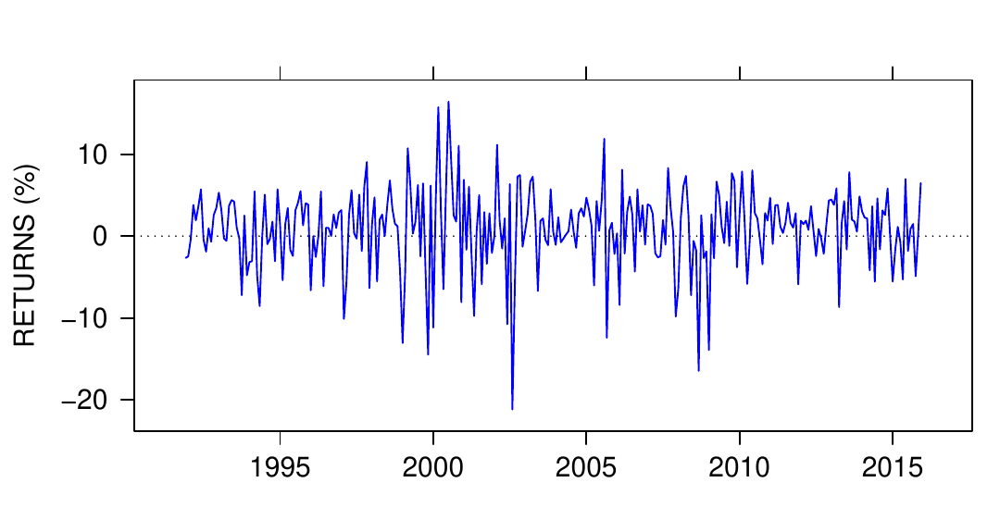
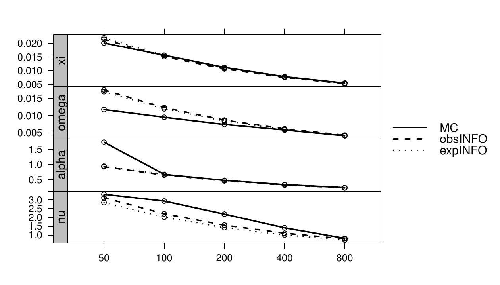
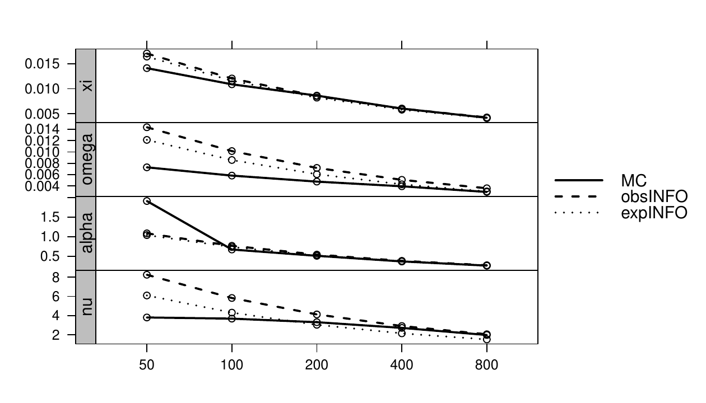

::: article
# Introduction

The primary motivation for this paper was our desire to use a flexible
family of skew-t distributions for quantitative finance research, and in
particular for empirical studies of the tail fatness and skewness of
returns distributions of various classes of assets, e.g., stock returns
and hedge fund returns. That said, we hasten to add that skew-t
distributions have extensive application uses in the broad areas of
physical and social sciences, and in engineering and computer science.
We believe that the main results of this paper will be of interest to
this broader audience as well as to those interested in finance
applications.

We chose to focus on the family of skew-t distributions based on
skew-normal distribution, henceforth "skew-t" distributions, for two
main reasons. The first reason is the existence of extensive research
results on the family, as reflected for example in
@AzzaliniCapitanio2003 and @AzzaliniValle2013, along with the extensive
coverage of both univariate and multivariate skew-t distributions in the
@AzzaliniCapitanio2014 (AZC) monograph. The second reason is that
research using skew-t distributions based on the skew-normal
distribution is greatly facilitated by the existence of the
comprehensive and well-supported R package
[*sn*](https://CRAN.R-project.org/package=sn).

The expected information matrix for skew-t distributions is a key
quantity for a number of purposes, including: (a) computing approximate
standard errors of skew-t parameter estimates from the asymptotic
covariance matrix evaluated at maximum-likelihood estimates (MLEs); (b)
evaluating the large-sample inefficiencies of skew-t MLEs when the
distribution is normal; (c) comparing the large-sample performances of
non-parametric versus skew-t MLE expected shortfall estimators. See for
example @DougShengyu2017 for (b) and (c) in the case of symmetric-t
distributions, where a closed-form expression exists for the expected
information matrix.

Unfortunately, there does not exist a closed form analytic matrix
expression for the skew-t information matrix. Therefore, we have
developed a numerical integration method for computing the elements of a
skew-t information matrix at specified skew-t parameter values, and have
implemented the resulting algorithm in the R function `stInfoMat()` in
the R package `skewtInfo`. Users can install the package with RStudio
via the following commands:

``` r
install.packages("devtools")
devtools::install_github("chindhanai/skewtInfo")
```

Although our particular interest in using the `skewtInfo` package is
focused on applications in quantitative finance, we anticipate that it
will be of interest to researchers across many fields of study, e.g.,
physical and social sciences and engineering and computer science, where
skew-t distribution have important applications.

For the purpose of analyzing the resulting expected information matrix
(henceforth simply \"the information matrix\") and evaluating its use
for computing standard errors, we used the *sn* package maximum
penalized-likelihood estimator (MPLE) function `st.mple()` to compute
three sets of skew-t parameter values for three sets of returns, labeled
D1, D2, D3 obtained from a single stock with ticker D on three different
time segments between December 1991 and September 2015.

The remainder of this paper is organized as follows. The \"Skew-t
Distribution\" section introduces the skew-t distribution family, and
provides the relationship between the skew-t distribution direct
parameters \"dp\" and the usual moment-based \"cp\" parameters, i.e.,
the mean, standard deviation, skewness and excess kurtosis. The
\"Maximum Penalized Likelihood Estimation Method\" section briefly
describes the *sn* package MPLE method used to fit skew-t distributions,
and uses the method to compute skew-t parameters for each of the three
sets of returns D1, D2, D3, compares the parameters to those obtained
with symmetric-t distribution maximum-likelihood estimates (MLEs), and
computes the values of the cp parameters from the skew-t dp parameters.
The \"Skew-t Information Matrix\" section discusses our numerical method
for computing the information matrix, as implemented in the package
skewtInfo, and describes how we verified by examples the accuracy of our
method. That section also examines the ill-conditioning of the
information matrix for the three sets of skew-t MPLEs and computes and
discusses the corresponding asymptotic correlations of the skew-t
parameter MPLEs for D1, D2, D3. The \"Standard Errors of Skew-t
Parameter MPLEs\" section uses Monte Carlo to evaluate the use of an
expected information matrix to compute standard errors of skew-t MPLEs,
in comparison with the use of an observed information matrix, and in
comparison with Monte Carlo \"true\" standard errors, which are used as
true skew-t parameters the MPLEs for stock returns D1, D2, D3. As a
preliminary to this Monte Carlo, the first part of the \"Standard Errors
of Skew-t Parameter MPLEs\" section discusses a problem that arises when
using skew-t MPLEs to compute them for a large number of replicates, and
shows how to deal with the problem. Finally, the last section discusses
related future research that needs to be done.

# Skew-t distributions

It is well-known that a random variable $X$ with a standard
t-distribution, i.e., with location parameter of value zero, scale
parameter of value one, and $\nu$ degrees of freedom has the stochastic
representation
$$\label{eq: std t RV} 
X=\frac{Z}{\sqrt{\chi_{\nu}^{2}/\nu}}  (\#eq:-std-t-RV)$$
where $Z$ follows a standard normal distribution and the independent
random variable $\chi_{\nu}^{2}$ follows a chi-squared distribution with
$\nu$ degrees of freedom. The following results and related details
concerning skew-t random variables and their distributions are provided
in @AzzaliniCapitanio2014.

A standard skew-t random variable
$Y_{0,1,\;\alpha,\;\nu}\sim\mathrm{ST}(0,1,\;\alpha,\;\nu)$ with slant
(skewness) parameter $\alpha$ and degrees of freedom parameter $\nu$,
can be obtained by replacing $Z$ with an independent standard
skew-normal random variable
$Z_{0,1,\alpha}\sim\mathbf{\mathrm{SN}}(0,1,\alpha)$, whose probability
density function is
$$\label{eq: std skew-normal RV}
f_{SN}(x;\alpha)=2\;\phi(x)\cdot\Phi(\alpha x)   (\#eq:-std-skew-normal-RV)$$
where $\phi(x)$ is the standard normal density function and $\Phi(x)$ is
the standard normal (cumulative) distribution function. The resulting
standard skew-t random variable
$$\label{eq: std skew-t RV}  
Y_{0,1,\alpha,\nu}=\frac{Z_{0,1,\alpha}}{\sqrt{\chi_{\nu}^{2}/\nu}} (\#eq:-std-skew-t-RV)$$
has the standard skew-t probability density
$$\label{eq: std skew-t density} 
f_{ST,std}(x;\alpha,\nu)=2\;t_{\nu}(x)\cdot T_{\nu+1}\left(\alpha x\cdot\sqrt{\frac{\nu+1}{\nu+x^{2}}}\right)  (\#eq:-std-skew-t-density)$$
where $t_{\nu}(x)$ is the density function of a standard t-distribution
random variable with $\nu$ degrees of freedom, and $T_{\nu}(x)$ is the
corresponding cumulative distribution function.

A general skew-t random variable $Y_{\xi,\omega,\alpha,\nu}$ with
location parameter $\xi$ and scale parameter $\omega$, whose
distribution we denote as $\mathbf{\mathrm{ST}}(\xi,\omega,\alpha,\nu)$,
has the stochastic representation
$$Y_{\xi,\;\omega,\;\alpha,\;\nu}=\xi+\omega Y_{0,1,\;\alpha,\;\nu}$$
with the transformations
$$z=\frac{y-\xi}{\omega},\quad\quad\tau(z)={\displaystyle \sqrt{\frac{\nu+1}{\nu+z^{2}}}}$$
A general skew-t probability density function of
$Y_{\xi,\;\omega,\;\alpha,\;\nu}$ is then given by
$$\label{eq: skew_t_density}
f_{ST}(y;\xi,\omega,\alpha,\nu)=\frac{2}{\omega}\cdot t(z)\cdot T_{\nu+1}\left(\alpha z\tau(z)\right)   (\#eq:-skew-t-density)$$
with the transformations
$$\label{eq: delta =000026 b_nu} 
\delta_{\alpha}=\frac{\alpha}{\sqrt{1+\alpha^{2}}},\quad\quad b_{\nu}=\sqrt{\frac{\nu}{\pi}}\cdot\frac{\Gamma((\nu-1)/2)}{\Gamma(\nu/2)}  (\#eq:-delta-000026-b-nu)$$
one would find that the variance of the standardized skew-t random
variable $z$ is:
$$\label{eq: z variance}
\sigma_{z}^{2}=\mathbf{\mathrm{var}}(z)=\frac{\nu}{\nu-2}-(b_{\nu}\delta_{\alpha})^{2}   (\#eq:-z-variance)$$

Note that as the slant parameter $\alpha$ ranges over
$(-\infty,+\infty)$, the parameter $\delta_{\alpha}$ ranges over the
interval $(-1,1)$ , and when there is no skewness, i.e., when
$\alpha=\delta_{\alpha}=0$, the variance of $z$ is that of a standard
symmetric-t random variable.

It will sometimes be of interest to transform a skew-t distribution
parameter vector $(\xi,\omega,\alpha,\nu)$ to the usual mean, standard
deviation, skewness, and excess kurtosis vector
$(\mu,\sigma,\gamma,\kappa)$. [^1] This can be done with the following
transformations, provided on pages 103-104 of AZC:
$$\begin{aligned}
\mu & =\xi+\omega b_{\nu}\delta_{\alpha}\nonumber \\
\sigma^{2} & =\omega^{2}\sigma_{z}^{2}\;\;\;\;\text{for}\;\nu>2\label{eq:par_relationships}\\
\gamma & =\frac{b_{\nu}\delta_{\alpha}}{\sigma_{z}^{3}}\left[\frac{\nu(3-\delta_{\alpha}^{2})}{\nu-3}-\frac{3\nu}{\nu-2}+2(b_{\nu}\delta_{\alpha})^{2}\right]\;\;\;\;\text{for}\;\nu>3\nonumber \\
\kappa & =\frac{1}{\sigma_{z}^{4}}\left[\frac{3\nu^{2}}{(\nu-2)(\nu-4)}-\frac{4(b_{\nu}\delta_{\alpha})^{2}\nu(3-\delta_{\alpha}^{2})}{\nu-3}+\frac{6\nu(b_{\nu}\delta_{\alpha})^{2}}{\nu-2}-3(b_{\nu}\delta_{\alpha})^{4}\right]-3\;\;\;\;\text{for}\;\nu>4.\nonumber
\end{aligned}   (\#eq:par-relationships)$$

# The maximum penalized likelihood estimation method

The log-likelihood for a single observation $y$ with density
$\,f\,(y;\boldsymbol{\theta})$ is
$$\ell(\boldsymbol{\theta};\mathrm{\mathit{y}})=\mathrm{log}\,f\,(y;\boldsymbol{\theta})$$
where $\boldsymbol{\theta}$ is a parameter vector. With
$\boldsymbol{\theta}=(\xi,\;\omega,\;\alpha,\;\nu)$ and
$z=(y-\xi)/\omega$, it follows from \@ref(eq:-skew-t-density) that for a
skew-t distribution the log-likelihood function for a single observation
$y$ is
$$\begin{aligned}
\ell_{ST}(\boldsymbol{\theta};\,y) & =\text{constant}-\frac{1}{2}\log\nu+\log\Gamma(\frac{1}{2}(\nu+1))-\log\Gamma(\frac{\nu}{2})\nonumber \\
 & -\frac{1}{2}(\nu+1)\log\left(1+\frac{z^{2}}{\nu}\right)+\log T_{\nu+1}\left(\alpha z\tau(z)\right)\label{eq:skewTLogLikelihood}
\end{aligned}   (\#eq:skewTLogLikelihood)$$
For $n$ independently and identically distributed skew-t observations
$\mathbf{y}=(y_{1},\;y_{2},\dots,y_{n})$ the log-likelihood is
$$\label{eq: skewTLogLikelihoodForSample}
\ell_{n}(\boldsymbol{\theta})=\ell_{n}(\boldsymbol{\theta};\mathbf{y})=\sum_{i=1}^{n}\ell_{ST}(\boldsymbol{\theta};\,y_{i})   (\#eq:-skewTLogLikelihoodForSample)$$

Let
$\hat{\boldsymbol{\theta}}_{n}=(\hat{\xi}_{n},\;\hat{\omega}_{n},\;\hat{\alpha}_{n},\;\hat{\nu}_{n})$
denote a maximum-likelihood estimate (MLE) for sample size $n$.
@AzzaliniValle2013 showed that with non-negligible probability the MLE
$\hat{\alpha}_{n}$ of the skewness parameter $\alpha$ diverges.
Consequently, they proposed a maximum penalized likelihood estimator
(MPLE) to solve this problem, based on a penalized likelihood of the
form
$$\label{eq:modLLH}
\tilde{\ell}_{n}(\boldsymbol{\theta})=\ell_{n}(\boldsymbol{\theta})-Q(\boldsymbol{\theta})   (\#eq:modLLH)$$
where $Q(\boldsymbol{\theta})=Q(\alpha,\nu)$ is a non-negative quantity
that penalizes the divergence of $\alpha$ by virtue of tending to
infinity as $\alpha\rightarrow\pm\infty$ for each fixed $\nu$. Details
may be found in Section 3 of @AzzaliniValle2013.

## Application to stock returns data

We illustrate the use of the *sn* package function `st.mple()` to
compute skew-t distribution MPLE fits to three disjoint time segments of
the returns of a large-cap stock with ticker D and company name The
Dominion Resources, INC[^2]. The code shown below creates the plot of
monthly returns of this stock from December 1991 to September 2015 in
Figure [1](#fig:tsDRet).

``` r
tsDRet = ts(as.numeric(Dreturns[,2]), start = c(1991, 12), frequency = 12)
plot(tsDRet*100, main = "", col = 4, ylab = "RETURNS(%)")
abline(h = 0, lty = 3)
```

{#fig:tsDRet
width="100%" alt="graphic without alt text"}

The entire time history of the D returns is longer than one would
normally use for portfolio construction, and we note that this time
interval contains several major market crises, e.g., the Russian default
in 1998, the dot-com bubble collapse in 2000, and the financial markets
crises of 2007-2008. Thus we will fit skew-t distributions, and also
symmetric-t distributions, to the stock with ticker D for the
sub-intervals 1991-1996, 1998-2009, and 2010-2015. The first interval,
consisting of 61 months, contains no market crises, and the same is true
of the third interval that consists of 72 months. The second interval,
consisting of 156 months, contains all three crises. For convenience, we
refer to the stock D returns on the first, second and third time
intervals as D1, D2, and D3. Based on this fact that D2 contains three
market crises, along with the visual character of the D2 returns, we
expected that we would obtain a skew-t fit with negative slant parameter
and rather small degrees of freedom for D2. But for D1 and D3 we were
not sure what to expect.

The code below extracts the three segments of returns D1, D2 and D3,
then uses `st.mple()` with the optional argument `symmetr = T` to obtain
symmetric-t MLE values $\boldsymbol{\hat{\theta}}_{Di,\;sym},\,i=1,2,3$,
and finally uses `st.mple()` without that optional argument to compute
skew-t MPLE estimates $\boldsymbol{\hat{\theta}}_{Di},\,i=1,2,3$.

``` r
# Define returns in each time period
Dreturns <- as.numeric(Dreturns[, 2])
returns1 <- Dreturns[1:61]
returns2 <- Dreturns[62:217]
returns3 <- Dreturns[218:289]

# Symmetric-t fit
tFitD1 <- st.mple(y = returns1, symmetr = TRUE)$dp
tFitD2 <- st.mple(y = returns2, symmetr = TRUE)$dp
tFitD3 <- st.mple(y = returns3, symmetr = TRUE)$dp
tFit <- rbind(tFitD1, tFitD2, tFitD3)

# Skew-t fit
stFitD1 <- st.mple(y = returns1, penalty = "Qpenalty")$dp
stFitD2 <- st.mple(y = returns2, penalty = "Qpenalty")$dp
stFitD3 <- st.mple(y = returns3, penalty = "Qpenalty")$dp
stFit <- rbind(stFitD1, stFitD2, stFitD3)
```

The results are shown in Table [1](#table:tstParam).

::: {#table:tstParam}
  ------------ ------------- ------- ------------- ---------- ------- -------- --------
                 Symmetric-t                           Skew-t                  

                    location   scale           dof   location   scale    slant      dof

  D1 returns           0.006   0.035   2764147.496      0.049   0.053   -3.735   32.102

  D2 returns           0.013   0.044         4.209      0.046   0.054   -1.064    4.416

  D3 returns           0.014   0.031         8.562      0.036   0.035   -1.021    6.638
  ------------ ------------- ------- ------------- ---------- ------- -------- --------

  : Table 1: Symmetric-t and skew-t parameter estimates for D1, D2 and
  D3.
:::

The results show that in the first time interval 1991-1996, before the
dot-com bubble collapse, $\boldsymbol{\hat{\theta}}_{D1,\;sym}$ implies
very normally distributed D1 returns, but
$\boldsymbol{\hat{\theta}}_{D1}$ indicates that the D1 returns
distribution in that time interval is better approximated by a
skew-normal distribution with strong negative skewness reflected by the
negative slant parameter estimate of $-3.73$. In the second period
1998-2009, that contains three financial crises, both
$\boldsymbol{\theta}_{D2,\;sym}$ and $\boldsymbol{\theta}_{D2}$ imply
that the D2 returns are quite fat-tailed with degrees-of-freedom
estimates of $4.21$ and $4.42$ respectively, $\boldsymbol{\theta}_{D2}$
indicates that the returns are negatively skewed, but less so than for
D1, as indicated by skew-t slant parameter estimate of $-1.06$. Finally,
for the third interval both $\boldsymbol{\theta}_{D3,\;sym}$ and
$\boldsymbol{\theta}_{D3}$ imply that that the D3 returns distribution
is fat-tailed, but a little less so than in the second period, and
$\boldsymbol{\theta}_{D3}$ indicate that the D3 returns distribution is
negatively skewed by about the same amount as the D2 returns.

# Skew-t information matrix

There are two equivalent forms of an information matrix, one of which
involves the products of score functions that are derivatives with
respect to each parameter of the log-likelihood for a single
observation, and the other of which involves the partial derivatives of
the score functions (second partial derivatives of the log-likelihood
for a single observation) with respect to each parameter.[^3] In our
case here, where $\boldsymbol{\theta}=(\xi,\;\omega,\;\alpha,\;\nu)$ and
the skew-t log-likelihood for a single observation is
$$\ell_{ST}(\boldsymbol{\theta};\,y)=\ell_{ST}(\xi,\;\omega,\;\alpha,\;\nu;\,z),\quad z=(y-\xi)/\omega$$
We also have the scalar score functions
$$\begin{aligned}
S_{\xi}(y) & =\frac{\partial\ell_{ST}(\xi,\;\omega,\;\alpha,\;\nu;\,z)}{\partial\xi}\nonumber \\
S_{\omega}(y) & =\frac{\partial\ell_{ST}(\xi,\;\omega,\;\alpha,\;\nu;\,z)}{\partial\omega}\label{eq: scoreFunctions}\\
S_{\alpha}(y) & =\frac{\partial\ell_{ST}(\xi,\;\omega,\;\alpha,\;\nu;\,z)}{\partial\alpha}\nonumber \\
S_{\nu}(y) & =\frac{\partial\ell_{ST}(\xi,\;\omega,\;\alpha,\;\nu;\,z)}{\partial\nu}\nonumber
\end{aligned}   (\#eq:-scoreFunctions)$$
and the score vector is the gradient of the log-likelihood:
$$\label{eq: scoreVector}
\boldsymbol{S}(y;\xi,\omega,\alpha,\nu)=\boldsymbol{\nabla}\ell_{ST}(\boldsymbol{\theta};\;y)=[S_{\xi}(y)\:S_{\omega}(y)\:S_{\alpha}(y)\:S_{\nu}(y)]^{\prime}   (\#eq:-scoreVector)$$
The two equivalent forms of the information matrix are:

$$\begin{aligned}
\mathbf{I}(\boldsymbol{\theta}) & =\begin{bmatrix}\mathbb{E}[S_{\xi}(y)S_{\xi}(y)] & \mathbb{E}[S_{\xi}(y)S_{\omega}(y)] & \mathbb{E}[S_{\xi}(y)S_{\alpha}(y)] & \mathbb{E}[S_{\xi}(y)S_{\nu}(y)]\\
\mathbb{E}[S_{\omega}(y)S_{\xi}(y)] & \mathbb{E}[S_{\omega}(y)S_{\omega}(y)] & \mathbb{E}[S_{\omega}(y)S_{\alpha}(y)] & \mathbb{E}[S_{\omega}(y)S_{\nu}(y)]\\
\mathbb{E}[S_{\alpha}(y)S_{\xi}(y)] & \mathbb{E}[S_{\alpha}(y)S_{\omega}(y)] & \mathbb{E}[S_{\alpha}(y)S_{\alpha}(y)] & \mathbb{E}[S_{\alpha}(y)S_{\nu}(y)]\\
\mathbb{E}[S_{\nu}(y)S_{\xi}(y)] & \mathbb{E}[S_{\nu}(y)S_{\omega}(y)] & \mathbb{E}[S_{\nu}(y)S_{\alpha}(y)] & \mathbb{E}[S_{\nu}(y)S_{\nu}(y)]
\end{bmatrix}\label{eq: infomatrix1}\\
\end{aligned} (\#eq:-infomatrix1)$$
$$\begin{aligned}
 & =-\begin{bmatrix}\mathbb{E}[S_{\xi\xi}(y)] & \mathbb{E}[S_{\xi\omega}(y)] & \mathbb{E}[S_{\xi\alpha}(y)] & \mathbb{E}[S_{\xi\nu}(y)]\\
\mathbb{E}[S_{\omega\xi}(y)] & \mathbb{E}[S_{\omega\omega}(y)] & \mathbb{E}[S_{\omega\alpha}(y)] & \mathbb{E}[S_{\omega\nu}(y)]\\
\mathbb{E}[S_{\alpha\xi}(y)] & \mathbb{E}[S_{\alpha\omega}(y)] & \mathbb{E}[S_{\alpha\alpha}(y)] & \mathbb{E}[S_{\alpha\nu}(y)]\\
\mathbb{E}[S_{\nu\xi}(y)] & \mathbb{E}[S_{\nu\omega}(y)] & \mathbb{E}[S_{\nu\alpha}(y)] & \mathbb{E}[S_{\nu\nu}(y)]
\end{bmatrix}\label{eq: infomatrix2}
\end{aligned}   (\#eq:-infomatrix2)$$

The importance of the information matrix
$\mathbf{I}(\boldsymbol{\theta})$ is that
$\mathbf{V\mathrm{(\boldsymbol{\theta})}=\mathbf{I}(\boldsymbol{\theta})^{-\mathrm{1}}}$
is the asymptotic covariance matrix of a consistent and asymptotically
normal MPLE
$\tilde{\boldsymbol{\theta}}_{n}=(\tilde{\xi}_{n},\;\tilde{\omega}_{n},\;\tilde{\alpha}_{n},\;\tilde{\nu}_{n})$.
Consequently
$\mathbf{V\mathrm{(\tilde{\boldsymbol{\theta}}_{\mathit{n}})}}$ can be
used to compute approximate standard errors in the usual way, i.e., by
extracting the diagonal elements of
$\mathbf{V\mathrm{(\tilde{\boldsymbol{\theta}}_{\mathit{n}})}}$, taking
the square root of the result and then dividing by $\sqrt{n}$. In the
remainder of this section, we focus on a numerical integration method of
evaluating $\mathbf{I}(\boldsymbol{\theta})$, verifying the accuracy of
the method, and analyzing the character of the resulting
$\mathbf{I}(\boldsymbol{\theta})$ for the MPLE parameters for the stock
returns D1, D2, and D3.

## Numerical evaluation of the skew-t information matrix

The skew-t information matrix in
\@ref(eq:-infomatrix1)-\@ref(eq:-infomatrix2) does not admit of
closed-form analytic expressions for its elements, and one must resort
to numerical integration. It turns out that information matrix form
\@ref(eq:-infomatrix1) is considerably simpler than that of
\@ref(eq:-infomatrix2) for purposes of numerical integration, and so we
focus on the former. For this purpose we need the following analytic
expressions for the score functions \@ref(eq:-scoreFunctions) derived by
@Cicio2011. Let
$$w(z)=\frac{t_{\nu+1}(\alpha z\cdot\tau(z))}{T_{\nu+1}(\alpha z\cdot\tau(z))},\;\;\;\;\;\;\psi(x)=\frac{\partial}{\partial x}\log(\Gamma(x))$$
where ${\psi}(x)$ is the digamma function. Then the score functions
are
$$\begin{aligned}
S_{\xi}(y) & =\frac{z\cdot\tau(z)^{2}}{\omega}-\frac{\alpha\nu\cdot\tau(z)}{\omega(\nu+z^{2})}\cdot w(z)\label{eq:S_xi}
\end{aligned} (\#eq:S-xi)$$

$$\begin{aligned}
S_{\omega}(y) & =-\frac{1}{\omega}+\frac{z^{2}\cdot\tau(z)^{2}}{\omega}-\frac{\alpha z\nu\cdot\tau(z)}{\omega(\nu+z^{2})}\cdot w(z)\label{eq:S_omega}
\end{aligned} (\#eq:S-omega)$$
$$\begin{aligned}
S_{\alpha}(y) & =z\cdot w(z)\cdot\tau(z)\label{eq:S_alpha}\\
\end{aligned} (\#eq:S-alpha)$$
$$ \begin{aligned}
S_{\nu}(y) & =\varphi(\nu)-\log\left(1+\frac{z^{2}}{\nu}\right)+\frac{z^{2}\cdot\tau(z)^{2}}{\nu}+\frac{\alpha z(z^{2}-1)}{(\nu+z^{2})^{2}\tau(z)}\cdot w(z)+\frac{\zeta(z)}{T_{\nu+1}(\alpha z\cdot\tau(z))}\label{eq:S_nu}
\end{aligned}   (\#eq:S-nu)$$
where
$$\begin{aligned}
 & \varphi(\nu)=\frac{1}{2}\left[\psi\left(\frac{\nu}{2}+1\right)-\psi\left(\frac{\nu}{2}\right)\right]-\frac{2\nu+1}{\nu(\nu+1)}\label{eq:phi(nu)}
\end{aligned} (\#eq:phinu)$$
$$\begin{aligned}
 & \zeta(z)=\int_{-\infty}^{\alpha z\cdot\tau(z)}\left\{ \frac{(\nu+1)u^{2}}{(\nu+1)(\nu+1+u^{2})}-\log\left(1+\frac{u^{2}}{\nu+1}\right)\right\} \;t(u;\nu+1)\;du\label{eq:zeta}
\end{aligned}   (\#eq:zeta)$$

We have developed the R package *skewtInfo* at
<https://github.com/chindhanai/skewtInfo> for numerically evaluating
Equation \@ref(eq:-infomatrix1). The main function in this package is
`stInfoMat()`, which has an argument `type` that controls the type of
information matrix to be computed, with the choice `type = "expected"`
resulting in computing an expected information matrix, and the choice
`type = "observed"` resulting in computing an observed information
matrix. We note that the computation of an observed information matrix
for skew-t distributions is already available using the functions
`st.infoUv()` in the *sn* package. But for the sake of stand-alone
completeness of the `skewtInfo` package we included the capability to
compute an observed information matrix.

The `stInfoMat()` function, with about 400 lines of `R` code, uses
numerical quadrature as implemented in the function` integrate()` from
the `R` `base` package, with the choice of tolerance of $10^{-9}$. The
`integrate()` function maps the infinite range of parameters onto finite
sub-intervals, and then uses globally adaptive interval subdivision in
conjunction with Wynn's Epsilon algorithm extrapolation, with the basic
step being Gauss-Kronrod quadrature. See @Robert1983 and the
documentation of the function `integrate` for more information.

Note that the expectations in the bottom row of the information matrix
involve a double integration due to the presence of $\zeta(z)$ in the
last term of $S_{\nu}(y)$, and hence the presence of $\zeta(z)$ in the
pairwise products of \@ref(eq:S-nu) with
\@ref(eq:S-xi)-\@ref(eq:S-alpha). For example, as a part of computing
the expected value of the score functions product
$S_{\alpha}\cdot S_{\nu}$, we need to evaluate[^4]
$$\begin{aligned}
\mathbf{E}\left(\frac{zw\tau\zeta}{T_{\nu+1}(\alpha z\tau)}\right) & =\int\left(\frac{zw\tau\zeta}{T_{\nu+1}(\alpha z\tau)}\right)f_{ST}(y)\;dy\\
 & =\int_{\mathbb{R}}\left(\int_{-\infty}^{\alpha z\tau_{z}}\left\{ \frac{(\nu+1)u^{2}}{(\nu+1)(\nu+1+u^{2})}-\log\left(1+\frac{u^{2}}{\nu+1}\right)\right\} \;t(u;\nu+1)\;du\right)\frac{zw\tau\cdot f_{ST}(y)}{T_{\nu+1}(\alpha z\tau)}\;dy\
\end{aligned}$$
To compute such an integral in $\mathtt{R}$, we do the following

1.  Define the innermost integrand of \@ref(eq:zeta) as a function of
    $u$ and $\nu$

2.  Integrate the inner integrand with respect to $u$ and define this
    inner integral as a function of $z$

3.  Define the outer integrand to be the product of integral from Step 2
    and the function
    $$\frac{z\cdot w(z)\cdot\tau(z)\cdot f_{ST}(y)}{T_{\nu+1}(\alpha z\cdot\tau(z))}\
    $$

4.  Integrate the vectorized integrand in Step 3 with respect to $y$ by
    using `sapply()` on the $y$ range over the real line.

### Usage example

The function `stInfoMat()` has three arguments:

1.  `y`, a vector of skew-t random variables used to compute an observed
    information matrix. Its default is `NULL`.

2.  `dp`, the skew-t direct parameter used to compute an expected
    information matrix, or an observed information matrix.

3.  `type = c("expected", "observed")`, the type of output information
    matrix, with default `"expected"`.

The object returned by a call to `stInfoMat()` is a list having four
objects:

1.  `dp`, the skew-t direct parameter used to compute an expected
    information matrix or an observed information matrix.

2.  `stInfoMat`, an expected information matrix when
    `type = "expected"`, and an observed information matrix when
    `type = "observed"`.

3.  `type`, the type of output information matrix.

4.  `SEMat`, the asymptotic standard errors of the skew-t parameters
    when `type = "expected"`, and the element-wise standard error of the
    observed information matrix in the case of `type = "observed"`.\
    Here the asymptotic standard errors of the skew-t MPLEs are the
    square roots of the diagonal elements of the inverse of the expected
    information matrix, and the element-wise standard errors of the
    observed information matrix are the standard errors of the
    element-wise sample means defined in equation \@ref(eq:obsexp) in
    the next subsection.

The following code illustrates the use of `stInfoMat()` to compute the
expected information matrix $\mathbf{I}(\boldsymbol{\theta}_{D2})$ for
the case of the skew-t parameter values
$\boldsymbol{\theta}_{D2}=(0.0461,\;0.0536,\;-1.06,\;4.42)$, previously
obtained as MPLE for D2 returns.

``` r
expInfo_D2 <- stInfoMat(dp = stFitD2, type = "expected")$stInfoMat
```

  ---------- ---------- -------- --------
   392.994    -133.197   6.697    0.111

   -133.197   459.792    2.931    -1.005

    6.697      2.931     0.205    -0.007

    0.111      -1.005    -0.007   0.005
  ---------- ---------- -------- --------

  : 

## Expected information matrix accuracy verification

Recall the expression for a skew-t log-likelihood
$\ell_{n}(\boldsymbol{\theta})$ in
\@ref(eq:-skewTLogLikelihoodForSample) for a sample of size $n$, where
$\ell_{ST}(\boldsymbol{\theta};\,y_{i})$ is the log-likelihood for a
single observation, and the gradient of the log-likelihood is given by
\@ref(eq:-scoreVector). It follows that the Hessian of
$\ell_{n}(\boldsymbol{\theta})$ is
$$\label{eq: Hessian}
\nabla^{2}\ell_{n}(\boldsymbol{\theta};\mathbf{y})=\begin{bmatrix}\sum_{i=1}^{n}S_{\xi\xi}(y_{i}) & \sum_{i=1}^{n}S_{\xi\omega}(y_{i}) & \sum_{i=1}^{n}S_{\xi\alpha}(y_{i}) & \sum_{i=1}^{n}S_{\xi\nu}(y_{i})\\
\sum_{i=1}^{n}S_{\xi\omega}(y_{i}) & \sum_{i=1}^{n}S_{\omega\omega}(y_{i}) & \sum_{i=1}^{n}S_{\omega\alpha}(y_{i}) & \sum_{i=1}^{n}S_{\omega\nu}(y_{i})\\
\sum_{i=1}^{n}S_{\xi\alpha}(y_{i}) & \sum_{i=1}^{n}S_{\omega\alpha}(y_{i}) & \sum_{i=1}^{n}S_{\alpha\alpha}(y_{i}) & \sum_{i=1}^{n}S_{\alpha\nu}(y_{i})\\
\sum_{i=1}^{n}S_{\xi\nu}(y_{i}) & \sum_{i=1}^{n}S_{\omega\nu}(y_{i}) & \sum_{i=1}^{n}S_{\alpha\nu}(y_{i}) & \sum_{i=1}^{n}S_{\nu\nu}(y_{i})
\end{bmatrix}   (\#eq:-Hessian)$$
where the expressions for the second partial derivatives above were
derived by @Cicio2011. The observed information matrix
$\mathbf{I}_{obs,n}(\boldsymbol{\theta})$ for a sample of size $n$ is :
$$\label{eq: obsInfoMat}
\mathbf{I}_{obs,n}(\boldsymbol{\theta})=-\nabla^{2}\ell_{n}(\boldsymbol{\theta};\mathbf{y})   (\#eq:-obsInfoMat)$$

It is a general result that the observed information matrix converges in
probability to the expected information matrix:
$$\label{eq:obsexp}
-\frac{1}{n}\nabla^{2}\ell_{n}(\boldsymbol{\theta};\mathbf{y})\rightarrow^{P}\mathbf{I}(\boldsymbol{\theta})   (\#eq:obsexp)$$

We shall confirm the accuracy of our numerical evaluation of
$\mathbf{I}(\boldsymbol{\theta})$ by evaluating the observed information
matrix on the left-hand side of the above convergence result for very
large $n$.

We could use either `stInfoMat()` with `type = "observed"` or the *sn*
package function `st.infoUv()` to compute the observed information
matrix. These two functions give virtually identical results, and since
our `skewtInfo` package contains `stInfoMat()`, we use that function to
compute both observed and expected information matrices for the case of
the skew-t parameter vector
$\boldsymbol{\theta}_{D2}=(0.0461,\;0.0536,\;-1.06,\;4.42)$ with
$n=100,000$, and compare the results. Table [2](#table:obsVsExp) shows
the following results: the absolute differences (AD) and relative
differences (RD) between the expected and observed information matrix,
along with the standard errors (SE) of the observed information matrix
estimates, and the t-statistics (AD/SE) for testing whether or not the
observed information matrix values are equal to those of the expected
information matrix.

::: {#table:obsVsExp}
  --------------------------------------------------------------------
   Diagonal   Expected   Observed     AD      RD      SE     tstat.AD
  ---------- ---------- ---------- -------- ------- ------- ----------
     I_11     392.994    393.048    0.054    0.000   0.825    0.065

     I_22     459.792    459.621    -0.170   0.000   2.249    -0.076

     I_33      0.205      0.206     0.000    0.002   0.000    0.812

     I_44      0.005      0.005     0.000    0.002   0.000    0.334
  --------------------------------------------------------------------

  : Table 2: Absolute differences (AD), relative differences (RD),
  standard errors (SE), and t-statistics (tstat.AD) of diagonal elements
  (Top) and off-diagonal elements (Bottom) of the expected information
  matrix and the observed information matrix based on $n=100,000$ for
  the skew-t parameter $\boldsymbol{\theta}_{D2}$.
:::

::: {#table:obsVsExp}
  -------------------------------------------------------------------------
   Off.diagonal   Expected   Observed     AD       RD      SE     tstat.AD
  -------------- ---------- ---------- -------- -------- ------- ----------
       I_12       -133.197   -136.135   -2.938   0.022    1.582    -1.857

       I_13        6.697      6.643     -0.054   -0.008   0.030    -1.807

       I_14        2.931      2.904     -0.027   -0.009   0.020    -1.386

       I_23        0.111      0.111     0.000    0.000    0.003    -0.017

       I_24        -1.005     -1.004    0.002    -0.002   0.008    0.213

       I_34        -0.007     -0.007    0.000    -0.007   0.000    0.485
  -------------------------------------------------------------------------

  : 
:::

The accuracy of the results in this table indicate that the observed
information matrix with a very large sample size $n$ is sufficiently
close to the expected information matrix for us to conclude that our
expected information matrix computation is sufficiently accurate.

## Information matrices condition numbers and parameters correlations

One obtains an MPLE asymptotic covariance matrix by computing the
inverse of an expected information matrix, and the stability of such
inversion depends on the condition number of the latter matrix.[^5] In
order to get a feeling for the extent of ill-conditioning of expected
information matrices for the three skew-t MPLEs of the previous section,
we computed the eigenvalues and condition numbers for the corresponding
expected information matrices, and show the results in Table
[3](#table:eigen_CN).

::: {#table:eigen_CN}
  ---------------------------------------------------------------------------
                 lambda1    lambda2    lambda3   lambda4   condition numbers
  ------------ ----------- ---------- --------- --------- -------------------
  D1 returns    1381.5806   534.8326   0.0055    0.0000       1201125125

  D2 returns    563.7201    289.2469   0.0262    0.0024         232597

  D3 returns    1466.7779   716.4898   0.0222    0.0005         2734502
  ---------------------------------------------------------------------------

  : Table 3: Eigenvalues and condition numbers corresponding to the
  information matrices in the three time periods.
:::

We see that the expected information matrix for
$\boldsymbol{\theta}_{D1}$ is very badly ill-conditioned, and the
expected information matrices of $\boldsymbol{\theta}_{D2}$ and
$\boldsymbol{\theta}_{D3}$ are also quite ill-conditioned, but less so
than the information matrix for $\boldsymbol{\theta}_{D1}$. Nonetheless
all three of these information matrices are positive definite and their
inverses exist.

### Asymptotic correlations of the four parameter MPLEs

The correlation matrix obtained from such an MPLE asymptotic covariance
matrix indicates how correlated the skew-t MPLEs will be in large
samples. In order to see what these correlations look like, we display
below the MPLE asymptotic correlation matrices for the returns D1, D2
and D3.

  -------- -------- -------- --------
   1.000    0.734    -0.802   0.443

   0.734    1.000    -0.706   0.769

   -0.802   -0.706   1.000    -0.411

   0.443    0.769    -0.411   1.000
  -------- -------- -------- --------

  : 

  -------- -------- -------- --------
   1.000    0.850    -0.938   0.394

   0.850    1.000    -0.836   0.641

   -0.938   -0.836   1.000    -0.359

   0.394    0.641    -0.359   1.000
  -------- -------- -------- --------

  : 

  -------- -------- -------- --------
   1.000    0.885    -0.954   0.434

   0.885    1.000    -0.874   0.661

   -0.954   -0.874   1.000    -0.407

   0.434    0.661    -0.407   1.000
  -------- -------- -------- --------

  : 

The six pairwise asymptotic correlations are rather similar across the
three skew-t parameter values as follows. The correlations between
location and scale parameters tend to be quite positive (ranging from
0.734 to 0.885), the correlations between location are slant parameters
are strongly negative (ranging from -.954 to -.802), and the
correlations between location and DoF tend to be small and positive
(ranging from 0.394 to 0.443). The scale and slant parameters are
substantially negatively correlated (ranging from -.874 to -.706), and
the scale and DoF parameters are rather positively correlated (ranging
from 0.641 to 0.769). Finally, the slant and DoF parameters are somewhat
negatively correlated (ranging from -.411 to -.359).

# Standard errors of skew-t parameter MPLEs

Since our expected information matrix computation is highly accurate, we
will use the inverse of the expected information matrix to compute
standard errors in the usual way, i.e., by taking the square root of the
variance estimates obtained as the diagonal elements of the estimated
asymptotic covariance matrix (the inverse of the estimated expected
information matrix) divided by $n$:
$$SE_{\boldsymbol{\theta}}=\left(SE_{\xi},\;SE_{\omega},\;SE_{\alpha},\;SE_{\nu}\right)=\sqrt{\text{diag}\left(\mathbf{I}^{-1}(\boldsymbol{\hat{\theta}_{n}})\right)}$$

We evaluate the performance of these standard errors in the following
two ways: (a) we compare them with the \"true\" standard errors obtained
via Monte Carlo, and (b) we compare them with the standard errors based
on an observed information matrix computed in the
[*sn*](https://CRAN.R-project.org/package=sn) package. These results
will reveal whether or not there are any meaningful differences in the
accuracy of the standard errors obtained using the expected information
matrix versus using the observed information matrix.

Before we make such comparisons, the next subsection first discusses a
basic problem that occurs in carrying out Monte Carlo studies with many
replicates of `st.mple()` fits, and how to deal with the problem.

## A Monte Carlo skew-t fitting difficulty and a solution

When carrying out our Monte Carlo studies involving generating a large
number of random sample replicates from a skew-t distribution, and
fitting a skew-t distribution with `st.mple()` to each replicate, we
would often run into a problem that `st.mple()` sometimes results in a
huge value for the degrees of freedom estimate and simultaneously an
essentially zero estimate for the slant parameter. This problem is
associated with a well-known singularity problem with a skewed normal
distribution when the slant (skewness) parameter is zero, and a near
singularity when the slant parameter is close to zero. The problem
occurs when a randomly generated replicate of a skew-t random variable
is close to normality, which happens the more so for small sample sizes.

We illustrate the behavior using $M=1,000$ replicates of samples of size
$n=50,\,100,\,200,\,400$ from a skew-t distribution with parameter value
$\boldsymbol{\theta}_{D2}=(0.0461,\,0.0536,\\ -1.06,\,4.42)$ that we
obtained as an `st.mple()` estimate in Table [1](#table:tstParam).[^6]
The code below implements this for the case $n=50$, with the replicates
stored in the matrix `retReps`, and the fits stored in the matrix
`skewtFits`.

``` r
set.seed(123)
# Skew-t parameters corresponding to D2 returns
dp <- stFitD2
M <- 1000
n <- 50
retReps <- matrix(NA, ncol = n, nrow = M)
skewtFits <- matrix(NA, ncol = 4, nrow = M)
for (m in 1:M) {
  retReps[m, ] <- rst(n = n, dp = dp)
}
for (m in 1:M) {
  skewtFits[m, ] <- st.mple(y = retReps[m,], penalty = "Qpenalty")$dp
}
```

Now for each sample size 50, 100, 200, and 400, we identify a sub-matrix
`skewtFitsHugeDof` of `skewtFits` for which the degrees of freedom
estimate is larger than each of thresholds 20, 40, 100, 500 and 1,000,
and print the number of rows of `skewtFitsHugeDof` for which this occurs
for each of those thresholds, along with the parameter estimates of the
first such row. The code below accomplishes this for the threshold value
1,000.

``` r
skewtFitsHugeDof <- skewtFits[(skewtFits[, 4] > 1000), ]
nrow(skewtFitsHugeDof)
## [1] 123
skewtFitsHugeDof[1, ]
## [1]  5.777610e-03  6.016062e-02 -9.752894e-07  4.897225e+06
```

Table [4](#table:sum_hugedof) displays the number and percent of
replicates for which the `st.mple()` fit for the parameters choice
$\boldsymbol{\theta}_{D2}=(0.046,\;0.054,\;-1.064,\;4.416)$, has degrees
of freedom larger than the threshold of 20, 40, 100, 500 and $1,000$,
for each of the sample sizes 50, 100, 200, 400. The percentages of
replicates whose DoF estimates are larger than the above thresholds
indicate that the fits are quite unreliable for $n=50$ and $n=100$, but
are much more reliable for sample size 200, where the percent of huge
DoF estimates is less than 1% for all thresholds greater than 40, and at
the sample size 400 it is only 0.3% for a threshold of 20, and 0.1% for
larger thresholds.[^7]

::: {#table:sum_hugedof}
  --------------------------------------------------------------------------
                          50             100           200          400
  ----------------- --------------- ------------- ------------- ------------
  Fit DoF \> 20       170 ( 17 %)     80 ( 8 %)    16 ( 1.6 %)   3 ( 0.3 %)

  Fit DoF \> 40      148 ( 14.8 %)   58 ( 5.8 %)    10 ( 1 %)    1 ( 0.1 %)

  Fit DoF \> 100     136 ( 13.6 %)   45 ( 4.5 %)   6 ( 0.6 %)    1 ( 0.1 %)

  Fit DoF \> 500     126 ( 12.6 %)   39 ( 3.9 %)   5 ( 0.5 %)    1 ( 0.1 %)

  Fit DoF \> 1000    123 ( 12.3 %)   36 ( 3.6 %)   5 ( 0.5 %)    1 ( 0.1 %)
  --------------------------------------------------------------------------

  : Table 4: Numbers and percentages of replicates for
  $\boldsymbol{\theta}_{D2}$ whose MPLE fit has DoF greater than
  $20,\;40,\;100,\,500,\,1000$.
:::

In order to carry out our Monte Carlo studies with 1,000 replicates,
whose results we discuss in the remainder of this subsection, we need to
obtain that many replicates after deleting any replicates for which the
DoF estimate is sufficiently large. For purposes of our study, we will
use a threshold of 20, noting that any replicate with a DoF estimate
larger than 20 is rather close to normality, and if significant skewness
is indicated by the slant parameter estimate then one should fit a
skew-normal distribution. Thus we carry out our Monte Carlo study to
obtain 1,000 clean replicates, with no DoF estimate larger than 20, by
first generating 1,300 replicates to clean, which will leave more than
1,000 replicates remaining for all cases considered, and take the first
1,000 of those remaining replicates for Monte Carlo calculations.

Our main goal here is to do a simple Monte Carlo comparison of the MPLE
values with true parameter values, where we take the true parameter
values to be the three sets of values
$\boldsymbol{\theta}_{Di},\,i=1,2,3$ in Table 1 for the skew-t
distribution. So we compute the sample mean values
$\mathrm{MC_{\mathit{Di,\;n}}}$ of the MPLEs across the 1,000
replicates, along with their Monte Carlo standard errors, and their
percent relative biases:
$$\mathrm{R}\mathrm{B}_{Di,\;n}=100\times\frac{\mathrm{MC_{\mathit{Di,\;n}}}-\boldsymbol{\theta}_{Di}}{\boldsymbol{\theta}_{Di}},\,i=1,\;2,\;3.$$

However, before we show the results of deleting MPLEs whose DoF estimate
is larger than 20, we first show the results obtained without doing such
deleting. These results, shown in Table [5](#table:MCStats_noThreshold)
for sample sizes $n=100,200,400$, with standard errors of the MC values
in parentheses, reveal that for all three parameter sets considered, the
average values of the DoF estimates are hugely positively biased. This
is because a fraction of the `st.mple()` estimates of the DoF are huge
outliers that very adversely distort the DoF Monte Carlo average
value.[^8]

Table [6](#table:MCStats) then shows the results of deleting any MPLEs
whose DoF estimate is greater than 20. In Table [6](#table:MCStats)a
where the true DoF parameter has a value close to 32 and a rejection
threshold of 20 is used, it is not surprising that the DoF values are
very negatively biased. However in Tables [6](#table:MCStats)b and
[6](#table:MCStats)c, where the true DoF values are about $4.4$ and
$6.6$ respectively, the DoF values are positively biased, and the
relative bias is considerably smaller than in Table [6](#table:MCStats)a
where the true DoF parameter value is close to 32.

::: {#table:MCStats_noThreshold}
  -------- ----------------- -------- ----------------- -------- ---------------- --------
  D1            n = 100                    n = 200                   n = 400      

  Theta           MC           RB%           MC           RB%           MC          RB%

  0.049      0.044 (2e-04)    -10.1     0.047 (1e-04)     -3.9    0.048 (1e-04)     -1.9

  0.053      0.047 (2e-04)     -12      0.05 (2e-04)      -6.4    0.052 (1e-04)     -2.7

  -3.735    -3.145 (0.0617)   -15.8    -3.394 (0.0295)    -9.1    -3.522 (0.022)    -5.7

  32.102       5.81e+05       2.e+06        6e+05        2.e+06       6e+05        2.e+06
  -------- ----------------- -------- ----------------- -------- ---------------- --------

  : Table 5: Means MC and percent relative biases RB% of the Monte Carlo
  skew-t MPLEs corresponding to (a) $\boldsymbol{\theta}_{D_{1}}$ (b)
  $\boldsymbol{\theta}_{D_{2}}$ (c) $\boldsymbol{\theta}_{D_{3}}$ with
  $M=1000$. The four rows of values in each table are for the location,
  scale, slant and DoF parameters, respectively, and MC standard errors
  are shown in parentheses.
:::

::: {#table:MCStats_noThreshold}
  -------- ----------------- -------- ----------------- -------- ----------------- --------
  D2            n = 100                    n = 200                    n = 400      

  Theta           MC           RB%           MC           RB%           MC           RB%

  0.046      0.04 (5e-04)     -13.2     0.043 (4e-04)     -6.7     0.045 (3e-04)     -2.3

  0.054      0.053 (3e-04)     -1.1     0.053 (2e-04)     -1.1     0.054 (2e-04)     0.8

  -1.064    -0.974 (0.0227)    -8.5    -1.015 (0.0158)    -4.6    -1.066 (0.0115)    0.2

  4.416        1.77e+05       4.e+06      4.27e+03       1.e+05      4.82e+00       9.e+00
  -------- ----------------- -------- ----------------- -------- ----------------- --------

  : 
:::

::: {#table:MCStats_noThreshold}
  -------- ------------------ -------- ------------------ -------- ------------------ --------
  D3            n = 100                     n = 200                     n = 400       

  Theta            MC           RB%            MC           RB%            MC           RB%

  0.036      0.0296 (4e-04)    -16.9     0.0324 (3e-04)     -9.1     0.0343 (2e-04)     -3.7

  0.035      0.0342 (2e-04)     -3.2     0.0347 (2e-04)     -1.8     0.0352 (1e-04)     -0.4

  -1.021    -0.8279 (0.0236)   -18.9    -0.9188 (0.0175)    -10     -0.9973 (0.0128)    -2.3

  6.638         4.61e+05       7.e+06       7.58e+04       1.e+06       1.15e+01       7.e+01
  -------- ------------------ -------- ------------------ -------- ------------------ --------

  : 
:::

::: {#table:MCStats}
  -------- ------------------ ------- ------------------ ------- ------------------ -------
  D1            n = 100                    n = 200                    n = 400       

  Theta            MC           RB%           MC           RB%           MC           RB%

  0.049     0.045 (0.00019)    -8.0    0.046 (0.00012)    -6.0     0.047 (9e-05)     -3.9

  0.053      0.046 (2e-04)     -13.9   0.048 (0.00015)    -10.2    0.049 (1e-04)     -8.3

  -3.735    -3.143 (0.06056)   -15.8   -3.25 (0.02883)    -13.0   -3.324 (0.02108)   -11.0

  32.102    9.923 (0.13035)    -69.1   11.547 (0.12452)   -64.0   13.132 (0.10893)   -59.1
  -------- ------------------ ------- ------------------ ------- ------------------ -------

  : Table 6: Means MC and percent relative biases RB% of the Monte Carlo
  skew-t MPLEs corresponding to (a) $\boldsymbol{\theta}_{D_{1}}$ (b)
  $\boldsymbol{\theta}_{D_{2}}$ (c) $\boldsymbol{\theta}_{D_{3}}$ with a
  DoF threshold of $20$ for eliminating an estimate with $M=1000$. The
  four rows of values in each table are for the location, scale, slant
  and DoF parameters, respectively, and MC standard errors are shown in
  parentheses.
:::

::: {#table:MCStats}
  -------- ------------------ ------- ------------------ ------ ------------------ ------
  D2            n = 100                    n = 200                   n = 400       

  Theta            MC           RB%           MC          RB%           MC          RB%

  0.046      0.04 (0.00051)    -13.2   0.043 (0.00037)    -6.7   0.045 (0.00027)    -2.3

  0.054     0.052 (0.00031)    -3.0    0.053 (0.00024)    -1.1   0.054 (0.00019)    0.8

  -1.064    -0.981 (0.02195)   -7.8    -1.013 (0.01548)   -4.8   -1.065 (0.01151)   0.1

  4.416     5.314 (0.09363)    20.3     5.099 (0.0715)    15.5   4.782 (0.04686)    8.3
  -------- ------------------ ------- ------------------ ------ ------------------ ------

  : 
:::

::: {#table:MCStats}
  -------- ----------------- ------- ------------------ ------- ------------------ ------
  D3            n = 100                   n = 200                    n = 400       

  Theta           MC           RB%           MC           RB%           MC          RB%

  0.036     0.031 (0.00036)   -13.0   0.032 (0.00027)    -10.2    0.034 (2e-04)     -4.6

  0.035     0.033 (0.00019)   -6.6    0.034 (0.00015)    -3.8    0.035 (0.00012)    -1.0

  -1.021    -0.863 (0.022)    -15.5   -0.892 (0.01635)   -12.7   -0.988 (0.01233)   -3.3

  6.638     7.229 (0.11885)    8.9     7.341 (0.1022)    10.6    7.505 (0.08947)    13.1
  -------- ----------------- ------- ------------------ ------- ------------------ ------

  : 
:::

Further comparison of the Monte Carlo average values and relative biases
of the location, scale and slant parameter estimates in Tables
[5](#table:MCStats_noThreshold) and [6](#table:MCStats) reveal that for
the stock returns data under consideration: (a) These parameter
estimates are not much affected by whether or not MPLEs are rejected
because their DoF estimate is larger than 20; (b) These parameter
estimates all have relative bias percentages that decrease with
increasing sample size, with small single digit relative bias
percentages at sample size 400 for stocks D2 and D3. emphasize that this
is a very narrow conclusion based on the returns subsets of a particular
stock, and a much more extensive study is needed of large cross-sections
of stock to explore this issue thoroughly.

## Standard errors of skew-t MPLEs

A reason for studying the accuracy of the standard errors obtained from
our skew-t expected information matrices is that in general one does not
know whether or not the use of an expected information matrix yields
standard errors that are more accurate, less accurate, or as accurate as
those obtained using an observed information matrix. The statistical
literature concerning this question includes, among other, an early
paper by @efronHinkley1978 that argues in favor of the observed
information, and the more recent papers by @caoSpall2010 and @cao2013
arguing that the use of the expected information matrix is preferred.

For our Monte Carlo study of the relative performance of standard errors
obtained using our expected information matrix versus an observed
information matrix, we focus on the two skew-t parameter vectors
$\boldsymbol{\theta}_{D2,\;n}$ and $\boldsymbol{\theta}_{D3,\;n}$ of the
\"Maximum Penalized Likelihood Estimation Method\" section, and skip
$\boldsymbol{\theta}_{D1,\;n}$ since its DoF parameter value calls for
using a skew-normal or a normal distribution model. Noting that the
Monte Carlo standard error of a standard error estimate under normality,
relative to the standard deviation of the observations, is approximately
$1/\sqrt{2\cdot(M-1)}$ where $M$ is the number of Monte Carlo
replicates, we use $M=4000$ to obtain a standard error of about 1%. The
detailed steps of our Monte Carlo are as follows.

For $i=2,\;3$ and for each of the sample sizes $n=50,\;100,\;200,\;400$
and $800$, we do the following:

1.  Generate a first random sample of size $n$ of skew-t random random
    variables with parameter $\boldsymbol{\theta}_{Di,\;n}$. [^9]

2.  Use the random sample to fit a skew-t distribution with the
    [*sn*](https://CRAN.R-project.org/package=sn) package function
    `st.mple()`, thereby obtaining the set of skew-t parameter estimates
    $\hat{\xi}_{n,\;1},\;\hat{\omega}_{n,\;1},\;\hat{\alpha}_{n,\;1},\\ \hat{\nu}_{n,\;1}$.

3.  Redo Step 1 and 2 for $5000$ times so that we have
    $\left(\hat{\xi}_{n,\;m},\;\hat{\omega}_{n,\;m},\;\hat{\alpha}_{n,\;m},\;\hat{\nu}_{n,\;m}\right),\:m=1,2,\dots,5000$.

4.  Remove the parameter estimate vectors for which the DoF estimate
    $\hat{\nu}_{n,\;m}$ is larger than 20, and take the first $4000$ of
    the resulting skew-t parameter estimate vectors.

5.  Compute the Monte Carlo standard error $SE_{MC}$ of each of the four
    parameters as their sample standard deviations for the $4000$
    replicates.

Table [7](#table:MPLE_SE) shows the $SE_{MC}$ results in the columns
labeled MC for each of $\boldsymbol{\theta}_{D2,\;n}$ and
$\boldsymbol{\theta}_{D3,\;n}$. The columns labeled OBS contain the
standard errors $SE_{obs}$ obtained using the observed information
matrix as computed by `st.infoUv()` in
[*sn*](https://CRAN.R-project.org/package=sn), and the columns labeled
EXP contain the standard errors $SE_{exp}$ as computed with the function
`stInfomat()` in our new package `skewtInfo`.

::: {#table:MPLE_SE}
  ------------- -------- -------- -------- -------- --------
       D2                            D3             

       MC         OBS      EXP       MC      OBS      EXP

   **n = 50**                                       

     0.0201      0.0214   0.0220   0.0141   0.0170   0.0164

     0.0118      0.0175   0.0170   0.0073   0.0144   0.0121

     1.7353      0.9236   0.9424   1.9118   1.0860   1.0409

     3.3251      3.1274   2.8506   3.8040   8.2432   6.0912

   **n = 100**                                      

     0.0157      0.0151   0.0155   0.0109   0.0120   0.0116

     0.0096      0.0124   0.0120   0.0058   0.0102   0.0086

     0.6744      0.6531   0.6663   0.6734   0.7679   0.7361

     2.9386      2.2114   2.0157   3.6845   5.8288   4.3071

   **n = 200**                                      

     0.0112      0.0107   0.0110   0.0086   0.0085   0.0082

     0.0075      0.0087   0.0085   0.0048   0.0072   0.0061

     0.4794      0.4618   0.4712   0.5121   0.5430   0.5205

     2.1900      1.5637   1.4253   3.3139   4.1216   3.0456

   **n = 400**                                      

     0.0079      0.0076   0.0078   0.0060   0.0060   0.0058

     0.0059      0.0062   0.0060   0.0039   0.0051   0.0043

     0.3379      0.3265   0.3332   0.3693   0.3840   0.3680

     1.4120      1.1057   1.0078   2.7228   2.9144   2.1535

   **n = 800**                                      

     0.0056      0.0054   0.0055   0.0042   0.0043   0.0041

     0.0042      0.0044   0.0042   0.0029   0.0036   0.0030

     0.2405      0.2309   0.2356   0.2625   0.2715   0.2602

     0.8146      0.7818   0.7126   1.9839   2.0608   1.5228
  ------------- -------- -------- -------- -------- --------

  : Table 7: Standard errors of skew-t MPLEs for
  $\boldsymbol{\theta}_{D2}$ and $\boldsymbol{\theta}_{D3}$ with
  $M=4000$.
:::

The results in Table [7](#table:MPLE_SE) are displayed graphically in
the two Lattice plots of Figure [2](#fig:finiteSE_4000). Each panel of
the plots contains the three standard errors
$SE_{MC},\;SE_{obs},\;SE{}_{exp}$ for one of the parameters, versus
sample size. corresponding to columns in Table [7](#table:MPLE_SE).

<figure id="fig:finiteSE_4000">


<figcaption>Figure 2: Standard errors plot for <span
class="math inline"><strong>θ</strong><sub><em>D</em>2</sub> = (0.046, 0.054, −1.064, 4.416)</span>
(top) and <span
class="math inline"><strong>θ</strong><sub><em>D</em>3</sub> = (0.036, 0.035, −1.021, 6.638)</span>
(bottom) with <span
class="math inline"><em>M</em> = 4000</span>.</figcaption>
</figure>

The figure results indicate that there is often little difference
between the standard errors computed with the expected information
matrix versus those of the observed information matrix, and when there
are significant differences, such as for the scale and DoF estimates for
D3 at small sample sizes, the expected information matrix typically
results in somewhat more accurate standard errors than the observed
information matrix. While sample size 100 seems to be adequate for
obtaining accurate standard errors for the location and slant parameter
MPLEs, it appears that one needs sample size at least 200 to obtain
accurate standard errors for scale parameter MPLEs. Furthermore, while
the expected information matrix standard error of the DoF skew-t MPLE
for D3 is quite accurate for sample sizes 100 and larger, this is not
the case for D2, which indicates that quite large sample sizes are
likely needed in order to obtain accurate standard errors for DoF skew-t
MPLEs.

# Concluding comments

Since there is no analytic formula for the Azzalini skew-t expected
information matrix, we developed a numerical integration method of
evaluation and implemented it in the function `stInfoMat()` in the `R`
package `skewtInfo`. We made an initial exploration of the properties of
the resulting expected information matrix for three skew-t parameter
vectors obtained using on the *sn* package function `st.mple()` for
three sets of monthly returns D1, D2, D3 of a single stock with ticker
D, on three disjoint time intervals from December 1991 to September
2015. We confirmed the accuracy of our expected information matrix
evaluation method for one of these skew-t parameter vectors by using the
well-known fact that an observed information matrix converges in
probability to the negative of the expected information matrix, and
showing that for $n=100,000$ the observed information matrix values
differ by a negligible amount from those of our expected information
matrix. We examined the condition number of the expected information
matrices for those three skew-t parameter vectors and found that
although the matrices are positive definite, they are quite poorly
conditioned to various extents. The asymptotic correlation patterns of
the three skew-t parameter MPLEs was examined, and we found that they
are fairly consistent in sign and magnitude across those thee parameter
vectors, as described at the end of the \"Information Matrices Condition
Numbers and Paramters Correlation\" subsection.

For the two of the three skew-t MPLE parameter vectors with single digit
DoF values, we carried out a Monte Carlo study of the standard errors
obtained with the expected information matrix, as compared with the
observed information matrix, and comparing both with Monte Carlo
reference standard errors. The results indicate that accurate standard
errors for location and slant parameters can be obtained using both
expected and observed information matrices for sample sizes of at last
100, but not for smaller sample sizes. For the scale and DoF parameters,
it appears that sample sizes as large as 200 or 400 may be needed to
obtain accurate standard errors, and in some cases the expected
information matrix gives better results.

The Reviewer's suggestion to consider the methods for model reduction
presented by @diciccio2018testing is quite interesting. However, we feel
that it is rather outside the focus and scope of the current paper, and
could be the basis of a separate study, that would also include the
hypothesis that the distribution is a symmetric-t distribution. In fact,
it would be great to see this capability in the *sn* package at some
point in the future.
:::

[^1]: The skewness and excess kurtosis are given by
    $\gamma =\mathbf{\mathrm{ E}}\left[\left(\frac{Y-\mu}{\sigma}\right)^{3}\right]$
    and
    $\kappa = \mathbf{\mathrm{E}}\left[\left(\frac{Y-\mu}{\sigma}\right)^{4}\right]-3,$
    respectively.

[^2]: See
    <https://www.sec.gov/Archives/edgar/data/715957/000119312505038704/d10k.htm#toc55089_2>
    for more information.

[^3]: See for example @CaseBerg:01.

[^4]: We suppress the variable $z$ dependency for $w,\;\tau$ and $\zeta$
    for a more compact expression of the integrals.

[^5]: The condition number of a positive definite real matrix
    $\mathbf{A}$ is given by
    $$\kappa(\mathbf{A})=\frac{\lambda_{\max}}{\lambda_{\min}}=\frac{\lambda_{\min}^{-1}}{\lambda_{\max}^{-1}}=\kappa(\mathbf{A}^{-1})$$
    where $\lambda_{\min}$ and $\lambda_{\max}$ are the smallest
    eigenvalue and the largest eigenvalue of $\mathbf{A}$.

[^6]: We note that following @Azzalini2016 \"How to sample from the SN
    and related distributions when we want to fix skewness and other
    cumulants\", we always use the DP parameterization when generating
    random samples from a skew-t distribution.

[^7]: On page 63 of @AzzaliniCapitanio2014 the authors suggest that for
    fitting their skew distributions the usual assumption that \"sample
    sizes less than 30\" should be considered \"small sample\", should
    be replaced with \"sample sizes less than 50\". But they also say
    that setting such a threshold is difficult because it depends on the
    slant parameter $\alpha$. For the case of the $\alpha$ values for
    the three skew-t parameter vectors we focus on here, it seems like
    the threshold may be more like 200.

[^8]: We deleted the standard error estimates for the DoF average values
    for display reasons, and that they are pretty irrelevant.

[^9]: For the sake of reproducibility, we use `set.seed(123)` for the
    simulation results in this section
