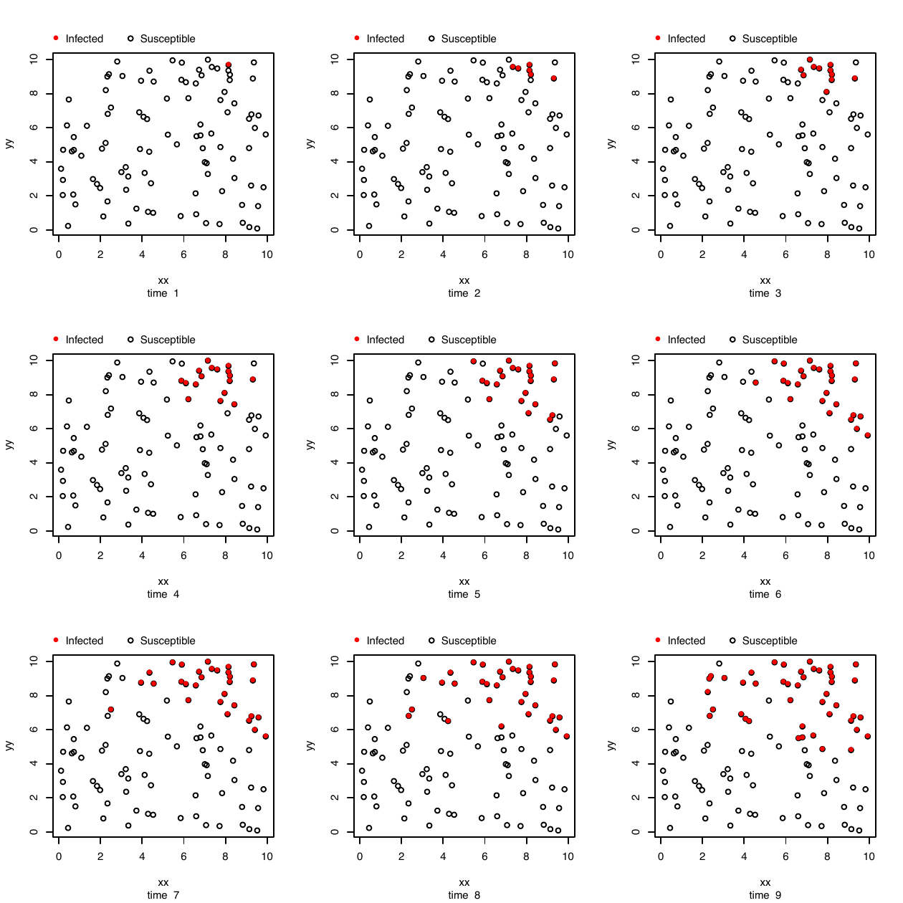
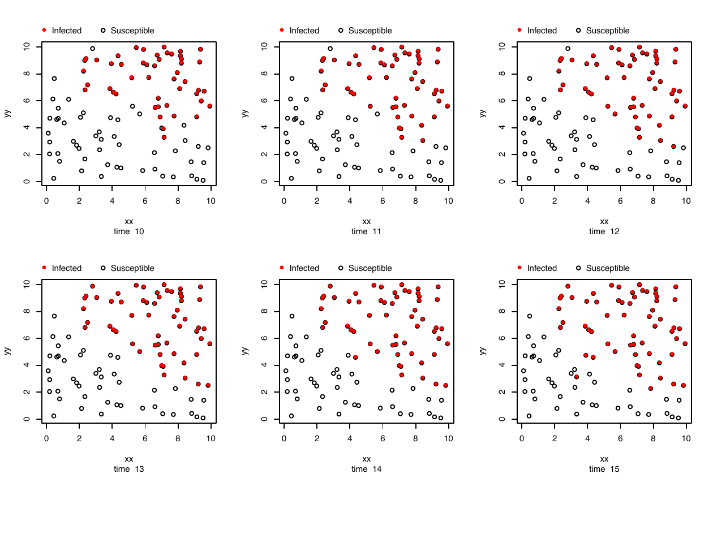

::: article
# Introduction

The task of modelling infectious disease transmission through a
population poses a number of challenges. One challenge is that
successfully modelling many, if not most, infectious disease systems
requires accounting for complex heterogeneities within the population.
These heterogeneities may be characterized by individual-level
covariates, spatial clustering, or the existence of complex contact
networks through which the disease may propagate. A second challenge is
that there are inherent dependencies in infection (or event) times.

To model such scenarios, @deardon2010 introduced a class of discrete
time individual-level models (ILMs), fitting the models to data in a
Bayesian Markov chain Monte Carlo (MCMC) framework. They applied spatial
ILMs to the UK foot-and-mouth disease (FMD) epidemic of 2001, which
accounted for farm-level covariates such as the number and type of
animals on each farm. However, the ILM class also allows for the
incorporation of contact networks through which disease can spread. Once
fitted, such models can be used to predict the course of an epidemic
[e.g., @OReilly2018] or test the effectiveness of various control
strategies [e.g., @Tildesley2006] that can be imposed upon epidemics
simulated from the fitted model.

A third challenge when modelling disease systems is that very little
software so far has been made available that allows for simulation from,
and especially inference for, individual-level models of disease
transmission. Most inference for such models is carried out in fast,
low-level languages such as Fortran or variants of C, which makes it
difficult for researchers (e.g., public health epidemiologists) without
a strong background in computational statistics and programming to make
use of the models.

A number of R packages have recently been developed for modelling
infectious disease systems (e.g.,
[*R0*](https://CRAN.R-project.org/package=R0) [@r0],
[*EpiEstim*](https://CRAN.R-project.org/package=EpiEstim) [@estim],
[*EpiModel*](https://CRAN.R-project.org/package=EpiModel) [@epimodel],
and [*epinet*](https://CRAN.R-project.org/package=epinet) [@epinet]).
Most of these packages can be used to carry out epidemic simulation from
given models; in addition, [*R0*](https://CRAN.R-project.org/package=R0)
or [*EpiEstim*](https://CRAN.R-project.org/package=EpiEstim), for
example, can be used to calculate the (basic) reproduction number under
various scenarios. The
[*EpiModel*](https://CRAN.R-project.org/package=EpiModel) package allows
for the simulation of epidemics from stochastic models, primarily
exponential-family random graph models (ERGMs), and provides tools for
analyzing simulation output. Functions for carrying out some limited
forms of inference are also provided. Another widely used package for
monitoring and modelling infectious disease spread through surveillance
data is
[*surveillance*](https://CRAN.R-project.org/package=surveillance)
[@surve]. This package provides for a highly flexible modelling
framework for such data. However, the package does not cover
mechanistic, individual-level disease transmission models such as those
of @deardon2010.

Here, we detail a novel R statistical software package
[*EpiILM*](https://CRAN.R-project.org/package=EpiILM) [@epiilm] for
simulating from, and carrying out Bayesian MCMC-based statistical
inference for spatial and/or network-based models in the @deardon2010
individual-level modelling framework. The package allows for the
incorporation of individual-level susceptibility and transmissibility
covariates in models, provides various methods of summarizing epidemic
data sets, and permits reasonably involved scenarios to be coded up by
the user due to its setting in an R framework. The main functions,
including for likelihood calculation are coded in Fortran in order to
achieve the goal of agile implementation.

The type of spatial and network-based transmission models that
[*EpiILM*](https://CRAN.R-project.org/package=EpiILM) facilitates can be
used to model a wide range of disease systems, as well as other
transmissible processes. Human diseases such as influenza, measles or
HIV, tend to be transmitted via interactions which can be captured by
contact networks. For example, [@m2014] used a network representing
whether two people shared the same household for modelling influenza
spread in Hong Kong. Networks can also be used to characterize social or
sexual relationships.

In the livestock industries, diseases are often transmitted from farm to
farm via supply trucks or animal movements from farm to farm, or from
farm to market. For example, ILM's were used by [@k2013] to model the
spread of porcine reproductive and respiratory syndrome (PRRS) through
Ontario swine farms via such mechanisms. Spatial mechanisms are also
often important in livestock industries [e.g.,
@Jewell2009; @deardon2010; @k2013], as well as for modelling crop
diseases [e.g., @gyan], since airborne spread is often a key factor.

Further, these types of models can also be used to model transmissible
processes other than infectious disease spread. For example, [@cook2007]
used similar models to model the transmission of alien species through a
landscape; specifically, giant hogweed in the UK. In addition, [@v2012]
used spatial ILM's to model fire spread. They looked at fire spread
under controlled conditions, but such models would likely be useful for
modelling the spread of forest fires since important covariates such as
vegetation-type could be incorporated into the models.

Data from infectious disease systems are generally 'time-to-event',
typically involving multiple states. However, standard survival models
(e.g., [@cox], [@survival]) or multi-state time-to-event models (e.g.,
see [@msm]) are not applicable here, because in an infectious disease
system individual event times cannot be assumed independent even after
conditioning on covariates. That is, my risk of contracting and
infectious disease generally depends upon the disease state of other
individuals in the population; this is not typically the case for most
cancers, for example to which more standard models can be applied.

The remainder of this paper is structured as follows: Section 2 explains
the relevant models involved in the package; Section 3 describes the
contents of the package along with some illustrative examples; and
Section 4 concludes the paper with a brief discussion on future
development.

# Model

In our [*EpiILM*](https://CRAN.R-project.org/package=EpiILM) package, we
consider two compartmental frameworks: susceptible-infectious (SI) and
susceptible-infectious-removed (SIR). In the former framework,
individuals begin in the susceptible state (S) and if/when infected
become immediately infectious (I) and remain in that state indefinitely.
In the latter framework, individuals once infected remain infectious for
some time interval before entering the removed state (R). This final
state might represent death, quarantine, or recovery accompanied by
immunity. We consider discrete time scenarios so a complete epidemic
history is represented by $t = 1, 2, \dots, t_{end}$, where (typically)
$t = 1$ is the time when the first infection is observed and $t_{end}$
is the time when the epidemic ends. Hence, for a given time point $t$,
an individual $i$ belongs to one, and only one, of the sets $S(t)$ or
$I(t)$ if the compartmental framework is SI, and $i$ belongs to one, and
only one, of the sets $S(t)$, $I(t)$, or $R(t)$ if the compartmental
framework is SIR.

Under either framework, the probability that a susceptible individual
$i$ is infected at time point $t$ is given by $\mathbb{P}(i,t)$ as follows:

$$\mathbb{P}(i,t) =1- \exp\{-\Omega_S(i) \sum_{j \in I(t)}{\Omega_T(j) \kappa(ij)}-\varepsilon\}, 
 \Omega_S(i) >0,  \Omega_T(j) >0,  \varepsilon > 0
\label{eq1}   (\#eq:eq1)$$
where: $\Omega_S(i)$ is a susceptibility function that accommodates
potential risk factors associated with susceptible individual $i$
contracting the disease; $\Omega_T(j)$ is a transmissibility function
that accommodates potential risk factors associated with infectious
individual $j$ contracting the disease; $\varepsilon$ is a sparks term
which represents infections originating from outside the population
being observed or some other unobserved infection mechanism; and
$\kappa(i,j)$ is an infection kernel function that represents the shared
risk factors between pairs of infectious and susceptible individuals.

The susceptibility function can incorporate any individual-level
covariates of interest, such as age, genetic factors, vaccination
status, and so on. In Equation (\@ref(eq:eq1)), $\Omega_S(i)$ is treated
as a linear function of the covariates, i.e.,
$\Omega_S(i) = \alpha_0 + \alpha_1 X_1(i) + \alpha_2 X_2 (i) + \dots  + 
\alpha_{n_s} X_{n_s} (i)$, where $X_1(i), \dots, X_{n_s} (i)$ denote
$n_s$ covariates associated with susceptible individual $i$, along with
susceptibility parameters $\alpha_0,\dots,\alpha_{n_s} >0$. Note that,
if the model does not contain any susceptibility covariates then
$\Omega_S(i) = \alpha_0$ is used. In a similar way, the transmissibility
function in Equation (\@ref(eq:eq1)) can incorporate any
individual-level covariates of interest associated with infectious
individual. $\Omega_T(j)$ is also treated as a linear function of the
covariates, but without the intercept term, i.e.,
$\Omega_T(j) = \phi_1 X_1(j) + \phi_2 X_2 (j) + \dots  + \phi_{n_t} X_{n_t} (j)$,
where $X_1(j), \dots, X_{n_t} (j)$ denote the $n_t$ covariates
associated with infectious individual $j$, along with transmissibility
parameters $\phi_1,\dots,\phi_{n_t} >0$. Also note that if the model
does not contain any transmissibility covariates then $\Omega_T(j)  = 1$
is used.

In this package, we also consider two broad types of ILM models based on
the type of the kernel function $\kappa(i,j)$: spatial and network-based
ILMs. In the spatial-based ILMs, the infection kernel function is
represented by the power-law function as
$$\kappa(ij) = d_{ij}^{-\beta},$$
where $\beta$ is the spatial parameter that accounts for the varying
risk of transmitting disease over the Euclidean distance between
individuals $i$ and $j$, $d_{ij}$. Whereas in the network-based ILMs,
$\kappa(i,j)$ can be represented by one or more contact network matrices
and is written as
$$\kappa(ij) = \beta_1  C^{(1)}_{ij}+\dots + \beta_n  C^{(n)}_{ij},$$
where $C^{(.)}_{ij}$ denotes the $(i,j)^{th}$ element of what we term
the contact matrix of a given contact network; in graph theory this is
more typically referred to as a (weighted) adjacency matrix. The
corresponding $\beta_{(.)}$'s represent the effect of each of the $n$
networks on transmission risk. In each contact network, each individual
in the population is denoted by a node and is connected by lines or
edges. These connections represent potential transmission routes through
which disease can spread between individuals in the population. If the
network is unweighted, the contact matrix is treated as binary (0 or 1).
If the edges have weights assigned to them, then $C^{(.)}_{ij} \in R^+$
or $C^{(.)}_{ij} \in [0,1]$ are typically used. These weights can be
used to allow for different infection potential between different pairs
of individuals. If the network is undirected, the contact matrix will be
symmetric; if directed, it can be non-symmetric. Finally, the $C_{ii}$
(diagonal terms) are not used in the models and are typically set to
$C_{ii}=0, \forall i.$

Note that $\mathbb{P}(i,t)$ gives the probability that susceptible individual
$i$ is infected at time point $t$, representing some interval in
continuous time (e.g., a day or week), but they actually become
infectious at time $t+1$.

Following @deardon2014, the likelihood function for the ILMs
(\@ref(eq:eq1)) is given by
$$f(S,I,R|\theta)=\prod_{t=1}^{t_{max}} f_t(S,I,R|\theta)$$
where
$$f_t(S,I,R|\theta) =  \bigg[ \prod_{i \in I(t+1) \backslash I(t)} \mathbb{P}(i,t) 
\bigg] \bigg[ \prod_{i \in S(t+1)} 
(1-\mathbb{P}(i,t) ) \bigg]$$
and where, $\theta$ is the vector of unknown parameters,
$I(t+1) \backslash I(t)$ denotes all new infections observed at $t+1$ in
the infectious state at time $t$, and $t_{max} \le t_{end}$ is the last
time point at which data are observed or being simulated.

# Contents of [*EpiILM*](https://CRAN.R-project.org/package=EpiILM)

The [*EpiILM*](https://CRAN.R-project.org/package=EpiILM) package makes
use of Fortran code that is called from within R. This package can be
used to carry out simulation of epidemics, calculate the basic
reproduction number, plot various epidemic summary graphics, calculate
the log-likelihood, and carry out Bayesian inference using
Metropolis-Hastings MCMC for a given data set and model. The functions
involved in the package are summarized in Table [1](#table).

::: {#table}
  ---------------------------------------------------------------------------------------------------------------------------------
  Function          Output
  ----------------- ---------------------------------------------------------------------------------------------------------------
  ` epiBR0`         Calculates the basic reproduction number for a specified SIR model

  `epidata`         Simulates epidemic for the specified model type and parameters

  `plot.epidata`    Produces spatial plots of epidemic progression over time as well as various epidemic curves of epidata object

  ` epidic`         Computes the deviance information criterion for a specified individual-level model

  ` epilike`        Calculates the log-likelihood for the specified model and data set

  `epimcmc`         Runs an MCMC algorithm for the estimation of specified model parameters

  `summary.mcmc`    Produces the summary of epimcmc object

  `plot.mcmc`       Plots epimcmc object

  `pred.epi`        Computes posterior predictions for a specified epidemic model

  `plot.pred.epi`   Plot posterior predictions
  ---------------------------------------------------------------------------------------------------------------------------------

  : Table 1: Description of functions and their output in the
  [*EpiILM*](https://CRAN.R-project.org/package=EpiILM) package
:::

## Simulation of epidemics

The function `epidata()` allows the user to simulate epidemics under
different models and scenarios. One can use the argument `type` to
select the compartmental framework (SI or SIR) and population size
through the argument `n`. If the compartmental framework is SIR, the
infectious period is passed through the argument `infperiod`. Depending
on whether a spatial or network model is being considered, the user can
pass the arguments: `x`, `y` for location and `contact` for contact
networks. Users can also control the susceptibility function
$\Omega_S(i)$ through the `Sformula` argument, with individual-level
covariate information passable through this argument. If there is no
covariate information, `Sformula` is null. An expression of the form
`Sformula = `$\sim$` model` is used to specify the covariate
information, separated by `+` and `-` operators similar to the R generic
function `formula()`. For example,
$\Omega_S(i) = \alpha_0 + \alpha_1 X(i),  i = 1, \dots, n$ can be passed
through the argument `Sformula` as `Sformula = `$\sim$` 1 + X`. In a
similar way, the user can control the transmissibility function
$\Omega_T(i)$ through the `Tformula` argument. Note that, the `Tformula`
must not include the intercept term to avoid model identifiability
issues, i.e., for a model with one transmissibility covariate (`X`), the
`Tformula` becomes `Tformula = `$\sim$` -1 + X`. The spatial (or
network), susceptibility, transmissibility, and spark (if any)
parameters are passed through arguments `beta`, `alpha`, `phi`, and
`spark`, respectively.

The argument `tmin` helps to fix the initial infection time while
generating an epidemic. By default, `tmin` is set as time $t=1$. We can
also specify the initial infective or infectives using the argument
`inftime`. For example, in a population of $10$ individuals, we could
choose, say, the third individual to become infected at time point 1,
using the option `inftime = c(0, 0, 1, 0, 0, 0, 0, 0, 0, 0)`. We could
also infect more than one individual and they could be infected at
different time points. This allows simulation from a model conditional
on, say, data already observed, if we set the `tmin` option at the
maximum value of `inftime`.

The output of the function `epidata()` is formed as class of
`epidata object`. This `epidata object` contains a list that consist of
`type` (the compartmental framework), `XYcoordinates`(the XY coordinates
of individual for spatial model) or `contact` (the contact network
matrix for the network model), `inftime` (the infection times) and
`remtime` (the removal times). Other functions such as `plot.epidata`
and `epimcmc` involved in the package use this `object` class as an
input argument.

## Descriptive analyses

We introduce an S3 method plot function to graphically summarize, and
allow for a descriptive analyses of, epidemic data. The function
`plot.epidata()` illustrate the spread of the epidemic over time. One of
the key input arguments (`x`) of this function has to be an
`epidata object`. The other key argument `plottype` has two options:
`curve` and `spatial`. Specifying the first option produces various
epidemic curves, while the latter show the epidemic propagation over
time and space when the model is set to spatial-based. When the
`plottype = curve`, an additional argument needs to be passed through
the function through `curvetype`. This has four options:
`curvetype = "complete"` produces curves of the number of susceptible,
infected, and removed individuals over time (when
`type = "SIR”`);` "susceptible"` gives a single curve for the
susceptible individuals over time; ` "totalinfect"` gives the cumulative
number of infected individuals over time; and ` "newinfect"` produces a
curve of the number of newly infected individuals at each time point.

The plot functions `plot.epimcmc()` and `plot.pred.epi()` can be used to
illustrate inference results (see Bayesian inference section). Detailed
explanation is provided in the corresponding subsections.

## Example: spatial model

Suppose we want to simulate an epidemic from the model (1) using a
spatial kernel with type SI, $\Omega_{s}(i) = \alpha$, and no
transmissibility covariates, $\Omega_T(j) = 1$. Choosing the infectivity
parameter $\alpha = 0.3$, spatial parameter $\beta = 5.0$, sparks
parameter $\varepsilon = 0$, and $t_{max} = 15$, the model is given by:
$$\mathbb{P}(i,t) =1 - \exp\{-0.3 \sum_{j \in I(t)}{d_{ij}^{-5}}\},  t=1,\dots, 15
\label{eq5}   (\#eq:eq5)$$
where $d_{ij}$ is the Euclidean distance between individuals $i$ and
$j$, with their locations specified through x and y.

First, we install the
[*EpiILM*](https://CRAN.R-project.org/package=EpiILM) package and call
the library.

``` r
R> install.packages("EpiILM")
R> library("EpiILM")
```

Then, let us simulate (x, y) coordinates uniformly across a
$10 \times 10$ unit square.

``` r
R> x <- runif(100, 0, 10)
R> y <- runif(100, 0, 10)
```

One could now use the following syntax to simulate an epidemic from
spatial model (\@ref(eq:eq5)) and summarize the output as an epidemic
curve and spatial plot.

``` r
R> SI.dis <- epidata(type = "SI", n = 100, tmax = 15, sus.par = 0.3, beta = 5.0,
+                                x = x, y = y)
R> SI.dis$inftime
  [1]  0  0 10  4  7  0  0  0  4  5  0  0  9  2  6  6  3  0  0  0 11
 [22]  0  0  9 12  3  0 15  9  0  8  0  0  0 11  9  0  2  0  5  7  0
 [43]  2 15  7  0  0  5  0  0  0 14  8  2  0 15  9 10 10  4  1  5  4
 [64]  6 11  3  0  8  0  6  8  5 12  4  2 13  0  9  3  6  3  4  9 13
 [85]  0  0  0  0  0  0  0  0 10  0  9 11  9  9  0  0
```

Here, the epidemic is generated across the uniformly distributed
population of $100$ individuals with a default first infection time
$t = 1$ and last observed time point of $t_{max} = 15$. The declaration
of the spatial locations of individuals through `x` and `y` specifies
that we are simulating from a spatial model. (See later for
network-based models). The output `SI.dis`$\$$`inftime` provides the
times at which individuals enter the infectious state, with $0$
representing individuals who are still susceptible at time $t_{max}$.
Figures [1](#si2) and [2](#si1) show the summary graphics for the
simulated epidemic, which are produced using the S3 method
`plot.epidata()` as follows:

``` r
R> plot(SI.dis, plottype = "curve", curvetype ="complete")
R> plot(SI.dis, plottype = "spatial")
```

{#si2 width="100%"
alt="graphic without alt text"}

<figure id="si1">
<p><br />
</p>
<figcaption>Figure 2: Simulated epidemic from () for 100 individuals,
where open circles represent susceptible individuals and filled red
circles represent infected individuals</figcaption>
</figure>

## Example: network model

To illustrate simulation from a contact network-based model, we consider
a disease system in which disease transmission can occur through a
single, directed, binary network over a population of $n=100$
individuals. The elements in the contact matrix represent the existence
or non-existence of a directed connection through which disease can
transmit between two individuals in the population. Each individual
within the population is represented by a row and column within the
matrix. Specifically, an element $C_{ij}$ in the contact matrix is given
by:

$$C_{ij}=   
    \begin{pmatrix}
      1 & \textrm{  if a directed  edge exists between $i$ and $j$ }\\
      0  & \textrm{ otherwise }
    \end{pmatrix}    
  \label{eq6}   (\#eq:eq6)$$
We also consider the inclusion of a binary susceptibility covariate $Z$
in the model. This can be thought to represent, say, treatment or
vaccination status. The infection model is then given by
$$\mathbb{P}(i,t) =1- \exp\{-(\alpha_0 + \alpha_1   Z_i) \sum_{j \in I(t)}{C_{ij}}\},  t=1,\dots, t_{max}
\label{eq7}   (\#eq:eq7)$$
where $\alpha_0$ is the baseline susceptibility and $\alpha_1$ is the
binary treatment effect. The parameters in the model are set to be
$(\alpha_0, \alpha_1)= (0.1,0.05)$ and $\varepsilon=0$, and we also set
$t_{max}=15$. We simulate a directed network using the following code:

``` r
R> contact <- matrix(rbinom(10000, 1, 0.1), nrow = 100, ncol = 100)
R> diag(contact[, ]) <- 0
```

Various packages are available in R for network visualization, such as
[*igraph*](https://CRAN.R-project.org/package=igraph),
[*ergm*](https://CRAN.R-project.org/package=ergm), etc and as an
example, we use the
[*igraph*](https://CRAN.R-project.org/package=igraph) package for the
network display as shown in Figure [3](#net).

``` r
R> require("igraph")
R> net1 <- graph_from_adjacency_matrix(contact)
R> plot(net1, vertex.size = 10, vertex.label.cex = 0.5, edge.arrow.mode = "-")
```

{#net width="100%" alt="graphic without alt text"}

The epidemic is generated using the function `epidata()`. The arguments
`Sformula = `$\sim$` Z` and `sus.par = c(0.1, 0.05)` define the
susceptibility function $0.1 + 0.05  Z_i$. As there is one contact
network matrix in the model, the effect of the network $C$ is set to one
by default. The use of the `contact` argument informs the package that
we are dealing with a contact network-based model.

``` r
R> Z <- round(runif(100, 0, 2))
R> SI.contact <- epidata(type = "SI", Sformula = ~Z, n = 100, tmax = 15,
+           sus.par = c(0.1, 0.05),  contact = contact)
R> SI.contact$inftime
  [1]  0  9 11 10  9  5  8  9  8  9  9 10  1  7 12 11  7 11  8  4  8
 [22] 10  8 11  7  9 11  5  7  6  6  8  9  8  9  6  6  7  9  9  7  4
 [43]  7 10  8  3 10  9 10 11  6  7  9  6  5 11  4  7  8  8 10  8  8
 [64]  7  7  6 11  7  8  7  6  8  8 10  7  6 10 11  9  6 10  7  4  7
 [85]  8  7  9  9 10  9  8 10  5  8  7  7  8  9  9  8
```

Figure [4](#netepi) shows the epidemic curve, obtained via the following
code.

``` r
R> plot(SI.contact, plottype = "curve", curvetype ="complete")
```

{#netepi width="100%"
alt="graphic without alt text"}

## Bayesian Inference

In [*EpiILM*](https://CRAN.R-project.org/package=EpiILM), ILMs can be
fitted to observed data within a Bayesian framework. A
Metropolis-Hastings MCMC algorithm is provided which can be used to
estimate the posterior distribution of the parameters. The function
`epimcmc()` provides three choices for the marginal prior distribution
of each parameter: the gamma, half-normal, and uniform distributions.
The parameters are assumed to be *a priori* independent. The proposal
used is a Gaussian random walk. Again, users can use the `Sformula` and
`Tformula` arguments to specify any individual-level susceptibility and
transmissibility covariates. Users can also control the number of MCMC
simulations, initial values, and proposal variances of the parameters to
be estimated. Note that in case of fixing one parameter and updating
other parameters, users can do it by setting the proposal variance of
fixed parameter to zero. This is usually the case to avoid
identifiability issue when the model has both susceptibility and
transmissibility covariates without intercept terms. Again,
spatial/network, susceptibility parameters and transmissibility
parameters are passed through arguments `beta`, `sus.par` and
`trans.par`, respectively. One can specify the spark parameter using the
`spark` argument, but by default its value is $0$. `epimcmc()` can also
call the adaptive MCMC method of inference facilitated by the
[*adaptMCMC*](https://CRAN.R-project.org/package=adaptMCMC) package.
Specifically, users can pass the argument `adapt = TRUE` along with
`acc.rate` to run the adapt MCMC algorithm.

We can use the S3 method functions `summary.epimcmc()` and
`plot.epimcmc()` available in the package for output analysis and
diagnostics. Both are dependent upon the
[*coda*](https://CRAN.R-project.org/package=coda) package. The argument
`plottype` in the function `plot.epimcmc`, has two options to specify
which samples are to be plotted: (1) \"parameter\" is used to produce
trace plots (time series plots) of the posterior distributions of the
model parameters, and (2) \"loglik\" to produce trace plots of the log
likelihood values of the model parameter samples. Other options that are
used in the [*coda*](https://CRAN.R-project.org/package=coda) package
can be used in the `plot.epimcmc()` as well; e.g., `start`, `end`,
`thin`, `density`, etc.

Spatial or network-based ILMs can be fitted to data as shown in the
following examples.

### Example: spatial model

Suppose we are interested in modelling the spread of a highly
transmissible disease through a series of farms, say $n=100,$ along with
an assumption that the spatial locations of the farms and the number of
animals on each farm are known. In this situation, it is reasonable to
treat the farms themselves as individual units. If we treat the extent
of infection from outside the observed population of farms as negligible
($\varepsilon = 0$), we can write the ILM model as

$$\mathbb{P}(i,t) =1- \exp\{-(\alpha_0+\alpha_1 A(i)) \sum_{j \in I(t)}{d_{ij}^{-\beta}}\},  t=1,\dots, t_{max}, 
\label{eq8}   (\#eq:eq8)$$

where the susceptibility covariate $A$ represents the number of animals
on each farm, $\alpha_0$ is the baseline susceptibility, $\alpha_1$ is
the number of animals effect, and $\beta$ is the spatial parameter. Let
us use the same (simulated) spatial locations from the previous spatial
model example and set the parameters $(\alpha_0, \alpha_1)= (0.2,0.1)$
and $\beta=5$. We also set $t_{max}=50$. Considering an SI compartmental
framework for this situation, the epidemic is simulated using the
following command:

``` r
R> A <- round(rexp(100,1/50))
R> SI.dis.cov <- epidata(type = "SI", n = 100, tmax = 50, x = x, y = y,
+                 Sformula = ~A, sus.par = c(0.2, 0.1), beta = 5)
```

We can now refit the generating model to this simulated data and
consider the posterior estimates of the model parameters. We can do this
using the following code:

``` r
R> t_end <- max(SI.dis.cov$inftime)
R> unif_range <- matrix(c(0, 0, 10000, 10000), nrow = 2, ncol = 2)
R> mcmcout_Model7 <- epimcmc(SI.dis.cov, Sformula = ~A, tmax = t_end, niter = 50000, 
+                      sus.par.ini = c(0.001, 0.001), beta.ini = 0.01, 
+                      pro.sus.var = c(0.01, 0.01), pro.beta.var = 0.5, 
+                      prior.sus.dist = c("uniform","uniform"), prior.sus.par = unif_range, 
+                      prior.beta.dist = "uniform", prior.beta.par = c(0, 10000))
```

where `niter` denotes the number of MCMC iterations and `sus.par.ini`
and `beta.ini` are the initial values of the parameters to be estimated.
The proposal variances for $(\alpha_0, \alpha_1)$ and $\beta$ are set to
$(0.01, 0.01)$ and $0.5$, respectively (after tuning). Vague uniform
prior distributions are used for all three parameters, i.e., we choose
$U(0, 10000)$ for $\alpha_0, \alpha_1$, and $\beta$. As the locations x
and y are specified, a spatial ILM is fitted rather than a network-based
ILM. Note that the full data set to which the model is being fitted
consists of the spatial locations (x, y) and the infection times.
Figure [5](#si3) displays the MCMC traceplot after 10000 burn-in using
the command

``` r
R> plot(mcmcout_Model7, partype = "parameter", start = 10001, density = FALSE)
```

The posterior means and $95\%$ credible intervals (CI) of the
parameters, calculated as the $2.5\%$ and $97.5\%$ percentiles of 50000
MCMC draws after a burn-in of 10000 iterations has been removed, can be
obtained using the following code:

``` r
R> summary(mcmcout_Model7, start = 10001)

Model: SI distance-based discrete-time ILM 
Method: Markov chain Monte Carlo (MCMC) 

Iterations = 10001:50000
Thinning interval = 1 
Number of chains = 1 
Sample size per chain = 40000 

1. Empirical mean and standard deviation for each variable,
   plus standard error of the mean:

          Mean      SD  Naive SE Time-series SE
alpha.1 0.2868 0.23516 0.0011758       0.012449
alpha.2 0.1997 0.07544 0.0003772       0.002393
beta.1  5.6790 0.48188 0.0024094       0.014631

2. Quantiles for each variable:

           2.5%    25%    50%    75%  97.5%
alpha.1 0.02018 0.1141 0.2226 0.3917 0.9072
alpha.2 0.08680 0.1486 0.1875 0.2395 0.3769
beta.1  4.81361 5.3377 5.6704 5.9872 6.6588
```

{#si3 width="100%"
alt="graphic without alt text"}

### Example: network model

Now consider modelling the spread of an animal infectious disease
through a series of farms ($n=500$) in a region. We once again consider
individuals in the population to be the farms, rather than animals
themselves, and a single binary contact network to represent connections
between farms. We assume that there are two species of animals in farms
that play an important role in spreading the disease; let us say, cows
and sheep. Thus, we include the number of cows and sheep on the farm as
susceptibility and transmissibility covariates in the model. Thus, the
probability of susceptible farm $i$ to be infected at time $t$ becomes:
$$\mathbb{P}(i,t) =1- \exp\{- (\alpha_{1}X_1(i) + \alpha_{2}X_2(i)) \sum_{j \in I(t)}{[\phi_{1}X_1(j) + \phi_{2}X_2(j)] C_{ij}}\},  t=1,\dots, t_{max}
\label{eq10}   (\#eq:eq10)$$
with susceptibility parameters, ($\alpha_{1}, \alpha_{2}$),
transmissibility parameters, ($\phi_{1}, \phi_{2}$), and $X_1$ and $X_2$
represent the number of sheep and cows in farms, respectively. Note,
when we have a single network, there is no network parameter to
estimate; this is to avoid problems of non-identifiability.

We can generate such a directed contact network using the following
commands:

``` r
R> n <- 500
R> contact <- matrix(rbinom(n*n, size = 1, prob = 0.1), nrow = n, ncol = n)
R> diag(contact) <- 0
```

We also sample the number of sheep and cows on each farm using the
following code

``` r
R> X1 <- round(rexp(n, 1/100))
R> X2 <- round(rgamma(n, 50, 0.5))
```

Assuming each infected farm to be infectious for an infectious period of
3 days and by setting $t_{max}=25$, $\alpha_{1}=0.003$,
$\alpha_{2}=0.01$, $\phi_{1}=0.0003$, and $\phi_{2}=0.0002$, we can
simulate the epidemic from the SIR network-based ILMs (\@ref(eq:eq10))
as follows and the epidemic curves are shown in Figure [6](#SIR.net).

``` r
R> infp <- rep(3, n)
R>  SIR.net <- epidata(type = "SIR", n = 500, tmax = 15, 
+              sus.par = c(0.003, 0.01), trans.par = c(0.0003, 0.0002), 
+              contact = contact, infperiod = infp,
+              Sformula = ~ -1 + X1 + X2, Tformula = ~ -1 + X1 + X2)
R> plot(SIR.net, plottype = "curve", curvetype = "complete")
```

{#SIR.net width="100%"
alt="graphic without alt text"}

To estimate the unknown parameters ($\alpha_{1}$, $\alpha_{2}$,
$\phi_{1}$, $\phi_{2}$), we use the function `epimcmc()` assuming the
event times (infection and removal times) and contact network are
observed. Note that the specification of the contact argument means a
network-based (rather than spatial) ILM will be assumed. We run the
`epimcmc()` function to produce an MCMC chain of 50000 iterations
assigning gamma prior distribution for the model parameters
($\alpha_{2}$, $\phi_{1}$, $\phi_{2}$) while fixing $\alpha_{1}$ to
avoid the non-identifiablity issue in the model. This is done by setting
the proposal variance of this parameter to zero in the `pro.sus.var`
argument. To illustrate the use of adaptMCMC method, we set
`adapt = TRUE` and set the acceptance rate as 0.5 via `acc.rate = 0.5`.
It should also be noted that we need to provide initial values and
proposal variances of the parameters when we use the adaptive MCMC
option in the `epimcmc()` function. The syntax is as follows:

``` r
R> t_end <- max(SIR.net$inftime)
R> prior_par <- matrix(rep(1, 4), ncol = 2, nrow = 2)
R> mcmcout_SIR.net <- epimcmc(SIR.net, tmax = t_end, niter = 50000,
+              Sformula = ~-1 + X1 + X2, Tformula = ~-1 + X1 + X2,  
+              sus.par.ini = c(0.003, 0.001), trans.par.ini = c(0.01, 0.01),
+              pro.sus.var = c(0.0, 0.1), pro.trans.var = c(0.05, 0.05),
+              prior.sus.dist = c("gamma", "gamma"), prior.trans.dist = c("gamma", "gamma"), 
+              prior.sus.par = prior_par, prior.trans.par = prior_par,
+              adapt = TRUE, acc.rate = 0.5)
```

Figure [7](#net2) shows the MCMC traceplot for the 50000 iterations. The
estimate of the posterior mean of the model parameters ($\alpha_{2}$,
$\phi_{1}$, $\phi_{2}$) and their $95\%$ credible intervals, after 10000
iterations of burn-in have been removed are:
$\hat{\alpha_{2}} = 0.0094  (0.0051, 0.0168)$,
$\hat{\phi_{1}} = 0.0004 (0.0002, 0.0007)$, and
$\hat{\phi_{1}} = 0.0002  (0.00006, 0.0003)$.

{#net2 width="100%"
alt="graphic without alt text"}

``` r
R> summary(mcmcout_SIR.net, start = 10001)
```

``` r
Model: SIR network-based discrete-time ILM 
Method: Markov chain Monte Carlo (MCMC) 

Iterations = 10001:50000
Thinning interval = 1 
Number of chains = 1 
Sample size per chain = 40000 

1. Empirical mean and standard deviation for each variable,
   plus standard error of the mean:

             Mean        SD  Naive SE Time-series SE
alpha.2 0.0093899 0.0030070 1.504e-05      1.866e-04
phi.1   0.0004123 0.0001218 6.089e-07      4.483e-06
phi.2   0.0001851 0.0000732 3.660e-07      1.911e-06

2. Quantiles for each variable:

             2.5%       25%       50%       75%     97.5%
alpha.2 5.130e-03 0.0071826 0.0088076 0.0110550 0.0168404
phi.1   2.123e-04 0.0003226 0.0004020 0.0004879 0.0006800
phi.2   6.646e-05 0.0001322 0.0001763 0.0002299 0.0003463
```

## Case Study: Tomato spotted wilt virus (TSWV) data

Here, we consider data from a field trial on TSWV as described in @hugh.
The experiment was conducted on 520 pepper plants grown inside a
greenhouse and the spread of the disease caused by TSWV was recorded at
regular time intervals. Plants were placed in 26 rows spaced one metre
apart, with 20 plants spaced half a metre apart in each row. The
experiment started on May 26, 1993 and lasted until August 16, 1993.
During this period, assessments were made every 14 days. We set the
initial infection time to be $t=2$ as the epidemic starts at time point
2 and the last observation made is set to be $t = 7$. The TSWV data in
this package contain ID number, locations (x and y) and infectious and
removal time of each individual. The data set was reconstructed from a
spatial plot in @hugh. The infectious period for each tomato plant is
assumed to span three time points ([@brown2005], [@gyan]). Thus, an SIR
model is fitted using the following code:

``` r
R> data(tswv) 
R> x <- tswv$x 
R> y <- tswv$y 
R> inftime <- tswv$inftime 
R> removaltime <- tswv$removaltime 
R> infperiod <- rep(3, length(x))  
```

In order to see the spatial dispersion of the TSWV data, we use the
function `epispatial()`. As no new infections occurred at the second
time point, we display spatial plots from that second observation by
setting `tmin = 2` (see Figure [8](#tswv1)). The required code is given
by:

``` r
R> epidat.tswv <- as.epidata(type = "SIR", n = 520, x = x, y = y, 
+                            inftime = inftime, infperiod = infperiod)
R> plot(epidat.tswv, plottype = "spatial", tmin = 2)
```

{#tswv1
width="100%" alt="graphic without alt text"}

The function `epimcmc()` is used to fit our model to the data. We ran
$50000$ MCMC iterations. The computing time taken for the MCMC is about
10 min on a 16 GB MacBook Pro with a 2.9 GHz Intel Core i5 processor.
Proposal variances are chosen to be $0.000005$ and $0.005$ for $\alpha$
and $\beta$, respectively (after tuning). We use vague independent
marginal prior distributions for the parameters. Here, a gamma
distribution with shape parameter $1$ and rate parameter $10^{-3}$ is
used for both $\alpha$ and $\beta$. We choose to fit our model to data
starting at the second time point because no infections occur between
the first and second time points. Thus, we again set `tmin = 2`. The
code for fitting our model is:

``` r
R> mcmc.tswv <- epimcmc(epidat.tswv, tmin = 2, tmax = 10,
+                niter = 50000, sus.par.ini = 0.0, beta.ini = 0.01,
+               pro.sus.var = 0.000005, pro.beta.var = 0.005, prior.sus.dist = "gamma",
+                prior.sus.par = c(1,10**(-3)), prior.beta.dist = "gamma", 
+                prior.beta.par = c(1,10**(-3)))			
```

The posterior mean estimates for this model are $\hat{\alpha}= 0.014$
and $\hat{\beta}= 1.351$. The $95\%$ credible interval of the posterior
mean of $\alpha$ and $\beta$ are $(0.009, 0.0190)$ and $(1.041, 1.629)$,
respectively. Once again, these intervals are calculated as the $2.5\%$
and $97.5\%$ percentiles of $50000$ draws after 10000 iterations of
burn-in have been removed. The MCMC traceplots shown in
Figure [9](#trace).

{#trace width="100%"
alt="graphic without alt text"}

# Conclusion

This paper discusses the implementation of the R software package
[*EpiILM*](https://CRAN.R-project.org/package=EpiILM). Other than this
package, there does not appear to be any R software that offers spatial
and network-based individual-level modelling for infectious disease
systems. Thus, this package will be helpful to many researchers and
students in epidemiology as well as in statistics. These models can be
used to model disease systems of humans (e.g., @m2014), animals (e.g.,
@k2013), or plants (e.g., @gyan), as well as other transmission-based
systems such as invasive species (e.g., @cook2007) or fire spread
[@v2012].\
The [*EpiILM*](https://CRAN.R-project.org/package=EpiILM) package
continues to exist as a work in progress. We hope to implement
additional models and options in the future, that might be useful for
other researchers in their research and teaching. Such additions may
include the incorporation of time-varying networks, covariates and/or
spatial kernels (e.g., @v2012), models that allow for a joint spatial
and network-based infection kernel, uncertainty in the times of
transitions between disease states (e.g., @malik2016), unknown
covariates (e.g., @deeth, and extensions to other compartmental
frameworks such as SEIR and SIRS. Finally, we hope to extend the package
to allow for the modelling of disease systems with multiple interacting
strains or pathogens [@Razvan].

# Acknowledgments

Warriyar was funded by a University of Calgary Eyes High Postdoctoral
Scholarship. Both Deardon, and equipment used to carry out this work,
were funded by a Natural Sciences and Engineering Research Council of
Canada (NSERC) Discovery Grant.
:::
