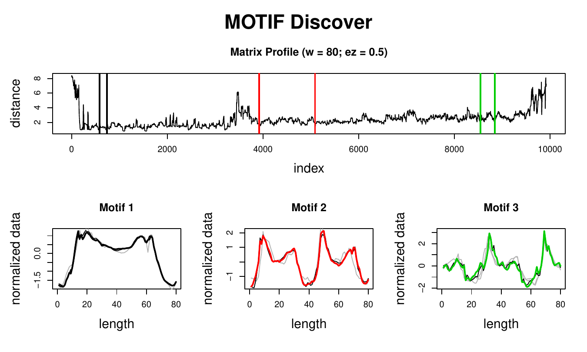
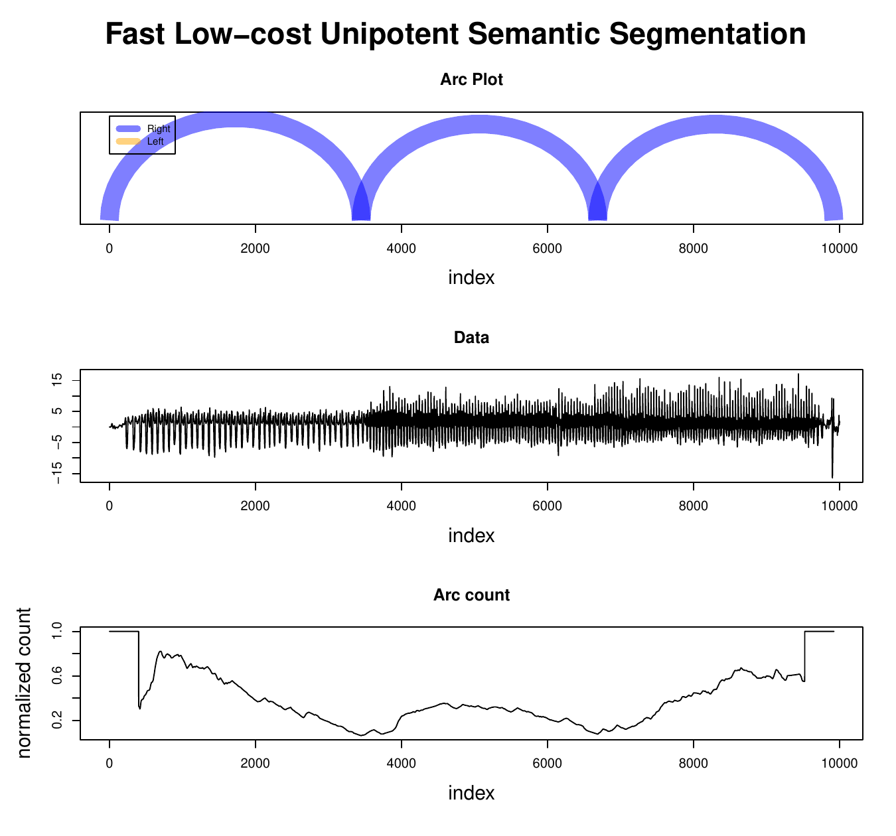
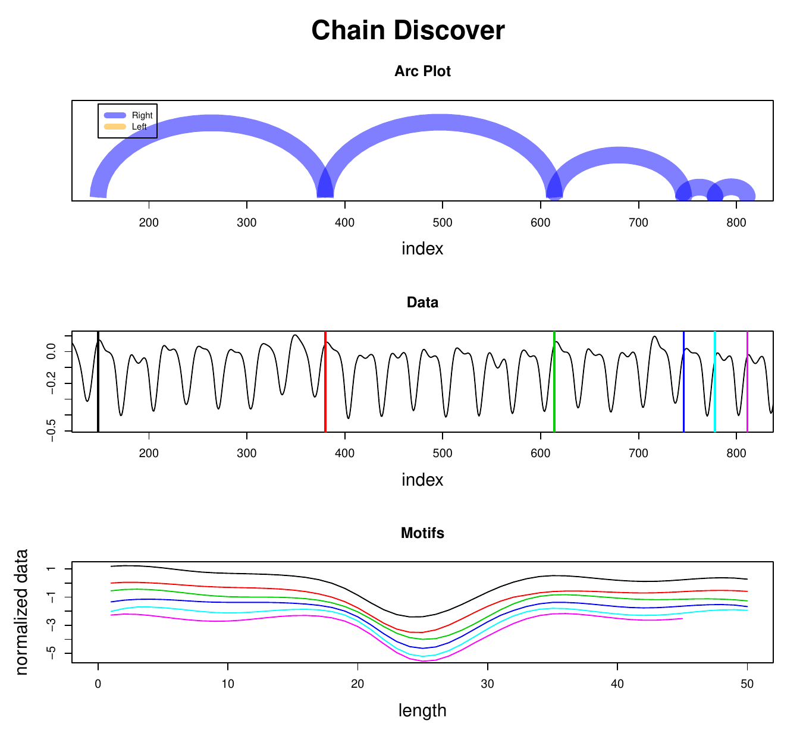

::: article
# Introduction: time series data mining {#sec:intro}

A TS is a sequence of real-valued numbers indexed in time order.
Usually, this sequence is taken in a regular period of time, which will
be assumed to be true in this context. The interests in TS data mining
have been growing along with the increase in available computational
power. This kind of data is easily obtained from sensors (e.g., ECG),
(ir)regular registered data (e.g., weekly sales, stock prices, brachial
blood pressure). Even other kinds of data can be converted to TS format,
such as shapes [@Wei2006] and DNA sequences [@Shieh2008]. TS are
generally large, high dimensional and continuously updated which
requires algorithms fast enough in order to be meaningful. Besides,
unlike other kinds of data, which usually have exact answers, TS are
usually analysed in an approximated fashion.

These characteristics have been challenging researchers to find faster
and more accurate methods to retrieve meaningful information from TS.
This required one or more of these methods: dimensionality reduction,
constraints, domain knowledge, parameter tweaks. Only afterwards could
the data mining tasks be applied in feasable time. Typical tasks include
motif and discord discovery, subsequence matching, semantic
segmentation, rule discovery, similarity search, anomaly detection,
clustering, classification, indexing, etc. [@Fu2011].

This paper describes the
[*tsmp*](https://CRAN.R-project.org/package=tsmp) package [@tsmp] which
uses a novel approach to TS data mining: the MP [@Yeh2017a], which is
based on the APSS (also known as similarity join). The APSS' task is to,
given a collection of data objects, retrieve the nearest neighbour for
each object. The remaining part of this paper is organised as follows:
In Section [2](#sec:matrixprofile) we describe the reasoning behind the
MP, in Section [3](#sec:thepkg) we present the
[*tsmp*](https://CRAN.R-project.org/package=tsmp) package with examples,
in Section [4](#sec:speed) we compare the performance of the R
implementation, and in Section [5](#sec:conclusion) we conclude with a
brief discussion.

# The matrix profile {#sec:matrixprofile}

The reader may be aware of what a DM is. It is widely used in TS for
clustering, classification, motif search, etc. But, even for modestly
sized datasets, the algorithms can take months to compute even with
speed-up techniques such as indexing [@Shieh2008; @Fu2008],
lower-bounding [@Keogh2005], data discretization [@Lin2003] and early
abandoning [@Faloutsos1994]. At best, they can be one or two orders of
magnitude faster.

The MP is an ordered vector that stores the Euclidean distance between
each pair within a similarity join set. One (inefficient) way would be
to use the full DM of every iteration of a sliding window join and
retrieve just the smallest (non-diagonal) value of each row. The MP also
has a companion vector called PI, that gives us the position of the
nearest neighbour of each subsequence.

This method has a host of interesting and exploitable properties. For
example, the highest point on the MP corresponds to the TS discord, the
(tied) lowest points correspond to the locations of the best TS motif
pair, and the variance can be seen as a measure of the TS complexity.
Moreover, the histogram of the values in the MP is the exact answer to
the TS density estimation. Particularly, it has implications for TS
motif discovery, TS joins, shapelet discovery (classification), density
estimation, semantic segmentation, visualisation, rule discovery,
clustering, etc. [@Yeh2017a].

Some of the advantages/features of this method:

-   It is *exact*, providing no false positives or false dismissals.
-   It is *simple* and parameter-free. In contrast, the more general
    metric space APSS algorithms require building and tuning spatial
    access methods and/or hash functions.
-   It requires an inconsequential space overhead, just $O(n)$ with a
    small constant factor.
-   It is extremely *scalable*, and for *massive* datasets, we can
    compute the results in an anytime fashion, allowing ultra-fast
    *approximate* solutions.
-   Having computed the similarity join for a dataset, we can
    incrementally update it very efficiently. In many domains, this
    means we can effectively maintain exact joins on *streaming* data
    forever.
-   It provides *full joins*, eliminating the need to specify a
    similarity threshold, which is a near-impossible task in this
    domain.
-   It is *parallelizable*, both on multicore processors and in
    distributed systems [@Zhu2016].

# The [*tsmp*](https://CRAN.R-project.org/package=tsmp) package {#sec:thepkg}

The [*tsmp*](https://CRAN.R-project.org/package=tsmp) package provides
several functions that allow for an easy workflow using the MP concept
for TS mining. The package is available from the CRAN at
<https://CRAN.R-project.org/package=tsmp>. In
Section [3.1](#sec:instalation) we explain how to install this package.
In Section [3.2](#sec:input) we describe the syntax for the main
functions in [*tsmp*](https://CRAN.R-project.org/package=tsmp), giving
an example of a particular model. In Section [3.3](#sec:computational)
we will further explain the available algorithms for MP computation and
its current use. In Section [3.4](#sec:datamining) we show some examples
of MP application for data mining.

## Installation {#sec:instalation}

The [*tsmp*](https://CRAN.R-project.org/package=tsmp) package can be
installed in two ways:

The release version from CRAN:

``` r
install.packages("tsmp")
```

or the development version from GitHub:

``` r
# install.packages("devtools")
devtools::install_github("franzbischoff/tsmp")
```

## Input arguments and example {#sec:input}

The [*tsmp*](https://CRAN.R-project.org/package=tsmp) has a simple and
intuitive workflow. First, you must compute the MP of the desired TS.
Depending on the task, the user might want to follow one of three paths:
univariate self-join, AB-join or multivariate self-join. One exception
is the SiMPle algorithm that is a multivariate AB-join and will be
explained in Section [3.3](#sec:computational).

The main function is `tsmp()`, which has the following usage:

``` r
tsmp(..., window_size, exclusion_zone = 1/2,
  mode = c("stomp", "stamp", "simple", "mstomp", "scrimp"),
  verbose = 2, s_size = Inf, must_dim = NULL, exc_dim = NULL,
  n_workers = 1, .keep_data = TRUE)
```

The first argument `ellipsis` (the three dots) receives one or two TS.
For self-joins, the user must input just one TS; two for AB-joins.
Multivariate TS may be input as a matrix where each column represents
one dimension. Alternatively, the user may input the Multivariate TS as
a list of vectors. The second argument `window_size` is the size of the
sliding window. These are the most basic parameters you need to set.

Further parameters are:

-   `exclusion_zone`, is an important parameter for self-joins. This is
    used to avoid trivial matches and is a modifier of the
    `window_size`, i.e., for an `exclusion_zone` of $1/2$, and
    `window_size` of 50, internally the result will be 25.
-   `mode`, here the user may choose the algorithm used for the MP
    calculation. `stomp`, `stamp` and `scrimp` return equal results,
    although differing in some practical attributes, and they will be
    further explained in Section [3.3](#sec:computational). `mstomp` is
    designed for Multivariate TS self-join only. `simple` is designed
    for Multivariate TS for self-join and AB-join, which will also be
    further explained in Section [3.3](#sec:computational).
-   `verbose`, controls the verbosity of the function. 0 means no
    feedback, 1 means text messages only, 2 (the default) means text
    messages and progress bar, and 3 also plays a sound when finished.
-   `s_size`, controls the *anytime* algorithms. This is just a way to
    end the algorithm in a controlled manner because the *anytime*
    algorithms can be stopped *anytime* and the result will be returned.
-   `must_dim`, is an optional argument for the `mstomp` algorithm. See
    next item.
-   `exc_dim`, as `must_dim`, is an optional argument for the `mstomp`
    algorithm. These arguments control which dimensions must be included
    and which must be excluded from the multidimensional MP.
-   `n_workers`, controls how many threads will be used for the `stamp`,
    `stomp`, and `mstomp`. Note that for small datasets, multiple
    threads add an overhead that makes it slower than just one thread.
-   `.keep_data`, `TRUE` by default, keeps the input data inside the
    output object. This is useful for chained commands.

### Example data {#sec:example}

We think that the best and simple example to demonstrate the
[*tsmp*](https://CRAN.R-project.org/package=tsmp) package is the motif
search.

The [*tsmp*](https://CRAN.R-project.org/package=tsmp) package imports
the `%>%` (pipe) operator from the *magrittr* package that makes the
[*tsmp*](https://CRAN.R-project.org/package=tsmp) workflow easier.

The following code snippet shows an example of the workflow for motif
search:

``` r
R> data <- mp_fluss_data$walkjogrun$data
R> motifs <- tsmp(data, window_size = 80, exclusion_zone = 1/2) %>%
+    find_motif(n_motifs = 3, radius = 10, exclusion_zone = 20) %T>% plot()
```

The `find_motif()` function is an S3 class that can receive as the first
argument the output of `tsmp()` function as a univariate or multivariate
MP. This allows us to use the pipe operator easily. The `plot()`
function is also an S3 class extension for plotting objects from the
[*tsmp*](https://CRAN.R-project.org/package=tsmp) package and works
seamlessly.

## Computational methods {#sec:computational}

There are several methods to compute the MP. The reason for that is the
unquenchable need for speed of the UCR's researchers. Before starting,
let's clarify that the time complexity of a brute force algorithm has a
time complexity of $O(n^{2}m)$, for $n$ being the length of the
reference TS and $m$ the length of the sliding window (query) that is
domain dependent.

### STAMP {#sec:stamp}

This was the first algorithm used to compute the MP. It uses the MASS
[@Mueen2015] as the core algorithm for calculating the similarity
between the query and the reference TS, called the DP. The ultimate MP
comes from merging the element-wise minimum from all possible DP. This
algorithm has the time complexity of $O(n^{2}\log n)$ and space
complexity of $O(n)$ [@Yeh2017a]. The *anytime* property is achieved
using a random approach where the best-so-far MP is computed using the
DP that have been already calculated.

### STOMP {#sec:stomp}

This was the second algorithm used to compute the MP. It also uses the
MASS to calculate the DP but only for the first iteration of each batch.
The researchers noticed that they could reuse the values calculated of
the first DP to make a faster calculation in the next iterations. This
results on a time complexity of $O(n^{2})$, keeping the same space
complexity of $O(n)$. This algorithm is also suitable for a GPU
framework (although this was not yet implemented in
[*tsmp*](https://CRAN.R-project.org/package=tsmp) package) [@Zhu2016].
The main drawback of STOMP compared with STAMP is the lack of the
*anytime* property. In scenarios where a fast convergence is needed
(e.g., finding the top-$k$ motifs) it may be required only 5% of the MP
computation to provide a very accurate approximation of the final
result.

### SCRIMP {#sec:scrimp}

The SCRIMP algorithm is still experimental at the time of this article.
It combines the best features of STOMP and STAMP, having a time
complexity of $O(n^{2})$ and the *anytime* property [@Ucrmp].

### SiMPle {#sec:simple}

The SiMPle algorithm is a variation designed for music analysis and
exploration [@Silva2018]. Internally it uses STOMP for MP computation
and allows multidimensional self-joins and AB-joins. The resulting MP is
computed using all dimensions. One major difference is that it doesn't
apply any z-normalization on the data, since for music domain this would
result in spurious similarities.

### mSTOMP {#sec:mstomp}

The mSTOMP algorithm was designed to motif search in multidimensional
data [@Yeh]. Performing motif search on *all* dimensions is almost
guaranteed to produce meaningless results, so this algorithm,
differently from SiMPle, doesn't compute the MP using all dimensions
naïvely, but the $d$-dimensional MP for every possible setting of $d$,
simultaneously, in $O(dn^{2} \log d)$ time and $O(dn)$ space. The
resulting MP allow motif search in multiple dimensions and also to
identify which dimensions are relevant for the motifs founded.

## Data mining tasks {#sec:datamining}

### Motif search {#sec:motifsearch}

In Section [3.2.1](#sec:example) we have shown a basic example of the
workflow for motif search. Let's take a look at the result of that code:

``` r
R> motifs
```

``` r
Matrix Profile
--------------
Profile size = 9922
Window size = 80
Exclusion zone = 40
Contains 1 set of data with 10001 observations and 1 dimension

Motif
-----
Motif pairs found = 2
Motif pairs indexes = [584, 741] [4799, 5329]
Motif pairs neighbors = [2948, 9900, 8265] [7023, 8861, 2085, 248]
```

As we can see, this is a summary that
[*tsmp*](https://CRAN.R-project.org/package=tsmp) package automatically
generates from the resulting object. One nice property is that the
object always holds the original MP and by default also holds the input
data so that you can keep mining information from it. If the dataset is
too big or you are concerned about privacy, you may set the argument
`.keep_data = FALSE`.

In addition to this summary, you can see the results using `plot()` in
Figure [1](#fig:motif):

<figure id="fig:motif">
<div class="sourceCode" id="cb1"><pre class="sourceCode r"><code class="sourceCode r"><span id="cb1-1"><a href="#cb1-1" aria-hidden="true" tabindex="-1"></a>R<span class="sc">&gt;</span> <span class="fu">plot</span>(motifs, <span class="at">type =</span> <span class="st">&quot;matrix&quot;</span>)</span></code></pre></div>

<figcaption>Figure 1: <span id="fig:motif" label="fig:motif"></span> The
upper graphic shows the computed MP with each motif pair as a coloured
vertical bar. The lower graphics show each motif in colour and the
founded neighbours in grey.</figcaption>
</figure>

This dataset is the *WalkJogRun* PAMAP's dataset [@Reiss2012]. It
contains the recording of human movements in three states, walking,
jogging and running. As we can see, the plot shows the motifs of each
state. Experienced readers might say that this is not the purpose of
motif search, and we agree. The result shown here was achieved using a
large `radius` and `exclusion_zone` to force the algorithm to look for
distant motifs. Semantic segmentation is the proper algorithm for this
task, and we will show this in the next section.

### Semantic segmentation {#sec:semseg}

As previously explained, the resulting object holds the original data
and MP. So let's save some time and use the resulting object from the
last section to try to find where the human subject started to jog and
to run:

``` r
R> segments <- motifs %>% fluss(num_segments = 2)
R> segments
```

``` r
Matrix Profile
--------------
Profile size = 9922
Window size = 80
Exclusion zone = 40
Contains 1 set of data with 10001 observations and 1 dimension

Arc Count
---------
Profile size = 9922
Minimum normalized count = 0.063 at index 3448

Fluss
-----
Segments = 2
Segmentation indexes = 3448 6687
```

We can see that this object now holds information of the FLUSS algorithm
[@Gharghabi2017], but the motif information is still there and can be
retrieved using `as.motif()`. In Figure [2](#fig:segments) we can see
the graphic result of the segmentation.

<figure id="fig:segments">
<div class="sourceCode" id="cb1"><pre class="sourceCode r"><code class="sourceCode r"><span id="cb1-1"><a href="#cb1-1" aria-hidden="true" tabindex="-1"></a>R<span class="sc">&gt;</span> <span class="fu">plot</span>(segments, <span class="at">type =</span> <span class="st">&quot;data&quot;</span>)</span></code></pre></div>

<figcaption>Figure 2: <span id="fig:segments"
label="fig:segments"></span> Semantic segmentation using MP. The upper
graphic shows the arc plot of predicted semantic changes (ground truth
is 3800 and 6800). The middle graphic shows the data. The lower graphic
shows the normalised arc counts with correction for the "edge-effect"
<span class="citation" data-cites="Gharghabi2017">(Gharghabi et al.
2017)</span>.</figcaption>
</figure>

### Time series chains {#sec:chains}

As a final example of practical application, let's search for a new kind
of primitive: time series chains [@Zhu2018]. This algorithm looks for
patterns that are not just similar but evolve through time. The dataset
used in this example is a record of the Y-axis of a mobile phone
accelerometer while placing it on a walking subject's pocket
[@Hoang2015]. The authors of this dataset wanted to analyse the
stability of the mobile phone as it slowly settles in the pocket. This
is a good example of a pattern that changes through time. Let's start
with the workflow for this example:

``` r
R> chains <- mp_gait_data %>% tsmp(window_size = 50, exclusion_zone = 1/4,
+    verbose = 0) %>% find_chains()
R> chains
```

``` r
Matrix Profile
--------------
Profile size = 855
Window size = 50
Exclusion zone = 13
Contains 1 set of data with 904 observations and 1 dimension

Chain
-----
Chains found = 58
Best Chain size = 6
Best Chain indexes = 148 380 614 746 778 811
```

Here we see that the algorithm found 58 chains. *Id est*, it found 58
evolving patterns with at least three elements, and the best one is
presented in the last line, a chain with six elements.
Figure [3](#fig:chains) shows the patterns discovered.

<figure id="fig:chains">
<div class="sourceCode" id="cb1"><pre class="sourceCode r"><code class="sourceCode r"><span id="cb1-1"><a href="#cb1-1" aria-hidden="true" tabindex="-1"></a>R<span class="sc">&gt;</span> <span class="fu">plot</span>(chains, <span class="at">ylab =</span> <span class="st">&quot;&quot;</span>)</span></code></pre></div>

<figcaption>Figure 3: <span id="fig:chains" label="fig:chains"></span>
Finding evolving patterns using MP. The upper graphic shows the arc plot
of the discovered patterns. The middle graphic shows the data and the
position of every pattern as a vertical coloured line. The lower graphic
shows the patterns for comparison. They are y-shifted for visualisation
only.</figcaption>
</figure>

# Speed {#sec:speed}

While this new method for TS data mining is extremelly fast, we have to
take into consideration that the R environment is not as fast as a
low-level implementation such as C/C++. In Table [1](#tab:speedr) we
present the comparison to the MATLAB version that is available at the
UCR. @Yeh2017a shows that the slowest algorithm (STAMP) can be hundreds
of times faster than the MK algorithm (the fastest known *exact*
algorithm for computing TS motifs) [@Yoon2015], while the R
implementation is just 1.65 to 8.04 times slower than MATLAB's, which is
not a problem for an R researcher.

``` r
R> set.seed(2018)
R> data <- cumsum(sample(c(-1, 1), 40000, TRUE))
```

::: {#tab:speedr}
  ----------------------------------------------------
   Algorithm   R Time$^*$   MATLAB Time$^*$   Threads
  ----------- ------------ ----------------- ---------
    scrimp       45.30           27.49           1

     stomp       52.72           10.27           8

     stomp       136.01          16.91           1

     stamp       140.25          55.57           8

     stamp       262.03         113.18           1
  ----------------------------------------------------

  : Table 1: Performances of R and MATLAB implementations on an Intel(R)
  Core(TM) i7-7700 CPU @ 3.60GHz using a random walk dataset. $^*$Median
  of 5 trials, in seconds.
:::

# Conclusion {#sec:conclusion}

The examples in Section [3.4](#sec:datamining) show how straightforward
the usage of [*tsmp*](https://CRAN.R-project.org/package=tsmp) package
is. Regardless, these examples are just a glimpse of the potential of
the MP. Several new algorithms based on MP are being developed and will
be gradually implemented in the
[*tsmp*](https://CRAN.R-project.org/package=tsmp) package
[@Linardi2018; @Zhu2018a; @Gharghabi2018; @Imani2018]. [@Yeh] for
example, have developed an algorithm to allow MDS visualisation of
motifs. [@Gharghabi2018] have developed a new distance measure that
better suits repetitive patterns [@Imani2018].

The MP has the potential to revolutionise the TS data mining due to its
generality, versatility, simplicity and scalability [@Ucrmp]. All
existing algorithms for MP have been proven to be flexible to be used in
several domains using very few parameters and they are also robust,
showing good performance with dimensionality reduced data and noisy
data. In addition, a yet to be published article shows a fantastic score
of $>10^{18}$ pairwise comparisons a day using GPU for motif discovery
[@Zimmerman].

The [*tsmp*](https://CRAN.R-project.org/package=tsmp) package is the
first known MP toolkit available on any statistical language, and we
hope it can help researchers to better mining TS and also to develop new
methods based on MP.

# Acknowledgements

We would like to thank the researchers from UCR for their contribution
and permission to use their base code to be implemented in this package.
Particularly to Prof. Eamonn Keogh whose work and assistance led to this
project. We also acknowledge the participation in project NanoSTIMA
(NORTE-01-0145-FEDER-000016) which was financed by the North Portugal
Regional Operational Program (NORTE 2020) under the PORTUGAL 2020
Partnership Agreement and through the European Regional Development Fund
(ERDF).

# Acronyms

-   APSS: all-pairs similarity search
-   CRAN: Comprehensive R Archive Network
-   DM: distance matrix
-   DP: distance profile
-   ECG: electrocardiogram
-   FLUSS: fast low-cost unipotent semantic segmentation
-   GPU: graphics processor unit
-   MASS: Mueen's algorithm for similarity search
-   MDS: multidimensional space
-   MP: matrix profile
-   mSTOMP: Multivariate scalable time series ordered-search matrix
    profile
-   PI: profile index
-   SCRIMP: Scalable column independent matrix profile
-   SiMPle: Similarity matrix profile
-   STAMP: Scalable time series anytime matrix profile
-   STOMP: Scalable time series ordered-search matrix profile
-   TS: time series
-   UCR: University of California Riverside
:::
