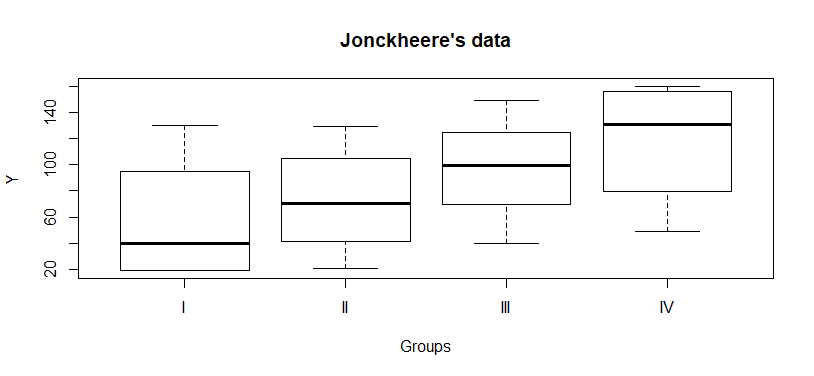
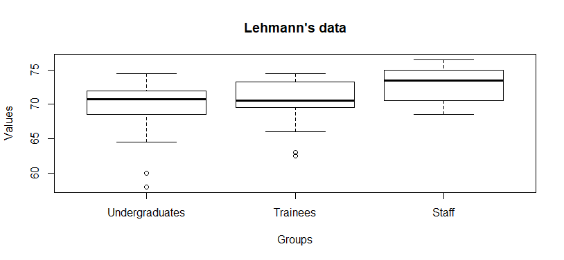
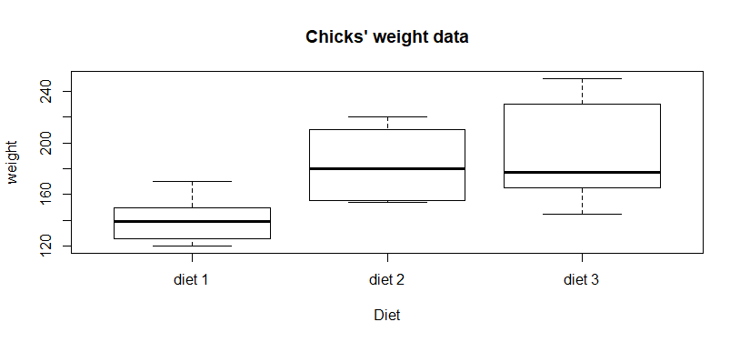
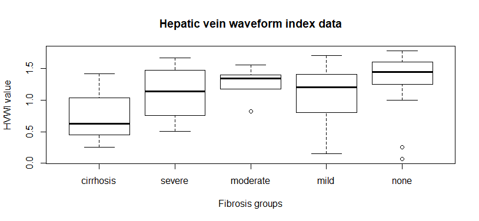
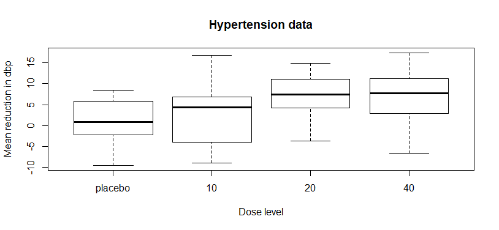
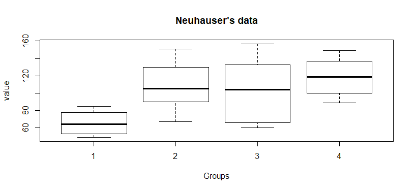

::: article
# Introduction

Ordered alternative tests are employed to evaluate if a quantitative
feature is linked to an ordinal trait, as in the association between
ammonia levels and the severity of hepatic encephalopathy [@Ong:2003],
the association of abnormal MRI findings with bone-marrow-related
disease [@Bredella:2006], and the association between single nucleotide
polymorphisms in human genes and quantitative phenotypes
[@Hoffmeyer:2000; @Cheng:2005; @Kawaguchi:2012; @Uchiyama:2012; @Tan:2014; @Yorifuji:2018]

There are parametric and nonparametric methods to test ordered
alternatives. Nevertheless, the statistical validity of parametric
methods depends upon distributional assumptions, such as normality or
equality of variances. However, nonparametric tests do not necessitate
assumptions about the distribution of the data and are robust to
outliers and influential values [@Lin:2017b].

Several nonparametric tests were developed to test the equality of
locations against ordered alternatives. These tests can be grouped under
three headings such as linear combination of two sample statistics,
linear rank statistics, and statistics based on k-tuplet.

The tests proposed by @Terpstra:1952, @Jonckheere:1954, @Puri:1965,
@Govindarajulu:1971, @Tryon:1973, @Cuzick:1985, @Le:1988,
@Neuhauser:1998, @Gaur:2014, @Shan:2014, @Gaur:2017 are based on a
linear combination of two sample statistics with pairs of samples of
$k(k-1)/2$. The problem of testing homogeneity against ordered
alternatives was considered for the first time by @Terpstra:1952 and
@Jonckheere:1954. They suggested the nonparametric test (JT) based on a
sum of $k(k-1)/2$ Mann-Whitney (MW) statistics for the ordered
alternatives.

Linear rank statistics consist of a combination of the rank scores
obtained from the combined data and the regression constants. These
statistics were originally named as the Left Skewed (LS) and Right
Skewed (RS) scores as proposed by @Hogg:1975. @Gastwirth:1965,
@Buning:1996, and @Beier:1997 proposed Short-Tailed (ST), Long-Tailed
(LT), and Wilcoxon (WS) scores, respectively. @Beier:1997 proposed a
nonparametric Adaptive Test (AT) for the choice of suitable scores based
on the underlying distribution.

The k-tuplet tests are based on the information simultaneously obtained
across all samples. These tests are determined by adding
${N^*}={n_1}\times {n_2}\times ...\times {n_k}$ functions. That is,
k-tuplet includes one observation from each group. @Terpstra:2003
proposed a test k-tuplet statistic (TM), which is based on the indicator
function. @Ferdhiana:2008 proposed a test statistic (FTM), which can be
viewed as a generalization of the TM test. The FTM test uses Kendall
correlation coefficient based on the following data:
$(1,{X_{1{i_1}}}),(2,{X_{2{i_2}}}),...,(k,{X_{k{i_k}}})$, where $X_{ij}$
$i=1,2,...,k, j=1,2,...,n_i$ is the sample data. Here, $k$ is the number
of groups and $n_i$ denotes the number of observations in the $i$th
group. Similarly, @Terpstra:2011 proposed KTP test, which uses Spearman
correlation coefficient instead of Kendall correlation coefficient.

JT is the classical and the most common ordered test. It is included in
some packages such as
[*clinfun*](https://CRAN.R-project.org/package=clinfun)
[@Venkatraman:2018],
[*jtGWAS*](https://CRAN.R-project.org/package=jtGWAS) [@Lin:2017a],
[*fastJT*](https://CRAN.R-project.org/package=fastJT) [@Lin:2017b],
[*kSamples*](https://CRAN.R-project.org/package=kSamples)
[@Scholz:2018],
[*StatCharrms*](https://CRAN.R-project.org/package=StatCharrms)
[@Swintek:2018],
[*PMCMRplus*](https://CRAN.R-project.org/package=PMCMRplus)
[@Pohlert:2018]. However, the other ordered alternative tests considered
in this study are not included in any CRAN package other than
*npordtests*.

However, there may be more efficient tests than JT for different data
scenarios; nonetheless, a perusal of literature does not yield a
comprehensive simulation study in which ordered alternative tests are
compared for various scenarios. The nonparametric ordered alternative
tests have recently been adapted for such big data structures as gene
data and machine learning [@Lin:2017b], which clearly indicates the
significance such a simulation study has.

Our study contributes significantly to the related literature in two
ways: 1) This study includes most of the ordered alternative tests in
the literature, introduced as an R package,
[*npordtests*](https://CRAN.R-project.org/package=npordtests)
[@altunkaynak:2019] including the JT, Modified JT, LS, RS, ST, LT, WS,
AT, TM, FTM, KTP, S, and Gaur's Gc tests, and presents open source
codes. The *npordtests* package is publicly available on the CRAN. 2)
This study presents a comprehensive simulation study that compares
ordered alternative tests in terms of power, which helps researchers
choose the most appropriate test for a given scenario.

The organization of this paper is presented as follows. After the
introduction, firstly, we give the theoretical information about the
nonparametric tests for ordered alternatives included in this study.
Secondly, we introduce the *npordtests* package and demonstrate the
applicability of the package using two benchmark datasets. Thirdly, a
simulation study is conducted to determine which test is the most
appropriate test for which scenario and to give some advice to the
researchers. The results of this simulation study and general comments
are given in the final section.

# Ordered alternative tests

Let $X_{i1},X_{i2},...,X_{i{n_{i}}}$, $i=1,...,k$ be random independent
samples with size $n_i$ from $k$ populations with continuous cumulative
distribution function ${F_i}(x)=F((x-{{\theta }_{i}})/{{\sigma }_{i}})$,
where $-\infty <{{\theta }_{i}}<+\infty$ and ${{\sigma }_{i}}>0$ are
location and scale parameters, respectively. The null hypothesis to
identify whether the populations have common continuous cumulative
distribution function can be expressed as

$$\label{eq:1}
{{H}_{0}}:{{F}_{1}}(x)={{F}_{2}}(x)=...={{F}_{k}}(x)\,\,\,\,\,\,\,\,\,\,\forall x.   (\#eq:1)$$

A number of test statistics have been proposed to test the null
hypothesis in \@ref(eq:1) under certain assumptions and for different
forms of $H_1$. The ordered alternative states that the distributions
are stochastically ordered, i.e.,

$$\label{eq:2}
{{H}_{1}}:{{F}_{1}}(x)\ge {{F}_{2}}(x)\ge ...\ge {{F}_{k}}(x)\,\,\,\,\exists x:{{F}_{1}}(x)>{{F}_{k}}(x)\,.   (\#eq:2)$$

Under $H_1$, ${{X}_{i}}$ tends to be smaller than ${{X}_{i+1}}$,
$i=1,2,...,k-1$, since ${{F}_{i}}(x)\ge {{F}_{i+1}}(x)$ implies that
$P({{X}_{i}}\le {{X}_{i+1}})\ge 1/2$. For the special case of the
location model, \@ref(eq:2) is equivalent to [@Terpstra:2011]
$$\label{eq:3}
{{H}_{1}}:{{\theta }_{1}}\le {{\theta }_{2}}\le ...\le {{\theta }_{k}}\,\,\,\,\,\,({{\theta }_{1}}<{{\theta }_{k}}).   (\#eq:3)$$

Similarly, the ordered alternative hypothesis

$$\label{eq:4}
{{H}_{1}}:{{F}_{1}}(x)\le {{F}_{2}}(x)\le ...\le {{F}_{k}}(x)\,\,\,\,\exists x:{{F}_{1}}(x)<{{F}_{k}}(x)\,   (\#eq:4)$$
states that ${X}_{i}$ tends to be larger than ${X}_{i+1}$,
$i=1,2,...,k-1$, since ${{F}_{i}}(x)\le {{F}_{i+1}}(x)$ implies that
$P({{X}_{i}}\ge {{X}_{i+1}})\ge 1/2$ under $H_1$ given in \@ref(eq:4).
For the location model, \@ref(eq:4) is equivalent to

$$\label{eq:5}
{{H}_{1}}:{{\theta }_{1}}\ge {{\theta }_{2}}\ge ...\ge {{\theta }_{k}}\,\,\,\,\,\,({{\theta }_{1}}>{{\theta }_{k}}).   (\#eq:5)$$

## Jonckheere-Terpstra test

This classic nonparametric test is typically used for ordered
alternatives and was proposed by @Terpstra:1952 and @Jonckheere:1954. It
is known that the Mann-Whitney statistic defines as
$${{U}_{ij}}=\sum\limits_{l=1}^{{{n}_{i}}}{\sum\limits_{m=1}^{{{n}_{j}}}{I({{X}_{il}}<{{X}_{jm}})}};$$
where ${n}_{i}$ and ${n}_{j}$ are the sample sizes for the $i$th and
$j$th populations, respectively, and $I(\psi )=1$ if $\psi$ is true and
0 otherwise. The test statistic JT corresponds to the sum of the
$k(k-1)/2$ Mann-Whitney statistics, i.e.,
$$\label{eq:6}
JT=\sum\limits_{i=1}^{k-1}{\sum\limits_{j=i+1}^{k}{U_{ij}}}.   (\#eq:6)$$

The statistic JT is approximately normally distributed under ${H}_{0}$.
The mean and variance of this statistic are
$$E(JT)=\frac{{{N}^{2}}-\sum\limits_{i=1}^{k}{n_{i}^{2}}}{4}$$
and
$$V(JT)=\frac{{{N}^{2}}(2N+3)-\sum\limits_{i=1}^{k}{n_{i}^{2}(2{{n}_{i}}+3)}}{72},$$
where $N={n}_{1}+{n}_{2}+...+{n}_{k}$.

## Beier and Buning's Adaptive test

This test is a two-step method based on the selection of the weight
coefficients of the linear rank statistics according to the shape of the
distribution [@Beier:1997]. A linear rank statistics has the following
form:

$$\label{eq:7}
{L_N}=\sum\limits_{i=1}^{k}{\sum\limits_{j=1}^{n_i}{c_N}(i){a_N}({R_{ij}})}   (\#eq:7)$$
where $N$ is the combined sample size; ${c}_{N}(.)$ are the regression
constants; ${a}_{N}(.)$ are the scores; ${R}_{ij}$ is the rank of
${X}_{ij}$ in the combined data. For an ordered alternative, the
following proposal is made:
$${{c}_{N}}(i)=i, i=1,2,...,k.$$

Under ${H}_{0}$, the mean and variance of linear rank statistics are
$$E({{L}_{N}})=N{{\bar{c}}_{N}}{{\bar{a}}_{N}},$$
and
$$V({{L}_{N}})=\frac{1}{N-1}\sum\limits_{i=1}^{k}{{{n}_{i}}{{({{c}_{N}}(i)-{{{\bar{c}}}_{N}})}^{2}}\sum\limits_{r=1}^{N}{{{({{a}_{N}}(r)-{{{\bar{a}}}_{N}})}^{2}}}}$$
where
$${{\bar{c}}_{N}}=\frac{1}{N}\sum\limits_{i=1}^{k}{{{n}_{i}}{{c}_{N}}(i)}$$
and
$${{\bar{a}}_{N}}=\frac{1}{N}\sum\limits_{r=1}^{N}{{{a}_{N}}(r)}.$$
The distribution of a linear rank statistic converges to a normal
distribution with mean $E({L}_{N})$ and variance $V({L}_{N})$
[@HoggBook; @Beier:1997].

There are some suggestions for the score ${a}_{N}(.)$ according to the
shape of the distribution in the literature as follows
$${a}_{LS}(r)=\begin{cases}
0    & \text{if }\,r\le (N+1)/2 \\ 
r-(N+1)/2 & \text{if }\,r>(N+1)/2 
\end{cases}$$
These scores are efficient for detecting shifts in distributions that
are skewed to the left [@Beier:1997].
$${a}_{ST}(r)=\begin{cases}
r-(N+1)/4 & \text{if }\,r\le (N+1)/4 \\
0    & \text{if }\,(N+1)/4<r<3(N+1)/4 \\ 
r-3(N+1)/4 & \text{if }\,r\geq 3(N+1)/4 
\end{cases}$$
These scores are particularly good for detecting shifts in short-tailed
distributions and were proposed by @Gastwirth:1965.
$${{a}_{WS}}(r)=r,\,\,\,\,\,\,r=1,2,...,N$$
These scores are efficient for detecting shifts in symmetric
distributions with medium to heavy tails [@Beier:1997].
$${a}_{LT}(r)=\begin{cases}
-((N/4)+1)  & \text{if }\,r<(N/4)+1 \\
r-(N+1)/2 & \text{if }\,(N/4)+1\le r\le 3(N+1)/4 \\ 
(N/4)+1 & \text{if }\,r>3(N+1)/4 
\end{cases}$$
These scores are efficient for detecting shifts in long-tail
distributions and were proposed by @Buning:1996.
$${a}_{RS}(r)=\begin{cases}
r-(N+1)/2 & \text{if }\,r\le (N+1)/2 \\ 
0   & \text{if }\,r>(N+1)/2 
\end{cases}$$
These scores are efficient for detecting shifts in distributions that
are skewed to the right [@Hogg:1975].

The adaptive test proposed by @Beier:1997 is denoted by the index of
their scores. For example, the distribution-free test based on the
scores ${a}_{ST}(.)$ of @Gastwirth:1965, which is particularly good for
detecting a shift in short-tailed distributions, is denoted by ST. Now,
the adaptive test AT is defined by
$$\label{eq:8}
AT=\begin{cases} 
LS  & \text{if }\,0\le {\hat{S}}_{1} \le 0.6, {\hat{S}}_{2}\geq 1 \\
ST & \text{if }\,0.6<{\hat{S}}_{1} \le 2, 1\le {\hat{S}}_{2} \le 1.5 \\ 
WS & \text{if }\,0.6<{\hat{S}}_{1} \le 2, 1.5<{\hat{S}}_{2} \le 1.5 \\
LT & \text{if }\,0.6<{\hat{S}}_{1} \le 2, {\hat{S}}_{2} \geq 2 \\
RS & \text{if }\,{\hat{S}}_{1} \geq 2, {\hat{S}}_{2} \geq 1
\end{cases}   (\#eq:8)$$
where ${x}_{p}$ is the quantile value of the combined data, and the
estimation values of the skewness and tailweight of the distribution are
$${{\hat{S}}_{1}}=\frac{{{x}_{0.975}}-{{x}_{0.5}}}{{{x}_{0.5}}-{{x}_{0.025}}}$$
and
$${{\hat{S}}_{2}}=\frac{{{x}_{0.975}}-{{x}_{0.025}}}{{{x}_{0.875}}-{{x}_{0.125}}}.$$
Since the adaptive statistic is a linear rank statistic, the
distribution of each of these statistics converges to a normal
distribution with mean $E({L}_{N})$ and variance $V({L}_{N})$.

## Modified Jonckheere-Terpstra test

@Tryon:1973 proposed the modified JT statistic to test ${H}_{0}$ against
the ordered alternatives,
$$\label{eq:9}
MJT=\sum\limits_{i=1}^{k-1}{\sum\limits_{j=i+1}^{k}{(j-i){{U}_{ij}}}},   (\#eq:9)$$
where ${{U}_{ij}}$ is the Mann-Whitney statistic computed for the
samples from the $i$th and $j$th populations. @Neuhauser:1998 suggested
that this test be used in place of the JT tests because it often has
larger powers.

This statistic has a normal distribution under ${H}_{0}$, and its mean
and variance are
$$E({{U}_{ij}})=\frac{1}{2}{{n}_{i}}{{n}_{j}},\,\,\,\,\,\, \forall i\ne j$$

$$V({{U}_{ij}})=\frac{1}{12}{{n}_{i}}{{n}_{j}}({{n}_{i}}+{{n}_{j}}+1),\,\,\,\,\,\, \forall i\ne j$$

$$Cov({{U}_{ij}},{{U}_{il}})=Cov({{U}_{ji}},{{U}_{li}})=\frac{1}{12}{{n}_{i}}{{n}_{j}}{{n}_{l}},\,\,\, \text{if all}\, i, j,l \, \text{are different}$$

$$Cov({{U}_{ij}},{{U}_{li}})=Cov({{U}_{ji}},{{U}_{il}})=-\frac{1}{12}{{n}_{i}}{{n}_{j}}{{n}_{l}},\,\,\, \text{if all}\, i, j,l \, \text{are different}$$

$$Cov({{U}_{ij}},{{U}_{lm}})=0,\,\,\, \text{if all}\, i, j,l,m \, \text{are different}$$

## Terpstra-Magel test

@Terpstra:2003 proposed a test statistic that does not focus on pairwise
information. Instead, they use the information present in the
${N^*}={n_1}\times {n_2}\times ...\times {n_k}$ k-tuplets, where a
k-tuplet includes one observation from each treatment group. More
specifically, the Terpstra--Magel (TM) test is based on the following
statistic:

$$\label{eq:10}
TM=\sum\limits_{{i_1}=1}^{n_1}...\sum\limits_{{i_k}=1}^{n_k}{I(X_{1{i_1}}\le X_{2{i_2}}\le ...\le X_{k{i_k}})}   (\#eq:10)$$
where the indicator function is equal to one when
$X_{1{i_1}}<X_{k{i_k}}$.

The statistic TM is approximately normally distributed under ${H}_{0}$.
The mean and variance of this statistic are
$$E(TM)=\frac{N^*}{k!}$$
and
$$V(TM)={N^*}\left(\frac{1}{k!}\right) \left(1-\frac{1}{k!}\right)+\sum\limits_{i=1}^{k-1}v_i^2$$
where
$$v_i^2=\sum\limits_{1\le l_1<...<l_i\le k}{N^*} \left[\prod\limits_{s=1}^{k}(n_s-1)^{I(s\neq l_1)...I(s\neq l_i)}\right] \left[ \frac{{{2(k-l_i)}\choose{k-l_i}}}{2k-i}      \prod\limits_{s=1}^{i}{{2(l_s-l_{s-1}-1)}\choose{l_s-l_{s-1}-1}}-\frac{1}{(k!)^2}\right]$$
where $l_0=0$.

## Ferdhiana-Terpstra-Magel test

@Ferdhiana:2008 proposed FTM test statistic can be viewed as a
generalization of the TM test.

$$\label{eq:11}
FTM=\sum\limits_{{i_1}=1}^{{n_1}}{...\sum\limits_{{i_k}=1}^{n_k}{{\tau}({X_{1{i_1}}},{{X}_{2{i_2}}},...,{X_{k{i_k}}})}}   (\#eq:11)$$
where $\tau({X_{1{i_1}}},{{X}_{2{i_2}}},...,{X_{k{i_k}}})$ denotes the
Kendall correlation coefficient based on
$(1,{X_{1{i_1}}}),(2,{X_{2{i_2}}}),...,$ $(k,{X_{k{i_k}}})$.

Under ${{H}_{0}}$, the statistic FTM is approximately normally
distributed with zero mean, and its variance is

$$\begin{aligned}
V(FTM)=\left[\frac{2{N^{*}}}{\sqrt{3}k(k-1)}\right]^2\bigg[\sum\limits_{r=1}^{k-1}\sum\limits_{s=r+1}^{k}\frac{n_r+n_s+1}{{n_r}{n_s}}&+2\sum\limits_{r=1}^{k-2}\frac{1}{n_r}\left({{k}\choose{2}}+\frac{r^2-(2k-1)r}{2}\right)\\&-2\sum\limits_{r=1}^{k-2} \sum\limits_{s=r+1}^{k-1}\frac{k-s}{n_s}+2\sum\limits_{r=1}^{k-2} \sum\limits_{s=r+1}^{k-1} \sum\limits_{t=s+1}^{k}\frac{1}{n_i} \bigg]. 
\end{aligned}$$

## KTP test

@Terpstra:2011 proposed the k-tuplet Terpstra-Page (KTP) test based on
the statistic

$$\label{eq:12}
KTP=\sum\limits_{{i_1}=1}^{{{n}_{1}}}{...\sum\limits_{{i_k}=1}^{{{n}_{k}}}{{{r}_{s}}({{X}_{1{{i}_{1}}}},{{X}_{2{{i}_{2}}}},...,{{X}_{k{{i}_{k}}}})}}   (\#eq:12)$$
where
${r}_{s}({{X}_{1{i}_{1}}},{{X}_{2{{i}_{2}}}},...,{{X}_{k{{i}_{k}}}})$
denotes the Spearman rank correlation coefficient based on
${(1,{X_{1{i_1}}}),}$ ${(2,{X_{2{i_2}}}),...,(k,{X_{k{i_k}}})}$.

Under ${{H}_{0}}$, the statistic KTP is approximately normally
distributed, and its mean and variance are
$$E(KTP)=0$$
, and
$$V(KTP)=\frac{144{{({{N}^{*}})}^{2}}}{{{k}^{2}}{{({{k}^{2}}-1)}^{2}}}S,$$
where

$$\begin{aligned}
S =\sum\limits_{{i}_{1}=1}^{k-1}&{\sum\limits_{{i}_{2}={i}_{1}+1}^{k} {\left[ \frac{{{({{i}_{2}}-{{i}_{1}})}^{2}}({{n}_{{{i}_{1}}}}+{{n}_{{{i}_{2}}}}+1)}{12{{n}_{{{i}_{1}}}}{{n}_{{{i}_{2}}}}} \right]}}\\ & +\sum\limits_{{{i}_{1}}=1}^{k-2}{\sum\limits_{{{i}_{2}}={{i}_{1}}+1}^{k-1}{\sum\limits_{{{i}_{3}}={{i}_{2}}+1}^{k}{\left[ \frac{({{i}_{2}}-{{i}_{1}})({{i}_{3}}-{{i}_{1}})}{6{{n}_{{{i}_{1}}}}}+ \frac{({{i}_{3}}-{{i}_{2}})({{i}_{1}}-{{i}_{2}})}{6{{n}_{{{i}_{2}}}}}+\frac{({{i}_{1}}-{{i}_{3}})({{i}_{2}}-{{i}_{3}})}{6{{n}_{{{i}_{3}}}}} \right]}}}
\end{aligned}$$

In the KTP test, Spearman's rank correlation coefficient $r_s$ is given
by the following formula:

$${r_s}=1-\frac{6\sum\limits_{i=1}^{k}d_i^2}{k(k^2-1)}$$
where $d_i$ represents the difference between the rank given to the
value of the variable for each item of the particular data with $y_i$.
This formula is applied in cases when there are no tied observations.
The formula to use when there are tied observations is:

$${r_s}=\frac{\sum\limits_{i=1}^{k}(y_i-\bar y)(x_i-\bar x)}{\sqrt{{\sum\limits_{i=1}^{k}(y_i-\bar y)^2}{\sum\limits_{i=1}^{k}(x_i-\bar x)^2}}}$$
where $(y,x)={(1,{X_{1{i_1}}}),(2,{X_{2{i_2}}}),...,(k,{X_{k{i_k}}})}$
and $x_i$ is rank of $X_i$. Note that if all of $x_i$ values is equal,
then ${\sum(x_i-\bar x)^2}$ is zero. This result is also similar for
Kendall correlation coefficient. Therefore, FTM and KTP tests cannot be
applied to this type data. See Lehmann's data used in the demonstration
of the *npordtests* package.

## S test

@Shan:2014 proposed the new rank-based nonparametric test by
incorporating the actual differences as follows
$$\label{eq:13}
S=\sum\limits_{i=1}^{k-1}{\sum\limits_{j=i+1}^{k}{{{D}_{ij}}}}   (\#eq:13)$$
where
$${D}_{ij}=\sum\limits_{l=1}^{{n}_{i}}{\sum\limits_{m=1}^{{n}_{j}}{{Z}_{ijlm}}},\,\,\, {Z}_{ijlm}=({R}_{jm}-{{R}_{il}})I({X}_{jm}>{X}_{il})$$
and ${R}_{il}({R}_{jm})$ is the rank of observation ${X}_{il}({X}_{jm})$
in the combined data.

Under ${H}_{0}$, the statistic $S$ has a normal distribution with the
following mean and variance
$$E(S)=\frac{N+1}{6}\sum\limits_{i=1}^{k-1}{\sum\limits_{j=i+1}^{k}{{{n}_{i}}{{n}_{j}}}}$$

$$\begin{aligned}
V(S)=&\left(\frac{N^2+N}{12}-\frac{(N+1)^2}{36}\right)\sum\limits_{i=1}^{k-1}{\sum\limits_{j=i+1}^k{{n_i}{n_j}}}\\& +2\left[\sum\limits_{i=1}^{k-1}{{n_i}{{\sum\limits_{j=i+1}^{k}{n_j}}\choose{2}}}+\sum\limits_{i=2}^{k}{n_i}{{\sum\limits_{j=1}^{i-1}{n_j}}\choose{2}}\right]CovA+2\left( \sum\limits_{i=1}^{k-2}{\sum\limits_{j=i+1}^{k-1}{\sum\limits_{l=j+1}^{k}{n_i}{n_j} {n_l}}} \right)CovB 
\end{aligned}$$
where $CovA=\frac{2{{N}^{2}}+N-1}{90}$, and
$CovB=\frac{-7{{N}^{2}}-11N-4}{360}$.

## Gaur's Gc test

Let $({w}_{1},{w}_{2},...,{w}_{k-1})$ be suitably selected real positive
constants. @Gaur:2017 proposed the ${G}_{c}$ statistic to test ${H}_{0}$
against the ordered alternatives,
$$\label{eq:14}
{{G}_{c}}=\sum\limits_{g=1}^{k-1}{{{w}_{g}}{{V}_{g,g+1}}}   (\#eq:14)$$
where
$${{V}_{g,h}}={\left[ {{{n_g}\choose{c}} {{n_h}\choose{c}}}\right]^{-1}}
\sum\limits_{0}{{{\phi }_{gh}}({{X}_{g{{\alpha }_{1}}}},...,{{X}_{g{{\alpha }_{c}}}};{{X}_{h{{\beta }_{1}}}},...,{{X}_{h{{\beta }_{c}}}})}$$
for $g<h$; $h=1,2...,k$; $\underset{0}{\mathop \sum }\,$ is the sum over
all combinations $({\alpha }_{1},...,{\alpha }_{c})$ of $c$ integers
selected from $(1,...,{n}_{g})$ and over all combinations
$({\beta }_{1},...,{\beta }_{c})$ of $c$ integers selected from
$(1,...,{n}_{h})$;
$${{\phi }_{gh}}({{X}_{g{{\alpha }_{1}}}},...,{{X}_{g{{\alpha }_{c}}}};{{X}_{h{{\beta }_{1}}}},...,{{X}_{h{{\beta }_{c}}}})=\begin{cases}
1   & \text{if }\,\text{max(}{{X}_{g{{\alpha }_{1}}}},...,{{X}_{g{{\alpha }_{c}}}}\text{)}\le \text{min(}{{X}_{h{{\beta }_{1}}}},...,{{X}_{h{{\beta }_{c}}}}\text{)} \\
-1 & \text{if }\,\text{max(}{{X}_{h{{\beta }_{1}}}},...,{{X}_{h{{\beta }_{c}}}}\text{)}\le \text{min(}{{X}_{g{{\alpha }_{1}}}},...,{{X}_{g{{\alpha }_{c}}}}\text{)} \\ 
0 & \text{otherwise } 
\end{cases}
.$$

The distribution of Gaur's statistic ${G}_{c}$ converges to a normal
distribution with zero mean under ${H}_{0}$, and the variance of this
statistic are obtained as follows

$$V(G_c)=\mathbf{w}^\top \sum \mathbf{w}$$
where $\mathbf{w}^\top=(w_1,w_2,...,w_{k-1})$ and $\sum=[\sigma_{gh}]$
is the variance-covariance matrix, such as:

$$\sigma_{gh}=\begin{cases}
{{\left( \frac{(c-1)!c!}{(2c-1)!} \right)}^{2}} \left( \frac{1}{\lambda_g}+\frac{1}{\lambda_{g+1}} \right) \delta_c  & \text{for } g=h=1,2,...,k-1 \\
-{{\left( \frac{(c-1)!c!}{(2c-1)!} \right)}^{2}}  \frac{\delta_c}{\lambda_{g+1}} & \text{for } h=g+1;g=1,2,...,k-2\\
-{{\left( \frac{(c-1)!c!}{(2c-1)!} \right)}^{2}}  \frac{\delta_c}{\lambda_g} & \text{for } h=g-1;g=2,...,k-1\\
0 & \text{otherwise}
\end{cases}$$
where
$${{\delta }_{c}}=-1+\frac{4}{4c-1}\sum\limits_{i=c}^{2c-1}{\sum\limits_{j=c}^{2c-1}{{2c-1}\choose{i}} {{2c-1}\choose{j}} {{4c-2}\choose{i+j}}^{-1}}
.$$

It is recommended to use $G_c$ tests for light-tailed and
moderate-tailed distributions with $c=2$, whereas for heavy-tailed and
long-tailed distributions with large values of $c$. The optimum weights
$w_g$'s in the $G_c$ test are

$$w_g=\frac{g(k-g)}{2k},\,\,g=1,2,...,k-1.$$

# Demonstration of the npordtests package

The **npordtests** package includes thirteen tests and six datasets for
ordered alternatives. In this section, firstly, we introduce the
datasets included in the package. Then, we demonstrate the usage of the
package by using two of these datasets. All the examples in this section
should run if you type them in exactly as printed, provided that you
have the **npordtests** package not only installed but also loaded into
your current search path. This is done by entering

``` r
R> library(npordtests)
```

at the command prompt.

## Datasets

### Jonckheere's data: jdata

This hypothetic data given by @Jonckheere:1954 are used to test the
hypothesis that the four samples have come from the same population
against the alternative that the populations are such that the values
from the samples I, II, III, IV are in an expected order of increasing
value.

### Lehmann's data: lehmann

This dataset was used by @Lehmann:1975 to assess if it is possible for a
particular diagnostic test to be successfully interpreted without
psychological training. This dataset later became one of the classical
datasets used to investigate sequential alternatives [@Beier:1997]. The
data included 72 evaluators' (21 staff members, 23 trainees and 28
undergraduate psychology majors) assessment scores for the diagnostic
test. If training and experience have any effects, the staff members
could be expected to perform the most accurately, the trainees next, and
the undergraduates the least.

### Chicks' weight data: chicks

These data are given by @Desu:2004 to examine the hypothesis that the
chicks' mean weight goes up with the increase in the amount of protein.
Eighteen chicks were randomly assigned to three treatments with six
chicks in each for balanced data. Treatment 1 had the diet with the
lowest level of protein; treatment 2 had the diet with a medium level of
protein; and treatment 3 had the highest level of protein. After six
weeks of feeding, the values of weight gain were recorded. We wanted to
test if the mean weight gain increased with the amount of protein
[@Chang:2011].

### Hepatic vein waveform index data: hvwi

These data were collected by @Pedersen:2008 through doppler waveforms
corresponding to 66 patients scheduled for a percutaneous liver needle
biopsy. The waveforms were characterized using a hepatic vein waveform
index (HVWI), whereas the biopsy specimens were grouped according to the
degree of fibrosis. The hypothesis of interest was that the HVWI values
would tend to decrease as the degree of fibrosis increases
[@Terpstra:2011].

### Hypertension data: hypertension

These data presented by @Dmitrienko:2006 examine the effect of different
drug doses on diastolic blood pressure. The patients with hypertension
were randomized into four groups with different dose levels, 0, 10, 20,
and 40 mg/day, where the group with 0 mg/day was the placebo group. The
number of the patients in each group were 17, 17, 18, and 16,
respectively. The complete data can be found at the @Dmitrienko:2006 or
@Shan:2014.

### Neuhauser's data: neuhauser

These synthetic data are reported by @Neuhauser:1998. The data consist
of 4 groups with 10 observations in each.

In order to compare the distributions of groups for each dataset, the
boxplots are given in Figure [1](#fig:boxplots). As can be seen from the
figure, there is a ordered alternative pattern in all datasets.

<figure id="fig:boxplots">
<p></p>
<p></p>
<p></p>
<figcaption>Figure 1: Boxplots for the datasets. Each box plot gives
median (the bold line that divides the box into two parts), lower and
upper quartiles (start and end points of the box on the vertical axis)
and min and max value (the horizontal lines outside the box). The
outliers appear as the circles.</figcaption>
</figure>

## Tests

Using the datasets which are named **jdata** and **lehmann**,
demonstration of the tests are given below, respectively.

### Jonkheere-Terpstra test: JtTest(\...)

The `JtTest` function in the *npordtests* package is used to perform the
Jonkheere-Terpstra test.

``` r
R> data(jdata)
R> JtTest(Y~X,jdata,alpha=0.05,na.rm=TRUE,verbose=TRUE)

--------------------------------------------------------- 
Test : Jonckheere-Terpstra Test 
data : Y and X 

Statistic = 71 
Mean = 48 
Variance = 114.6667 
Z = 2.147876 
Asymp. p-value = 0.0158618 

Result     : Null hypothesis is rejected. 
--------------------------------------------------------- 
```

Here, the `JT statistic` is calculated from the Equation \@ref(eq:6).
Also, the `Mean` and `Variance` are expected value and variance of the
JT statistic, respectively. `Z` is calculated from
$(JT-E(JT))/\sqrt{V(JT)}$. `p-value` is the significance value for the
JT test. Because this p-value is smaller than $\alpha =0.05$, the
hypothesis of the equality of locations against the ordered alternative
is rejected.

`alpha` is the level of significance to assess the statistical
difference. Default is set to `alpha = 0.05`. `na.rm` is a logical value
indicating whether NA values should be stripped before the computation
proceeds. Default is `na.rm = TRUE`. `verbose` is a logical for printing
output to R console. Default is set to `verbose = TRUE`. These arguments
are available in the functions for ordered alternatives. The users who
would like to use the statistics in the output in their programs can use
the following codes.

``` r
R> res<-JtTest(Y~X,jdata,alpha=0.05,na.rm=TRUE,verbose=FALSE)

R> res$statistic
[1] 71

R> res$mean
[1] 48

R> res$variance
[1] 114.6667

R> res$Z
[1] 2.147876

R> res$p.value
[1] 0.0158618
```

Here, the codes for how to obtain the statistics from the
Jonckheere-Terpstra test output are given. Since all ordered alternative
tests return similar outputs, similar codes are not repeated in the
other tests. For all tests, the level of significance is taken as 0.05.

### Beier and Buning's Adaptive test: AtTest(\...)

The `AtTest` function in the *npordtests* package is used to perform the
Adaptive test. The LS, RS, ST, WS and LT tests are also available as
functions in the package.

``` r
R> LsTest(Y~X,jdata)
 
--------------------------------------------------------- 
Test : LS test 
data : Y and X 

Statistic = 68 
Mean = 48 
Variance = 141.3333 
Z = 1.682316 
Asymp. p-value = 0.04625375 

Result     : Null hypothesis is rejected. 
--------------------------------------------------------- 
```

Here, the `Statistic` is calculated from the Equation \@ref(eq:7) using
the score ${a}_{LS}(r)$. Also, the `Mean` and `Variance` are the
expected value and variance of the this statistic, respectively. `Z` is
calculated from $(LS-E(LS))/\sqrt{V(LS)}$. `p-value` is the significance
value for the LS test. Since this `p-value` is smaller than
$\alpha =0.05$, the null hypothesis against the ordered alternative is
rejected.

``` r
R> RsTest(Y~X,jdata)
 
--------------------------------------------------------- 
Test : RS test 
data : Y and X 

Statistic = -27 
Mean = -48 
Variance = 141.3333 
Z = 1.766432 
Asymp. p-value = 0.03866168 

Result     : Null hypothesis is rejected. 
--------------------------------------------------------- 
```

In the output, similar to `LsTest`, the `Statistic` is calculated from
the Equation \@ref(eq:7) using the score ${a}_{RS}(r)$. `Z` is
calculated from $(RS-E(RS))/\sqrt{V(RS)}$. `p-value` is the significance
value for the RS test. According to these results, because the `p-value`
is smaller than $\alpha =0.05$, the hypothesis of the equality of
locations against the ordered alternative is rejected.

``` r
R> StTest(Y~X,jdata)
 
--------------------------------------------------------- 
Test : ST test 
data : Y and X 

Statistic = 17.25 
Mean = 0 
Variance = 46 
Z = 2.543374 
Asymp. p-value = 0.005489386 

Result     : Null hypothesis is rejected. 
--------------------------------------------------------- 
```

In the output, the `Statistic` is calculated from the Equation
\@ref(eq:7) using the score ${a}_{ST}(r)$. `Z` is calculated from
$(ST-E(ST))/\sqrt{V(ST)}$. `p-value` is the significance value for the
ST test. Here, the `Statistic` is calculated value of the test
statistic. The `p-value` for the TM test is 0.005489386. Thus, we can
conclude that the null hypothesis of the equality of locations is
rejected under setting $\alpha=0.05$.

``` r
R> WsTest(Y~X,jdata)
 
--------------------------------------------------------- 
Test : WS test 
data : Y and X 

Statistic = 245 
Mean = 204 
Variance = 453.3333 
Z = 1.92564 
Asymp. p-value = 0.02707469 

Result     : Null hypothesis is rejected. 
--------------------------------------------------------- 
```

Here, the `WS statistic` is calculated from the Equation \@ref(eq:7)
using the score ${a}_{WS}(r)$. `Z` is calculated from
$(WS-E(WS))/\sqrt{V(WS)}$. `p-value` is the significance value for the
WS test. Because this `p-value` is smaller than $\alpha =0.05$, the
hypothesis of the equality of locations against the ordered alternative
is rejected.

``` r
R> LtTest(Y~X,jdata)
 
--------------------------------------------------------- 
Test : LT test 
data : Y and X 

Statistic = 27.5 
Mean = 0 
Variance = 322.6667 
Z = 1.530931 
Asymp. p-value = 0.06289321 

Result     : Null hypothesis is not rejected. 
--------------------------------------------------------- 
```

The `LT statistic` is calculated from the Equation \@ref(eq:7) using the
score ${a}_{LT}(r)$. `Z` is calculated from $(LT-E(LT))/\sqrt{V(LT)}$.
`p-value` is the significance value for the LT test. According to these
results, because the `p-value` is not smaller than $\alpha =0.05$, the
hypothesis of the equality of locations (null hypothesis) is not
rejected.

``` r
R> AtTest(Y~X,jdata)
 
--------------------------------------------------------- 
Test : Adaptive Test 
data : Y and X 

Statistic = 17.25 
Mean = 0 
Variance = 46 
Z = 2.543374 
Asymp. p-value = 0.005489386 

Result     : Null hypothesis is rejected. 
--------------------------------------------------------- 
```

Here, the `Statistic` is calculated from the Equation \@ref(eq:8). Note
that the AT `Statistic` is equal to the ST `Statistic` for this example.
Since this `p-value` is smaller than $\alpha =0.05$, the null hypothesis
against the ordered alternative is rejected.

### Modified Jonkheere-Terpstra test: MjtTest(\...)

The `MjtTest` function in the *npordtests* package is used to perform
the MJT test.

``` r
R> MjtTest(Y~X,jdata)
 
--------------------------------------------------------- 
Test : Modified Jonckheere-Terpstra Test 
data : Y and X 

Statistic = 121 
Mean = 80 
Variance = 453.3333 
Z = 1.92564 
Asymp. p-value = 0.02707469 

Result     : Null hypothesis is rejected. 
--------------------------------------------------------- 
```

Here, the `Statistic` is calculated from the Equation \@ref(eq:9).
According to these results, because the `p-value` is smaller than
$\alpha =0.05$, the hypothesis of the equality of locations against the
ordered alternative is rejected.

### Terpstra-Magel test: TmTest(\...)

The `TmTest` function in the *npordtests* package is used to perform the
TM test.

``` r
R> TmTest(Y~X,jdata)
 
--------------------------------------------------------- 
Test : Terpstra-Magel Test 
data : Values and Group 

Statistic = 78 
Mean = 10.66667 
Variance = 151.327 
Z = 5.473586 
Asymp. p-value = 2.205097e-08 

Result : Null hypothesis is rejected. 
--------------------------------------------------------- 
```

In the output, the `Statistic` is calculated from the Equation
\@ref(eq:10). `Z` is calculated from $(TM-E(TM))/\sqrt{V(TM)}$.
`p-value` is the significance value for the TM test. The `p-value` for
the TM test is $0.00000002205097$. Thus, we can conclude that the null
hypothesis of the equality of locations is rejected under setting
$\alpha=0.05$.

### Ferdhiana-Terpstra-Magel test: FtmTest(\...)

The `FtmTest` function in the *npordtests* package is used to perform
the FTM test.

``` r
R> FtmTest(Y~X,jdata)
 
--------------------------------------------------------- 
Test : Ferdhiana, Terpstra and Magel Test 
data : Y and X 

Statistic = 122.6667 
Mean = 0 
Variance = 3261.63 
Z = 2.147876 
Asymp. p-value = 0.0158618 

Result     : Null hypothesis is rejected. 
--------------------------------------------------------- 
```

Here, the `Statistic` is calculated from the Equation \@ref(eq:11). `Z`
is calculated from $FTM/\sqrt{V(FTM)}$. `p-value` is the significance
value for the FTM test. Because this `p-value` is smaller than
$\alpha =0.05$, the hypothesis of the equality of locations against the
ordered alternative is rejected.

### KTP test: KtpTest(\...)

The `KtpTest` function in the *npordtests* package is used to perform
the KTP test.

``` r
R> KtpTest(Y~X,jdata)
 
--------------------------------------------------------- 
Test : KTP Test 
data : Y and X 

Statistic = 131.2 
Mean = 0 
Variance = 4642.133 
Z = 1.92564 
Asymp. p-value = 0.02707469 

Result     : Null hypothesis is rejected. 
--------------------------------------------------------- 
```

Here, the `Statistic` is calculated from the Equation \@ref(eq:12). `Z`
is calculated from $KTP/\sqrt{V(KTP)}$. `p-value` is the significance
value for the KTP test. Since this `p-value` is smaller than
$\alpha =0.05$, the null hypothesis against the ordered alternative is
rejected.

### S test: SsTest(\...)

The `SsTest` function in the *npordtests* package is used to perform the
S test.

``` r
R> SsTest(Y~X,jdata)
 
--------------------------------------------------------- 
Test : Shan's S test 
data : Y and X 

Statistic = 436 
Mean = 272 
Variance = 1973.511 
Z = 3.69168 
Asymp. p-value = 0.0001113888 

Result     : Null hypothesis is rejected. 
--------------------------------------------------------- 
```

In the output, the `Statistic` is calculated from the Equation
\@ref(eq:13). `Z` is calculated from $(S-E(S))/\sqrt{V(S)}$. `p-value`
is the significance value for the S test. According to these results,
because the `p-value` is smaller than $\alpha =0.05$, the hypothesis of
the equality of locations against the ordered alternative is rejected.

### Gaur's Gc test: GcTest(\...)

The `GcTest` function in the *npordtests* package is used to perform the
Gaur's Gc test.

``` r
R> GcTest(Y~X,jdata)
 
--------------------------------------------------------- 
Test : Gaur's Gc Test 
data : Values and Group 

Statistic = 0.375 
Mean = 0 
Variance = 0.06746032 
Z = 1.4438 
Asymp. p-value = 0.0743976 

Result : Null hypothesis is not rejected. 
--------------------------------------------------------- 
```

Here, the `Statistic` is calculated from the Equation \@ref(eq:14). `Z`
is calculated from $G_c/\sqrt{V(G_c)}$. `p-value` is the significance
value for the $G_c$ test. Here, the `Statistic` is calculated value of
the test statistic. The `p-value` for the $G_c$ test is 0.0743976. Thus,
we can conclude that the null hypothesis of the equality of locations is
not rejected under setting $\alpha=0.05$.

## Jonkheere-Terpstra test: JtTest(\...)

The `JtTest` function in the *npordtests* package is used to perform the
JT test.

``` r
R> data(lehmann)
R> JtTest(Values~Group,lehmann)

--------------------------------------------------------- 
Test : Jonckheere-Terpstra Test 
data : Values and Group 

Statistic = 1159 
Mean = 857.5 
Variance = 9305.917 
Z = 3.125415 
Asymp. p-value = 0.0008877709 

Result     : Null hypothesis is rejected. 
--------------------------------------------------------- 
```

Here, the `Statistic` is calculated value of the test statistic.
`p-value` is the significance value for this test. The `p-value` for the
JT test is 0.0008877709. Thus, we can conclude that the null hypothesis
of the equality of locations is rejected under setting $\alpha=0.05$.

## Beier and Buning's Adaptive test: AtTest(\...)

The `AtTest` function in the *npordtests* package is used to perform the
AT test.

``` r
R> AtTest(Values~Group,lehmann)
 
--------------------------------------------------------- 
Test : Adaptive Test 
data : Values and Group 

Statistic = 851 
Mean = 583.1944 
Variance = 6570.726 
Z = 3.303794 
Asymp. p-value = 0.0004769302 

Result     : Null hypothesis is rejected. 
--------------------------------------------------------- 
```

Here, the `Statistic` is calculated value of the test statistic.
`p-value` is the significance value for this test. The `p-value` for the
AT test is 0.0004769302. Because this `p-value` is smaller than
$\alpha =0.05$, the hypothesis of the equality of locations against the
ordered alternative is rejected.

## Modified Jonkheere-Terpstra test: MjtTest(\...)

The `MjtTest` function in the *npordtests* package is used to perform
the MJT test.

``` r
R> MjtTest(Values~Group,lehmann)
 
--------------------------------------------------------- 
Test : Modified Jonckheere-Terpstra Test 
data : Values and Group 

Statistic = 1610 
Mean = 1151.5 
Variance = 20771.92 
Z = 3.181274 
Asymp. p-value = 0.0007331448 

Result     : Null hypothesis is rejected. 
--------------------------------------------------------- 
```

Here, the `Statistic` is calculated value of the test statistic.
`p-value` is the significance value for the MJT test. The `p-value` for
the MJT test is 0.0007331448. Since this `p-value` is smaller than
$\alpha =0.05$, the null hypothesis against the ordered alternative is
rejected.

## Terpstra-Magel test: TmTest(\...)

The `TmTest` function in the *npordtests* package is used to perform the
TM test.

``` r
R> TmTest(Values~Group,lehmann)
 
--------------------------------------------------------- 
Test : Terpstra-Magel Test 
data : Values and Group 

Statistic = 5173 
Mean = 2254 
Variance = 405043.8 
Z = 4.586518 
Asymp. p-value = 2.253498e-06 

Result : Null hypothesis is rejected. 
--------------------------------------------------------- 
```

Here, the `Statistic` is calculated value of the test statistic.
`p-value` is the significance value for this test. The `p-value` for the
TM test is $0.000002253498$. Thus, we can conclude that the null
hypothesis of the equality of locations is rejected under setting
$\alpha=0.05$.

## Ferdhiana-Terpstra-Magel test: FtmTest(\...)

The `FtmTest` function in the *npordtests* package is used to perform
the FTM test.

``` r
R> FtmTest(Values~Group,lehmann)
 
--------------------------------------------------------- 
Test : Ferdhiana, Terpstra and Magel Test 
data : Values and Group 

Statistic = NA 
Mean = 0 
Variance = 2294071 
Z = NA 
Asymp. p-value = NA 

Error in if (p-value > alpha) { : missing value where TRUE/FALSE needed
In addition: Warning message:
In cor(t(Xmat), Ymat, method = "kendall") : the standard deviation is zero
```

As seen in the output, the error `standard deviation is zero` is
encountered. This error occurs because the values of 68.5, 69.0, 70.5,
71.5, 73.0, 74.0, 74.5 are included in all groups.

## KTP test: KtpTest(\...)

The `KtpTest` function in the *npordtests* package is used to perform
the KTP test.

``` r
R> KtpTest(Values~Group,lehmann)
 
--------------------------------------------------------- 
Test : KTP Test 
data : Values and Group 

Statistic = NA 
Mean = 0 
Variance = 2897517 
Z = NA 
Asymp. p-value = NA 

Error in if (p-value > alpha) { : missing value where TRUE/FALSE needed
In addition: Warning message:
In cor(t(Xmat), Ymat, method = "spearman") : the standard deviation is zero
```

In the output, similar to `FtmTest`, the error
`standard deviation is zero` is encountered.

## S test: SsTest(\...)

The `SsTest` function in the *npordtests* package is used to perform the
S test.

``` r
R> SsTest(Values~Group,lehmann)
 
--------------------------------------------------------- 
Test : Shan's S test 
data : Values and Group 

Statistic = 32234 
Mean = 20865.83 
Variance = 6929623 
Z = 4.318527 
Asymp. p-value = 7.853701e-06 

Result     : Null hypothesis is rejected. 
--------------------------------------------------------- 
```

Here, the `Statistic` is calculated value of the test statistic.
`p-value` is the significance value for the S test. The `p-value` for
the S test is $0.000007853701$. According to these results, because the
p-value is smaller than $\alpha =0.05$, the hypothesis of the equality
of locations against the ordered alternative is rejected.

## Gaur's Gc test: GcTest(\...)

The `GcTest` function in the *npordtests* package is used to perform the
Gaur's Gc test.

``` r
R> GcTest(Values~Group,lehmann)
 
--------------------------------------------------------- 
Test : Gaur's Gc Test 
data : Values and Group 

Statistic = 0.1506891 
Mean = 0 
Variance = 0.03597884 
Z = 0.7944348 
Asymp. p-value = 0.2134712 

Result : Null hypothesis is not rejected. 
--------------------------------------------------------- 
```

Here, the `Statistic` is calculated value of the test statistic.
`p-value` is the significance value for the $G_c$ test. The `p-value`
for the $G_c$ test is 0.2134712. Because this `p-value` is not smaller
than $\alpha =0.05$, the hypothesis of the equality of locations against
the ordered alternative is not rejected.

# Simulation study

In this section, we compared the JT, AT, Modified JT, TM, FTM, KTP, S
and Gaur's Gc tests in terms of power and Type I error under some
selected scenarios. Since the AT test includes the LS, RS, ST, LT, WS
tests, these tests do not need to be compared. The number of iterations
and nominal type I error are 10000 and .05, respectively. The five
design factors manipulated in this simulation study are:

-   number of samples ($k=3$ and 4),
-   average number of observations per group ($n=5$, 10, 20, 30, and
    50),
-   sample size patterns (progressive, equal, and one extreme),
-   distribution shapes (symmetric, left skewed, and right skewed),
-   ordered alternatives shapes (linear, convex, and concave).

The sample size patterns in this simulation study are shown in Table
[1](#table:3). We used $\log \text{-}F({{v}_{1}},{{v}_{2}})$
distributions to generate the random variable
${{X}_{ij}}={{\theta }_{i}}+{{\varepsilon }_{ij}}$, where
${{\varepsilon }_{ij}}$ is the $iid$ $log\text{-}F$ distribution, and
${{\theta }_{i}}$ is the location parameter; which is symmetric when
$v_1=v_2$, right skewed when $v_1> v_2$, and left skewed when $v_1< v_2$
[@Terpstra:2011].

::: {#table:3}
  ---------------------------------------------------------------------------------------------------------------------
                Sample size patterns                                                                              
  ----------- ---------------------- ---- ---- ---- ---- ------- ---- ---- ---- ---- ------------- ---- ---- ---- -----
                         Progressive                       Equal                       One extreme                

     $k=3$                                                                                                        

       1                           4    9   19   29   49       5   10   20   30   50             2    4    8   12    20

       2                           5   10   20   30   50       5   10   20   30   50             2    4    8   12    20

       3                           6   11   21   31   51       5   10   20   30   50            11   22   44   66   110

   Average n                       5   10   20   30   50       5   10   20   30   50             5   10   20   30    50

                                                                                                                  

     $k=4$                                                                                                        

       1                           2    7   14   21   35       5   10   20   30   50             3    6   12   18    30

       2                           4    9   18   27   45       5   10   20   30   50             3    6   12   18    30

       3                           6   11   22   33   55       5   10   20   30   50             3    6   12   18    30

       4                           8   13   26   39   65       5   10   20   30   50            11   22   44   66   110

   Average n                       5   10   20   30   50       5   10   20   30   50             5   10   20   30    50
  ---------------------------------------------------------------------------------------------------------------------

  : Table 1: Simulation study sample size patterns. $k$ is number of
  samples and $n$ is average number of observations per group. The
  values in the table are sample sizes. For example, in case of $k = 3$,
  $n = 5$ and progressive pattern, the sample sizes of groups are 4, 5
  and 6, respectively.
:::

In order to evaluate the performances of the tests, we consider the
cases of $({{v}_{1}},{{v}_{2}})=(5,5)$, $(1,10)$ and $(10,1)$ for the
symmetric, left skewed and right skewed populations, respectively.

While the location parameters of populations are equal, simulated type I
error rates are calculated. Otherwise, in case the location parameters
of the populations are not equal, the simulated powers of the tests are
computed. In order to assess the robustness of the tests in terms of
Type I error rate, we used the robustness criterion recommended by
@Bradley:1978. This liberal criterion for the robustness is set at
$\pm.5\alpha$ around the nominal alpha level. For instance, using the
alpha level of .05, a test is considered robust when the simulated Type
I error rates fall between .025 and .075.

::: {#table:4}
  ------------------------------------ ------ --------------------- ------ ------ ------ ------ ----------- ------ ------ ------ ------ ------------- ------ ------ ------ ------
                                              Sample size pattern                                                                                                          

                                              Progressive                                       Equal                                   One Extreme                        

                                              Average n                                         Average n                               Average n                          

                   k                   Test   5                     10     20     30     50     5           10     20     30     50     5             10     20     30     50

   ordered alternatives shape=linear                                                                                                                                       

                   3                   JT     .422                  .706   .932   .979   1.00   .424        .701   .930   .980   1.00   .364          .586   .846   .945   .992

                                       AT     .372                  .666   .922   .977   .998   .373        .661   .917   .967   1.00   .264          .549   .838   .952   .992

                                       MJT    .442                  .709   .934   .993   1.00   .449        .722   .930   .984   1.00   .383          .606   .872   .999   1.00

                                       TM     .431                  .665   .904   .948   .991   .434        .678   .907   .950   .994   .348          .512   .751   .888   .972

                                       FTM    .431                  .696   .933   .978   .999   .415        .700   .929   .974   .997   .316          .542   .816   .979   .988

                                       KTP    .435                  .704   .934   .978   .999   .436        .715   .930   .971   .996   .339          .552   .823   .900   .990

                                       S      .440                  .702   .926   .990   1.00   .448        .699   .926   .967   1.00   .375          .595   .847   .973   .995

                                       Gc     .359                  .674   .915   .924   .990   .388        .656   .914   .958   .990   .233          .439   .757   .841   .902

                   4                   JT     .672                  .960   .999   1.00   1.00   .766        .963   .999   1.00   1.00   .769          .962   .999   1.00   1.00

                                       AT     .616                  .939   .999   1.00   1.00   .708        .952   .999   1.00   1.00   .700          .953   .999   1.00   1.00

                                       MJT    .678                  .961   .999   1.00   1.00   .784        .978   .999   1.00   1.00   .782          .967   .999   1.00   1.00

                                       TM     .597                  .894   .993   .999   1.00   .684        .919   .999   1.00   1.00   .586          .815   .999   1.00   1.00

                                       FTM    .621                  .955   .999   1.00   1.00   .778        .972   .999   1.00   1.00   .719          .924   .999   1.00   1.00

                                       KTP    .592                  .958   .999   1.00   1.00   .775        .965   .999   1.00   1.00   .731          .951   .999   1.00   1.00

                                       S      .667                  .951   .999   1.00   1.00   .763        .961   .999   1.00   1.00   .768          .961   .999   1.00   1.00

                                       Gc     .485                  .916   .999   1.00   1.00   .630        .948   .999   1.00   1.00   .455          .869   .992   .999   1.00

   ordered alternatives shape=convex                                                                                                                                       

                   3                   JT     .477                  .716   .937   .988   1.00   .405        .682   .920   .977   .999   .486          .756   .955   .985   .999

                                       AT     .387                  .674   .925   .981   1.00   .365        .662   .912   .980   .999   .311          .659   .920   .977   .998

                                       MJT    .476                  .715   .936   .990   1.00   .411        .705   .926   .990   .999   .448          .708   .932   .984   .999

                                       TM     .388                  .577   .827   .972   1.00   .395        .599   .813   .967   .984   .332          .448   .661   .969   .988

                                       FTM    .391                  .672   .922   .980   1.00   .392        .679   .907   .978   .998   .284          .509   .789   .970   .995

                                       KTP    .421                  .686   .921   .979   1.00   .410        .698   .930   .978   .992   .316          .530   .813   .972   .990

                                       S      .510                  .742   .943   .992   1.00   .439        .716   .932   .992   1.00   .519          .765   .958   .988   .999

                                       Gc     .348                  .648   .903   .974   .999   .371        .644   .905   .975   .992   .189          .440   .734   .945   .989

                   4                   JT     .586                  .771   .966   .999   1.00   .389        .623   .887   .996   1.00   .655          .894   .994   1.00   1.00

                                       AT     .468                  .702   .938   .997   1.00   .360        .627   .887   .996   1.00   .527          .829   .980   1.00   1.00

                                       MJT    .525                  .732   .950   .999   1.00   .399        .635   .887   .997   1.00   .585          .847   .986   1.00   1.00

                                       TM     .328                  .476   .871   .989   1.00   .329        .473   .812   .990   1.00   .284          .421   .798   .985   1.00

                                       FTM    .286                  .602   .940   .999   1.00   .380        .620   .893   .997   1.00   .333          .569   .914   1.00   1.00

                                       KTP    .279                  .620   .941   .999   1.00   .384        .638   .880   .998   1.00   .320          .594   .838   .990   1.00

                                       S      .595                  .780   .971   1.00   1.00   .401        .642   .899   .999   1.00   .659          .899   .995   1.00   1.00

                                       Gc     .222                  .519   .827   .980   1.00   .309        .597   .833   .977   1.00   .219          .487   .765   .952   1.00

   ordered alternatives shape=concave                                                                                                                                      

                   3                   JT     .341                  .633   .914   .984   1.00   .386        .688   .922   .992   1.00   .227          .363   .591   .704   .812

                                       AT     .305                  .612   .897   .978   .998   .350        .642   .905   .987   1.00   .200          .418   .694   .816   .929

                                       MJT    .384                  .661   .923   .993   1.00   .421        .689   .926   .994   1.00   .256          .453   .729   .837   .943

                                       TM     .381                  .605   .839   .919   .952   .375        .595   .850   .919   1.00   .270          .426   .691   .801   .942

                                       FTM    .399                  .678   .930   .998   1.00   .380        .679   .919   .999   1.00   .269          .515   .805   .925   .999

                                       KTP    .422                  .683   .931   .999   1.00   .413        .690   .927   .999   1.00   .302          .538   .819   .931   .999

                                       S      .371                  .663   .920   .990   1.00   .453        .714   .933   1.00   1.00   .245          .392   .639   .738   .846

                                       Gc     .361                  .633   .904   .974   .995   .378        .626   .912   .980   1.00   .234          .433   .755   .863   .983

                   4                   JT     .154                  .449   .704   .782   .815   .376        .630   .893   .784   .816   .252          .401   .652   .583   .715

                                       AT     .158                  .468   .755   .835   .862   .342        .604   .887   .842   .862   .250          .459   .757   .752   .872

                                       MJT    .176                  .511   .777   .858   .878   .391        .643   .895   .860   .878   .300          .484   .766   .771   .889

                                       TM     .290                  .484   .720   .810   .830   .332        .468   .821   .811   .842   .275          .405   .744   .774   .905

                                       FTM    .278                  .611   .814   .884   .904   .376        .636   .877   .883   .934   .339          .575   .842   .888   .998

                                       KTP    .296                  .619   .882   .952   .992   .388        .639   .902   .950   1.00   .359          .577   .860   .948   .999

                                       S      .145                  .452   .719   .789   .809   .395        .658   .903   .961   1.00   .247          .417   .666   .614   .724

                                       Gc     .241                  .535   .840   .912   .942   .363        .589   .838   .921   .962   .245          .496   .767   .890   .999
  ------------------------------------ ------ --------------------- ------ ------ ------ ------ ----------- ------ ------ ------ ------ ------------- ------ ------ ------ ------

  : Table 2: Simulated power values ($1-{\beta}$) of the test for
  log-F(5,5) distribution.
:::

::: {#table:5}
  ------------------------------------ ------ --------------------- ------ ------ ------ ------ ----------- ------ ------ ------ ------ ------------- ------ ------ ------ ------
                                              Sample size pattern                                                                                                          

                                              Progressive                                       Equal                                   One Extreme                        

                                              Average n                                         Average n                               Average n                          

                   k                   Test   5                     10     20     30     50     5           10     20     30     50     5             10     20     30     50

   ordered alternatives shape=linear                                                                                                                                       

                   3                   JT     .179                  .309   .495   .718   .941   .174        .296   .492   .688   .884   .145          .230   .383   .537   .694

                                       AT     .181                  .318   .544   .815   1.00   .203        .316   .535   .765   .995   .146          .230   .411   .592   .813

                                       MJT    .198                  .307   .496   .723   .950   .187        .304   .494   .684   .882   .145          .243   .398   .553   .708

                                       TM     .214                  .319   .474   .684   .894   .217        .322   .457   .592   .727   .177          .250   .366   .482   .598

                                       FTM    .187                  .313   .484   .689   .894   .185        .295   .475   .655   .835   .137          .209   .369   .529   .689

                                       KTP    .193                  .303   .499   .734   .969   .197        .314   .500   .686   .872   .134          .220   .371   .522   .673

                                       S      .188                  .303   .481   .695   .908   .199        .297   .483   .669   .855   .146          .225   .367   .509   .651

                                       Gc     .156                  .284   .451   .651   .852   .178        .267   .467   .667   .867   .112          .188   .324   .460   .596

                   4                   JT     .293                  .538   .801   1.00   1.00   .333        .549   .816   1.00   1.00   .347          .549   .828   1.00   1.00

                                       AT     .282                  .578   .851   1.00   1.00   .353        .599   .863   1.00   1.00   .312          .596   .875   1.00   1.00

                                       MJT    .285                  .545   .802   1.00   1.00   .346        .560   .816   1.00   1.00   .328          .569   .836   1.00   1.00

                                       TM     .302                  .473   .761   1.00   1.00   .328        .491   .742   .993   1.00   .284          .444   .661   .878   1.00

                                       FTM    .231                  .533   .772   1.00   1.00   .335        .562   .720   .878   1.00   .305          .522   .669   .816   .963

                                       KTP    .247                  .530   .770   1.00   1.00   .359        .553   .815   1.00   1.00   .302          .517   .801   1.00   1.00

                                       S      .267                  .510   .769   1.00   1.00   .338        .534   .801   1.00   1.00   .327          .521   .774   1.00   1.00

                                       Gc     .173                  .446   .710   .994   1.00   .298        .493   .749   1.00   1.00   .204          .424   .670   .916   1.00

   ordered alternatives shape=convex                                                                                                                                       

                   3                   JT     .212                  .323   .500   .697   .910   .181        .309   .478   .649   .826   .208          .303   .540   .779   1.00

                                       AT     .227                  .352   .566   .794   1.00   .220        .342   .559   .790   1.00   .215          .316   .543   .782   1.00

                                       MJT    .209                  .317   .499   .687   .893   .190        .306   .489   .674   .877   .180          .292   .493   .704   .927

                                       TM     .220                  .330   .502   .676   .866   .219        .330   .506   .688   .890   .199          .265   .420   .577   .738

                                       FTM    .191                  .295   .485   .685   .899   .176        .298   .495   .702   .927   .144          .220   .392   .570   .766

                                       KTP    .187                  .299   .481   .673   .881   .190        .316   .486   .668   .858   .142          .213   .364   .521   .688

                                       S      .217                  .324   .501   .680   .863   .204        .305   .484   .681   .898   .206          .313   .490   .687   .902

                                       Gc     .164                  .288   .442   .602   .768   .186        .280   .462   .660   .874   .117          .192   .322   .462   .620

                   4                   JT     .264                  .349   .555   .769   .989   .186        .283   .450   .631   .824   .275          .440   .701   .978   1.00

                                       AT     .244                  .371   .614   .861   1.00   .209        .324   .521   .738   .957   .244          .442   .705   .980   1.00

                                       MJT    .223                  .331   .521   .713   .911   .184        .283   .447   .629   .827   .237          .389   .641   .897   1.00

                                       TM     .224                  .287   .560   .839   1.00   .203        .282   .468   .656   .860   .191          .258   .567   .894   1.00

                                       FTM    .140                  .257   .546   .841   1.00   .180        .277   .457   .647   .851   .156          .258   .544   .848   1.00

                                       KTP    .142                  .285   .509   .749   .993   .193        .300   .468   .644   .824   .160          .240   .412   .592   .776

                                       S      .251                  .335   .538   .753   .984   .182        .275   .439   .609   .795   .259          .407   .658   .919   1.00

                                       Gc     .127                  .226   .372   .522   .686   .167        .289   .369   .457   .551   .116          .209   .377   .559   .747

   ordered alternatives shape=concave                                                                                                                                      

                   3                   JT     .150                  .274   .467   .670   .891   .165        .285   .481   .679   .887   .118          .163   .245   .331   .429

                                       AT     .140                  .270   .485   .716   .955   .179        .294   .511   .736   .977   .135          .149   .284   .437   .596

                                       MJT    .172                  .278   .470   .678   .904   .178        .294   .485   .696   .909   .119          .182   .296   .422   .552

                                       TM     .181                  .256   .375   .508   .655   .194        .256   .386   .526   .678   .154          .190   .293   .404   .525

                                       FTM    .166                  .285   .476   .679   .896   .176        .288   .492   .712   .948   .119          .203   .360   .527   .710

                                       KTP    .175                  .288   .490   .722   .966   .179        .315   .516   .743   .982   .118          .212   .369   .542   .725

                                       S      .162                  .268   .461   .666   .889   .190        .300   .484   .688   .900   .127          .157   .245   .343   .457

                                       Gc     .163                  .274   .436   .610   .796   .141        .242   .406   .572   .752   .130          .167   .294   .433   .582

                   4                   JT     .093                  .195   .305   .433   .567   .167        .269   .445   .641   .839   .123          .181   .286   .405   .528

                                       AT     .082                  .205   .332   .479   .636   .160        .271   .459   .649   .843   .105          .190   .325   .462   .617

                                       MJT    .101                  .208   .350   .504   .668   .172        .277   .448   .633   .830   .126          .201   .337   .485   .647

                                       TM     .166                  .197   .288   .389   .508   .175        .181   .351   .529   .709   .153          .177   .330   .495   .668

                                       FTM    .119                  .247   .356   .473   .598   .162        .248   .458   .686   .930   .139          .219   .391   .583   .791

                                       KTP    .117                  .279   .452   .639   .836   .169        .298   .462   .696   .932   .141          .225   .396   .585   .794

                                       S      .087                  .178   .294   .428   .576   .168        .255   .433   .617   .807   .125          .173   .266   .371   .490

                                       Gc     .114                  .203   .333   .473   .619   .124        .260   .381   .514   .659   .107          .216   .311   .426   .547
  ------------------------------------ ------ --------------------- ------ ------ ------ ------ ----------- ------ ------ ------ ------ ------------- ------ ------ ------ ------

  : Table 3: Simulated power values ($1-{\beta}$) of the test for
  log-F(1,10) distribution.
:::

::: {#table:6}
  ------------------------------------ ------ --------------------- ------ ------ ------ ------ ----------- ------ ------ ------ ------ ------------- ------ ------ ------ ------
                                              Sample size pattern                                                                                                          

                                              Progressive                                       Equal                                   One Extreme                        

                                              Average n                                         Average n                               Average n                          

                   k                   Test   5                     10     20     30     50     5           10     20     30     50     5             10     20     30     50

   ordered alternatives shape=linear                                                                                                                                       

                   3                   JT     .190                  .310   .491   .682   .893   .179        .298   .491   .690   .909   .180          .256   .404   .566   .742

                                       AT     .182                  .315   .526   .747   .976   .203        .323   .527   .741   .967   .204          .302   .473   .654   .847

                                       MJT    .208                  .304   .490   .690   .896   .191        .318   .491   .676   .863   .176          .266   .415   .574   .753

                                       TM     .215                  .293   .465   .645   .845   .221        .298   .438   .590   .750   .213          .251   .350   .455   .564

                                       FTM    .187                  .280   .482   .700   .924   .186        .290   .463   .642   .827   .158          .242   .390   .540   .698

                                       KTP    .184                  .304   .484   .682   .888   .185        .305   .493   .689   .897   .178          .249   .393   .553   .721

                                       S      .199                  .305   .477   .663   .863   .195        .304   .487   .688   .907   .208          .291   .433   .593   .773

                                       Gc     .153                  .279   .454   .649   .856   .168        .263   .458   .655   .862   .127          .195   .324   .461   .614

                   4                   JT     .305                  .537   .796   1.00   1.00   .340        .554   .819   1.00   1.00   .350          .555   .806   1.00   1.00

                                       AT     .319                  .570   .834   1.00   1.00   .344        .581   .851   1.00   1.00   .379          .594   .848   1.00   1.00

                                       MJT    .304                  .544   .801   1.00   1.00   .342        .550   .819   1.00   1.00   .360          .558   .816   1.00   1.00

                                       TM     .313                  .485   .800   1.00   1.00   .319        .478   .812   1.00   1.00   .297          .428   .788   1.00   1.00

                                       FTM    .262                  .535   .812   1.00   1.00   .337        .557   .822   1.00   1.00   .323          .510   .797   1.00   1.00

                                       KTP    .269                  .505   .785   1.00   1.00   .339        .566   .835   1.00   1.00   .334          .511   .782   1.00   1.00

                                       S      .295                  .518   .804   1.00   1.00   .332        .532   .805   1.00   1.00   .364          .576   .823   1.00   1.00

                                       Gc     .193                  .442   .697   .960   1.00   .266        .533   .760   .999   1.00   .207          .430   .670   .916   1.00

   ordered alternatives shape=convex                                                                                                                                       

                   3                   JT     .206                  .310   .505   .714   .933   .167        .286   .474   .670   .880   .232          .337   .533   .741   .963

                                       AT     .176                  .307   .510   .757   1.00   .175        .289   .501   .725   .953   .228          .349   .530   .729   .948

                                       MJT    .210                  .310   .497   .696   .913   .177        .302   .487   .690   .895   .214          .320   .482   .646   .816

                                       TM     .182                  .235   .406   .587   .788   .186        .271   .394   .527   .678   .193          .216   .300   .396   .510

                                       FTM    .174                  .253   .503   .723   .956   .167        .304   .499   .708   .935   .162          .228   .354   .492   .646

                                       KTP    .178                  .297   .481   .673   .873   .174        .303   .484   .683   .890   .175          .245   .379   .533   .695

                                       S      .219                  .320   .501   .692   .897   .189        .311   .484   .661   .852   .261          .381   .573   .767   .973

                                       Gc     .135                  .263   .443   .629   .821   .154        .253   .446   .657   .882   .113          .187   .315   .463   .621

                   4                   JT     .254                  .344   .566   .806   1.00   .161        .260   .447   .648   .855   .284          .455   .697   .941   1.00

                                       AT     .227                  .326   .546   .782   1.00   .156        .262   .451   .642   .837   .263          .425   .670   .929   1.00

                                       MJT    .221                  .317   .522   .747   .992   .171        .276   .452   .662   .882   .247          .397   .626   .857   1.00

                                       TM     .198                  .208   .540   .892   1.00   .164        .211   .365   .521   .679   .158          .202   .324   .464   .620

                                       FTM    .149                  .280   .556   .834   1.00   .172        .272   .444   .636   .842   .169          .259   .432   .617   .818

                                       KTP    .155                  .250   .515   .800   1.00   .195        .268   .450   .652   .870   .167          .279   .462   .649   .850

                                       S      .257                  .354   .572   .898   1.00   .162        .257   .437   .629   .841   .304          .479   .728   .995   1.00

                                       Gc     .109                  .213   .331   .461   .601   .145        .242   .383   .526   .675   .113          .226   .332   .452   .580

   ordered alternatives shape=concave                                                                                                                                      

                   3                   JT     .165                  .286   .467   .654   .857   .179        .299   .485   .675   .877   .139          .178   .265   .354   .445

                                       AT     .179                  .316   .505   .696   .903   .216        .331   .524   .737   .952   .176          .249   .375   .521   .673

                                       MJT    .192                  .286   .475   .670   .883   .184        .306   .480   .670   .862   .153          .218   .329   .458   .605

                                       TM     .226                  .341   .508   .700   .916   .223        .339   .528   .741   .960   .187          .265   .398   .593   .782

                                       FTM    .196                  .306   .474   .662   .868   .180        .300   .498   .710   .930   .160          .211   .385   .573   .771

                                       KTP    .194                  .313   .486   .663   .842   .184        .310   .471   .644   .825   .183          .250   .393   .548   .707

                                       S      .177                  .290   .477   .674   .877   .204        .306   .486   .682   .894   .157          .208   .304   .412   .532

                                       Gc     .150                  .288   .453   .638   .831   .162        .272   .420   .588   .760   .152          .181   .353   .541   .731

                   4                   JT     .104                  .213   .324   .447   .576   .180        .280   .456   .638   .822   .138          .191   .295   .405   .535

                                       AT     .131                  .257   .416   .589   .778   .188        .318   .480   .644   .810   .167          .263   .406   .561   .720

                                       MJT    .117                  .232   .365   .518   .679   .179        .281   .455   .637   .839   .156          .232   .356   .500   .662

                                       TM     .208                  .280   .433   .602   .779   .210        .332   .491   .652   .855   .186          .287   .441   .613   .795

                                       FTM    .160                  .276   .425   .576   .737   .181        .271   .445   .635   .841   .171          .269   .410   .561   .724

                                       KTP    .160                  .271   .426   .585   .746   .192        .301   .466   .641   .826   .172          .283   .432   .601   .778

                                       S      .103                  .207   .322   .455   .600   .184        .273   .440   .609   .798   .140          .200   .302   .424   .554

                                       Gc     .144                  .246   .345   .446   .557   .174        .289   .398   .523   .654   .141          .213   .329   .455   .583
  ------------------------------------ ------ --------------------- ------ ------ ------ ------ ----------- ------ ------ ------ ------ ------------- ------ ------ ------ ------

  : Table 4: Simulated power values ($1-{\beta}$) of the test for
  log-F(10,1) distribution.
:::

# Results

Figure [2](#figure:boxplot) presents a set of boxplots based on the
simulated Type I error rates for all scenarios considered while the
nominal alpha level is .05. As shown in Figure [2](#figure:boxplot),
although all of the tests ensure the Bradley's liberal criterion, the
JT, MJT, and FTM tests are the three best performing approaches that
controlled nominal Type I error in all simulation scenarios. On the
other hand, the TM test has a wider range than the others for the
simulated type I error rates.

{#figure:boxplot
width="100%" alt="graphic without alt text"}

The simulated power values of the tests for the simulation scenarios
above are given in Table [2](#table:4)-[4](#table:6). The results in
these tables can be interpreted as follows:

-   As seen in Table [2](#table:4), when the data is generated from the
    symmetric distribution ($\log \text{-}F(5,5)$), the most powerful
    test changes according to the shape of ordered alternative. When the
    shape of ordered alternative is linear, the MJT test are more
    powerful test than the other tests for all sample size patterns. On
    the other hand, when the shape of ordered alternative is convex, the
    S test has the highest power among all tests considered for all
    sample size patterns. Beside these, the simulated power values of
    KTP test for ordered alternative with concave shape are higher than
    those of the other tests when sample size patterns are progressive
    or one extreme. But, the S test is better than the other tests in
    terms of power when the sample size pattern is equal. On the other
    hand, when the average sample size for all distributions was quite
    large such as 50, the simulated power values for all tests were
    found to be quite close to 1.
-   For the data generated from the $\log \text{-}F(1,10)$ distribution
    which is a skewed to the left, when the shape of ordered alternative
    is linear, and average sample size is 5 or 10, the TM test for $k=3$
    gives better results, however, the AT test has the highest powers
    among the whole tests when average sample size is 20, 30, and 50. On
    the other hand, when $k=4$ and average sample size is 10, the AT
    test has the highest powers among the whole tests. For the data
    generated from this distribution, the AT test, generally, is the
    most powerful test for ordered alternative with convex shape as seen
    in Table [3](#table:5). For the data generated from the
    $\log \text{-}F(1,10)$ distribution which is a skewed to the left,
    the TM test has the highest powers among the whole tests when the
    shape of ordered alternative is concave and average sample size is
    5, but the KTP test for ordered alternative with concave shape is
    the most powerful among the whole tests when average sample size is
    10, 20, 30, and 50. On the other hand, when the average sample size
    increased in all scenarios considered, the power values of all tests
    increased as expected.
-   When the data is generated from the $\log \text{-}F(10,1)$
    distribution which is a skewed to the right, Table [4](#table:6)
    shows that the AT test for ordered alternatives with linear shape,
    generally, gives better results. On the other hand, when average
    sample size is 5 and $k=3$ the TM test for this situation is the
    most powerful test. As seen in Table [4](#table:6), when the shape
    of ordered alternative is a convex, it is observed that the S test
    generally yields the highest power values. In addition, while the
    sample size patterns are progressive and equal, and average sample
    size is 20, 30, and 50, the power values of the AT test for this
    situation are greater than those of the others. By the examination
    of the results in Table 6, when ordered alternative has a concave
    shape, it is seen that the TM test is the most powerful test among
    the whole tests.

Table [5](#table:7) gives decision rules indicating which test is more
appropriate for which design.

When the ordered alternative has a linear shape and the distribution is
symmetric, the MJT test should be preferred. However, when the ordered
alternative has a linear shape and the distribution is skewed to left
and average sample size is 5 or 10, it can be stated that the TM test
has a more significant power advantage than the others. On the other
hand, average sample size is 20, 30, or 50, it can be said that the AT
test has a more significant power advantage than the others.

On the other hand, when the ordered alternative has a convex shape, the
AT test is recommended for the distributions skewed to left. However, if
these distributions are symmetric, the S test is proposed. Besides this,
if the distributions are skewed to right and the sample size pattern is
equal, then the MJT test is recommended. Further, if the distributions
are skewed to right and the sample size pattern is progressive or one
extreme, then S test is used.

When the ordered alternative has a concave shape and the sample size
pattern is equal, then the S test is used for symmetric distribution. In
addition, when the ordered alternative has a concave shape and the
sample size pattern is progressive or one extreme, then the KTP test is
recommended for symmetric distribution. Moreover, if the distributions
are skewed to left and the sample size is 5, TM test is recommended, but
in the case of 10, 20, 30, 50 for the sample size, the KTP test is
recommended. Finally, if the distributions are skewed to right, the TM
test is recommended.

::: {#table:7}
  ------------- ----------------- ---------------------------- ---------------- ------
  Alternative   Distribution      Sample                       Average          

  hypothesis    shape             size pattern                 sample size      Test

  Linear        symmetric         \-                           \-               MJT

                skewed to left    \-                           5, 10            TM

                skewed to left    \-                           20, 30, 50       AT

                skewed to right   \-                           \-               AT

  Convex        symmetric         \-                           \-               S

                skewed to left    \-                           \-               AT

                skewed to right   \-                           \-               S

  Concave       symmetric         Equal                        \-               S

                symmetric         Progressive or One Extreme   \-               KTP

                skewed to left    \-                           5                TM

                skewed to left    \-                           10, 20, 30, 50   KTP

                skewed to right   \-                                            TM
  ------------- ----------------- ---------------------------- ---------------- ------

  : Table 5: The rules based on the simulation results for choice the
  test. For example, when the ordered alternative has a linear shape and
  the distribution is symmetric, the MJT test should be preferred.
:::

# Summary

Tests for ordered alternative are the most frequently used nonparametric
methods in a wide range of statistical and medical applications. For
example, the evaluation of preclinical studies, clinical dose-finding
trials, typical toxicity studies, education studies, agricultural
studies and etc. We present the *npordtests* package to test the
equality hypothesis of the locations against ordered alternative.

In this paper, we compared the tests included in the *npordtests*
package in terms of Type I error rate and power. With the results of the
simulation study, when the data is generated from a symmetric
distribution, we propose that the use of the MJT test for ordered
alternatives with linear shape and the S test for ordered alternatives
with convex shape. On the other hand, when ordered alternative has a
concave shape, the S test for equal sample size patterns is suggested,
but the KTP test is recommended when sample size pattens are progressive
and one extreme. For the data generated from a left skewed distribution,
when $k=3$ and shape of ordered alternative is linear, we recommend that
the use of the TM test for small sample sizes such as $n=5$ and 10, and
the AT test for sample size 20, 30, and 50. However, when $k=4$ and
sample sizes are 10, 20, 30, and 50, we propose to prefer the AT test.
For this kind of data, we propose the use of the AT test when the
ordered alternative has a convex shape. On the other hand, if ordered
altenative has a concave shape, we propose that the use of the KTP test
for sample sizes such as $n=10$, 20, 30, and 50 and the TM test for
small sample size such as $n=5$. For the data generated from a right
skewed distribution, when $k=4$, we recommend that the use of the AT
test for ordered alternative with linear shape. However, when $k=3$, and
the shape of ordered alternative is linear, we propose to choose the AT
test for sample sizes $n = 10$, 20, 30, and 50 and the TM test for
sample size 5. On the other hand, when ordered alternative has a concave
shape, the TM test is the most powerful test in all simulation
scenarios. Besides these, for this kind of data, it is understood that
it is appropriate to prefer the S test for ordered alternative with
convex shape.

To test the equality hypothesis of locations parameters against ordered
alternatives, the *npordtests* package covers the prominent
nonparametric tests such as Jonckheere-Terpstra test, Beier and Buning's
Adaptive test, Modified Jonckheere-Terpstra test, Terpstra-Magel test,
Ferdhiana-Terpstra-Magel test, KTP test, S test and Gaur's $G_c$ test.
According to the authors knowledge, the tests which are present in the
*npordtests* package, except the JT test, are not available in any other
R tool. The package will be updated at regular intervals.

# Acknowledgments

The authors are genuinely grateful to anonymous reviewer and the
Executive Editor (Dianne Cook) for their invaluable contributions to the
improvement of our paper.
:::
