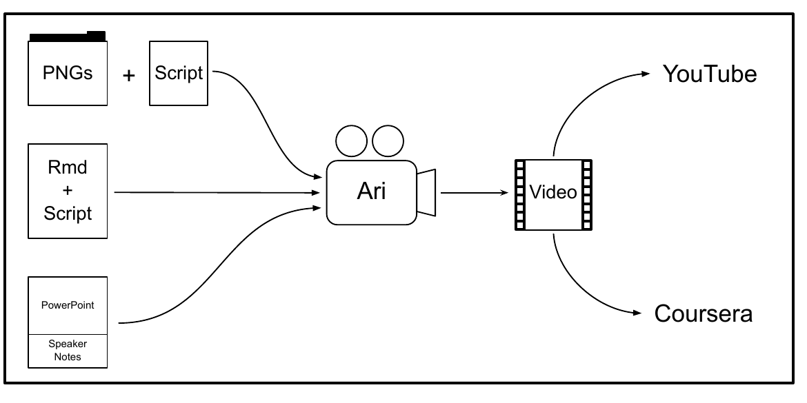

::: article
::: {#introduction}
## Introduction
:::

Videos are a crucial way people learn and they are pervasive in online
education platforms [@hsin2013short; @hartsell2006video]. Producing
educational videos with a lecturer speaking over slides takes time,
energy, and usually video editing skills. Maintaining the accuracy and
relevance of lecture videos focused on technical subjects like computer
programming or data science can often require remaking an entire video,
requiring extensive editing and splicing of new segments. We present
[*ari*](https://CRAN.R-project.org/package=ari), the **A**utomated **R**
**I**nstructor as a tool to address these issues by creating
reproducible presentations and videos that can be automatically
generated from plain text files or similar artifacts. By using *ari*, we
provide a tool for users to rapidly create and update video content.

In its simplest form a lecture video is comprised of visual content
(e.g. slides and figures) and a spoken explanation of the visual
content. Instead of a human lecturer, the *ari* package uses a
text-to-speech system to synthesize spoken audio for a lecture. Modern
text-to-speech systems that take advantage of recent advancements in
artificial intelligence research are available from
[Google](https://cloud.google.com/text-to-speech/),
[Microsoft](https://azure.microsoft.com/en-us/services/cognitive-services/text-to-speech/),
and [Amazon](https://aws.amazon.com/polly/). Many of these synthesizers
make use of deep learning methods, such as WaveNet [@van2016wavenet] and
have interfaces in R [@googleLanguageR; @mscstts; @aws.polly]. Currently
in *ari*, synthesis of the the audio can be rendered using any of these
services through the
[*text2speech*](https://CRAN.R-project.org/package=text2speech) package
[@text2speech]. The default is [Amazon
Polly](https://aws.amazon.com/polly/), which has text-to-speech voice
generation in over twenty one languages, implemented in the
[*aws.polly*](https://CRAN.R-project.org/package=aws.polly) package
[@aws.polly]. In addition to multiple languages, the speech generation
services provide voices with several pitches representing different
genders within the same language. We present the *ari* package with
reproducible use case examples and the video outputs with different
voices in multiple languages.

The *ari* package relies on the
[*tuneR*](https://CRAN.R-project.org/package=tuneR) package for
splitting and combining audio files appropriately so that lecture
narration is synced with each slide [@tuneR]. Once the audio is
generated, it is synced with images to make a lecture video. Multiple
open source tools for video editing and splicing exist; *ari* takes
advantage of the FFmpeg (<http://www.ffmpeg.org/>) software, a
command-line interface to the `libav` library. These powerful tools have
been thoroughly tested with a development history spanning almost 20
years. *ari* has been built with presets for FFmpeg which allow output
videos to be compatible with multiple platforms, including the YouTube
and Coursera players. These presets include specifying the bitrate,
audio and video codecs, and the output video format. The numerous
additional video specifications for customization can be applied to
command-line arguments FFmpeg through *ari*.

We have developed a workflow with *ari* as the centerpiece for
automatically generating educational videos. The narration script for
lecture videos is stored in a plain text format, so that it can be
synthesized into audio files via text-to-speech services. By storing
lecture narration in plain text it can be updated, tracked, and
collaboratively or automatically updated with version control software
like Git and GitHub. If the figures in the lecture slides are created in
a reproducible framework, such as generated using R code, the entire
video can be reproducibly created and automatically updated. Thus, *ari*
is the Automated R Instructor. We will provide examples of creating
videos based on the following sets of source files: a slide deck built
with R Markdown, a set of images and a script, or a presentation made
with Google Slides or PowerPoint. The overview of the processes
demonstrated in this paper are seen in Figure [1](#fig:fig1). We will
also demonstrate the
[*ariExtra*](https://CRAN.R-project.org/package=ariExtra) package, which
contains functions that connect *ari* to applications outside of the R
ecosystem [@ariExtra].

<figure id="fig:fig1">

<figcaption>Figure 1: Ari is designed to fit into several existing
workflows for creating lectures and presentations. Videos can be created
with Ari from a series of images and a narrative script, from an R
Markdown document, or from a PowerPoint presentation with speaker notes.
Ari is pre-configured so that videos are ready to be uploaded to popular
platforms like YouTube or Coursera.</figcaption>
</figure>

::: {#configuring-ari}
## Configuring Ari
:::

Ari relies on several software packages including FFmpeg, one of the
most popular libraries for processing audio, video, and image files.
Configuring FFmpeg can be challenging, therefore we have provided a
Docker image so that Ari users can start producing videos quickly. A
guide to getting started with Docker and using our Docker image is
included with Ari as a vignette which can be accessed via
`vignette("Simple-Ari-Configuration-with-Docker")`. Users who are
interested in configuring Ari on their own may find the Dockerfile
associated with the guide useful, and it is being actively developed at
<https://github.com/seankross/ari-on-docker>.

::: {#making-videos-with-ari-ari_stitch}
## Making videos with `ari`: `ari_stitch`
:::

The main workhorse of *ari* is the `ari_stitch` function. This function
requires an ordered set of images and an ordered set of audio objects,
either paths to `wav` files or *tuneR* Wave objects, that correspond to
each image. The `ari_stitch` function sequentially "stitches" each image
in the video for the duration of its corresponding audio object using
FFmpeg. FFmpeg must be installed so that *ari* can combine the audio and
images, much like packages such as
[*animation*](https://CRAN.R-project.org/package=animation) which have a
similar requirement [@aniart; @anipkg]. Moreover, on
[shinyapps.io](https://www.shinyapps.io/), a dependency on the
*animation* package will trigger an installation of FFmpeg so *ari* can
be used on [shinyapps.io](https://www.shinyapps.io/). In the example
below, 2 images (packaged with *ari*) are overlaid with white noise for
demonstration. This example also allows users to check if the output of
FFmpeg works with a desired video player.

``` r
library(tuneR)
library(ari)
result <- ari_stitch(
  ari_example(c("mab1.png", "mab2.png")),
  list(noise(), noise()),
  output = "noise.mp4"
)
isTRUE(result)
```

``` r
[1] TRUE
```

The output indicates whether the video was successfully created, but
additional attributes are available, such as the path of the output
file:

``` r
attributes(result)$outfile
```

``` r
[1] "noise.mp4"
```

The video for this output can be seen at <https://youtu.be/3kgaYf-EV90>.

::: {#synthesizer-authentication}
## Synthesizer authentication
:::

The above example uses `tuneR::noise()` to generate audio and to show
that any audio object can be used with *ari*. In most cases however,
*ari* is most useful when combined with synthesizing audio using a
text-to-speech system. Though one can generate the spoken audio in many
ways, such as fitting a custom deep learning model, we will focus on
using the aforementioned services (e.g. Amazon Polly) as they have
straightforward public web APIs. One obstacle in using such services is
that users must go through steps to provide authentication, whereas most
of these APIs and the associated R packages do not allow for interactive
authentication such as OAuth.

The *text2speech* package provides a unified interface to these 3
text-to-speech services, and we will focus on Amazon Polly and its
authentication requirements. Polly is authenticated using the
[*aws.signature*](https://CRAN.R-project.org/package=aws.signature)
package [@aws.signature]. The *aws.signature* documentation provides
options and steps to create the relevant credentials; we have also
provided an additional
[tutorial](http://seankross.com/2017/05/02/Access-Amazon-Web-Services-in-R.html).
Essentially, the user must sign up for the service and retrieve public
and private API keys and put them into their R profile or other areas
accessible to R. Running `text2speech::tts_auth(service = "amazon")`
will indicate if authentication was successful (if using a different
service, change the `service` argument). NB: The APIs are generally paid
services, but many have free tiers or limits, such as Amazon Polly's
free tier for the first year (<https://aws.amazon.com/polly/pricing/>).

::: {#creating-speech-from-text-ari_spin}
## Creating speech from text: `ari_spin`
:::

After Polly has been authenticated, videos can be created using the
`ari_spin` function with an ordered set of images and a corresponding
ordered set of text strings. This text is the "script" that is spoken
over the images to create the output video. The number of elements in
the text needs to be equal to the number of images. Let us take a part
of Mercutio's speech from Shakespeare's Romeo and Juliet
[@shakespeare2003romeo] and overlay it on two images from the Wikipedia
page about Mercutio (<https://en.wikipedia.org/wiki/Mercutio>):

``` r
speech <- c(
  "I will now perform part of Mercutio's speech from Shakespeare's Romeo and Juliet.",
  "O, then, I see Queen Mab hath been with you.
   She is the fairies' midwife, and she comes
   In shape no bigger than an agate-stone
   On the fore-finger of an alderman,
   Drawn with a team of little atomies
   Athwart men's noses as they lies asleep;"
)
mercutio_file <- "death_of_mercutio.png"
mercutio_file2 <- "mercutio_actor.png"
```

``` r
shakespeare_result <- ari_spin(
  c(mercutio_file, mercutio_file2),
  speech,
  output = "romeo.mp4", voice = "Joanna"
)
isTRUE(shakespeare_result)
```

``` r
[1] TRUE
```

The speech output can be seen at <https://youtu.be/SFhvM9gI0kE>.\
We chose the voice "Joanna" which is designated as a female sounding
US-English speaker for the script. Each voice is language-dependent; we
can see the available voices for English for Amazon Polly at
<https://docs.aws.amazon.com/polly/latest/dg/SupportedLanguage.html>.

Though the voice generation is relatively clear, we chose a
Shakespearean example to demonstrate the influence and production value
of the variety of dialects available from these text-to-speech services.
Compare the video of "Joanna" to the same video featuring "Brian" who
"speaks" with a British English dialect:

``` r
gb_result <- ari_spin(
  c(mercutio_file, mercutio_file2),
  speech,
  output = "romeo_gb.mp4", voice = "Brian"
)
isTRUE(gb_result)
```

``` r
[1] TRUE
```

The resulting video can be seen at <https://youtu.be/fSS0JSb4VxM>.

The output video format is MP4 by default, but several formats can be
specified via specifying the appropriate "muxer" for FFmpeg (see the
function `ffmpeg_muxers`). Supported codecs can be founded using the
functions `ffmpeg_audio_codecs` and `ffmpeg_video_codecs`. Additional
options can be passed to FFmpeg from `ari_stitch` and `ari_spin` to
customize the video to the necessary specifications.

We now discuss the number of image and script inputs that *ari* is
designed to work with, including text files and a series of PNG images,
presentations made with Google Slides or PowerPoint with the script
written in the speaker notes section, or an HTML slide presentation
created from an R Markdown file, where the script is written in the HTML
comments.

::: {#creating-videos-from-r-markdown-documents}
### Creating videos from R Markdown documents
:::

Many R users have experience creating slide decks with R Markdown, for
example using the
[*rmarkdown*](https://CRAN.R-project.org/package=rmarkdown) or
[*xaringan*](https://CRAN.R-project.org/package=xaringan) packages
[@rmarkdown; @rmarkdownbook; @xaringan]. In *ari*, the HTML slides are
rendered using [*webshot*](https://CRAN.R-project.org/package=webshot)
[@webshot] and the script is located in HTML comments (i.e. between
`<!--` and `-->`). For example, in the file `ari_comments.Rmd` included
in *ari*, which is an `ioslides` type of R Markdown slide deck, we have
the last slide:

``` r
x <- readLines(ari_example("ari_comments.Rmd"))
tail(x[x != ""], 4)
```

``` r
[1] "## Conclusion"                                             
[2] "<!--"                                                      
[3] "Thank you for watching this video and good luck using Ari!"
[4] "-->"                                                       
```

The first words spoken on this example slide are `"Thank you"`. This
setup allows for one plain text, version-controllable, integrated
document that can reproducibly generate a video. We believe these
features allow creators to make agile videos, that can easily be updated
with new material or changed when errors or typos are found. Moreover,
this framework provides an opportunity to translate videos into multiple
languages, a feature that we will discuss in the future directions.

Using `ari_narrate`, users can create videos from R Markdown documents
that create slide decks. An R Markdown file can be passed in, and the
output will be created using the `render` function from *rmarkdown*
[@rmarkdown]. If the slides are already rendered, the user can pass
these slides and the original document, where the script is extracted.
Passing rendered slides allows with the option for a custom rendering
script. Here we create the video for `ari_comments.Rmd`, where the
slides are rendered inside `ari_narrate`:

``` r
# Create a video from an R Markdown file with comments and slides
res <- ari_narrate(
  script = ari_example("ari_comments.Rmd"),
  voice = "Kendra",
  capture_method = "iterative"
)
```

The output video is located at <https://youtu.be/rv9fg_qsqc0>. In our
experience with several users we have found that some HTML slides take
more or less time to render when using *webshot*; for example they may
be tinted with gray because they are in the middle of a slide transition
when the image of the slide is captured. Therefore we provide the
`delay` argument in `ari_narrate` which is passed to *webshot*. This can
resolve these issues by allowing more time for the page to fully render,
however this means it may take more time to create each video. We also
provide the argument `capture_method` to allow for finely-tuned control
of `webshot`. When `capture_method = "vectorized"`, *webshot* is run on
the entire slide deck in a faster process, however we have experienced
slide rendering issues with this setting depending on the configuration
of an individual's computer. However when
`capture_method = "iterative"`, each slide is rendered individually in
`webshot`, which solves many rendering issues, however it causes videos
to be rendered more slowly.\
In the future, other HTML headless rendering engines (`webshot` uses
PhantomJS) may be used if they achieve better performance, but we have
found *webshot* to work well in most of our applications.

With respect to accessibility, *ari* encourages video creators to type
out a script by design. This provides an effortless source of subtitles,
rather than relying on other services such as YouTube to provide
speech-to-text subtitles. When using `ari_spin`, if the `subtitles`
argument is `TRUE`, then an SRT file for subtitles will be created with
the video.

One issue with synthesis of technical information is that changes to the
script are required for Amazon Polly or other services to provide a
correct pronunciation. For example, if you want the service to say
"RStudio" or "ggplot2", the phrases "R Studio" or "g g plot 2" must be
written exactly that way in the script. These phrases will then appear
in an SRT subtitle file, which may be confusing to a viewer. Thus, some
post-processing of the SRT file may be needed.

::: {#creating-videos-from-other-documents}
### Creating videos from other documents
:::

We created the *ariExtra* (<https://github.com/muschellij2/ariExtra>)
package to augment the core functionality of *ari* by extending it to
software applications outside of the R ecosystem. These extensions
require many additional dependencies, and considering the significant
amount of setup already required for *ari*, we believed that this
additional functionality should be in a separate package.

To create a video from a presentation made with Google Slides or
PowerPoint, the slides should be converted to a set of images. We
recommend using the PNG format for these images. To get the script for
the video, we suggest putting the script for each slide in the speaker
notes section of that slide. Several of the following features for video
generation are in our package *ariExtra*. The speaker notes of slides
can be extracted using
[*rgoogleslides*](https://CRAN.R-project.org/package=rgoogleslides)
[@rgoogleslides] for Google Slides via the API or using
[*readOffice*](https://CRAN.R-project.org/package=readOffice)/[*officer*](https://CRAN.R-project.org/package=officer)
[@officer; @readOffice] to read from PowerPoint documents. Google Slides
can be downloaded as a PDF and converted to PNGs using the
[*pdftools*](https://CRAN.R-project.org/package=pdftools) package
[@pdftools]. The *ariExtra* package also has a `pptx_notes` function for
reading PowerPoint notes. Converting PowerPoint files to PDF can be done
using LibreOffice and the
[*docxtractr*](https://CRAN.R-project.org/package=docxtractr) package
[@docxtractr] which contains the necessary wrapper functions.

To demonstrate this, we use an example PowerPoint is located on Figshare
(<https://figshare.com/articles/Example_PowerPoint_for_ari/8865230>). We
can convert the PowerPoint to a PDF, then to a set of PNG images, then
we extract the speaker notes.

``` r
pptx <- "ari.pptx"
download.file(paste0(
  "https://s3-eu-west-1.amazonaws.com/",
  "pfigshare-u-files/16252631/ari.pptx"
),
destfile = pptx
)
pdf <- docxtractr::convert_to_pdf(pptx) # >= 0.6.2
pngs <- pdftools::pdf_convert(pdf, dpi = 300)
notes <- ariExtra::pptx_notes(pptx)
notes
```

``` r
[1] "Sometimes it’s hard for an instructor to take the time to record their lectures.
For example, I’m in a coffee shop and it may be loud."

[2] "Here is an example of a plot with really small axes.  We plot the x versus the y
-variables and a smoother between them."
```

The *ariExtra* package also can combine these processes and take
multiple input types (Google Slides, PDFs, PPTX) and harmonize the
output. The `pptx_to_ari` function combines the above steps:

``` r
doc <- ariExtra::pptx_to_ari(pptx)
```

``` r
Converting page 1 to /var/folders/1s/wrtqcpxn685_zk570bnx9_rr0000gr/T/
/Rtmpo6aD9u/filede6236136195.png... done!
Converting page 2 to /var/folders/1s/wrtqcpxn685_zk570bnx9_rr0000gr/T/
/Rtmpo6aD9u/filede62326b98ef.png... done!
```

``` r
doc[c("images", "script")]
```

``` r
$images
[1] "/private/var/folders/1s/wrtqcpxn685_zk570bnx9_rr0000gr/T/
Rtmpo6aD9u/filede6236058cc5_files/slide_1.png"
[2] "/private/var/folders/1s/wrtqcpxn685_zk570bnx9_rr0000gr/T/
Rtmpo6aD9u/filede6236058cc5_files/slide_2.png"
$script
[1] "Sometimes it’s hard for an instructor to take the time to record their lectures. 
For example, I’m in a coffee shop and it may be loud."
[2] "Here is an example of a plot with really small axes. We plot the x versus the 
y-variables and a smoother between them."
```

This output can then be passed to `ari_spin`.

We will now demonstrate rendering the video with the "Kimberly" voice
while using the `divisible_height` argument to forcibly scale the height
of the images to be divisible by 2. This is required by the `x264`
(default) codec which we have specified as a preset:

``` r
pptx_result <- ari_spin(pngs, notes,
  output = "pptx.mp4", voice = "Kimberly",
  divisible_height = TRUE, subtitles = TRUE
)
isTRUE(pptx_result)
```

You can see the output at <https://youtu.be/TBb3Am6xsQw>. Here we can
see the first few lines of the subtitle file:

``` r
[1] "1"                                       
[2] "00:00:00,000 --> 00:00:02,025"           
[3] "Sometimes it’s hard for an instructor to"
[4] "2"                                       
[5] "00:00:02,025 --> 00:00:04,005"           
[6] "take the time to record their lectures." 
```

For Google Slides, the slide deck can be downloaded as a PowerPoint and
the previous steps can be used, however it can also be downloaded
directly as a PDF. We will use the same presentation, but uploaded to
Google Slides. The *ariExtra* package has the function `gs_to_ari` to
wrap this functionality (as long as link sharing is turned on), where we
can pass the Google identifier:

``` r
gs_doc <- ariExtra::gs_to_ari("14gd2DiOCVKRNpFfLrryrGG7D3S8pu9aZ")
```

``` r
Converting page 1 to
/var/folders/zw/l4fv__6n4tnbk3xb31dnbt5m0000gn/T//RtmpphWBAj/filebd69651ed561.png...
done!
Converting page 2 to
/var/folders/zw/l4fv__6n4tnbk3xb31dnbt5m0000gn/T//RtmpphWBAj/filebd694b4b0724.png...
done!
```

Note, as Google provides a PDF version of the slides, this obviates the
LibreOffice dependency.

Alternatively, the notes can be extracted using *rgoogleslides* via the
Google Slides API, however this requires authentication so we will omit
it here. Thus, we should be able to create videos using R Markdown,
Google Slides, or PowerPoint presentations in an automatic fashion.

::: {#summary}
## Summary
:::

The *ari* package combines multiple open-source tools and APIs to create
reproducible workflows for creating videos. These videos can be created
using R Markdown documents, Google Slides, PowerPoint presentations, or
simply a series of images. The audio overlaid on the images can be
separate or contained within the storage of the images. These workflows
can then be reproduced in the future and easily updated. As the current
voice synthesis options are somewhat limited in the tenacity and
inflection given, we believe that educational and informational videos
are the most applicable area.

::: {#future-directions}
## Future directions
:::

The *ari* package is already being used to build data science curricula
[@Kross-2019] and we look forward to collaborating with video creators
to augment *ari* according to their changing needs. In the following
section we outline possible directions for the future of the project.

Since *ari* is designed for teaching technical content, we plan to
provide better support for the pronunciation of technical terms like the
names of popular software tools. These names are usually not pronounced
correctly by text-to-speech services because they are not words
contained in the training data used in the deep learning models that
these services are built upon. To address this concern we plan to
compile a dictionary of commonly used technical terms and the phonetic
phrasing and spelling of these terms that are required to achieve the
correct pronunciation from text-to-speech services.

In addition to still images and synthesized voices, we would like to
develop new technologies for incorporating other automatically generated
videos into lectures generated by *ari*. As computer programming,
statistics, and data science instructors we often rely on live coding
[@ChenLAS2019] to demonstrate software tools to our students. Live
coding videos suffer from many of the same problems as other kinds of
technical videos as we addressed in the introduction. Therefore we plan
to build a system for automating the creation of live coding videos.
These videos would also be created using plain text documents like R
Markdown. They would integrate synthesized narration with code chunks
that would be displayed and executed according to specialized commands
that would specify when code should be executed in an IDE like RStudio.
These commands could also control which panes and tabs of the IDE are
visible or emphasized.

As programmatic video creation software improves, we plan to extend
*ari* so it can expand its compatibility with different technologies.
For example we believe the heavy reliance on an FFmpeg installation can
be mitigated in the future with advances in the *av* package. Though the
*av* package has powerful functionality and is currently porting more
from `libav` and therefore FFmpeg, it currently does not have the
capabilities required for *ari*. Although third party installation from
<https://ffmpeg.org/> can be burdensome to a user, package managers such
as `brew` for OSX and `choco` for Windows provide an easier installation
and configuration experience.

Although we rely on Amazon Polly for voice synthesis, other packages
provide voice synthesis, such as
[*mscstts*](https://CRAN.R-project.org/package=mscstts) for Microsoft
and
[*googleLanguageR*](https://CRAN.R-project.org/package=googleLanguageR)
for Google. We created the *text2speech* package to harmonize these
synthesis options for *ari*. Thus, switching from one voice generation
service to another simply involves switching the `service` and `voice`
arguments in *ari*, assuming the service is properly authenticated. This
ease of switching allows researchers to compare and test which voices
and services are most effective at delivering content.

We see significant potential in how *ari* could expand global learning
opportunities. Video narration scripts can be automatically translated
into other languages with services like the [Google Translation
API](https://cloud.google.com/translate/docs/), where *googleLanguageR*
provides an interface. Amazon Polly can speak languages other than
English, meaning that one can write a lecture once and generate lecture
videos in multiple languages. Therefore this workflow can greatly expand
the potential audience for educational videos with relatively little
additional effort from lecture creators. We plan to flesh out these
workflows so that video creators can manage videos in multiple
languages. We hope to add functionality so that communities of learners
with language expertise can easily suggest modifications to
automatically translated videos, and tooling so suggestions can be
incorporated quickly.
:::
