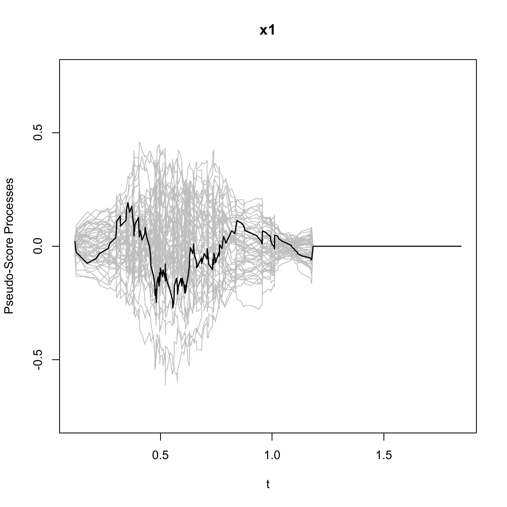
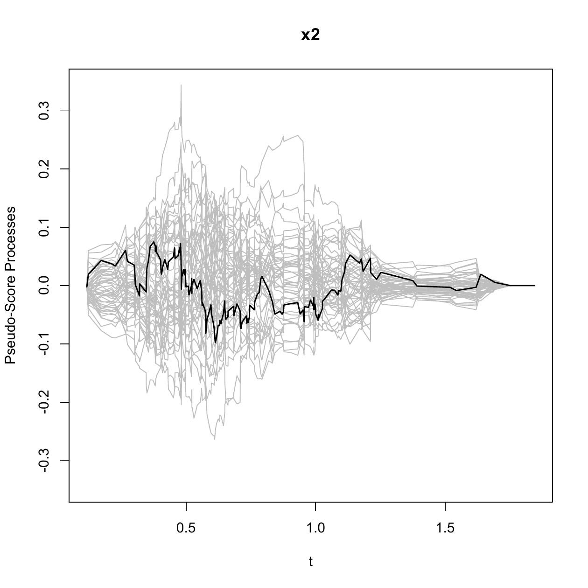

::: article
# Introduction {#s:intr}

In prevalent cohort studies, subjects who have experienced an initiating
event (e.g., disease diagnosis) but have not yet experienced a failure
event (e.g., death) are sampled from the target population and followed
until a failure or censoring event occurs. Data collected from such
sampling designs are subject to left truncation since subjects who
experienced a failure event prior to study enrollment are selectively
excluded and are not observed in the data. When the occurrence of the
initiating event follows a stationary Poisson process, the data are
called "length-biased data", which is a special case of left-truncated
data. These data are encountered in a variety of fields such as cancer
screening trials [@ZelenFeinleib1969], studies of unemployment
[@Lancaster1979; @deUnaAlvaresetal2003], epidemiologic cohort studies
[@GailBenichou2000; @ScheikeKeiding2006], and genome-wide linkage
studies [@Terwilligeretal1997]. The failure times observed in such data
tend to be longer than those in the target population since subjects
with longer failure times are more likely to be included in the
length-biased data. Figure [1](#fig:0) depicts the occurrence of
length-biased sampling. The underlying length-biased sampling assumption
(i.e., the stationarity assumption) can be analytically examined
[@AddonaWolfson2006].

{#fig:0 width="100%"
alt="graphic without alt text"}

Provided that the observed data are not random samples of the target
population, statistical methods for conventional survival data cannot be
directly applied to length-biased data. Extensive studies have been
conducted on statistical methodologies that account for length bias. In
particular, a number of semiparametric regression methods have been
proposed in the literature to model the association between covariates
and the survival outcome of interest. Among the semiparametric
regression models, the Cox proportional hazards model [@Cox1972] has
been the most commonly adopted. Under the Cox model, @Wang1996 proposed
a pseudo-partial likelihood approach to assess the covariate effects.
However, her estimation method is limited to length-biased data with no
right censoring. @Tsai2009 generalized the method to handle potential
right censoring. @QinShen2010 constructed estimating equations based on
risk sets that are adjusted for length-biased sampling through inverse
weights. A thorough review of the existing nonparametric and
semiparametric regression methods can be found in @Shenetal2017.

Although there is a substantial amount of literature on statistical
methods for length-biased data, publicly available computational tools
for analyzing such data are limited. In this paper, we introduce a new
package, [*CoxPhLb*](https://CRAN.R-project.org/package=CoxPhLb)
[@CoxPhLb2019], in R that provides tools to analyze length-biased data
under the Cox model. The package includes functions that fit the Cox
model using the estimation method proposed by @QinShen2010, check the
proportional hazards model assumptions based on methods developed by
[@Leeetal2017] and check the underlying stationarity assumption.
*CoxPhLb* is available from the Comprehensive R Archive Network (CRAN)
at <http://CRAN.R-project.org/package=CoxPhLb>. To the best of our
knowledge, this is the first and only publicly available R package for
analyzing length-biased data under the Cox model.

The remainder of this paper is organized as follows. The following
section provides a brief review of the semiparametric estimation method
under the Cox model to assess the covariate effects on the survival
outcome. Then, we outline how the Cox proportional hazards model
assumptions can be checked both graphically and analytically, and
describe two approaches to test the stationarity of the underlying
incidence process. We illustrate the R package *CoxPhLb* using a
simulated data example and a real dataset, the Channing House data.
Finally, we conclude this paper with summarizing remarks.

# Fitting the Cox model {#s:meth}

## Notation and model {#s:nota}

Let $\widetilde{T}, \widetilde{A}$, and $\pmb{Z}$ be the duration from
an initiating event to failure, the duration from the initiating event
to enrollment in the study, and the $p\times 1$ baseline covariate
vector, respectively. Assume that the failure time $\widetilde{T}$
follows the Cox model,
$$\begin{aligned}
\label{m:1}
\lambda(t\mid \pmb{z})=\lambda_0(t)\exp\left(\pmb{\beta}_0^\top \pmb{z}\right),
\end{aligned}   (\#eq:m1)$$
where $\pmb{\beta}_0$ is a $p\times 1$ vector of unknown regression
coefficients and $\lambda_0(t)$ is an unspecified baseline hazard
function. Under length-biased sampling, we only observe failure times
that satisfy $\widetilde{A}<\widetilde{T}$. We denote the length-biased
failure time by $T=A+V$, where $A$ is the observed truncation variable
(i.e., backward recurrence time) and $V$ is the duration from study
enrollment to failure (i.e., residual survival time or forward
recurrence time). Since $V$ is subject to right censoring, the observed
failure time is $Y=\min(T,A+C)$ and the censoring indicator is
$\delta=I(T\leq A+C)$, where $C$ is the duration from study enrollment
to censoring (i.e., residual censoring). The data structure is
illustrated in Figure [2](#fig:1). We assume that $C$ is independent of
$A$ and $V$ given $\pmb{Z}$, and the distribution of $C$ is independent
of $\pmb{Z}$.

{#fig:1 width="100%"
alt="graphic without alt text"}

The length-biased data consist of
$\{(Y_i,A_i,\delta_i,\pmb{Z}_i), i=1,\ldots,n\}$, for $n$ independent
subjects. We note that the observed data are not representative of the
target population, and the observed biased data do not follow Model
(\@ref(eq:m1)). Thus, conventional Cox regression methods cannot be used
when evaluating the covariate effects on the duration from the
initiating event to failure for the target population. Furthermore, even
under the independent censoring assumption on $C$ with $A$ and $V$, the
sampling mechanism induces dependent censoring because
$Cov(T,A+C\mid\pmb{Z})=Var(A\mid\pmb{Z})+Cov(A,V\mid\pmb{Z})>0$.

## Estimation of the covariate effects

Among many estimation methods established for length-biased data under
the Cox model, we provide the estimation function based on the inversely
weighted estimating equation of @QinShen2010. While this estimating
equation approach may not be the most efficient method, the estimation
procedure is easy to implement and provides a mean zero stochastic
process that forms the basis of model checking. We adopt this estimation
method for model fitting and checking in the R package *CoxPhLb*.

For subject $i$, we denote $N_i(t)=I\{Y_i\leq t,\delta_i=1\}$ and
$R_i(t)=I\{Y_i\geq t,\delta_i=1\}$ following the counting process
notation. Let $\mathbf{a}^0=1$, $\mathbf{a}^1=\mathbf{a}$, and
$\mathbf{a}^2=\mathbf{a}\mathbf{a}^\top$ for any vector $\mathbf{a}$.
Define
$$\begin{aligned}
S^{(k)}(\pmb{\beta},t)=n^{-1}\sum_{i=1}^n w_C(t)R_i(t)\{w_C(Y_i)\}^{-1}\pmb{Z}_i^{k}\exp(\pmb{\beta}^\top \pmb{Z}_i),
\end{aligned}$$
where the weight function $w_C(y)=\int_0^y S_C(u)\mathrm{d}u$, in which
$S_C(y)=\Pr(C>y)$ is the survival function of the residual censoring
variable $C$ for $k=0,1,$ and $2$. By replacing $w_C(y)$ with its
consistent estimator,
$\widehat{w}_C(y)=\int_0^y \widehat{S}_C(u)\mathrm{d}u$, where
$\widehat{S}_C(\cdot)$ is the Kaplan--Meier estimator of the residual
censoring survival function, we have
$$\begin{aligned}
\widehat{S}^{(k)}(\pmb{\beta},t)=n^{-1}\sum_{i=1}^n \widehat{w}_C(t)R_i(t)\{\widehat{w}_C(Y_i)\}^{-1}\pmb{Z}_i^{k}\exp(\pmb{\beta}^\top \pmb{Z}_i)
\end{aligned}$$
for $k=0,1,$ and $2$. The regression parameter $\pmb{\beta}_0$ can be
estimated by solving the following unbiased estimating equation:
$$\begin{aligned}
\label{eq:1}
\widehat{U}(\pmb{\beta})=\sum_{i=1}^n\int_0^{\tau} \left\lbrace\pmb{Z}_i-\widehat{E}(\pmb{\beta},u)\right\rbrace\mathrm{d}N_i(u)=0,
\end{aligned}   (\#eq:1)$$
where $\tau$ satisfies $\Pr(Y\geq \tau)>0$ and
$\widehat{E}(\pmb{\beta},t)=\widehat{S}^{(1)}(\pmb{\beta},t)/ \widehat{S}^{(0)}(\pmb{\beta},t)$.
The solution to Equation (\@ref(eq:1)), which is denoted by
$\widehat{\pmb{\beta}}$, is unique and a consistent estimator to
$\pmb{\beta}_0$. Using the Taylor series expansion, it can be shown that
the distribution of $\widehat{\pmb{\beta}}$ converges weakly to a normal
distribution with variance $\Gamma^{-1}\Sigma\Gamma^{-1}$, where
$\Gamma=-\lim_{n\rightarrow\infty} n^{-1}\partial \widehat{U}(\pmb{\beta})/\partial\pmb{\beta}$
and $\Sigma$ is the covariance matrix of
$\lim_{n\rightarrow\infty} n^{-1/2}\widehat{U}(\pmb{\beta}_0)$.

This estimation procedure can be implemented using the `coxphlb`
function in the *CoxPhLb* package as follows:\
`coxphlb(formula, data, method = c("Bootstrap","EE"), boot.iter = 500,`\
` seed.n = round(runif(1,1,1e09)), digits = 3L)`\
where `formula` has the same syntax as the formula used in `coxph` from
the [*survival*](https://CRAN.R-project.org/package=survival) package
[@survival-package]. The response needs to be a `survival` object such
as `Surv(a, y, delta)` where `a`, `y`, and `delta` are the truncation
times, the observed failure times, and the censoring indicators,
respectively. The argument `data` is a data frame that includes
variables named in the formula. We can choose either the bootstrap
variance estimates (`"Bootstrap"`), or the model-based variance
estimates (`"EE"`) to be returned in the fitted model object through the
argument `method`. When bootstrap resampling is chosen for variance
estimation, the bootstrap sample size is controlled by `boot.iter` with
the default set as $500$, and a seed number can be fixed by `seed.n`. A
summary table is returned with values rounded by the integer set through
`digits`.

Alternatively, one can implement the estimation procedure by using the
`coxph` function with the subset of the data that consist of uncensored
failure times only and an `offset` term to add
$\log\{\widehat{w}_C(Y_i)\}^{-1}$ to the linear predictor with a fixed
coefficient of one as discussed in [@QinShen2010]. The `coxph` function
will return the same point estimates as the `coxphlb` function. To
compute the corresponding standard errors using `coxph`, we need to use
the bootstrap approach. Later, in the simulated data example, we further
evaluate the computational efficiency of the `coxphlb` function with the
model-based variance estimation (i.e., `method = EE`) opposed to the
bootstrap resampling method (i.e., `method = Bootstrap`).

# Checking the Cox model assumptions {#s:chec}

Two primary components of checking the Cox proportional hazards model
assumptions are examining (i) the functional form of a covariate and
(ii) the proportional hazards assumption. To detect violations of these
model assumptions, the general form of the cumulative sums of
multiparametric stochastic processes is considered.

Under Model (\@ref(eq:m1)), we can construct a mean zero stochastic
process,
$$\begin{aligned}
%\label{eq:2}
M_{i}(t)=N_i(t)-\int_0^t w_C(u)R_i(u)\{w_C(Y_i)\}^{-1}\exp(\pmb{\beta}_0^\top \pmb{Z}_i)\mathrm{d}\Lambda_0(u),
\end{aligned}   (\#eq:2)$$
for $i=1,\ldots,n$, where
$\Lambda_0(t)=\int_0^t \lambda_0(s)\mathrm{d}s$ is the cumulative
baseline hazard function. The stochastic process can be estimated by
$$\begin{aligned}
\widehat{M}_{i}(t)=N_i(t)-\int_0^t \widehat{w}_C(u)R_i(u)\{\widehat{w}_C(Y_i)\}^{-1}\exp(\widehat{\pmb{\beta}}^\top \pmb{Z}_i)\mathrm{d}\widehat{\Lambda}_{0}(\widehat{\pmb{\beta}},u),
\end{aligned}$$
where
$$\begin{aligned}
 \widehat{\Lambda}_{0}(\widehat{\pmb{\beta}},t)=\int_0^t\frac{\sum_{i=1}^n\mathrm{d}N_i(u)}{n\widehat{S}^{(0)}(\widehat{\pmb{\beta}},u)}.
\end{aligned}$$
The stochastic process can be considered as the difference between the
observed and the expected number of events, which mimics the ordinary
martingale residuals. When the estimated processes
$\widehat{M}_i(t), i=1,\ldots,n$ deviate from zero systematically, it
may be a sign of model misspecification.

Let
$$\begin{aligned}
\label{eq:2}
\pmb{G}(t,\pmb{z})=\sum_{i=1}^n f(\pmb{Z}_i)I(\pmb{Z}_i\leq\pmb{z})\widehat{M}_{i}(t),
\end{aligned}   (\#eq:2)$$
where $f(\cdot)$ is a prespecified smooth and bounded function, and
$I(\pmb{Z}_i\leq\pmb{z})=I(Z_{i1}\leq z_1,\ldots,Z_{ip}\leq z_p)$ with
$\pmb{Z}_i=(Z_{i1},\ldots,Z_{ip})^\top$ and
$\pmb{z}=(z_1,\ldots,z_p)^\top$. When the model assumptions are
satisfied, the process (\@ref(eq:2)) will fluctuate randomly around
zero. We can adjust the general form (\@ref(eq:2)) to examine the
specific model assumptions. To assess the functional form of the $j$th
covariate, we choose $f(\cdot)= 1$, $t=\tau$, and $z_k=\infty$ for all
$k\neq j$. The proportional hazards assumption for the $j$th covariate
can be evaluated by setting $f(Z_{ij})=Z_{ij}$ and
$\pmb{z}= \pmb{\infty}$. To develop analytical test procedures, test
statistics can be constructed using the supremum test,
$\sup_{t,\pmb{z}}\lvert\pmb{G}(t,\pmb{z})\rvert$. Let
$T_1^j=\sup_{z}\lvert\pmb{G}_1^j(z)\rvert$ be the test statistics for
checking the functional form of the jth covariate, where
$\pmb{G}_1^j(z)=\sum_{i=1}^nI(Z_{ij}\leq z)\widehat{M}_i(\tau)$; and
$T_2^j=\sup_{t}\lvert\pmb{G}_2^j(t)\rvert$, where
$\pmb{G}_2^j(t)=\sum_{i=1}^n Z_{ij}\widehat{M}_i(t)$ for checking the
proportional hazards assumption for the $j$th covariate. We can also
consider the global test statistic
$T_2=\sup_t \sum_{j=1}^p\lvert\pmb{G}_2^j (t)\rvert$ when the overall
proportionality of hazards for all covariates is of interest.

The null distribution of the general form (\@ref(eq:2)) under
Model (\@ref(eq:m1)) has been studied in @Leeetal2017 to derive the
critical values for test statistics $T_1^j$, $T_2^j$, and $T_2$. We can
approximate the null distribution by adopting the resampling technique
used in @Linetal1993. Let
$$\begin{aligned}
\widehat{\pmb{G}}_i^*(t,\pmb{z})&=\int_0^t \left\lbrace f(\pmb{Z}_i)I(\pmb{Z}_i\leq \pmb{z})-\widehat{E}_Z(\widehat{\pmb{\beta}},u,\pmb{z})\right\rbrace\mathrm{d}\widehat{M}_i(u)+\int_0^t \widehat{H}(\widehat{\pmb{\beta}},u)\frac{\mathrm{d}\widehat{M}_{C_i}(u)}{\widehat{\pi}(u)}\\
&+\widehat{\Gamma}_Z(\widehat{\pmb{\beta}},t,\pmb{z})\{\widehat{\Gamma}(\widehat{\pmb{\beta}})\}^{-1}\int_0^\tau\left\lbrace\pmb{Z}_i-\widehat{E}(\widehat{\pmb{\beta}},u)\right\rbrace\mathrm{d}\widehat{M_i}(u),
\end{aligned}$$
where
$$\widehat{S}_Z^{(l)}(\pmb{\beta},t,\pmb{z})=n^{-1}\sum_{i=1}^n f(\pmb{Z}_i)I(\pmb{Z}_i\leq\pmb{z})\widehat{w}_C(t)R_i(t)\{\widehat{w}_C(Y_i)\}^{-1}\pmb{Z}_i^l\exp(\pmb{\beta}^\top\pmb{Z}_i)$$
for $l=0,1$,
$\widehat{E}_Z({\pmb{\beta}},u,\pmb{z})={\widehat{S}_Z^{(0)}(\pmb{\beta},t,\pmb{z})}/{\widehat{S}^{(0)}(\pmb{\beta},t)}$,
$$\begin{aligned}
\widehat{H}(\pmb{\beta},t)&=\sum_{i=1}^n\sum_{k=1}^n\frac{f(\pmb{Z}_k)I(\pmb{Z}_k\leq\pmb{z})\widehat{w}_C(Y_i) R_k(Y_i)\exp(\pmb{\beta}^\top\pmb{Z}_k)\{\widehat{w}_C(Y_k)\}^{-2}\widehat{h}_k(t)}{n^2\widehat{S}^{(0)}(\pmb{\beta},Y_i)},\\ 
\widehat{M}_{C_i}(t)&=I(V_i\leq t,\delta_i=0)-\int_0^tI(V_i\geq u)\mathrm{d}\widehat{\Lambda}_C(u),\\ 
\widehat{h}_k(t)&=I(Y_k\geq t)\int_t^{Y_k}\widehat{S}_C(u)\mathrm{d}u,\\ \widehat{\pi}(t)&=\widehat{S}_C(t)\widehat{S}_V(t),
\end{aligned}$$
in which $\widehat{\Lambda}_C(\cdot)$ is the Nelson-Aalen estimator for
the residual censoring time and $\widehat{S}_V(\cdot)$ is the
Kaplan--Meier estimator of the residual survival time, and
$$\begin{aligned}
\widehat{\Gamma}_Z(\pmb{\beta},t,\pmb{z})&=n^{-1}\sum_{i=1}^n\int_0^t\left[\frac{\widehat{S}_{\pmb{Z}}^{(1)}(\pmb{\beta},u,\pmb{z})}{\widehat{S}^{(0)}(\pmb{\beta},u)}-\frac{\widehat{S}_{\pmb{Z}}^{(0)}(\pmb{\beta},u,\pmb{z})\widehat{S}^{(1)}(\pmb{\beta},u)}{\{\widehat{S}^{(0)}(\pmb{\beta},u)\}^2}\right]\mathrm{d}N_i(u),
\end{aligned}$$

$$\begin{aligned}
\widehat{\Gamma}(\pmb{\beta})&=-n^{-1}\sum_{i=1}^n\int_0^\tau\left[\frac{\widehat{S}^{(2)}(\pmb{\beta},u)}{\widehat{S}^{(0)}(\pmb{\beta},u)}-\left\lbrace\frac{\widehat{S}^{(1)}(\pmb{\beta},u)}{\widehat{S}^{(0)}(\pmb{\beta},u)}\right\rbrace^2\right]\mathrm{d}N_i(u).
\end{aligned}$$
Define
$\widetilde{\pmb{G}}_m(t,\pmb{z})=\sum_{i=1}^n \widehat{\pmb{G}}_i^*(t,\pmb{z})V_{mi}$,
where $V_{mi}, i=1,\ldots,n$, are independent random variables sampled
from a standard normal distribution for $m=1,\ldots,M$. The simulated
realizations of $\widetilde{\pmb{G}}_m(t,\pmb{z})$ for a large $M$
approximate the null distribution. For graphical assessment, we can plot
a few randomly chosen realizations of $\widetilde{\pmb{G}}_m(t,\pmb{z})$
and compare the observed process based on the data with them. A
departure of the observed process from the simulated realizations
implies violations of model assumptions. For an analytical test, the
critical values for the test statistics can be derived by simulating
$\sup_{t,z}\lvert\widetilde{\pmb{G}}_{m}(t,\pmb{z})\rvert$ for
$m=1,\ldots,M$. We can compute the $p$ values by the proportion of
critical values greater than the test statistic.

We can carry out model checking in R using the function `coxphlb.ftest`
to examine the functional form of a continuous covariate as follows:\
`coxphlb.ftest(fit, data, spec.p = 1, n.sim = 1000, z0 = NULL,`
`seed.n = round(runif(1,1,1e09)),` `digits = 3L)`\
where the argument `fit` is an object of the `"coxphlb"` class, which
can be obtained by using the `coxphlb` function, and `data` is the data
frame used in the fitted model. We specify the $j$th component of the
covariates to be examined via `spec.p`, where the default is set as
$j=1$. To approximate the null distribution, we sample a large number of
realizations. The argument `n.sim` controls the number of samples with
the default set as $1000$. When specific grid points over the support of
the $j$th covariate are to be examined, we can plug them in as a vector
in `z0`, which if `NULL`, 100 equally distributed grid points will be
selected over the range of the $j$th covariate by default. The random
seed number can be fixed through `seed.n`. The $p$ value returned by the
function is rounded by the integer set via `digits`. To test the
proportional hazards assumption, we use `coxphlb.phtest` as follows:\
`coxphlb.phtest(fit, data, spec.p = NULL, n.sim = 1000,`
`seed.n = round(runif(1,1,1e09)),` `digits = 3L)`\
where all arguments play the same role as in the `coxphlb.ftest`
function, except for `spec.p`. The proportional hazards assumption can
be tested for the $j$th covariate if we set `spec.p` equal to $j$. The
function will conduct the global test by default if `spec.p` is left
unspecified.

We can conduct graphical assessment by using the following functions:\
`coxphlb.ftest.plot(x, n.plot = 20, seed.n = round(runif(1,1,1e09)))`\
`coxphlb.phtest.plot(x, n.plot = 20, seed.n = round(runif(1,1,1e09)))`\
where `x` are objects of the `"coxphlb.ftest"` class and the
`"coxphlb.phtest"` class, respectively. These functions return a plot of
the observed process along with a randomly sampled `n.plot` number of
realizations. We can fix the random seed number through `seed.n`.

# Checking the stationarity assumption {#s:stat}

When the underlying incidence process follows a stationary Poisson
process, the distribution of the truncation variable is uniform and the
data are considered length-biased. In the literature, two approaches
have been proposed to check the stationarity assumption: a graphical
assessment and an analytical test procedure. @Asgharianetal2006
demonstrated that the stationarity assumption can be checked graphically
by comparing the Kaplan--Meier estimators based on the current and
residual survival times. A large discrepancy indicates that the
stationarity assumption is invalid. @AddonaWolfson2006 proposed an
analytic test to check the assumption. They showed that testing the
stationarity assumption is equivalent to testing whether the
distributions of the backward and forward recurrence times are the same.
Let $F(t)=\Pr(A\leq t)$ and $G(t)=\Pr(V^*\leq t, \delta=1)$, where
$V^*=\min(V,C)$. Following @Wei1980, the test statistic can be
constructed as follows:
$$\begin{aligned}
W=n^{-2}\sum_{i=1}^n\sum_{j=1}^n \left\lbrace\Phi(A_i,V_j^*,\delta_j)-p\right\rbrace,
\end{aligned}$$
where $\Phi(A_i,V_j^*,\delta_j)=I(A_i>V_j^*,\delta_j=1)-I(A_i<V_j^*)$
and $p=\mathbb{E}\{ G(A_i)\}-\mathbb{E}\{ F(V_j^*)\}$. The limiting
distribution of the test statistic $W$ has been studied in
@AddonaWolfson2006, and the corresponding $p$ value can be computed.

In R, we can explore the stationarity assumption graphically using
function `station.test.plot` as follows:\
`station.test.plot(a, v, delta)`\
where `a` is the vector of backward recurrence times, `v` is the vector
of forward recurrence times, and `delta` is the vector of censoring
indicators. The function produces a plot of two Kaplan--Meier curves. To
test the assumption analytically, we can use\
`station.test(a, v, delta, digits = 3L)`\
where the data input arguments are the same as those in the
`station.test.plot` function. The test statistic and the corresponding
$p$ value based on the two-sided test will be returned with the values
rounded by the integer set by `digits`.

# Implementation of *CoxPhLb* {#s:pack}

The three major components of *CoxPhLb* are (i) model fitting using
function `coxphlb`, (ii) model checking using functions `coxphlb.ftest`
and `coxphlb.phtest`, and (iii) stationarity assumption testing using
function `station.test`. An overview of all functions in the *CoxPhLb*
package is presented in Table [1](#tb:1). In the following sections, we
provide R codes that illustrate how to use the functions with the
simulated data that are available in the *CoxPhLb* package and a real
dataset, the Channing House data, which is publicly available in the
[*KMsurv*](https://CRAN.R-project.org/package=KMsurv) package
[@KleinMoeschberger2012]. The provided R codes can be implemented after
installing and loading the *CoxPhLb* package, which will automatically
load the *survival* package.

::: {#tb:1}
  -------------------------------------------------------------------------------------------------------
  Function                Description                                                       S3 methods
  ----------------------- ----------------------------------------------------------------- -------------
  `coxphlb`               Fits a Cox model to right-censored length-biased data             `print()`

                                                                                            `summary()`

                                                                                            `coef()`

                                                                                            `vcov()`

  `coxphlb.ftest`         Tests the functional form of covariates                           `print()`

  `coxphlb.phtest`        Tests the proportional hazards assumption                         `print()`

  `station.test`          Tests the stationarity assumption                                 `print()`

  `coxphlb.ftest.plot`    Returns a graph for testing the functional form of covariates     

  `coxphlb.phtest.plot`   Returns a graph for testing the proportional hazards assumption   

  `station.test.plot`     Returns a graph for testing the stationarity assumption           
  -------------------------------------------------------------------------------------------------------

  : Table 1: Summary of functions in the *CoxPhLb* package.
:::

## The simulated data example

We use the simulated dataset, `ExampleData1`, that is available in the
*CoxPhLb* package for illustration. The data have $200$ observations and
consist of length-biased failure times (`y`), the truncation variable
(`a`), the censoring indicator (`delta`), and two covariates, $X_1$ with
binary values (`x1`) and $X_2$ with continuous values that range from
$0$ to $1$ (`x2`). The vector of forward recurrence times (`v`) is the
difference between the failure times and the backward recurrence times
(`y-a`).

We begin by checking the stationarity assumption of the simulated
dataset graphically as follows.

``` r
> data("ExampleData1", package = "CoxPhLb")
> dat1 <- ExampleData1
> station.test.plot(a = dat1$a, v = dat1$y - dat1$a, delta = dat1$delta)
```

The resulting plot is presented in Figure [3](#fig:2). We observe that
the two Kaplan--Meier curves are very close to each other, especially at
the early time points, which provides some evidence of the stationarity
of incidence. However, we note some discrepancy in the tails of the
curves. Thus, we conduct an analytical test to verify the underlying
assumption as follows.

{#fig:2 width="100%"
alt="graphic without alt text"}

``` r
> station.test(a = dat1$a, v = dat1$y - dat1$a, delta = dat1$delta)
  test.statistic  p.value
  -0.375          0.707  
```

To save the computed test statistic and the corresponding $p$ value in
the form of a list, we may assign the function outputs to an object. The
analytical test provides a $p$ value of $0.707$, which indicates that
the underlying stationarity of the incidence process is reasonable for
the simulated dataset. Given that the data are subject to length bias,
we evaluate the covariate effects on the failure time under the Cox
model using the estimation method for length-biased data. First, we
consider the model-based variance estimation.

``` r
> fit.ee1 <- coxphlb(Surv(a, y, delta) ~ x1 + x2, data = dat1, method = "EE")
  Call:
  coxphlb(formula = Surv(a, y, delta) ~ x1 + x2, method = EE)
     coef  variance std.err z.score p.value lower.95 upper.95
  x1 1.029 0.031    0.177   5.83    <0.001  0.683    1.375   
  x2 0.45  0.132    0.364   1.24    0.216   -0.263   1.163   
```

The outputs include the estimated coefficients, the corresponding
variance and the standard error estimates, the computed z scores and $p$
values, and the 95% confidence intervals. In the above example R code,
the list of outputs is saved by `fit.ee1` as an object of the
`"coxphlb"` class. In the resulting table, we observe that the effect of
$X_1$ is significant whereas that of $X_2$ is not. As an alternative
approach for estimating the variance, we may use the bootstrap
resampling method as follows.

``` r
> coxphlb(Surv(a, y, delta) ~ x1 + x2, data = dat1, method = "Bootstrap", seed.n = 1234)
  Call:
  coxphlb(formula = Surv(a, y, delta) ~ x1 + x2, method = Bootstrap)
     coef  variance std.err z.score p.value lower.95 upper.95
  x1 1.029 0.032    0.178   5.78    <0.001  0.68     1.378   
  x2 0.45  0.133    0.365   1.23    0.218   -0.266   1.166   
```

The outputs based on the bootstrap resampling method (i.e.,
`method = Bootstrap`) are close to the results from the model-based
variance estimation (i.e., `method = EE`). To measure the average
execution times of the two variance estimation methods, we ran the
`coxphlb` function 100 times. The average execution times were 0.972s
and 3.581s for `method = EE` and `Bootstrap`, respectively, on a desktop
computer with Intel Core i5 CPU@3.40GHz and 8 GB 2400 MHz DDR4 of
memory, which demonstrates the computational efficiency of `coxphlb`
with the model-based variance estimation.

We note that the estimation results are only valid when the Cox
proportional hazards model assumptions are correct. We thus verify the
proportional hazards model assumptions. First, the linear functional
form of the second covariate which has continuous values, can be checked
as follows.

``` r
> ftest1 <- coxphlb.ftest(fit = fit.ee1, data = dat1, spec.p = 2, seed.n = 1234)
     p.value
  x2 0.433  
> coxphlb.ftest.plot(ftest1, n.plot = 50, seed.n = 1234)
```

{#fig:3 width="100%"
alt="graphic without alt text"}

To test the linear functional form, the object `fit.ee1` is specified as
an input argument. We set `spec.p = 2` to conduct the test for $X_2$ and
set `seed.n = 1234` for reproducible results. The `coxphlb.ftest`
function returns a $p$ value from the analytical test. For graphical
assessment, we specify the object `ftest1` which is in the
`"coxphlb.ftest"` class and set `n.plot = 50` to plot 50 realization
lines. Based on Figure [4](#fig:3) and the $p$ value, the functional
form of $X_2$ satisfies the model assumption. Another important
assumption of the Cox model is the proportional hazards assumption. We
first test the assumption for each covariate and then conduct the global
test for the overall proportionality.

``` r
> phtest11 <- coxphlb.phtest(fit = fit.ee1, data = dat1, spec.p = 1, seed.n = 1234)
     p.value
  x1 0.59   
> phtest12 <- coxphlb.phtest(fit = fit.ee1, data = dat1, spec.p = 2, seed.n = 1234)
     p.value
  x2 0.833  
> coxphlb.phtest.plot(phtest11, n.plot = 50, seed.n = 1234)
> coxphlb.phtest.plot(phtest12, n.plot = 50, seed.n = 1234)
```

<figure id="fig:4">
<p></p>
<figcaption>Figure 5: Checking the proportional hazards assumption for
covariates <span class="math inline"><em>X</em><sub>1</sub></span> and
<span class="math inline"><em>X</em><sub>2</sub></span> of Example Data
1.</figcaption>
</figure>

The outputs consist of the $p$ values derived from the analytical tests
of checking the proportional hazards assumption and a plot of the
stochastic processes. Figure [5](#fig:4) shows that the proportional
hazards assumption is reasonable for both covariates. This is further
confirmed by the computed $p$ values, which are greater than $0.05$.

``` r
> coxphlb.phtest(fit = fit.ee1, data = dat1, spec.p = NULL, seed.n = 1234)
         p.value
  GLOBAL 0.762  
```

The global test can be conducted by specifying `spec.p = NULL`. The
result is consistent with the tests performed for each covariate. Note
that the graphical assessment is unavailable for the global test.

## The Channing House data

The Channing House data were collected from 462 individuals at a
retirement center located in Palo Alto, California, from 1964 to 1975
[@KleinMoeschberger2003]. We consider the elders aged $65$ years or
older as the target group of interest. Hence, we analyze the subset of
the dataset composed of $450$ individuals who entered the center at age
$65$ or older, in which $95$ are males and $355$ are females. The data
include information of death indicator (`death`), age at entry
(`ageentry`), age at death or censoring (`age`), and gender (`gender`).
The observed survival times are left-truncated because only individuals
who have lived long enough to enter the retirement center will be
included in the data. We load the original dataset and select the subset
of the dataset for illustration. Note that we convert age measured in
months to years.

``` r
> install.packages("KMsurv")
> data("channing", package = "KMsurv")
> dat2 <- as.data.frame(cbind(ageentry = channing$ageentry/12, age = channing$age/12, 
+ 	      	death = channing$death, gender = channing$gender))
> dat2 <- dat2[dat2$ageentry >= 65, ]
```

First, we check the stationarity assumption as follows.

``` r
> station.test.plot(a = (dat2$ageentry - 65), v = (dat2$age - dat2$ageentry), 
+ 		  delta = dat2$death)
```

{#fig:5 width="100%"
alt="graphic without alt text"}

The resulting plot in Figure [6](#fig:5) provides a strong sign that the
stationarity assumption is satisfied. We further verify the assumption
by conducting the analytical test.

``` r
> station.test(a = (dat2$ageentry - 65), v = (dat2$age - dat2$ageentry), 
+              delta = dat2$death)
  test.statistic p.value
  0.261          0.794  
```

Based on the results, we can conclude that the stationarity assumption
is valid. Hence, we use the functions in *CoxPhLb* to assess the
covariate effects on the survival outcome for the Channing House data.
The model can be fitted as follows.

``` r
> fit.ee2 <- coxphlb(Surv((ageentry - 65), (age - 65), death) ~ gender, data = dat2, 
+ 	   	method = "EE")
  Call:
  coxphlb(formula = Surv((ageentry - 65), (age - 65), death) ~ gender, method = EE)
         coef   variance std.err z.score p.value lower.95 upper.95
  gender -0.112 0.029    0.17    -0.66   0.509   -0.445   0.22    
```

Using the model-based variance estimation, we find that gender is not a
significant factor for survival. The bootstrap resampling approach
provides consistent results as follows.

``` r
> coxphlb(Surv((ageentry - 65), (age - 65), death) ~ gender, data = dat2, 
+         method = "Bootstrap", seed.n = 1234)
  Call:
  coxphlb(formula = Surv((ageentry - 65), (age - 65), death) ~ gender, method = Bootstrap)
         coef   variance std.err z.score p.value lower.95 upper.95
  gender -0.112 0.028    0.168   -0.67   0.504   -0.441   0.217   
```

The estimation of the covariate effects is only valid when the Cox model
assumptions are not violated. By conducting the following proportional
hazards assumption test, we verify that the assumption is reasonable
based on the computed $p$ value and Figure [7](#fig:6).

``` r
> phtest2 <- coxphlb.phtest(fit = fit.ee2, data = dat2, spec.p = 1, seed.n = 1234)
         p.value
  gender 0.723  
> coxphlb.phtest.plot(phtest2, seed.n = 1234)
```

{#fig:6 width="100%"
alt="graphic without alt text"}

# Summary {#s:rema}

Observational data subject to length-biased sampling have been widely
recognized by epidemiologists, clinicians, and health service
researchers. While statistical methodologies have been well established
for analyzing such types of failure time data, the lack of readily
available software has been a barrier to the implementation of proper
methods. We introduce the R package *CoxPhLb* that allows practitioners
to easily and properly analyze length-biased data under the Cox model,
which is commonly used for conventional survival data. When the
stationarity assumption is uncertain for the data, one can check the
assumption graphically and analytically using tools provided in the
package prior to fitting the Cox model. In addition, the fundamental
assumptions of the Cox model can be examined.

The *CoxPhLb* package may be further expanded by including other
estimation approaches under the Cox model. For example, @Qinetal2011
proposed an estimation method based on the full likelihood, which
involves more intensive computations. Implementation of this method
yields more efficient estimators, which is certainly desirable. In
addition, when a violation of the proportional hazards assumption is
detected by the `coxphlb.phtest` or `coxphlb.phtest.plot` functions, we
may consider extending the regression method to handle covariates with
non-proportionality such as the
[*coxphw*](https://CRAN.R-project.org/package=coxphw) package
[@Dunkleretal2018] which implements the weighted Cox regression method
for conventional survival data. We leave these possible extensions for
future work.

# Acknowledgements

This work was partially supported by the U.S. National Institutes of
Health, grants CA193878 and CA016672.
:::
