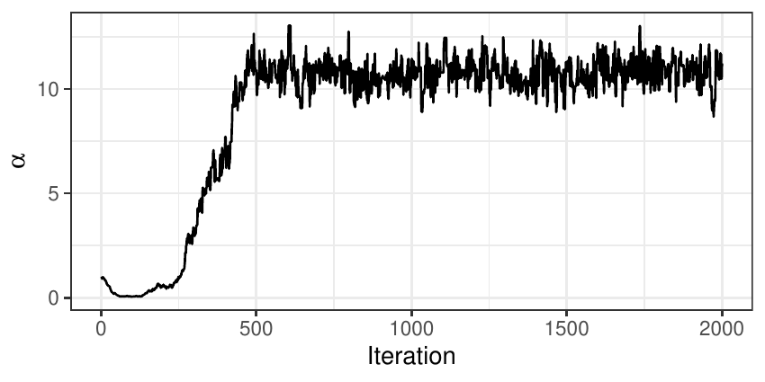
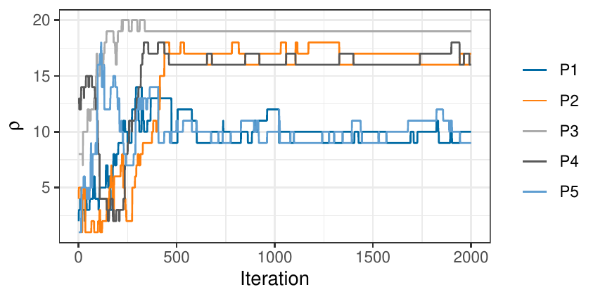
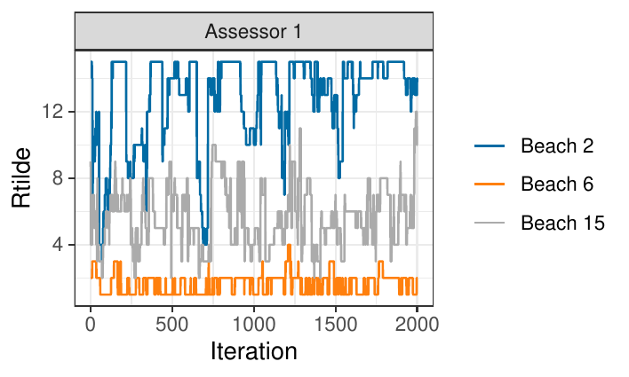
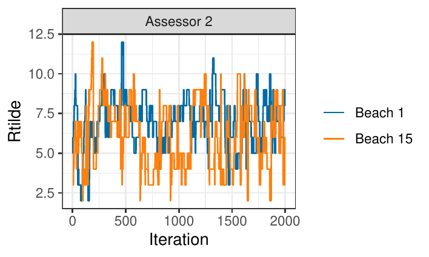
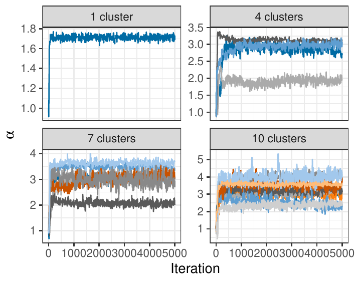
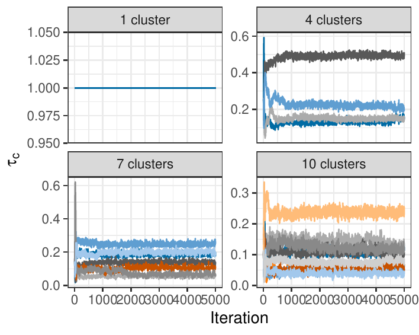

# Introduction

Preference data are usually collected when individuals are asked to rank
a set of items according to a certain preference criterion. The booming
of internet-related activities and applications in recent years has led
to a rapid increase of the amount of data that have ranks as their
natural scale, however often in the form of partial or indirect rankings
(pairwise preferences, ratings, clicks). The amount of readily available
software handling preference data has consequently increased
consistently in the last decade or so, but not many packages are
flexible enough to handle all types of data mentioned above. The typical
tasks when analyzing preference data are rank aggregation,
classification or clustering, and prediction, where the latter task
refers to the estimation of the individual rankings of the assessors
when completely or partially missing. These tasks can be addressed
either via model-based inference or via heuristic machine learning
algorithms, with or without uncertainty quantification. However, very
few methods allow handling diverse data types, combining several
inferential tasks with proper propagation of the uncertainties, while
also providing individualized predictions. Our proposal goes exactly in
this direction, thus making the scopes of
[*BayesMallows*](https://CRAN.R-project.org/package=BayesMallows) broad
when it comes to data handling and individual-level inference.

The R package *BayesMallows* is the first software conceived to answer
the needs mentioned above in a unified framework: it implements full
Bayesian inference for ranking data, and performs all of the tasks above
in the framework of the Bayesian Mallows model (BMM)
[@Mallows1957; @Vitelli2018]. More specifically, *BayesMallows* allows
for data in the forms of complete rankings, partial rankings, as well as
pairwise comparisons, including the case where some comparisons are
inconsistent. In these situations, it provides all Bayesian inferential
tools for rank modeling with the BMM: it performs rank aggregation
(estimation of a consensus ranking of the items), it can cluster
together the assessors providing similar preferences (estimating both
cluster specific model parameters, and individual cluster assignments,
with uncertainty), it performs data augmentation for estimating the
latent assessor-specific full ranking of the items in all missing data
situations (partial rankings, pairwise preferences). The latter in
particular, i.e., the possibility of predicting individual preferences
for unranked items, enables the model to be used as a probabilistic
recommender system. *BayesMallows* also enlarges the pool of distances
that can be used in the Mallows model, and it supports the rank
distances most used in the literature: Spearman's footrule (henceforth
footrule), Spearman's rank correlation (henceforth Spearman), Cayley,
Hamming, Kendall, and Ulam distances [we refer to
@Diaconis1988; @Marden1995 for details on these]. Finally,
*BayesMallows* implements the Iterative Proportional Fitting Procedure
(IPFP) algorithm for computing the partition function for the Mallows
model (MM) [@Mukherjee2016] and the importance sampling algorithm
described in @Vitelli2018. In addition to being used in the MM, these
functions may be of interest in their own right.

Comparing with other available inferential software, we notice that not
many packages allow for such flexibility, very few in combination with
full Bayesian inference, and none when using the MM as outlined in
Section [4](#sec:packages) below. Often machine learning approaches
focus on either rank aggregation (i.e., consensus estimation), or
individual rank prediction, while *BayesMallows* handles both. Since the
BMM is fully Bayesian, all posterior quantities of interest are
automatically available from *BayesMallows* for the first time for the
MM. In addition, the package also has tools for visualizing posterior
distributions, and hence, posterior quantities as well as their
associated uncertainties. Uncertainty quantification is often critical
in real applications: for recommender systems, the model should not spam
the users with very uncertain recommendations; when performing subtype
identification for cancer patients, a very uncertain cluster assignment
might have serious consequences for the clinical practice, for example
in treatment choice. The package also works well with a fairly large
number of items, thanks to computational approximations and efficient
programming. In conclusion, *BayesMallows* provides the first fully
probabilistic inferential tool for the MM with many different distances.
It is flexible in the types of data it handles, and computationally
efficient. We therefore think that this package will gain popularity,
and prove its usefulness in many practical situations, many of which we
probably cannot foresee now.

The paper is organized as follows. The BMM for ranking data is briefly
reviewed in Section [2](#sec:background), as well as its model
extensions to different data types and to mixtures. Section
[3](#sec:mcmc) includes details on the implementation of the inferential
procedure. For a thorough discussion of both the model and its
implementation we refer interested readers to @Vitelli2018. An overview
of existing R packages implementing the Mallows model (MM) is given in
Section [4](#sec:packages). The use of the *BayesMallows* package is
presented, in the form of three case studies, in Sections
[5](#sec:CompleteRankings), [6](#sec:PreferenceData), and
[7](#sec:ClusteringBM). Section [8](#sec:concl) concludes the paper,
also discussing model extensions that will come with new releases of the
package.

# Background: the Bayesian Mallows model for rankings {#sec:background}

In this section we give the background for understanding the functions
in the *BayesMallows* package. More details can be found in @Vitelli2018
and @Liu2019. The section is organized as follows: we first clarify the
notations that we will use throughout the paper (Section
[2.1](#sec:notation)). We then briefly describe the BMM for complete
ranking data (Section [2.2](#sec:model)), also focusing on the relevance
of the choice of distance (Section [2.3](#sec:distances)). The last two
sections focus on model extensions: partial and pairwise data (Section
[2.4](#sec:partial)), non-transitive pairwise comparisons (Section
[2.5](#sec:nt)), and mixtures (Section [2.6](#sec:clustering)).

## Notation {#sec:notation}

Let us denote with $\mathcal{A}=\left\{A_1,...,A_n\right\}$ the finite
set of labeled items to be ranked, and with $\mathcal{P}_n$ the space of
$n$-dimensional permutations. A complete ranking of $n$ items is then a
mapping $\mathbf{R}:\, \mathcal{A}\rightarrow \mathcal{P}_n$ that
attributes a rank ${R}_i\in\left\{1,...,n\right\}$ to each item,
according to some criterion. We here denote a generic complete ranking
by $\mathbf{R}=\left(R_{1},...,R_{n}\right)$, where $R_{i}$ is the rank
assigned to item $A_i$. Given a pair of items $\{A_{i}, A_{k}\}$, we
denote a pairwise preference between them as
$\left(A_{i}\prec A_{k}\right)$, meaning that item $A_{i}$ is preferred
to item $A_{k}$. Note the intimate relation that exists between a
ranking and pairwise preferences. Given a full ranking
$\mathbf{R}\in\mathcal{P}_n$, it is immediate to evince all the possible
$n\left(n-1\right)/2$ pairwise preferences between the items taken in
pairs, since the item in the pair having the lower rank is the preferred
one:
$$\label{prefff}
\begin{split}\left(A_{t_1}\prec A_{t_2}\right) \text{     }\iff\text{     } R_{t_1}<{R}_{t_2},\quad\quad t_1,t_2=1,...,n,\quad t_1\not=t_2.
\end{split}   (\#eq:prefff)$$
Conversely, obtaining a full ranking from a set of pairwise preferences
is not straightforward. Pairwise preference data are typically
incomplete, meaning that not all pairwise preferences necessary to
determine each individual ranking are present. They can contain
non-transitive patterns, that is, one or more pairwise preferences
contradict what is implied by other pairwise preferences. In this
package we can handle partial and possibly non-transitive pairwise
preferences.

## The BMM for Complete Rankings {#sec:model}

The MM for ranking data [@Mallows1957] specifies the probability density
for a ranking $\mathbf{r}\in\mathcal{P}_n$ as follows
$$\label{eq:mallows_distribution}
P\left(\mathbf{r} | \alpha, \mathbf{\rho}\right) = \frac{1}{Z_{n}\left(\alpha\right)} \exp\left[-\frac{\alpha}{n}d\left(\mathbf{r}, \mathbf{\rho}\right)\right] 1_{\mathcal{P}_{n}}\left(\mathbf{r}\right)   (\#eq:mallows-distribution)$$
where $\mathbf{\rho} \in \mathcal{P}_{n}$ is the location parameter
representing the consensus ranking, $\alpha\geq0$ is the scale parameter
(precision), $Z_{n}\left(\alpha\right)$ is the normalizing function (or
partition function), $d\left(\cdot, \cdot\right)$ is a right-invariant
distance among rankings [@Diaconis1988], and
$1_{\mathcal{P}_{n}}\left(\mathbf{r}\right)$ is an indicator function
for the set ${\mathcal{P}_{n}}$ which equals one when
$\mathbf{r} \in {\mathcal{P}_{n}}$ and zero otherwise.

In the complete data case, $N$ assessors have provided complete rankings
of the $n$ items in $\mathcal{A}$ according to some criterion, yielding
the permutation $\mathbf{R}_{j} = \left(R_{1j}, \dots, R_{nj}\right)$
for assessor $j,$ $j=1,\ldots,N$. The likelihood of the $N$ observed
rankings $\mathbf{R}_{1}, \dots, \mathbf{R}_{N}$, assumed conditionally
independent given $\alpha$ and $\mathbf{\rho}$, is
$$\label{eq:mallows_likelihood}
P\left(\mathbf{R}_{1}, \dots, \mathbf{R}_{N} | \alpha, \mathbf{\rho}\right) = \frac{1}{Z_{n}\left(\alpha\right)^N} \exp\left[-\frac{\alpha}{n}\sum_{j=1}^Nd\left(\mathbf{R}_j, \mathbf{\rho}\right)\right] \prod_{j=1}^N 1_{\mathcal{P}_n}\left(\mathbf{R}_j\right).   (\#eq:mallows-likelihood)$$
According to the BMM introduced in @Vitelli2018, prior distributions
have to be elicited on every parameter of interest. A truncated
exponential prior distribution was specified for $\alpha$
$$\pi\left(\alpha | \lambda\right) = \frac{\lambda \exp\left(-\lambda \alpha\right) 1_{\left[0, \alpha_{\text{max}}\right]}\left(\alpha\right)}{1 - \exp\left(-\lambda \alpha_{\text{max}}\right)},$$
where $\lambda$ is a rate parameter, small enough to ensure good prior
dispersion, and $\alpha_{\text{max}}$ is a cutoff, large enough to cover
reasonable $\alpha$ values. A uniform prior
$\pi\left(\mathbf{\rho}\right)$ on $\mathcal{P}_{n}$ was assumed for
$\mathbf{\rho}$. It follows that the posterior distribution for $\alpha$
and $\mathbf{\rho}$ is
$$\label{eq:mallows_posterior}
P\left(\alpha, \mathbf{\rho} | \mathbf{R}_{1}, \dots, \mathbf{R}_{N}\right) \propto \frac{1_{\mathcal{P}_{n}}\left(\mathbf{\rho}\right)}{Z_{n}\left(\alpha\right)^{N}} \exp\left[-\frac{\alpha}{n}\sum_{j=1}^{N}d\left(\mathbf{R}_{j}, \mathbf{\rho}\right) - \lambda \alpha\right] 1_{\left[0, \alpha_{\text{max}}\right]}\left(\alpha\right).   (\#eq:mallows-posterior)$$

Inference on the model parameters is based on a Metropolis-Hastings
(M-H) Markov Chain Monte Carlo (MCMC) algorithm, described in
@Vitelli2018. Some details relevant for a correct use of this package
are also given in Section [3.1](#sec:mainalgo).

## Distance measures and partition function {#sec:distances}

The partition function $Z_{n}\left(\alpha\right)$ in
\@ref(eq:mallows-distribution), \@ref(eq:mallows-likelihood) and
\@ref(eq:mallows-posterior) does not depend on the latent consensus
ranking $\mathbf{\rho}$ when the distance $d\left(\cdot, \cdot\right)$
is right-invariant, meaning that it is unaffected by a relabelling of
the items [@Diaconis1988]. Right-invariant distances play an important
role in the MM, and *BayesMallows* only handles right-invariant
distances. The choice of distance affects the model fit to the data and
the results of the analysis, and is crucial also because of its role in
the partition function computation. Some right-invariant distances allow
for analytical computation of the partition function, and for this
reason they have become quite popular. In particular, the MM with
Kendall [@Meila2010; @Lu2015], Hamming [@irurozki2014Ham] and Cayley
[@irurozki2016sampling] distances have a closed form of
$Z_n\left(\alpha\right)$ due to @Fligner1986. There are however
important and natural right-invariant distances for which the
computation of the partition function is NP-hard, in particular the
footrule (${l}_1$) and the Spearman (${l}_2$) distances. For precise
definitions of all distances involved in the MM we refer to @Marden1995.
*BayesMallows* handles the footrule, Spearman, Cayley, Hamming, Kendall,
and Ulam distances.

## Partial rankings and transitive pairwise comparisons {#sec:partial}

When complete rankings of all items are not readily available, the BMM
can still be used by applying data augmentation techniques. Partial
rankings can occur because ranks are missing at random, because the
assessors have only ranked their top-$k$ items, or because they have
been presented with a subset of items. In more complex situations, data
do not include ranks at all, but the assessors have only compared pairs
of items and given a preference between the two. The Bayesian data
augmentation scheme can still be used to handle such pairwise comparison
data, thus providing a solution that is fully integrated into the
Bayesian inferential framework. The following paragraphs provide a
summary of Sections 4.1 and 4.2 of @Vitelli2018, which we refer to for
details.

Let us start by considering the case of top-$k$ rankings. Suppose that
each assessor $j$ has chosen a set of preferred items
$\mathcal{A}_{j} \subseteq \mathcal{A}$, which were given ranks from $1$
to $n_j=|\mathcal{A}_{j}|$. Now $R_{ij} \in \{1,\ldots,n_j\}$ if
$A_{i} \in \mathcal{A}_{j}$, while for $A_i \in \mathcal{A}^c_{j}$,
$R_{ij}$ is unknown, except for the constraint $R_{ij} > n_j$,
$j=1,\dots,N.$ The augmented data vectors
$\tilde{\mathbf{R}}_{1},\dots,\tilde{\mathbf{R}}_{N}$ are introduced in
the model to include the missing ranks, which are estimated as latent
parameters. Let
$\mathcal{S}_{j} = \{ \tilde{\mathbf{R}}_{j} \in \mathcal{P}_{n} : \tilde{R}_{ij} = R_{ij} \text{ if } A_{i} \in \mathcal{A}_{j} \}, ~ j=1,\dots,N$
be the set of possible augmented random vectors, including the ranks of
the observed top-$n_j$ items together with the unobserved ranks, which
are assigned a uniform prior on the permutations of
$\{n_j+1,\ldots,n\}$. The goal is to sample from the posterior
distribution
$$\begin{aligned}
\label{eq:mallows_partial}
P\left(\alpha, \mathbf{\rho}| \mathbf{R}_{1},\dots, \mathbf{R}_{N}\right) = \sum_{\tilde{\mathbf{R}}_{1} \in \mathcal{S}_{1}} \dots \sum_{\tilde{\mathbf{R}}_{N} \in \mathcal{S}_{N}} P\left( \alpha, \mathbf{\rho} , \tilde{\mathbf{R}}_{1},\dots, \tilde{\mathbf{R}}_{N}|\mathbf{R}_{1},\dots, \mathbf{R}_{N}\right).
\end{aligned}   (\#eq:mallows-partial)$$
The augmentation scheme amounts to alternating between sampling $\alpha$
and $\mathbf{\rho}$ given the current values of the augmented ranks
using the posterior given in (\@ref(eq:mallows-posterior)), and sampling
the augmented ranks given the current values of $\alpha$ and
$\mathbf{\rho}$. For the latter task, once $\alpha$, $\mathbf{\rho}$ and
the observed ranks $\mathbf{R}_{1},\dots, \mathbf{R}_{N}$ are fixed, one
can see that $\tilde{\mathbf{R}}_{1},\dots, \tilde{\mathbf{R}}_{N}$ are
conditionally independent, and that each $\tilde{\mathbf{R}}_{j}$ only
depends on the corresponding ${\mathbf{R}}_{j}$. As a consequence, the
update of new augmented vectors is performed independently, for each
$j =1,\dots,N$.

The above procedure can also handle more general situations where
missing rankings are not necessarily the bottom ones, and where each
assessor is asked to provide the mutual ranking of some possibly random
subset $\mathcal{A}_j\subseteq\mathcal{A}$ consisting of $n_j\leq n$
items. Note that the only difference from the previous formulation is
that each latent rank vector $\tilde{\mathbf{R}}_j$ takes values in the
set
$$\mathcal{S}_j=\left\{\tilde{\mathbf{R}}_j\in\mathcal{P}_n:\left(R_{i_1j}<R_{i_2j}\right) \land \left(A_{i_1},A_{i_2}\in \mathcal{A}_j\right)\Rightarrow \tilde{R}_{i_1j}<\tilde{R}_{i_2j}\right\}.$$
Also in this case the prior for $\tilde{\mathbf{R}}_j$ is assumed
uniform on $\mathcal{S}_j$.

In the case of pairwise comparison data, let us call $\mathcal{B}_{j}$
the set of all pairwise preferences stated by assessor $j$, and let
$\mathcal{A}_{j}$ be the set of items appearing at least once in
$\mathcal{B}_{j}$. Note that the items in $\mathcal{A}_{j}$ are not
necessarily fixed to a given rank but may only be given some partial
ordering. For the time being, we assume that the observed pairwise
orderings in $\mathcal{B}_{j}$ are transitive, i.e., mutually
compatible, and define by $\text{tc}\left(\mathcal{B}_{j}\right)$ the
transitive closure of $\mathcal{B}_{j}$, which contains all pairwise
orderings of the elements in $\mathcal{A}_{j}$ induced by
$\mathcal{B}_{j}$. The model formulation remains the same as in the case
of partial rankings, with the prior for the augmented data vectors
$\tilde{\mathbf{R}}_{1},\dots,\tilde{\mathbf{R}}_{N}$ being uniform on
the set $\mathcal{S}_j$ of rankings that are compatible with the
observed data.

## Non-transitive pairwise comparisons {#sec:nt}

It can happen in real applications that individual pairwise comparison
data are non-transitive, that is, they may contain a pattern of the form
$x \prec y\,,\,\, y \prec z$ but $z \prec x$. This is typically the case
of data collected from internet user activities, when the pool of items
is very large: non-transitive patterns can arise for instance due to
assessors' inattentiveness, uncertainty in their preferences, and actual
confusion, even when one specific criterion for ranking is used. Another
frequent situation is when the number of items is not very large, but
the items are perceived as very similar by the assessors. This setting
is discussed in @crispino2019, where the model for transitive pairwise
comparisons of Section [2.4](#sec:partial) is generalized to handle
situations where non-transitivities in the data occur. Note that the
kind of non-transitivity that is considered in @crispino2019 considers
only the individual level preferences. A different type of
non-transitivity, which we do not consider here, arises when aggregating
preferences across assessors, as under Condorcet [@Condorcet1785] or
Borda [@Borda1781] voting rules.

The key ingredient of this generalization consists of adding one layer
of latent variables to the model hierarchy, accounting for the fact that
assessors can make mistakes. The main assumption is that the assessor
makes pairwise comparisons based on her latent full rankings
$\tilde{\mathbf R}$. A mistake is defined as an inconsistency between
one of the assessor's pairwise comparisons and $\tilde{\mathbf R}$.
Suppose each assessor $j=1,\dots,N$ has assessed $M_j$ pairwise
comparisons, collected in the set $\mathcal{B}_j,$ and assume the
existence of latent ranking vectors $\tilde{\mathbf R_j}$,
$j=1,\dots,N$. Differently from Section [2.4](#sec:partial), since
$\mathcal{B}_j$ is allowed to contain non-transitive pairwise
preferences, the transitive closure of $\mathcal{B}_j$ is not defined,
and the posterior density \@ref(eq:mallows-partial) cannot be evaluated.
In this case, the posterior takes the form,
$$\label{incons}\begin{split}
P\left(\alpha,\mathbf{\rho}| \mathcal{B}_{1},...,\mathcal{B}_{N}\right)=&\sum_{\tilde{\mathbf{R}}_1\in\mathcal{P}_n}\dots \sum_{\tilde{\mathbf{R}}_N\in\mathcal{P}_n} P\left(\alpha, \mathbf{\rho},\tilde{\mathbf{R}}_1,...,\tilde{\mathbf{R}}_N|\mathcal{B}_{1},...,\mathcal{B}_{N}\right) = \\
=&\sum_{\tilde{\mathbf{R}}_1\in\mathcal{P}_n}\dots \sum_{\tilde{\mathbf{R}}_N\in\mathcal{P}_n}
P(\alpha, \mathbf{\rho}|\tilde{\mathbf{R}}_1,...,\tilde{\mathbf{R}}_N)P\left(\tilde{\mathbf{R}}_1,...,\tilde{\mathbf{R}}_N|\mathcal{B}_{1},...,\mathcal{B}_{N}\right)\\
\end{split}   (\#eq:incons)$$
where the term
$P\left(\tilde{\mathbf{R}}_1,...,\tilde{\mathbf{R}}_N|\mathcal{B}_{1},...,\mathcal{B}_{N}\right)$
models the presence of mistakes in the data, while in the case of
transitive pair comparisons it was implicitly assumed equal to 1 if each
augmented ranking $\tilde{\mathbf R}_j$ was compatible with the partial
information contained in $\mathcal{B}_j$, and 0 otherwise.

Two models for \@ref(eq:incons) are considered in @crispino2019: the
Bernoulli model, which accounts for random mistakes, and the Logistic
model, which lets the probability of making a mistake depend on the
similarity of the items being compared. The Bernoulli model states that:
$$\label{eq:bm}
P\left(\tilde{\mathbf{R}}_1,...,\tilde{\mathbf{R}}_N|\theta, \mathcal{B}_{1},...,\mathcal{B}_{N}\right)\propto 
\theta^M\left(1-\theta\right)^{\sum_j M_j-M},\quad\theta\in\left[0,0.5\right)   (\#eq:bm)$$
where $M$ counts the number of times the observed preferences contradict
what is implied by the ranking $\tilde{\mathbf{R}}_j$, $M_{j}$ is the
number of pairwise comparisons reported by assessor $j$, and the
parameter $\theta$ is the probability of making a mistake in a single
pairwise preference. $\theta$ is *a priori* assigned a truncated Beta
distribution on the interval $\left[0,0.5\right)$ with given
hyper-parameters $\kappa_1$ and $\kappa_2$, conjugate to the Bernoulli
model \@ref(eq:bm). The Logistic model is a generalization of
\@ref(eq:bm) where, instead of assigning a constant value $\theta$ to
the probability of making a mistake, it depends on the distance between
the ranks of the two items under comparison. In @crispino2019 the
Logistic model gave results very similar to the Bernoulli model, and
currently only the Bernoulli model is available in *BayesMallows*. The
sampling scheme is similar to the one used for the case of transitive
pairwise preferences, apart from an additional step for updating
$\theta$, and the augmentation scheme for $\tilde{\mathbf{R}}_j$, which
is slightly different. We refer to @crispino2019 for details.

## Clustering {#sec:clustering}

The assumption, implicit in the discussion so far, that there exists a
unique consensus ranking shared by all assessors is unrealistic in most
real applications: the BMM thus handles the case where the rankings
provided by all assessors can be modeled as a finite mixture of MMs. In
the following brief discussion we assume that the data consist of
complete rankings, but *BayesMallows* can fit a mixture based on any
kinds of preference data described so far. See Section 4.3 of
@Vitelli2018 for details.

Let $z_1,\ldots,z_N \in \left\{1,\ldots,C\right\}$ assign each assessor
to one of $C$ clusters, and let the rankings within each cluster
$c \in \left\{1,\ldots,C\right\}$ be described by an MM with parameters
$\alpha_c$ and $\mathbf{\rho}_c$. The likelihood of the observed
rankings $\mathbf{R}_1,\ldots,\mathbf{R}_N$ is given by
$$\begin{aligned}
P\left(\mathbf{R}_{1},\dots,\mathbf{R}_{N} \Big| \left\{\mathbf{\rho}_{c},\alpha_{c}\right\}_{c=1,...,C}, \left\{z_j\right\}_{j=1,\ldots,N} \right) = \prod_{j=1}^N \frac{1_{\mathcal{P}_n}\left(\mathbf{R}_{j}\right)}{Z_{n}\left(\alpha_{z_j}\right)}\exp\left[-\frac{\alpha_{z_j}}{n} d\left(\mathbf{R}_{j},\mathbf{\rho}_{z_j}\right) \right],
\end{aligned}$$
where conditional independence is assumed across the clusters. We also
assume independent truncated exponential priors for the scale parameters
and independent uniform priors for the consensus rankings. The cluster
labels $z_1,\ldots,z_N$ are a priori assumed conditionally independent
given the clusters mixing parameters $\tau_1,...,\tau_C$, and are
assigned a uniform multinomial. Finally $\tau_1,\ldots,\tau_C$ (with
$\tau_c\geq0, \ c=1,\ldots,C$ and $\sum_{c=1}^C \tau_c = 1$) are
assigned the standard symmetric Dirichlet prior of parameter $\Psi$,
thus implying a conjugate scheme. The posterior density is then given by
$$\label{eq:post_mixture}
P\left(\left\{\mathbf{\rho}_{c},\alpha_{c}, \tau_c\right\}_{c=1}^C, \left\{z_j\right\}_{j=1}^N \Big|\mathbf{R}_{1},\dots,\mathbf{R}_{N}\right)
\propto \left[\prod_{c=1}^Ce^{-\lambda\alpha_c}\tau_c^{\Psi-1}\right]\left[
\prod_{j=1}^N\frac{\tau_{z_j}e^{-\frac{\alpha_{z_j}}{n} d\left(\mathbf{R}_{j},\mathbf{\rho}_{z_j}\right)}}{Z_{n}\left(\alpha_{z_j}\right)}\right].   (\#eq:post-mixture)$$

# Computational considerations {#sec:mcmc}

In this section we briefly give some additional details regarding the
implementation of the models described in Section [2](#sec:background).
The BMM implementation is thoroughly described in @Vitelli2018.

## Details on the MCMC procedures {#sec:mainalgo}

In order to obtain samples from the posterior density of equation
\@ref(eq:mallows-posterior), *BayesMallows* implements an MCMC scheme
iterating between (i) updating $\mathbf\rho$ and (ii) updating $\alpha$
[Algorithm 1 of @Vitelli2018]. The leap-and-shift proposal distribution,
which is basically a random local perturbation of width $L$ of a given
ranking, is used for updating $\mathbf\rho$ in step (i). The $L$
parameter of the leap-and-shift proposal controls how far the proposed
ranking is from the current one, and it is therefore linked to the
acceptance rate. The recommendation given in @Vitelli2018 is to set it
to $L=n/5$, which is also the default value in *BayesMallows*, but the
user is allowed to choose a different value. For updating $\alpha$ in
step (ii), a log-normal density is used as proposal, and its variance
$\sigma_{\alpha}^{2}$ can be tuned to obtain a desired acceptance rate.

As mentioned in Section [2.4](#sec:partial), the MCMC procedure for
sampling from the posterior densities corresponding to the partial data
cases [Algorithm 3 of @Vitelli2018] has an additional M-H step to
account for the update of the augmented data rankings
$\left\{\tilde{\mathbf{R}}_j\right\}_{j=1}^N$. In the case of partial
rankings, for updating the augmented data $\tilde{\mathbf{R}}_j$,
$j=1,...,N$ we use a uniform proposal on the set of rankings compatible
with the partial data, $\mathcal{S}_j$. In the case of pairwise
preferences, due to the increased sparsity in the data, we instead
implemented a modified parameter-free leap-and-shift proposal
distribution, which proposes a new augmented ranking by locally
permuting the ranks in $\tilde{\mathbf{R}}_j$ within the constraints
given by $\mathcal{B}_j$ [@Vitelli2018 Section 4.2]. The generalization
to non-transitive pairwise comparisons, outlined in Section 4 of
@crispino2019, requires further considerations. First, in the M-H step
for updating the augmented data rankings, the modified parameter-free
leap-and-shift proposal has to be replaced by a Swap proposal, whose
tuning parameter $L^\star$ is the maximum allowed distance between the
ranks of the swapped items. Second, the Bernoulli model for mistakes
makes it necessary to add a a Gibbs step for the update of $\theta$. The
MCMC algorithm for sampling from the mixture model posterior
\@ref(eq:post-mixture) [Algorithm 2 of @Vitelli2018] alternates between
updating $\left\{\mathbf{\rho}_c, \alpha_c\right\}_{c=1}^C$ in an M-H
step, and $\left\{\tau_c, z_j\right\}_{c=1, j=1}^{C, N}$ in a Gibbs
sampling step, in addition to the necessary M-H steps for data
augmentation or estimation of error models, as outlined above.

## Partition Function {#sec:normconst}

When the distance in the BMM is footrule or Spearman, the partition
function $Z_n\left(\cdot\right)$ does not have a closed form. In these
situations *BayesMallows* allows for three different choices, which the
user may employ depending on the value of $n$: (a) exact calculation,
(b) Importance Sampling (IS), and (c) the asymptotic approximation due
to @Mukherjee2016.

The package contains integer sequences for exact calculation of the
partition function with footrule distance for up to $n=50$ items, and
with the Spearman distance for up to $n=14$ items [see @Vitelli2018
Section 2.1]. These sequences are downloaded from the On-Line
Encyclopedia of Integer Sequences [@Sloane2017].

The IS procedure can be used to compute an off-line approximation
$\hat{Z}_n\left(\alpha\right)$ of $Z_n\left(\alpha\right)$ for the
specific value of $n$ which is needed in the application at hand. The IS
estimate $\hat{Z}_n\left(\alpha\right)$ is computed on a grid of
$\alpha$ values provided by the user, and then a smooth estimate
obtained via a polynomial fit is returned to the user, who can also
select the degree of the polynomial function. Finally, the user should
set the number $K$ of IS iterations, and we refer to @Vitelli2018 for
guidelines on how to select a large enough value for $K$. The procedure
might be time-consuming, depending on $K$, $n$, and on how the grid for
$\alpha$ is specified. In our experience, values of $n$ larger than
approximately 100 might require $K$ to be as large as $10^8$ in order
for the IS to provide a good estimate, and hence a long computing time.

The IPFP algorithm [@Mukherjee2016 Theorem 1.8] yields a numeric
evaluation of $Z_\text{lim}\left(\cdot\right)$, the asymptotic
approximation to $Z_n(\cdot)$. In this case the user needs to specify
two parameters: the number of iterations $m$ to use in the IPFP, and the
number of grid points $K$ of the grid approximating the continuous
domain where the limit is computed. Values of $m$ and $K$ have been
suggested by @Mukherjee2016, and we refer to the Supplementary Material
of @Vitelli2018 for more details.

A simulation experiment was conducted comparing the methods for
estimating $\log\left(Z\left(\alpha\right)\right)$ with footrule
distance for $\alpha = 0.1,0.2, \dots, 20$. Let
$\log\left(Z\left(\alpha\right)\right)^{K}$ denote the IS estimate
obtained with $K$ iterations, and define the absolute relative
difference between two IS estimates obtained with $K_{2}$ and $K_{1}$
iterations as
$$\rho(K_{2},K_{1}) = \text{max}_{\alpha} \left\{ \frac{\left| \log(Z(\alpha))^{K_{2}} - \log(Z(\alpha))^{K_{1}} \right|}{\left|\log(Z(\alpha))^{K_{1}} \right|}\right\}.$$
The IS algorithm was run with $10^{5}$, $10^{6}$, and $10^{7}$
iterations, and we obtained $\rho\left(10^{6},10^{5}\right) < 0.3 \%$
and $\rho\left(10^{7},10^{6}\right) < 0.15 \%$, suggesting that using
$K=10^7$ yields low Monte Carlo variation over this range of $\alpha$.
The IPFP algorithm was used to estimate
$\log\left(Z_{\text{lim}}\left(\alpha\right)\right)$, with $K=10^3$ and
$m=10^3$. The results are summarized in Figure
[1](#fig:small_items_plots), in which also exact computation is included
in the case of 50 items. With 50 items, the IS estimate perfectly
overlaps the exact estimate, while the asymptotic estimate has a bias
that increases with increasing $\alpha$. As expected, the bias of the
asymptotic estimate decreases when the number of items increases, as
this brings it closer to the asymptotic limit.

{#fig:small_items_plots
width="100%" alt="graphic without alt text"}

## Sampling from the Bayesian Mallows Model {#sec:sampling}

To obtain random samples from the MM with Cayley, Hamming, Kendall, or
Ulam distance and fixed $\alpha$ and $\mathbf{\rho}$, we suggest using
the [*PerMallows*](https://CRAN.R-project.org/package=PerMallows)
[@Irurozki2016] package, which is optimized for this task. We instead
provide a procedure for sampling from the MM with footrule and Spearman.
The procedure to generate a random sample of size $N$ from the MM is
straightforward, and described in Appendix C of @Vitelli2018. Basically
we run a Metropolis-Hastings algorithm with fixed $\mathbf{\rho}$ and
$\alpha$ and accept/reject the sample based on its acceptance
probability. We then take $N$ rankings with a large enough interval
between each of them to achieve independence.

# Packages implementing the Mallows model {#sec:packages}

This section gives an overview of existing packages for fitting the MM.

-   *PerMallows* is the package that comes closest in functionality to
    *BayesMallows*. It contains functions for learning and sampling from
    the frequentist versions of the MM and generalized Mallows model
    (GMM) [@Fligner1986]. Compared to *BayesMallows*, it lacks support
    for footrule or Spearman distance, it is not Bayesian, and does not
    compute uncertainty ranges for the estimated parameters. In addition
    *PerMallows* handles only complete rankings, and does not provide
    functionality for computation of mixture models. According to
    @Irurozki2016 [Table 1], computing the maximum likelihood estimates
    (MLE) of $\alpha$ and $\rho$ using the function `lmm` is possible
    when $n < 80$ for Kendall, $n < 250$ for Cayley, $n < 90$ for
    Hamming and $n < 100$ for Ulam. Our experiments suggest that these
    estimates are conservative, and that even larger numbers of items
    are fit rapidly. Hence, *PerMallows* seems to be a good choice for
    modeling with complete data without clusters, when the supported
    distance measures are appropriate and uncertainty estimates are not
    sought. *PerMallows* also has very efficient functions for sampling
    from the MM with Cayley, Hamming, Kendall, and Ulam distances.
-   [*pmr*](https://CRAN.R-project.org/package=pmr) [@Lee2013] provides
    summary statistics, visualization, and model fitting tools for
    complete ranking data in the MM, as well as other models. The
    function `dbm` returns the MLE of $\alpha$ together with its
    variance. The MLE of $\rho$, however, is not returned, but printed
    to the console, and no uncertainty estimates are given. Internally,
    `dbm` generates a matrix of size $n! \times n$ containing all
    possible permutations of the $n$ items. As a result, it quickly runs
    into memory issues. In our tests, `pmr` was not able to handle a
    ranking dataset with $n = 10$ items.
-   [*rankdist*](https://CRAN.R-project.org/package=rankdist)
    [@Qian2018] implements distance-based probability models for ranking
    data as described in @Alvo2014, returning MLEs for $\alpha$ and
    $\rho$, but no uncertainty estimates. The package handles a large
    number of distances and supports mixture models, but in our
    experiments a warning was issued when using mixtures with all
    distances except Kendall. *rankdist* also implements the GMM
    [@Fligner1986]. However, for Cayley, footrule, Hamming, and Spearman
    distances, it generates an $n! \times n$ matrix internally, causing
    our R session to crash with $n \geq 10$ items, hence limiting its
    applicability. For Kendall, on the other hand, *rankdist* appears to
    work fine both with a large number of items, and with mixtures.

*BayesMallows* provides many new functionalities not implemented in
these packages, as will be illustrated in the use cases of the following
three sections.

# Analysis of complete rankings with *BayesMallows* {#sec:CompleteRankings}

We illustrate the case of complete rankings with the potato datasets
described in @Liu2019 [Section 4]. In short, a bag of 20 potatoes was
bought, and 12 assessors were asked to rank the potatoes by weight,
first by visual inspection, and next by holding the potatoes in hand.
These datasets are available in *BayesMallows* as matrices with names
`potato_weighing` and `potato_visual`, respectively. The true ranking of
the potatoes' weights is available in the vector `potato_true_ranking`.
In general, `compute_mallows` expects ranking datasets to have one row
for each assessor and one column for each item. Each row has to be a
proper permutation, possibly with missing values. We are interested in
the posterior distribution of both the level of agreement between
assessors, as described by $\alpha$, and in the latent ranking of the
potatoes, as described by $\mathbf{\rho}$. We refer to the attached
replication script for random number seeds for exact reproducibility.

First, we do a test run to check convergence of the MCMC algorithm, and
then get trace plots with `assess_convergence`.

``` r
bmm_test <- compute_mallows(potato_visual)
assess_convergence(bmm_test)
```

By default, `assess_convergence` returns a trace plot for $\alpha$,
shown in Figure [2](#fig:potato_trace)a. The algorithm seems to be
mixing well after around 500 iterations. Next, we study the convergence
of $\mathbf{\rho}$. To avoid overly complex plots, we pick potatoes
$1-5$ by specifying this in the `items` argument.

``` r
assess_convergence(bmm_test, parameter = "rho", items = 1:5)
```

The corresponding plot is shown in Figure [2](#fig:potato_trace)b,
illustrating that the MCMC algorithm seems to have converged after
around 1,000 iterations.

<figure id="fig:potato_trace">
<table>
<caption> </caption>
<tbody>
<tr class="odd">
<td style="text-align: center;"><span></span></td>
<td style="text-align: center;"><span></span></td>
</tr>
<tr class="even">
<td style="text-align: center;">(a) <span>Trace of <span
class="math inline"><em>α</em></span>. </span></td>
<td style="text-align: center;">(b) <span>Trace of <span
class="math inline"><strong>ρ</strong></span>. </span></td>
</tr>
</tbody>
</table>
<figcaption>Figure 2: Trace plots of <span
class="math inline"><em>α</em></span> and <span
class="math inline"><em>ρ</em></span> for the MCMC algorithm with the
<code>potato_visual</code> dataset. The plots indicating good mixing for
both parameters after about 500 iterations.</figcaption>
</figure>

![Figure 3: []{#fig:potato_posterior_alpha
label="fig:potato_posterior_alpha"} Posterior distribution of $\alpha$
with the `potato_visual` dataset. The posterior mass is symmetrically
centered between 9 and 13, with a mean around
11.](figures/potato-posterior-alpha.png){#fig:potato_posterior_alpha
width="100%" alt="graphic without alt text"}

From the trace plots, we decide to discard the first 1,000 MCMC samples
as burn-in. We rerun the algorithm to get 500,000 samples after burn-in.
The object `bmm_visual` has `S3` class \"BayesMallows\", so we plot the
posterior distribution of $\alpha$ with `plot.BayesMallows`.

``` r
bmm_visual <- compute_mallows(potato_visual, nmc = 501000)
bmm_visual$burnin <- 1000 # Set burn-in to 1000
plot(bmm_visual) # Use S3 method for plotting
```

The plot is shown in Figure [3](#fig:potato_posterior_alpha). We can
also get posterior credible intervals for $\alpha$ using\
`compute_posterior_intervals`, which returns both highest posterior
density intervals (HPDI) and central intervals in a `tibble`
[@Muller2018]. *BayesMallows* uses `tibble`s rather than `data.frame`s,
but both are accepted as function inputs. We refer to `tibble`s as
dataframes henceforth.

``` r
compute_posterior_intervals(bmm_visual, decimals = 1L)

# A tibble: 1 x 6
  parameter  mean median conf_level hpdi       central_interval
  <ch    <dbl>  <dbl> <ch     <ch     <chr>
1 alpha      10.9   10.9 95 %       [9.4,12.3] [9.5,12.3]
```

Next, we can go on to study the posterior distribution of
$\mathbf{\rho}$.

``` r
plot(bmm_visual, parameter = "rho", items = 1:20)
```

If the `items` argument is not provided, and the number of items exceeds
five, five items are picked at random for plotting. To show all
potatoes, we explicitly set `items = 1:20`. The corresponding plots are
shown in Figure [4](#fig:potato_posterior_rho).

![Figure 4: []{#fig:potato_posterior_rho
label="fig:potato_posterior_rho"} Posterior distribution of latent ranks
$\mathbf{\rho}$ with the `potato_visual` dataset. Most potatoes have
highly peaked posterior distributions, indicating low uncertainty about
their
ranking.](figures/potato-posterior-rho.png){#fig:potato_posterior_rho
width="100%" alt="graphic without alt text"}

## Jumping over the scale parameter

Updating $\alpha$ in every step of the MCMC algorithm may not be
necessary, as the number of posterior samples typically is more than
large enough to obtain good estimates of its posterior distribution.
With the `alpha_jump` argument, we can tell the MCMC algorithm to update
$\alpha$ only every `alpha_jump`-th iteration. To update $\alpha$ every
10th update of $\mathbf{\rho}$, we do

``` r
bmm <- compute_mallows(potato_visual, nmc = 501000, alpha_jump = 10)
```

On a MacBook Pro 2.2 GHz Intel Core i7 running R version 3.5.1, the
above call ran in 2.0 seconds on average over 1,000 replications using
[*microbenchmark*](https://CRAN.R-project.org/package=microbenchmark)
[@Mersmann2018], while it took 4.2 seconds using the default value
`alpha_jump = 1`, i.e., updating $\alpha$ less frequently more than
halved the computing time.

## Other distance metrics

By default, `compute_mallows` uses the footrule distance, but the user
can also choose to use Cayley, Kendall, Hamming, Spearman, or Ulam
distance. Running the same analysis of the potato data with Spearman
distance is done with the command

``` r
bmm <- compute_mallows(potato_visual, metric = "spearman", nmc = 501000)
```

For the particular case of Spearman distance, *BayesMallows* only has
integer sequences for computing the exact partition function with 14 or
fewer items. In this case a precomputed importance sampling estimate is
part of the package, and used instead.

# Analysis of preference data with *BayesMallows* {#sec:PreferenceData}

Unless the argument `error_model` to `compute_mallows` is set, pairwise
preference data are assumed to be consistent within each assessor. These
data should be provided in a dataframe with the following three columns,
with one row per pairwise comparison.

-   `assessor` is an identifier for the assessor; either a numeric
    vector containing the assessor index, or a character vector
    containing the unique name of the assessor.
-   `bottom_item` is a numeric vector containing the index of the item
    that was disfavored in each pairwise comparison.
-   `top_item` is a numeric vector containing the index of the item that
    was preferred in each pairwise comparison.

A dataframe with this structure can be given in the `preferences`
argument to `compute_mallows`. `compute_mallows` will generate the full
set of implied rankings for each assessor using the function
`generate_transitive_closure`, as well as an initial ranking matrix
consistent with the pairwise preferences, using the function
`generate_initial_ranking`.

We illustrate with the beach preference data containing stated pairwise
preferences between random subsets of 15 images of beaches, by 60
assessors [@Vitelli2018 Section 6.2]. This dataset is provided in the
dataframe `beach_preferences`.

## Transitive closure and initial ranking

We start by generating the transitive closure implied by the pairwise
preferences.

``` r
beach_tc <- generate_transitive_closure(beach_preferences)
```

The dataframe `beach_tc` contains all the pairwise preferences in
`beach_preferences`, with all the implied pairwise preferences in
addition. The latter are preferences that were not specifically stated
by the assessor, but instead are implied by the stated preferences. As a
consequence, the dataframe `beach_tc` has 2921 rows, while
`beach_preferences` has 1442 rows. Initial rankings, i.e., a set of full
rankings for each assessor that are consistent with the implied pairwise
preferences are then generated, and we set the column names of the
initial ranking matrix to \"Beach 1\", \"Beach 2\", \..., \"Beach 15\"
in order have these names appear as labels in plots and output.

``` r
beach_init_rank <- generate_initial_ranking(beach_tc)
colnames(beach_init_rank) <- paste("Beach", 1:ncol(beach_init_rank))
```

If we had not generated the transitive closure and the initial ranking,
`compute_mallows` would do this for us, but when calling
`compute_mallows` repeatedly, it may save time to have these precomputed
and saved for future re-use. In order to save time in the case of big
datasets, the functions for generating transitive closures and initial
rankings from transitive closures can all be run in parallel, as shown
in the examples to the `compute_mallows` function. The key to the
parallelization is that each assessor's preferences can be handled
independently of the others, and this can speed up the process
considerably with large dataset.

As an example, let us look at all preferences stated by assessor 1
involving beach 2. We use `filter` from
[*dplyr*](https://CRAN.R-project.org/package=dplyr) [@Wickham2018dplyr]
to obtain the right set of rows.

``` r
library("dplyr")
# All preferences stated by assessor 1 involving item 2
filter(beach_preferences, assessor == 1, bottom_item == 2 | top_item == 2)

# A tibble: 1 x 3
  assessor bottom_item top_item
     <dbl>       <dbl>    <dbl>
1        1           2       15
```

Assessor 1 has performed only one direct comparison involving beach 2,
in which the assessor stated that beach 15 is preferred to beach 2. The
implied orderings, on the other hand, contain two preferences involving
beach 2:

``` r
# All implied orderings for assessor 1 involving item 2
filter(beach_tc, assessor == 1, bottom_item == 2 | top_item == 2)

  assessor bottom_item top_item
1        1           2        6
2        1           2       15
```

In addition to the statement that beach 15 is preferred to beach 2, all
the other orderings stated by assessor 1 imply that this assessor
prefers beach 6 to beach 2.

## Convergence diagnostics

As with the potato data, we can do a test run to assess the convergence
of the MCMC algorithm. However, this time we provide the initial
rankings `beach_init_rank` to the `rankings` argument and the transitive
closure `beach_tc` to the `preferences` argument of `compute_mallows`.
We also set `save_aug = TRUE` to save the augmented rankings in each
MCMC step, hence letting us assess the convergence of the augmented
rankings.

``` r
bmm_test <- compute_mallows(rankings = beach_init_rank,
                            preferences = beach_tc, save_aug = TRUE)
```

Running `assess_convergence` for $\alpha$ and $\mathbf{\rho}$ shows good
convergence after 1000 iterations (not shown). To check the convergence
of the data augmentation scheme, we need to set `parameter = "Rtilde"`,
and also specify which items and assessors to plot. Let us start by
considering items 2, 6, and 15 for assessor 1, which we studied above.

``` r
assess_convergence(bmm_test, parameter = "Rtilde",
                   items = c(2, 6, 15), assessors = 1)
```

The resulting plot is shown in Figure [5](#fig:beach_trace)a. It
illustrates how the augmented rankings vary, while also obeying their
implied ordering.

<figure id="fig:beach_trace">
<table>
<caption> </caption>
<tbody>
<tr class="odd">
<td style="text-align: center;"><span></span></td>
<td style="text-align: center;"><span></span></td>
</tr>
<tr class="even">
<td style="text-align: center;">(a) <span>Beaches 2, 6, and 15 for
assessor 1. The ordering of the traces is always consistent with the
constraints set by assessor 1’s preferences. </span></td>
<td style="text-align: center;">(b) <span>Beaches 1 and 15 for assessor
2. No orderings between beaches 1 and 15 are implied by assessor 1’s
preferences, and the traces are hence free to cross. </span></td>
</tr>
</tbody>
</table>
<figcaption>Figure 5: Trace plots of augmented ranks <span
class="math inline"><em>R̃</em></span></figcaption>
</figure>

By further investigation of `beach_tc`, we would find that no orderings
are implied between beach 1 and beach 15 for assessor 2. With the
following command, we create trace plots to confirm this:

``` r
assess_convergence(bmm_test, parameter = "Rtilde",
                   items = c(1, 15), assessors = 2)
```

The resulting plot is shown in Figure [5](#fig:beach_trace)b. As
expected, the traces of the augmented rankings for beach 1 and 15 for
assessor 2 do cross each other, since no ordering is implied between
them. Ideally, we should look at trace plots for augmented ranks for
more assessors to be sure that the algorithm is close to convergence. We
can plot assessors 1-8 by setting `assessors = 1:8`. We also quite
arbitrarily pick items 13-15, but the same procedure can be repeated for
other items.

``` r
assess_convergence(bmm_test, parameter = "Rtilde",
                   items = 13:15, assessors = 1:8)
```

The resulting plot is shown in Figure [6](#fig:beach_trace_all),
indicating good mixing.

![Figure 6: []{#fig:beach_trace_all label="fig:beach_trace_all"} Trace
plots of augmented ranks $\tilde{R}$ for beaches 13-15 and assessors
1-8, indicating that the MCMC algorithm obtains good mixing after a low
number of
iterations.](figures/beach-trace-more-assessors.png){#fig:beach_trace_all
width="100%" alt="graphic without alt text"}

## Posterior distributions

Based on the convergence diagnostics, and being fairly conservative, we
discard the first 2,000 MCMC iterations as burn-in, and take 100,000
additional samples.

``` r
bmm_beaches <- compute_mallows(rankings = beach_init_rank, preferences = beach_tc,
                               nmc = 102000, save_aug = TRUE)
bmm_beaches$burnin <- 2000
```

The posterior distributions of $\alpha$ and $\mathbf{\rho}$ can be
studied as shown in the previous sections. Posterior intervals for the
latent rankings of each beach are obtained with
`compute_posterior_intervals`:

``` r
compute_posterior_intervals(bmm_beaches, parameter = "rho")

# A tibble: 15 x 7
   item     parameter  mean median conf_level hpdi    central_interval
   <fct>    <chr>     <dbl>  <dbl> <chr>      <chr>   <chr>           
 1 Beach 1  rho           7      7 95 %       [7]     [6,7]           
 2 Beach 2  rho          15     15 95 %       [15]    [15]            
 3 Beach 3  rho           3      3 95 %       [3,4]   [3,4]           
 4 Beach 4  rho          12     12 95 %       [11,13] [11,14]         
 5 Beach 5  rho           9      9 95 %       [8,10]  [8,10]          
 6 Beach 6  rho           2      2 95 %       [1,2]   [1,2]           
 7 Beach 7  rho           9      8 95 %       [8,10]  [8,10]          
 8 Beach 8  rho          12     11 95 %       [11,13] [11,14]         
 9 Beach 9  rho           1      1 95 %       [1,2]   [1,2]           
10 Beach 10 rho           6      6 95 %       [5,6]   [5,7]           
11 Beach 11 rho           4      4 95 %       [3,4]   [3,5]           
12 Beach 12 rho          13     13 95 %       [12,14] [12,14]         
13 Beach 13 rho          10     10 95 %       [8,10]  [8,10]          
14 Beach 14 rho          13     14 95 %       [12,14] [11,14]         
15 Beach 15 rho           5      5 95 %       [5,6]   [4,6]       
```

We can also rank the beaches according to their cumulative probability
(CP) consensus [@Vitelli2018 Section 5.1] and their maximum posterior
(MAP) rankings. This is done with the function `compute_consensus`, and
the following call returns the CP consensus:

``` r
compute_consensus(bmm_beaches, type = "CP")

# A tibble: 15 x 3
   ranking item     cumprob
     <dbl> <chr>      <dbl>
 1       1 Beach 9    0.896
 2       2 Beach 6    1    
 3       3 Beach 3    0.738
 4       4 Beach 11   0.966
 5       5 Beach 15   0.953
 6       6 Beach 10   0.971
 7       7 Beach 1    1    
 8       8 Beach 7    0.528
 9       9 Beach 5    0.887
10      10 Beach 13   1.00 
11      11 Beach 8    0.508
12      12 Beach 4    0.717
13      13 Beach 12   0.643
14      14 Beach 14   0.988
15      15 Beach 2    1 
```

The column `cumprob` shows the probability of having the given rank or
lower. Looking at the second row, for example, this means that beach 6
has probability 1 of having latent ranking 2 or lower. Next, beach 3 has
probability 0.738 of having latent rank 3 or lower. This is an example
of how the Bayesian framework can be used to not only rank items, but
also to give posterior assessments of the uncertainty of the rankings.
The MAP consensus is obtained similarly, by setting `type = "MAP"`.

![Figure 7: []{#fig:beaches_top_3 label="fig:beaches_top_3"} Probability
of being ranked top-3 for each beach in the beach preference example
(left) and the probability that each assessor ranks the given beach
among top-3 (right). Beaches 6 and 9 are most popular overall, but the
assessor differ considerably in their preference for these beaches, as
can be seen by the varying pattern of light and dark
blue.](figures/beaches-top-3.png){#fig:beaches_top_3 width="100%"
alt="graphic without alt text"}

Keeping in mind that the ranking of beaches is based on sparse pairwise
preferences, we can also ask: for beach $i$, what is the probability of
being ranked top-$k$ by assessor $j$, and what is the probability of
having latent rank among the top-$k$. The function `plot_top_k` plots
these probabilities. By default, it sets `k = 3`, so a heatplot of the
probability of being ranked top-3 is obtained with the call:

``` r
plot_top_k(bmm_beaches)
```

The plot is shown in Figure [7](#fig:beaches_top_3). The left part of
the plot shows the beaches ranked according to their CP consensus, and
the probability $P(\rho_{i}) \leq 3$ for each beach $i$. The right part
of the plot shows, for each beach as indicated on the left axis, the
probability that assessor $j$ ranks the beach among top-3. For example,
we see that assessor 1 has a very low probability of ranking beach 9
among her top-3, while assessor 3 has a very high probability of doing
this. The function `predict_top_k` returns a dataframe with all the
underlying probabilities. For example, in order to find all the beaches
that are among the top-3 of assessors 1-5 with more than 90 %
probability, we would do:

``` r
predict_top_k(bmm_beaches) %>%
  filter(prob > 0.9, assessor %in% 1:5)

# A tibble: 6 x 3
# Groups:   assessor [4]
  assessor item      prob
     <dbl> <chr>    <dbl>
1        1 Beach 11 0.955
2        1 Beach 6  0.997
3        3 Beach 6  0.997
4        3 Beach 9  1    
5        4 Beach 9  1.00 
6        5 Beach 6  0.979
```

Note that assessor 2 does not appear in this table, i.e., there are no
beaches for which we are at least 90 % certain that the beach is among
assessor 2's top-3.

# Clustering with *BayesMallows* {#sec:ClusteringBM}

*BayesMallows* comes with a set of sushi preference data, in which 5,000
assessors each have ranked a set of 10 types of sushi [@Kamishima2003].
It is interesting to see if we can find subsets of assessors with
similar preferences. The sushi dataset was analyzed with the BMM by
@Vitelli2018, but the results in that paper differ somewhat from those
obtained here, due to a bug in the function that was used to sample
cluster probabilities from the Dirichlet distribution.

## Computing mixtures of Mallows distributions

The function `compute_mallows_mixtures` computes multiple Mallows models
with different numbers of mixture components. It returns a list of
models of class `BayesMallowsMixtures`, in which each list element
contains a model with a given number of mixture components. Its
arguments are `n_clusters`, which specifies the number of mixture
components to compute, an optional parameter `cl` which can be set to
the return value of the `makeCluster` function in the
[*parallel*](https://CRAN.R-project.org/package=parallel) package, and
an ellipsis (`...`) for passing on arguments to `compute_mallows`.

Hypothesizing that we may not need more than 10 clusters to find a
useful partitioning of the assessors, we start by doing test runs with
1, 4, 7, and 10 mixture components in order to assess convergence. We
set the number of Monte Carlo samples to 5,000, and since this is a test
run, we do not save cluster assignments nor within-cluster distances
from each MCMC iteration and hence set `save_clus = FALSE` and
`include_wcd = FALSE`. We also run the computations in parallel on four
cores, one for each mixture component.

``` r
library("parallel")
cl <- makeCluster(4)
bmm <- compute_mallows_mixtures(n_clusters = c(1, 4, 7, 10),
                                rankings = sushi_rankings, nmc = 5000,
                                save_clus = FALSE, include_wcd = FALSE, cl = cl)
stopCluster(cl)
```

## Convergence diagnostics

The function `assess_convergence` automatically creates a grid plot when
given an object of class `BayesMallowsMixtures`, so we can check the
convergence of $\alpha$ with the command

``` r
assess_convergence(bmm)
```

The resulting plot is given in Figure [8](#fig:sushi_alpha_tau_trace)a,
showing that all the chains seem to be close to convergence quite
quickly. We can also make sure that the posterior distributions of the
cluster probabilities $\tau_{c}$, $(c = 1, \dots, C)$ have converged
properly, by setting `parameter = "cluster_probs"`.

``` r
assess_convergence(bmm, parameter = "cluster_probs")
```

The trace plots for each number of mixture components are shown in
Figure [8](#fig:sushi_alpha_tau_trace)b. Note that with only one
cluster, the cluster probability is fixed at the value 1, while for
other number of mixture components, the chains seem to be mixing well.

<figure id="fig:sushi_alpha_tau_trace">
<table>
<caption> </caption>
<tbody>
<tr class="odd">
<td style="text-align: center;"><span></span></td>
<td style="text-align: center;"><span></span></td>
</tr>
<tr class="even">
<td style="text-align: center;"><span>Trace of <span
class="math inline"><em>α</em></span>. </span></td>
<td style="text-align: center;"><span>Trace of <span
class="math inline"><em>τ</em><sub><em>c</em></sub></span>. </span></td>
</tr>
</tbody>
</table>
<figcaption>Figure 8: <span id="fig:sushi_alpha_tau_trace"
label="fig:sushi_alpha_tau_trace"></span> Trace plot of <span
class="math inline"><em>α</em></span> and <span
class="math inline"><em>τ</em><sub><em>c</em></sub></span> for the sushi
dataset with 1, 4, 7, and 10 mixture components, respectively. Both
trace plots indicate good mixing after a few thousand
iterations.</figcaption>
</figure>

## Deciding on the number of mixtures

Given the convergence assessment of the previous section, we are fairly
confident that a burn-in of 5,000 is sufficient. We run 95,000
additional iterations, and try from 1 to 10 mixture components. Our goal
is now to determine the number of mixture components to use, and in
order to create an elbow plot, we set `include_wcd = TRUE` to compute
the within-cluster distances in each step of the MCMC algorithm. Since
the posterior distributions of $\rho_{c}$ ($c = 1,\dots,C$) are highly
peaked, we save some memory by only saving every 10th value of
$\mathbf{\rho}$ by setting `rho_thinning = 10`.

``` r
cl <- makeCluster(4)
bmm <- compute_mallows_mixtures(n_clusters = 1:10, rankings = sushi_rankings, 
                                nmc = 100000, rho_thinning = 10, save_clus = FALSE,
                                include_wcd = TRUE, cl = cl)
stopCluster(cl)
plot_elbow(bmm, burnin = 5000) # Create elbow plot
```

The resulting elbow plot is a notched boxplot
[@McGill1978; @Wickham2016] shown in Figure [9](#fig:sushi_elbow), for
which the barely visible upper and lower whiskers represent approximate
95 % confidence intervals. Although not clear-cut, we see that the
within-cluster sum of distances levels off at around 5 clusters, and
hence we choose to use 5 clusters in our model.

![Figure 9: []{#fig:sushi_elbow label="fig:sushi_elbow"} Elbow plot for
the sushi mixture models. While it is not entirely clear where the elbow
occurs, we choose the mixture distribution with five
clusters.](figures/sushi-elbow.png){#fig:sushi_elbow width="100%"
alt="graphic without alt text"}

## Posterior distributions

Having chosen 5 mixture components, we go on to fit a final model, still
running 95,000 iterations after burnin. This time we call
`compute_mallows` and set `n_clusters = 5`. We also set
`save_clus = TRUE` and `clus_thin = 10` to save the cluster assignments
of each assessor in every 10th iteration, and `rho_thinning = 10` to
save the estimated latent rank every 10th iteration.

``` r
bmm <- compute_mallows(rankings = sushi_rankings, n_clusters = 5, save_clus = TRUE, 
                       clus_thin = 10, nmc = 100000, rho_thinning = 10)
bmm$burnin <- 5000
```

We can plot the posterior distributions of $\alpha$ and $\mathbf{\rho}$
in each cluster using `plot.BayesMallows` as shown preivously for the
potato data. We can also show the posterior distributions of the cluster
probabilities, using:

``` r
plot(bmm, parameter = "cluster_probs")
```

Using the argument `parameter = "cluster_assignment"`, we can visualize
the posterior probability for each assessor of belonging to each
cluster:

``` r
plot(bmm, parameter = "cluster_assignment")
```

The resulting plot is shown in
Figure [10](#fig:sushi_cluster_assignment). The underlying numbers can
be obtained using the function `assign_cluster`.

![Figure 10: []{#fig:sushi_cluster_assignment
label="fig:sushi_cluster_assignment"} Posterior probabilities of
assignment to each cluster for each of the 5000 assessors in the sushi
dataset. The scale to the right shows the color coding of probabilities.
The blocks of light colors along the anti-diagonal show the clusters to
which the assessors were assigned. Darker colors within these blocks
indicate assessors whose cluster assignment is
uncertain.](figures/sushi-cluster-assignment.png){#fig:sushi_cluster_assignment
width="100%" alt="graphic without alt text"}

We can find clusterwise consensus rankings using `compute_consensus`.
The following call finds the CP consensuses, and then uses `select` from
*dplyr* and `spread` from
[*tidyr*](https://CRAN.R-project.org/package=tidyr) [@Wickham2018tidyr]
to create one column for each cluster. The result is shown in
Table [1](#tab:sushi_consensus).

``` r
library("tidyr")
compute_consensus(bmm) %>%
    select(-cumprob) %>%
    spread(key = cluster, value = item)
```

::: {#tab:sushi_consensus}
  ------------------------------------------------------------------------------------
       Cluster 1       Cluster 2       Cluster 3       Cluster 4       Cluster 5
  ---- --------------- --------------- --------------- --------------- ---------------
     1 shrimp          fatty tuna      fatty tuna      fatty tuna      fatty tuna

     2 sea eel         sea urchin      sea eel         tuna            sea urchin

     3 egg             salmon roe      tuna            shrimp          shrimp

     4 squid           sea eel         shrimp          tuna roll       tuna

     5 salmon roe      tuna            tuna roll       squid           salmon roe

     6 fatty tuna      shrimp          squid           salmon roe      squid

     7 tuna            tuna roll       egg             egg             tuna roll

     8 tuna roll       squid           cucumber roll   cucumber roll   sea eel

     9 cucumber roll   egg             salmon roe      sea eel         egg

    10 sea urchin      cucumber roll   sea urchin      sea urchin      cucumber roll
  ------------------------------------------------------------------------------------

  : Table 1: CP consensus for each of the clusters found for sushi data.
:::

Note that for estimating cluster specific parameters, label switching is
a potential problem that needs to be handled. *BayesMallows* ignores
label switching issues inside the MCMC, because it has been shown that
this approach is better for ensuring full convergence of the chain
[@Jasra2005; @Celeux2000]. MCMC iterations can be re-ordered after
convergence is achieved, for example by using the implementation of
Stephens' algorithm [@Stephens2000] provided by the R package
[*label.switching*](https://CRAN.R-project.org/package=label.switching)
[@Papastamoulis2015]. A full example of how to assess label switching
after running `compute_mallows` is provided by running the following
command:

``` r
help("label_switching")
```

For the sushi data analyzed in this section, no label switching is
detected by Stephen's algorithm.

# Discussion {#sec:concl}

In this paper we discussed the methodological background and
computational strategies for the *BayesMallows* package, implementing
the inferential framework for the analysis of preference data based on
the Bayesian Mallows model, as introduced in @Vitelli2018. The package
aims at providing a general probabilistic tool, capable of performing
various inferential tasks (estimation, classification, prediction) with
a proper uncertainty quantification. Moreover, the package widens the
applicability of the Mallows model, by providing reliable algorithms for
approximating the associated partition function, which has been the
bottleneck for a successful use of this general and flexible model so
far. Finally, it handles a variety of preference data types (partial
rankings, pairwise preferences), and it could possibly handle many
others which can lie in the above mentioned categories (noisy continuous
measurements, clicking data, ratings).

One of the most important features of the *BayesMallows* package is
that, despite implementing a Bayesian model, and thus relying on MCMC
algorithms, its efficient implementation makes it possible to manage
large datasets. The package can easily handle up to hundreds of items,
and thousands of assessors; an example is the Movielens data analyzed in
Section 6.4 of [@Vitelli2018]. By using the log-sum-exp trick, the
implementation of the importance sampler is able to handle at least ten
thousand items without numerical overflow. We believe that all these
features make the package a unique resource for fitting the Mallows
model to large data, with the benefits of a fully probabilistic
interpretation.

Nonetheless, we also recognize that the *BayesMallows* package can open
the way for further generalizations. The Bayesian Mallows model for
time-varying rankings that has been introduced in @asfaw2017time will be
considered for a future release. Some further extensions which we might
consider to implement in the *BayesMallows* in the future include:
fitting an infinite mixture of Mallows models for automatically
performing model selection; allowing for a non-uniform prior for
$\mathbf{\rho}$; performing automatic item selection; estimating the
assessors' quality as rankers; and finally including covariates, both on
the assessors and on the items. In addition, since the data augmentation
steps in the MCMC algorithm are independent across assessors, potential
speedup in the case of missing data or pairwise preferences can be
obtained by updating the augmented data in parallel, and this is likely
to be part of a future package update.

# Acknowledgments {#acknowledgments .unnumbered}

The authors would like to thank Arnoldo Frigessi and Elja Arjas for
fruitful discussions.
