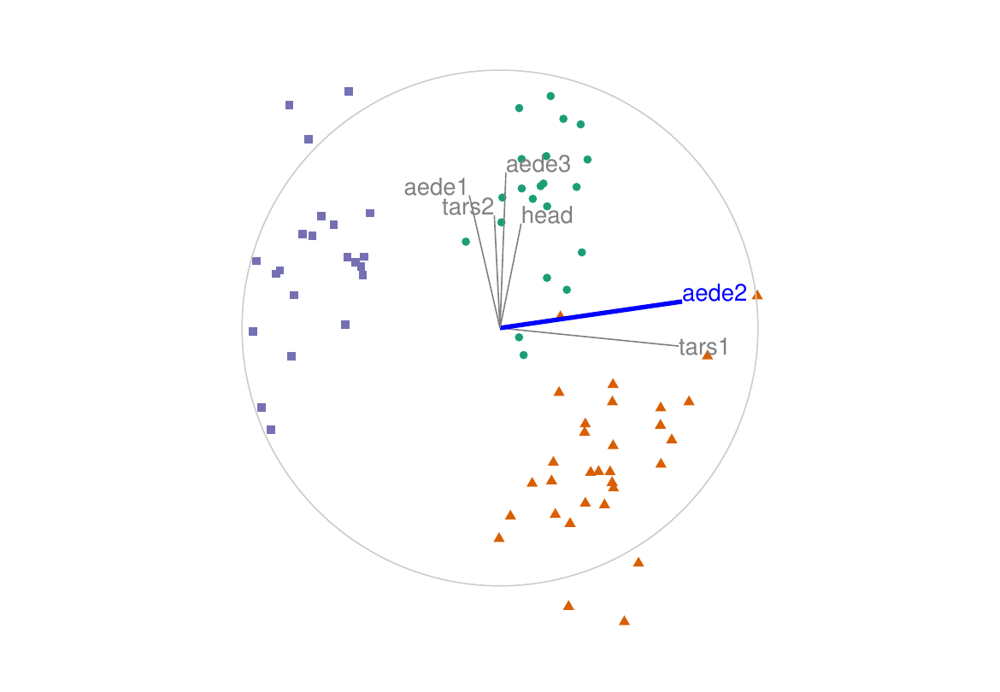
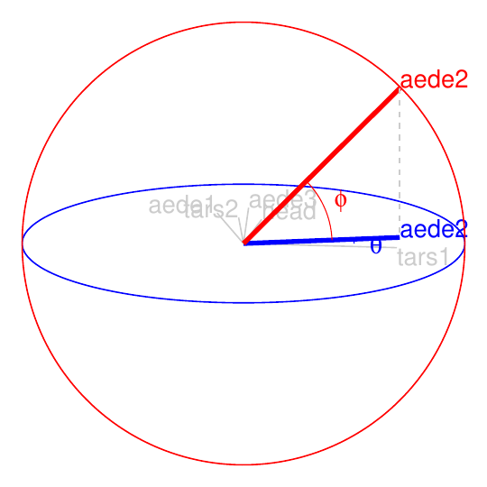
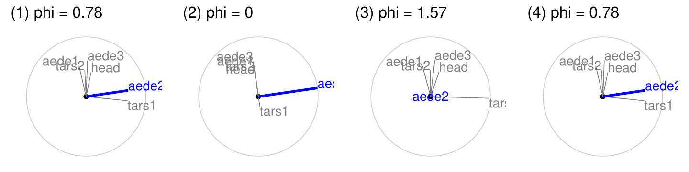
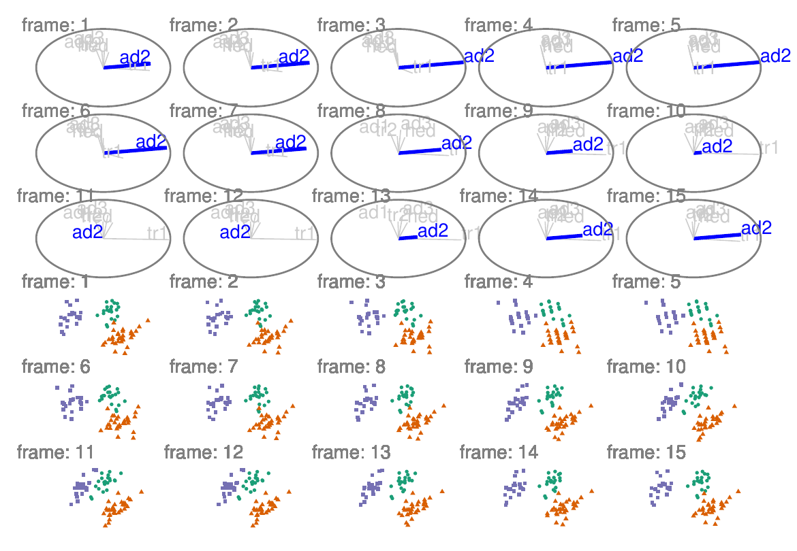
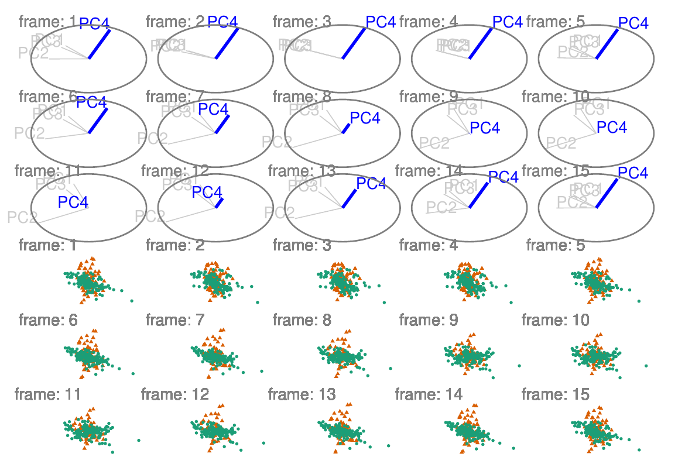
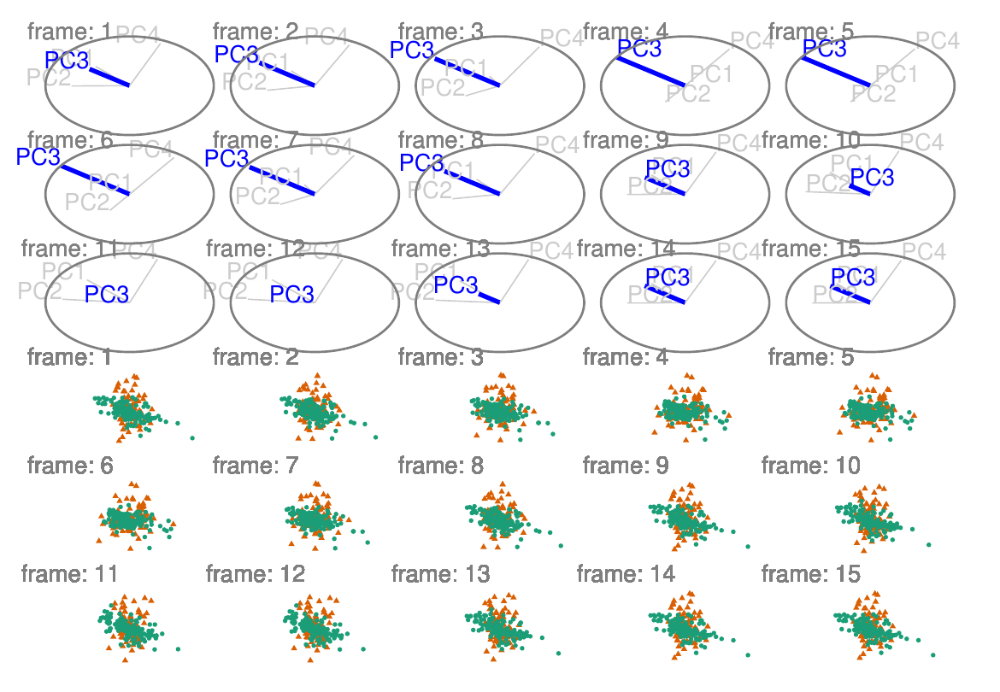
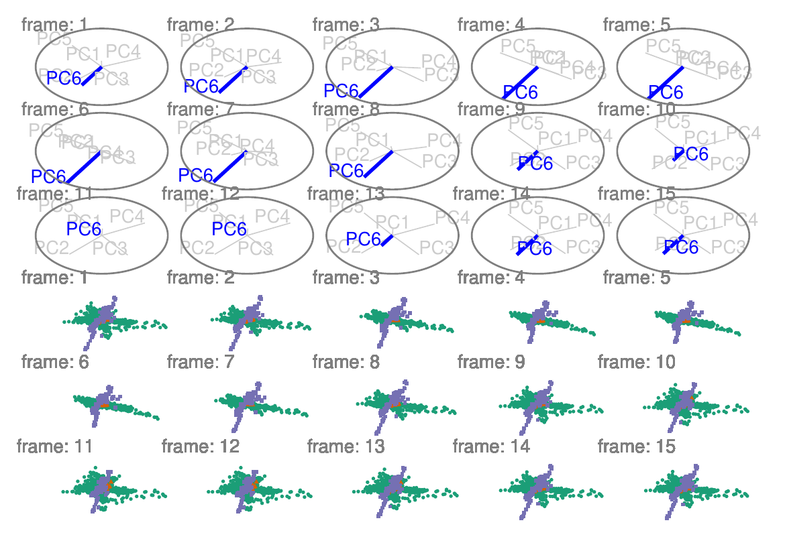
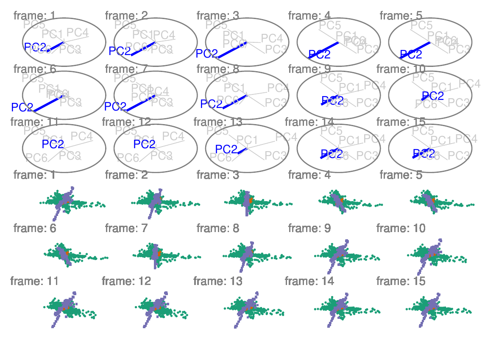

::: article
# Introduction

Exploring multivariate spaces is a challenging task, increasingly so as
dimensionality increases. Traditionally, static low-dimensional
projections are used to display multivariate data in two dimensions
including principal component analysis, linear discriminant spaces or
projection pursuit. These are useful for finding relationships between
multiple variables, but they are limited because they show only a
glimpse of the high-dimensional space. An alternative approach is to use
a tour [@asimov_grand_1985] of dynamic linear projections to look at
many different low-dimensional projections. Tours can be considered to
extend the dimensionality of visualization, which is important as data
and models exist in more than 3D. The package
[*tourr*](https://CRAN.R-project.org/package=tourr)
[@wickham_tourr:_2011] provides a platform for generating tours. It can
produce a variety of tours, each paired with a variety of possible
displays. A user can make a grand, guided, little, local or frozen tour,
and display the resulting projected data as a scatterplot, density plot,
histogram, or even as Chernoff faces if the projection dimension is more
than 3.

This work adds a manual tour to the collection. The manual tour was
described in @cook_manual_1997 and allows a user to control the
projection coefficients of a selected variable in a 2D projection. The
manipulation of these coefficients allows the analyst to explore their
sensitivity to the structure within the projection. As manual tours
operate on only one variable at a time, they are particularly useful
once a feature of interest has been identified.

One way to identify "interesting" features is with the use of a guided
tour [@cook_grand_1995]. Guided tours select a very specific path, which
approaches a projection that optimizes an objective function. The
optimization used to guide the tour is simulated annealing
[@kirkpatrick_optimization_1983]. The direct optimization of a function
allows guided tours to rapidly identify interesting projection features
given the relatively large parameter-space. After a projection of
interest is identified, an analyst can then use the "finer brush" of the
manual tour to control the contributions of individual variables to
explore the sensitivity they have on the structure visible in the
projection.

The paper is organized as follows. Section [2](#sec:algorithm) describes
the algorithm used to perform a radial manual tour as implemented in the
package [*spinifex*](https://CRAN.R-project.org/package=spinifex).
Section [2.2.6](#sec:display) explains how to generate an animation of
the manual tour using the animation frameworks offered by
[*plotly*](https://CRAN.R-project.org/package=plotly)
[@sievert_interactive_2020] and
[*gganimate*](https://CRAN.R-project.org/package=gganimate)
[@pedersen_gganimate_2020]. Package functionality and code usage
following the order applied in the algorithm follows in section
[3.3](#sec:usage). Section [4](#sec:application) illustrates how this
can be used for sensitivity analysis applied to multivariate data
collected on high energy physics experiments [@wang_mapping_2018].
Section [5](#sec:discussion) summarizes this paper and discusses
potential future directions.

# Algorithm {#sec:algorithm}

The algorithm to conduct a manual tour interactively, by recording
mouse/cursor motion, is described in detail in @cook_manual_1997.
Movement can be in any direction and magnitude, but it can also be
constrained in several ways:

-   *radial*: fix the direction of contribution, and allow the magnitude
    to change.
-   *angular*: fix the magnitude, and allow the angle or direction of
    the contribution to vary.
-   *horizontal*, *vertical*: allow rotation only around the horizontal
    or vertical axis of the current 2D projection.

The algorithm described here produces a **radial** tour as an *animation
sequence*. It takes the current contribution of the chosen variable, and
using rotation brings this variable fully into the projection,
completely removes it, and then returns to the original position.

::: {#notation}
## Notation
:::

The notation used to describe the algorithm for a 2D radial manual tour
is as follows:

-   $\textbf{X}$, the data, an $n \times p$ numeric matrix to be
    projected to 2D.
-   $\textbf{B} = (B_1,~ B_2)$, any 2D orthonormal projection basis,
    $p \times 2$ matrix, describing the projection from
    $\mathbb{R}^p \Rightarrow \mathbb{R}^2$. This is called this the
    "original projection" because it is the starting point for the
    manual tour.
-   $k$, is the index of the variable to manipulate, called the "manip
    var".
-   $\textbf{e}$, a 1D basis vector of length $p$, with 1 in the $k$-th
    position and 0 elsewhere.
-   $\textbf{M}$ is a $p \times 3$ matrix, defining the 3D subspace
    where data rotation occurs and is called the manip(ulation) space.
-   $\textbf{R}$, the 3D rotation matrix, for performing unconstrained
    3D rotations within the manip space, $\textbf{M}$.
-   $\theta$, the angle of in-projection rotation, for example, on the
    reference axes; $c_\theta, s_\theta$ are its cosine and sine.
-   $\phi$, the angle of out-of-projection rotation, into the manip
    space; $c_\phi, s_\phi$ are its cosine and sine. The initial value
    for animation purposes is $\phi_1$.
-   $\textbf{U}$, the axis of rotation for out-of-projection rotation
    orthogonal to $\textbf{e}$.
-   $\textbf{Y}$, the resulting projection of the data through the manip
    space, $\textbf{M}$, and rotation matrix, $\textbf{R}$.

The algorithm operates entirely on projection bases and incorporates the
data only when making the projected data plots, in light of efficiency.

::: {#steps}
## Steps
:::

::: {#step-0-set-up}
### Step 0) Set up
:::

The flea data (@lubischew_use_1962), available in the *tourr* package,
is used to illustrate the algorithm. The data contains 74 observations
on 6 variables, which are physical measurements made on flea beetles.
Each observation belongs to one of three species.

An initial 2D projection basis must be provided. A suggested way to
start is to identify an interesting projection using a projection
pursuit guided tour. Here the holes index is used to find a 2D
projection of the flea data, which shows three separated species groups.
Figure [1](#fig:step0) shows the initial projection of the data. The
left panel displays the projection basis ($\textbf{B}$) and can be used
as a visual guide of the magnitude and direction that each variable
contributes to the projection. The right panel shows the projected data,
$\textbf{Y}_{[n,~2]} ~=~ \textbf{X}_{[n,~p]} \textbf{B}_{[p,~2]}$. The
color and shape of points are mapped to the flea species. This plot is
made using the `view_basis()` function in *spinifex*, which generates a
[*ggplot2*](https://CRAN.R-project.org/package=ggplot2)
[@wickham_ggplot2_2016] object.

<figure id="fig:step0">

<figcaption>Figure 1: Initial 2D projection: representation of the basis
(left) and resulting data projection (right) of standardized flea data.
The color and shape of data points are mapped to beetle species. The
basis was identified using a projection pursuit guided tour, with the
holes index. The contribution of the variables aede2 and tars1
approximately contrasts the other variables. The visible structure in
the projection are the three clusters corresponding to the three
species. Produced with the function
<code>view_basis()</code>.</figcaption>
</figure>

::: {#step-1-choose-manip-variable}
### Step 1) Choose manip variable
:::

In figure [1](#fig:step0) the contribution of the variables tars1 and
aede2 mostly contrast the contribution of the other four variables.
These two variables combined contribute in the direction of the
projection where the purple cluster is separated from the other two
clusters. The variable aede2 is selected as the manip var, the variable
to be controlled in the tour. The question that will be explored is: how
important is this variable to the separation of the clusters in this
projection?

::: {#step-2-create-the-3d-manip-space}
### Step 2) Create the 3D manip space
:::

Initialize the coordinate basis vector as a zero vector, $\textbf{e}$,
of length $p$, and set the $k$-th element to 1. In the example data,
aede2 is the fifth variable in the data, so $k=5$, set $e_5=1$. Use a
Gram-Schmidt process to orthonormalize the coordinate basis vector on
the original 2D projection to describe a 3D manip space, $\textbf{M}$.

$$\begin{aligned}
  e_k &\leftarrow 1 \\ 
  \textbf{e}^*_{[p,~1]} &= \textbf{e} - \langle \textbf{e}, \textbf{B}_1 \rangle \textbf{B}_1 - \langle \textbf{e}, \textbf{B}_2 \rangle \textbf{B}_2 \\ 
  \textbf{M}_{[p,~3]} &= (\textbf{B}_1,\textbf{B}_2,\textbf{e}^*)
\end{aligned}$$

The manip space provides a 3D projection from $p$-dimensional space,
where the coefficient of the manip var can range completely between \[0,
1\]. This 3D space serves as the medium to rotate the projection basis
relative to the selected manipulation variable. Figure [2](#fig:step2)
illustrates this 3D manip space with the manip var highlighted. This
representation is produced by calling the `view_manip_space()` function.
This diagram is purely used to help explain the algorithm.

<figure id="fig:step2">

<figcaption>Figure 2: Illustration of a 3D manip space, this space is
rotated effectively changing the contribution of the manip variable,
aede2 in the example data. The blue circle and variable map lies on the
projection plane. The red circle, orthogonal to the projection plane,
illustrates the manipulation space and how the manip var can be
controlled and how this affects the variable contribution back onto the
projection plane. The other variables are omitted from the manipulation
dimension for simplicity. Picturing the other variables in that
dimension reveals the intuition that rotating one variable performs a
constrained rotation on the others. This is illustrated with the
<code>view_manip_space()</code> function.</figcaption>
</figure>

::: {#step-3-defining-a-3d-rotation}
### Step 3) Defining a 3D rotation
:::

The basis vector corresponding to the manip var (red line in Figure
[2](#fig:step2)), can be operated like a lever anchored to the origin.
This is the process of the manual control, that rotates the manip
variable into and out of the 2D projection (Figure [3](#fig:step3)). As
the variable contribution is controlled, the manip space rotates, and
the projection onto the horizontal projection plane correspondingly
changes. This is a manual tour. Generating a sequence of values for the
rotation angles produces a path for the rotation of the manip space.

For a radial tour, fix $\theta$, the angle describing rotation within
the projection plane, and compute a sequence for $\phi$, defining
movement out of the plane. This will change $\phi$ from the initial
value, $\phi_1$, the angle between $\textbf{e}$ and its shadow in
$\textbf{B}$, to a maximum of $0$ (manip var fully in projection), then
to a minimum of $\pi/2$ (manip var out of projection), before returning
to $\phi_1$.

Rotations in 3D can be defined by the axes they pivot on. Rotation
within the projection, $\theta$, is rotation around the $Z$ axis.
Out-of-projection rotation, $\phi$, is the rotation around an axis on
the $XY$ plane, $\textbf{U}$, orthogonal to $\textbf{e}$. Given these
axes, the rotation matrix, $\textbf{R}$ can be written as follows, using
Rodrigues' rotation formula (originally published in
@rodrigues_lois_1840):

$$\begin{aligned}
    \textbf{R}_{[3,~3]} 
    &= \textbf{I}_3 + s_\phi\textbf{U} + (1-c_\phi)\textbf{U}^2 \\
        &=
    \begin{bmatrix}
      1 & 0 & 0 \\ 
      0 & 1 & 0 \\ 
      0 & 0 & 1 \\
    \end{bmatrix} +
    \begin{bmatrix}
      0 & 0 & c_\theta s_\phi \\
      0 & 0 & s_\theta s_\phi \\
      -c_\theta s_\phi & -s_\theta s_\phi & 0 \\
    \end{bmatrix} +
    \begin{bmatrix}
      -c_\theta (1-c_\phi) & s^2_\theta (1-c_\phi) & 0 \\
      -c_\theta s_\theta (1-c_\phi) & -s^2_\theta (1-c_\phi) & 0 \\
      0 & 0 & c_\phi-1 \\
    \end{bmatrix} \\
    &= 
    \begin{bmatrix}
      c_\theta^2 c_\phi + s_\theta^2 &
      -c_\theta s_\theta (1 - c_\phi) &
      -c_\theta s_\phi \\
      -c_\theta s_\theta (1 - c_\phi) &
      s_\theta^2 c_\phi + c_\theta^2 &
      -s_\theta s_\phi \\
      c_\theta s_\phi &
      s_\theta s_\phi &
      c_\phi
    \end{bmatrix} \\
\end{aligned}$$

where

$$\begin{aligned}
  \textbf{U} &= (u_x, u_y, u_z) =
  (s_\theta, -c_\theta, 0) \\ 
  &=
  \begin{bmatrix}
  0 & -u_z & u_y  \\
  u_z & 0 & -u_x \\
  -u_y & u_x & 0 \\
  \end{bmatrix} =
  \begin{bmatrix}
    0 & 0 & -c_\theta \\
    0 & 0 & -s_\theta \\
    c_\theta & s_\theta & 0 \\
  \end{bmatrix} \\
\end{aligned}$$

::: {#step-4-creating-an-animation-of-the-radial-rotation}
### Step 4) Creating an animation of the radial rotation
:::

The steps outlined above can be used to create any arbitrary rotation in
the manip space. To use these for sensitivity analysis, the radial
rotation is built into an animation where the manip var is rotated fully
into the projection, completely out, and then back to the initial value.
This involves allowing $\phi$ to vary between $0$ and $\pi/2$, call the
steps $\phi_i$.

``` r
#> function (`_class` = NULL, `_inherit` = NULL, ...) 
#> {
#>     e <- new.env(parent = emptyenv())
#>     members <- list(...)
#>     if (length(members) != sum(nzchar(names(members)))) {
#>         abort("All members of a ggproto object must be named.")
#>     }
#>     if (length(members) > 0) {
#>         list2env(members, envir = e)
#>     }
#>     `_inherit` <- substitute(`_inherit`)
#>     env <- parent.frame()
#>     find_super <- function() {
#>         eval(`_inherit`, env, NULL)
#>     }
#>     super <- find_super()
#>     if (!is.null(super)) {
#>         if (!is.ggproto(super)) {
#>             abort("`_inherit` must be a ggproto object.")
#>         }
#>         e$super <- find_super
#>         class(e) <- c(`_class`, class(super))
#>     }
#>     else {
#>         class(e) <- c(`_class`, "ggproto", "gg")
#>     }
#>     e
#> }
#> <bytecode: 0x7f9c6f227828>
#> <environment: namespace:ggplot2>
```

<figure id="fig:step3">

<figcaption>Figure 3: Snapshots of a radial manual tour manipulating
aede2: (1) original projection, (2) full contribution, (3) zero
contribution, (4) back to original. </figcaption>
</figure>

1.  Set initial value of $\phi_1$ and $\theta$:
    $\phi_1 = \cos^{-1}{\sqrt{B_{k1}^2+B_{k2}^2}}$,
    $\theta = \tan^{-1}\frac{B_{k2}}{B_{k1}}$. Where $\phi_1$ is the
    angle between $\textbf{e}$ and its shadow in $\textbf{B}$.

2.  Set an angle increment ($\Delta_\phi$) that sets the step size for
    the animation, to rotate the manip var into and out of the
    projection. (Note: Using angle increment, rather than a number of
    steps, to control the movement, is consistent with the tour
    algorithm as implemented in the *tourr*).

3.  Step towards $0$, where the manip var is completely in the
    projection plane.

4.  Step towards $\pi/2$, where the manip variable has no contribution
    to the projection.

5.  Step back to $\phi_1$.

In each of the steps 3-5, a small step may be added to ensure that the
endpoints of $\phi$ ($0$, $\pi/2$, $\phi_1$) are reached.

::: {#sec:display}
### Step 5) Projecting the data {#sec:display}
:::

The operation of a manual tour is defined on the projection bases. Only
when the data plot needs to be made is the data projected into the
relevant basis.

$$\begin{aligned}
  \textbf{Y}^{(i)}_{[n,~3]} &= \textbf{X}_{[n,~p]} \textbf{M}_{[p,~3]} \textbf{R}^{(i)}_{[3,3]}
\end{aligned}$$

where $\textbf{R}^{(i)}_{[3,3]}$ is the incremental rotation matrix,
using $\phi_i$. To make the data plot, use the first two columns of
**Y**. Show the projected data for each frame in sequence to form an
animation.

Figure [4](#fig:step4) illustrates a manual tour sequence having 15
steps. The projection axes are displayed on the top half, which
corresponds to the projected data in the bottom half. When aede2 is
removed from the projection, the purple cluster overlaps with the green
cluster. This suggests that aede2 is important for distinguishing
between these species.

Tours are typically viewed as an animation. The animation of this tour
can be viewed online at
<https://github.com/nspyrison/spinifex_paper/blob/master/paper/gifs/flea_radialtour_mvar5.gif>.
The page may take a moment to load. Animations can be produced using the
function `play_manual_tour()`.

<figure id="fig:step4">

<figcaption>Figure 4: Radial manual tour manipulating aede2 of
standardized flea data. The axis for aede2 increases in contribution to
the projection, from its initial value to 1, decreasing to 0 and then
returning to the initial value. This effects the separation between the
purple and green clusters. This shows that aede2 is important for
distinguishing the purple species, because the separation disappears
when aede2 is not contributing to the projection.</figcaption>
</figure>

# Package structure and functionality

This section describes the functions available in the package, and how
to use them.

::: {#installation}
## Installation
:::

The *spinifex* is available from CRAN, and can be installed by:

``` r
## Install from CRAN
install.package("spinifex")
## Load into session
library("spinifex")
```

Also see the shiny app for understandign and the vignette for basic
usage:

``` r
## Shiny app for visualizing basic application
run_app("intro")
## View the code vignette
vignette("spinifex_vignette")
```

The development version can be installed from github:

``` r
## Optionally install latest developmention version from GitHub
remotes::install_github("nspyrison/spinifex")
```

::: {#functions}
## Functions
:::

Table [1](#tab:functionsTable) lists the primary functions and their
purpose. These are grouped into four types: construction for building a
tour path, render to make the plot objects, animation for running the
animation, and specialty for providing illustrations used in the
algorithm description.

::: {#tab:functionsTable}
  --------------------------------------------------------------------------------------------
  Type           Function             Description
  -------------- -------------------- --------------------------------------------------------
  construction   create_manip_space   forms the 3D space of rotation

  construction   rotate_manip_space   performs 3D rotation

  construction   manual_tour          generates sequence of 2D frames

                                      

  render         array2df             turn the tour path array into long form, for plotting

  render         render\_             render long form as a ggplot2 objection for animation

  render         render_plotly        render the animation as a plotly object (default)

  render         render_gganimate     render the animation as a gganimate object

                                      

  animation      play_tour_path       composite function animating the specified tour path

  animation      play_manual_tour     composite function animating the specified manual tour

                                      

  specialty      print_manip_space    table of the rotated basis and manip space

  specialty      oblique_frame        display the reference axes of a given basis

  specialty      view_manip_space     illustrative display of any manip space
  --------------------------------------------------------------------------------------------

  : Table 1: Summary of available functions.
:::

::: {#sec:usage}
## Usage {#sec:usage}
:::

Using the `flea` data from the *tourr* package, we will illustrate
generating a manual tour to explore the sensitivity of the cluster
structure is to the variable aede2.

``` r
library(spinifex)
## Standardized flea data
f_data <- tourr::rescale(flea[, 1:6])
## Guided tour path, holes index
f_path <- save_history(f_data, guided_tour(holes()))
## Local extrema found
f_basis <- matrix(f_path[,, max(dim(f_path)[3])], ncol=2)
## Categorical class variable
f_clas <- factor(flea$species)
## Manip var, number of the variable to alter
f_mvar <- 5
## Anglular dist between frames (radians)
step_size <- .26
## Render and play animate, as plotly object by default
play_manual_tour(data = f_data,
                 basis = f_basis,
                 manip_var = f_mvar, 
                 angle = step_size,
                 col = f_clas,
                 pch = f_clas)
```

The `play_manual_tour()` function is a composite function handling
interaction between `manual_tour()`, `array2df()`, and
`render_plotly()`. This will generate an html animation using plotly.
Switching the renderer to `render_gganimate()` alternatively creates an
animated gif. Each of these formats allows for the animation to be made
available on a web site, or directly visible in an html formatted
document.

::: {#making-illustrations}
### Making illustrations
:::

The function `oblique_frame` can be used to show a projection of the
basis, or with the data overlaid. For example, the plots in Figures
[1](#fig:step0) and [3](#fig:step3) were made with code similar to this:

``` r
## View a basis and projected data 
oblique_frame(basis = f_basis, 
              data = f_data,
              color = f_clas,
              shape = f_clas)
```

An illustration of the manip space (as shown in Figure [2](#fig:step2))
is made with the `view_manip_space` function, as follows:

``` r
## Displays the projection plane and manipulation space for the 
view_manip_space(basis = f_basis, 
                 manip_var = f_mvar, 
                 lab = colnames(f_data))
```

# Application {#sec:application}

@wang_mapping_2018 introduces a new tool, PDFSense, to visualize the
sensitivity of hadronic experiments to nucleon structure. The
parameter-space of these experiments lies in 56 dimensions,
$\delta \in \mathbb{R}^{56}$, and are visualized as 3D subspaces of the
10 first principal components in linear (PCA) and non-linear (t-SNE)
embeddings.

@cook_dynamical_2018 illustrates how to learn more about the structures
using a grand tour. Tours can better resolve the shape of clusters,
intra-cluster detail, and better outlier detection than PDFSense & TFEP
(TensorFlow embedded projections) or traditional static embeddings. This
example builds from here, illustrating how the manual tour can be used
to examine the sensitivity of structure in a projection to different
parameters. The specific 2D projections passed to the manual tour were
provided in their work.

The data has a hierarchical structure with top-level clusters; DIS, VBP,
and jet. Each cluster is a particular class of experiments, each with
many experimental datasets which, each have many observations of their
own. In consideration of data density, we conduct manual tours on
subsets of the DIS and jet clusters. This explores the sensitivity of
the structure to each of the variables in turn and we present the
subjectively best and worst variable to manipulate for identifying
dimensionality of the clusters and describing the span of the clusters.

::: {#jet-cluster}
## Jet cluster
:::

The jet cluster resides in a smaller dimensionality than the full set of
experiments with four principal components explaining 95% of the
variation in the cluster [@cook_dynamical_2018]. The data within this 4D
embedding is further subsetted, to ATLAS7old and ATLAS7new, to focus on
two groups that occupy different parts of the subspace. Radial manual
tours controlling contributions from PC4 and PC3 are shown in Figures
[5](#fig:JetClusterGood) and [6](#fig:JetClusterBad), respectively. The
difference in shape can be interpreted as the experiments probing
different phase-spaces. Back-transforming the principal components to
the original variables can be done for a more detailed interpretation.

When PC4 is removed from the projection (Figure
[5](#fig:JetClusterGood)) the difference between the two groups is
removed, indicating that it is important for distinguishing experiments.
However, removing PC3 from the projection (Figure
[6](#fig:JetClusterBad)) does not affect the structure, indicating it is
not important for distinguishing experiments. Animations for the
remaining PCs can be viewed at the following links:
[PC1](https://github.com/nspyrison/spinifex_paper/blob/master/paper/gifs/jetcluster_manualtour_pc1.gif),
[PC2](https://github.com/nspyrison/spinifex_paper/blob/master/paper/gifs/jetcluster_manualtour_pc2.gif),
[PC3](https://github.com/nspyrison/spinifex_paper/blob/master/paper/gifs/jetcluster_manualtour_pc3.gif),
and
[PC4](https://github.com/nspyrison/spinifex_paper/blob/master/paper/gifs/jetcluster_manualtour_pc4.gif).
It can be seen that only PC4 is important for viewing the difference in
these two experiments.

<figure id="fig:JetClusterGood">

<figcaption>Figure 5: Snapshots of a radial manual tour of PC4 within
the jet cluster, with color indicating experiment type: ATLAS7new
(green) and ATLAS7old (orange). When PC4 is removed from the projection
(frame 10) there is little difference between the groups, suggesting
that PC4 is important for distinguishing the experiments.</figcaption>
</figure>

<figure id="fig:JetClusterBad">

<figcaption>Figure 6: Snapshots of a radial manual tour of PC3 within
the jet cluster, with color indicating experiment type: ATLAS7new
(green) and ATLAS7old (orange). When the contribution from PC3 is
changed there is little change to the structure of the two groups,
suggesting that PC3 is not important for distinguishing the
experiments.</figcaption>
</figure>

::: {#dis-cluster}
## DIS cluster
:::

Following @cook_dynamical_2018, to explore the DIS cluster, PCA is
recomputed and the first six principal components, explaining 48% of the
full sample variation, are used. The contributions of PC6 and PC2 are
explored in Figures [7](#fig:DISclusterGood) and
[8](#fig:DISclusterBad), respectively. Three experiments are examined:
DIS HERA1+2 (green), dimuon SIDIS (purple), and charm SIDIS (orange).

Both PC2 and PC6 contribute to the projection similarly. When PC6 is
rotated into the projection, variation in the DIS HERA1+2 is greatly
reduced. When PC2 is removed from the projection, dimuon SIDIS becomes
more clearly distinct. Even though both variables contribute similarly
to the original projection, their contributions have quite different
effects on the structure of each cluster, and the distinction between
clusters. Animations of all of the principal components can be viewed
from the links:
[PC1](https://github.com/nspyrison/spinifex_paper/blob/master/paper/gifs/discluster_manualtour_pc1.gif),
[PC2](https://github.com/nspyrison/spinifex_paper/blob/master/paper/gifs/discluster_manualtour_pc2.gif),
[PC3](https://github.com/nspyrison/spinifex_paper/blob/master/paper/gifs/discluster_manualtour_pc3.gif),
[PC4](https://github.com/nspyrison/spinifex_paper/blob/master/paper/gifs/discluster_manualtour_pc4.gif),
[PC5](https://github.com/nspyrison/spinifex_paper/blob/master/paper/gifs/discluster_manualtour_pc5.gif),
and
[PC6](https://github.com/nspyrison/spinifex_paper/blob/master/paper/gifs/discluster_manualtour_pc6.gif).

<figure id="fig:DISclusterGood">

<figcaption>Figure 7: Snapshots of a radial manual tour exploring the
sensitivity PC6 has on the structure of the DIS cluster, with color
indicating experiment type: DIS HERA1+2 (green), dimuon SIDIS (purple),
and charm SIDIS (orange). DIS HERA1+2 is distributed in a cross-shaped
plane, charm SIDIS occupies the center of this cross, and dimuon SIDIS
is a linear cluster crossing DIS HERA1+2. As the contribution of PC6 is
increased, DIS HERA1+2 becomes almost singular in one direction (frame
5), indicating that this experiment has very little variability in the
direction of PC6.</figcaption>
</figure>

<figure id="fig:DISclusterBad">

<figcaption>Figure 8: Snapshots of a radial manual tour exploring the
sensitivity PC2 to the structure of the DIS cluster, with color
indicating experiment type: DIS HERA1+2 (green), dimuon SIDIS (purple),
and charm SIDIS (orange). As contribution from PC2 is decreased, dimuon
SIDIS becomes more distinguishable from the other two clusters (frames
10-14), indicating that in its absence PC2 is important.</figcaption>
</figure>

# Discussion {#sec:discussion}

Dynamic linear projections of numeric multivariate data, tours, play an
important role in data visualization; they extend the dimensionality of
visuals to peek into high-dimensional data and parameter spaces. This
research has taken the manual tour algorithm, specifically the radial
rotation, used in GGobi [@swayne_ggobi:_2003] to interactively rotate a
variable into or out of a 2D projection, and modified it to create an
animation that performs the same task. It is most useful for examining
the importance of variables, and how the structure in the projection is
sensitive or not to specific variables. This functionality available in
package *spinifex*. The work complements the methods available in the
*tourr* package.

This work was motivated by problems in physics, and thus the usage was
illustrated on data comparing experiments of hadronic collisions, to
explore the sensitivity of cluster structure to different principal
components. These tools can be applied quite broadly to many
multivariate data analysis problems.

The manual tour is constrained in the sense that the effect of one
variable is dependent on the contributions of other variables in the
manip space. However, this can be useful to simplify a projection by
removing variables without affecting the visible structure. Defining a
manual rotation in high dimensions is possible using Givens rotations
and Householder reflections as outlined in @buja_computational_2005.
This would provide more flexible manual rotation, but more difficult for
a user because they have the choice (too much choice) of which
directions to move.

Another future research topic could be to extend the algorithm for use
on 3D projections. With the current popularity and availability of 3D
virtual displays, this may benefit the detection and understanding of
the higher dimensional structure, or enable the examination of
functions.

Having a graphical user interface would be useful for making it easier
and more accessible to a general audience. This is possible to implement
using [*shiny*](https://CRAN.R-project.org/package=shiny)
[@chang_shiny_2020]. The primary purposes of the interface would be to
allow the user to interactively change the manip variable easily, and
the interpolation step for more or less detailed views.

# Acknowledgments

This article was created in R, using
[*knitr*](https://CRAN.R-project.org/package=knitr) [@xie_knitr_2020]
and [*rmarkdown*](https://CRAN.R-project.org/package=rmarkdown)
[@allaire_rmarkdown_2020], with code generating the examples inline. The
source files for this article be found at
[github.com/nspyrison/spinifex_paper/](https://github.com/nspyrison/spinifex_paper/).
The animated gifs can also be viewed at this site, and also in the
supplementary material for this paper. The source code for the
*spinifex* package can be found at
[github.com/nspyrison/spinifex/](https://github.com/nspyrison/spinifex/).
:::
