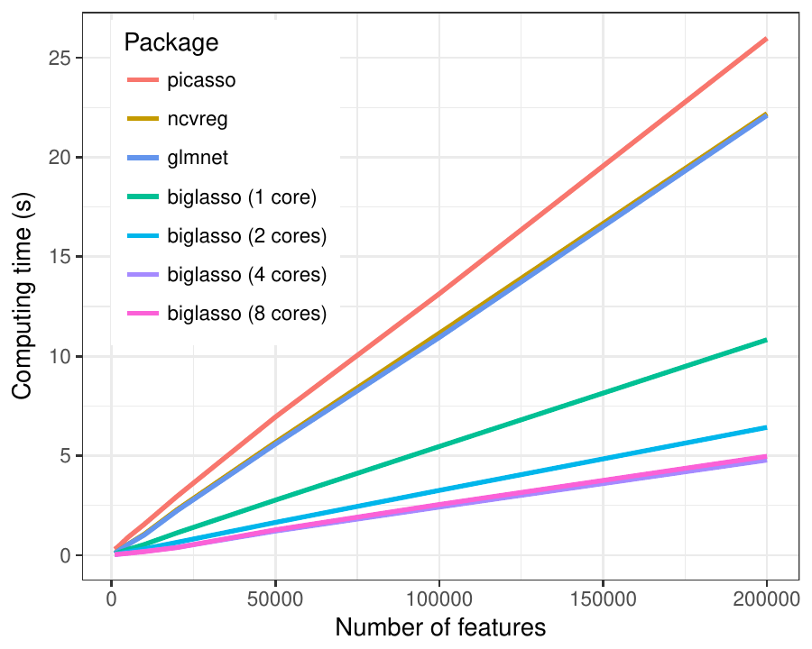
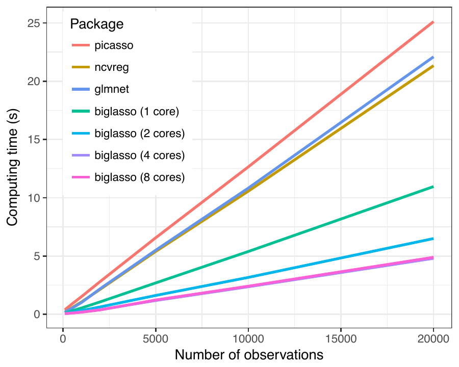
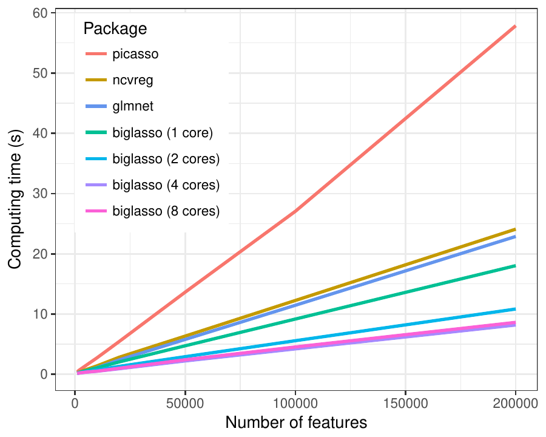
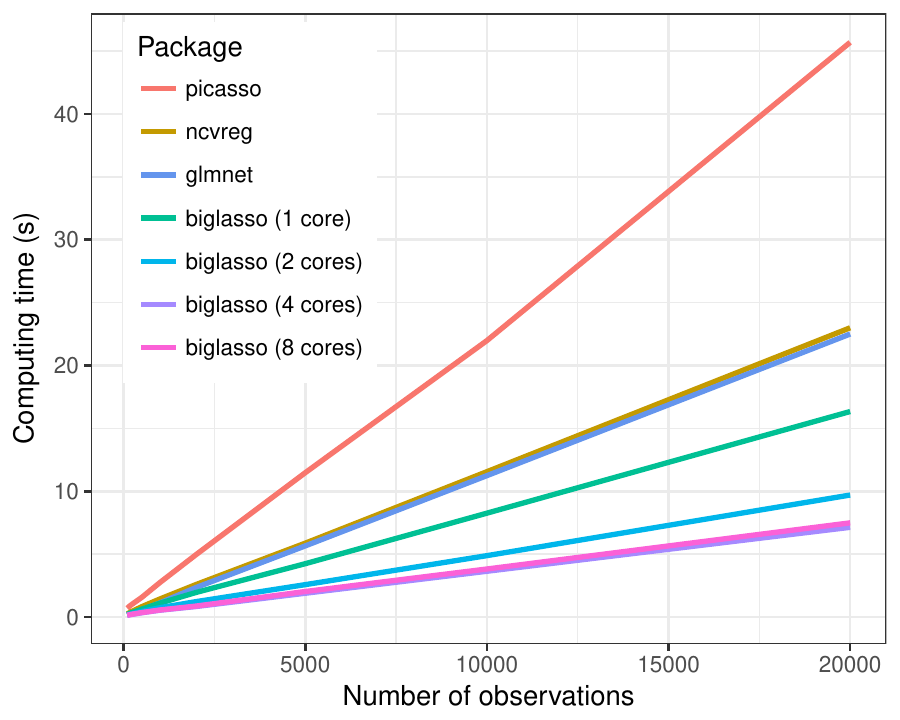

# Introduction

The lasso model proposed by [@Tibshirani1996] has fundamentally reshaped
the landscape of high-dimensional statistical research. Since its
original proposal, the lasso has attracted extensive studies with a wide
range of applications to many areas, such as signal processing
[@angelosante2009rls], gene expression data analysis [@huang2003linear],
face recognition [@wright2009robust], text mining [@li2015relevance] and
so on. The great success of the lasso has made it one of the most
popular tools in statistical and machine-learning practice.

Recent years have seen the evolving era of Big Data where
ultrahigh-dimensional, large-scale data sets are increasingly seen in
many areas such as genetics, genomics, biomedical imaging, social media
analysis, and high-frequency finance [@fan2014challenges]. Such data
sets pose a challenge to solving the lasso efficiently in general, and
for R specifically, since R is not naturally well-suited for analyzing
large-scale data sets [@kane2013scalable]. Thus, there is a clear need
for scalable software for fitting lasso-type models designed to meet the
needs of big data.

In this project, we develop an R package, *biglasso* [@biglasso], to
extend lasso model fitting to Big Data in R. Specifically, sparse linear
and logistic regression models with lasso and elastic net penalties are
implemented. The most notable features of *biglasso* include:

-   It utilizes memory-mapped files to store the massive data on the
    disk, only loading data into memory when necessary during model
    fitting. Consequently, it's able to seamlessly handle out-of-core
    computation.
-   It is built upon pathwise coordinate descent algorithm and "warm
    start" strategy, which has been proven to be one of fastest
    approaches to solving the lasso [@friedman2010regularization].
-   We develop new, hybrid feature screening rules that outperform
    state-of-the-art screening rules such as the sequential strong rule
    (SSR) [@tibshirani2012strong], and the sequential EDPP rule (SEDPP)
    [@JMLR:v16:wang15a] with additional 1.5x to 4x speedup.
-   The implementation is designed to be as memory-efficient as possible
    by eliminating extra copies of the data created by other R packages,
    making *biglasso* at least 2x more memory-efficient than *glmnet*.
-   The underlying computation is implemented in C++, and parallel
    computing with OpenMP is also supported.

The methodological innovation and well-designed implementation have made
*biglasso* a much more memory- and computation-efficient and highly
scalable lasso solver, as compared to existing popular R packages like
*glmnet* [@friedman2010regularization], *ncvreg* [@Breheny2011], and
[*picasso*](https://CRAN.R-project.org/package=picasso) [@picasso]. More
importantly, to the best of our knowledge, *biglasso* is the first R
package that enables the user to fit lasso models with data sets that
are larger than available RAM, thus allowing for powerful big data
analysis on an ordinary laptop.

# Method

## Memory mapping

*Memory mapping* [@bovet2005understanding] is a technique that maps a
data file into the virtual memory space so that the data on the disk can
be accessed as if they were in the main memory. Technically, when the
program starts, the operating system (OS) will cache the data into RAM.
Once the data are in RAM, the computation is at the standard in-memory
speed. If the program requests more data after the memory is fully
occupied, which is inevitable in the data-larger-than-RAM case, the OS
will move data that is not currently needed out of RAM to create space
for loading in new data. This is called the *page-in-page-out*
procedure, and is automatically handled by the OS.

The memory mapping technique is commonly used in modern operating
systems such as Windows and Unix-like systems due to several advantages:

(1) it provides faster file read/write than traditional I/O methods
    since data-copy from kernel to user buffer is not needed due to page
    caches;

(2) it allows random access to the data as if it were in the main memory
    even though it physically resides on the disk;

(3) it supports concurrent sharing in that multiple processes can access
    the same memory-mapped data file simultaneously, making parallel
    computing easy to implement in data-larger-than-RAM cases;

(4) it enables out-of-core computing thanks to the automatic
    page-in-page-out procedure.

We refer the readers to [@rao2010critical], [@lin2014mmap], and
[@bovet2005understanding] for detailed techniques and some successful
applications of memory mapping.

To take advantage of memory mapping, *biglasso* creates memory-mapped
big matrix objects based upon the R package
[*bigmemory*](https://CRAN.R-project.org/package=bigmemory)
[@kane2013scalable], which uses the Boost C++ library and implements
memory-mapped big matrix objects that can be directly used in R. Then at
the C++ level, *biglasso* uses the C++ library of *bigmemory* for
underlying computation and model fitting.

## Efficient feature screening

Another important contribution of *biglasso* is our newly developed
*hybrid safe-strong rule*, named SSR-BEDPP, which substantially
outperforms existing state-of-the-art ones in terms of the overall
computing time of obtaining the lasso solution path. Here, we describe
the main idea of hybrid rules; for the technical details, see
@ZengRules.

*Feature screening* aims to identify and discard inactive features
(i.e., those with zero coefficients) from the lasso optimization. It
often leads to dramatic dimension reduction and hence significant
computation savings. However, these savings will be negated if the
screening rule itself is too complicated to execute. Therefore, an
efficient screening rule needs to be powerful enough to discard a large
portion of features and also relatively simple to compute.

Existing screening rules for the lasso can be divided into two types:
(1) heuristic rules, such as the sequential strong rule (SSR)
[@tibshirani2012strong], and (2) safe rules, such as the basic and the
sequential EDPP rules [@JMLR:v16:wang15a], denoted here as BEDPP and
SEDPP respectively. Safe rules, unlike heuristic ones, are guaranteed to
never incorrectly screen a feature with a nonzero coefficient. Figure
[1](#fig:rule_compare) compares the power of the three rules in
discarding features. SSR, though most powerful among the three, requires
a cumbersome post-convergence check to verify that it has not
incorrectly discarded an active feature. The SEDPP rule is both safe and
powerful, but is inherently complicated and time-consuming to evaluate.
Finally, BEDPP is the least powerful, and discards virtually no features
when $\lambda$ is smaller than 0.45 (in this case), but is both safe and
involves minimal computational burden.

{#fig:rule_compare
width="100%" alt="graphic without alt text"}

The rule employed by *biglasso*, SSR-BEDPP, as its name indicates,
combines SSR with the simple yet safe BEDPP rule. The rationale is to
alleviate the burden of post-convergence checking for strong rules by
not checking features that can be safely eliminated using BEDPP. This
hybrid approach leverages the advantages of each rule, and offers
substantial gains in efficiency, especially when solving the lasso for
large values of $\lambda$.

Table [1](#tab_complexity) summarizes the complexities of the four rules
when applied to solving the lasso along a path of $K$ values of
$\lambda$ for a data set with $n$ instances and $p$ features. SSR-BEDPP
can be substantially faster than the other three rules when BEDPP is
effective. Furthermore, it is important to note that SSR (with
post-convergence checking) and SEDPP have to scan the entire feature
matrix at every value of $\lambda$, while SSR-BEDPP only needs to scan
the features not discarded by BEDPP. This advantage of SSR-BEDPP is
particularly appealing in out-of-core computing, where fully scanning
the feature matrix requires disk access and therefore becomes the
computational bottleneck of the procedure.

::: {#tab_complexity}
  ---------------------------------------------
         Rule            Complexity
  ----------- ---------------------------------
          SSR             $O(np K)$

        SEDPP             $O(np K)$

        BEDPP              $O(np)$

    SSR-BEDPP  $O(n\sum_k^K |\mathcal{S}_k|))$
  ---------------------------------------------

  : Table 1: Complexity of computing screening rules along the entire
  path of $K$ values of $\lambda$. $| \mathcal{S}_k |$ denotes the
  cardinality of $\mathcal{S}_k$, the safe set of features not discarded
  by BEDPP screening.
:::

The hybrid screening idea is straightforward to extend to other
lasso-type problems provided that a corresponding safe rule exists. For
the *biglasso* package, we also implemented a hybrid screening rule,
SSR-Slores, for lasso-penalized logistic regression by combining SSR
with the so-called Slores rule [@wang2014safe], a safe screening rule
developed for sparse logistic regression.

# Implementation

## Memory-efficient design

In penalized regression models, the feature matrix
$\mathbf{X}\in \mathbb{R}^{n \times p}$ is typically standardized to
ensure that the penalty is applied uniformly across features with
different scales of measurement. In addition, standardization
contributes to faster convergence of the optimization algorithm. In
existing R packages such as *glmnet*, *ncvreg*, and *picasso*, a
standardized feature matrix $\widetilde{\mathbf{X}}$ is calculated and
stored, effectively doubling memory usage. This problem is compounded by
cross-validation, where these packages also calculate and store
additional standardized and unstandardized copies of $\mathbf{X}$ for
each fold. This approach does not scale up well for big data.

To make the memory usage more efficient, *biglasso* doesn't store
$\widetilde{\mathbf{X}}$. Instead, it saves only the means and standard
deviations of the columns of $\mathbf{X}$ as two vectors, denoted as
$\mathbf{c}$ and $\mathbf{s}$. Then wherever $\widetilde{x}_{ij}$ is
needed, it is retrieved by "cell-wise standardization", i.e.,
$\widetilde{x}_{ij} = (x_{ij} - c_j) / s_j$. Additionally, the estimated
coefficient matrix is sparse-coded in C++ and R to save memory space.

### Simplification of computations

Cell-wise standardization saves a great deal of memory space, but at the
expense of computational efficiency. To minimize this, *biglasso* uses a
number of computational strategies to eliminate redundant calculations.

We first note that the computations related to $\widetilde{\mathbf{X}}$
during whole model fitting process are mainly of three types, and all
can be simplified so that naïve cell-wise standardization can be
avoided:

(1) $\widetilde{\mathbf{x}}_j^\top \widetilde{\mathbf{x}}_* = \sum_i \frac{x_{ij} - c_j}{s_j} \frac{x_{i*} -c_*}{s_*} = \frac{1}{s_j s_*} \big( \sum_i x_{ij} x_{i*} - n c_j c_* \big)$;
    []{#simp1 label="simp1"}

(2) $\widetilde{\mathbf{x}}_i^\top \mathbf{y}= \sum_i \frac{x_{ij} - c_j}{s_j} y_i  = \frac{1}{s_j} \big( \sum_i x_{ij} y_i - c_j  \sum_i y_i\big)$;
    []{#simp2 label="simp2"}

(3) $\widetilde{\mathbf{x}}_j^\top \mathbf{r}= \sum_i \frac{x_{ij} - c_j}{s_j} r_i = \frac{1}{s_j} \big(\sum_i x_{ij} r_i - c_j \sum_i r_i \big)$;
    []{#simp3 label="simp3"}

where $\widetilde{\mathbf{x}}_j$ is the $j$th column of
$\widetilde{\mathbf{X}}$, $\widetilde{\mathbf{x}}_*$ is the column
corresponding to $\lambda_{\max}$, $\mathbf{y}$ is the response vector,
and $\mathbf{r}\in \mathbb{R}^n$ is current residual vector.

Type (1) and (2) are used only for initial feature screening, and
require only one-time execution. Type (3) occurs in both the coordinate
descent algorithm and the post-convergence checking. Since the
coordinate descent algorithm is fast to converge and only iterates over
features in the active set $\mathcal{A}$ of nonzero coefficients, whose
size is much smaller than $p$, the number of additional computations
this introduces is small. Moreover, we pre-compute and store
$\sum_i r_i$, which saves a great deal of computation during
post-convergence checking since $\mathbf{r}$ does not change during this
step. As a result, our implementation of cell-wise standardization
requires only $O(p)$ additional operations compared to storing the
entire standardized matrix.

### Scalable cross-validation

Cross-validation is integral to lasso modeling in practice, as it is by
far the most common approach to choosing $\lambda$. It requires
splitting the data matrix $\mathbf{X}$ into training and test sub
matrices, and fitting the lasso model multiple times. This procedure is
also memory-intensive, especially if performed in parallel.

Existing lasso-fitting R packages split $\mathbf{X}$ using the "slicing
operator" directly in R (e.g., `X[1:1000, ]`). This introduces a great
deal of overhead and hence is quite slow when $\mathbf{X}$ is large.
Worse, the training and test sub-matrices must be saved into memory, as
well as their standardized versions, all of which result in considerable
memory consumption.

In contrast, *biglasso* implements a much more memory-efficient
cross-validation procedure that avoids the above issues. The key design
is that the main model-fitting R function allows a subset of
$\mathbf{X}$, indicated by the row indices, as input. To cope with this
design, all underlying C++ functions are enabled to operate on a subset
of $\mathbf{X}$ given a row-index vector is provided.

Consequently, instead of creating and storing sub-matrices, only the
indices of the training/test sets and the descriptor of $\mathbf{X}$
(essentially, an external pointer to $\mathbf{X}$) are needed for
parallel cross validation thanks to the concurrency of memory-mapping.
The net effect is that only one memory-mapped data matrix $\mathbf{X}$
is needed for $K$-fold parallel cross-validation, whereas other packages
need up to $2K$ copies of $\mathbf{X}$: a copy and a standardized copy
for each fold.

## Parallel computation

Another important feature of *biglasso* is its parallel computation
capability. There are two types of parallel computation implemented in
*biglasso*.

At the C++ level, single model fitting (as opposed to cross validation)
is parallelized with OpenMP. Though the pathwise coordinate descent
algorithm is inherently sequential and thus does not lend itself to
parallelization, several components of the algorithm (computing
$\mathbf{c}$ and $\mathbf{s}$, matrix-vector multiplication,
post-convergence checking, feature screening, etc.) do, and are
parallel-enabled in *biglasso*.

Parallelization can also be implemented at the R level to run
cross-validation in parallel. This implementation is straightforward and
also implemented by *ncvreg* and *glmnet*. However, as mentioned
earlier, the parallel implementation of *biglasso* is much more memory-
and computation-efficient by avoiding extra copies and the overhead
associated with copying data to parallel workers. Note that when
cross-validation is run in parallel in R, parallel computing at C++
level for single model-fitting is disabled to avoid nested
parallelization.

# Benchmarking experiments

In this section, we demonstrate that our package *biglasso* (1.2-3) is
considerably more efficient at solving for lasso estimates than existing
popular R packages *glmnet* (2.0-5), *ncvreg* (3.9-0), and *picasso*
(0.5-4). Here we focus on solving lasso-penalized linear and logistic
regression, respectively, over the entire path of 100 $\lambda$ values
which are equally spaced on the scale of $\lambda / \lambda_{\max}$ from
0.1 to 1. To ensure a fair comparison, we set the convergence thresholds
to be equivalent across all four packages. All experiments are conducted
with 20 replications, and the average computing times (in seconds) are
reported. The benchmarking platform is a MacBook Pro with Intel Core i7
@ 2.3 GHz and 16 GB RAM.

## Memory efficiency

To demonstrate the improved memory efficiency of *biglasso* compared to
existing packages, we simulate a feature matrix with dimensions
$1,000 \times 100,000$. The raw data is 0.75 GB, and stored on the hard
drive as an R data file and a memory-mapped file. We used `Syrupy`[^1]
to measure the memory used in RAM (i.e., the resident set size, RSS)
every 1 second during lasso-penalized linear regression model fitting by
each of the packages.

The maximum RSS during the model fitting is reported in Table
[2](#tab_memo). In the single fit case, *biglasso* consumes 0.84 GB
memory in RAM, 50% of that used by *glmnet* and 22% of that used by
*picasso*. Note that the memory consumed by *glmnet*, *ncvreg*, and
*picasso* are respectively 2.2x, 2.1x, and 5.1x larger than the size of
the raw data.

More strikingly, *biglasso* does not require additional memory to
perform cross-validation, unlike other packages. For serial 10-fold
cross-validation, *biglasso* requires just 27% of the memory used by
*glmnet* and 23% of that used by *ncvreg*, making it 3.6x and 4.3x more
memory-efficient than *glmnet* and *ncvreg*, respectively.

The memory savings offered by *biglasso* would be even more significant
if cross-validation were conducted in parallel. However, measuring
memory usage across parallel processes is not straightforward and not
implemented in `Syrupy`.

::: {#tab_memo}
  ------------------------------------------------------------
                Package  picasso   ncvreg   glmnet   biglasso
  --------------------- --------- -------- -------- ----------
             Single fit   3.84      1.60     1.67      0.84

    10-fold CV (1 core)    \-       3.74     3.18      0.87
  ------------------------------------------------------------

  : Table 2: The maximum RSS (in GB) for a single fit and 10 fold
  cross-validation (CV) with the raw data of 0.75 GB.
:::

::: tablenotes
Cross-validation is not implemented in *picasso*.
:::

## Computational efficiency: Linear regression

### Simulated data

We now show with simulated data that *biglasso* is more scalable in both
$n$ and $p$ (i.e., number of instances and features). We adopt the same
model in [@JMLR:v16:wang15a] to simulate data:
$\mathbf{y}= \mathbf{X}\boldsymbol{\beta}+ 0.1 \boldsymbol{\epsilon}$,
where $\mathbf{X}$ and $\boldsymbol{\epsilon}$ are i.i.d. sampled from
$N(0, 1)$. We consider two different cases: (1) Case 1: varying $p$. We
set $n=1,000$ and vary $p$ from 1,000 to 20,000. We randomly select 20
true features, and sample their coefficients from Unif\[-1, 1\]. After
simulating $\mathbf{X}$ and $\boldsymbol{\beta}$, we then generate
$\mathbf{y}$ according to the true model; (2) Case 2: varying $n$. We
set $p=10,000$ and vary $n$ from 200 to 20,000. $\boldsymbol{\beta}$ and
$\mathbf{y}$ are generated in the same way as in Case 1.

Figure [2](#fig:simu_res) compares the mean computing time of solving
the lasso over a sequence of 100 $\lambda$ values by the four packages.
In all the settings, *biglasso* (1 core) is uniformly 2x faster than
*glmnet* and *ncvreg* (which overlap in the figure), and 2.5x faster
than *picasso*. Moreover, the computing time of *biglasso* can be
further reduced by half via parallel-computation of 4 cores. Using 8
cores doesn't help due to the increased overhead of communication
between cores.

<figure id="fig:simu_res">
<table>
<caption> </caption>
<tbody>
<tr class="odd">
<td style="text-align: center;"></td>
<td style="text-align: center;"></td>
</tr>
<tr class="even">
<td style="text-align: center;"><span>Varying <span
class="math inline"><em>p</em></span>, <span
class="math inline"><em>n</em> = 1, 000</span>.</span></td>
<td style="text-align: center;">(b) <span>Varying <span
class="math inline"><em>n</em></span>, <span
class="math inline"><em>p</em> = 10, 000</span>.</span></td>
</tr>
</tbody>
</table>
<figcaption>Figure 2: Mean computing time (in seconds) of solving the
lasso over a sequence 100 <span class="math inline"><em>λ</em></span>
values as a function of <span class="math inline"><em>p</em></span>
(Left) and <span class="math inline"><em>n</em></span>
(Right).</figcaption>
</figure>

### Real data

In this section, we compare the performance of the packages using
diverse real data sets: (1) Breast cancer gene expression data[^2]
(GENE); (2) MNIST handwritten image data (MNIST) [@lecun1998gradient];
(3) Cardiac fibrosis genome-wide association study data
(GWAS) [@breheny2016marginal]; and (4) Subset of New York Times
bag-of-words data (NYT) [@Dua:2017]. Note that for data sets MNIST and
NYT, a different response vector is randomly sampled from a test set at
each replication.

The size of the feature matrices and the average computing times are
summarized in Table [3](#tab_real_res). In all four settings, *biglasso*
was fastest at obtaining solutions, providing 2x to 3.8x speedup
compared to *glmnet* and *ncvreg*, and 2x to 4.6x speedup compared to
*picasso*.

::: {#tab_real_res}
  ---------- ------------- ------------- -------------- --------------
     Package     GENE          MNIST          GWAS           NYT

                $n=536$       $n=784$       $n=313$       $n=5,000$

              $p=17,322$    $p=60,000$    $p=660,495$     $p=55,000$

     picasso  1.50 (0.01)   6.86 (0.06)   34.00 (0.47)   44.24 (0.46)

      ncvreg  1.14 (0.02)   5.60 (0.06)   31.55 (0.18)   32.78 (0.10)

      glmnet  1.02 (0.01)   5.63 (0.05)   23.23 (0.19)   33.38 (0.08)

    biglasso  0.54 (0.01)   1.48 (0.10)   17.17 (0.11)   14.35 (1.29)
  ---------- ------------- ------------- -------------- --------------

  : Table 3: Mean (SE) computing time (seconds) for solving the lasso
  along a sequence of 100 $\lambda$ values.
:::

## Computational efficiency: Logistic regression

### Simulated data

Similar to Section 4.2, here we first illustrate that *biglasso* is
faster than other packages in fitting the logistic regression model with
simulated data. The true data-generating model is:
$y_i \sim Bin(1, prob); \textrm{logit}(prob) = \mathbf{x}_i \boldsymbol{\beta}$,
where each entry of $\mathbf{x}_i$ is i.i.d. sampled from standard
Gaussian distribution. Again, two cases -- varying $p$ and varying $n$
-- are considered. 20 true features are randomly chosen and their
coefficients are sampled from Unif\[-1, 1\].

Figure [3](#fig_simu_res_log) summarizes the mean computing times of
solving the lasso-penalized logistic regression over a sequence of 100
values of $\lambda$ by the four packages. In all the settings,
*biglasso* (1 core) is around 1.5x faster than *glmnet* and *ncvreg*
(which again largely overlap), and more than 3x faster than *picasso*.
Parallel computing with 4 cores using *biglasso* reduces the computing
time by half.

<figure id="fig_simu_res_log">
<table>
<caption> </caption>
<tbody>
<tr class="odd">
<td style="text-align: center;"></td>
<td style="text-align: center;"></td>
</tr>
<tr class="even">
<td style="text-align: center;">(a) <span>Varying <span
class="math inline"><em>p</em></span>, <span
class="math inline"><em>n</em> = 1, 000</span>.</span></td>
<td style="text-align: center;">(b) <span>Varying <span
class="math inline"><em>n</em></span>, <span
class="math inline"><em>p</em> = 10, 000</span>.</span></td>
</tr>
</tbody>
</table>
<figcaption>Figure 3: Mean computing time (in seconds) of solving the
lasso-penalized logistic regression over a sequence 100 <span
class="math inline"><em>λ</em></span> values as a function of <span
class="math inline"><em>p</em></span> (Left) and <span
class="math inline"><em>n</em></span> (Right).</figcaption>
</figure>

### Real data

We also compare the computing time of *biglasso* with other packages for
fitting lasso-penalized logistic regression based on four real data
sets: (1) Subset of Gisette data set [@guyon2005result]; (2) P53 mutants
data set [@danziger2009predicting]; (3) Subset of NEWS20 data
set [@keerthi2005modified]; (4) Subset of RCV1 text categorization data
set [@lewis2004rcv1]. The P53 data set can be found on the UCI Machine
Learning Repository website[^3] [@Lichman:2013]. The other three data
sets are obtained from the LIBSVM data repository site.[^4]

Table [4](#tab_real_res_log) presents the dimensions of the data sets
and the mean computing times. Again, *biglasso* outperforms all other
packages in terms of computing time in all the real data cases. In
particular, It's significantly faster than *picasso* with the speedup
ranging from 2 to 5.5 times (for P53 data and RCV1 data, respectively).
On the other hand, compared to *glmnet* or *ncvreg*, *biglasso* doesn't
provide as much improvement in speed as in the linear regression case.
The main reason is that safe rules for logistic regression do not work
as well as safe rules for linear regression: they are more
computationally expensive and less powerful in discarding inactive
features.

::: {#tab_real_res_log}
  ---------- ------------- -------------- -------------- --------------
                Gisette         P53           NEWS20          RCV1

     Package  $n = 5,000$    $n=16,592$     $n=2,500$      $n=5,000$

              $p = 5,000$    $p=5,408$      $p=96,202$     $p=47,236$

     picasso  6.15 (0.03)   19.49 (0.06)   68.92 (8.17)   53.23 (0.13)

      ncvreg  5.50 (0.03)   10.22 (0.02)   38.92 (0.56)   19.68 (0.07)

      glmnet  3.10 (0.02)   10.39 (0.01)   25.00 (0.16)   14.51 (0.04)

    biglasso  2.02 (0.01)   9.47 (0.02)    18.84 (0.22)   9.72 (0.04)
  ---------- ------------- -------------- -------------- --------------

  : Table 4: Mean (SE) computing time (in seconds) for solving the
  lasso-penalized logistic regression along a sequence of 100 $\lambda$
  values on real data sets.
:::

## Validation

To validate the numerical accuracy of our implementation, we contrast
the model fitting results from *biglasso* to those from *glmnet* based
on the following relative difference criterion:
$$\label{criterion}
RD(\lambda) = \frac{\hat{Q}(\hat{\boldsymbol{\beta}}^B; \lambda) - \hat{Q}(\hat{\boldsymbol{\beta}}^G; \lambda)}{\hat{Q}(\hat{\boldsymbol{\beta}}^G; \lambda)},   (\#eq:criterion)$$
where $\hat{\boldsymbol{\beta}}^B$ and $\hat{\boldsymbol{\beta}}^G$
denote the *biglasso* and *glmnet* solutions, respectively. Four real
data sets are considered, including MNIST and GWAS for linear
regression, and P53 and NEWS20 for logistic regression. For the GWAS and
P53 data sets, we obtain 100 $RD$ values, one of each value of $\lambda$
along the regularization path. For the MNIST and NEWS20 data sets, we
obtained solutions for 20 different response vectors, each with a path
of 100 $\lambda$ values, resulting in 2,000 $RD$ values.

Table [5](#tab_real_valid) presents the summary statistics of
$RD(\lambda)$ for the 4 real data sets. For both linear and logistic
regression cases, all values of $RD(\lambda)$ values are extremely close
to zero, demonstrating that *biglasso* and *glmnet* converge to
solutions with virtually identical values of the objective function.

::: {#tab_real_valid}
  ------------------- ------------------- --------- --------------------- ---------
            Statistic   Linear regression             Logistic regression 

                                    MNIST      GWAS                   P53    NEWS20

              Minimum             -7.7e-3   -3.9e-4               -6.4e-3   -1.6e-3

    $1^{st}$ Quantile             -1.6e-3   -2.7e-5                1.7e-5   -2.2e-4

               Median             -9.5e-4    1.6e-4                2.0e-4   -1.1e-4

                 Mean             -1.1e-3    8.3e-4                2.2e-4   -1.2e-4

    $3^{rd}$ Quantile             -1.3e-4    1.3e-3                7.7e-4   1.0e-10

              Maximum              4.2e-3    4.2e-3                2.0e-4    2.2e-3
  ------------------- ------------------- --------- --------------------- ---------

  : Table 5: Summary statistics of $RD(\lambda)$ based on real data
  sets.
:::

# Data analysis example

In this section, we illustrate the usage of *biglasso* with a real data
set `colon` included in *biglasso*. The `colon` data contains contains
expression measurements of 2,000 genes for 62 samples from patients who
underwent a biopsy for colon cancer. There are 40 samples from positive
biopsies (tumor samples) and 22 from negative biopsies (normal samples).
The goal is to identify genes that are predictive of colon cancer.

*biglasso* package has two main model-fitting R functions as below.
Detailed syntax of the two functions can be found in the package
reference manual.[^5]

-   *biglasso*: used for a single model fitting.
-   `cv.biglasso`: used for performing cross-validation and selecting
    parameter $\lambda$.

We first load the data: `X` is the 62-by-2000 raw data matrix, and `y`
is the response vector with 1 indicating tumor sample and 0 indicating
normal sample.

``` r
R> library("biglasso")
R> data(colon)
R> X <- colon$X
R> y <- colon$y
```

Some information about `X` and `y` are as follows.

``` r
R> dim(X)
[1]   62 2000
R> X[1:5, 1:5]
  Hsa.3004 Hsa.13491 Hsa.13491.1 Hsa.37254 Hsa.541
t  8589.42   5468.24     4263.41   4064.94 1997.89
n  9164.25   6719.53     4883.45   3718.16 2015.22
t  3825.71   6970.36     5369.97   4705.65 1166.55
n  6246.45   7823.53     5955.84   3975.56 2002.61
t  3230.33   3694.45     3400.74   3463.59 2181.42
R> y
 [1] 1 0 1 0 1 0 1 0 1 0 1 0 1 0 1 0 1 0 1 0 1 0 1 0 1 1 1 1 1 1 1 1 1
[34] 1 1 1 1 1 0 1 1 0 0 1 1 1 1 0 1 0 0 1 1 0 0 1 1 1 1 0 1 0
```

## Set up the design matrix

It's important to note that *biglasso* requires that the design matrix
`X` must be a `big.matrix` object - an external pointer to the data.
This can be done in two ways:

-   If the size of `X` is small, as in this case, a `big.matrix` object
    can be created via:
    ``` r
    R> X.bm <- as.big.matrix(X)
    ```

    `X.bm` is a pointer to the data matrix, as shown in the following
    output.

    ``` r
    R> str(X.bm)
    Formal class 'big.matrix' [package "bigmemory"] with 1 slot
      ..@ address:<externalptr> 
    R> dim(X.bm)
    [1]   62 2000
    R> X.bm[1:5, 1:5]
      Hsa.3004 Hsa.13491 Hsa.13491.1 Hsa.37254 Hsa.541
    t  8589.42   5468.24     4263.41   4064.94 1997.89
    n  9164.25   6719.53     4883.45   3718.16 2015.22
    t  3825.71   6970.36     5369.97   4705.65 1166.55
    n  6246.45   7823.53     5955.84   3975.56 2002.61
    t  3230.33   3694.45     3400.74   3463.59 2181.42
    ```
-   If the size of the data is large, the user must create a file-backed
    `big.matrix` object via the utility function `setupX` in *biglasso*.
    Specifically, `setupX` reads the massive data stored on disk, and
    creates memory-mapped files for that data set; this is demonstrated
    in the next section. A detailed example can also be found in the
    package vignettes.[^6]

## Single fit and cross-validation

After the setup, we can now fit a lasso-penalized logistic regression
model.

``` r
R> fit <- biglasso(X.bm, y, family = "binomial")
```

The output object `fit` is a list of model fitting results, including
the sparse matrix `beta`. Each column of `beta` corresponds to the
estimated coefficient vector at one of the 100 values of $\lambda$.

In practice, cross-validation is typically conducted to select $\lambda$
and hence the model with the best prediction accuracy. The following
code snippet conducts a 10-fold (default) cross-validation using
parallel computing with 4 cores.

``` r
R> cvfit <- cv.biglasso(X.bm, y, family = "binomial",
+                       seed = 1234, nfolds = 10, ncores = 4)
R> par(mfrow = c(2, 2), mar = c(3.5, 3.5, 3, 1) ,mgp = c(2.5, 0.5, 0))
R> plot(cvfit, type = "all")
```

Figure [4](#data_example_cv) displays the cross-validation curves with
standard error bars. The vertical, dashed, red line indicates the
$\lambda$ value corresponding to the minimum cross-validation error.

{#data_example_cv width="100%"
alt="graphic without alt text"}

Similar to *glmnet* and other packages, *biglasso* provides `coef`,
`predict`, and `plot` methods for both *biglasso* and `cv.biglasso`
objects. Furthermore, `cv.biglasso` objects contain the *biglasso* fit
to the full data set, so one can extract the fitted coefficients, make
predictions using it, etc., without ever calling *biglasso* directly.
For example, the following code displays the full lasso solution path,
with a red dashed line indicating the selected $\lambda$
(Figure [5](#data_example)).

``` r
R> plot(cvfit$fit)
R> abline(v = log(cvfit$lambda.min), col = 2, lty = 2)
```

{#data_example
width="100%" alt="graphic without alt text"}

The coefficient estimates at the selected $\lambda$ can be extracted
via: `coef`:

``` r
R> coefs <- as.matrix(coef(cvfit))
```

Here we output only nonzero coefficients:

``` r
R> coefs[coefs != 0, ]
  (Intercept)      Hsa.8147     Hsa.36689     Hsa.42949     Hsa.22762     Hsa.692.2 
 7.556421e-01 -6.722901e-05 -2.670110e-03 -3.722229e-04  1.698915e-05 -1.142052e-03 
    Hsa.31801      Hsa.3016      Hsa.5392      Hsa.1832     Hsa.12241     Hsa.44244 
 4.491547e-04  2.265276e-04  4.518250e-03 -1.993107e-04 -8.824701e-04 -1.565108e-03 
     Hsa.2928     Hsa.41159     Hsa.33268      Hsa.6814      Hsa.1660 
 9.760147e-04  7.131923e-04 -2.622034e-03  4.426423e-03  5.156006e-03 
```

The `predict` method, in addition to providing predictions for a feature
matrix `X`, has several options to extract different quantities from the
fitted model, such as the number and identity of the nonzero
coefficients:

``` r
R> as.vector(predict(cvfit, X = X.bm, type = "class"))
 [1] 1 0 1 0 1 0 1 0 1 0 1 0 1 0 1 0 1 0 1 0 1 0 1 0 1 1 1 1 1 1 1 1 1 1 1 1 1 1 0 1 1 0
[43] 0 1 1 1 1 0 1 0 1 1 1 0 1 0 1 1 1 0 1 0
R> predict(cvfit, type = "nvars")
0.0522 
    16 
R> predict(cvfit, type = "vars")
 Hsa.8147 Hsa.36689 Hsa.42949 Hsa.22762 Hsa.692.2 Hsa.31801  Hsa.3016  Hsa.5392 
      249       377       617       639       765      1024      1325      1346 
 Hsa.1832 Hsa.12241 Hsa.44244  Hsa.2928 Hsa.41159 Hsa.33268  Hsa.6814  Hsa.1660 
     1423      1482      1504      1582      1641      1644      1772      1870 
```

In addition, the `summary` method can be applied to a `cv.biglasso`
object to extract useful cross-validation results:

``` r
R> summary(cvfit)
lasso-penalized logistic regression with n=62, p=2000
At minimum cross-validation error (lambda=0.0522):
-------------------------------------------------
  Nonzero coefficients: 16
  Cross-validation error (deviance): 0.77
  R-squared: 0.41
  Signal-to-noise ratio: 0.70
  Prediction error: 0.177
```

# Application: Big Data case

Perhaps the most important feature of *biglasso* is its capability of
out-of-core computing. To demonstrate this, we use it to analyze a
simulated GWAS data set that consists of 3,000 observations and
1,340,000 features. Each feature cell is randomly assigned a value of 0
or 1 or 2. 200 features have nonzero coefficients, where 100 of which
being 0.5 and the rest being -0.5. The size of the resulting raw feature
matrix is over 36 GB data, which is more than 2x larger than the
installed 16 GB RAM.

In this Big Data case, the data is stored in an external file on the
disk. To use *biglasso*, memory-mapped files are first created via the
following command.

``` r
R> library("biglasso")
R> X <- setupX(filename = "X_3000_1340000_200_gwas.txt")
```

This command creates two files in the current working directory:

-   a memory-mapped file cache of the data,
    \"X_3000_1340000_200_gwas.bin\";
-   a descriptor file, \"X_3000_1340000_200_gwas.desc\", that contains
    the backingfile description.

Note that this setup process takes a while if the data file is large.
However, this only needs to be done once, during data processing. Once
the cache and descriptor files are generated, all future analyses using
*biglasso* can use the `X` object. In particular, should one close R and
open a new R session at a later date, `X` can be seamlessly retrieved by
attaching its descriptor file as if it were already loaded into the main
memory:

``` r
R> X <- attach.big.matrix("X_3000_1340000_200_gwas.desc")
```

The object `X` returned from `setupX` or `attach.big.matrix` is a
`big.matrix` object that is ready to be used for model fitting. Details
about `big.matrix` and its related functions such as `attach.big.matrix`
can be found in the reference manual of *bigmemory*
package [@kane2013scalable].

Note that the object `X` that we have created is a `big.matrix` object
and is therefore stored on disk, not in RAM, but can be accessed as if
it were a regular R object:

``` r
R> str(X)
Formal class 'big.matrix' [package "bigmemory"] with 1 slot
  ..@ address:<externalptr> 
R> dim(X)
[1]    3000 1340000
R> X[1:10, 1:10]
      [,1] [,2] [,3] [,4] [,5] [,6] [,7] [,8] [,9] [,10]
 [1,]    1    1    0    1    1    2    2    2    1     0
 [2,]    0    1    2    1    0    0    1    2    0     2
 [3,]    2    2    2    1    1    0    0    1    0     0
 [4,]    1    2    1    1    1    0    2    2    0     1
 [5,]    0    0    0    0    2    2    0    1    0     2
 [6,]    2    0    0    0    1    2    1    0    0     0
 [7,]    1    0    1    2    1    1    2    0    2     2
 [8,]    2    2    0    2    2    0    0    0    0     2
 [9,]    0    2    2    2    0    0    2    0    2     2
[10,]    1    0    2    1    0    1    1    0    1     0
R> table(y)
y
   0    1 
1487 1513 
```

Here we fit both sparse linear and logistic regression models with the
lasso penalty over the entire path of 100 $\lambda$ values equally
spaced on the scale of $\lambda / \lambda_{\max}$. The ratio of
$\lambda_{\min} / \lambda_{\max}$ is set to be 0.05 for both models.
Parallel computation with 4 cores is applied:

``` r
R> fit <- biglasso(X, y, ncores = 4)
R> fit <- biglasso(X, y, family = "binomial", ncores = 4)
```

The above code, which solves the full lasso path for a 36 GB feature
matrix, required 147 minutes for the linear regression fit and 151
minutes for the logistic regression fit on an ordinary laptop with 16 GB
RAM installed. Figure [6](#big_data_linear) depicts the lasso solution
path for the sparse linear regression model. The following code extracts
the nonzero coefficient estimates and the number of selected variables
of the lasso model when $\lambda = 0.04$:

``` r
R> coefs <- as.matrix(coef(fit, lambda = 0.04))
R> coefs[coefs != 0, ]
  (Intercept)            V1            V4           V71           V76           V78 
 4.917257e-01 -1.396769e-03 -1.198865e-02 -5.289779e-04 -1.475436e-03 -5.829812e-05 
          V86           V97          V115          V127          V136          V152 
-1.283901e-03 -3.437698e-03  1.672246e-04  1.012488e-03  5.913265e-03  9.485837e-03 
         V157          V161          V176          V185       V118862       V160312 
 1.992574e-04  1.654802e-03  1.731413e-03  2.411654e-04  4.871443e-03 -6.270115e-05 
      V273843       V406640       V437742       V559219       V607177       V688790 
-2.395813e-03 -5.189343e-03  6.079211e-03 -1.438325e-03  2.635234e-05 -3.645285e-04 
      V814818       V849229       V916411       V981866      V1036672      V1036733 
-3.611999e-04  9.293857e-03  2.637108e-03 -3.130641e-04  6.890073e-05  2.010702e-03 
     V1110042      V1170636      V1279721 
-8.323210e-04 -1.539764e-03 -3.729763e-05 
R> predict(fit, lambda = 0.04, type = "nvars")
0.04 
  32 
```

{#big_data_linear
width="100%" alt="graphic without alt text"}

# Conclusion

We developed a memory- and computation-efficient R package *biglasso* to
extend lasso model fitting to Big Data. The package provides functions
for fitting regularized linear and logistic regression models with both
lasso and elastic net penalties. Equipped with the memory-mapping
technique and more efficient screening rules, *biglasso* is not only is
1.5x to 4x times faster than existing packages, but consumes far less
memory and, critically, enables users to fit lasso models involving data
sets that are too large to be loaded into memory.

[^1]: <https://github.com/jeetsukumaran/Syrupy>

[^2]: <http://myweb.uiowa.edu/pbreheny/data/bcTCGA.html>

[^3]: <https://archive.ics.uci.edu/ml/datasets/p53+Mutants>

[^4]: <https://www.csie.ntu.edu.tw/~cjlin/libsvmtools/datasets/binary.html>

[^5]: <https://cran.r-project.org/web/packages/biglasso/biglasso.pdf>

[^6]: <https://cran.r-project.org/web/packages/biglasso/vignettes/biglasso.pdf>
