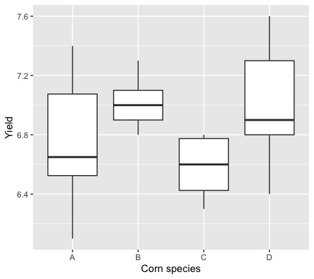
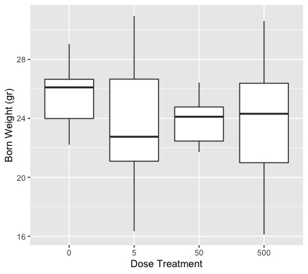

::: article
in terms of Type I error probability and penalized power. In the case of
Type I error probability of the compared tests are different, the
penalized power is used which allows fair power comparisons. In this
way, we conclude the performance of the tests by taking into account two
possible errors in hypothesis testing.

# Introduction

Testing equality of normal distributed and independent groups' means is
a basic analysis in statistics and related fields. The Fisher's F-test
is a powerful test to do this analysis with the assumptions of variance
homogeneity, normality, and statistical independency. Violation of the
variance homogeneity assumption is a commonly encountered statistical
problem in a variety of application areas such as agriculture, pharmacy,
and biostatistics. There is number of methods improved because of the
negative effect of the violation of variance homogeneity assumption on
the performance of Classical F-test in terms of Type I error probability
and power. These tests are, Cochran F (CF), Welch-Aspin (WA), Welch
(WE), Box (BX), Scott-Smith (SS), Brown-Forsythe (BF), Johansen (JF),
Approximate F (AF), Alexander-Govern (AG), Generalized F (GF), Modified
Brown-Forsythe (MBF), Permutation F (PF), Adjusted Welch (AW), B2,
Parametric Bootstrap (PB), Fiducial Approach (FA) and Alvandi et al.
Generalized F (AGF) test, chronologically. The fact that the high number
of methods in the literature raises the problem of choosing the most
appropriate method for researchers.

There are many articles to investigate the performance of the tests for
equality of normal distributed and independent group means under unequal
variances in the literature. However, only some of the tests are
included in these studies. The results of these studies help researchers
to solve the problem of choosing the appropriate method for their work.
[@gamage:1998] compared the size performance of the GF test and four
widely used procedures: CF, BF, and Welch test in case of deviation from
normality. The highly skewed Gamma distributions and Gamma distributions
with shapes close to being normal are considered. While the GF was found
to have size not exceeding the intended level, as heteroscedasticity
becomes severe the others were found to have poor size performance.
[@hartung:2002] compared the CF, C, W, BF, MBF, AF, and AW tests under
normal populations, balanced-unbalanced sample sizes and an increasing
number of populations. None of the tests considered is uniformly
dominating the others. The BF and the W test perform well over a wide
range of parameter configurations, the MBF test by Mehrotra keeps
generally the level, but other tests may also perform well, depending on
the constellation of the parameters under study. The W test becomes
liberal when the sample sizes are small and the number of populations is
large. They propose a modified version of Welch's test that keeps the
nominal level in these cases. With the understanding that methods are
unacceptable if they have Type I error rates that are too high, only the
testing procedure associated with the MBF test can be recommended, the
modified Welch test can also be recommended. [@argac:2004] constructed a
systematic pattern in simulations of the tests for equality of normal
distributed and independent group means under unequal variances.
Classical F, Cochran, Welch, modified Welch, Brown-Forsythe, modified
Brown-Forsythe, and approximate F test considered are divided into two
groups, Cochran-Welch type tests and the Brown-Forsythe type tests.
There seems to be considerably higher variability in the power of C-W
type tests in the balanced case. In the unbalanced case, there does not
appear to be a huge difference between the power of the different tests.
[@alvandi:2012] proposed a new GF test and compared it with GF, PB,
Welch, and Cochran test in an extensive Monte-Carlo simulation study.
According to results, it controls the Type I error probability better
and its power closed to the others. [@gokpinar:2012] compared the Type I
error probability and power of CF, BF, GF, PB, and W test under
different variance heterogeneities and effect sizes for three and five
groups. Their results indicate that PB is the best control Type I error
probability and has the highest power. In addition to these articles,
the scope of the other articles are not comprehensive in the literature
([@hartung:2002], [@lee:2003], [@li:2011], [@mutlu:2017]). A
comprehensive Monte-Carlo simulation study is conducted under normal
distribution in this article in order to fill this gap. Especially, the
penalized power is used which allows fair power comparisons when the
Type I error probabilities are different. In this way, we conclude the
performance of the tests by taking into account two possible errors in
hypothesis testing.

Another problem experienced by the researchers is most of these tests
are not available in any R package. However, some R packages contain the
tests for equality of normal distributed and independent group means
under unequal variances,
[*asbio*](https://CRAN.R-project.org/package=asbio) by [@aho:2019],
[*coin*](https://CRAN.R-project.org/package=coin) by [@hothorn:2008],
[*lawstat*](https://CRAN.R-project.org/package=lawstat) by [@hui:2008],
[*onewaytests*](https://CRAN.R-project.org/package=onewaytests) by
[@dag:2018], [*welchADF*](https://CRAN.R-project.org/package=welchADF)
by [@villacorta:2017], [*WRS2*](https://CRAN.R-project.org/package=WRS2)
by [@wilcox:2018]. These packages contain only the Brunner-Dette-Munk,
Permutation F, Kruskal-Wallis, Brown-Forsythe, Alexander-Govern, James
Second Order, Welch test. In particular, the performance of the tests
such as the GF, PB, FA, and AGF test by Monte-Carlo simulations prevents
the easy use of these tests. Clearly, a package should contain these
tests. We propose the package *doex* provides the tests for equality of
normal distributed group means under unequal variances which previously
have not been implemented in any R package such as AF, AGF, B2, FA, JF,
MBF, MW, PB, and PF. Also, it consists of the modified Generalized
F-test (MGF) which is proposed by [@cavus:2017] to test the equality of
group means under heteroscedasticity and non-normality caused by
outliers. It is a useful procedure for non-normal distributed groups and
[@cavus:2018] showed in a real data application.

The following sections detail the tests for equality of normal
distributed and independent group means under unequal variances
considered in *doex*. The performance of these tests is investigated in
terms of penalized power and Type I error probability. Finally, we
conclude with a brief summary and future works.

# Tests for Testing Equality of Normal Distributed Groups' Means under Unequal Variance 

The linear model within the context of a one-way independent group
design for testing the equality of groups' means is given in
(\@ref(eq:1)) .

$$\label{eq:1}
Y_{ij}=\mu_i+\epsilon_{ij}     (\#eq:1)$$

where $Y_{ij}$ is the dependent variable associated with the $i$th
observation in the $j$th group for $i= 1, 2, ..., n_i$ and
$j= 1, 2, ..., k$. $\mu_i$ is the group mean for the $i$th group, and
$\epsilon_{ij}$ is the random error component associated with $Y_{ij}$.
The null hypothesis $H_0: \mu_1=\mu_2= ...= \mu_k$ is tested as the
Classical F-test assumed that the $\epsilon_{ij}$'s are independent,
normally distributed, and have an equal variance $\sigma^2$ for each
group of $k$. Type I error probability of Classical F-test inflates and
its power decreases in case of the violation of variance homogeneity
assumption. There are many procedures improved in the literature to
solve this problem. In this section, the tests for equality of normal
distributed and independent group means under unequal variances,
considered in *doex* and discussed in the Monte-Carlo simulation study,
are introduced. These tests are, Alexander-Govern, Alvandi et al.
generalized F, Approximate F, Box F, Brown-Forsythe, $B^2$, Cochran F,
Fiducial Approach, Generalized F, Johansen, Modified Brown-Forsythe,
Adjusted Welch, Parametric Bootstrap, Permutation F, Scott-Smith, Welch,
Welch-Aspin test.

## Alexander-Govern (AG) test

[@alexander:1994] improved a test using the Hill's normality
transformation to the Student's t variables. Consider
$X_{i1}, X_{i2}, ..., X_{in_i} \sim N(\mu_i, \sigma_i^2)$ and the
standard deviations of normal groups computed as in (\@ref(eq:AG1)).
$$\label{eq:AG1}
S_{\bar{X}_i}= \frac{\sum_{i=1}^k \sum_{j=1}^{n_i} (X_{ij}-\bar{X}_i)^2}{n_i(n_i-1)}    (\#eq:AG1)$$
The weights are computed using the $S_{\bar{X}_i}$ as in
(\@ref(eq:AG2)).
$$\label{eq:AG2}
wi=\frac{1/S_{\bar{X}_i}^2}{\sum_{i=1}^k 1/S_{\bar{X}_i}^2}    (\#eq:AG2)$$
The weight mean is computed using the $w_i$ in (\@ref(eq:AG3)).
$$\label{eq:AG3} 
\bar{X}^*=\sum_{i=1}^k w_i\bar{X}_i   (\#eq:AG3)$$
The values of $t_i=(\bar{X}_i-\bar{X}^*)/S_{\bar{X}_i} \sim t_{n_i-1}$
are transformed using the following transformation.
$$z_i=c+\frac{c^3+3c}{b}+\frac{4c^7+33c^5+240c^3+855c}{10b^2+8bc^4+1000b}$$
where $a=v_i-0.5, c=\sqrt{a ln (1+\frac{t_i^2}{v_i})}$ and $b=48a^2$.
The test statistic of AG test is computed as in (\@ref(eq:AG4)).
$$\label{eq:AG4}
T_{AG}=\sum_{i=1}^k z_i^2    (\#eq:AG4)$$
The $H_0$ is rejected when $T_{AG}>\chi^2_{(k-1); \alpha}$.

## Alvandi et. al. Generalized F (AGF) test

[@alvandi:2012] proposed the test statistic in \@ref(eq:AGF1) as an
alternative of Weerahandi's Generalized F-test.
$$T_G(S_1^2, S_2^2, ..., S_k^2)=\sum_{i=1}^k \frac{n_i}{S_i^2}\bar{X}_i-\frac{[\sum_{i=1}^k n_i\bar{X}_i/S_i^2]^2}{\sum_{i=1}^k n_i/S_i^2}$$

$$\label{eq:AGF1}
T_{AGF}=\sum_{i=1}^k \frac{n_i-1}{U_i} (\bar{X}_i-q_i\tilde{X})^2    (\#eq:AGF1)$$
where $q_i=\sqrt{\frac{n_i/s_i^2}{\sum_{i=1}^k n_i/s_i^2}}$ and
$\tilde{X}=\sum_{i=1}^k q_i \bar{X}_i$. The p-value of AGF test computed
using Monte-Carlo simulations with **Algorithm 1**.


  **Algorithm 1.** Computation of Monte-Carlo estimate of the AGF test   

1.   Compute the vectors of $(\bar{x}_1, \bar{x}_2, ..., \bar{x}_k)$ and $(s_1^2, s_2^2, ..., s_k^2)$ for $k$ groups
2. Compute the $T_G$ using the vectors in **Step 1**

3. **for** $j$ in $\{1, ..., r\}$ **do**   
  Generate $U_i \sim \chi^2_{n_i-1}$ random samples Compute the $T_{AGF}$    
  using generated random samples Set the counter $Q_j=1$ when $T_{AGF}>T_G$  
  **end for**
4. Compute the Monte-Carlo estimate of p-value as $\sum_{i=1}^k Q_j/r$

## Approximate F (AF) test

[@asiribo:1990] proposed a modification to the F-test as in
(\@ref(eq:AF1)).
$$\label{eq:AF1}
T_{AF}=N\frac{\sum_{i=1}^k n_i(\bar{X}_i-\bar{X}_{..})^2}{\sum_{i=1}^k (N-n_i)S_i^2}    (\#eq:AF1)$$
where $\bar{X}_{..}=\sum_{i=1}^k \bar{X}_i$ and $N=\sum_{i=1}^k n_i$.
The $H_0$ is rejected when $T_{AF}>F_{v1, v2; \alpha}$. The degrees of
freedom of the AF test statistic is computed in (\@ref(eq:AF2)).
$$\label{eq:AF2}
v_1=\frac{[\sum_{i=1}^k (1-n_i/N)S_i^2]^2}{\sum_{i=1}^k S_i^4+[\sum_{i=1}^k n_i S_i^2/N]^2-2\sum_{i=1}^k n_i S_i^4/N}, 
v_2=\frac{[\sum_{i=1}^k (1-n_i/N)^2 S_i^2]^2}{\sum_{i=1}^k (n_i-1)S_i^4}    (\#eq:AF2)$$

## Box (BX) test

[@box:1954] proposed the test statistic in (\@ref(eq:BO1)).
$$\label{eq:BO1}
T_{BO}=\frac{N_k}{N(k-1)\sum_{i=1}^k \frac{(N-n_i)S_i^2}{(n_i-1)S_i^2}}    (\#eq:BO1)$$
The $H_0$ is rejected when $T_{BO}>F_{v_1, v_2; \alpha}$ where
$$v_1=\frac{[\sum_{i=1}^k (N-n_i)S_i^2]^2}{[\sum_{i=1}^k n_i S_i^2]^2+N\sum_{i=1}^k (N-2n_i)S_i^2},  
v_2=\frac{[\sum_{i=1}^k (n_i-1 S_i^2)]^2}{\sum_{i=1}^k (n_i-1)S_i^+}$$

## Brown-Forsythe (BF) test

[@brown:1974] proposes the following test statistic.
$$T_{BF}=\frac{\sum_{i=1}^k n_i(\bar{X}_i-X_{..})^2}{\sum_{i=1}^k (1-n_i/N)S_i^2}$$
where $X_{..}=\sum_{i=1}^k \bar{X}_i$ and $N=\sum_{i=1}^k n_i$. The
$H_0$ is rejected when $T_{BF}>F_{(k-1), v; \alpha}$. The degrees of
fredom of the test statistic computed as in (\@ref(eq:BF1)).
$$\label{eq:BF1}
v=\frac{[\sum_{i=1}^k n_i(\bar{X}_i-X_{..})]^2}{\sum_{i=1}^k \frac{(1-n_i/N)^2 S_i^4}{(n_i-1)}}    (\#eq:BF1)$$

## The $B^2$ test

[@ozdemir:2006] proposed the following procedure using the Bailey's
normality transformation to the Student's t variables. Consider
$X_{i1}, X_{i2}, ..., X_{in_i} \sim N(\mu_i, \sigma_i^2)$ and the
standard deviations of normal groups computed as in (\@ref(eq:B21)).
$$\label{eq:B21}
S_{\bar{X}_i}=\frac{\sum_{i=1}^k \sum_{j=1}^{n_i} (X_{ij}-\bar{X}_i)^2}{n_i(n_i-1)}    (\#eq:B21)$$
The weights computed using the $S_{\bar{X}_i}$ as in (\@ref(eq:B22)).
$$\label{eq:B22}
w_i=\frac{1/S_{\bar{X}_i}^2}{\sum_{i=1}^k 1/S_{\bar{X}_i}^2}    (\#eq:B22)$$
The weighed mean computed using the $w_i$'s as in (\@ref(eq:B23)).
$$\label{eq:B23}
\bar{X}^*=\sum_{i=1}^k w_i\bar{X}_i .   (\#eq:B23)$$
The values of $t_i=(\bar{X}_i-\bar{X}^*)/S_{\bar{X}_i} \sim t_{n_i-1}$
are transformed using Bailey's (1980) normality transformation.
$$z_i=\frac{4v_i^2+\frac{5(2z_c^2+3)}{24}}{4v_i^2+v_i+\frac{4z_c^2+9}{12}}\sqrt{v_i ln(1+\frac{t_i^2}{v_i})} \sim N(0, 1)$$
where $z_c=Z_{\alpha/2} \sim N(0, 1)$ and the test statistic of $B^2$
test computed as in (\@ref(eq:B24)).
$$\label{eq:B24}
T_{BK}=\sum_{i=1}^k z_i^2=\sum_{i=1}^k (\frac{4v_i^2+\frac{5(2z_c^2+3)}{24}}{4v_i^2+v_i+\frac{4z_c^2+9}{12}})^2 .   (\#eq:B24)$$
The $H_0$ is rejected when $T_{BK}>\chi^2_{(k-1); \alpha}$.

## Cochran (CF) test

[@cochran:1937] proposes the test statistic in (\@ref(eq:CF1)).
$$\label{eq:CF1} 
T_C=\sum_{i=1}^k w_i (\bar{X}_i - \sum_{j=1}^k h_j\bar{X}_j)^2   (\#eq:CF1)$$
where $w_i=n_i/s_i^2$ and $h_i=w_i/\sum_{i=1}^k w_i$. The $H_0$ is
rejected when $T_C > \chi^2_{(k-1); \alpha}$.

## Fiducial Approach (FA) test

[@li:2011] proposed the test statistic in (\@ref(eq:FA1)).
$$\label{eq:FA1}
T_{FA}=\sum_{i=1}^k t_i^2-\frac{(\sum_{i=1}^k \frac{\sqrt{n_i}}{S_i}t_i)^2}{\sum_{i=1}^k \frac{n_i}{S_i^2}} .   (\#eq:FA1)$$
The p-value of the FA test can be computed using Monte-Carlo simulations
with **Algorithm 2**.


  **Algorithm 2.** Computation of Monte-Carlo estimate of the FA test   

1. Compute the vectors of $(\bar{x}_1, \bar{x}_2, ..., \bar{x}_k)$ and $(s_1^2, s_2^2, ..., s_k^2)$ for $k$ groups

2. Compute the $T_G$ using the vectors in **Step 1**
  
3. **for** $j$ in $\{1, ..., r\}$ **do**   
   Generate $Z_i \sim N(0, 1)$ and $U_i \sim \chi^2_{n_i-1}$ random samples  
   Compute the $T_{FA}$ using generated random samples   
   Set the counter $Q_j=1$ when $T_{FA}>T_G$  
   **end for**
4. Compute the Monte-Carlo estimate of p-value as $\sum_{i=1}^k Q_j/r$


## Generalized F (GF) test

[@weerahandi:1995] proposed the test statistic in (\@ref(eq:GF1)) using
the generalized p-value approach.
$$\label{eq:GF1} 
T_{GF}=\sum_{i=1}^k (n_iU_i/v_i^2)\bar{x}_i^2-\frac{[\sum_{i=1}^k (n_iU_i/v_i^2)\bar{x}_i]^2}{\sum_{i=1}^k n_iU_i/v_i^2}   (\#eq:GF1)$$
where $v_i^2=(n_i-1)S_i^2$. The p-value of GF test can be computed using
Monte-Carlo simulations with **Algorithm 3**.


  **Algorithm 3.** Computation of Monte-Carlo estimate of the GF test   
  
1. Compute the vectors of $(\bar{x}_1, \bar{x}_2, ..., \bar{x}_k)$ and $(s_1^2, s_2^2, ..., s_k^2)$ for $k$ groups

2. Compute the $T_G$ using the vectors in **Step 1**

3.  **for** $j$ in $\{1, ..., r\}$ **do**  
    Generate $U_i \sim \chi^2_{n_i-1}$ random samples  
    Compute the $T_{GF}$ using generated random samples  
    Set the counter $Q_j=1$ when $T_{GF}>T_G$  
    **end for**

4. Compute the Monte-Carlo estimate of p-value as $\sum_{i=1}^k Q_j/r$

## Johansen (JF) test

[@johansen:1980] proposed an approximate solution to the W test as in
(\@ref(eq:tj)).

$$\label{eq:tj}
T_J=\frac{\sum_{i=1}^k \frac{\bar{X}_i^2}{S_i^2}-\frac{[\sum_{i=1}^k\bar{X}_i/S_i^2]^2}{\sum_{i=1}^k 1/S_i^2} }{c}  (\#eq:tj)$$

where $c=(k-1)+2A-6A/(k+1)$, $v=(k-1)(k+1)/3A$ and
$A=\sum_{i=1}^k (1-w_i/w)^2/(n_i-1)$ The $H_0$ is rejected when
$T_J > F_{k-1, v; \alpha}$.

## Modified Brown-Forsythe (MBF) test

[@mehrotra:1997] proposed the test statistic in (\@ref(eq:MBF1)), which
is a modification of BF, to well-performing in case of small sample
size.
$$\label{eq:MBF1} 
T_{MBF}=\frac{\sum_{i=1}^k n_i(\bar{X}_i-\bar{X}_{..})^2}{\sum_{i=1}^k (1-n_i/N)S_i^2} .   (\#eq:MBF1)$$
where $\bar{X}_{..}=\sum_{i=1}^k \bar{X}_i$ and $N=\sum_{i=1}^k n_i$.
The $H_0$ is rejected when $T_{MBF>F_{v_1, v_2; \alpha}}$. The degrees
of freedom of the MBF test statistics is computed as in
(\@ref(eq:MBF2)).
$$\label{eq:MBF2}
v_1=\frac{[\sum_{i=1}^k (1-n_i/N)S_i^2]^2}{\sum_{i=1}^k S_i^4+(\sum_{i=1}^k n_iS_i^2/N)^2-2\sum_{i=1}^k n_iS_i^4/N}
,     v_2=\frac{[\sum_{i=1}^k (1-n_i/N)^2 S_i^2]^2}{\sum_{i=1}^k \frac{(1-n_i/N)^2S_i^4}{n_i-1}} .   (\#eq:MBF2)$$

## Adjusted Welch (AW) test

[@hartung:2002] proposed an adjustment to the Welch test. The test
statistic of adjusted Welch test is computed as in (\@ref(eq:AW1)).
$$\label{eq:AW1}
T_W=\frac{\sum_{i=1}^k w_i^* (\bar{x}_i-\sum_{j=1}^k h_j^*\bar{x}_j)^2}{(k-1)+2\frac{k-2}{k+1}\sum_{i=1}^k \frac{1}{n_i-1}(1-h_j^*)^2}
.   (\#eq:AW1)$$
where $w_i^*=[\frac{n_i}{(n_i-1/n_i-3)s_i^2}]$ and
$h_i^*=\frac{w_i^*}{\sum_{i=1}^k w_i^*}$. The $H_0$ is rejected when
$T_W>F_{(k-1), v; \alpha}$. The degrees of freedom of the test statistic
computed in (\@ref(eq:AW2)).
$$\label{eq:AW2}
v=\frac{\frac{k^2-1}{3}}{\sum_{i=1}^k \frac{(1-h_i^*)^2}{n_i-1}} .   (\#eq:AW2)$$

## Parametric Bootstrap (PB) test

[@krish:2007] proposed a procedure to test the equality of group means
under heteroscedasticity.
$$T_G(S_1^2, S_2^2, ..., S_k^2)=\sum_{i=1}^k \frac{n_i}{S_i^2}\bar{X}_i-\frac{[\sum_{i=1}^k n_i\bar{X}_i/S_i^2]^2}{\sum_{i=1}^k n_i/S_i^2}$$
Assume $Z_i \sim N(0, 1)$ and $U_i \sim \chi^2_{n_i-1}$ random samples,
the test statistic of the PB test is computed as in (\@ref(eq:PB2)).
$$\label{eq:PB2}
T_{PB}(S_1^2, S_2^2, ..., S_k^2)=\sum_{i=1}^k \frac{Z_i^2 (n_i-1)}{U_i}-\frac{[\sum_{i=1}^k \sqrt{n_i}Z_i(n_i-1)/S_iU_i]^2}{\sum_{i=1}^k n_i(n_i-1)/S_i^2U_i}   (\#eq:PB2)$$
The $H_0$ is rejected when $T_{PB}>T_G$. The p-value of PB test is
computed using Monte-Carlo simulations with **Algorithm 4**.

  **Algorithm 4.** Computation of Monte-Carlo estimate of the PB test   

1.  Compute the vectors of $(\bar{x}_1, \bar{x}_2, ..., \bar{x}_k)$ and $(s_1^2, s_2^2, ..., s_k^2)$ for $k$ groups

2.  Compute the $T_G$ using the vectors in **Step 1**

3.  **for** $j$ in $\{1, ..., r\}$ **do**  
    Generate $Z_i \sim N(0, 1)$ and $U_i \sim \chi^2_{n_i-1}$ random samples  
    Compute the $T_{PB}$ using generated random samples  
    Set the counter $Q_j=1$ when $T_{PB}>T_G$  
    **end for**  

4.  Compute the Monte-Carlo estimate of p-value as $\sum_{i=1}^k Q_j/r$


## Permutation F (PF) test

[@berry:2002] proposed the test statistic in (\@ref(eq:PF1)) as the
permutational alternative of F-test.
$$\label{eq:PF1}
T_{PF}=\frac{(T-N\bar{X}^*)/(k-1)}{(V-T)/(N-k)}    (\#eq:PF1)$$
where $T=\sum_{i=1}^k n_i\sum{x}_i^2$, $\bar{X}^*=1/N\sum{n_i\bar{x}_i}$
and $V=\sum_{i=1}^k \sum_{j=1}^{n_i} X_{ij}^2$. The $H_0$ is rejected
when $T_{PF}>F_{k-1, N-k; \alpha}$.

## Scott-Smith (SS) test

[@scott:1971] proposed the test statistic in (\@ref(eq:SS1)).
$$\label{eq:SS1}
T_{SC}=\sum_{i=1}^k \frac{n_i(\bar{X}_i-\bar{X}_{..})^2}{S_i^{*2}}    (\#eq:SS1)$$
where $S_i^{*2}=\frac{n_i-1}{n_i-3}S_i^2$. The $H_0$ is rejected when
$T_{SC}>\chi^2_{k; \alpha}$.

## Welch (WE) test

[@welch:1951] improved the test statistic in \@ref(eq:W1) based on the
weighted group variance as an alternative to the F-test under
heteroscedasticity.
$$\label{eq:W1}
T_W=\frac{\sum_{i=1}^k w_i(\bar{x}_i-\sum_{i=1}^k h_j\bar{x}_j)^2}{(k-1)+2\frac{k-2}{k+1}\sum_{i=1}^k \frac{1}{n_i-1}(1-h_i)^2}    (\#eq:W1)$$
where $w_i=n_i/s_i^2$ and $h_i=w_i/\sum_{i=1}^k w_i$. The $H_0$ is
rejected when $T_W>F_{(k-1), v; \alpha}$. The degrees of freedom of the
Welch test computed as in \@ref(eq:W2).
$$\label{eq:W2}
v=\frac{(k^2-1)/3}{\sum_{i=1}^k \frac{(1-h_i)^2}{n_i-1}}    (\#eq:W2)$$

## Welch-Aspin (WA) test

[@aspin:1948] proposed the test statistic in (\@ref(eq:WA1)) with a
modification to the degrees of freedom of Welch test.
$$\label{eq:WA1}
T_{WA}=\frac{\sum_{i=1}^k (\bar{X}_i-\bar{X})^2/S_i^2}{(k-1)[1+\frac{2k-2}{k^2-1}\lambda]}    (\#eq:WA1)$$
where $\lambda=\sum_{i=1}^k [(1-w_i)^2/w_i]$, $v_1=k-1$ and
$v_2=(k^2-1)/3\lambda$. The $H_0$ is rejected when
$T_{WA}>F_{v_1; v_2; \alpha}$.\

# Using *doex* package

The *doex* package provides to perform several tests for equality of
normal distributed and independent distributed group means under unequal
variances. These tests are called a function with the initials of their
name which are given in the previous sections. In particular, the
following tests are not included in any R package or statistical package
program: AF, AGF, B2, FA, JF, MBF, MW, PB, and PF. In this section, the
examples are given how to use these tests by using doex. After the
explanatory data analysis, the variance homogeneity assumption must be
checked to move on to the next stage [@noguchi:2010; @erps:2019]. The
Levene Test is used to this, and we did not include it in the package is
because it is included in many R package such as
[*car*](https://CRAN.R-project.org/package=car) by [@car],
[*rstatix*](https://CRAN.R-project.org/package=rstatix) by
[@rstatix:2020], *lawstat* by [@lawstat:2020],
[*inferr*](https://CRAN.R-project.org/package=inferr) by [@inferr:2018].
We want to stick with the idea of creating a package that includes tests
not included in the CRAN.\
**Example 1:** The data are inputted to the functions with two parts:
observations and the group labels. As an example `hybrid` data from
Weerahandi (1995) is given in the package. It consists of two parts:
`data` are observations and `species` are the labels of species of the
corn hybrids.

``` r
# Call the doex package
> library(doex)
# print hybrid data of Weerahandi (1995)
> hybrid

    data species
 1   7.4       A
 2   6.6       A
 3   6.7       A
 4   6.1       A
 5   6.5       A
 6   7.2       A
 7   7.1       B
 8   7.3       B
 9   6.8       B
 10  6.9       B
 11  7.0       B
 12  6.8       C
 13  6.3       C
 14  6.4       C
 15  6.7       C
 16  6.5       C
 17  6.8       C
 18  6.4       D
 19  6.9       D 
 20  7.6       D
 21  6.8       D
 22  7.3       D

# observations of the hybrid data
> hybrid$data
 [1] 7.4 6.6 6.7 6.1 6.5 7.2 7.1 7.3 6.8 6.9 7.0 6.8 6.3 6.4 6.7 6.5 6.8 6.4 6.9 7.6 6.8 7.3
 
 # group labels of the hybrid data
> hybrid$species
 [1] A A A A A A B B B B B C C C C C C D D D D D
 Levels: A B C D
 
 # The ggplot2 package can be used to plot the box plot of the data in Figure 1.
> ggplot(hybrid, aes(x = species, y = data)) + 
>  geom_boxplot() +
>  ylab("Yield") +
>  xlab("Corn Species")
```

{#fig:ex1
width="100%" alt="graphic without alt text"}

``` r
# Look at the summary statistics of the data before using the tests.
# Use psych package to obtain the descriptive statistics of the hybrid data
> library(psych)

# Describe the hybrid data by species using describe.by(.) function
> describe.by(hybrid$data, hybrid$species)

#The output of the describe.by function as follows:

Descriptive statistics by group 
group: A
   vars n mean   sd median trimmed  mad min max range skew kurtosis   se
X1    1 6 6.75 0.48   6.65    6.75 0.52 6.1 7.4   1.3 0.11     -1.7 0.19
---------------------------------------------------------- 
group: B
   vars n mean   sd median trimmed  mad min max range skew kurtosis   se
X1    1 5 7.02 0.19      7    7.02 0.15 6.8 7.3   0.5 0.28    -1.72 0.09
---------------------------------------------------------- 
group: C
   vars n mean   sd median trimmed mad min max range  skew kurtosis   se
X1    1 6 6.58 0.21    6.6    6.58 0.3 6.3 6.8   0.5 -0.13    -2.02 0.09
---------------------------------------------------------- 
group: D
   vars n mean   sd median trimmed  mad min max range skew kurtosis   se
X1    1 5    7 0.46    6.9       7 0.59 6.4 7.6   1.2 0.04    -1.84 0.21

# It is seen that the variances of the species are unequal
# Thus we need to use the tests for equality of the group means under unequal variances
#
# Examples of the use of the AF and GF tests on the hybrid data are given in the follows.
# The following code performs the Approximate F-test on the hybrid data.

> library(doex)
> AF(hybrid$data,hybrid$species)

# This function returns a result matrix consists of a test statistic, degrees of freedom, 
and p-value of Approximate F-test as follows:

              Test Statistic df1 df2 p-value
Approximate F         1.8538   2  12  0.1943
```

``` r
# Following code performs the Generalized F-test.

> library(doex)
> GF(hybrid$data,hybrid$species)

# The p-value of the GF test is computed Monte-Carlo estimates and its size is 
# controlled with the rept parameter in the function. It is implemented as 
# default rept=10000
# This function returns the p-value of the Generalized F-test as follows:

              p-value
Generalized F  0.0492

# The results of the AF and GF tests are different at the nominal level 0.05.
# It is needed to investigate the performance of these tests in 
# a Monte-Carlo simulation study.
```

**Example 2:** This example is provided an external data involves litter
weights of mice born from mothers assigned to three different dosage
groups and a control. For the low dose group the dose metameter is 5,
for the medium dose group it is 50, and for the high dose group it is
500. In here, the problem is testing the equality of mean of litter
weights of mice born according to the used dose. The dataset is
available in the following repository:
<https://github.com/mcavs/doex_TheRJournal>.

``` r
# Print born weight data using the data is given in GitHub repository.

   weight_data dose
1        22.69    0
2        26.59    0
3        28.85    0
4        28.03    0
5        29.05    0
6        23.61    0
7        22.21    0
8        26.81    0
9        26.01    0
10       25.98    0
.	.	.
.	.	.
.	.	.
70       26.31  500
71       30.61  500
72       26.48  500
73       24.31  500
74       27.98  500

# The ggplot2 package can be used to plot the box plot of the data in Figure 2.
> ggplot(born_weight_data, aes(x = dose, y = weight_data)) + 
>  geom_boxplot() +
>  ylab("Born Weight (gr)") +
>  xlab("Dose Treatment")
```

{#fig:ex2
width="100%" alt="graphic without alt text"}

``` r
# Describe the born weight data by species using describe.by(.) function
> describe.by(born_weight_data$weight_data, born_weight_data$dose)

#The output of the describe.by function as follows:

 Descriptive statistics by group 
group: 0
   vars  n  mean   sd median trimmed  mad   min   max range skew kurtosis   se
X1    1 20 25.73 2.02   26.1   25.74 2.43 22.21 29.05  6.84 -0.1    -1.16 0.45
------------------------------- 
group: 5
   vars  n  mean  sd median trimmed  mad   min   max range skew kurtosis   se
X1    1 19 23.52 3.9  22.75   23.51 4.28 16.34 30.95 14.61 0.01    -0.97 0.89
------------------------------- 
group: 50
   vars  n  mean   sd median trimmed  mad   min   max range  skew kurtosis   se
X1    1 18 23.79 2.83  24.11   23.84 1.92 17.54 29.21 11.67 -0.28     0.03 0.67
------------------------------- 
group: 500
   vars  n  mean   sd median trimmed  mad   min   max range skew kurtosis   se
X1    1 17 23.72 4.08  24.31   23.76 3.84 16.13 30.61 14.48 -0.4    -0.91 0.99

# It is seen that the variances of the dose groups may be unequal
# To conclude whether the variance homogenity assumption is valid, 
# Levene test is used. 

> library(car)
> car::LeveneTest(weight_data ~ dose)

# LeveneTest(.) function returns the test statistic and 
# p-value of Levene variance homogeneity test as follows:

Levene's Test for Homogeneity of Variance (center = median)
      Df F value Pr(>F)  
group  3  3.3819 0.0229 *
---
Signif. codes:  
  0 ‘***’ 0.001 ‘**’ 0.01 ‘*’ 0.05 ‘.’ 

# The p-value of Levene test is lower than the nominal level 0.05, 
# so it is concluded that the variance homogeneity assumption is violated. 
# Thus we need to use the tests for equality of the group means under 
# unequal variances in doex.

# The GF, AF, and PB are used to conclude there is a significance difference between 
# the mean born weight of mice according to used dose group.

> doex::GF(weight_data, dose)

              p-value
Generalized F  0.0331

> doex::AF(weight_data, dose)

              Test Statistic df1 df2 p-value
Approximate F         1.9408   3  57  0.1484

> doex::PB(weight_data, dose)

                     p-value
Parametric Bootstrap  0.0366

# The results of the GF and PB tests indicate that there is a significant difference,
# while the result of the AF indicates that there is no significant difference between
# the mean born weight of mice according to used dose group.
# It is also needed to investigate the performance of these tests in 
# a Monte-Carlo simulation study.
```

# Monte-Carlo simulation study

In this section, the performance of the tests for equality of normal
distributed and independent groups' means under unequal variances are
investigated in terms of Type I error probability and penalized power of
the test. We used the penalized power instead of the classical power of
the test, because any comparison of the powers is invalid when Type I
error probabilities are different in Monte-Carlo simulation studies.
[@zhang:1994] and [@lloyd:2005] proposed alternatives for the power of
the tests have some deficiencies. To overcome this problem,
[@cavus:2019] proposed the penalized power of the test in (\@ref(eq:pp))
to compare the power of the test even if Type I error probabilities are
different.

$$\label{eq:pp}
\gamma=\frac{1-\beta}{\sqrt{1+\left|1-\frac{\alpha_i}{\alpha_0}\right|}}    (\#eq:pp)$$

where $\beta$ is Type II error rate, $\alpha_i$ is Type I error of the
test, and $\alpha_0$ is the nominal level. Penalized power adjusts the
power function with the square root of the percentile deviation between
type I error probability and the nominal level. Thus, penalized power is
used to compare the power of the tests in the simulation studies. An
extensive Monte-Carlo simulation study is conducted to investigate the
performance of the tests in terms of Type I error probability and
penalized power. Firstly, the ability of the tests to control the Type I
error probability is examined. Then, the penalized power of the test
which controls the Type I error probability in the [@bradley:1978]'s
robustness limits are compared. In this way, we conclude the performance
of the tests by taking into account two possible errors in hypothesis
testing. The sample size, design type, variance heterogeneity, and
effect sizes are used as configuration factors beyond this part of the
study. The R code used in this simulation study is available in the
following repository: <https://github.com/mcavs/doex_TheRJournal>.

## The properties of the tests to control the Type I error probability

Type I error probabilities of the tests are investigated in an extensive
Monte-Carlo simulation study under balanced and unbalanced design with
small, moderate, and large sample sizes in this section. Also, the
number of the groups is fixed as $k=3, 5, 7$, and different
heteroscedasticity setups are also used. Hereby, the properties of the
tests to control the Type I error probability are revealed under various
scenarios.

{#fig:k3 width="100%"
alt="graphic without alt text"}

{#fig:k5 width="100%"
alt="graphic without alt text"}

{#fig:k7 width="100%"
alt="graphic without alt text"}

The boxplots in Figs. [3](#fig:k3),[4](#fig:k5),[5](#fig:k7) are
constructed for several heteroscedasticity scenarios. In this way, the
ability of the tests to control the Type I error probability are
obtained. According to the Fig.[3](#fig:k3), AF, AG, B2, GF, JF, MBF,
PB, WA and WE test controls the Type I error probability in the
[@bradley:1978] limits which are shown with dashed red lines. However,
the AGF, CF, PF, and SS test could not control the Type I error
probability for $k=3$. The GF test controls the Type I error probability
unlike in the case of $k=3$ in Fig.[4](#fig:k5). The AF, AG, B2, MBF,
PB, and WA test control Type I error probability for $k=7$. When the
results are summarized, it is concluded that the AGF, BF, BX, CF, MW,
PF, and SS test could not control the Type I error probability for each
of the $k$'s. Thus, the tests only which control Type I error
probability in the limits are considered in the next section for power
comparisons to avoid making a wrong decision.

## The results of the penalized powers

In this section, the penalized power results are given under four
configuration factors are sample size, design type, effect size,
heteroscedasticity level for $k=3, 5, 7$. The samples follows normal
distribution with the parameters $(\mu_i, \sigma_i^2)$ as given in
Tables [1](#tab1), [2](#tab2), [3](#tab3). The mean parameter of the
samples are shown as the effect size $\Delta_i$ in each line. This means
that the mean parameter of the samples are zero except the last sample
is $\Delta_i$.

When the effect of the configuration factors on the power are examined,
it is observed that the larger sample size increase, the higher level of
heteroscedasticity decrease, and the higher effect sizes increase the
power of all tests as expected. Also, some interesting results are
obtained such as the penalized power of all tests are higher in the
unbalanced designs. The performances of the AF and MBF, the AG and B2,
the JF and WE tests are very close to each other in terms of penalized
power. Thus, these tests may be used interchangeably.

The AF and MBF test are superior than others in most of the scenarios.
In the lower level of heteroscedasticity for all sample sizes, the
penalized power of the tests are higher than 0.90 for $k=3$. It is the
same situation for $k=5$ except for a small sample-unbalanced design. In
this case, the penalized power of the AF and MGF is close to the 0.90,
and the performance of the others is unacceptable. For $k=7$, the
penalized power of the tests is higher than 0.90 except for small
sample-lower heteroscedasticity scenarios. In this case, the AF and MBF
tests show acceptable performance in terms of penalized power in only
small sample-lower level heteroscedasticity. As a result, it is clearly
seen that the penalized power of the tests decreases dramatically in the
higher level of heteroscedasticity for $k=5, 7$.

::: {#tab1}
  ------------------------------------------------------------------------------------------------------------------------------
  $n_i$          $\sigma_i^2$      $\Delta_i$   AG       AF       B2       GF       JF       MBF      PB       WE       WA
  -------------- ----------------- ------------ -------- -------- -------- -------- -------- -------- -------- -------- --------
  (10, 10, 10)   (0.1, 0.2, 0.3)   0.3          0.2232   0.2630   0.2236   0.2133   0.2314   0.2628   0.2306   0.2314   0.2128

                                   0.8          0.9045   0.9391   0.9047   0.8915   0.9197   0.9390   0.9201   0.9197   0.8833

                                   1.5          0.9910   0.9815   0.9911   0.9768   0.9921   0.9815   0.9941   0.9921   0.9614

                 (0.1, 0.4, 0.7)   0.3          0.1265   0.1491   0.1269   0.1277   0.1326   0.1490   0.1296   0.1326   0.1193

                                   0.8          0.5962   0.6858   0.5978   0.6004   0.6129   0.6855   0.6089   0.6129   0.5829

                                   1.5          0.9853   0.9880   0.9881   0.9893   0.9812   0.9879   0.9777   0.9812   0.9583

                 (1, 2, 3)         0.3          0.0682   0.0656   0.0684   0.0649   0.0708   0.0655   0.0702   0.0708   0.0644

                                   0.8          0.1700   0.2006   0.1701   0.1653   0.1760   0.2004   0.1752   0.1760   0.1615

                                   1.5          0.4832   0.5536   0.4833   0.4716   0.4998   0.5534   0.4968   0.4998   0.4693

                 (1, 4, 7)         0.3          0.0614   0.0566   0.0616   0.0622   0.0627   0.0565   0.0622   0.0627   0.0563

                                   0.8          0.1023   0.1200   0.1026   0.1050   0.1075   0.1200   0.1068   0.1075   0.0958

                                   1.5          0.2542   0.3022   0.2550   0.2556   0.2655   0.3021   0.2594   0.2655   0.2424

  (30, 30, 30)   (0.1, 0.2, 0.3)   0.3          0.6299   0.7004   0.6293   0.6281   0.6327   0.7002   0.6342   0.6327   0.6375

                                   0.8          0.9882   0.9980   0.9872   0.9872   0.9815   0.9979   0.9853   0.9815   0.9970

                                   1.5          1        1        1        1        1        1        1        1        1

                 (0.1, 0.4, 0.7)   0.3          0.3210   0.3791   0.3212   0.3210   0.3243   0.3789   0.3224   0.3243   0.3233

                                   0.8          0.9772   0.9924   0.9775   0.9779   0.9740   0.9922   0.9726   0.9740   0.9898

                                   1.5          0.9831   0.9960   0.9834   0.9834   0.9796   0.9960   0.9787   0.9796   0.9960

                 (1, 2, 3)         0.3          0.0923   0.1072   0.0922   0.0934   0.0938   0.1070   0.0930   0.0938   0.0925

                                   0.8          0.4785   0.5411   0.4780   0.4733   0.4823   0.5410   0.4789   0.4823   0.4820

                                   1.5          0.9566   0.9798   0.9557   0.9545   0.9517   0.9797   0.9566   0.9517   0.9653

                 (1, 4, 7)         0.3          0.0661   0.0715   0.0663   0.0663   0.0672   0.0714   0.0648   0.0672   0.0657

                                   0.8          0.2282   0.2809   0.2285   0.2284   0.2318   0.2808   0.2298   0.2318   0.2301

                                   1.5          0.6982   0.7659   0.6990   0.7012   0.7032   0.7655   0.7009   0.7032   0.7100

  (50, 50, 50)   (0.1, 0.2, 0.3)   0.3          0.8573   0.9046   0.8577   0.8546   0.8547   0.9045   0.8604   0.8547   0.8593

                                   0.8          0.9811   0.9980   0.9815   0.9825   0.9759   0.9979   0.9853   0.9759   0.9834

                                   1.5          1        1        1        1        1        1        1        1        1

                 (0.1, 0.4, 0.7)   0.3          0.5427   0.6028   0.5425   0.5443   0.5418   0.6026   0.5400   0.5418   0.5442

                                   0.8          0.9832   0.9980   0.9834   0.9880   0.9759   0.9980   0.9740   0.9759   0.9872

                                   1.5          1        1        1        1        0.9979   1        0.9940   0.9981   1

                 (1, 2, 3)         0.3          0.1421   0.1671   0.1431   0.1432   0.1435   0.1671   0.1474   0.1435   0.1434

                                   0.8          0.7210   0.7900   0.7214   0.7203   0.7204   0.7900   0.7262   0.7204   0.7232

                                   1.5          0.9803   0.9974   0.9807   0.9817   0.9751   0.9974   0.9843   0.9751   0.9826

                 (1, 4, 7)         0.3          0.0912   0.1040   0.0917   0.0907   0.0917   0.1040   0.0918   0.0917   0.0904

                                   0.8          0.4020   0.4659   0.4018   0.4066   0.4017   0.4659   0.4021   0.4017   0.4032

                                   1.5          0.9031   0.9405   0.9032   0.9070   0.8990   0.9405   0.8932   0.8990   0.9077

  (5, 10, 15)    (0.1, 0.2, 0.3)   0.3          0.2790   0.3346   0.2791   0.2535   0.2573   0.2974   0.2605   0.2573   0.2371

                                   0.8          0.9598   0.9388   0.9570   0.9217   0.9432   0.9342   0.9484   0.9432   0.9406

                                   1.5          0.9844   0.9483   0.9815   0.9475   0.9731   0.9500   0.9787   0.9731   0.9759

                 (0.1, 0.4, 0.7)   0.3          0.1522   0.1955   0.1526   0.1346   0.1494   0.1743   0.1490   0.1494   0.1339

                                   0.8          0.7601   0.8070   0.7609   0.7018   0.7535   0.7860   0.7532   0.7535   0.7063

                                   1.5          0.9910   0.9612   0.9913   0.9340   0.9962   0.9748   0.9992   0.9962   0.9567

                 (1, 2, 3)         0.3          0.0702   0.0835   0.0709   0.0604   0.0650   0.0669   0.0652   0.0650   0.0607

                                   0.8          0.2018   0.2644   0.2014   0.1817   0.1900   0.2236   0.1912   0.1900   0.1741

                                   1.5          0.5940   0.6651   0.5928   0.5571   0.5611   0.6205   0.5649   0.5611   0.5412

                 (1, 4, 7)         0.3          0.0562   0.0690   0.0567   0.0460   0.0568   0.0610   0.0580   0.0568   0.0496

                                   0.8          0.1202   0.1546   0.1210   0.1068   0.1190   0.1353   0.1190   0.1190   0.1036

                                   1.5          0.3310   0.3986   0.3312   0.3016   0.3252   0.3689   0.3250   0.3252   0.2971

  (20, 30, 40)   (0.1, 0.2, 0.3)   0.3          0.7142   0.7419   0.7143   0.7108   0.7071   0.7609   0.7093   0.7071   0.7068

                                   0.8          0.9955   0.9509   0.9960   0.9980   0.9872   0.9970   0.9921   0.9872   0.9960

                                   1.5          1        1        1        1        1        1        1        1        1

                 (0.1, 0.4, 0.7)   0.3          0.3951   0.4407   0.3953   0.3944   0.3994   0.4314   0.3953   0.3994   0.3872

                                   0.8          0.9892   0.9612   0.9895   0.9936   0.9984   0.9869   0.9899   0.9984   0.9857

                                   1.5          0.9910   0.9614   0.9911   0.9950   1        0.9872   0.9911   1        0.9872

                 (1, 2, 3)         0.3          0.1062   0.1227   0.1066   0.1022   0.1060   0.1196   0.1058   0.1060   0.1044

                                   0.8          0.5572   0.5975   0.5576   0.5541   0.5521   0.6064   0.5540   0.5521   0.5530

                                   1.5          0.9843   0.9452   0.9847   0.9860   0.9758   0.9892   0.9806   0.9758   0.9845

                 (1, 4, 7)         0.3          0.0743   0.0821   0.0747   0.0732   0.0756   0.0772   0.0747   0.0756   0.0735

                                   0.8          0.2872   0.3234   0.2874   0.2876   0.2904   0.3157   0.2908   0.2904   0.2843

                                   1.5          0.8011   0.8166   0.8020   0.8044   0.8100   0.8240   0.8004   0.8100   0.7957

  (25, 50, 75)   (0.1, 0.2, 0.3)   0.3          0.9182   0.8505   0.9184   0.9294   0.9129   0.9361   0.9153   0.9129   0.9227

                                   0.8          0.9744   0.8811   0.9750   0.9872   0.9704   0.9796   0.9750   0.9704   0.9825

                                   1.5          1        1        1        1        1        1        1        1        1

                 (0.1, 0.4, 0.7)   0.3          0.6392   0.6680   0.6398   0.6375   0.6365   0.6702   0.6384   0.6365   0.6380

                                   0.8          0.9682   0.9054   0.9685   0.9704   0.9649   0.9631   0.9750   0.9649   0.9722

                                   1.5          1        0.9654   1        1        1        1        1        1        1

                 (1, 2, 3)         0.3          0.1631   0.2058   0.1636   0.1649   0.1630   0.1932   0.1652   0.1630   0.1627

                                   0.8          0.8022   0.7839   0.8030   0.8105   0.7976   0.8452   0.7991   0.7976   0.8058

                                   1.5          0.9745   0.8811   0.9750   0.9872   0.9704   0.9796   0.9750   0.9704   0.9825

                 (1, 4, 7)         0.3          0.0970   0.1217   0.0972   0.0959   0.0969   0.1094   0.0989   0.0969   0.0961

                                   0.8          0.4922   0.5291   0.4924   0.4896   0.4902   0.5205   0.4941   0.4902   0.4900

                                   1.5          0.9466   0.8923   0.9470   0.9486   0.9433   0.9435   0.9531   0.9433   0.9500
  ------------------------------------------------------------------------------------------------------------------------------

  : Table 1: Penalized powers for $k=3$
:::

[]{#tab1 label="tab1"}

::: {#tab2}
  ---------------------------------------------------------------------------------------------------------------------------------------
  $n_i$                  $\sigma_i^2$                $\Delta_i$   AG       AF       B2       JF       MBF      PB       WE       WA
  ---------------------- --------------------------- ------------ -------- -------- -------- -------- -------- -------- -------- --------
  (10, 10, 10, 10, 10)   (0.1, 0.2, 0.3, 0.4, 0.5)   0.3          0.0713   0.0867   0.0716   0.0779   0.0863   0.0729   0.0779   0.0718

                                                     0.8          0.2172   0.3403   0.2173   0.2424   0.3400   0.2350   0.2424   0.2271

                                                     1.5          0.6316   0.8549   0.6315   0.6984   0.8542   0.6897   0.6984   0.6722

                         (0.1, 0.4, 0.7, 1.1, 1.5)   0.3          0.0562   0.0586   0.0565   0.0543   0.0536   0.0540   0.0543   0.0515

                                                     0.8          0.0917   0.1191   0.0915   0.0848   0.1074   0.0843   0.0848   0.0791

                                                     1.5          0.2110   0.3094   0.2109   0.1840   0.2835   0.1850   0.1840   0.1747

                         (1, 2, 3, 4, 5)             0.3          0.0522   0.0541   0.0523   0.0560   0.0540   0.0525   0.0560   0.0502

                                                     0.8          0.0658   0.0788   0.0657   0.0713   0.0785   0.0671   0.0713   0.0647

                                                     1.5          0.1066   0.5250   0.1065   0.1165   0.1479   0.1072   0.1165   0.1046

                         (1, 4, 7, 11, 15)           0.3          0.0953   0.1154   0.0951   0.0923   0.1153   0.0964   0.0923   0.0940

                                                     0.8          0.4644   0.5647   0.4635   0.4510   0.5645   0.4635   0.4510   0.4611

                                                     1.5          0.9652   0.9788   0.9633   0.9312   0.9785   0.9611   0.9312   0.9563

  (30, 30, 30, 30, 30)   (0.1, 0.2, 0.3, 0.4, 0.5)   0.3          0.3557   0.4704   0.3556   0.3598   0.4700   0.3573   0.3598   0.3601

                                                     0.8          0.9824   0.9871   0.9824   0.9666   0.9870   0.9716   0.9666   0.9803

                                                     1.5          0.9834   0.9872   0.9844   0.9676   0.9871   0.9731   0.9676   0.9815

                         (0.1, 0.4, 0.7, 1.1, 1.5)   0.3          0.1442   0.1996   0.1443   0.1461   0.1994   0.1445   0.1461   0.1456

                                                     0.8          0.7418   0.8700   0.7420   0.7478   0.8700   0.7439   0.7478   0.7586

                                                     1.5          0.9843   0.9931   0.9848   0.9708   0.9930   0.9700   0.9708   0.9906

                         (1, 2, 3, 4, 5)             0.3          0.0773   0.0898   0.0779   0.0791   0.0893   0.0784   0.0791   0.0768

                                                     0.8          0.2581   0.3510   0.2590   0.2618   0.3508   0.2606   0.2618   0.2614

                                                     1.5          0.7472   0.8595   0.7477   0.7509   0.8593   0.7537   0.7509   0.7579

                         (1, 4, 7, 11, 15)           0.3          0.0621   0.0666   0.0622   0.0621   0.0664   0.0624   0.0621   0.0614

                                                     0.8          0.1158   0.1557   0.1160   0.1167   0.1552   0.1164   0.1167   0.1159

                                                     1.5          0.3113   0.4370   0.3112   0.3182   0.4366   0.3153   0.3182   0.3193

  (50, 50, 50, 50, 50)   (0.1, 0.2, 0.3, 0.4, 0.5)   0.3          0.5882   0.6978   0.5883   0.5996   0.6975   0.5964   0.5996   0.5881

                                                     0.8          0.9955   0.9825   0.9960   1        0.9823   0.9990   1        0.9901

                                                     1.5          1        1        1        1        1        1        1        1

                         (0.1, 0.4, 0.7, 1.1, 1.5)   0.3          0.2161   0.3051   0.2163   0.2215   0.3050   0.2178   0.2215   0.2152

                                                     0.8          0.9432   0.9636   0.9433   0.9472   0.9633   0.9440   0.9472   0.9321

                                                     1.5          0.9890   0.9787   0.9892   0.9901   0.9785   0.9872   0.9901   0.9750

                         (1, 2, 3, 4, 5)             0.3          0.0912   0.1121   0.0919   0.0929   0.1120   0.0921   0.0929   0.0909

                                                     0.8          0.4361   0.5477   0.4363   0.4465   0.5474   0.4435   0.4465   0.4374

                                                     1.5          0.9502   0.9665   0.9508   0.9574   0.9663   0.9558   0.9574   0.9473

                         (1, 4, 7, 11, 15)           0.3          0.0621   0.0701   0.0628   0.0626   0.0700   0.0621   0.0626   0.0610

                                                     0.8          0.1617   0.2248   0.1619   0.1657   0.2245   0.1624   0.1657   0.1602

                                                     1.5          0.5205   0.6456   0.5206   0.5292   0.6455   0.5302   0.5292   0.5197

  (4, 6, 10, 14, 16)     (0.1, 0.2, 0.3, 0.4, 0.5)   0.3          0.1680   0.2295   0.1682   0.1448   0.1922   0.1309   0.1448   0.1313

                                                     0.8          0.8345   0.9315   0.8335   0.7925   0.8584   0.7690   0.7925   0.7730

                                                     1.5          0.9833   0.9844   0.9814   0.9795   0.9198   0.9739   0.9795   0.9758

                         (0.1, 0.4, 0.7, 1.1, 1.5)   0.3          0.0848   0.1110   0.0847   0.0790   0.0988   0.0745   0.0790   0.0736

                                                     0.8          0.3790   0.5455   0.3790   0.3366   0.5029   0.3283   0.3366   0.3282

                                                     1.5          0.9103   0.9756   0.9072   0.8771   0.9474   0.8920   0.8771   0.8947

                         (1, 2, 3, 4, 5)             0.3          0.0633   0.0625   0.0632   0.0605   0.0501   0.0583   0.0605   0.0570

                                                     0.8          0.1252   0.1750   0.1253   0.1103   0.1469   0.1081   0.1103   0.1069

                                                     1.5          0.3671   0.5264   0.3674   0.3126   0.4614   0.3090   0.3126   0.3093

                         (1, 4, 7, 11, 15)           0.3          0.0523   0.0537   0.0525   0.0544   0.0471   0.0479   0.0544   0.0474

                                                     0.8          0.0727   0.0902   0.0735   0.0707   0.0791   0.0635   0.0707   0.0630

                                                     1.5          0.1466   0.2189   0.1475   0.1359   0.1930   0.1195   0.1359   0.1197

  (12,18, 30, 42, 48)    (0.1, 0.2, 0.3, 0.4, 0.5)   0.3          0.5134   0.6239   0.5129   0.4915   0.6184   0.4904   0.4915   0.4905

                                                     0.8          0.9969   0.9466   0.9959   0.9824   0.9863   0.9910   0.9824   0.9959

                                                     1.5          1        1        1        1        1        1        1        1

                         (0.1, 0.4, 0.7, 1.1, 1.5)   0.3          0.1999   0.2816   0.2000   0.1936   0.2697   0.1906   0.1936   0.1904

                                                     0.8          0.9238   0.9291   0.9239   0.9091   0.9556   0.9046   0.9091   0.9183

                                                     1.5          0.9977   0.9543   0.9980   0.9853   0.9882   0.9815   0.9853   0.9980

                         (1, 2, 3, 4, 5)             0.3          0.0812   0.1162   0.0814   0.0817   0.1028   0.0804   0.0817   0.0772

                                                     0.8          0.3714   0.4900   0.3713   0.3630   0.4614   0.3567   0.3630   0.3459

                                                     1.5          0.9016   0.9321   0.9017   0.9085   0.9309   0.8963   0.9085   0.8825

                         (1, 4, 7, 11, 15)           0.3          0.0611   0.0718   0.0618   0.0615   0.0670   0.0605   0.0615   0.0607

                                                     0.8          0.1502   0.2101   0.1506   0.1445   0.2032   0.1460   0.1445   0.1443

                                                     1.5          0.4561   0.5788   0.4561   0.4425   0.5779   0.4465   0.4425   0.4472

  (20, 30, 50, 70, 80)   (0.1, 0.2, 0.3, 0.4, 0.5)   0.3          0.7441   0.8321   0.7448   0.7426   0.8292   0.7403   0.7426   0.7293

                                                     0.8          0.9692   0.9509   0.9695   0.9759   0.9722   0.9731   0.9759   0.9614

                                                     1.5          0.9891   0.9729   0.9895   0.9959   0.9822   0.9921   0.9899   0.9934

                         (0.1, 0.4, 0.7, 1.1, 1.5)   0.3          0.7590   0.8306   0.7593   0.7602   0.8469   0.7569   0.7602   0.7499

                                                     0.8          0.9782   0.9444   0.9785   0.9844   0.9874   0.9828   0.9844   0.9747

                                                     1.5          0.9821   0.9449   0.9825   0.9882   0.9882   0.9872   0.9882   0.9787

                         (1, 2, 3, 4, 5)             0.3          0.1040   0.1441   0.1047   0.1027   0.1374   0.1018   0.1027   0.1008

                                                     0.8          0.5771   0.6735   0.5773   0.5709   0.7017   0.5684   0.5709   0.5719

                                                     1.5          0.9472   0.9101   0.9475   0.9473   0.9861   0.9499   0.9473   0.9550

                         (1, 4, 7, 11, 15)           0.3          0.0651   0.0805   0.0657   0.0654   0.0765   0.0652   0.0654   0.0643

                                                     0.8          0.2322   0.3155   0.2326   0.2275   0.3055   0.2278   0.2275   0.2250

                                                     1.5          0.7033   0.7689   0.7038   0.6962   0.7887   0.6987   0.6962   0.6995
  ---------------------------------------------------------------------------------------------------------------------------------------

  : Table 2: Penalized powers for $k=5$
:::

[]{#tab2 label="tab2"}

::: {#tab3}
  ---------------------------------------------------------------------------------------------------------------------------------------
  $n_i$                          $\sigma_i^2$                          $\Delta_i$   AG       AF       B2       MBF      PB       WA
  ------------------------------ ------------------------------------- ------------ -------- -------- -------- -------- -------- --------
  (10, 10, 10, 10, 10, 10, 10)   (0.1, 0.2, 0.3, 0.4, 0.5, 0.6, 0.7)   0.3          0.0916   0.1176   0.0921   0.1175   0.0954   0.0960

                                                                       0.8          0.3745   0.6158   0.3750   0.6154   0.4288   0.4279

                                                                       1.5          0.8713   0.9725   0.8715   0.9723   0.9247   0.9068

                                 (0.1, 0.4, 0.7, 1.1, 1.5, 1.9, 2.3)   0.3          0.0668   0.0655   0.0666   0,0651   0.0660   0.0658

                                                                       0.8          0.1501   0.2255   0.1502   0.2253   0.1578   0.1603

                                                                       1.5          0.4021   0.6756   0.4023   0.6753   0.4519   0.4519

                                 (1, 2, 3, 4, 5, 6, 7)                 0.3          0.0565   0.0520   0.0568   0.0520   0.0597   0.0588

                                                                       0.8          0.0819   0.0944   0.0820   0.0942   0.0831   0.0834

                                                                       1.5          0.1612   0.2385   0.1609   0.2381   0.1693   0.1695

                                 (1, 4, 7, 11, 15, 19, 23)             0.3          0.0560   0.0485   0.0561   0.0483   0.0577   0.0570

                                                                       0.8          0.0632   0.0608   0.0635   0.0604   0.0625   0.0633

                                                                       1.5          0.0855   0.1044   0.0858   0.1042   0.0860   0.0880

  (30, 30, 30, 30, 30, 30, 30)   (0.1, 0.2, 0.3, 0.4, 0.5, 0.6, 0.7)   0.3          0.2204   0.3303   0.2209   0.3301   0.2301   0.2298

                                                                       0.8          0.9598   0.9703   0.9596   0.9701   0.9616   0.9640

                                                                       1.5          0.9957   0.9778   0.9960   0.9768   0.9911   0.9941

                                 (0.1, 0.4, 0.7, 1.1, 1.5, 1.9, 2.3)   0.3          0.0978   0.1334   0.0980   0.1324   0.0977   0.0985

                                                                       0.8          0.4679   0.6533   0.4680   0.6530   0.4867   0.4904

                                                                       1.5          0.9702   0.9822   0.9704   0.9820   0.9630   0.9757

                                 (1, 2, 3, 4, 5, 6, 7)                 0.3          0.0651   0.0712   0.0657   0.0711   0.0670   0.0636

                                                                       0.8          0.1652   0.2417   0.1657   0.2414   0.1725   0.1706

                                                                       1.5          0.5243   0.6901   0.5247   0.6900   0.5453   0.5461

                                 (1, 4, 7, 11, 15, 19, 23)             0.3          0.0552   0.0575   0.0555   0.0572   0.0550   0.0537

                                                                       0.8          0.0852   0.1060   0.0857   0.1050   0.0853   0.0860

                                                                       1.5          0.1810   0.2765   0.1813   0.2755   0.1841   0.1839

  (50, 50, 50, 50, 50, 50, 50)   (0.1, 0.2, 0.3, 0.4, 0.5, 0.6, 0.7)   0.3          0.3722   0.5118   0.3725   0.5111   0.3782   0.3787

                                                                       0.8          0.9969   0.9853   0.9978   0.9850   0.9988   0.9948

                                                                       1.5          1        1        1        1        1        1

                                 (0.1, 0.4, 0.7, 1.1, 1.5, 1.9, 2.3)   0.3          0.1362   0.1907   0.1365   0.1907   0.1387   0.1380

                                                                       0.8          0.7502   0.8843   0.7507   0.8840   0.7686   0.7657

                                                                       1.5          0.9943   0.9863   0.9948   0.9852   0.9988   0.9968

                                 (1, 2, 3, 4, 5, 6, 7)                 0.3          0.0762   0.0914   0.0764   0.0910   0.0787   0.0758

                                                                       0.8          0.2660   0.3817   0.2661   0.3812   0.2739   0.2697

                                                                       1.5          0.8052   0.9063   0.8058   0.9051   0.8202   0.8145

                                 (1, 4, 7, 11, 15, 19, 23)             0.3          0.0600   0.0629   0.0601   0.0612   0.0605   0.0594

                                                                       0.8          0.1093   0.1499   0.1099   0.1479   0.1123   0.1099

                                                                       1.5          0.2902   0.4275   0.2906   0.4271   0.2981   0.2971

  (4, 6, 8, 10, 12, 14, 16)      (0.1, 0.2, 0.3, 0.4, 0.5, 0.6, 0.7)   0.3          0.1201   0.1540   0.1208   0.1419   0.1025   0.1067

                                                                       0.8          0.6065   0.7846   0.6068   0.7525   0.5561   0.5596

                                                                       1.5          0.9622   0.9456   0.9617   0.9273   0.9852   0.9544

                                 (0.1, 0.4, 0.7, 1.1, 1.5, 1.9, 2.3)   0.3          0.0718   0.0814   0.0720   0.0750   0.0629   0.0704

                                                                       0.8          0.2169   0.3329   0.2173   0.3132   0.1798   0.1944

                                                                       1.5          0.6726   0.8591   0.6734   0.8274   0.6240   0.6532

                                 (1, 2, 3, 4, 5, 6, 7)                 0.3          0.0622   0.0549   0.0621   0.0509   0.0587   0.0609

                                                                       0.8          0.1035   0.1204   0.1041   0.1114   0.0856   0.0900

                                                                       1.5          0.2357   0.3452   0.2356   0.3250   0.1935   0.2023

                                 (1, 4, 7, 11, 15, 19, 23)             0.3          0.0561   0.0497   0.0564   0.0481   0.0518   0.0563

                                                                       0.8          0.0653   0.0714   0.0654   0.0677   0.0607   0.0641

                                                                       1.5          0.1078   0.1385   0.1080   0.1305   0.0939   0.0947

  (12, 18, 24, 30, 36, 42, 48)   (0.1, 0.2, 0.3, 0.4, 0.5, 0.6, 0.7)   0.3          0.3332   0.4900   0.3336   0.4627   0.3226   0.3149

                                                                       0.8          0.9737   0.9882   0.9740   0.9750   0.9798   0.9740

                                                                       1.5          0.9950   1        0.9940   0.9920   0.9906   0.9912

                                 (0.1, 0.4, 0.7, 1.1, 1.5, 1.9, 2.3)   0.3          0.1277   0.1966   0.1284   0.1814   0.1228   0.1205

                                                                       0.8          0.7067   0.8465   0.7070   0.8059   0.6955   0.6979

                                                                       1.5          0.9990   0.9970   0.9995   0.9649   0.9950   0.9988

                                 (1, 2, 3, 4, 5, 6, 7)                 0.3          0.0712   0.0870   0.0718   0.0798   0.0675   0.0678

                                                                       0.8          0.2458   0.3612   0.2452   0.3438   0.2307   0.2322

                                                                       1.5          0.7381   0.8667   0.7380   0.8494   0.7108   0.7255

                                 (1, 4, 7, 11, 15, 19, 23)             0.3          0.0544   0.0636   0.0541   0.0593   0.0557   0.0530

                                                                       0.8          0.0998   0.1537   0.0993   0.1388   0.0956   0.0938

                                                                       1.5          0.2679   0.4137   0.2675   0.3839   0.2616   0.2539

  (20, 30, 40, 50, 60, 70, 80)   (0.1, 0.2, 0.3, 0.4, 0.5, 0.6, 0.7)   0.3          0.5722   0.7108   0.5720   0.7148   0.5596   0.5577

                                                                       0.8          0.9990   0.9614   0.9987   0.9911   0.9960   0.9980

                                                                       1.5          1        0.9614   1        1        1        1

                                 (0.1, 0.4, 0.7, 1.1, 1.5, 1.9, 2.3)   0.3          0.1939   0.2736   0.1935   0.2647   0.1885   0.1875

                                                                       0.8          0.9270   0.9103   0.9262   0.9315   0.9254   0.9286

                                                                       1.5          0.9921   0.9261   0.9919   0.9509   0.9901   0.9941

                                 (1, 2, 3, 4, 5, 6, 7)                 0.3          0.0835   0.1185   0.0832   0.1079   0.0834   0.0799

                                                                       0.8          0.4142   0.5701   0.4140   0.5418   0.4040   0.4014

                                                                       1.5          0.9426   0.9747   0.9423   0.9664   0.9433   0.9380

                                 (1, 4, 7, 11, 15, 19, 23)             0.3          0.0551   0.0709   0.0542   0.0658   0.0563   0.0551

                                                                       0.8          0.1388   0.2142   0.1369   0.2012   0.1352   0.1343

                                                                       1.5          0.4446   0.6286   0.4442   0.6072   0.4363   0.4414
  ---------------------------------------------------------------------------------------------------------------------------------------

  : Table 3: Penalized powers for $k=7$
:::

[]{#tab3 label="tab3"}

# Discussion

In this paper, an extensive Monte-Carlo simulation study is conducted to
investigate the performance of the tests for equality of normal
distributed and independent groups' means under unequal variances under
several scenarios. It is rather rare to encounter normally distributed
data and [@bono:2017] showed that the data obtained from health,
educational, and social sciences research are often not normally
distributed. [@blanca:2013] discussed the negative effect of
non-normality on the power and Type I error probability of the
parametric tests. It is reality that the normality assumption is crucial
for the considered tests in this study. Here, it is focused on the
performance of the considered tests under normality to fill the gap
mentioned the introduction part. Firstly, the ability of the test to
control the Type I error probability is examined and the boxplots in
Figs.[3](#fig:k3), [4](#fig:k5) and [5](#fig:k7) are used to summarize
the results. The tests which can control the Type I error probability
are obtained as robust tests with respect to the [@bradley:1978]'s
limits. Then, the penalized power of the robust tests is calculated. The
reason for using this method was to consider two possible types of
error.

According to the results of the Monte-Carlo simulation study, the AF,
AG, B2, MBF, PB, WA test control the Type I error probability for
$k=3, 5, 7$ in the interval $[0.0495, 0.0505]$. The GF can control only
for $k=3$ and the WE test can control only for $k=3, 5$. Besides the
controlling of the Type I error probability of these tests, the
penalized power properties are also investigated under similar
scenarios. The results are indicated that the AF and MBF tests are
superior than others in the higher heteroscedasticity levels. Also, it
is concluded that the penalized power of the other tests is quite close
to the intended level.

As a result of this study, the robust tests are obtained and can be used
in most of the situations except for a higher level of
heteroscedasticity and small sample sizes. Using the results of the
simulation study, researchers can use appropriate tests for their
studies.

# Summary and Future works

The [*doex*](https://CRAN.R-project.org/package=doex) package contains
the several tests for testing equality of normally distributed groups'
means under unequal variances. Most of these tests are not available in
any R package. Thus, we fill this gap by implementing the package in the
statistical software literature. The fact that the package contains
tests such as the GF, PB, and FA with complex calculation steps provides
a significant benefit to multidisciplinary researchers. Furthermore, the
performance of the considered tests is investigated under normal
distributions in detail in an extensive Monte-Carlo simulation study.
Considering the number of methods discussed, this article is the most
comprehensive performance investigation study in the literature.
Recommendations were made to the researchers by using the interesting
outputs from the simulation study.

It is always optimistic idea to encountered normal distribution in real
life. The performance of the considered tests can be also investigated
under the various distributions or to focus the tests are proposed for
non-normal distributions. Thus, it is planned to expand the package by
adding methods used to test the equality of the log-normal [@tian:2007]
and inverse-Gaussian [@tian:2006; @ma:2009] distributed and independent
groups' means in further studies.

# Acknowledgement

This study is supported by the Eskisehir Technical University Scientific
Research Projects Commission under grant No. 20DRP047.
:::
