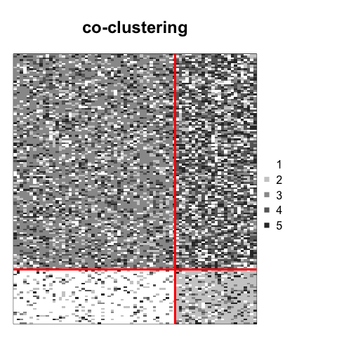
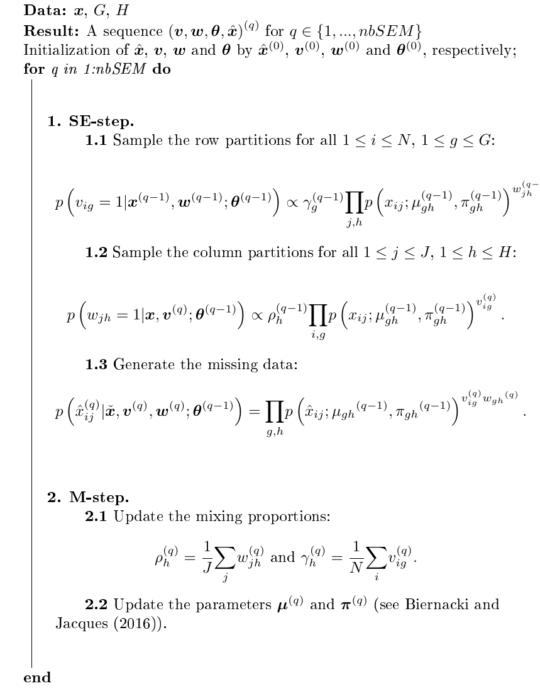

::: article
# Introduction

Ordinal data is a specific kind of categorical data occurring when the
levels are ordered [@Agresti12]. Some common contexts for the collection
of ordinal data include satisfaction surveys, aptitude and personality
tests and psychological questionnaires. In the present work, an ordinal
variable is represented by $x$ and it is considered to have $m$ levels
that are written $\left(1,...,m\right)$.

Thus far, ordinal data have received more attention from a supervised
point of view. For example: a marketing firm investigating which factors
influence the size of a soda (small, medium, large or extra large) that
people order at a fast-food chain. These factors may include which type
of sandwich is ordered (burger or chicken), whether or not fries are
also ordered, and the consumer's age. In this case, an observation
consists in factors of different types and the variable to predict is an
ordinal variable. Several software can analyze ordinal data in a
regression framework. The cumulative link model (CLM) assumes that:

$logit\left(p\left(x\leq \mu\right)\right)=\log\frac{p\left(x\leq \mu\right)}{1-p\left(x\leq \mu\right)} = \beta_{0}\left(\mu\right) + \boldsymbol{\beta}^t\boldsymbol{t}$,

where $x$ is the ordinal variable, $\mu$ is one of its levels,
$\boldsymbol{t}$ are the covariates, and
$\beta_0 \left(1\right) \leq \beta_0 \left(2\right) \leq \ldots \leq \beta_0 \left(m\right)$
. In the absence of covariates, it is equivalent to a multinomial model.
CLMs are a powerful model class for ordinal data since observations are
handled as categorical, their ordered nature is exploited and the
regression framework enables interpretable analyses. In R, several
packages implement this kind of models. The package
[*MASS*](https://CRAN.R-project.org/package=MASS) [@venables2002]
implements the CLM with standard link functions, while
[*VGAM*](https://CRAN.R-project.org/package=VGAM) [@Yee2010],
[*rms*](https://CRAN.R-project.org/package=rms) [@harrell2018],
[*brms*](https://CRAN.R-project.org/package=brms) [@burkner17] and
[*ordinal*](https://CRAN.R-project.org/package=ordinal) [@Christensen15]
bring additional functions and features. Other contributions implement
algorithms for ordinal data classification. For instance, the
[*ordinalForest*](https://CRAN.R-project.org/package=ordinalForest)
package [@Hornung19; @Hornung19b] uses ordinal forests and
[*monmlp*](https://CRAN.R-project.org/package=monmlp) [@cannon17] uses
neural networks, both to predict ordinal response variables. Finally,
the [*ocapis*](https://CRAN.R-project.org/package=ocapis) package
[@Gomez2019] implements several methods (such as CMLs, Support Machine,
Weighted k-Nearest-Neighbor) to classify and preprocess ordinal data.

However, the focus of these techniques differs from ours in two ways.
Firstly, they work in a supervised framework (classification). Secondly,
they work with datasets for which the variables to predict are ordinal
responses: the other variables are of various types. Our goal is to
provide a tool for unsupervised and supervised tasks, and for datasets
comprised only of ordinal variables only (in the classification context,
the response is categorical). From an unsupervised point a view, the
Latent Gold Software [@Vermunt06] is -- to our knowledge -- the only
software that uses the CMLs to cluster the data. Nevertheless, the
implementation of this method is known to be computationally expensive.
In addition, it is not provided through a user-friendly R package.

Other contributions have defined clustering algorithms with ordinal
variables. In [@McParland2013], the authors propose a model-based
technique by considering the probability distribution of ordinal data as
a discretization of an underlying continuous variable. This approach is
implemented in the
[*clustMD*](https://CRAN.R-project.org/package=clustMD) package
[@mcparland17], which is generally more for heterogeneous data. In
[@Ranalli16], the categorical variables are seen as a discretization of
an underlying finite mixture of Gaussians. In other works, the authors
use the multinomial distribution to model the data. For instance in the
case of [@Giordan11], the multinomial distribution and a cluster tree
are used, whereas [@jollois09] apply a constrained multinomial
distribution. However, these contributions do not provide a way to
co-cluster and classify ordinal data. Furthermore, they are not always
available as an R package (except in the case of [@McParland2013]). More
recently, [@Corneli20] proposed a method to co-cluster ordinal data
modeled via latent Gaussian random variables. Their package
[*ordinalLBM*](https://CRAN.R-project.org/package=ordinalLBM)
[@Corneli2020b] is available on CRAN.

Finally, the CUB (Combination of a discrete Uniform and a shifted
Binomial random variable) model [@Piccolo2003] is widely used to analyze
ordinal datasets. For instance, [@corduas2008] proposes a clustering
algorithm based on a mixture of CUB models. In the CUB model, an answer
is interpreted as the result of a cognitive process where the decision
is intrinsically continuous but is expressed on a discrete scale of $m$
levels. This approach interprets the choice of the respondent as a
weighted combination of two components. The first component reflects a
personal feeling and is expressed by a shifted binomial random variable.
The second component reflects an intrinsic uncertainty and is expressed
by a uniform random variable. Many extensions for the CUB model have
been defined and the [*CUB*](https://CRAN.R-project.org/package=CUB)
package [@Simone18] implements the associated statistical methods.

More recently, @biernacki16 proposed the so-called Binary Ordinal Search
model, referred to as the \"BOS\" model. It is a probability
distribution specific to ordinal data that is parameterized with
meaningful parameters $(\mu,\pi)$, linked to a position and precision
role, respectively. This work also describes how the BOS distribution
can be used to perform clustering on multivariate ordinal data.
@jacques17 then employed this distribution coupled to the Latent Block
Model [@Govaert2003] in order to carry out a co-clustering on ordinal
data. The co-clustering task consists of simultaneously clustering the
rows and the columns of the data matrix. It is a useful way of
clustering the data while introducing parsimony, and providing more
interpretable partitions. The authors in [@jacques17] showed that their
algorithm can easily deal with missing values. However, this model could
not take ordinal data with different numbers of levels into account.
@Selosse18 used an extension of the Latent Block Model to overcome this
issue. These works have proved their proficiency and also provide
efficient techniques to perform clustering and co-clustering of ordinal
data. The purpose of the *ordinalClust* package is to offer a complete
tool for analyzing ordinal data by implementing these methods.
Furthermore, it presents a novel approach for classifying ordinal
datasets with categorical responses. The present document gives an
overview of the underlying methods and illustrates usage of
*ordinalClust* through concrete examples. The paper is organized as
follows. In the section \"[2](#sec:stat-methods)\", the notation and
models are described. The section \"[3](#sec:appli)\" presents the
functions of *ordinalClust* and details a use case for psychological
survey datasets. The section \"[4](#sec:conclusion)\" discusses the
limits of *ordinalClust* and future work for the package.

# Statistical methods {#sec:stat-methods}

## Data Notation

A dataset of ordinal data will be written as
$\boldsymbol{x}=\left(x_{ij}\right)_{i,j}$, with $1 \leq i \leq N$ and
$1 \leq j \leq J$, $N$ and $J$ denoting the number of individuals and
the number of variables, respectively. Furthermore, a dataset can
contain missing data. While dealing with this aspect, the dataset will
be expressed by
$\boldsymbol{x} =\left(\boldsymbol{\check{x}},\boldsymbol{\hat{x}}\right)$,
with $\boldsymbol{\check{x}}$ being the observed data and
$\boldsymbol{\hat{x}}$ being the missing data. Consequently an element
of $\boldsymbol{x}$ will be annotated as follows:
$\check{x}_{ij}\text{, whether }{x}_{ij}\text{ is observed, }\hat{x}_{ij}\text{ otherwise}$.

## The BOS model {#sec:BOS}

The BOS model [@biernacki16] is a probability distribution for ordinal
data parameterized by a position parameter $\mu \in \{1,...,m\}$ and a
precision parameter $\pi \;\in\; [0,1]$. It was built on the assumption
that an ordinal variable is the result of a stochastic binary search
algorithm within the ordered table $\left(1,...,m\right)$. This
distribution rises from a uniform distribution when $\pi=0$ to a more
peaked distribution around the mode $\mu$ when $\pi$ grows, and reaches
a Dirac distribution at the mode $\mu$ when $\pi=1$.
Figure [1](#fig:bos) illustrates the shape of the BOS distribution with
different values of $\mu$ and $\pi$. In @biernacki16 it is shown that
the BOS distribution is a polynomial function of $\pi$ with degree $m-1$
whose coefficients depend on the position parameter $\mu$. For a
univariate ordinal variable, the path in a stochastic binary search can
be seen as a latent variable. Therefore, an efficient way to perform the
maximum likelihood estimation is through the EM algorithm [@Dempster77].

{#fig:bos width="100%"
alt="graphic without alt text"}

## The co-clustering model {#sec:coclust}

#### Notation

With this being in a co-clustering context, it is assumed that there are
$G$ row-clusters and $H$ column-clusters inherent to the
$\boldsymbol{x}$ matrix. It is therefore useful to introduce $g$ (or
$h$) which represents the $g^{th}$ (or $h^{th}$) row-cluster (or
column-cluster), with $1 \leq g \leq G$ (or $1 \leq h \leq H$). In
addition, the sums and the products related to rows, columns,
row-clusters and column-clusters will be subscripted using the letters
$i$, $j$, $g$ and $h$ respectively. Therefore, the sums and products
will be written as $\underset{i}{\sum}$, $\underset{j}{\sum}$,
$\underset{g}{\sum}$ and $\underset{h}{\sum}$, and
$\underset{i}{\prod}$, $\underset{j}{\prod}$, $\underset{g}{\prod}$ and
$\underset{h}{\prod}$.

#### Latent Block Model

Let us consider the data matrix
$\boldsymbol{x} = \left(x_{ij}\right)_{i,j}$. It is assumed that there
are $G$ row-clusters and $H$ column-clusters that correspond to a
partition $\boldsymbol{v}=\left(v_{ig}\right)_{i,g}$ and a partition
$\boldsymbol{w}=\left(w_{jh}\right)_{j,h}$ respectively, with
$1\leq g \leq G$ and $1\leq h \leq H$. We have noted that $v_{ig}=1$ if
$i$ belongs to cluster $g$, whereas $v_{ig}=0$ otherwise, and $w_{jh}=1$
when $j$ belongs to cluster $h$, but $w_{jh}=0$ otherwise. Each element
$x_{ij}$ is considered to be generated under a parameterized probability
density function $p\left(x_{ij};\alpha_{gh}\right)$. Here, $g$ denotes
the cluster of row $i$, and $h$ denotes the cluster of column $j$, while
$\alpha_{gh}$ represents the parameters of a probability density
function of block $\left(g,h\right)$, a block being the crossing of both
a row-cluster and a column-cluster. Figure [2](#fig:ex-coclustering) is
an example of co-clustering performed on an ordinal data matrix.

<figure id="fig:ex-coclustering">
<p></p>
<figcaption>Figure 2: Left: original dataset made of ordinal data with
<span class="math inline"><em>m</em> = 5</span>. Right: a co-clustering
is performed with <span
class="math inline"><em>G</em> = <em>H</em> = 2</span>, the rows and
columns are sorted by row-clusters and column clusters, which emphasizes
a structure in the dataset.</figcaption>
</figure>

The univariate random variables $x_{ij}$ are assumed to be conditionally
independent given the row and column partitions $\boldsymbol{v}$ and
$\boldsymbol{w}$. Therefore, the conditional probability density
function of $\boldsymbol{x}$ given $\boldsymbol{v}$ and $\boldsymbol{w}$
can be written as:

::: center
$p\left(\boldsymbol{x}|\boldsymbol{v},\boldsymbol{w};\boldsymbol{\alpha}\right) \;=\;
    \underset{i,j,g,h}{\prod}p\left(x_{ij};\alpha_{gh}\right)^{v_{ig}w_{jh}}$,
:::

where $\boldsymbol{\alpha}=\left(\alpha_{gh}\right)_{g,h}$ is the
distribution's parameters of block $\left(g,h\right)$. Any univariate
distribution can be used with respect to the kind of data (e.g:
Gaussian, Bernoulli, Poisson\...). In the *ordinalClust* package, the
BOS distribution is employed, thus
$\alpha_{gh} = \left(\mu_{gh}, \pi_{gh}\right)$. For convenience, the
label of row $i$ is also denoted by
$\boldsymbol{v}_{i}=\left(v_{i1},...,v_{iG}\right) \in \{0,1\}^{G}$.
Similarly, the label of column $j$ is denoted by
$\boldsymbol{w}_{j}=\left(w_{j1},...,w_{iH}\right) \in \{0,1\}^{H}$.
These latent variables $\boldsymbol{v}$ and $\boldsymbol{w}$ are assumed
to be independent so
$p\left(\boldsymbol{v},\boldsymbol{w};\boldsymbol{\gamma},\boldsymbol{\rho}\right) \;=\; p\left(\boldsymbol{v};\boldsymbol{\gamma}\right)p\left(\boldsymbol{w};\boldsymbol{\rho}\right)$
with:

::: center
$p\left(\boldsymbol{v};\boldsymbol{\gamma}\right)  \;=\;  
    \underset{i,g}{\prod}\gamma_{g}^{v_{ig}} \; \text{ and } \;
    p\left(\boldsymbol{w};\boldsymbol{\rho}\right)  \;=\; 
    \underset{j,h}{\prod}\rho_{h}^{w_{jh}}$,
:::

with the knowledge that $\gamma_g = p\left(v_{ig}=1\right)$ with
${g \in \{1,...,G\}}$ and $\rho_h = p\left(w_{jh}=1\right)$ with
$h \in \{1,...,H\}$. This implies that, for all $i$, the distribution of
$\boldsymbol{v}_i$ is the multinomial distribution
$\mathcal{M} \left(\gamma_1,...,\gamma_G\right)$ and does not depend on
$i$. In a similar way, for all $j$, the distribution of
$\boldsymbol{w}_j$ is the multinomial distribution
$\mathcal{M} \left(\rho_1,...,\rho_H\right)$ and does not depend on $j$.
From these considerations, the parameters of the latent block model are
defined as
$\boldsymbol\theta = \left(\boldsymbol{\gamma},\boldsymbol{\rho},\boldsymbol{\mu},\boldsymbol{\pi}\right)$,
with $\boldsymbol{\gamma} = \left(\gamma_1,...,\gamma_G\right)$ and
$\boldsymbol{\rho} = \left(\rho_1,...,\rho_H\right)$ as the mixing
proportions of the rows and columns;
$\boldsymbol{\mu} = \left(\mu_{gh}\right)_{g,h}$ and
$\boldsymbol{\pi} = \left(\pi_{gh}\right)_{g,h}$ are the distribution
parameters of the blocks. Therefore, if $V$ and $W$ are the sets of all
possible labels $\boldsymbol{v}$ and $\boldsymbol{w}$, the probability
density function $p\left(\boldsymbol{x};\boldsymbol{\theta}\right)$ of
$\boldsymbol{x}$ can be written as:
$$\label{eq:coclust}
  p\left(\boldsymbol{x};\boldsymbol{\theta}\right) \;=\;
  \underset{\left(\boldsymbol{v},\boldsymbol{w}\right) \in V\times W}{\sum} \;\;
    \underset{i,g}{\prod}\gamma_g^{v_{ig}}
    \underset{j,h}{\prod}\rho_h^{w_{jh}} 
    \underset{i,j,g,h}{\prod}p\left(x_{ij};\alpha_{gh}\right)^{v_{ig}w_{jh}}.   (\#eq:coclust)$$

#### Model Inference

In the co-clustering context, tha im of the inference is to maximize the
observed log-likelihood
$l\left(\boldsymbol{\theta};\check{\boldsymbol{x}}\right) = \underset{\hat{\boldsymbol{x}}}{\sum}\log p\left(\boldsymbol{x};\boldsymbol{\theta}\right)$.
The EM-algorithm [@Dempster77] is a very well known technique for
maximizing parameters with latent variables. However, with respect to
the co-clustering case, it is not computationally tractable. Indeed,
this method requires computation of the expectation of the complete data
log-likelihood. Nevertheless, this expression contains the probability
$p\left(v_{ig}=1,w_{jh}=1|\boldsymbol{x},\boldsymbol{\theta}\right)$,
which needs to take into account all the possible values for
$\boldsymbol{v}_{i'}$ and $\boldsymbol{w}_{j'}$ with $i'\neq i$ and
$j'\neq j$. The E-step would require calculation of $G^N \times H^J$
terms for each value of the data matrix. Using the values from the
section \"[3](#sec:appli)\", i.e., $G=3$, $H=3$, $N=117$ and $J=28$, it
would result in computation of
$3^{117} \times 3^{28} \approx 1\times 10^{69}$ terms. There are
different alternatives to the EM algorithm, such as the variational EM
algorithm, the SEM-Gibbs algorithm or other algorithms linked to a
Bayesian inference. The SEM-Gibbs version is used because it is known to
avoid spurious solutions [@keribin10]. Furthermore, it easily handles
missing values $\hat{\boldsymbol{x}}$ in $\boldsymbol{x}$, which is an
important advantage, particularly with real datasets. The SEM-algorithm
is made of two iteratively repeated steps that are detailed in
Algorithm [1](#algo:sem).

<figure id="algo:sem">


<figcaption>Algorithm 1: SEM-Gibbs for co-clustering on ordinal
data.</figcaption>
</figure>

#### Initializations

The *ordinalClust* package provides three modes for value
initialization. It is set through the argument `init`, which can take
values `’random’`, `’kmeans’` or `’randomBurnin’`. The first value
randomly initializes $\boldsymbol{v}^{\left(0\right)}$ and
$\boldsymbol{w}^{\left(0\right)}$ with the multinomial distribution
$\mathcal{M}\left(1/G,\ldots,1/G\right)$ and
$\mathcal{M}\left(1/H,\ldots,1/H\right)$, respectively. The second
argument (by default) value consists of performing a Kmeans algorithm
[@Hartigan79] on the rows and on the columns.

The third one, `’randomBurnin’` is a bit more complex and requires
additional arguments for the algorithm. It aims at avoiding a degeneracy
of the algorithm that leads to empty clusters, knowing that the
degeneracy event arises more often at the early stage of the algorithm
(thus during the burn-in period. This starts with a first random
initialization. However, for the first `nbSEMburn` iterations
(`nbSEMburn` $<$ `nbSEM`), whenever a row-cluster gets empty, a
percentage `percentRandomB` of the row partitions are resampled from the
multinomial distribution $\mathcal{M}\left(1/G,\ldots,1/G\right)$.
Similarly when a column-cluster gets empty, a percentage of the column
partitions are resampled from the multinomial distribution
$\mathcal{M}\left(1/H,\ldots,1/H\right)$.

#### Estimation of model parameters and partitions

The first iterations of the SEM-Gibbs are called the burn-in period,
which means that the parameters are not yet stable. Consequently, only
the iterations that occur after this burn-in period are taken into
account and are referred to as the \"sampling distribution\" hereafter.
While the final estimation of the position parameters
$\hat{\boldsymbol{\mu}}$ are the mode of the sampling distributions, the
final estimations of the continuous parameters
$\left(\hat{\pi},\hat{\boldsymbol{\gamma}},\hat{\boldsymbol{\rho}}\right)$
are the mean of the sample distribution. This leads to a final
estimation of $\boldsymbol{\theta}$ that is called
$\hat{\boldsymbol{\theta}}$. Then, a sample of
$\left(\hat{\boldsymbol{x}},\boldsymbol{v},\boldsymbol{w}\right)$ is
generated through several SE-steps (step **1.** from
Algorithm [1](#algo:sem)) with $\boldsymbol{\theta}$ fixed to
$\hat{\boldsymbol{\theta}}$. The final partitions
$\left(\hat{\boldsymbol{v}},\hat{\boldsymbol{w}}\right)$ and the missing
observations $\hat{\boldsymbol{x}}$ are estimated by the mode of their
sample distribution.

#### Model Selection

To determine how many row-clusters and how many column-clusters are
necessary, an adaptation of the ICL criterion [@Biernacki00], called
ICL-BIC, is proposed in @jacques17. In practice, the algorithm must be
executed with all the $\left(G,H\right)$ to test, and the highest
ICL-BIC is retained.

## The clustering model

The clustering model described in this section is a particular case of
the co-clustering model, in which each feature is in its own cluster
($H=J$). Consequently, $\boldsymbol{w}$ is no longer a latent variable
since each feature represents a cluster of size $1$. Let us define a
multivariate ordinal variable $\boldsymbol{x}_i = \left(x_{ij}\right)_j$
with $1\leq j \leq J$. Conditionally to cluster $g$, the distribution of
$\boldsymbol{x}_i$ is assumed to be:

$p\left(\boldsymbol{x}_i|v_{ig}=1;\boldsymbol{\mu}_g,\boldsymbol{\pi}_g\right) = \underset{j}{\prod}p\left(x_{ij};\mu_{gj},\pi_{gj}\right),$

where $\boldsymbol{\mu}_g=\left(\mu_{gj}\right)_j$ and
$\boldsymbol{\pi}_g=\left(\pi_{gj}\right)_j$ with $1\leq j \leq J$. This
conditional independence hypothesis assumes that conditional to
belonging to row-cluster $g$, the $J$ ordinal responses of an individual
are independently drawn from $J$ univariate BOS models of parameters
$\left(\mu_{gj},\pi_{gj}\right)_{j \in \{1,...,J\}}$. Furthermore, as in
the co-clustering case, the distribution of $\boldsymbol{v}_i$ is
assumed to be a multinomial distribution
$\mathcal{M} \left(\gamma_1,...,\gamma_G\right)$ and not dependent on
$i$. In this configuration, the parameters of the clustering model are
defined as
$\boldsymbol\theta = \left(\boldsymbol{\gamma},\boldsymbol{\alpha}\right)$,
with $\alpha_{gj} = \left(\mu_{gj}, \pi_{gj}\right)$ being the position
and precision BOS parameters of the row-cluster $g$ and ordinal variable
$j$. Consequently, with a matrix
$\boldsymbol{x}=\left(x_{ij}\right)_{i,j}$ of ordinal data, the
probability density function
$p\left(\boldsymbol{x};\boldsymbol{\theta}\right)$ of $\boldsymbol{x}$
is written as:
$$\label{eq:clust}
  p\left(\boldsymbol{x};\boldsymbol{\theta}\right) \;=\;
  \underset{\boldsymbol{v} \in V}{\sum} \;\;
    \underset{i,g}{\prod}\gamma_g^{v_{ig}} 
    \underset{i,j,g}{\prod}p\left(x_{ij};\mu_{gj},\pi_{gj}\right)^{v_{ig}}.   (\#eq:clust)$$

To infer the parameters of this model, the SEM-Gibbs
Algorithm [1](#algo:sem) is used with the part in **1.2** removed from
the SE-step. The part in **1.3** relating to missing value imputation
also remains. It is noted here that clustering can also be achieved by
using the co-clustering model in section \"[2.3](#sec:coclust)\", and by
considering the resulting $\boldsymbol{v}$ partition as the outcome. As
a matter of fact, in this case, the co-clustering is a parsimonious
version of the clustering procedure.

## The classification model

By considering a classification task with a categorical variable to
predict from ordinal data, the configuration encountered is a particular
case where $\boldsymbol{v}$ is known for all $i \in \{1,...,N\}$ and for
all $g \in \{1,...,G\}$. In *ordinalClust*, two classification models
are provided.

#### Multivariate BOS model

This first model is similar to the clustering model: each variable
represents a column-cluster of size 1, thus $\boldsymbol{w}$ is not a
latent variable. This model assumes that, conditional on the class of
the observations, the $J$ variables are independent. Since the row
classes are observed, the algorithm only needs to estimate the parameter
$\boldsymbol{\theta}$ that maximizes the log-likelihood
$l\left(\boldsymbol{\theta};\check{\boldsymbol{x}}\right)$. The
probability density function
$p\left(\boldsymbol{x},\boldsymbol{v};\boldsymbol{\theta}\right)$ is
therefore expressed as below:

$$\label{eq:classif1}
  p\left(\boldsymbol{x},\boldsymbol{v};\boldsymbol{\theta}\right) \;=\;
  \underset{i,g}{\prod}\gamma_g^{v_{ig}} 
    \underset{i,j,g}{\prod}p\left(x_{ij};\alpha_{gj}\right)^{v_{ig}}.   (\#eq:classif1)$$

The inference of this model's parameters only requires the M-step of
Algorithm [1](#algo:sem). However, if there are missing data, the
SE-step made of the part in **1.3** only is also required.

#### Parsimonious BOS model

This model is a parsimonious version of the first model. Parsimony is
introduced by grouping the features into $H$ clusters (as in the
co-clustering model). The main hypothesis is that given the row-cluster
partitions and the column-cluster partitions, the realization of
$x_{ij}$ is independent from the other ones. In practice the number $H$
of column-clusters is chosen with a training dataset and a validation
dataset. Consequently, the probability density function
$p\left(\boldsymbol{x,v};\boldsymbol{\theta}\right)$ is annotated:

$$\label{eq:classif2}
  p\left(\boldsymbol{x},\boldsymbol{v};\boldsymbol{\theta}\right) \;=\;
  \underset{\boldsymbol{w} \in W}{\sum} \;\;
    \underset{i,g}{\prod}\gamma_g^{v_{ig}}
    \underset{j,h}{\prod}\rho_h^{w_{jh}} 
    \underset{i,j,g,h}{\prod}p\left(x_{ij};\alpha_{gh}\right)^{v_{ig}w_{jh}}.   (\#eq:classif2)$$

To infer this model's parameters, Algorithm [1](#algo:sem) is used with
an SE-step only containing the part in **1.2**, and the entire M-step.
Again, if there are missing data, the SE-step made of the part in
**1.3** is also required.

## Handling ordinal data with several numbers of levels {#sec:diff-m}

The Latent Block Model as described before cannot take variables with
different numbers of levels $m$ into account. Indeed, the distributions
of variables with different numbers of levels are not defined on the
same support. This implies that it is impossible to gather two variables
with different $m$ within a same block.

In @Selosse18, a constrained Latent Block Model is provided. Although it
does not allow ordinal features with different numbers of levels to be
gathered in a same column-cluster, it is able to take into account the
fact that there are several numbers of levels and to perform a
co-clustering on more diverse datasets. The matrix $\boldsymbol{x}$ is
considered to contain $D$ different numbers of levels. Its
representation is seen as $D$ matrices placed side by side, such that
the $d^{th}$ table is a $N\times J_d$ matrix written as
$\boldsymbol{x^d}$ and composed of ordinal data with numbers of levels
$m_d$ (see Figure [3](#fig:mat-diff-m)). 

$\boldsymbol{x} = 
  \begin{bmatrix} 
    \begin{bmatrix} 
      \;\; & \;\; & \;\;\\ 
      \;\; & \;\; & \;\;\\ 
      \;\; & \boldsymbol{x}^1 &  \;\; \\
      \;\; & \;\; & \;\; \\
      \;\; & \;\; & \;\;
    \end{bmatrix}
    \;\; ... \;\;
    \begin{bmatrix} 
      \;\; & \;\; & \;\;\\ 
      \;\; & \;\; & \;\;\\ 
      \;\; & \boldsymbol{x}^D &  \;\; \\
      \;\; & \;\; & \;\; \\
      \;\; & \;\; & \;\;
    \end{bmatrix}
  \end{bmatrix}$, with
$\boldsymbol{x}^d = \left(x^d_{ij}\right)_{i=1,...,N; \; j=1,...,J_d}$.

<figure id="fig:mat-diff-m">
<figcaption>Figure 3: Data set matrix <span class="math inline"><mjx-container class="MathJax CtxtMenu_Attached_0" jax="CHTML" style="font-size: 117.8%; position: relative;" tabindex="0" ctxtmenu_counter="206"><mjx-math class="MJX-TEX" aria-hidden="true"><mjx-mi class="mjx-b mjx-i"><mjx-c class="mjx-c1D499 TEX-BI"></mjx-c></mjx-mi></mjx-math><mjx-assistive-mml unselectable="on" display="inline"><math xmlns="http://www.w3.org/1998/Math/MathML"><mi mathvariant="bold-italic">x</mi></math></mjx-assistive-mml></mjx-container></span> when the ordinal data has
<span class="math inline"><mjx-container class="MathJax CtxtMenu_Attached_0" jax="CHTML" style="font-size: 117.8%; position: relative;" tabindex="0" ctxtmenu_counter="207"><mjx-math class="MJX-TEX" aria-hidden="true"><mjx-mi class="mjx-i"><mjx-c class="mjx-c1D437 TEX-I"></mjx-c></mjx-mi></mjx-math><mjx-assistive-mml unselectable="on" display="inline"><math xmlns="http://www.w3.org/1998/Math/MathML"><mi>D</mi></math></mjx-assistive-mml></mjx-container></span> numbers of levels.</figcaption>
</figure>


The model relies on the following hypothesis:

$p\left(\boldsymbol{x}^1,...\boldsymbol{x}^D|\boldsymbol{v},\boldsymbol{w}^1,...,\boldsymbol{w}^D\right) = p\left(\boldsymbol{x}^1|\boldsymbol{v},\boldsymbol{w}^1\right) \times ... \times p\left(\boldsymbol{x}^D|\boldsymbol{v},\boldsymbol{w}^D\right)$,

with $\boldsymbol{w}^d$ the column partition of $\boldsymbol{x}^d$. This
means that there is independence between the $D$ blocks, knowing their
row and column partitions: the realization of the univariate random
variable $x^d_{ij}$ will not depend on the column partitions of the
other blocks than $d$.

In this case, the SEM-Gibbs algorithm is slightly changed: in the
SE-step, a sampling step is appended for every additional
$\boldsymbol{x}^d$. For further details on this adapted SEM-Gibbs
algorithm, see @Selosse18.

# Application to the patients quality of life analysis in oncology {#sec:appli}

This section explains how to use the implementation of the methods
described before through the *ordinalClust* package. Users should be
aware that the code provided was run with R 3.5.3, and that the results
could be different with another version. If users wish to use a version
of R $\geq 3.6.0$ and reproduce the same results as in the paper, they
should run the command `RNGkind(sample.kind=’Rounding’)` before running
the code.

## Data sets

The datasets included were part of the *QoLR* package [@Anota17]. They
contain responses to the well known \"EORTC QLQ-C30\" (European
Organization for Research and Treatment of Cancer (EORTC) Quality of
Life Questionnaire (QLQ-C30)), provided to patients affected by breast
cancer. Furthermore, for all questions, the most positive answer is
given by a level \"1\". For example, for question: *\"During the past
week, did you feel irritable?\"* with possible responses: *\"Not at
all.\"* *\"A little.\"* *\"Quite a bit.\"* *\"Very much.\"*, the
following level numbers are assigned to the replies: 1 *\"Not at
all.\"*, 2 *\"A little.\"*, 3 *\"Quite a bit.\"*, 4 *\"Very much.\"*,
because it is perceived as more negative to have felt irritable. Two
datasets are available:

-   `dataqol` is a dataframe with 117 lines such that each line
    represents a patient and the columns contain information about the
    patient:
    -   `Id`: patient Id,
    -   `q1-q28`: responses to 28 questions with the number of levels
        equals to 4,
    -   `q29-q30`: responses to 2 questions with the number of levels
        equals to 7.
-   `dataqol.classif` is a dataframe with 40 lines such that a line
    represents a patient, and the columns contain information about the
    patient:
    -   `Id`: patient Id,
    -   `q1-q28`: responses to 28 questions with the number of levels
        equals to 4,
    -   `q29-q30`: responses to 2 questions with the number of levels
        equals to 7,
    -   `death`: if the patient passed away (2) or not (1).

The datasets contain missing values, coded as `NA`: in `dataqol`,
$1.1\%$ are missing values and $3.6\%$ in `dataqol.classif`. To load the
package and its datasets, the following commands must be executed:

``` r
library(ordinalClust)
data("dataqol")
data("dataqol.classif")
```

Then, a seed is set so that users can obtain results identical to this
document:

``` r
set.seed(1)
```

Users must define how many SEM-Gibbs iterations (`nbSEM`) and how many
burn-in iterations (`nbSEMburn`) are needed for
Algorithm [1](#algo:sem). The section \"[3.7](#sec:checkp)\" provides an
empirical way of checking correctness of these values. Moreover, the
`nbindmini` argument must be defined: it indicates the minimum number of
elements that must be present in a block. Finally, the `init` argument
indicates how to initialize the algorithm. It can be set to `"kmeans"`,
`"random"` or `"randomBurnin"`.

``` r
nbSEM <- 150
nbSEMburn <- 100
nbindmini <- 1
init <- "randomBurnin"
percentRandomB <- c(50, 50)
```

Here, `percentRandom` is a vector because it defines two percentages:
the percentage of rows that will be resampled if a row-cluster is
emptied, and the percentage of columns that will be resampled if a
column-cluster is emptied.

## Performing classification {#sec:classif}

In this section, the `dataqol.classif` dataset is used. The aim is to
predict the `death` variable from the ordinal data that corresponds to
the patients answers. The following commands show how to setup the
classification configuration. First, the $\boldsymbol{x}$ ordinal data
matrix (the responses to the questionnaires) is defined, as well as the
$\boldsymbol{v}$ vector, which is the variable `death` to predict.

``` r
x <- as.matrix(dataqol.classif[,2:29])
v <- dataqol.classif$death
```

*ordinalClust* provides two classification models. The first model
(chosen by the option `kc=0`) is a multivariate BOS model with the
assumption that, conditional on the class of the observations, the
features are independent as in Equation \@ref(eq:classif1). The second
model introduces parsimony by grouping the features into clusters and
assuming that the features of a cluster have a common distribution, as
in Equation \@ref(eq:classif2). This latter is a novel approach for
classification. The number $H$ of clusters of features is defined with
the argument `kc = H`. $H$ is selected using a training dataset and a
validation dataset:

``` r
# sampling datasets for training and to predict
nb.sample <- ceiling(nrow(x)*7/10)
sample.train <- sample(1:nrow(x), nb.sample, replace=FALSE)

x.train <- x[sample.train,]
x.validation <- x[-sample.train,]

v.train <- v[sample.train]
v.validation <- v[-sample.train]
```

We also indicate how many classes there are, and how many levels the
ordinal data have:

``` r
# classes
kr <- 2
# levels
m <- 4
```

The training can be performed using the function `bosclassif`. In the
code below, several `kc` parameters are tested. When `kc = 0`, the
multivariate model is used: all variables are considered to be
independent. When `kc > 0`, the parsimonious model is used: the
variables are grouped into `kc` groups. To classify new observations,
the `predict` function is used: it takes as arguments the result from
`bosclassif` and the observations to classify. In the following example,
we store in the `preds` matrix the predictions resulting from the
classifications performed with different `kc`.

``` r
kcol <- c(0, 1, 2, 3, 4)
preds <- matrix(0, nrow = length(kcol), ncol = nrow(x.validation))

for( kc in 1:length(kcol) ){
  classif <- bosclassif(x = x.train, y = v.train, kr = kr, kc = kcol[kc],
                m = m, nbSEM = nbSEM, nbSEMburn = nbSEMburn, 
                nbindmini = nbindmini, init = init,
                percentRandomB = percentRandomB)
  new.prediction <- predict(classif, x.validation)
  if(!is.character(new.prediction)){
       preds[kc,] <- new.prediction@zr_topredict
  }
}
```

Then the `preds` matrix can be formatted to a dataframe:

``` r
preds <- as.data.frame(preds)
row.names <- paste0("kc = ", kcol)
rownames(preds) <- row.names

preds
v.validation
```

``` r
> preds
     V1 V2 V3 V4 V5 V6 V7 V8 V9 V10 V11 V12
kc=0  2  1  2  2  2  2  1  1  1   2   1   2
kc=1  2  1  2  1  2  2  1  2  1   1   2   2
kc=2  2  1  2  2  2  2  1  2  1   2   2   2
kc=3  2  1  2  1  2  2  1  2  1   2   1   2
kc=4  1  1  2  1  1  1  1  2  1   2   1   2
> v.validation
 [1] 2 1 1 1 1 1 1 2 1 1 1 2
```

Table [1](#table:prs) shows the sensitivity and specificity for each
different `kc`. The code to get these values is available in the
Appendix \"[4.1](#sec:appendix-spec-sens)\". First of all, the results
are globally satisfying since the sensitivities and specificities are
quite high. We observe that the parsimonious models (when
`kc = 1,2,3,4`) have better results than the multivariate model
(`kc = 0`). The two parsimonious models `kc = 1` and `kc = 3` obtain the
best results. This illustrates the interest of introducing parsimonious
models in a supervised context. However, users should be aware that the
dataset is small, and the number of observations used here is too low to
draw definitive conclusions.

::: {#table:prs}
  ------------------------------------
            sensitivity   specificity
  -------- ------------- -------------
   kc = 0      0.67          0.44

   kc = 1    **1.00**      **0.56**

   kc = 2      1.00          0.33

   kc = 3    **1.00**      **0.56**

   kc = 4      0.78          0.67
  ------------------------------------

  : Table 1: Sensitivity and specificity for different `kc`.
:::

## Performing clustering {#sec:appli-clust}

#### Clustering setting.

This section uses the `dataqol` dataset, plotted in
Figure [4](#fig:original).

{#fig:original
width="100%" alt="graphic without alt text"}

The purpose of clustering is to emphasize information regarding the rows
of a data matrix. First, the $\boldsymbol{x}$ ordinal matrix is loaded,
which corresponds to the patients' responses:

``` r
set.seed(1)
x <- as.matrix(dataqol[,2:29])
```

The clustering is obtained using the `bosclust` function:

``` r
clust <- bosclust(x = x, kr = 3, m = 4, 
            nbSEM = nbSEM, nbSEMburn = nbSEMburn, 
            nbindmini = nbindmini, init = init)
```

The outcome can be plotted using the `plot` function:

``` r
 plot(clust)
```

{#fig:clust width="100%"
alt="graphic without alt text"}

Figure [5](#fig:clust) represents the clustering result. We count the
clusters from the bottom to the top. Among the $3$ row-clusters, the
first one (at the bottom) stands out as the lightest. This means that
the patients from this cluster globally chose levels close to $1$, which
is the most positive answer. In contrast, the third row-cluster (at the
top) is darker, which implies the patients from this group answered in a
more negative way.

#### Clusters interpretation.

The parameters are obtained with the command `clust@params`:

``` r
> clust@params
[[1]]
[[1]]$mus
     [,1] [,2] [,3] [,4] [,5] [,6] [,7] [,8] [,9] [,10] [,11] [,12] [,13] [,14]
[1,]    1    1    1    1    1    1    1    1    1     2     1     2     1     1
[2,]    2    2    1    1    1    2    1    1    2     2     1     3     2     1
[3,]    3    4    3    3    1    4    3    2    3     4     2     4     3     4
     [,15] [,16] [,17] [,18] [,19] [,20] [,21] [,22] [,23] [,24] [,25] [,26]
[1,]     1     1     1     2     1     1     1     2     1     1     1     1
[2,]     1     1     1     2     2     1     2     2     1     2     1     1
[3,]     1     1     1     4     3     3     3     3     2     2     2     3
     [,27] [,28]
[1,]     1     1
[2,]     1     1
[3,]     4     1

[[1]]$pis
          [,1]      [,2]     [,3]      [,4] [,5]      [,6]      [,7]      [,8]
[1,] 0.8079608 0.6673682 0.961979 0.7770536    1 0.9619790 1.0000000 0.8852379
[2,] 0.3946294 0.3736864 0.722322 0.4690402    1 0.3567357 0.5546162 0.6402318
[3,] 0.4319502 0.5928978 0.347433 0.4930463    1 0.2718517 0.5888644 0.3310052
          [,9]     [,10]     [,11]     [,12]     [,13]     [,14]     [,15]
[1,] 0.9246885 0.5903583 0.6951631 0.5438752 0.9226941 0.4932884 0.8825371
[2,] 0.4767814 0.6937982 0.1481492 0.1859040 0.1176366 0.6624020 0.7916167
[3,] 0.3220447 0.7079570 0.4084469 0.5779180 0.5745136 0.1691940 0.3161048
         [,16]     [,17]     [,18]     [,19]     [,20]     [,21]     [,22]
[1,] 0.8036703 0.7364791 0.6643935 1.0000000 0.9619790 0.6951631 0.5681893
[2,] 0.3054584 0.8394348 0.5440131 0.3395749 0.4757433 0.4142450 0.3805989
[3,] 0.1255990 0.4281432 0.5470879 0.4280508 0.2300193 0.5776385 0.2632960
         [,23]     [,24]     [,25]     [,26]     [,27]     [,28]
[1,] 0.4905033 0.5510665 0.8167944 0.7477762 0.8521366 0.9226941
[2,] 0.3870155 0.4064222 0.6484691 0.4666815 0.3530825 0.6599010
[3,] 0.4183768 0.4709545 0.1959082 0.5465595 0.6419857 0.4174326
```

`clust@params` is a list: when the data have $D$ numbers of levels as in
Figure [3](#fig:mat-diff-m), the list is $D-$long. Here the data has
only one number of levels, so `clust@params` has one element. Each
element of the list has two attributes, `pis` and `mus`. They indicate
the $\pi$ and $\mu$ values for each row-cluster and each column. Here,
we see that, as observed with Figure [5](#fig:clust), the first
row-cluster has globally lower parameters $\mu$, which means that people
from this cluster globally answered in a more positive way to the
questions. We also note that the $\pi$ parameters for the fifth variable
(the fifth question) are all equal to $1$. This means that the
dispersion around the position $\mu$ is null. When observing the $\mu$
parameters for the fifth variables, they are also all equal to $1$. This
means that everybody answered in a positive way to this question. The
fifth question of the EORTC QLQ-C30 questionnaire is \"Do you need help
with eating, dressing, washing yourself or using the toilet?\".
Therefore, we know that none of the participants had problems getting
ready and eating the week before they answered the questionnaire.

#### Choosing $G$.

In the example above, the choice for $G$ was made by performing several
clustering with $G=(2,3,4)$. Using the command `clust@icl`, we can find
out which result has the highest ICL value. The $G$ with the highest
ICL-BIC was retained, that is to say $G=3$. The code to perform these
clusterings is available in the
Appendix \"[4.2](#sec:appendix-icl-clust)\".

## Performing co-clustering {#sec:appli-coclust}

#### Co-clustering setting.

Once again, this section uses the `dataqol` dataset. The co-clustering
is performed using the `boscoclust` function:

``` r
set.seed(1)
coclust <- boscoclust(x = x, kr = 3, kc = 3, m = 4,
                nbSEM = nbSEM, nbSEMburn = nbSEMburn,
                nbindmini = nbindmini, init = init)
```

As in the clustering context, the result can be plotted with the command
below, as in Figure [6](#fig:coclust).

``` r
plot(coclust)
```

{#fig:coclust width="100%"
alt="graphic without alt text"}

In this case, the algorithm highlights a structure amid the rows, as for
the clustering Figure [5](#fig:clust). In addition, it also reveals a
structure inherent to the columns: for example, the third column-cluster
is lighter than the others, consequently, these questions were globally
responded to in a more positive way.

#### Co-clusters interpretation.

Once again, the parameters of the co-clustering are available through
the command `coclust@params`:

``` r
> coclust@params
[[1]]
[[1]]$mus
     [,1] [,2] [,3]
[1,]    1    1    1
[2,]    1    2    1
[3,]    3    3    1

[[1]]$pis
          [,1]      [,2]      [,3]
[1,] 0.8496224 0.6266097 0.9426305
[2,] 0.4876194 0.5340329 0.7722278
[3,] 0.2638594 0.3044552 0.3623779
```

In order to find out which questions belong to the third column-cluster
(the one whose corresponding blocks are lighter), we need the command
`coclust@zc`, which indicates the column-cluster of each column.
`coclust@zc` is also a list of length $D$ (when we have different
numbers of levels). Here, $D=1$ so we need `coclust@zc[[1]]`:

``` r
which(coclust@zc[[1]] == 3)
[1]  3  5  8 15 17 25 28
```

We know that questions 3, 5, 8, 15, 17, 25 and 28 are globally the ones
that were answered the more positively. Here is the list of these
questions in the EORTC QLQ C30:

-   3\. Do you have any trouble taking a [short]{.underline} walk
    outside of the house?
-   5\. Do you need help with eating, dressing, washing yourself or
    using the toilet?
-   8\. During the past week, were you short of breath?
-   15\. During the past week, have you vomited??
-   17\. During the past week, have you had diarrhea?
-   25\. During the past week, have you had difficulty remembering
    things?
-   28\. During the past week, has your physical condition or medical
    treatment caused you financial difficulties?

#### Choosing $G$ and $H$.

In the examples above, the choice for $G$ and $H$ were made by
performing several co-clusterings with $G=(2,3,4)$ and $H=(2,3,4)$. In
both cases, the couple $(G,H)$ with the highest ICL-BIC value was
retained, i.e., for $(G,H)=(3,3)$. The code to search the highest ICL
value is given in the Appendix \"[4.3](#sec:appendix-icl-coclust)\"[^1].

## Missing values.

In this section we use the `dataqol` dataset. It has $1.1\%$ missing
values ($40$ elements are missing in the matrix). The SEM-algorithm can
handle these values since at each Expectation step (see
Algorithm [1](#algo:sem), which computes the expectation of the missing
values. The following code obtains the index of the missing values and
prints their values imputed by the clustering (or co-clustering)
algorithm in the Section \"[3.4](#sec:appli-coclust)\" (or the
Section \"[3.3](#sec:appli-clust)\").

``` r
missing <- which(is.na(x))
missing

values.imputed.clust <- clust@xhat[[1]][missing]
values.imputed.clust

values.imputed.coclust <- coclust@xhat[[1]][missing]
values.imputed.coclust
```

``` r
> missing
 [1]  148  177  278  352  380  440  450  559  996 1058 1496 1513 1611 1883 1981
[16] 2046 2047 2050 2085 2285 2402 2450 2514 2517 2518 2663 2754 2785 2900 2902
[31] 2982 2986 3060 3152 3366 3367 3368 3520 3572 3602
> values.imputed.clust
 [1] 4 4 4 1 1 1 4 4 1 4 4 4 4 1 4 1 1 1 4 4 4 4 4 4 4 4 4 4 4 4 1 1 1 4 1 1 1
> values.imputed.coclust
 [1] 2 2 2 2 2 2 2 2 2 2 2 2 2 2 2 2 2 2 2 2 2 2 2 2 2 2 2 2 2 2 2 2 2 2 2 2 2
```

We see that the co-clustering and the clustering algorithm had different
values imputed for the missing data.

## Comparison of clustering and co-clustering.

#### Co-clustering as parsimonious clustering.

Co-clustering can be seen as a parsimonious way of performing
clustering, which is why these two techniques are compared here. For
example, the interpretation of row-clusters is more precise with the
co-clustering. Indeed, in Figure [5](#fig:clust), the row-clusters can
be seen as a group of people who globally replied positively, a group of
people who replied negatively, and a third group that replied in
between. On the other hand, in Figure [6](#fig:coclust), an inherent
structure of the data is better highlighted and adds more information:
for each row-cluster, it is also easy to detect the questions that were
replied to negatively. Co-clustering can therefore be seen as a more
efficient way of performing clustering. Furthermore the interpretation
of the parameters was easier with the co-clustering result because it
only had $18$ parameters: $kr \times kc$ for $\boldsymbol\pi$ and
$kr \times kc$ for $\boldsymbol\mu$. The clustering result had $168$
parameters ($kr \times J$ for $\boldsymbol\pi$ and $kr \times J$ for
$\boldsymbol\mu$), which is a lot to process for the user.

#### ARI values on row partitions

The Adjusted Rand Index [@Rand71] was computed on row partitions of
co-clustering and clustering results, using the package
[*mclust*](https://CRAN.R-project.org/package=mclust) [@Fraley19].

``` r
mclust::adjustedRandIndex(coclust@zr, clust@zr)
```

The value obtained is `0.41`, meaning that co-clustering creates a row
partition related to that created by the clustering, without being
identical.

## Setting the SEMburn and nbSEMburn arguments {#sec:checkp}

The SEM-algorithm can be slow at reaching its stationary state,
depending on the dataset. After having chosen arbitrary `nbSEM` and
`nbSEMburn` arguments (in practice at least higher than $50$), the
stability of the algorithm has to be verified. For this reason, all the
functions of the *ordinalClust* package also return parameters
estimations at each iteration of the SEM-algorithm. Indeed, the
`pichain`, `rhochain` and `paramschain` slots represent the
$\boldsymbol{\gamma}$, $\boldsymbol{\rho}$ and $\boldsymbol{\alpha}$
values, respectively, for each iteration. As a result, the evolution of
the parameters can be analyzed and users can be confident that the
returned parameters are well estimated. In the co-clustering case, for
example, the evolution of the parameters can be visualized through a
plot:

``` r
par(mfrow=c(3,3))
for(kr in 1:3){
    for(kc in 1:3){
        toplot <- rep(0, nbSEM)
        for(i in 1:nbSEM){
            toadd <- coclust@paramschain[[1]]$pis[kr,kc,i]
            toplot <- c(toplot, toadd)
        }
        plot.default(toplot, type = "l",ylim = c(0,1), 
                 col = "hotpink3", main = "pi", 
                 ylab = paste0("pi_", kr, kc, "values"), 
                 xlab = "SEM-Gibbs iterations")
    }
}
```

{#fig:conv width="100%"
alt="graphic without alt text"}

In Figure [7](#fig:conv), we observe that the parameters reach their
stationary state before the $100^{th}$ iteration. In this case, a
burn-in period of $100$ iterations (corresponding to `nbSEMburn=100`) is
therefore enough. The total number of iterations corresponds to the
argument `nbSEM=150`, so $50$ iterations are used to approximate the
parameters.

## Handling data with different numbers of levels

If users wish to execute one of the functions described previously on
variables with different $m$, then they should use the same function
with some changes to the arguments definitions. Let us assume that the
data is made of $D$ different numbers of levels. First of all, the
columns of matrix matrix `x` must be grouped by same number of levels
`m[d]`. The additional changes for the arguments to pass are listed
below:

-   `m` must be a vector of length $D$. The $d^{th}$ element indicates
    the number of levels for the $d^{th}$ group of variables.
-   `kc` must be a vector of length $D$. The $d^{th}$ element indicates
    the number of column-clusters for the $d^{th}$ group of variables.
-   `idx_list` is a new vector argument of length $D$. The $d^{th}$ item
    of the vector indicates the index of the first column that have the
    number of levels `m[d]`.

An example on the `dataqol` dataset is available in the
Appendix \"[4.4](#sec:appendix-diff-m)\".

# Conclusion {#sec:conclusion}

The *ordinalClust* package presented in this paper implements several
methods for analyzing ordinal data. First, it implements a clustering
and co-clustering framework based on the Latent Block Model, coupled
with a SEM-Gibbs algorithm and the BOS distribution. Moreover, it
defines a novel approach to classify ordinal data. For the
classification method, two models are proposed, so that users can
introduce parsimony in their analyses. Similarly, it has been shown that
the co-clustering method provides a parsimonious way of performing
clustering. The framework is able to handle missing values which is
notably relevant in the case of real datasets. Finally, these techniques
are also implemented in the case of dataset with ordinal data with
several numbers of levels. The package *ordinalClust* is available on
the Comprehensive R Archive Network (CRAN), and is still under active
development. A future work will implement the method defined in
@gelman92, to automatically define the number of iterations of the
SEM-Gibbs algorithm.

## Specificity and sensitivity {#sec:appendix-spec-sens}

The following code computes the specificities, and sensitivities
obtained with the different `kc` in the section \"[3.2](#sec:classif)\":

``` r
library(caret)

actual <- v.validation - 1

specificities <- rep(0,length(kcol))
sensitivities <- rep(0,length(kcol))

for(i in 1:length(kcol)){
  prediction <- unlist(as.vector(preds[i,])) - 1
  u <- union(prediction, actual)
  conf_matrix <- table(factor(prediction, u),factor(actual, u))
  sensitivities[i] <- recall(conf_matrix)
  specificities[i] <- specificity(conf_matrix)
}

sensitivities
specificities
```

``` r
> sensitivities
[1] 0.6666667 1.0000000 1.0000000 1.0000000 0.7777778
> specificities
[1] 0.4444444 0.5555556 0.3333333 0.5555556 0.6666667
```

## ICL search for clustering {#sec:appendix-icl-clust}

``` r
set.seed(1)

library(ordinalClust)
data("dataqol")
M <- as.matrix(dataqol[,2:29])

nbSEM <- 150
nbSEMburn <- 100
nbindmini <- 2
init <- "randomBurnin"
percentRandomB <- c(50)
icl <- rep(0,3)

for(kr in 2:4){
    object <- bosclust(x = M, kr = kr, m = 4, nbSEM = nbSEM,
                nbSEMburn = nbSEMburn, nbindmini = nbindmini, 
                percentRandomB = percentRandomB, init = init)

    if(length(object@icl)) icl[kr-1] <- object@icl  
}
icl
```

``` r
> icl
[1] -3713.311 -3192.351 0   
```

We see that the clustering algorithm could not find a solution without
an empty cluster for `kr = 4`. The highest icl is for `kr = 3`.

## ICL search for co-clustering {#sec:appendix-icl-coclust}

``` r
set.seed(1)
library(ordinalClust)
data("dataqol")
M <- as.matrix(dataqol[,2:29])

nbSEM <- 150
nbSEMburn <- 100
nbindmini <- 2
init <-  "randomBurnin"
percentRandomB <- c(50, 50)
icl <- matrix(0, nrow = 3, ncol = 3)

for(kr in 2:4){
    for(kc in 2:4){
        object <- boscoclust(x = M,kr = kr, kc = kc, m = 4, nbSEM = nbSEM,  
                        nbSEMburn = nbSEMburn, nbindmini = nbindmini,
                        percentRandomB = percentRandomB, init = init)
        if(length(object@zr)){
       icl[kr-1, kc-1] <- object@icl 
      } 
    }

}

icl
```

``` r
> icl
          [,1]      [,2]      [,3] 
[1,] -3529.423     0.000 -3503.235    
[2,]     0.000 -3373.573     0.000    
[3,]     0.000 -3361.628 -3299.497    
```

We note that the co-clustering algorithm could not find a solution
without an empty cluster for `(kr, kc) = (2,3), (3,2), (3,4), (4,2)`.
The highest ICL-BIC is obtained when `(kr,kc) = (3, 3)`.

## Handling different numbers of levels {#sec:appendix-diff-m}

The following code shows how to handle different numbers of levels in a
co-clustering context. It may take several minutes due to the high
number of levels of the two last columns.

``` r
set.seed(1)

library(ordinalClust)

# loading the real dataset
data("dataqol")

# loading the ordinal data
x <- as.matrix(dataqol[,2:31])


# defining different number of categories:
m <- c(4,7)


# defining number of row and column clusters
krow <- 3
kcol <- c(3,1)

# configuration for the inference
nbSEM <- 20
nbSEMburn <- 15
nbindmini <- 2
init <- 'random'

d.list <- c(1,29)

# Co-clustering execution
object <- boscoclust(x = x,kr = krow, kc = kcol, m = m,
                idx_list = d.list, nbSEM = nbSEM,
                nbSEMburn = nbSEMburn, nbindmini = nbindmini,
                init = init)
```
:::

[^1]: In case of several numbers of levels, testing all the possible
    values for $(G,H_{1},...,H_{D})$ can be tedious. In such cases,
    users are invited to implement a specific heuristic strategy as in
    @Selosse18.
