::: article
# Introduction {#sec:intro}

Data privacy is a main concern of statistical institutes, national
agencies and any other institution responsible for the collection and
delivery of statistical information. Current spatial data processing
techniques enable linking accurate geographic information to other
statistical data [@Armstrong2005]. Thus, the disclosure of geolocated
data needs special attention in terms of privacy to avoid
re-identification processes. For instance, individual information could
be revealed with reverse geocoding techniques when the data delivered
includes the location [@Curtis2006; @Zimmerman2008; @Cassa2008].

Besides, in order to perform quality spatial analysis, there has always
been a great demand by researchers and decision makers for accessing
accurate geographic data, at fine scales
[@Duncan1991; @Okeefe2015; @Chen2017]. There is a strong need to develop
techniques and methods to preserve confidentiality when publishing
geographic information while, at the same time, providing accurate data.
Statistical disclosure control techniques for geographic data must
balance both goals, accuracy and privacy.

Several masking methods and frameworks for spatial point data have been
proposed and analyzed [@Cox1996; @Armstrong2005; @Zimmerman2007]. Some
geographic masking techniques alter the position of each point event to
ensure the actual locations cannot be discovered. On the other hand,
geographic aggregation techniques group individual point information
[@Zimmerman2007]. Political or administrative institutions are often
used as units of aggregation, because data is normally collected and
summarized for those units. For instance, national agencies usually use
counties, neighbourhoods or census tracts to gather and distribute
statistical information. Alternatively, information can be collected and
summarized on a regular or irregular net of geographically referenced
grid cells [@Tammilehto2000; @Tammilehto2011]. Grid datasets avoid the
dependence on administrative boundaries which may introduce biases on
the data.

Some authors have defined different measures of disclosure risks on
anonymized datasets to effectively provide guarantees for privacy
protection. [@Sweeney2002] introduced the concept of *k-anonymity* and
proposed generalization and suppression techniques to preserve privacy
and truthfulness. An anonymized database accomplishes *k-anonymity* if
the set of attributes leading to the identification of an individual
cannot be distinguished from at least $k-1$ other individuals. In the
context of geographic data privacy, *k-anonymity* requires that for any
individual in the dataset, his location is indistinguishable from at
least $k-1$ other individuals. Thus, to achieve it, geographic
aggregation methods must ensure that all the geographic areas created in
the aggregation process include at least k individuals [@Vu2012]. While
*k-anonymity* refers to the identification of individuals, it cannot
completely prevent attribute disclosure. For instance, low diversity or
background knowledge are situations which may allow identification of a
sensitive attribute for individuals in a geographic area. To avoid
revealing confidential or sensitive information, geographic data privacy
frameworks must apply additional techniques to complement *k-anonymity*
limitations [@Machanavajjhala2007; @Li2007].

There are some packages providing functions for data privacy protection
in R, although they do not address spatial data. For instance,
[*anonymizer*](https://CRAN.R-project.org/package=anonymizer)
[@Hendricks2015] is a package that provides hash functions to anonymize
data containing personal identifiable information. The
[*SciencePo*](https://CRAN.R-project.org/package=SciencePo) package
[@Marcelino2013], aimed to analyse political behaviour data, provides
the anonymize function that replaces individual identifier variables
with combinations of random samples. The package
[*sdcMicro*](https://CRAN.R-project.org/package=sdcMicro) [@Templ2015]
provides a more exhaustive list of functions for the anonymization of
micro-data. It implements methods to evaluate and anonymize confidential
micro-data sets with micro-aggregation techniques. Several perturbation
methodologies are implemented in the package, such as, shuffling,
micro-aggregation, post-randomization, local suppression and some
others. This package may also be used for measuring information loss and
disclosure risk of anonymized data.

The lack of specific methods in R to anonymize spatial point data
motivated the development of the AQuadtree package [@Lagonigro2020]. The
package implements functions for the analysis and anonymization of
spatial point data sets with aggregation and local suppression
techniques and provides an S4 R class for the creation, manipulation and
export of spatial grids. This article presents the *AQuadtree* package
and explains the anonymization methodology used in the package.

# Quadtree anonymization {#sec:anonym}

The novel framework proposed here pursues the data accuracy at the
smallest possible areas avoiding individual information disclosure.
Aggregation and local suppression of point data is performed using a
methodology based on hierarchical (quadtree) geographic data structures.
The final result is a varying size grid adapted to local area population
densities as described in [@Lagonigro2017]. It follows the guidelines
for grid datasets of GEOSTAT project [@GEOSTAT1B2014] and uses the grid
coding system defined in INSPIRE Data specifications [@INSPIRE2010].

The European Forum for Geography and Statistics (EFGS), within the
GEOSTAT project, promoted a common framework for grid based statistics
across all the European countries [@GEOSTAT1A2011; @GEOSTAT1B2014]. The
project aimed to represent several European characteristics in a 1km^2^
regular grid dataset and developed the guidelines for datasets and
methods to link census-based data with grid datasets. The following
recommendations were established regarding grid cell sizes: "*1km^2^
appears to be a good compromise between data availability, data
confidentiality and suitability for national to European study areas.
The project also recommends introducing intermediate grid sizes based on
a two-level quadtree (i.e. 250m and 500m as subdivision of the 1km
grid)*" [@GEOSTAT1A2011 p. 17]. The project also proposes the INSPIRE
grid coding system [@INSPIRE2010] to unambiguously identify each cell of
the grid dataset. INSPIRE Data specifications consider the European
Terrestrial Reference System 89 and the Lambert Azimuthal Equal Area
projection (ETRS89-LAEA), although other Coordinate Reference Systems
(CRS) and projections are also possible. Each cell of the grid is
identified by a code composed by the cell's size and the coordinates of
the lower left cell corner in the ETRS89-LAEA system. The cell's size is
denoted in meters ("m") for cells' sizes up to 1000 meters, or
kilometers ("km") for larger cells' sizes. To reduce the length of the
string, values for northing and easting are divided by 10^n^ (where "n"
is the number of zeros in the cell size value measured in meters). For
instance, the cell code *"1kmN2599E4695"* identifies the 1km^2^ grid
cell with coordinates of the lower left corner: *Y=2599000m*,
*X=4695000m*.

The aggregation process implemented in the AQuadtree package uses a
hierarchical (quadtree) data structure and follows a recursive
decomposition of space [@Samet1984; @Behnisch2013]. The methodology
recursively splits each squared area into four equal-sized quadrants.
The process builds an initial regular grid of a given cell size, where
each initial cell is identified following the INSPIRE grid coding
system. The initial cells are then recursively subdivided into
quadrants. A second identifier containing a sequence of numbers to
indicate the position of the cell when successive disaggregation has
been performed (see Figure [1](#fig:Fig1)) is assigned to each new cell;
for instance, the sequence identifier corresponding to the right top
cell on the third image in Figure [1](#fig:Fig1) would be *416*,
i.e. *fourth cell in the first division, and sixteenth cell in the
second division*.

![Figure 1: []{#fig:Fig1 label="fig:Fig1"} Three level quadtree
splitting cell numbering example. Initial cell on the (left); first
quadtree subdivision (center); second quadtree subdivision
(right).](images/Fig1.png){#fig:Fig1 width="100%"
alt="graphic without alt text"}

In the [*AQuadtree*](https://CRAN.R-project.org/package=AQuadtree)
package, the spatial points are aggregated considering the *k-anonymity*
requirement [@Vu2012]. The hierarchical subdivision process applies a
minimum threshold on the number of points per cell. Hereafter we will
refer to this threshold as the anonymity threshold. A cell is
recursively split while the number of points in each sub-cell is greater
than this threshold. Additionally, in order to avoid attribute
disclosure, it is possible to set thresholds for sensitive attributes.
Then, the number of points per cell in groups defined by the attributes
should be greater than these supplementary thresholds.

During the splitting process all the resulting cells need to satisfy the
threshold restriction, otherwise the division is not performed. In some
cases, the threshold restriction may prevent the division of a cell with
a very irregular point pattern, which would result in less accuracy on
the cell resolution. For instance, Figure [2](#fig:Fig2)a, presents a
pattern of 932 points unevenly distributed on a 1km cell and Figure
[2](#fig:Fig2)b shows the corresponding grid of 62.5m cells with no
threshold restrictions (the total number of points aggregated in each
cell is shown).

<figure id="fig:Fig2">
<p>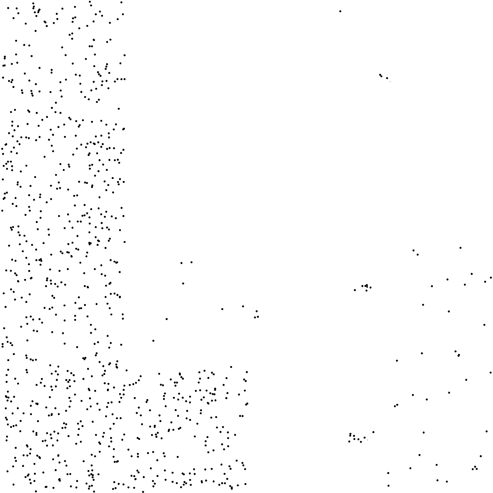</p>
<figcaption>Figure 2: Set of spatial points (a) and the corresponding
62.5m grid with no threshold restrictions (b) (the numbers indicate the
points aggregated in each cell).</figcaption>
</figure>

Given the cell in Figure [2](#fig:Fig2)a and using, for example, a value
of 17 as the anonymity threshold, the subdivision process could not
proceed because one out of the four resulting quadrants contains only
four points. The privacy mechanism would aggregate all the points in the
initial cell as presented in Figure [3](#fig:Fig3)a, masking an
irregular spatial distribution. In order to get more resolution accuracy
the `AQuadtree` algorithm considers the suppression of some points
before continuing the disaggregation. For instance, the disaggregation
shown in Figure [3](#fig:Fig3)b is clearly more accurate to the
underlying spatial distribution and it would result from suppression of
the four points in the top right quadrant of Figure [2](#fig:Fig2)b.
Moreover, the elimination of more data points would lead to further
disaggregation (Figure [3](#fig:Fig3)c and Figure [3](#fig:Fig3)d).

<figure id="fig:Fig3">
<p></p>
<figcaption>Figure 3: Disaggregation examples with an anonymity
threshold value of 17 points per cell. a) no disaggregation and no loss;
b) disaggregation with suppression of 4 points; c) more disaggregation
with suppression of 12 points; c) maximum disaggregation with
suppression of 29 points.</figcaption>
</figure>

Such cases require a strategy, balancing the need of keeping the maximum
number of points (minimum information loss) and getting the finest scale
cells (maximum resolution accuracy). In order to do this, the method
computes the Theil index of inequality [@Theil1972] for the number of
points in the possible quadrants as well as the percentage of suppressed
points needed for the division to be carried out. Going back to the
example in Figure [2](#fig:Fig2), the initial cell can be subdivided
into four quadrants with 547, 56, 325 and 4 points respectively (see
Figure [4](#fig:Fig4)). The Theil measure four quadrants is given by
$\sum\left(x_{i} \cdot ln\left(x_{i}/\overline{x}\right)\right) / \sum x_{i} = 0.514$,
indicating high inequality, i.e. if the cell is not subdivided it masks
a very uneven distribution of points. Suppressing the four points in the
fourth quadrant to split the cell produces a 0.43% loss of points.

![Figure 4: []{#fig:Fig4 label="fig:Fig4"} Quadrant
subdivision.](images/Fig4.png){#fig:Fig4 width="18.0%"
alt="graphic without alt text"}

Therefore, where the anonymity threshold value prevents disaggregation,
high values of inequality measure suggest the need for further
subdivision, while high values of the loss rate suggest to stop the
subdivision. The algorithm uses default limits for both measures: 0.25
and 0.4 respectively (both values can be defined by the user between 0
and 1). Thus, if there exists any sub-cell with a number of points lower
than the anonymity threshold and the Theil entropy is higher than 0.25,
then the disaggregation process continues by suppressing these points as
long as the loss rate is lower than 0.4. Hence, going back to the
example in Figure [2](#fig:Fig2), the default disaggregation produced by
the method would be the one shown in Figure [3](#fig:Fig3)b.

In order to minimize the effects of information loss, if the number of
suppressed points exceeds the anonymity threshold, suppressed points are
aggregated into the initial cell. This cell is maintained and marked as
a residual cell. Following with the example in Figure [2](#fig:Fig2),
the 29 suppressed points in Figure [3](#fig:Fig3)d will be marked as a
residual cell (see Figure [5](#fig:Fig5)).

![Figure 5: []{#fig:Fig5 label="fig:Fig5"} Example of a residual
cell.](images/Fig5.png){#fig:Fig5 width="25.0%"
alt="graphic without alt text"}

Next section presents the *AQuadtree* package. For a given set of
spatial points, the package main function creates an R spatial object of
class `AQuadtree` representing an irregular grid with varying cell
sizes, and provides a summary of the aggregated data. The function
accepts several parameters to adjust the characteristics of the
resulting grid. For instance, initial cell size, number of recursive
subdivisions to achieve, the threshold on the minimum number of points
per cell, the threshold for information loss and inequality or the
attributes to be summarized. The package defines methods to manipulate
or export `AQuadtree` objects and includes test datasets.

# The AQuadtree package {#sec:pkg}

## Installation and dependencies {#sec:inst}

The AQuadtree package can easily be installed from any CRAN repository
by executing the R command:

``` r
R> install.packages("AQuadtree")
```

The *AQuadtree* depends on several R packages as shown on the
corresponding web page on CRAN[^1]. The packages
[*sp*](https://CRAN.R-project.org/package=sp)
[@Pebesma2005; @Bivand2013] and
[*dplyr*](https://CRAN.R-project.org/package=dplyr) [@Wickham2015] will
automatically be installed along with *AQuadtree* if the `dependencies`
argument is set to `TRUE` on the installation process. The *sp* package
provides classes and methods for representation and manipulation of
spatial data on which *AQuadtree* relies. The *dplyr* package provides
fast and consistent tools for working with data frames which are used in
*AQuadtree* to decrease computing times on the automatic aggregation
processes. The packages
[*rgeos*](https://CRAN.R-project.org/package=rgeos) [@Bivand2017],
[*rgdal*](https://CRAN.R-project.org/package=rgdal) [@Bivand2016] are
also useful for some extra functions of the package as, for instance,
exporting a `shapefile` for the created grid.

``` r
R> library(AQuadtree)
Loading required package: sp
Loading required package: dplyr
```

## Provided data {#sec:data}

In order to probe and test the package functionality, two
`SpatialPointsDataFrame` objects are included: `BarcelonaPop` for
Barcelona Municipality (Spain) and `CharlestonPop` for Charleston,
metropolitan area (USA). Point data was created randomly with the
distributions of real data at census scale obtained from different
sources.

The package also provides two `SpatialPolygons` objects with the spatial
boundaries for each region. `BarcelonaCensusTracts` contains spatial
limits of the census tracts for the Barcelona Municipality, and
`CharlestoneCensusTracts` provides spatial limits of the census tracts
for Charleston, metropolitan area.

`BarcelonaPop` comprises 81,359 sample points in Barcelona, Spain. The
original information was obtained from the department of statistics of
the Ajuntament de Barcelona and it contains population data (age and
sex) at census tract level for 2018
[@AjuntamentdeBarcelona.DepartamentdEstadistica2018]. The points were
generated and distributed randomly in space, keeping information at each
census tract unchanged. In order to reduce memory allocation, it only
contains a 5% sample of points.

``` r
R> data("BarcelonaPop", package="AQuadtree")
R> summary(BarcelonaPop)
Object of class SpatialPointsDataFrame
Coordinates:
      min     max
x 3655447 3669871
y 2059179 2074546
Is projected: TRUE 
proj4string :
[+proj=laea +lat_0=52 +lon_0=10 +x_0=4321000 +y_0=3210000 +ellps=GRS80
+towgs84=0,0,0,0,0,0,0 +units=m +no_defs]
Number of points: 81359
Data attributes:
      age            sex       
 Min.   :  0.00   man  :38472  
 1st Qu.: 27.00   woman:42887  
 Median : 43.00                
 Mean   : 43.94                
 3rd Qu.: 61.00                
 Max.   :100.00
```

In a similar way, the `CharlestonPop` object, containing 54,619 random
sample points, was created by using information in Charleston1 dataset
from the 2000 Census Tract Data for the Charleston metropolitan area
(USA) [@GeodaDataandLab2019]. For size concerns, it only contains a 10%
sample of points.

## The AQuadtree class {#sec:class}

An `AQuadtree` class object is a spatial dataset representing a varying
size grid and is created performing an aggregation of a given set of
points observing a minimum threshold for the number of points in each
cell. The main function of the package creates the `AQuadtree` object
from `SpatialPoints` or `SpatialPointsDataFrame` objects.

``` r
R> bcn.QT <- AQuadtree(BarcelonaPop)
R> class(bcn.QT)
[1] "AQuadtree"
attr(,"package")
[1] "AQuadtree"
```

As seen in the example, only the spatial object is necessary. Several
extra parameters can be used in order to calibrate the resulting object:
`dim`, `layers`, `colnames`, `threshold`, `thresholdField`, `funs`,
`as`, `ineq.threshold`, `loss.threshold`. All parameters are optional
and have default values. For instance, the anonymity threshold is equal
to 100 by default. In the next sections all the parameters are detailed.

The plot method for the `AQuadtree` class overrides the generic function
for plotting R objects. Figure [6](#fig:Fig6) shows the `AQuadtree`
created for Barcelona. It comprises areas with very different sizes.
Therefore, highly populated zones are disaggregated in small cells to
allow dissemination of accurate data whereas, information on low
populated zones is aggregated at a higher scale. In some cases, to
improve accuracy and create smaller cells, the function removes some
points and groups them in cells marked as residual (those printed in red
by the plot method).

``` r
R> plot(bcn.QT)
```

![Figure 6: []{#fig:Fig6 label="fig:Fig6"} Plot of an AQuadtree for
Barcelona.](images/Fig6.png){#fig:Fig6 width="60.0%"
alt="graphic without alt text"}

In the next example the `names` generic function shows the slot names
created for each cell in the `AQuadtree` object. Then, in order to show
the information from some of the `AQuadtree` cells, we use the
overridden `[` (sub-setting) method to extract and print a subset of the
cells in the `AQuadtree` (see Section [3.3.4](#sec:methods) for details
on overridden methods).

``` r
R> names(bcn.QT)
[1] "cellCode"  "cellNum"  "level"  "residual"  "total" 
R> bcn.QT[310:315, ]
An object of class "AQuadtree" with 6 grid cells with sizes between 1km and
125m 
         cellCode cellNum level residual total
310 1kmN2072E3665     204     3    FALSE   128
311 1kmN2072E3665     207     3    FALSE   138
312 1kmN2072E3665     208     3    FALSE   166
313 1kmN2073E3666     313     3    FALSE   135
314 1kmN2065E3660             1     TRUE   133
315 1kmN2067E3660             1     TRUE   109
```

The `cellCode` and the `cellNum` properties identify each cell in the
grid, following the mechanism of the INSPIRE grid coding system
[@INSPIRE2010]. As explained in detail in paragraphs 2 and 3 of section
Quadtree anonymization: `cellCode` refers to the initial regular grid
(the highest aggregation level) and indicates the cell's size and the
coordinates of the lower left cell corner in the false origin of the CRS
(Coordinate Reference System); `cellNum` refers to the varying size grid
and is the sequence of numbers indicating the position of the cell in
every successive subdivision of the initial cell. Three more properties
are also added to each cell; the `level` attribute, that indicates the
scale of disaggregation of the cell; the `residual` logical value, that
states whether or not the cell has been created to store residual
points; and finally, the `total` property, indicating the number of
points aggregated in the cell.

### General usage {#sec:usage}

The characteristics of the `AQuadtree` object can be adjusted with
several parameters. First, the `dim` parameter defines the cell size of
the initial grid in meters. The `layers` parameter indicates the number
of subdivisions to perform. Thus, specifying the parameters `dim=10000`
and `layers=5` would create a grid with cells sizes ranging between
`10km` and `625m`. If `dim` and `layers` are not specified, the default
values define an initial size of 1000 meters and 5 subdivisions.

``` r
R> charleston.QT <- AQuadtree(CharlestonPop, dim=10000, layers=5)
```

The `summary` method for `AQuatree` summarizes information of an
`AQuatree` object:

``` r
R> summary(charleston.QT)
Object of class "AQuadtree"
183 grid cells with sizes between 10km and 625m 
Coordinates:
      min     max
x 2060000 2160000
y  110000  220000
Is projected: TRUE 
proj4string:
 +init=epsg:26978 +proj=lcc +lat_1=38.56666666666667
 +lat_2=37.26666666666667 +lat_0=36.66666666666666 
 +lon_0=-98.5 +x_0=400000 +y_0=400000 +datum=NAD83
 +units=m +no_defs +ellps=GRS80 +towgs84=0,0,0 
Initial Cell Size: 10km 
Number of valid grid Cells: 179 
Number of residual grid Cells: 4 
Data attributes:
     total       
 Min.   : 100.0  
 1st Qu.: 156.0  
 Median : 217.0  
 Mean   : 287.4  
 3rd Qu.: 358.0  
 Max.   :2281.0   
```

If the original dataset includes individual information, the `colnames`
parameter can be used to specify the attributes from the dataset to be
summarized in the resulting grid. Factor attributes are deployed and a
new attribute for each factor label is created. For instance, an
attribute `sex` with two labels, `man` and `woman`, would be deployed
into the two new attributes: `sex.man`, `sex.woman`. Additionally, the
`funs` parameter could be used to specify the functions to compute in
the summary for each one of the attributes indicated in the `colnames`
parameter. If no functions are specified, the `sum` function is used.
Next example creates an `AQuatree` object with the sample points in
Barcelona, retaining two attributes, `age` and `sex`, summarized with
`mean` and `sum` functions respectively.

``` r
R> bcn.QT <- AQuadtree(BarcelonaPop, 
 +			colnames=c('age','sex'), 
 +			funs=c('mean', 'sum'))
R> summary(bcn.QT)
Object of class "AQuadtree"
321 grid cells with sizes between 1km and 125m 
Coordinates:
      min     max
x 3659000 3670000
y 2062500 2074500
Is projected: TRUE 
proj4string:
 +proj=laea +lat_0=52 +lon_0=10 +x_0=4321000 +y_0=3210000 +ellps=GRS80 
 +towgs84=0,0,0,0,0,0,0 +units=m +no_defs 
Initial Cell Size: 1km 
Number of valid grid Cells: 313 
Number of residual grid Cells: 8 
Data attributes:
     total           age           sex.man        sex.woman    
 Min.   : 100   Min.   :35.28   Min.   : 40.0   Min.   : 44.0  
 1st Qu.: 139   1st Qu.:42.37   1st Qu.: 64.0   1st Qu.: 73.0  
 Median : 177   Median :44.42   Median : 83.0   Median : 95.0  
 Mean   : 248   Mean   :44.16   Mean   :117.1   Mean   :130.9  
 3rd Qu.: 328   3rd Qu.:46.18   3rd Qu.:158.0   3rd Qu.:170.0  
 Max.   :1288   Max.   :51.18   Max.   :626.0   Max.   :662.0
```

### Anonymity threshold {#sec:threshold}

The package applies a default anonymity threshold value of 100 and it
can be adjusted with the `threshold` parameter. By default, the
threshold restriction is only applied to the total number of points
aggregated in each cell (i.e. the `total` attribute added to the
resulting dataset). The threshold restriction can also be applied to any
attribute with confidential information. The attribute names that must
satisfy the given threshold should be specified in the `thresholdField`
parameter.

Next example creates an `AQuadtree` applying a threshold value of `17`
on the attributes `sex.man` and `sex.woman`. As shown in the summary,
the minimum values for both attributes is `17`; cells with lower values
have been grouped to achieve the minimum threshold.

``` r
R> bcn.QT <- AQuadtree(BarcelonaPop, colnames=c('age','sex'), funs=c('mean', 'sum'),
 +	threshold=17, thresholdField=c("sex.man", "sex.woman"))
R> summary(bcn.QT)
Object of class "AQuadtree"
730 grid cells with sizes between 1km and 62.5m 
Coordinates:
      min     max
x 3659000 3670000
y 2062000 2075000
Is projected: TRUE 
proj4string:
 +proj=laea +lat_0=52 +lon_0=10 +x_0=4321000 +y_0=3210000 +ellps=GRS80
 +towgs84=0,0,0,0,0,0,0 +units=m +no_defs 
Initial Cell Size: 1km 
Number of valid grid Cells: 713 
Number of residual grid Cells: 17 
Data attributes:
     total            age           sex.man         sex.woman     
 Min.   : 34.0   Min.   :32.63   Min.   : 17.00   Min.   : 17.00  
 1st Qu.: 64.0   1st Qu.:41.52   1st Qu.: 30.25   1st Qu.: 33.00  
 Median :103.0   Median :43.87   Median : 49.00   Median : 54.00  
 Mean   :110.5   Mean   :43.71   Mean   : 52.25   Mean   : 58.21  
 3rd Qu.:140.0   3rd Qu.:46.08   3rd Qu.: 65.75   3rd Qu.: 74.00  
 Max.   :807.0   Max.   :53.46   Max.   :371.00   Max.   :436.00
```

### Balancing information loss and accuracy {#sec:balance}

Finally, two more parameters can be used to manage the disaggregation
process: the inequality threshold (`ineq.threshold`) and the loss rate
threshold (`loss.threshold`). As explained in Section [2](#sec:anonym),
when the anonymity threshold prevents the subdivision of a cell, then
the suppression of some points may be considered to allow a further
subdivision (see Figures [2](#fig:Fig2) and [3](#fig:Fig3)). This
decision depends on the inequality between sub-cells (we use the Theil
index) and the rate of points that need to be suppressed (we call it
loss rate). As matter of fact, the disaggregation process of a cell
continues either when the number of points in each sub-cell is greater
than the anonymity threshold (threshold), or alternatively when the
inequality between sub-cells is greater than the inequality threshold
(`ineq.threshold`) and the loss rate is smaller than the loss threshold
(`loss.threshold`). The `ineq.threshold` and the `loss.threshold`
parameters range between `0` and `1` and the default values are `0.25`
and `0.4` respectively. Lower values in the inequality threshold and/or
higher values in the loss threshold result in grids with smaller cells.

To illustrate the use of the `ineq.threshold`, in the next example a
subset of points corresponding to a cell of 1km, with bottom-left corner
`(3660000, 2065000)` and top-right corner `(3661000, 2066000)` is
created:

``` r
R> point.coord<-as.data.frame(coordinates(BarcelonaPop))
R> points.subset<- BarcelonaPop[point.coord[,1]>=3660000 & point.coord[,1]<=3661000
 +		 & point.coord[,2]>=2065000 & point.coord[,2]<=2066000,]
R> plot(points.subset)
R> length(points.subset)
```

The result is the subset of points shown in Figure [7](#fig:Fig7)a,
which are clustered mainly on the bottom right and bottom left corners
of the area. In order to compare the different aggregation results,
three `AQuadtree` objects were created using different `ineq.threshold`
values. (Figure [7](#fig:Fig7)b, [7](#fig:Fig7)c, and [7](#fig:Fig7)d).
For each case the proportion of residual points as a measure of loss,
and the coefficient of variation as a measure of dispersion, are
computed.

Using a minimum threshold value of 5 points per cell and the default
inequality value (0.25), the function creates the grid shown in Figure
[7](#fig:Fig7)b. It presents a residual cell containing 2.02% of the
points, and the number of points per cell has a coefficient of variation
of 0.499.

``` r
R> bcn.QT <- AQuadtree(points.subset, threshold=5)
R> plot(bcn.QT, residual=F, col="grey")
R> bcn.QT[bcn.QT$residual,]$total / length(points.subset)
R> sd(bcn.QT[!bcn.QT$residual,]$total)/mean(bcn.QT[!bcn.QT$residual,]$total)
```

Figure [7](#fig:Fig7)c shows a second aggregation example, for the same
set of points, with smaller cells, using an ineq.threshold value of
0.01, which results in 8.89% of residual points and a coefficient of
variation of 0.365 (i.e. the number points in cells is more similar
between them).

``` r
R> bcn.QT <- AQuadtree(points.subset, threshold=5, ineq.threshold=0.01)
R> plot(bcn.QT, residual=F, col="grey")
R> bcn.QT[bcn.QT$residual,]$total / length(points.subset)
R> sd(bcn.QT[!bcn.QT$residual,]$total)/mean(bcn.QT[!bcn.QT$residual,]$total)
```

Figure [7](#fig:Fig7)d on the contrary, uses a higher ineq.threshold
value of 0.5, resulting in aggregation on bigger cells, with no loss,
but a coefficient of variation of 0.84 (i.e. the number of points in
each cell exhibits more inequality).

``` r
R> bcn.QT <- AQuadtree(points.subset, threshold=5, ineq.threshold=0.5)
R> plot(bcn.QT, residual=F, col="grey")
R> bcn.QT[bcn.QT$residual,]$total / length(points.subset)
R> sd(bcn.QT[!bcn.QT$residual,]$total)/mean(bcn.QT[!bcn.QT$residual,]$total)
```

<figure id="fig:Fig7">
<p>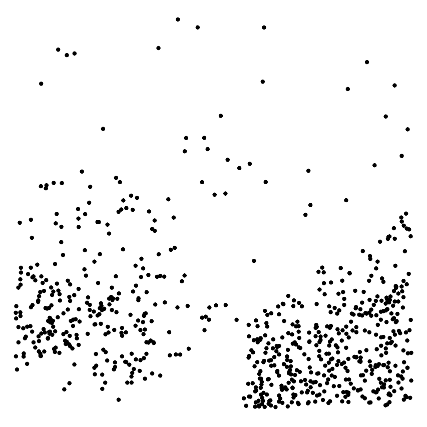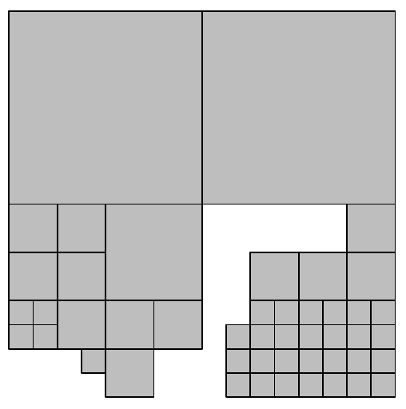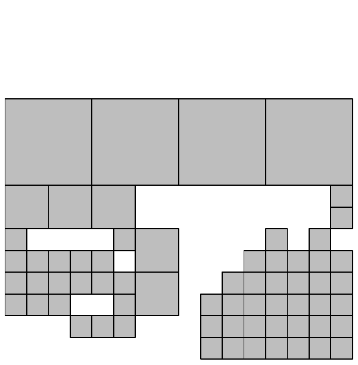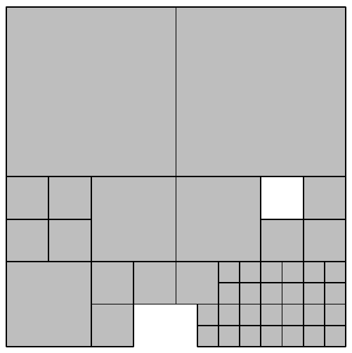</p>
<figcaption>Figure 7: Examples of the effect of the ineq.threshold
parameter. a) Subset of points used in the example; b) AQuadtree with
default ineq.threshold value; c) AQuadtree with ineq.threshold value
0.01; d) AQuadtree with ineq.threshold value 0.5.</figcaption>
</figure>

### Class methods and slots {#sec:methods}

The `AQuadtree` class proposes a collection of methods to manage the
generated objects and overrides the generic methods `show`, `print`,
`summary` and `[` (subsetting) for the `AQuadtree` signature. The
`spplot` method overrides the lattice-based plot method for spatial data
with attributes from *sp* package [@Pebesma2005], and two extra
parameters: `residual`, to indicate if residual cells should be
displayed, and `by.density` to indicate if attributes should be divided
for the cell areas to make them comparable between zones with different
sizes. The `merge` method merges the input data on the `AQuadtree`
object with a second data frame using `cellCode` and `cellNum` as the
merging attributes. The `writeOGR.QT` method coerces the given
`AQuadtree` object to a `SpatialPolygonsDataframe` and uses the
`writeOGR` method from *rgdal* package [@Bivand2016] to write out
spatial vector data. Finally, the `area.QT` method allows getting the
areas of the grid cells in square meters. An `AQuadtree` object can also
be coerced to a `SpatialPolygonsDataFrame` or a `SpatialPolygons` object
using the generic method `as` from methods package:

``` r
R> bcn.QT <- AQuadtree(BarcelonaPop)
R> class(bcn.QT)
[1] "AQuadtree"
attr(,"package")
[1] "AQuadtree"
R> bcn.SP <- as(bcn.QT, "SpatialPolygonsDataFrame")
R> class(bcn.SP)
[1] "SpatialPolygonsDataFrame"
attr(,"package")
[1] "sp"
```

The basic structure of the `AQuadtree` class is based on a
`SpatialPolygonsDataFrame` with some extra information on the object
created.

``` r
R> slotNames(example.QT)
[1] "dim" "layers" "colnames" "threshold" "thresholdField" "loss" "data"
[8] "polygons""plotOrder" "bbox" "proj4string"
```

The properties `dim`, `layers`, `colnames`, `threshold` and
`thresholdField` specify the parameters used to create the grid and
denote the grid characteristics: `dim` indicates the scale in meters of
the highest level cells; `layers` shows the number of subdivision
levels; `colnames` enumerates the attribute names summarized in the
resulting grid; `threshold` is the value used for anonymization,
indicating the minimum number of points or a minimum number an attribute
that a cell may contain; and `thresholdField` specifies the attributes
to which the threshold restriction has been applied.

The aggregation process aims to keep all the original points in the
summarized grid, but in some cases, when the aggregation at the highest
level (the biggest cells) does not satisfy the threshold restriction
those points must be suppressed. The `loss` property indicates the
number of points suppressed on the subdivision process because their
aggregation, at any level, does not accomplish the threshold
restriction. The rest of the `slots`, i.e. `data`, `polygons`,
`plotOrder`, `bbox` and `proj4string`, define the grid structure as a
`SpatialPolygonsDataFrame`.

# Package functions {#sec:functions}

The *AQuadtree* package also implements several functions that help
working with the proposed grid system. In this section we focus on the
capabilities for merging two `AQuadtree` objects, for aggregating
spatial points to an `AQuadtree` object and, finally, for creating a
fixed size grid.

## Join AQuadtrees {#sec:join}

As pointed by [@Martin2002], administrative units may change over time,
but grid cells are time independent. Therefore, grid datasets from
different periods can be compared. In the case of aquadtrees, this is
true only when the disaggregation process gets the same resolutions in
all areas for the periods being compared; i.e. information in two
datasets is only comparable if there are exactly the same cells in both
datasets. A problem arises when some cells have different subdivision
levels. The function `joinAQuadtrees` is intended to deal with this
problem. The function `joinAQuadtrees` merges two `AQuadtree` objects
and makes their information comparable. The function creates a new
`AQuadtree` object combining the information of the two input objects at
the lowest common resolution. The initial size of the highest scale
cells should be the same in both input objects.

The resulting `AQuadtree` object maintains the attributes of the two
input objects. The attributes are automatically renamed, adding the
suffix `".1"` or `".2"` to indicate whether the attribute comes from the
first or the second object. When the grids have different subdivision
schemes, the algorithm works in a quadtree manner, it merges the cells
to bigger ones and aggregates information. The optional parameters
`mean.1` and `mean.2` can be used to indicate a list of attributes that
should be aggregated using a weighted mean instead of the `sum` function
applied by default. The function can be used to merge `AQuadtrees` with
the same attributes, but also with different information.

The following example combines two `AQuadtrees`, with different
information. The first `AQuadtree` contains the population of Barcelona
maintaining only the `age` attribute with a threshold value `25` on the
number of points per grid cell.

``` r
R> Barcelona.AQT_1<-AQuadtree(BarcelonaPop,colnames="age",threshold=25, fun="mean")
```

A second `AQuadtree` for the same population preserving the `sex`
attribute with a threshold value `17` is also created.

``` r
R> Barcelona.AQT_2 <- AQuadtree(BarcelonaPop, colnames="sex", threshold=17, 
 +	thresholdField=c("sex.man", "sex.woman"))
```

Now both objects are combined to create a new `AQuadtree` aggregating
the `age` attribute using the weighted mean.

``` r
R> Barcelona.AQT_1_2 <- joinAQuadtrees(Barcelona.AQT_1, Barcelona.AQT_2,
 +	mean.1="age", withResiduals=TRUE)
```

To illustrate how the merging process works we focus on a particular
cell.

``` r
R> plot(Barcelona.AQT_1[Barcelona.AQT_1\$cellCode=="1kmN2065E3665",])
R> plot(Barcelona.AQT_2[Barcelona.AQT_2\$cellCode=="1kmN2065E3665",])
R> plot(Barcelona.AQT_1_2[Barcelona.AQT_1_2\$cellCode=="1kmN2065E3665",])
```

<figure id="fig:Fig8">
<p>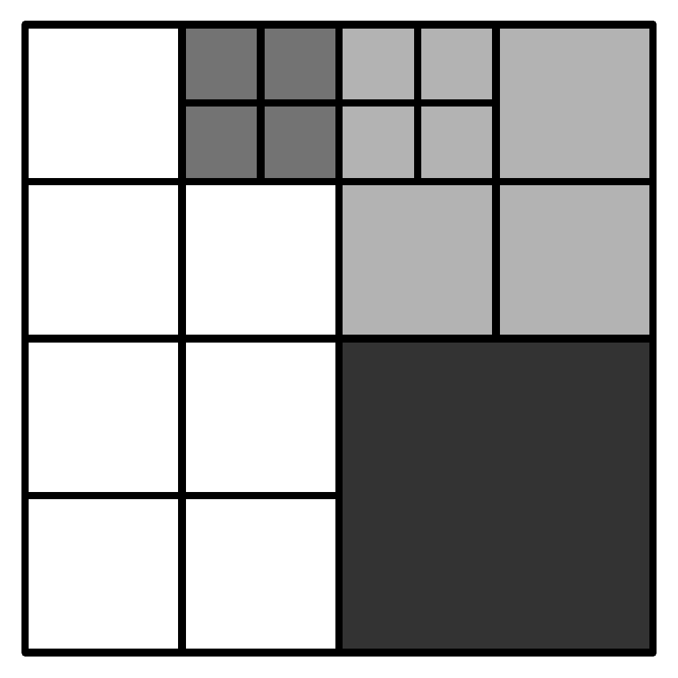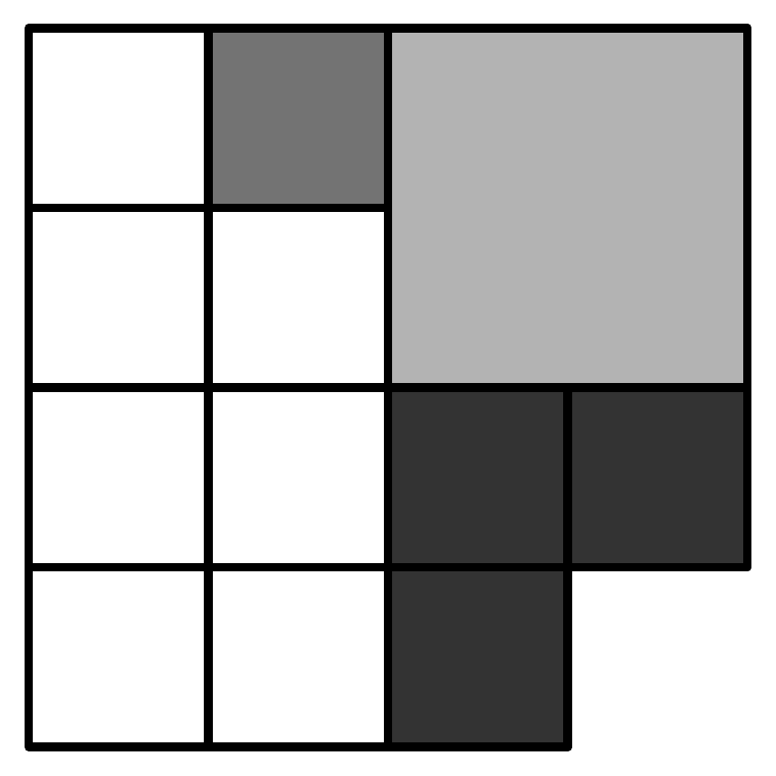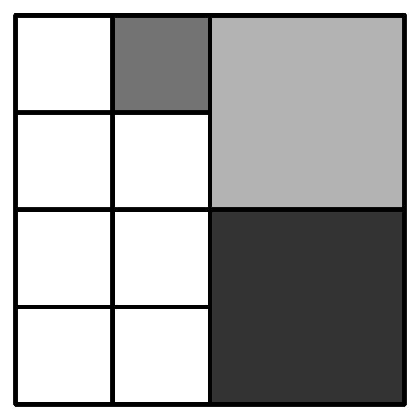</p>
<figcaption>Figure 8: Cell join example. AQuadtree objects in a) and b)
are joined in c).</figcaption>
</figure>

Figure [8](#fig:Fig8) presents the results of the previous example, the
input grids are shown in Figure [8](#fig:Fig8)a and [8](#fig:Fig8)b and
the output grid is shown in Figure [8](#fig:Fig8)c. Some cells have been
highlighted in different grey tones to clarify the merging process. For
instance, looking at the bottom right cells in Figure [8](#fig:Fig8)a
and [8](#fig:Fig8)b (see the darkest gray-scale level), the three cells
in Figure [8](#fig:Fig8)b, must be merged to make them comparable to the
one in Figure [8](#fig:Fig8)a. The resulting grid in Figure
[8](#fig:Fig8)c preserves the cell in Figure [8](#fig:Fig8)a and
aggregates the information of the cells in Figure [8](#fig:Fig8)b. Table
[1](#tab:join) presents the attribute information in each cell of the
input and in the output grid to clarify the merging performed.

::: {#tab:join}
  ---------------------------------------------------------------------------------------------------------------------------------------------------------------------------------------------------------------------------------------------------------------------------------------------------------------------------------------------------------------------------------------------------------------------------------------------------------------------------------------------------------
                Barcelona AQT_1                                                                                                            Barcelona.AQT_2                                                                                                                                      Barcelona.AQT_1_2                                                                                                                                                            
  ----------------------------- ----------------------------- ----------------------------- ------------------------------- ------------------------------ ----------------------------- ------------------------------ ----------------------------- ----------------------------- ----------------------------- ----------------------------- ------------------------------ ------------------------------- ------------------------------ ------------------------------ ------------------------------
                       cell Num                         level                         total                             age                       cell Num                         level                          total                      sex. man                    sex. woman                      cell Num                         level                       total .1                          age .1                       total .2                    sex. man .2                  sex. woman .2

                            101                             3                            79                            43.6                            101                             3                             79                            37                            42                           101                             3                             79                            43.6                             79                             37                             42

                            102                             3                           133                            40.9                            102                             3                            133                            75                            58                           102                             3                            133                            40.9                            133                             75                             58

                            105                             3                            63                            45.0                            105                             3                             63                            37                             2                           105                             3                             63                            45.0                             63                             37                             26

                            106                             3                            93                            40.0                            106                             3                             93                            54                            39                           106                             3                             93                            40.0                             93                             54                             39

    [  2]{style="color: black"}   [  2]{style="color: black"}   [ 65]{style="color: black"}   [ 38.1]{style="color: black"}   [ 203]{style="color: black"}   [  3]{style="color: black"}   [ 118]{style="color: black"}   [ 81]{style="color: black"}   [ 37]{style="color: black"}   [  2]{style="color: black"}   [  2]{style="color: black"}   [ 265]{style="color: black"}   [ 38.1]{style="color: black"}   [ 253]{style="color: black"}   [ 146]{style="color: black"}   [ 107]{style="color: black"}

                                                                                                                              [ 207]{style="color: black"}   [  3]{style="color: black"}   [  92]{style="color: black"}   [ 47]{style="color: black"}   [ 45]{style="color: black"}                                                                                                                                                                                          

                                                                                                                              [ 208]{style="color: black"}   [  3]{style="color: black"}   [  43]{style="color: black"}   [ 18]{style="color: black"}   [ 25]{style="color: black"}                                                                                                                                                                                          

                            309                             3                            79                            41.5                            309                             3                             79                            38                            41                           309                             3                             79                            41.5                             79                             38                             41

                            310                             3                           121                            38.8                            310                             3                            121                            54                            67                           310                             3                            121                            38.8                            121                             54                             67

                            313                             3                            89                            35.4                            313                             3                             89                            50                            39                           313                             3                             89                            35.4                             89                             50                             39

                          31451                             4                            41                            44.5                            314                             3                            158                            68                            90                           314                             3                            158                            39.6                            158                             68                             90

                          31452                             4                            44                            39.4                                                                                                                                                                                                                                                                                                                                                  

                          31459                             4                            32                            34.1                                                                                                                                                                                                                                                                                                                                                  

                          31460                             4                            41                            39.2                                                                                                                                                                                                                                                                                                                                                  

                            411                             3                           128                            39.8                              4                             2                            379                           192                           187                             4                             2                            379                            41.0                            379                            192                            187

                            412                             3                            62                            40.1                                                                                                                                                                                                                                                                                                                                                  

                          41553                             4                            53                            46.2                                                                                                                                                                                                                                                                                                                                                  

                          41554                             4                            32                            35.6                                                                                                                                                                                                                                                                                                                                                  

                          41561                             4                            42                            41.9                                                                                                                                                                                                                                                                                                                                                  

                          41562                             4                            31                            41.3                                                                                                                                                                                                                                                                                                                                                  

                            416                             3                            31                            43.0                                                                                                                                                                                                                                                                                                                                                  
  ---------------------------------------------------------------------------------------------------------------------------------------------------------------------------------------------------------------------------------------------------------------------------------------------------------------------------------------------------------------------------------------------------------------------------------------------------------------------------------------------------------

  : Table 1: Cell join example.
:::

The `joinAQuadtrees` function can also be used to incorporate a set of
points to an existing `AQuadtree` object building a grid with threshold
of 1 point per cell. For instance, let us consider an `AQuadtree`
aggregating the population for the Charleston SCMA using a threshold
value 17 individuals per cell and a `SpatialPointsDataFrame` object from
the same population selecting white people aged 65 or more:

``` r
R> Charleston.AQT<-AQuadtree(CharlestonPop, threshold=17)
R> head(Charleston.AQT)
An object of class "AQuadtree" with 6 grid cells with sizes between 1km and 
125m 
       cellCode cellNum level residual total
1 1kmN0126E2135             1    FALSE    22
2 1kmN0127E2135             1    FALSE    20
3 1kmN0127E2136             1    FALSE    24
4 1kmN0131E2140             1    FALSE    29
5 1kmN0133E2134             1    FALSE    45
6 1kmN0133E2135             1    FALSE    20
```

``` r
R> CharlestonWomen65 <- CharlestonPop[CharlestonPop\$origin=='white'
 +	& CharlestonPop\$age=='over65', 'sex']
```

Both objects can be aggregated by creating an auxiliary `AQuadtree` with
threshold value 1 (i.e. with maximum level of disaggregation) for the
set of points

``` r
R> CharlestonWomen65.AQT<-AQuadtree(CharlestonWomen65, threshold=1, colnames='sex')
```

and then joining both `AQuadtree` objects:

``` r
R> Charleston.AQT.ext<-joinAQuadtrees(Charleston.AQT, CharlestonWomen65.AQT)
R> head(Charleston.AQT.ext)
An object of class "AQuadtree" with 6 grid cells with sizes between 1km and
125m 
     cellCode cellNum level residual total.1 total.2 sex.male.2 sex.female.2
1 1kmN0126E2135           1    FALSE      22       4          2            2
2 1kmN0127E2135           1    FALSE      20       2          1            1
3 1kmN0127E2136           1    FALSE      24       3          1            2
4 1kmN0131E2140           1    FALSE      29       2          1            1
5 1kmN0133E2134           1    FALSE      45       5          4            1
6 1kmN0133E2135           1    FALSE      20       2          1            1
```

The resulting `AQuadtree` object may contain less cells than the
original, because joining `AQuadtrees` only merges common geometries.

``` r
R> length(Charleston.AQT)
[1] 997
R> length(Charleston.AQT.ext)
[1] 856
```

An optimized function to aggregate points to an existing `AQuadtree`
object maintaining all the original cells is explained in the next
subsection.

## Aggregate points to an AQuadtree {#sec:pt2qt}

As seen in the previous subsection, a set of points may be converted
into an `AQuadtree` object and then it may be joined to another
`AQuadtree`. The package includes the `pointsToAQuadtree` function to
optimize this process. The function takes two elements, an `AQuadtree`
object and a `SpatialPoints` or a `SpatialPointsDataFrame` object, and
aggregates the set of points to the `AQuadtree`. The function aggregates
numeric attributes of the input set of points using the `mean` function.
It also deploys factor attributes creating new attributes for each label
of the factor and computing the number of occurrences. The point's
attributes added to the resulting `AQuadtree` object are prefixed with
`“p.”`. The function also creates a `“p.total”` attribute to compute the
total number of points aggregated to each cell of the input `AQuadtree`.

Following the example given in the previous section (see at the end of
previous section), the aggregation of the `CharlestonWomen65` and
`Charleston.AQT` objects is given by

``` r
R> Charleston.AQT.ext<- pointsToAQuadtree(Charleston.AQT, CharlestonWomen65)
R> tail(Charleston.AQT.ext)
An object of class "AQuadtree" with 6 grid cells with sizes between 1km and
125m 
       cellCode cellNum level residual total p.total p.sex.male p.sex.female
185 1kmN0142E2133   313     3    FALSE    23      NA         NA           NA
186 1kmN0142E2133   314     3    FALSE    19       1          0            1
188 1kmN0142E2134   101     3    FALSE    27       1          1            0
189 1kmN0142E2134   102     3    FALSE    27       1          0            1
190 1kmN0142E2134   105     3    FALSE    35       4          2            2
191 1kmN0142E2134   106     3    FALSE    32       2          0            2
```

The resulting `AQuadtree` object has the same cells as the original, and
the cells not covering any points contain `NA` values for the new
attributes.

``` r
R> length(Charleston.AQT)
[1] 997
R> length(Charleston.AQT.ext)
[1] 997
```

## Create a fixed size grid  {#sec:grid}

The `createGrid` function creates a grid with fixed cell size (by
default 1km), based on the INSPIRE Specification on Geographical Grid
Systems [@INSPIRE2010]. The grid covers entirely a given area which can
be a single polygon, a set of polygons or a set of points. The resulting
grid will be a `SpatialPolygons` object where the `ID` of each polygon
is the `cellCode` as explained in Section [2](#sec:anonym). The size of
the grid cells can be specified with the `dim` argument in meters; by
default cells will be `1000m`. The `intersect` argument specifies
whether the resulting grid should be intersected with the given zone;
otherwise the function builds a rectangular grid. The `outline`
argument, indicates whether the resulting grid should be clipped with
the outline borders of the given zone (only applicable with
`SpatialPolygons` or `SpatialPolygonsDataFrame` classes).

Figure [9](#fig:Fig9) presents an example of a `SpatialPolygons` object
representing the census tracts for Barcelona, and three possible grids
with different values for the `intersect` and `outline` arguments.
Figure [9](#fig:Fig9)a provides the census tract spatial limits for
Barcelona,

``` r
R> plot(BarcelonaCensusTracts)
```

Figure [9](#fig:Fig9)b provides a rectangular grid covering the current
spatial region without intersection. To illustrate the region covered,
the boundaries for the Barcelona Municipality have also been plotted,

``` r
R> plot(createGrid(BarcelonaCensusTracts, intersect=FALSE))
R> plot(rgeos::gUnaryUnion(BarcelonaCensusTracts), add=TRUE)
```

and finally, Figure [9](#fig:Fig9)c and Figure [9](#fig:Fig9)d provide
intersected grids with and without outlined borders,

``` r
R> plot(createGrid(BarcelonaCensusTracts, intersect=TRUE, outline=FALSE))
R> plot(createGrid(BarcelonaCensusTracts, intersect=TRUE, outline=TRUE))
```

<figure id="fig:Fig9">
<p>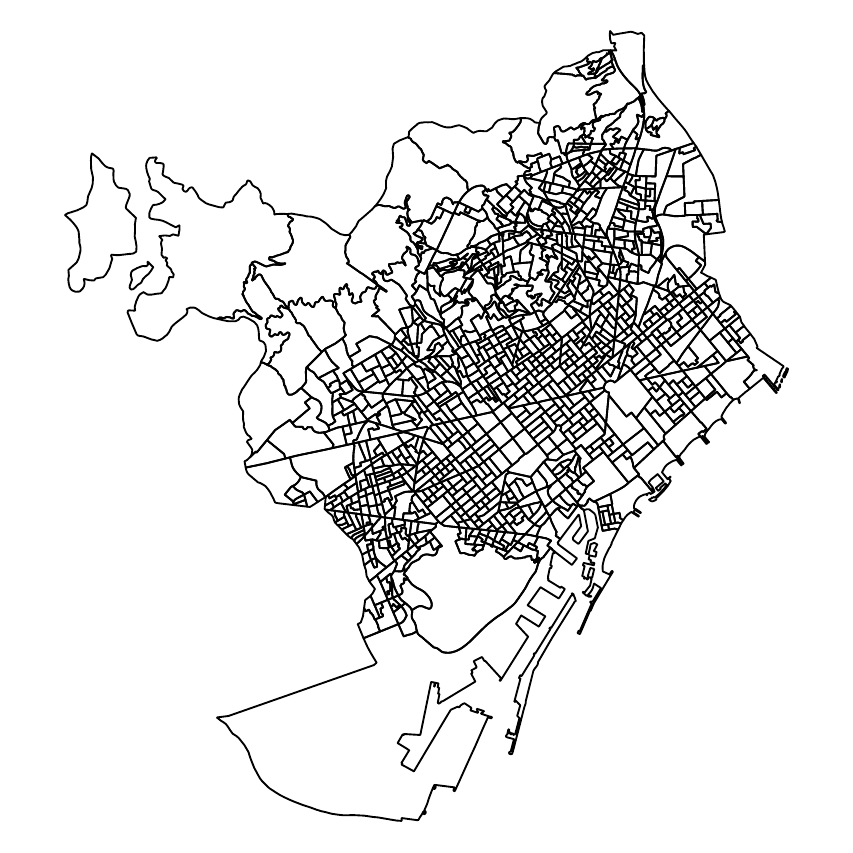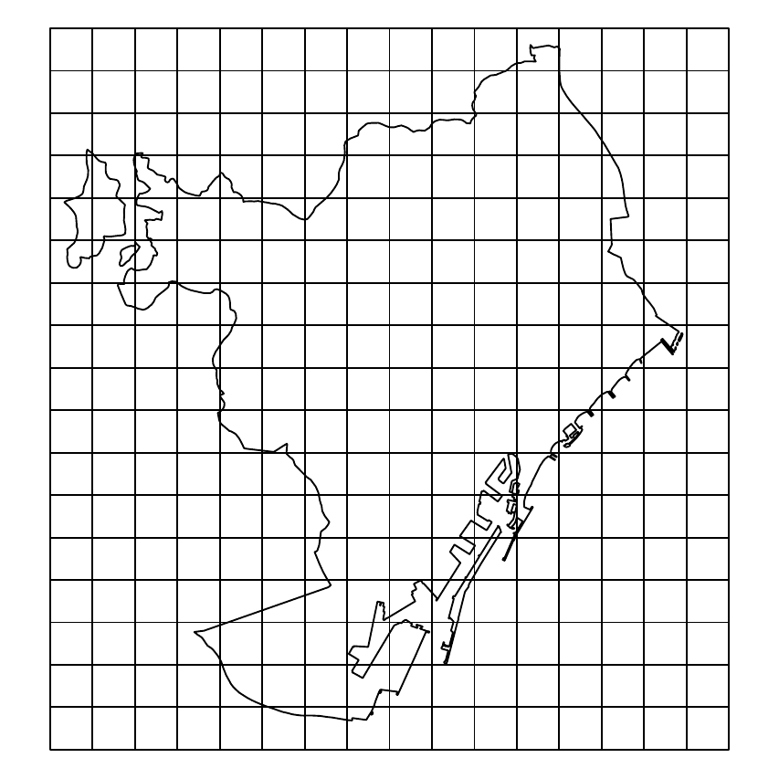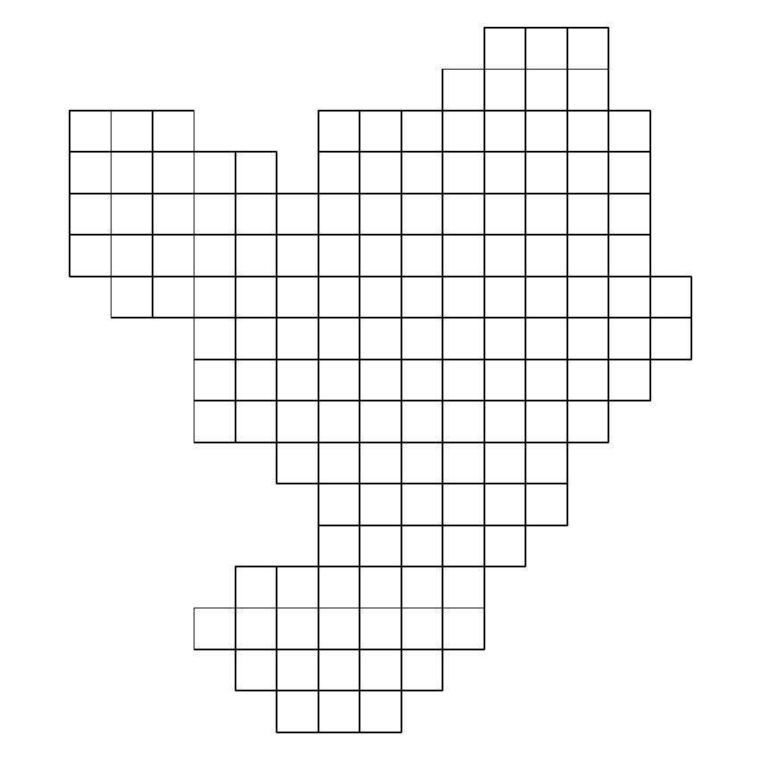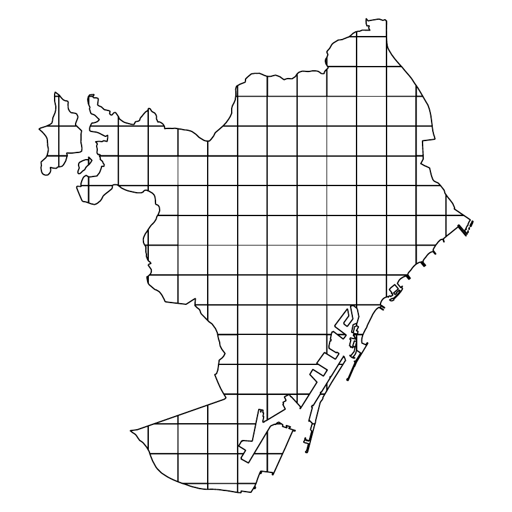</p>
<figcaption>Figure 9: Barcelona census tracts (a); grid for Barcelona
city without intersection (b); grid intersected (c); grid intersected
and outlined (d).</figcaption>
</figure>

The polygons in the resulting grids are identified by their
corresponding INSPIRE cell code [@INSPIRE2010],

``` r
R> Bcn.Grid<-createGrid(BarcelonaCensusTracts, intersect=TRUE, 
 + outline=FALSE)
R> row.names(Bcn.Grid)
  [1] "1kmN2074E3665" "1kmN2074E3666" "1kmN2074E3667" "1kmN2073E3664"
  [5] "1kmN2073E3665" "1kmN2073E3666" "1kmN2073E3667" "1kmN2072E3655"
  [9] "1kmN2072E3656" "1kmN2072E3657" "1kmN2072E3661" "1kmN2072E3662"
 [13] "1kmN2072E3663" "1kmN2072E3664" "1kmN2072E3665" "1kmN2072E3666"
 [17] "1kmN2072E3667" …
```

Once a fixed size grid is created, functionalities of spatial packages
like *sp* can be used. For instance, a set of points can be aggregated
to the created grid:

``` r
R> Bcn.Grid.ext<-aggregate(BarcelonaPop[,'age'], by=Bcn.Grid, FUN="mean")
R> head(as.data.frame(Bcn.Grid.ext))
                   age
1kmN2074E3665 42.14286
1kmN2074E3666 39.38129
1kmN2074E3667 39.00000
1kmN2073E3664 66.00000
1kmN2073E3665 39.51493
1kmN2073E3666 40.06069
```

The same result can be achieved using the `spatialPointsCellCodes`
function in the *AQuadtree* package. This function provides, for each
point in a `spatialPointsDataFrame`, the corresponding cell codes
(`cellCode`) of a rectangular grid covering the full set of points.

``` r
R> Bcn.points<-spatialPointsCellCodes(BarcelonaPop)
R> Bcn.points.agr<-aggregate(age~cellCode, Bcn.points, "mean")
R> Bcn.Grid\$cellCode<-row.names(Bcn.Grid)
R> Bcn.Grid.ext<-merge(Bcn.Grid, Bcn.points.agr)
R> head(as.data.frame(Bcn.Grid.ext))
         cellCode      age
143 1kmN2074E3665 42.14286
144 1kmN2074E3666 39.38129
145 1kmN2074E3667 39.00000
139 1kmN2073E3664 66.00000
140 1kmN2073E3665 39.51493
141 1kmN2073E3666 40.06069
```

The advantage of this second method is that it gives more control over
the aggregation process, for example, the summarizing functions provided
in the *dplyr* package may be used.

``` r
R> Bcn.points.agr<-summarise(group_by(as.data.frame(Bcn.points),cellCode),
 +	 total.points=n(), mean.age=mean(age), sd.age=sd(age))
R> Bcn.Grid.ext<-merge(Bcn.Grid, Bcn.points.agr)
R> head(as.data.frame(Bcn.Grid.ext))
         cellCode total.points mean.age   sd.age
143 1kmN2074E3665           35 42.14286 27.22579
144 1kmN2074E3666          139 39.38129 22.79283
145 1kmN2074E3667            1 39.00000       NA
139 1kmN2073E3664            1 66.00000       NA
140 1kmN2073E3665          268 39.51493 21.95441
141 1kmN2073E3666          346 40.06069 23.05115
```

# Final remarks {#sec:final}

In this paper we have presented the R package AQuadtree which provides
an automatic aggregation tool to anonymize point data using a
methodology based on hierarchical (quadtree) geographic data structures.
The main goal of the proposed system is respecting privacy of geographic
data, while, at the same time, offering best accuracy to perform
truthful spatial analysis. The implemented methodology is helpful for
the production of official spatial data and for researchers to deal with
this type of data. Further research should evaluate the quality and
usefulness of ad-hoc datasets created using the package.

Data privacy concerns are built upon the *k-anonymity* concept. The
methodology to build the datasets performs aggregation and suppression
of spatial data, yet controlled with thresholds defined by the user and
covering as many attributes as needed. Thereby, the package can create
grids where the set of attributes leading to the identification of an
individual cannot be distinguished from at least $k-1$ other individuals
in the same grid cell. Datasets produced ensure individual privacy as
long as the anonymity thresholds used are high enough.

The process has been designed to be time efficient so it can be used
with large spatial datasets. It has been tested on a 2,5 GHz Intel 4
Core i7 computer with the Catalonian 2014 population register dataset
containing information on 7,566,464 individuals. For instance, a grid
with 85,408 cells with sizes between 1km and 31.25m, with a threshold
value of 17 individuals per cell was created in 46 seconds.

# Acknowledgements

The authors most gratefully thank the Institut d'Estadística de
Catalunya for providing us with the database to perform tests with real
data. We thank the Data Analysis and Modeling research group (2017SGR71)
for their comments on previous versions of the paper. We sincerely thank
Rafa Madariaga for his diligent proofreading of the manuscript.
:::

[^1]: <https://CRAN.R-project.org/package=AQuadtree>
