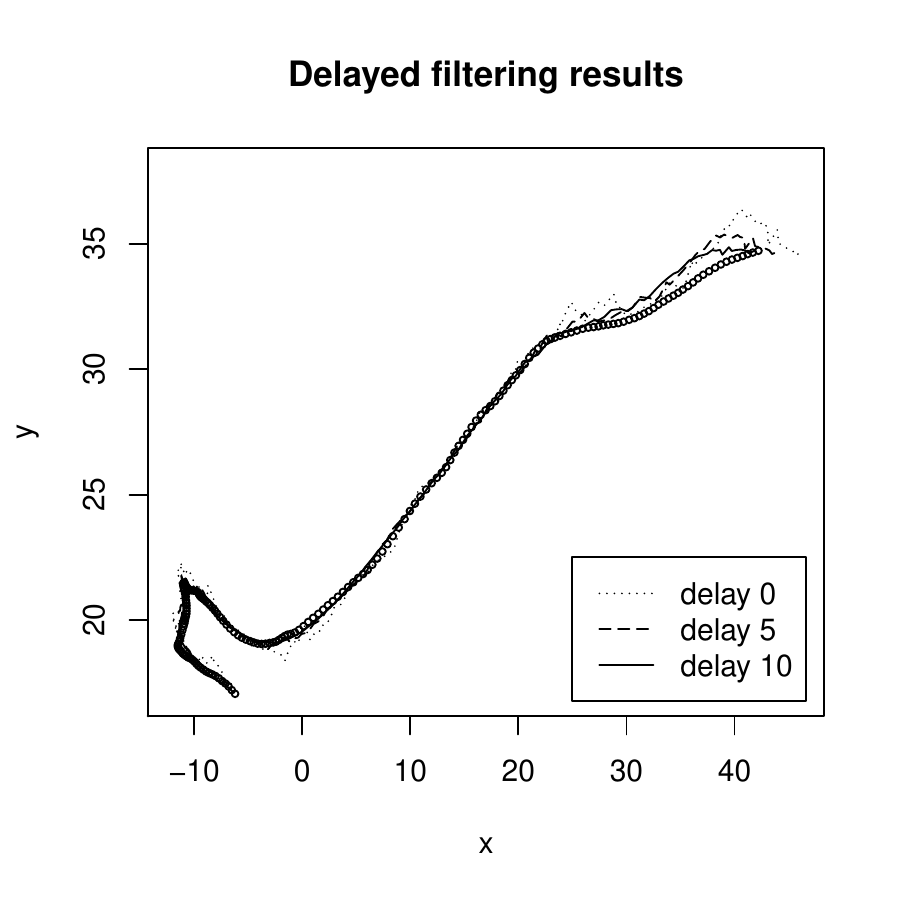
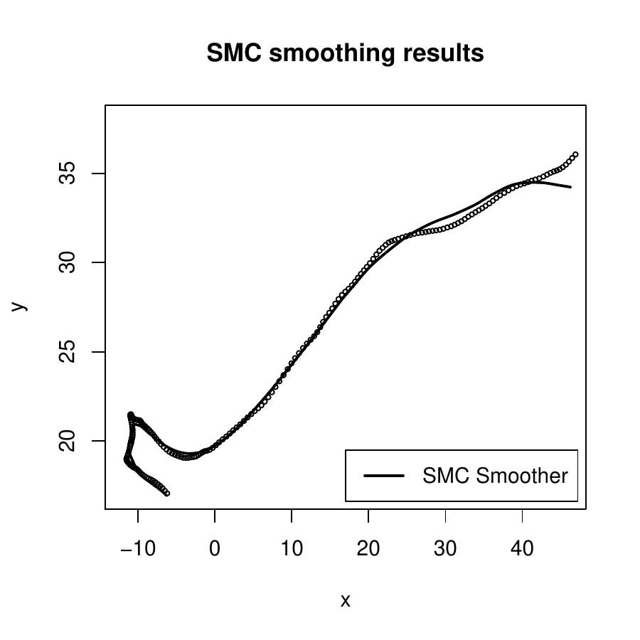
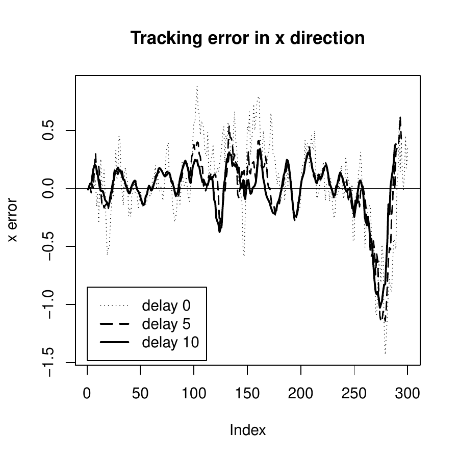
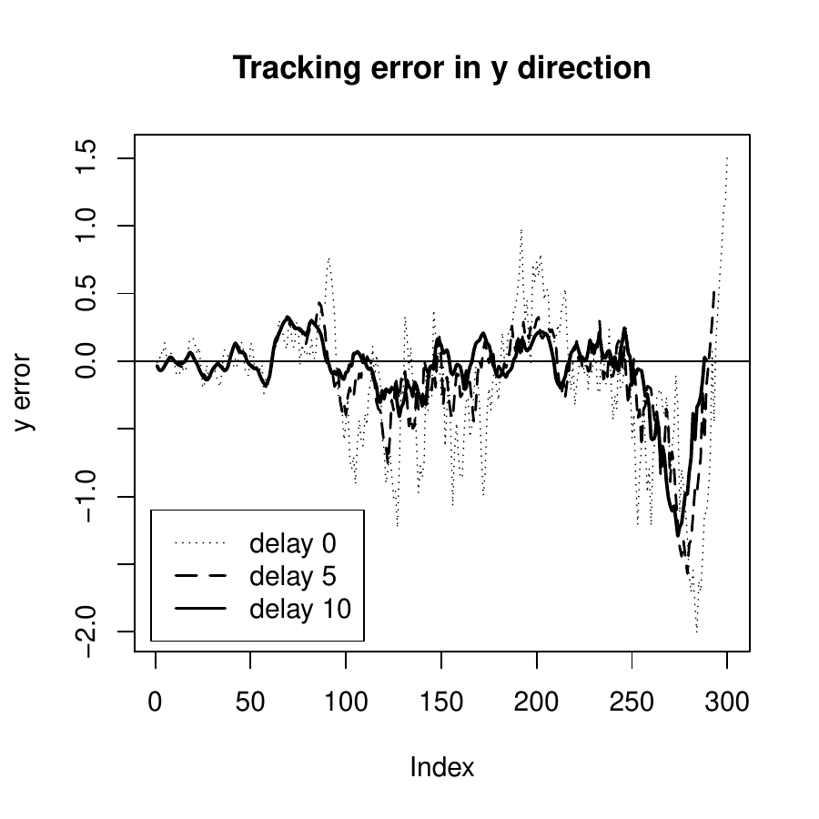

::: article
# Introduction: nonlinear time series analysis in R

Time series analysis investigates the dynamic dependence of data
observed over time or in space. While linear time series analysis has
been extensively studied in the literature with many software packages
widely available, nonlinear time series analysis only attracts limited
attention. Although there exist some software packages for analyzing
nonlinear time series focusing on different sets of tools, there are
still significant gaps in capability. The
[*NTS*](https://CRAN.R-project.org/package=NTS) [@RNTS], a recent R
package, provides a number of functions for simulating, analyzing, and
predicting nonlinear time series data. The available models include
univariate and multivariate TAR models, conditional intensity models,
nonlinear state-space models, and functional time series models. The
package also features various nonlinearity tests and sequential Monte
Carlo (SMC) methods. While *NTS* package does not intend to be
comprehensive, it fills the important missing parts of the existing
packages, providing users valuable tools for analyzing dependent data
with nonlinear dynamics. The package is now available from the
Comprehensive R Archive Network at
<http://CRAN.R-project.org/package=NTS>.

*NTS* incorporates the latest developments in statistical methods and
algorithms for analyzing nonlinear time series data, and it makes the
following contributions: (1) *NTS* offers various computational tools
with a wide range of applications, and it fills the gaps left by the
existing R functions. There are several R packages focusing on nonlinear
time series. The
[*nonlinearTseries*](https://CRAN.R-project.org/package=nonlinearTseries)
[@RnonlinearTseries] package implements the methods based on information
theory, the [*NlinTS*](https://CRAN.R-project.org/package=NlinTS)
[@RNlinTS] package introduces functions for causality detection and
neural networks, and the
[*nlts*](https://CRAN.R-project.org/package=nlts) [@Rnlts] package
emphasizes nonparametric autoregression and tests. *NTS*, providing
computational tools for TAR models, ACMx models, convolutional
functional autoregressive (CFAR) models, and non-Gaussian and nonlinear
state-space models, consists of some of the missing pieces in the
current coverage, hence making a more completed toolkit for nonlinear
time series analysis in R. Other well-known modern methods for nonlinear
data such as smoothing, deep learning and random forest that have been
implemented in packages [*sm*](https://CRAN.R-project.org/package=sm)
[@Rsm], [*tree*](https://CRAN.R-project.org/package=tree) [@Rtree] and
[*randomForest*](https://CRAN.R-project.org/package=randomForest)
[@RrandomForest] can be adopted for nonlinear time series analysis, even
though they are mainly designed for independent data. Hence, they are
not included in this package. (2) *NTS* provides complete solutions with
superior performance for the nonlinear models entertained. For example,
*NTS* implements estimation, prediction, model building and model
comparison procedures for TAR models. It allows the threshold variable
in the model to be a lag variable or an exogenous variable, while the
[*TAR*](https://CRAN.R-project.org/package=TAR) [@RTAR] package, using
Markov Chain Monte Carlo and Bayesian methods aiming to deal with
missing values, assumes the threshold variable is exogenous. Threshold
estimation methods in *NTS*, which perform recursive least squares or
nested sub-sample searching, are more computationally efficient than the
conditional least squares methods implemented in package
[*tsDyn*](https://CRAN.R-project.org/package=tsDyn) [@RtsDyn].
Furthermore, the threshold nonlinearity test proposed by @tsay1989 in
*NTS* is specifically designed for self-exciting TAR (SETAR) models
while the existing R package *nonlinearTseries* just conducts general
nonlinearity tests. In addition, *NTS* utilizes the out-of-sample
forecasting to evaluate different TAR models to avoid overfitting, while
other R packages such as *tsDyn* just compare TAR models based on AIC
and residuals. (3) *NTS* offers additional options to existing packages
with more flexibility. Specifically, *NTS* offers R functions to fit the
ACMx model for time series analysis of count data, which allow the
conditional distribution to be double Poisson, while the
[*tscount*](https://CRAN.R-project.org/package=tscount) [@Rtscount]
package uses the generalized linear models and only considers Poisson
and negative binomial distributions. Another example is that *NTS*
implements the estimation and prediction procedures of CFAR models
proposed by @liu2016functional, which give an intuitive and direct
interpretation for functional time series analysis and provide more
flexibility for estimation to deal with irregular observation locations
compared to functional autoregressive models developed by @bosq2000
introduced in the [*ftsa*](https://CRAN.R-project.org/package=ftsa)
[@Rftsa] package. (4) *NTS* provides easy access to SMC methods with
various options for statistical inference. It contains different R
functions which can be easily implemented for filtering and smoothing
and are much more user-friendly, while the
[*SMC*](https://CRAN.R-project.org/package=SMC) [@RSMC] package only
writes a generic function for SMC and requires more effort from users.

The goal of this paper is to highlight the main functions of the *NTS*
package. In the paper, we first consider different models for nonlinear
time series analysis, and provide an overview of the available functions
for parameter estimation, prediction and nonlinearity tests in the *NTS*
package. Then we discuss the functions for SMC methods and demonstrate
their applications via an example. Conclusions are given at the end.

# Models and methods available in *NTS* {#sec:models}

## TAR models

TAR models are a piecewise extension of the autoregressive (AR) model
proposed by [@tong1978]. It has been widely used in many scientific
fields, such as economics [@tong1980; @tiao1989], finance
[@domian1997; @narayan2006], among others [@chen1995a]. The models are
characterized by partitioning the Euclidean space into non-overlapping
regimes via a threshold variable and fitting a linear AR model in each
regime [@li2016]. The partition is by various thresholds in the domain
of the threshold variable.

Let $\{ r_i \mid i=0,\ldots,m\}$ be a sequence of real numbers
satisfying
$$r_0=-\infty <r_1<r_2<\ldots <r_{m-1}<r_m=\infty.$$
A time series $\{y_t| t=1,\ldots n\}$ follows an $m$-regime TAR model
with threshold variable $z_t$, threshold delay $d>0$, and order
$(p_1,\ldots,p_m)$, if
$$\begin{aligned}
\label{eqn:tar}
y_t=
\begin{cases}
\phi_{0,1}+\sum_{i=1}^{p_1} \phi_{i,1}y_{t-i}+\sigma_1 \epsilon_t, & if  z_{t-d} \leq r_1,\\
\phi_{0,2}+\sum_{i=1}^{p_2} \phi_{i,2}y_{t-i}+\sigma_2 \epsilon_t, & if  r_1< z_{t-d} \leq r_2,\\
\ldots\\
\phi_{0,m}+\sum_{i=1}^{p_m} \phi_{i,m}y_{t-i}+\sigma_m \epsilon_t, & if  r_{m-1}<z_{t-d},\\
\end{cases}
\end{aligned}   (\#eq:eqntar)$$
where $\phi_{i,j}$ are real numbers, $\sigma_1,\ldots,\sigma_m$ are
positive real numbers, and $\epsilon_t$ are i.i.d random variates with
mean 0 and variance 1. If the threshold variable $z_t=y_t$ for
$t=1,\ldots, n$, Model (\@ref(eq:eqntar)) is called a SETAR model with
delay $d$. The coefficients $\phi_{i,j}$ must satisfy certain conditions
for the stationarity of $y_t$. These conditions are complicated in
general, but some special cases are available in the literature. See,
for instance, [@chen1991] and the references therein. In particular, it
is interesting to point out that the stationarity of each marginal model
in (\@ref(eq:eqntar)) is not needed for the stationarity of $y_t$. As a
matter of fact, Model (\@ref(eq:eqntar)) would become more interesting
when some of the marginal models are nonstationary.

## Threshold estimation for two-regime TAR models

In this subsection, we introduce three algorithms for estimation of
two-regime TAR models.

The two-regime TAR model can be rewritten as
$$\begin{aligned}
\label{eq:tar2}
y_t=({\boldsymbol{\beta}}_1' {\mathbf x}_{t,1}+\sigma_1\epsilon_t) I(z_{t-d} \leq r_1) +({\boldsymbol{\beta}}_2' {\mathbf x}_{t,2}+\sigma_2 \epsilon_t)I(z_{t-d} > r_1),
\end{aligned}   (\#eq:tar2)$$
where $I(\cdot)$ is the indicator function,
${\mathbf x}_{t,j}=(1,y_{t-1},\ldots,y_{t-p_j})'$, and
$\boldsymbol{\beta}_j=(\phi_{0,j},\phi_{1,j}, \ldots,\phi_{p_j,j})'$
collects the AR coefficients in regime $j$, for $j=1,2$.

Define $p=\max\{p_1,p_2, d\}$, and
${\mathbf x}_j=({\mathbf x}_{p+1,j},\ldots, {\mathbf x}_{n,j})'$ for
$j=1,2$. Write ${\mathbf x}_1(r)={\mathbf x}_1 * I(z_{t-d}\leq r)$, and
${\mathbf x}_2(r)={\mathbf x}_2 * I(z_{t-d}>r)$, where $*$ denotes the
Hadamard product operator of matrices. Then Equation (\@ref(eq:tar2))
can be re-expressed in a matrix form
$$\begin{aligned}
\label{eq:tar_mat}
{\mathbf y}={\mathbf x}_1(r_1) \boldsymbol{\beta}_1+{\mathbf x}_2(r_1)\boldsymbol{\beta}_2+\mathbf{\varepsilon},
\end{aligned}   (\#eq:tar-mat)$$
where ${\mathbf y}=(y_{p+1},\ldots,y_n)'$,
$\mathbf{\varepsilon}=(\tilde{\epsilon}_{p+1},\ldots,\tilde{\epsilon}_n)'$, and
$\tilde{\epsilon}_t=[I(z_{t-d}\leq r_1) \sigma_1+I(z_{t-d}>r_1) \sigma_2]\epsilon_t$
for $t=p+1,\ldots, n$.

**(Conditional) least squares**: For each fixed threshold candidate $r$, least squares method can be
used to estimate the AR coefficients $\boldsymbol{\beta}_1$ and
$\boldsymbol{\beta}_2$,
$$\begin{aligned}
\label{eq:beta}
\hat{\boldsymbol{\beta}}_1(r)= [{\mathbf x}_1(r)' {\mathbf x}_1(r)]^{-1}{\mathbf x}_1(r)' {\mathbf y}, \quad \hat{\boldsymbol{\beta}}_2(r)= [{\mathbf x}_2(r)' {\mathbf x}_2(r)]^{-1}{\mathbf x}_2(r)' {\mathbf y}.
\end{aligned}   (\#eq:beta)$$
It yields the following error function
$$\begin{aligned}
\label{eq:Sn}
S_n(r)={\mathbf y}' {\mathbf y}- \hat{\boldsymbol{\beta}}_1(r)'{\mathbf x}_1(r)' {\mathbf x}_1(r) \hat{\boldsymbol{\beta}}_1(r) - \hat{\boldsymbol{\beta}}_2(r)'{\mathbf x}_2(r)' {\mathbf x}_2(r) \hat{\boldsymbol{\beta}}_2(r).
\end{aligned}   (\#eq:Sn)$$
To get sufficient number of observations in each regime for estimation,
we assume that the threshold value $r_1$ lies in a bounded interval
$[\underline{r}, \,\overline{r}]$. Then it can be estimated as
$$\begin{aligned}
\label{eq:obj}
\hat{r}_1=\arg \min_{r \in \{z_{p-d+1},\ldots,\, z_{n-d}\} \cap [\underline{r},\, \overline{r}]} S_n(r).
\end{aligned}   (\#eq:obj)$$

Recursive least squares method provides an efficient way to update the
least squares solution with new observations, and is much less
computationally expensive than the ordinary least squares method. When
we traverse all possible thresholds and calculate $S_n(r)$ in
(\@ref(eq:Sn)), recursive least squares can be used to estimate
$\boldsymbol{\beta}_1$ and $\boldsymbol{\beta}_2$ in (\@ref(eq:beta))
helping us effectively reduce the computational cost.

Let
${\cal S}=\{{z}_{p-d+1},\ldots,{z}_{n-d}\}\cap [\underline{r},\, \overline{r}]$
be the set containing all candidates for the threshold value, $n_0$ be
the number of elements in $\cal S$, ${z}_{(j)}$ be the $j$-th largest
value in set $\cal S$, and $t_{(j)}$ be the time index for ${z}_{(j)}$.
In other words, ${z}_{(j)}=z_{t_{(j)}}$.

Here is the algorithm of recursive least squares for TAR model
estimation:

1.  When ${z}_{(1)}$ is used as a tentative threshold value to estimate
    $\boldsymbol{\beta}_1$,
    $${\mathbf P}_1(1)=[{\mathbf x}_1({z}_{(1)})' {\mathbf x}_1({z}_{(1)})]^{-1}, \quad \hat{\boldsymbol{\beta}}_1({z}_{(1)})={\mathbf P}_1(1) {\mathbf x}_1({z}_{(1)})'{\mathbf y}.$$

    When ${z}_{(n_0)}$ is used as a tentative threshold value to
    estimate $\boldsymbol{\beta}_2$,
    $$\begin{aligned}
    {\mathbf P}_2(n_0)=[{\mathbf x}_{2}({z}_{(n_0)})' {\mathbf x}_2({z}_{(n_0)})]^{-1}, \quad  \hat{\boldsymbol{\beta}}_2({z}_{(n_0)})={\mathbf P}_2({n_0}){\mathbf x}_{2}({z}_{(n_0)})'{\mathbf y}.
    \end{aligned}$$

2.  For $k=2,\ldots,n_0$, we estimate the AR coefficients in regime 1
    with the following
    $$\begin{aligned}
    {\mathbf K}_1({k})&={\mathbf P}_1(k-1) {\mathbf x}_{t_{(k)}+d,1}/[1+{\mathbf x}_{t_{(k)}+d,1}'{\mathbf P}_1(k-1){\mathbf x}_{t_{(k)}+d,1}], \\
    {\mathbf P}_1(k)&={\mathbf P}_1(k-1)-{\mathbf K}_1(k) {\mathbf x}_{t_{(k)}+d,1}' {\mathbf P}_1(k-1),\\
    \hat{\boldsymbol{\beta}}_1({z}_{(k)})&=\hat{\boldsymbol{\beta}}_1({z}_{(k-1)})+{\mathbf K}_1(k)[y_{t_{(k)}+d}- \hat{\boldsymbol{\beta}}_1(z_{(k-1)})'{\mathbf x}_{t_{(k)}+d,1}].
    \end{aligned}$$
    For $k=n_0-1,\ldots,1$, we estimate the AR coefficients in regime 2
    with the following
    $$\begin{aligned}
    {\mathbf K}_2({k})&={\mathbf P}_2(k+1) {\mathbf x}_{t_{(k)}+d,2}/[1+{\mathbf x}_{t_{(k)}+d,2}'{\mathbf P}_2(k+1){\mathbf x}_{t_{(k)}+d,2}], \\
    {\mathbf P}_2(k)&={\mathbf P}_2(k+1)-{\mathbf K}_2(k) {\mathbf x}_{t_{(k)}+d,2}' {\mathbf P}_2(k+1),\\
    \hat{\boldsymbol{\beta}}_2({z}_{(k)})&=\hat{\boldsymbol{\beta}}_2({z}_{(k+1)})+{\mathbf K}_2(k)[y_{t_{(k)}+d}- \hat{\boldsymbol{\beta}}_2(z_{(k+1)})'{\mathbf x}_{t_{(k)}+d,2}].
    \end{aligned}$$

3.  With $\hat{\boldsymbol{\beta}}_1(z_{(j)})$ and
    $\hat{\boldsymbol{\beta}}_2(z_{(j)})$ for $j=1,\ldots, n_0$, we can
    obtain $S_n(z_{(j)})$ and then estimate $r_1$ with (\@ref(eq:obj)).

NeSS algorithm proposed by [@li2016] produces a much faster way to
search threshold candidates, and reduce the computational complexity
dramatically.

[@li2016] shows that there exists a positive constant $C$ depending only
on ${\mathbf y}$, $p_1$ and $p_2$, such that
$$\sup_{r \in [ \underline{r}, \, \overline{r}]} \Big | \frac{C-S_n(r)}{n}-J(r) \Big| \overset{p}{\to} 0,$$
where $J(r)$ is a non-stochastic continuous function over
$[\underline{r}, \overline{r}]$, and it is strictly monotonically
increasing in $[\underline{r}, r_1]$ and strictly monotonically
deceasing in $[r_1, \overline{r}]$. It implies that $S_n(r)$ may have
only one minimum value over the set
$\{k\Delta: k\in {\mathbb{Z}}\} \cap [\underline{r}, \overline{r}]$ for
some $\Delta>0$. This provides theoretical support for the following
NeSS algorithm to seek the minimizer of $S_n(r)$.

NeSS algorithm:

0.  Get the initial feasible set
    ${\cal S}=\{{z}_{p-d+1},\ldots,{z}_{n-d}\}\cap [\underline{r},\, \overline{r}]$
    for the threshold value estimation.

1.  Obtain the 25th, 50th, and 75th percentiles of the feasible set, and
    define them as $q_1$, $q_2$ and $q_3$, respectively. Calculate
    $S_n(q_1)$, $S_n(q_2)$, and $S_n(q_3)$.

2.  If $S_n(q_1)\leq S_n(q_2)$ and $S_n(q_1)\leq S_n(q_3)$, the feasible
    set is updated as ${\cal S} \cap (-\infty,q_2]$.\
    If $S_n(q_2)< S_n(q_1)$ and $S_n(q_2)\leq S_n(q_3)$, the feasible
    set is updated as ${\cal S} \cap [q_1,q_3]$.\
    Otherwise, the feasible set is updated as
    ${\cal S} \cap [q_2, +\infty)$.

    Repeat Steps 1-2 until the number of elements in the new feasible
    set is less than a pre-specified positive integer $k_0$.

3.  Minimize $S_n(r)$ over the new feasible set and get $\hat{r}_1$.

Comparing to the standard search algorithm which traverses all the
threshold candidates, NeSS algorithm reduces the number of least squares
operations from $O(n)$ to $O(\log n)$.

## R functions for TAR models in *NTS*

In the R package *NTS*, the function `uTAR` implements recursive least
squares estimation or the NeSS algorithm for TAR model estimation. The
two methods both have lower computational complexity than the existing R
function `setar` designed for SETAR model estimation in the *tsDyn*
package, which performs least squares estimation and adopts a single
grid search algorithm.

To illustrate, we use the following data generating process to compare
the performance of the three methods[^1].
$$\begin{aligned}
\label{eqn:example}
y_t=
\begin{cases}
1-0.3y_{t-1}+0.5y_{t-2}+ \epsilon_t, & if  y_{t-2} \leq 0.2,\\
-1+0.6y_{t-1}+0.3y_{t-2}+ \epsilon_t, & if   y_{t-2} > 0.2.
\end{cases}
\end{aligned}   (\#eq:eqnexample)$$
Table [1](#table:comp) summarizes the average elapsed time and mean
squared error (MSE) of the estimated threshold value for 200
replications. Recursive least squares method and NeSS algorithm
implemented by `uTAR` both take shorter time than `setar` when sample
size is large. It is also seen that when sample size is large, NeSS
algorithm is the fastest, but when the sample size is relatively small,
the recursive least squares method is the fastest.

::: {#table:comp}
  ------------------------------------- ----------------- -------- ------------------ ----------
  Function                               Sample size 200            Sample size 2000  

                                          Elapsed time      MSE       Elapsed time       MSE

  `uTAR` with recursive least squares        2.802s        0.0017       44.020s        2.08e-05

  `uTAR` with NeSS algorithm                 20.360s       0.0017       25.878s        2.08e-05

  `setar`                                    7.147s        0.0017       286.226s       2.08e-05
  ------------------------------------- ----------------- -------- ------------------ ----------

  : Table 1: Comparison among various R functions for SETAR model
  estimation (200 replicates)
:::

[]{#table:comp label="table:comp"}

Besides threshold value estimation for univariate time series, the *NTS*
package implements data generating, forecasting, model checking, and
model comparison procedures for both univariate and multivariate time
series into user-friendly computational tools. Table [2](#table:TAR)
lists these functions of *NTS* related to TAR models. In the following
we will demonstrate the usage of functions for univariate time series
through the data generating process in Model (\@ref(eq:eqnexample)).

::: {#table:TAR}
  --------------------------------------------------------------------------------------------------------
                           Function      Description
  ------------------------ ------------- -----------------------------------------------------------------
  Univariate TAR model     `uTAR.sim`    Generate a univariate SETAR process for up to 3 regimes

                           `uTAR`        Estimate univariate two-regime TAR models including threshold

                           `uTAR.est`    Estimate multiple regimes TAR models with known threshold(s)

                           `uTAR.pred`   Predict a fitted univariate TAR model

                           `thr.test`    Test for threshold nonlinearity of a scalar series

  Multivariate TAR model   `mTAR.sim`    Generate a multivariate two-regime SETAR process

                           `mTAR`        Estimate multivariate two-regime TAR models including threshold

                           `mTAR.est`    Estimate multivariate multiple-regime TAR models

                           `ref.mTAR`    Refine a fitted multivariate two-regime TAR model

                           `mTAR.pred`   Predict a fitted multivariate TAR model
  --------------------------------------------------------------------------------------------------------

  : Table 2: List of R functions about TAR models in the package *NTS*
:::

[]{#table:TAR label="table:TAR"}

The function `uTAR.sim` generates data from a given univariate SETAR
model for up to three regimes with following arguments: `nob` is the
sample size of the generated data, `arorder` specifies the AR orders for
different regimes, `phi` is a real matrix containing the AR coefficients
with one row for a regime, `d` is the time delay, `cnst` is a vector of
constant terms for the regimes, and `sigma` is a vector containing the
standard deviations of the innovation process of the regimes. It also
allows users to customize the burn-in period with option `ini`. The
function returns a list of components including the generated data from
the specified TAR model (`series`) and the innovation series (`at`).

We simulate the data generating process in Model (\@ref(eq:eqnexample))
with the following code. Figure [1](#fig:SETAR) shows the time series
plot of the first 200 observations of the simulated data.

``` r
R> set.seed(1687)
R> y <- uTAR.sim(nob = 2000, arorder = c(2,2), phi = t(matrix(c(-0.3, 0.5, 0.6,
+    -0.3), 2, 2)), d = 2, thr = 0.2, cnst = c(1, -1), sigma = c(1, 1))
```

{#fig:SETAR width="100%"
alt="graphic without alt text"}

Estimation of the threshold value of the two-regime SETAR process can be
done via the function `uTAR` as illustrated below:

``` r
R> thr.est<- uTAR(y = y$series, p1 = 2, p2 = 2, d = 2, thrQ = c(0, 1), Trim = c(0.1,  
+    0.9), include.mean = T, method = "NeSS", k0 = 50)
Estimated Threshold:  0.1951103 
Regime 1:  
     Estimate Std. Error   t value     Pr(>|t|)
X1  1.0356009 0.04902797  21.12265 8.946275e-85
X2 -0.3017810 0.01581242 -19.08506 2.383743e-71
X3  0.4890477 0.02707987  18.05945 7.230880e-65
nob1 & sigma1: 1236 1.017973 
Regime 2:  
     Estimate Std. Error    t value     Pr(>|t|)
X1 -1.1352678 0.07222915 -15.717585 2.107275e-48
X2  0.5560001 0.03177212  17.499622 7.360494e-58
X3 -0.2122922 0.04641671  -4.573616 5.596852e-06
nob2 & sigma2:  762 1.034592 
  
Overall MLE of sigma:  1.024343 
Overall AIC:  101.8515 

R> thr.est <- uTAR(y = y$series, p1 = 2, p2 = 2, d = 2, thrQ = c(0,1), Trim = c(0.1,  
+     0.9), include.mean = T, method = "RLS")
Estimated Threshold:  0.1951103 
Regime 1:  
     Estimate Std. Error   t value     Pr(>|t|)
X1  1.0356009 0.04902797  21.12265 8.946275e-85
X2 -0.3017810 0.01581242 -19.08506 2.383743e-71
X3  0.4890477 0.02707987  18.05945 7.230880e-65
nob1 & sigma1:  1236 1.017973 
Regime 2:  
     Estimate Std. Error    t value     Pr(>|t|)
X1 -1.1352678 0.07222915 -15.717585 2.107275e-48
X2  0.5560001 0.03177212  17.499622 7.360494e-58
X3 -0.2122922 0.04641671  -4.573616 5.596852e-06
nob2 & sigma2:  762 1.034592 
  
Overall MLE of sigma:  1.024343 
Overall AIC:  101.8515 
```

`uTAR` has the following arguments: `y` is a vector of observed time
seres, `p1` and `p2` are the AR order of regime 1 and regime 2,
respectively, `d` is the delay, and `thrV` contains the external
threshold variable $z_{t}$ which should have the same length as that of
`y`. For SETAR models, `thrV` is not needed and should be set to NULL.
`thrQ` determines the lower and upper quantiles to search for threshold
value. `Trim` defines the lower and upper trimmings to control the
minimum sample size in each regime and determine
$[\underline{r}, \overline{r}]$ for estimation. `include.mean` is a
logical value for including the constant term in each linear model.
`method` decides the way to search the threshold value, and there are
two choices, \"RLS\" for recursive least squares and \"NeSS\" for NeSS
algorithm. `k0` is only used when NeSS algorithm is selected to controls
the maximum sub-sample size.

From the output, the estimated threshold value is $0.195$, which is
close to the true value $0.2$. The estimated constant terms for regime 1
and regime 2 are $1.036$ and $-1.135$, respectively. The estimated AR
coefficients for regime 1 and regime 2 are $-0.302$, $0.489$, $0.556$,
and $-0.212$, respectively. The estimated standard deviations of the
innovation processes in two regimes are $1.018$ and $1.035$. As
expected, all estimates are significant and close their true parameters.

Here we provide an incomplete list of the returned values of the
function `uTAR`:

-   `residuals`: estimated innovations or residuals series.
-   `coefs`: a 2-by-($p+1$) matrix. The first row and second row show
    the estimated coefficients in regime 1 and 2, respectively.
-   `sigma`: estimated covariances of the innovation process in regime 1
    and regime 2.
-   `thr`: estimated threshold value.

Estimation of a multiple-regime TAR model with pre-specified threshold
values can be done by the function `uTAR.est`.

``` r
R> est <- uTAR.est(y = y$series, arorder = c(2, 2), thr = thr.est$thr, d = 2, 
+    output = FALSE)
```

Here `aroder` is a row vector of positive integers containing the AR
orders of all the regimes. `thr` collects the threshold values whose
length should be the number of regimes minus 1. `output` is a logical
value for printing out the estimation results with default being TRUE.
The function `uTAR.est` returns the following components: `coefs` is a
matrix with $m$ rows in which each row contains the estimated parameters
for one regime, `sigma` contains the estimated innovation variances for
different regimes, `residuals` collects the estimated innovations, and
`sresi` shows the standardized residuals.

The following R code provides one-step-ahead prediction with function
`uTAR.pred`.

``` r
R> set.seed(12)
R> pred <- uTAR.pred(model = est, orig = 2000, h = 1, iteration = 100, ci = 0.95,
+    output = TRUE)
Forecast origin:  2000 
Predictions: 1-step to  1 -step 
     step  forecast
[1,]    1 -1.429635
Pointwise  95  % confident intervals 
    step      Lowb      Uppb
int    1 -2.991667 0.6531542
```

The output above shows that the one-step ahead prediction for $y_{2001}$
is $-1.43$. Various options in the function `uTAR.pred` provide users
the flexibility to customize the forecasting origin with `orig`,
forecast horizon with `h`, number of iterations with `iterations`, and
confidence level with `ci`. The function `uTAR.pred` returns the
prediction with `pred`.

The R function `thr.test` in the *NTS* package implements the $F$ test
designed for SETAR models and proposed by [@tsay1989]. The test helps
users detect the existence of nonlinear dynamics in the data. Below is
the R code and output when we perform the nonlinearity tests with
`thr.test`.

``` r
R> thr.test(y$series, p = 2, d = 2, ini = 40, include.mean = T)
SETAR model is entertained 
Threshold nonlinearity test for (p,d):  2 2 
F-ratio and p-value:  213.0101 1.511847e-119 
```

`ini` is the initial number of data to start the recursive least square
estimation. The output shows that $p$-value is very small, and it
indicates that there is nonlinearity in the series `y$series`.

Back-testing can be used to evaluate the forecasting performance of a
model and to conduct model comparison between different models.
Back-testing for a univariate SETAR model is implemented through the
function `backTAR` with syntax:

``` r
R> backTAR(model, orig, h = 1, iter = 3000)
```

where `model` is an object returned by `uTAR` or `uTAR.est`, `h` is the
forecast horizon, and `iter` controls the number of simulation
iterations in prediction.

The function returns the model, out-of-sample rolling prediction errors
and predicted states. It also provides information for model comparison.
The following example shows the out-of-sample forecasting performance of
SETAR models with delay 2 and 1, respectively. It shows that the root
MSE, mean absolute error, and biases of the model with delay 2 are all
smaller than those of the model with delay 1. Hence, as expected, the
model with delay 2 is preferred.

``` r
R> set.seed(11)
R> backTAR(est, 50, 1, 3000)
Starting forecast origin:  50 
1-step to  1 -step out-sample forecasts 
RMSE:  1.02828 
 MAE:  0.8172728 
Bias:  -0.001337478 
Performance based on the regime of forecast origins:  
Summary Statistics when forecast origins are in State:  1 
Number of forecasts used:  1204 
RMSEj:  1.029292 
 MAEj:  0.8172963 
Biasj:  0.00259177 
Summary Statistics when forecast origins are in State:  2 
Number of forecasts used:  746 
RMSEj:  1.026645 
 MAEj:  0.817235 
Biasj:  -0.007679051 
```

``` r
R> thr.est2 <- uTAR(y = y$series, p1 = 2, p2 = 2, d = 1, thrQ = c(0, 1),
+    Trim=c(0.1, 0.9), include.mean = T, method = "RLS")
R> est2 <- uTAR.est(y = y$series, arorder = c(2, 2), thr = thr.est2$thr, d = 1)
R> set.seed(11)
R> backTAR(est2, 50, 1, 3000)
Starting forecast origin:  50 
1-step to  1 -step out-sample forecasts 
RMSE:  1.38731 
 MAE:  1.105443 
Bias:  -0.006635381 
Performance based on the regime of forecast origins:  
Summary Statistics when forecast origins are in State:  1 
Number of forecasts used:  1112 
RMSEj:  1.360347 
 MAEj:  1.090989 
Biasj:  0.2462278 
Summary Statistics when forecast origins are in State:  2 
Number of forecasts used:  838 
RMSEj:  1.4223 
 MAEj:  1.124622 
Biasj:  -0.3421769 
```

The usage of functions for multivariate two-regime TAR models listed in
Table [2](#table:TAR), including `mTAR.sim`, `mTAR`, `mTAR.pred`, is
similar to that of the univariate counterpart functions discussed
before. The only exception is that these multivariate functions take
different arguments to define the vector autoregressive(VAR)
coefficients:

-   `phi1, phi2`: VAR coefficient matrices of regime 1 and regime 2.
-   `sigma1, sigma2`: innovation covariance matrices of regime 1 and
    regime 2.
-   `c1, c2`: constant vectors of regime 1 and regime 2.
-   `delay`: two elements $(i,d)$ with \"$i$\" being the index of the
    component to be used as the threshold variable and \"$d$\" the delay
    for threshold variable.

The function `mTAR` conducts the nested sub-sample search algorithm and
provides different choices of criterion for threshold selection with the
option `score`, namely (AIC, det(RSS)). It has less computational cost,
but only applies to two-regime models. `mTAR.est` can handle multiple
regimes. They both return a list of components with the estimated VAR
coefficients in `beta`, estimated innovation covariance matrices in
`sigma`, and estimated innovations in `residuals`.

## Analysis of non-Gaussian time series

Autoregressive conditional mean (ACM) models are designed for time
series of count data, starting with the autoregressive conditional
Poisson models, and various extensions of ACM models were investigated.
The *NTS* includes a function `ACMx` for the estimation of ACMx models.
Let $y_t$ be the time series of interest, $\mathbf{x}_t$ be a vector
containing the exogenous variables, and
${\cal{F}}_t=\{ y_{t-1},y_{t-2},\ldots; \mathbf{x}_t, \mathbf{x}_{t-1},\ldots \}$.
The ACMx models postulate
$$y_t\mid {\cal F}_t \sim F(\cdot \mid \mu_t),$$
where
$\mu_t={\rm E}(y_t \mid {\cal F}_t)= \exp ({\mathbf x}_t' {\boldsymbol{\beta}})\lambda_t$,
and $\lambda_t$ follows the model
$$\lambda_t=\omega+\sum_{i=1}^p \alpha_i\left[ \frac{y_{t-i}}{\exp(\mathbf{x}_{t-i}' \boldsymbol{\beta})}\right] +\sum_{j=1}^q \gamma_j \lambda_{t-j},$$
$p$ and $q$ are nonnegative integers, $\omega>0$, and $\alpha_i$ and
$\gamma_j$ are parameters satisfying certain conditions so that
$\lambda_t$ is always positive and finite. The conditional distribution
$F(y_t\mid {\cal F}_t)$ can be Poisson, negative binomial, or double
Poisson [@tsay2018].

The estimation of ACMx models is implemented via the function `ACMx`
with syntax:

``` r
R> ACMx(y, order = c(1, 1), X = NULL, cond.dist = "po", ini = NULL)
```

where `y` is the series of count data, `X` is the matrix of exogenous
variables, `order` specifies the values for $p$ and $q$, `cond.dist`
determines the conditional distribution with options: \"po\" for
Poisson, \"nb\" for negative binomial, and \"dp\" for double Poisson,
and `ini` collects initial parameter estimates designed for use with
\"nb\" or \"dp\".

We illustrate the function `ACMx` with an example below:

``` r
R> set.seed(12)
R> x <- rnorm(1000)*0.1
R> y <- matrix(0, 1000, 1)
R> y[1] <- 2
R> lambda <- matrix(0, 1000, 1)
R> for (i in 2:1000){
+    lambda[i] <- 2 + 0.2*y[i-1]/exp(x[i-1]) + 0.5*lambda[i-1]
+    set.seed(i)
+    y[i] <- rpois(1, exp(x[i]) * lambda[i])
+  }
R> ACMx(y, order = c(1, 1), x, "po")
Initial estimates:  1.056732 1.738874 0.05 0.5 
loB:  -1.056732 1e-06 1e-06 1e-06 
upB:  3.170195 19.12762 0.5 0.999999 
Maximized log-likehood:  -2373.08 

Coefficient(s):
       Estimate  Std. Error  t value   Pr(>|t|)    
beta  1.0562836   0.1274853  8.28553 2.2204e-16 ***
omega 2.6696378   0.5569954  4.79293 1.6437e-06 ***
alpha 0.1579050   0.0265997  5.93634 2.9145e-09 ***
gamma 0.4427157   0.0913361  4.84711 1.2528e-06 ***
---
Signif. codes:  0 '***' 0.001 '**' 0.01 '*' 0.05 '.' 0.1 ' ' 1
```

Here a time series following the ACMx model with Poisson conditional
distribution, order (1,1), $\beta=1$, $\omega=2$, $\alpha=0.2$ and
$\gamma=0.5$ is generated. The R output reports the estimated
coefficients which are all significant and close to their true values.

## Functional time series

Functional time series analysis has received much attention since the
pioneering work of [@bosq2000], and has been widely applied in many
fields, including environmental science [@hormann2010], social science
[@hyndman2000], and finance [@diebold2006; @horvath2013].
[@liu2016functional] proposed a new class of models called the CFAR
models, which has an intuitive and direct interpretation of the dynamics
of a stochastic process. The *NTS* encompasses functions to implement
the method proposed by [@liu2016functional].

Before presenting these R functions, we briefly introduce the CFAR model
and its estimation procedure. A sequence of square integrable random
functions $\{X_t\mid t=1,\ldots, T\}$ defined on $[0,1]$ follows a CFAR
model of order $p$ if
$$X_t(s)=\sum_{i=1}^p \int_0^1 \phi_i(s-u)X_{t-i}(u)du +\epsilon_t(s), \quad s\in[0,1],$$
where $\phi_i(\cdot)$ are square integrable and defined on $[-1,1]$
($i=1,\ldots,p$) and are called the convolutional coefficient functions,
and $\epsilon_t$ are i.i.d. Ornstein-Uhlenbeck (O-U) processes defined
on \[0,1\] satisfying the stochastic differential equation,
$d\epsilon_t(s)=-\rho \epsilon_t(s)ds+\sigma dW_s$, $\rho>0$, and $W_s$
is a Wiener process.

In practice, $X_t(\cdot)$ is usually observed only at discrete points,
$s_i=i/N$, $i=0,\ldots N$ for time $t=1,\ldots T$. [@liu2016functional]
recovers the function $X_t(\cdot)$ by linear interpolation,
$$\widetilde{X}_t(s)=\frac{(s_i-s)X_t(s_{i-1})+(s-s_{i-1})X_t(s_i)}{1/N},  for  s_{i-1}\leq s< s_i,$$
and approximates $\phi_i(\cdot)$ by cubic B-splines,
$$\phi_i(\cdot) \approx \widetilde{\phi}_i(\cdot)=\sum_{j=1}^k {\beta}_{k,i,j}B_{k,j}(\cdot),  for  i=1,\ldots p,$$
where $\{B_{k,j},j=1,\ldots,k\}$ are uniform cubic B-spline basis
functions with $k$ degrees of freedom.

With the above approximation, the B-spline coefficients
$\boldsymbol{\beta}=\{{\beta}_{k,i,j}\}$, $\rho$, and $\sigma^2$ can be
estimated by maximizing the approximated log-likelihood function.
Specifically
$$(\hat{{\boldsymbol{\beta}}},\, \hat{\rho},\, \hat{\sigma}^2)=\arg \max Q(\boldsymbol{\beta}, \rho,\sigma^2),$$
where
$$Q(\boldsymbol{\beta}, \rho,\sigma^2)=C+\frac{(N+1)(T-p)}{2}\ln \left(\frac{\pi \sigma^2}{\rho}\right)-\frac{N(T-p)}{2}\ln (1-e^{-2\rho/N}) -\frac{1}{2}\sum_{t=1}^T \mathbf{e}_t' {\mathbf{\Sigma}}^{-1} \mathbf{e}_t,$$
where $C$ is a constant, $\mathbf{e}_t=(e_{t,0},\ldots e_{t,N})'$,
$e_{t,\ell}=X_t(\ell/N)-\sum_{i=1}^p \sum_{j=1}^k {\beta}_{k,i,j} \int_0^1 B_{k,j}(\ell/N-u) \widetilde{X}_t(s)du$
for $\ell=0,\ldots, N$, and $\mathbf{\Sigma}$ is an $(N+1)$-by-$(N+1)$
matrix with $\sigma^2 e^{-\rho |i-j|/N}$ as its $(i,j)$-th entry.

The convolutional functions are estimated by
$$\hat{\phi}_i(\cdot)=\sum_{j=1}^k \hat{\beta}_{k,i,j}B_{k,j}(\cdot).$$

In the *NTS* package, model specification and estimation of a CFAR
process can be carried out by the functions `F_test_cfar` and `est_cfar`
with the syntax:

``` r
R> F_test_cfar(f, p.max = 6, df_b = 10, grid = 1000)
R> est_cfar(f, p = 3, df_b = 10, grid = 1000)
```

The observed functional time series is stored in `f`, which is a
$T$-by-$(N+1)$ matrix, where $T$ is the length of time, and $(N+1)$ is
the number of discrete observations of the functional data at a given
time period. `p` specifies the CFAR order. `df_b` determines the degrees
of freedom $k$ for the natural cubic splines, and `grid` is the number
of grid points used to construct the functional time series and noise
process.

The function `F_test_cfar` returns the test statistics and the
$p$-values for a sequence of $F$-tests with
$H_0: \phi_k(\cdot)=0, \phi_i(\cdot)\neq 0, i=1\ldots, k-1$ versus
$H_a: \phi_i(\cdot) \neq 0, i=1,\ldots,k$ for $k=1,\ldots$, `p.max`. The
function `est_cfar` returns the following values: `phi_coef` collects
the estimated spline coefficients $\hat{\beta}_{k,i,j}$ for the
convolutional function(s) which is a $(\texttt{df\_b}+1)\times p$
matrix, and `phi_func` contains the estimated convolutional function
values which is a $(2\times \texttt{grid}+1) \times p$ matrix. `rho` is
the estimated $\rho$ in the O-U process, and `sigma` is estimated
standard deviation of the noise process, respectively.

The function `g_cfar` in the *NTS* package generates a CFAR process with
argument `tmax` being the length of time, `rho` is the parameter for the
O-U process, `sigma` is the standard deviation of the O-U process,
`phi_list` is the convolutional function(s), and `ini` is the burn-in
period. It returns a list with two components. One is `cfar`, a
`tmax`-by-(`grid`+1) matrix following the CFAR(p) model, and the other
one `epsilon` is the innovation at time `tmax`. Function `p_cfar`
provides the forecasts of a CFAR model with argument `model` as a result
of an `est_cfar` fit and argument `m` as the forecasting horizon.

Let us consider a CFAR(1) process with the following convolutional
coefficient function
$$\begin{aligned}
\label{cfar}
\phi(s)=\frac{10}{\sqrt{2\pi }}e^{-50s^2}, \quad s\in[-1,1],
\end{aligned}   (\#eq:cfar)$$
where $\phi(\cdot)$ is the probability density function of a Gaussian
random variable with mean 0 and standard deviation 0.1 truncated in the
interval $[-1,1]$. For the O-U process, $\rho=5$ and its standard
deviation is 1. The following R code simulates such a CFAR(1) process
specified in Equation (\@ref(eq:cfar)) with $N=50$, $T=1000$, and
burn-in period 100, conducts an $F$ test, performs the estimation
procedure, and provides a one-step ahead prediction.

``` r
R> phi_func <- function(x){
+    return(dnorm(x, mean = 0, sd = 0.1))
+  }
R> t <- 1000; N <- 50
R> x <- g_cfar(t, rho = 5, phi_func, sigma = 1, ini = 100)
R> f <- x$cfar[, seq(1, 1001, 1000/N)]
R> F_test_cfar(f, p.max = 2, df_b = 10, grid = 1000)
Test and p-value of Order 0 vs Order 1:  
[1] 1368.231    0.000
Test and  p-value of Order 1 vs Order 2 :  
[1] 0.6848113 0.7544222
R> model <- est_cfar(f, p = 1, df_b = 10, grid = 1000)
R> print(c(model$rho, model$sigma))
[1] 4.940534 1.005315
R> pred <- p_cfar(model, f, m = 3)
```

{#fig:cfar width="100%"
alt="graphic without alt text"}

From the output, the $p$-values for $F$ tests suggest that we choose
CFAR(1) model for the data. $\hat{\rho}=4.941$ and the standard
deviation of the noise process is estimated as $1.005$, and they are
both close to their true values. Figure [2](#fig:cfar) plots the
estimated convolutional coefficient function (dashed line) and true
function $\phi(\cdot)$ (solid line). It can be seen that `est_cfar`
performs well.

`F_test_cfarh` and `est_cfarh` in *NTS* can deal with heteroscedasticity
and irregular observation locations, while the existing R package *ftsa*
designed for functional time series assumes that the functional data are
observed at regular locations. The two functions come with following
arguments: `weight` is the heteroscedasticity weight function of the
noise process with `grid`+1 elements, `num_obs` is a $t$-by-$1$ vector
and collects the numbers of observations at different times, and `x_pos`
is a $t$-by$(N+1)$ matrix and shows the observation locations, where
$(N+1)$ is the maximum number of observation at a time. The R code below
will yield the same results as the previous one does. Hence, the output
is omitted.

``` r
R> num_obs <- rep(N+1, t); x_pos <- matrix(rep(seq(0, 1, 1/N), each = t), t, N+1);
R> weight0 <- function(x){return(rep(1, length(x)))}
R> F_test_cfarh(f, weight0, p.max = 2, df_b = 10, grid = 1000, num_obs, x_pos)
R> modelh <- est_cfarh(f, weight0, p = 1, df_b = 10, grid = 1000, num_obs, x_pos)
```

# State-space modelings via SMC methods

It is challenging to derive analytic solutions for filtering or
smoothing of nonlinear or non-Gaussian state-space models. The SMC
approach fully utilizes the dynamic nature of the model, and is an
effective way to solve such complex problems [@tsay2018]. Consider the
state-space model:
$$\begin{aligned}
State equation:	&x_t=s_t(x_{t-1},\epsilon_t) & or  &x_t \sim q_t(\cdot \mid x_{t-1}),\\
Observation equation:&y_t=h_t(x_t, e_t) & or  & y_t\sim f_t(\cdot \mid x_t),
\end{aligned}$$
where $x_t$ is the unobservable state variable and $y_t$ is the
observation ($t=1,\ldots T$). The underlying states evolve through the
known function $s_t(\cdot)$ and the state innovation $\epsilon_t$,
following a known conditional distribution $q_t(\cdot)$. The information
on the underlying states is observed indirectly through $y_t$ via the
known function $h_t(\cdot)$ and with observational noise $e_t$. The
function $h_t(\cdot)$ and the distribution of $e_t$ are known with
possibly unknown parameters to be estimated.

In general, there are four main statistical inference objectives
associated with a state-space model:

1.  Filtering: obtain the marginal posterior distribution of the current
    state $x_t$ given the entire history of the observations up to the
    current time, that is, $p(x_t \mid y_1, \ldots y_t)$.

2.  Prediction: obtain the marginal posterior distribution of the future
    state given the current available information, that is,
    $p(x_{t+1}\mid y_1,\ldots, y_t)$.

3.  Smoothing: obtain the posterior distribution of the state at the
    time $t$ given the entire available information, that is,
    $p(x_{t} \mid y_1,\ldots, y_T)$ for $t<T$.

4.  Likelihood and parameter estimation. SMC uses a set of weighted
    samples $\{x_t^{(j)},w_t^{(j)}\}$ to evaluate the likelihood
    function $L(\theta)=p(y_1,\ldots,y_T\mid \theta)
    =\int p(x_1,\ldots,x_T, y_1,\ldots,y_T\mid \theta)dx_1\ldots dx_T$.

SMC is a recursive procedure with three components:

-   **Propagation step**: At time $t$ for $j=1,\ldots, m$: draw
    $x_t^{(j)}$ from a trial distribution
    $g_t(x_t \mid {\mathbf x}_{t-1}^{(j)},y_t)$, where $m$ is the Monte
    Carlo sample size. Attach it to ${\mathbf x}_{t-1}^{(j)}$ to form
    ${\mathbf x}_{t}^{(j)}=({\mathbf x}_{t-1}^{(j)}, x_t^{(j)})$.
    Compute the new weight for $x_{t}^{(j)}$.
-   **Resampling step**: Sample a set of indices $\{I_1, \ldots, I_m\}$,
    where $I_k\in \{1, \ldots, m \}$ according to a set of priority
    scores $\alpha_t^{(j)}$, $j=1,\ldots, m$. Replace the sample with
    $\{x_t^{(I_j)}, \tilde{w}_t^{(I_j)}=w^{(I_j)}_t/\alpha^{(I_j)}_t\}$.
-   **Inference Step**: Estimation of
    ${\rm E}_{\pi_t}[(h({\mathbf x}_t)]$ for some integrable function
    $h(\cdot)$ using the generated weighted samples
    $({\mathbf x}_t^{(j)}, w_t^{(j)})$, $j=1,\ldots,m$, where
    $\pi_t(\cdot)$ is the target distribution.

The selection of the propagation trial distribution
$g_t(x_t\mid {\mathbf x}_{t-1},y_t)$ plays a key role for an efficient
implementation of SMC. Since the efficiency of SMC is determined by the
variance of weight distribution, one would naturally want to choose
$g_t(\cdot)$ so that the incremental weight is as close to a constant as
possible. @LiuChen1995 [@LiuChen1998] proposed the trial distribution
$$g_t(x_t\mid {\mathbf x}_{t-1})=p(x_t\mid {\mathbf x}_{t-1},{\mathbf y}_t)\quad  \propto\quad  q_t(x_t\mid x_{t-1})f_t(y_t\mid x_t).$$
The proposed distribution utilizes information from both the state and
observation equations, hence is termed a full information propagation
step.

**Algorithm: Full information propagation step**  
At time $t$, for $j=1,\ldots,m$:

1.  Draw $x_t^{(j)}$ from the local posterior distribution,
    $$\begin{aligned}
    g_t(x_t\mid x_{t-1}^{(j)}, y_t)=p(x_t \mid x_{t-1}^{(j)},y_t)\, \propto\,  f_t(y_t\mid x_t)q_t(x_t \mid x_{t-1}^{(j)}).
    \end{aligned}$$

2.  Compute the incremental weight
    $$u_t^{(j)}=\int f_t(y_t \mid x_t) q_t(x_t \mid x_{t-1}^{(j)})dx_t,$$
    and the new weight $w_t^{(j)}=w_{t-1}^{(j)}u_t^{(j)}$.

Because using full information propagation allows for more efficient
estimation procedure with Rao-Blackwellization, in *NTS* we provide a
specific function for it, different from the more general function using
any user designed propagation function.

It is shown that the variance of the weight distributions stochastically
increases over time. Continuing to propagate the samples with small
weights forward is a waste of computational resources since inference is
based on weighted average of the samples. One solution is to use
resampling schemes to duplicate the importance samples and to eliminate
the ones with low weights. Hence resampling steps are essential in SMC
implementations. Another issue to consider is how to make inference as
efficient as possible. Rao-Blackwellization is one of the effective
tools that can be used.

Smoothing is another important inference to make when we analyze data
with state-space models. Delayed estimation (e. g. , making inference on
$p(x_{t-d}\mid y_1,\ldots,y_t)$) is a special case of smoothing. It can
be achieved simply by using the weighted sample
$\{(x_{t-d},w_t^{(j)})\}$. However, when $d$ is large, this sampling
approach does not work well because resampling reduces the number of
unique ancestors and thus increases the estimation errors. A more
efficient algorithm is to calculate the backward smoothing weights,
after obtaining the forward filtering weighted samples
$\{(x_t^{(j)},w_t^{(j)}), j=1,\ldots,m\}$. The resulting weighted sample
$\{(x_t^{(j)}, \tilde{w}_t^{(j)}), j=1,\ldots,m\}$ is properly weighted.

**Algorithm: Weight marginalization SMC smoother**  
Let $\tilde{w}_T^{(j)}=w_T^{(j)}, j=1,\ldots,m$. For
$t=T-1,T-2,\ldots, 1$ and $j=1,\ldots, m$:\
Calculate
$$\tilde{u}_t^{(j)}=\sum_{i=1}^m \frac{q_{t+1}(x_{t+1}^{(i)}\mid x_t^{(j)})}{\sum_{k=1}^m q_{t+1}(x_{t+1}^{(i)}\mid x_t^{(k)}) w_t^{(k)}} \tilde{w}_{t+1}^{(i)},$$
and the smoothing weight $\tilde{w}_t^{(j)}=w_t^{(j)}\tilde{u}_t^{(j)}$.

Table [3](#table:SMC) lists functions in *NTS* that implement the
aforementioned SMC procedures. Compared to the existing R package *SMC*
coming with one generic function, *NTS* provides various functions for
statistical inference and are much more user-friendly.

::: {#table:SMC}
  ------------------------------------------------------------------------------------------------------------
  Usage              Function        Description
  ------------------ --------------- -------------------------------------------------------------------------
  Generic function   `SMC`           SMC method with delay but not using a full information propagation step

                     `SMC.Smooth`    SMC smoothing method

                     `SMC.Full`      SMC method using a full information propagation step

                     `SMC.Full.RB`   SMC method using a full information propagation step with

                                     Rao-Blackwellization estimate and no delay
  ------------------------------------------------------------------------------------------------------------

  : Table 3: List of R functions about SMC in package *NTS*
:::

[]{#table:SMC label="table:SMC"}

The `SMC` function can be called by:

``` r
R> SMC(Sstep, nobs, yy, mm, par, xx.init, xdim, ydim, resample.sch,
+    delay = 0, funH = identity)
```

The following arguments need to be specified for `SMC`.

-   `Sstep`: A function that performs one step propagation using a
    proposal distribution. Its input variables include
    (`mm, xx, logww, yyy, par, xdim, ydim`), where `xx` and `logww` are
    the prior iteration samples and their corresponding log weights, and
    `yyy` is the observation at current time step. It returns a list
    that contains `xx` (the sample $x_t$) and `logww` (their
    corresponding log weights).
-   `nobs`: the number of observations, $T$.
-   `yy`: the observations with $T$ columns and `ydim` rows.
-   `mm`: the Monte Carlo sample size $m$.
-   `par`: a list of parameter values to pass to `Sstep`.
-   `xx.init`: the initial samples of $x_0$.
-   `xdim, ydim`: the dimension of the state variable $x_t$ and the
    observation $y_t$.
-   `resample.sch`: a binary vector of length `nobs`, reflecting the
    resampling schedule.\
    `resample.sch[i]=1` indicates resample should be carried out at step
    $i$.
-   `delay`: the maximum delay lag for delayed wighting estimation.
    Default is zero.
-   `funH`: a user supplied function $h(\cdot)$ for estimating
    ${\rm E}(h(x_t)\mid y_{t+d})$. Default is identify function for
    estimating the mean with no delay. The function should be able to
    take vector or matrix as input and operates on each element of the
    input.

The function returns `xhat`, an array with dimensions
(`xdim,nobs,delay+1`) and the scaled log-likelihood value `loglike`. The
functions `SMC.Smooth`, `SMC.Full` and `SMC.Full.RB` have similar inputs
and outputs, except that `SMC.Smooth` needs another input function for
the backward smoothing step and `funH` is a function for estimating
${\rm E}(h(x_t)\mid y_1,\ldots, y_{T})$.

Here is an example demonstrating how to implement SMC methods using the
*NTS* package. Passive sonar is often used in military surveillance
systems to track a target and to reduce the chance to be detected by the
target. Without using an active sonar, it collects the signals generated
by the motion of the target, and thus only the direction (or bearing) of
the target is observed with error. With multiple detectors, the location
of the target can be identified
[@peach1995; @kronhamn1998; @arulampalam2004; @tsay2018].

Suppose the target is moving in a two-dimensional plane and there are
two stationary detectors located on the same plane at
$(\eta_{i1},\eta_{i2})$ $(i=1,2)$ corresponding to a Cartesian
coordinate. At each time $t$ the observations consist of two angles
$\phi_{it}$ $(i=1,2)$ of the target related to the detectors with noise.
Assume that the target is moving with random acceleration in both
directions. We use $d_{1t}$ and $d_{2t}$ to denote the true locations at
time $t$ in $x$ axis and $y$ axis respectively, and $s_{1t}$ and
$s_{2t}$ to denote the speed at time $t$ in $x$ axis and in $y$ axis
respectively. Let $\Delta T$ be the time duration between two
consecutive observations and we assume that the target maintains a
random but constant acceleration between two consecutive observations.
$\epsilon_{1t}$ and $\epsilon_{2t}$ are the total acceleration within
the period in $x$ and $y$ directions which are assumed to follow
$N(0,q_1^2)$ and $N(0,q_2^2)$, respectively. The motion model is
$$\begin{aligned}
d_{it}&=d_{it-1}+s_{t-1}\Delta T +0.5 \Delta T \epsilon_{it}, \quad \epsilon_{it} \sim N(0,q_i^2),\\
s_{it}&=s_{i,t-1}+\epsilon_{it}, \quad  for  i=1,2.
\end{aligned}$$

The unobserved state variable is $x_t=(d_{1t},d_{2t},s_{1t},s_{2t})'$.
One observes only the directions of the target with observational
errors. Assume $\Delta T=1$, the system can be rewritten as
$$\begin{aligned}
\text{State equation}&\quad  x_t=\mathbf{H} x_{t-1} +\mathbf{W} w_t \label{state_eq},
\end{aligned} (\#eq:state-eq)$$
$$\begin{aligned}
\text{Observation equation} & \quad \phi_{it}={\rm arc} \, {\rm tan} \left(\frac{d_{2t}-\eta_{i2}}{d_{1t}-\eta_{i1}} \right)+e_{it},  for  i=1,2, \label{ob_eq}
\end{aligned}   (\#eq:ob-eq)$$
where
$$\begin{aligned}
\mathbf{H}=
\begin{pmatrix}
1	&0	&1	&0\\
0	&1	&0	&1\\
0	&0	&1	&0\\
0	&0	&0	&1
\end{pmatrix}, \quad \mathbf{W}=
\begin{pmatrix}
0.5q_1 &0 	\\
0	&0.5q_2\\
q_1	&0\\
0	&q_2
\end{pmatrix},
\end{aligned}$$
$w_t=[w_{t1}\, w_{t2}]'$, $w_{it} \sim N(0,1)$ and
$e_{it} \sim N(0, r^2)$ for $i=1,2$. We restrict
$\phi_{it} \in [-\pi/2, \pi/2]$. This problem is highly nonlinear.

In this example, the sensors are placed as $(\eta_{11},\eta_{12})=(0,0)$
and $(\eta_{21},\eta_{22})=(20,0)$, and the measurement errors $e_{1t}$
and $e_{2t}$ follow $N(0,0.02^2)$. A target moves with an initial value
$x_0=(10,0,0.01,0.01)$ and a random acceleration with variance
$q_1^2=q_2^2=0.03^2$ in both directions.

We use the following code to generate data.

``` r
R> simPassiveSonar <- function(nn = 300, q, r, W, V, s2, start, seed){
+    set.seed(seed)
+    x <- matrix(nrow = 4, ncol = nn)
+    y <- matrix(nrow = 2, ncol = nn)
+    for(ii in 1:nn){    
+      if(ii == 1) x[, ii] <- start
+      if(ii > 1) x[, ii] <- H%*%x[, ii - 1] + W%*%rnorm(2)
+      y[1, ii] <- atan(x[2, ii]/x[1, ii])
+      y[2, ii] <- atan(x[2, ii]/(x[1, ii] - s2))
+      y[, ii] <- (y[, ii] + V%*%rnorm(2) + 0.5*pi)%%pi -0.5*pi
+    }
+    return(list(xx = x, yy = y, H = H, W = W, V = V))
+  }

R> s2 <- 20; nobs <- 300  
R> q <- c(0.03, 0.03); r <- c(0.02, 0.02)
R> start <- c(10, 10, 0.01, 0.01)
R> H <- c(1, 0, 1, 0, 0, 1, 0, 1, 0, 0, 1, 0, 0, 0,  0,1)
R> H <- matrix(H, ncol = 4, nrow = 4, byrow = T)
R> W <- c(0.5*q[1], 0, 0, 0.5*q[2], q[1], 0, 0, q[2])
R> W <- matrix(W, ncol = 2, nrow = 4, byrow = T)
R> V <- diag(r)
R> simu_out <- simPassiveSonar(nobs, q, r, W, V, s2, start, seed = 2000)
R> plot(simu_out$xx[1, ], simu_out$xx[2, ], xlab = 'x', ylab = 'y', type = "l")
R> points(c(0, 20), c(0, 0), pch = 15, cex = 2)
```

{#fig:SMC width="100%"
alt="graphic without alt text"}

Figure [3](#fig:SMC) shows a simulated trajectory for $t=1,\ldots, 300$,
which contains two sharp turns in the middle of the observational
period.

We consider using the state equation as the proposal distribution.
Specifically, given $x_{t-1}^{(i)}$, generate $x_t^{(j)}$ using
(\@ref(eq:state-eq)). The incremental weight
$u_t^{(j)} \propto p(y_t \mid x_t^{(j)})=\sum_{i=0}^m p(y_t \mid x_t^{(j)})$
becomes
$$u_t^{(j)} \exp \left\{- \frac{(\phi_{1t}-\hat{\phi}_{1t}^{(j)})^2 +(\phi_{2t}-\hat{\phi}_{2t}^{(j)})^2}{2 r^2} \right\}.$$

The following statements are user generated functions for SMC
implementation.

``` r
R> SISstep.Sonar <- function(mm, xx, logww, yy, par, xdim = 1, ydim = 1){
+    H <- par$H; W <- par$W; V <- par$V; s2 <- par$s2;
+    xx <- H%*%xx + W%*%matrix(rnorm(2*mm), nrow = 2, ncol = mm)
+    y1 <- atan(xx[2, ]/xx[1, ])
+    y2 <- atan(xx[2,]/(xx[1,] - s2))   
+    res1 <- (yy[1] - y1 + 0.5*pi)%%pi - 0.5*pi
+    res2 <- (yy[2] - y2 + 0.5*pi)%%pi - 0.5*pi
+    uu <- -res1**2/2/V[1, 1]**2 - res2**2/2/V[2, 2]**2
+    logww <- logww + uu
+    return(list(xx = xx, logww = logww))
+  }

R> SISstep.Smooth.Sonar <- function(mm, xxt, xxt1, ww, vv, par){
+    H <- par$H; W <- par$W;
+    uu <- 1:mm
+    aa <- 1:mm
+    xxt1p <- H%*%xxt
+    for(i in 1:mm){
+      res1 <- (xxt1[1, i] - xxt1p[1, ])/W[1,1]
+      res2 <- (xxt1[2, i] - xxt1p[2, ])/W[2, 2]
+      aa[i] <- sum(exp(-0.5*res1**2 - 0.5*res2**2)*ww)
+    }
+    for(j in 1:mm){
+      res1 <- (xxt1[1, ] - xxt1p[1, j])/W[1, 1]
+      res2 <- (xxt1[2, ] - xxt1p[2, j])/W[2, 2]
+      uu[j] <- sum(exp(-0.5*res1**2 - 0.5*res2**2)*vv/aa)
+    }
+    vv <- ww*uu
+    return(list(vv = vv))
+ }
```

Now we are ready to run the Monte Carlo sample with size $m=10000$.

``` r
R> mm <- 100000
R> set.seed(1)
R> resample.sch <- rep(1,nobs)
R> xdim <- 4; ydim <- 2
R> mu0 <- start; SS0 <- diag(c(1, 1, 1, 1))*0.01
R> xx.init <- mu0 + SS0%*%matrix(rnorm(mm*4), nrow = 4, ncol = mm)
R> par <- list(H = H, W = W, V = V, s2 = s2)
R> delay <- 10
R> out <- SMC(SISstep.Sonar, nobs, yy, mm, par, xx.init, xdim, ydim, resample.sch, delay)
R> tt <- 100:nobs
R> plot(simu_out$xx[1, tt], simu_out$xx[2, tt], xlab = 'x', ylab = 'y')
R> for(dd in c(1, 6, 11)){
+      tt <- 100:(nobs - dd)
+      lines(out$xhat[1, tt, dd], out$xhat[2, tt, dd], lty = 23 - 2*dd, lwd = 1)
+    }
> legend(25, 22.5, legend = c("delay 0", "delay 5", "delay 10"), lty = c(21, 11, 1))
```

The top left panel in Figure [4](#fig:SMC2) shows the delayed estimation
using the delay weighting method with delay $d=0$, 5, and 10, and Monte
Carlo sample size $m=10000$. The bottom panels in Figure [4](#fig:SMC2)
plot the estimation error in the $x$ and $y$ directions. The benefit of
using delayed estimation can be clearly seen.

<figure id="fig:SMC2">
<p></p>
<figcaption>Figure 4: Delayed filtering and smoothing results for the
SMC example generated from Equation (9) and Equation (10).</figcaption>
</figure>

SMC smoothing can be implemented with the following R code. The top
right panel in Figure [4](#fig:SMC2) plots the smoothing results, and it
shows that the SMC smoothing function performs very well.

``` r
R> set.seed(1)
R> mm <- 5000
R> par <- list(H = H, W = W, V = V, s2 = s2)
R> xx.init <- mu0 + SS0%*%matrix(rnorm(mm*4), nrow = 4, ncol = mm)
R> out.s5K <- SMC.Smooth(SISstep.Sonar, SISstep.Smooth.Sonar, nobs, yy, mm, par,
+      xx.init, xdim, ydim, resample.sch)
R> plot(simu_out$xx[1, tt], simu_out$xx[2, tt], xlab = 'x', ylab = 'y')
R> lines(out.s5K$xhat[1, tt], out.s5K$xhat[2, tt], lty = 1, lwd = 2)
+      legend(17, 19.5, legend = c("SMC Smoother"), lty = 1, lwd = 2)
```

# Conclusion

The paper introduces the R package *NTS* which offers a broad collection
of functions for the analysis of nonlinear time series data. We briefly
review various nonlinear time series models, including TAR models, ACMx
models, CFAR models, and state-space models. The associated estimation,
identification, and forecasting procedures are discussed. The *NTS*
package provides computational tools to fit these models, to evaluate
their performance, and to provide predictions. Furthermore, the
functions can be used, extended, and modified within the package to
analyze larger univariate/multivariate, Gaussian/non-Gaussian time
series. These features enable users to carry out a comprehensive and
complex analysis of time series without the constraints from software
availability.

Chen's research is supported in part by National Science Foundation
grants DMS-1503409, DMS-1737857, IIS-1741390 and CCF-1934924. Tsay's
research is supported in part by the Booth School of Business,
University of Chicago.
:::

[^1]: The program is run on a personal computer with a 2.30GHz Intel
    Core(TM)i5-8259U CPU, 16GB RAM and 64-bit Operating system.
