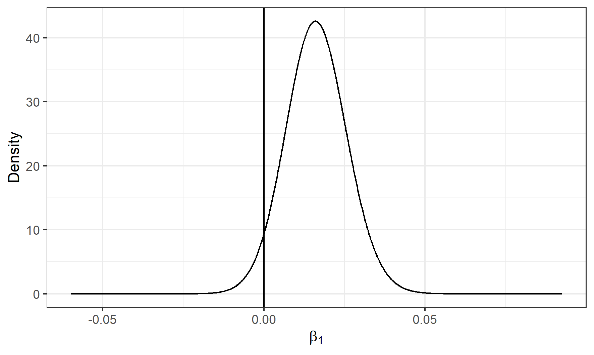

# Introduction

Species distribution models are widely used in ecology to predict and
understand spatial patterns, assess the influence of climatic and
environmental factors on species occurrence, and identify rare and
endangered species. These models are crucial for the development of
appropriate strategies that help protect species and the environments
where they live. In this paper, we demonstrate how to formulate spatial
point processes for species distribution modeling and how to fit them
with the R-INLA package [@rueetal09] (<http://www.r-inla.org/>).

Point processes are stochastic models that describe locations of events
of interest and possibly some additional information such as marks that
inform about different types of events [@diggle13; @moragaandmontes11].
These models can be used to identify patterns in the distribution of the
observed locations, estimate the intensity of events (i.e., mean number
of events per unit area), and learn about the correlation between the
locations and spatial covariates. The simplest theoretical point process
model is the homogeneous Poisson process. This process satisfies two
conditions. First, the number of events in any region $A$ follows a
Poisson distribution with mean $\lambda |A|$, where $\lambda$ is a
constant value denoting the intensity and $|A|$ is the area of region
$A$. And second, the number of events in disjoint regions are
independent. Thus, if a point pattern arises as a realization of an
homogeneous Poisson process, an event is equally likely to occur at any
location within the study region, regardless of the locations of other
events.

In many situations, the homogeneous Poisson process is too restrictive.
A more interesting point process model is the log-Gaussian Cox process
which is typically used to model phenomena that are environmentally
driven [@diggleetal13]. A log-Gaussian Cox process is a Poisson process
with a varying intensity which is itself a stochastic process of the
form $\Lambda(s) = exp(Z(s))$ where $Z = \{Z(s): s \in \mathbb{R}^2\}$
is a Gaussian process. Then, conditional on $\Lambda(s)$, the point
process is a Poisson process with intensity $\Lambda(s)$. This implies
that the number of events in any region $A$ is Poisson distributed with
mean $\int_A \Lambda(s)ds$, and the locations of events are an
independent random sample from the distribution on $A$ with probability
density proportional to $\Lambda(s)$. The log-Gaussian Cox process model
can also be easily extended to include spatial explanatory variables
providing a flexible approach for describing and predicting a wide range
of spatial phenomena.

In this paper, we formulate and fit a log-Gaussian Cox process model for
sloth occurrence data in Costa Rica that incorporates spatial covariates
that can influence the occurrence of sloths, as well as random effects
to model unexplained variability. The model allows to estimate the
intensity of the process that generates the data, understand the overall
spatial distribution, and assess factors that can affect spatial
patterns. This information can be used by decision-makers to develop and
implement conservation management strategies.

The rest of the paper is organized as follows. First, we show how to
retrieve sloth occurrence data using the
[spocc](https://CRAN.R-project.org/package=spocc) package [@Rspocc] and
spatial climatic variables using the
[raster](https://CRAN.R-project.org/package=raster) package [@Rraster].
Then, we detail how to formulate the log-Gaussian Cox process and how to
use R-INLA to fit the model. Then, we inspect the results and show how
to obtain the estimates of the model parameters, and how to create
create maps of the intensity of the predicted process. Finally, the
conclusions are presented.

# Sloth occurrence data

Sloths are tree-living mammals found in the tropical rain forests of
Central and South America. They have an exceptionally low metabolic rate
and are noted for slowness of movement. There are six sloth species in
two families: two-toed and three-toed sloths. Here, we use the R package
spocc [@Rspocc] to retrieve occurrence data of the three-toed
brown-throated sloth in Costa Rica.

The spocc package provides functionality for retrieving and combining
species occurrence data from many data sources such as the Global
Biodiversity Information Facility (GBIF) (<https://www.gbif.org/>), and
the Atlas of Living Australia (ALA) (<https://www.ala.org.au/>). We use
the occ() function from spocc to retrieve the locations of
brown-throated sloths in Costa Rica recorded between 2000 and 2019 from
the GBIF database [@gbif1; @gbif2]. In the function, we specify
arguments query with the species scientific name (*Bradypus
variegatus*), from with the name of the database (GBIF), and date with
the start and end dates (2000-01-01 to 2019-12-31). We also specify we
wish to retrieve occurrences in Costa Rica by setting gbifopts to a
named list with country equal to the 2-letter code of Costa Rica (CR).
Moreover, we only retrieve occurrence data that have coordinates by
setting has_coords = TRUE, and specify limit equal to 1000 to retrieve a
maximum of 1000 occurrences.

::: example
library(\"spocc\") df \<- occ(query = \"Bradypus variegatus\", from =
\"gbif\", date = c(\"2000-01-01\", \"2019-12-31\"), gbifopts =
list(country = \"CR\"), has_coords = TRUE, limit = 1000)
:::

occ() returns an object with slots for each of data sources. We can see
the slot names by typing names(df).

::: example
names(df)

\## \[1\] \"gbif\" \"bison\" \"inat\" \"ebird\" \"ecoengine\"
\"vertnet\" \"idigbio\" \"obis\" \"ala\"
:::

In this case, since we only retrieve data from GBIF, the only slot with
data is df\$gbif while the others are empty. df\$gbif contains
information about the species occurrence and also other details about
the retrieval process. We can use the occ2df() function to combine the
output of occ() and create a single data frame with the most relevant
information for our analysis, namely, the species name, the decimal
degree longitude and latitude values, the data provider, and the dates
and keys of the occurrence records.

::: example
d \<- occ2df(df)
:::

A summary of the data can be seen with summary(d). We observe the data
contain 707 locations of sloths occurred between 2000-01-24 and
2019-12-30.

::: example
summary(d)

\## name longitude latitude prov \## Length:707 Min. :-85.51 Min. :
8.340 Length:707 \## Class :character 1st Qu.:-84.15 1st Qu.: 9.391
Class :character \## Mode :character Median :-84.01 Median : 9.795 Mode
:character \## Mean :-83.87 Mean : 9.902 \## 3rd Qu.:-83.51 3rd
Qu.:10.450 \## Max. :-82.62 Max. :11.038 \## date key \## Min.
:2000-01-24 Length:707 \## 1st Qu.:2014-01-12 Class :character \##
Median :2017-05-30 Mode :character \## Mean :2015-12-19 \## 3rd
Qu.:2019-01-18 \## Max. :2019-12-30
:::

We can visualize the locations of sloths retrieved in Costa Rica using
several mapping packages such as
[tmap](https://CRAN.R-project.org/package=tmap) [@Rtmap],
[ggplot2](https://CRAN.R-project.org/package=ggplot2) [@Rggplot2],
[leaflet](https://CRAN.R-project.org/package=leaflet) [@Rleaflet], and
[mapview](https://CRAN.R-project.org/package=mapview) [@Rmapview]. Here,
we choose to create maps using tmap. First, we use the SpatialPoints()
function from the [sp](https://CRAN.R-project.org/package=sp) package
[@Rsp] to create a SpatialPoints object called dpts with the coordinates
of the sloth locations.

::: example
library(sp) dpts \<- SpatialPoints(d\[, c(\"longitude\",
\"latitude\")\])
:::

Then we create the map plotting the locations of dpts. tmap allows to
create both static and interactive maps by using tmap_mode(\"plot\") and
tmap_mode(\"view\"), respectively. Here, we create an interactive map
using use a basemap given by the OpenStreetmap provider, and plot the
sloth locations with tm_shape(dpts) + tm_dots().

::: example
library(tmap) tmap_mode(\"view\")
tm_basemap(leaflet::providers$OpenStreetMap) +
  tm_shape(dpts) + tm_dots()
\end{example}

\begin{figure}[htbp]
  \centering
  \includegraphics[width=.7\textwidth]{tmapview}
  \caption{Snapshot of the interactive map depicting sloth locations in Costa Rica. The map shows some areas with no sloths and other areas with sloth aggregations.
}
  \label{fig:tmapview}
\end{figure}

The map created is shown in Figure \ref{fig:tmapview}. The map shows an inhomogeneous pattern of sloths with concentrations in several locations of Costa Rica.
We will use a log-Gaussian Cox point process model to predict the intensity of the process that generates the sloth locations and assess the potential effect of climatic variables on the occurrence pattern.

\section{Spatial climatic covariates}

In the model, we include a spatial explanatory variable that can potentially affect sloth occurrence.
Specifically, we include a variable that denotes annual minimum temperature observed in the study region.
This variable can be obtained using the \texorpdfstring%
{{\normalfont\fontseries{b}\selectfont raster}}%
{raster} package \citep{Rraster} from the WorldClim database (\url{http://www.worldclim.org/bioclim}).
We use the \texorpdfstring%
{{\normalfont\ttfamily\hyphenchar\font=-1 getData()}}%
{getData()} function of the \texorpdfstring%
{{\normalfont\fontseries{b}\selectfont raster}}%
{raster} package by specifying the name of the database (\texorpdfstring%
{{\normalfont\ttfamily\hyphenchar\font=-1 "worldclim"}}%
{"worldclim"}),
the variable name (\texorpdfstring%
{{\normalfont\ttfamily\hyphenchar\font=-1 "tmin"}}%
{"tmin"}), and a resolution of 10 minutes of a degree (\texorpdfstring%
{{\normalfont\ttfamily\hyphenchar\font=-1 "10"}}%
{"10"}).
\texorpdfstring%
{{\normalfont\ttfamily\hyphenchar\font=-1 getData()}}%
{getData()} returns a \texorpdfstring%
{{\normalfont\ttfamily\hyphenchar\font=-1 RasterStack}}%
{RasterStack} with minimum temperature observations with degree Celsius x 10 units for each month.
We average the values of the \texorpdfstring%
{{\normalfont\ttfamily\hyphenchar\font=-1 RasterStack}}%
{RasterStack} and compute a raster that represents annual average minimum temperature.

\begin{example}
library(raster)
rmonth <- getData(name = "worldclim", var = "tmin", res = 10)
rcov <- mean(rmonth)
\end{example}

\section{Implementing and fitting the spatial point process model}

\subsection{Log-Gaussian Cox process model}

We assume that the spatial point pattern of sloth locations in Costa Rica,${x_i:
i=1, ...,
n}$, has been generated as a realization of a  log-Gaussian Cox process with intensity given by$(s)=
exp((s))$.
This model can be easily fitted by approximating it by a latent Gaussian model by means of a gridding approach \citep{illianetal12}.
First, we discretize the study region into a grid with$n_1 n_2 =
N$cells${s\_ij}$,$i=1,...,n_1$,$j=1,...,n_2$.
In the log-Gaussian Cox process, the mean number of events in cell$s\_ij$is given by the integral of the intensity over the cell,$\_ij=\_s\_ij
exp((s))ds$, and
this integral can be approximated by$\_ij \|s\_ij\| exp(\_ij)$,
where$\|s\_ij\|$is the area of the cell$s\_ij$.
Then, conditional on the latent field$\_ij$,
the observed number of locations in grid cell$s\_ij$,$y\_ij$, are independent and Poisson distributed as follows,$$y_{ij}|\eta_{ij} \sim Poisson(|s_{ij}| exp(\eta_{ij})).$$In our example, we model the log-intensity of the Poisson process as$$\eta_{ij} = \beta_0 + \beta_1 \times cov(s_{ij}) + f_s(s_{ij}) + f_u(s_{ij}).$$Here,$\_0$is the intercept,$cov(s\_ij)$is the covariate value at$s\_ij$, and$\_1$is the coefficient of$cov(s\_ij)$.
\texorpdfstring%
{{\normalfont\ttfamily\hyphenchar\font=-1 f\_s()}}%
{f\_s()} is a spatially structured random effect reflecting unexplained variability that can be specified as a second-order two-dimensional CAR-model on a regular lattice.
\texorpdfstring%
{{\normalfont\ttfamily\hyphenchar\font=-1 f\_u()}}%
{f\_u()} is an unstructured random effect reflecting independent variability in cell$s\_ij$.

\subsection{Computational grid}

In order to fit the model, we create a regular grid that covers the region of Costa Rica.
First, we obtain a map of Costa Rica using the \texorpdfstring%
{{\normalfont\ttfamily\hyphenchar\font=-1 ne\_countries()}}%
{ne\_countries()} function of the \href{https://CRAN.R-project.org/package=rnaturalearth}{\texorpdfstring%
{{\normalfont\fontseries{b}\selectfont rnaturalearth}}%
{rnaturalearth}} package \citep{Rrnaturalearth}. In the function we set \texorpdfstring%
{{\normalfont\ttfamily\hyphenchar\font=-1 type = "countries"}}%
{type = "countries"}, \texorpdfstring%
{{\normalfont\ttfamily\hyphenchar\font=-1 country = "Costa Rica"}}%
{country = "Costa Rica"} and \texorpdfstring%
{{\normalfont\ttfamily\hyphenchar\font=-1 scale = "medium"}}%
{scale = "medium"} (\texorpdfstring%
{{\normalfont\ttfamily\hyphenchar\font=-1 scale}}%
{scale} denotes the scale of map to return and possible options are small, medium and large).

\begin{example}
library(rnaturalearth)
map <- ne_countries(type = "countries", country = "Costa Rica", scale = "medium")
\end{example}

Then, we create a raster that covers Costa Rica using \texorpdfstring%
{{\normalfont\ttfamily\hyphenchar\font=-1 raster()}}%
{raster()} where we provide the map of Costa Rica and set \texorpdfstring%
{{\normalfont\ttfamily\hyphenchar\font=-1 resolution = 0.1}}%
{resolution = 0.1} to create cells with size of 0.1 decimal degrees.
This creates a raster with 31$$33 = 1023 cells, each having an area equal to$`<!-- -->`{=html}0.1\^2$decimal degrees$\^2$(or 11.132 Km$\^2$at the equator).

\begin{example}
resolution <- 0.1
r <- raster(map, resolution = resolution)
(nrow <- nrow(r))
## [1] 31
(ncol <- ncol(r))
## [1] 33
nrow*ncol
## [1] 1023
\end{example}

We initially set to 0 the values of all the raster cells by using \texorpdfstring%
{{\normalfont\ttfamily\hyphenchar\font=-1 r[] <- 0}}%
{r[] <- 0}.
Then, we use \texorpdfstring%
{{\normalfont\ttfamily\hyphenchar\font=-1 cellFromXY()}}%
{cellFromXY()} to obtain the number of sloths in each of the cells, and assign these counts to each of the cells of the raster.

\begin{example}
r[] <- 0
tab <- table(cellFromXY(r, dpts))
r[as.numeric(names(tab))] <- tab
\end{example}

Finally, we convert the raster \texorpdfstring%
{{\normalfont\ttfamily\hyphenchar\font=-1 r}}%
{r} to a \texorpdfstring%
{{\normalfont\ttfamily\hyphenchar\font=-1 SpatialPolygonsDataFrame}}%
{SpatialPolygonsDataFrame} object called \texorpdfstring%
{{\normalfont\ttfamily\hyphenchar\font=-1 grid}}%
{grid} using \texorpdfstring%
{{\normalfont\ttfamily\hyphenchar\font=-1 rasterToPolygons()}}%
{rasterToPolygons()}.
This grid will be used to fit the model with the \texorpdfstring%
{{\normalfont\fontseries{b}\selectfont R-INLA}}%
{R-INLA} package.

\begin{example}
grid <- rasterToPolygons(r)
\end{example}

\subsection{Data}

Now, we add to \texorpdfstring%
{{\normalfont\ttfamily\hyphenchar\font=-1 grid}}%
{grid} the data needed for modeling.
Since the spatial model that will be used in \texorpdfstring%
{{\normalfont\fontseries{b}\selectfont R-INLA}}%
{R-INLA} assumes data are sorted by columns, we first transpose \texorpdfstring%
{{\normalfont\ttfamily\hyphenchar\font=-1 grid}}%
{grid}.
Then, we add variables \texorpdfstring%
{{\normalfont\ttfamily\hyphenchar\font=-1 id}}%
{id} with the id of the cells, \texorpdfstring%
{{\normalfont\ttfamily\hyphenchar\font=-1 Y}}%
{Y} with the number of sloths, and \texorpdfstring%
{{\normalfont\ttfamily\hyphenchar\font=-1 cellarea}}%
{cellarea} with the cell areas.

\begin{example}
grid <- grid[as.vector(t(matrix(1:nrow(grid), nrow = ncol, ncol = nrow))), ]

grid$id \<- 1:nrow(grid) grid$Y <- grid$layer
grid$cellarea <- resolution*resolution
\end{example}

We also add a variable \texorpdfstring%
{{\normalfont\ttfamily\hyphenchar\font=-1 cov}}%
{cov} with the value of the minimum temperature covariate in each of the cells obtained with the \texorpdfstring%
{{\normalfont\ttfamily\hyphenchar\font=-1 extract()}}%
{extract()} function of \texorpdfstring%
{{\normalfont\fontseries{b}\selectfont raster}}%
{raster}.

\begin{example}
grid$cov \<- extract(rcov, coordinates(grid))
:::

Finally, we delete the cells of grid that lie outside Costa Rica. First,
we use raster::intersect() to know which cells lie within the map, and
then subset these cells in the grid object.

::: example
gridmap \<- raster::intersect(grid, map) grid \<-
grid\[grid$id %in% gridmap$id, ]
\end{example}

A summary of the data can be seen as follows,

\begin{example}
summary(grid)

## Object of class SpatialPolygonsDataFrame
## Coordinates:
##          min       max
## x -85.908008 -82.60801
## y   8.089453  11.18945
## Is projected: FALSE 
## proj4string :
## [+proj=longlat +datum=WGS84 +no_defs +ellps=WGS84 +towgs84=0,0,0]
## Data attributes:
##      layer             id               Y            cellarea         cov       
##  Min.   : 0.00   Min.   :   3.0   Min.   : 0.00   Min.   :0.01   Min.   : 78.0  
##  1st Qu.: 0.00   1st Qu.: 291.5   1st Qu.: 0.00   1st Qu.:0.01   1st Qu.:176.7  
##  Median : 0.00   Median : 566.0   Median : 0.00   Median :0.01   Median :202.4  
##  Mean   : 1.38   Mean   : 533.1   Mean   : 1.38   Mean   :0.01   Mean   :189.0  
##  3rd Qu.: 0.00   3rd Qu.: 762.5   3rd Qu.: 0.00   3rd Qu.:0.01   3rd Qu.:211.2  
##  Max.   :95.00   Max.   :1009.0   Max.   :95.00   Max.   :0.01   Max.   :223.2  
##                                                                  NA's   :2      
\end{example}

We observe that the minimum temperature covariate has 2 missing values. We decide to impute these missing values with a simple approach where we set these values equal to the values of the cells next to them.

\begin{example}
indNA <- which(is.na(grid$cov)) indNA

\## \[1\] 6 220

grid$cov[indNA] <- grid$cov\[indNA+1\]
:::

We use tmap to create maps of the number of sloths ( Y) and the
covariate values ( cov). In the maps, we plot the border of grid that we
obtain with the gUnaryUnion() function of the
[rgeos](https://CRAN.R-project.org/package=rgeos) package [@Rrgeos].

::: example
library(rgeos) gridborder \<- gUnaryUnion(grid)
:::

We use tm_facets(ncol = 2) to plot maps in the same row and two columns,
and tm_legend() to put the legends in the left-bottom corner of the
plots (Figure [1](#fig:tmapYcov){reference-type="ref"
reference="fig:tmapYcov"}).

::: example
tmap_mode(\"plot\") tm_shape(grid) + tm_polygons(col = c(\"Y\",
\"cov\"), border.col = \"transparent\") + tm_shape(gridborder) +
tm_borders() + tm_facets(ncol = 2) + tm_legend(legend.position =
c(\"left\", \"bottom\"))
:::

<figure id="fig:tmapYcov">

<figcaption>Maps with the number of sloths (left) and minimum
temperature values (right) in Costa Rica. The intensity of sloths
occurrence is modeled using minimum temperature as a covariate.
</figcaption>
</figure>

## Fitting the model using R-INLA

We fit the log-Gaussian Cox process model to the sloths data using the
R-INLA package. This package implements the integrated nested Laplace
approximation (INLA) approach that permits to perform approximate
Bayesian inference in latent Gaussian models [@rueetal09; @moraga19].
R-INLA is not on CRAN because it uses some external C libraries that
make difficult to build the binaries. Therefore, when installing the
package, we need to specify the URL of the R-INLA repository. We also
need to add the <https://cloud.r-project.org> repository to enable the
installation of CRAN dependencies as follows,

::: example
install.packages(\"INLA\", repos =
c(\"https://inla.r-inla-download.org/R/stable\",
\"https://cloud.r-project.org\"), dep = TRUE)
:::

Note that the R-INLA package is large and its installation may take a
few minutes. Moreover, R-INLA suggests the
[graph](https://www.bioconductor.org/packages/release/bioc/html/graph.html)
and
[Rgraphviz](https://www.bioconductor.org/packages/release/bioc/html/Rgraphviz.html)
packages which are part of the Bioconductor project. These packages have
to be installed by using their tools, for example, by using\
BiocManager::install(c(\"graph\", \"Rgraphviz\"), dep = TRUE)).

To fit the model in INLA we need to specify a formula with the linear
predictor, and then call the inla() function providing the formula, the
family, the data, and other options. The formula is written by writing
the outcome variable, then the $\sim$ symbol, and then the fixed and
random effects separated by + symbols. By default, the formula includes
an intercept. The outcome variable is Y (the number of occurrences in
each cell) and the covariate is cov. The random effects are specified
with the f() function where the first argument is an index vector
specifying which elements of the random effect apply to each
observation, and the other arguments are the model name and other
options. In the formula, different random effects need to have different
indices vectors. We use grid\$id for the spatially structured effect,
and create an index vector grid\$id2 with the same values as grid\$id
for the unstructured random effect. The spatially structured random
effect is specified with the index vector id, the model name that
corresponds to ICAR(2) ( \"rw2d\"), and the number of rows ( nrow) and
columns ( ncol) of the regular lattice. The unstructured random effect
is specified with the index vector id2 and the model name \"iid\".

::: example
library(INLA)

grid$id2 <- grid$id

formula \<- Y   1 + cov + f(id, model=\"rw2d\", nrow = nrow, ncol =
ncol) + f(id2, model=\"iid\")
:::

Finally, we call inla() where we provide the formula, the family (
\"poisson\") and the data ( grid@data). We write E = cellarea to denote
that the expected values in each of the cells are in variable cellarea
of the data. We also write control.predictor = list(compute = TRUE) to
compute the marginal densities for the linear predictor.

::: example
res \<- inla(formula, family = \"poisson\", data = grid@data, E =
cellarea, control.predictor = list(compute = TRUE))
:::

## Results

The execution of inla() returns an object res that contains information
about the fitted model including the posterior marginals of the
parameters and the intensity values of the spatial process. We can see a
summary of the results as follows,

::: example
summary(res)

\## Fixed effects: \## mean sd 0.025quant 0.5quant 0.975quant mode kld
\## (Intercept) -1.904 2.426 -6.832 -1.852 2.734 -1.754 0 \## cov 0.016
0.009 -0.002 0.016 0.035 0.016 0 \## \## Random effects: \## Name Model
\## id Random walk 2D \## id2 IID model \## \## Model hyperparameters:
\## mean sd 0.025quant 0.5quant 0.975quant mode \## Precision for id
0.474 0.250 0.158 0.420 1.11 0.328 \## Precision for id2 0.287 0.055
0.193 0.282 0.41 0.272 \## \## Expected number of effective
parameters(stdev): 196.11(7.06) \## Number of equivalent replicates :
2.61 \## \## Marginal log-Likelihood: -1620.60 \## Posterior marginals
for the linear predictor and the fitted values are computed
:::

The intercept $\hat \beta_0 = -1.904$ with 95% credible interval
$(-6.832, 2.734)$, the minimum temperature covariate has a positive
effect on the intensity of the process with a posterior mean
$\hat \beta_1 = 0.016$ and 95% credible interval $(-0.002, 0.035)$. We
can plot the posterior distribution of the coefficient of the covariate
$\hat \beta_1$ with ggplot2 (Figure
[2](#fig:ggplot2cov){reference-type="ref" reference="fig:ggplot2cov"}).
First, we calculate a smoothing of the marginal distribution of the
coefficient with inla.smarginal() and then call ggplot() specifying the
data frame with the marginal values.

::: example
library(ggplot2) marginal \<- inla.smarginal(res$marginals.fixed$cov)
marginal \<- data.frame(marginal) ggplot(marginal, aes(x = x, y = y)) +
geom_line() + labs(x = expression(beta\[1\]), y = \"Density\") +
geom_vline(xintercept = 0, col = \"black\") + theme_bw()
:::

<figure id="fig:ggplot2cov">

<figcaption>Posterior distribution of the coefficient of covariate
minimum temperature and a vertical line at 0. The posterior mean is
positive and the 95% credible interval includes 0. </figcaption>
</figure>

The estimated spatially structured effect is in res\$summary.random\$id.
This object contains 1023 elements that correspond to the number of
cells in the regular lattice. We can add to the grid object the
posterior mean of the spatial effect corresponding to each of the cells
in Costa Rica as follows,

::: example
grid$respa <- res$summary.random$id[grid$id, \"mean\"\]
:::

We can also obtain the posterior mean of the unstructured random effect
as follows,

::: example
grid$reiid <- res$summary.random$id2[, "mean"]
\end{example}

Then we can create maps of the random effects with \texorpdfstring%
{{\normalfont\fontseries{b}\selectfont tmap}}%
{tmap}.

\begin{example}
tm_shape(grid) +
  tm_polygons(col = c("respa", "reiid"), style = "cont", border.col = "transparent")  +
  tm_shape(gridborder) + tm_borders() +
  tm_facets(ncol = 2) + tm_legend(legend.position = c("left", "bottom"))
\end{example}

\begin{figure}[htbp]
  \centering
  \includegraphics[width=.8\textwidth]{tmaprandomeffects}
  \caption{Maps with the values of the spatially structured (left) and unstructured (right) random effects. Maps show there is spatially structured and unstructured residual variation.
}
  \label{fig:tmaprandomeffects}
\end{figure}

Figure \ref{fig:tmaprandomeffects} shows the maps of the spatially structured and unstructured random effects.
We observe a non-constant pattern of the spatially structured random effect suggesting that the intensity of the process that generates the sloth locations may be affected by other spatial factors that have not been considered in the model.
Morevoer, the unstructured random effect shows several locations with high values that modify the intensity of the process in individual cells independently from the rest.

The mean and quantiles of the predicted intensity (mean number of events per unit area) in each of the grid cells are in \texorpdfstring%
{{\normalfont\ttfamily\hyphenchar\font=-1 res\$summary.fitted.values}}%
{res\$summary.fitted.values}. In the object \texorpdfstring%
{{\normalfont\ttfamily\hyphenchar\font=-1 grid}}%
{grid}, we add a variable \texorpdfstring%
{{\normalfont\ttfamily\hyphenchar\font=-1 NE}}%
{NE} with the mean number of events of each cell by assigning the predicted intensity multiplied by the cell areas. We also add variables \texorpdfstring%
{{\normalfont\ttfamily\hyphenchar\font=-1 LL}}%
{LL} and \texorpdfstring%
{{\normalfont\ttfamily\hyphenchar\font=-1 UL}}%
{UL} with the lower and upper limits of 95\% credible intervals for the number of events by assigning quantiles 0.025 and 0.975 multiplied by the cell areas.

\begin{example}
cellarea <- resolution*resolution
grid$NE \<- res$summary.fitted.values[, "mean"] * cellarea
grid$LL \<- res$summary.fitted.values[, "0.025quant"] * cellarea
grid$UL \<- res$summary.fitted.values[, "0.975quant"] * cellarea
\end{example}

We use \texorpdfstring%
{{\normalfont\fontseries{b}\selectfont tmap}}%
{tmap} to create maps with the mean and lower and upper limits of 95\% credible intervals for the number of sloths in each of the cells.
We plot the three maps with a common legend that has breaks from 0 to the maximum number of cases in \texorpdfstring%
{{\normalfont\ttfamily\hyphenchar\font=-1 grid\$UL}}%
{grid\$UL}.

\begin{example}
tm_shape(grid) +
  tm_polygons(col = c("NE", "LL", "UL"),
              style = 'fixed', border.col = "transparent",
              breaks = c(0, 10, 50, 100, ceiling(max(grid$UL)))) +
tm_shape(gridborder) + tm_borders() + tm_facets(ncol = 3) +
tm_legend(legend.position = c(\"left\", \"bottom\"))
:::

<figure id="fig:tmapintensity">

<figcaption>Maps with the predicted mean number of sloths (left), and
lower (center) and upper (right) limits of 95% credible intervals. Maps
show low intensity of sloth occurrence overall, and some specific
locations with high intensity.</figcaption>
</figure>

Maps created are shown in Figure
[3](#fig:tmapintensity){reference-type="ref"
reference="fig:tmapintensity"}. We observe that overall, the intensity
of sloth occurrence is low, with less than 10 sloths in each of the
cells. We also see there are some locations of high sloth intensity in
the west and east coasts and the north of Costa Rica. The maps with the
lower and upper limits of 95% credible intervals denote the uncertainty
of these predictions. The maps created inform about the spatial patterns
in the period where the data were collected. In addition, maps of the
sloth numbers over time can also be produced using spatio-temporal point
process models and this would help understand spatio-temporal patterns.
The modeling results can be useful for decision-makers to identify areas
of interest for conservation management strategies.

# Summary

Species distribution models are widely used in ecology for conservation
management of species and their environments. In this paper, we have
described how to develop and fit a log-Gaussian Cox process model using
the R-INLA package to predict the intensity of species occurrence, and
assess the effect of spatial explanatory variables. We have illustrated
the modeling approach using sloth occurrence data in Costa Rica
retrieved from the Global Biodiversity Information Facility database
(GBIF) using spocc, and a spatial climatic variable obtained with
raster. We have also shown how to examine and interpret the results
including the estimates of the parameters and the intensity of the
process, and how to create maps of variables of interest using tmap.

Statistical packages such as Stan [@stan] or JAGS [@jags] could have
been used instead of R-INLA to fit our data. However, these packages use
Markov chain Monte Carlo (MCMC) algorithms and may be high
computationally demanding and become infeasable in large spatial data
problems. In contrast, INLA produces faster inferences which allows us
to fit large spatial datasets and explore alternative models.

The objective of this paper is to illustrate how to analyze species
occurrence data using spatial point process models and cutting-edge
statistical techniques in R. Therefore, we have ignored the data
collection methods and have assumed that the spatial pattern analyzed is
a realization of the true underlying process that generates the data. In
real investigations, however, it is important to understand the sampling
mechanisms, and assess potential biases in the data such as
overrepresentation of certain areas that can invalidate inferences.
Ideally, we would analyze data that have been obtained using
well-defined sampling schemes. Alternatively, we would need to develop
models that adjust for biases in the data to produce meaningful results
[@giraudetal15; @dorazio14; @fithianetal15]. Moreover, expert knowledge
is crucial to be able to develop appropriate models that include
important predictive covariates and random effects that account for
different types of variability.

To conclude, this paper provides an accessible illustration of spatial
point process models and computational approaches that can help
non-statisticians analyze spatial point patterns using R. We have shown
how to use these approaches in the context of species distribution
modeling, but they are also useful to analyze spatial data that arise in
many other fields such as epidemiology and the environment.
