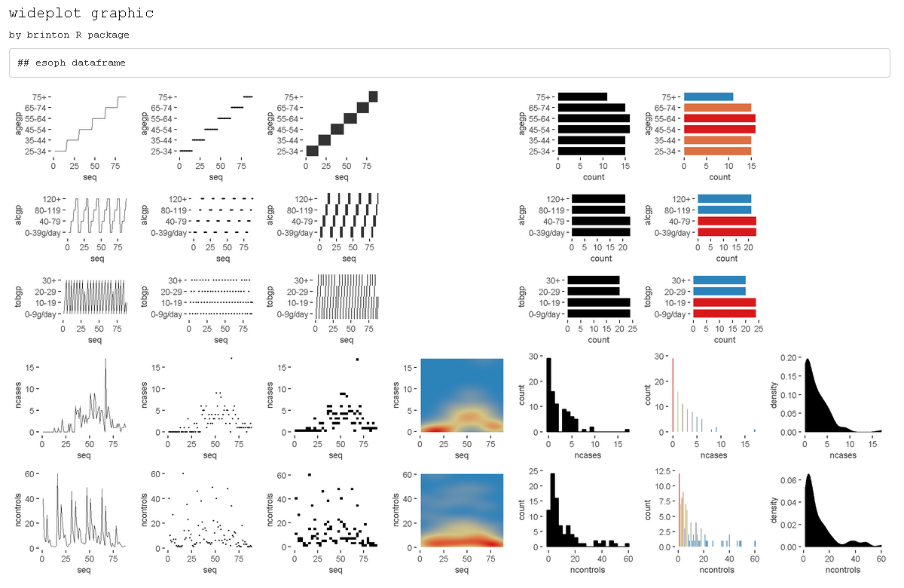
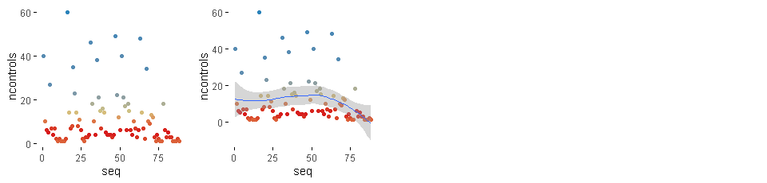
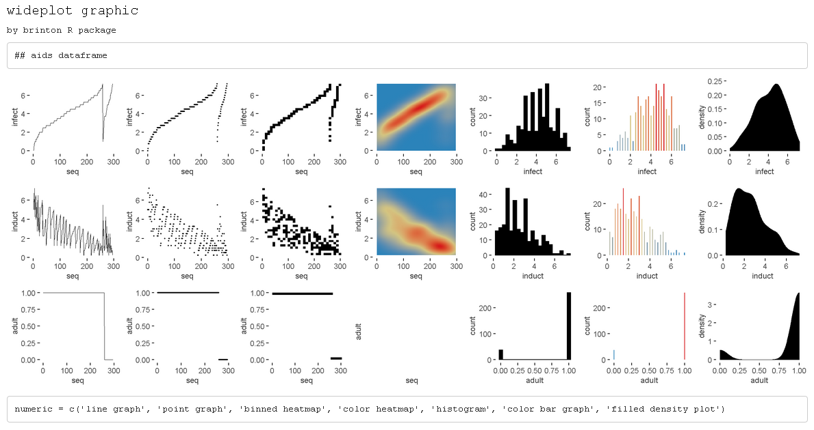
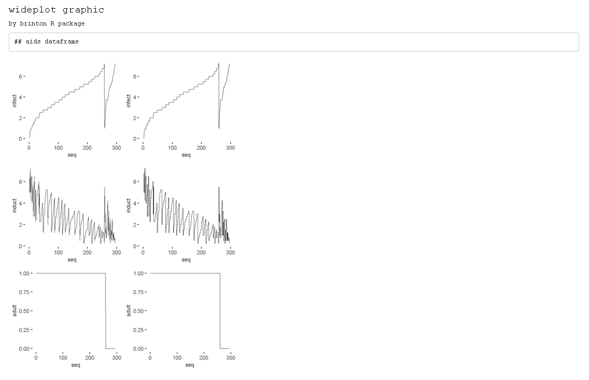
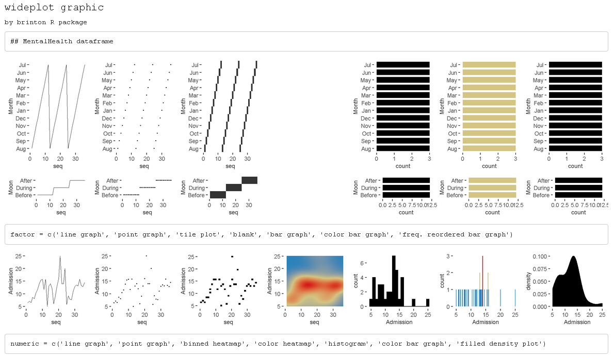
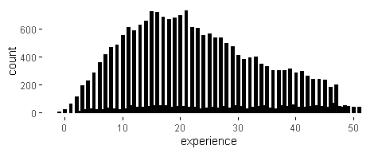
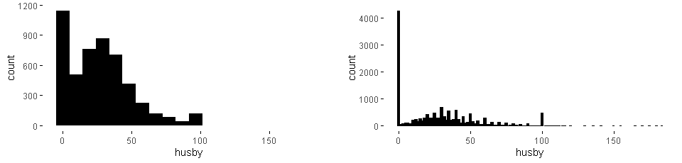

::: article
# Introduction

In 1977, J.W. Tukey noted that "The greatest value of a picture is when
it *forces* us to notice what we never expected to see" [@Tukey1977
p.iv]. This statement aligns with expectation disconfirmation theory
[@Oliver1977], which links consumers' satisfaction to their
expectations. The field of exploratory data analysis (EDA) is
characterized precisely by not requiring an expectation, since in this
approach hypotheses may not be pre-established. Rather, they are allowed
to emerge through the observation of the data. Additionally, because we
cannot automate the processes of defining a problem or the corresponding
hypotheses ---as signaled by J. Bertin that same year [@Bertin1977
p.2]---, we face the challenge of automating graphical representations
so that users can examine the data, develop hypotheses and then select
the appropriate statistical graphic that will enable them to satisfy
their recently created expectations.

The tools for generating graphics and statistics for a dataset
automatically are called automated exploratory data analysis or autoEDA
[@Staniak2019]. These tools facilitate some of the characteristic tasks
of EDA, such as describing variables and validating observations or the
relationships established between the values of one or more variables.
*brinton*, a new package we have developed for use within R, shows only
graphics, leading us to classify it as a tool for automated graphical
exploratory data analysis or autoGEDA. We can include in this category
tools such as [*GGobi*](https://CRAN.R-project.org/package=GGobi)
[@Cook2007] and
[*Mondrian*](https://CRAN.R-project.org/package=Mondrian) [@Theus2008].
These tools differ from *brinton* in that they use interactive
techniques extensively, and therefore are usually classified as visual
analytics.

Multiple strategies exist for automating statistical diagramatic
representations. Millán-Martínez and Valero-Mora [-@Millan2018]
differentiate strategies according to whether they are based on the
characteristics of the data (functional design, @Kamps1999), on the
habits of a group of users (collaborative filtering), on those of a
single user (content-based filtering), on the tasks that the user is
meant to perform (task design), on the characteristics of human
perception (perceptual design), on the limitations of the communication
channel or the screen on which the graphics are projected (responsive
design), or, finally, on the selection of characteristics of the desired
graphics or models of representation (representation model design or
deterministic design).

The statistical programming environment R has two graphics systems
[@Friendly2018]. One is the standard graphics system of the package
*graphics* with low-level functions, such as `lines()`, `points()`,
`legend()` (which define concrete elements of a graphic) and high-level
functions, such as `plot()`, `pie()`, and `barplot()` (which present a
complete graphic). The other graphics system is based on the *grid*
package, with low-level functions such as those of the *gridExtra*
package [@Auguie2017] and high-level ones such as those of the packages
[*lattice*](https://CRAN.R-project.org/package=lattice) [@Sarkar2008]
and *ggplot2* [@Wickham2016], which produce complete graphics. Both in
*graphics* and *grid* we find examples of the strategies mentioned
above. We find functional design, for example, in the `plot()` function.
If we apply it to the dataset `cars`, it produces a scatterplot, because
it contains two numerical variables and is of the `data.frame` class. If
we apply it to the dataset `airmiles`, it produces a line graph because
this dataset has a single numerical variable and is of the `ts` class.
We find task design in multiple packages, for example
[*survminer*](https://CRAN.R-project.org/package=survminer)
[@Therneau2015], which includes the function `ggsurvplot()` to generate
graphics specifically for survival analysis. We find representation
model design in basic functions such as `barplot()`, which produces a
bar graph; `hist()`, which produces a histogram; and `pie()`, which
produces a pie chart. We also see lower-level functions, such as the
`geom_point()` function of *ggplot2*, which reduces the graphic to a
kind of point plot. We can also find in *ggplot2* examples of perceptual
design in decisions such as the default size, shape and color of the
points, the grid lines and the panel background.

Despite all of the solutions already implemented in R, we are lacking an
approach based on functional design that uses higher-level functions to
show systematically not only a complete graphic but also a wide range of
available graphics using the same data. Examining multiple graphics
could lead the user to raise questions, which he or she could then
answer using the presented graphics, new more specific graphics, or a
particular graphic that could be adapted as needed (deterministic
design). *brinton* package is our proposal for filling this gap in the R
programming environment. We have named it after Willard Cope Brinton,
whose Graphic Presentation [@Brinton1939] solved a similar problem for
physical libraries.

The article is organized as follows: Section 2 briefly reviews the
autoGEDA packages within R and also the variants of multipanel graphics.
Section 3 presents the three functions of *brinton* package and the
available graphic types in the specimen. Section 4 details the graphical
degrees of freedom that this package enjoys in the moment of expanding
the specimen. Section 5 describes the situations in which the functions
are useful and Section 6 offers our conclusions and outline future work.

# AutoGEDA and multipanel graphics

We classify *brinton* package within the autoGEDA tools we have
described above. Another essential feature of this package is that it
extensively combines different graphic types referring to the same
records and variables in the form of multipanel graphics. A range of
autoGEDA tools exist both outside and inside R. For the purposes of
contextualizing *brinton*, we will concentrate on the solutions based in
R.

::: {#the-landscape-of-autogeda-in-r}
## The landscape of autoGEDA in R
:::

Among the R packages dedicated to autoEDA [@Staniak2019] only a few have
a graphic orientation. We classify these packages according to their
graphic solutions (although packages can have functions that offer
different solutions).

Packages such as [*tabplot*](https://CRAN.R-project.org/package=tabplot)
[@Tennekes2013], [*visdat*](https://CRAN.R-project.org/package=visdat)
[@Tierney2017] and
[*inspectdf*](https://CRAN.R-project.org/package=inspectdf)
[@Rushworth2019] use the structure plot, a graphic type that compacts
all of the values of a dataset into a single panel. More specifically,
*tabplot* and [*visdat*](https://CRAN.R-project.org/package=visdat)
essentially offer variants of tableplots, which are static versions of
the table lens [@Rao1994], while *inspectdf* presents spine plots or bar
charts, according to the type of summary to which the function
`show_plot()` is applied. Another set of packages groups the variables
of a dataset by type and represents the distribution of each variable in
the cell of a multipanel graphic. This is the basic orientation of the
packages [*xray*](https://CRAN.R-project.org/package=xray)
[@Seibelt2017],
[*DataExplorer*](https://CRAN.R-project.org/package=DataExplorer)
[@Cui2019] and [*SmartEDA*](https://CRAN.R-project.org/package=SmartEDA)
[@Ubrangala2019].

The packages [*dataMaid*](https://CRAN.R-project.org/package=dataMaid)
[@Helby2019] and
[*summarytools*](https://CRAN.R-project.org/package=summarytools)
[@Comtois2019] offer another way to observe all variables. These
packages have functions that produce a descriptive summary of the
variables along with a histogram or bar graph, depending on the type of
variable. We also find packages with miscellaneous functions, each of
which is aimed at facilitating the generation of an adhoc graphic type.
This is the case, for example, of
[*ExPanDaR*](https://CRAN.R-project.org/package=ExPanDaR),
[*dlookr*](https://CRAN.R-project.org/package=dlookr), *summarytools*
and [*explore*](https://CRAN.R-project.org/package=explore).

AutoEDA packages tend to have a double presentation of results:
tabulated and graphical. Some of them, such as *dataMaid*,
*summarytools* and *SmartEDA*, make it possible to generate automatic
reports and even adapt these reports to the needs of a particular user.
Despite the utility of the packages described here, they tend to offer
few options for graphic presentation beyond the most widely used
graphics. The relationships between the values of the variables can be
revealed much more easily if multiple graphic types are presented. These
packages lack a wider range of graphic alternatives.

::: {#multipanel-graphics}
## Multipanel graphics
:::

There are different types of multipanel graphics depending on the
diversity of graphic types and the origin of the data. On one hand, we
have dashboards, which generally combine different graphic types in a
limited space. Dashboards can draw from different data sources and are
particularly useful for monitoring complex processes. Graphics of this
type are implemented in R through packages such as
[*shinydashboard*](https://CRAN.R-project.org/package=shinydashboard)
[@Chang2018] and
[*flexdashboard*](https://CRAN.R-project.org/package=flexdashboard)
[@Iannone2018]. The `plot_grid()` function of the package
[*cowplot*](https://CRAN.R-project.org/package=cowplot) [@Wilke2019]
offers the possibility of combining graphics of the same or different
type without space restrictions by creating multipanel graphics. This
can also be achieved with the
[*patchwork*](https://CRAN.R-project.org/package=patchwork) package
[@LinPedersen2019] that adds versatility to the composition of
multipanel graphics by introducing operators that partition the canvas.

A second type of multipanel graphic is the conditioning plot[^1]. In
these, the same graphic type is repeated in different panels at the same
scale, representing subsets of data according to the level of one or
more variables. A third type of multipanel graphic is the matrix of
plots, which links pairs of variables of the same type and from the same
dataset. A classic example is the scatterplot matrix [@Hartigan1975],
or, more recently, the HE plot [@Friendly2007]. The diagonal of these
grids can be populated with a different graphic type, since a single
variable is involved. A variant of the matrix of plots uses source
variables of different types that, when paired, result in a grid with
multiple graphic types, depending on how the variables are combined.
This graphic type is known as a generalized pairs plot [@Emerson2013].

# The brinton package

We created *brinton* package to facilitate exploratory data analysis
following the visual information-seeking mantra [@Shneiderman1996]:
"Overview first, zoom and filter, then details on demand." The main idea
is to assist the user during these three phases through three functions:
`wideplot()`, `longplot()` and `plotup()`. A distinctive feature is the
following: the `wideplot()` function provides a limited selection of
available graphics for all the variables in a data frame, the
`longplot()` function provides all the range of available graphics for a
limited selection of variables and, finally, the `plotup()` function
provides one single graphic for a limited selection of variables. While
each of these functions has its own arguments and purpose, all three
serve to facilitate exploratory data analysis and the selection of a
suitable graphic.

The `wideplot()` function allows the user to explore a dataset as a
whole using a grid of graphics in which each variable is represented
through multiple graphics. Once we have explored the dataset as a whole,
the `longplot()` allows us to explore other graphics for a given
variable. This function also presents a grid of graphics, but instead of
showing a selection of graphics for each variable, it presents the full
range of graphics available in the package to represent a single
variable. Once we have narrowed in on a certain graphic, we can use the
`plotup()` function, which presents the values of a variable on a single
graphic. We can access the code of the resulting graphic and adapt it as
needed. These three functions expand the graphic types that are
presented automatically by the autoGEDA packages in the R environment.

*brinton* package is based primarily in the grammar of graphics
[@Wilkinson2005] implemented in R by the package *ggplot2*.
Additionally, it draws on the package *gridExtra* [@Auguie2017] for
creating multipanel graphics and on *rmarkdown* [@Allaire2019] for
dynamically composing the results.

In the context of graphics packages in R based on the *grid* system, the
package *lattice* allows the user to create a range of some 13 graphic
types, which can be adapted to a very fine level of detail. *ggplot2*
makes it possible to control even the finest detail of a graphic, but
this comes at the price of learning its grammar and its layer system. In
contrast, *brinton* package makes it possible for the user to select
statistical graphics by name from a wide range of available graphics
and, if he or she knows the grammar of *ggplot2*, adapt them as needed.
To create a statistical graphic in R, if the desired graphic is already
implemented in *brinton* package, the user must simply specify the data
source and the graphic type to be produced.

The package can be installed easily from the Comprehensive R Archive
Network (CRAN) using the R console. When the package is loaded into
memory, it provides a startup message that pays homage to Henry D.
Hubbard's enthusiastic introduction to the book Graphic Presentation
[@Brinton1939]:

``` r
  install.packages("brinton")
  library(brinton)
```

``` r
  M a G i C i N G R a P H S
	
```

::: {#the-wideplot-function}
## The wideplot function
:::

When a dataset is loaded into R, the next function to be used tends to
be `str()`. This occurs because if we don't determine the nature of the
values explicitly, the functions for loading datasets make assumptions
about it. The function `str()` shows in the console the type of object
to which the function is being applied, the number of rows, the number
and names of columns, their class (number, factor, etc.) and the initial
observations for each variable. The `wideplot()` function takes
inspiration from this function, but instead of describing the dataset in
textual or tabular form, it does it graphically. We can easily compare
the results of these two functions, for example, with the dataset
`esoph` from a case-control study of esophageal cancer in
Ille-et-Vilaine, France. The dataset has three ordered factor-type
variables and two numerical variables:

``` r
  str(esoph)
```

``` r
#> 'data.frame':    88 obs. of  5 variables:
#>  $ agegp    : Ord.factor w/ 6 levels "25-34"<"35-44"<..: 1 1 1 1 1 1 1 1 1 1 ...
#>  $ alcgp    : Ord.factor w/ 4 levels "0-39g/day"<"40-79"<..: 1 1 1 1 2 2 2 2 3 3 ...
#>  $ tobgp    : Ord.factor w/ 4 levels "0-9g/day"<"10-19"<..: 1 2 3 4 1 2 3 4 1 2 ...
#>  $ ncases   : num  0 0 0 0 0 0 0 0 0 0 ...
#>  $ ncontrols: num  40 10 6 5 27 7 4 7 2 1 ...
```

``` r
  wideplot(data = esoph)
```

<figure id="fig:wideplotesoph">

<figcaption>Figure 1: Output of <code>wideplot(esoph)</code>. A grid of
graphics in which each row corresponds to a variable in the dataset
<code>esoph</code> and each column displays different available
graphics.</figcaption>
</figure>

The `wideplot()` function creates html files, as side-effects, with a
graphical summary (See Figure [1](#fig:wideplotesoph)) of the variables
included in the dataset to which it has been applied. First it groups
the variables according to the following sequence: logical, ordered,
factor, character, datetime and numeric. Next, it creates a multipanel
graphic in html format, in which each variable of the dataset is
represented in a row of the grid, while each column displays the
different available graphics for each variable. We called the resulting
graphic type *wideplot* because it shows a range of graphics for all of
the columns of the dataset. The structure of the function, the arguments
it permits and its default values are as follows:

``` r
#> wideplot(data, dataclass = NULL, logical = NULL, ordered = NULL,
#>   factor = NULL, character = NULL, datetime = NULL, numeric = NULL,
#>   group = NULL, ncol = 7, label = 'FALSE')
```

The only argument necessary to obtain a result is `data` that expects a
`data.frame` class object; `dataclass` selects and sorts the types of
variables to be shown; `ncol` filters the first *n* columns of the grid,
between 3 and 7, which will be shown. The fewer columns displayed, the
larger the size of the resulting graphics, a feature that is especially
useful if the scale labels dwarf the graphics area; `label` adds to the
grid a vector below each group of rows according to the variable type,
with the names and order of the graphics; `logical`, `ordered`,
`factor`, `character`, `datetime` and `numeric` make it possible to
choose which graphics, from among the ones included by the specimen
(Sec. [3.4](#the-specimen)), appear in the grid and in what order, for
each variable type. Finally, `group` changes the selection of graphics
that are shown by default according to the criteria of Table
[1](#tab:table1).

If the order and graphic types to be shown for each variable type are
not specified and if the graphic types aren't filtered using the
argument `group`, then the default graphic will contain an opinion-based
selection of graphics for each variable type, organized especially to
facilitate comparison between graphics of the same row and between
graphics of the same column. The user can overwrite this selection of
graphics as needed, using the arguments `logical`, `ordered`, `factor`,
`character`, `datetime` and `numeric`.

::: {#tab:table1}
  -------------------------------------------------------------------------------------------
  **group**    **graphic type**
  ------------ ------------------------------------------------------------------------------
  `sequence`   includes the sequence in which the values are observed so that an axis

               develops this sequence. e.g. line graph, point-to-point graph

  `scatter`    marks represent individual observations. e.g. point graph, stripe graph

  `bin`        marks represent aggregated observations based on class intervals.

               e.g. histogram, bar graph

  `model`      represents models based on observations. e.g. density plot, violin plot

  `symbol`     represents models based on observations. and not only points, lines or areas

               e.g. box plot

  `GOF`        represents the goodness of fit of some values with respect to a model

               e.g. qq plot

  `random`     chosen at random
  -------------------------------------------------------------------------------------------

  : Table 1: Possible values for the `group` argument of the
  `wideplot()` function.
:::

::: {#the-longplot-function}
## The longplot function
:::

To facilitate economy of calculation, the `wideplot()` function presents
a limited number of graphics in each row. If the user wants to expand
the range of suggested graphics for a given variable, he or she should
use the `longplot` function, which returns a grid with all of the
graphics considered by the package (See Figure
[2](#fig:longplotesophagegp)) for that variable. The structure of the
function is very simple `longplot(data, vars, label = TRUE)` and we can
easily check the outcome of applying this function to the variable
`alcgp` of the dataset `esoph`:

``` r
  longplot(data = esoph, vars = "alcgp")
```

<figure id="fig:longplotesophagegp">

<figcaption>Figure 2: Output of <code>longplot(esoph, ’alcgp’)</code>. A
grid of graphics where the variable <code>alcgp</code> in the dataset
<code>esoph</code> is displayed for the full range of graphics
considered by the package.</figcaption>
</figure>

We named the resulting graphic type *longplot* because it shows the full
range of available graphics to represent the relationships among the
values of a limited selection of variables (although for now, in this
package we have only included graphics for a single variable).

The arguments of the function are `data`, which must be a `data.frame`
class object; `vars`, which requires the name of a specific variable of
the dataset; and `label`, which does not have to be defined and which
adds a vector below each row of the grid indicating the name of each
graphic. Unlike the grid of the `wideplot` function, the grid of the
`longplot` function does not include parameters to limit the range of
graphics to be presented. We made this decision because the main
advantage of this function is precisely that it presents all of the
graphic representations available for a given variable. However, we do
not rule out adding filters that limit the number of graphics to be
shown if this feature seems useful as the catalog fills with graphics.
Each graphic presented can be called explicitly by name using the
functions `wideplot()` and `plotup()`, which is why the argument `label`
has been set to `TRUE` by default in this case.

The range of graphics that the `longplot()` function returns is sorted
so that in the rows we find different graphic types and in the columns
different variations of the same graphic type. This organization,
however, is not absolute and in some cases in order to compress the
results, we find different graphic types in the same row.

::: {#the-plotup-function}
## The plotup function
:::

The `plotup()` function has the following structure:
`plotup(data, vars, diagram, output = ’plots pane’)`. By default, this
function returns an object belonging to class `gg` and `ggplot` whose
graphic can be rendered in the plots pane of RStudio. This graphic is
based on a variable from a given dataset and the name of the desired
graphic, from among the names included by the specimen that we present
in the next subsection. We can easily check the outcome of applying this
function to produce a line graph from the variable `ncases` of the
dataset `esoph` (See Figure [3](#fig:plotupesophncaseslinegraph)) :

``` r
  plotup(data = esoph, vars = 'ncases', diagram = 'line graph', output = 'html')
```

<figure id="fig:plotupesophncaseslinegraph">

<figcaption>Figure 3: Output of
<code>plotup(esoph, ’ncases’, ’line graph’)</code>. A line graph from
the variable <code>ncases</code> in the dataset
<code>esoph</code>.</figcaption>
</figure>

This function requires three arguments: `data`, `vars` and `diagram`.
The fourth argument, `output`, is optional and has the default value of
`plots pane`. However, if is set to it `html` or `console`, instead of
returning a `c("gg", "ggplot")` object, the function cause a
side-effect: either creating and displaying a temporary html file, or
printing the ggplot2 code to the console. This feature is especially
useful to adapt the default graphic to the specific needs and
preferences of the user.

The `diagram` argument accepts any of the values admitted by the
`logical`, `ordered`, `factor`, `character`, `datetime` and `numeric`
arguments of the `wideplot()` function. These values coincide with the
names of the graphics considered by the package and included in the
specimen. The naming convention of these graphs is implicitly addressed
in Section 4 "Graphical degrees of freedom".

``` r
  plotup(data = esoph, vars = 'ncases', diagram = 'line graph', 
         output = 'console')
```

``` r
#> ggplot(esoph, aes(x=seq_along(ncases), y=ncases)) +
#>   geom_line() +
#>   labs(x='seq') +
#>   theme_minimal() +
#>   theme(panel.grid = element_line(colour = NA),
#>     axis.ticks = element_line(color = 'black'))
	
```

::: {#the-specimen}
## The specimen
:::

The documentation of the package includes the vignette "1v specimen",
which contains a specimen with images of all the graphic types for a
single variable, incorporated into the package according to the variable
type. These graphics serve as an example so that the user can rapidly
check whether a graphic has been incorporated, the type or types of
variable for which it has been incorporated, and the label with which it
has been identified. The suitability of a particular graphic will depend
on the datasets of interest and the variables of each particular user.
We have incorporated this specimen in its current version as
supplementary material.

# Graphical degrees of freedom

The utility of this package is based on the fact that different
graphical representations of the same data make it possible not only to
observe different characteristics of the data, but also to show a
certain characteristic more effectively. For this reason, the graphics
considered by this package enjoy a large number of graphical degrees of
freedom. This makes it possible for the catalog to include both commonly
used graphics and graphics that have not yet been developed. The concept
of graphical degrees of freedom has been used by Benger and Hege
[-@Benger2006] to refer to Bertin's visual variables [-@Bertin1967 p.43]
but with some modifications. Here we use the concept in a broader sense,
as detailed below.

-   **Type of graphic**. The main degree of freedom of the graphics
    catalog is the graphic type. The different graphic types are not
    necessarily ones that differ greatly from each other. To the
    contrary, very similar graphics coexist because a high number of
    users prefer each of them. This is the case, for example, of the
    density plot and the violin plot shown in Figure [4](#fig:dg0).

``` r
  wideplot(data = esoph[5], 
           numeric = c('filled violin plot', 'filled density plot'))
```

<figure id="fig:dg0">

<figcaption>Figure 4: 1st degree of freedom (type of graphic). Density
and violin plots of variable <code>ncontrols</code> (in the dataset
<code>esoph</code>).</figcaption>
</figure>

-   **Chromatic scales**. The same graphic can have different versions
    depending on the chromatic scale associated with a variable in the
    data or computed from it. We can see an example of this in the
    following figure [5](#fig:dg1). Despite the fact that color can be
    broken down into the three visual variables of hue, saturation and
    value, for the purposes of this package we have only taken into
    account hue in the case of the color scale and value in the case of
    the grayscale, following Bertin's classification of visual variables
    [-@Bertin1967 p.43].

``` r
  wideplot(data = esoph[5], 
           numeric = c('histogram', 'bw histogram', 'color histogram'))
```

<figure id="fig:dg1">

<figcaption>Figure 5: 2nd degree of freedom (chromatic scale). Plots of
variable <code>ncontrols</code> (in the dataset <code>esoph</code>) with
different chromatic scales.</figcaption>
</figure>

-   **Agreggation method: scattered or binned**. The same values can be
    represented such that each mark represents either a single value or
    an aggregate value. An example of this feature can be observed in
    Figure [6](#fig:dg2).

``` r
  wideplot(data = esoph[5], 
           numeric = c('stripe graph', 'binned stripe graph', 'bar graph', 
                       'histogram'))
```

<figure id="fig:dg2">

<figcaption>Figure 6: 3rd degree of freedom (aggregation method). Plots
of variable <code>ncontrols</code> (in the dataset <code>esoph</code>)
with single or aggregate values.</figcaption>
</figure>

-   **Nested panels**. One possibility (which has been little explored)
    is that of subdividing into different panels the cells of the
    multipanel graphic, to create systems of coordinates inside systems
    of coordinates. This solution is similar to the treemap. In the
    example in Figure [7](#fig:dg3), the graphic on the right has three
    panels that can substitute the first three graphics.

``` r
  wideplot(data = esoph[5], 
           numeric = c('violin plot', 'stripe graph', 'box plot', '3 uniaxial'))
```

<figure id="fig:dg3">

<figcaption>Figure 7: 4th degree of freedom (nested panels). Plots of
variable <code>ncontrols</code> (in the dataset <code>esoph</code>) with
single and multiple panels (the first three ones and the last one
respectively).</figcaption>
</figure>

-   **Shape**. The same information can be represented with marks of
    different shapes. This possibility is exemplified in Figure
    [8](#fig:dg4), which compares two graphics with similar composition
    but different marks: circular or square.

``` r
  wideplot(data = esoph[5], 
           numeric = c('color binned point graph', 'color binned heatmap'))
```

<figure id="fig:dg4">

<figcaption>Figure 8: 5th degree of freedom (shape). Plots of variable
<code>ncontrols</code> (in the dataset <code>esoph</code>) with marks of
different shapes.</figcaption>
</figure>

-   **Implantation**. The same values can be represented with marks of a
    different type of implantation, such as a point, a line, an area or
    a combination of these. For example, Figure [9](#fig:dg5) compares a
    point graph, a line graph, and a point-to-point graph.

``` r
  wideplot(data = esoph[5], 
           numeric = c('point graph', 'line graph', 'point-to-point graph'))
```

<figure id="fig:dg5">

<figcaption>Figure 9: 6th degree of freedom (implantation). Plots of
variable <code>ncontrols</code> (in the dataset <code>esoph</code>) with
marks of a different type of implantation.</figcaption>
</figure>

-   **Transition**. The transition or itinerary between two points can
    help reflect the discrete nature of the changes in the values
    observed. Figure [10](#fig:dg6) compares two line graphs with
    different transitions between points.

``` r
  wideplot(data = esoph[5], 
           numeric = c('line graph', 'stepped line graph'))
```

<figure id="fig:dg6">

<figcaption>Figure 10: 7th degree of freedom (transition). Plots of
variable <code>ncontrols</code> (in the dataset <code>esoph</code>) with
different transitions between points.</figcaption>
</figure>

-   **Collation**. The values of variables, especially those that aren't
    related to order, can be sorted according to different criteria.
    This package, as shown in Figure [11](#fig:dg7) uses three: the
    order of appearance in the sequence of observations, the frequency
    with which the values are observed and alphabetical order.

``` r
  wideplot(data = data.frame('Region' = state.region),
           factor = c('tile plot',
                      'freq. reordered tile plot',
                      'alphab. reordered tile plot'))
```

<figure id="fig:dg7">

<figcaption>Figure 11: 8th degree of freedom (collation). Plots of
variable <code>Region</code> with the values sorted according to
different criteria.</figcaption>
</figure>

-   **Superposition**. The final degree of freedom that we consider is
    the possibility of including graphics that superpose marks whose
    data source is the same but that have different degrees of
    transformation (see Figure [12](#fig:dg8)).

``` r
  wideplot(data = esoph[5],  
           numeric = c('color point graph', 
                       'color point graph with trend line'))
```

<figure id="fig:dg8">

<figcaption>Figure 12: 9th degree of freedom (superposition). Plots of
variable <code>ncontrols</code> (in the dataset <code>esoph</code>) with
and without the superposition of a trend line.</figcaption>
</figure>

To construct the specimen we have ruled out some degrees of freedom, for
example, the group of imposition [@Bertin1967 p.52] and the permutation
of spacial variables [@Bertin1967 p.43]. In other words, *brinton*
package exclusively presents diagrams and not networks or maps, nor does
it show alternatives whose only difference is that the *x* and *y* axes
are switched.

# Application to real datasets

The main application of a package for exploratory data analysis is to
help the user make sense of the data. This includes describing the
number and nature of the variables, the number of observations and
examples of the variables--this is precisely what the `str()` function
does. It also includes evaluating the validity and quality of the data
and the properties of the values found.

We can deduce the number of variables from the number of rows in the
grid of the wideplot graphic. The names of the variables are found in
each of the graphics that the catalog now contains. We can determine the
variables' nature--in terms of the measurement scale----by observing the
range of graphics selected and specifying the value `label = TRUE` for
the grids of wideplot and longplot graphics. We can discern the number
of observations by examining the graphics that include the sequence of
observations or, in the case of categorical variables, by counting the
categories and the number of observations for each one. Wideplot
graphics, in contrast to the textual summary of the `str()` function,
show examples not only of the first observations but of all
observations. To evaluate the validity of the data, we can observe
specific graphics that allow us to identify outliers, missing values or
discontinuity in the observations. The same goes for the properties of
the values found. There is a huge range of graphics, each of which makes
it possible to highlight different properties. Below we list a series of
tasks for which the functions included in *brinton* are useful, and
describe the process for carrying them out.

::: {#identify-multi-column-sorting}
## Identify multi-column sorting
:::

Here we describe how to use the `wideplot()` function to determine
whether the observations of the dataset `aids` of the package
[*KMsurv*](https://CRAN.R-project.org/package=KMsurv) are sorted
according to one of the variables. This dataset has three variables,
`infect` (infection time for AIDS in years), `induct` (induction time
for AIDS in years), and `adult` (indicator of adult: 1=adult, 0=child).
To accomplish the task, we first install the package, then load it into
memory and run the wideplot function with its default output.

``` r
  install.packages('KMsurv')
  data(aids, package = 'KMsurv')
  wideplot(data = aids, label = TRUE)
```

<figure id="fig:wideplotaids1">

<figcaption>Figure 13: A grid of graphics generated by
<code>wideplot(aids, label = T)</code>. Each row corresponds to a
variable in the dataset <code>aids</code>. The line graph shows that the
dataset is sorted first by the variable <code>adult</code> and then by
the variable <code>infect</code>.</figcaption>
</figure>

From the result in Figure [13](#fig:wideplotaids1), we observe that the
line graph is the one that best shows that the dataset is sorted first
by the variable `adult` and then by the variable `infect`. To finish
selecting the most suitable graphic we can then execute the same
function but limit the graphic types such that only two variations of
line graph are shown. We can moreover limit the function so that it
displays, for example, only five columns, so that the graphics will be
larger.

``` r
  wideplot(data = aids, 
           numeric = c('line graph', 'stepped line graph'), ncol = 5)
```

<figure id="fig:wideplotaids2">

<figcaption>Figure 14: A grid of graphics generated by
<code>wideplot(aids, numeric = c(’line graph’, ’stepped line graph’), ncol=5)</code>.
Each row corresponds to a variable in the dataset <code>aids</code>.
Graphic types are limited to line and stepped line types.</figcaption>
</figure>

The result is two variations of the line graph for each variable, in
which we can clearly see that the data set is sorted first by the
variable `adult` and then by the variable `infect`. In this case, there
may be equally valid arguments for using the graphics of the first
column as the graphics of the second column.

This same example also works for datasets with categorical variables,
such as the dataset MentalHealth of the package
[*Stat2Data*](https://CRAN.R-project.org/package=Stat2Data). This
dataset consists of three variables: `Month` (month of the year); `Moon`
(relationship to full moon: `After`, `Before`, or `During`); and
`Admission` (number of emergency room admissions). The first two
variables are categorical and the third is numerical. If we examine the
line graph and also the tile plot for the factor-type variables and the
binned heatmap graphic for the numerical variables, we can easily see
that the dataset is sorted by the variable `Moon` and then by the
variable `Month` (see Figure [15](#fig:wideplotmentalhealth)).

``` r
  install.packages('Stat2Data')
  data(MentalHealth, package = 'Stat2Data')
  wideplot(data = MentalHealth, label = TRUE)
```

<figure id="fig:wideplotmentalhealth">

<figcaption>Figure 15: A grid of graphics generated by
<code>wideplot(MentalHealth, label = T)</code>. Each row corresponds to
a variable in the dataset <code>MentalHealth</code>. It is observed that
the dataset is sorted by the variable <code>Moon</code> and then by the
variable <code>Month</code>.</figcaption>
</figure>

::: {#identify-variables-that-can-be-reclassified}
## Identify variables that can be reclassified
:::

When loading a dataset it is important to check which assumptions the
function has made and which variables can be reclassified. We can see an
example of this in Figure [14](#fig:wideplotaids2), which shows that the
variable `adult` of the dataset `aids` is better treated as a
logical-type variable than an integer. If we recode the variable type
more appropriately, when we apply the `wideplot()` function again, the
graphics also tend to be more appropriate. In Figure
[16](#fig:wideplotaids3) we see the result after the variable `adult` is
reclassified.

``` r
  aids$adult <- as.logical(aids$adult)
  wideplot(data = aids)
```

<figure id="fig:wideplotaids3">

<figcaption>Figure 16: A grid of graphics generated by
<code>wideplot(aids)</code>. Each row corresponds to a variable in the
dataset <code>aids</code>. The variable <code>adult</code> has been
reclassified from integer to logical in order to obtain more appropriate
graphics.</figcaption>
</figure>

::: {#identify-key-variables}
## Identify key variables
:::

The best way to identify key variables is by using complementary
graphics. Figure [17](#fig:wideplotazt) makes it possible, for example,
to identify rapidly the variable `patient` of the dataset `azt` in the
package *KMsurv*, as a key variable, given that it assigns a sequential
number to each record, each of which is observed a single time. We can
draw these two conclusions from the line graph and the color bar graph.

``` r
  data(azt, package = 'KMsurv')
  wideplot(data = azt, label = TRUE)
```

<figure id="fig:wideplotazt">

<figcaption>Figure 17: A grid of graphics generated by
<code>wideplot(azt, label=TRUE)</code>. Each row corresponds to a
variable in the dataset <code>azt</code>. The line graph and the color
bar graph recognize the variable <code>patient</code> as a key variable
that assigns a sequential number to each record.</figcaption>
</figure>

In the case of categorical key variables, the same line graph and color
bar graph would also help us to identify the key variable. Figure
[18](#fig:SpeciesArea) shows these two graphs for the factor-type
variable of the dataset `SpeciesArea` in the package *Stat2Data*, which
allow us to identify rapidly the variable `Name` as a key variable.

``` r
  data(SpeciesArea, package = 'Stat2Data')
  wideplot(data = SpeciesArea, dataclas = c('factor'), 
           factor = c('line graph', 'color bar graph'), ncol = 5)
```

<figure id="fig:SpeciesArea">

<figcaption>Figure 18: Line and color bar graphs of the factor-type
variable <code>Name</code> (in the dataset <code>SpeciesArea</code>)
produced by the function <code>wideplot()</code>. It is observed that
the variable <code>Name</code> is a key variable since the values are
not repeated and observed once.</figcaption>
</figure>

::: {#be-surprised-by-serendipity}
## Be surprised by serendipity
:::

Next we describe isolated cases in which we are surprised by the values
that the data depict. We use the following procedure to locate
unexpected aspects of the data: first we obtain a general view of the
dataset using the function `wideplot()`; next we focus our attention on
one variable in particular and explore all of the compatible graphics
using the function `longplot()`; finally, we use the function `plotup()`
to obtain the graphic that best enables us to identify, narrow down and
communicate the aspect of the data that we have found.

-   The first example of an unexpected funding appears in the variable
    `experience` (years of potential work experience) of the dataset
    `HI` in the package
    [*Ecdat*](https://CRAN.R-project.org/package=Ecdat). This dataset
    contains 22,272 records of 13 variables that link health insurance
    policies to the weekly hours worked by the wives of the
    policyholders, while the variable `experience` refers to the years
    of potential work experience of the wives. If we look at the bar
    graph applied to this numerical variable (see Figure
    [19](#fig:HI_1)), we see that the frequency of the whole values is
    systematically greater than the frequency of the real non-whole
    values. This behavior could indicate that the variable can be
    informed with high precision and whoever informed the variable
    `experience` tended to round to the unit. Another possibility is
    that the dataset was constructed by joining two data sources with
    different degrees of precision[^2]

``` r
  data(HI, package = 'Ecdat')
  HI_sam <- HI[sample(nrow(HI), 5000), ]
  wideplot(data = HI_sam)                      # Output not reproduced here
  longplot(data = HI_sam, vars = 'experience') # Output not reproduced here
  plotup(data = HI_sam, vars = 'experience', diagram = 'bar graph')
```

<figure id="fig:HI_1">

<figcaption>Figure 19: Bar plot of the variable <code>experience</code>
(in the dataset <code>HI</code>) produced by the function
<code>plotup()</code>. It is observed that the frequency of the whole
values is systematically greater than the frequency of the real
non-whole values.</figcaption>
</figure>

-   In the same dataset we can see that we could reach mistaken
    conclusions about the distribution of the variable `husby`
    (husband's income in thousands of dollars) if we only looked at a
    histogram. As we can see in Figure [20](#fig:HI_2), the
    distribution, and in particular the value zero, acquires a different
    value if we compare the histogram (left) with another graphic that
    isn't as common for numerical variables: the bar graph (right),
    which shows the count of unique values. The bar graph makes it
    possible to clearly differentiate two groups: the informants whose
    husbands have no income and the informants whose husbands do have
    income (and to whom, therefore, it makes more sense to ask
    approximate income).

``` r
  library(patchwork)
  plotup(HI_sam, 'husby', 'histogram') + plotup(HI_sam, 'husby', 'bar graph')
```

<figure id="fig:HI_2">

<figcaption>Figure 20: Histogram (left) and bar plot (right) of the
variable <code>husby</code> (in the dataset <code>HI_sam</code>)
produced by the function <code>plotup()</code>. The bar plot makes it
possible to identify the zero as a value with a special
meaning.</figcaption>
</figure>

::: {#combine-graphics-that-best-explains-a-specific-data-characteristic}
## Combine graphics that best explains a specific data characteristic
:::

Just as multipanel graphics make it possible to reveal different aspects
of the data, it can also be helpful to use a selection of graphics to
present a certain characteristic of the data. Next, we show an example
of how *brinton* package can help us improve the default graphics in
order to combine them later to show a particular feature.

-   A recurring problem when we deal with datasets with many records is
    that when marks overlap, we cannot correctly interpret the set of
    observations. The presentation of multiple graphics to represent the
    same values enables us to identify these overlaps and improve the
    representation that the package shows by default. For example, in
    Figure [21](#fig:HI_3) we can see how the point graph for the same
    variable `husby` is unclear because the marks overlap.

``` r
  plotup(data = HI_sam, vars = 'husby', diagram = 'point graph')
```

<figure id="fig:HI_3">

<figcaption>Figure 21: Point plot of the variable <code>husby</code> (in
the dataset <code>HI_sam</code>) produced by the function
<code>plotup()</code>. The point plot does not identify the zero as a
value with a special meaning because the marks overlap.</figcaption>
</figure>

-   We do not have to accept the default result. Rather we can retrieve
    the package's *ggplot2* function using the argument
    `output = ’console’` and then improve it:

``` r
  plotup(data = HI_sam, vars = 'husby', diagram = 'point graph', 
  output = 'console')
```

``` r
#> ggplot(HI_sam, aes(x=seq_along(husby), y=husby)) +
#>   geom_point() +
#>   labs(x='seq') +
#>   theme_minimal() +
#>   theme(panel.grid = element_line(colour = NA),
#>     axis.ticks = element_line(color = 'black'))
	
```

-   In this case we can, for example, improve the graphic by reducing
    the size of the points and adding an alpha channel (see Figure
    [22](#fig:HI_4)).

``` r
  newpointgraph <- ggplot(HI_sam, aes(x=seq_along(husby), y=husby)) +
  geom_point(size = 0.3, alpha = 0.15) + 
  labs(x='seq') +
  theme_minimal() +
  theme(panel.grid = element_line(colour = NA), 
  axis.ticks = element_line(color = 'black'))

  newpointgraph
```

<figure id="fig:HI_4">

<figcaption>Figure 22: New point plot of the variable <code>husby</code>
(in the dataset <code>HI_sam</code>) produced by the functions
<code>plotup()</code> and <code>ggplot()</code>. Now the point plot
makes it possible to identify the zero as a value with a special
meaning.</figcaption>
</figure>

-   One option for this graphic that isn't affected by the overlapping
    of marks is the heatmap, and yet another is the bar graph that
    represents the frequency with which the unique values are observed.
    Combining the three graphics helps to highlight different aspects in
    order to make it easier to understand the data. Figure
    [23](#fig:lastone) shows how to combine the three graphics. Note
    that the bar graph has been rotated 90 degrees to become a marginal
    plot, following the grammar implemented in *ggplot2*, to facilitate
    the correspondence between individual observations, the density that
    can be deduced from them, and the frequency of unique values. Also,
    the axis labels have been adjusted to avoid unnecessary repetition.

``` r
  newpointgraph + labs(y = "husband's income * 1000$") +
  plotup(data = HI_sam, vars = 'husby', diagram = 'color heatmap') +
  labs(y = '') +
  plotup(data = HI_sam, vars = 'husby', diagram = 'bar graph') +
  labs(x = '') + coord_flip()
```

<figure id="fig:lastone">

<figcaption>Figure 23: Multipanel graphic as a composition of three
plots of the variable <code>husby</code> (in the dataset
<code>HI_sam</code>). The source of each plot is the function
<code>plotup()</code>. Combining the three plots helps to highlight
different aspects of the distribution of the variable
<code>husby</code>.</figcaption>
</figure>

The resulting multipanel graphic shows that throughout the dataset, the
revenue distribution remains essentially constant, highlighting the
number of husbands without income and rounding the reported values to
nice numbers such as 25, 30, 40, 50 and 100--although in reality, the
value that draws a horizontal line around 100 is, surprisingly, 99,999.
And here we have another mystery to solve.

# Conclusions

We have introduced *brinton* package, a graphical EDA tool designed to
facilitate the presentation, selection and editing of statistical
graphics built on *ggplot2*. This package maximizes the deterministic
strategy of graphic selection by presenting a range of graphics that a
user can choose by name, automating the construction of graphics and
even allowing the user to recover the underlying *ggplot2* function in
order to adapt the graphics as necessary. This package makes it easier
for a user to become familiar with a dataset and generate hypotheses
based on it.

This is a project in progress and new software implementations are being
updated and released. We plan to create a fuller catalog that will
include graphics that can combine up to three variables, improve the
aesthetics of the default graphics and add new functions for autoGEDA.

# Acknowledgements

We thank Michael Friendly and Pedro Valero-Mora for corresponding with
AUTHOR 1 about the package *cowplot*, which inspired the `wideplot()`
function that forms the core of this package. We acknowledge Susan
Frekko for translating so accurately the manuscript from Catalan.
:::

[^1]: The terminology for conditioning plots is not unanimous. These
    plots were first described by J. Bertin as *séries homogènes*
    [@Bertin1967 p.26]. Later, E. Tufte introduced them as small
    multiples [@Tufte1983]. W.S. Cleveland called them juxtaposed panels
    [@Cleveland1985 p.200] and also trellis graphics [@Becker1996]. In
    the R environment they are generally known as lattice graphics
    [@Sarkar2008] or facet plots, based on the description of this
    technique by L. Wilkinson [-@Wilkinson2005] and later implemented in
    *ggplot2*

[^2]: In the following example we have decided to limit the number of
    records to 5,000 to reduce the calculation time and facilitate the
    reproduction of these same examples.
