# Introduction

Land use and land cover (LUC) monitoring provides key information on the
ecological state and biophysical properties of the land surface and is
widely used in climatic, hydrological, and ecological modelling
[@Brovkin2013; @Verburg2015]. Global population growth over the last
decades has led to increased rates of LUC change (LUCC), which has
affected all major ecosystem services, including biodiversity, climate,
and water supply, and has altered carbon cycling
[@Ballantyne2015; @Nelson2010; @Song2018].

The importance of these applications is supported by the continuous
expansion of remote sensing data acquisition programs, making freely
available an increasing amount of spatially explicit LUC time series
data worldwide [@Prestele2016]. The huge volume of these datasets, their
timely actualization, ever-increasing spatial resolution and category
differentiation, and a variety of data formats, render their manual
extraction and analysis increasingly time consuming. This is especially
true when trying to compare or harmonize LUC datasets of the same study
area generated from different sources, with different methodological
approaches across different spatial and temporal scales, in order to
output the factual LUC in a region of interest [@Yang2017].

Human interference on LUC is complex, and the intensity and frequency of
LUC transitions are increasing. Therefore, the development of sound LUC
models is highly dependent on a deep understanding of past and ongoing
LUCC processes [@Muller2014]. This means that LUC patterns have to be
constantly reviewed to underpin our understanding of these processes
[@Lambin1997; @Lambin2006], develop a baseline analysis for projections
of future LUC [@Hurtt2011], and to construct, calibrate and validate
LUCC simulations [@Prestele2016]. Such efforts require tools for data
extraction, pre-processing, visualization, and calculation of LUC
metrics to relieve the burden from labour-intensive and time-consuming
manual data processing and analysis [@Yu2019a]. If the procedures
implemented to do so follow standards in land cover characterization,
and use formalized methodological approaches in LUC analysis, the
resulting analytics become more transparent, robust, and auditable
[@Herold2006; @Muller2014; @Yang2017].

@Aldwaik2012 developed an approach called Intensity Analysis (IA), which
examines changes in LUC categories by comparing the intensity of change
between categories during a given time interval with a hypothesized
uniform change intensity. Since then, several case studies have
emphasized the potential of Intensity Analysis to synthetize complex
LUCC under different spatial and temporal scales, such as urban
environments [@Akinyemi2017; @Subasinghe2016], regional studies
[@Melo2018; @Mwangi2017; @Souza2017], and country-wide comparisons
[@Chaudhuri2016]. Furthermore, @Huang2018 concluded that intensity
analysis metrics outperform other indicators of land use dynamics in the
comparison between candidate regions, while @Varga2019 showed that IA
metrics are a helpful tool for assessing the quality of LUC modelling
outputs.

In IA, the uniform change intensity of a time period is compared with
the observed intensities of transitions between LUC categories. The
calculations are carried out using transition matrices between LUC
categories, assessing specific: (i) time intervals, (ii) categories or
classes and (iii) types of transitions. The first assessment level
examines in which time intervals global annual change rates are faster,
slower or comparable to an average rate of change. The second level
determines which category transitions are relatively dormant or more
active within a given time interval, based on an analysis of gross
change. The gross gains and losses for each category in a given time
interval are compared with an averaged, uniform annual change. The third
level of assessment seeks to identify which transitions are particularly
intensive during the time interval considered. In order to do so each
transition is compared with a uniform transition intensity. The
mathematical notations used for the IA indicators measuring size and
intensities of temporal changes among LUC categories (Equations 1-8) can
be found in @Aldwaik2012 and @Aldwaik2013.

Analytical tools for the analysis of LUC time series are commonly
available in compiled languages and distributed as software packages or
extensions to proprietary geographic information systems such as ArcGIS
or Idrisi [@Moulds2015]. Consequently, the source code for such tools,
used for land use change analysis and modelling, is often unavailable
[@Rosa2014]. This makes adopting the applications of new approaches and
reproducing scientific results difficult [@Morin2012; @Peng2011]. GIS
software has made widely available spatially explicit visualization
capabilities for multi-temporal LUC, which is crucial for documentation
and analysis of LUC distribution. However, maps can become blurred and
non-interpretable when extensive time series or complex landscapes with
different category transitions need to be analysed. This is particularly
true when multi-category changes have to be analysed at multiple time
steps to improve the understanding of landscape processes, in which case
non-spatial forms of LUCC will have to be explored.

By contrast, the availability of packages to perform analyses of LUC
categories in time series data is limited.
[*intensity.analysis*](https://CRAN.R-project.org/package=intensity.analysis),
developed by @PontiusJr.2019, is an application of IA, with
functionality limited to the calculation of the three IA assessment
levels described above and their plotting; this package does not allow
any personalization. Little pre-processing capability is available. If
needed, input rasters cannot be checked for spatial and thematic
consistency, and they have to be manually imported to R and stored. No
other commonly used LUC metrics can be calculated or plotted. Tools to
visualize LUC changes are limited to standard plots of the three IA
analysis levels. [*lulcc*](https://CRAN.R-project.org/package=lulcc)
[@Moulds2015] is another package developed for LUC change analysis and
focuses on the application of tools for LUC change modelling.

This highlights the need for flexible and comprehensive tools for
multipurpose analyses of complex LUC time series data. This paper aims
to demonstrate that we have developed a solution, available as freeware,
which allows the agile consistency analysis, extraction, pre-processing,
analysis, and visualization of multiresolution time series data in a
straightforward workflow, thereby increasing productivity in information
extraction for an improved understanding of LUCC processes at different
spatial scales. Originating primarily from the application of the
intensity analysis method, the formatted tabular representation of
multiple transition steps can be a valuable tool to support the quick
calculation of LUCC indicators.

# Conceptual overview

The software was developed to provide comprehensive support for LUCC
analysis over time and implement the intensity analysis conceptual
approach proposed by @Aldwaik2012, and further described in
@Aldwaik2013.

The source language of the
[*OpenLand*](https://CRAN.R-project.org/package=OpenLand) package
[@Exavier2020] is R, and it was conceived using the integrated
development environment (IDE) RStudio [@RStudioTeam2016]. For full
functionality, *OpenLand* depends on selected, third-party functions of
the [*raster*](https://CRAN.R-project.org/package=raster),
[*dplyr*](https://CRAN.R-project.org/package=dplyr) and
[*tidyr*](https://CRAN.R-project.org/package=tidyr) R packages
[@Hijmans2019; @Wickham2019; @Wickham2019a] (Fig. [1](#fig:conception)).
Visualization tools make use of
[*ggplot2*](https://CRAN.R-project.org/package=ggplot2),
[*circlize*](https://CRAN.R-project.org/package=circlize),
[*gridExtra*](https://CRAN.R-project.org/package=gridExtra) and
[*networkD3*](https://CRAN.R-project.org/package=networkD3) R packages
[@Allaire2017; @Auguie2017; @Gu2014; @Wickham2016]. Designed as an
iterative workflow, the pre-processing of a raw LUC time series is
followed by the extraction and visualization of single or multistep LUC
transitions and/or a complete IA.

<figure id="fig:conception">
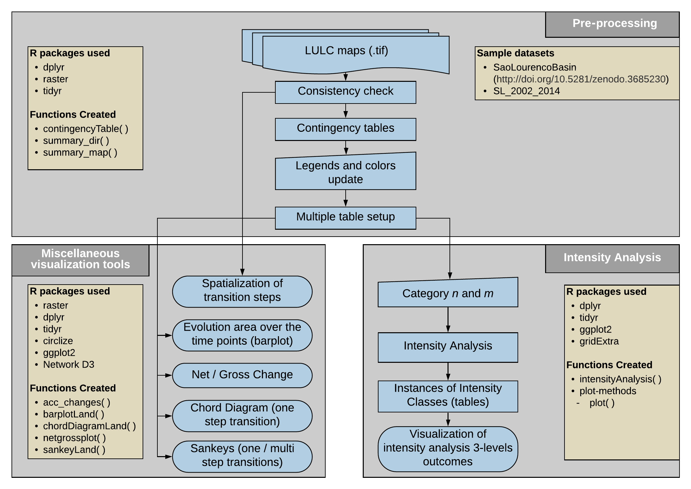
<figcaption>Figure 1: Conceptual overview of the OpenLand package
showing reused R functionalities. The package is composed by three major
blocks for <em>i)</em> pre-processing of raster time series and calculus
of LUC transitions, <em>ii)</em> spatial and non-spatial visualization
of LUCC and <em>iii)</em> intensity analysis including tailored
visualization tools.</figcaption>
</figure>

The main processing workflow should begin with a consistency check of
the input files, which have to be a sequence of LUC maps in a tif format
(Fig. [1](#fig:conception)). In the following step, a contingency table
of LUC transitions for each time step can be calculated. Two
complementary analysis workflows are then available. First, a set of
miscellaneous non-spatial visualization tools allows for a quick
screening of LUC dynamics. Second, a complete intensity analysis
[@Aldwaik2012; @Aldwaik2013] can be implemented, including tools to
visualize change intensities over time, category and transition levels.
Ancillary functionalities include allow for extraction and spatial
visualization of LUCC frequencies.

# Functionality and implementation

::: {#the-suxe3o-lourenuxe7o-river-basin-example-dataset}
## The São Lourenço river basin example dataset {#the-suxe3o-lourenuxe7o-river-basin-example-dataset}
:::

The *OpenLand* functionality is demonstrated using an LUC dataset of the
São Lourenço river basin, of major importance to the Pantanal wetland
into which it flows. The data is as provided in the 4^th^ edition of the
[Monitoring of Changes in Land cover and Land Use in the Upper Paraguay
River Basin - Brazilian portion - Review Period: 2012 to
2014](https://www.embrapa.br/pantanal/bacia-do-alto-paraguai)
[@sospantanal2015], and the time series is composed of five LUC maps
(2002, 2008, 2010, 2012 and 2014). The study area is located in the
Cerrado savanna biome, in the southeastern corner of the Brazilian state
of Mato Grosso, and covers approximately 22,400 km^2^. Some level of
LUCC has occurred in about 12% of the area over the past 12 years,
including some deforestation and intensification of existing
agricultural uses. In order to be processed using the *OpenLand*
package, the original multi-year shapefile was clipped to the extent of
the São Lourenço basin, transformed into rasters and saved as a 5-layer
`RasterStack`; it is available from a public repository
[(https://doi.org/10.5281/zenodo.3685229)](https://zenodo.org/record/3685230#.Xl7cDMgReUk)
as an `.RDA` file which can be loaded into R.

``` r
# Installing the released version of OpenLand from CRAN
install.packages("OpenLand")

# Loading the OpenLand package
library(OpenLand)

# downloading the SaoLourencoBasin multi-layer raster and make it available into R
url <- "https://zenodo.org/record/3685230/files/SaoLourencoBasin.rda?download=1"

temp <- tempfile()
download.file(url, temp, mode = "wb")
load(temp)

# looking on the metadata of the example dataset
SaoLourencoBasin 
```

``` r
#> class      : RasterStack 
#> dimensions : 6372, 6546, 41711112, 5  (nrow, ncol, ncell, nlayers)
#> resolution : 30, 30  (x, y)
#> extent     : 654007.5, 850387.5, 8099064, 8290224  (xmin, xmax, ymin, ymax)
#> crs        : +proj=utm +zone=21 +south +ellps=GRS80 +units=m +no_defs 
#> names      : landscape_2002, landscape_2008, landscape_2010, ..., landscape_2014 
#> min values :              2,              2,              2, ...,              2 
#> max values :             13,             13,             13, ...,             13
```

To visualize the output of the LUC analysis in *OpenLand*, we simplified
the legend of the original dataset and used the following 11 LUC
categories for the basin: forest formation (FF), three Cerrado savanna
formations (SF, SA, SG), anthropogenized vegetation (aa), i.e. mostly
altered Cerrado formations used for grazing, composed of natural
species, cattle farming (Ap), crop farming (Ac), mining areas (Im),
urban areas (Iu), water bodies (Agua), and reforestation (R) (Table
[1](#tab:legend_table)).

::: {#tab:legend_table}
  --------------------------------------------------------------------------------
  Pixel Value   Legend   Class           Category                     Colour    
  ------------- -------- --------------- ---------------------------- --------- --
  2             Ap       Anthropogenic   Cattle farming               #DDCC77   

  3             FF       Natural         Forest formation             #117733   

  4             SA       Natural         Park savanna                 #44AA99   

  5             SG       Natural         Gramineous savanna           #88CCEE   

  7             aa       Anthropogenic   Anthropogenized vegetation   #CC6677   

  8             SF       Natural         Wooded savanna               #999933   

  9             Agua     Natural         Water bodies                 #332288   

  10            Iu       Anthropogenic   Urban areas                  #AA4499   

  11            Ac       Anthropogenic   Crop farming                 #661100   

  12            R        Anthropogenic   Reforestation                #882255   

  13            Im       Anthropogenic   Mining areas                 #6699CC   
  --------------------------------------------------------------------------------

  : Table 1: The original legend of LUC classes and categories from
  @sospantanal2015 including colour coding.
:::

::: {#consistency-check-and-data-extraction-from-raster-time-series}
## Consistency check and data extraction from raster time series
:::

Two auxiliary functions allow users to check for consistency in the
input gridded LUC time series, including extent, projection, cell
resolution and categories. The `summary_map()` function returns the
number of pixels in each category for each single raster layer, whereas
the `summary_dir()` function lists the spatial extent, spatial
resolution, cartographic projection and the category range of a set of
LUC maps.

For the initial spatial screening of the time series, the
`acc_changes()` function determines the number of LUC transitions during
the entire time interval of the series. The results of percentage area
by transition frequencies in the study area are stored in a table and a
grid layer is generated, which can be plotted (Fig. [2](#fig:acchange))
using for example the `tmap` package.

``` r
# the acc_changes() function, with the SaoLourencoBasin dataset
SL_changes <- acc_changes(SaoLourencoBasin)
SL_changes
```

``` r
#> [[1]]
#> class      : RasterLayer 
#> dimensions : 6372, 6546, 41711112  (nrow, ncol, ncell)
#> resolution : 30, 30  (x, y)
#> extent     : 654007.5, 850387.5, 8099064, 8290224  (xmin, xmax, ymin, ymax)
#> crs        : +proj=utm +zone=21 +south +ellps=GRS80 +units=m +no_defs 
#> names      : layer 
#> values     : 0, 2  (min, max)
#> 
#> 
#> [[2]]
#> # A tibble: 3 x 3
#>   PxValue       Qt Percent
#>     <int>    <int>   <dbl>
#> 1       0 21819779   87.6 
#> 2       1  2787995   11.2 
#> 3       2   301086    1.21
```

<figure id="fig:acchange">
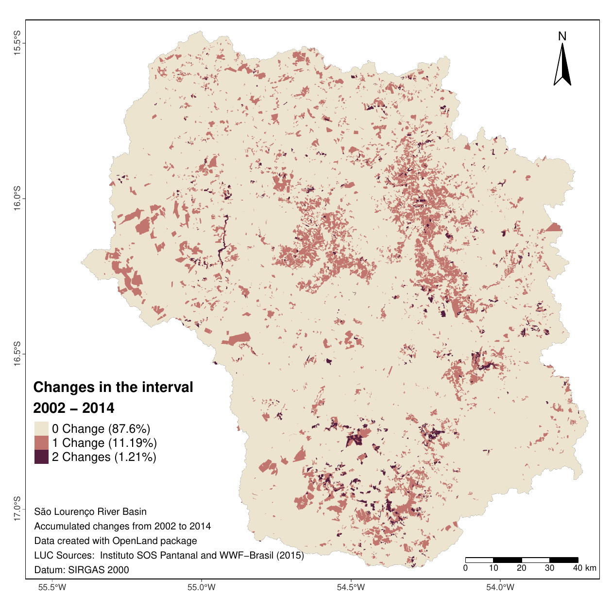
<figcaption>Figure 2: Number of LUCC between 2002 and 2014 at four time
points (2002, 2008, 2010, 2012, 2014) in the São Lourenço river basin
<span class="citation" data-cites="sospantanal2015">(Instituto SOS
Pantanal and WWF-Brasil 2015)</span>. LUCC occurred throughout the
basin, with one-step changes concentrated in the central-northern
regions and two-step changes in the central south.</figcaption>
</figure>

As most deforestation occurred in the 20th century, unchanged areas
totalled 87.6%. Approximately 35% of the watershed had already been
deforested in 1985, versus 46% in 2014 [@Mapbiomas]. 11.19% showed a
unique alteration and 1.21% a two-folded alteration for the five time
points of the input series considered. All further analytical and
visualization tools are based on the `contingencyTable()` function,
which builds a matrix of transitions between LUC categories according to
the temporal resolution of the original time series. Multiple grid
scanning by `contingencyTable()` returns 5 objects: `lulc_Multistep`,
`lulc_Onestep`, `tb_legend`, `totalArea`, `totalInterval`. The first two
objects are contingency tables; the first (`lulc_Multistep`) takes into
account the grid cells of the entire time series, whereas the second
(`lulc_Onestep`) calculates LUC transitions only between the first and
last year of the series. The third object (`tb_legend`) is a table
containing the category name associated with pixel values and a colour
scheme. As category values and colours are initially created randomly,
their values must be edited to produce meaningful plot legends and
colour schemes. The fourth object (`totalArea`) is a table containing
the extent of the study area in km^2^ and in pixel units. The fifth
table (`totalInterval`) stores the range of years between the first
(Y~t=1~) and last year (Y~T~) of the series. Table [2](#tab:prototype)
presents the fields created, together with their format, description and
labelling as per a table output by the `contingencyTable()` function.

::: {#tab:prototype}
  -----------------------------------------------------------------------------------------------------------------------------------------------------------------------------------------------------------------------------------------------------------------------------------------------------------------------------------------------------------------------------------------------------------------------------------------------
  $[Y_t,Y_{t+1}]$                                              Category$_i$                                  Category$_j$                                C$_{tij}$ (km$^2$)                                                             C$_{tij}$ (pixel)                                                             $Y_{t+1} - Y_t$                                                 $Y_t$                          $Y_{t+1}$
  ------------------------------------------------------------ --------------------------------------------- ------------------------------------------- ------------------------------------------------------------------------------ ----------------------------------------------------------------------------- --------------------------------------------------------------- ------------------------------ ----------------------------
  chr                                                          int                                           int                                         dbl                                                                            int                                                                           int                                                             int                            int

  Period of analysis from time point *t* to time point *t+1*   A category at interval's initial time point   A category at interval's final time point   Number of elements in km$^2$ that transits from category *i* to category *j*   Number of elements in pixel that transits from category *i* to category *j*   Interval in years between time point *t* and time point *t+1*   Initial Year of the interval   Final Year of the interval

  **Period**                                                   **From**                                      **To**                                      **km2**                                                                        **QtPixel**                                                                   **Interval**                                                    **yearFrom**                   **yearTo**
  -----------------------------------------------------------------------------------------------------------------------------------------------------------------------------------------------------------------------------------------------------------------------------------------------------------------------------------------------------------------------------------------------------------------------------------------------

  : Table 2: Structure of the contingency table that stores LUC
  transitions at chosen time intervals.
:::

As mentioned, the **tb_legend** object must be edited with the real
category names and colours associated with the category values. In our
case, the category names and colours follow the conventions given by
[@sospantanal2015] [(access document here, page
17)](https://www.embrapa.br/documents/1354999/1529097/BAP+-+Mapeamento+da+Bacia+do+Alto+Paraguai+-+estudo+completo/e66e3afb-2334-4511-96a0-af5642a56283)
like the values in (Table [1](#tab:legend_table)).

Users should be aware that `acc_changes()` and `contingencyTable()`
process the entire input time series analyzing successive raster pairs.
Processing time of `contingencyTable()`, the computationally most
demanding function of *OpenLand* may range between 3 and 7 minutes for
the `SaoLourencoBasin` dataset if using common desktop computers (8 MB
Ram, i3-i7 processors, Windows 64bits versions).

``` r
## creating the contingency table
SL_2002_2014 <- contingencyTable(input_raster = SaoLourencoBasin,
                                 pixelresolution = 30)
names(SL_2002_2014)
```

``` r
#> [1] "lulc_Multistep" "lulc_Onestep"   "tb_legend"      "totalArea"     
#> [5] "totalInterval"
```

``` r
## editing the category names
SL_2002_2014$tb_legend$categoryName <- factor(c("Ap", "FF", "SA", "SG", "aa", "SF", 
                                                "Agua", "Iu", "Ac", "R", "Im"),
                                     levels = c("FF", "SF", "SA", "SG", "aa", "Ap", 
                                                "Ac", "Im", "Iu", "Agua", "R"))

## adding the colours by the same order of the legend
SL_2002_2014$tb_legend$color <- c("#DDCC77", "#117733", "#44AA99", "#88CCEE",
                                  "#CC6677", "#999933", "#332288", "#AA4499",
                                  "#661100", "#882255", "#6699CC")
```

::: {#miscellaneous-non-spatial-visualization-tools}
## Miscellaneous non-spatial visualization tools
:::

::: {#evolution-of-luc-areas}
### Evolution of LUC areas
:::

Exploratory data analysis based on the `contingencyTable()` function may
begin with the visualization of the absolute and/or percentage area of
each LUC category at each time point using a grouped bar plot (Fig.
[3](#fig:evolution_plot)), in order to show the evolution of the LUC
categories at each time point of the series.

``` r
barplotLand(dataset = SL_2002_2014$lulc_Multistep, 
            legendtable = SL_2002_2014$tb_legend,
            xlab = "Year",
            ylab = bquote("Area (" ~ km^2~ ")"),
            area_km2 = TRUE)
```

<figure id="fig:evolution_plot">
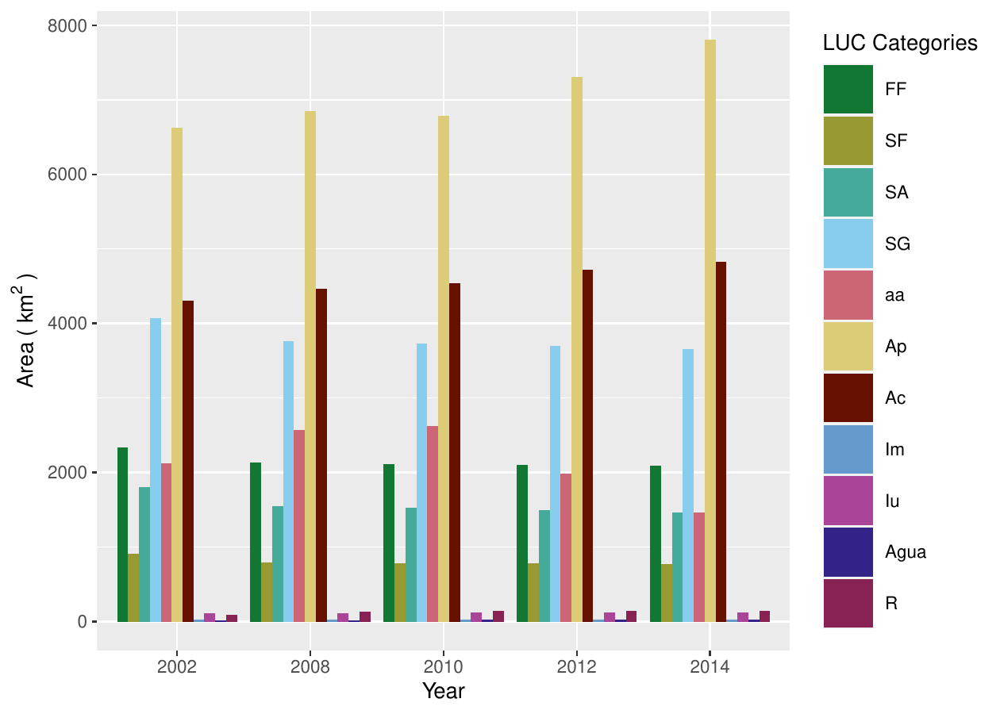
<figcaption>Figure 3: Evolution bar plot quantifying LUC categories at
the five time points between 2002 and 2014, highlighting the increase of
cattle farming (Ap) in the river basin.</figcaption>
</figure>

::: {#net-and-gross-changes}
### Net and gross changes
:::

For the analysis of long time series with high temporal resolution,
information extraction from evolution bar plots may become demanding and
alterations between categories through time points are only as net
changes. For a category-wise, simultaneous assessment of net and gross
changes, multistep transitions can be balanced through a stacked bar
chart (Fig. [4](#fig:ng_plot)). In the São Lourenço river basin, all
natural vegetation categories suffered an equal net and gross loss (FF,
SF, SA, SG) between 2002 and 2014. In contrast, mining (Im) and
urbanized (Iu) areas as well as waterbodies (Agua) and reforestation (R)
had equal amounts of net and gross gains. Principally anthropogenized
vegetation (aa) and pastures showed differences in net and gross
changes, pointing to more complex underlying LUCC processes.

``` r
netgrossplot(dataset = SL_2002_2014$lulc_Multistep,
             legendtable = SL_2002_2014$tb_legend,
             xlab = "LUC Category",
             ylab = bquote("Area (" ~ km^2 ~ ")"),
             changesLabel = c(GC = "Gross Changes", NG = "Net Gain", NL = "Net Loss"),
             color = c(GC = "#e0c2a2", NG = "#541f3f", NL = "#c1766f"), 
             area_km2 = TRUE)
```

<figure id="fig:ng_plot">
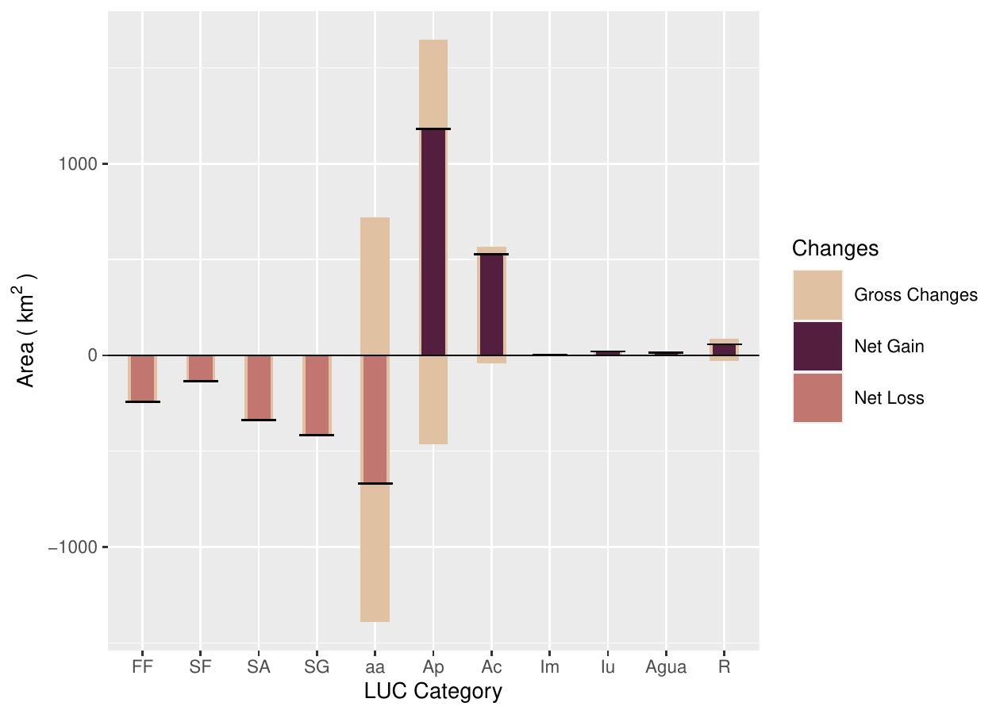
<figcaption>Figure 4: Combined stacked bar plot of gross changes, net
gains and net losses of LUC categories (2002 – 2014). Anthropogenized
vegetation (aa) and cattle farming (Ap) experimented both gross gains
and losses, however net losses and net gains, respectively.</figcaption>
</figure>

To further explore specifically those non-linear transitions,
single-step Chord (Fig. [5](#fig:chordDiagram)) and Sankey diagrams
(Fig. [6](#fig:sankeys)a and [6](#fig:sankeys)b) can be composed for
each time point in the series. Considering the entire observation
period, the major gross change was from anthropogenized areas (aa) to
cattle farming (Ap). Both the Chord and Sankey diagrams show however
that pastures did not directly gain from clear-cut deforestation, but
from the previous degradation of natural vegetation categories
principally until 2008 (FF, SF, SA, SG), and a subsequent transition
from aa to Ap between 2010 and 2014.

::: {#chord-diagram-2002-2014}
### Chord diagram (2002 -- 2014)
:::

``` r
chordDiagramLand(dataset = SL_2002_2014$lulc_Onestep,
                 legendtable = SL_2002_2014$tb_legend,
                 area_km2 = TRUE)
```

<figure id="fig:chordDiagram">
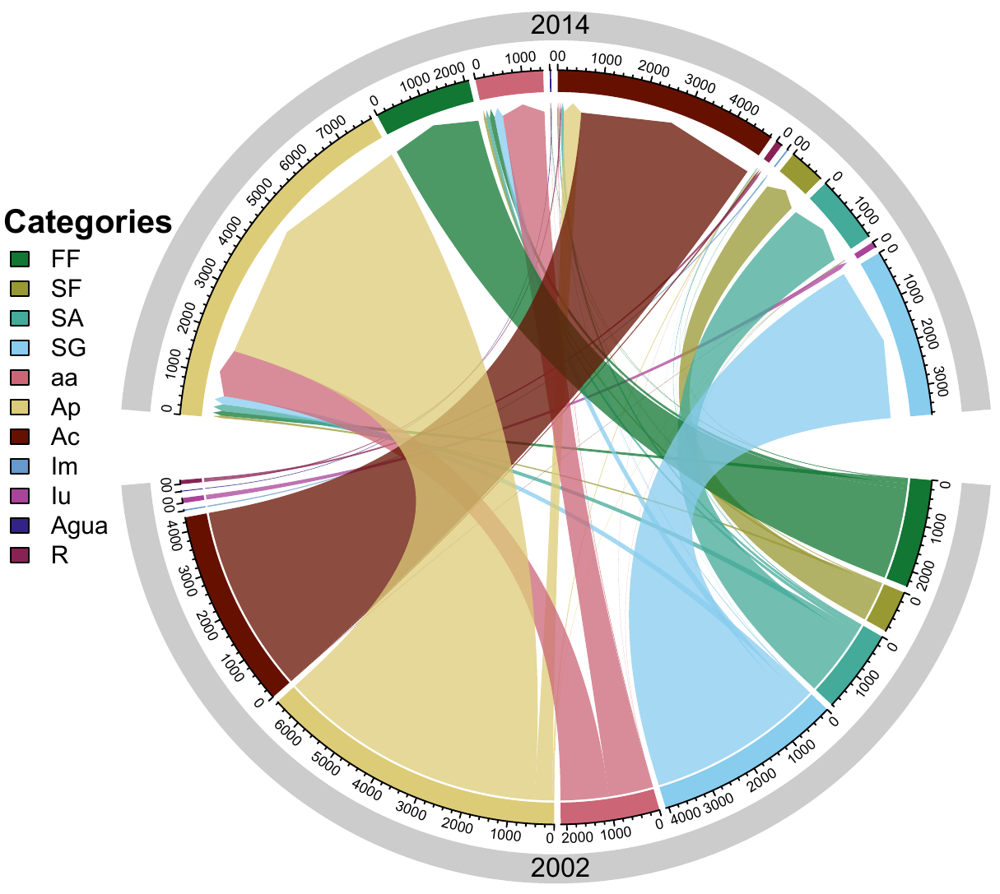
<figcaption>Figure 5: Chord diagram of single-step transitions between
LUC categories (2002 – 2014). The major change during the period was
from anthropogenized vegetation (aa) to cattle farming
(Ap).</figcaption>
</figure>

::: {#single-step-sankey-diagram-2002-2014}
### Single-step Sankey diagram (2002 -- 2014)
:::

``` r
sankeyLand(dataset = SL_2002_2014$lulc_Onestep,
           legendtable = SL_2002_2014$tb_legend)
```

<figure id="fig:sankeys">
<table>
<caption> </caption>
<tbody>
<tr class="odd">
<td style="text-align: center;">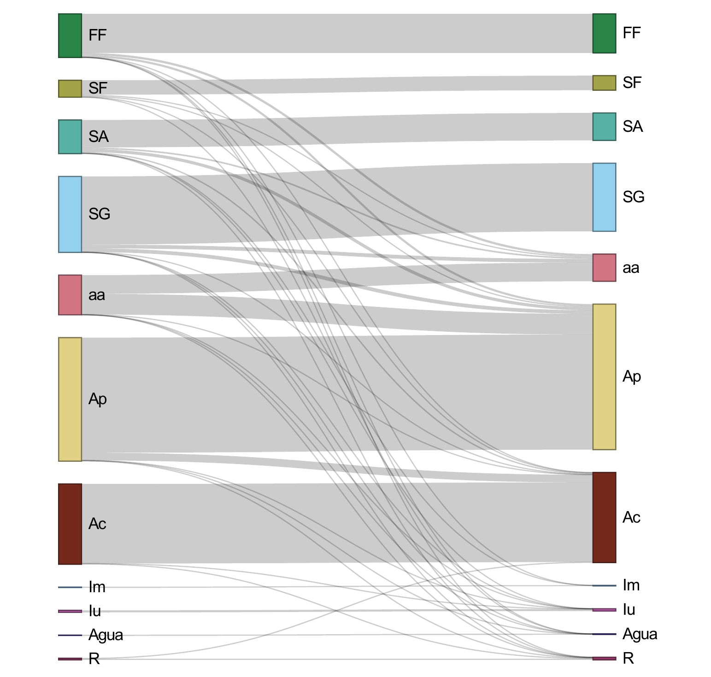</td>
<td style="text-align: center;">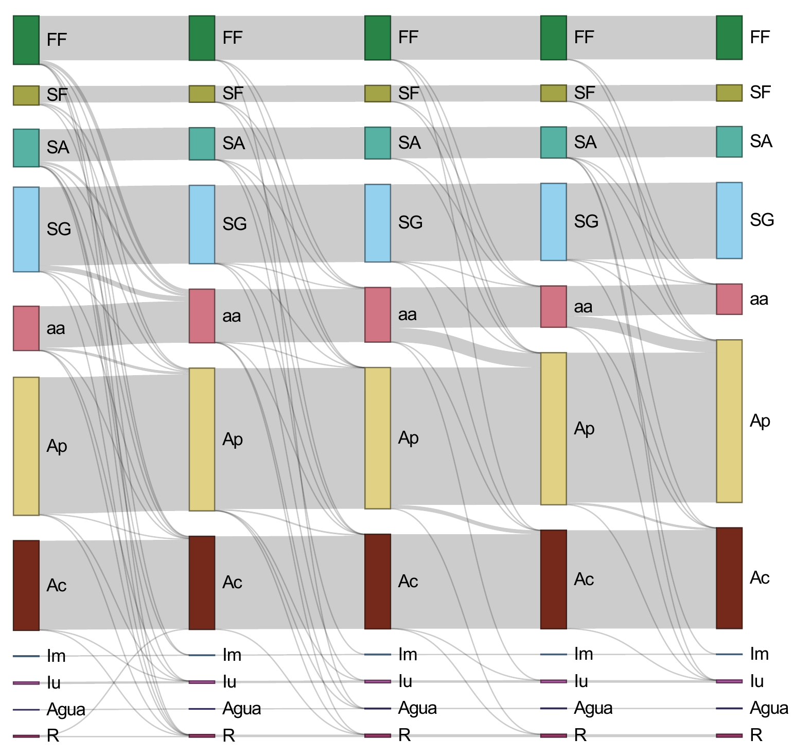</td>
</tr>
<tr class="even">
<td style="text-align: center;">(a) Onestep transition 2002 - 2014</td>
<td style="text-align: center;">(b) Multistep transition
2002-2008-2010-2012-2014</td>
</tr>
</tbody>
</table>
<figcaption>Figure 6: Sankey plots of single- and multistep transitions
between LUC categories (2002 – 2014). Major overall transition was from
anthropogenized vegetation (aa) to cattle farming (Ap) (a), but aa
received important contributions by the loss of natural vegetation
classes (FF, SF, SA, SG) as well, principally from 2002 to 2008
(b).</figcaption>
</figure>

::: {#multistep-sankey-diagram}
### Multistep sankey diagram
:::

If between-category transitions have to be visualized simultaneously for
the entire time series, a multistep version of the Sankey plot can be
output (Fig. [6](#fig:sankeys)b).

``` r
sankeyLand(dataset = SL_2002_2014$lulc_Multistep,
           legendtable = SL_2002_2014$tb_legend)
```

The `sankeyLand()` function returns html output, as it depends on the
*networkD3* R package which uses such format as default.

::: {#intensity-analysis}
## Intensity analysis
:::

Intensity Analysis (IA) is a quantitative method for the analysis of LUC
maps over several time steps, using cross-tabulation matrices, where
each matrix summarizes the LUC change for each time interval. IA
evaluates the deviation between observed change intensity and
hypothesized uniform change intensity in three levels. Thereby, each
level details information given by the previous analysis level. First,
the **interval level** indicates how the size and rate of change vary
over time intervals. Second, the **category level** examines for each
time interval how the size and intensity of gross losses and gross gains
in each category vary across categories for each time interval. Third,
the **transition level** determines the size and intensity of each
transition from one category to another during each time interval. At
each level, the method also tests for stationarity of patterns across
time intervals [@Aldwaik2012]. In the *OpenLand* package, the
`intensityAnalysis()` function computes the three levels of analysis. It
requires the object returned by the `contingenceTable()` function and
that the user predefines two LUC categories `n` and `m`. Generally, `n`
is a target category that experienced relevant gains and `m` a category
with important losses.

``` r
testSL <- intensityAnalysis(dataset = SL_2002_2014, category_n = "Ap",
                            category_m = "SG", area_km2 = TRUE)

# it returns a list with 6 objects
names(testSL)
```

``` r
#> [1] "lulc_table"           "interval_lvl"         "category_lvlGain"    
#> [4] "category_lvlLoss"     "transition_lvlGain_n" "transition_lvlLoss_m"
```

The `intensityAnalysis()` function returns 6 objects: ` lulc_table`,
` interval_lvl`, ` category` `_lvlGain`, `category_lvlLoss`,
`transition_lvlGain_n`, `transition_lvlLoss_m`. The object-oriented
approach adopted here allowed us to set specific methods for plotting
the intensity objects. Specifically, we used the S4 class, which
requires the formal definition of classes and methods [@Chambers2008].
The first object is a contingency table similar to the `lulc_Multistep`
object with the unique difference that the columns `From` and `To` are
replaced by their appropriate denominations in the LUC legend.

The second object ***interval_lvl*** is an `"Interval"` object, the
third ***category_lvlGain*** and the fourth ***category_lvlLoss*** are
`"Category"` objects, while the fifth ***transition_lvlGain_n*** and the
***transition*** ***\_lvlLoss_m*** are `"Transition"` objects.

An `"Interval"` object has one slot containing a table of the **interval
level** results (*(S~t~ equation (\@ref(eq:st)) and U equation
(\@ref(eq:U)) values)*. A `"Category"` object has three slots: the first
contains the colour associated with the legend item as name attribute,
the second slot contains a table of the **category level** results
*(gain (G~tj~) equation (\@ref(eq:gtj)) or loss (L~ti~) equation
(\@ref(eq:lti)) values)*, and the third slot contains a table storing
the results of a stationarity test. A `"Transition"` object also has
three slots: the first contains the colour associated with the
respective legend item defined as name attribute, the second slot
contains a table of the **transition level** results *(gain n (R~tin~
equation (\@ref(eq:rtin)) and W~tn~ equation (\@ref(eq:wtn))) or loss m
(Q~tmj~ equation (\@ref(eq:qtmj)) and V~tm~ equation (\@ref(eq:vtm)))
values)*. The third slot contains a table storing the results of a
stationarity test. @Aldwaik2012 consider a case stationary only when the
intensities for all time intervals are on one side of the uniform
intensity, i.e. they are consistently either smaller or larger than the
uniform rate over the entire period.

$$\label{eq:st}
S_t = \frac{\sum_{j=1}^{J} \left[( \sum_{i=1}^{J} C_{tij}) - C_{tjj} \right]}{(Y_{t+1} - Y_{t})\left(\sum_{j=1}^{J} \sum_{i=1}^{J} C_{tij}\right)} \times 100\%   (\#eq:st)$$

$$\label{eq:U}
U = \frac{\sum_{t=1}^{T-1} \left\{(Y_{t+1} - Y_t) \sum_{j=1}^{J} \left[\left(\sum_{i=1}^{J} C_{tij}\right) - C_{tjj}   \right]\right\}}{(Y_{T} - Y_{1}) \sum_{t=1}^{T-1} \left[(Y_{t+1} - Y_t) \left(\sum_{j=1}^{J} \sum_{i=1}^{J} C_{tij}\right)  \right]} \times 100\%   (\#eq:U)$$

$$\label{eq:gtj}
G_{tj} = \frac{\left[\left( \sum_{i=1}^{J} C_{tij} \right) - C_{tjj}   \right] / (Y_{t+1} - Y_t)}{\sum_{i=1}^{J} C_{tij})} \times 100\%   (\#eq:gtj)$$

$$\label{eq:lti}
L_{ti} = \frac{\left[\left( \sum_{j=1}^{J} C_{tij} \right) - C_{tii}   \right] / (Y_{t+1} - Y_t)}{\sum_{j=1}^{J} C_{tij})} \times 100\%   (\#eq:lti)$$

$$\label{eq:rtin}
R_{tin} = \frac{C_{tin} / (Y_{t+1} - Y_t)}{\sum_{j=1}^{J} C_{tij})} \times 100\%   (\#eq:rtin)$$

$$\label{eq:wtn}
W_{tn} = \frac{\left[\left( \sum_{i=1}^{J} C_{tin} \right) - C_{tnn}   \right] / (Y_{t+1} - Y_t)}{\sum_{j=1}^{J}  \left[\left( \sum_{i=1}^{J} C_{tij} \right) - C_{tnj}   \right]} \times 100\%   (\#eq:wtn)$$

$$\label{eq:qtmj}
Q_{tmj} = \frac{C_{tmj} / (Y_{t+1} - Y_t)}{\sum_{i=1}^{J} C_{tij}} \times 100\%   (\#eq:qtmj)$$

$$\label{eq:vtm}
V_{tm} = \frac{\left[\left( \sum_{j=1}^{J} C_{tmj} \right) - C_{tmm}   \right] / (Y_{t+1} - Y_t)}{\sum_{i=1}^{J}  \left[\left( \sum_{j=1}^{J} C_{tij} \right) - C_{tim}   \right]} \times 100\%   (\#eq:vtm)$$

::: {#graphs-output-of-the-intensity-analysis}
### Graphs (output of the intensity analysis)
:::

Visualizations of the IA results are obtained with the
`plot(intensity-object)` method. For more details on the function
arguments, please see the documentation of the `plot()` method
implemented.

::: {#interval-level}
### Interval Level
:::

The IA interval level is a measure of the overall rate of LUC changes
over consecutive time intervals in the series. The plot (Fig.
[7](#fig:int_level)) has two sides: on the left the percentage of change
during the corresponding time step, and on the right the percentage of
change per year showing the reference line of the Uniform rate.

``` r
plot(testSL$interval_lvl,
     labels = c(leftlabel = "Interval change area (%)",
                rightlabel = "Annual change area (%)"),
     marginplot = c(-8, 0), leg_curv = c(x = .3, y = .1),
     color_bar = c(fast = "#541f3f", slow =  "#c1766f", area = "#888888"))
```

<figure id="fig:int_level">
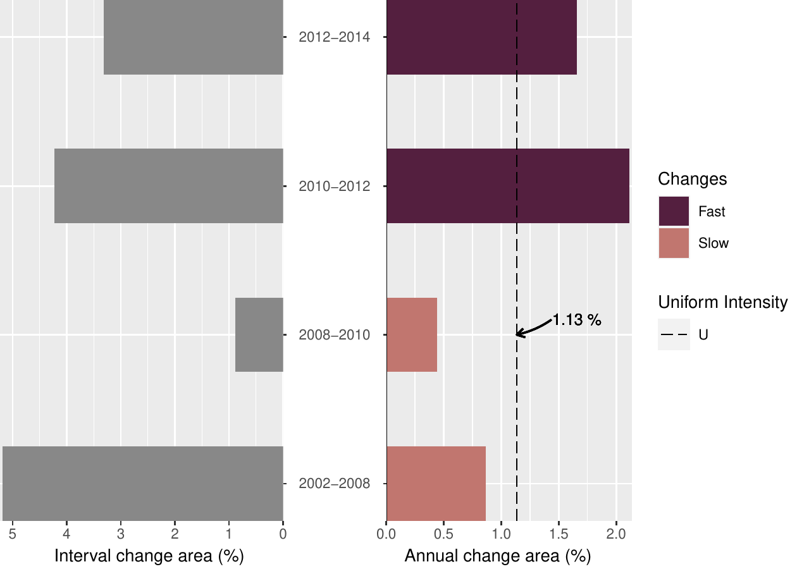
<figcaption>Figure 7: IA Interval Level plot of LUCC for the time
intervals of the sample data set. Left-side bars represent LUCC during
the time interval and right-side bars show the annualized rates.
Strongest annual LUCC occurred between 2010 and 2012.</figcaption>
</figure>

In the São Lourenço river basin, the interval level plot shows that LUC
change has accelerated over the last decade, with a peak between 2010
and 2012, when the actual rate of change was almost double the Uniform
rate. This recent acceleration in LUC in the Cerrado biome has been
interpreted partially as a spillover effect of conservation efforts in
the Amazon basin [@Dou2018].

::: {#category-level-gain-and-loss-area}
### Category Level (Gain and Loss Area)
:::

After the analysis of LUC change intensity independently from LUC
categories, the category level allows further examination into which
land categories are relatively dormant versus active in a given time
interval and whether this pattern is stable across time intervals
[@Aldwaik2012].

``` r
# Gain area
plot(testSL$category_lvlGain,
     labels = c(leftlabel = bquote("Gain Area (" ~ km ^ 2 ~ ")"),
                rightlabel = "Intensity Gain (%)"),
     marginplot = c(.3, .3), leg_curv = c(x = 1, y = .5))

# Loss area
plot(testSL$category_lvlLoss,
     labels = c(leftlabel = bquote("Loss Area (" ~ km ^ 2 ~ ")"),
                rightlabel = "Loss Intensity (%)"),
     marginplot = c(.3, .3), leg_curv = c(x = 1, y = .5))
```

<figure id="fig:cat_level">
<table>
<caption> </caption>
<tbody>
<tr class="odd">
<td style="text-align: center;">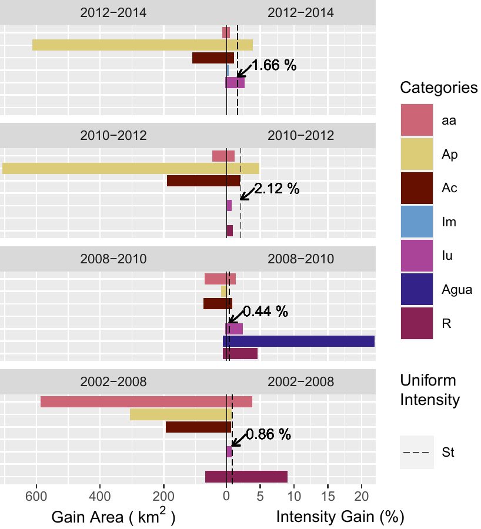</td>
<td style="text-align: center;">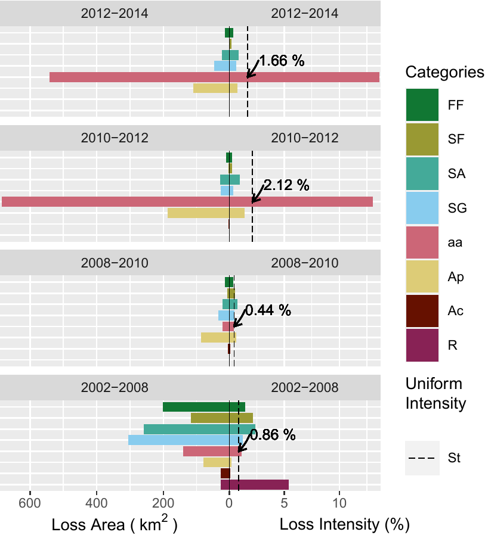</td>
</tr>
<tr class="even">
<td style="text-align: center;">(a) Gain area</td>
<td style="text-align: center;">(b) Loss area</td>
</tr>
</tbody>
</table>
<figcaption>Figure 8: IA Category level (a) gain and (b) loss plots.
Cattle farming (Ap), for example, had the highest areal gain of all
categories (2010 – 2012), whereas water bodies had a very high intensity
gain between 2008 and 2010 due to the implantation of a large hydropower
plant reservoir.</figcaption>
</figure>

To facilitate legibility, we chose to split the category level plots
(Fig. [8](#fig:cat_level)) into area gains (Fig. [8](#fig:cat_level)a)
and losses (Fig. [8](#fig:cat_level)b). Area gains in land categories
(R) and (aa) were more intense over the first six-year period
(2002-2008) than they were at any other subsequent time point. The very
intense area gain in water bodies during the second time interval
(2008-2010) corresponds to the São Lourenço hydropower plant reservoir
being filled. In the third and fourth intervals, the expansion of
pasture areas (Ap) was more intense than during previous time steps. In
parallel, the land category (aa) is in sharp decline.

::: {#transition-level-gain-of-the-category-n-ap-and-loss-of-the-category-m-sg}
### Transition level (gain of the category `n` "Ap" and loss of the category `m` "SG")
:::

In the transition level, the analysis focuses on the intensity of gain
of a particular category `n` from all the individual categories in the
landscape and/or on the intensity of loss of a particular category `m`
to all the individual categories in the landscape for each time
interval.

``` r
# Gain of the category `n` "Ap"
plot(testSL$transition_lvlGain_n,
     labels = c(leftlabel = bquote("Gain of Ap (" ~ km^2 ~ ")"),
                rightlabel = "Intensity Gain of Ap (%)"),
     marginplot = c(.3, .3), 
     leg_curv = c(x = 1, y = .2))

# Loss of the category `m` "SG"
plot(testSL$transition_lvlLoss_m,
     labels = c(leftlabel = bquote("Loss of SG (" ~ km^2 ~ ")"), 
                rightlabel = "Intensity Loss of SG (%)"),
     marginplot = c(.3, .3), 
     leg_curv = c(x = .1, y = .4))
```

<figure id="fig:trans_level">
<table>
<caption> </caption>
<tbody>
<tr class="odd">
<td style="text-align: center;">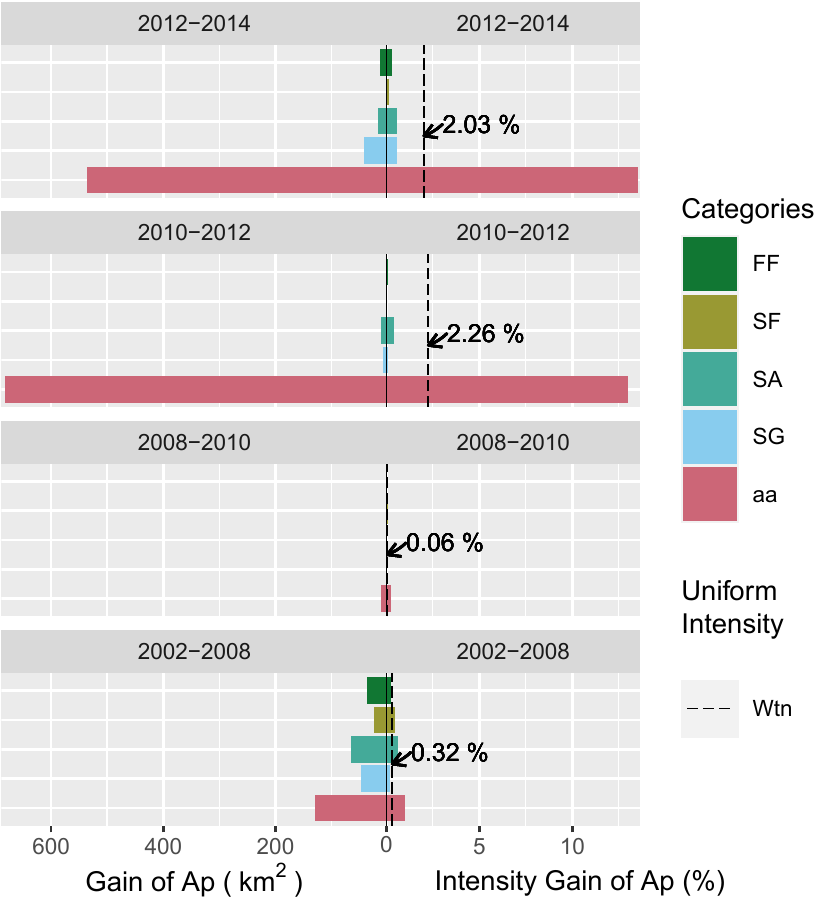</td>
<td style="text-align: center;">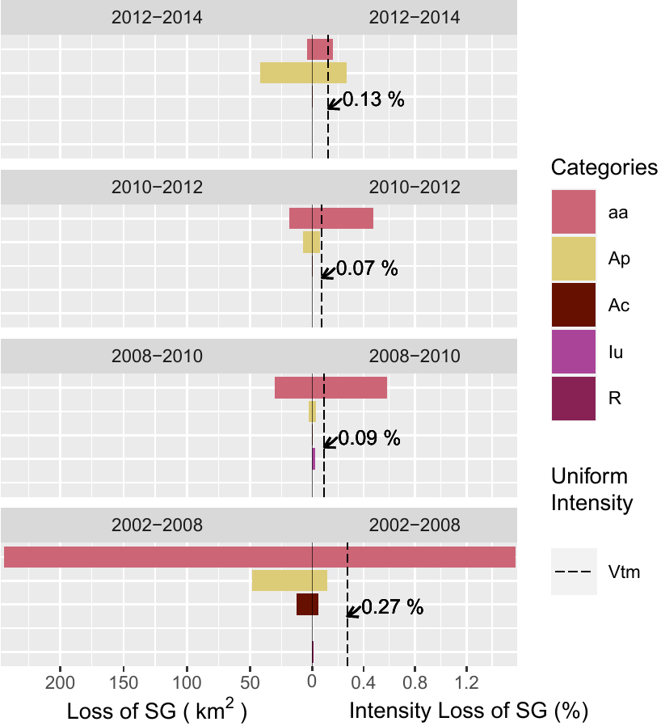</td>
</tr>
<tr class="even">
<td style="text-align: center;">(a) Gain of category n (Ap)</td>
<td style="text-align: center;">(b) Loss of category m (SG)</td>
</tr>
</tbody>
</table>
<figcaption>Figure 9:  IA Transition level plots of cattle farming (Ap) gains and
Gramineous savanna (SG) losses. Left-side bars represent the areal
gain/loss of a LUC category and right-side bars show the intensity of
gain/loss. The SG category had the highest and most intense loss to
anthropogenized vegetation (aa) category between 2002 and
2008.</figcaption>
</figure>

The area gains in the (Ap) category and losses in the SG category of the
SaoLourencoBasin dataset are used here as an example. Results in (Fig.
[9a](#fig:trans_level)) show that areas in (Ap) were
principally gained from the aa category, and that this transition was
particularly intense in the third and fourth time periods. Meanwhile,
area losses in the (SG) savannah formation persisted over the entire
span of the time series (Fig. [9b](#fig:trans_level)).
However, there was a change in the land uses these areas were lost to:
during the first three intervals, (SG) was lost principally to (aa),
while in the last time interval, the loss was more intensely due
directly to the (Ap) category.

# Conclusions and further research

In response to added and refined temporal, spatial and thematic
dimensions increasing the volume of LUC data, the *OpenLand* package
provides a comprehensive and integrated suite for the exploratory
analysis of LUC changes. It offers seamless processing workflows
beginning with time series consistency checking, data extraction,
analysis and plotting of commonly used LUC metrics, as well as an
implementation of Intensity Analysis, a state-of-the-art top-down
hierarchical methodological framework to quantify the intensity of LUC
changes. Regardless of the complexity of an LUC time series, all
transitions and metrics are automatically extracted, quantified and
stored as objects, without any need for further tabular data
manipulation for analysis. Visualization tools create pre-formatted
print-ready plots, which can be easily modified through function
arguments.

@Aldwaik2013 presented an extension of IA, which allows us to consider
hypothetical classification errors in input LUC maps as part of the
comparison between observed and uniform intensities in IA. The
implementation of their method in *OpenLand* could further help users to
assess the implications of errors on the strength of the evidence in the
outputs of their Intensity Analysis and therefore, improve their
understanding of LUC change processes.

# Acknowledgements

Reginal Exavier is supported by the Brazilian Funding Agency CAPES
(Coordination for the Improvement of Higher Level Personnel) through a
Master studentship (2018 - 2020) at the Department of Geography of the
Federal University of Mato Grosso. The research received financial
support from the Critical Ecosystem Partnership Fund - CEPF (Grant
Agreement CEPF-104254) and FAPEMAT (Grant Agreement 219228/2015).

