::: article
# Introduction

In the era of big data, large-scale multiple testing problems arise from
a wide range of fields, including biological sciences such as genomics
and neuroimaging, social science, signal processing, marketing
analytics, and financial economics. When testing multitudinous
statistical hypotheses simultaneously, researchers appreciate
statistically significant evidence against the null hypothesis with a
guarantee of controlled false discovery rate (FDR) [@BH1995]. Since the
seminal work of [@BH1995], multiple testing with FDR control has been
extensively studied and successfully used in many applications. Most of
the existing testing procedures are tailored to independent or weakly
dependent hypotheses or tests. See, [@S2002], [@GW2004] and [@LR2005],
to name a few. The independence assumption, however, is restricted in
real applications as correlation effects are ubiquitous in high
dimensional measurements. Ignoring such strong dependency and directly
applying standard FDR controlling procedures can lead to inaccurate
false discovery control, loss of statistical power, and unreliable
scientific conclusions.

Over the past decade, a multi-factor model has proven to be an effective
tool for modeling cross-sectional dependence, with applications in
genomics, neuroscience, and financial economics. Related references in
the context of multiple testing include [@LS2008], [@FKC2009],
[@FHG2012], [@DS2012] and [@FH2017]. A common thread of the
aforementioned works is that the construction of test statistics and
p-values heavily relies on the assumed joint normality of factors and
noise, which is arguably another folklore regarding high dimensional
data. Therefore, it is imperative to develop large-scale multiple
testing tools that adjust cross-sectional dependence properly and are
robust to heavy-tailedness at the same time.

Recently, [@FKSZ2017] developed a
[F]{.underline}actor-[A]{.underline}djusted [R]{.underline}obust
[M]{.underline}ultiple [Test]{.underline} (FarmTest) procedure for
large-scale simultaneous inference with highly correlated and
heavy-tailed data. Their emphasis is on achieving robustness against
both strong cross-sectional dependence and heavy-tailed sampling
distribution. Specifically, let
$\mathbf{X}=\left( X_1, \ldots , X_p \right)^\intercal$ be a random
vector with mean
$\mathbf{\mu}= \left( \mu_1,\ldots, \mu_p \right)^\intercal$. We are
interested in testing the $p$ hypotheses $H_{0j} : \mu_j = 0$, and wish
to find a multiple comparison procedure to test individual hypotheses
while controlling the FDR. The FarmTest method models the dependency
among $X_j$'s through an approximate multi-factor model, namely
$X_j = \mu_j + \mathbf{b}_j^\intercal \mathbf f+ u_j$, where $\mathbf f$
is a zero-mean random vector capturing the dependence structure of
$\mathbf{X}$. The method applies to either observable or unobservable
factor $\mathbf f$. The former includes the non-factor case which
corresponds to the standard multiple mean testing problem. For the
latter, we estimate the factors in a data-driven way. Test statistics
are then calculated by subtracting out the realized common factors.
Multiple comparisons are then applied to these weakly dependent
factor-adjusted test statistics. Also, adjusting the factors before
testing reduces signal-to-noise ratios, which enhances statistical
power. Since a data-driven eigenvalue ratio method is used to estimate
the number of (latent) factors, the testing procedure still works when
the dependence is weak and therefore is rather flexible.

This article describes an R library named
[*FarmTest*](https://CRAN.R-project.org/package=FarmTest), which
implements the FarmTest procedure(s) developed in [@FKSZ2017]. It is a
user-friendly tool to conduct large-scale hypothesis testing, especially
when one or several of the following scenarios are present: the
dimensionality is far larger than the sample size available; the data is
heavy-tailed and/or asymmetric; there is strong cross-sectional
dependence among the data. *FarmTest* is implemented using the Armadillo
library [@SC2016] with [*Rcpp*](https://CRAN.R-project.org/package=Rcpp)
interfaces [@EF2011; @ES2014]. A simple call of *FarmTest* package only
requires the input of a data matrix and the null hypotheses to be
tested. It outputs the hypotheses that are rejected, along with the
p-values and some estimated parameters which may be of use in further
analysis. Testing can be carried out for both one-sample and two-sample
problems.

Another key feature of our package is that it implements several
recently developed robust methods for fitting regression models
[@ZBFL2017; @SZF2020] and covariance estimation [@KMRSZ2019]. When data
is generated from a heavy-tailed distribution, test statistics that are
based on the least-squares method are sensitive to outliers, which often
causes significant false discoveries and suboptimal power [@ZBFL2017].
The effect of heavy-tailedness is amplified by high dimensionality; even
moderate-tailed distributions can generate very large outliers by
chance, making it difficult to separate the true signals from spurious
variables. As a result, large-scale multiple testing based on non-robust
statistics may engender an excessive false discovery rate, which
arguably is one of the causes of the current crisis in reproducibility
in science. Moreover, to choose the multiple tuning parameters in robust
regression and covariance estimation, we employ the recently developed
data-driven procedures [@WZZZ2020; @KMRSZ2019], which are particularly
designed for adaptive Huber regression and are considerably faster than
the cross-validation method used in [@FKSZ2017].

We further remark that most existing multiple testing R packages do not
address the robustness against both heavy-tailed distribution and strong
dependence. The hypothesis testing function in R, named `t.test`,
neither adjusts for strong dependence in the data nor estimates the
parameters in focus robustly. The built-in function `p.adjust` or the
package
[*qvalue*](https://www.bioconductor.org/packages/release/bioc/html/qvalue.html)
[@S2002] only adjust user-input p-values for multiple testing and do not
address the problem of estimating the p-values themselves. The package
[*multcomp*](https://CRAN.R-project.org/package=multcomp) [@multcomp]
provides simultaneous testing tools for general linear hypotheses in
parametric models under the assumptions that the central limit theorem
holds. The package
[*multtest*](https://www.bioconductor.org/packages/release/bioc/html/multtest.html)
[@multtest] is developed to implement non-parametric bootstrap and
permutation resampling-based multiple testing procedures. The *multtest*
can calculate test statistics based on ranked data which is robust
against outliers but yields biased mean estimators. In addition,
*multtest* cannot explicitly model the dependence structure in data. The
package [*mutoss*](https://CRAN.R-project.org/package=mutoss) is
designed to apply many existing multiple hypothesis testing procedures
with FDR control and p-value correction. Nevertheless, none of the tools
in *mutoss* is suitable to deal with both strong dependency and
heavy-tailedness. Moreover, existing packages are often difficult to
navigate since users need to combine many functions to perform multiple
tests.

# Factor-adjusted robust multiple testing {#sec:methods}

In this section, we revisit the problem of simultaneous inference on the
mean effects under a factor model and discuss the main ideas behind the
FarmTest method developed by [@FKSZ2017].

## Multiple testing with false discovery rate control

Suppose we observe $n$ independent data vectors
$\mathbf{X}_{1}, \ldots, \mathbf{X}_n$ from a $p$-dimensional random
vector $\mathbf{X}= \left( X_1, \ldots, X_p \right)^\intercal$. Further,
let $\mathbf{\mu}= \left( \mu_1, \ldots, \mu_p \right)^\intercal$ and
$\mathbf{\Sigma}= \left(\sigma_{jk} \right)_{1\leq   j, k\leq  p}$
denote the mean vector and covariance matrix of $\mathbf{X}$,
respectively. In the language of hypothesis testing, we are interested
in one of the following three types of hypotheses:
$$\begin{aligned}
  \label{multiple.test}
	& H_{0j} :  \mu_j = h_j^0 \ \text{ versus }  \ \ H_{1j}: \mu_j \neq h_j^0 ;
\end{aligned}   (\#eq:multiple-test)$$
$$\begin{aligned}
	\label{multiple_1}
		& H_{0j} :  \mu_j \leq h_j^0 \ \text{ versus }  \ \ H_{1j}: \mu_j > h_j^0 ;
\end{aligned}   (\#eq:multiple-1)$$

$$\begin{aligned}
		 \label{multiple_2}
			& H_{0j} :  \mu_j \geq h_j^0 \ \text{  versus  }\ \ H_{1j}: \mu_j < h_j^0 ;
\end{aligned}   (\#eq:multiple-2)$$
for $j= 1, \ldots, p$. In the default setting, $h_j^0 = 0$ for all $j$.

Here we take the two-sided test (\@ref(eq:multiple-test)) as an example
to discuss the false discovery rate (FDR) control. For $1\leq j\leq p$,
let $T_j$ be a generic test statistic for the $j$th hypothesis. Given a
prespecified threshold $z>0$, we reject the $j$th null hypothesis if
$|T_j| \geq  z$. The FDR is defined as the expected value of the false
discovery proportion (FDP):
${\rm FDR}\left(z\right) = \mathbb{E}\left\{ {\rm FDP}\left(z\right) \right\}$
with
${\rm FDP}\left(z\right)= V\left(z\right) / \max \left\{R\left(z\right),1 \right\}$,
where $R\left(z\right) = \sum_{j=1}^p 1 \left( |T_j | \geq  z \right)$
is the number of total rejections and
$V\left(z\right) = \sum_{j: \mu_j = h_j^0} 1  \left( |T_j| \geq z \right)$
is the number of false discoveries. If the ${\rm FDP}\left(z\right)$
were known, the rejection threshold will be
$z_\alpha = \inf \left\{ z\geq 0 :  {\rm FDP}\left(z\right) \leq  \alpha  \right\}$
in order to achieve FDP control. Notice that $R\left(z\right)$ is
observable given the data while $V\left(z\right)$ is an unobserved
random quantity that needs to be estimated.

Assume that there are $p_0=\pi_0p$ true nulls and
$p_1=\left(1-\pi_0\right)p$ true alternatives. Suppose the constructed
test statistic $T_j$ is close in distribution to standard normal for
every $j=1,\ldots, p$, if the test statistics are weakly dependent.
Heuristically the number of false discoveries $V\left(z\right)$ is close
to $2 p_0 \, \Phi\left(-z\right)$ for any $z\geq 0$. A conservative way
is to replace $V\left(z\right)$ by $2p\, \Phi\left(-z\right)$. Assuming
the normal approximation is sufficiently accurate,
$2p\, \Phi\left(-z\right)$ provides an overestimate of the number of
false discoveries, resulting in an underestimate of the
${\rm FDP}\left(z\right)$. A more accurate method is to estimate the
unknown proportion of null hypotheses $\pi_0 = p_0/p$ from the data. Let
$\left\{  P_j = 2\Phi\left(-| T_j | \right) \right\}_{j=1}^p$ be the
approximate p-values. For a predetermined
$\lambda \in \left[0,1\right)$, [@S2002] suggest to estimate $\pi_0$ by
$\widehat{\pi}_0\left(\lambda\right) =  \left\{ \left(1-\lambda\right)p\right\}^{-1}\sum_{j=1}^p 1 \left( P_j  > \lambda  \right)$,
because larger p-values are more likely to come from the true null
hypotheses. Consequently, a data-driven rejection threshold is
$\widehat z_\alpha = \inf \left\{ z\geq 0 : \widehat{\rm FDP}\left(z\right) \leq  \alpha  \right\}$,
where
$\widehat{\rm FDP}\left(z\right) = 2 \widehat{\pi}_0\left(\lambda\right)  p \, \Phi\left(-z\right) / R\left(z\right)$.

## Factor-adjusted test statistics

In this section, we discuss the construction of test statistics under
strong cross-sectional dependency captured by common factors.
Specifically, we allow the $p$ coordinates of $\mathbf{X}$ to be
strongly correlated through an approximate factor model of the form
$\mathbf{X}= \mathbf{\mu}+ \mathbf{B}\mathbf f+ \mathbf{u}$, where
$\mathbf{B}= \left(\mathbf{b}_1, \ldots, \mathbf{b}_p\right)^\intercal\in  \mathbb{R}^{p\times K}$
represents the factor loading matrix,
$\mathbf f=\left(f_1 ,\ldots, f_K \right)^\intercal\in  \mathbb{R}^K$ is
the common factor, and
$\mathbf{u}= \left(u_1  , \ldots, u_p \right)^\intercal\in  \mathbb{R}^p$
denotes a vector of idiosyncratic errors uncorrelated with $\mathbf f$.
The observed samples thus follow
$$\label{factor_model}
  \mathbf{X}_i   = \mathbf{\mu}+ \mathbf{B}\mathbf f_i + \mathbf{u}_i, ~~~ i=1, \ldots , n,   (\#eq:factor-model)$$
where $\left(\mathbf f_i, \mathbf{u}_i\right)$'s are independent copies
of $\left(\mathbf f, \mathbf{u}\right)$. Assume that both $\mathbf f$
and $\mathbf{u}$ have zero means. Further, denote by $\mathbf{\Sigma}_f$
and
$\mathbf{\Sigma}_{\mathbf{u}}=\left(\sigma_{u, jk}\right)_{1\leq  j, k\leq p}$
the covariance matrices of $\mathbf f$ and $\mathbf{u}$, respectively.

Our package allows the common factor $\mathbf f$ to be either observable
or unobservable. In the former case, we observe
$\left\{ \left( \mathbf{X}_i, \mathbf f_i \right) \right\}_{i=1}^n$ so
that model (\@ref(eq:factor-model)) is reduced to a multi-response
linear regression problem; for the latter, we only observe
$\left\{\mathbf{X}_i \right\}_{i=1}^n$ and therefore need to recover the
latent factors. The latent factor model has identifiability issues; see
[@BL2012] for a set of possible solutions. For simplicity, we assume
that $\mathbf{\Sigma}_f = \mathbf{I}_K$ and
$\mathbf{B}^\intercal\mathbf{B}\nonumber$ is diagonal.

## Robust estimation

As another key feature, the FarmTest method is robust against
heavy-tailed sampling distributions. Under such scenarios, the ordinary
least squares estimators can be suboptimal. Recently, [@FLW2017] and
[@SZF2020] proposed the adaptive Huber regression method, the core of
which is Huber's $M$-estimator [@huber1] with a properly calibrated
robustification parameter that adapts to the sample size, dimensionality
and noise level. They showed that the adaptive Huber estimator admits a
sub-Gaussian-type deviation bound under mild moment conditions. This
package exploits this approach to estimate the unknown parameters and to
construct test statistics.

# Algorithms {#sec:algorithm}

In this section, we formally describe the algorithms for the FarmTest
procedure. We revisit and discuss procedures for the two scenarios with
observable and unobservable/latent factors [@ZBFL2017; @FKSZ2017].
Notice that the two scenarios are inherently different in terms of
estimating unknown parameters and constructing test statistics.
Moreover, the selection of tuning parameters is based on the recent
methods proposed by [@KMRSZ2019] and [@WZZZ2020].

## Observable factors {#sec:known_f}

Suppose we observe independent data vectors
$\left\{ \left( \mathbf{X}_i, \mathbf f_i \right) \right\}_{i=1}^n$ from
model \@ref(eq:factor-model). The testing procedure for the hypotheses
in \@ref(eq:multiple-test)--\@ref(eq:multiple-2) is described in
Algorithm [1](#alg1). Algorithm [1](#alg1) automatically selects the
robustification parameters
$\left\{ \tau_j , \upsilon_j \right\}_{j=1}^p$ following the data-driven
method proposed by [@KMRSZ2019]. See the Section of [3.4](#sec:tuning)
for more details. To enhance the finite sample performance,
alternatively we can use the weighted/multiplier bootstrap
[@ZBFL2017; @CZ2019] to compute p-values for all the marginal
hypotheses. For $b=1,\ldots, B$, we obtain the corresponding bootstrap
draw of $\left(\widehat\mu_j, \widehat{b}_j\right)$ via
$\left(\widehat\mu^\flat_{b  , j} , \widehat{\mathbf{b}}^\flat_{b,j}\right) = \mathop{\mathrm{argmin}}_{\mu,  \, \mathbf{b}}  \sum_{i=1}^nw_{b,ij} \ell_{\tau_j}\left(X_{ij} - \mu - \mathbf f_i^\intercal \mathbf{b}\right)$,
where $\left\{ w_{b,ij} , i =1,\ldots, n, j=1,\ldots p \right\}$ are
independent and identically distributed (iid) random variables that are
independent from the data and satisfy
$\mathbb{E}\left(w_{b,ij}\right) = 1$ and
${\rm var}\left(w_{b,ij}\right)=1$. To retain convexity of the loss
function, nonnegative random weights are preferred, such as
$w_{b,ij} \sim {\rm Exp}\left(1\right)$---exponential distribution with
rate 1, or
$w_{b,ij} \sim 2 {\rm Ber}\left(1/2\right)$---$\mathbb{P}\left(w_{b,ij} = 0\right) = \mathbb{P}\left(w_{b,ij}=2\right) = 1/2$.
For two-sided alternatives, the bootstrap p-values are then defined as
$P^\flat_j= \left(1/B\right)\sum_{b=1}^B  I\left( | \widehat\mu^\flat_{b,j} - \widehat\mu_j  | \geq |\widehat\mu_j |  \right)$,
followed by Steps 5--7 in Algorithm [1](#alg1).

**Input**: Data
$\left\{ \left( \mathbf{X}_i , \mathbf f_i \right) \right\}_{i=1}^n$,
null hypotheses $\left\{h^0_j\right\}_{j=1}^p$, and
$\alpha, \lambda \in \left(0,1\right)$

1.  For $j = 1, \ldots, p$, obtain the Huber estimators

    $\left( \widehat{\mu}_j  , \widehat{\mathbf{b}}_j  \right)  \in  \mathop{\mathrm{argmin}}_{  \mu, \mathbf{b}} \sum_{i=1}^n\ell_{\tau_j}\left( X_{ij}    -    \mu -  \mathbf f_i^\intercal\mathbf{b}\right)$.

2.  Estimation of residual variances $\sigma_{u,jj}$'s: compute

    \(i\)

    :   $\widehat{\mathbf{\Sigma}}_f = \left(1/n\right) \sum_{i=1}^n\mathbf f_i \mathbf f_i^\intercal$,
        $\widehat{\theta}_{j}  \in  \mathop{\mathrm{argmin}}_{ \theta } \sum_{i=1}^n\ell_{\upsilon_j   }\left( X^2_{ij}    -    \theta\right)$
        for $j=1,\ldots,p$;

    \(ii\)

    :   $\widehat{\sigma}_{u, jj} =    \widehat{\theta}_j-\widehat{\mu}^2_j    -  \widehat{\mathbf{b}}_j^\intercal \widehat{\mathbf{\Sigma}}_f  \widehat{\mathbf{b}}_j$
         if 
        $\widehat\theta_j  > \widehat{\mu}^2_j    +  \widehat{\mathbf{b}}_j^\intercal \widehat{\mathbf{\Sigma}}_f  \widehat{\mathbf{b}}_j$;
        otherwise $\widehat{\sigma}_{u, jj} = \widehat{\theta}_j$.

3.  Construct test statistics
    $T_j  =  \sqrt{n/ \widehat{\sigma}_{u,jj}}  \left(\widehat{\mu}_{j}-h^0_j \right)$
    for $j=1,\ldots, p$.

4.  Compute p-values $\left\{ P_j \right\}_{j=1}^p= \begin{cases}
     \left\{2\Phi\left(-\left|T_j\right|\right) \right\}_{j=1}^p & \text{for \eqref{multiple.test}}, \\
      \left\{\Phi\left(-T_j\right) \right\}_{j=1}^p& \text{for \eqref{multiple_1}}, \\
      \left\{\Phi\left(T_j\right) \right\}_{j=1}^p& \text{for \eqref{multiple_2}}.
      \end{cases}$

5.  Estimate the proportion of true alternatives:
    $\widehat\pi_0\left(\lambda\right)=\frac{{\rm Card} \left\{P_j > \lambda \right\}}{\left(1-\lambda \right)p}$.

6.  Order the p-values as
    $P_{\left(1\right)}\leq \cdots \leq P_{\left(p\right)}$.\
    Compute the rejection threshold
    $t:=\max \left\{ 1 \leq j \leq p :  P_{\left(j\right)} \leq \frac{\alpha j}{\widehat\pi_0\left(\lambda\right) p} \right\}$

7.  Reject each hypothesis in the set
    $\left\{ 1\leq j \leq p :  P_j \leq P_{\left(t\right)}\right\}$.

**Output:** Rejected hypotheses, p-values, other estimated parameters
<figure id="alg1">
<figcaption>Algorithm 1: FarmTest with known factors <span class="citation" data-cites="ZBFL2017" aria-expanded="false">(<a href="#ref-ZBFL2017" role="doc-biblioref">Zhou et al. 2018</a>)</span></figcaption>
</figure>


An extension of Algorithm [1](#alg1) to the two-sample problem is also
implemented in the package. Suppose we observe two independent samples
$\left\{ \left( \mathbf{X}_i, \mathbf f^X_i \right) \right\}_{i=1}^{n_1}$
and
$\left\{  \left(\mathbf{Y}_i, \mathbf f^Y_i \right) \right\}_{i=1}^{n_2}$
from the models
$$\begin{aligned}
\label{factor.model.twosample}
	\mathbf{X}= \mathbf{\mu}^X + \mathbf{B}^X \mathbf f^X + \mathbf{u}^X ~ and ~ 	\mathbf{Y}= \mathbf{\mu}^Y + \mathbf{B}^Y \mathbf f^Y+ \mathbf{u}^Y.   
\end{aligned}   (\#eq:factor-model-twosample)$$
We are interested in the $p$ hypotheses $H_{0j}: \mu_j^X-\mu_j^Y =h_j^0$
versus $H_{1j}:  \mu_j^X-\mu_j^Y \neq h_j^0$ or versus some one-sided
alternatives. To begin with, applying Step 1 in Algorithm [1](#alg1)
separately to each dataset to obtain the estimates
$\left\{\left(\widehat{\mu}^X_j, \widehat{\mu}^Y_j\right)\right\}_{j=1}^p$
and
$\left\{\left(\widehat{\sigma}^{X}_{u, jj}  , \widehat{\sigma}^{ Y}_{u, jj}\right) \right\}_{j=1}^p$.
Next, define the two-sample counterparts of the test statistics in Step
2 as
$T_j=\left(  \widehat{\mu}^X_{j}-\widehat{\mu}^Y_{j}-h^0_j \right)/ \sqrt{ \widehat{\sigma}^{X}_{u, jj} / n_1  + \widehat{\sigma}^{ Y}_{u,jj}/n_2 }$
for $j=1,\ldots, p$. After that, we follow Steps 3--7 as in
Algorithm [1](#alg1) to obtain the p-values and rejected hypotheses.

## Latent factors {#sec:unknown_f}

In this section, suppose we are given independent observations
$\left\{ \mathbf{X}_i\right\}_{i=1}^n$. The strong dependency among the
coordinates of $\mathbf{X}_i$ is captured by a latent factor
$\mathbf f_i$ [@LS2008]. Due to the need of recovering latent factors
from the data, the corresponding testing procedure is more involved. We
summarize the major steps in Algorithm [2](#alg2). All the tuning
parameters required for Algorithm [2](#alg2),
$\left\{ \tau_j, \upsilon_j\right\}_{j=1}^p$ and
$\left\{ \upsilon_{jk} \right\}_{1\leq j<k\leq p}$, are automatically
selected from the data; see [3.4](#sec:tuning).

**Input:** Data $\left\{\mathbf{X}_i\right\}_{i=1}^n$, null hypotheses
$\left\{h^0_j\right\}_{j=1}^p$, and
$\alpha, \lambda\in \left(0,1\right)$

1.  For $j = 1, \ldots, p$, compute

    -   $\widehat{\mu}_j  =  \mathop{\mathrm{argmin}}_{ \mu  } \sum_{i=1}^n\ell_{\tau_j}\left( X_{ij}    -    \mu  \right)$,
        $\widehat{\theta}_j  =  \mathop{\mathrm{argmin}}_{ \theta  } \sum_{i=1}^n\ell_{\upsilon_j }\left( X^2_{ij}    -    \theta  \right)$,
    -   $\widehat{\sigma}_{jj} =
          \begin{cases} \widehat{\theta}_j-\widehat{\mu}^2_j & \text{if }  \widehat{\theta}_j >  \widehat{\mu}^2_j, \\
           \widehat{\theta}_j        & \text{otherwise}.
           \end{cases}$

2.  Define the paired data
    $\left\{ \mathbf{Y}_{1}, \mathbf{Y}_{2}, \ldots, \mathbf{Y}_{N} \right\}  = \left\{ \mathbf{X}_{1} - \mathbf{X}_{2}, \mathbf{X}_{1} - \mathbf{X}_{3}, \ldots, \mathbf{X}_{n-1} - \mathbf{X}_{n} \right\}$,
    where $N= n\left(n-1\right)/2$. For $1\leq j <  k\leq p$, compute

    -   $\widehat{\sigma}_{jk}=  \mathop{\mathrm{argmin}}_{ \theta  } \sum_{i=1}^N \ell_{\upsilon_{jk}}\left( Y_{ij} Y_{ik} / 2  -    \theta  \right)$,
        and $\widehat\sigma_{kj} =\widehat\sigma_{jk}$.

3.  Define the covariance matrix estimator
    $\widehat{\mathbf{\Sigma}}= \left( \widehat{\sigma}_{jk}\right)_{1\leq j, k\leq p}$.

    -   Let $\lambda_1 \geq \lambda_2 \geq \cdots \geq  \lambda_p$ be
        the ordered eigenvalues of $\widehat{\mathbf{\Sigma}}$ and
        denote by $v_1, v_2,  \ldots, v_p$ the corresponding
        eigenvectors.
    -   Calculate
        $K=\mathop{\mathrm{argmax}}_{1\leq k\leq \min\left(n,p\right)/2} \frac{\lambda_{k}}{\lambda_{k+1} }$.
        This step is omitted if $K$ is user-specified.
    -   Calculate
        $\widehat{\mathbf{B}}  = \left(\widehat{\mathbf{b}}_1, \ldots, \widehat{\mathbf{b}}_p\right)^\intercal= \left(\lambda_1^{1/2}\mathbf{v}_1, \ldots, \lambda^{1/2}_K\mathbf{v}_K\right) \in \mathbb{R}^{p\times K}$.

4.  $\bar{\mathbf f}=\mathop{\mathrm{argmin}}_{ \mathbf f\in \mathbb{R}^K } \sum_{j=1} ^p\ell_{\gamma}\left( \bar X_{j}    -    \widehat{\mathbf{b}}_j^\intercal{\mathbf f} \right)$,
    where $\bar X_{j}    = \left(1/n\right)\sum_{i=1}^nX_{ij}$.

5.  For $j = 1, \ldots, p$, compute $\widehat{\sigma}_{u,jj} =
      \begin{cases} \widehat{\sigma}_{jj}-\left\|\widehat{\mathbf{b}}_j\right\|_2^2 & \text{if }  \widehat{\sigma}_{jj} >\left\|\widehat{\mathbf{b}}_j\right\|_2^2 , \\
       \widehat{\sigma}_{jj}        & \text{otherwise} .
       \end{cases}$

6.  Construct test statistics
    $T_j= \sqrt{n/\widehat{\sigma}_{u, jj} } \left(\widehat{\mu}_{j}-\widehat{\mathbf{b}}_j^\intercal\bar{\mathbf f}-h^0_j\right)$,
    $j=1,\ldots, p$.

7.  Compute p-values $P_j= \begin{cases}
     \left\{2\Phi\left(-\left|T_j\right|\right) \right\}_{j=1}^p & \text{for \eqref{multiple.test}}, \\
      \left\{\Phi\left(-T_j\right) \right\}_{j=1}^p&\text{for \eqref{multiple_1}}, \\
      \left\{\Phi\left(T_j\right) \right\}_{j=1}^p& \text{for \eqref{multiple_2}}.
        \end{cases}$

8.  Estimate the proportion of true alternatives:
    $\widehat\pi_0\left(\lambda\right)=\frac{{\rm Card}\left\{P_j > \lambda\right\}}{\left(1-\lambda\right)p}$.

9.  Compute the rejection threshold
    $t:=\max \left\{  1 \leq j \leq p : P_{\left(j\right)}\leq \frac{\alpha j}{\widehat\pi_0\left(\lambda\right) p}\right\}$

10.  Reject each hypothesis in the set
    $\left\{ 1\leq j \leq p :  P_j \leq P_{\left(t\right)}\right\}$.

**Output:** Rejected hypotheses, p-values, other estimated parameters
<figure id="alg2">
<figcaption>Algorithm 2: FarmTest with latent factors
<span class="citation" data-cites="FKSZ2017" aria-expanded="false">(<a href="#ref-FKSZ2017" role="doc-biblioref">Fan et al. 2019</a>)</span></figcaption>
</figure>


An extension of Algorithm [2](#alg2) to the two-sample problem is also
included in the library. Suppose we observe two independent samples
$\left\{ \mathbf{X}_i  \right\}_{i=1}^{n_1}$ and
$\left\{ \mathbf{Y}_i \right\}_{i=1}^{n_2}$, and wish to test the
hypotheses $H_{0j}:  \mu_j^X-\mu_j^Y =h_j^0$ versus
$H_{1j}: \mu_j^X-\mu_j^Y \neq h_j^0$ or some one-sided alternatives. In
this case, Steps 1--5 in Algorithm [2](#alg2) are applied separately to
each dataset to obtain the estimates
$\left\{\left(\widehat{\mu}^X_j, \widehat{\mu}^Y_j\right)\right\}_{j=1}^p$,
$\left\{\left(\widehat{\sigma}^{X}_{u, jj}  , \widehat{\sigma}^{Y}_{u, jj}\right) \right\}_{j=1}^p$,
$\widehat{\mathbf{B}}^X$, $\widehat{\mathbf{B}}^Y$, $\bar{\mathbf f}^X$
and $\bar{\mathbf f}^Y$. After replacing the test statistics in Step 6
with
$$T_j=  \frac{   \left(\widehat{\mu}^X_{j}-  \left\langle \widehat{\mathbf{b}}_j^X , \bar{\mathbf f}^X \right\rangle \right) -\left(\widehat{\mu}^Y_{j}- \left\langle \widehat{\mathbf{b}}_j^Y , \bar{\mathbf f}^Y \right\rangle \right) -h^0_j   }{ \sqrt{ \widehat{\sigma}^{ X}_{u, jj} / n_1  + \widehat{\sigma}^{Y}_{u, jj} /n_2  } } ,  \quad j=1,\ldots, p,$$
one can follow Steps 7--10 to obtain the p-values and rejected
hypotheses.

## Partially observable factors {#sec:mix_f}

Motivated by applications to comparative microarray experiments
[@LS2008; @FKC2009] and mutual fund selection [@LD2019], we further
discuss the case where both explanatory variables and latent factors are
present. The statistical model is of the form
$$\begin{aligned}
	\mathbf{X}_i = \mathbf{\mu}+ \mathbf{B}\mathbf f_i + \mathbf{C}\mathbf{g}_i +\mathbf{u}_i ,  \ \ i=1,\ldots, n ,  \nonumber
	
\end{aligned}$$
where $\mathbf f_i \in \mathbb{R}^K$ is a vector of explanatory
variables and $\mathbf{g}_i \in \mathbb{R}^L$ represents the latent
factor. Here $L\geq 1$ may be user-specified or unknown. For multiple
comparison of the mean effects under this model, the *FarmTest* package
can be used in a two-stage fashion. In the first stage, apply
Algorithm [1](#alg1) to fit model \@ref(eq:factor-model) with observed
data $\left\{\left( \mathbf{X}_i, \mathbf f_i\right)\right\}_{i=1}^n$
and compute fitted residuals
$\mathbf{X}^{{\rm res}}_i = \mathbf{X}_i- \widehat{\mathbf{B}} \mathbf f_i$;
in the second stage, run Algorithm [2](#alg2) on
$\left\{\mathbf{X}^{{\rm res}}_i\right\}_{i=1}^n$ to conduct
factor-adjusted multiple testing.

## Selection of tuning parameters {#sec:tuning}

The FarmTest procedure involves multiple tuning parameters, including
the number of factors $K$ (if not specified by the user) and
robustification parameters for fitting factor models. For the former, we
apply the eigenvalue ratio method [@LamYao; @Ahn_Horen_2013] to estimate
$K$, that is,
$\widehat{K}=\mathop{\mathrm{argmax}}_{ 1\leq k \leq K_{\max}}  \lambda_k\left( \widehat{\Sigma}\right)/ \lambda_{k+1}\left( \widehat{\Sigma}\right)$,
where $\widehat{\Sigma}$ is a generic covariance matrix estimator
with eigenvalues
$\lambda_1\left(\widehat{\Sigma}\right) \geq \cdots \geq \lambda_p\left(\widehat{\Sigma}\right)$,
and $K_{\max}$ be a prescribed upper bound. In the library, we take
$K_{\max} = \min\left(n,p\right)/2$. This method is chosen as it does
not involve other hyperparameters (except $K_{\max}$). When the factors
are unobservable, the estimation of $K$ is essentially an un-supervised
learning problem. We choose $K$ to be the smallest nonnegative integer
such that the residuals $\mathbf{X}_i-\mathbf{B}\mathbf f_i$ are weakly
correlated. Therefore, slight overestimation of $K$ does not affect much
of the testing results. If $K$ is set to be zero, the *FarmTest* library
directly applies a robust multiple testing procedure based on Huber's
$M$-estimation partnered with multiplier bootstrap. See [@ZBFL2017] for
more details.

The robustification parameter in the Huber loss plays an important role
in controlling the bias-robustness tradeoff. According to the
theoretical analysis in [@ZBFL2017], the optimal choice of $\tau_j$ in
Algorithm 1 depends on the variance of $X_j$. Due to heterogeneity, we
have $p$ different $\tau_j$'s that need to be selected from the data.
Furthermore, the covariance estimation step in Algorithm 2 entails as
many as $p\left(p-1\right)/2$ parameters $\upsilon_{jk}$.
Cross-validation is therefore computationally expensive when the
dimension is large. Recently, [@KMRSZ2019] and [@WZZZ2020] proposed fast
data-driven methods, which estimate the regression
coefficients/covariances and calibrate the tuning parameter
simultaneously by solving a system of equations. Numerical studies
therein suggest that this data-driven method is considerably faster than
cross-validation while performs equally as well.

# Package overview {#sec:overview}

The *FarmTest* package is publicly available from the Comprehensive R
Archive Network (CRAN) and its GitHub page
<https://github.com/XiaoouPan/FarmTest>. It contains four core
functions. The main function `farm.test` carries out the entire FarmTest
procedure, and outputs the testing results along with several useful
estimated model parameters. User-friendly summary, print, and plot
functions that summarize and visualize the test outcome are equipped
with `farm.test`. The other three functions, `huber.mean`, `huber.cov`
and `huber.reg` implement data-driven robust methods for estimating the
mean vector and covariance matrix [@KMRSZ2019] as well as the regression
coefficients [@WZZZ2020]. In particular, the `huber.reg` function uses
the gradient descent algorithm with Barzilai and Borwein step size
[@BB1988]. In this section, we focus primarily on introducing the
`farm.test` function, and demonstrate its usage with numerical
experiments.

## A showcase example {#sec:data_generate}

We first present an example by applying the package to a synthetic
dataset. To begin with, we use the
[*rstiefel*](https://CRAN.R-project.org/package=rstiefel) package
[@H2012] to simulate a uniformly distributed random orthonormal matrix
as the loading matrix $\mathbf{B}$ after rescaling. With sample size
$n = 120$, dimension $p = 400$ and number of factors $K = 5$, we
generate data vectors $\left\{\mathbf{X}_i\right\}_{i = 1}^{n}$ from
model \@ref(eq:factor-model), where the factors
$\mathbf f_i \in \mathbb{R}^K$ follow a standard multivariate normal
distribution and the noise vectors $\mathbf{u}_i \in \mathbb{R}^p$ are
drawn from a multivariate $t_3$ distribution with zero mean and identity
covariance matrix. For the mean vector
$\mathbf{\mu}= \left(\mu_1, \ldots, \mu_p\right)^\intercal$, we set the
first $p_1=100$ coordinates to be $1$ and the rest to be $0$.

``` r
library(FarmTest)
library(rstiefel)
library(mvtnorm)
n <- 120
p <- 400
K <- 5
set.seed(100)
B <- rustiefel(p, K) %*% diag(rep(sqrt(p), K))
FX <- rmvnorm(n, rep(0, K), diag(K))
p1 <- 100
strength <- 1
mu <- c(rep(strength, p1), rep(0, p - p1))
U <- rmvt(n, diag(p), 3)
X <- rep(1, n) %*% t(mu) + FX %*% t(B) + U
```

## Function call with default parameters {#demo1}

Using the data generated above, let us call the main function
`farm.test` with all default optional parameters, and then print the
outputs.

``` r
output <- farm.test(X)
output

One-sample FarmTest with unknown factors
n = 120, p = 400, nFactors = 5
FDR to be controlled at: 0.05
Alternative hypothesis: two.sided
Number of hypotheses rejected: 104
```

As shown in the snapshot above, the function `farm.test` correctly
estimates the number of factors, and rejects $104$ hypotheses with $4$
false discoveries. For this individual experiment, the FDP and power are
$0.038$ and $1$, respectively as calculated below. Here the power is
referred to as the ratio between the number of correct rejections and
the number of nonnulls $p_1$.

``` r
FDP <- sum(output$reject > p1) / length(output$reject)
FDP

[1] 0.03846154

power <- sum(output$reject <= p1) / p1
power

[1]  1
```

All the outputs are incorporated into a list, which can be quickly
examined by `names()` function. See Table [1](#output) for detailed
descriptions of the outputs.

``` r
names(output)

 [1] "means"       "stdDev"      "loadings"    "eigenVal"    "eigenRatio"  "nFactors"   
 [7] "tStat"       "pValues"     "pAdjust"     "significant" "reject"      "type"
[13] "n"           "p"           "h0"          "alpha"       "alternative"
```

::: {#output}
  --------------- ------------------------------------------- ---------------------------------------- -----------
      Output                      Implication                                Data type                   R class

      `means`                   estimated means                              $p$-vector                  matrix

     `stdDev`            estimated standard deviations                       $p$-vector                  matrix

    `loadings`             estimated loading matrix               $\left(p \times K\right)$-matrix       matrix

    `eigenVal`        eigenvalues of estimated covariance                    $p$-vector                  matrix

   `eigenRatio`    eigenvalue ratios of estimated covariance   ($\min\left\{n, p\right\} / 2$)-vector    matrix

    `nFactors`           (estimated) number of factors                    positive integer               integer

      `tStat`                   test statistics                              $p$-vector                  matrix

     `pValues`                     p-values                                  $p$-vector                  matrix

     `pAdjust`                 adjusted p-values                             $p$-vector                  matrix

   `significant`          indicators of significance                     boolean $p$-vector              matrix

     `reject`           indices of rejected hypotheses                         vector                    integer

      `type`                whether factor is known                            string                   character

        `n`                       sample size                             positive integer               integer

        `p`                     data dimension                            positive integer               integer

       `h0`                     null hypothesis                              $p$-vector                  numeric

      `alpha`                  nominal FDR level                          numerical number               numeric

   `alternative`            alternative hypothesis                             string                   character
  --------------- ------------------------------------------- ---------------------------------------- -----------

  : Table 1: Objects in the output list of `farm.test` function with
  their implications, and description of data type and class in R
  language.
:::

We can present the testing results using the affiliated `summary`
function.

``` r
head(summary(output))

      means     p-values   p-adjusted significance
1 1.0947056 1.768781e-18 8.936997e-17            1
2 0.8403608 3.131733e-09 1.157817e-08            1
3 0.8668348 1.292850e-11 6.532295e-11            1
4 0.9273998 2.182485e-12 1.350281e-11            1
5 0.7257105 7.699350e-08 2.593465e-07            1
6 0.9473088 1.180288e-13 1.192712e-12            1
```

To visualize the testing results, in Figure [1](#fig.plots) we present
several plots based on the outputs. From the histograms of estimated
means and test statistics, we see that data are generally categorized
into two groups, one of which has $\widehat{\mu}_j$ concentrated around
$1$ and test statistics bounded away from $0$. It is therefore
relatively easy to identify alternatives/signals from the nulls. From
the eigenvalue ratio plot, we see that the fifth ratio (highlighted as a
red dot) is evidently above the others, thus determining the number of
factors. The scree plot, on the other hand, reveals that the top $5$
eigenvalues (above the red dashed line) together explain the vast
majority of the variance, indicating that the proportion of common
variance (due to common factors) is high.

<figure id="fig.plots">
<p>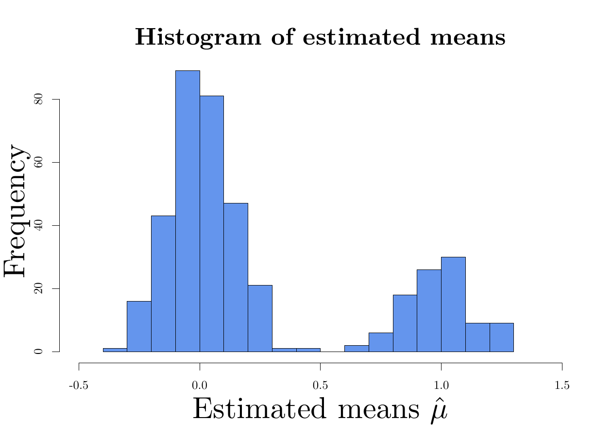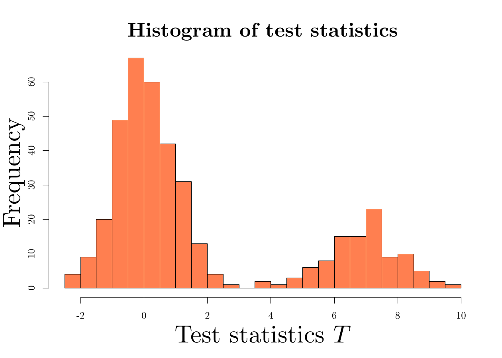<br />
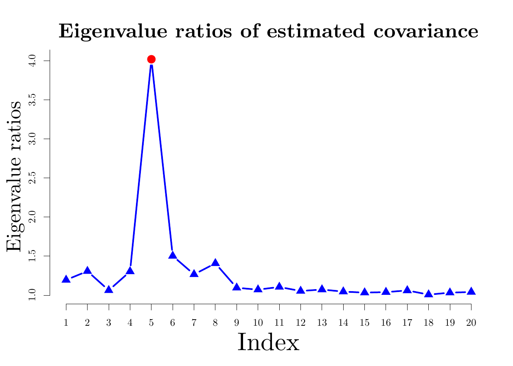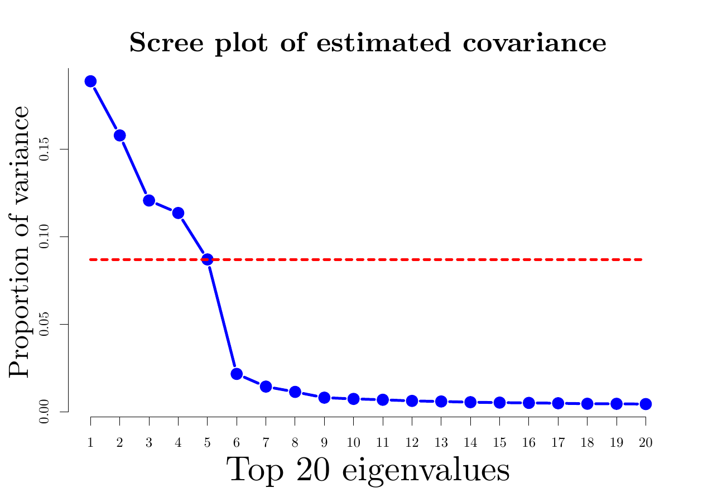</p>
<figcaption>Figure 1: Upper panel: histograms of estimated means and
test statistics. Lower panel: eigenvalue ratio plot with the largest
ratio highlighted and scree plot of the eigenvalues of the estimated
covariance matrix.</figcaption>
</figure>

## Function call with options {#demo2}

In this section, we illustrate `farm.test` function with other options
that allow us to call it more flexibly. When the factors are observable,
we can simply put the $n\times K$ factor matrix into argument `fX`, and
the output is formatted the same as before. As a remark, among all the
items listed in Table [1](#output), `eigenVal` and `eigenRatio`, which
are eigenvalues and eigenvalue ratios of estimated covariance matrix,
are not available in this case; see Algorithm [1](#alg1).

``` r
output <- farm.test(X, fX = FX)
output

One-sample FarmTest with known factors
n = 120, p = 400, nFactors = 5
FDR to be controlled at: 0.05
Alternative hypothesis: two.sided
Number of hypotheses rejected: 101
```

Consider one-sided alternatives $H_{1j}: \mu_j \geq 0$, $j=1, \ldots p$
with a nominal FDR level $1\%$. We modify the arguments `alternative`
and `alpha` as follows:

``` r
output <- farm.test(X, alternative = "greater", alpha = 0.01)
output

One-sample FarmTest with unknown factors
n = 120, p = 400, nFactors = 5
FDR to be controlled at: 0.01
Alternative hypothesis: greater
Number of hypotheses rejected: 101
```

Users can specify null hypotheses by passing any vector with length $p$
into argument `h0`. In the next example, we consider the $p$ null
hypotheses as all the means are equal to $1$, so that the number of true
nonnulls becomes $300$.

``` r
output <- farm.test(X, h0 = rep(1, p), alpha = 0.01)
output

One-sample FarmTest with unknown factors
n = 120, p = 400, nFactors = 5
FDR to be controlled at: 0.01
Alternative hypothesis: two.sided
Number of hypotheses rejected: 300
```

When the factors are unknown, users can also specify the number of
factors based on some subjective grounds. In this case, Step 3 in
Algorithm [2](#alg2) is avoided. For example, we run the function with
the number of factors chosen to be `KX = 2`, which is less than the true
parameter $5$. This misspecification results in a loss of power with two
true alternatives unidentified.

``` r
output <- farm.test(X, KX = 2)
power <- sum(output$reject <= p1) / p1
power

[1] 0.98
```

As a special case, if we declare `KX = 0` in the function, a robust
multiple test without factor-adjustment is conducted.

``` r
output <- farm.test(X, KX = 0)
output

One-sample robust multiple test without factor-adjustment
n = 120, p = 400
FDR to be controlled at: 0.05
Alternative hypothesis: two.sided
Number of hypotheses rejected: 95
```

Finally, we present an example of two-sample FarmTest. Using the same
sampling distributions for the factor loading matrix, factors and noise
vectors, we generate another sample $\left\{Y_i\right\}_{i = 1}^{m}$
from model \@ref(eq:factor-model-twosample) with $m = 150$.

``` r
m <- 150
set.seed(200)
BY <- rustiefel(p, K) %*% diag(rep(sqrt(p), K))
FY <- rmvnorm(m, rep(0, K), diag(K))
uY <- rmvt(m, diag(p), 3)
Y <- FY %*% t(BY) + uY
```

Then `farm.test` function can be called with an additional argument `Y`.

``` r
output <- farm.test(X, Y = Y)
output

Two-sample FarmTest with unknown factors
X.n = 120, Y.n = 150, p = 400, X.nFactors = 5, Y.nFactors = 5
FDR to be controlled at: 0.05
Alternative hypothesis: two.sided
Number of hypotheses rejected: 105
```

The output is formatted similarly as in Table [1](#output), except that
`means`, `stdDev`, `loadings`, `eigenVal`, `eigenRatio`, `nFactors` and
`n` now consist of two items for samples `X` and `Y`.

``` r
names(output$means)

[1] "X.mean" "Y.mean"
```

# Simulations {#sec:testing}

In this section, we assess and compare the performance of `farm.test`
function in the *FarmTest* package with the following methods:

-   $t$-test using the R built-in function `t.test`;
-   WMW-test
    ([W]{.underline}ilcoxon-[M]{.underline}ann-[W]{.underline}hitney)
    using the `onesamp.marginal` function in the *mutoss* package;
-   RmTest ([R]{.underline}obust [M]{.underline}ultiple
    [test]{.underline}) without factor-adjustment by claiming `KX = 0`
    in the `farm.test` function.

For $t$-test and WMW-test, the functions we call produce vectors of
p-values, to which the method proposed in [@S2002] is applied, see Steps
5--7 in Algorithm [1](#alg1) or Steps 8--10 in Algorithm [2](#alg2).

In all the numerical experiments, we consider two-sided alternatives
with a nominal FDR level $\alpha=5\%$. The true number of factors is
$5$. Factors and loadings are generated the same way as in
[4.1](#sec:data_generate) Section. To add dependency among idiosyncratic
errors, the covariance matrix of $\mathbf{u}$, denoted by
$\mathbf{\Sigma}_u$, is taken to be a block-diagonal symmetric matrix
with block size $5 \times 5$. Within each block, the diagonal entries
are all equal to $3$ and the off-diagonal entries are generated from
$\mathcal{U}[0,1]$. In the simulations, we drop the case where the
generated $\mathbf{\Sigma}_u$ is not positive-definite. The distribution
of $\mathbf{u}$ is specified in two models as follows.

-   **Model 1**.
    $\mathbf{u}\sim {\cal N}\left(\mathbf{0}, \mathbf{\Sigma}_u\right)$:
    centered multinormal distribution with covariance matrix
    $\mathbf{\Sigma}_u$;
-   **Model 2**.
    $\mathbf{u}\sim  t_{3}\left(\mathbf{0}, \mathbf{\Sigma}_u\right)$:
    multivariate $t$-distribution with degrees of freedom 3 and
    covariance matrix $\mathbf{\Sigma}_u$.

For each model, we consider various combinations of sample size $n$ and
dimensionality $p$, specifically,
$n \in \left\{60, 80, 100, 120, 140\right\}$ and
$p \in \left\{200, 400, 600, 800, 1000\right\}$. The number of true
alternatives $p_1$ is taken to be $0.2\, p$, and the signal strength is
set as $4 \sqrt{\log\left(p\right) / n}$.

Figures [2](#fig:normal) and [3](#fig:T) depict the FDR and power curves
for either \"fixed $n$ growing $p$\" or \"fixed $p$ growing $n$\" based
on 200 simulations. Across various settings, FarmTest consistently
maintains high empirical power with FDR well controlled around the
nominal level. In contrast, the competing methods may lose as many as
10% to 30% powers, which can be ascribed to not accounting for the
common factors. In summary, we conclude that the *FarmTest* package
provides an efficient implementation of the FarmTest method, which
carries out multiple testing for multivariate data with heavy-tailed
distribution and a strong dependency structure.

<figure id="fig:normal">
<p>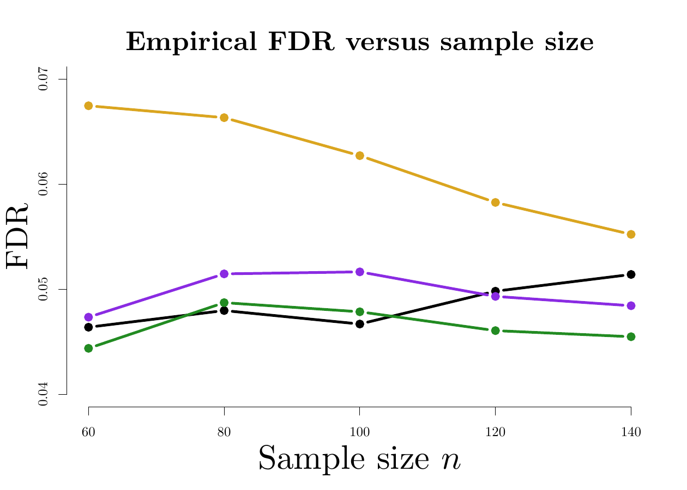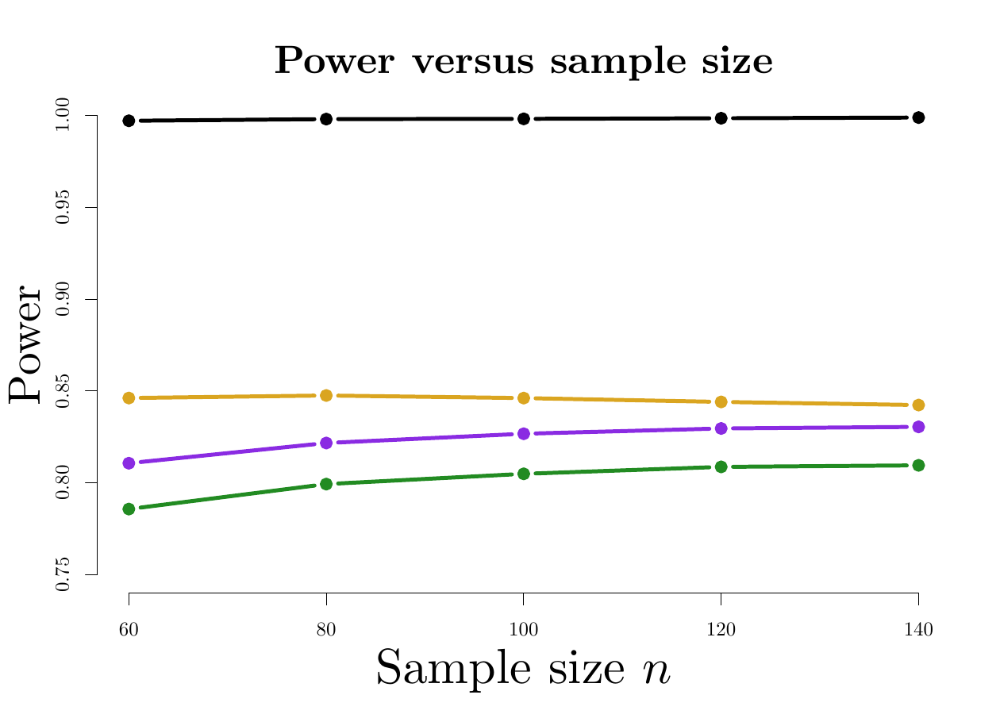<br />
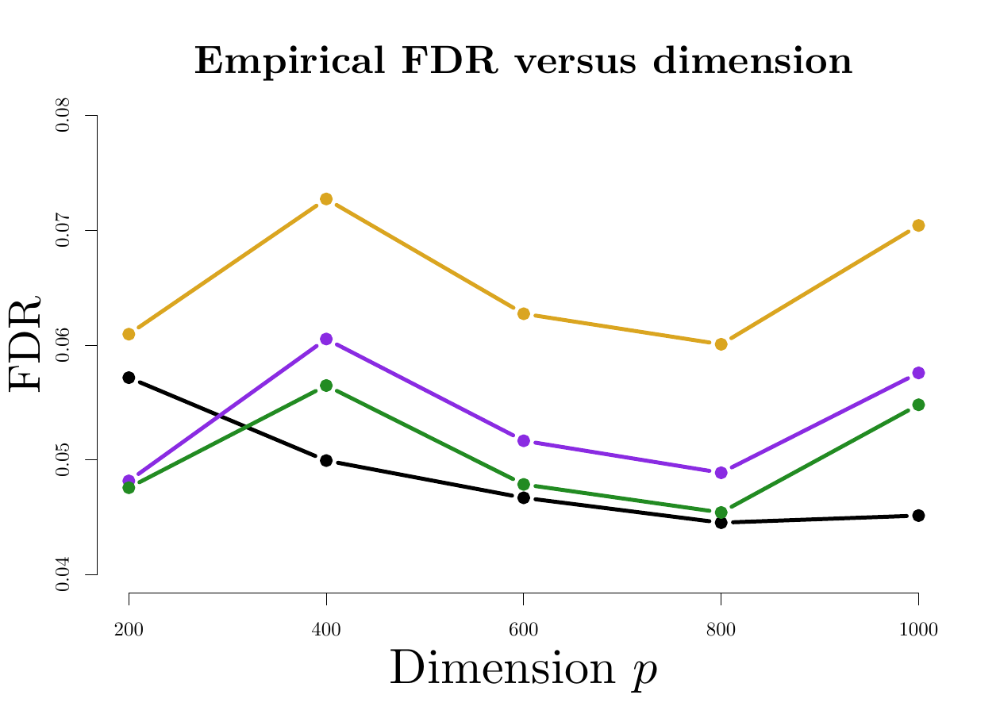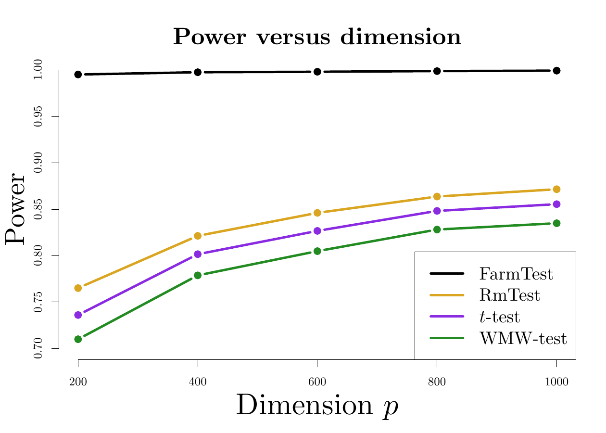</p>
<figcaption>Figure 2: Comparison of <span>FarmTest</span> with three
other methods in terms of FDR and power under Model 1 (multivariate
normal distribution). In the upper panel, <span
class="math inline"><em>p</em></span> is fixed at <span
class="math inline">600</span> and <span
class="math inline"><em>n</em></span> grows from 60 to 140; in the lower
panel, <span class="math inline"><em>n</em></span> is fixed at <span
class="math inline">100</span> and <span
class="math inline"><em>p</em></span> ranges from 200 to
1000.</figcaption>
</figure>

<figure id="fig:T">
<p>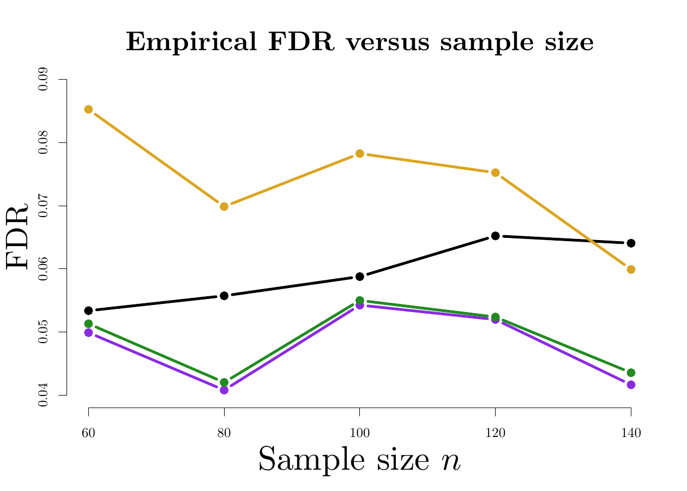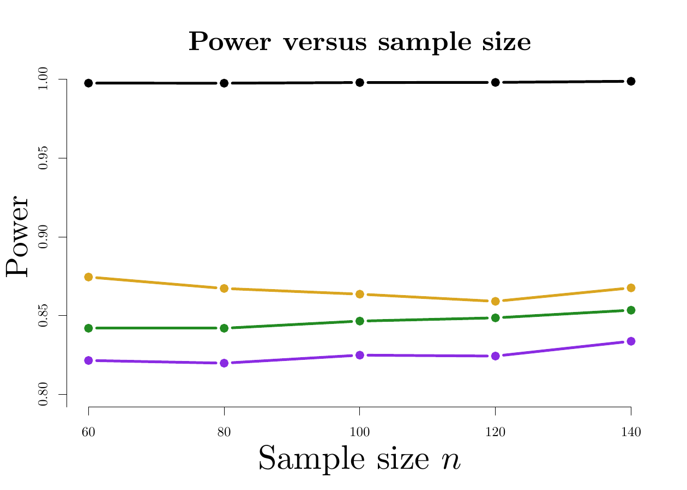<br />
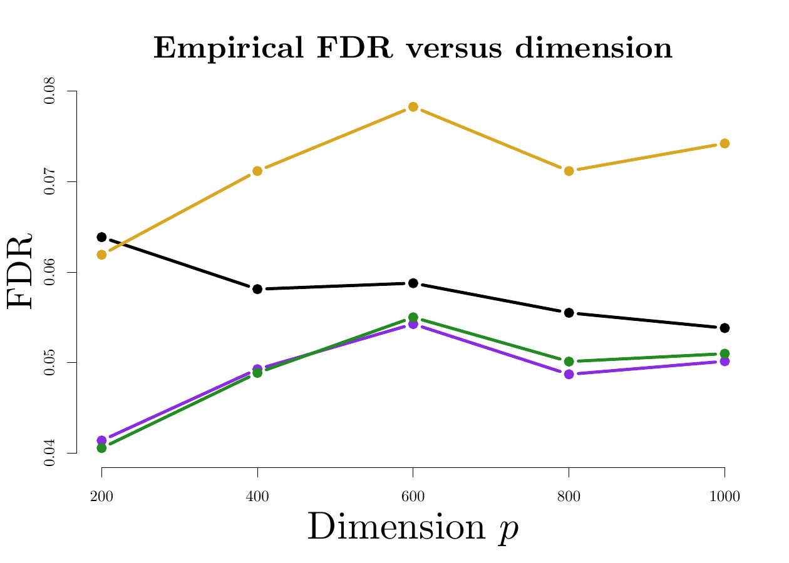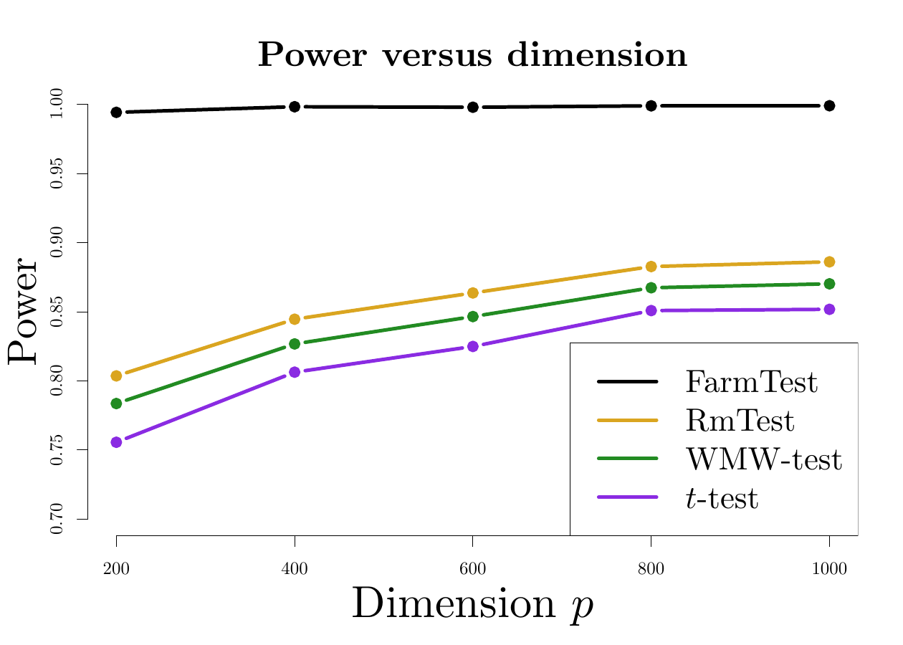</p>
<figcaption>Figure 3: Comparison of <span>FarmTest</span> with three
other methods in terms of FDR and power under Model 2 (multivariate
<span class="math inline"><em>t</em></span>-distribution). In the upper
panel, <span class="math inline"><em>p</em></span> is fixed at <span
class="math inline">600</span> and <span
class="math inline"><em>n</em></span> grows from 60 to 120; in the lower
panel, <span class="math inline"><em>n</em></span> is fixed at <span
class="math inline">100</span> and <span
class="math inline"><em>p</em></span> ranges from 200 to
1000.</figcaption>
</figure>

# Real data example {#sec:real_data}

In this section, we apply the *FarmTest* package to test the mean
effects of stock returns. In capital asset pricing theory, the stock's
risk-adjusted mean return or \"alpha\" is a quantity of interest since
it indicates the excessive return incurred from investing in a
particular stock. If the efficient equity market hypothesis holds, we
expect \"alpha\" to be zero. Hence, detecting non-zero alphas can help
investors to identify market inefficiencies, that is, whether certain
stocks exhibit an abnormal rate of return or are mispriced. As discussed
in [@C2001], both cross-sectional dependency and heavy tailedness are
silent features of stock returns.

In this study, we test the annual mean effects of stocks in the S&P500
index. The data is available on COMPUSTAT and CRSP databases. We find
that most of the stocks with continuous membership in the S&P500 index
from 2008 to 2016 have excess kurtosises greater than zero, indicating
tails heavier than that of a normal distribution. Also, more than $33\%$
of the stocks are severely heavy-tailed as their excess kurtosises
exceed 6, which is the excess kurtosis of $t_5$-distribution. We collect
monthly returns of stocks from the S&P500 index over rolling windows:
for each month between 2008 and 2016, we collect monthly returns of
stocks who have continuous records over the past year. The average
number of stocks collected each year is 598. For each rolling window, we
conduct multiple testing using the four methods considered in the
previous section, that is, FarmTest, $t$-test, WMW-test, and RmTest.

The nominal FDR level is set as $\alpha=1\%$. Within each rolling time
window, we have $p \approx 600$ and $n=12$. The numbers of discoveries
of each method are depicted chronologically in Figure [4](#fig:stocks),
and Table [2](#tab:stocks) displays several key summary statistics.
Since the $t$-test barely discovers any stock throughout the whole
procedure, we only present the results for the other three methods in
Figure [4](#fig:stocks). It is interesting to observe that across
different time rolling windows, the testing outcomes of the WMW-test are
relatively stable and time-insensitive. FarmTest, on the other hand,
selects much fewer stocks in the year of 2009, coinciding to some extent
with the financial crisis during which the market volatility is much
higher. RmTest typically selects the most stocks, which is partly due to
the lack of FDR control under strong dependency. A major, noticeable
impact of dependence is that it results in clusters of rejections: if a
test is rejected, then there are likely to be further rejections for
tests that are highly correlated with this one. This phenomenon is in
accord with our simulation results, showing that FarmTest simultaneously
controls the FDR and maintains high power while the other methods either
make too many false discoveries or fail to detect true signals.

<figure id="fig:stocks">
<p>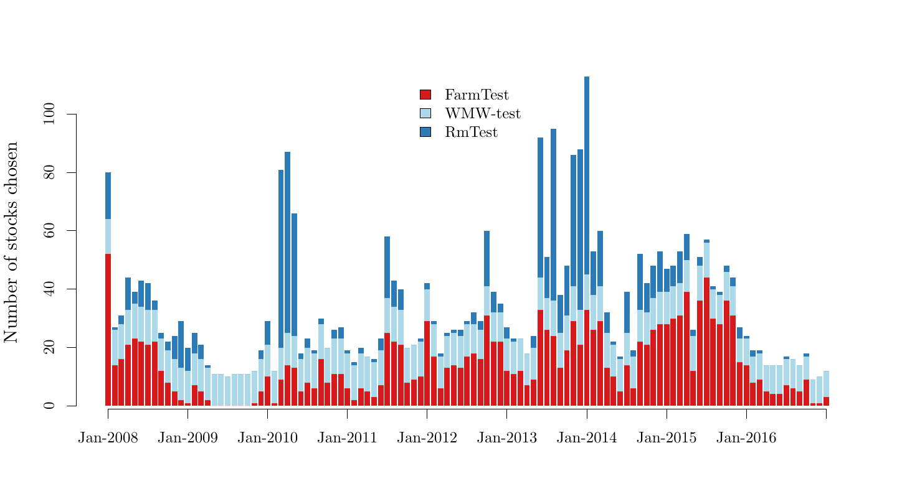<br />
</p>
<figcaption>Figure 4: Stack bar plot of the numbers of discoveries via
<span>FarmTest</span>, WMW-test and RmTest from 2008 to 2016, using
rolling windows of one year. Within each time window, we report the
number of stocks in the S&amp;P500 index that show significant
statistical evidence against null hypotheses that there are no excessive
returns, with FDR controlled at <span
class="math inline">1%.</span></figcaption>
</figure>

::: {#tab:stocks}
  --------------------------------- ------------------------------- ------------------------------- --------------------------- -------------------------- ---------------------------
  Method                                         Mean                          Std. Dev.                      Median                       Min                         Max

  [FarmTest]{style="color: blue"}    [14.477]{style="color: blue"}   [11.070]{style="color: blue"}   [12]{style="color: blue"}   [0]{style="color: blue"}   [52]{style="color: blue"}

  WMW-test                                      10.991                           1.005                          11                          8                          12

  RmTest                                         8.147                          14.414                           3                          0                          68
  --------------------------------- ------------------------------- ------------------------------- --------------------------- -------------------------- ---------------------------

  : Table 2: Summary statistics of the number of discoveries via
  FarmTest, WMW-test and RmTest between 2008 and 2016 using rolling
  windows of size 12 (months).
:::

# Summary {#sec:discussion}

We provide an R package to implement FarmTest, a flexible large-scale
multiple testing method that is robust against strongly dependent and
heavy-tailed data. The factor-adjustment procedure helps to construct
weakly dependent test statistics, and also enhances statistical power by
reducing the signal-to-noise ratio. Moreover, by exploiting the idea of
adaptive Huber regression, the testing procedure is robust against
heavy-tailed noise. The efficacy of our package is demonstrated on both
real and simulated datasets.
:::
