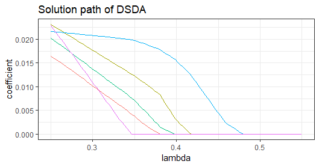

# Introduction {#sec:intro}

Linear discriminant analysis (LDA) is one of the most popular
classification method and a cornerstone for multivariate statistics
[@michie1994machine e.g]. Classical LDA builds a linear classifier based
on $p$-dimensional multivariate predictor $\mathbf{X}\in\mathbb{R}^p$ to
distinguish $K$ classes and to predict the class label
$Y\in\{1,\ldots,K\}$. Despite its simplicity, LDA is shown to be very
accurate on many benchmark datasets
[@lim2000comparison; @dettling2004bagboosting; @hand2006classifier].
Moreover, LDA is easily interpretable and is thus often used as a
visualizing tool for exploratory data analysis.

In recent decades, the advancements in science and technology have
enabled researchers to collect datasets with increasing sizes and
complexity. Such datasets pose challenges to LDA. Four challenges that
we tackle with this package are as follows. First, in research areas
such as biology, genomics and psychology, we often have more predictors
than samples. However, LDA is not applicable on these high-dimensional
data, because sample covariance matrix becomes not invertible when the
number of predictors exceeds the sample size.

Secondly, when we have a large number of predictors, variable selection
is often desired such that we can obtain a sparse classifier involving
only a small proportion of the variables. On one hand, @fan2008high
[@bickel2008] showed in theory that variable selection is critical for
accurate classification. On the other hand, sparse classifiers much
easier to interpret in practice. However, LDA generally does not perform
variable selection.

Thirdly, contemporary datasets often have complicated structure that
renders the linear classifier in LDA inadequate. For example, in the
presence of thousands of predictors, it may be inappropriate them to
model all of them with the normal distribution. Moreover, research in
neuroimaging, computational biology and personalized recommendation
produces data in the form of matrices (2-way tensor) or tensors. The
analysis of tensor datasets requires considerable modification to the
vector-based LDA model.

Last but not least, integrative analysis with multiple data sources are
drawing researchers' attention recently. Co-existence of diverse data
types, such as vector, matrix and tensor calls for more sophisticated
models to integrate the information from them to improve classification
accuracy. It is critical to model the dependence among different types
of data to reduce the noise level in the data and improve prediction
accuracy [@catch].

Motivated by these challenges, many methods have been proposed to
generalize LDA to datasets with high dimensions, non-normality and/or
higher order predictors. In this package, we implement six methods that
generalize LDA to contemporary complicated datasets. All of them are
developed under models closely related to the LDA model, and penalties
are imposed to achieve classification accuracy and variable selection in
high dimensions. These methods include:

1.  Direct sparse discriminant analysis (DSDA): DSDA generalizes the
    classical LDA model to high dimensions when there are only two
    classes [@DSDA]. It formulates high-dimensional LDA into a penalized
    least squares problem.

2.  Regularized optimal affine discriminant (ROAD): under the same model
    as DSDA, ROAD fits a sparse classifier by minimizing the
    classification error under the $\ell_1$ constraint [@ROAD].

3.  Sparse optimal scoring (SOS) for binary problems: SOS is also
    developed under the LDA model [@Clemmensen]. It penalizes the
    optimal scoring problem [@hastie1994flexible]. We focus on its
    application in binary problems.

4.  Semiparametric sparse discriminant analysis (SeSDA): SeSDA assumes a
    semiparametric model where data transformation can be applied to
    alleviate the non-normality. In practice, SeSDA finds the
    data-driven transformation and then performs model-fitting on the
    transformed data [@Mai2015ssda].

5.  Multiclass sparse discriminant analysis (MSDA): Instead of focusing
    on binary problems, MSDA considers the multiclass LDA model [@MSDA].
    It takes note of the fact that the Bayes' rule can be estimated with
    minimizing a quadratic loss. To account for the multiclass
    structure, a group lasso penalty [@yuan2006model] is applied to
    achieve variable selection.

6.  Covariate-adjusted tensor classification in high-dimensions (CATCH):
    CATCH [@catch] is developed for tensor predictors. It takes
    advantage of the tensor structure to significantly reduce the number
    of parameters and hence alleviate computation complexity.

See Table [\[tab:model\]](#tab:model){reference-type="ref"
reference="tab:model"} for a comparison of these methods. Despite their
different model assumptions and formulas, all of them have strong
theoretical support and excellent empirical performance. We further note
that they can be combined with covariate adjustment when multiple data
sources are available. Our package
[TULIP](https://CRAN.R-project.org/package=TULIP) [@TULIP] integrates
diverse discriminant analysis models and supportive functions to make it
a convenient and well-equipped toolbox. It has several notable
advantages. First, we not only include functions for model fitting, but
also cross validation functions for easy control of the sparsity level,
and prediction functions for the prediction of future observations. In
addition, we provide covariate adjustment functions that efficiently
remove heterogeneity in the predictors and combine information from
covariates. Second, our package greatly facilitates the application of
DSDA, ROAD and SeSDA for R users, as they do not have public R packages
on CRAN outside ours. Third, although MSDA and SOS have been implemented
in packages [msda](https://CRAN.R-project.org/package=msda) [@MSDA] and
[sparseLDA](https://CRAN.R-project.org/package=sparseLDA) [@sparseLDA],
we carefully modify their algorithms in our implementation to lower
storage cost and/or speed up computation.

We acknowledge that many other efforts have been spent on topics closely
related to that of our paper. On one hand, by now a large number of
high-dimensional discriminant analysis methods have been developed. Some
excellent examples include @fan2008high
[@Tibshirani2002; @Trendafilov2007; @ROAD; @wu2009sparse; @cai2011constrained; @Shao2011; @Clemmensen; @witten; @Xu2015; @Niu2015].
On the other hand, in the literature, many works study matrix/tensor
regression and classification methods. Many of them impose low rank
assumption
[@Zhou2013; @KoldaBader09Tensor; @chi2012tensors; @liu2017characterizing; @CMDA; @STDA; @Zhong2015; @Zeng2015].
All these methods have been reported to have great performance, but a
comprehensive study of them is apparently out of the scope of our
current paper.

The rest of this paper is organized as follows. We start with a brief
overview of discriminant analysis models in
Section [2](#Sec: models){reference-type="ref" reference="Sec: models"}.
Model estimation and implementation details are discussed in
Section [3](#sec:para){reference-type="ref" reference="sec:para"}.
Section [4](#sec: usage){reference-type="ref" reference="sec: usage"}
contains instructions and examples on the usage of the package. A real
data example is given in Section [5](#sec: data){reference-type="ref"
reference="sec: data"} to confirm the numerical performance of methods
in the package.

# Discriminant analysis models and Bayes rules {#Sec: models}

## Bayes rule for classification

Recall that $Y\in\{1,\ldots,K\}$ is the categorical response (class
indicator), and we use the generic $\mathcal{X}$ to denote the predictor
and (potential) additional covariate. Specifically,
$\mathcal{X}=\mathbf{X}\in\mathbb{R}^p$ in classical multivariate
discriminant analysis;
$\mathcal{X}=\mathbf{X}\in\mathbb{R}^{p_1\times\cdots\times p_M}$ in
tensor discriminant analysis; and $\mathcal{X}=(\mathbf{X},\mathbf{U})$
in covariate-adjusted classification settings, where
$\mathbf{U}\in\mathbb{R}^q$ is additional covariates and $\mathbf{X}$
can be either vector or tensor. Our goal is to construct the optimal
classifier to distinguish and predict $Y$ based on $\mathcal{X}$ under
various settings. Denote $\pi_k=\Pr(Y=k)$ and $f_k$ as the conditional
distribution of $\mathcal{X}$ within Class $k$
(e.g. $f_k(\mathcal{X})=f(\mathbf{X},\mathbf{U}\mid Y=k)$ is the joint
distribution of $\mathbf{X}$ and $\mathbf{U}$ given $Y=k$, in presence
of $\mathbf{U}$). The optimal classifier, often referred to as the Bayes
rule, is thus
$$\delta(\mathbf{X})=\arg\max_k \{\log{\pi_k}+\log{f_k(\mathcal{X})}\}.$$
The Bayes rule achieves the lowest classification error possible
[@FHT01]. Therefore, it is our ultimate goal to estimate the Bayes rule.
However, additional model assumptions are often needed for $f_k$ to
ensure statistical and computational efficiency. Consider the classical
LDA setting of $\mathbf{X}\in\mathbb{R}^p$ and $Y\in\{1,\dots,K\}$. To
gain intuition, we often assume that within each class, the predictor
follows a normal distribution with different means and a common
covariance matrix. Then the Bayes rule is a linear function of
$\mathbf{X}$ and can be straightforwardly estimated.

In the rest of this section, we discuss various statistical models that
have been widely studied in the literature, along with the Bayes rules
under these assumptions. Specifically, we review the classical LDA
model, the semiparametric LDA model, and the tensor discriminant
analysis model. We also discuss a general framework for covariate
adjustment.

## The linear discriminant analysis model (LDA) {#Sec: LDA}

Given a multivariate predictor $\mathbf{X}\in\mathbb{R}^p$ and
$Y\in\{1,\ldots,K\}$, the LDA model assumes that $\mathbf{X}$ is
normally distributed within each class, i.e, $$\label{LDA}
\mathbf{X}\mid(Y=k)\sim N(\boldsymbol{\mu}_k,\boldsymbol{\Sigma}),\quad \mathrm{Pr}(Y=k)=\pi_k,\quad k=1,\ldots,K,$$
where $\boldsymbol{\mu}_k\in\mathbb{R}^p$ is the mean of $\mathbf{X}$
within class $k$, and $\boldsymbol{\Sigma}\in\mathbb{R}^{p\times p}$ is
the common within class covariance matrix.

Define
$\boldsymbol{\beta}_k=\boldsymbol{\Sigma}^{-1}(\boldsymbol{\mu}_k-\boldsymbol{\mu}_1)$
for $k=1,\cdots,K$. The Bayes' rule turns out to be a linear function:
$$\label{ldabayes}
\widehat{Y}=\arg\max_{k}\mathrm{Pr}(Y=k\mid\mathbf{X})=\arg\max_{k=1,\dots,K}\{\log\pi_{k}+\boldsymbol{\beta}_k^T(\mathbf{X}-\boldsymbol{\mu}_k/2)\}.$$

The LDA model is simple yet elegant. All the parameters in this model
have natural interpretations, while the Bayes rule has a nice linear
form. An interesting fact about the Bayes rule in
[\[ldabayes\]](#ldabayes){reference-type="eqref" reference="ldabayes"}
is that it does not explicitly involve the $p^2$-dimensional parameter
$\boldsymbol{\Sigma}^{-1}$. Instead, $\boldsymbol{\Sigma}^{-1}$ is only
implicitly included in the discriminant directions
$\boldsymbol{\beta}_k$. Moreover, it can be shown that the Bayes rule is
equivalent to first reducing data to
$\mathbf{X}^T\boldsymbol{\beta}_2,\ldots\mathbf{X}^T\boldsymbol{\beta}_K$
and then fitting the LDA model on the $(K-1)$-dimensional space.
Therefore, to estimate the Bayes rule in high dimensions, our interest
centers on the estimation of $\boldsymbol{\beta}_k$. We assume that
$\boldsymbol{\beta}_k$'s are sparse with many elements being zero.
Enforcement of this sparsity assumption will facilitate our estimation
and naturally lead to variable selection.

Although the Bayes rule is derived under the somewhat restrictive
normality and equal covariance assumptions, the discriminant directions
$\boldsymbol{\beta}_k$ are still meaningful when data are non-normal,
thanks to their geometric properties. It can be shown that, if we
project $\mathbf{X}$ to $\boldsymbol{\beta}_k,k=1,\ldots,K$, the
separation between classes is maximized over all possible sets of $K-1$
linear projections. Consequently, the LDA model is reasonably resistant
to model misspecification. However, in some of the cases where the LDA
model assumptions are severely violated, one can resort to more flexible
models. For example, the quadratic discriminant analysis model
[@jiang2015quda; @fan2015quadro; @LiandShao2015; @Sun2015] relaxes the
equal covariance assumption, while severely non-normal data can be
modeled by the semiparametric model to be discussed in
Section [2.4](#Sec: SeLDA){reference-type="ref" reference="Sec: SeLDA"}.

## Covariates adjustment {#Sec:CA}

In many real-life problems, we have additional covariates along with the
predictors. The covariates play two roles in the classification: it has
predictive power on it own, and it also accounts part of the variation
in the predictors. For example, in genomics studies, we record not only
gene expression levels but also age and clinical measurements. In this
case, we may view the gene expression levels as the high-dimensional
predictor, and the age and clinical measurements as the covariates. We
consider an LDA-type model to incorporate the covariates. In addition to
the response $Y$ and the predictor $\mathbf{X}$, we denote the
covariates as $\mathbf{U}\in\mathbb{R}^q$. We assume that
$$\begin{aligned}
\mathbf{U}\mid(Y=k) & \sim  N(\boldsymbol{\phi}_{k},\boldsymbol{\Psi}), \label{CALDA.eq1}\\
\mathbf{X}\mid(\mathbf{U}=\mathbf{u},Y=k) & \sim  N(\boldsymbol{\mu}_{k}+\boldsymbol{\alpha}\mathbf{u},\boldsymbol{\Sigma}),\label{CALDA.eq2}
\end{aligned}$$ where $\boldsymbol{\phi}_{k}\in\mathbb{R}^{q}$ is the
within-class mean, $\boldsymbol{\Psi}\in\mathbb{R}^{q\times q}$,
$\boldsymbol{\Psi}>0$ is the common within class covariance matrix of
covariates, and $\boldsymbol{\alpha}\in\mathbb{R}^{p\times q}$ is the
dependence of $\mathbf{X}$ on $\mathbf{U}$. We refer to this model as
the covariate-adjusted LDA (CA-LDA) model. The CA-LDA model is
conceptually similar to the CATCH model [@catch] for tensor, which is to
be introduced in Section [2.5](#Sec: CATCH){reference-type="ref"
reference="Sec: CATCH"}, but the CA-LDA model focuses on vector
predictor $\mathbf{X}$ rather than tensor predictor.

Obviously, the CA-LDA model reduces to the LDA model in the absence of
covariates. With the covariates, the CA-LDA model continues to have
natural interpretations.
Equation [\[CALDA.eq1\]](#CALDA.eq1){reference-type="eqref"
reference="CALDA.eq1"} indicates that $(\mathbf{U},Y)$ marginally follow
the LDA model.
Equation [\[CALDA.eq2\]](#CALDA.eq2){reference-type="eqref"
reference="CALDA.eq2"} implies that the distribution of $\mathbf{X}$ not
only depends on $Y$, but also $\mathbf{U}$ through mean dependence.
Therefore, within each class, $\mathbf{X}$ is linked to $\mathbf{U}$
through a linear regression model, while, after we adjust for
$\mathbf{U}$, $(\mathbf{X},Y)$ follow the LDA model as well. See
Figure [1](#fig:covariate){reference-type="ref"
reference="fig:covariate"} for a graphical illustration of the
relationship among $\mathbf{X}$, $\mathbf{U}$ and $Y$.

Under the CA-LDA model, the Bayes' rule is
$$\widehat{Y}=\arg\max_{k=1,\dots K}\left\{ a_k+\boldsymbol{\gamma}_{k}^T\mathbf{U}+\boldsymbol{\beta}_k^T(\mathbf{X}-\boldsymbol{\alpha}\mathbf{U})\right\}$$
where
$\boldsymbol{\gamma}_k=\boldsymbol{\Psi}^{-1}(\boldsymbol{\phi}_k-\boldsymbol{\phi}_1)$,
$\boldsymbol{\beta}_k=\boldsymbol{\Sigma}^{-1}(\boldsymbol{\mu}_k-\boldsymbol{\mu}_1)$
and
$a_k=\log({\pi_k}/{\pi_1})-\frac{1}{2}\boldsymbol{\gamma}_k^T(\boldsymbol{\phi}_k+\boldsymbol{\phi}_1)-\frac{1}{2}\boldsymbol{\beta}_k^T(\boldsymbol{\mu}_k+\boldsymbol{\mu}_1))$
is a scalar that does not involve $\mathbf{X}$ or $\mathbf{U}$.
Throughout this paper, we assume that $\mathbf{U}$ is low-dimensional
and does not need variable selection, but $\mathbf{X}$ is
high-dimensional. In the presence of covariates, $\mathbf{X}$ needs to
be first adjusted to $\mathbf{X}-\boldsymbol{\alpha}\mathbf{U}$ before
entering the Bayes rule. Similar to the LDA model, we assume that the
coefficient of $\mathbf{X}-\boldsymbol{\alpha}\mathbf{U}$,
$\boldsymbol{\beta}_k$, is sparse.

<figure id="fig:covariate">

<figcaption>
Graphical illustration of the direct and indirect effects. The direct
effect of covariate <strong>U</strong>
on <em>Y</em> follows classical
discriminant analysis model measured by {<strong>γ</strong>2, …, <strong>γ</strong><em>K</em>}.
Meanwhile, <strong>U</strong> also
affects class label through affecting <strong>X</strong>. Therefore we have <em>Ŷ</em> = <em>f</em>(<strong>X</strong>,<strong>U</strong>).
</figcaption>
</figure>

## The semiparametric LDA model {#Sec: SeLDA}

Although LDA is reasonably resistant to model misspecification, we may
still need more flexible models when data are heavily non-normal. The
semiparametric linear discriminant analysis (SeLDA) model [@Lin2003] is
proposed for this purpose. SeLDA assumes that there exists a set of
strictly monotone univariate transformations $h_1,\ldots,h_p$ such that
$$\label{sesda}
(h_1(X_1),\cdots, h_p(X_p))\mid (Y=k)\sim N(\boldsymbol{\mu}_k,\boldsymbol{\Sigma}).$$

For identifiability, we further assume that all the diagonal elements in
$\boldsymbol{\Sigma}$ are 1, and all elements in $\boldsymbol{\mu}_1$
are 0. We also use the shorthand notation
$h(\mathbf{X})=(h_1(X_1),\cdots, h_p(X_p))$. The transformation $h$ is
assumed to be unknown and needs to be estimated from data. The SeLDA
model assumes that the LDA model is true up to an unknown
transformation. It has the same spirit as the well-known Box-Cox
transformation, with which model assumptions are relaxed by proper data
mapping.

It is easy to see that the LDA model is a special case of the SeLDA
model, if we restrict $h(\mathbf{X})=\mathbf{X}$. However, in the SeLDA
model, we do not impose any parametric assumptions on $h$, which leads
to great flexibility in practice. We further review a formula for $h_j$
that will facilitate its estimation. It can be shown that
$$\label{sesda.h}
h_j=\Phi^{-1}\circ F_{1j}=\Phi^{-1}\circ F_{kj}+\mu_{kj},$$ where $\Phi$
is the cumulative distribution function (CDF) of the standard normal
random variable, and $F_{kj}$ is the CDF of $X_j$ within Class $k$.
Equation [\[sesda.h\]](#sesda.h){reference-type="eqref"
reference="sesda.h"} will be used in
Section [3.4](#Sec: SeSDA){reference-type="ref" reference="Sec: SeSDA"}.
The SeLDA model also amounts to assuming that the data follow the
Gaussian copula model within each class
[@wellner1997; @HNW14; @SemiCov].

Although the SeLDA model requires much weaker conditions than the LDA
model, it preserves many of the desirable properties. One of them is
that the Bayes rule continues to be a linear function of the transformed
data $h(\mathbf{X})$: $$\label{seldabayes}
\widehat{Y}=\arg\max_{k=1,\dots,K}\{\log\pi_{k}+\boldsymbol{\beta}_k^T(h(\mathbf{X})-\boldsymbol{\mu}_k/2)\}.$$

Consequently, just as in the LDA model, when the dimension is high, we
assume that $\boldsymbol{\beta}_k$ is sparse to allow accurate
estimation.

## Tensor discriminant analysis (TDA) and covariate adjustment {#Sec: CATCH}

The tensor discriminant analysis (TDA) model is proposed for
classification based on tensor predictors. We first briefly introduce
some standard tensor notation [@KoldaBader09Tensor]. See Appendenx
 [7.1](#Append.A){reference-type="ref" reference="Append.A"} for more
rigorous definitions. An *$M$-way tensor* is denoted by a
multidimensional array
$\mathbf{A}\in \mathbb{R}^{p_{1}\times\cdots\times p_{M}}$ where
$M\geq2$, $p_1,\ldots,p_M$ are all positive integers. We often need to
multiply an $M$-way tensor $\mathbf{C}$ by $M$ matrices along each mode
$\mathbf{G}_i,i=1,\ldots,M$, denoted by
$\llbracket \mathbf{C};\mathbf{G}_1,\ldots,\mathbf{G}_M\rrbracket$. For
example, in Figure [\[fig:tucker\]](#fig:tucker){reference-type="ref"
reference="fig:tucker"} we obtain
$\mathbf{A}=\llbracket \mathbf{C};\mathbf{G}_1,\ldots,\mathbf{G}_3\rrbracket$
by multiplying a 3-way tensor $\mathbf{C}$ with matrices $\mathbf{G}_i$
along each mode. If $\mathbf{G}_i,i\ne m$ are identity matrices and
$\mathbf{G}_m$ is a vector, then we write
$\mathbf{C}\bar{\times}_{m}\mathbf{G}_m=\llbracket\mathbf{C};\mathbf{I},\ldots,\mathbf{G}_m,\ldots,\mathbf{I}\rrbracket$.

Further, we say a tensor
$\mathbf{X}\in \mathbb{R}^{p_{1}\times\cdots\times p_{M}}$ follows the
tensor normal distribution
$TN(\boldsymbol{\mu},\boldsymbol{\Sigma}_1,\ldots,\boldsymbol{\Sigma}_M)$
if it can be written as
$$\mathbf{X}=\boldsymbol{\mu}+\llbracket\mathbf{Z};\boldsymbol{\Sigma}_1^{1/2},\ldots,\boldsymbol{\Sigma}_M^{1/2}\rrbracket,$$
where $\mathbf{Z}\in \mathbb{R}^{p_{1}\times\cdots\times p_{M}}$ has
elements all independently standard normal,
$\boldsymbol{\mu}\in \mathbb{R}^{p_{1}\times\cdots\times p_{M}}$ is the
mean tensor, and $\boldsymbol{\Sigma}_m\in\mathbb{R}^{p_m\times p_m}$
are covariance matrices. See Figure [2](#fig:tn){reference-type="ref"
reference="fig:tn"} for an illustration.

<figure id="fig:tn">
<embed src="&quot;pic/tucker&quot;.pdf" style="width:90.0%" />
<embed src="&quot;pic/tensor_normal_dist&quot;.pdf"
style="width:100.0%" />
<figcaption>Tensor normal distribution.</figcaption>
</figure>

Now we discuss the tensor discriminant analysis (TDA) model. Consider
the $M$-way tensor predictor
$\mathbf{X}\in\mathbb{R}^{p_1\times\cdots\times p_M}$ where $M\geq 2$
and class label $Y\in \{1,\ldots,K\}$. The TDA model assumes that

$$\label{tda}
\mathbf{X}\mid(Y=k)\sim TN(\boldsymbol{\mu}_k,\boldsymbol{\Sigma}_1,\ldots,\boldsymbol{\Sigma}_M), \quad\Pr(Y=k)=\pi_k$$
where $\boldsymbol{\mu}_k\in\mathbb{R}^{p_1\times \cdots p_M}$,
$\boldsymbol{\Sigma}_{m}\in\mathbb{R}^{p_m\times p_m}$ is the
within-class mean, $\boldsymbol{\Sigma}_m>0$ is the common within-class
covariance matrix along the $m$-th mode of the tensor, and $0<\pi_k<1$
is the prior probability for Class $k$. Compared to the LDA model, TDA
utilizes the tensor normal distribution to model $\mathbf{X}$ within
each class. By taking advantage of the tensor structure, TDA drastically
reduces the number of unknown parameters [@catch]. It can be seen that
the TDA model requires $O(\sum_{m=1}^M p_m^2)$ parameters to model the
dependence among $\mathbf{X}$. However, if we ignore the tensor
structure and assume the LDA model on the vectorized version of
$\mathbf{X}$, the covariance matrix has $O(\prod_{m=1}^Mp_m^2)$
parameters.

Under the TDA model, the Bayes' rule is $$\label{bayestda}
\widehat{Y}=\arg\max_{k=1,\dots K}\left\{ a_k+\langle\mathbf{B}_{k},\mathbf{X}\rangle\right\}$$
where
$\mathbf{B}_k=\llbracket \boldsymbol{\mu}_k-\boldsymbol{\mu}_1; \boldsymbol{\Sigma}_1^{-1},\ldots,\boldsymbol{\Sigma}_M^{-1}\rrbracket$,
and
$a_k=\log({\pi_k}/{\pi_1})-\langle \mathbf{B}_k,\frac{1}{2}(\boldsymbol{\mu}_k+\boldsymbol{\mu}_1)\rangle$
is a scalar that does not involve $\mathbf{X}$. It can be seen that the
Bayes rule is again a linear function in $\mathbf{X}$, with the linear
coefficients $\mathbf{B}_k$. In high dimensions, we again impose the
sparsity assumption by assuming that many elements in $\mathbf{B}_k$ are
zeros.

Similar to the vector case, when additional covariates are provided, the
TDA model can be combined with covariate adjustment. [@catch] proposed
the CATCH model for this purpose. In addition to $(Y,\mathbf{X})$, we
are given the covariates $\mathbf{U}\in\mathbb{R}^q$. The CATCH model
assumes that $$\begin{aligned}
\mathbf{U}\mid(Y=k) & \sim  N(\boldsymbol{\phi}_{k},\boldsymbol{\Psi}),\\
\mathbf{X}\mid(\mathbf{U}=\mathbf{u},Y=k) & \sim  TN(\boldsymbol{\mu}_{k}+\boldsymbol{\alpha}\bar{\times}_{(M+1)}\mathbf{u},\boldsymbol{\Sigma}_{1},\dots,\boldsymbol{\Sigma}_{M}).
\end{aligned}$$ where $\boldsymbol{\phi}_k\in\mathbb{R}^q$ is the
within-class mean of $\mathbf{U}$,
$\boldsymbol{\Psi}\in\mathbb{R}^{q\times q}$ is the within-class
covariance of $\mathbf{U}$, and
$\boldsymbol{\alpha}\in\mathbb{R}^{p_1\times\cdots\times p_M\times q}$
characterizes the dependence of $\mathbf{X}$ on $\mathbf{U}$. The
parameters in the CATCH model can be interpreted in the same way as the
CA-LDA model in Section [2.3](#Sec:CA){reference-type="ref"
reference="Sec:CA"}.

The Bayes' rule under the CATCH model is $$\label{bayescatch}
\widehat{Y}=\arg\max_{k=1,\dots K}\left\{ a_k+\boldsymbol{\gamma}_{k}^T\mathbf{U}+\langle\mathbf{B}_{k},\mathbf{X}-\boldsymbol{\alpha}\bar{\times}_{(M+1)}\mathbf{U}\rangle\right\},$$
where
$\boldsymbol{\gamma}_k=\boldsymbol{\Psi}^{-1}(\boldsymbol{\phi}_k-\boldsymbol{\phi}_1)$,
and
$a_k=\log({\pi_k}/{\pi_1})-\frac{1}{2}\boldsymbol{\gamma}_k^T(\boldsymbol{\phi}_k+\boldsymbol{\phi}_1)-\langle \mathbf{B}_k,\frac{1}{2}(\boldsymbol{\mu}_k+\boldsymbol{\mu}_1)\rangle$
is a scalar that does not involve $\mathbf{X}$ or $\mathbf{U}$. Similar
to the TDA model, we assume that $\mathbf{B}_k$ is sparse in high
dimensions, but impose no further sparsity assumptions on other
parameters.

# Methods {#sec:para}

In this section, we formally introduce the six methods implemented by
the package: DSDA, ROAD, SOS, SeSDA, MSDA and CATCH. Throughout the rest
of this paper, we denote $\widehat{\boldsymbol{\Sigma}}$ as the pooled
sample covariance, $\widehat{\boldsymbol{\mu}}_k$ as the within-class
sample mean, $n$ as the sample size, and $n_k$ as the sample size in
class $k$. All the methods involve a tuning parameter $\lambda>0$ that
controls the amount of sparsity. Hence, when we refer to an estimate
$\widehat{\boldsymbol{\beta}}$, it should be understood as
$\widehat{\boldsymbol{\beta}}(\lambda)$, although we suppress $\lambda$
in most estimates for presentation convenience. We will discuss the
tuning parameter in detail in
Section [3.8](#sec:tune){reference-type="ref" reference="sec:tune"}.

## Direct sparse discriminant analysis (DSDA)

The direct sparse discriminant analysis (DSDA) is proposed for binary
classification under the LDA model in
[\[LDA\]](#LDA){reference-type="eqref" reference="LDA"}. Recall that our
main interest is in estimating the coefficients $\boldsymbol{\beta}_k$
in the Bayes rule [\[ldabayes\]](#ldabayes){reference-type="eqref"
reference="ldabayes"}. Because DSDA assumes that there are only two
classes, it suffices to estimate
$\boldsymbol{\beta}=\boldsymbol{\Sigma}^{-1}(\boldsymbol{\mu}_2-\boldsymbol{\mu}_1)$.
In high dimensions, we assume that $\boldsymbol{\beta}$ is sparse. Let
$y_i=-\frac{n_1}{n}$ if $Y_i=1$ and $y_i=\frac{n}{n_2}$ if $Y_i=2$. DSDA
first solves the penalized least squares problem

$$\label{dsda}
(\widehat{\boldsymbol{\beta}}^{\text{DSDA}},\widehat\beta_0^{\text{DSDA}})=\arg\min_{\boldsymbol{\beta}\in\mathbb{R}^p, \beta_0\in\mathbb{R}}\left\{ n^{-1}\sum_{i=1}^n(y_i-\beta_0-\mathbf{X}_i^T\boldsymbol{\beta})^2+\lambda\sum_{j=1}^p\lvert\beta_j\rvert\right\},$$
where $\lambda>0$ is the tuning parameter,
$\sum_{j=1}^p\lvert\beta_j\rvert$ is the LASSO penalty
[@Tibshirani1996], and $\widehat{\boldsymbol{\beta}}^{\text{DSDA}}$ is
our estimate for $\boldsymbol{\beta}$. Because of the LASSO penalty,
$\widehat{\boldsymbol{\beta}}^{\text{DSDA}}$ is typically sparse. To
estimate the Bayes rule, we further estimate the LDA model on the
reduced data
$\{Y_i,\mathbf{X}_i^T\widehat{\boldsymbol{\beta}}^{\text{DSDA}}\}_{i=1}^n$.

Numerical and theoretical studies show that DSDA consistently estimate
the Bayes rule under mild conditions. Also, DSDA can be computed very
efficiently, as [\[dsda\]](#dsda){reference-type="eqref"
reference="dsda"} is a heavily-studied $\ell_1$ penalized least squares
problem. Our implementation utilizes $\tt glmnet$ to solve
[\[dsda\]](#dsda){reference-type="eqref" reference="dsda"}.

## Regularized optimal affine discriminant (ROAD)

Regularized optimal affine discriminant (ROAD, [@ROAD]) is another
binary penalized discriminant analysis method for high-dimensional data.
ROAD estimates $\boldsymbol{\beta}$ by $$\begin{aligned}
\label{ROAD}
&\widehat{\boldsymbol{\beta}}^{\text{ROAD}}=\arg\min\boldsymbol{\beta}^T\widehat{\boldsymbol{\Sigma}}\boldsymbol{\beta}\\
&\Vert \boldsymbol{\beta}\Vert_1\leq c, \boldsymbol{\beta}^T(\widehat{\boldsymbol{\mu}}_2-\widehat{\boldsymbol{\mu}}_1)/2=1.
\end{aligned}$$ We remark that [@wu2009sparse] independently proposed
the $\ell_1$-Fisher's discriminant analysis method that closely
resembles ROAD, but the developments of ROAD and the $\ell_1$-Fisher's
discriminant analysis have different emphasis. ROAD clarifies several
theoretical aspects of high-dimensional classification, while
$\ell_1$-Fisher's discriminant analysis is developed for simultaneous
testing for gene pathways. For simplicity, we focus on ROAD in what
follows.

In its optimization, the constraint of $\ell_1$-norm can be recast as a
$\ell_1$-penalty with parameter $\lambda$. ROAD rewrites
[\[ROAD\]](#ROAD){reference-type="eqref" reference="ROAD"} as
$$\label{ROAD.opt}
\widehat{\boldsymbol{\beta}}^{\text{ROAD}}=\arg\min_{\boldsymbol{\beta}^T(\widehat{\boldsymbol{\mu}}_2-\widehat{\boldsymbol{\mu}}_1)/2=1}\boldsymbol{\beta}^T\widehat{\boldsymbol{\Sigma}}\boldsymbol{\beta}+\lambda\Vert\boldsymbol{\beta}\Vert_1$$

The authors of ROAD proposed to solve
[\[ROAD.opt\]](#ROAD.opt){reference-type="eqref" reference="ROAD.opt"}
by replacing the nonconvex constraint with a quadratic penalty. However,
we adopt a different approach to solve
[\[ROAD.opt\]](#ROAD.opt){reference-type="eqref" reference="ROAD.opt"}.
It is showed in @Mai2013note that the solution paths of DSDA and ROAD
are equivalent. In other words, for any $\lambda>0$, there exists
$\tilde\lambda>0$ such that
$\widehat{\boldsymbol{\beta}}^{\text{DSDA}}(\lambda)\propto \widehat{\boldsymbol{\beta}}^{\text{ROAD}}(\tilde{\lambda})$.
Because DSDA produces a solution path much faster than the original
proposal of ROAD, we solve ROAD by first finding the solution path of
DSDA for a range of $\lambda$, and then find each corresponding
$\tilde{\lambda}$ to recover the solution path of ROAD.

## Sparse optimal scoring (SOS) in binary problems

We also implement the successful discriminant analysis method, sparse
optimal scoring (SOS, [@Clemmensen]). We focus on binary problems, where
we are able to greatly improve the computation speed. For multiclass
problems, SOS can be solved by the R package sparseLDA.

In binary problems, SOS creates a dummy variable
$\mathbf{Y}^{dm}\in\mathbb{R}^{n\times 2}$ as a surrogate for the
categorical response $Y$, where $Y_{ik}^{dm}=1\{Y_{i}=k\}$. Then SOS
estimates coefficient by solving $$\begin{aligned}
\label{SOS}
\widehat\boldsymbol{\beta}^{\text{SOS}}&=\arg\min_{\boldsymbol{\theta}\in\mathbb{R}^2,\boldsymbol{\beta}\in\mathbb{R}^p}\{\Vert\mathbf{Y}^{dm}\boldsymbol{\theta}-\widetilde{\mathbf{X}}\boldsymbol{\beta}\Vert^2+\lambda\Vert\boldsymbol{\beta}\Vert_1\}, \nonumber\\
&\quad\mbox{ s.t $\frac{1}{n}\boldsymbol{\theta}^T\mathbf{Y}^{dm^T}\mathbf{Y}^{dm}\boldsymbol{\theta}=1, \boldsymbol{\theta}^T\mathbf{Y}^{dm^T}\mathbf{Y}^{dm}1=0$},
\end{aligned}$$ where $\widetilde{\mathbf{X}}$ is the centered
$\mathbf{X}$, and $\boldsymbol{\theta}\in\mathbb{R}^{2}$ is the score
for the two classes. SOS is a popular penalized discriminant analysis
method because of its impressive empirical performance. It can be solved
by iteratively minimizing the objective function in
[\[SOS\]](#SOS){reference-type="eqref" reference="SOS"} over
$\boldsymbol{\theta}$ and $\boldsymbol{\beta}$.

However, we take another approach to solve SOS with lower computation
cost. [@Mai2013note] showed that
$\widehat{\boldsymbol{\beta}}^{\text{SOS}}$ is closely related to the
DSDA estimator defined in [\[dsda\]](#dsda){reference-type="eqref"
reference="dsda"}. Let $\hat{\pi}_y=\frac{n_y}{n}$. We have that
$$\widehat{\boldsymbol{\beta}}^{\text{SOS}}(\lambda)=\sqrt{\hat{\pi}_1\hat{\pi}_2}\widehat{\boldsymbol{\beta}}^{\text{DSDA}}(\dfrac{\lambda}{\sqrt{\hat{\pi}_1\hat{\pi}_2}}).$$

Therefore, to solve for
$\widehat{\boldsymbol{\beta}}^{\text{SOS}}(\lambda)$, we first find
$\widehat{\boldsymbol{\beta}}^{\text{DSDA}}(\dfrac{\lambda}{\sqrt{\hat{\pi}_1\hat{\pi}_2}})$
with DSDA, and rescale it to obtain the SOS solution. This approach
avoids iteration between $\boldsymbol{\theta}$ and $\boldsymbol{\beta}$,
and is often faster than the original algorithm for SOS.

## Semiparametric sparse discriminant analysis (SeSDA) {#Sec: SeSDA}

SeSDA [@Mai2015ssda] fits the SeLDA model in
[\[sesda\]](#sesda){reference-type="eqref" reference="sesda"} for binary
problems. It is expected to have better performance than DSDA when data
are heavily non-normal. SeSDA has two steps. First, we find an estimate
$\widehat{h}$ for the unknown function $h$. Second, we apply DSDA on the
pseudo data $(\widehat{h}(\mathbf{X}),Y)$. In what follows, we focus on
the estimation of $h$.

Two estimators have been proposed for $h$ based on
[\[sesda.h\]](#sesda.h){reference-type="eqref" reference="sesda.h"}, the
naive estimator and the pooled estimator. Without loss of generality, we
assume that Class 1 has more observations than Class 2. Denote
$\tilde{F}_{1j}$ as the empirical CDF of $X_j$ within Class 1. To avoid
infinity values at tails, we further Winsorize $\tilde{F}_{1j}$ to
$\hat F_{1j}$, where

$$\hat{F}_{1j}(x)=\left\{
\begin{array}{ll}
1-1/n_1^2 &\textrm{ if } \tilde{F}_{1j}(x)>1-1/n_1^2\\
\tilde{F}_{1j}(x) &\textrm{ if } 1/n_1^2\leq \tilde{F}_{1j}(x)\leq 1-1/n_1^2 \\
1/n_1^2 &\textrm{ if } \tilde{F}_{1j}(x)<1/n_1^2.
\end{array}
\right.$$

The naive estimator is shown to consistently estimate $h$, but in
practice it is vulnerable to loss of efficiency, as it only utilizes one
class of data. Therefore, the pooled estimator is proposed as a more
efficient estimator.

Similar to $\hat{F}_{1j}$, we denote $\hat{F}_{2j}$ as the empirical CDF
of $X_j$ within Class 2 Winsorized at $(1/n_2^2,1-1/n_2^2)$. We first
find an estimate for $\boldsymbol{\mu}_{2j}$ as
$\widehat{\boldsymbol{\mu}}^{\text{(pool)}}_{2j}=\hat{\pi}_1\hat\mu_{2j}^{(1)}+\hat{\pi}_2\hat\mu_{2j}^{(2)}$,
where
$\hat\mu_{2j}^{(1)}=\frac{1}{n_2}\sum_{Y_i=2}\Phi^{-1}\circ \hat F_{1j}(X_{ij}), \hat\mu_{2j}^{(2)}=-\frac{1}{n_1}\sum_{Y_i=1}\Phi^{-1}\circ \hat F_{2j}(X_{ij})$.
Then the pooled estimator for $h_j$ is
$$\widehat{h}_j^{\text{(pool)}}=\hat{\pi}_1\hat h_j^{(1)}+\hat{\pi}_2\hat{h}_j^{(2)},$$
where $\hat{h}_j^{(1)}=\Phi^{-1}\circ \widehat{F}_{1j}$ and
$\hat{h}_j^{(2)}=\Phi^{-1}\circ \widehat{F}_{2j}+\hat{\mu}^{\text{(pool)}}_{2j}$.
The pooled estimator is usually more accurate than the naive estimator
because it utilizes both classes to form an estimate for $h_j$.

## Multiclass sparse discriminant analysis (MSDA) {#msdamodel}

Up to now, we have focused on binary classifiers. In this section, we
discuss a multiclass classifier under the LDA model
[\[LDA\]](#LDA){reference-type="eqref" reference="LDA"}. Assume that
$K\ge 2$. By the Bayes rule
[\[ldabayes\]](#ldabayes){reference-type="eqref" reference="ldabayes"},
we need to estimate the coefficients
$\boldsymbol{\beta}_k=\boldsymbol{\Sigma}^{-1}(\boldsymbol{\mu}_k-\boldsymbol{\mu}_1), k=2,\ldots,K$.
There is no need to estimate $\boldsymbol{\beta}_1$, as it is zero by
definition. As in the binary problems, we continue to assume that the
classifier is sparse in high dimensions, in the sense that only a few
predictors are relevant to classification. However, this sparsity
assumption has slightly different implication in multiclass problems.
Note that, for any $X_j$, if any one of $\beta_{2j},\ldots,\beta_{Kj}$
is nonzero, $X_j$ is important for classification, as it helps with
distinguishing between at least one pair of classes. Therefore, in order
for an $X_j$ to be unimportant, we have to have
$\beta_{2j}=\ldots=\beta_{Kj}=0$. In other words, the coefficients
$\boldsymbol{\beta}_2,\ldots,\boldsymbol{\beta}_K$ has a group sparsity
structure.

The multi-class sparse discriminant analysis (MSDA) has been proposed
for fitting a sparse classifier under the context of interest. It takes
note of the fact that, on the population level, we have

$$(\boldsymbol{\beta}_2,\cdots,\boldsymbol{\beta}_K)=\arg\min_{\boldsymbol{\beta}_2,\cdots,\boldsymbol{\beta}_K}\sum_{k=2}^K\{\frac{1}{2}\boldsymbol{\beta}_k^T\boldsymbol{\Sigma}\boldsymbol{\beta}_k-(\boldsymbol{\mu}_k-\boldsymbol{\mu}_1)^T\boldsymbol{\beta}_k\}.$$

Therefore, in high dimensions, MSDA replaces the parameters with the
sample estimates and impose the group sparsity structure through group
lasso [@yuan2006model]. More specifically, MSDA estimates
$\boldsymbol{\beta}$ by $$\label{MSDA}
(\widehat\boldsymbol{\beta}_2,\cdots,\widehat\boldsymbol{\beta}_K)=\arg\min_{\boldsymbol{\beta}_2,\cdots,\boldsymbol{\beta}_K}\sum_{k=2}^K\{\frac{1}{2}\boldsymbol{\beta}_k^T\widehat{\boldsymbol{\Sigma}}\boldsymbol{\beta}_k-(\widehat{\boldsymbol{\mu}}_k-\widehat{\boldsymbol{\mu}}_1)^T\boldsymbol{\beta}_k\}+\lambda\sum_{j=1}^P\parallel \boldsymbol{\beta}_{\cdot j}\parallel.$$
The problem in [\[MSDA\]](#MSDA){reference-type="eqref"
reference="MSDA"} can be solved by a blockwise coordinate descent
algorithm [@MSDA] summarized in Algorithm
[\[alg:MSDA\]](#alg:MSDA){reference-type="ref" reference="alg:MSDA"}. We
refer to Algorithm [\[alg:MSDA\]](#alg:MSDA){reference-type="ref"
reference="alg:MSDA"} as the original MSDA algorithm. The R package msda
implements such an algorithm. However, the original MSDA algorithm can
be demanding on storage for high-dimensional data, because it requires
the input of $\widehat{\boldsymbol{\Sigma}}\in\mathbb{R}^{p\times p}$.
When $p$ is very large, the original MSDA algorithm can be practically
inapplicable. Moreover, because of the sparse nature of
$\boldsymbol{\beta}$, many elements in $\widehat{\boldsymbol{\Sigma}}$
are never used, and the calculation of them leads to unnecessary
computation burden.

::: algorithm
1.  Compute $\widehat{\boldsymbol{\Sigma}}$ and
    $\widehat{\boldsymbol{\delta}}^k=(\widehat{\boldsymbol{\mu}}_k-\widehat{\boldsymbol{\mu}}_1)$,
    $k=1,2,\cdots, K$.

2.  Initialize $\widehat{\boldsymbol{\beta}}_k^{(0)}$ and compute
    $\widetilde{\boldsymbol{\beta}}_k^{(0)}$ by
    $\widetilde{\boldsymbol{\beta}}_{k,j}=\frac{\hat\delta_j^k-\sum_{l\neq j}\hat{\sigma}_{lj}\hat{\beta}_{kl}}{\hat{\sigma}_{jj}}$.

3.  For steps $w=1,2,\ldots$, do the following until convergence:

    for each element $j=1,\ldots,p$,

    1.  Compute
        $$\widehat{\boldsymbol{\beta}}_{\cdot j}^{(w)}=\widetilde{\boldsymbol{\beta}}_{\cdot j}^{(w-1)}(1-\frac{\lambda}{\parallel \widetilde{\boldsymbol{\beta}}_{\cdot j}^{(w-1)}\parallel})_{+};$$

    2.  Update $$\label{algmsdaupdate}
           \tilde{\beta}_{kj}=\frac{\hat{\delta}_j^k - \sum_{l\neq j}\hat{\sigma}_{lj}\hat{\beta}_{kl}^{(w)}}{\hat{\sigma}_{jj}}.$$

4.  At convergence, output $\boldsymbol{\beta}_{k}$.
:::

Therefore, in our implementation we modify the original MSDA algorithm
for lower storage and computation cost for high-dimensional data. Note
that $\widehat{\boldsymbol{\Sigma}}$ is only used in updating rule
[\[algmsdaupdate\]](#algmsdaupdate){reference-type="eqref"
reference="algmsdaupdate"}. We take advantage of two properties of this
updating rule [\[algmsdaupdate\]](#algmsdaupdate){reference-type="eqref"
reference="algmsdaupdate"}. First, given the natural element-wise
property of coordinate descent algorithm, only the $j$-th column of
covariance matrix $\widehat{\boldsymbol{\Sigma}}_{\cdot j}$ is needed in
each iteration. The full covariance matrix is never used during the
computation process. Therefore, it is not necessary to store the huge
covariance matrix. Secondly, a large number elements of
$\widehat{\boldsymbol{\beta}}$ are exactly 0. Hence among the column
$\widehat{\boldsymbol{\Sigma}}_{\cdot j}$, we only need to compute the
rows corresponding to the nonzero coefficients. These facts motivate us
to develop the modified MSDA algorithm. The modified MSDA algorithm is
largely identical to the original algorithm, but with two important
distinctions. On one hand, in Step 1 we only require the input of
$\widehat{\boldsymbol{\delta}}^k$ but not
$\widehat{\boldsymbol{\Sigma}}$. On the other hand, Step 3(b) in
[\[algmsdaupdate\]](#algmsdaupdate){reference-type="eqref"
reference="algmsdaupdate"} is replaced with $$\label{algMmsdaupdate}
\tilde{\beta}_{kj}=\frac{(n-K)\hat\beta_j^k-\sum_{l\neq j}\hat\beta_{kl}^{(m)}(\sum_{k=1}^K[\sum_{i\in\mathbf{T}_k}(X_{il}-\mu_{kl})(X_{ij}-\mu_{kj})])}{\sum_{k=1}^K[\sum_{i\in\mathbf{T}_k}(X_{ij}-\mu_{kj})^2]},$$
where $\mathbf{T}_k=\{i:y_i=k\}$. By doing so, we avoid the storage and
the computation of the full matrix of $\widehat{\boldsymbol{\Sigma}}$.
In computing
[\[algMmsdaupdate\]](#algMmsdaupdate){reference-type="eqref"
reference="algMmsdaupdate"}, we further use three tricks to speed up the
computation. Firstly, we calculate and store all diagonal elements in
the covariance matrix as they will be called multiple times. Secondly,
we keep the indexes of nonzero elements in $\mathbf{T}_k$ and update it
every time we observe a new nonzero element. Hence we do not need to
check all elements to locate the nonzero ones in each iteration.
Thirdly, we update equation
[\[algMmsdaupdate\]](#algMmsdaupdate){reference-type="eqref"
reference="algMmsdaupdate"} by only computing elements corresponding to
the nonzero indexes in $\mathbf{T}_k$. With these three tricks, the
modified algorithm reduces the space complexity from $O(p^2)$ to $O(p)$,
and is also faster than the original algorithm for large $p$.

## Covariate-adjusted tensor classification in high dimensions (CATCH) {#catchmodel}

When $\mathbf{X}$ is a tensor instead of a vector, we need to fit the
TDA model or the CATCH model (in presence of covariates) for better
efficiency and accuracy. [@catch] proposed the CATCH method to fit both
models, but in this section we focus on the CATCH method on the TDA
model, where there is no covariate. The inclusion of covariates will be
discussed in Section [3.7](#sec:covlam){reference-type="ref"
reference="sec:covlam"}.

Recall that, under the TDA model, we aim to estimate the parameters
$\mathbf{B}_k=\llbracket \boldsymbol{\mu}_k-\boldsymbol{\mu}_1;\boldsymbol{\Sigma}_1^{-1},\ldots,\boldsymbol{\Sigma}_M^{-1}\rrbracket$.
We first rewrite $\mathbf{B}_k$ as solutions to estimating equations:
$$(\mathbf{B}_2,\ldots,\mathbf{B}_K)=\arg\min_{\mathbf{B}_2,\ldots,\mathbf{B}_K}\sum_{k=2}^K\left(\langle\mathbf{B}_k,\llbracket\mathbf{B}_k;\boldsymbol{\Sigma}_{1},\dots,\boldsymbol{\Sigma}_{M}\rrbracket\rangle-2\langle\mathbf{B}_k,\boldsymbol{\mu}_{k}-\boldsymbol{\mu}_{1}\rangle\right),$$
where for two $M$-way tensors $\mathbf{A},\mathbf{C}$,
$\langle\mathbf{A},\mathbf{C}\rangle=\sum_{j_1\cdots j_M}a_{j_1\cdots j_M}c_{j_1\cdots j_M}$
is the inner product of two tensors. To estimate $\mathbf{B}_k$, we find
the within-class sample mean $\widehat{\boldsymbol{\mu}}_k$ as the
estimate for $\boldsymbol{\mu}_k$, and moment-based unbiased estimators
$\widehat{\boldsymbol{\Sigma}}_{m}$ for $\boldsymbol{\Sigma}_{m}$; see
the formulas in Appendix [7.3](#Appendix.C){reference-type="ref"
reference="Appendix.C"}. We further add the group LASSO penalty for
variable selection. Therefore, CATCH solves the following problem:
$$\label{TLDA-formula}
\min_{\mathbf{B}_2,\ldots,\mathbf{B}_K}\left[\sum_{k=2}^K\left(\langle\mathbf{B}_k,\llbracket\mathbf{B}_k;\widehat{\boldsymbol{\Sigma}}_{1},\dots,\widehat{\boldsymbol{\Sigma}}_{M}\rrbracket\rangle-2\langle\mathbf{B}_k,\widehat{\boldsymbol{\mu}}_{k}-\widehat{\boldsymbol{\mu}}_{1}\rangle\right)
+\lambda\sum_{j_{1}\dots j_{M}}\sqrt{\sum_{k=2}^{K}b_{k,j_{1}\cdots j_{M}}^2}\right].$$

CATCH can be solved by a coordinate descent algorithm with an explicit
updating formula in each iteration.

## Covariates adjustment {#sec:covlam}

When we have additional covariates $\mathbf{U}$, the CA-LDA model or the
CATCH model should be fitted. Whether $\mathbf{X}$ is a vector or a
tensor, a key step for the covariate adjustment is the estimation of
$\boldsymbol{\alpha}$, the dependence of $\mathbf{X}$ on $\mathbf{U}$.
We use the maximum likelihood estimator (MLE). Denote
$\overline{\mathbf{U}}_k$ as the sample mean of $\mathbf{U}$ within
class k and $\overline{\mathbf{X}}_k$ as the sample mean of $\mathbf{X}$
within class k. Define group-wise centered data
$\widetilde{\mathbf{X}}_i=\mathbf{X}_i-\overline{\mathbf{X}}_{Y_i}$,
$\widetilde{\mathbf{U}}_i=\mathbf{U}_i-\overline{\mathbf{U}}_{Y_i}$.

For vector-variate $\mathbf{X}_i\in\mathbb{R}^p$, we adjust for
covariate $\mathbf{U}$ by
$\mathbf{X}_i-\widehat{\boldsymbol{\alpha}}\mathbf{U}_i$, where
$\widehat{\boldsymbol{\alpha}}\in\mathbb{R}^{q\times p}$ is the MLE,
$$\widehat{\boldsymbol{\alpha}}=(\widetilde{\mathbf{U}}^T\widetilde{\mathbf{U}})^{-1}\widetilde{\mathbf{U}}^T\widetilde{\mathbf{X}}.$$

For tensor-variate
$\mathbf{X}_i\in\mathbb{R}^{p_1\times\cdots\times p_M}$, we let
$\boldsymbol{\alpha}_{j_1\cdots j_M}\in\mathbb{R}^{q}$ be the regression
coefficient of univariate $X_{i,j_1\cdots j_M}$ on multivariate
$\mathbf{U}_i\in\mathbb{R}^q$. Then the MLE for
$\boldsymbol{\alpha}_{j_1\cdots j_M}$ is
$\widehat{\boldsymbol{\alpha}}_{j_1\cdots j_M}=(\widetilde{\mathbf{U}}^T\widetilde{\mathbf{U}})^{-1}\widetilde{\mathbf{U}}^T\widetilde{X}_{j_1\cdots j_M}$,
which can be expressed more explicitly as, $$\label{alpha.MLE1}
\widehat{\boldsymbol{\alpha}}_{j_1\cdots j_M}=\left\{ \sum_{k=1}^{K}\sum_{Y_i=k}(\mathbf{U}_{i}-\overline{\mathbf{U}}_{k})(\mathbf{U}_{i}-\overline{\mathbf{U}}_{k})^T\right\} ^{-1}\left\{ \sum_{k=1}^{K}\sum_{Y_i=k}(\mathbf{U}_{i}-\overline{\mathbf{U}}_{k})(X_{i,j_1\cdots j_M}-\overline{X}_{k,j_1\cdots j_M})\right\}.$$

Afterwards, the ensemble of all
$\widehat{\boldsymbol{\alpha}}_{j_1\cdots j_M}$,
$\widehat{\boldsymbol{\alpha}}$, is our estimator for
$\boldsymbol{\alpha}$. The covariate-adjusted predictor is then obtained
as
$\mathbf{X}_i-\widehat{\boldsymbol{\alpha}}\bar{\times}_{M+1} \mathbf{U}_i$.

## Selection of the tuning parameter {#sec:tune}

We recommend selecting the tuning parameter in all methods by cross
validation, which is implemented in our package as supportive functions
for most of the methods. In cross validation, a sequence of potential
tuning parameters is supplied. For each candidate tuning parameter
$\lambda$, the dataset is random split into $L$ folds. Then we fit $L$
classifiers, each of which is fitted on $L-1$ folds of the data and
validated on the remaining one fold. The average validation error rate
of the $L$ classifiers is used as a measurement of the performance of
the corresponding $\lambda$. The $\lambda$ with the smallest average
validation error is used in our final model fitting.

If desired, our package can automatically generate a sequence of tuning
parameters for all the methods. They will first compute the smallest
$\lambda$ that shrinks all coefficients to zero; this value is taken as
the upper bound of tuning range. Then the upper bound is multiplied by a
small number to generate the lower bound. Finally, a sequence of tuning
parameters is uniformly generated between the lower and the upper bound.

# Using the R package {#sec: usage}

The R package **TULIP** provides user-friendly functions to fit
discriminant analysis model and perform predictions on vector and tensor
data. The package can be downloaded through
<https://cran.r-project.org/web/packages/TULIP> or install in R through
install.packages('TULIP'). In installing package, the pre-required
packages [MASS](https://CRAN.R-project.org/package=MASS)[@MASS] for LDA
model fitting, packages
[Matrix](https://CRAN.R-project.org/package=Matrix) [@Matrix] and
[tensr](https://CRAN.R-project.org/package=tensr) [@tensr] for matrix
and tensor operations, and the package
[glmnet](https://CRAN.R-project.org/package=glmnet)[@glmnet] for LASSO
are also automatically installed. Users do not need to install them
separately. To guarantee higher computation efficiency of the package,
core algorithms of MSDA and CATCH are implemented in Fortran, which have
already been compiled and can also be used directly.

Among all the six methods, there is always a tuning parameter $\lambda$
to control the size of sparsity. On the implementation aspect, MSDA and
CATCH also have parameter dfmax to limit the number of selected
variables and will only return the solutions with number of non-zero
elements less than dfmax. Furthermore, MSDA has a model option to
specify version of implementation between multi.original and
multi.modified. The methods are summarized in
Table [\[tab:modelsum\]](#tab:modelsum){reference-type="ref"
reference="tab:modelsum"}.

The functions in the package consists of two parts. One part contains
core functions which generate solution paths of all the methods,
including functions dsda, road, sos, SeSDA, msda and catch. Since binary
classification can be regarded as a special case of multi-class
problems, we also embedded DSDA into msda function. See
Section [4.1](#sec:core){reference-type="ref" reference="sec:core"} for
details. The other part includes supportive functions to perform
covariate adjustment, prediction, cross validation and handle some
special cases.

To illustrate how to use the functions, we first simulate a binary
vector data set named dat.vec with dimension $p=500$ and sample size
$n_k=75$. In the data set, we have
$\mathbf{X}_i\mid (Y_i=k) \sim N(\boldsymbol{\mu}_k,\boldsymbol{\Sigma})$,
where $\boldsymbol{\mu}_1=0$,
$\boldsymbol{\mu}_2=\boldsymbol{\Sigma}\boldsymbol{\beta}$,
$\sigma_{ij}=0.3$ if $i\neq j$ and $\sigma_{ii}=1$,
$\boldsymbol{\beta}_j=0.5$ for $1\leq j \leq 10$ and
$\boldsymbol{\beta}_j=0$ otherwise. We further generate a testing data
set with sample size 1000 from the same distribution. Variables in
dat.vec is summarized in Table [1](#tab:datvec){reference-type="ref"
reference="tab:datvec"}. Data set dat.vec can be simulated by code

::: example
dat.vec\<-sim.bi.vector(1000)
:::

::: {#tab:datvec}
   Variable    Type       Dimension
  ---------- -------- ------------------
      x       matrix   $150\times 500$
      y       vector         150
    testx     matrix   $1000\times 500$
    testy     vector         1000

  : Data set dat.vec. Variables type and dimension are listed.
:::

Moreover, we include two real data sets, GDS1615 and colorimetric sensor
array data set, in the package to demonstrate usage of the functions.
Data set GDS1615 [@Burczynski2006] is a vector data set where
observations belong to three classes. The original data set contains 127
observations and 22283 variables. Package msda preprocessed the data by
computing F-test statistics of each variable [@MSDA], whose definition
is in appendix. Hence only 127 variables are kept in the data set.
Colorimetric sesor array data (CSA) was used to show the performance of
discriminant analysis method [@Zhong2015]. It records information of
chemical dyes after exposed to volatile chemical toxicants to identify
their classes. It contains 147 observations in 21 classes. For each
observation, the predictor is a $36\times 3$ matrix. We include two
conditions in our dataset, but focus on the Immediately Dangerous to
Life or Health (IDLH) condition.

## Core functions {#sec:core}

The following code shows an example of utilizing DSDA. Given the data
set dat.vec, we fit DSDA on $\{\mathbf{X}, Y\}$ by specifying the tuning
range of parameter $\lambda$ to be a sequence between $[0.005, 0.3]$.
Hence the function will generate a solution path. Next, we apply predict
function on the model and obtain the prediction for each $\lambda$ and
error rate. In the example, we report the minimum error rate and
corresponding parameter value.

::: example
obj \<- dsda(dat.vec$x, y=dat.vec$y, lambda=seq(0.005, 0.3,
length.out=20)) pred \<- predict(obj, dat.vec$testx)
err<- apply(pred, 2, function(x){mean(x!=dat.vec$testy)})
print(min(err))
[1] 0.111
print(obj$lambda\[which.min(err)\]) \[1\] 0.02052632
:::

If one wishes, dsda can also be used in a more automatic way. On one
hand, it can be called without supplying a sequence of value for tuning
parameter. The function will automatically generate a sequence based on
data. On the other hand, the prediction can be performed along with
model fitting if testing data is supplied. The function dsda will
produce the prediction error on the testing data corresponding to each
tuning parameter. See the following example.

Figure [3](#fig:dsdasp){reference-type="ref" reference="fig:dsdasp"}
shows a solution path of DSDA model. As parameter $\lambda$ increases,
more coefficients will be shrunken towards 0. In addition, DSDA can also
integrate the covariate adjustment, model fitting and prediction. The
usage is similar to the function catch, and we do not give a separate
example here to avoid redundancy.

<figure id="fig:dsdasp">

<figcaption>Solution path of five selected variables in a DSDA model.
Five trends correspond to the parameter values of five elements given
different parameter <em>λ</em> values.
</figcaption>
</figure>

Function SeSDA fits a semiparametric sparse discriminant analysis model
on the input vector data. The simulated data dat.vec follows normal
distribution within each class. We take an exponential transformation on
it to violate the normality assumption. The following example shows that
SeSDA achieves error rates 11%. However, if we directly apply DSDA on
the data set, the minimum error rate is as high as 15.8%. Therefore, the
preprocessing of SeSDA can indeed help to improve performance under this
scenario.

::: example
x \<- exp(dat.vec$x)
testx <- exp(dat.vec$testx) obj.SeSDA \<- SeSDA(x, y=dat.vec$y)
pred.SeSDA <- predict(obj.SeSDA, testx)
err <- apply(pred.SeSDA, 2, function(x){mean(x!=dat.vec$testy)})
min(err)
[1] 0.11
\end{example}
  
  Further, Figure~\ref{fig:sesda} shows how the distribution of the first variable changes after transformation. It is clear that both pooled and na\"{i}ve transformatins result in approximately normal distribution.
  
  
  \begin{figure}[!t]
  \centering
  \includegraphics[width=1.0\textwidth]{"pic/sesda plot".pdf}
  \caption{The distribution of the 1st variable in simulated data set among two classes before transformation and after transformation. The top row is before transformation. The second row is after pooled transformation. The bottom row is after na\"{i}ve transformation.}
  \label{fig:sesda}
  \end{figure}  
  
  
  
  \noindent {\bf Functions \texorpdfstring%
{{\normalfont\ttfamily\hyphenchar\font=-1 ROAD}}%
{ROAD} and \texorpdfstring%
{{\normalfont\ttfamily\hyphenchar\font=-1 SOS}}%
{SOS}}
  
  Functions \texorpdfstring%
{{\normalfont\ttfamily\hyphenchar\font=-1 ROAD}}%
{ROAD} and \texorpdfstring%
{{\normalfont\ttfamily\hyphenchar\font=-1 SOS}}%
{SOS} can generate equivalent solution paths as ROAD \citep{ROAD} and SOS \citep{Clemmensen} methods on binary vector data, respectively. Both of the two models are fit by calling \texorpdfstring%
{{\normalfont\ttfamily\hyphenchar\font=-1 dsda}}%
{dsda} function. Compared to the original package for SOS, \texorpdfstring%
{{\normalfont\fontseries{b}\selectfont sparseLDA}}%
{sparseLDA}, our implementation is usually faster, especially when a solution path or parameter tuning is needed. For example, to fit a solution path with 10 possible values of$$s on a toy example with$p=40$, our implementation reduces the computation time by half compared to \texorpdfstring%
{{\normalfont\fontseries{b}\selectfont sparseLDA}}%
{sparseLDA}. An example of fitting ROAD and SOS model is as follows. The \texorpdfstring%
{{\normalfont\ttfamily\hyphenchar\font=-1 lambda}}%
{lambda}s passed into \texorpdfstring%
{{\normalfont\ttfamily\hyphenchar\font=-1 ROAD}}%
{ROAD} and \texorpdfstring%
{{\normalfont\ttfamily\hyphenchar\font=-1 SOS}}%
{SOS} functions will be directly used by \texorpdfstring%
{{\normalfont\ttfamily\hyphenchar\font=-1 dsda}}%
{dsda} function. The \texorpdfstring%
{{\normalfont\ttfamily\hyphenchar\font=-1 lambda}}%
{lambda}s returned by the two functions are their corresponding parameters in ROAD and SOS model, respectively. Figure~\ref{fig:param} shows the relationship between the$$'s that generate the same solution.
  
  
\begin{example}
obj.dsda <- dsda(dat.vec$x,
y=dat.vec$y, lambda=seq(0.1, 0.5, length.out=20))
obj.road <- ROAD(dat.vec$x,
y=dat.vec$y, lambda=seq(0.1, 0.5, length.out=20))
obj.sos <- SOS(dat.vec$x,
y=dat.vec$y, lambda=seq(0.1, 0.5, length.out=20))
\end{example}  
  
  
  
  \begin{figure}[!t]
  \centering
  \includegraphics[width=0.7\textwidth]{pic/param.png}
  \caption{Parameters in ROAD vs. Parameters in DSDA. Notice that the parameters in DSDA are double those of SOS.}
  \label{fig:param}
  \end{figure}
  
  
  \noindent {\bf Function \texorpdfstring%
{{\normalfont\ttfamily\hyphenchar\font=-1 msda}}%
{msda}}
  
  The function \texorpdfstring%
{{\normalfont\ttfamily\hyphenchar\font=-1 msda}}%
{msda} provides an interface to fit MSDA. Similarly to \texorpdfstring%
{{\normalfont\ttfamily\hyphenchar\font=-1 dsda}}%
{dsda}, without specification of possible values of$$, the function will automatically generate a sequence of$$s. Function \texorpdfstring%
{{\normalfont\ttfamily\hyphenchar\font=-1 msda}}%
{msda} can also perform predictions when testing data is supplied and make adjustments on covariates when covariates exist.  We apply \texorpdfstring%
{{\normalfont\ttfamily\hyphenchar\font=-1 msda}}%
{msda} on GDS1615 data set to as a demonstration. We report the minimum training error, its corresponding parameter value and the number of non-zero variables selected by the model.
  
  
  
  
  
\begin{example}
data(GDS1615)
x <- GDS1615$x y \<- GDS1615$y
set.seed(123456)
teindex <- c(sample(which(y==1), sum(y==1)/3), sample (which(y==2), 
   sum(y==2)/3), sample(which(y==3), sum(y==3)/3))
obj <- msda(x[-teindex, ], y=y[-teindex], testx=x[teindex, ])
err <- apply(obj$pred, 2, function(x)mean(x!=y\[teindex\]))
paste(min(err), obj$lambda[which.min(err)], obj$df\[which.min(err)\] )
\[1\] \"0.04878049 1.446872 19\"
:::

If one wishes to visualize the discriminant effect, plots of projections
on the discriminant coefficients is helpful. A principle component
analysis is also optional to show the classification even more clearly.
For illustration, we perform principle component analysis on
$\mathbf{X}\boldsymbol{\beta}$ where
$\boldsymbol{\beta}=\{\boldsymbol{\beta}_2, \boldsymbol{\beta}_3\}$ is
the discriminant coefficient. The scatter plot on the two principle
components is shown in Figure [4](#fig:msdagds){reference-type="ref"
reference="fig:msdagds"}. It is clear to see that the three classes are
separated well.

<figure id="fig:msdagds">

<figcaption>The GDS data projected onto the two principle components of
<strong>X</strong><strong>β</strong>.
Three classes are separated.</figcaption>
</figure>

We also note that msda has an argument model that can be specified by
users to use different algorithms in MSDA. The options for model include
binary, multi.original and multi.modified. The option binary can only be
used in binary problems. If selected, MSDA is solved by DSDA, which
gives the same solution with usually less time. However, using this
option in multi-class problems will result in an error. The option
multi.original indicates that MSDA is solved by the original algorithm,
which requires the calculation of the full covariance matrix. When the
dimension is low, multi.original is often efficient. The option
multi.modified, on the other hand, solves MSDA with the modified
algorithm, where only part of the covariance matrix is calculated in
each iteration. This option allows MSDA to be applicable in much higher
dimensions. Also, when multi.modified is selected, we suggest using
relatively larger tuning parameters to account for the high
dimensionality. If unspecified, model is set to be binary in binary
problems. If the response variable is multi-class, the function will
call multi.original implementation for $p\leq2000$ and multi.modified
implementation for $p>2000$.

To illustrate usage of function catch, we first simulate a data set
named dat.ten with tensor predictors
$\mathbf{X}_i\in\mathbb{R}^{10\times 10\times 10}$ and covariates
$\mathbf{U}_i\in\mathbb{R}^2$. The data is simulated from model
$\mathbf{X}_i\mid (Y_i=k) \sim TN(\boldsymbol{\mu}_k,\boldsymbol{\Sigma}_1,\boldsymbol{\Sigma}_2,\boldsymbol{\Sigma}_3)$
where $\boldsymbol{\mu}_1=0$,
$\boldsymbol{\mu}_2=\llbracket \boldsymbol{\beta};\boldsymbol{\Sigma}_1,\boldsymbol{\Sigma}_2,\boldsymbol{\Sigma}_3\rrbracket$,
$\boldsymbol{\Sigma}_j=\mathbf{I}$ for $j=1,2,3$,
$\boldsymbol{\beta}_{[1:2,1:2,1:2]}=0.8$ and 0 otherwise. Let
$\mathbf{U}_i\mid (Y_i=k)\sim N(\boldsymbol{\phi}_k,\boldsymbol{\psi})$
where $\boldsymbol{\phi}_1=0$, $\boldsymbol{\phi}_2=(0.3, 0.3)$ and
$\boldsymbol{\psi}=\mathbf{I}$. The connection between $\mathbf{X}$ and
$\mathbf{U}$ is measured by
$\boldsymbol{\alpha}\in\mathbb{R}^{10\times 10\times 10\times 2}$ and
$\boldsymbol{\alpha}_{[1:5,1:5,1:5,1]}=1$ and 0 otherwise. Variables in
dat.ten are summarized in Table [2](#tab:datten){reference-type="ref"
reference="tab:datten"}.

Data set dat.vec can be simulated by code

::: example
dat.ten\<-sim.tensor.cov(1000)
:::

::: {#tab:datten}
   Variable     Type                          Dimension
  ----------- -------- -------------------------------------------------------
       x        list    150\. Each element is a $10\times10\times 10$ array.
       y       vector                            150
       z       matrix                       $150\times 2$
     vec_x     matrix                     $1000\times 150$
     testx      list    1000\. Each element is a $10\times10\times 10$ array.
     testy     vector                           1000
     testz     matrix                       $150\times 2$
   vec_testx   matrix                     $1000\times 1000$

  : Data set dat.ten. Variables type and dimension are listed.
:::

Function catch fits a CATCH model on the input tensor data. Covariates
are optional for the function and the function will fit a TDA model when
there is no covariate. Function catch has already integrated the
adjustment step and model fitting step, hence it will automatically
adjust for covariates when covariates exist. If one prefers to seperate
the adjustment step, he/she can call adjten function to make adjustments
and then supply the adjusted predictors into catch, which we will
discuss in supportive functions.

Similar to the two functions above, function catch can generate a
solution path on default or user specified potential values of the
parameter. It will also perform prediction when testing data is
specified. To make predictions on CATCH model, user can directly apply
catch function or separating adjustment and model fitting step and then
call the predict function. The following example shows how to fit the
model and make prediction when covariates exist. As mentioned above,
functions dsda and msda shares the same arguments name for covariates.

An example of applying CATCH to fit model and perform prediction on CSA
data is as follows. catch function takes list of multi-dimensional array
as input. In the dataset, x is a list of length 148, where each element
is a matrix of dimension $36\times 3$; y is a vector whose value ranges
between 1 and 21. We use default parameter sequence of length 100 and
the prediction for each value of parameter is generated.

::: example
data(csa) x \<- csa$IDLH
y <- csa$y teindex \<- seq(1,147,7) obj \<- catch(x\[-teindex, \],
y=y\[-teindex\], testx=x\[teindex, \], nlambda=10) err \<-
apply(obj$pred, 2, function(x){mean(x!=y[teindex])})
print(err)
[1] 0.9523819 0.1904762 0.0952381 0.0000000 0.0952381 0.0000000 0.0000000
 0.0000000 0.0000000 0.0000000
\end{example} 
  
  
  
  
  
  
  \subsection{Other functions}\label{Sec:otherfun}
  
  \noindent{\bf Two special cases}
  
  
  We provide two more functions for two common problems in practice, binary classification and matrix classification, respectively. First, the function \texorpdfstring%
{{\normalfont\ttfamily\hyphenchar\font=-1 catch\_matrix}}%
{catch\_matrix} fits CATCH model on matrix data (2-way tensor), which is a special case of \texorpdfstring%
{{\normalfont\ttfamily\hyphenchar\font=-1 catch}}%
{catch}. The usage of \texorpdfstring%
{{\normalfont\ttfamily\hyphenchar\font=-1 catch\_matrix}}%
{catch\_matrix} is exactly the same as that of \texorpdfstring%
{{\normalfont\ttfamily\hyphenchar\font=-1 catch}}%
{catch}, with the only exception that the predictor has to be a matrix instead of higher-order tensor.
  
  
  
  
  
  Second, our package includes the function \texorpdfstring%
{{\normalfont\ttfamily\hyphenchar\font=-1 dsda.all}}%
{dsda.all} that integrates cross validation, model fitting and prediction. It requires the input of the training set and testing set. Then the optimal tuning parameter is chosen by cross validation on the training set, and the corresponding testing error is reported. See the following example. 
  
\begin{example}
obj <- dsda.all(dat.vec$x, dat.vec$y, dat.vec$testx,
dat.vec$testy, nfolds = 10) 
print(obj$err) \[1\] 0.116
:::

The package provides functions cv.dsda, cv.msda, cv.SeSDA and cv.catch
to perform cross validation. For all of these functions, user can give a
sequence of potential values to tune parameter. Otherwise, the function
will first fit a model on the entire data set and then perform cross
validation on the automatically generated $\lambda$s from the entire
data set. Similar as msda, user can specify which model to use in
cv.msda or let the function determine by input data.

Users can also specify the number of folds by the argument nfolds.
Another argument lambda.opt has two options \"min\" and \"max\". When
multiple $\lambda$s lead to same error rate, \"min\" will return the
smallest tuning parameter with the lowest error rate while \"max\" will
return the largest one. We take cv.dsda and cv.catch as two examples.

::: example
obj.dsda \<- cv.dsda(dat.vec$x, dat.vec$y, nfolds = 10) obj.catch \<-
cv.catch(dat.ten$x, dat.ten$z, dat.ten$y, lambda.opt="min")
\end{example}
   
   Function \texorpdfstring%
{{\normalfont\ttfamily\hyphenchar\font=-1 adjten}}%
{adjten} and \texorpdfstring%
{{\normalfont\ttfamily\hyphenchar\font=-1 adjvec}}%
{adjvec} implement the adjustment step for tensor and vector data, respectively. It takes training tensor/vector, covariate and response as input, and outputs the adjusted tensor/vector and adjustment coefficients$$. The adjustement step has already been incorporated into the modeling fitting functions \texorpdfstring%
{{\normalfont\ttfamily\hyphenchar\font=-1 dsda}}%
{dsda}, \texorpdfstring%
{{\normalfont\ttfamily\hyphenchar\font=-1 msda}}%
{msda} and \texorpdfstring%
{{\normalfont\ttfamily\hyphenchar\font=-1 catch}}%
{catch}. When user input covariates along with tensor/vector, the model fitting functions will automatically make the adjustment. But if user do not want to use the automatic prediction in model fitting function and prefer to predict via \texorpdfstring%
{{\normalfont\ttfamily\hyphenchar\font=-1 predict}}%
{predict}, user need to first make the adjustment to obtain adjustment coefficient \texorpdfstring%
{{\normalfont\ttfamily\hyphenchar\font=-1 gamma}}%
{gamma}, and pass it into function \texorpdfstring%
{{\normalfont\ttfamily\hyphenchar\font=-1 predict}}%
{predict}. Notice that making adjustment and fitting a model on the adjusted tensor and response without covariate is equivalent as fitting a model by inputting the original tensor, covariate and response labels. Examples of two approaches are given as follows.
   
\begin{example}
obj <- catch(dat.ten$x, dat.ten$z, dat.ten$y,
dat.ten$testx, dat.ten$testz) obj.adj \<- adjten(dat.ten$x, dat.ten$z,
dat.ten$y, dat.ten$testx, dat.ten$testz)
obj.fit <- catch(dat.ten$x, dat.ten$z, dat.ten$y) pred \<-
predict(obj.fit, obj.adj$testxres, dat.ten$z, dat.ten$testz, 
   obj.adj$gamma)
:::

There are three prediction functions corresponding to dsda, msda and
catch, respectively. All of them can be directly called by predict and
the function will recognize which function to use based on the input
fitted model object. When covariate exists, user needs to pass the
adjustment coefficient obtained from function adjten, the fitted model
and testing data altogether to make predictions. Therefore, we encourage
user to direct use model fitting functions msda and catch to fit model
and predict categorical responses.

# Real data example {#sec: data}

In this section, we will show the performance of the models by a real
data set. We considered the attention deficit hyperactivity disorder
(ADHD) data set. The dataset is available on NITRC
(<http://fcon_1000.projects.nitrc.org/indi/adhd200>) [@ADHD]. It
contains three parts of information: s-MRI data which is a 3-D tensor,
covariate information including age, gender and handedness which is a
vector, and response label. Among all 930 individuals, there are four
types of categorical labels: Typically Developing Childrem (TDC), ADHD
Combined, ADHD Hyperactive and ADHD Inattentive.

We downsize the tensor to dimension $24\times 27\times 24$ and consider
two classification scenarios. One is to combine ADHD Hyperactive with
the ADHD Combined since there are only 13 subjects in class ADHD
Hyperactive. This results in a multi-class problem with three classes.
The second one is to further combine TDC and ADHD Inattentive since none
of these two categories have hyperactivity symptoms. This give us a
binary problem. We split the dataset into a training set and testing set
by ratio $8:2$.

Given the tensor structure and existence of covariates, the most
suitable approach is to apply CATCH on that. We also vectorize the
tensor into vectors and stack covariates along with the long vector to
apply vector methods. For binary case, DSDA is applied. For multi-class
case, MSDA model with multi.modified is applied since the dimension is
too large to employ multi.original. We also compared with SOS
[@Clemmensen] by its own package sparseLDA and $\ell_1$-GLM [@glmnet] by
package glmnet.

::: {#tab: adhd}
  --------------------------------- -------- ------ -------- ------------- ------ --------
               Method                Binary                   Multi-class         
   Error rate (%) / Time (seconds)    Mean     SE     Time       Mean        SE     Time
         DSDA/multi.modified         23.58    0.23   36.30       35.85      0.24    88.8
                SeSDA                23.68    0.24   731.28       NA         NA      NA
                CATCH                22.79    0.24    78.6       35.22      0.25   101.4
            $\ell_1$-GLM             23.99    0.16   36.23       35.66      0.21   134.4
                 SOS                 23.87    0.26   100.8       37.07      0.29   1114.8
  --------------------------------- -------- ------ -------- ------------- ------ --------

  : ADHD classification. Average error rates based on 100 replicates and
  running time of 20 replicates are reported.
:::

For each replicate, we perform cross validation on training data and
record the classification error on testing data. The entire process was
repeated for 100 times and we report the mean and standard error of the
error rates. The performance is shown in
Table [3](#tab: adhd){reference-type="ref" reference="tab: adhd"}.

# Discussion

Package TULIP provides a toolbox to fit various sparse discriminant
analysis models, including parametric models DSDA, ROAD, SOS for binary
vector data, semiparametric model SeSDA for binary vector data, MSDA for
multiclass vector data, and CATCH for multiclass tensor data. As a
comprehensive toolbox, the package provides prediction and cross
validation functions as well.

Meanwhile, the package propose an approach to handle cases when both
predictor and covariates are supplied. The predictor can be vector and
tensor, while the covariates are usually low-dimensional vectors.
Covariates may have an effect on both response and the predictor.
Therefore making adjustment and excluding the influence of covariates
from predictor is important. The package includes functions to make the
adjustments and can be called easily by supplying covariates in the
model fitting function.

# Appendices {#sec:appendix}

## Tensor notation {#Append.A}

On each dimension, which is named mode, a tensor is composed by vectors
of length $(p_k\times 1)$ called mode-$k$ fiber, defined as
$A_{i_1\cdots i_{k-1}I_ki_{k+1}\cdots i_M}$, $I_k=1,\dots p_k$. Stacking
the mode-$1$ fiber by row gives the vectorization of a tensor
$\mathrm{vec}(\mathbf{A})$, which is a $(\prod_{m}p_m\times1)$ column
vector. If we unfold the tensor along the $k$-th mode, we obtain a
matrix $\mathbf{A}_{(k)}\in\mathbb{R}^{p_k\times \prod_{l\ne k}p_l}$.

Denote the *mode-$k$ product* of a tensor $\mathbf{A}$ and a matrix
$\boldsymbol{\alpha}\in\mathbb{R}^{d\times p_{k}}$ by
$\mathbf{A}\times_{k}\boldsymbol{\alpha}\in\mathbb{R}$, which results in
a tensor of dimension
$p_{1}\times\cdots\times p_{k-1}\times d\times p_{k+1}\times\cdots\times p_M$.
Each element of the product is the product of a mode-$k$ fiber of
$\mathbf{A}$ and a row vector of $\boldsymbol{\alpha}$. In particular,
the *mode-$k$ vector product* of a tensor $\mathbf{A}$ and a vector
$\mathbf{c}\in\mathbb{R}^{p_k}$ is a $(M-1)$-way tensor as a special
case when $d=1$. The *Tucker decomposition* of a tensor is defined as
$\mathbf{A}= \mathbf{C}\times_{1}\mathbf{G}_1\times_{2}\cdots\times_{M}\mathbf{G}_M$,
in short of
$\llbracket\mathbf{C};\mathbf{G}_1,\dots,\mathbf{G}_m\rrbracket$. In
particular, the vectorization of tucker decomposition has the fact that
$\mathrm{vec}(\llbracket\mathbf{C};\mathbf{G}_1,\dots,\mathbf{G}_M\rrbracket)=\left(\mathbf{G}_M\otimes\cdots\otimes\mathbf{G}_1\right)\mathrm{vec}(\mathbf{C})$,
where $\otimes$ denotes Kronecker product. If
$\mathbf{X}=\boldsymbol{\mu}+\llbracket \mathbf{Z}; \boldsymbol{\Sigma}_1^{1/2},\ldots,\boldsymbol{\Sigma}_M^{1/2}\rrbracket$,
where $\mathbf{Z}\in\mathbb{R}^{p_1\times\cdots\times p_M}$ and all
elements of $\mathbf{Z}$ independently follow the univariate standard
normal distribution, we say $\mathbf{X}$ follows a tensor normal
distribution
$\mathbf{X}\sim TN(\boldsymbol{\mu}, \boldsymbol{\Sigma}_1,\ldots,\boldsymbol{\Sigma}_{M})$.
The dependence structure on the $j$-th mode is measured by
$\boldsymbol{\Sigma}_j>0$. Hence,
$\mathrm{vec}(\mathbf{X})=\mathrm{vec}(\boldsymbol{\mu}) + \boldsymbol{\Sigma}^{1/2}\mathrm{vec}(\mathbf{Z})$,
where
$\boldsymbol{\Sigma}=\boldsymbol{\Sigma}_M\otimes\cdots\otimes\boldsymbol{\Sigma}_1$.

## Simulation code

Data sets dat.vec and dat.ten are used to illustrate usage of the
functions. Detailed model settings are described in
Section [4](#sec: usage){reference-type="ref" reference="sec: usage"}.
Here are the code to simulate the two data sets.

Code to simulate data set dat.vec:

::: example
set.seed(123456) sigma \<- matrix(0.3, 500, 500) diag(sigma) \<- 1
dsigma \<- t(chol(sigma)) #define beta and mean beta \<- matrix(0, nrow
= 500, ncol = 1) beta\[1:10,1\] \<- 0.5 M \<- matrix(0, nrow = 2, ncol =
500) M\[2,\] \<- sigma y \<- c(rep(1, 75), rep(2, 75)) #generate test
data telabel \<- ceiling(runif(1000)\*2) x \<-
matrix(rnorm(150\*500),ncol = 500) x\[y==2, \] \<- x\[y==2, \] + M\[2,\]
testx \<- matrix(rnorm(1000\*500), ncol = 500) testx\[telabel==2, \] \<-
testx\[telabel==2, \] + M\[2, \] dat.vec \<- list(x = x, y = y, testx =
testx, testy = telabel)
:::

Code to simulate data set dat.ten:

::: example
set.seed(123456) sigma \<- array(list(), 3) #define covariance matrices
dsigma \<- array(list(), 3) for (i in 1:3) sigma\[\[i\]\] \<- diag(10)
dsigma\[\[i\]\] \<- t(chol(sigma\[\[i\]\])) B2 \<- array(0,
dim=c(10,10,10)) #define B and mean B2\[1:2, 1:2, 1:2\] \<- 0.8 M \<-
array(list(), 2) M\[\[1\]\] \<- array(0, dim=c(10,10,10)) M\[\[2\]\] \<-
atrans(B2, sigma) y \<- c(rep(1,75), rep(2,75)) coef \<- array(0,
dim=c(10,10,10,2)) #define alpha coef\[1:5, 1:5, 1:5, 1\] \<- 1 telabel
\<- ceiling(runif(1000)\*2) z \<- matrix(rnorm(2\*150), nrow=150,
ncol=2) #generate covariates z\[y==2,\] \<- z\[y==2,\] + 0.3 testz \<-
matrix(rnorm(2\*1000), nrow=1000, ncol=2) testz\[telabel==2, \] \<-
testz\[telabel==2, \] + 0.3 vec_x \<- matrix(rnorm(1000\*150), ncol=150)
#generate tensor x \<- array(list(),150) for (i in 1:150) x\[\[i\]\] \<-
array(vec_x\[,i\], c(10,10,10)) + amprod(coef, t(z\[i,\]), 4)\[,,,1\]
x\[\[i\]\] \<- M\[\[y\[i\]\]\] + atrans(x\[\[i\]\], dsigma) vec_testx
\<- matrix(rnorm(1000\*1000), ncol=1000) testx \<- array(list(), 1000)
for (i in 1:1000) testx\[\[i\]\] \<- array(vec_testx\[,i\],
c(10,10,10)) + amprod(coef, t(testz\[i,\]), 4)\[,,,1\] testx\[\[i\]\]
\<- M\[\[telabel\[i\]\]\] + atrans(testx\[\[i\]\], dsigma) dat.ten \<-
list(x=x, z=z, testx=testx, testz=testz, vec_x=t(vec_x),
vec_testx=t(vec_testx), y=y, testy=telabel)
:::

## Estimation of covariance matrices in the TDA/CATCH model {#Appendix.C}

Denote the sample mean of Class $k$ by $\overline{\mathbf{X}}_k$. We
first center $\mathbf{X}_i$ within class to obtain the residuals:
$$\widehat{\mathbf{E}}_{i}=\mathbf{X}_{i}-\widehat{\boldsymbol{\mu}}_k=\mathbf{X}_{i}-\overline{\mathbf{X}}_k.$$
Further unfold $\widehat{\mathbf{E}}_{i}$ along the $j$-th mode to
obtain $\mathbf{W}_{i(j)}$ and find
$\widetilde{\mathbf{S}}_j=(n\prod_{l\neq j}^{M}p_l)^{-1}\sum_{i=1}^{n}\mathbf{W}_{i(j)}(\mathbf{W}_{i(j)})^T$.
Then our estimator for $\boldsymbol{\Sigma}_j$ is defined as
$$\begin{aligned}
\label{sigma.hat}
 \widehat{\boldsymbol{\Sigma}}_{j}=\widetilde s_{j,11}^{-1}\widetilde{\mathbf{S}}_j \mbox{ for $j=1,\ldots,M-1$}; \widehat{\boldsymbol{\Sigma}}_{M}=\dfrac{\widehat{\mathrm{var}}(X_{1 \cdots 1})}{\prod_{j=1}^M \widetilde s_{j,11}}\widetilde{\mathbf{S}}_M.
 
\end{aligned}$$

## Definition of F-test statistic

The F-test statistic used to preprocess GDS1615 data is defined as
$$f_j=\frac{\sum_{k=1}^Kn_k(\widehat{\boldsymbol{\mu}}_{kj}-\widehat{\bar{\boldsymbol{\mu}}}_j)^2/(K-1)}{\sum_{i=1}^n(\mathbf{X}_j^i-\widehat{\boldsymbol{\mu}}_{Y^i,j})^2/(n-K)},$$
where $\mathbf{X}_j^i$ is the $j$-th variable of $i$-th observation and
$\widehat{\bar{\boldsymbol{\mu}}}$ is the grand mean.
