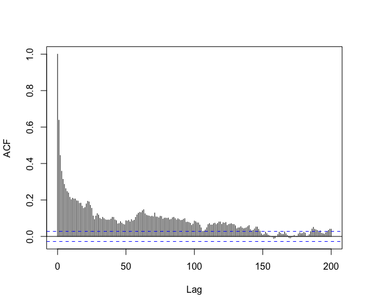
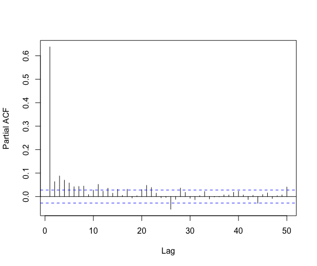

# Introduction

We consider the usual linear regression model
$$Y = X \beta + \varepsilon \, ,$$ where $Y$ is the $n$-dimensional
vector of observations, $X$ is a (possibly random) $n \times  p$ design
matrix, $\beta$ is a $p$-dimensional vector of parameters, and
$\varepsilon= (\varepsilon_i)_{1 \leq i \leq n}$ is the error process
(with zero mean and independent of $X$). The standard assumptions are
that the $\varepsilon_i$'s are independent and identically distributed
(i.i.d.) with zero mean and finite variance.

In this paper, we propose to modify the standard statistical procedures
(tests, confidence intervals, ...) of the linear model in the more
general context where the $\varepsilon_i$'s are obtained from a strictly
stationary process $(\varepsilon_i)_{i \in {\mathbb N}}$ with a short
memory. To be more precise, let $\hat \beta$ denote the usual least
squares estimator of $\beta$. Our approach is based on two papers: the
paper by [@hannan1973central] who proved the asymptotic normality of the
least squares estimator $D(n)(\hat \beta - \beta)$ ($D(n)$ being the
usual normalization) under very mild conditions on the design and on the
error process; and a recent paper by [@caron2019] who showed that, under
Hannan's conditions, the asymptotic covariance matrix of
$D(n)(\hat \beta - \beta)$ can be consistently estimated.

Let us emphasize that Hannan's conditions on the error process are very
mild and are satisfied for most of the short-memory processes (see the
discussion in Section $4.4$ of [@caron2018]). Putting together the two
above results, we can develop a general methodology for tests and
confidence regions on the parameter $\beta$, which should be valid for
most of the short-memory processes. This is, of course, directly useful
for time-series regression, but also in the more general context where
the residuals of the linear model seem to be strongly correlated. More
precisely, when checking the residuals of the linear model, if the
autocorrelation function of the residuals shows significant
correlations, and if the residuals can be suitably modeled by an ARMA
process, then our methodology is likely to apply. We shall give an
example of such a situation on the \"Shanghai pollution\" dataset at the
end of the paper.

Hence, the tools presented in the present paper can be seen from two
different points of view:

-   as appropriate tools for time series regression with a short memory
    error process

-   as a way to robustify the usual statistical procedures when the
    residuals are correlated.

Let us now describe the organization of the paper. In the next section,
we recall the mathematical background, the consistent estimator of the
asymptotic covariance matrix introduced in [@caron2019], and the
modified $Z$-statistics and $\chi$-square statistics for testing the
hypothesis on the parameter $\beta$. Next, we present the slm package
and the different ways to estimate the asymptotic covariance matrix: by
fitting an autoregressive process on the residuals (default procedure),
by means of the kernel estimator described in [@caron2019]
(theoretically valid) with a bootstrap method to choose the bandwidth
([@wu2009banding]), by using alternative choices of the bandwidth for
the rectangular kernel ([@efromovich1998data]) and the quadratic
spectral kernel ([@andrews1991heteroskedasticity]), and by means of an
adaptive estimator of the spectral density via Histograms
([@comte2001adaptive]). In a section about numerical experiments, we
estimate the level of a $\chi$-square test for a linear model with
random design, with different kinds of error processes, and for
different estimation procedures. In the last section, we apply the
package to the \"Shanghai pollution\" dataset, and we compare the
summary output of slm with the usual summary output of lm. An extended
version of this paper is available as an arXiv preprint (see
[@caron2019linear]).

# Linear regression with stationary errors {#sec:Section2}

## Asymptotic results for the kernel estimator {#sub:sec2_1}

We start this section by giving a short presentation of linear
regression with stationary errors, more details can be found for
instance in [@caron2019]. Let $\hat{\beta}$ be the usual least squares
estimator for the unknown vector $\beta$. The aim is to provide
hypothesis tests and confidence regions for $\beta$ in the non i.i.d.
context.

Let $\gamma$ be the autocovariance function of the error process
$\varepsilon$: for any integers $k$ and $m$, let
$\gamma(k) = \mathrm{Cov}(\varepsilon_{m}, \varepsilon_{m+k})$. We also
introduce the covariance matrix:
$$\Gamma_{n} := \left[ \gamma(j-l) \right]_{1 \leq j,l \leq n}.
\label{gamma_th}$$

[@hannan1973central] has shown a Central Limit Theorem for $\hat{\beta}$
when the error process is strictly stationary, under very mild
conditions on the design and the error process. Let us notice that the
design can be random or deterministic. We introduce the normalization
matrix $D(n)$ which is a diagonal matrix with diagonal term
$d_{j}(n) = \left \| X_{.,j} \right \|_{2}$ for $j$ in
$\{1, \ldots, p\}$, where $X_{.,j}$ is the $j$th column of $X$. Roughly
speaking Hannan's result says in particular that, given the design $X$,
the vector $D(n)(\hat{\beta} - \beta)$ converges in distribution to a
centered Gaussian distribution with covariance matrix $C$. As usual, in
practice, the covariance matrix $C$ is unknown, and it has to be
estimated. Hannan also showed the convergence of second order
moment:[^1]
$$\mathbb{E} \left( D(n) (\hat{\beta} - \beta) (\hat{\beta} - \beta)^{t} D(n)^{t} \Big| X \right) \xrightarrow[n \rightarrow \infty]{} C, \quad a.s.
\label{second_order_moment}$$ where
$$\mathbb{E} \left( D(n) (\hat{\beta} - \beta) (\hat{\beta} - \beta)^{t} D(n)^{t} \Big| X \right) = D(n) (X^{t} X)^{-1} X^{t} \Gamma_{n} X (X^{t} X)^{-1} D(n) .$$
In this paper, we propose a general plug-in approach: for some given
estimator $\widehat{\Gamma}_{n}$ of $\Gamma_{n}$, we introduce the
plug-in estimator:
$$\widehat C = \widehat C (\widehat{\Gamma}_{n}) := D(n) (X^{t}X)^{-1} X^{t} \widehat{\Gamma}_{n} X (X^{t}X)^{-1} D(n),
\label{main_estimator}$$ and we use $\widehat C$ to standardize the
usual statistics considered for the study of linear regression.

Let us illustrate this plug-in approach with a kernel estimator which
has been proposed in [@caron2019]. For some $K$ and a bandwidth $h$, the
kernel estimator $\widetilde{\Gamma}_{n,h}$ is defined by
$$\widetilde{\Gamma}_{n,h} = \left[ K \left( \frac{j-l}{h} \right) \tilde{\gamma}_{j-l} \right]_{1 \leq j,l \leq n},
\label{Gamma_tapered_star}$$ where the residual-based empirical
covariance coefficients are defined for $0 \leq | k | \leq n-1$ by
$$\tilde{\gamma}_{k} = \frac{1}{n} \sum_{j=1}^{n-|k|} \hat{\varepsilon}_{j} \hat{\varepsilon}_{j+|k|}.
\label{empcovtilde}$$ For a well-chosen kernel $K$ and under mild
assumptions on the design and the error process, it has been proved
in [@caron2019] that
$${\widetilde C_n}^{-1/2} D(n)(\hat{\beta} - \beta)  \xrightarrow[n \rightarrow \infty]{\mathcal{L}} \mathcal{N}_p (0_{p}, I_p),
\label{Slut}$$ for the plug-in estimator
$\widetilde C_n := \widehat C (\widetilde{\Gamma}_{n,h_n} )$, for some
suitable sequence of bandwidths $(h_n)$.

More generally, in this paper, we say that an estimator
$\widehat{\Gamma}_{n}$ of $\Gamma_{n}$ is *consistent for estimating the
covariance matrix $C$* if $\widehat C (\widehat{\Gamma}_{n})$ is
positive definite and if it converges in probability to $C$. Note that
such a property requires assumptions on the design, see [@caron2019]. If
$\widehat C (\widehat{\Gamma}_{n})$ is consistent for estimating the
covariance matrix $C$, then
${\widehat C(\widehat{\Gamma}_n)}^{-1/2} D(n)(\hat{\beta} - \beta)$
converges in distribution to a standard Gaussian vector.

To conclude this section, let us make some additional remarks. The
interest of Caron's recent paper is that the consistency of the
estimator $\widehat{C} (\widehat{\Gamma}_{n})$ is proved under Hannan's
condition on the error process, which is known to be optimal with
respect to the convergence in distribution (see for
instance [@dedecker2015optimality]), and which allows dealing with most
short memory processes. However, the natural estimator of the covariance
matrix of $\hat{\beta}$ based on $\widehat{\Gamma}_{n}$ has been studied
by many other authors in various contexts. For instance, let us mention
the important line of research initiated by
[@newey1986simple; @newey1994automatic] and the related papers by
[@andrews1991heteroskedasticity], [@andrews1992improved], among others.
In the paper by [@andrews1991heteroskedasticity], the consistency of the
estimator based on $\widehat{\Gamma}_{n}$ is proved under general
conditions on the fourth-order cumulants of the error process, and a
data-driven choice of the bandwidth is proposed. Note that these authors
also considered the case of heteroskedastic processes. Most of these
procedures, known as HAC (Heteroskedasticity and Autocorrelation
Consistent) procedures, are implemented in the package
[sandwich](https://CRAN.R-project.org/package=sandwich) by Zeileis,
Lumley, Berger and Graham, and presented in great detail in the paper by
[@zeileis2004econometric]. We shall use an argument of the sandwich
package, based on the data-driven procedure described by
[@andrews1991heteroskedasticity].

## Tests and confidence regions {#sub:tests}

We now present tests and confidence regions for arbitrary estimators
$\widehat{\Gamma}_{n}$. The complete justifications are available for
kernel estimators, see [@caron2019].

#### Z-Statistics.

We introduce the following univariate statistics:
$$Z_{j} = \frac{d_{j}(n) \hat{\beta}_{j}}{\sqrt{\widehat C_{(j,j)}}},
\label{pseudoStudent}$$ where
$\widehat C = \widehat C (\widehat{\Gamma}_{n})$. If
$\widehat{\Gamma}_{n}$ is consistent for estimating the covariance
matrix $C$ and if $\beta_j = 0$, the distribution of $Z_{j}$ converges
to a standard normal distribution when $n$ tends to infinity. We
directly derive an asymptotic hypothesis test for testing $\beta_j = 0$
against $\beta_j \neq 0$ as well as an asymptotic confidence interval
for $\beta_j$.

#### Chi-square statistics.

Let $A$ be an $n \times k$ matrix with $\mathop{\mathrm{rank}}(A) = k$.
Under [@hannan1973central]'s conditions,
$D(n)( A \hat{\beta} - A \beta)$ converges in distribution to a centered
Gaussian distribution with covariance matrix $A C A^{t}$. If
$\widehat{\Gamma}_{n}$ is consistent for estimating the covariance
matrix $C$, then $A \widehat C (\widehat{\Gamma}_{n})$ converges in
probability to $AC$. The matrix
$A \widehat C (\widehat{\Gamma}_{n}) A^{t}$ being symmetric positive
definite, this yields
$$W := (A \widehat C (\widehat{\Gamma}_{n}) )^{-1/2}  D(n)  A (\hat{\beta} -  \beta)  \xrightarrow[n \rightarrow \infty]{\mathcal{L}} \mathcal{N}_k (0_{k}, I_k) .$$
This last result provides asymptotical confidence regions for the vector
$A \beta$. It also provides an asymptotic test for testing the
hypothesis $H_0$ : $A \beta =  0$ against $H_1$ : $A \beta \neq  0$.
Indeed, under the $H_{0}$-hypothesis, the distribution of $\|W\|_2^2$
converges to a $\chi^{2}(k)$-distribution.

The test can be used to simplify a linear model by testing that several
linear combinations between the parameters $\beta_j$ are zero, as we
usually do for Anova and regression models. In particular, with
$A = I_p$, the test corresponds to the test of overall significance.

# Introduction to linear regression with the slm package {#sec:slmpackage}

Using the slm package is very intuitive because the arguments and the
outputs of slm are similar to those of the standard functions lm, glm,
etc. The output of the main function slm is an object of class \"slm\",
a specific class that has been defined for linear regression with
stationary processes. The \"slm\" class has methods plot, summary,
confint, and predict, see the extended version [@caron2019linear] for
more details. Moreover, the class \"slm\" inherits from the \"lm\" class
and thus provides the output of the classical lm function.

The statistical tools available in slm strongly depend on the choice of
the covariance plug-in estimator $\widehat C (\widehat \Gamma_n)$ we use
for estimating $C$. All the estimators $\widehat \Gamma_n$ proposed in
slm are residual-based estimators, but they rely on different
approaches. In this section, we present the main functionality of slm
together with the different covariance plug-in estimators.

For illustrating the package, we simulate synthetic data according to
the linear model:
$$Y_{i} = \beta_{1} + \beta_{2} (\log(i) + \sin(i) + Z_{i}) + \beta_{3} i + \varepsilon_{i},$$
where $Z$ is a Gaussian autoregressive process of order $1$ and
$\varepsilon$ is the Nonmixing process described further in the paper.
We use the functions generative_model and generative_process
respectively to simulate observations according to this regression
design and with this specific stationary process.

::: Sinput
R\> library(slm) R\> set.seed(42) R\> n = 500 R\> eps =
generative_process(n,\"Nonmixing\") R\> design =
generative_model(n,\"mod2\") R\> design_sim = cbind(rep(1,n),
as.matrix(design)) R\> beta_vec = c(2,0.001,0.5) R\> Y = design_sim
:::

## Linear regression via AR fitting on the residuals

A large class of stationary processes with continuous spectral density
can be well approximated by AR processes, see for instance Corollary
4.4.2 in [@brockwell1991time]. The covariance structure of an AR process
having a closed form, it is thus easy to derive an approximation
$\widetilde{\Gamma}_{AR(p)}$ of $\Gamma_n$ by fitting an AR process on
the residual process. The AR-based method for estimating $C$ is the
default version of slm. This method proceeds in four main steps:

1.  Fit an autoregressive process on the residual process
    $\hat{\varepsilon}$ ;

2.  Compute the theoretical covariances of the fitted AR process ;

3.  Plug the covariances in the Toeplitz matrix
    $\widetilde{\Gamma}_{AR(p)}$ ;

4.  Compute $\widehat{C} = \widehat{C}(\widetilde{\Gamma}_{AR(p)})$.

The slm function fits a linear regression of the vector $Y$ on the
design $X$ and then fits an AR process on the residual process using the
ar function from the [stats](https://CRAN.R-project.org/package=stats)
package. The output of the slm function is an object of class \"slm\".
The order $p$ of the AR process is set in the argument model_selec:

::: Sinput
R\> regslm = slm(Y   X1 + X2, data = design, method_cov_st =
\"fitAR\", + model_selec = 3)
:::

The estimated covariance is recorded as a vector in the attribute cov_st
of regslm, which is an object of class \"slm\". The estimated covariance
matrix can be computed by taking the Toeplitz matrix of cov_st, using
the toeplitz function.

#### AR order selection.

The order $p$ of the AR process can be chosen at hand by setting
model_selec = p, or automatically with the AIC criterion by setting
model_selec = -1.

::: Sinput
R\> regslm = slm(Y   X1 + X2, data = design, method_cov_st =
\"fitAR\", + model_selec = -1)
:::

The order of the fitted AR process is recorded in the model_selec
attribute of regslm:

::: Sinput
R\> regslm@model_selec
:::

::: Soutput
2
:::

Here, the AIC criterion suggests to fit an AR(2) process on the
residuals.

## Linear regression via kernel estimation of the error covariance {#sub:kernel_method}

The second method for estimating the covariance matrix $C$ is the kernel
estimation method
[\[Gamma_tapered_star\]](#Gamma_tapered_star){reference-type="eqref"
reference="Gamma_tapered_star"} studied in [@caron2019]. In short, this
method estimates $C$ via a smooth approximation of the covariance matrix
$\Gamma_{n}$ of the residuals. This estimation of $\Gamma_{n}$
corresponds to the so-called tapered covariance matrix estimator in the
literature, see for instance [@xiao2012covariance], or also to the
\"lag-window estimator\" defined in [@brockwell1991time], page $330$. It
applies in particular for non-negative symmetric kernels with compact
support, with an integrable Fourier transform and such that $K(0) = 1$.
Table [1](#tab:kernels){reference-type="ref" reference="tab:kernels"}
gives the list of the available kernels in the package slm.

::: center
::: {#tab:kernels}
   kernel_fonc =                                                    kernel definition
  --------------- ----------------------------------------------------------------------------------------------------------------------
    rectangular                                           $K(x) = \mathds{1}_{\{ |x| \leq 1 \}}$
     triangle                                       $K(x) = (1 - | x |) \mathds{1}_{\{ |x| \leq 1 \}}$
      trapeze      $K(x) = \mathds{1}_{\{ |x| \leq \delta \}} + \frac{1}{1-\delta}(1 - | x |) \mathds{1}_{\{\delta \leq |x| \leq 1 \}}$

  : Available kernel functions in slm.
:::
:::

It is also possible for the user to define his own kernel and use it in
the argument kernel_fonc of the slm function. Below we use the triangle
kernel, which assures that the covariance matrix is positive definite.
The support of the kernel $K$ in
Equation [\[Gamma_tapered_star\]](#Gamma_tapered_star){reference-type="eqref"
reference="Gamma_tapered_star"} being compact, only the terms
$\tilde \gamma_{j-l}$ for small enough lag $j-l$ are kept and weighted
by the kernel in the expression of $\widetilde{\Gamma}_{n,h}$. Rather
than setting the bandwidth $h$, we select the number of $\gamma(k)$'s
that should be kept (the lag) with the argument model_selec in the
slm function. Then the bandwidth $h$ is calibrated accordingly, that is
equal to model_selec $+ 1$.

::: Sinput
R\> regslm = slm(Y   X1 + X2, data = design, method_cov_st =
\"kernel\", + model_selec = 5, kernel_fonc = triangle, plot = TRUE)
:::

The plot output by the slm function is given in
Figure [1](#fig:ACFKernel5){reference-type="ref"
reference="fig:ACFKernel5"}.

::: center
{#fig:ACFKernel5 width="50%"}
:::

#### Order selection via bootstrap.

The order parameter can be chosen at hand as before or automatically by
setting model_selec = -1. The automatic order selection is based on the
bootstrap procedure proposed by [@wu2009banding] for banded covariance
matrix estimation. The block_size argument sets the size of bootstrap
blocks, and the block_n argument sets the number of blocks. The final
order is chosen by taking the order which has the minimal risk.
Figure [\[fig:kernelauto\]](#fig:kernelauto){reference-type="ref"
reference="fig:kernelauto"} gives the plots of the estimated risk for
the estimation of $\Gamma_{n}$ (left) and the final estimated ACF
(right).

::: Sinput
R\> regslm = slm(Y   X1 + X2, data = design, method_cov_st
=\"kernel\", + model_selec = -1, kernel_fonc = triangle, model_max =
30, + block_size = 100, block_n = 100, plot = TRUE)
:::

The selected order is recorded in the model_selec attribute of the
slm object output by the slm function:

::: Sinput
R\> regslm@model_selec
:::

::: Soutput
10
:::

#### Order selection by Efromovich's method (rectangular kernel).

An alternative method for choosing the bandwidth in the case of the
rectangular kernel has been proposed in [@efromovich1998data]. For a
large class of stationary processes with exponentially decaying
autocovariance function (mainly the ARMA processes), Efromovich proved
that the rectangular kernel is asymptotically minimax, and he proposed
the following estimator:
$$\hat{f}_{J_{nr}}(\lambda) = \frac{1}{2 \pi} \sum_{k=-J_{nr}}^{k=J_{nr}} \hat{\gamma}_{k} e^{i k \lambda},$$
with the lag
$$J_{nr} = \frac{\log(n)}{2r} \left[ 1 + (\log(n))^{-1/2} \right],$$
where $r$ is a regularity index of the autocovariance index. In
practice, this parameter is unknown and is estimated thanks to the
algorithm proposed in the section $4$ of [@efromovich1998data]. As for
the other methods, we use the residual based empirical covariances
$\tilde{\gamma}_{k}$ to compute $\hat{f}_{J_{nr}}(\lambda)$.

::: Sinput
R\> regslm = slm(Y   X1 + X2, data = design, method_cov_st =
\"efromovich\", + model_selec = -1)
:::

#### Order Selection by Andrews's method.

Another method for choosing the bandwidth has been proposed
by [@andrews1991heteroskedasticity] and implemented in the package
sandwich by Zeileis, Lumley, Berger and Graham (see the paper
by [@zeileis2004econometric]). For the slm package, the automatic choice
of the bandwidth proposed by Andrews can be obtained as follows:

::: Sinput
R\> regslm = slm(Y   X1 + X2, data = design, method_cov_st = \"hac\")
:::

The procedure is based on the function kernHAC in the sandwich package.
This function computes directly the covariance matrix estimator of
$\hat{\beta}$, which will be recorded in the slot Cov_ST of the slm
function. Here, we take the quadratic spectral kernel:
$$K \left( x \right) = \frac{25}{12 \pi^{2} x^{2}} \left( \frac{\sin \left( 6 \pi x / 5 \right) }{6 \pi x / 5} - \cos \left( 6 \pi x / 5 \right) \right),$$
as suggested by Andrews (see Section $2$ in
[@andrews1991heteroskedasticity], or Section $3.2$ in
[@zeileis2004econometric]), but other kernels could be used, such as
Bartlett, Parzen, Tukey-Hamming, among others (see
[@zeileis2004econometric]).

#### Positive definite projection.

Depending on the method used, the matrix
$\widehat{C} (\widehat{\Gamma}_{n})$ may not always be positive
definite. It is the case of the kernel method with rectangular or
trapeze kernel. To overcome this problem, we make the projection of
$\widehat{C} (\widehat{\Gamma}_{n})$ into the cone of positive definite
matrices by applying a hard thresholding on the spectrum of this matrix:
we replace all eigenvalues lower or equal to zero with the smallest
positive eigenvalue of $\widehat{C} (\widehat{\Gamma}_{n})$. Note that
this projection is useless for the triangle or quadratic spectral
kernels because their Fourier transform is non-negative (leading to a
positive definite matrix $\widehat{C} (\widehat{\Gamma}_{n})$). Of
course, it is also useless for the fitAR and spectralproj methods.

## Linear regression via projection spectral estimation

The projection method relies on the ideas of [@comte2001adaptive], where
an adaptive nonparametric method has been proposed for estimating the
spectral density of a stationary Gaussian process. We use the residual
process as a proxy for the error process, and we compute the projection
coefficients with the residual-based empirical covariance coefficients
$\tilde{\gamma}_{k}$, see Equation
[\[empcovtilde\]](#empcovtilde){reference-type="eqref"
reference="empcovtilde"}. For some $d \in \mathbb N^*$, the estimator of
the spectral density of the error process that we use is defined by
computing the projection estimators for the residual process on the
basis of histogram functions:
$$\phi_{j}^{(d)} = \sqrt{\frac{d}{\pi}} \mathds{1}_{[\pi j/d, \pi (j+1)/d[}, \qquad   \ j = 0, 1, \ldots, d-1.$$
The estimator is defined by
$$\hat{f}_{d}(\lambda) = \sum_{j=0}^{d-1} \hat{a}_{j}^{(d)} \phi_{j}^{(d)},$$
where the projection coefficients are
$$\hat{a}_{j}^{(d)} = \sqrt{\frac{d}{\pi}} \left( \frac{\tilde{\gamma}_{0}}{2d} + \frac{1}{\pi} \sum_{r=1}^{n-1} \frac{\tilde{\gamma}_{r}}{r} \left[ \sin \left( \frac{\pi (j+1) r}{d} \right) - \sin \left( \frac{\pi j r}{d} \right) \right] \right).$$
The Fourier coefficients of the spectral density are equal to the
covariance coefficients. Thus, for $k = 1, \ldots, n-1$ it yields
$$\begin{aligned}
\gamma_k &= & c_{k} \\
&= & \frac{2}{k} \sqrt{\frac{d}{\pi}} \sum_{j=0}^{d-1} \hat{a}_{j}^{(d)} \left[ \sin \left( \frac{k \pi (j+1)}{d} \right) - \sin \left( \frac{k \pi j}{d} \right) \right],\end{aligned}$$
and for $k=0$:
$$\gamma_0 = c_{0}  =  2 \sqrt{\frac{\pi}{d}} \sum_{j=0}^{d-1} \hat{a}_{j}^{(d)}.$$
This method can be proceeded in the slm function by setting
method_cov_st = \"spectralproj\":

::: Sinput
R\> regslm = slm(Y   X1 + X2, data = design, method_cov_st =
\"spectralproj\", + model_selec = 10, plot = TRUE)
:::

The graph of the estimated spectral density can be plotted by setting
plot = TRUE in the slm function, see
Figure [2](#fig:specdens){reference-type="ref"
reference="fig:specdens"}.

::: center
{#fig:specdens width="50%"}
:::

#### Model selection.

The Gaussian model selection method proposed in [@comte2001adaptive]
follows the ideas of Birgé and Massart, see for
instance [@massart2007concentration]. It consists of minimizing the
$l_2$ penalized criterion, see Section 5 in [@comte2001adaptive]:
$$\mbox{crit}(d) :=  - \sum_{j=0} ^{d-1}  \left[ \hat{a}_{j}^{(d)} \right] ^2  + c \frac dn,$$
where $c$ is a multiplicative constant that in practice can be
calibrated using the slope heuristic method, see [@birge2007minimal],
[@baudry2012slope] and the R package
[capushe](https://CRAN.R-project.org/package=capushe).

::: Sinput
R\> regslm = slm(Y   X1 + X2, data = design, method_cov_st =
\"spectralproj\", + model_selec = -1, model_max = 50, plot = TRUE)
:::

The selected dimension is recorded in the model_selec attribute of the
slm object output by the slm function:

::: Sinput
R\> regslm@model_selec
:::

::: Soutput
8
:::

The slope heuristic algorithm here selects a Histogram on a regular
partition of size $8$ over the interval $[0, \pi]$ to estimate the
spectral density.

## Linear regression via masked covariance estimation

This method is a full-manual method for estimating the covariance matrix
$C$ by only selecting covariance terms from the residual covariances
$\tilde{\gamma}_{k}$ defined by
[\[empcovtilde\]](#empcovtilde){reference-type="eqref"
reference="empcovtilde"}. Let $I$ be a set of positive integers, then we
consider
$$\hat \gamma_I(k) := \tilde{\gamma}_{k} \mathbbm{1}_{k \in I\cup \{0\} },  \hskip 1cm 0 \leq |k| \leq n-1,$$
and then we define the estimated covariance marix $\widehat{\Gamma}_{I}$
by taking the Toeplitz matrix of the vector $\hat \gamma_I$. This
estimator is a particular example of a masked sample covariance
estimator, as introduced by [@chen2012masked], see also
[@levina2012partial]. Finally, we derive from $\widehat \Gamma_I$ an
estimator $\widehat C (\widehat \Gamma_I)$ for $C$.

The next instruction selects the coefficients $0$, $1$, $2$ and $4$ from
the residual covariance terms:

::: Sinput
R\> regslm = slm(Y   X1 + X2, data = design, method_cov_st =
\"select\", + model_selec = c(1,2,4))
:::

The positive lags of the selected covariances are recorded in the
model_selec argument. Let us notice that the variance $\gamma_{0}$ is
automatically selected.

As for the kernel method, the resulting covariance matrix may not be
positive definite. If it is the case, the positive definite projection
method described before is used.

## Linear regression via manual plugged covariance matrix

This last method is a direct plug-in method. The user proposes his own
vector estimator $\hat{\gamma}$ of $\gamma$, and then the Toeplitz
matrix $\widehat \Gamma_{n}$ of the vector $\hat \gamma$ is used for
estimating $C$ with $\widehat C (\widehat \Gamma_{n})$.

::: Sinput
R\> v = rep(0,n) R\> v\[1:10\] = acf(eps, type = \"covariance\", lag.max
= 9)$acf
R> regslm = slm(Y ~ X1 + X2, data = design, cov_st = v)
\end{Sinput}
\egroup 

The user can also propose his own covariance matrix$\_n$for estimating$C$.
\bgroup 
\begin{Sinput}
R> v = rep(0,n)
R> v[1:10] = acf(eps, type = "covariance", lag.max = 9)$acf R\> V =
toeplitz(v) R\> regslm = slm(Y   X1 + X2, data = design, Cov_ST = V)
:::

Let us notice that the user must verify that the resulting covariance
matrix is positive definite. The positive definite projection algorithm
is not used with this method.

# Numerical experiments and method comparisons {#sec:simu}

This section summarizes an extensive study which has been carried out to
compare the performances of the different approaches presented before in
the context of a linear model with short range dependent stationary
errors.

## Description of the generative models {#sub:genmodels}

We first present the five generative models for the errors that we
consider in the paper. We choose different kinds of processes to reflect
the diversity of short-memory processes.

-   **AR1 process.** The AR1 process is a Gaussian AR(1) process defined
    by $$\varepsilon_{i} - 0.7 \varepsilon_{i-1} = W_{i},$$ where
    $W_{i}$ is a standard gaussian distribution $\mathcal{N}(0,1)$.

-   **AR12 process.** The AR12 process is a seasonal AR(12) process
    defined by
    $$\varepsilon_{i} - 0.5 \varepsilon_{i-1} - 0.2 \varepsilon_{i-12} = W_{i},$$
    where $W_{i}$ is a standard Gaussian distribution
    $\mathcal{N}(0,1)$. When studying monthly datasets, one usually
    observes a seasonality of order $12$. For example, when looking at
    climate data, the data are often collected per month, and the same
    phenomenon tends to repeat every year. Even if the design integrates
    the deterministic part of the seasonality, a correlation of order
    $12$ usually remains present in the residual process.

-   **MA12 process.** The MA12 is also a seasonal process defined by
    $$\varepsilon_{i} = W_{i} + 0.5 W_{i-2} + 0.3 W_{i-3} + 0.2 W_{i-12},$$
    where the $(W_{i})$'s are i.i.d. random variables following
    Student's distribution with $10$ degrees of freedom.

-   **Nonmixing process.** The three processes described above are basic
    ARMA processes, whose innovations have absolutely continuous
    distributions; in particular, they are strongly mixing in the sense
    of [@rosenblatt1956central], with a geometric decay of the mixing
    coefficients (in fact, the MA12 process is even $12$-dependent,
    which means that the mixing coefficient $\alpha(k) = 0$ if
    $k > 12$). Let us now describe a more complicated process: let
    $(Z_{1}, \ldots, Z_{n})$ satisfying the AR(1) equation
    $$Z_{i+1} = \frac{1}{2} (Z_{i} + \eta_{i+1}),$$ where $Z_{1}$ is
    uniformly distributed over $[0,1]$ and the $\eta_{i}$'s are i.i.d.
    random variables with distribution $\mathcal{B}(1/2)$, independent
    of $Z_{1}$. The process $(Z_{i})_{i \geq 1}$ is a strictly
    stationary Markov chain, but it is not $\alpha$-mixing in the sense
    of Rosenblatt (see [@bradley1985basic]). Let now $Q_{0,\sigma^{2}}$
    be the inverse of the cumulative distribution function of a centered
    Gaussian distribution with variance $\sigma^{2}$ (for the
    simulations below, we choose $\sigma^{2} = 25$). The Nonmixing
    process is then defined by
    $$\varepsilon_{i} = Q_{0,\sigma^{2}}(Z_{i}).$$ The sequence
    $(\varepsilon_{i})_{i \geq 1}$ is also a stationary Markov chain (as
    an invertible function of a stationary Markov chain). By
    construction, $\varepsilon_{i}$ is
    $\mathcal{N}(0, \sigma^{2})$-distributed, but the sequence
    $(\varepsilon_{i})_{i \geq 1}$ is not a Gaussian process (otherwise,
    it would be mixing in the sense of Rosenblatt). Although it is not
    obvious, one can prove that the process
    $(\varepsilon_{i})_{i \geq 1}$ satisfies Hannan's condition
    (see [@caron2019], Section $4.2$).

-   **Sysdyn process.** The four processes described above have the
    property of \"geometric decay of correlations\", which means that
    the $\gamma(k)$'s tend to $0$ at an exponential rate. However, as
    already pointed out in the introduction, Hannan's condition is valid
    for most of the short memory processes, even for processes with slow
    decay of correlations (provided that the $\gamma(k)$'s are
    summable). Hence, our last example will be a non-mixing process (in
    the sense of Rosenblatt), with an arithmetic decay of the
    correlations.

    For $\gamma \in ]0,1[$, the intermittent map
    $\theta_{\gamma} : [0,1] \mapsto [0,1]$ introduced in
    [@liverani1999probabilistic] is defined by $$\theta_{\gamma}(x) =
    \left\{
    \begin{array}{r c l}
    x(1 + 2^{\gamma} x^{\gamma}) \qquad &\text{if}& \ x \in [0, 1/2[ \\
    2x - 1 \qquad &\text{if}& \ x \in [1/2, 1].\\
    \end{array}
    \right.$$

    It follows from [@liverani1999probabilistic] that there exists a
    unique $\theta_{\gamma}$-invariant probability measure
    $\nu_{\gamma}$. The Sysdyn process is then defined by
    $$\varepsilon_{i} = \theta_{\gamma}^{i}.$$
    From [@liverani1999probabilistic], we know that on the probability
    space $([0,1], \nu_{\gamma})$, the autocorrelations $\gamma(k)$ of
    the stationary process $(\varepsilon_{i})_{i \geq 1}$ are exactly of
    order $k^{-(1-\gamma)/\gamma}$. Hence,
    $(\varepsilon_{i})_{i \geq 1}$ is a short memory process provided
    $\gamma \in ]0, 1/2[$. Moreover, it has been proved in Section $4.4$
    of [@caron2018] that $(\varepsilon_{i})_{i \geq 1}$ satisfies
    Hannan's condition in the whole short-memory range, that is for
    $\gamma \in ]0, 1/2[$. For the simulations below, we took
    $\gamma = 1/4$, which give autocorrelations $\gamma(k)$ of order
    $k^{-3}$.

The linear regression models simulated in the experiments all have the
following form:
$$Y_{i} = \beta_{1} + \beta_{2} (\log(i) + \sin(i) + Z_{i}) + \beta_{3} i + \varepsilon_{i}, \hskip 1cm \textrm{for all $i$ in } \{1, \ldots, n\},
\label{reglinsimu}$$ where $Z$ is a Gaussian autoregressive process of
order $1$ and $\varepsilon$ is one of the stationary processes defined
above. For the simulations, $\beta_{1}$ is always equal to $3$. All the
error processes presented above can be simulated with the slm package
with the generative_process function. The design can be simulated with
the generative_model function.

## Automatic calibration of the tests

It is, of course, of first importance to provide hypothesis tests with
correct significance levels or at least with correct asymptotical
significance levels, which is possible if the estimator
$\widehat \Gamma_{n}$ of the covariance matrix $\Gamma_{n}$ is
consistent for estimating $C$. For instance, the results of [@caron2019]
show that it is possible to construct statistical tests with correct
asymptotical significance levels. However, in practice, such
asymptotical results are not sufficient since they do not indicate how
to tune the bandwidth on a given dataset. This situation makes the
practice of linear regression with dependent errors really more
difficult than linear regression with i.i.d. errors. This problem
happens for several methods given before ; order choice for the fitAR
method, bandwidth choice for the kernel method, dimension selection for
the spectralproj method.

It is a tricky issue to design a data-driven procedure for choosing test
parameters in order to have a correct Type I Error. Note that unlike
with supervised problems and density estimation, it is not possible to
calibrate hypothesis tests in practice using cross-validation
approaches. We thus propose to calibrate the tests using well-founded
statistical procedures for risk minimization ; AIC criterion for the
fitAR method, bootstrap procedures for the kernel method, and slope
heuristics for the spectralproj method. These procedures are implemented
in the slm function with the model_selec = -1 argument, as detailed in
the previous section.

Let us first illustrate the calibration problem with the AR12 process.
For $T=1000$ simulations, we generate an error process of size $n$ under
the null hypothesis: $H_{0}: \beta_{2} = \beta_{3} = 0$. Then we use the
fitAR method of the slm function with orders between $1$ and $50$, and
we perform the model significance test. The procedure is repeated $1000$
times, and we estimate the true level of the test by taking the average
of the estimated levels on the $1000$ simulations for each order. The
results are given in Figure [3](#levels){reference-type="ref"
reference="levels"} for $n=1000$. A boxplot is also displayed to
visualize the distribution of the order selected by the automatic
criterion (AIC).

::: center
![Estimated level of the test according to the order of the fitted AR
process on the residuals (top) and boxplot of the order selected by AIC,
over $1000$ simulations. The data has been simulated according to Model
[\[reglinsimu\]](#reglinsimu){reference-type="eqref"
reference="reglinsimu"} with $\beta_1 = 3$ and
$\beta_{2} = \beta_{3} = 0$, with
$n= 1000$.](./figures/AR12_level_boxplot.png){#levels width="58%"}
:::

## Non-Seasonal errors

We first study the case of non-Seasonal error processes. We simulate an
$n$-error process according to the AR1, the Nonmixing, or the Sysdyn
processes. We simulate realizations of the linear regression model
[\[reglinsimu\]](#reglinsimu){reference-type="eqref"
reference="reglinsimu"} under the null hypothesis:
$H_{0}: \beta_{2} = \beta_{3} = 0$. We use the automatic selection
procedures for each method ( model_selec = -1). The simulations are
repeated $1000$ times in order to estimate the true level of the model
significance for each test procedure. We simulate either small samples
($n=200$) or larger samples ($n=1000, 2000, 5000$). The results of these
experiments are summarized in
Table [\[tab:nonsea\]](#tab:nonsea){reference-type="ref"
reference="tab:nonsea"}.

::: center
::: tabular
\|c\|c\|c\|c\|c\| n & & Fisher test & fitAR & spectralproj\
\*200 & AR1 process & 0.465 & **0.097** & 0.14\
& NonMixing & 0.298 & 0.082 & 0.103\
& Sysdyn process & 0.385 & **0.105** & 0.118\
\*1000 & AR1 process & 0.418 & 0.043 & **0.049**\
& NonMixing & 0.298 & 0.046 & **0.05**\
& Sysdyn process & 0.393 & **0.073** & 0.077\
\*2000 & AR1 process & 0.454 & 0.071 & 0.078\
& NonMixing & 0.313 & **0.051** & 0.053\
& Sysdyn process & 0.355 & **0.063** & 0.064\
\*5000 & AR1 process & 0.439 & 0.044 & **0.047**\
& NonMixing & 0.315 & 0.053 & 0.056\
& Sysdyn process & 0.381 & 0.058 & 0.061\
:::

\

::: tabular
\|c\|c\|c\|c\|c\| n & & efromovich & kernel & hac\
\*200 & AR1 process & 0.135 & 0.149 & 0.108\
& NonMixing & 0.096 & 0.125 & **0.064**\
& Sysdyn process & 0.124 & 0.162 & 0.12\
\*1000 & AR1 process & **0.049** & 0.086 & **0.049**\
& NonMixing & 0.053 & 0.076 & 0.038\
& Sysdyn process & 0.079 & 0.074 & 0.078\
\*2000 & AR1 process & 0.075 & **0.067** & 0.071\
& NonMixing & 0.057 & 0.067 & 0.047\
& Sysdyn process & 0.066 & 0.069 & 0.073\
\*5000 & AR1 process & **0.047** & **0.047** & 0.044\
& NonMixing & 0.059 & 0.068 & **0.05**\
& Sysdyn process & **0.057** & 0.064 & 0.071\
:::

\
:::

For $n$ large enough ($n \geq 1000$), all methods work well, and the
estimated level is around $0.05$. However, for small samples
($n = 200$), we observe that the fitAR and the hac methods show better
performances than the others. The kernel method is slightly less
effective. With this method, we must choose the size of the bootstrap
blocks as well as the number of blocks, and the test results are really
sensitive to these parameters. In these simulations, we have chosen
$100$ blocks with a size of $n/2$. The results are expected to improve
with a larger number of blocks.

Let us notice that for all methods and for all sample sizes, the
estimated level is much better than if no correction is made (usual
Fisher tests).

## Seasonal errors

We now study the case of linear regression with seasonal errors. The
experiment is exactly the same as before, except that we simulate AR12
or MA12 processes. The results of these experiments are summarized in
Table [\[tab:sea\]](#tab:sea){reference-type="ref" reference="tab:sea"}.

::: center
::: tabular
\|c\|c\|c\|c\|c\| n & & Fisher test & fitAR & spectralproj\
\*200 & AR12 process & 0.436 & 0.178 & 0.203\
& MA12 process & 0.228 & **0.113** & **0.113**\
\*1000 & AR12 process & 0.468 & **0.068** & 0.183\
& MA12 process & 0.209 & 0.064 & 0.066\
\*2000 & AR12 process & 0.507 & **0.071** & 0.196\
& MA12 process & 0.237 & 0.064 & 0.064\
\*5000 & AR12 process & 0.47 & **0.062** & 0.183\
& MA12 process & 0.242 & 0.044 & **0.048**\
:::

\

::: tabular
\|c\|c\|c\|c\|c\| n & & efromovich & kernel & hac\
\*200 & AR12 process & 0.223 & 0.234 & **0.169**\
& MA12 process & 0.116 & 0.15 & 0.222\
\*1000 & AR12 process & 0.181 & 0.124 & 0.179\
& MA12 process & 0.069 & **0.063** & 0.18\
\*2000 & AR12 process & 0.153 & 0.104 & 0.192\
& MA12 process & **0.058** & 0.068 & 0.173\
\*5000 & AR12 process & 0.1 & 0.091 & 0.171\
& MA12 process & 0.043 & 0.057 & 0.147\
:::

\
:::

We directly see that the case of seasonal processes is more complicated
than for the non-seasonal processes especially for the AR12 process. For
a small samples size, the estimated level is between $0.17$ and $0.24$,
which is clearly too large. It is, however, much better than the
estimated level of the usual Fisher test, which is around $0.45$. The
fitAR method is the best method here for the AR12 process because for
$n \geq 1000$, the estimated level is between $0.06$ and $0.07$. For
efromovich and kernel methods, a level less than $0.10$ is reached but
for large samples only. The spectralproj and hac methods do not seem to
work well for the AR12 process, although they remain much better than
the usual Fisher tests (around $19\%$ of rejection instead of $45\%$).

The case of the MA12 process seems easier to deal with. For $n$ large
enough ($n \geq 1000$), the estimated level is between $0.04$ and $0.07$
whatever the method, except for hac (around $0.15$ for $n = 5000$). It
is less effective for a small sample size ($n=200$) with an estimated
level around $0.115$ for fitAR, spectralproj and efromovich methods.

## I.I.D. errors

To be complete, we consider the case where the $\epsilon_{i}$'s are
i.i.d., to see how the five automatic methods perform in that case. We
simulate $n$ i.i.d. centered random variables according to the formula:
$$\epsilon_{i} = W_{i}^{2} - \frac{5}{4},$$ where $W$ follows a student
distribution with $10$ degrees of freedom. Note that the distribution of
the $\epsilon_{i}$'s is not symmetric and has no exponential moments.

::: center
::: {#tab:i.i.d.}
    n                     Fisher test   fitAR   spectralproj
  ----- ---------------- ------------- ------- --------------
   150   i.i.d. process      0.053      0.068      0.078
   300   i.i.d. process      0.052      0.051       0.06
   500   i.i.d. process      0.047      0.049      0.053

  : Estimated levels for the i.i.d. process
:::

\

::: {#tab:i.i.d.}
    n                     efromovich   kernel    hac
  ----- ---------------- ------------ -------- -------
   150   i.i.d. process     0.061      0.124    0.063
   300   i.i.d. process      0.05      0.095    0.052
   500   i.i.d. process     0.049      0.082    0.056

  : Estimated levels for the i.i.d. process
:::

\
:::

Except for the kernel method, the estimated levels are close to $5 \%$
for $n$ large enough ($n \geq 300$). It is slightly worse for small
samples, but it remains quite good for the methods fitAR, efromovich,
and hac.

As a general conclusion of this section about numerical experiments and
method comparison, we see that the fitAR method performs quite well in a
wide variety of situations and should therefore be used as soon as the
user suspects that the error process can be modeled by a stationary
short-memory process.

# Application to the PM2.5 pollution Shanghai Dataset {#sub:S5DataChine}

This dataset comes from a study about fine particle pollution in five
Chinese cities. The data are available on the following website
<https://archive.ics.uci.edu/ml/datasets/PM2.5+Data+of+Five+Chinese+Cities#>.
Here we are interested with the city of Shanghai. We study the
regression of PM2.5 pollution in Xuhui District by other measurements of
pollution in neighboring districts and also by meteorological variables.
The dataset contains hourly observations between January 2010 and
December 2015. More precisely, it contains $52584$ records of $17$
variables: date, time of measurement, pollution and meteorological
variables. More information on these data is available in the paper
of [@liang2016pm2].

We remove the lines that contain NA observations, and we then extract
the first $5000$ observations. For simplicity, we will only consider
pollution variables and weather variables. We start the study with the
following $10$ variables:

-   PM_Xuhui: PM2.5 concentration in the Xuhui district ($ug/m^{3}$)

-   PM_Jingan: PM2.5 concentration in the Jing'an district ($ug/m^{3}$)

-   PM_US.Post: PM2.5 concentration in the U.S diplomatic post
    ($ug/m^{3}$)

-   DEWP: Dew Point (Celsius Degree)

-   TEMP: Temperature (Celsius Degree)

-   HUMI: Humidity ($\%$)

-   PRES: Pressure (hPa)

-   Iws: Cumulated wind speed ($m/s$)

-   precipitation: hourly precipitation (mm)

-   Iprec: Cumulated precipitation (mm)

::: Sinput
R\> shan = read.csv(\"ShanghaiPM20100101_20151231.csv\", header =
TRUE, + sep = \",\") R\> shan = na.omit(shan) R\> shan_complete =
shan\[1:5000,c(7,8,9,10,11,12,13,15,16,17)\] R\> shan_complete\[1:5,\]
:::

::: Soutput
PM_Jingan PM_US.Post PM_Xuhui DEWP HUMI PRES TEMP Iws 26305 66 70 71 -5
69.00 1023 0 60 26306 67 76 72 -5 69.00 1023 0 62 26308 73 78 74 -4
74.41 1023 0 65 26309 75 77 77 -4 80.04 1023 -1 68 26310 73 78 80 -4
80.04 1023 -1 70 precipitation Iprec 26305 0 0 26306 0 0 26308 0 0 26309
0 0 26310 0 0
:::

The aim is to study the concentration of particles in Xuhui District
according to the other variables. We first fit a linear regression with
the lm function.

The variable PRES has no significant effect on the PM_Xuhui variable. We
then perform a backward selection procedure, which leads to select $9$
significant variables:

The autocorrelation of the residual process shows that the errors are
clearly not i.i.d., see
Figure [\[acf_pacf_shan\]](#acf_pacf_shan){reference-type="ref"
reference="acf_pacf_shan"}. We thus suspect the lm procedure to be
unreliable in this context.

::: center
{width="49%"}
{width="49%"}
:::

The autocorrelation function decreases pretty fast, and the partial
autocorrelation function suggests that fitting an AR process on the
residuals should be an appropriate method in this case. The automatic
fitAR method of slm selects an AR process of order $28$. The residuals
of this AR fitting look like white noise, as shown in
Figure [4](#res_shan_AR28){reference-type="ref"
reference="res_shan_AR28"}.

::: center
{#res_shan_AR28 width="50%"}
:::

Consequently, we propose to perform a linear regression with
slm function, using the fitAR method on the complete model.

::: Sinput
R\> regslm = slm(shan_complete$PM_Xuhui ~ . ,data = shan_complete,
+  	method_cov_st = "fitAR", model_selec = -1)
R> summary(regslm)
\end{Sinput}
\begin{Soutput}
Call:
"slm(formula = myformula, data = data, x = x, y = y)"

Residuals:
     Min       1Q   Median       3Q      Max 
-132.139   -4.256   -0.195    4.279  176.450 

Coefficients:
                Estimate Std. Error z value Pr(>|z|)    
(Intercept)   -54.859483 143.268399  -0.383 0.701783    
PM_Jingan       0.596490   0.028467  20.953  < 2e-16 ***
PM_US.Post      0.375636   0.030869  12.169  < 2e-16 ***
DEWP           -1.038941   0.335909  -3.093 0.001982 ** 
HUMI            0.291713   0.093122   3.133 0.001733 ** 
PRES            0.025287   0.137533   0.184 0.854123    
TEMP            1.305543   0.340999   3.829 0.000129 ***
Iws            -0.007650   0.005698  -1.343 0.179399    
precipitation   0.462885   0.125641   3.684 0.000229 ***
Iprec          -0.125456   0.064652  -1.940 0.052323 .  
---
Signif. codes:  0 '***' 0.001 '**' 0.01 '*' 0.05 '.' 0.1 ' ' 1

Residual standard error: 10.68
Multiple R-squared:  0.9409
chi2-statistic:  8383 on 9 DF,  p-value: < 2.2e-16
\end{Soutput}
\egroup 
Note that the variables show  globally larger {\it p}-values than with the \texorpdfstring%
{{\normalfont\ttfamily\hyphenchar\font=-1 lm}}%
{lm} procedure, and more variables have no significant effect than with \texorpdfstring%
{{\normalfont\ttfamily\hyphenchar\font=-1 lm}}%
{lm}. After performing a backward selection, we obtain the following results:
\bgroup 
\begin{Sinput}
R> shan_slm = shan[1:5000,c(7,8,9,10,11,13)]
R> regslm = slm(shan_slm$PM_Xuhui   . , data = shan_slm, + method_cov_st
= \"fitAR\", model_selec = -1) R\> summary(regslm)
:::

::: Soutput
Call: \"slm(formula = myformula, data = data, x = x, y = y)\"

Residuals: Min 1Q Median 3Q Max -132.263 -4.341 -0.192 4.315 176.501

Coefficients: Estimate Std. Error z value Pr(\>\|z\|) (Intercept)
-29.44924 8.38036 -3.514 0.000441 \*\*\* PM_Jingan 0.60063 0.02911
20.636 \< 2e-16 \*\*\* PM_US.Post 0.37552 0.03172 11.840 \< 2e-16 \*\*\*
DEWP -1.05252 0.34131 -3.084 0.002044 \*\* HUMI 0.28890 0.09191 3.143
0.001671 \*\* TEMP 1.30069 0.32435 4.010 6.07e-05 \*\*\* --- Signif.
codes: 0 '\*\*\*' 0.001 '\*\*' 0.01 '\*' 0.05 '.' 0.1 ' ' 1

Residual standard error: 10.71 Multiple R-squared: 0.9406
chi2-statistic: 8247 on 5 DF, p-value: \< 2.2e-16
:::

The backward selection with slm only keeps $5$ variables.

# Acknowledgements

The authors are grateful to Anne Philippe (Nantes University) and
Aymeric Stamm (CNRS - Nantes University) for valuable discussions.

[^1]: The transpose of a matrix $X$ is denoted by $X^{t}$.
