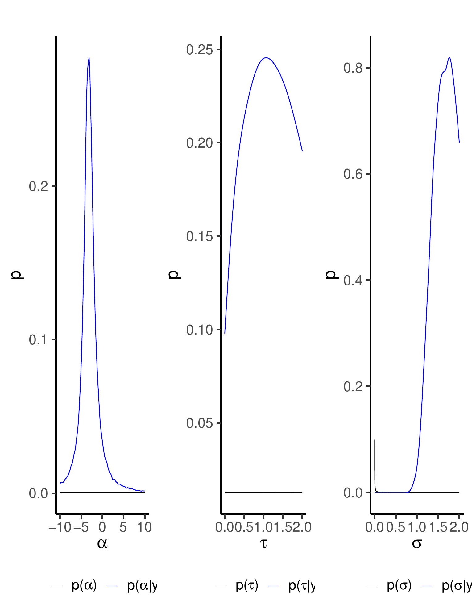
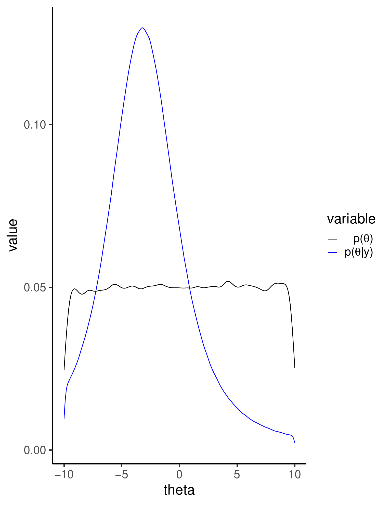
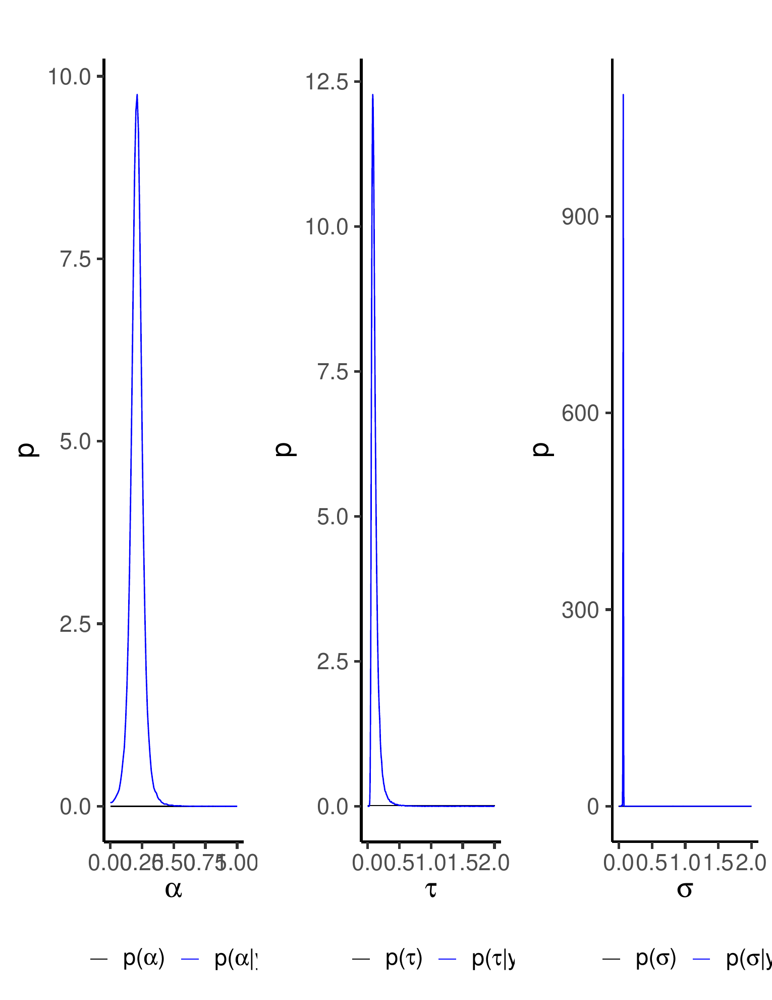
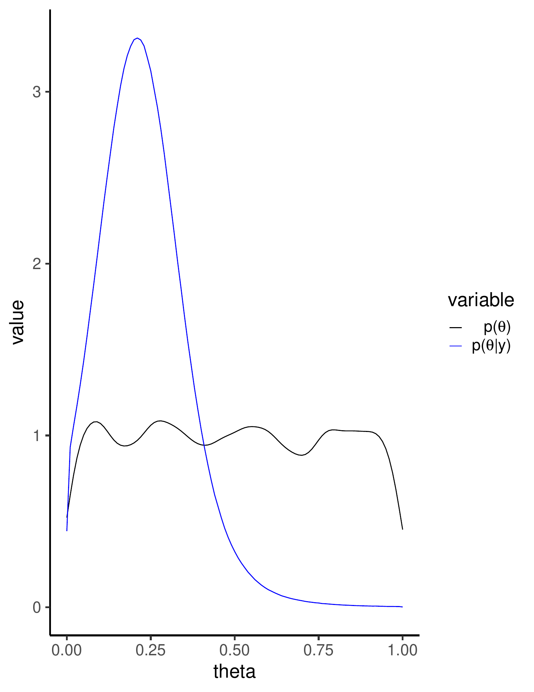
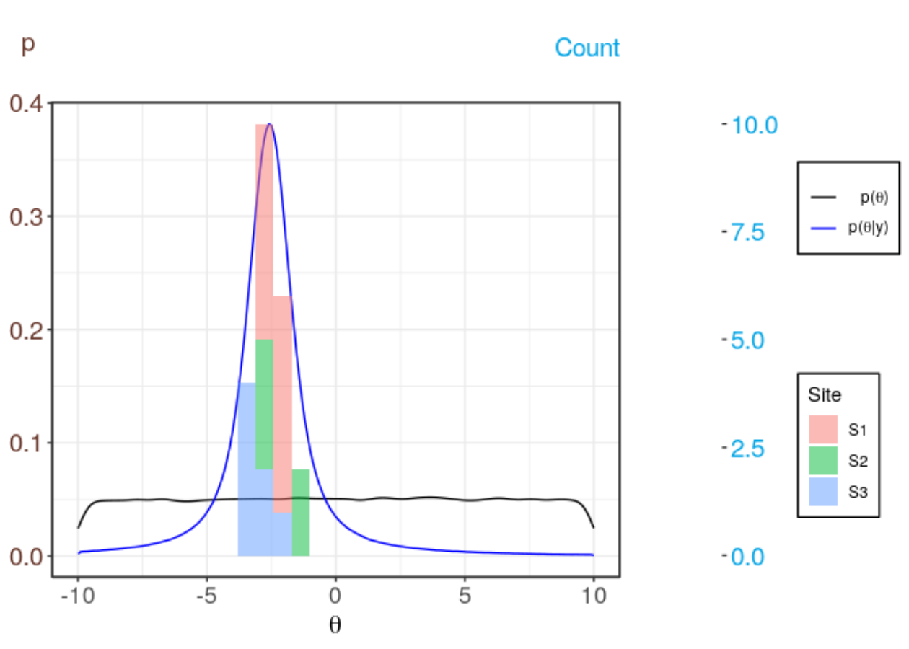
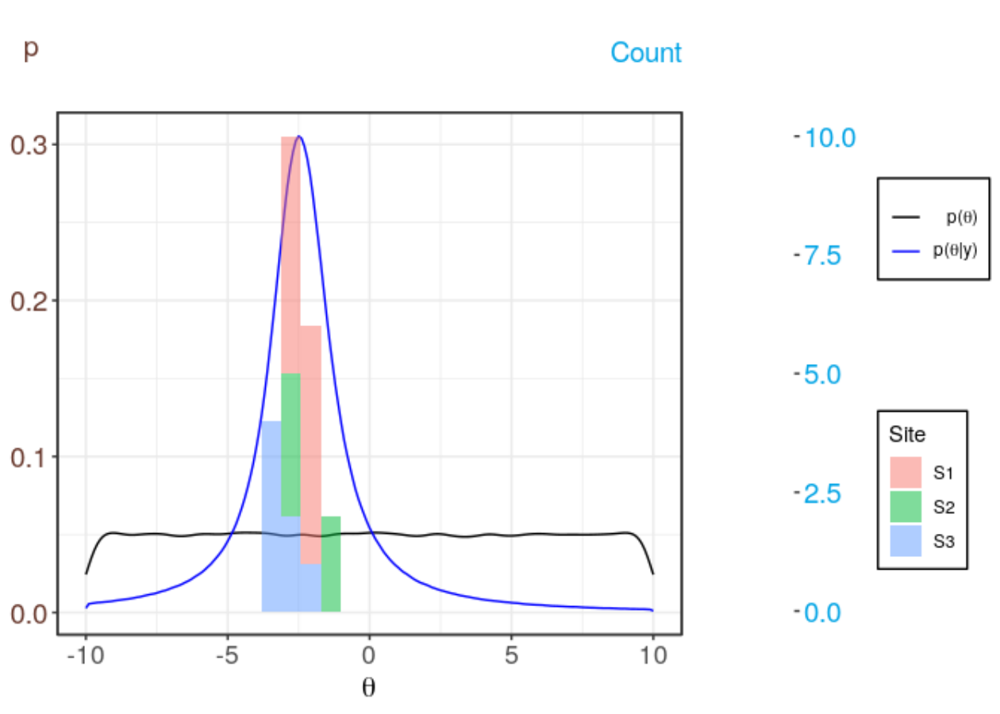
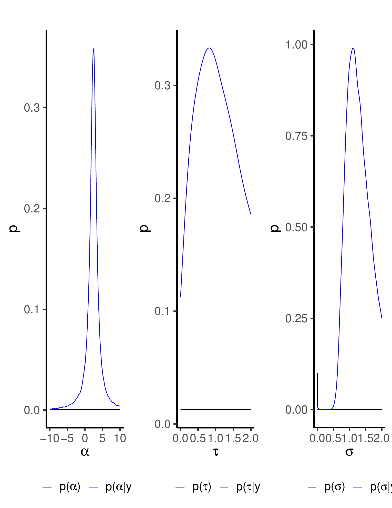
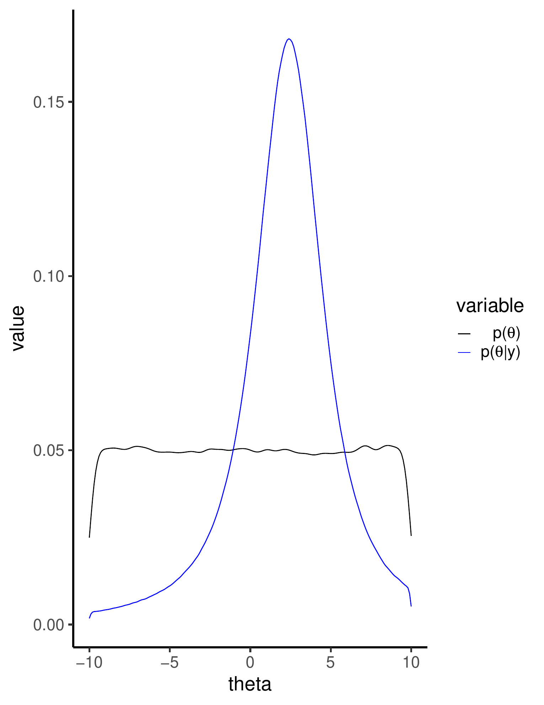

::: article
# Introduction {#sec:Introduction}

Characterizing the subsurface of our planet is an important task in
fields such as geology, hydrogeology, and soil sciences. Yet compared to
many other fields, the characterization of the subsurface is always
burdened by large uncertainties. These uncertainties are caused by the
general lack of data and the large spatial variability of many
subsurface properties. The need to represent this uncertainty has led to
the development of the field of geostatistics, wherein parameter values
are treated as random variables defined by their probability
distribution function (PDF). Today, the field of geostatistics has
reached a mature state with many textbooks on the topic
[@Pyrcz2002; @Rubin2003; @Kitanidis2008] and a solid number of software
tools being available for practitioners (for an overview, see, e.g.
@Rubin2018). For the R language [@R2014], a solid ecosystem for
geostatistical analysis has evolved in the last years [@Slater2019].
Packages like [*geoR*](https://CRAN.R-project.org/package=geoR)
[@Ribeiro2001], [*gstat*](https://CRAN.R-project.org/package=gstat)
[@Pebesma2004], [*georob*](https://CRAN.R-project.org/package=georob)
[@georob], and *RGeostats* [@rgeostats_software] provide a large
collection of tools for geostatistical analysis. Moreover,
geostatistical databases can be conveniently accessed with packages like
[*aqp*](https://CRAN.R-project.org/package=aqp) [@Beaudette2013] and
textbooks on geostatistics are starting to provide all their examples in
R code [@Diggle2007; @Banerjee2014].

Bayesian statistics provides the most appropriate framework to
characterize uncertainty in general [@Hesse2019]. Bayesian methods are
able to combine and assimilate data from disparate sources and jointly
represent the different forms of uncertainty. As a result, Bayesian
methods are nowadays increasingly employed in geostatistics and software
implementations come as either standalone versions
[@Vrugt2009-b; @Rubin2010] or R packages like
[*spBayes*](https://CRAN.R-project.org/package=spBayes) [@Finley2015],
*R-INLA* [@Lindgren2015],
[*spTimer*](https://CRAN.R-project.org/package=spTimer) [@Bakar2015],
[*BayesNSGP*](https://CRAN.R-project.org/package=BayesNSGP)
[@Risser2020], and
[*anchoredDistr*](https://CRAN.R-project.org/package=anchoredDistr)
[@Savoy2017-b].

Yet, there is no package to date, which would provide such tools with
the necessary foundation, i.e. prior distributions for the modeled
quantities. Since the prior is the first step of any Bayesian analysis,
its overall importance can hardly be overstated. Moreover, the ability
of prior distributions to represent available background information in
a given field makes them an important source of information that should
not be neglected. Integrating them into a Bayesian workflow should be
straightforward since most packages for Bayesian inference allow users
to specify their prior distributions. In addition, the use of
informative prior distributions in this field is easy to motivate.
First, the parameters of geostatistical models are typically not simple
convenience parameters but are part of physically-based partial
differential equations. As a result, they correspond to real-world,
physical measurements, making it possible to calibrate their prior
distributions against empirical frequencies. Second, geostatistical
models are usually site specific, making it conceptually easy to
discriminate between the case-specific data, which should be used to
compute the likelihood, and background data, which could be used to
compute the prior distribution. In geostatistics, they are often called
in-situ and ex-situ data, respectively. Calibrating the prior against
ex-situ data only, therefore guarantees a clear separation between
likelihood and prior.

To provide practitioners therefore with a tool for prior derivation,
this paper introduces the R package
[*exPrior*](https://CRAN.R-project.org/package=exPrior)
[@exPrior_zenodo]. It implements the derivation of ex-situ priors, i.e.,
statistical distributions of subsurface properties at a given site from
ex-situ data collected at similar sites, following the Bayesian
hierarchical model developed by @Cucchi2019. The implementation is based
on the [*nimble*](https://CRAN.R-project.org/package=nimble) package
[@Valpine2017] itself based on the BUGS language [@Lunn2009]. The
objective of the [*exPrior*](https://CRAN.R-project.org/package=exPrior)
package is to provide a ready-to-use software tool for assimilating
ex-situ data into ex-situ priors. This will encourage the use of
informative distributions for practitioners in geosciences that might
not be experts in Bayesian hierarchical models and may find it therefore
difficult to work with them otherwise. The focus of this package is on
the Gaussian process (GP) modelling paradigm. Although criticism exists,
it is by far the most widely used paradigm, and a wide range range of
software tools exist for the modeling of GPs [@Pebesma2004]. Functions
in [*exPrior*](https://CRAN.R-project.org/package=exPrior) provide
wrappers around [*nimble*](https://CRAN.R-project.org/package=nimble)
functions implementing the Bayesian data assimilation framework.
Non-expert practitioners can therefore apply this method without needing
to implement the model itself. Moreover, the package is tightly
integrated with two other R packages that help to expand its
functionality. First, the *geostatDB* package [@geostatDB_zenodo]
provides access to a large data set from the worldwide hydrogeological
parameter database (WWHYPDA) [@Comunian2009]. Second, the
*siteSimilarity* package [@siteSimilarity_zenodo] allows for clustering
of similar sites and therefore facilitates a further reduction of
uncertainty.

Due to the background of the authors, the examples and data are drawn
from stochastic hydrogeology, i.e., the field of geostatistics concerned
with the statistical characterization of groundwater systems. Yet, the
presented package is not confined to this field, and simply using other
data or making slight revisions to the hierarchical model will quickly
make the workflow amendable to other fields of geostatistics as well.

To familiarize the reader with the package, we start in the following by
explaining the workflow for formulating informative prior distributions,
where the prior distribution at an unexplored site is based on data
collected from other sites. After that, we explain the package by
detailing its structure and functionalities. Finally, we present several
examples of prior derivation based on synthetic data and on an
established database for hydrogeological parameters [@Comunian2009].

# Ex-Situ Priors

Let us assume that we want to model a specific geostatistical variable
$x$ at a target site $S_0$. Examples would be hydraulic conductivity,
porosity, or permeability. To account for the unavoidable uncertainty,
this variable should be modeled as a random variable $X$
[@Pyrcz2002; @Rubin2003; @Kitanidis2008]. The simplest way to
characterize this variable statistically is through its distribution
$p(x)$. Yet, this would leave out any spatial correlations, so most
geostatistical analyses try to account for them by using spatial random
field models, typically a GP [@Rasmussen2006; @Gelfand2016]. Since such
models are fully defined by their parameter vector $\theta$, the aim of
Bayesian inference is to use available, in-situ data $y_{in}$ and derive
the posterior distribution over these parameters $p(\theta|y_{in})$.
This posterior represents a compromise between likelihood
$p(y_{in}|\theta)$ and the prior distribution $p(\theta)$, with the
likelihood representing the impact of the in-situ data. This, however,
leaves open the specification of the prior distribution.

{#fig:regionalzation
width="100.0%" alt="graphic without alt text"}

By definition, the prior distribution characterizes the knowledge about
target parameters before observing in-situ data $y_{in}$. Therefore,
$y_{in}$ cannot be used for the definition of the prior [@James2006]. On
the other hand, using no data and making the prior distribution as vague
as possible seems far too prudent since this would ignore the wealth of
background knowledge which exists for virtually any geostatistical
variable. Such background knowledge can come from data collected at
other sites $S_i, i \in 1 \dots I$ (see schematic in Figure
[1](#fig:regionalzation)). To distinguish them from the site-specific,
in-situ data $y_{in}$, we use the term ex-situ data $y_{ex}$. Our prior
pdf for the parameters at a new site $S_0$ could therefore be based on
these ex-situ data $p(\theta|y_{ex})$. To determine this
$p(\theta|y_{ex})$, we propose the use of a dedicated statistical model
(more on this below). By virtue of this model, the transfer of
information from known donor sites $S_i$ to a new site $S_0$ is a case
of Bayesian prediction
$$\label{eq:pred}
    p(\theta|y_{ex}) = \int_{\vartheta} p(\theta|\vartheta) p(\vartheta|y_{ex}) d\vartheta.   (\#eq:pred)$$

According to Eq. \@ref(eq:pred), the prior distribution
$p(\theta|y_{ex})$ for a new site $S_0$ is the posterior predictive
distribution of all $S_i$ w.r.t. $S_0$ (see schematic in Figure
[1](#fig:regionalzation)). Mathematically, this means $p(\theta|y_{ex})$
is derived by weighing each single predictive distribution
$p(\theta|\vartheta)$ with its corresponding posterior distribution
$p(\vartheta|y_{ex})$ and marginalizing over the parameters $\vartheta$.
Please note the difference between the model for $X$ at site $S_0$, say
a GP defined by $\theta$, and the model used for the transfer of data
between sites defined by ${\vartheta}$. Since geostatistical data are
hierarchical in nature, this model should be hierarchical too
[@Kruschke2010; @Gelfand2012; @Gelman2013].

## Formulation of the hierarchical model {#ssec:formulation}

In geostatistics, a common way to conceptualize a hierarchical ordering
of the data is by using two levels (see schematic in Figure
[1](#fig:regionalzation)). The first level represents the population of
the (spatially distributed) local data $y_{i,j}$ available on every
given site $S_i$ whereas the second level represents the global
population of all available sites. In such a two-level hierarchical
model, this relationship is represented such that the set of parameters
$\vartheta$ is split up into two subsets $\vartheta = (\phi, \eta)$ for
level 1 and 2 respectively. The hierarchical relationship between these
two levels is represented by factorizing their joint probability through
the definition of conditional probability
$p(\phi, \eta) = p(\phi|\eta) p(\eta)$. The general formulation of the
two-level model would then look like the following:

$$\label{eq:hier_ref_Y}
        y_{i,j} \sim p(y|{\phi_i}),   (\#eq:hier-ref-Y)$$

$$\label{eq:hier_ref_phi}
        {\phi_i} \sim p({\phi}|{\eta}),   (\#eq:hier-ref-phi)$$

$$\label{eq:hier_ref_prior}
        {\eta} \sim p({\eta}).   (\#eq:hier-ref-prior)$$

This means that each datum $y_{i,j}$ is drawn from a distribution with
parameters $\phi_i$, which are specific to site $S_i$ only. This
distribution, therefore, represents the local variability of the data
found within a given site or intra-site variability (Eq.
\@ref(eq:hier-ref-Y)). These local parameters ${\phi_i}$ are, in turn,
drawn from a distribution specified by the global parameters called
*hyperparameters* ${\eta}$. These hyperparameters, therefore, represent
the global variability between sites or inter-site variability (Eq.
\@ref(eq:hier-ref-phi)).

This general formulation allows to flexibly choose parametric models
used for all distributions. Since $p(y|{\phi_i})$ represents the data,
this distribution should fit the empirically observed frequencies of
$y$. Depending on the geostatistical parameter of interest, a user can
use, e.g., the normal, log-normal, multivariate normal, or truncated
normal distributions to model parameter behavior. Choosing the
distributions of the hierarchical model itself, i.e., $p({\phi}|{\eta})$
and $p({\eta})$ is less straightforward and should reflect of mixture of
the domain knowledge and statistical expertise. To exemplify this
procedure, let us look at measurements of hydraulic conductivity. These
data are often modeled with a log-normal distribution [@Hoeksema1985],
while $p({\phi}|{\eta})$ can be modeled as a normal distribution
[@Gelman2013]. The parametric form of $p({\eta})$ should be specified as
vague priors initially, with the posteriors being determined by the data
$y_{ex}$. Transforming our data into their log-normal form, as often
done, the resulting hierarchical model would then be

$$\label{eq:hier_ex}
        y_{i,j} \sim \mathcal{N}(\mu_i, \sigma^2),   (\#eq:hier-ex)$$

$$\mu_i \sim \mathcal{N}(\alpha,\tau),$$

$$(\sigma^2, \alpha, \tau) \sim p(\sigma^2)p(\alpha)p(\tau).$$

In this example, we assumed that the variance $\sigma^2$ at each site is
the same, making the local and global parameters identical. This
assumption is, of course, a simplification but allows to reduce the
number of parameters to be inferred.

## Generation of the ex-situ prior distribution {#ssec:general-structure}

Once the target variable is specified, and the ex-situ data $y_{ex}$
collected, three steps are necessary to actually calculate the prior
distribution. First, the user has to decide on the parametric model for
the distributions and therefore fully specify the hierarchical model
according to Eq. \@ref(eq:hier-ref-Y). Next, the posterior distributions
of the parameters $p({\phi, \eta}|y_{ex})$ are inferred. In
[*exPrior*](https://CRAN.R-project.org/package=exPrior), this is done
using the Markov chain Monte Carlo (MCMC) implementation of *NIMBLE*.
Finally, the ex-situ prior can be determined as the posterior predictive
distribution (see Equation \@ref(eq:pred)).

To familiarize ourselves with this procedure, let us look at these three
steps in more detail.

#### Specifying a hierarchical model {#sssec:implementation}

The specification of the hierarchical model in
[*exPrior*](https://CRAN.R-project.org/package=exPrior) is done in
`BUGS` code wrapped within the *NIMBLE* function `nimbleCode()`. The
results are `R` objects from the `BUGS` models. In *NIMBLE*, every model
is represented as a Directed Acyclic Graph (DAG), where each declaration
in the model is a node which can be either deterministic or stochastic.
Nodes are represented as vertices of a DAG, with edges connecting nodes
implying dependence relationships.

{#fig:model_workflow width="100.0%"
alt="graphic without alt text"}

To exemplify this, let us consider the aforementioned model for the
log-hydraulic conductivity. As mentioned, the data at each site are
modeled as being drawn from a normal distribution with every site having
the same variance $\sigma^2$ but site-specific means. This mean value is
again drawn from a normal distribution. Accordingly, $\alpha$ is the
global mean of the local means, and $\tau^2$ represents the global
variability of the local means. Since no data are used at this point,
the hyperpriors of the hyperparameters $\eta = (\alpha, \tau, \sigma)$
should be non-informative.

The model is therefore declared with five variables: `alpha`, `tau`,
`sigma`, `mu`, and `y`. Once compiled, the model contains multiple
nodes: one node for each hyperparameter `alpha`, `tau`, and `sigma`, `I`
nodes for the site-specific means `mu[i]`, and $\sum_i{J_i}$ nodes for
the site measurements `y[i,j]`. In this model, the dependent nodes are
the ex-situ data $y_{i,j}$, the $\mu_i$ values are estimated from these
deterministic $y_{i,j}$. Similarly, the $\alpha$ and $\tau$ are
estimated from the $\mu_i$. In cases where the data are provided to
`genExPrior()` in the form of moments (more on this later), `mu[i]` is
deterministic, as the site-specific means are already provided in
numeric form and not considered to be realizations from any
distribution. The following pseudocode illustrates how the model is
declared:

``` r
## declaration of a hierarchical model in nimbleCode

# 1. declare prior distributions for hyperparameters
hyperparameters ~ disn(...)

# 2. declare distributions for site-specific means
for i in 1:I {
  mu[i] ~ disn(hyperparam1, hyperparam2, ...) # distribution of mean mu at site i
  
# 3. declare distributions for measurements
  for j in 1:J {
  y[i,j] ~ disn(mu[i], hyperparam3, ...)
  }
}
```

This pseudocode model denotes the mathematical formulation of the
hierarchical model in BUGS code, where the parameter for site-specific
means $\mu_i$ is `mu[i]`, and site-specific variances $\sigma^2_{i}$ is
`sigma2[i]`. First, hyperparameters `alpha` and `tau` are assigned
non-informative hyperpriors. Next, the code loops through each site and
assigns the mean `mu[i]` a distribution whose parameters are
hyperparameters. Finally, each of the `J` measurements `y[i,j]` at each
site `i` is assigned a distribution with parameters `mu[i]` and
hyperparameters.

The flexibility of this formulation allows the data $y_{ex}$ to be
assimilated in a full MCMC hierarchical model, as explained in the next
section.

#### Estimating posterior values of parameters in the hierarchical model

Parameters in the hierarchical model are estimated from the data
provided by the user, using MCMC. Once the model and the variables are
declared, the hierarchical model is compiled using
`nimble::compileNimble()`. The MCMC object is configured, built, and
compiled using `nimble::configureMCMC()`, `nimble::buildMCMC()`, and
`nimble::compileNimble()`, respectively and run using the run method of
the compiled object. This method calculates an MCMC chain, the result of
the estimation step. To improve numerical efficiency, NIMBLE includes a
library of algorithms and a compiler that generates C++ for declared
models and functions. Once a model is declared, `nimbleCode` is
generated as C++ code, compiled, and reloaded into R.

The values in the compiled model are declared with data that are
supplied by the user when running the function. For example, if a user
inputs a data frame of measurements, each of the `y[i,j]` is defined
with its corresponding data point. If a user provides moments, then each
of the `mu[i]` is defined with its provided value. Once a model is
compiled, `genExPrior()` envokes the MCMC sampler, which estimates the
posterior distributions of the parameters.

#### Predicting the prior

Now that the ex-situ data are assimilated, our hierarchical model is
fully conditioned on all available data. Normally, this would conclude a
Bayesian inference. Yet as explained above, the posterior distribution
has to be used to compute the predictive posterior distribution of the
target variable at a new site (see Eq \@ref(eq:pred)). In
[*exPrior*](https://CRAN.R-project.org/package=exPrior), this is simply
done by drawing realizations of the target variable from distributions
specified by the hierarchical model and parameterized by values sampled
from the MCMC chains from the previous step. The final predictive
posterior distribution is then estimated using kernel density
estimation.

# Associated packages

To support the functionality of
[*exPrior*](https://CRAN.R-project.org/package=exPrior), we provide two
additional R packages on the GitHub account. First, the *geostatDB*
package provides real-world data on subsurface measurements, which can
therefore be used directly for the derivation of informed prior
distributions. Second, the *siteSimilarity* package allows users to
determine a cluster of similar sites to focus on the most relevant data
only and therefore reducing the overall uncertainty. Since both these
packages provide benefits independently of
[*exPrior*](https://CRAN.R-project.org/package=exPrior), they will
remain independent for the foreseeable future.

## Real-world data: The *geostatDB* package

In this package, we provide real-world, geostatistical data from the
WorldWide HYdrogeological Parameters DAtabase *WWHYPDA* [@Comunian2009].
This database has been designed to store values of the most important
properties of earth materials and has been developed with the purpose of
offering a complement of information in hydrogeological studies where
there is a lack of data. To the best of the authors' knowledge, the
WWHYPDA is the largest open-source database of hydrogeological
parameters. Currently it contains a total of 20,523 subsurface
measurements of 6 geostatistical parameters spanning 128 sites. A
complete description and schematic of the database in its original form
can be found in @Comunian2009.

Due to its size, as well as to facilitate further additions to the
database, we use a dedicated R package *geostatDB* to host the data from
WWHYPDA. This package is not yet on CRAN, but the latest release version
can be found on <https://github.com/GeoStat-Bayesian/geostatDB>
[@geostatDB_zenodo]. To exemplify the usage and impact of real-world
data, we furnished
[*exPrior*](https://CRAN.R-project.org/package=exPrior) with an example
data set on porosity values from sandy aquifers. Its usage is described
in Section [4.2](#ssec:using-exPrior) below.

*geostatDB* itself includes the WWHYPDA as an SQLite database, converted
from the online MySQL database. The reasons for using SQLite are
efficiency and accessibility. First, both SQL and SQLite databases can
be easily read into `R`, while maintaining their original structure.
SQLite specifically can be included in R packages without the need for a
server, making it accessible to the user. A downside of this decision is
that a user who updates the SQLite database in *geostatDB* does so
without making changes to the original database, hosted on
<https://www.wwwhypda.org>. Thus, those who wish to contribute to the
WWHYPDA are currently encouraged to do so by submitting data online.

{#fig:wwhypda width="100%"
alt="graphic without alt text"}

It is important to note that data quality steps need to be implemented
before applying the statistical algorithm to this database.

Figure [3](#fig:wwhypda) contains two visualizations that describe the
data present in the WWHYPDA, created in `R`. This visualization was done
using the function `getData()` from the *geostatDB* package. The code
can be found in the associated vignette of the package at
<https://github.com/GeoStat-Bayesian/geostatDB/blob/master/vignettes/explore_data.Rmd>.

## The notion of site similarity: The *siteSimilarity* package

In order to reduce the uncertainty in the prior distribution as much as
possible, it is beneficial to focus only on data coming from sites which
are similar to the one under investigation. It is therefore crucial to
have a sound notion of site similarity. The *siteSimilarity* package
uses hierarchical agglomerative clustering to categorize sites into
clusters based on observable characteristics, such as environment type
or rock type. Using the schematic in Figure [1](#fig:regionalzation),
only those sites similar to site $S_0$ would be used as donor sites.
Currently, the clustering achieves only a modest reduction in
uncertainty when using a leave-one-out validation. This is caused by the
overall limited number of sites, which, after clustering, get even more
reduced. Yet the algorithm already provides the user with a tangible
benefit, which is projected to increase as more and larger data sets
with more sites become available.

# Examples

Having now formally explained the workflow and associated packages of
[*exPrior*](https://CRAN.R-project.org/package=exPrior), we will
illustrate said workflow with a series of examples. Starting with an
easy inference problem, we will then explain how to use the included
data, how to account for autocorrelation, and finally how to use soft
data, in particular bounds, for the inference.

Please note that all examples given in the following only refer to the
distribution of the expected quantity itself, e.g., porosity. This does,
however, not mean that the parameters of a GP cannot be inferred since
$\mu$ and $\sigma$ are nodes in the hierarchical model and can be
derived from it. On the other hand, higher-order statistics, like
correlation length or anisotropy, are usually considered homogeneous
across a given site and are consequentially not hierarchical. They can,
therefore, be inferred using the classical estimation procedure.

The following four examples correspond to four vignettes, which can be
found on the GitHub account of the *exPrior* package at
<https://github.com/GeoStat-Bayesian/exPrior/blob/master/vignettes>.

. A user first
expresses ex-situ data as an R dataframe. The user then determines the
range of values at which to compute a prior (usually the minimum and
maximum values of a parameter). Finally, the user uses `genExPrior()` to
compute the ex-situ prior for a target site. The user has the options of
using built-in plotting functions to visualize
results.](img/package_workflow.png){#fig:package_workflow width="100.0%"
alt="graphic without alt text"}

The general workflow, which is followed in all of these examples, is
visualized in Figure [4](#fig:package_workflow). First, a user has to
represent the ex-situ data in the form of an `R dataframe` object. These
data can be manually entered, like explained in Section
[4.1](#ssec:quick-example), taken from the included data, like explained
in Section [4.2](#ssec:using-exPrior), or being supplied though some
additional database. Next, the user would enter as an `R vector` object
a range of values at which to estimate the prior distribution. This
range is typically the minimum and maximum values of the parameter of
interest (for example, porosity takes values between 0 and 1). Finally,
the user would input the ex-situ data and specified range into the
function `genExPrior()`, which outputs a prior and the distributions of
hyperparameters of the model. The user has the options of using built-in
plotting functions to visualize results.

## Example 1: Using [*exPrior*](https://CRAN.R-project.org/package=exPrior) with synthetic data {#ssec:quick-example}

To familiarize the reader with this general workflow, let us start with
a simple example using only a few synthetic data (on a log 10 scale)
from three arbitrarily labeled sites $S_1$, $S_2$, and $S_3$. The source
code for the corresponding vignette can be found at
<https://github.com/GeoStat-Bayesian/exPrior/blob/master/vignettes/using_genExPrior.Rmd>.
The goal is to derive the ex-situ prior for target site $S_0$ with the
following code:

``` r
> exdata <- data.frame(val = c(c(-2,-3,-4), c(-2,-1), c(-6,-7,-2,-3)), 
+                      site_id = c(rep('S1',3), rep('S2',2), rep('S3',4))) 
> ex_prior <- genExPrior(exdata = exdata, theta = seq(from=-10, to=10, by=0.1)) 
```

By following the above workflow, we started with generating an
`R dataframe` `exdata` for the ex-situ data. Then, we entered the range
over which to estimate the variable $\theta$ as an `R vector` `theta`.
The actual computation of the ex-situ prior is finally performed by the
function `genExPrior()`. To investigate the output of this function,
[*exPrior*](https://CRAN.R-project.org/package=exPrior) provides a
number of plotting functions.

``` r
> plotHyperDist(ex_prior) 
> plotExPrior(ex_prior) 
```

<figure id="fig:quick_example_prior">
<p></p>
<figcaption>Figure 5: The left panel shows the distributions of the
hyperparameters <code>alpha</code>, <code>tau</code>, and
<code>sigma</code>. The right panel shows ex-situ prior computed using
the data assimilation framework (blue curve) against the uninformative
prior (black curve).</figcaption>
</figure>

In this little example, the first command `plotHyperDist` plots the
posterior distributions of the hyperparameters $\alpha$, $\tau$, and
$\sigma$ (see Figure [5](#fig:quick_example_prior) left panel). This
captures the impact of the data on the Bayesian hierarchical model. The
second command `plotExPrior` shows the ex-situ data from the three sites
jointly with the predicted prior distribution for the new site $S_0$
(see Figure [5](#fig:quick_example_prior) right panel). As can be seen,
the essentially flat, uninformative prior got updated into a much
sharper, informative prior representing a much-reduced uncertainty.

## Example 2: Using [*exPrior*](https://CRAN.R-project.org/package=exPrior) with real-world data {#ssec:using-exPrior}

As introduced above,
[*exPrior*](https://CRAN.R-project.org/package=exPrior) provides
real-world, geostatistical data from the WWHYPDA. Let us exemplify its
use and impact on the inference by first importing the data on porosity.
As above, the associated vignette can be found at
<https://github.com/GeoStat-Bayesian/exPrior/blob/master/vignettes/real_world_data.Rmd>.

``` r
> load(file="data/df_porosity.rda")
```

These real-world data are now loaded into the workspace and can be used
to compute the ex-situ prior using the 'exPrior' function as describe in
above example

``` r
> resExPrior = genExPrior(exdata = df_porosity, theta = seq(from=0, to=1, by=0.01))
```

Here, the range of the `theta` vector reflects the common-sense
intuition that porosity values can only exist between 0 and 1. This
change should also be reflected in the used model

$$\label{eq:wwhypda_a}
        y_{i,j} \sim \Phi(\mu_i, \sigma^2, 0, 1),   (\#eq:wwhypda-a)$$

$$\mu_i \sim \mathcal{N}(\alpha,\tau),$$

$$(\sigma^2, \alpha, \tau) \sim p(\sigma^2)p(\alpha)p(\tau).$$

Equation (\@ref(eq:wwhypda-a)) makes this change clear, such that the
data are drawn from a truncated normal distribution. Since the
boundaries are fixed, the hierarchical model itself still has the same
number of parameters, and the other parts of the model remain the same.

After the completion of `exPrior`, we can visualize again the posteriors
of the model as well as the prior of $\theta$ using `plotExPrior`.

``` r
> plotHyperDist(resExPrior)
> plotExPrior(resExPrior)
```

<figure id="fig:wwhypda_exprior">
<p></p>
<figcaption>Figure 6: Informative (blue) and non-informative (black)
priors computed with <code>genExPrior()</code> using real-world, ex-situ
data of porosity in sand stone.</figcaption>
</figure>

Compared to Figure [5](#fig:quick_example_prior), the results in Figure
[6](#fig:wwhypda_exprior) show some relevant differences. In particular,
the hyperpriors seen in the left panel of Figure
[6](#fig:wwhypda_exprior) are much more peaked, resulting in
near-certainty about their value. This is due to the large amount of
evidence provided by the data. Since the parameter distributions on the
higher levels in a hierarchical model represent the uncertainty about
the parameters on the lower ones, it can be said that the results of
this inference capture the uncertainty of porosity in sandstone with
high certainty. This means that the prior distribution in the right
panel of Figure [6](#fig:wwhypda_exprior) is very close to the
statistical uncertainty for the hypothetical population of all porosity
values in sandstone aquifers in general. As can be seen in this figure,
this distribution is strongly peaked between 0.2 and 0.3. Using this
prior therefore provides a practitioner with a sound foundation for the
geostatistical inference of the in-situ porosity.

## Example 3: Accounting for spatial autocorrelation in ex-situ data {#sec:example-spatial}

In most cases, ex-situ data used in the analysis are spatially
correlated since measurements are usually collected in a clustered way
[@Rubin2003; @Pyrcz2002]. The data assimilation model outlined in
[2.1](#ssec:formulation) can, in principle, account for patterns of
spatial variability by using multivariate distributions as site-specific
distributions. As above, the associated vignette can be found at
<https://github.com/GeoStat-Bayesian/exPrior/blob/master/vignettes/spatial_correlation.Rmd>.
To account for this spatial correlation, let us use a revised version of
the hierarchical model from Equation (\@ref(eq:hier-ex))

$$\label{eq:y_ij_MVN}
        y_{i,j} \sim \mathcal{N}(\mu_i,\Sigma),   (\#eq:y-ij-MVN)$$

$$\label{eq:mu_i_N}
        \mu_i \sim \mathcal{N}(\alpha,\tau),   (\#eq:mu-i-N)$$

$$\label{eq:Sigma}
        \Sigma = \sigma^2 \exp\bigg( -\frac{h}{\lambda}\bigg),   (\#eq:Sigma)$$

$$\label{eq:variogram_function}
         (\sigma^2, \lambda, \alpha, \tau) \sim p(\sigma^2)p(\lambda)p(\alpha)p(\tau).   (\#eq:variogram-function)$$

The relevant adjustment can be seen in Equation (\@ref(eq:y-ij-MVN)),
where the data are no longer modeled to be drawn from a univariate
normal distribution but a multivariate distribution instead. The main
difference is the replacement of the variance $\sigma^2$ by the
covariance $\Sigma$. In our example, this covariance is modeled as an
isotropic exponentially decaying function, with a characteristic length
scale $\lambda$. This function means that measurements being taken at
large distances $h$ are essentially independent, and no relevant
difference to the simple univariate model from Equation
(\@ref(eq:hier-ex)) would exist. However, measurements taken at
distances $h$ similar or smaller to $\lambda$ exhibit substantial
correlation and must be assimilated accordingly. Failing to do so would
result in an underestimation of the actual uncertainty, a phenomenon
which is known in the literature as pseudoreplication
[@Hurlbert1984; @Legendre1993]. Due to the additional parameter, the
model has now 4 hyperparameters, which need to be inferred.

To exemplify the workflow with this revised hierarchical model, let us
use synthetic data coming again from three different sites only. To
generate data with spatial correlation, we used the
[*gstat*](https://CRAN.R-project.org/package=gstat) package. These
synthetic data were then transformed to have different mean values for
each site.

``` r
> set.seed(1)
> xy <- data.frame("x" = sample(seq(0.00,1.00,0.01),22),
+                  "y" = sample(seq(0.00,1.00,0.01),22))
> model = vgm(psill=1, range=1, model='Exp')
> g.dummy <- gstat(formula=z~1, locations=~x+y, dummy=TRUE, beta=1, model=model, nmax=20)
> exdata_spatial <- predict(g.dummy, newdata=xy, nsim=1)
```

To adapt this data frame from
[*gstat*](https://CRAN.R-project.org/package=gstat) to the format needed
for [*exPrior*](https://CRAN.R-project.org/package=exPrior), we have to
change one of the column names and add the site's id.

``` r
> colnames(exdata_spatial)[3] <- "val"
> exdata_spatial\$site_id = c(rep("S1", 10), rep("S2", 5), rep("S3", 7))
> exdata_spatial[ 1:10, 'val'] <- exdata_spatial[ 1:10, 'val'] - 3
> exdata_spatial[11:15, 'val'] <- exdata_spatial[11:15, 'val'] - 2.5
> exdata_spatial[16:22, 'val'] <- exdata_spatial[16:22, 'val'] - 3.5
```

With these data, we can now generate the ex-situ prior distribution. To
tell [*exPrior*](https://CRAN.R-project.org/package=exPrior) to account
for the spatial correlation in the data, we have to toggle the
`spatialCoordinates` flag in the `genExPrior()` function to `TRUE`.

``` r
> resExPrior = genExPrior(exdata = exdata, theta = seq(from=-10, to=10, by=0.1), 
+                         spatialCoordinates = TRUE)
> plotExPrior(resExPrior, plotExData = TRUE)
```

<figure id="fig:spatial_priors">
<p></p>
<figcaption>Figure 7: Informative (blue) and non-informative (black)
priors computed with <code>genExPrior()</code>. The left panel shows the
prior without accounting for spatial correlation, whereas the right
panel shows the prior accounting for spatial correlation (right panel).
The colored bars represent the ex-situ data from the three different
sites.</figcaption>
</figure>

To compare the effects of accounting for spatial correlation, we provide
plots of the ex-situ prior with `spatialCoordinates` being both set to
`FALSE` and `TRUE` (see the left and right panel in Figure
[7](#fig:spatial_priors), respectively). As can be seen, both priors
look overall similar in shape. The main difference is that the latter
shows a somewhat increased uncertainty, i.e., a wider variance, which
can be seen by the increased mode of the distribution. The fact that the
more realistic model produces more uncertain results may seem
counterintuitive at first. However, the aim of statistical inference is
not to reduce the uncertainty as much as possible but to correctly
capture the uncertainty in the used data and the model. As mentioned
above, this problem of not accounting for possible correlations between
measurements is called pseudoreplication and can have serious
consequences by leading to overconfident statistical analyses.

## Example 4: Assimilating Multiple Data Types {#sec:multiple_data_types}

As mentioned above,
[*exPrior*](https://CRAN.R-project.org/package=exPrior) is written in a
flexible manner, such that it can assimilate data that come in the form
of measurements, bounds, or moments (see schematic in Figure
[2](#fig:model_workflow)). To exemplify this flexibility, let us use in
this example synthetic data from three sites labeled S1, S2, and S3.
From Site S1, we have data in the form of bounds, where the minimum
value of a hydrogeological property of S1 is 2, and its maximum value is
4. Site S2 has data in the form of moments, where the first moment, or
site mean, is 2, while the second moment, or site variance, is 0.1.
Finally, site S3 has three measurements. Again, the associated vignette
can be found at
<https://github.com/GeoStat-Bayesian/exPrior/blob/master/vignettes/multi_type_data.Rmd>.
The code below shows how to format the data in `R` such that it can be
read into `genExPrior()`.

``` r
> exdata_S1 <- data.frame(val=c(2,4), site_id=rep('S1',2), 
+                         type=c('bound.min','bound.max'))
> exdata_S2 <- data.frame(val=c(2,0.1), site_id=rep('S2',2), 
+                         type=c('moment.1','moment.2'))
> exdata_S3 <- data.frame(val=c(2,3,4), site_id=rep('S3',3), 
+                         type=c('meas','meas','meas'))
> exdata <- rbind(exdata_S1, exdata_S2, exdata_S3)
```

As in previous examples, the data frame `exdata_multitype` as well as
the vector `theta` can be input directly into `genExPrior()` as such

``` r
> resExPrior <- genExPrior(exdata = exdata, theta = seq(from=-10, to=10, by=0.1))
```

Finally, we can visualize the results `resExPrior` again using the
`plotHyperDist` and `plotExPrior` functions.

``` r
> plotHyperDist(resExPrior)
> plotExPrior(resExPrior)
```

<figure id="fig:exdata_multiple_prior">
<p></p>
<figcaption>Figure 8: The left panel shows the distributions of the
hyperparameters <code>alpha</code>, <code>tau</code>, and
<code>sigma</code>. The right panel shows ex-situ data from three
synthetic sites <span class="math inline"><em>S</em><sub>1</sub></span>,
<span class="math inline"><em>S</em><sub>2</sub></span>, and <span
class="math inline"><em>S</em><sub>3</sub></span>. The blue curve is the
ex-situ prior computed using the data assimilation framework, while the
black curve is the uninformative prior.</figcaption>
</figure>

The resulting hyperparameters and ex-situ prior distributions look very
similar to the simple example from Section [4.1](#ssec:quick-example)
(compare Figure [5](#fig:quick_example_prior) to Figure
[8](#fig:exdata_multiple_prior)). This comparison shows that data in the
form of bounds and moments can have a similar impact on the inference
and how they can be assimilated by `exPrior`.

# Summary

In this paper, we have introduced the `R` package
[*exPrior*](https://CRAN.R-project.org/package=exPrior), which contains
methods for assimilating ex-situ data to generate prior probabilities
for geostatistical parameters. We explain the formulation of a prior
distribution as a Bayesian Hierarchical Model (Section
[2.1](#ssec:formulation)) and its implementation using *NIMBLE*, an `R`
package created for efficient hierarchical modeling. We illustrate the
model through a number of examples where
[*exPrior*](https://CRAN.R-project.org/package=exPrior) can be used,
including univariate and multivariate models (Section
[4.3](#sec:example-spatial)), as well as the assimilation of multiple
data types ([4.4](#sec:multiple_data_types)). The package also contains
data from the WWHYPDA, an open-source, hydrogeological database that
provides valuable information for hydrogeological modeling. The goal of
this package is to provide methods to facilitate geostatistical
modeling, as well as to encourage the open-source and open-data
movements between scientists.

# Acknowledgements

This work has been partly funded by the German Research Foundation (DFG)
under grant HE 7028/2-1, \"What we talk about when we talk about
uncertainty.\" Any opinions, findings and conclusions or recommendations
expressed in this material are those of the authors and do not
necessarily reflect the views of the DFG.
:::
