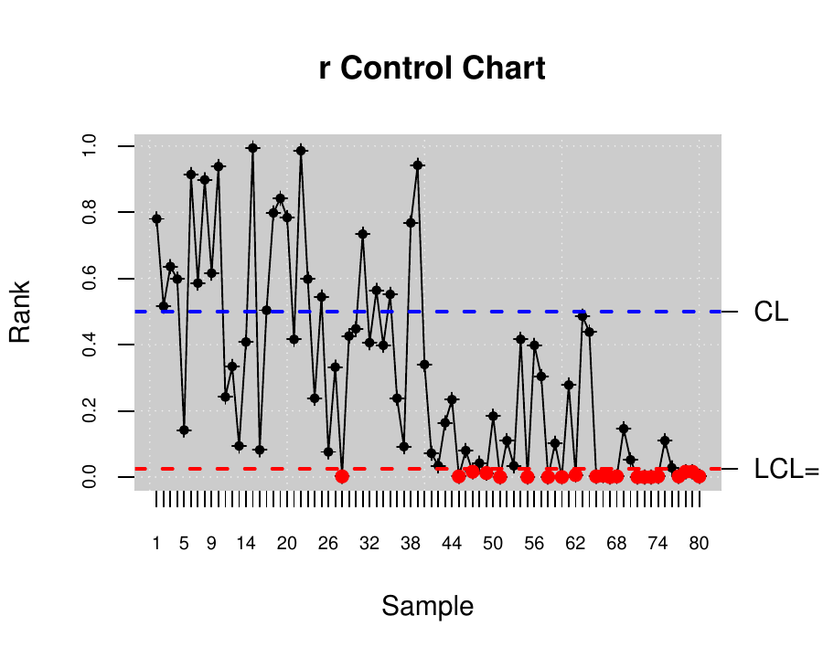
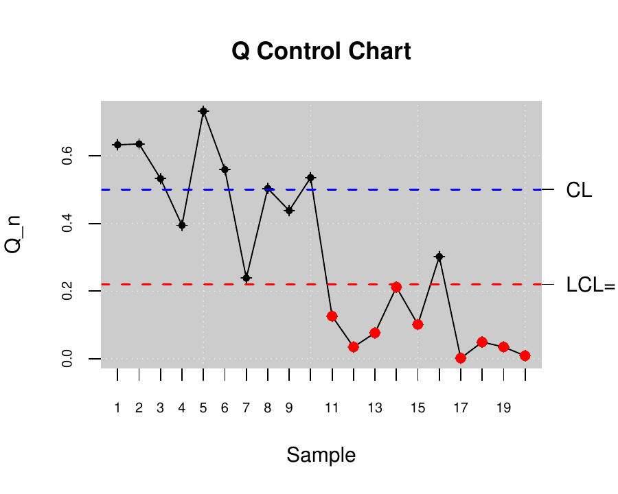
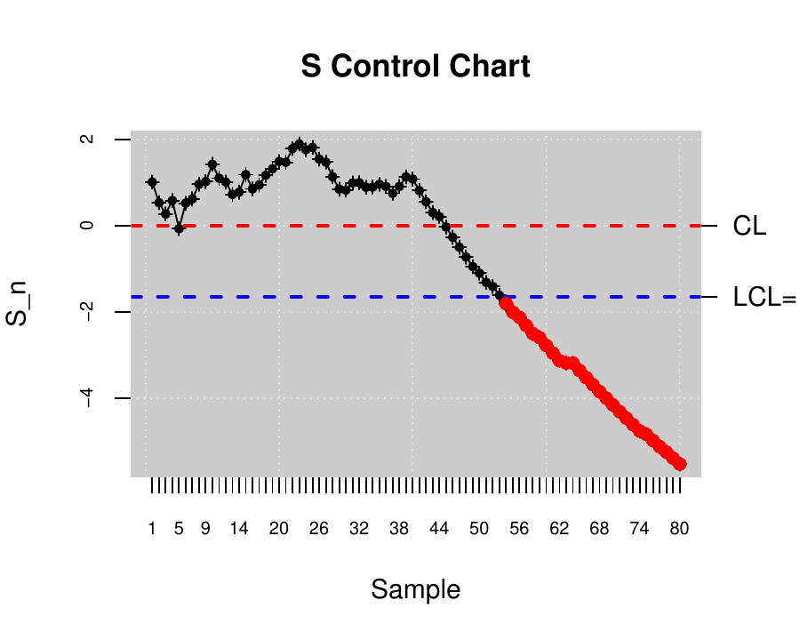

::: article
# Introduction {#sec:intro}

Throughout the last decades, there has been an increasing interest to
measure, improve, and control the quality of products, services, and
procedures. This is connected to the strong relationship between
quality, productivity, prestige, trust, and brand image. In fact,
implementing procedures of statistical quality control (SQC) is
currently related to increasing companies' competitiveness.\
The concept of quality control has been extended from the first
definitions based on the idea of adjusting production to a standard
model to satisfy customer requirements and include all participants.
Nowadays, SQC is not only applied to manufactured products but to all
industrial and service processes.

{#DMAIC width="100%"
alt="graphic without alt text"}

The use of different SQC techniques was standardized With the
development of the Six Sigma method by Motorola in 1997 [@pande2000six].
Six Sigma is a methodology or even philosophy focused on variability
reduction that promotes the use of statistical methods and tools in
order to improve processes in industry and services. The Six Sigma
application is composed of five stages: Define, Measure, Analyze,
Improve, and Control (DEMAIC). Figure [1](#DMAIC) shows some
representative statistical techniques applied in each of the Six Sigma
stages. The two most representative statistical tools of SQC are the
control charts and the process capability analysis
[@montgomery2009introduction]. Therefore, the proposed
[*qcr*](https://CRAN.R-project.org/package=qcr) package has been
developed in order to provide users a comprehensive and free set of
programming tools to apply control charts and perform capability
analysis in the SQC framework.\
The control stage is characterized by the use of tools based on anomaly
detection and correction [@montgomery2009introduction]. The most
representative techniques of this stage and the primary tool of the
Statistical Process Control (SPC) are the control charts
[@champ1987exact]. They have been developed to evaluate the process
performance and at any time. The use of control charts prevents the
process from getting out of control, and helping to detect the
assignable causes corresponding to variations of the critical-to-quality
features (CTQs), thus performing process changes when actually required.
Furthermore, control charts provide estimates of the natural range of
process variation (natural control limits), allowing us to compare this
range with those limits specified by standards, company managers, or
customers (specification limits). Hence, the process monitoring can be
carried out by comparing each new observation with these natural limits,
preventing defects in the final product. Briefly, a control chart is a
two-dimensional graph whose axis represents the variable or attribute
that is being monitored (CTQ variables). The estimation of natural
control limits of the CTQ variables is developed by a process composed
of two phases: In Phase I, the natural control limits are estimated
using a preliminary sample (calibration sample) where we assume that the
causes of variation are only random. In Phase II, each new observation
is plotted on the control chart along with the natural limits obtained
in the previous step. The set of new observations (twhich are not used
to calculate the natural control limits) make up the so-called
monitoring sample. Patterns, observations of out of control limits, runs
of more than six observations on one side of the central line, among
others, are some of the different criteria to identify out of control
states in a specific process, providing also valuable information about
the detection of any assignable causes of variation in the monitoring.\


package.](graficos2.png){#types width="100%"
alt="graphic without alt text"}

The most used control charts are based on the assumptions of normality
and independence of the studied CTQ variables. These charts are used to
control the position and dispersion of CTQ attributes and variables.
Figure [2](#types) shows some of the most important types of control
charts. These can be classified according to the type of feature that is
being controlled (attribute or variable), the variable dimension
(univariate or multivariate), and assuming or not a parametric
distribution of the variable (parametric or nonparametric). The
[*qcr*](https://CRAN.R-project.org/package=qcr) package provides charts
for the mean ($\bar{x}$), standard deviation ($s$), range ($R$),
individual measurements ($I$), moving ranges ($MR$), proportion of
nonconforming units ($p$), number of nonconforming units ($np$), number
of defects per unit ($c$), mean number of defects per control unit
($u$), exponentially weighted moving average (EWMA), and cumulative sum
control chart (CUSUM). The last two techniques are also called memory
control charts, and they are specially designed to detect shifts of less
than two standard deviations, both when using rational samples or
individual measurements. On the other hand, new control charts based on
the concept of data depth and developed by [@liu1995control] are
implemented in [*qcr*](https://CRAN.R-project.org/package=qcr). Those
are the $r$, $Q$, and $S$ control charts, the nonparametric alternatives
for individual measurements, mean control chart, and CUSUM control
chart, respectively. When more than one variable defines the process
quality, multivariate control charts are applied. If the Gaussian
assumption is met, the Hotelling T$^2$ control chart can be applied. If
we want to detect small deviations, multivariate EWMA (MEWMA) and
multivariate CUSUM (MCUSUM) can be implemented. When no parametric
distribution is assumed, $r$, $Q$, and $S$ charts can be used.\
Another interesting SQC tool, which is very useful in the industry, is
the Process Capability Analysis (PCA). It estimates how well a process
meets the tolerances defined by the company, customers, standards, etc.,
by comparing the specification tolerances with respect to the natural
range of variation of CTQ features. The capability of the process is
measured using capability indicators. Process Capability Ratio (PCR) is
a numerical score that helps the manufacturers know whether the output
of a process meets the engineering specifications. Large PCR values show
that the industrial or service process is capable of meeting the
customer requirements. There have been many different PCRs developed in
the last four decades that require the Gaussian assumption for the CTQ
variable [@boyles1991taguchi]. However, many processes in industry and
real applications do not meet this hypothesis. Thus, we could
innacuratelly estimate the capability using PCR. Hence, many authors
have studied different nonparametric alternatives to traditional PCR
[@polansky2007process].\
The [*qcr*](https://CRAN.R-project.org/package=qcr) package has been
developed in R [@R] under the GNU license. Nowadays, there are other R
packages that currently provide quality control tools for users. The use
of each one is shown in Figure [3](#packages).\
The [*qcc*](https://CRAN.R-project.org/package=qcc) package
[@scrucca2004qcc] was developed by Professor Luca Scrucca of the
Department of Economics, Finance, and Statistics at the University of
Perugia. It enables us to perform Shewhart quality control charts for
variables and attributes, as well as the CUSUM and EWMA charts for
detecting small changes in the CTQ variable. Multivariate analysis is
performed applying the Hotelling T$^2$ control chart. Additionally, it
has functions implemented to obtain the operating characteristic curves
(OC) and to estimate process capability analysis indices. Pareto and
Ishikawa diagrams are also implemented. Otherwise, the
[*IQCC*](https://CRAN.R-project.org/package=IQCC) package
[@recchia2010iqcc] is maintained by Professor Emanuel P. Barbosa of the
Institute of Mathematics in the State University of Campinas. It has a
smaller number of control charts implemented, but it incorporates
multivariate graphics. The *qualityTools* package
[@roth2012qualitytools] was developed to aid learning in quality
sciences. Figure [3](#packages) shows some of its utilities, e.g.,
capability analysis (providing a comprehensive set of parametric
distributions) and design of experiments. In addition, the
[*SixSigma*](https://CRAN.R-project.org/package=SixSigma) library
[@cano2017sixsigma; @cano2017sixsigma2] provides alternative functions
to *qualityTools* and [*qcc*](https://CRAN.R-project.org/package=qcc)
packages and the possibility of implementing process maps.\


package.](packages.png){#packages width="100%"
alt="graphic without alt text"}

Furthermore, there are other libraries specifically focused on control
chart applications. Namely, the
[*spcadjust*](https://CRAN.R-project.org/package=spcadjust) [@spcadjust]
that allows us to estimate the calibration control limits of Shewhart,
CUSUM, and EWMA control charts, and the
[*spc*](https://CRAN.R-project.org/package=spc) [@spc] which provides
tools for the evaluation of EWMA, CUSUM, and Shiryaev-Roberts control
charts by using Average Run Length and RL quantiles criteria. Moreover,
the [*MSQC*](https://CRAN.R-project.org/package=MSQC) package
[@santos2016package] is a set of tools for multivariate process control,
mainly control charts. It contains the main alternatives for
multivariate control charts such as Hotelling (T$^2$), Chi-squared,
MEWMA, MCUSUM, and Generalized Variance control charts. It also includes
some tools to evaluate the multivariate normal assumption. The
corresponding multivariate capability analysis can be performed using
the [*MPCI*](https://CRAN.R-project.org/package=MPCI) library [@MPCI]
that provides different multivariate capability indices. It is also
interesting to mention the
[*edcc*](https://CRAN.R-project.org/package=edcc) package [@edcc] for
its economic design of control charts by minimizing the expected cost
per hour of the studied process.

It is important to emphasize that the
[*qcr*](https://CRAN.R-project.org/package=qcr) package also includes
new applications such as nonparametric approaches of control charts and
capability indices (also covering the capability plots), which are
currently unavailable in the R software.

# Datasets in the qcr package {#sec:datsets}

The [*qcr*](https://CRAN.R-project.org/package=qcr) package contains new
databases (see table [1](#datasets)) based on study cases tackled by the
authors during their professional activity as well as well-known
datasets implemented on other packages focused on statistical quality
control such as:

-   **archery1:** It consists of a stage in which the archer shoots 72
    arrows. The information is given in x and y coordinates. It is
    implemented in the [*MSQC*](https://CRAN.R-project.org/package=MSQC)
    package (@santos2016package).
-   **circuit:** Number of nonconformities observed in 26 successive
    samples of 100 printed circuit boards. It is implemented in the
    [*qcc*](https://CRAN.R-project.org/package=qcc) package
    (@scrucca2004qcc).
-   **dowel1:** Diameter and length of a dowel pin. It is implemented in
    the [*MSQC*](https://CRAN.R-project.org/package=MSQC) package
    (@santos2016package).
-   **orangejuice:** Frozen concentrated orange juice is packed in 6-oz
    cartons. These cartons are formed on a machine by spinning them from
    a cardboard stock and attaching a metal bottom panel. A can is then
    inspected to determine whether, when filled, the liquid could
    possibly leak either on the side seam or around the bottom joint. If
    this occurs, a can is considered nonconforming. The data were
    collected as 30 samples of 50 cans each at half-hour intervals over
    a three-shift period in which the machine was in continuous
    operation. It is implemented in the
    [*qcc*](https://CRAN.R-project.org/package=qcc) package
    (@scrucca2004qcc).
-   **pcmanufact:** A personal computer manufacturer counts the number
    of nonconformities per unit on the final assembly line. He collects
    data on 20 samples of 5 computers each. It is implemented in the
    [*qcc*](https://CRAN.R-project.org/package=qcc) package
    (@scrucca2004qcc).
-   **pistonrings:** Piston rings for an automotive engine are produced
    by a forging process. The inside diameter of the rings manufactured
    by the process is measured on 25 samples, each of size 5, drawn from
    a process being considered 'in control'. It is implemented in the
    [*qcc*](https://CRAN.R-project.org/package=qcc) package
    (@scrucca2004qcc).

::: {#datasets}
  -----------------------------------------------------------------------------------------------------------------------------------------------------------------------------------------------------------------------------------------------------------------------------------------------------------------------------------------------------------------------------------------------------------------------------------------------------------------------------------------------------------------------------------------------------------------
  **Name**         **Description**
  ---------------- ------------------------------------------------------------------------------------------------------------------------------------------------------------------------------------------------------------------------------------------------------------------------------------------------------------------------------------------------------------------------------------------------------------------------------------------------------------------------------------------------------------------------------------------------
  **counters**     A water supply company wants to control the performance of the water counters installed throughout a city. For this purpose, 60 rational samples have been taken, each one composed by 3 measurements, from the same age (10 years) and caliber water counters corresponding to two different brands, and during a period of 5 years. This dataset is based on a study case of A Coruña's water supply company, Empresa Municipal de Aguas de La Coruña (Emalcsa).

  **employment**   A Spaniard-Argentinian hotel company wants to control the level of occupancy (measured in %) in their establishments through the application of a continuous control. For this purpose, 48 subsamples have been taken from six hotels corresponding to two different countries.

  **oxidation**    This database contains information about the resistance against the oxidation of olive oil of the Picual variety. Five measurements of the Onset Oxidation Temperature (OOT, index that measures the resistance against the oxidation) are obtained from 50 batches of Picual olive oil produced in chronological order. It is importantly to note that OOT decreases as the oil is progressively mixed with other olive oil varieties defined by a lower OOT.

  **plates**       A chemical company is developing a patent for a new variant of artificial stone mostly made of quartz (93wt% and polyester resin). This company is launching a pilot plant where it begins to produce plates of this material on an industrial scale. The CTQ variable of this product is the Vickers hardness. In order to measure the hardness level and hardness homogeneity of the product, 50 plates have been measured 5 times in different sections. The characteristic learning curves, through gradual level change, can be observed.

  **presion**      A shipyard of recreational boats is intended to optimize and control the mechanical properties of the yacht hulls made of a composite based on epoxy resin. In this regard, the modulus of elasticity due to tensile efforts is measured after applying two different curing pressures: 0.1 and 10 MPa. Overall, 60 subsamples, composed of three measurements, obtained from 60 vessels, have been taken.
  -----------------------------------------------------------------------------------------------------------------------------------------------------------------------------------------------------------------------------------------------------------------------------------------------------------------------------------------------------------------------------------------------------------------------------------------------------------------------------------------------------------------------------------------------------------------

  : Table 1: Some of the specific datasets included in the
  [*qcr*](https://CRAN.R-project.org/package=qcr) package
:::

# Univariate and multivariate parametric control charts in qcr

The construction of a control chart is equivalent to the plotting of the
acceptance regions of a sequence of hypothesis tests over time. Namely,
the $\bar{x}$ chart is a control chart used to monitor the process mean
$\mu$. It plots the sample means, $\bar{X}$'s, corresponding to
subgroups of the $\{X_1,X_2,...\}$ observations and is equivalent to
test the hypotheses $H_0:\mu=\mu_0$ versus $H_{\alpha}:\mu \neq \mu_0$
(for some target value $\mu_0$) conducted over time, using $\bar{x}$ as
the test statistic. Here we assume that $\{X_1,X_2,...\}$ are the sample
measurements of a particular CTQ feature that follows the $F$
distribution with mean $\mu$ and standard deviation $\sigma$. When there
is insufficient evidence to reject $H_0$, we can state that the process
is under control; otherwise, the process is out of control. In other
words, processes are under control when their sources of variation are
only the sources common to the process [@brown1990statistical]. The
decision to reject or not $H_0$ is based on the value of the sample mean
$\bar{x}$ observed at each time interval [@liu1996control]. The control
charts are easy to construct, visualize, and interpret, and most
important, have proven their effectiveness in practice since the 1920's.

Control charts are defined, on the one hand, by a center line that
represents the average value of the CTQ feature corresponding to the
in-control state and, on the other hand, two horizontal lines, called
the upper control limit (UCL) and the lower control limit (LCL). The
region between the control limits corresponds to the region where $H_0$
is not rejected (defined in the previous section). As a consequence, the
process will be out of control when an observed rational sample or an
individual measurement falls outside the limits. Let $w$ be a sample
statistic that measures a quality characteristic of interest, and
suppose that the mean of $w$ is $\mu_w$ and the standard deviation of
$w$ is $\sigma_w$. Then the center line, the upper control limit, and
the lower control limit become:
$$UCL=\mu_w + L \sigma_w$$

$$CL=\mu_w$$

$$LCL=\mu_w - L \sigma_w,$$
where $L$ is the "distance" of the control limits from the center line,
expressed in standard deviation units.\

::: {#shew}
  ---------------------------------------------------------------------------------------------------------------------------------------------------------------------------------------------------
                                   **Statistical quality control charts for**
  --------------- ---------------- ------------------------------------------------------------------------------------------------------------------------------------------------------------------
  **Function**    **Chart name**   **Variables**

  `qcs.xbar`      $\bar{X}$        Sample means of a continuous process variable are plotted to control the process average.

  `qcs.R`         $R$              Sample ranges of a continuous process variable are plotted to control the process variability.

  `qcs.S`         $S$              Sample standard deviations of a continuous variable are plotted to control the process variability.

  `qcs.one`       $I$              Sample values from a I chart data of a continuous process variable to control the level (position) of the process.

                                   **Attributes**

  `qcs.p`         $p$              Proportion of nonconforming units is plotted, the number of defective items follow a binomial distribution.

  `qcs.np`        $np$             Number of nonconforming units is plotted, and the chart is constructed based on the average of the process.

  `qcs.c`         $c$              Nonconformities per unit are plotted, number of defects in a large population follow a Poisson distribution.

  `qcs.u`         $u$              Average nonconformities per unit are plotted, this chart does not require a constant number of units.

  `qcs.g`         $g$              Number of non-events between events are plotted, it counts the number of events between rarely-occurring errors or nonconforming incidents.

                                   **Attributes and variables**

  `qcs.cusum`     CUSUM            Cumulative sums for individual observations or for the averages of rational subgroups are plotted to monitor the process mean.

  `qcs.ewma`      EWMA             The exponential weighed average of CTQ variables are plotted to identify small changes in the process (measured as rational samples or individual observations).

                                   **Multivariate control charts**

  `mqcs.t2`       T$^2$            Multivariante Hotelling T$^2$ control chart for individual observations (vectors).

  `mqcs.mcusum`   MCUSUM           Multivariate Cumulative Sum control chart for individual observations (vectors).

  `mqcs.ewma`     MEWMA            Multivariate EWMA control chart for individual observations (vectors).

                                   **Functional data control charts**

  `fdqcs.depth`   Phase I          Phase I control chart for functional data: depth control chart and deepest curves envelope.

  `fdqcs.rank`    Phase II         Phase II control chart for functional data: rank control chart and deepest curves envelope.

  `plot.fdqcs`    FDA plots        Graphical outputs for Phase I and Phase II control charts for functional data.
  ---------------------------------------------------------------------------------------------------------------------------------------------------------------------------------------------------

  : Table 2: Univariate Shewhart, multivariate Hotelling T$^2$,
  univariate and multivariate CUSUM and EWMA and FDA control charts
  available in the [*qcr*](https://CRAN.R-project.org/package=qcr)
  package
:::

When several random variables characterize the quality of a
process/service, applying statistical multivariate quality control
techniques becomes necessary. In fact, if we analyze each variable
separately, the probability that an observation of a variable will fall
within the calculated limits when it is known that the process is
actually under control will no longer be 0.9973 for $6\sigma$ amplitude.
Assuming independence, it will be $0.9973^p$, where $p$ is the number of
CTQ features, while the probability of type I will actually lead to
$\alpha'=1-(1-\alpha)^p$. Therefore, the control limits are different
from those drawn, assuming the control of each CTQ variable
independently from the others. Moreover, if the variables are dependent,
the calculation of $\alpha$ becomes more complex. This subject is
particularly important today, as automatic inspection procedures make it
customary to measure many parameters of each product over time. The more
common multivariate parametric control charts are the Hotelling T$^2$
(to identify big shifts) and the multivariate CUSUM (MCUSUM) and EWMA
(MEWMA) for identifying small shifts.

The functions that compute the quality control statistics for the
different univariate control charts (involving continuous, attribute or
count data) are shown in Table [2](#shew). For the sake of simplicity
and taking into account that these types of control charts are
implemented in other packages, the use of these functions is not shown
in this work. More details are given in the help of
[*qcr*](https://CRAN.R-project.org/package=qcr) package
[@flores2016qualityreview].

# Nonparametric control charts based on data depth

The control charts presented in this section were proposed by
[@liu1995control] as an alternative to those described in previous
section. The main idea of its control graphs is to reduce each
multivariate measure to the univariate index, that is, its relative
center-exterior classification induced by a depth of data. This approach
is completely nonparametric, and therefore, these control charts are not
defined by any parametric assumption regarding the process model. Thus,
they are applicable in a wider number of case studies than those
counterparts such as $T^2$, MCUSUM, and MEWMA control charts. In
addition, these graphs allow the simultaneous detection of the change of
location (shift of the mean) and the increase of the scale (change in
variability) in a process.

[@liu1995control] proposed and justified three types of control charts,
the $r$, $Q$, and $S$ charts which can be considered as data-depth-based
multivariate generalizations of the univariate $X$, $\bar{x}$, and CUSUM
charts, respectively.

## Data depth

In multivariate analysis, the term depth refers to the degree of
centrality of a point regarding a data cloud or a probability
distribution. Therefore, it is possible to define a rank in the
multidimensional Euclidean space through the calculation of observation
depth. According to [@dyckerhoff2004data] and @cascos2011data, the depth
function can be defined as a bounded function
$D_{p}:R^{d} \longrightarrow R$, with $P$ the distribution set in $R^d$,
that assigns at each point of $R^d$ its degree of centrality with
respect to $P$. Depth functions with which control charts can be
performed are the

-   Simplicial depth (@liu1990notion),
-   Mahalanobis depth (@mahalanobis1936generalised),
-   Halfspace or Tukey depth (@tukey1975mathematics),
-   Likelihood depth (@fraiman1997multivariate), and
-   Random projection depth (@zuo2000general).

## Statistics derived from data depth

Let $G$ a $k$-dimensional distribution, and let $Y_1,\dots,Y_m$ be $m$
random observations from $G$. The sample $Y_1, \dots , Y_m$ is generally
the reference sample of a CTQ variable in the context of quality
control, composed of measurements from products obtained by an under
control process. If $X_1, X_2, \dots$ are the new observations from the
manufacturing process, assuming that the different $X_i$ values follow
an $F$ distribution if the quality of the studied product has been
deteriorated or, in other words, if the process is out of control.
Otherwise, they follow a $G$ distribution. Let $D_G(\cdot)$ denote a
notion of depth, and assume that $G$ and $F$ are two continuous
distributions. Thus, if all the $D_G(Y_i)$ values are sorted in
increasing order, and $Y_{[j]}$ denotes the sample value associated with
the $j$th smallest depth value, then
$Y_{\left[ 1\right]},\ldots,Y_{\left[ m\right]}$ are the order
statistics of $Y_i$'s, with $Y_{[m]}$ being the most central point.
Therefore, the smaller the order (or the rank) of a point, the farther
that point will be from the underlying distribution $G(\cdot)$.

@liu1995control defines the rank statistic as
$$r_{G}\left( y\right)= P\left\lbrace D_{G}\left( Y\right) \leq D_{G}\left( y\right) \mid Y\sim G \right\rbrace$$
whereby $Y \sim G$ indicates that the random variable $Y$ follows the
distribution $G$. When $G$ is unknown, the empirical distribution
$G_{m}$ of the sample $\{Y_1, \ldots, Y_m\}$ can be used instead, and
the statistic is defined by
$$r_{G_{m}}\left( y\right)= \frac{ \# \left\lbrace D_{G_{m}}\left( Y_j\right) \leq D_{G_{m}}\left( y\right), j = 1,\ldots,m \right\rbrace}{m}$$
In the same way that $r_{G}$ and $r_{G_{m}}$, the $Q$ statistics can be
also defined as follows

$$Q\left( G,F\right)= P\left\lbrace D_{G}\left( Y\right) \leq D_{G}\left( X\right) \mid Y\sim G, X\sim F \right\rbrace=E_{F}\left[ r_{G}\left( X\right) \right]$$

$$Q\left( G,F_{n}\right)= \frac{1}{n} \sum _{i=1}^{n} r_{G}\left( X_i\right)$$

$$Q\left( G_{m},F_{n}\right)= \frac{1}{n} \sum _{i=1}^{n} r_{G_{m}}\left( X_i\right),$$

whereby $F_n(\cdot)$ denotes the empirical distribution of the sample
$\{X_1, \dots , X_n\}$. The control charts corresponding to these
statistics can be developed as described in the following sections.

## The $r$ chart

Calculate
$\left\lbrace r_{G}\left( X_1\right),r_{G}\left( X_2\right),\ldots,r_{G}\left( X_n\right)\right\rbrace$
or
$\left\lbrace r_{G_{m}}\left( X_1\right),r_{G_{m}}\left( X_2\right),\ldots,r_{G_{m}}\left( X_n\right)\right\rbrace$
if $G$ is unknown but $Y_1,\ldots,Y_m$ are available. As a result, the
$r$ chart consists of plotting the rank statistic in regard to time. The
control chart central line is CL = $0.5$, whereas the lower limit is LCL
=$\alpha$, with $\alpha$ accounting for the false alarm rate. The
process will be out of control if $r_G(\cdot)$ falls under LCL. A small
value of the rank statistic $r_{Gm}(X)$ means that only a very small
proportion of $Y_i$ values are more outlying than $X$. Therefore,
assuming that $X \sim F$, then a small value of $r_{Gm}(X)$ suggests a
possible deviation from $G$ to $F$. This may be due to a shifting in the
location and/or an increase in the scale of the studied CTQ variable.
Taking into account that the UCL is not defined for the $r$ chart, the
CL line serves as a reference to identify emerging patterns, runs, or
trends. If $r_{Gm}(X)$ is greater than 0.5, there is evidence of scale
decreasing, and also could take place a negligible location shift. This
case should be tackled as an improvement in quality given a gain in the
accuracy, and thus the process should not be considered as out of
control.

## The $Q$ chart

The idea behind the $Q$ chart is similar to the one behind the $\bar{x}$
chart. If $X_1, X_2, \dots$ are univariate and $G$ is a normal
distribution, the $\bar{x}$ chart plots the averages of consecutive
subsets of the different $X_i$. A goal of this type of chart is that it
can prevent the identification of a false alarm when the process is
actually in control (even when some individual sample points fall out of
control limits due to random fluctuations).\
The $Q$ chart is the nonparametric alternative to the $\bar{x}$ chart.
It is performed by plotting the averages of consecutive subsets of size
$n$ corresponding to the rank statistic ($r_G(X_i)$ or $r_{Gm}(X_i)$),
given by $Q\left( G,F_{n}^j\right)$ or $Q\left( G_{m},F_{n}^j\right)$,
whereas $F_n^j$ is the empirical distribution of the $X_i$'s in the
$j$th subset, $j =1, 2, \dots$. Accordingly, if only
$\left\lbrace Y_1, Y_2,\ldots, Y_m \right\rbrace$ are available, the $Q$
chart plots the sequence
$\left\lbrace Q\left( G_{m},F_{n}^j\right),Q\left( G_{m},F_{n}^j\right),\ldots\right\rbrace$.\
Depending on the value of $n$, the corresponding control limits are as
follows:

-   If $n \geq 5$, $CL = 0.5$ and
    -   $LCL = 0.5-Z_{\alpha}\left( 12n\right)^{\frac{1}{2}}$ for
        $Q\left( G,F_{n}^j\right)$.
    -   $LCL = 0.5-Z_{\alpha}\sqrt{\frac{1}{12}\left(\frac{1}{m}+\frac{1}{n}\right)}$
        for $Q\left( G_m,F_{n}^j\right)$.
-   If $n < 5$, $CL = 0.5$ and
    $LCL = \frac{\left( n!\alpha\right)^{\frac{1}{n}}}{n}$.

## The $S$ control chart

The $S$ control chart is based on the CUSUM univariate control chart,
which is basically the plot of $\sum_{i=1}^{n}\left( X - \mu \right)$,
which reflects the pattern of the total deviation from the expected
value. As mentioned above, it is more effective than the $X$ chart or
the $\bar{x}$ chart in detecting small process changes. The
nonparametric CUSUM chart based on data depth suggests plotting $S_n(G)$
and $S_n(G_m)$, defined by
$$S_n\left( G\right) = \sum_{i=1}^{n}\left( r_G\left( X_i\right)  - \frac{1}{2} \right)$$
with control limits $CL = 0$ and
$LCL = -Z_{\alpha}\left(\frac{n}{12}\right)^{\frac{1}{2}}$ and
$$S_n\left( G_m\right) = \sum_{i=1}^{n}\left( r_{G_{m}}\left( X_i\right)  - \frac{1}{2} \right).$$
If only $Y_1, \dots Y_m$ are available, the control limits are $CL = 0$
and
$LCL = -Z_{\alpha}\sqrt{n^2\frac{\left(\frac{1}{m}+\frac{1}{n}\right)}{12}}$.
The LCL control limits in both cases constitute a curve instead of a
straight line; if $n$ is large, the control chart $S$ should be
standardized as follows:
$$S_n^{*}\left( G\right) = \frac{S_n^{*}\left(G\right)}{\sqrt{\frac{n}{12}}}$$

$$S_n^{*}\left( G_m\right) = \frac{S_n\left(G_m\right)}{\sqrt{n^2\frac{\left(\frac{1}{m}+\frac{1}{n}\right)}{12}}}$$
Therefore, this $S^*$ chart is defined by $CL = 0$ and
$LCL = -Z_{\alpha}$.

## Examples of $r$, $Q$ and $S$ control charts applied using synthetic data

A bivariate data set is used to illustrate how the previously discussed
control charts arise. In fact, a synthetic dataset composed of 540
observations of a bidimensional standard Gaussian variable has been
simulated, in addition to 40 individuals corresponding to another
bidimensional Gaussian variable with mean and standard deviation equal
to 2.

``` r
R> mu <- c(0, 0)
R> Sigma <- matrix(c(1, 0, 0, 1), nrow = 2)
R> Y <- rmvnorm(540, mean = mu, sigma = Sigma)
R> u <- c(2, 2)
R> S <- matrix(c(4, 0, 0, 4), nrow = 2)
R> x <- rmvnorm(40, mean = u, sigma = S)
```

Prior to the application of nonparametric control charts, the dataset
has to be converted into a `npqcsd` object. The synthetic dataset is
arranged as two matrices, `G` composed of the 500 first rows
(multivariate observations) of `Y`, and `x` with the remaining ones and
including those belonging to the second bidimensional variable

``` r
R> x <- rbind(Y[501:540, ], x)
R> G <- Y[1:500, ]
R> data.npqcd <- npqcd(x, G)
```

In the same way, the `npqcd` function creates a data object for non
parametric quality control, the `npqcs.r()`, `npqcs.Q()`, and
`npqcs.S()` functions computes all the statistics required to obtain the
$r$, $Q$, and $S$ control charts, respectively. The argument
`method = c("Tukey", "Liu", "Mahalanobis", "RP", "LD")` specifies the
data depth function, and `alpha` is the signification level that defines
the LCL. See [@flores2016qualityreview] to obtain additional information
about these functions and their arguments.

### $r$ chart

The $r$ control chart can be obtained by applying the `npqcs.r()`
function to the `npqcd` object and plotting the result.

``` r
R> res.npqcs <- npqcs.r(data.npqcd, method = "Tukey", alpha = 0.025)
R> plot(res.npqcs, title = " r Control Chart")
```

The resulting chart is shown in Figure [4](#fig:rchart), where it can be
observed that the process is out of control from the 42nd observation,
as expected, taking into account that most of the $r_{Gm}(X_i$) values
are falling below the LCL.

{#fig:rchart
width="100%" alt="graphic without alt text"}

### $Q$ chart

In this case, the dataset is assumed to be composed of rational samples
of size 4. Thus, the $Q$ nonparametric alternative of $\bar{x}$ chart is
proposed and applied to control the bidimensional process:

``` r
R> n <- 4    # samples
R> m <- 20   # measurements
R> k <- 2    # number of variables
R> x.a <- array( , dim = c(n, k, m))
R> for (i in 1:m) {
+      x.a[, , i] <- x[(1 + (i - 1) * n):(i * n), ]
+  }
R> data.npqcd <- npqcd(x.a, G)
R> res.npqcs <- npqcs.Q(data.npqcd, method = "Tukey", alpha = 0.025)
R> plot(res.npqcs, title = "Q Control Chart")
```

Figure [5](#fig:Qchart) clearly shows that the process is out of control
in the second half, from the 20th rational sample. We can also see that
the high random fluctuations of the $r$ chart are attenuated in the $Q$
chart due to the averaging effect.

{#fig:Qchart
width="100%" alt="graphic without alt text"}

### $S$ chart

Finally, the nonparametric counterpart of CUSUM control chart is
performed from the multivariate individual observations.

``` r
R> data.npqcd <- npqcd(x, G)
R> res.npqcs <- npqcs.S(data.npqcd, method = "Tukey", alpha = 0.05)
R> plot(res.npqcs, title = "S Control Chart")
```

Figure [6](#fig:Schart) shows that the process is out of control from
the 48th observation. Note that the $S$ graph performs better in
identifying small changes in a process. In this case, the performance of
the $Q$ chart is better than the corresponding to the $S$ chart.

{#fig:Schart
width="100%" alt="graphic without alt text"}

## Control charts for functional data based on data depth

In the paradigm of Industry 4.0, processes and services are many times
described by continuously monitored data of hourly, daily, monthly
curves or smooth functions. When the processes are defined by functional
data, the authors encourage to apply control charts based on Functional
Data Analysis (FDA) in order to implement control and improvement tasks.
In this section, the use of control charts presented in Flores et al.
[@flores2020constructing]. Summarizing, this methodology consists of the
proposal of new Phase I and Phase II control charts to be applied in
those case study in which the datum unit is a curve. Phase I control
chart is based on the computation of functional data depth (specifically
Fraiman and Muniz [@fraiman2001trimmed], Mode [@cuevas2007robust], and
random projections [@cuevas2007robust] data depth) from which a data
depth control chart is developed. Once the in-control calibration sample
is obtained, the Phase II control chart based on functional data depth
and rank nonparametric control chart can be applied. In addition to the
Phase I functional data depth and Phase II rank control charts, plots of
functional envelopes from the original curves are provided in order to
help to identify the possible assignable causes of out of control
states.

### Estimating a Phase I control chart for functional data (calibration)

A dataset is simulated in order to illustrate the use of FDA control
charts for Phase I and II. A functional mean, $mu_0$, and a functional
standard deviation, `sigma`, are defined as shown in
[@flores2020constructing]. An $n_0=100$ hundred curves composed of
$m=30$ points are simulated. They account for the calibration or
retrospective sample.

``` r
R> library(fda.usc)
R> m <- 30
R> tt<-seq(0,1,len=m)
# H0
R> mu_0<-30 * tt * (1 - tt)^(3/2)
R> n0 <- 100
R> mdata<-matrix(NA,ncol=m,nrow=n0)
R> sigma <- exp(-3*as.matrix(dist(tt))/0.9)
R> for (i in 1:n0) mdata[i,]<- mu_0+0.5*mvrnorm(mu = mu_0,Sigma = sigma )
```

Prior to the application of control charts, the dataset is converted in
a specific format by the `fdqcd` function. A plot function is also
programmed to properly show the original functional data, `plot.fdqcd`.
Figure [7](#fig:fda_1) shows the original functional data consisting of
curves.

``` r
R> fdchart <- fdqcd(mdata)
R> plot(fdchart,type="l",col="gray",main="Functional data")
```

{#fig:fda_1 width="100%"
alt="graphic without alt text"}

The following step is to identify those curves that account for the
in-control process. This task is done by the application of a Phase I
control chart for functional data. This method is implemented in the
[*qcr*](https://CRAN.R-project.org/package=qcr) package by the
`fdqcs.depth` function. Specifically, the arguments and default values
for these functions are

``` r
R> fdqcs.depth.default <- function(x, data.name=NULL,func.depth = depth.mode,nb=200,
+                                 type = c("trim","pond"),ns =  0.01, 
+                                 plot = TRUE, trim = 0.025, smo =0.05,
+                                 draw.control = NULL,...)
```

where `func.depth` is the type of depth measure, by default
`depth.mode`, `nb` the number of bootstrap resamples, `type` accounts
for the method used to trim the data, `trim` or `pond`
[@flores2020constructing], `ns` is the quantile to determine the cutoff
from the bootstrap procedure [@flores2020constructing], `plot` a logical
value indicating that it should be plotted, `trim` the percentage of the
trimming, `smo` the smoothing parameter for the bootstrap resampling
[@flores2020constructing], whereas `draw.control` specifies the `col`,
`lty`, and `lwd` for the fdataobj, statistic, IN and OUT objects. When
the `fdqcs.depth` function is applied to the curves of the calibration
sample, the `fddep` object of `fdqcs.depth` class is obtained. It is
composed of the original data, the depth corresponding to each curve,
the lower control limit of the depth chart, the index of those curves
out of control, the curves that account for the limits of the envelope
composed by the deepest cures, and the deepest curve or functional
median.

``` r
R> fddep <- fdqcs.depth(fdchart)
R> summary(fddep)
```

``` r
      Length Class  Mode   
fdata 100    fdata  list   
Depth 100    -none- numeric
LCL     1    -none- numeric
out     1    -none- numeric
fmin    1    fdata  list   
fmax    1    fdata  list   
fmed    1    fdata  list   
ns      1    -none- numeric
```

``` r
R> class(fddep)
```

``` r
[1] "fdqcs.depth"
```

``` r
R> plot(fddep,title.fdata = "FDA chart",title.depth = "Depth chart")
R> out <- fddep$out; out
```

``` r
[1] 29
```

Figure [8](#fig:fda_2) shows the control chart for the depth of the
curves (right panel). The LCL is estimated by a smoothed bootstrap
procedure [@flores2020constructing]. In order to provide a tool to
identify the assignable cause of each out-of-control curve, the original
curves with the envelope with the 99% of the deepest curves are also
shown (left panel). The analysis of the shape and magnitude of the
curves in and out of bounds can help to associate each curve out of
control to an assignable cause, allowing for processes control,
maintenance, and improvement.

{#fig:fda_2 width="100%"
alt="graphic without alt text"}

Phase I ends when a calibration sample without curves out of control is
obtained. The iterative procedure to obtain an in control calibration
sample is shown in the following lines.

``` r
R> alpha <- 0.1
R> trim <- 0.1
R> while (length(out)>0) {
R>   mdata <- fddep$fdata$data[-out,]
R>   fddep <- fdqcs.depth(mdata,ns = alpha, trim=trim, plot=FALSE)
R>   out <- fddep$out
R> }
R> plot(fddep,title.fdata = "Envelope with the 90\% deepest curves",
+  title.depth = "Depth control chart")
```

Figure [9](#fig:fda_3) is obtained from the application of `plot`
function to `fddep` object. It shows that all the curves of the
calibration sample are in control, and thus, the natural variability of
the process is estimated.

{#fig:fda_3 width="100%" alt="graphic without alt text"}

### Estimating a Phase II control chart for functional data (monitoring)

The next step is to perform the Phase II of process control. The
monitoring phase is performed by the application of Phase II control
charts for functional data based on multivariate nonparametric control
charts. Firstly, a monitoring sample composed of 50 curves is simulated
by the following code.

``` r
R> mu_a<- 30 * tt^(3/2) * (1 - tt)
R> n_a <- 50
R> mdata_a<-matrix(NA,ncol=m,nrow=n_a)
R> for (i in 1:n_a) mdata_a[i,]<- mu_a+0.5*mvrnorm(mu = mu_a,Sigma = sigma )
```

The curves of the monitoring sample are defined with `fdqcd` format and
a control chart for Phase II is developed by applying the `fdqcs.rank`
function. It is composed by the following arguments,
`fdqcs.rank(x, y = x, func.depth = depth.FM, alpha = 0.01, plot = TRUE,`
`trim = 0.1, draw.control = NULL,...)`.

``` r
R> fdchart_a <- fdqcd(mdata_a,"Monitoring curves")
R> phase2.chart <- fdqcs.rank(fdchart,fdchart_a)
R> plot(phase2.chart)
R> summary(phase2.chart)
```

Figure [10](#fig:fda_4) accounts for the FDA chart with the calibration
sample and its envelope composed by the deepest curves. Moreover, the
monitoring sample is also included and compared with the calibration
sample by using the FDA chart. In addition, the Phase II rank control
chart for functional data is shown including both calibration and
monitoring samples or only the ranks corresponding to the monitoring
sample. The second population that corresponds with the monitoring
sample is identified by the control chart from the first monitored curve
(panels below in Figure [10](#fig:fda_4)).

{#fig:fda_4 width="100%"
alt="graphic without alt text"}

# Process capability analysis

The analysis of the capability of a process in the case of statistical
quality control is done through the calculation of the so-called
capability. These indices measure whether a process is capable or not of
meeting the corresponding technical specifications set by the customer,
or the manufacturer, by comparing those with the natural variability of
the CTQ variable that characterizes the process. The interpretation of
these indices is associated with the result of this relation. Capability
indices are generally calculated as the ratio between the length of the
specification interval and the natural variability of the process in
terms of $\sigma$. Large values of these indices mean that the
corresponding process is capable of producing articles that meet the
requirements of the client and manufacturers. In other words, the larger
the value of the capability index, the smaller the number of products
outside the specification limits.

In this section, we describe the capability indices for processes whose
underlying distribution is normal and not normal (exponential, Weibull,
etc.). However, it is important to note that the development of
programming tools for nonparametric capability analysis is one of the
main goals and contributions of the
[*qcr*](https://CRAN.R-project.org/package=qcr) package. In addition to
the estimation of capability indices, a graphical output is provided.
Based on the proposal of *qualityTools* package, the
[*qcr*](https://CRAN.R-project.org/package=qcr) graphical output for
capability analysis includes a normality test for the CTQ variable, a
Q-Q plot, a histogram with the theoretical Gaussian distribution
density, parametric and nonparametric estimates of capability indices
and a contour capability control chart. In the following lines,
parametric and nonparametric capability analysis utilities are described
using different examples of applications.

## Assuming a normal distribution

The most widely used capability indexes in the industry analyze the
process capability under the assumptions of a stabilized process (in
control) and a Gaussian distributed CTQ variable. Table [3](#PCR) shows
the main parametric (assuming Gaussian distribution) indices, namely
$C_p$, $C_{pk}$, $C_{pm}$, and $C_{pmk}$.

@vannman1995unified proposed a general formulation of these indices by
an expression that depends on the non-negative parameters $u$ and $v$:
$$C_p\left( u,v\right)= \frac{d-u\vert \mu - m\vert}{3\sqrt{\sigma^2+v\left( \mu - T\right)^2}},$$
whereby $d=(USL-LSL)/2$, $m=(LSL+USL)/2$, $USL$ is the upper
specification limit, the $LSL$ is the lower specification limit,
$\sigma$ is the theoretical standard deviation, $\mu$ accounts for the
theoretical mean of the CTQ variable, and $T$ is the specification
target (by default the mean between the $LSL$ and $USL$). The indices
shown in Table [3](#PCR) are obtained from this expression just
considering values of 0 or 1 for $u$ and $v$:
$C_p\left( 0, 0\right)  = C_p$, $C_p\left( 1, 0\right)  = C_{pk}$,
$C_p\left( 0, 1\right)  = C_{pm}$, $C_p\left( 1, 1\right)  = C_{pmk}$.\

::: {#PCR}
  ------------------------------------------------------------------------------------------------------------------------------------------------------------------------------------------------------------------------------------------------------------------------------------------------------------
  Potential capability                                         $\hat{C}_p = \frac{USL - LSL} {6 \hat{\sigma}}$
  ------------------------------------------------------------ -----------------------------------------------------------------------------------------------------------------------------------------------------------------------------------------------------------------------------------------------
  Actual capability with respect to the specification limits   $\hat{C}_{p,lower} = \frac{\hat{\mu} - LSL}{3 \hat{\sigma}}$ $\hat{C}_{p,upper} = \frac{USL - \hat{\mu}}{3 \hat{\sigma}}$ $\hat{C}_{pk} = \min \left[ \frac{USL - \hat{\mu}}{3 \hat{\sigma}}, \frac{\hat{\mu} - LSL}{3 \hat{\sigma}} \right]$

  Shifting of the mean with respect to the target              $\hat{C}_{pm} = \frac{ \hat{C}_p } { \sqrt{ 1 + \left ( \frac{\hat{\mu} - T} {\hat{\sigma}} \right )^2 } }$

  $C_{pk}$ correction for detecting                            

  deviations with respect to the target                        $\hat{C}_{pkm} = \frac{ \hat{C}_{pk} } { \sqrt{ 1 + \left ( \frac{\hat{\mu} - T} {\hat{\sigma}} \right )^2 } }$
  ------------------------------------------------------------------------------------------------------------------------------------------------------------------------------------------------------------------------------------------------------------------------------------------------------------

  : Table 3: PCR from first to fourth generation, $USL$ is the upper
  specification limit, $LSL$ is the lower specification limit, $\mu$ is
  the real mean, $\hat{\mu}$ is the estimated mean, and $\hat{\sigma}$
  is the estimated standard deviation.
:::

The piston rings data set is used to illustrate the calculation of the
capability indices using the `qcs.cp()` function based on the
expressions previously described in Table [3](#PCR). From the statistics
obtained from the $\bar{x}$ control chart of pistonrings dataset, the
$\gamma$ and $\beta$ values are estimated, and the corresponding
capability index is computed.

``` r
R> data("pistonrings")
R> xbar <- qcs.xbar(pistonrings[1:125, ], plot = FALSE)
R> limits <- c(lsl = 73.99, usl = 74.01)
R> # qcs.cp(object = xbar, parameters = c(0, 0), limits = limits, 
R> #        contour = FALSE)
R> # qcs.cp(object = xbar, parameters = c(1, 0), limits = limits, 
R> #        contour = FALSE)
R> # qcs.cp(object = xbar, parameters = c(0, 1), limits = limits, 
R> #        contour = FALSE)
R> qcs.cp(object = xbar, parameters = c(1, 1), limits = limits, 
+         contour = FALSE)
```

``` r
     Cpmk delta.usl gamma.usl 
   0.2984    0.1176    0.9785 
```

Consequently, the obtained results are $C_p=0.3407$, $C_{pk}=0.3006$,
$C_{pm}=0.3382$, and $C_{pmk}=0.2984$, respectively. The argument
`parameters` account for $u$ and $v$ values, while `object` is the type
of control chart from which the $\sigma$ is estimated, `limits` are the
specification control limits, and `contour` is the parameter that
indicates when the process capability contour chart is plotted.

## Process capability plot

In @vannman2001graphical and @deleryd1999process, a graphical method
(based on common capability indices) to analyze the capability of a
process is proposed. The goal of using this type of plot (if compared
with respect to only capability indices calculation) is to provide
immediate information of the location and spread of the CTQ feature and
about the capability to meet the specifications of the corresponding
process. When using this chart, a process will be $capable$ if the
process capability index is higher than a certain value $k$, with
$k> 1$. The most used values for $k$ are $k = 1$, $k = 4/3$, or
$k = 5/3$, even 2 at a Six Sigma level, taking into account the usual
index limits for which a process could be assumed capable. It will also
be assumed that the target value matches the center of the specification
interval, that is, $T = \frac{\left( USL + LSL\right)}{2} = m$. Then,
one of the indices defined by the $C_p\left( u,v\right)$ family is used,
e.g., $C_{pk}$ or $C_{pm}$, and the process will be defined as capable
if $C_p\left( u, v \right)> k$, given the values of $u$, $v$, and $k$.
Also note that if $\mu = T$, all the $C_p\left( u, v\right)$ indices are
defined by the same expression as the $C_p$. Moreover, different setting
for $u$, $v$, and $k$ impose different constraints on the process
parameters $\left( \mu, \sigma \right)$. This can be easily seen through
a process capability plot. This graph is a contour plot of
$C_p\left( u, v\right)  = k$ as a function of $\mu$ and $\sigma$, but it
can also be defined as a function of $\delta$ and $\gamma$, with
$\delta = \frac{\mu - T}{d}$ and $\gamma = \frac{\sigma}{d}$. The
contour line is obtained by rewriting the index $C_p\left( u,v\right)$
as a function of $\delta$ and $\gamma$ as follows
$C_p\left( u,v\right)= \frac{1-u\vert \delta \vert}{3\sqrt{\gamma^2+v\left( \delta \right)^2}}$.
Therefore, the $C_p\left( u,v\right) = k$ equation is solved, plotting
$\gamma$ depending on the values of $\delta$. The resulting expressions
are:
$$\gamma = \sqrt{\frac{\left( 1-u\vert\delta\vert\right)}{9k^2}-v\delta^2}, \; \vert\delta\vert \leq \frac{1}{u+3k\sqrt{v}}, \; \left( u,v\right) \neq \left(0,0 \right)$$
When $u = v = 0$, that is, when we consider the index $C_p=k$, we have
$\gamma = \frac{1}{3k}$ and $\vert\delta\vert \leq 1$. It is important
to highlight that the $\gamma$-axis accounts for the process spread,
whereas the $\delta$-axis accounts for the process location. The values
of the parameters $\mu$ and $\sigma$ which provide values
$\left( \delta,\gamma\right)$ within the region bounded by the contour
line $C_p\left(u, v\right) = k$ and the $\delta$-axis will provide a
larger $C_p\left(u, v\right)$ value than $k$, leading a capable process.
Furthermore, values of $\mu$ and $\sigma$ which provide values
$\left( \delta,\gamma\right)$ outside this region will provide a value
$C_p\left(u, v\right)$ smaller than $k$, i.e., a non-capable process. In
the case of the process not being capable, this type of plot is useful
to understand if the corrective actions have to be performed to decrease
the process spread, or the process location (deviation with respect to
target), or even when both changes are needed to improve the process
capability. This can be observed by observing the distance with respect
to the $x$ and $y$-axis. Below are some examples of capability plot
application which can be generated through the application of the
`qcs.cp` function with `contour=TRUE` and `k=1` (default values):

``` r
R> oldpar <- par(mfrow = c(2, 2))
R> qcs.cp(object = xbar, parameters = c(0, 0), limits = limits, 
+         ylim = c(0, 1))
R> qcs.cp(object = xbar, parameters = c(1, 0), limits = limits,  
+         ylim = c(0, 1))
R> qcs.cp(object = xbar, parameters = c(0, 1), limits = limits,  
+         ylim = c(0, 1))
R> qcs.cp(object = xbar, parameters = c(1, 1), limits = limits,  
+         ylim = c(0, 1))
R> par(oldpar)
```

The result is shown in Figure [11](#fig:cpplot). In all the cases, the
points in red are out of the area defined by the line in blue and the
$\delta$ axis. Thus, the corresponding process is not capable, no matter
the capability index that is used. In any case, note that the $C_{p}$
index is useless in identifying non-capable processes due to location
shifts with respect to the target. In the same way, the $C_{pk}$ index
assumes as capable processes that are far from the target as long as
they were close to the specification limits (as shown in
Figure [11](#fig:cpplot)). Thus, the use of the $C_{pm}$ and $C_{pmk}$
are recommended due to they take into account both shifts from the
target and the spread. In the present case, the process is not capable
due to the spread rather than the target shift. Therefore, the process
changes could be due to decreases in the variability process.

{#fig:cpplot
width="100%" alt="graphic without alt text"}

## Estimated process capability plot

In practice, the process parameters are unknown and we need to estimate
them. We can perform a decision rule based on the sample statistics that
provide a sample estimate of the capability index and, finally the so
called estimated process capability plot, also called
$\gamma^*-\delta^*$ plot [@deleryd1999process]. It allows us to decide
whether a process is capable or not assuming that $\mu$ and $\sigma$
parameters are unknown and estimated by $\hat{\mu}=\bar{X}$ and
$\hat{\sigma}^2=\frac{1}{n}\sum_{i=1}^n{X^2_i-\bar{X}^2}$. They are the
maximum likelihood estimators when the CTQ variable of the process is
normally distributed, and $X_1,X_2,\dots,X_n$ is a random sample of a
normal distribution with $\mu$ mean and $\sigma^2$ variance.\
The [*qcr*](https://CRAN.R-project.org/package=qcr) package only
provides the $\gamma^*-\delta^*$ plot corresponding to the $C_{pm}$
index taking into account that the other capability indices do not
consider shifts from the target value in their calculations. For the
general case, see the work of [@vannman2001graphical]. In order to
obtain an appropriate decision rule for the case of $C_{pm}$ index, we
test the hypotheses $H_0 : C_{pm} \leq k_0$ versus $H_1 : C_{pm} > k_0$,
using
$$\hat{C}_{pm}= \frac{d}{3\sqrt{\hat{\sigma}^2+\left( \hat{\mu} - T\right)^2}}$$
as test statistic. The null hypothesis will be rejected if
$\hat{C}_{pm} > c_{\alpha}$, where the constant $c_{\alpha}$ is
determined by previously defining a signifition test level $\alpha$ .
@vannman2001graphical showed that the null hypothesis
$H_0:C_{pm} \leq k_0$ can be reduced to $H_0:C_{pm}=k_0$. Thus, for
given values of $\alpha$ and $n$, the process will be considered capable
if $\hat{C}_{pm} > c_{\alpha}$, with $c_{\alpha} > k_0$.
@hubele2004effect proved that, when the $C_{pm}$ index is used, the
critical value for a given $\alpha$ is obtained as
$$c_{\alpha}=k_0\sqrt{\frac{n}{\chi^2_{\alpha,n}}},$$
where $\chi^2_{\alpha,n}$ is the quantile $\alpha$ of a $\chi^2$
distribution with $n$ degrees of freedom. The
[*qcr*](https://CRAN.R-project.org/package=qcr) package includes the
`qcs.hat.cpm()` function to obtain both the theoretical capability plot
and the estimated capability plot from sample statistics. Among other
options, the user can indicate the control chart from which the
estimates $\hat{\mu}$ and $\hat{\sigma}$ are obtained (alternatively,
$\hat{\mu}$ and $\hat{\sigma}$ can be introduced through `mu` and
`std.dev`), and the specification limits using `limits`. Furthermore,
the signification level and the capability limit can be modified, as
they are set to $\alpha=0.05$ and $k_0=1$ by default. The following code
illustrates its application to `pistonrings` data.

``` r
R> xbar <- qcs.xbar(pistonrings[1:125, ], plot = FALSE)
R> limits <- c(lsl = 73.99, usl = 74.01)
R> # qcs.hat.cpm(object = xbar, limits = limits, ylim = c(0,1))
R> mu <- xbar$center
R> std.dev <- xbar$std.dev
R> qcs.hat.cpm(limits = limits, mu = mu, std.dev = std.dev, ylim = c(0,1))
```

The result is shown in Figure [12](#fig:cpplot2). The contour line
corresponding to the capability region obtained from the capability
index sample is always more restrictive than the corresponding
theoretical one.

{#fig:cpplot2 width="100%"
alt="graphic without alt text"}

## Nonparametric capability analysis

Traditional assumptions about data such as normality or independence are
frequently violated in many real situations. Thus, in scenarios in which
assumptions of normality are not verified, the indices defined in the
previous sections are not valid. @pearn1997practical and @tong1998lower
proposed generalizations of $C_p\left(u, v\right)$ for the case of
arbitrary distributions of data
$$C_{Np}\left( u,v\right)= \frac{d-u\vert M - m\vert}{3\sqrt{\left(\frac{F_{99.865}-F_{0.135}}{6} \right)^2+v\left( M - T\right)^2}},$$
where $F_{\alpha}$ is the percentile $\alpha$% of the corresponding
distribution and $M$ the median of the process. However, the
distribution of the underlying process is always unknown.
[@chang1994pci] calculated estimates for $F_{99.865}$, $F_{0.135}$ and
$M$ based on the sample percentiles.

@pearn1997practical proposed the following estimator
$$\hat{C}_{Np}\left( u,v\right)= \frac{d-u\vert \hat{M} - m\vert}{3\sqrt{\left(\frac{U_p-L_p}{6} \right)^2+v\left( \hat{M} - T\right)^2}}$$
where $U_p$ is an estimator for $F_{99.865}$, $L_p$ is an estimator for
$F_{0.135}$, and $\hat{M}$ is an estimator for $M$, obtained from the
tables developed by [@gruska1989non].

The `qcs.cpn()` function of
[*qcr*](https://CRAN.R-project.org/package=qcr) calculates $C_{Np}$,
$C_{Npk}$, $C_{Npm}$, and $C_{Npmk}$ using the formulation described by
@tong1998lower. The code that illustrates its use is shown below. To
obtain the nonparametric capability indices it is necessary to indicate
the $u$ and $v$ parameters.

``` r
R> xbar <- qcs.xbar(pistonrings[1:125, ], plot = FALSE)
R> limits <- c(lsl = 73.99, usl = 74.01)
R> # x <- xbar$statistics[[1]]
R> # median <- median(x)
R> # q = quantile(x, probs = c(0.00135, 0.99865)) # c(lq, uq)
R> # qcs.cpn(parameters = c(0, 0), limits = limits, median = median, q = q)
R> # qcs.cpn(object = xbar, parameters = c(0, 0), limits = limits)
R> # qcs.cpn(object = xbar, parameters = c(1, 0), limits = limits)
R> # qcs.cpn(object = xbar, parameters = c(0, 1), limits = limits)
R> qcs.cpn(object = xbar, parameters = c(1, 1), limits = limits)
```

``` r
 CNpmk 
0.9015 
```

Thus, the values obtained are $C_{Np}=1.0082$, $C_{Npk}=0.9275$,
$C_{Npm}=0.9799$ and $C_{Npmk}=0.9015$. If a capability limit of $k=1$
or $k=1.33$ is assumed, we can infer that the process is not actually
capable to meet the customers or manager's requirements.

## Tools for a comprehensive processs capability analysis

Function `qcs.ca()` provides a comprehensive information of the
capability of a process, summarized through a graphical output. This
function calculates the process capability indices $C_p$, $C_{pk}$,
$C_{pL}$, $C_{pU}$, $C_{pm}$, $C_{pmk}$ from a `qcs` object, assuming a
Gaussian distribution. Moreover, it computes confidence limits for $C_p$
using the method described by @chou1990lower. Approximate confidence
limits for $C_{pl}$, $C_{pu}$, and $C_{pk}$ are also estimated using the
method described in @bissell1990reliable, while the confidence limits
for $C_{pm}$ are based on the approximated method of @boyles1991taguchi
that assumes the target is the mean of the specification limits.
Moreover, the $C_{Np}$, $C_{Npk}$, $C_{Npm}$, and $C_{Npmk}$
nonparametric capability indices are also obtained. There is also a
specific box within the summary plot that shows the proportion of
observations and expected observations under the Gaussian assumption out
of the specification limits (nonconforming observations). Further, a
histogram of the data sample is provided, in addition to the
corresponding Gaussian density curves obtained from the sample estimates
(one per standard deviation estimate procedure). They are displayed
along with the specification limits, a quantile-quantile plot for the
specified distribution, and a process capability plot obtained from the
$C_{pm}$ index (both using theoretical and sample alternatives). In
order to describe the `qcs.ca()` performance, the following code
corresponds to the analysis of the first 125 observations of the
`pistonrings` dataset (the corresponding output is shown in Figure
[13](#fig:caplot)).

``` r
R> qcs.ca(xbar, limits = c(lsl = 73.99, usl = 74.01))
```

``` r
Process Capability Analysis

Call:
qcs.ca(object = xbar, limits = c(lsl = 73.99, usl = 74.01))

Number of obs = 125          Target = 74
       Center =  74               LSL =  73.99
       StdDev =  0.009785         USL =  74.01

Paremetric Capability indices:

       Value    0.1%   99.9%
Cp    0.3407  0.2771  0.4065
Cp_l  0.3807  0.2739  0.4875
Cp_u  0.3006  0.2021  0.3991
Cp_k  0.3006  0.1944  0.4068
Cpm   0.3382  0.2749  0.4038


Non parametric Capability indices:

        Value
CNp    1.0082
CNpK   0.9275
CNpm   0.9799
CNpmk  0.9015


PPM:

         Exp<LSL 1.267e+07       Obs<LSL 0
         Exp>USL 1.836e+07       Obs>USL 8e+05
       Exp Total 3.103e+07     Obs Total 8e+05

Test:


	Anderson Darling Test for normal distribution

data:  xbar 
A = 0.1399, mean = 74.001, sd = 0.005, p-value = 0.9694
alternative hypothesis: true distribution is not equal to normal 
```

{#fig:caplot width="100%"
alt="graphic without alt text"}

# Conclusions

The [*qcr*](https://CRAN.R-project.org/package=qcr) package has been
developed to provide users with a comprehensive set of functions that
manage statistical process control, ranging from univariate parametric
analysis to multivariate and FDA nonparametric statistics. This package
includes the main types of control charts and capability indices. It
combines the main features of reputed SQC packages in R such as
[*qcc*](https://CRAN.R-project.org/package=qcc) and *qualityTools* with
the proposal of a new graphical appearance and the implementation of new
SQC tools with increasing importance in Industry 4.0 such as
multivariate and nonparametric analysis.\
In addition to some utilities provided by reference R packages such as
[*qcc*](https://CRAN.R-project.org/package=qcc),
[*SixSigma*](https://CRAN.R-project.org/package=SixSigma), and
*qualityTools*, [*qcr*](https://CRAN.R-project.org/package=qcr)
implements very important statistical techniques of Control and Analysis
tasks of the Six Sigma procedure that are not included in other
libraries. In the case of multivariate control charts, these tools are
the MEWMA and MCUSUM multivariate control charts, on the one hand, and
the $r$, $Q$ and $S$ nonparametric control charts based on data depth,
on the other hand. In addition, Phase I and Phase II control charts for
functional data (monthly, daily, hourly curves) based on functional data
depth, bootstrap procedures, and nonparametric rank charts have also
been implemented in the [*qcr*](https://CRAN.R-project.org/package=qcr)
package. These control charts for functional data provide tools to
control and improve processes when their CTQ variables are obtained as
hourly, monthly, daily, yearly smooth curves.\
It is also very important to note that
[*qcr*](https://CRAN.R-project.org/package=qcr) provides functions to
perform nonparametric capability analysis. In addition, the new
implementation of the process capability plots for the main parametric
capability indices allows us to analyze if improvements in process
spread or/and process location are needed to obtain a capable process.
The comparison between suppliers, machines, etc., is enabled through
capability plots.\
All these utilities intend to make
[*qcr*](https://CRAN.R-project.org/package=qcr) a useful tool for users
of a wide variety of industries, providing a competitive alternative to
commercial software.

# Acknowledgments {#acknowledgments .unnumbered}

The work of Salvador Naya, Javier Tarrío-Saavedra, Miguel Flores and
Rubén Fernández-Casal has been supported by MINECO grant
MTM2017-82724-R, and by the Xunta de Galicia (Grupos de Referencia
Competitiva ED431C-2020-14 and Centro de Investigación del Sistema
universitario de Galicia ED431G 2019/01), all of them through the ERDF.
The research of Miguel Flores has been partially supported by Grant
PII-DM-002-2016 of Escuela Politécnica Nacional of Ecuador. In addition,
the research of Javier Tarrío-Saavedra has been also founded by the
eCOAR project (PC18/03) of CITIC. The authors thank Mateo Larco and
Bibiana Santiso for their valuable help with the English edition.
:::
