::: article
# Introduction

[*StratigrapheR*](https://CRAN.R-project.org/package=StratigrapheR) is a
package implemented in the open-source programming environment R.
**StratigrapheR** endeavors to explore new concepts to process
stratified geological data. These concepts are provided to answer a
major difficulty posed by such data; namely a large amount of field
observations of varied nature, sometimes localized and small-scale, can
carry information on large-scale processes. Visualizing the relevant
observations all at once is therefore difficult. The usual answer to
this problem in successions of stratified rocks is to report
observations in a schematic form: the lithological log, or litholog
(e.g., Fig. [1](#figure:drawnlog)). The litholog is an essential tool in
sedimentology and stratigraphy and proves to be equally invaluable in
other fields such as volcanology, igneous petrology, or paleontology.
Ideally, any data contained in a litholog should be available in a
reproducible form. Therefore, the challenge at hand is what we would
call \"from art to useful data\"; how can we best extract and/or process
the information contained in a litholog, designed to be as visually
informative as possible (see again Fig. [1](#figure:drawnlog)).

{#figure:drawnlog width="100%"
alt="graphic without alt text"}

Lithologs can be hand-drawn, computer-drawn, or generated via ad hoc
software tools. Drawn figures can have unlimited precision and
personalization. They are, however, time-consuming to produce and
ill-adapted for the extraction of data for further numerical analysis.
Moreover, any modification to drawn lithologs has to be performed
manually. Ad hoc software tools such as the open-source
[SedLog](http://www.sedlog.com/) program [@zervas_sedlog_2009] or the
[*SDAR*](https://CRAN.R-project.org/package=SDAR) R package
[@ortiz_sdar_2019] propose a solution to such short-comings by
generating lithologs from geological data provided in a text format. The
most common text format is the American Standard Code for Information
Interchange -ASCII-. ASCII is used for the SedLog data format and for
the Log ASCII Standard -LAS- [@heslop_log_1999]. The latter (LAS) is the
data format used by the **SDAR** package.

A major advantage of ad hoc software tools is that any change in the
data can automatically lead to an update in the display of the litholog.
However, ad hoc software tools only permit a certain amount of
personalization. The graphical output of ad hoc software tools, which
can be obtained in vector graphics format (e.g., in the Scalable Vector
Graphics \[SVG\] format), has to be post-processed in vector graphics
software to add elements that are not supported by the data format. In
SedLog, for instance, to add plots next to the litholog (i.e., to
visualize quantified analytical values and their relation to the
lithological features) the plots need to be generated separately and
then added manually along the litholog in vector graphics software.
SedLog does permit a certain amount of personalization, but only for the
lithological symbology, by giving the user the option of adding
self-made symbology (e.g., to show the position of paleontological or
sedimentological features). In the **SDAR** package, the only data
automatically displayable are Gamma Ray spectrometry values, and the
symbology (for lithology, fossils, etc.) cannot be personalized.

Generally speaking, the graphical style of the lithologs generated by ad
hoc software tools is difficult to personalize entirely. To do so, each
functionality has to be modular, which is better done in a scripting
language such as R. Yet, the **SDAR** package, although coded in R, is
not modular. All the plotting is made using a single function. Any
personalization feature would need to be explicitly coded into that
function, which would be a never-ending task. Moreover, ad hoc software
tools are difficult to update and improve. Adding new functionalities or
maintaining the software for compatibility with new operating systems,
for example, usually falls on the shoulders of the developers of that
software.

The **StratigrapheR** package is presented here as a new mean to
generate lithologs. It provides a complementary approach to the existing
methodologies and circumvents the aforementioned problems.
**StratigrapheR** is designed not around a specific data format but on
general tools able to deal with different formats. This opens a way of
processing the geological data through a scripting language which has a
large potential to evolve. **StratigrapheR** shows that symbiosis
between automation and personalization is achievable for litholog
generation. As it stands, the package does not meet the \"from art to
useful data\" challenge entirely. However, it is a proof of concept
showing that, despite the artistic nature of lithologs, they can be
based on usable digital data, or that conversely, usable data can be
extracted from drawn lithologs.

**StratigrapheR** is coded in R, which disposes of automated package
checks [@wickham_r_2015] and is itself updated regularly. This is one
mechanism against the inevitable obsolescence of the functionalities.
Similarly, as the **StratigrapheR** package is structured in distinct
basic functions, implementing new functionalities (or updating existing
ones) can be done more easily by any user. Furthermore, the processing
of geological data, whether to generate lithologs or for any other
procedure (among others plotting proxies, applying moving averages on
these proxies, or performing spectral analysis), can directly be
performed in R (see, for instance, the
[*paleotree*](https://CRAN.R-project.org/package=paleotree) package for
paleontology [@bapst_paleotree_2012], the
[*IsoplotR*](https://CRAN.R-project.org/package=IsoplotR) package for
geochronology [@vermeesch_isoplotr_2018], or the
[*hht*](https://CRAN.R-project.org/package=hht)
[@bowman_hilberthuang_2013],
[*astrochron*](https://CRAN.R-project.org/package=astrochron)
[@meyers_astrochron_2014],
[*biwavelet*](https://CRAN.R-project.org/package=biwavelet)
[@gouhier_r_2019] and
[*DecomposeR*](https://CRAN.R-project.org/package=DecomposeR)
[@wouters_decomposer_2020] packages for spectral analysis). This means
that the entire data treatment and visualization could be performed in a
single scripting environment: R.

The main concepts for the use of **StratigrapheR** are presented in this
paper. The current limitations of **StratigrapheR** and R for the
processing of geological data are also highlighted to give an idea of
the obstacles that the future developers will need to overcome to make R
a better tool for geological data processing. Throughout the paper,
examples are provided on how to make lithologs and how to process
geological data. They can be run in R (you can download R
[here](https://www.r-project.org/)); the current version of
**StratigrapheR** (1.2.3) works only on R 4.0 or higher versions. A
GitHub repository is available at
<https://github.com/sewouter/StratigrapheR>, where outside users can
suggest improvements and provide feedback. The free
[RStudio](https://rstudio.com/products/rstudio/#rstudio-desktop)
interface is advised to use **StratigrapheR** in the R environment. The
**StratigrapheR** package can be installed by typing:

``` r
install.packages("StratigrapheR")
```

To be used, the **StratigrapheR** package has to be loaded each time R
or RStudio are opened, via the following code:

``` r
library(StratigrapheR)
```

# Data importation and processing

Data of any form can easily be imported using basic R functions, such as
`read.table()` or `readLines()` for text files. Excel files can be
downloaded using, for instance, the `read.xlsx()` function from the
[*xlsx*](https://CRAN.R-project.org/package=xlsx) package
[@dragulescu_xlsx_2020]. We advise putting any tabular data into data
frame form (i.e., a table), which can be done via the `data.frame()`
function.

As stratigraphic data can be found in an interval form (e.g., a specific
strata between 25 and 30 m in a record, or the Jurassic between ca. 200
and ca. 145 million years ago), a formal scheme to deal with such data
is provided: the 'lim' object (named after the `xlim` and `ylim`
parameters that define the boundaries of plots in common R graphical
functions) and a suite of functions that are associated to lim objects.
The idea is to set a logical data format for intervals and to be able to
manipulate these intervals in R. The lim objects are made via the
`as.lim()` function by providing boundaries in the form of the `l` and
`r` arguments, which respectively stand for left and right boundaries.
The actual order of the boundaries is irrelevant to avoid unnecessary
data cleaning (which is the reason why 'left' and 'right' were chosen as
a convention rather than 'up' and 'down'). Each interval can be
identified using the `id` argument. Providing the upper and lower
boundaries allows taking gaps into account in lithologs, contrary to
simply providing the thickness of layers (also called beds). Whether the
boundaries are included in the interval can be determined via the `b`
argument, which defines the boundary rules. This is an abstract feature,
especially for geology purposes, because it is usually of negligible
importance whether the infinitesimal position of a boundary is included
in a given interval. However, taking this into account is critical to
explicitly describe the behavior of intervals. This can be used, for
instance, to assign an interval to a sample located at the common
boundary between two intervals that do not overlap otherwise. By
providing a boundary rule, it can be explicitly assigned to only one of
the two intervals, none of them, or both of them. The boundary rule is
expressed by characters, and can be set to `"[]"` (or `"closed"`) to
include both boundary points, `"]["` (or `"()"`, and `"open"`) to
exclude both boundary points, `"[["` (or `"[)"`, `"right-open"` and
`"left-closed"`) to include only the left boundary point, and `"]]"` (or
`"(]"`, `"left-open", and "right-closed")` to include only the right
boundary point. The left element (e.g., the `[` of `"[]"`) stands for
the left boundary (not necessarily the lowest one), while the right
element (e.g., the `]` of `"[]"`) stands for the right boundary (not
necessarily the highest one). We illustrate how to visualize intervals
with the following code (note: graphics generated by code in the article
are shown directly after the code that generates them):

``` r
interval <- as.lim(l = c(0,1,2), r = c(0.5,2,2.5),   # Make a lim object
                   id = c("Int. 1","Int.2","Int.3"))
                   
interval  # print what is in the lim object
#> $l
#> [1] 0 1 2
#> $r
#> [1] 0.5 2.0 2.5
#> $id
#> [1] "Int. 1" "Int.2"  "Int.3" 
#> $b
#> [1] "[]" "[]" "[]"

# Visualization of the lim object 
plot.new()
plot.window(ylim = c(-0.5, 2.5), xlim = c(0, 2.5))
axis(3, pos = 1.5, las = 1)

infobar(ymin = 0, ymax = 1, xmin = interval$l, xmax = interval$r, 
        labels = c(interval$id), srt = 0)
```

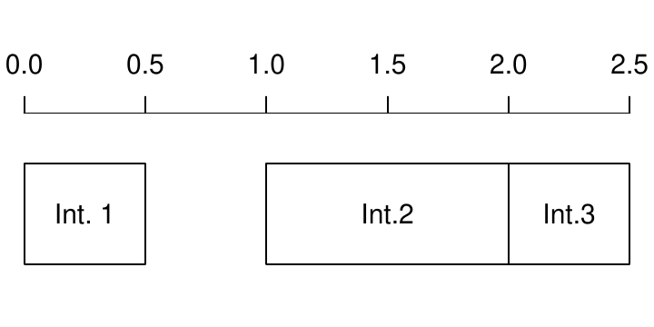{width="100%" alt="graphic without alt text"}
Functions are provided to characterize the relationships of intervals
with each other: `are.lim.nonunique()` checks whether the intervals are
of non-zero thickness (e.g., unlike \[1,1\]), `are.lim.nonadjacent()`
checks if the intervals do not share any adjacent boundaries, and
`are.lim.distinct()` checks whether the intervals are not overlapping.
The `simp.lim()` function is provided to merge adjacent and/or
overlapping intervals having identical IDs. The `flip.lim()` function is
provided to find the complementary intervals of a set of intervals
(i.e., the gaps). The `mid.lim()` function provides a way to define
intervals in between data points. If all different intervals are
strictly non-overlapping for all values (for instance, the intervals
\[0,20\[ and \[20, 100\] are non-overlapping and therefore 20 is
uniquely represented by the second interval), the `in.lim()` function
can be used to find which values belong to which respective intervals.
Typically, such functions can be used to craft stratigraphic intervals
(such as magnetochrons or stages) and determine the beds or samples that
are in or outside them.

# General plotting considerations

The first challenge when plotting a litholog is its size: a litholog
needs to be detailed at a small scale (typically at the centimeter scale
for high precision) while spanning the entirety of a record (up to
hundreds of meters). This makes lithologs sometimes quite extended. This
is problematic considering that the classical R graphic window is not
adapted to visualize anything exceeding the size of the computer screen.
To remedy this problem, the `pdfDisplay()` function is here introduced,
which draws plots directly in a PDF (Portable Document File) document
and opens it in the computer's default PDF reader. This PDF document can
have any size desired by the user, and therefore, allows visualizing all
the details of a very long litholog. This is illustrated by the code
here below, which draws a vertically standing stickman. Depending on the
screen, this vertical stickman could be difficult to visualize without
`pdfDisplay()`.

To avoid having to close the PDF reader at each change of the plot (as
most PDF readers do not permit changes to the PDF file while it is
displayed), each new PDF can be named differently: each new document
version will have its name be followed by '\_(i)', where i is the
version number (e.g., test\_(1).pdf, test\_(2).pdf, etc.). This practice
is here referred as *tracking* the version number. It is noteworthy to
cite the free [Sumatra
PDF](https://www.sumatrapdfreader.org/free-pdf-reader.html) software,
which is available for Windows operating systems, and lets PDF files be
modified while still displaying them without the trick of having to
change the file name. In that case, the tracking of the version numbers
can be canceled by setting the `track` parameter to `FALSE`. PDF files
generated by `pdfDisplay()` can easily be imported into vector graphics
software. The `pdfDisplay()` function also allows for the direct
generation of an SVG file. `pdfDisplay()` is a wrapper of the more basic
`pdf()` function (i.e., its code is based on the `pdf()` function);
other PDF generating functions could be used interchangeably.

To make plots starting from an empty background, we advise using the
`plot.new()` and `plot.window()` functions, which are of lower level
(i.e., more basic) than the `plot()` function. They are used to create a
completely empty plotting environment in which to add the litholog. To
add axes, the `axis()` function is a versatile tool, which can be
replaced by the `minorAxis()` function provided in **StratigrapheR** to
add minor axis ticks. The `minorAxis()` function is itself a wrapper of
the `axis()` function.

``` r
graphical_function <- function() # Graphical function needed by pdfDisplay 
{
   opar <- par()$mar # Save initial graphical parameters
   par(mar = c(0,3,0,1)) # Change the margins of the plot
	
   plot.new() # Open a new plot
   plot.window(xlim = c(-0.2, 1.2), ylim = c(-5, 1)) # Define plot coordinates
   minorAxis(2, at.maj = seq(-5, 1, 0.5), n = 5, las = 1) # Add axis
   points(c(0.25, 0.75), c(0.75, 0.75), pch = 19)
   polygon(c(0.1, 0.25, 0.75, 0.9, 0.75, 0.25, NA, 
             0, 0.25, 0.75, 1, 0.75, 0.25),
           c(0.5, 0.25, 0.25, 0.5, 0.4, 0.4, NA,
             0.5, 0, 0, 0.5, 1, 1), lwd = 2)
   lines(x = c(0.5, 0.5, NA, 0, 0.2, 0.5, 0.8, 1, NA, 
               0, 0.2, 0.5, 0.9, 1.2),
         y = c(-0.25, -3, NA, -5, -4, -3, -4, -5, NA, 
               -2.5, -1.5, -1, -0.75, 0.25), lwd = 2)
	      
   par(mar = opar) # Restore initial graphical parameters
}

pdfDisplay(graphical_function(),"graphical_function", width = 3.5, height = 10)
```

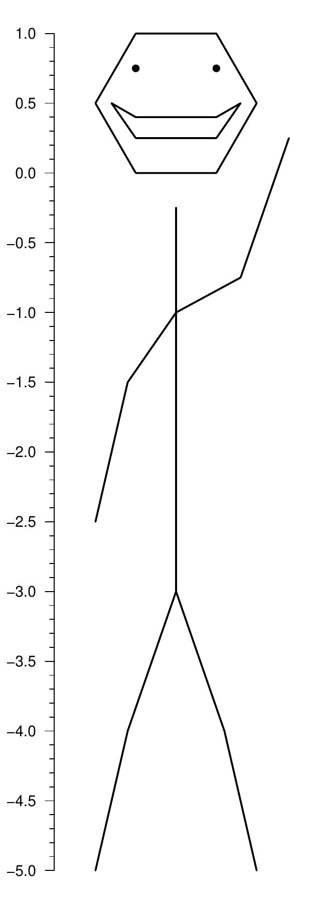{width="30%"
alt="graphic without alt text"}  

Adding every element of the lithologs
symbology uses a very basic data format for polylines and polygons,
which are respectively drawn using the `multigons()` and `multilines()`
functions. These novel functions allow precise control of graphical
parameters when drawing multiple polygons and polylines. These functions
require an identification argument `i`, similar for each point of a
single polygon or polyline, and the `x` and `y` coordinates of each
point. The following code shows the use of the `multigons()` and
`multilines()` functions:

``` r
i <- c(rep("A1",6), rep("A2",6), rep("A3",6)) # Polygon IDs
x <- c(1,2,3,3,2,1,2,3,4,4,3,2,3,4,5,5,4,3)   # x coordinates
y <- c(1,2,3,4,5,6,1,2,3,4,5,6,1,2,3,4,5,6)   # y coordinates
	
plot.new()
plot.window(xlim = c(0,6), ylim = c(0,7))

multigons(i, x, y,
          front = "A2", # This gets the polygon A2 in front of all others
          density = c(NA, 5, 10),  # Shading line density
          scol = "grey20", # Shading line color; one value means all polygons
                           # are subject to this graphical parameter
          col = c("black", "grey80", "white"), # Background color
          lwd = 2, # Width of border lines
          slty = 2, slwd = 1) # Shading lines type and width  
```

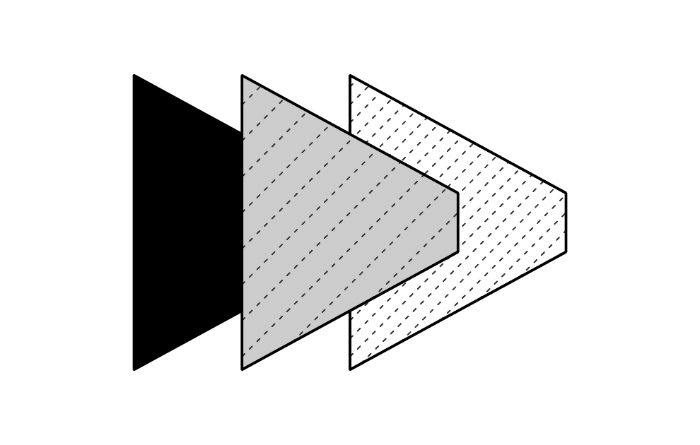{width="100%" alt="graphic without alt text"}

``` r
i <- c(rep("A1",6), rep("A2",6), rep("A3",6)) # Lines IDs
x <- c(1,2,3,3,2,1,4,5,6,6,5,4,7,8,9,9,8,7)   # x coordinates
y <- c(1,2,3,4,5,6,1,2,3,4,5,6,1,2,3,4,5,6)   # y coordinates
	
plot.new()
plot.window(xlim = c(0,10), ylim = c(0,7))
	
multilines(i, x, y, 
           j = c("A3", "A1", "A2"),  # j controls the order of the graphical 
                                     # parameters applied to each named line:
           lty =  c(1,2,3), lwd = 2, # e.g., lty = 1 (solid line) is applied  
                                     # to "A3", the line at the right
           type = c("l", "o", "o"), 
           pch = c(NA,21,24), cex = 1, bg = "black")
```

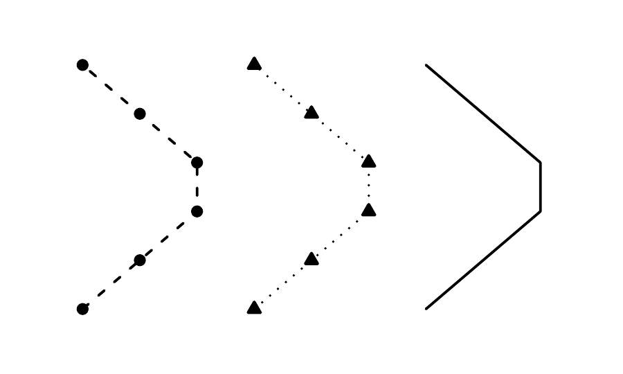{width="100%" alt="graphic without alt text"}
The `pointsvg()` function is provided in **StratigrapheR** to import
groups of polygons and polylines drawn in vector graphics software,
under specific conditions: firstly, the drawing needs to be in SVG
format; secondly, the `pointsvg()` function is only able to identify
objects of class \"line\", \"rect\", \"polygon\", and \"polyline\" in
the SVG file. The reason for this is that only these types of objects
are simple lines, and polygons made of nodes linked together by straight
lines. This means that `pointsvg()` is not able to recognize all the
objects present in an SVG file. Furthermore, `pointsvg()` only
identifies the coordinates of each objects, regroups them into separate
polygons and polyline objects, and in which order to plot them. All
other graphical parameters, such as color or line thickness, are not
taken into account. These parameters have to be specified in the drawing
functions. Objects obtained using `pointsvg()` on SVG files can be added
using the `framesvg()` or `centresvg()` functions, which respectively
add the object within a given frame or center the object on a given
point.

``` r
svg.file.directory <- tempfile(fileext = ".svg")     # Creates temporary file
writeLines(example.ammonite.svg, svg.file.directory) # Writes svg in the file

ammonite.drawing <- pointsvg(file = svg.file.directory) # Read svg

plot.new()
plot.window(xlim = c(-2, 5), ylim = c(-2, 2))
axis(1)
axis(2, las = 2)

centresvg(ammonite.drawing,  # Object
          x = c(3,0), y = 0,  # Coordinates for centering
          xfac = 2, yfac = 2,  # Dimension stretching factors
          col = c("grey","white"))  # Graphical parameters
```

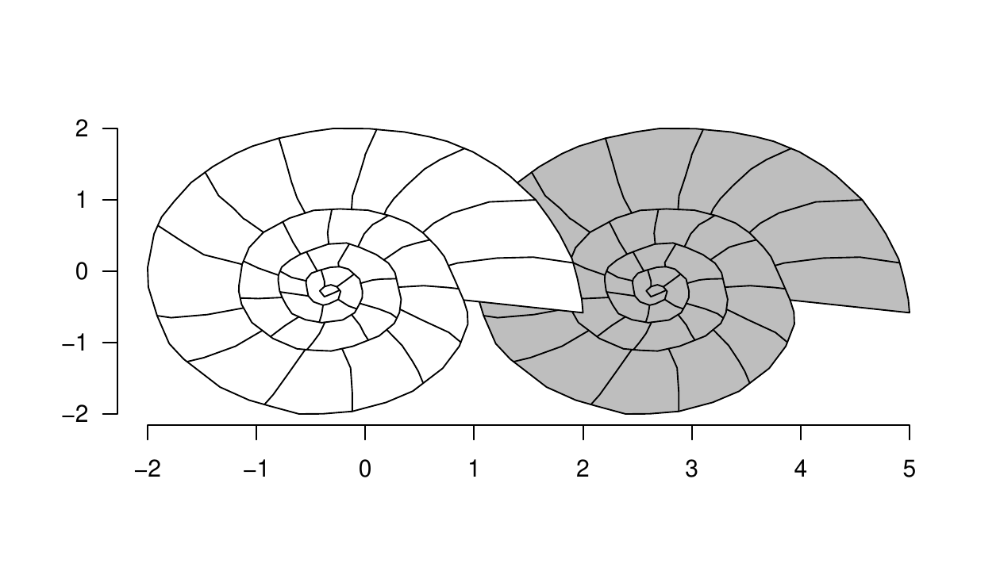{width="100%" alt="graphic without alt text"} It
should be noted that repetitions of the same SVG object can be generated
by a single call of the `framesvg()` or `centersvg()` functions. This
facilitates the automation of the litholog generation. Modifications of
the SVG objects can also be accomplished using the `changesvg()`
function, which enables, among other things, to change the order of
plotting of the polylines and polygons, remove some of them, or invert
the figure in x and/or y. The `framesvg()` or `centersvg()` can also
output the drawing with modified coordinates, which can be plotted using
`placesvg()` (see, for instance, the code of the last example).

# Generating lithologs

The data to make lithologs can be provided in the form shown in Table
[1](#Tab:beds).

::: {#Tab:beds}
  --------------------------------------------
    id     l      r      h     colour   litho
  ------ ------ ------ ------ -------- -------
    B1     0      1      3      grey      S

    B2     1      3      4      grey      L

    B3     3      4      5     black      C

    B4     4      9      4     white      L

    B5     9      11     4     white      L

   \...   \...   \...   \...    \...    \...
  --------------------------------------------

  : Table 1: Example of a data frame (`bed.example` in
  **StratigrapheR**) providing information for each bed: id identifies
  each bed, l and r provide the boundaries, h the hardness, and the
  color is provided along with a code for lithology (S for shale, L for
  limestone, C for chert). The only strict convention is that l, r, and
  h need to be numerical values.
:::

From such data, basic lithologs made of rectangles can be generated as a
simple basis. They are the starting point for making more complicated
lithologs in **StratigrapheR**. The coordinates of the points making up
the rectangles can be computed through the `litholog()` function, which
only needs the position of the boundaries of the beds, their 'hardness',
and an ID. Text can be added to each bed using the `bedtext()` function,
which can be used to include the ID or the name of the bed (e.g., id in
Table [1](#Tab:beds)).

The output of the `litholog()` function can be provided to `multigons()`
to draw the log. A symbology for different types of rocks (or any other
information that the symbology is meant to provide) can be set up using
the color fill and the shading. Providing a given symbology for each
polygon is performed by joining the table containing the information
about each bed to a table attributing symbology to rock type. We advise
the use of the `left_join()` function in the
[*dplyr*](https://CRAN.R-project.org/package=dplyr) package
[@wickham_dplyr_2020] for this procedure.

``` r
basic.log <- litholog(l = bed.example$l,  # This creates a data table of
                      r = bed.example$r,  # rectangles coordinates for a
                      h = bed.example$h,  # basic litholog
                      i = bed.example$id) 

legend <- data.frame(litho = c("S", "L", "C"),             # This creates a  
                     col = c("grey30", "grey90", "white"), # data table for   
                     density = c(30, 0,10),                # the symbology
                     angle = c(180, 0, 45), stringsAsFactors = FALSE)
View(legend)               
```

{width="100%" alt="graphic without alt text"}

``` r
# left_join in the dplyr package merges the symbology with the table of beds:
bed.legend <- dplyr::left_join(bed.example,legend, by = "litho")

View(bed.legend)
```

{width="100%" alt="graphic without alt text"}

``` r
plot.new()
plot.window(xlim = c(0,6), ylim = c(-1,77))
minorAxis(2, at.maj = seq(0, 75, 5), n = 5)

# Plotting of the polygons making the litholog, 
# with corresponding symbology:
multigons(basic.log$i, x = basic.log$xy, y = basic.log$dt,
          col = bed.legend$col,
          density = bed.legend$density,
          angle = bed.legend$angle)

# Writing the name of beds, only in beds thick enough
bedtext(labels = bed.example$id, l = bed.example$l, r = bed.example$r,
        x = 0.5,  # x position where to center the text
        ymin = 3) # text is not added in beds thinner than ymin
```

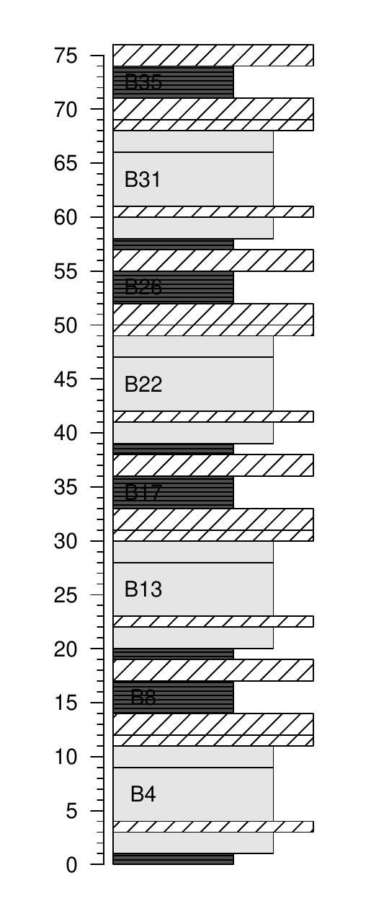{width="100%" alt="graphic without alt text"} To
add more complicated beds, the user can add SVG drawings instead of
drawing the rectangles through `multigons()`, as shown earlier. This is,
however, a time-consuming procedure as each bed has to be imported
separately. The `weldlog()` function can be used to automate the
personalization of bed boundaries. It needs to be provided as a
polyline, either from R itself (e.g., a sinusoid) or from an SVG file.

``` r
# Code repeated from earlier examples ----
basic.log <- litholog(l = bed.example$l, r = bed.example$r,
                      h = bed.example$h, i = bed.example$id)
legend <- data.frame(litho = c("S", "L", "C"), density = c(30, 0,10),
                     col = c("grey30", "grey90", "white"),
                     angle = c(180, 0, 45), stringsAsFactors = FALSE)
bed.legend <- dplyr::left_join(bed.example,legend, by = "litho")
# ----

# Generation of the boundaries, either sinusoidal or from drawings ---	
s1 <- sinpoint(5,0,0.5,nwave = 1.5)
s2 <- sinpoint(5,0,1,nwave = 3, phase = 0)
s3 <- framesvg(example.liquefaction, 1, 4, 0, 2, plot = FALSE, output = TRUE)

# Visualizing the s3 boundary, i.e., the liquefaction sedimentary feature ----
plot(s3$x, s3$y, cex.axis = 1.2, lwd = 2,
     type = "l", ylab = "", xlab = "", bty = "n", las = 1)
```

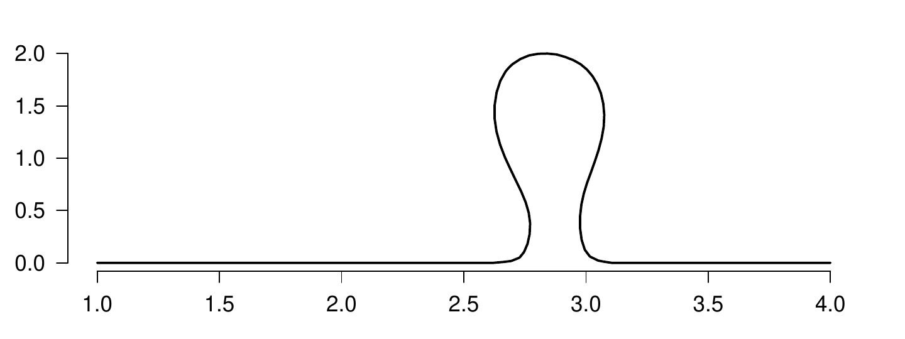{width="100%" alt="graphic without alt text"}

``` r
# Welding the boundaries to the basic litholog ----
final.log <- weldlog(log = basic.log,
                     dt = boundary.example$dt, # Position of the boundaries 
                                               # to be changed
                     seg = list(s1 = s1, s2 = s2, s3 = s3), # list of segments
                     j = c("s1","s1","s1","s3", # Attributing the segments to 
                           "s2","s2","s1"),     # the respective bed boundaries 
                                                # to  be changed
                     warn = F)

# Visualizing the resulting litholog (similarly to earlier code) ----
plot.new()
plot.window(xlim = c(0,6), ylim = c(-1,77))
minorAxis(2, at.maj = seq(0, 75, 5), n = 5, las = 1)

multigons(final.log$i, x = final.log$xy, y = final.log$dt,
          col = bed.legend$col,
          density = bed.legend$density,
          angle = bed.legend$angle)

bedtext(labels = bed.example$id, l = bed.example$l, r = bed.example$r,
        x = 0.75, ymin = 3)
```

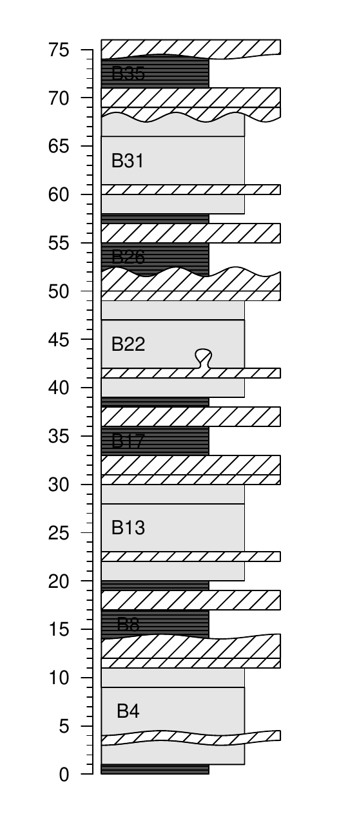{width="100%" alt="graphic without alt text"}
We see that the thickness of beds can vary. Therefore, a bed boundary
can actually vary within a given interval. This raises the question of
how to document the position of the bed boundaries in data tables that
would only have 2 values for the boundaries (lower and upper) rather
than 4 (upper and lower interval of variation for the lower boundary,
and upper and lower interval of variation for the upper boundary) or
even more (detailing the exact form of the boundaries). We propose a
convention for the data tables to be used for the generation of
lithologs: the positions of the bed boundaries that are defined in the
quantified data have to match in a litholog with the positions of the
boundaries of the beds on the axis side of the litholog (usually the
left side for single logs). The axis side of the litholog is ideal: it
follows a straight vertical line, by an implicit convention followed by
the large majority of geologists.

Extra stratigraphic or lithological information, such as geomagnetic
chrons, rock color, etc., can be added using the `infobar()` function.
Any information that can be conveyed by text, such as the positions of
samples, can be added using the `axis()` or `text()` functions.

``` r
# Code repeated from earlier examples ----
basic.log <- litholog(l = bed.example$l, r = bed.example$r,
                      h = bed.example$h, i = bed.example$id)
legend <- data.frame(litho = c("S", "L", "C"), density = c(30, 0,10),
                     col = c("grey30", "grey90", "white"),
                     angle = c(180, 0, 45), stringsAsFactors = FALSE)
bed.legend <- dplyr::left_join(bed.example,legend, by = "litho")
s1 <- sinpoint(5,0,0.5,nwave = 1.5)
s2 <- sinpoint(5,0,1,nwave = 3, phase = 0)
s3 <- framesvg(example.liquefaction, 1, 4, 0, 2, plot = FALSE, output = TRUE)
final.log <- weldlog(log = basic.log, dt = boundary.example$dt,
                     seg = list(s1 = s1, s2 = s2, s3 = s3),
                     j = c("s1","s1","s1","s3","s2","s2","s1"), warn = F)
```

``` r
# Visualizing the resulting litholog (similarly to earlier code) ----
plot.new()
plot.window(xlim = c(-1.5,8), ylim = c(-1,81))
minorAxis(2, at.maj = seq(0, 75, 5), n = 5, las = 1)

multigons(final.log$i, x = final.log$xy, y = final.log$dt,
          col = bed.legend$col,
          density = bed.legend$density,
          angle = bed.legend$angle)

bedtext(labels = bed.example$id, l = bed.example$l, r = bed.example$r,
        x = 0.5, ymin = 2)

# Making a data table for the symbology of magnetochrons
legend.chron <- data.frame(polarity = c("N", "R"),
                           bg.col = c("black", "white"),
                           text.col = c("white", "black"),
                           stringsAsFactors = FALSE)

# Merging symbology with a data table of chrons
chron.legend <- dplyr::left_join(chron.example, legend.chron, by = "polarity")

# Plotting the chrons with the given symbology
infobar(-1.5, -1, chron.legend$l, chron.legend$r,
        labels = chron.legend$polarity,
        m = list(col = chron.legend$bg.col),
        t = list(col = chron.legend$text.col),
        srt = 0)

# Adding color information
colour <- bed.example$colour
colour[colour == "darkgrey"] <- "grey20"
colour[colour == "brown"]    <- "tan4"

# Plotting the color next to the litholog
infobar(-0.25, -0.75, bed.example$l, bed.example$r, 
        m = list(col = colour))

text(-0.5, 79, "Colour", srt = 90)
text(-1.25, 79, "Magnetochrons", srt = 90)

axis(4, at = proxy.example$dt, labels = proxy.example$name, 
     pos = 6, lwd = 0, lwd.ticks = 1, las = 1)	
```

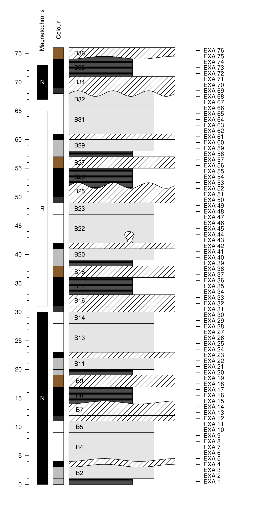{width="100%" alt="graphic without alt text"}
Other plots can be drawn along the litholog. Great care should be taken
to ensure that the depth axis is identical in all plots. To ensure that,
two components have to be taken into account: the `ylim` argument of
`plot.window()` or `plot()` (for vertical logs, otherwise the `xlim`
argument), and the graphical parameters defined by the `par()` function,
especially the `yaxs` (for vertical logs, otherwise `xaxs`) and the
`mar` arguments. The `ylim` argument controls the range of the axis, but
the exact range will depend on the `yaxs` argument. Indeed, the default
setting of `yaxs` is `"r"`, which stands for regular, and means that the
data range defined by `ylim` is extended by 4 percent at each end. Such
extension can be unwanted in very long lithologs. Alternatively, the
`yaxs` argument can be set as `"i"`, which stands for 'internal', and
prevents the extension of the range defined by `ylim`. The `mar`
argument controls the margin size of the plotting zone. To add plots
along the litholog, a simple way is to use the `mfrow` argument in the
`par()` function to define several plotting areas, which will be used by
the successively called plots.

``` r
# Code repeated from earlier examples ----
basic.log <- litholog(l = bed.example$l, r = bed.example$r,
                      h = bed.example$h, i = bed.example$id)
legend <- data.frame(litho = c("S", "L", "C"),
                     col = c("grey30", "grey90", "white"),
                     density = c(30, 0,10),
                     angle = c(180, 0, 45), stringsAsFactors = FALSE)
bed.legend <- dplyr::left_join(bed.example,legend, by = "litho")
s1 <- sinpoint(5,0,0.5,nwave = 1.5)
s2 <- sinpoint(5,0,1,nwave = 3, phase = 0)
s3 <- framesvg(example.liquefaction, 1, 4, 0, 2, plot = FALSE, output = TRUE)
final.log <- weldlog(log = basic.log, dt = boundary.example$dt,
                     seg = list(s1 = s1, s2 = s2, s3 = s3),
                     j = c("s1","s1","s1","s3","s2","s2","s1"), warn = F)
# ----

opar <- par() # Save initial graphical parameters (IGP)
par(mfrow = c(1,2),  # Set two vertical plots along each other
    yaxs = "r",                  # Default setting, adds 4% more range for y 
    mar = c(5.1, 4.1, 4.1, 0.1)) # Change settings for margins

# Visualizing the resulting litholog (similarly to earlier code) ----
plot.new()
plot.window(xlim = c(0,6), ylim = c(-1,77))
minorAxis(2, at.maj = seq(0, 75, 5), n = 5, las = 1)

multigons(final.log$i, x = final.log$xy, y = final.log$dt,
          col = bed.legend$col,
          density = bed.legend$density,
          angle = bed.legend$angle)

bedtext(labels = bed.example$id, l = bed.example$l, r = bed.example$r,
        x = 0.75, ymin = 3)

# Visualizing quantified values along the litholog ----

par(mar = c(5.1, 0.1, 4.1, 4.1)) # Change settings for margins of 2nd plot

plot.new()
plot.window(xlim = c(-2*10^-8,8*10^-8), ylim = c(-1,77)) # ylim similar to
                                                         # litholog
                                                         
minorAxis(4, at.maj = seq(0, 75, 5), n = 5, las = 1) # Repetition of the axis to
                                                     # check both sides are matching

lines(proxy.example$ms, proxy.example$dt, type = "o", pch = 19)
axis(1)
title(xlab = "Magnetic Susceptibility")	

par(mar = opar$mar, mfrow = opar$mfrow, yaxs = opar$yaxs) # Restore IGP
```

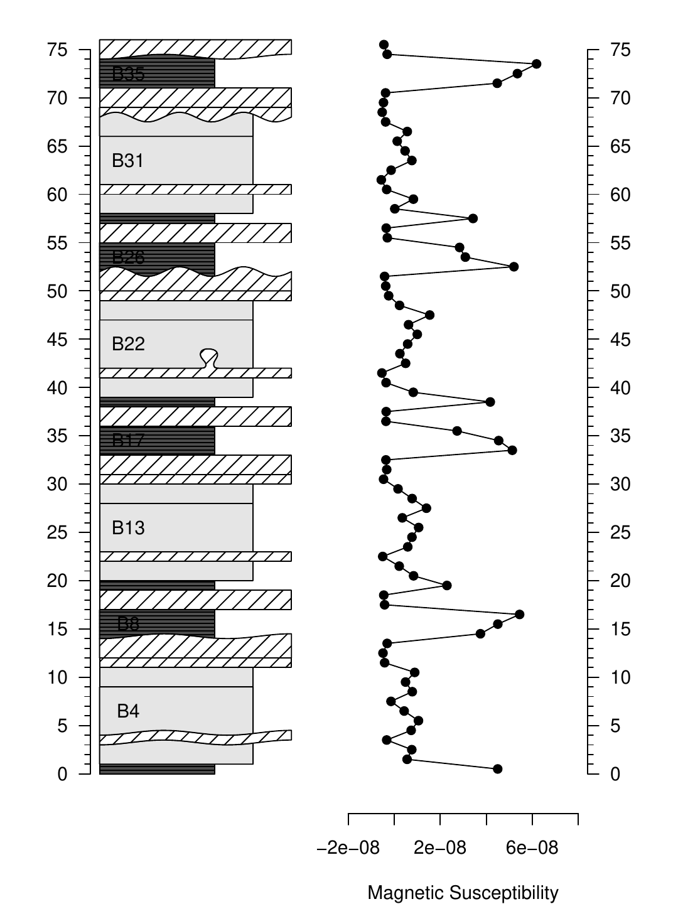{width="100%" alt="graphic without alt text"} A
legend plot can be generated using the `nlegend()` function. The basic
idea is to make a subplot for each symbol (using the `par()` function,
for instance), in which the `nlegend()` function calls a new plot
leaving free space for the symbol (included in \[-1, 1\], both for x and
y coordinates), and adds the text description. This scheme improves
automation, e.g., by simplifying the symbol generation of rock types in
a function as shown in the code below:

``` r
legend <- data.frame(litho = c("S", "L", "C"),             # Symbology 
                     col = c("grey30", "grey90", "white"), # data table
                     density = c(30, 0,10), angle = c(180, 0, 45),
                     stringsAsFactors = FALSE)

f <- function(legend_row) # To simplify coding, we design here a function 
                          # plotting rectangles with the desired symbology
{
   multigons(i = rep(1, 4), c(-1,-1,1,1), c(-1,1,1,-1),
             col = legend$col[legend_row], 
             density = legend$density[legend_row],
             angle = legend$angle[legend_row])
}	

opar <- par() # Save initial graphical parameters
par(mar = c(0,0,0,0), mfrow = c(5,1)) # Make 5 plot windows

nlegend(t = "Shale", cex = 2) # The cex parameter controls the size of the text
f(1) # 1 stands for the first row of the symbology data table
nlegend(t = "Limestone", cex = 2)
f(2)
nlegend(t = "Chert", cex = 2)
f(3)

nlegend(t = "Ammonite", cex = 2)
centresvg(example.ammonite, 0,0,xfac = 0.5)
nlegend(t = "Belemnite", cex = 2)
centresvg(example.belemnite, 0,0,xfac = 0.5)

par(mar = opar$mar, mfrow = opar$mfrow) # Restore initial graphical parameters
```

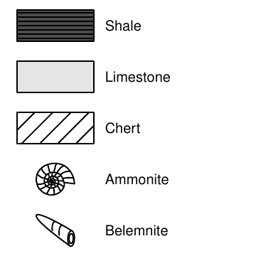{width="100%" alt="graphic without alt text"} As
lithologs can be longer than a single printable page, it is sometimes
necessary to split them into separate plots to be displayed on
successive pages of a text document. This can be done by grouping all
the drawing functions used to generate the litholog into a single
function, with `ylim` as an argument. This function can be iterated with
successive `ylim` intervals.

Functions that generate several plots will generate the corresponding
pages in the PDF generated by `pdfDisplay()`. All the pages have to be
of the same dimensions. To integrate these successive litholog figures
into a larger document that would include all the litholog parts, the
associated legend, a text description of the section, etc.,
[LaTeX](https://www.latex-project.org/) can be used. A \\foreach loop in
LaTeX can then be applied to import all the pages using the
\\includegraphics function.

``` r
# Code repeated from earlier examples ----
basic.log <- litholog(l = bed.example$l, r = bed.example$r,
                      h = bed.example$h, i = bed.example$id)
legend <- data.frame(litho = c("S", "L", "C"),
                     col = c("grey30", "grey90", "white"),
                     density = c(30, 0,10),
                     angle = c(180, 0, 45), stringsAsFactors = FALSE)
bed.legend <- dplyr::left_join(bed.example,legend, by = "litho")
s1 <- sinpoint(5,0,0.5,nwave = 1.5)
s2 <- sinpoint(5,0,1,nwave = 3, phase = 0)
s3 <- framesvg(example.liquefaction, 1, 4, 0, 2, plot = FALSE, output = TRUE)
final.log <- weldlog(log = basic.log, dt = boundary.example$dt,
                     seg = list(s1 = s1, s2 = s2, s3 = s3),
                     j = c("s1","s1","s1","s3","s2","s2","s1"), warn = F)
legend.chron <- data.frame(polarity = c("N", "R"),
                           bg.col = c("black", "white"),
                           text.col = c("white", "black"),
                           stringsAsFactors = FALSE)
chron.legend <- dplyr::left_join(chron.example,legend.chron, by = "polarity")
colour <- bed.example$colour
colour[colour == "darkgrey"] <- "grey20"
colour[colour == "brown"]    <- "tan4"
# ----

# Function that will draw a litholog, with personalized coordinates control
log.function <- function(xlim = c(-2.5,7), ylim = c(-1,77))
{
   plot.new()
   plot.window(xlim = xlim, ylim = ylim)
   minorAxis(2, at.maj = seq(0, 75, 5), n = 5, pos = -1.75, las = 1)
	
   multigons(final.log$i, x = final.log$xy, y = final.log$dt,
             col = bed.legend$col,
             density = bed.legend$density,
             angle = bed.legend$angle)
	
	
   bedtext(labels = bed.example$id, l = bed.example$l, r = bed.example$r,
           x = 1, edge = TRUE, ymin = 2)
	
   centresvg(example.ammonite, 6,
             fossil.example$dt[fossil.example$type == "ammonite"],
             xfac = 0.5)
   centresvg(example.belemnite, 6,
             fossil.example$dt[fossil.example$type == "belemnite"],
             xfac = 0.5)
	
   infobar(-1.5, -1, chron.legend$l, chron.legend$r,
           labels = chron.legend$id, m = list(col = chron.legend$bg.col),
           t = list(col = chron.legend$text.col))
   infobar(-0.25, -0.75, bed.example$l, bed.example$r, 
           m = list(col = colour))
}

# In this gr() function, log.function() is repeated, which plots the
# desired parts of the litholog

gr <- function()
{
   opar <- par()  # Save initial graphical parameters
   par(mar = c(1,2,1,2), yaxs = "i")
   ylim <- c(0,40) # Initial range to be plotted
   
   for(i in 1:0) log.function(ylim = ylim + 40*i) # Iteration of the plotting
   # The drawing range's length is iteratively added to the range already drawn

   par(mar = opar$mar, yaxs = opar$yaxs) # Restore initial graphical parameters
}

# Integration of gr() in pdfDisplay to make PDFs
pdfDisplay(gr(), name = "divided log", width = 3, height = 5)	
```


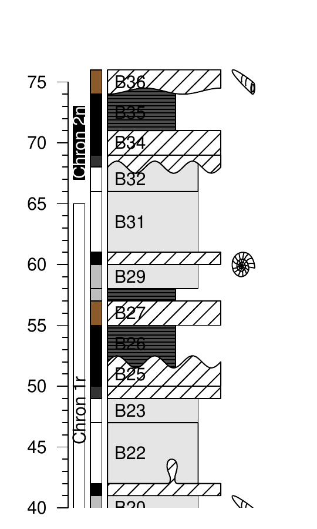{width="60mm"}

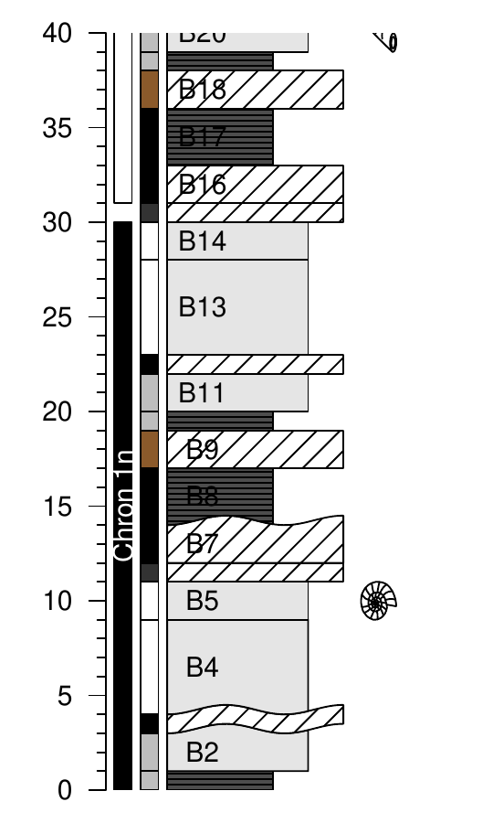{width="60mm"}

``` r
# The code can be adapted to divide the plot differently, 
# and to add other plots along the litholog
	
gr2 <- function()
{
   opar <- par() # Save initial graphical parameters (IGP)
		
   low  <- c(-5, 25, 55) # Another way of defining the dimensions
   high <- c( 25, 55, 85) # of succesive plotting windows
		
   for(i in 3:1){  # Inverted order to have them in stratigraphic order
			
      par(mfrow = c(1,2), yaxs = "i") # Plot in two columns, same yaxs for both
      par(mar = c(5,2,1,0)) # Define margins for first plot (left)
			
      log.function(ylim = c(low[i], high[i]))
			
      par(mar = c(5,0,1,1)) # Second plot (right): change only the vertical  
                            # margins (2nd and 4th)
			
      plot.new()
      plot.window(xlim = c(-2*10^-8,8*10^-8), ylim = c(low[i], high[i]))
      lines(proxy.example$ms, proxy.example$dt, type = "o", pch = 19)
      axis(1)
      title(xlab = "Magnetic Susceptibility")
			
   }
		
    par(mar = opar$mar, yaxs = opar$yaxs, mfrow = opar$mfrow) # Restore IGP
}
	
pdfDisplay(gr2(), name = "divide in 3", wi = 5, he = 7)
```

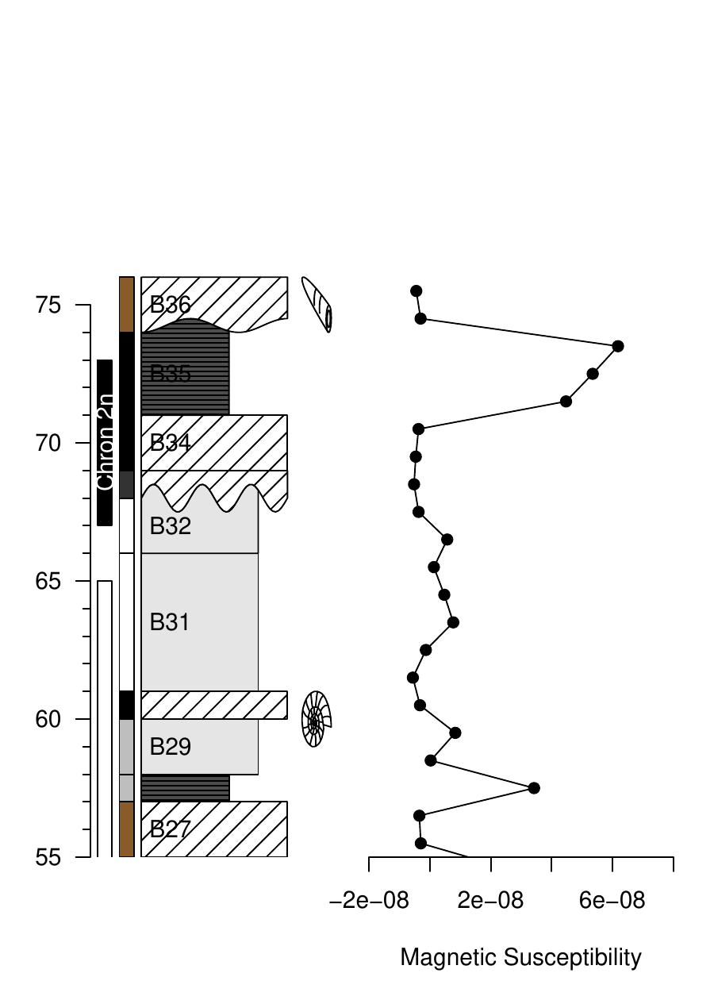{width="85mm"}

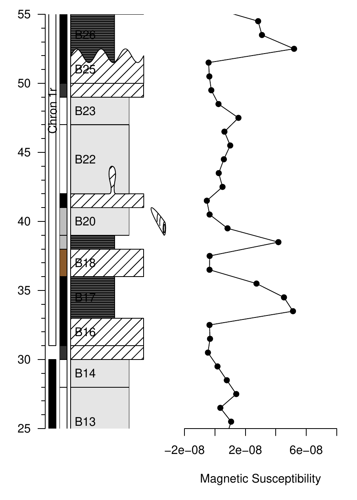{width="85mm"}

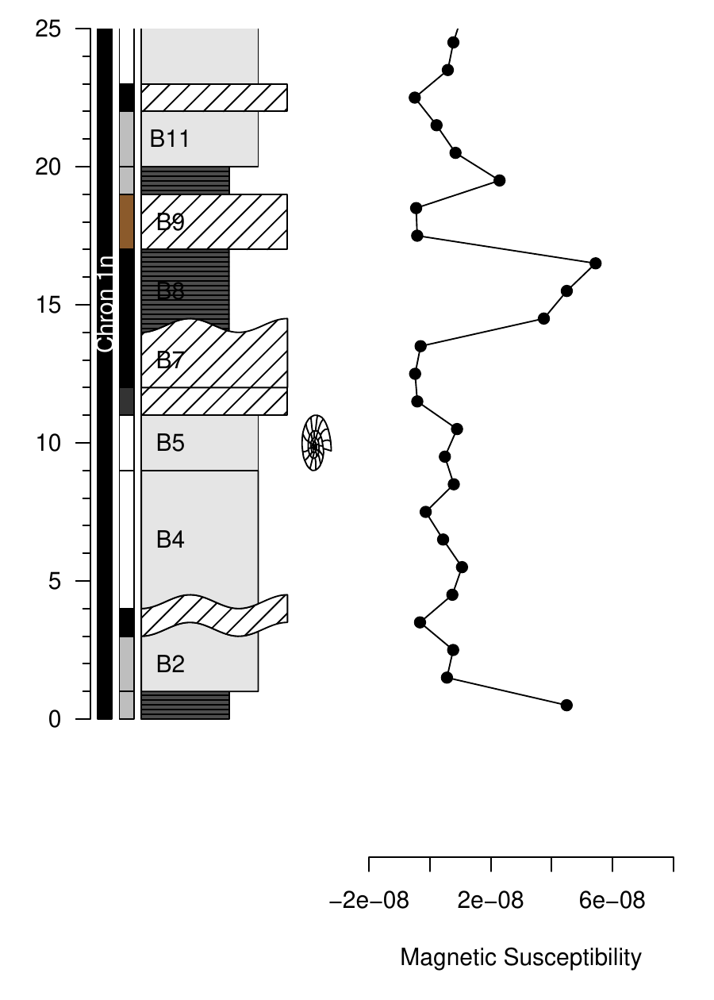{width="85mm"}

The preceding examples illustrate some of the capabilities of the
**StratigrapheR** package. However, an important question remains
unanswered: have we overcome the \"from art to useful data\" challenge?
We will illustrate our answer by importing the computer-drawn litholog
from Fig. [1](#figure:drawnlog). We will also take the opportunity to
show how **StratigrapheR** can help in the comparison and correlation of
sections. For that purpose, we plot two lithologs in front of each other
and visually link them using the `ylink()` function. `ylink()` currently
only works in single window plots, i.e., having a coherent x and y
coordinate system. Therefore, we need to change the coordinate system of
one of the two lithologs.

Prior to importing it into R using `pointsvg()`, all the lines and
polygons in the litholog in Fig. [1](#figure:drawnlog) are sparsely
interpolated, and all the curves are converted into straight lines. To
have perfect positioning in x and y coordinates, the initial drawing is
surrounded by a rectangle having known coordinates. Afterward, the
figure is saved as an SVG file. All this takes less than a minute with
vector graphics software (here using CorelDRAW). The sparse
interpolation means that the figures will be angular (take, for
instance, the initially elliptical lens containing brachiopods at 34.5
m, when imported by the code here below, it becomes clearly polygonal).
If smoother curves are desired, the amount of interpolated points can be
increased. When the figure is imported by `pointsvg()`, the rectangle
defines the borders of the figure, which by default are set at \[-1, 1\]
in x and y. These coordinates are changed using `framesvg()` by
providing the initial coordinates of the rectangle as `xmin`, `xmax`,
`ymin`, and `ymax`. Having served its purpose as a reference in x and y,
the rectangle can be removed directly in `framesvg()` using the `forget`
argument.

``` r
svg.file.directory <- tempfile(fileext = ".svg")   # Creates temporary file
writeLines(example.HB2000.svg, svg.file.directory) # Writes svg in the file

# Log: 1 Humblet and Boulvain 2000 ----

a   <- pointsvg(svg.file.directory) # Import the svg
out <- framesvg(a, 
                xmin = 0, xmax = 5,    # Initial coordinates of the 
                ymin = 27, ymax = 36,  # rectangle (see SVG file)
                output = T,  # This allows to output the changed coordinates
                forget = "P287")  # 'forget' removes the rectangle added in the
                                  # svg to serve as a referential in x and y
                                
# Log 2: Code repeated from earlier examples ----

basic.log <- litholog(l = bed.example$l, r = bed.example$r,
                      h = bed.example$h, i = bed.example$id)
legend <- data.frame(litho = c("S", "L", "C"),
                     col = c("grey30", "grey90", "white"),
                     density = c(30, 0,10),
                     angle = c(180, 0, 45), stringsAsFactors = FALSE)
bed.legend <- dplyr::left_join(bed.example,legend, by = "litho")
s1 <- sinpoint(5,0,0.5,nwave = 1.5)
s2 <- sinpoint(5,0,1,nwave = 3, phase = 0)
s3 <- framesvg(example.liquefaction, 1, 4, 0, 2, plot = FALSE, output = TRUE)
final.log <- weldlog(log = basic.log, dt = boundary.example$dt,
                     seg = list(s1 = s1, s2 = s2, s3 = s3),
                     j = c("s1","s1","s1","s3","s2","s2","s1"), warn = F)

# Plotting two logs in front of each other ----

plot.out   <- out # Save a version of the svg object
tie.points <- data.frame(l = c(20,35,54,66),            # Define points to correlate
                         r.raw = c(29.8,31,32.5,33.25)) # the two sections in  
                                                        # their own depth scales

plot.out$x   <- 15 - out$x                   # Change the coordinates for
plot.out$y   <- 10*(out$y - 27.5)            # second litholog (imported 
axs2         <- 10*(28:35 - 27.5)            # from Fig. 1), to plot it t
tie.points$r <- 10*(tie.points$r.raw - 27.5) # in front of the first litholog

g <- function()
{
   opar <- par()  # Save initial graphical parameters
   par(mar = c(1,4,1,4))
   plot.new()
   plot.window(xlim = c(0,15), ylim = c(0,75))
   minorAxis(2, at.maj = seq(0,75, 5), n = 5, las = 1, cex.axis = 1.2)
   minorAxis(4, at.maj = axs2, labels = 28:35, n = 10, las = 1, cex.axis = 1.2)
	
   multigons(final.log$i, x = final.log$xy, y = final.log$dt,
             col = bed.legend$col,
             density = bed.legend$density,
             angle = bed.legend$angle)
	
   placesvg(plot.out, col = "white") # Adding the drawn plot
	
   ylink(tie.points$l, tie.points$r, 6, 9, ratio = 0.5,  # Correlation between 
         l = list(lty = c(1,2,2,1), lwd = 2))            # the two plots
	      
   par(mar = opar$mar) # Restore initial graphical parameters
		
}

pdfDisplay(g(), "Log Correlation")
```

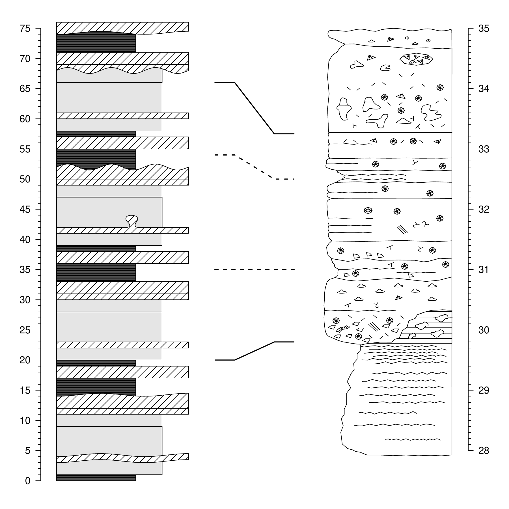{width="100%"
alt="graphic without alt text"} The most obvious discrepancy between the
original computer-drawn version (Fig. [1](#figure:drawnlog)) and the one
imported in R is the lack of color in the latter. We could have
identified all the gray polygons one by one and provided them with a
color symbology, but such a tedious task would go against the motto of
simplifying data management. This highlights that at the moment, the
conversion of lithologs \"from art to useful data\" is not as
straightforward as it could be, yet it is not too far out of our reach.

# New R functions for geological and general purpose

**StratigrapheR** was designed in a modular way: low-level
general-purpose functions were implemented to simplify the development
of higher-level functions. The package also hosts a couple of functions
that are not specifically related to lithologs but could be of great
use, especially to geologists, and to other developers. We present a few
of these functions in this chapter to promote the use of modular and
general-purpose functions and to help other developers making their own
functions.

-   `divisor()`: finds the greatest common rational divisor (GCRD) of a
    set of values, typically depth, height, or time in time series. This
    function is important as it allows to transform floating-point
    values into integers (within the precision range allowed by
    floating-point arithmetic) by dividing them by the GCRD. We
    highlight its high potential to automate data processing, especially
    to interpolate the irregularly-sampled depth, height, or time values
    that are omnipresent in geology (interpolation by the GCRD preserves
    the original values). This function is somewhat empirical and would
    benefit from improvements (among others to reduce the computing
    time, typically in the case where the GCRD is significantly smaller
    than the input values), but this would require expertise in
    mathematics and informatics that the authors do not have. We hope
    that open-source developers will respond to this challenge.
-   `every_nth()`: leaves or removes values at position indexes of
    multiples of a given amount (n). This is typically useful to
    discriminate major and minor ticks of a personalized axis.
-   `in.window()`: this function can serve as a base for windowing
    (typically to perform a moving average). It gives a matrix of all
    the points included in each successive window (in depth, height, or
    time). We illustrate this with irregularly sampled data points.
    ``` r
    window <- in.window(irreg.example$dt,  # Depth values
                        w = 30,   # Size of the window
                        xout = seq(0, 600, 20),  # Center position of windows
                        xy = irreg.example$xy)  # Intensity values (or other)
    		
    mov.mean <- rowMeans(window$xy, na.rm = TRUE) # Average of the intensity 
                                                  # values in windows
    		
    presence <- matrix(as.integer(!is.na(window$xy)), # Discriminate between NA 
                       ncol = ncol(window$xy))        # values and intensity values 
    amount   <- rowSums(presence)                     # to determine the amount of 
                                                      # real values in each window
                                                      # (example of window calculation)
    		                                                  
    opar <- par() # Save initial graphical parameters
    par(mfrow = c(2,1), mar = c(0,4,0,0))
    plot(irreg.example$dt, irreg.example$xy, type = "o", pch = 19,
         xlim = c(0,600), xlab = "dt", ylab = "xy and moving average", axes = F)
    lines(window$xout, mov.mean, col = "red", lwd = 2)
    axis(2, las = 1)
    		 
    par(mar = c(5,4,0,0))
    plot(window$xout, amount, pch = 19, xlim = c(0,600), ylim = c(0,25), 
         xlab = "dt", ylab = "amount of points in the windows", axes = F)
    axis(1)
    axis(2, las = 1)
       
    par(mar = opar$mar, mfrow = opar$mfrow) # Restore initial graphical parameters  
                                                
    ```

    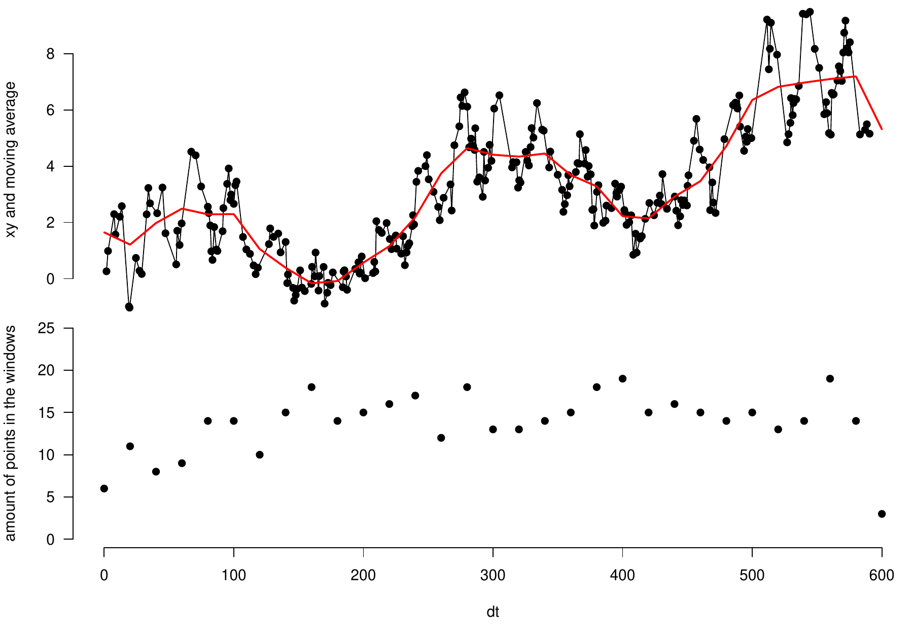{width="100%"
    alt="graphic without alt text"}
-   `nset()`: finds the position of a given amount of values (n) having
    a common identification code, selecting either the n first or the n
    last ones, or signaling that they are not available (`NA`). This is
    useful to homogenize replicate measurement values.
    ``` r
    id   <- c("samp1", "samp1", "samp2", "samp3", "samp3", "samp3")
    meas <- c(   0.45,    0.55,     5.0,     100,     110,     120)
    	
    new_sequence <- nset(id, 2, warn = F)
    	
    new_sequence
    #>       [,1] [,2]
    #> samp1    1    2
    #> samp2    3   NA
    #> samp3    4    5
    	
    clean_meas <- matrix(meas[new_sequence], ncol = 2)
    	
    row.names(clean_meas) <- unique(id)
    	
    clean_meas
    #>         [,1]   [,2]
    #> samp1   0.45   0.55
    #> samp2   5.00     NA
    #> samp3 100.00 110.00
    ```
-   `seq_mult()`: gives a sequence of numbers that are reordered by a
    given divisor of the length of the sequence (e.g., `seq_mult(10,5)`
    gives the sequence 1, 6, 2, 7, 3, 8, 4, 9, 5, 10). This is useful to
    reorder and manipulate repetitive sequences (e.g., changing 1, 2, 3,
    4, 5, 1, 2, 3, 4, 5 into 1, 1, 2, 2, 3, 3, 4, 4, 5, 5 and back).

# Present limitations and prospects for the future

**StratigrapheR**, for the moment, uses the **base** graphics in R. This
is a choice that was made in the initial development phase of the
package, as the base graphics (also called traditional graphics) are
easy to learn for R beginners and are relatively robust, compared to
their alternative; the **grid** graphics [@murrell_r_2012]. The grid
graphics are the basis for the
[*lattice*](https://CRAN.R-project.org/package=lattice)
[@sarkar_lattice_2008] and
[*ggplot2*](https://CRAN.R-project.org/package=ggplot2)
[@wickham_ggplot2_2016] graphical packages. Grid graphics allow more
sophistication than the base graphics, but at the price of a more
complicated implementation [@murrell_r_2012]. However, grid graphics
would make the entire litholog generation process more efficient,
especially by using the concept of grob (which stands for GRaphical
OBject). Grobs are R objects that save all the information of a plot,
which can then be modified without needing to alter or rewrite the code
made to generate the grobs. This would avoid any unnecessary repetition
of code. Revisiting the examples in the article, you will see that the
code needed for litholog generation does require writing the entire
plotting functions at each plot generation or inserting them into a
function. On the other hand, elements of a plot made in grid graphics
can be expressed via grobs and can be reassembled to generate a modified
version of the plot without explicitly making a function or repeating
the code. This would further simplify drawing different parts of the
same plot on several pages: if a litholog was expressed as a grob, only
a few lines of codes would be needed to generate successive versions of
the plot, and make them fit on different pages. For all these reasons,
grobs would prove to be a key feature for future litholog generation
into R. This would especially be useful to integrate lithologs in plots
made by other packages, something which was not explored in this
article: in the current implementation of **StratigrapheR** (i.e.,
without grobs), this would be more complicated than it could be
(although it should still be possible). We hope to explore this aspect
in the subsequent developments of the **StratigrapheR** package.

More generally, the difficulty of importing SVG objects into R should be
discussed. With `pointsvg()`, only polyline and polygon objects can be
imported; their color, line type, or line thickness are not taken into
account. However, this is justified by the fundamental incompatibility
between SVG and R graphics, whether from base graphics or grid graphics:
SVG files display a wide variety of graphical parameters that are
inexistent in R. Other authors have attempted to allow the complete
importation of vector graphics into R (e.g.,
[*grImport*](https://CRAN.R-project.org/package=grImport)
[@murrell_importing_2009], or the *vectoR* package available from
[GitHub](https://github.com/richfitz/vectoR)). These works are
remarkable but require a lot more effort to use compared to
`pointsvg()`. This comes from the fact that the only task allocated to
`pointsvg()` is to provide coordinates of polygons and polylines.
Afterward, the graphical parameters can be dealt with in R. Therefore we
argue that this limitation is not by any means a flaw that will impede
the use of **StratigrapheR** or R to deal with geological data.
Furthermore, in order to work with `pointsvg()`, one only needs to
simplify SVG objects into polygons and polylines. This procedure can be
done quite easily in vector graphics software but could also be
automated either in R or using SVG-related software and libraries.

Pattern fillings, often used to represent lithologies in traditional
lithologs, are currently difficult to plot in R. Indeed, carbonates are
often represented with a brick pattern, shales with horizontal layering,
and conglomerates by a pattern of polygons to represent heterogeneous
pieces. Not all of these pattern fillings are easily implementable in R
at the moment, as the only user-friendly pattern is the shading
(parallel lines). Rectangular pattern blocs could be generated in SVG
form, imported in R using the `pointsvg()` function, and repeated to
fill polygons.

Another useful feature that has not been implemented in
**StratigrapheR** yet is a way to display 'hardness' variations within
the lithological beds. The side opposite to the axis could indeed
exhibit continuous variations, which would represent continuous changes
in hardness, changes in topographical relief of beds in the field (which
is a good indicator of hardness), but also variations of grain size or
lithology. These are parameters that are critical to quantify and
formalize. We therefore advocate for a community effort to come up with
standards for the quantification of the hardness, topographical relief,
grain size, and lithology. The way to quantify these parameters should
allow to express them in discrete values along the stratigraphical depth
or height. These discrete values will make up the points of the polygons
symbolizing the beds, on the 'hardness'-varying side of the litholog.

The importation of the PDF documents generated by `pdfDisplay()` back
into R, to make documents including the lithologs and providing
supporting information (maps, legends, descriptions, etc.), could, in
theory, be implemented using the R Markdown scheme (see @xie_r_2018,
@xie_r_2020 and @allaire_rmarkdown_2021 that document the
[*rmarkdown*](https://CRAN.R-project.org/package=rmarkdown) package). In
practice, however, the `include_graphics()` function in
[*knitr*](https://CRAN.R-project.org/package=knitr) [@xie_knitr_2020],
which is used to import PDF files in R Markdown, does not allow the
selection of specific pages. This means that, for the moment, R Markdown
is not well-suited for such a task. Nonetheless, this can be done using
[LaTeX](https://www.latex-project.org/).

**StratigrapheR**, for the moment, does not provide a library of
geological features symbology, to avoid favoring specific standards of
symbology that are not the norm for all geoscientists. However, we
encourage the creation of different geological data formats and of their
related symbology. One idea would be to have a repository for different
geological symbols, grouping different versions of symbols standing for
identical geological features and enabling easy download (and upload of
new formats).

Finally, the definitive answer to the \"from art to usable data\"
challenge would be to enable the importation into R of lithologs made by
other software. This would be easily applicable with ad hoc software
tools for which all the geological information is available in a text
file. It would furthermore be conceptually possible to import
computer-drawn lithologs into Geographical Information System (GIS)
software such as the open-source [QGIS](https://www.qgis.org/en/site/),
treat the polygons and polylines making up the litholog as spatial data,
and to couple them with geological meta-data (i.e., by manually
selecting these objects and providing them with identification,
lithological information, etc.). This could be further facilitated by
using algorithms developed for Optical Character Recognition (OCR,
typically used to convert handwritten or printed text) and apply them to
geological symbols. The combination of polygons, polylines, meta-data,
and symbology could subsequently be used as a basis for a
general-purpose litholog data format, which could then be imported in R
and allow direct figure generation. With this idea, one could make
software facilitating the conversion of one geological data format
(e.g., hand-drawn lithologs) into this general format and then back to
another format (e.g., the LAS format). The final step of this would be
to improve and streamline the exchange and publication of geological
data.

# Summary

**StratigrapheR** explores new concepts to deal with geological data. It
can serve as a strong basis for the generation of lithologs, especially
facilitating the workflow when repetitive features are present. The
importation of quantified data and the generation of lithologs can be
refined to very simple and reproducible steps. Complex drawings can also
be included. Modifying the lithologs can be automated, as the geological
data can be reprocessed in R or corrected in the files used to generate
the lithologs: this means that the visual output can be efficiently
updated.

For the future, litholog generation in R has a strong potential to be
improved: anyone willing to code in R can put a personal spin on our
current work. Ultimately, all types and formats of lithologs could be
imported, treated, converted, and exported efficiently, using R as a
focal point for geological data processing.

# Acknowledgments

The authors would like to thank four anonymous reviewers and the editor
Michael Kane, who, through their insight, have brought substantial
improvements to the paper and to **StratigrapheR**. We also thank Thomas
Goovaerts and an anonymous copy editor for their proofreading of the
manuscript. The first author (SW) would like to express his gratitude to
Adam Smith for allowing the inclusion of his `every_nth()` function into
**StratigrapheR**, and to Michel Crucifix for his help on the
`divisor()` function. SW also thanks the Belgian Fund for Scientific
Research (FNRS) for the FRIA grant having funded his PhD.

\
:::
