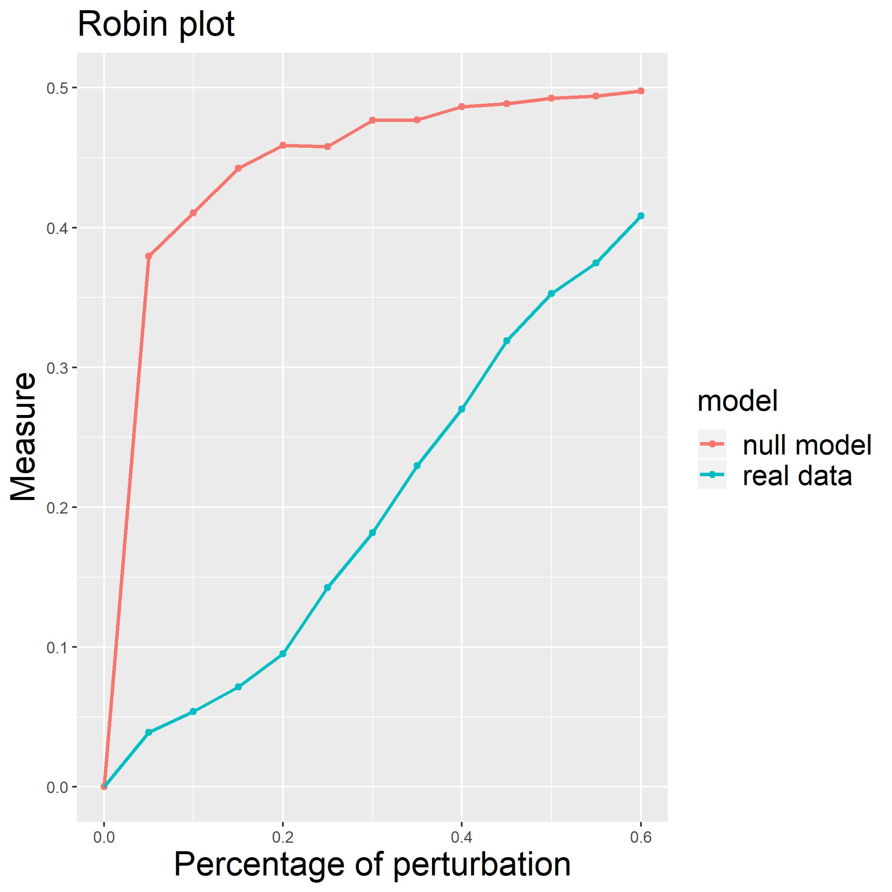

# Introduction {#sec:intro}

Over the last twenty years, network science has become a strategic field
of research thanks to the strong development of high-performance
computing technologies. The activity and interaction of thousands of
elements can now be measured simultaneously, allowing us to model
cellular networks, social networks, communication networks, power grids,
and trade networks, to cite a few examples. Different types of data will
produce different types of networks in terms of structure, connectivity,
and complexity. In the study of complex networks, a network is said to
have a community structure if the nodes are densely connected within
groups but sparsely connected between them [@GirvanNewman:2002]. The
inference of the community structure of a network is an important task.
Communities allow us to create a large-scale map of a network since
individual communities act like meta-nodes in the network, which makes
its study easier. Moreover, community detection can predict missing
links and identify false links in the network. Despite its difficulty, a
huge number of methods for community detection have been developed to
deal with different size complexity and made available to the scientific
community by open-source software packages. In this paper, we will
address a specific question: are the detected communities significant,
or are they a result of chance only due to the positions of edges in the
network?

An important answer to this question is the Order Statistics Local
Optimisation Method ($OSLOM$, <http://www.oslom.org/>) presented in
[@Lancichinetti_et_al:2011]. $OSLOM$ introduces an iterative technique
based on the local optimization of a fitness function, the C-score
[@Lancichinetti_et_al:2010], expressing the statistical significance of
a cluster with respect to random fluctuations. The significance is
evaluated by fixing a threshold parameter P a priori.

Another interesting approach is the Extraction of Statistically
Significant Communities ($ESSC$, <https://github.com/jdwilson4/ESSC>)
technique proposed in [@Wilson_et_al:2014]. The algorithm is iterative
and identifies statistically stable communities measuring the
significance of connections between a single vertex and a set of
vertices in undirected networks under the configuration model
[@Bender_Canfield:1978] used as the null hypothesis. The method employs
multiple testing and false discovery rate control to update the
candidate community.

[@Kojaku_Masuda:2018] introduced the QStest
(<https://github.com/skojaku/qstest/>), a method to statistically test
the significance of individual communities in a given network. Their
algorithm works with different detection algorithms using a quality
function that is consistent with the one used in community detection and
takes into account the dependence of the quality function value on the
community size. QStest assesses the statistical significance under the
configuration model too.

Very recently, [@He_et_al:2020] suggested the Detecting statistically
Significant Communities (DSC) method, a significance-based community
detection algorithm that uses a tight upper bound on the p-value under
the configuration model coupled with an iterative local search method.

OSLOM, ESSC, and DSC assess the statistical significance of every single
community analytically while QStest adopts the sampling method to
calculate the p-value of a given community. Moreover, all of them detect
statistically significant communities under the configuration model, and
only QStest is independent of the detection algorithm.

We present robin (ROBustness In Network), an R/CRAN package whose
purpose is to give clear indications about the reliability of one or
more community detection algorithms understudy, analyzing their
robustness with respect to random perturbations. The idea behind robin
is that if a partition is significant, it will be recovered even if the
structure of the graph is modified. Alternatively, if the partition is
not significant, minimal modifications of the graph will be sufficient
to change it. robin is inspired by the concept presented by
[@Carissimo_et_al:2018], who studied the stability of the recovered
partition against random perturbations of the original graph structure
using tools from Functional Data Analysis (FDA).

robin provides the best choice among the variety of the existing methods
for the network of interest. It is based on a procedure that gives the
opportunity to use the community detection techniques implemented in the
igraph package [@Csardi:2019] while providing the user with the
possibility to include other community detection algorithms. robin
initially detects if the community structure found by some algorithms is
statistically significant, then it compares the different selected
detection algorithms on the same network. robin assumes undirected
graphs without loops and multiple edges.

robin looks at the global stability of the detected partition and not of
single communities but accepts any detection algorithm and any random
model, and these aspects differentiate it from OSLOM, ESSC, DSC, and
QStest. Unlike other studies that treat the comparison between
algorithms in a theoretical way, such as [@Yang_et_al:2016], robin aims
to give a practical answer to such a comparison that can vary with the
network of interest.

# The model {#sec:model}

robin implements a methodology that examines the stability of the
recovered partition by one or more algorithms. The methodology is useful
for two purposes: to detect if the community structure found is
statistically significant or is a result of chance; to choose the
detection algorithm that better fits the network under study. These are
implemented following two different workflows.

The ***[first workflow]{.underline}*** tests the stability of the
partitions found by a single community detection algorithm against
random perturbations of the original graph structure. To address this
issue, we specify a perturbation strategy (see subsection ) and a null
model to build some procedures based on a prefixed stability measure
(see subsection ). Given:

-   a network of interest $g1$

-   its corresponding null random model $g2$

-   a Detection Algorithm (DA)

-   a stability measure (M)

Our process builds two curves as functions of the perturbation level
$p$, as shown in Figure [1](#fig:PlotExample){reference-type="ref"
reference="fig:PlotExample"}, and tests their similarity by two types of
functional statistical tests (see subsection ).

{#fig:PlotExample width=".5\\textwidth"
height="6cm"}

The first curve $Mc$ is obtained by computing M between the partition of
the original network $g1$ and the partition of a different perturbed
version of $g1$. The second curve $Mc_{random}$ is obtained by computing
M between the partition of a null random network $g2$ and the partition
of a different perturbed version of $g2$.

The comparison between the two M curves enables us to reconsider the
problem regarding the significance of the retrieved community structure
in the context of stability/robustness of the recovered partition
against perturbations. The basic idea is that if small changes in the
network cause a completely different grouping of the data, the detected
communities are not reliable. For a better understanding of this point,
we refer the reader to the paper [@Carissimo_et_al:2018] where the
methodology was developed.

The choice of the null model plays a key role because we would expect it
to reproduce the same structure of the real network but with completely
random edges. For this reason, robin offers two possibilities: a degree
preserving randomization by using the rewire function of the
[igraph](https://CRAN.R-project.org/package=igraph) package or a model
chosen by the user.

The degree preserving randomization, i.e., Configuration Model (CM), is
a model able to capture and preserve strongly heterogeneous degree
distributions often encountered in real network data sets and is the
standard null model for empirical patterns. Nevertheless, it can happen
that it is not sufficient to preserve only the degree of the graph
understudy, so robin allows the user to include their own null model.

In section , we explore the $dk$ null random model provided in
[@Orsini_et_al:2015], whose code is available at
<https://github.com/polcolomer/RandNetGen> as a possible alternative to
CM. The *dk*-series model generates a random graph preserving the global
organization of the original network at various increasing levels of
details chosen by the user via the setting of the parameter $d$. More
precisely, the *dk*-series is a converging series of properties that
characterize the local network structure at an increasing level of
detail and define a corresponding series of null models or random graph
ensembles. Increasing values of $d$ capture progressively more
properties of the network: *dk* 1 is equivalent to randomizing the
network fixing only the degree sequence, *dk* 2 fixes additionally the
degree correlations, *dk* 2.1 fixes also the clustering coefficient, and
*dk* 2.5 the full clustering spectrum.

The first workflow is summarised as follows (see Figure
[2](#fig:Flowchart1){reference-type="ref" reference="fig:Flowchart1"}):

1.  find a partition $C_1$ for the real network and a partition $C_2$
    for the null network,

2.  perturb both networks,

3.  retrieve two new partitions $C_{1(p)}$ and $C_{2(p)}$,

4.  calculate two clustering distances (for the real network and the
    null network) between the original partitions and the ones obtained
    from the perturbed network as:
    $$M\left(C_{1\left(p\right)},C_1\right) \quad \mathrm{and} \quad M\left(C_{2\left(p\right)},C_2\right)$$

Steps 2) - 4) are computed at different perturbation levels
$p \in [0:0.05:0.6]$ to create two curves, one for the real network and
one for the null model, then their similarity is tested by two
functional statistical tests described in subsection .

{#fig:Flowchart1 width=".9\\textwidth"
height="9cm"}

This procedure allows the filtering of the detection algorithms
according to their performance. Moreover, the selected ones can be
compared using the second workflow.

The ***[second workflow]{.underline}*** helps to choose among different
community detection algorithms the one that best fits the network of
interest, comparing their robustness two at a time. More precisely, the
technique (see Figure [3](#fig:Flowchart2){reference-type="ref"
reference="fig:Flowchart2"}):

1.  find two partitions $C_1$ and $C_2$ inferred by two different
    algorithms on the network under study,

2.  perturb the network creating a new one,

3.  retrieve two new partitions $C_{1(p)}$ and $C_{2(p)}$,

4.  evaluate $M\left(C_{1\left(p\right)},C_1\right)$ and
    $M\left(C_{2\left(p\right)},C_2\right)$.

Steps 2) - 4) are repeated at different perturbation levels
$p \in [0:0.05:0.6]$ to create two curves and then their similarity is
tested.

{#fig:Flowchart2 width=".9\\textwidth"
height="9cm"}

## Perturbation strategy

The perturbed network has been restricted to have the same number of
vertices and edges as the original unperturbed network. Therefore, only
the positions of the edges are changed. It is expected that if a
community structure is robust, it should be stable under small
perturbations of the edges. This is because perturbing the network edges
by a small amount will imply just a small percentage of nodes to be
moved in different communities; on the other hand, perturbing a high
percentage of the edges in the network will produce random clusters.
Note that zero perturbation $p=0$ corresponds to the original graph
while a maximal perturbation level $p=1$ will correspond to the random
graph. Therefore, in robin, the perturbation of a network preserves the
degree distribution of the original network.

Two different procedures for the perturbation strategy are implemented,
namely independent and dependent types. The independent strategy
introduces a percentage $p$ of perturbation in the original graph at
each iteration, for $p=0,\dots,p_{max}$. Whereas the dependent procedure
introduces $5\%$ of perturbation at each iteration on the previous
perturbed graph, starting from the original network, until $p_{max}$ of
the graph's edges are perturbed. In the implementation of the
perturbation strategy, we set up $p_{max}=0.6$, because the structure of
the network becomes random if we perturb more than $50\%$ of the edges.

In particular, we noticed that the greatest modification of the network
structure happens for a perturbation level between $30\%$ and $40\%$ if
a network is robust, while it happens at very low perturbation levels if
the network is not robust.

We stress again that the M curve for a network with a strong structure
grows rapidly (perturbation level between 0$\%$ and 40$\%$) then levels
off when $50\%<p<100\%$.

Moreover, the choice $p_{max}=0.6$ reduces computational time and shows
more clearly the differences between the curves.

Varying the percentage of perturbation, many graphs are generated and
compared by means of the stability measure chosen. For each perturbation
level, we generated 10 perturbed graphs and calculated the stability
measure. From each of these graphs, we generated 9 more by rewiring an
additional $1\%$ of the edges. Therefore, the procedure generates 100
graphs with the respective stability measures for each level of $p$ and
gives as output the mean of the stability measure for every 10 graphs
generated.

## Stability measure

The procedure we implemented is based on four different stability
measures:

-   the Variation of Information (VI) proposed by [@Meila:2007],

-   the Normalized Mutual Information (NMI) measure proposed by
    [@Danon_et_al:2005],

-   the split-join distance of [@vanDongen:2000],

-   the Adjusted Rand Index (ARI) by [@HubertArabie:1985].

VI measures the amount of information lost and gained in changing from
one cluster to another, while split-join distance calculates the number
of nodes that have to be exchanged to transform any of the two
clusterings into the other; but for both of them, low values represent
more similar clusters, and high values represent more different
clusters. On the contrary, NMI and ARI are similarity measures, and
therefore, lower values identify more different clusters and higher
values more similar ones. To make all the measures comparable, we
considered the 1-1 transformation for the NMI and the ARI since they
vary between $[0,1]$ as: $$\begin{aligned}
f\left(X\right)=1-X  \end{aligned}$$ Only two of the four proposed
stability measures, i.e., split-join and VI, are distances. They differ
in their dependency on the number of clusters K: while the VI distance
grows logarithmically with K, the split-join metric grows with K toward
the upper bound of 1. To make the four different stability measures
comparable, we normalized VI and split-join between 0 and 1 (i.e., we
divided the VI and the split-join by their maximum, respectively
$\log\left(n\right)$ and $2n$, where n indicates the number of vertices
in the graph).

## Statistical tests

robin allows different multiple statistical tests to check the
differences between the real and the random curve or between the curves
built from two different detection algorithms. The variation of $p$ from
$0$ to $0.6$ induces an intrinsic order to the data structure as in
temporal data. This lets $p$ assume, the same role as a time point in a
temporal process, and as a consequence, we can use any suitable time
series approach to compare our curves. In the following, we describe the
use of two such approaches.

The first is a test based on the Gaussian Process regression (GP)
described in [@KalaitzisLawrence_paper:2011]. In this paper, the authors
use GP to compare treatment and control profiles in biological
time-course experiments. The main idea is to test if two time series
represent the same or two different temporal processes. A Gaussian
process is a collection of random variables, any finite number of which
have a joint Gaussian distribution and is completely specified by its
mean function and its covariance function, see e.g., [@Rasmussen:2006].
Given the mean function $m\left(x\right)$ and the covariance function
$k\left(x,x'\right)$ of a real process $f\left(x\right)$, we can write
the GP as:
$$f\left(x\right) \sim \mathcal{GP}\left(m\left(x\right), k\left(x,x'\right)\right).$$
The random variables
$\mathbf{f}=\left(f\left(X_1\right),\dots,f\left(X_n\right)\right)^T$
represent the value of the function $f(x)$ at time locations
$\left(X_i\right)_{i=1,\dots,n}$, being $f(x)$ the true
trajectory/profile of the gene. Assuming $f(x)=\Phi(x)^T\mathbf{w}$,
where $\Phi(x)$ are projection basis functions, with prior
$\mathbf{w} \sim N(\mathbf{0},\sigma_{\mathbf{w}}^2\mathbf{I})$, we have
$$\begin{aligned}
&&m\left(x\right)=\Phi\left(x\right)^TE\left[\mathbf{w}\right]=0, \quad k\left(x,x'\right)=\sigma_{\mathbf{w}}^2\Phi\left(x\right)^T\Phi\left(x\right) \label{GPbayes_mean_cov}\\
&&f\left(x\right) \sim \mathcal{GP}\left(0,\sigma_{\mathbf{w}}^2\Phi\left(x\right)^T\Phi\left(x\right)\right).\end{aligned}$$
Since observations are noisy, i.e.,
$\mathbf{y}=\mathbf{\Phi w}+\pmb{\varepsilon}$, with
$\mathbf{\Phi}=(\Phi(X_1)^T,\dots,\Phi(X_n)^T)$, assuming that the noise
$\pmb{\varepsilon} \sim N(\mathbf{0},\sigma_n^2\mathbf{I})$ and using
Eq. ([\[GPbayes_mean_cov\]](#GPbayes_mean_cov){reference-type="ref"
reference="GPbayes_mean_cov"}), the marginal likelihood becomes:
$$\begin{aligned}
p(\mathbf{y} | \mathbf{x})=\frac{1}{\left(2\pi\right)^{n/2}\left|\mathbf{K_y}\right|^{1/2}}\mathrm{exp}\left(-\frac{1}{2}\mathbf{y}^t\mathbf{K_y}^{-1}\mathbf{y}\right), \label{GPmarginal}\end{aligned}$$
with
$\mathbf{K_y}=\sigma_{\mathbf{w}}^2\mathbf{\Phi}\mathbf{\Phi}^T+\sigma_n^2\mathbf{I}$.

In this framework, the hypothesis testing problem over the perturbation
interval $[0,p_{max}]$ can be reformulated as:
$$H_0: \log_2  \frac{M_1\left(x\right)}{M_2\left(x\right)}  \sim GP\left(0,k\left(x,x'\right)\right)  \quad \mathrm{against} \quad H_1: \log_2  \frac{M_1\left(x\right)}{M_2\left(x\right)} \sim GP\left(m\left(x\right),k\left(x,x'\right)\right)  ,$$
where $x$ represents the perturbation level. To compare the two curves,
robin uses the Bayes Factor (BF), which is approximated with a log-ratio
of marginal likelihoods of two GPs, each one representing the hypothesis
of differential (the profile has a significant underlying signal) and
non-differential expression (there is no underlying signal in the
profile, just random noise).

The second test implemented is based on the Interval Testing Procedure
(ITP) described in [@PiniVantini:2016]. The ITP provides an
interval-wise nonparametric functional testing and is not only able to
assess the equality in distribution between functions, but also to
underline specific differences. Indeed, users can see where are
localized the differences between the two curves. The Interval Testing
Procedure is based on:

1.  Basis Expansion: functional data are projected on a functional basis
    (i.e. Fourier or B-splines expansion);

2.  Interval-Wise Testing: statistical tests are performed on each
    interval of basis coefficients;

3.  Multiple Correction: for each component of the basis expansion, an
    adjusted ***p***-value is computed from the ***p***-values of the
    tests performed in the previous step.

In summary, GP provides a global answer on the dissimilarity of the two
M curves, while ITP points out local changes between such curves. As a
rule of thumb, we suggest initially using GP to flag a difference and
then ITP to understand at which level of perturbation such a difference
is locally significant.

We also provide a global method to quantify the differences between the
curves when they are very close. This is based on the calculation of the
area under the curves with a spline approach.

# Package structure

## Installation

Once in the R environment, it is possible to install and load the robin
package with its dependencies, as follows:

::: example
install.packages(\"robin\")
:::

The robin package includes as dependencies igraph [@Csardi:2019],
[networkD3](https://CRAN.R-project.org/package=networkD3)
[@Allaire:2017], [ggplot2](https://CRAN.R-project.org/package=ggplot2)
[@Wickham:2019],
[gridExtra](https://CRAN.R-project.org/package=gridExtra) [@Auguie2017],
[fdatest](https://CRAN.R-project.org/package=fdatest)
[@PiniVantini:2015] ,
[gprege](https://www.bioconductor.org/packages/release/bioc/html/gprege.html)
[@KalaitzisLawrence2011], and
[DescTools](https://CRAN.R-project.org/package=DescTools)
[@Signorell2019] packages. All, except gprege which is a Bioconductor
package, are automatically loaded with the command:

::: example
library(robin).
:::

To install the gprege package, start R and enter:

::: example
if (!requireNamespace(\"BiocManager\", quietly = TRUE))
install.packages(\"BiocManager\") BiocManager::install(\"gprege\")
:::

## Data import and visualization

robin is a user-friendly software providing some additional functions
for data import and visualization, such as prepGraph, plotGraph, and
plotComm. The function prepGraph, required by the procedure, reads, and
simplifies undirected graphs removing loops and multiple edges. The
available input graphs formats are: "edgelist", "pajek", "ncol", "lgl",
"graphml", "dimacs", "graphdb", "gml", "dl", and an igraph object. The
function plotGraph, with the aid of the network3D package, starting from
an igraph object loaded with prepGraph, shows an interactive 3D
graphical representation of the network, useful to visualize the network
of interest before the analysis. Furthermore, the function plotComm
helps to plot a graph with colorful nodes that simplifies the
visualization of the detected communities, given the membership of the
communities.

## Procedures

robin embeds all the community detection algorithms present in igraph.
They can be classified as in [@Fortunato:2009]

**modularity based methods:**

-   cluster_fast_greedy [@Clauset:2005]

-   cluster_leading_eigen [@Newman:2006]

-   cluster_louvain [@Blondel:2008]

**divisive algorithms:**

-   cluster_edge_betweenness [@Newman:2004]

**methods based on statistical inference:**

-   cluster_infomap [@Rosvall:2008]

**dynamic algorithms:**

-   cluster_spinglass [@Reichard:2006]

-   cluster_walktrap [@Pons:2005]

**alternative methods:**

-   cluster_label_prop [@Raghavan:2007].

robin gives the possibility to input a custom external function to
detect the communities. The user can provide his own function as a value
of the parameter FUN in both analyses, implemented into the functions
robinRobust and robinCompare. These two functions create the internal
process for perturbation and measurement of communities stability. In
particular robinRobust tests the robustness of a chosen detection
algorithm and robinCompare compares two different detection algorithms.
The option `measure` in the robinRobust and robinCompare functions
provides the flexibility to choose between the four different measures
listed in the subsection .

robin offers two choices for the null model to set up for robinRobust:

-   external building according to users' preferences, then the null
    graph is passed as a variable,

-   generation by using the function random.

The function random creates a random graph with the same degree
distribution as the original graph, but with completely random edges, by
using the rewire function of the igraph package with the
`keeping_degseq` option that preserves the degree distribution of the
original network. The function rewire randomly assigns a number of edges
between vertices with the given degree distribution. Note that robin
assumes undirected graphs without loops and multiple edges which are
directly created, from any input graph, by the function prepGraph.

## Construction of curves

The plotRobin function allows the user to generate two curves based on
the computation of the chosen stability measures.

When plotRobin is used on the output of robinRobust, i.e., the first
step of the overall procedure, the first curve represents the measure
between the partition of the original unperturbed graph and the
partition of each perturbed graph (blue curve in Figure
[\[fig:PlotComparison\]](#fig:PlotComparison){reference-type="ref"
reference="fig:PlotComparison"}-Left panel), and the second curve is
obtained in the same way but considering as the original graph the
random graph (red curve in Figure
[\[fig:PlotComparison\]](#fig:PlotComparison){reference-type="ref"
reference="fig:PlotComparison"}-Left panel). The comparison between the
two curves turns the question about the significance of the retrieved
community structure into the study of the robustness of the recovered
partition against perturbation.

When plotRobin is used on the output of robinCompare, i.e. the second
step of the overall procedure, it generates a plot that depicts two
curves, one for each clustering algorithm. In the right panel of Figure
[\[fig:PlotComparison\]](#fig:PlotComparison){reference-type="ref"
reference="fig:PlotComparison"}, each curve is obtained by computing the
measure between the partition of the original unperturbed graph with the
partition of each perturbed graph, where the partition method is either
Louvain (blue curve) or Fast Greedy (red curve).

{width=".4\\textwidth" height="5cm"}
{width=".4\\textwidth" height="5cm"}

## Testing

The GP test is implemented in robinGPTest and uses the R package gprege
[@KalaitzisLawrence2011]. The ITP test is implemented in robinFDATest
and uses the R package fdatest [@PiniVantini:2015]. The area under the
curves is calculated by the function robinAUC and relies on the
DescTools package. Figure
[4](#fig:PlotComparisonFDA){reference-type="ref"
reference="fig:PlotComparisonFDA"} shows the curves for the comparison
of Louvain and Fast greedy algorithms' performance generated by the VI
stability measure using the Interval Testing Procedure on the American
College Football network (left panel) [@GirvanNewman:2002] and
corresponding adjusted ***p***-values (right panel).

{#fig:PlotComparisonFDA width=".9\\textwidth"
height="6cm"}

All the functions implemented in robin are summarized in Table
[1](#tab-functions){reference-type="ref" reference="tab-functions"}.

::: {#tab-functions}
  ------------------------- ----------------------------------------------------------------------------------------------
  **Import/Manipulation**   
                            
  prepGraph                 Management and preprocessing of input graph
                            
  random                    Building of null model
                            
  **Analysis**              
                            
  robinRobust               Comparison of a community detection method versus random perturbations of the original graph
                            
  robinCompare              Comparison of two different community detection methods
                            
  **Visualization**         
                            
  methodCommunity           Detection of the community structure
                            
  membershipCommunities     Detection of the membership vector of the community structure
                            
  plotGraph                 Graphical interactive representation of the network
                            
  plotComm                  Graphical interactive representation of the network and its communities
                            
  plotRobin                 Plots of the two curves
                            
  **Test**                  
                            
  robinGPTest               GP test and evaluation of the Bayes factor
                            
  robinFDATest              ITP test and evaluation of the adjusted p-values
                            
  robinAUC                  Evaluation of the area under the curve
  ------------------------- ----------------------------------------------------------------------------------------------

  : Summary of the functions implemented in robin.
:::

## Computational time

The time complexity of the proposed strategy, more precisely of the
robinRobust function, is evaluated as follows. Generating a rewired
network with $N$ nodes and $M$ edges consumes $O(N+M)$ time, for both
the real and the null model. For each network, we detect the
communities, using any community detection algorithm present in igraph
or any custom external algorithm inserted by the user, and calculate a
stability measure. Let D be the time complexity associated with the
community detection algorithm chosen. The overall procedure is iterated
$k=100$ times for each percentage $p$ of the $n_p=12$ perturbation
levels ($p \in [0,p_{max}]$, $p_{max}=0.6$). In total, the proposed
procedure requires $O(D+(((N+M+D)*k)*n_p))$ time both for the real and
the null model.

In Table [2](#tab-Time){reference-type="ref" reference="tab-Time"}, we
show the computational time evaluated on a computer with an Intel 4 GHz
i7-4790K processor and 24GB of memory. In this example, we used
$Louvain$ as a detection algorithm on the $LFR$ benchmark graphs
[@Lancichinetti_2008]. The time complexity could be mitigated using
parallel computing, but this is not yet implemented.

::: {#tab-Time}
  --------- --------- ----------
  100       500       2.1
  1000      9267      36.1
  10000     100024    361.8
  100000    994053    9411.6
  1000000   8105913   110981.5
  --------- --------- ----------

  : Computational time
:::

# Example test: the American College football network

robin includes the *American College football* benchmark dataset as an
analysis example that is freely available at
<http://www-personal.umich.edu/~mejn/netdata/>. The dataset contains the
network of United States football games between Division I colleges
during the 2000 season [@GirvanNewman:2002]. It is a network of 115
vertices that represent teams (identified by their college names) and
613 edges that represent regular-season games between the two teams they
connect. The graph has the ground truth, where each node has a value
that indicates to which of the 12 conferences it belongs, and this
offers a good opportunity to test the ability of robin to validate the
community robustness. It is known that each conference contains around
8-12 teams. The games are more frequent between members of the same
conference than between members of different conferences. They are on
average seven between teams of the same conference and four between
different ones. We applied all the methods listed in subsection to this
network, choosing as measure the VI metric.

Note that the variable $DA$ refers to the detection algorithms present
in igraph and can assume the following values: *fastGreedy*, *infomap*,
*walktrap*, *edgeBetweenness*, *spinglass*, *leadingEigen*, *labelProp*,
*louvain*. The function compare is contained in the package igraph and
permits the assessment of the distance between two community structures
according to the chosen method.

Table [3](#tab-VIresults){reference-type="ref"
reference="tab-VIresults"} summarizes the VI results calculated between
the real communities and the ones that the detection algorithms created.

::: {#tab-VIresults}
  -------------------------- -------
  cluster_infomap            0.054
  cluster_spinglass          0.063
  cluster_louvain            0.076
  cluster_label_prop         0.076
  cluster_walktrap           0.078
  cluster_edge_betweenness   0.083
  cluster_fast_greedy        0.185
  cluster_leading_eigen      0.196
  -------------------------- -------

  : VI measure between different methods and ground-truth.
:::

It is possible to observe that the best performance is offered by
Infomap, having the lowest VI value, followed by Spinglass. Louvain,
Propagating Labels, Walktrap, and Edge betweenness have a similar
intermediate VI value, while the worst performance is given by Fast
greedy and Leading eigenvector. Then, we used robin to check if the
results are confirmed by looking at the VI curves and the results of the
testing procedure for the second workflow, i.e., the one comparing two
detection algorithms, considering Infomap versus all the others.

::: example
comp \<- robinCompare(graph=graph, method1=DA1, method2=DA2,
measure=\"vi\", type=\"independent\")

plotRobin(graph=graph, model1=comp$Mean1, model2=comp$Mean2,
measure=\"vi\")
:::

Figure [5](#fig:PlotComparison_allInfomap){reference-type="ref"
reference="fig:PlotComparison_allInfomap"} shows the results we
obtained. If we focus on the perturbation interval $[0,0.3]$, it is
possible to note the similar behavior between the curves representing
Infomap/Spinglass, Infomap/Louvain, Infomap/Propagating Labels,
Infomap/Walktrap, and Infomap/Edge betweenness, with a closer distance
between Infomap/Spinglass. On the contrary, the curves Infomap/Fast
greedy and Infomap/Leading eigenvector have an opposite behavior,
building almost an ellipse. This confirms what is displayed in Table
[3](#tab-VIresults){reference-type="ref" reference="tab-VIresults"}.

{#fig:PlotComparison_allInfomap
width="14cm"}

In our overall procedure, we explored two different ways of generating a
null model, namely the Configuration Model (CM) and the *dk*-series
model.

::: example
graphRandomCM \<- random(graph=graph) graphRandomDK \<-
prepGraph(file=\"dk2.1_footballEdgelist.txt\", file.format =
\"edgelist\")

plotGraph(graph) plotGraph(graphRandomCM) plotGraph(graphRandomDK)
:::

The different structures provided by the real data network, CM, and
*dk*-series with $d=2.1$ are shown in Figure
[6](#fig:PlotGraph){reference-type="ref" reference="fig:PlotGraph"}.

{#fig:PlotGraph width="14cm"}

The CM generates a random graph with the same degree sequence as the
original one but with a randomized group structure. Our experiments show
that CM is not a good null model when using Propagating Labels and
Infomap as community extraction methods (Figure
[7](#fig:PlotConfigurationModel){reference-type="ref"
reference="fig:PlotConfigurationModel"}). In fact, when the modularity
is low, these two algorithms tend to assign all the nodes to the same
community, hence resulting in a flat stability measure curve. We
launched the function robinRobust to assess the robustness of each
detection algorithm.

::: example
proc_CM \<- robinRobust(graph=graph, graphRandom=graphRandomCM,
measure=\"vi\", method=DA, type=\"independent\")

plotRobin(graph=graph, model1=proc_CM$Mean,model2=proc_CM$MeanRandom,
measure=\"vi\")
:::

{#fig:PlotConfigurationModel
width="14cm"}

The *dk*-series model generates a random graph preserving the global
organization of the original network at various increasing levels of
details chosen by the user via the setting of the parameter $d$. In
particular, we chose the *dk* random graph with d=2.1.

::: example
proc_DK \<- robinRobust(graph=graph, graphRandom=graphRandomDK,
measure=\"vi\", method=\"fastGreedy\", type=\"independent\")

plotRobin(graph=graph, model1=proc_DK$Mean, model2=proc_DK$MeanRandom,
measure=\"vi\")
:::

Figure [8](#fig:PlotDkModel){reference-type="ref"
reference="fig:PlotDkModel"} shows the stability measure curves of each
detection algorithm compared to dk 2.1 null model. For all the methods,
the two curves are very close due to the capability of the null model to
preserve a structure similar to the real network and visually confirm
the results in Table [3](#tab-VIresults){reference-type="ref"
reference="tab-VIresults"}.

{#fig:PlotDkModel
width="14cm"}

Moreover, for the *dk*-series model, we tested the differences between
the two curves using the GP methodology implemented in the function in
robinGPTest.

::: example
BFdk \<- robinGPTest(model1=proc_DK$Mean, model2=proc_DK$MeanRandom)
:::

The results are shown in Table [4](#tab-BayesAIC){reference-type="ref"
reference="tab-BayesAIC"} and agree with those shown in Table
[3](#tab-VIresults){reference-type="ref" reference="tab-VIresults"}.

::: {#tab-BayesAIC}
                                     AUC
  -------------------------- ------- -------
  cluster_infomap            53.67   1.133
  cluster_spinglass          40.55   1.249
  cluster_louvain            31.52   1.208
  cluster_label_prop         102.2   0.852
  cluster_walktrap           30.74   1.204
  cluster_edge_betweenness   31.10   1.194
  cluster_fast_greedy        0.001   1.017
  cluster_leading_eigen      8.474   1.042

  : Bayes Factor and AUC ratio for *dk* -series with $d=2.1$
:::

Fastgreedy clearly fails in recovering the communities. LeadingEigen has
stronger evidence but too weak when compared to the other methods.
Louvain, Walktrap, and EdgeBetweenness have the same strong evidence
followed by Spinglass and Infomap. LabelProp shows the strongest
evidence, but the result is obviously influenced by the swap between the
two curves when the perturbation is greater than 20$\%$, underlying a
worse performance of the algorithm. The same swap can be noted for
Infomap at 35$\%$ perturbation level, but with less difference between
the two curves. This is confirmed by the fact that the ratios between
the AUC of the real null model curve and the AUC of the real network are
close to 1.

::: example
AUC \<- robinAUC(graph=graph, model1=proc_DK$Mean,
                model2=proc_DK$MeanRandom, measure=\"vi\") AUCdkratio
\<- AUC$area2/AUC$area1
:::

Also, note that LabelProp originates the paradox that the AUC of the
real model curve exceeds the AUC of the null network, despite the
hypothesis testing result is positive. Hence, it is always the case to
look at the plots and AUC ratios.

# Conclusion {#sec:Conclusion}

In this paper, we presented robin, an R/CRAN package, to assess the
robustness of the community structure of a network found by one or more
detection methods, providing an indication of their reliability. The
procedure implemented is useful for comparing different community
detection algorithms and choosing the one that best fits the network of
interest. More precisely, robin initially detects if the community
structure found by some algorithms is statistically significant, then it
compares the different selected detection algorithms on the same
network. robin uses analysis tools set up for functional data analysis,
such as $GP$ regression and $ITP$. The core functions of the package are
robinRobust and robinCompare, which build the stability measure curves
for the null model and the network understudy for a fixed detection
algorithm and the stability measure for the network understudy for two
detection algorithms, respectively. Moreover, robinGPTest and
robinFDATest implement the GP test and the ITP test. We illustrated the
usage of the package on a benchmark dataset. The package is available on
CRAN at <https://CRAN.R-project.org/package=robin>.

# Computational details

The results in this paper were obtained using R 3.6.1 with the packages
igraph version 1.2.4.2, networkD3 version 0.4, ggplot2 version 3.2.1,
gridExtra version 2.3, fdatest version 2.1, gprege version 1.30.0, and
DescTools version 0.99.31. R itself and all packages used are available
from the Comprehensive R Archive Network (CRAN) at
<https://CRAN.R-project.org/>.

# Acknowledgements

This work was supported by the project Piattaforma Tecnologica ADVISE -
Regione Campania, by the project "TAILOR" (H2020-ICT-48 GA: 952215) and
by DiSTABiF at the University of Campania Luigi Vanvitelli that is
coordinating V.P. PhD program.

# Contributions

V.P. implemented the software and analyzed its properties. D.R.
supported V.P. in R package implementation. A.C., L.C., and I.D.F.
conceived the work, equally contributed to the development and
implementation of the concept, discussed and analyzed the results. A.C.,
L.C., I.D.F., and V.P. wrote the manuscript.
