::: article
# Introduction

The [*bestNormalize*](https://CRAN.R-project.org/package=bestNormalize)
package contains a suite of transformation-estimating functions that can
be used to normalize data. The function of the same name attempts to
find and execute the best of all of these potential normalizing
transformations. In this package, we define "normalize" as in "to render
data Gaussian", rather than transform them to a specific scale.

There are many instances where researchers may want to normalize a
variable. First, there is the (often problematic) assumption of
normality of the outcome (conditional on the covariates) in the
classical linear regression problem. Over the years, many methods have
been used to relax this assumption: generalized linear models, quantile
regression, survival models, etc. One technique that is still somewhat
popular in this context is to "beat the data" to look normal via some
kind of normalizing transformation. This could be something as simple as
a log transformation or something as complex as a Yeo-Johnson
transformation [@yeojohnson]. In fact, many complex normalization
methods were designed expressly to find a transformation that could
render regression residuals Gaussian. While perhaps not the most elegant
solution to the problem, often, this technique works well as a quick
solution. Another increasingly popular application of normalization
occurs in applied regression settings with highly skewed distributions
of the covariates [@kuhn2013APM]. In these settings, there exists the
tendency to have high leverage points (and highly influential points),
even when one centers and scales the covariates. When examining
interactions, these influential points can become especially problematic
since the leverage of that point gets amplified for every interaction in
which it is involved. Normalization of such covariates can mitigate
their leverage and influence, thereby allowing for easier model
selection and more robust downstream predictor manipulations (such as
principal components analysis), which can otherwise be sensitive to skew
or outliers. As a result, popular model selection packages such as
[*caret*](https://CRAN.R-project.org/package=caret) [@caret] and
[*recipes*](https://CRAN.R-project.org/package=recipes) [@recipes] have
built-in mechanisms to normalize the predictor variables (they call this
"preprocessing"). This concept is unique in that it forgoes the
assumption of linearity between the outcome (Y) and the covariate,
opting instead for a linear relationship between Y and the transformed
value of the covariate (which in many cases may be more plausible).

This package is designed to make normalization effortless and
consistent. We have also introduced Ordered Quantile (ORQ) normalization
via the `orderNorm` function, which uses a rank mapping of the observed
data to the normal distribution in order to guarantee normally
distributed transformed data (if ties are not present). We have shown
how ORQ normalization performs very consistently across different
distributions, successfully normalizing left- or right-skewed data,
multi-modal data, and even data generated from a Cauchy distribution
[@orq_paper].

In this paper, we describe our R package *bestNormalize*, which is
available via the Comprehensive R Archive Network (CRAN). First, we
describe normalization methods that have been developed and that we
implement in the package. Second, we describe the novel
cross-validation-based estimation procedure, which we utilize to judge
the normalization efficacy of our suite of normalization
transformations. Third, we go through some basic examples of
*bestNormalize* functionality and a simple implementation of our methods
within the *recipes* package. We illustrate a more in-depth use-case in
a car pricing application, performing a transform-both-sides regression
as well as comparing the performance of several predictive models fit
via *caret*. Finally, we conclude by discussing the pros and cons of
normalization in general and future directions for the package.

# Normalization methods

Many normalization transformation functions exist, and though some can
be implemented well in existing R packages, *bestNormalize* puts them
all under the same umbrella syntax. This section describes each
transformation contained in the *bestNormalize* suite.

::: {#the-box-cox-transformation}
## The Box-Cox transformation
:::

The Box-Cox transformation was famously proposed in @BoxCox1964 and can
be implemented with differing syntax and methods in many existing
packages in R (e.g., *caret*,
[*MASS*](https://CRAN.R-project.org/package=MASS) [@MASS], and more). It
is a straightforward transformation that typically only involves one
parameter, $\lambda$:

$$g(x; \lambda) = \boldsymbol 1 _{(\lambda \neq 0)} \frac{x^\lambda-1}{\lambda} 
+ \boldsymbol 1_{(\lambda = 0)} \log x\text{ ,}$$

where $x$ refers to the datum in its original unit (pre-transformation).
Given multiple observations, the $\lambda$ parameter can be estimated
via maximum likelihood, and $x$ must be greater than zero.

::: {#the-yeo-johnson-transformation}
## The Yeo-Johnson transformation
:::

The Yeo-Johnson transformation [@yeojohnson] attempts to find the value
of $\lambda$ in the following equation that minimizes the
Kullback-Leibler distance between the normal distribution and the
transformed distribution.

$$\begin{aligned}
g(x;\lambda) &= 
\boldsymbol 1 _{(\lambda \neq 0, x \geq 0)} \frac{(x+1)^\lambda-1}{\lambda} \\
&+ \boldsymbol 1_{(\lambda = 0, x \geq 0)} \log (x+1) \\
&+ \boldsymbol 1_{(\lambda \neq 2, x < 0)} \frac{(1-x)^{2-\lambda}-1}{\lambda - 2} \\
&+ \boldsymbol 1_{(\lambda = 2, x < 0)} -\log (1-x) \\
\end{aligned}$$

This method has the advantage of working without having to worry about
the domain of $x$. As with the Box-Cox $\lambda$, this $\lambda$
parameter can be estimated via maximum likelihood.

::: {#the-lambert-w-x-f-transformation}
## The Lambert W x F transformation
:::

The Lambert W x F transformation, proposed in @goerg2011 and implemented
in the [*LambertW*](https://CRAN.R-project.org/package=LambertW)
package, is essentially a mechanism that de-skews a random variable $X$
using moments. The method is motivated by a system theory and is alleged
to be able to transform any random variable into any other kind of
random variable, thus being applicable to a large number of contexts.
One of the package's main functions is `Gaussianize`, which is similar
in spirit to the purpose of this package. However, this method may not
perform as well on certain shapes of distributions as other candidate
transformations; see @orq_paper for some examples.

The `Gaussianize` transformation can handle three types of
transformations: skewed, heavy-tailed, and skewed heavy-tailed. For more
details on this transformation, consult the *LambertW*
documentation.[^1] While the transformations contained and implemented
by `bestNormalize` are reversible (i.e., 1-1), in rare circumstances, we
have observed that the `lambert` function can yield non-reversible
transformations.

::: {#the-ordered-quantile-technique}
## The Ordered Quantile technique
:::

The ORQ normalization technique (`orderNorm`) is based on the following
transformation (originally discussed, as far as we can find, in
@bartlett1947 and further developed in @van1952):

Let $\underline x$ refer to the original data. Then the transformation
is:

$$g(\underline x) = \Phi ^{-1} \left(\frac{\text{rank} (\underline x) - 1/2}{\text{length}(\underline x) }\right)$$

This nonparametric transformation as defined works well on the observed
data, but it is not trivial to implement in modern settings where the
transformation needs to be applied on new data; we discussed this issue
and our solution to it in @orq_paper. Basically, on new data *within*
the range of the original data, ORQ normalization will linearly
interpolate between two of the original data points. On new data
*outside* the range of the original data, the transformation
extrapolates using a shifted logit approximation of the ranks to the
original data. This is visualized below via the `iris` data set on the
`Petal.Width` variable.

<figure id="fig:orq_vis">
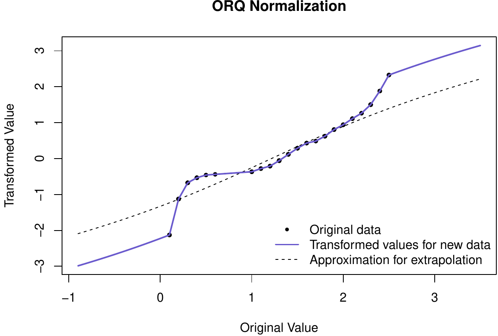
<figcaption>Figure 1: ORQ normalization visualization on Fisher’s iris
data.</figcaption>
</figure>

The shifted logit extrapolation ensures that the function is 1-1 and can
handle data outside the original (observed) domain. The effects of the
approximation will usually be relatively minimal since we should not
expect to see many observations outside the observed range if the
training set sample size is large relative to the test set. The ORQ
technique will not guarantee a normal distribution in the presence of
ties, but it still could yield the best normalizing transformation when
compared to the other possible approaches. More information on ORQ
normalization can be found in @orq_paper or in the *bestNormalize*
documentation.

::: {#other-included-transformations}
## Other included transformations
:::

In addition to the techniques above, the *bestNormalize* package
performs and evaluates:

-   $\log_b(x + a)$ where $a = \max(0, -\min(x) + \epsilon)$ and
    $b = 10$ by default
-   $\sqrt{x + a}$ where $a = \max(0, -\min(x))$ by default
-   $\exp(x)$
-   $\text {arcsinh}(x) = log(x + \sqrt{x^2 + 1})$

::: {#other-not-included-transformations}
## Other not-included transformations
:::

A range of other normalization techniques has been proposed that are not
included in this package (at the time of writing). These include (but
are not limited to): Modified Box-Cox [@BoxCox1964], Manly's Exponential
[@Manly], John/Draper's Modulus [@JohnDraper], and Bickel/Doksum's
Modified Box-Cox [@BickelDoksum]. However, it is straightforward to add
new transformations into the same framework as other included
transformations; each one is treated as its own S3 class, so in order to
add other transformations, all one must do is define a new S3 class and
provide the requisite S3 methods. To this end, we encourage readers to
submit a pull request to [the package's GitHub
page](https://github.com/petersonR/bestNormalize) with new
transformation techniques that could be then added as a default in
`bestNormalize`. Otherwise, in a later section, we show how users can
implement custom transformations alongside the default ones described
above.

# Which transformation "best normalizes" the data?

The `bestNormalize` function selects the best transformation according
to an extra-sample estimate of the Pearson P statistic divided by its
degrees of freedom ($DF$). This P statistic is defined as

$$P = \sum_{i=1}^{k} \frac{(O_i - E_i)^2}{E_i}\text{ ,}$$

where $O_i$ is the number observed, and $E_i$ is the number of expected
(under the hypothesis of normality) to fall into "bin" $i$. The bins (or
"classes") are built such that observations will fall into each one with
equal probability under the hypothesis of normality. A variety of
alternative normality tests exist, but this particular one is relatively
interpretable as a goodness of fit test, and the ratio $P/DF$ can be
compared between transformations as an absolute measure of departure
from normality. Specifically, if the data in question follow a normal
distribution, this ratio will be close to 1 or lower. The transformation
which produces data with the lowest normality statistic is thus the most
effective at normalizing the data, and gets selected by `bestNormalize`.
The *bestNormalize* package utilizes
[*nortest*](https://CRAN.R-project.org/package=nortest) [@nortest] to
compute this statistic; more information on its computation and degrees
of freedom can be found in @d1986goodness and @thode2002testing.

Normality statistics for all candidate transformations can be estimated
and compared with one simple call to `bestNormalize`, whose output makes
it easy to see which transformations are viable and which are not. We
have found that while complicated transformations are often *most*
effective and therefore selected automatically, sometimes a simple
transformation (e.g., the log or identity transforms) may be almost as
effective, and ultimately the latter type will yield more interpretable
results.

It is worth noting that when the normality statistic is estimated on
in-sample data, the ORQ technique is predestined to be most effective
since it is forcing its transformed data to follow a normal distribution
exactly [@orq_paper]. For this reason, by default, the `bestNormalize`
function calculates an *out-of-sample* estimate for the $P/DF$
statistic. Since this method necessitates cross-validation, it can be
computationally frustrating for three reasons: (1) the results and the
chosen transformation can depend on the seed, (2) it takes considerably
longer to estimate than the in-sample statistic, and (3) it is unclear
how to choose the number of folds and repeats.

In order to mediate these issues, we have built several features into
*bestNormalize*. Issue (1) is only important for small sample sizes, and
when it is a concern, the best transformations should look similar to
one another. We address two solutions to (2) in the next section. In
short, we have methods to parallelize or simplify the estimation of the
statistic. For (3), we recommend 10-fold cross-validation with 5 repeats
as the default, but if the sample is small, we suggest using 5 (or
fewer) folds instead with more repeats; accurate estimation of $P/DF$
requires a relatively large fold size (as a rule of thumb, 20
observations per fold seems to be enough for most cases, but this
unfortunately depends on the distribution of the observed data).

# Simple examples

In this section, we illustrate a simple use-case of the functions
provided in *bestNormalize*.

::: {#basic-implementation}
## Basic implementation
:::

First, we will generate and plot some skewed data:

``` r
x <- rgamma(250, 1, 1)
```

<figure id="fig:simple_hist">
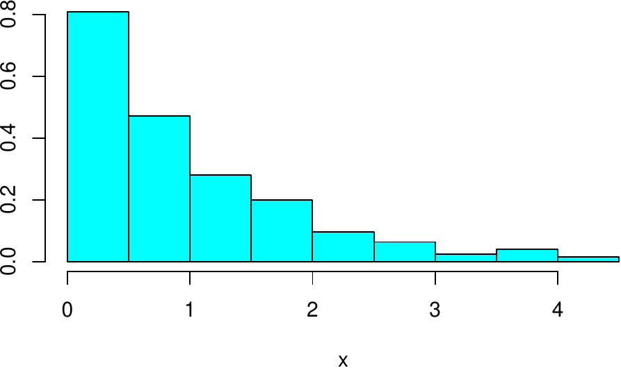
<figcaption>Figure 2: Simulated skewed data for simple
example.</figcaption>
</figure>

To perform a suite of potential transformations and see how effectively
they normalized this vector, simply call `bestNormalize`:

``` r
(BNobject <- bestNormalize(x))
```

``` r
#> Best Normalizing transformation with 250 Observations
#>  Estimated Normality Statistics (Pearson P / df, lower => more normal):
#>  - arcsinh(x): 1.7917
#>  - Box-Cox: 1.0442
#>  - Center+scale: 3.0102
#>  - Exp(x): 9.5306
#>  - Log_b(x+a): 1.7072
#>  - orderNorm (ORQ): 1.1773
#>  - sqrt(x + a): 1.144
#>  - Yeo-Johnson: 1.1875
#> Estimation method: Out-of-sample via CV with 10 folds and 5 repeats
#>  
#> Based off these, bestNormalize chose:
#> Standardized Box Cox Transformation with 250 nonmissing obs.:
#>  Estimated statistics:
#>  - lambda = 0.3254863 
#>  - mean (before standardization) = -0.3659267 
#>  - sd (before standardization) = 0.9807881
```

Evidently, the Box-Cox transformation performed the best, though many
other transformations performed similarly. We can visualize the suite of
transformations using the built-in `plot` method:

``` r
plot(BNobject, leg_loc = "topleft")
```

<figure id="fig:bn_plot">
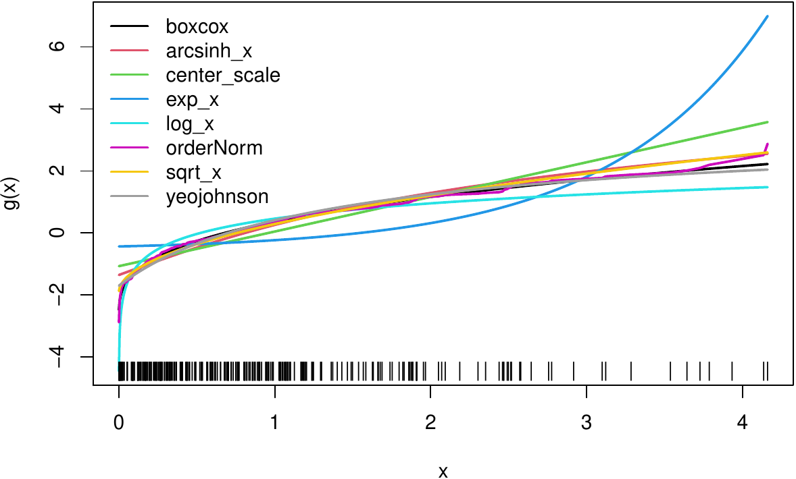
<figcaption>Figure 3: The suite of transformations estimated by default
in <em>bestNormalize</em> (trained on simulated right-skewed
data).</figcaption>
</figure>

Finally, we can execute the best performing normalization on new data
with `predict(BNobject, newx)` or reverse the transformation with
`predict(BNobject, newxt, inverse = TRUE)`. Note that normalized values
can either be obtained using `predict` or by extracting `x.t` from the
object. The best transformation, in this case, is plotted in Figure 4.

<figure id="fig:hist_best">
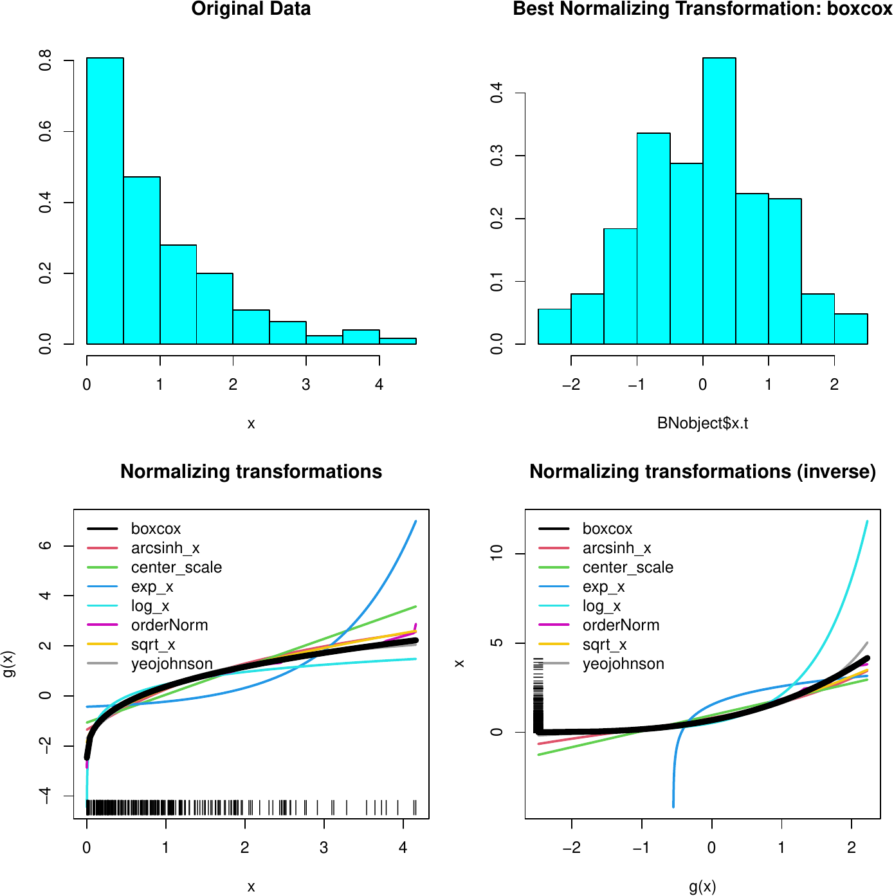
<figcaption>Figure 4: Summary of transformations performed on simulated
right-skewed data.</figcaption>
</figure>

::: {#performing-transformations-individually}
## Performing transformations individually
:::

Each method can be performed (and stored) individually:

``` r
(arcsinh_obj <- arcsinh_x(x))
```

``` r
#> Standardized asinh(x) Transformation with 250 nonmissing obs.:
#>  Relevant statistics:
#>  - mean (before standardization) = 0.7383146 
#>  - sd (before standardization) = 0.5458515
```

``` r
(boxcox_obj <- boxcox(x))
```

``` r
#> Standardized Box Cox Transformation with 250 nonmissing obs.:
#>  Estimated statistics:
#>  - lambda = 0.3254863 
#>  - mean (before standardization) = -0.3659267 
#>  - sd (before standardization) = 0.9807881
```

``` r
(yeojohnson_obj <- yeojohnson(x))
```

``` r
#> Standardized Yeo-Johnson Transformation with 250 nonmissing obs.:
#>  Estimated statistics:
#>  - lambda = -0.7080476 
#>  - mean (before standardization) = 0.4405464 
#>  - sd (before standardization) = 0.2592004
```

``` r
(lambert_obj <- lambert(x, type = "s"))
```

``` r
#> Standardized Lambert WxF Transformation of type s with 250 nonmissing obs.:
#>  Estimated statistics:
#>  - gamma = 0.3729
#>  - mean (before standardization) = 0.6781864 
#>  - sd (before standardization) = 0.7123011
```

``` r
(orderNorm_obj <- orderNorm(x))
```

``` r
#> orderNorm Transformation with 250 nonmissing obs and no ties 
#>  - Original quantiles:
#>    0%   25%   50%   75%  100% 
#> 0.001 0.268 0.721 1.299 4.161
```

All normalization techniques in `bestNormalize` have their own class
with convenient S3 methods and documentation. For instance, we can use
the `predict` method to perform the transformation on new values using
the objects we have just created, visualizing them in a plot:

``` r
xx <- seq(min(x), max(x), length = 100)
plot(xx, predict(arcsinh_obj, newdata = xx), type = "l", col = 1)
lines(xx, predict(boxcox_obj, newdata = xx), col = 2)
lines(xx, predict(yeojohnson_obj, newdata = xx), col = 3)
lines(xx, predict(orderNorm_obj, newdata = xx), col = 4)
```

<figure id="fig:vis_data2">
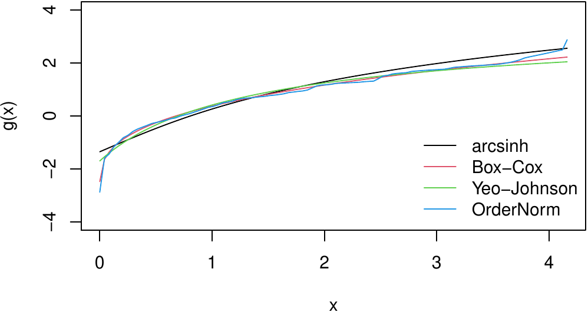
<figcaption>Figure 5: Manually plotting transformations trained on
simulated right-skewed data.</figcaption>
</figure>

::: {#in-sample-normalization-efficacy}
## In-sample normalization efficacy
:::

To examine how each of the normalization methods performed (in-sample),
we can visualize the transformed values in histograms (Figure 6), which
plot the transformed data, `x.t`, stored in the transformation objects
we created previously.

<figure id="fig:hist_trans">
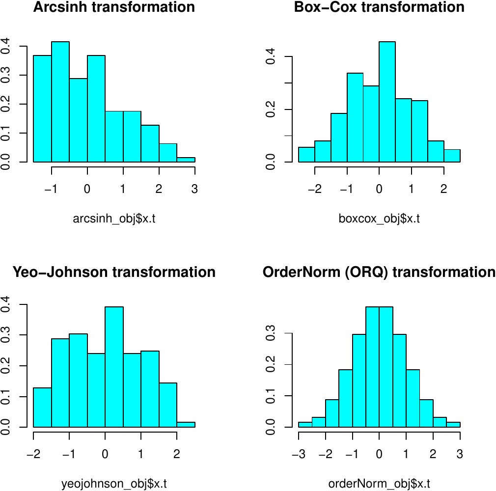
<figcaption>Figure 6: Normalized values for trained transformations on
simulated right-skewed data.</figcaption>
</figure>

Evidently, ORQ normalization appears to have worked perfectly to
normalize the data (as expected), and the Box-Cox method seemed to do
quite well too.

::: {#out-of-sample-normalization-efficacy}
## Out-of-sample normalization efficacy
:::

The `bestNormalize` function performs repeated (r=5) 10-fold
cross-validation (CV) by default and stores the estimated normality
statistic for each left-out fold/repeat into `oospreds`. Users can
access and visualize these results via a boxplot (see below), which may
give some insight into whether the transformation is truly preferred by
the normality statistic or if another (possibly simpler) transformation
can be applied that would achieve the approximately the same results. In
this example, Box-Cox, square-root, Yeo-Johnson, and ORQ seem to do
similarly well, whereas the identity transform[^2], hyperbolic arc-sine,
logging, and exponentiation are performing worse.

``` r
boxplot(BNobject$oos_preds, log = 'y')
abline(h = 1, col = "green3")
```

<figure id="fig:boxplot">
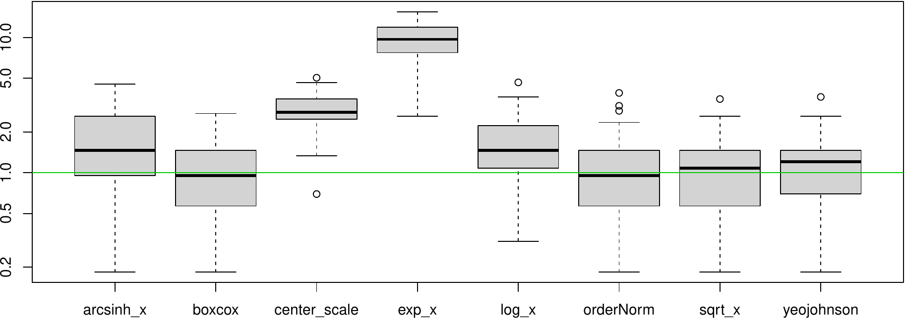
<figcaption>Figure 7: Cross-validation results for each normalization
method, where our estimated normality statistic is plotted on the
y-axis.</figcaption>
</figure>

Leave-one-out CV can be optionally performed in `bestNormalize` via the
`loo` argument, which, if set to `TRUE`, will compute the leave-one-out
CV transformations for each observation and method. Specifically,
`bestNormalize` will be run $n$ separate times where each observation is
individually left out of the fitting process and subsequently plugged
back in to get a "leave-one-out transformed value". Instead of taking
the mean across repeats and folds, in this case, we estimate
normalization efficacy using the full distribution of leave-one-out
transformed values. This option is computationally intensive. Note that
as with the "in-sample" normality statistics, the leave-one-out CV
approach tends to select the ORQ transformation since ORQ's performance
improves as the number of points in the training set relative to the
testing set increases.

``` r
bestNormalize(x, loo = TRUE)
```

``` r
#> Best Normalizing transformation with 250 Observations
#>  Estimated Normality Statistics (Pearson P / df, lower => more normal):
#>  - arcsinh(x): 4.42
#>  - Box-Cox: 0.7055
#>  - Center+scale: 8.258
#>  - Exp(x): 62.085
#>  - Log_b(x+a): 3.546
#>  - orderNorm (ORQ): 0.012
#>  - sqrt(x + a): 0.9145
#>  - Yeo-Johnson: 1.608
#> Estimation method: Out-of-sample via leave-one-out CV
#>  
#> Based off these, bestNormalize chose:
#> orderNorm Transformation with 250 nonmissing obs and no ties 
#>  - Original quantiles:
#>    0%   25%   50%   75%  100% 
#> 0.001 0.268 0.721 1.299 4.161
```

# Important features

::: {#improving-speed-of-estimation}
## Improving speed of estimation
:::

Because `bestNormalize` uses repeated CV by default to estimate the
out-of-sample normalization efficacy, it can be quite slow for larger
objects. There are several means of speeding up the process. Each comes
with some pros and cons. The first option is to specify
`outofsample = FALSE`. This will highly speed up the process. However,
for reasons previously discussed, ORQ normalization will always be
chosen unless `alloworderNorm = FALSE`. Therefore, a user might as well
use the `orderNorm` function directly as opposed to only setting
`outofsample = FALSE` since the end result will be the same (and
`orderNorm` will run much faster). Note below that the in-sample
normality results may differ slightly from the leave-one-out even when
this may be unexpected (i.e., for the log transformation); this is due
to slight differences in the standardization statistics.

``` r
bestNormalize(x, allow_orderNorm = FALSE, out_of_sample = FALSE)
```

``` r
#> Best Normalizing transformation with 250 Observations
#>  Estimated Normality Statistics (Pearson P / df, lower => more normal):
#>  - arcsinh(x): 4.401
#>  - Box-Cox: 0.7435
#>  - Center+scale: 8.087
#>  - Exp(x): 64.6975
#>  - Log_b(x+a): 3.47
#>  - sqrt(x + a): 0.9145
#>  - Yeo-Johnson: 1.7125
#> Estimation method: In-sample
#>  
#> Based off these, bestNormalize chose:
#> Standardized Box Cox Transformation with 250 nonmissing obs.:
#>  Estimated statistics:
#>  - lambda = 0.3254863 
#>  - mean (before standardization) = -0.3659267 
#>  - sd (before standardization) = 0.9807881
```

Another option to improve estimation efficiency is to use the built-in
parallelization functionality. The repeated CV process can be
parallelized via the `cluster` argument and the
[*parallel*](https://CRAN.R-project.org/package=parallel) and
[*doRNG*](https://CRAN.R-project.org/package=doRNG) [@doRNG] packages. A
cluster can be set up with `makeCluster` and passed to `bestNormalize`
via the `cluster = ` argument.

``` r
cl <- parallel::makeCluster(5)
b <- bestNormalize(x, cluster = cl, r = 10, quiet = TRUE)
parallel::stopCluster(cl)
```

The amount by which this parallelization will speed up the estimation of
out-of-sample estimates depends (for the most part) on the number of
repeats, the number of cores, and the sample size of the vector to be
normalized. The plot below shows the estimation time for a run of
`bestNormalize` with 15 repeats of 10-fold CV on a gamma-distributed
random variable with various sample sizes and numbers of cores.

<figure id="fig:parallel_timings">
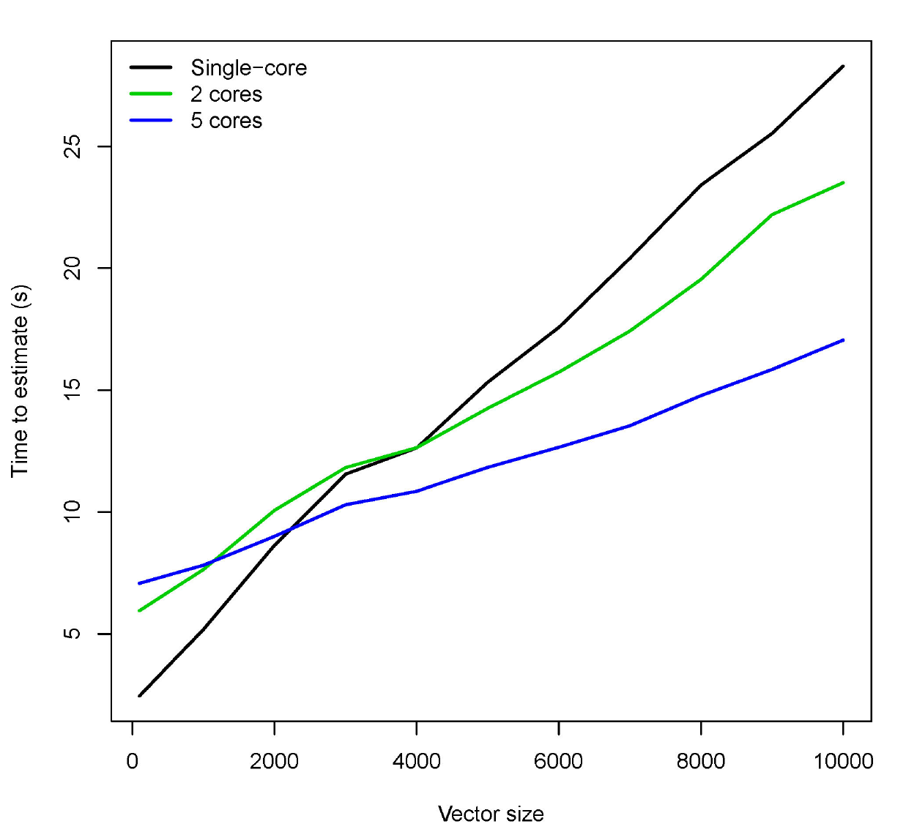
<figcaption>Figure 8: Potential speedup using parallelization
functionality.</figcaption>
</figure>

::: {#implementation-with-caret-recipes}
## Implementation with caret, recipes
:::

The `stepbestnormalize` and the `steporderNorm` functions can be
utilized in conjunction with the *recipes* package to preprocess data in
machine learning workflows with
[*tidymodels*](https://CRAN.R-project.org/package=tidymodels)
[@tidymodels] or in combination with *caret*. The basic usage within
*recipes* is shown below; for implementation with *caret*, refer to this
paper's application.

``` r
rec <- recipe( ~ ., data = iris)  %>%                       # Initialize recipe
  step_best_normalize(all_predictors(), -all_nominal()) %>% # Transform predictors
  prep(iris) %>%                                            # Prep (train) recipe
  bake(iris)                                                # Bake (apply) recipe
```

Options can be supplied to `stepbestnormalize` to speed up or alter
performance via the `transformoptions` argument, which passes a list of
options to `bestNormalize`.

::: {#additional-customization}
## Additional customization
:::

Two important means of customization are available: 1) users may add
custom transformation functions to be assessed alongside the default
suite of normalization methods, and 2) users may change the statistic
used "under the hood" by `bestNormalize` to estimate the departure from
normality of the transformed data. This section contains examples and
guidance for both extensions.

::: {#adding-user-defined-functions}
### 1) Adding user-defined functions
:::

Via the `newtransforms` argument, users can use `bestNormalize`'s
machinery to compare custom, user-defined transformation functions to
those included in the package. Below, I consider an example where a user
may wish to compare the cube-root function with those provided in the
package. `bestNormalize` requires two functions to implement this: the
transformation function and an associated `predict` method. The custom
cube-root transformation shown below is simple, but its skeleton can
readily be made arbitrarily more complex.

``` r
## Define custom function
cuberoot_x <- function(x, ...) {
  x.t <- (x)^(1/3)
  
  # Get in-sample normality statistic results
  ptest <- nortest::pearson.test(x.t)
  
  val <- list(
    x.t = x.t,
    x = x,
    n = length(x.t) - sum(is.na(x)), 
    norm_stat = unname(ptest$statistic / ptest$df)
  )
  
  # Assign class, return
  class(val) <- c('cuberoot_x')
  val
}

# S3 method that is used to apply the transformation to newly observed data
predict.cuberoot_x <- function(object, newdata = NULL, inverse = FALSE, ...) {
  
  # If no data supplied and not inverse
  if (is.null(newdata) & !inverse)
    newdata <- object$x
  
  # If no data supplied and inverse transformation is requested
  if (is.null(newdata) & inverse)
    newdata <- object$x.t
  
  # Perform inverse transformation
  if (inverse) {
    # Reverse-cube-root (cube)
    val <-  newdata^3
    
    # Otherwise, perform transformation as estimated
  } else if (!inverse) {
    val <- (newdata)^(1/3)
  }
  
  # Return transformed data
  unname(val)
}

## Optional: print S3 method
print.cuberoot_x <- function(x, ...) {
  cat('cuberoot(x) Transformation with', x$n, 'nonmissing obs.\n')
}
```

These functions can then be passed as a named list to `bestNormalize`:

``` r
custom_transform <- list(
  cuberoot_x = cuberoot_x,
  predict.cuberoot_x = predict.cuberoot_x,
  print.cuberoot_x = print.cuberoot_x
)

set.seed(123129)
x <- rgamma(100, 1, 1)
(b <- bestNormalize(x = x, new_transforms = custom_transform))
```

``` r
#> Best Normalizing transformation with 100 Observations
#>  Estimated Normality Statistics (Pearson P / df, lower => more normal):
#>  - arcsinh(x): 1.2347
#>  - Box-Cox: 1.0267
#>  - Center+scale: 2.0027
#>  - cuberoot_x: 0.9787
#>  - Exp(x): 4.7947
#>  - Log_b(x+a): 1.3547
#>  - orderNorm (ORQ): 1.1627
#>  - sqrt(x + a): 1.0907
#>  - Yeo-Johnson: 1.0987
#> Estimation method: Out-of-sample via CV with 10 folds and 5 repeats
#>  
#> Based off these, bestNormalize chose:
#> cuberoot(x) Transformation with 100 nonmissing obs.
```

Evidently, the cube-root was the best normalizing transformation for
this gamma-distributed random variable, performing comparably to the
Box-Cox transformation.

::: {#re-defining-normality}
### 2) Re-defining normality
:::

The question "what is normal?" outside of a statistical discussion is
quite loaded and subjective. Even in statistical discussions, many
authors have contributed to the question of how to best detect
departures from normality; these solutions are diverse, and several have
been implemented well in *nortest* already. In order to accommodate
those with varying opinions on the best definition of normality, we have
included a feature that allows users to specify a custom definition of a
normality statistic. This customization can be accomplished via the
`normstatfn` argument, which takes a function that will then be applied
in lieu of the Pearson test statistic divided by its degree of freedom
to assess normality.

The user-defined function must take an argument `x`, which indicates the
data on which a user wants to evaluate the statistic.

Here is an example using the Lilliefors (Kolmogorov-Smirnov) normality
test statistic:

``` r
bestNormalize(x, norm_stat_fn = function(x) nortest::lillie.test(x)$stat)
```

``` r
#> Best Normalizing transformation with 100 Observations
#>  Estimated Normality Statistics (using custom normalization statistic)
#>  - arcsinh(x): 0.1958
#>  - Box-Cox: 0.1785
#>  - Center+scale: 0.2219
#>  - Exp(x): 0.3299
#>  - Log_b(x+a): 0.1959
#>  - orderNorm (ORQ): 0.186
#>  - sqrt(x + a): 0.1829
#>  - Yeo-Johnson: 0.1872
#> Estimation method: Out-of-sample via CV with 10 folds and 5 repeats
#>  
#> Based off these, bestNormalize chose:
#> Standardized Box Cox Transformation with 100 nonmissing obs.:
#>  Estimated statistics:
#>  - lambda = 0.3281193 
#>  - mean (before standardization) = -0.1263882 
#>  - sd (before standardization) = 0.9913552
```

Here is an example using the Lillifors (Kolmogorov-Smirnov) normality
test's *p*-value:

``` r
(dont_do_this <- bestNormalize(x, norm_stat_fn = function(x) nortest::lillie.test(x)$p))
```

``` r
#> Best Normalizing transformation with 100 Observations
#>  Estimated Normality Statistics (using custom normalization statistic)
#>  - arcsinh(x): 0.4327
#>  - Box-Cox: 0.4831
#>  - Center+scale: 0.2958
#>  - Exp(x): 0.0675
#>  - Log_b(x+a): 0.3589
#>  - orderNorm (ORQ): 0.4492
#>  - sqrt(x + a): 0.4899
#>  - Yeo-Johnson: 0.4531
#> Estimation method: Out-of-sample via CV with 10 folds and 5 repeats
#>  
#> Based off these, bestNormalize chose:
#> Standardized exp(x) Transformation with 100 nonmissing obs.:
#>  Relevant statistics:
#>  - mean (before standardization) = 6.885396 
#>  - sd (before standardization) = 13.66084
```

Note: `bestNormalize` will attempt to minimize this statistic by
default, which is definitely not what you want to do when calculating
the *p*-value. This is seen in the example above, where the **worst**
normalization transformation, exponentiation, is chosen. In this case, a
user is advised to either manually select the best one or reverse their
defined normalization statistic (in this case by subtracting it from 1):

``` r
best_transform <- names(which.max(dont_do_this$norm_stats))
do_this <- dont_do_this$other_transforms[[best_transform]]
or_this <- bestNormalize(x, norm_stat_fn = function(x) 1-nortest::lillie.test(x)$p)
```

A *p*-value for normality should not be routinely used as the sole
selector of a normalizing transformation. A normality test's *p*-value,
as a measure of the departure from normality, is confounded by the
sample size (a high sample size may yield strong evidence of a
practically insignificant departure from normality). Therefore, we
suggest the statistic used should estimate the departure from normality
rather the strength of evidence against normality [e.g., @normality].

# Application to Autotrader data

::: {#background}
## Background
:::

The `autotrader` data set was scraped from the [autotrader
website](https://www.autotrader.com/) as part of this package (and
because at the time of data collection in 2017, the package author
needed to purchase a car). We apply the *bestNormalize* functionality to
de-skew mileage, age, and price in a pricing model. See `?autotrader`
for more information on this data set.

``` r
data("autotrader")
autotrader$yearsold <- 2017 - autotrader$Year
```

[]{#tab:unnamed-chunk-10 label="tab:unnamed-chunk-10"}

::: {#tab:unnamed-chunk-10}
  ----------------- -------------------
                    Overall (N=6,283)

  Make              

  \- Acura          185 (2.9%)

  \- Buick          252 (4.0%)

  \- Chevrolet      1,257 (20.0%)

  \- GMC            492 (7.8%)

  \- Honda          1,029 (16.4%)

  \- Hyundai        381 (6.1%)

  \- Mazda          272 (4.3%)

  \- Nissan         735 (11.7%)

  \- Pontiac        63 (1.0%)

  \- Toyota         1,202 (19.1%)

  \- Volkswagen     415 (6.6%)

  Price (\$)        

  \- Mean (SD)      17,145 (8,346)

  \- Range          722 - 64,998

  Mileage           

  \- Mean (SD)      63,638 (49,125)

  \- Range          2 - 325,556

  Year              

  \- Mean (SD)      2011.9 (3.5)

  \- Range          2000.0 - 2016.0

  Age (years old)   

  \- Mean (SD)      5.1 (3.5)

  \- Range          1.0 - 17.0
  ----------------- -------------------

  : Table 1: Sample characteristics of 'autotrader' data.
:::

::: {#transform-both-sides-regression}
## Transform-both-sides regression
:::

Transform-both-sides (TBS) regression has several benefits that have
been explored thoroughly elsewhere (see @harrell for an overview).
Importantly, TBS regression can often (though not always) yield models
that better satisfy assumptions of linear regression and mitigate the
influence of outliers/skew. This approach has been shown to be useful in
shrinking the size of prediction intervals while maintaining closer to
nominal coverage in this data set [@orq_paper].

First, we will normalize the outcome (price).

``` r
(priceBN <- bestNormalize(autotrader$price))
```

``` r
#> Best Normalizing transformation with 6283 Observations
#>  Estimated Normality Statistics (Pearson P / df, lower => more normal):
#>  - arcsinh(x): 3.8573
#>  - Box-Cox: 2.2291
#>  - Center+scale: 3.5532
#>  - Log_b(x+a): 3.8573
#>  - orderNorm (ORQ): 1.1384
#>  - sqrt(x + a): 2.1977
#>  - Yeo-Johnson: 2.2291
#> Estimation method: Out-of-sample via CV with 10 folds and 5 repeats
#>  
#> Based off these, bestNormalize chose:
#> orderNorm Transformation with 6283 nonmissing obs and ties
#>  - 2465 unique values 
#>  - Original quantiles:
#>    0%   25%   50%   75%  100% 
#>   722 11499 15998 21497 64998
```

We can see that the estimated normality statistic for the ORQ
transformation is close to 1, so we know it is performing quite well
despite the ties in the data. It is also performing considerably better
than all of the other transformations.

``` r
(mileageBN <- bestNormalize(autotrader$mileage))
```

``` r
#> Best Normalizing transformation with 6283 Observations
#>  Estimated Normality Statistics (Pearson P / df, lower => more normal):
#>  - arcsinh(x): 3.4332
#>  - Box-Cox: 3.0903
#>  - Center+scale: 14.7488
#>  - Log_b(x+a): 3.4354
#>  - orderNorm (ORQ): 1.1514
#>  - sqrt(x + a): 5.1041
#>  - Yeo-Johnson: 3.0891
#> Estimation method: Out-of-sample via CV with 10 folds and 5 repeats
#>  
#> Based off these, bestNormalize chose:
#> orderNorm Transformation with 6283 nonmissing obs and ties
#>  - 6077 unique values 
#>  - Original quantiles:
#>     0%    25%    50%    75%   100% 
#>      2  29099  44800  88950 325556
```

Similarly, the ORQ normalization performed best for mileage.

``` r
(yearsoldBN <- bestNormalize(autotrader$yearsold))
```

``` r
#> Best Normalizing transformation with 6283 Observations
#>  Estimated Normality Statistics (Pearson P / df, lower => more normal):
#>  - arcsinh(x): 83.2706
#>  - Box-Cox: 83.2909
#>  - Center+scale: 83.4324
#>  - Exp(x): 574.3318
#>  - Log_b(x+a): 83.0756
#>  - orderNorm (ORQ): 81.3615
#>  - sqrt(x + a): 83.4373
#>  - Yeo-Johnson: 84.0028
#> Estimation method: Out-of-sample via CV with 10 folds and 5 repeats
#>  
#> Based off these, bestNormalize chose:
#> orderNorm Transformation with 6283 nonmissing obs and ties
#>  - 17 unique values 
#>  - Original quantiles:
#>   0%  25%  50%  75% 100% 
#>    1    3    4    7   17
```

For age, we see something peculiar; none of the normalizing
transformations performed well according to the normality statistics. By
plotting the data, it becomes evident that the frequency of ties in age
makes it very difficult to find a normalizing transformation (see figure
below). Even so, `orderNorm` is chosen as it has the lowest estimated
$P/DF$ statistic.

<figure id="fig:hist_app">
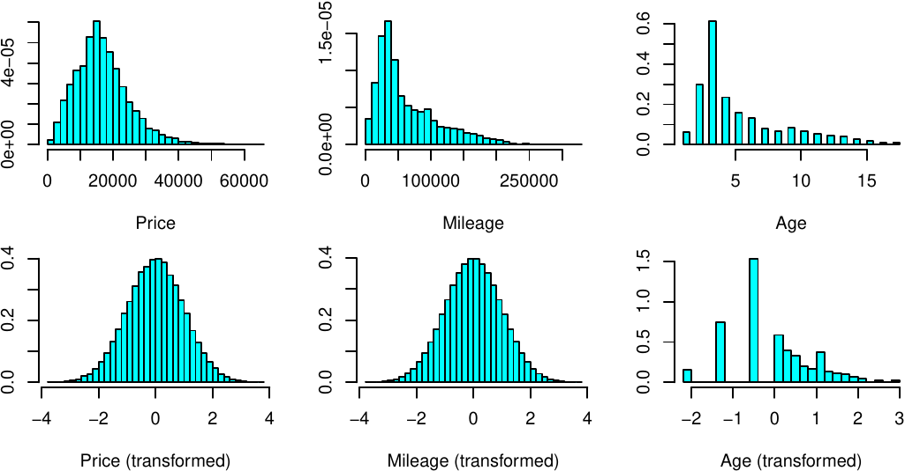
<figcaption>Figure 9: Distributions of car variables before and after
normalization.</figcaption>
</figure>

Next, we will fit a linear model on the transformed values of each
variable for our TBS regression. The reverse-transformation functions
will allow us to visualize how these variables affect model predictions
in terms of their original units.

``` r
p.t <- priceBN$x.t; m.t <- mileageBN$x.t; yo.t <- yearsoldBN$x.t
fit <- lm(p.t ~ m.t + yo.t)
```

[]{#tab:unnamed-chunk-11 label="tab:unnamed-chunk-11"}

::: {#tab:unnamed-chunk-11}
  ----------------------------------------------------------
  Variable       Estimate   Std. Error   t value   Pr(\>|t|)
  ------------ ---------- ------------ --------- -----------
  Intercept         0.005        0.010     0.553        0.58

  g(Mileage)       -0.234        0.016   -14.966    \< 0.001

  g(Age)           -0.441        0.016   -27.134    \< 0.001
  ----------------------------------------------------------

  : Table 2: TBS regression results for autotrader data.
:::

Unsurprisingly, we find that there are very significant relationships
between transformed car price, mileage, and age. However, to interpret
these values, we must resort to visualizations since there is no
inherent meaning of a "one-unit increase" in the ORQ normalized
measurements. We utilize the
[*visreg*](https://CRAN.R-project.org/package=visreg) package [@visreg]
to perform our visualizations, using `predict.bestNormalize` in
conjunction with *visreg*'s `trans` and `xtrans` options to view the
relationship in terms of the original unit for the response and
covariate respectively (formatting omitted).[^3] For the sake of
illustration, we have also plotted the estimated effect of a generalized
additive (spline) model fit with
[*mgcv*](https://CRAN.R-project.org/package=mgcv) [@mgcv].

``` r
visreg(fit, "m.t")
visreg(fit, "m.t", 
       partial = TRUE,
       trans = function(price.t) 
         predict(priceBN, newdata = price.t, inverse = TRUE)/1000, 
       xtrans = function(mileage.t) 
         predict(mileageBN, newdata = mileage.t, inverse = TRUE)
       )
```

<figure id="fig:linear_visreg">
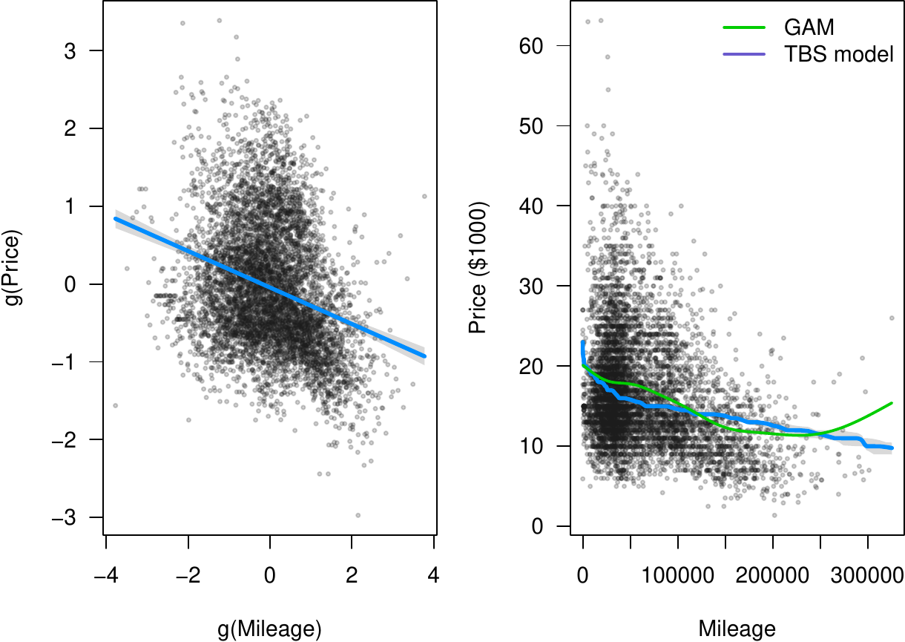
<figcaption>Figure 10: TBS regression visualized on transformed units
(left) and original units (right).</figcaption>
</figure>

Below, we visualize the age effect, demonstrating how one might
visualize the effect outside of *visreg* (plot formatting is omitted).

``` r
# Set up data for plotting line
new_yo <- seq(min(autotrader$yearsold), max(autotrader$yearsold), len = 100)
newX <- data.frame(yearsold = new_yo, mileage = median(autotrader$mileage))
newXt <- data.frame(yo.t = predict(yearsoldBN, newX$yearsold), 
                    m.t = predict(mileageBN, newX$mileage))

line_vals_t <- predict(fit, newdata = newXt) # Calculate line (transformed)
line_vals <- predict(priceBN, newdata = line_vals_t, inverse = TRUE)
plot(autotrader$yearsold, autotrader$price)
lines(new_yo, line_vals)
```

<figure id="fig:gam_tbs_model">
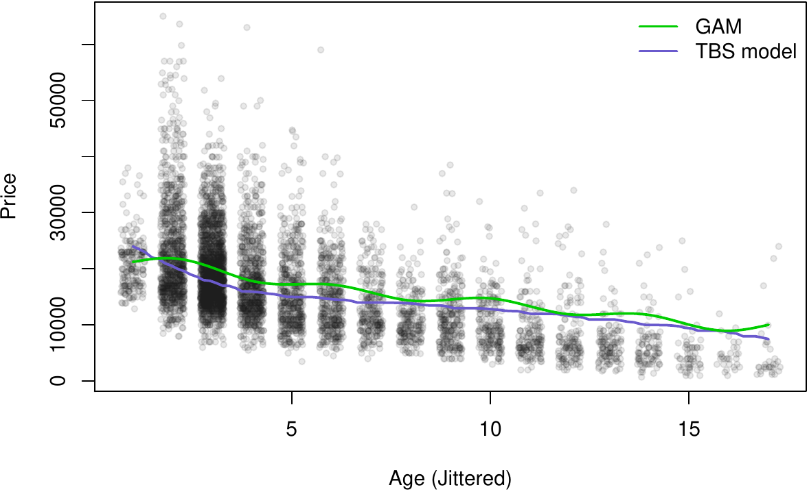
<figcaption>Figure 11: Age effect on car price (re-transformed to
original unit).</figcaption>
</figure>

::: {#implementation-with-recipes}
## Implementation with recipes
:::

To build a predictive model for the price variable that uses each
vehicle's model and make in addition to its mileage and age, we can
utilize the *caret* and *recipes* functionality to do so. This section
outlines how to use *bestNormalize* in conjunction with these other
popular ML packages. Price is logged instead of ORQ transformed in order
to facilitate the interpretation of measures for prediction accuracy.

``` r
library(tidymodels)
library(caret)
library(recipes)

set.seed(321)
df_split <- initial_split(autotrader, prop = .9)
df_train <- training(df_split)
df_test <- testing(df_split)

rec <- recipe(price ~ Make + model +  mileage + status + Year, df_train) %>% 
  step_mutate(years_old = 2017 - Year) %>% 
  step_rm(Year) %>% 
  step_log(price) %>% 
  step_best_normalize(all_predictors(), -all_nominal()) %>% 
  step_other(all_nominal(), threshold = 10) %>% 
  step_dummy(all_nominal()) %>% 
  prep()

fit1 <- train(price ~ ., bake(rec, NULL), method = 'glmnet')
fit2 <- train(price ~ ., bake(rec, NULL), method = 'earth')
fit3 <- train(price ~ ., bake(rec, NULL), method = 'rf')

r <- resamples(fits <- list(glmnet = fit1, earth = fit2, rf = fit3))
summary(r) # Extra-sample CV results
```

::: {#tab:unnamed-chunk-14}
  ---------- ------- --------- -------- ------- --------- ------- ------
                Min.   1st Qu.   Median    Mean   3rd Qu.    Max.   NA's

  **MAE**                                                         

  glmnet       0.181     0.184    0.186   0.189     0.194   0.198      0

  earth        0.147     0.151    0.154   0.155     0.158   0.163      0

  rf           0.136     0.141    0.143   0.144     0.147   0.157      0

  **RMSE**                                                        

  glmnet       0.242     0.247    0.252   0.256     0.264   0.276      0

  earth        0.203     0.209    0.214   0.217     0.226   0.235      0

  rf           0.193     0.208    0.213   0.210     0.215   0.217      0

  **RSQ**                                                         

  glmnet       0.767     0.772    0.785   0.782     0.789   0.801      0

  earth        0.807     0.833    0.845   0.842     0.855   0.864      0

  rf           0.835     0.845    0.855   0.854     0.860   0.873      0
  ---------- ------- --------- -------- ------- --------- ------- ------

  : Table 3: CV prediction accuracy of various ML methods.
:::

Evidently, the random forest generally performed better in
cross-validated prediction metrics, achieving a higher R-squared (RSQ),
lower root-mean-squared error (RMSE), and lower mean absolute error
(MAE). Since price was logged, RMSE and MAE are on the log scale. For
the test set, we calculate these quantities in price's original unit
(2017 US dollars) using the
[*yardstick*](https://CRAN.R-project.org/package=yardstick) package
[@yardstick].

``` r
# Out of sample prediction accuracy
results <- lapply(fits, function(x) {
  p <- c(predict(x, newdata = bake(rec, df_test)))
  yardstick::metrics(data.frame(est = exp(p), truth = df_test$price), 
                     truth = truth, estimate = est)
})
results
```

[]{#tab:unnamed-chunk-16 label="tab:unnamed-chunk-16"}

::: {#tab:unnamed-chunk-16}
  ------------------------------
  Method     RMSE     RSQ    MAE
  -------- ------ ------- ------
  glmnet     4076   0.772   2847

  earth      3619   0.814   2500

  rf         3257   0.853   2294
  ------------------------------

  : Table 4: Test data prediction accuracy of various ML methods. RMSE
  and MAE can be interpreted in terms of 2017 US dollars.
:::

After normalization of mileage and age, a random forest had the optimal
predictive performance on car price given a car's make, model, age, and
mileage compared to other ML models, achieving out-of-sample R-squared
0.853 on a left-out test data set. We conjecture that the random forest
performs best because it can better capture differential depreciation by
make and model than the other methods.

# Discussion

We have shown how the *bestNormalize* package can effectively and
efficiently find the best normalizing transformation for a vector or set
of vectors. However, normalization is by no means something that should
be applied universally and without motivation. In situations where units
have meaning, normalizing prior to analysis can contaminate the
relationships suspected in the data and/or reduce predictive accuracy.
Further, depending on the type of transformations used, interpreting
regression coefficients post-transformation can be difficult or
impossible without using a figure since the transformation function
itself will look completely different for different distributions. So,
while normalization transformations may well be able to increase the
robustness of results and mitigate violations to the classical linear
regression assumption of Gaussian residuals, it is by no means a
universal solution.

On the other hand, when hypotheses are exploratory or when data is of
poor quality with high amounts of skew/outliers, normalization can be an
effective means of mitigating downstream issues this can cause in the
analyses. For example, in machine learning contexts, some predictor
manipulations rely on second-order statistics (e.g., principal
components analysis or partial least squares), for which the variance
calculation can be sensitive to skew and outliers. Normalizing
transformations can improve the quality and stability of these
calculations. Similarly, predictor normalization reduces the tendency
for high-leverage points to have their leverage propagated into
engineered features such as interactions or polynomials. Ultimately,
these benefits can often produce predictive models that are more robust
and stable.

We focused on making this package useful in a variety of machine
learning workflows. We are enthusiastic in our support of
*bestNormalize*, and will continue to maintain the package while it is
found to be useful by R users. We hope to continue to build up the
repertoire of candidate transformations using the same infrastructure so
that additional ones can be considered by default in the future.
:::

[^1]: As of version 1.2.0 of *bestNormalize*, `lambert` methods are not
    performed by default in `bestNormalize`, but they are still
    available via the `allowlambert` arguments.

[^2]: Since `standardize=TRUE`, the identity transformation is
    represented in Figure 7 by `centerscale`, which yields the exact
    same normality statistic.

[^3]: Alternatively, one can use
    [*scales*](https://CRAN.R-project.org/package=scales) [@scales] and
    [*ggplot2*](https://CRAN.R-project.org/package=ggplot2) [@ggplot2]
    to visualize any transformation fit using *bestNormalize*;
    instructions are included in the package vignette.
