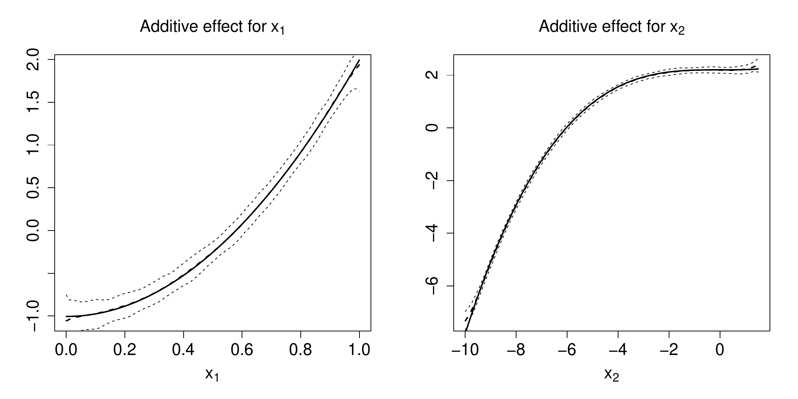
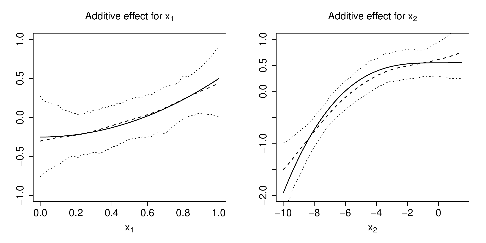
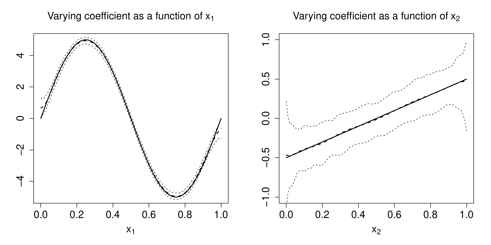
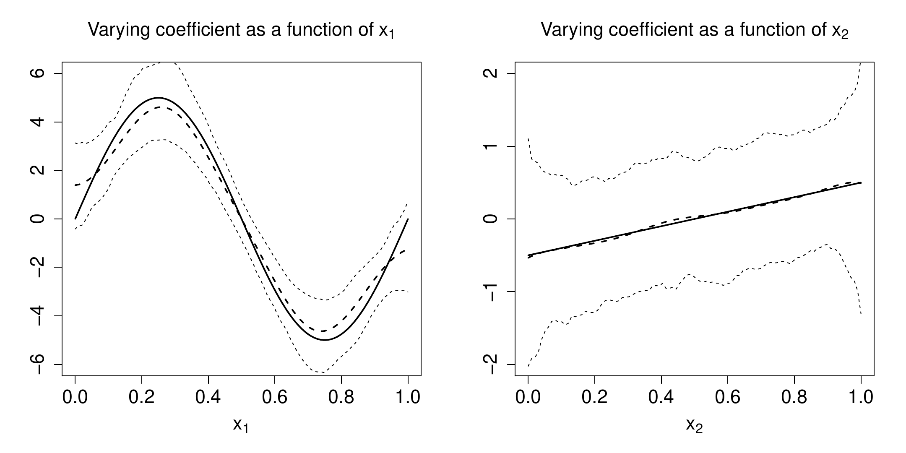
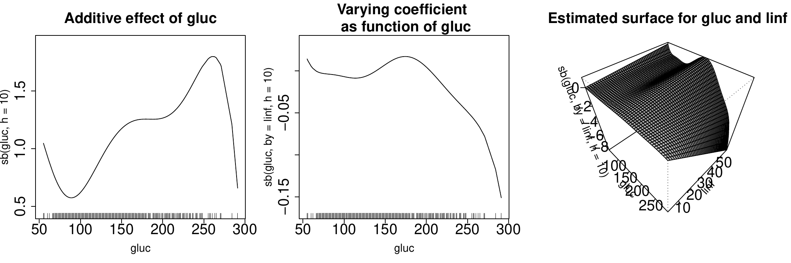
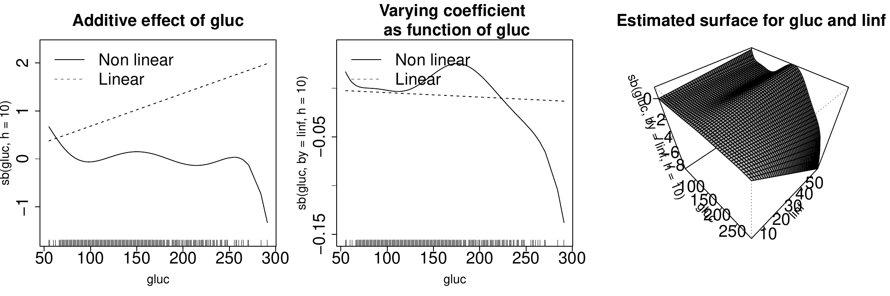

# Introduction and brief review {#sec-intro}

The classes of generalized structured models (GSM) of [@MN2003],
structured additive regression models [@BKL2005], and semiparametric
separable models [@RSV2003] are all devoted to harmonizing the
fundamental aspects of flexibility, dimensionality and interpretability
[c.f. also @S1986] for multidimensional regression. In some cases, the
particular structure is derived from pure theory, sometimes from
empirical knowledge, or it is chosen data-adaptively. The epithet
'structured' underlines the explicit modeling of the structure of a
regression in order to distinguish it from fully automatic black-box
regression or prediction. [@MN2003] define for response $Y$ with
covariate vectors $({\bf Z,X,T,U})$ the GSM class by
$$\label{GSM}
	\Lambda ( Y ) =  G\left\{ {\mathbf Z}, \beta , g({\mathbf X}) \right\} +S\left\{ {\mathbf T},\delta ,s ({\mathbf U})\right\} \epsilon = G\left\{ {\mathbf Z}, \beta , g({\mathbf X}) \right\} +\varepsilon \ ,   (\#eq:GSM)$$
with $\Lambda$, $G$, $S$ parametric known functions, $\beta$, $\delta$
unknown finite-dimensional parameter, $g (\cdot )$, $s (\cdot)$ unknown
nonparametric functions, and $\epsilon, \varepsilon$ fulfilling
$E[\epsilon | {\mathbf Z},{\mathbf X} ]=E[\varepsilon | {\mathbf Z},{\mathbf X} ]=0$.
While $\Lambda$ is a transformation with potentially unknown parts which
can be estimated along [@LSVK2008], $G$ and $S$ are link functions that
also determine further structures. For instance, for a partial linear
varying coefficient model [@PMLL2015] with
${\mathbf Z}=(Z_1,\cdots ,Z_d,{\mathbf Z}_\kappa)$,
${\mathbf X}=(X_1,\cdot ,X_d)$, where $Z_1$ to $Z_d$ and $X_1$ to $X_d$
are scalars, and ${\mathbf Z}_\kappa$ a vector of the length of $\beta$,
function $G$ defines
$$\label{VCM}
	G\left\{ {\mathbf Z}, \beta , g ({\mathbf X}) \right\} = 
	\underline{G}\left\{ \eta ({\mathbf Z},\beta , g({\mathbf X})) \right\} = \underline{G}\left\{ g_0+\sum_{j=1}^{d}
	g_j(X_j )Z_{j} + {\mathbf Z}_\kappa^t\beta \right\} \ ,   (\#eq:VCM)$$
with index $\eta$ and a known link function $\underline{G}$. You may
also allow that some, or all of the $X_j$, $j=1,\ldots ,d$ are
identical; the same holds for the $Z_j$, etc. Moreover, by setting
$Z_j\equiv 1$ $\forall j$ with all $X_j$ being different, you obtain the
generalized additive model (GAM). A detailed discussion on
identifiability is provided in [@LMP2012].

Since [@HT1990] introduced their backfitting algorithm, additive models
have become quite popular in statistics, particularly in biometrics,
technometrics, and environmetrics. [@OR1997] and [@O2000] derived
asymptotic theory for that classical backfitting estimator with kernel
smoothing. [@MLN1999] developed asymptotic theory for a modified
version, the smooth backfitting (SB) estimator, under weaker assumptions
on the data like the allowance for strong correlation of the covariates.
[@MN2003] extended this method to the general GSM class (\@ref(eq:GSM)),
and [@RS2010] proposed a common algorithm for it. Many extensions have
been developed, procedures for bandwidth selection [e.g., @MP2005],
quantile regression [@LMP2010], and further asymptotic theory for
particular cases [see e.g., @YPM2008 for GAM]. Most recent contributions
extend SB to additive inverse regression [@BDHB2016], proportional
hazards [@HMMMN2017], or regression with error-in-variables [@HP2018].
All SB procedures and their theory are kernel-based.

The main advantage of SB is, apart from its excellent numerical
performance proven by @NS2005 and [@RS2010], compared to the classical
backfitting, that there exists a comprehensive literature that studies
its statistical behavior and underlying assumptions. It provides the
exact and complete asymptotic theory of SB, such that today this
estimator is well understood. The only drawback has been that so far,
there hardly existed an easily available software for this estimator,
except the R-package [*sBF*](https://CRAN.R-project.org/package=sBF) of
[@RPsBF] for the basic additive model. But due to its complexity,
practitioners typically abstain from implementing it themselves.
Therefore, the
[*wsbackfit*](https://CRAN.R-project.org/package=wsbackfit) R-package
has been developed which provides the weighted SB for all models listed
in the next section, including a data-driven bandwidth selector. The
package is freely available from the Comprehensive R Archive Network
(CRAN) at
[ https://CRAN.R-project.org/package=wsbackfit]( https://CRAN.R-project.org/package=wsbackfit){.uri}
[@R20]. Thus, this package closes the gap between the huge body of
existing and still increasing literature about SB on the one side, and
its potential use on the other, providing the necessary software. We
hope it is soon extended by procedures for the various, partly above
cited, extensions.

It is to be mentioned that there certainly exist R packages for
alternative methods to estimate related models. Before briefly
discussing some of the most advanced packages, let us mention the
reviews of [@BT2008], which reviewed spline-based methods, and
[@FKL2004] which reviewed (spline-based) Bayesian methods.

Maybe the broadest set of models can be handled by the package
[*BayesX*](https://CRAN.R-project.org/package=BayesX) [@RPBayesX]. It
embraces several well-known regression models such as GAM, generalized
additive mixed models (GAMM), generalized geo-additive mixed models
(GGAMM), dynamic models, varying coefficient models (VCM), and
geographically weighted regression. Besides exponential family
regression, *BayesX* also supports non-standard regression situations
such as regression for categorical responses, hazard regression for
continuous survival times, and continuous-time multi-state models; see
also its support platform <http://www.uni-goettingen.de/de/bayesx>. It
has been created by @BKL2005 and @KBBL2008.

The R package [*gam*](https://CRAN.R-project.org/package=gam) [@RGam]
presents considerable enhancements of the S-PLUS version going back to
@HT1990. It uses classical backfitting to combine different smoothing or
fitting methods, particularly local regression and smoothing splines.
Another powerful package is
[*mgcv*](https://CRAN.R-project.org/package=mgcv) [@W2017], which allows
the fitting of generalized additive (mixed) models, with smoothing
parameter estimation done by (restricted) marginal likelihood or
generalized cross-validation, and uses iterated nested Laplace
approximation for fully Bayesian inference. Another powerful and
well-functioning package is
[*GAMLSS*](https://CRAN.R-project.org/package=GAMLSS) of @SR2007. It is
based on penalized likelihood estimation combined with classical
backfitting. While *mgcv* models the index function, *GAMLSS* models the
location, scale, and shape functions by additive linear mixed models. It
has been created to tackle many interesting distributions of $Y$. When
speaking of likelihood based approaches, one should also mention a
method introduced by @TB2006. Their R-package
[*GAMBoost*](https://CRAN.R-project.org/package=GAMBoost) can be used to
fit a GAM by likelihood based boosting, suited for a large number of
predictors.

Regarding kernel-based methods that consider related or specific cases
of (\@ref(eq:GSM)), there are, for example, marginal integration
[@LN1995] for additive interaction models [@STY2002], and local
polynomials for smooth varying coefficients [@LR2010]. The latter is
implemented in the [*np*](https://CRAN.R-project.org/package=np) package
[@HR2008], and turned out to be very competitive when compared to the
before-mentioned spline-based packages [@ST2015].

# The models that can be estimated by wsbackfit {#sec-models}

The aim is to estimate a GSM as introduced in (\@ref(eq:GSM)). In the
moment of estimation, one has to be specific about $\Lambda$, $G$, and
$S$. We concentrate on the popular cases, in particular on those that
maintain additivity or a similar separability structure. This way, the
estimates provide an easy interpretation, and overcome the curse of
dimensionality, which else is inherited by more complex models. To the
best of our knowledge, all existing smooth backfitting methods follow
the suggestion of [@MN2003] to estimate the mean and variance part
subsequently, say, first $G\{ \cdots \}$, then $S\{ \cdots \}$. Our
implementation follows the suggestion of [@RS2010] to allow for a
(re-)estimation of the mean part ($G\{ \cdots \}$) including weights
obtained from the estimation of the variance part ($S\{ \cdots \}$) to
potentially increase the efficiency. Note, however, that in
nonparametrics, it is often not clear to what extent an efficiency gain
can be achieved this way; see for example the discussion in
[@XiaoEtal2003]. All proposed methods we are aware of, are two- or
three-step procedures similar to what we propose here. The estimation of
the variance part is performed in the second step by regressing the
squared residuals on $({\bf T,U})$, using the same procedure as for
$G\{ \cdots \}$. Therefore it is sufficient to concentrate in the
following on the mean regression, which can equally well be applied to
squared residuals for estimating $S\{ \cdots \}$.

As said, the SB idea for GSM, together with some general results about
its asymptotic behavior, was introduced by [@MN2003]; specific
algorithms and their implementation were introduced and studied in
@RS2010. Detailed information about the implementation is given in a
technical report [@RS2008]. The implemented algorithms in *wsbackfit*
are modified versions to speed up the procedure by binning techniques
and a combination of parametric linear with local constant kernel
regression; see below. The models considered in this package are
semiparametric in the sense that they contain parametric as well as
nonparametric components. Most of them could be seen as extensions of a
generalized linear model (GLM) of type
$G({\mathbf Z},\beta ,g({\mathbf X})) = \underline{G} \big(\eta ({\mathbf Z},\beta,g({\mathbf X})) \big) = \underline{G} ( g_0 + \alpha^t {\mathbf X}+ \beta^t {\mathbf Z}  )$,
see for example [@MN1989]. So far, this package does not tackle random
effects.

Regarding the choice of $G$, you have first to decide about the link
$\underline{G}$. For each conditional distribution, there exists a
canonical one: for the conditional Gaussian distribution, this is the
identity. For a binary response, it is the Logit
$({1+1/exp( \bullet )})^{-1}$, and for a conditional Poisson it is
$exp(\bullet )$. Note that the latter can also be used for
Pseudo-Poisson estimation. The choice of $\underline{G}$ is certainly
linked to the specification of $\Lambda$ which is supposed to be known.
Then, such transformation of $Y$ can be performed a priori by the
practitioner. Therefore, we henceforth suppress $\Lambda$, to simplify
our notation. For $\Lambda$ entailing unknown parameters, consult
[@LSVK2008].

@RS2010 showed that the estimation procedure for all these models can be
summarized in one common feasible minimization problem, namely
$$\label{proj-ideaW}
minimize \;\; \int \sum_{i=1}^n \left[ \tilde Y_i - \eta \{{\mathbf Z}_i ,\beta ,g({\mathbf x}) \} \right]^2 W_i \cdot K_h ({{\mathbf x}-{\mathbf X}_i}) \ d{\bf x} \ ,   (\#eq:proj-ideaW)$$
where $\tilde Y_i$ is the transformed (e.g. by $\Lambda$) or linearized
(in local scoring if the link is not the identity) response $Y_i$, and
$W_i$ is a weight. For example, in the generalized additive model with
$\beta = 0$ we have covariates $Z_j \equiv 1$ for $j=1,\ldots, d$, $W_i$
contains the local scoring weights with $\tilde Y_i$ being the
accordingly adjusted dependent variable. Further,
$K_h(v) = h^{-1} K(v/h)$ with $K(\cdot )$ is the kernel function. It is
well known that asymptotically, the choice of smoothing kernel does not
have an important impact, as to a large part the kernel effect is
compensated by an adequate bandwidth choice. We allow the user to choose
between the Epanechnikov kernel which is asymptotically the most
efficient one, and the Gaussian kernel which is popular as it helps to
avoid some of the numerical problems that may arise in areas where data
are sparse.

We call our procedure 'weighted smooth backfitting' to emphasize that
the user has the option to include a vector of additional weights. As
said, by putting the usual kernel weights apart, part of the weighting
comes from local scoring in order to account for the link function
$\underline{G}$.[^2] However, independently from the link function, the
practitioner might also want to include sampling weights, e.g., when
using administrative data, or trimming weights, e.g., for excluding
boundary points. A particular case is when additional weights are
included to improve the efficiency of your estimators, e.g., to account
for the (co-)variance structure. @RS2010 estimated in a first step the
mean function, afterward the variance from the squared residuals, and
used these in the third step as additional weights when re-estimating
the conditional mean. The resulting average mean squared error was
substantially smaller than the one of the original estimator, which
ignored the (co-)variance structure; recall our discussion at the
beginning of this section.

The models that package *wsbackfit* can presently estimate are: a
partial linear GAM, a generalized partial linear varying coefficient
model (GVCM), and combinations of them. The first one is a
generalization of a GLM by replacing some linear components with
additive nonparametric functions,
$$\label{eq3}
E \left[ {Y\vert {\bf X},{\bf Z}} \right] = \underline{G} \left( {g_0 + \sum\nolimits_{j = 1}^d g_j \left( {X_j } \right) + \beta^t {\mathbf Z} } \right) \ ,   (\#eq:eq3)$$
where $X_1$ to $X_d$ are scalars, and ${\mathbf Z}$ is the vector of all
covariates that are supposed to enter the index function $\eta$
linearly. The $g_j$ are nonparametric functions.[^3] It is actually true
that this is a special case of the partial linear GVCM of the form
(\@ref(eq:VCM)), obtained by setting $Z_1=Z_2=\cdots =Z_d=1$. We list
them nonetheless separately because, besides the slightly different
implementation, we want the reader to recognize the difference in the
modeling approach. First, the GVCM is a generalization of a GLM in
${\mathbf Z}$, as could be seen in (\@ref(eq:VCM)). And second, here we
allow for all the flexibility suggested by [@LMP2012] regarding the
alterations of covariates $X_j$ and $Z_j$. For example, all
$X_1,\ldots ,X_{d_1}$ with $d_1\le d$ could be the same scalar variable
$X_1$ such that
$$\label{eq51}
\sum\nolimits_{j = 1}^{d_1} g_j \left( {X_j } \right) Z_j  =
\sum\nolimits_{j = 1}^{d_1} \big\{ g_{j0} + g_{j1} \left( {X_1 } \right) \big\} Z_j   \ ,   (\#eq:eq51)$$
with $g_{j0}$ unknown constants and $g_{j1}$ unknown nonparametric
functions; or, alternatively, all $Z_1,\ldots ,Z_{d_1}$ with $d_1\le d$
could be the same scalar variable $Z_1$ such that (with $g_{10}$ still a
constant)
$$\label{eq52}
\sum\nolimits_{j = 1}^{d_1} g_j \left( {X_j } \right) Z_j  =
\big\{ g_{10} + \sum\nolimits_{j = 1}^{d_1} g_{j1} \left( {X_j } \right) \big\} Z_1   \ .   (\#eq:eq52)$$
Certainly, you can have a mixture of both, as long as the identification
conditions of [@LMP2012] are fulfilled to guarantee that the model does
not suffer from concurvity. This includes the possibility that some
variables appear in both sets, ${\bf {X}}$ and ${\mathbf Z}$. This could
be of particular interest when defining different types of interactions.

Finally, one can include all together, i.e., nonparametric additive
terms, nonparametric varying coefficients, and a parametric (linear)
part like
$$\label{eq6}
E \left[ {Y\vert {\bf {X,Z}}} \right] = \underline{G} \left\{  {g_0 + \sum\nolimits_{j = 1}^{d_1} g_j \left( {X_j } \right) Z_j + \sum\nolimits_{j = d_1+1}^{d} g_j \left( {X_j } \right) + \beta^t {\mathbf Z}_\kappa } \right\} \ ,   (\#eq:eq6)$$
with ${\bf X}$ as before,
${\bf Z}=(Z_1,\ldots ,Z_{d_1},{\mathbf Z}_\kappa)$ a set of scalar
variables $Z_1,\ldots ,Z_{d_1}$, and a vector ${\mathbf Z}_\kappa$.
Again, some of the $X_j$ may represent the same variable; the same holds
for the $Z_j$, $j=1,...,d$.

# Cross-validation, bandwidths, and computational issues {#sec-banda}

Cross-validation (CV) can be used for model selection in general.
However, for the sake of presentation we describe here our
implementation in the context of bandwidth selection.

## Cross-validation for bandwidth

All nonparametric estimates of the $g_j (X_j)$ in (\@ref(eq:eq6)) depend
on some bandwidths $h_1,\ldots,h_d$, which can be preset by the user.
Alternatively, the package provides the option to choose the bandwidths
data-adaptively via CV. Our implementation even allows for a mixture of
both, i.e., users can fix some bandwidths and choose the others by CV.
Albeit we use binning techniques, performing CV can render the program
pretty slow, especially for high dimensions and huge data sets.
Generally, our implementation follows the ideas of @NS2005 and @RS2010.
It is to be mentioned that several alternatives exist, in particular for
the additive model. For instance, @MP2005 proposed bandwidths selectors
based on penalized least squares and plug-in approaches.

Given sample $\left \{ {\bf X}_i, {\mathbf Z}_i, Y_i \right\}_{i=1}^n$,
bandwidths $h_1,\ldots,h_d$ can be selected by minimizing some CV
criterion in various ways. Allowing for limited dependent variables $Y$,
the deviance is an appropriate measure of discrepancy between observed
and fitted values. It is derived as a likelihood ratio test comparing
the specified model with a so-called saturated one, when predicted
values match the observed responses exactly. More specifically, denoting
the fitted mean response given by
$\hat \mu_i=\hat E \left[ {Y_i \vert {\bf X_i},{\bf Z_i}} \right]$, the
deviance is given by $Dev= \sum_{i=1}^n Dev_i (Y_i, \hat \mu_i)$. The
definition of the individual deviance $Dev_i$ depends on the link;
namely

  ----------------------------------------------------------------------------------
                                    $Dev_i (Y_i, \hat \mu_i)$
  ---------- -----------------------------------------------------------------------
  Gaussian                     $\left({ Y_i- \hat \mu_i}\right)^2$

  Binary      $-2 \left({Y_i \log  \hat \mu_i +(1-Y_i) \log (1-\hat \mu_i)}\right)$

  Poisson              $Y_i \log \frac{Y_i}{\hat \mu_i} -(Y_i-\hat \mu_i)$
  ----------------------------------------------------------------------------------

  : 

Generally spoken, unless bandwidths are fixed by the user, they can be
selected as
$$\label{CV}
(h_1,\ldots,h_d)=
\underset{(h_1^\bullet,\ldots,h_d^\bullet)} {\operatorname{arg\min} }  
\sum_{i=1}^n Dev_i \left [ {Y_i, \underline{G} \left({
\hat \eta ^{(-i)}_{{\bf X}_i,{\bf Z}_i}
 }\right)}\right],   (\#eq:CV)$$
with
$$\label{add_predictor}
\hat \eta ^{(-i)}_{{\bf X}_i,{\bf Z}_i} = \hat{g}_0^{(-i)} + \sum\nolimits_{j = 1}^{d_1} \hat{g}_j ^{(-i)} \left( X_{ij} \right) Z_{ij} + \sum\nolimits_{j = d_1+1}^{d} \hat{g}_j^{(-i)}  \left( X_{ij} \right) + \hat{\beta}^{t(-i)} {\mathbf Z}_{i\kappa} \ ,   (\#eq:add-predictor)$$
where $\hat{g}_j ^{(-i)}(X_{ij})$ indicates the fit at $X_{ij}$ leaving
out the *i*th data point based on the smoothing parameter $h_j^\bullet$.
One option to solve the minimization in (\@ref(eq:CV)) is to use a
complete bandwidth selection that allows for all possible bandwidths
combinations for the different covariates $X_j$. When the number of
covariates $X_j$ is large, the computational cost becomes very high or
even prohibitive.

In order to simplify the problem, we provide the following three options
to the user:

1.  the user just prefixes all bandwidths that shall be used as final
    bandwidths;

2.  the user prefixes starting values for the bandwidths, say
    $\tilde h_j$, and searches via CV for the optimal bandwidth vector
    $(h_1,\ldots ,h_d)$ with a common bandwidth factor $c_h\in R$ such
    that $(h_1,\ldots ,h_d)=c_h (\tilde h_1,\ldots ,\tilde h_d)$;

3.  the user only prefixes a bandwidth grid for a scalar $h_c$ such that
    $(h_1,\ldots ,h_d)=h_c (\sigma_1,\ldots ,\sigma_d)$ with $\sigma_j$
    being the standard deviation of $X_j$, and $h_c$ is chosen from the
    grid via CV.

The choice of prior $\tilde h_j$ typically follows some considerations
of marginal distributions or marginal smoothing. For example, you could
first perform a CV bandwidth choice for each nonparametric $g_j$ by
setting all other $g_{k\neq j}$ to zero, or by restricting them to be
linear functions. The second method follows the ideas of [@HP2018], and
the third follows a standard recommendation in the literature, see the
review of [@KSS2014]. Combining options 1 and 3 is possible.

For the sake of presentation, we explain more details about the CV
implementation only along option 3; as for option 2, it works
analogously. Moreover, suppose the user chooses all bandwidths by option
3. As said, in option 3, $h_j=h_c \sigma_j$. While $h_c$ might be
different for each $j$ if $h_j$ is set by the user or chosen by option
2, in option 3, it is the same for all $j$. That is, we reduce the
multidimensional search problem to a one-dimensional one. Specifically,
if the user decides that all bandwidths are to be chosen by CV,
$h_c:= h_j/\sigma_j$ for all $j$, with
$$\label{CV_2}
h_c = \underset{h^\bullet} {\operatorname{arg\min} }  
\sum_{i=1}^n Dev_i \left [ {Y_i, \underline{G} \left({
\hat \eta ^{(-i)}_{{\bf X}_i,{\bf Z}_i} }\right)}\right],   (\#eq:CV-2)$$
where $\eta^{(-i)}_{{\bf X}_i,{\bf Z}_i}$ indicates the fitted additive
predictor at $\left \{{{\bf X}_i,{\bf Z}_i}\right\}$ (see
\@ref(eq:add-predictor)) leaving out the *i*th data point, and based on
the smoothing parameters $h^\bullet\sigma_j$, $(j = 1, \ldots, d)$.

Unfortunately, a naive implementation of the leave-one-out CV technique
would still imply a high computational cost as for each potential value
of $h^\bullet$, it is necessary to repeat the estimation as many times
as we have data points. To speed up the process, the *wsbackfit* package
uses k-fold CV instead. In brief, k-fold CV consists of randomly
splitting the available sample into $k$ complementary subsamples of
(approximately) the same size such that each data point only belongs to
one of the $k$ subsamples, say $\kappa(i)$. Then, the k-fold CV version
of \@ref(eq:CV-2) is
$$\label{CV_3}
h_c =
\underset{h^\bullet} {\operatorname{arg\min} }  
\sum_{i=1}^n Dev_i \left [ {Y_i, \underline{G} \left({
\hat \eta^{(-\kappa(i))}_{{\bf X}_i,{\bf Z}_i}
 }\right)}\right],   (\#eq:CV-3)$$
where $\eta^{(-\kappa(i))}_{{\bf X}_i,{\bf Z}_i}$ indicates the fitted
additive predictor at $\left \{{{\bf X}_i,{\bf Z}_i}\right\}$ computed
with the $\kappa(i)$ subsample removed. In contrast to leave-one-out CV,
in k-fold CV, you repeat the estimations only $k$ times, leaving-out one
different subsample each time.

We conclude with two remarks. First, as said, the *wsbackfit* package
also allows the user to specify the bandwidths $h_j$ for some
nonparametric functions, which are therefore treated as given in
\@ref(eq:CV-3)), while letting the CV procedure select the others along
option 3. A combination of option 2 with the others is not implemented.
Examples can be found in Sections [4](#sec-package) and
[6](#sec-examples). Second, the minimum in (\@ref(eq:CV-3)) is
determined by a grid search. The grid for the $h^\bullet$ (option 3) is
by default `seq(0.01, 0.99, length = 30)` but can optionally be set by
the user via option `bw.grid`, see below. For option 2, the algorithm
looks for the optimal $c_h$ on an equispaced grid from 0.5 to 1.5.

## Convergence Criteria

As explained above, smooth backfitting is solved by an iterative
procedure to solve (\@ref(eq:proj-ideaW)). When the link function is the
identity, then there is only the loop running over the different
additive components. If the link is not the identity, then there is also
an outer loop carrying out the local scoring iteration. Then, within
each of such outer iteration steps, the formerly mentioned loop of the
smooth backfitting is conducted. Both loops are triggered by two
factors, the tolerance $tol$ in deviations between subsequent iterations
and the maximum number $maxit$ of iterations conducted. The defaults for
the maximum number of iterations and the tolerance of deviation are
$maxit=10$ and $tol=0.01$, respectively.

The inner loop stops when for iteration $l$, the updated
$\hat g_j^l (\cdot)$ comply with criterion
$$\frac{\sum_{i=1}^n \left(  {\hat g_j^l(X_{ij})-\hat g_j^{l-1}(X_{ij})}\right)^2}{\sum_{i=1}^n \hat g_j^{l-1}(X_{ij})^2}\leq tol \quad for \quad j=1,\ldots,d\ ,$$
where the $g^{l-1}_j$ refer to the estimates of the previous iteration.
Similarly, the outer loop stops when for iteration $k$, the convergence
criterion
$$Dev= \frac {\sum_{i=1}^n Dev_i (Y_i, \hat \mu_i^{k-1})-Dev_i (Y_i, \hat \mu_i^k)} {\sum_{i=1}^n Dev_i (Y_i, \hat \mu_i^{k-1})}\leq tol\ ,$$
is met, where $\hat \mu_i^k$ and $\hat \mu_i^{k-1}$ are the estimates of
$\mu_i$ obtained in the present iteration and in the previous one
($k-1$), respectively.

## Binning and integration

Although we implemented some modifications and simplifications like the
above described k-fold CV, or the combination of parametric linear with
local constant estimation, for details see the Section
[3.4](#identification), SB in high dimensions might still imply a high
computational cost. Therefore, as already indicated above, we
implemented the kernel smoothing inside the *wsbackfit* package using
binning-type procedures. These are used throughout, also for CV when
selecting bandwidths. The key idea of this binning is to reduce the
number of kernel evaluations (exploiting the fact that many of these are
nearly identical) by replacing the original data set (composed of $n$
data points) with a 'grouped' data set (with $N$ groups as new data
points with sampling weights, where $N << n$). The estimation is carried
out on these $N$ groups, including the sampling weights in $W_i$. For a
detailed description of binning for kernel regression, see [@FG1996].

Note that for minimizing (\@ref(eq:proj-ideaW)), we need to solve some
univariate integrals over nonparametric estimates which is therefore
done numerically. This is calculated by the Simpson rule with 51
equidistant grid points over the entire range of the respective
covariate, i.e., from its smallest to the largest observation.
Simulations showed that finer grids led to no improvement of the final
estimates.

## Identification

When we introduced the class of GSM in Section [2](#sec-models), we
restricted our presentation to models that can be estimated by the here
introduced package. At this stage -- note that the package design
invites further contributions of SB-based methods -- the package is able
to estimate model (\@ref(eq:eq6)) only for some link functions, and all
$g_j$ being one-dimensional nonparametric functions. [@LMP2012] discuss
identification of model (\@ref(eq:eq6)) in a very general way, also
allowing all $g_j$ to be multidimensional, and covariates $X_j$ being
overlapping vectors (i.e., containing, at least partly, the same
elements), and possibly also containing some elements of the
${\mathbf Z}$ covariate vector. Essentially, they clarify which overlaps
would render a model unidentifiable. As such discussion is quite
technical and would go beyond the slope of this paper, we only refer to
them.

Now recall models (\@ref(eq:eq51)) and (\@ref(eq:eq52)), which probably
represent the most common cases in practice. For these models, consider
the identification of the $g_j$ with respect to location and scale. Each
$g_j$ in model (\@ref(eq:eq6)) has been decomposed into a linear effect
$\alpha_j \cdot X_j$ together with a purely nonparametric (beyond the
linear) one, say $\tilde g_j$. In addition, for $g_j$ being varying
coefficients, we have included constants $g_{j0}$, $j=1,\ldots ,d_1$.
Then, we can re-write model (\@ref(eq:eq6)) as
$$\label{model-new-id}
\underline{G} \left\{ {g_0 + \sum\nolimits_{j = 1}^{d_1} \left({ g_{j0}+ \alpha_j\cdot X_j +\tilde g_j \left( {X_j } \right)}\right) Z_j + \sum\nolimits_{j = d_1+1}^{d} \left({\alpha_j\cdot X_j +\tilde g_j \left( {X_j } \right)}\right) + \beta^t {\mathbf Z}_\kappa } \right\}.   (\#eq:model-new-id)$$
For this model, we set $E[\tilde g_j(X_j)] = 0$ ($j=1,\ldots,d$) and
$E[X_j\cdot \tilde g_j(X_j)]=0$ ($j=1,\ldots,d_1$). Apart from
identification issues, this prevents us from biases in the linear
direction, i.e., in the slope of the $g_j$, such that we can estimate
the $\tilde g_j$ by local constant SB speeding up the algorithm
significantly. Finally, this reparametrization helps us to see how to
choose the starting values for the iterative backfitting procedure. For
the first step, you can simply start with a parametric GLM estimator,
setting $\tilde g_j \equiv 0$ for all $j$. Then, for $\hat g_0$,
$\hat\beta$, $\hat g_{j,0}$, and $\hat\alpha_j$, $j=1,\ldots ,d$
obtained from that GLM estimation, you proceed estimating the
$\tilde g_j$ as outlined in [@RS2010], to afterward update all estimates
via iteration.

# Package description {#sec-package}

The package is composed of several functions that enable users to fit
the models with the methods described above. Table [1](#tab1) provides a
summary of the presently available functions.

::: {#tab1}
  ---------------------------------------------------------------------------------------------------------------------------------------------------------------------
  *wsbackfit* functions   
  ----------------------- ---------------------------------------------------------------------------------------------------------------------------------------------
  `sback`                 Main function for fitting generalized structures models using smooth backfitting.

  `sb`                    Function used to indicate the nonparametric terms and varying coefficient terms in the `sback()` formula.

  `plot`                  Function that provides plots of `sback` objects produced by `sback()`.

  `print`                 The default print method for an `sback()` object.

  `summary`               Function that takes a fitted object produced by `sback()` and produces various useful summaries from it.

  `predict`               Function that provides predictions (e.g., fitted values and nonparametric terms) based on an `sback` object for a new data set (`newdata`).

  `residuals`             Returns residuals of `sback` objects produced by `sback()`. Deviance, Pearson, working and response residuals are available.

  `summary`               Summary for objects of class `sback`.
  ---------------------------------------------------------------------------------------------------------------------------------------------------------------------

  : Table 1: Summary of functions of *wsbackfit*.
:::

The package has been designed similarly to other regression packages.
The main function is `sback`. It fits GSM with SB, and creates an object
of class `sback`. Numerical and graphical summaries of the fitted model
can be obtained by using `print`, `summary`, and `plot`, implemented for
`sback` objects. Moreover, function `predict` allows obtaining
predictions (e.g., fitted values and nonparametric terms) for data
different from those used for estimation, called, therefore, `newdata`.
The main arguments of the `sback` function are listed in Table
[2](#argusback), and the list of outputs is given in Table [3](#out_sb).

::: {#argusback}
  ------------------------------------------------------------------------------------------------------------------------------------------------------------------------------------------------------------------------------------------------------------------------------------------------------------------------------------------------------------------------------------------------------------------------------------------------------------------------------------------------------------------------------------------------------------------------------------
  `sback` arguments -- input values   
  ----------------------------------- ------------------------------------------------------------------------------------------------------------------------------------------------------------------------------------------------------------------------------------------------------------------------------------------------------------------------------------------------------------------------------------------------------------------------------------------------------------------------------------------------------------------------------------------------
  `formula`                           A `formula` object specifying the model to be fitted.

  `data`                              Data frame representing the data and containing all needed variables.

  `offset`                            An optional numerical vector containing a priori known components to be included in the linear predictor during fitting. Default is zero.

  `weights`                           An optional numeric vector of 'prior weights' to be used in the fitting process. By default, the weights are set to one.

  `kernel`                            A character specifying the kernel function. Implemented are: Gaussian and Epanechnikov. By default `"Gaussian"`.

  `bw.grid`                           Numeric vector; a grid for searching the bandwidth factor $h_c$. The bandwidth for dimension $j$ is $h_c \sigma_j$. Default is `seq(0.01,0.99,length = 30)`

  `c.bw.factor`                       logical; indicates whether the common factor scheme for bandwidth selection proposed by [@HP2018] is performed. If `TRUE`, and provided the user has specified the (marginal) bandwidths for all nonparametric functions, say $\tilde{h}_j$, the functions searches for the common factor $c_h$ that minimizes the deviance via (k-fold) cross-validation when the bandwidth used for dimension (covariate) $j$ is $c_h \tilde{h}_j$. The search is done in an equispaced grid of length $15$ between $0.5$ and $1.5$. The default is `FALSE`.

  `KfoldCV`                           Number of cross-validation folds to be used for either (1) automatically selecting the optimal bandwidth (in the sequence given in argument `bw.grid`) for each nonparametric function; or (2) automatically selecting the optimal common bandwidth factor (see argument `c.bw.factor`). Default is 5.

  `kbin`                              An integer value specifying the number of binning knots. Default is 30.

  `family`                            A character specifying the distribution family. Implemented are: Gaussian, Binomial and Poisson. In all cases, the link function is the canonical one. By default `"gaussian"`.
  ------------------------------------------------------------------------------------------------------------------------------------------------------------------------------------------------------------------------------------------------------------------------------------------------------------------------------------------------------------------------------------------------------------------------------------------------------------------------------------------------------------------------------------------------------------------------------------

  : Table 2: Summary of the arguments of the main function `sback`.
:::

::: {#out_sb}
  ---------------------------------------------------------------------------------------------------------------------------------------------------------------------------------------------------------------------------------------------------------------------------------------
  `sback` output values   
  ----------------------- ---------------------------------------------------------------------------------------------------------------------------------------------------------------------------------------------------------------------------------------------------------------
  `call`                  The matched call.

  `formula`               The original supplied `formula` argument.

  `data`                  The original supplied `data` argument.

  `weights`               The original supplied `weights` argument.

  `offset`                The original supplied `offset` argument.

  `kernel`                The original supplied `kernel` argument.

  `kbin`                  The original supplied `kbin` argument.

  `family`                The original supplied `family` argument.

  `effects`               Matrix with the estimated nonparametric functions (only the nonlinear component) for each covariate value in the original supplied data.

  `fitted.values`         A numeric vector with the fitted values for the supplied data.

  `residuals`             A numeric vector with the deviance residuals for the supplied data.

  `h`                     A numeric vector of the same length as the number of nonparametric functions, with the bandwidths used to fit the model.

  `coeff`                 A numeric vector with the estimated regression coefficients. This vector contains the estimates of the regression coefficients associated with the parametric part of the model (if present) as well as the linear components of the nonparametric functions.

  `err.CV`                Matrix with the cross-validated error (deviance) associated with the sequence of tested bandwidths (those provided in argument `bw.grid` in function `sback`).
  ---------------------------------------------------------------------------------------------------------------------------------------------------------------------------------------------------------------------------------------------------------------------------------------

  : Table 3: Summary of output values of the `sback` function.
:::

We call function `sback` by

``` r
sback(formula, data, offset = NULL, weights = NULL, 
  kernel = c("Gaussian", "Epanechnikov"), 
  bw.grid = seq(0.01, 0.99, length = 30), c.bw.factor = FALSE,
  KfoldCV = 5, kbin = 30, 
  family = c("gaussian", "binomial", "poisson"))
```

The argument `formula` corresponds to the model for the conditional mean
function (\@ref(eq:eq6)). This formula is similar to that used for
`glm`, except that nonparametric functions can be added to the additive
predictor by means of function `sb` (for details, see Table
[4](#arg_sb)). For instance, specification `y ~ x1 + sb(x2, h = -1)`
assumes a parametric effect of `x1` (with `x1` either numerical or
categorical), and a nonparametric effect of `x2`. Varying coefficient
terms get incorporated similarly. For example, `y ~ sb(x1, by = x2)`
indicates that the coefficient(s) of `x2` depend nonparametrically on
`x1`. In this case, both, `x1` and `x2` should be numerical predictors.
More examples are provided further below.

::: {#arg_sb}
  ------------------------------------------------------------------------------------------------------------------------------------------------------------------------------------------
  `sb` arguments   
  ---------------- -------------------------------------------------------------------------------------------------------------------------------------------------------------------------
  `x1`             The univariate predictor.

  `by`             Numeric predictor of the same dimension as `x1`. If present, the coefficients of this predictor depend nonparametrically on `x1`, i.e., a varying coefficient term.

  `h`              Bandwidth for this term. If `h = -1`, the bandwidth is automatically selected using k-fold cross-validation. A value of 0 would indicate a linear fit. By default `-1`.
  ------------------------------------------------------------------------------------------------------------------------------------------------------------------------------------------

  : Table 4: Summary of the arguments of the function `sb`.
:::

The bandwidths associated with the nonparametric functions are specified
inside `sb` through argument `h` (see Table [4](#arg_sb)), either as
final bandwidth (by setting `h = `$h_j$; option 1), as starting value to
be multiplied by an optimal constant $c_h$ found via CV from an
equispaced grid of length $15$ between $0.5$ and $1.5$ (by setting
`h = `$\tilde{h}_j$ and `c.bw.factor = TRUE`; option 2), or by demanding
a CV-bandwidth which is the product of a common factor $h_c$ (chosen
from `bw.grid`) times the scale $\sigma_j$ of covariate $X_j$ (by
setting `h = -1`; option 3); recall Section [3](#sec-banda). Actually,
the user has even four options. These are specified through argument `h`
of function `sb`, where option 4 is a mixture of options 1 and 3 by
setting `h = `$h_j$ inside `sb` for some nonparametric functions, and
`h = -1` for the others. The number $k$ of CV folds is specified through
`KfoldCV`, with $5$ being the default.

In Section [2](#sec-models), recall expression (\@ref(eq:proj-ideaW))
with subsequent discussion, we saw that the SB algorithm is implemented
with potentially adjusted dependent variable $\tilde Y$ and weights $W$.
The arguments `offset` and `weights` allow the user to modify them on
top of what is done automatically (e.g., due to the local scoring). More
specifically, the vector `offset` is subtracted from $\tilde Y$ when
estimating. A standard application is the log of exposure in Poisson
regression; see also the example in Section [6.3](#subsec-PoissExample).
Regarding the weight $W$, recall that parts of it are automatically
calculated (and updated in each backfitting iteration) by the local
scoring procedure to account for the given link function, which is $1$
if the link is the identity. This is multiplied by the optional vector
`weights` provided by the user. For an example in which this option is
used to improve the efficiency of the estimators, see Section
[6.1](#subsec-gauss).

The desired smoothing kernel, either Epanechnikov or Gaussian, is
specified through the argument `kernel` (by default Gaussian). With
`kbin`, the user indicates the number of binning knots (denoted as $N$
in Section [3](#sec-banda)). The argument `family` specifies the
conditional distribution of the response variable. So far, the user can
select among Gaussian, Poisson, and binary. In all cases, the canonical
link function is considered. Finally, recall that predictions for data
different from those being used for estimation can be obtained by means
of function `predict`, specifying the new dataset in argument `newdata`.

# Simulation study {#sec-simulation}

This section reports the results of a small simulation. Two different
scenarios are considered, namely

Scenario I.

:   Additive model. Covariates $X_{1}$ and $X_{2}$ are simulated
    independently from the uniform distributions on the intervals
    $\left[0,1\right]$ and $\left[-10,1.5\right]$, respectively, and
    $$\eta  = g_1\left(X_{1}\right) + g_2\left(X_{2}\right) = 2 + 3X_{1}^2 + 0.01X_{2}^3.$$
    Here, $Y$ is generated under two different distributions

    -   $Y = \eta + \varepsilon$, where
        $\varepsilon \sim N\left(0, 0.5^2\right)$.
    -   $Y \sim \text{Bernoulli}\left(p\right)$, with
        $p = \exp\left(\widetilde{\eta}\right)/\exp\left(1 + \widetilde{\eta}\right)$,
        where $\widetilde{\eta} = \eta/4$,

    where the scaling factor in the Bernoulli case is used to control
    the signal-to-noise ratio.

Scenario II.

:   Varying coefficient model. Here, covariates $X_{1}$, $X_{2}$,
    $Z_{1}$ and $Z_{2}$ are simulated independently from a uniform
    distribution on the interval $\left[0,1\right]$, and
    $$\eta  = g_1\left(X_{1}\right)Z_{1} + g_2\left(X_{2}\right)Z_{2} = 5\sin(2 \pi X_{1})Z_{1}  + X_{2}Z_{2}.$$
    As for Scenario I, $Y$ is generated according to

    -   $Y = \eta + \varepsilon$, where
        $\varepsilon\sim N\left(0, 0.5^2\right)$.
    -   $Y \sim \text{Bernoulli}\left(p\right)$, with
        $p = \exp\left(\eta\right)/\exp\left(1 + \eta\right)$.

Results for Scenarios I and II are shown in Figure [1](#simu-sceI) and
Figure [2](#simu-sceII), respectively. In both cases, the true and
estimated functions are centered before plotting to make results
comparable. All results are based on a sample size of $n = 500$ with
$R = 500$ replicates. Also, we use the Gaussian kernel, $30$ binning
knots, and all bandwidths being selected using 5-fold cross-validation
(option 3). We obtained essentially the same figures when we repeated
these simulations with the Epanechnikov kernel. Not surprisingly,
simulation results with options 1 and 2 for the bandwidth choice
depended quite a bit on the setting of our (prior) bandwidths and are
therefore not shown.

<figure id="simu-sceI">
<table>
<caption> </caption>
<tbody>
<tr class="odd">
<td style="text-align: center;"></td>
<tr class="even">
<td style="text-align: center;">(a) Gaussian</td>
</tr>
<td style="text-align: center;"></td>
</tr>
<tr class="even">
<td style="text-align: center;">(b) Bernoulli</td>
</tr>
</tbody>
</table>
<figcaption>Figure 1: The simulation study and Scenario I. From left to
right: true curve <span
class="math inline"><em>g</em><sub>1</sub></span> (solid line) and
average estimate <span class="math inline"><em>ĝ</em><sub>1</sub></span>
(dashed line); true curve <span
class="math inline"><em>g</em><sub>2</sub></span> (solid line) and
average estimate <span class="math inline"><em>ĝ</em><sub>2</sub></span>
(dashed line). In both cases, <span class="math inline">2.5</span> and
<span class="math inline">97.5</span> simulation quantiles are plotted.
Top row: Gaussian distribution. Bottom row: Bernoulli distribution.
</figcaption>
</figure>

<figure id="simu-sceII">
<table>
<caption> </caption>
<tbody>
<tr class="odd">
<td style="text-align: center;"></td>
<tr class="even">
<td style="text-align: center;">(a) Gaussian</td>
</tr>
<td style="text-align: center;"></td>
</tr>
<tr class="even">
<td style="text-align: center;">(b) Bernoulli</td>
</tr>
</tbody>
</table>
<figcaption>Figure 2: The simulation study and Scenario II. From left to
right: true curve <span
class="math inline"><em>g</em><sub>1</sub></span> (solid line) and
average estimate <span class="math inline"><em>ĝ</em><sub>1</sub></span>
(dashed line); true curve <span
class="math inline"><em>g</em><sub>2</sub></span> (solid line) and
average estimate <span class="math inline"><em>ĝ</em><sub>2</sub></span>
(dashed line). In both cases, <span class="math inline">2.5</span> and
<span class="math inline">97.5</span> simulation quantiles are plotted.
Top row: Gaussian distribution. Bottom row: Bernoulli distribution.
</figcaption>
</figure>

# Examples and applications {#sec-examples}

The last section is dedicated to examples with generalized additive
and/or varying coefficient, partial linear models with and without
heteroscedasticity, given different link functions. In fact, we have
examples for each of the three link functions presently available. Among
other things, it is shown how the optional weighting can be used to
improve efficiency. While some examples are simulated, others illustrate
applications from biometrics and health. Finally, we also show how to
create useful graphics for interpreting the estimates.

## Gaussian simulated data {#subsec-gauss}

We start with the presentation of a simulation example for estimating an
additive model under heteroscedasticity. Consider the situation where
the variance is a function of a dummy variable, i.e., one faces two
noise levels. This is estimated and afterward used to improve the
efficiency of the mean regression. As explained in the above sections,
this requires a three-step procedure: first estimate the mean model,
then the variance function, and finally re-estimate the mean model but
including the inverse of the variance as an additional weight. Consider
model
$$\label{ex1}
Y = \sum_{j=1}^4 g_j(X_j) + \beta \mathbf{1}_{\{X_5 =1\}} + \varepsilon(X_5),   (\#eq:ex1)$$
with $g_1(x)=2\sin(2x)$, $g_2(x)=x^2$, $g_3(x)=0$, $g_4(x)=x$,
$\beta = 1.5$, and $\mathbf{1}_{A}$ denoting the indicator function of
event $A$. The covariates $X_1$ to $X_4$ are independent random
variables, uniformly distributed on $[-2,2]$, and
$X_5 \in Bernoulli (0.4)$. The error term is given by
$\epsilon(X_5) \in N(0, \sigma^2 (X_5))$ with $\sigma(0)=4$ and
$\sigma(1)=2$. Data are generated and fitted by

``` r
R> library(wsbackfit)
R> set.seed(123)
R> # Define the data generating process
R> n <- 1000
R> x1 <- runif(n)*4-2
R> x2 <- runif(n)*4-2
R> x3 <- runif(n)*4-2
R> x4 <- runif(n)*4-2
R> x5 <- as.numeric(runif(n)>0.6)

R> g1 <- 2*sin(2*x1)
R> g2 <- x2^2
R> g3 <- 0
R> g4 <- x4

R> mu <- g1 + g2 + g3 + g4 + 1.5*x5
R> err <- (0.5 + 0.5*x5)*rnorm(n)
R> y <- mu + err

R>  df_gauss <- data.frame(x1 = x1, x2 = x2, x3 = x3, x4 = x4, x5 = as.factor(x5), y = y)

R> # Fit the model with a fixed bandwidth for each covariate
R> m0 <- sback(formula = y ~ x5 + sb(x1, h = 0.1) + sb(x2, h = 0.1) +
+    sb(x3, h = 0.1) + sb(x4, h = 0.1), kbin = 30, data = df_gauss)
```

A numerical summary of the fitted model can be obtained by calling
`print.sback()` or `summary.sback()` with shortcuts `print()` and
`summary()`.

``` r
R> summary(m0)
```

``` r
Generalized Smooth Backfitting/wsbackfit:

Call: sback(formula = y ~ x5 + sb(x1, h = 0.1) + sb(x2, h = 0.1) + 
    sb(x3, h = 0.1) + sb(x4, h = 0.1), data = df_gauss, kbin = 30)

Sample size: 1000 

Bandwidths used in model:
 Effect          h  
 sb(x1, h = 0.1) 0.1
 sb(x2, h = 0.1) 0.1
 sb(x3, h = 0.1) 0.1
 sb(x4, h = 0.1) 0.1

Linear/Parametric components:
   Intercept           x1           x2           x3           x4          x51 
 1.342678178  0.346506090 -0.040989607 -0.005250654  1.010634908  1.327833794  
```

The output obtained from `summary` (corresponding to the prior `sback`
call) includes the bandwidth of each nonparametric function, the
parameters of the parametric part (here the intercept and $\beta$), and
the linear slopes (i.e., the $\alpha_j$ in (\@ref(eq:model-new-id)) in
Section [3.4](#identification)) of the nonparametric functions $g_j$.
Recall (Section [3.4](#identification)) that the algorithm decomposes
each nonparametric function in a linear and a nonparametric local
constant one. For a varying coefficient $g_j$, you also get constant
$g_{0j}$.

To complement the numerical results, the *wsbackfit* package also
provides graphical outputs by the use of `plot`. In particular, it
provides the plots of the estimated nonparametric functions. Figure
[3](#fig-simul) shows the figures that appear as a result of the
following code. We note that through argument `select`, the user can
specify the model term to be plotted and use `ylim` to indicate the
range for the y-axis. This, however, is optional. Alternatively, the
program provides plots that automatically explore the variation of the
estimates.

``` r
R> op <- par(mfrow = c(2,2))
R> plot(m0, select = 1, ylim = c(-2.5,2.5))
R> plot(m0, select = 2, ylim = c(-2.5,2.5))
R> plot(m0, select = 3, ylim = c(-2.5,2.5))
R> plot(m0, select = 4, ylim = c(-2.5,2.5))
R> par(op)
```

{#fig-simul width="100%"
alt="graphic without alt text"}

If the user is interested in plotting separately each component
($\alpha_j$ and $\tilde g_j$), then the argument `composed` is to be set
to `FALSE`. The result is shown in Figure [4](#fig-simul-2).

``` r
R> op <- par(mfrow = c(2,2))
R> plot(m0, select = 1, composed = FALSE, ylim = c(-2.5,2.5))
R> plot(m0, select = 2, composed = FALSE, ylim = c(-2.5,2.5))
R> plot(m0, select = 3, composed = FALSE, ylim = c(-2.5,2.5))
R> plot(m0, select = 4, composed = FALSE, ylim = c(-2.5,2.5))
R> par(op)
```

{#fig-simul-2
width="100%" alt="graphic without alt text"}

Note that both `summary` and `plot` make use of the information
contained in the `m0` object.

``` r
R> names(m0)
```

``` r
 [1] "call"          "formula"       "data"          "weights"      
 [5] "offset"        "kernel"        "kbin"          "family"       
 [9] "effects"       "fitted.values" "residuals"     "h"            
[13] "coeff"         "err.CV"
```

This is the list of outputs created by `sback`. A detailed description
of what each component of this list contains was given in Table
[3](#out_sb). The user can access this information explicitly and
individually, may it be to create its own plots or for further
reporting.

As a next step in the analyses of our example, we use the fitted model
to estimate the variance. In our example, this is considered to be a
function of the binary covariate $X_5$. Call

``` r
R> resid <- y - m0$fitted.values  
R> sig0 <- var(resid[x5 == 0])
R> sig1 <- var(resid[x5 == 1])
```

The third and final step is to re-estimate the mean model for efficiency
reasons with weights that are the inverse of the estimated variance. The
code, including the summary, is

``` r
R>  w <- x5/sig1 + (1-x5)/sig0
R>  m1 <- sback(formula = y ~ x5 + sb(x1, h = 0.1) + sb(x2, h = 0.1) +  
+ 	sb(x3, h = 0.1) + sb(x4, h = 0.1), 
+	weights = w, kbin = 30, data = df_gauss)
R> summary(m1)
```

``` r
Generalized Smooth Backfitting/wsbackfit:

Call: sback(formula = y ~ x5 + sb(x1, h = 0.1) + sb(x2, h = 0.1) + 
    sb(x3, h = 0.1) + sb(x4, h = 0.1), data = df_gauss, weights = w, 
    kbin = 30)

Sample size: 1000 

Bandwidths used in model:
 Effect          h  
 sb(x1, h = 0.1) 0.1
 sb(x2, h = 0.1) 0.1
 sb(x3, h = 0.1) 0.1
 sb(x4, h = 0.1) 0.1

Linear/Parametric components:
  Intercept          x1          x2          x3          x4         x51 
 1.31707760  0.32888538 -0.01262394  0.01222234  1.00289877  1.33368035 
```

In the previous fits of this example, we specified all bandwidths used.
For the rest of this example, let us consider the case when we ask the
program to choose the bandwidths via k-fold CV. We do this for all
nonparametric functions, using the following code in which, for the sake
of clarity and presentation, we specify `h = -1` although this is
actually the default. For convenience, we also call the `summary`
command directly:

``` r
R> m1cv <- sback(formula = y ~ x5 + sb(x1, h = -1) + sb(x2, h = -1) + 
+   sb(x3, h = -1) + sb(x4, h = -1), weights = w, kbin = 30,  
+   bw.grid = seq(0.01, 0.99, length = 30), KfoldCV = 5, data = df_gauss)
R> summary(m1cv)
```

``` r
Generalized Smooth Backfitting/wsbackfit:

Call: sback(formula = y ~ x5 + sb(x1, h = -1) + sb(x2, h = -1) + sb(x3, 
    h = -1) + sb(x4, h = -1), data = df_gauss, weights = w, bw.grid = seq(0.01, 
    0.99, length = 30), KfoldCV = 5, kbin = 30)

Sample size: 1000 

Bandwidths used in model:
 Effect             h     
 sb(x1, h = 0.0892) 0.0892
 sb(x2, h = 0.0887) 0.0887
 sb(x3, h = 0.0907) 0.0907
 sb(x4, h = 0.0912) 0.0912

Linear/Parametric components:
  Intercept          x1          x2          x3          x4         x51 
 1.31708207  0.32881191 -0.01219359  0.01247328  1.00258427  1.33366258 
```

We do not further discuss the results because their interpretation is
the same as before, also because the automatically found data-driven
optimal bandwidths are close to what we used as prefixed bandwidths in
the former codes. We conclude this section with a brief example in which
we specify the bandwidths for some of the nonparametric functions, while
for the remaining ones, we let our CV procedure select the bandwidths.
For brevity, we skip output and discussion.

``` r
R> m2cv <- sback(formula = y ~ x5 + sb(x1, h = 0.1) + sb(x2, h = -1) + 
+ 	sb(x3, h = 0.1) + sb(x4, h = 0.1), 
+	weights = w, kbin = 30, KfoldCV = 5, data = df_gauss)
```

## Post-operative infection data

The next example is an application with data studied, among others, in
@RS2010. They were taken from a prospective analysis conducted at the
University Hospital of Santiago de Compostela in the North of Spain. A
total of $n=2318$ patients who underwent surgery at this center between
January 1996 and March 1997 were considered. The main interest is
learning about indicators that could predict whether patients may suffer
(`inf=1`) or not post-operative infection (`inf=0`), and to see how they
relate to the risk of infection. Such predictive indicators could be
various, but given the previous studies we concentrate on the
pre-operative values of plasma glucose (`gluc`) concentration (measured
in mg/dl), and lymphocytes (`linf`, expressed as relative counts (in %
of the white blood cell count). The data can be found in *wsbackfit*
under the name `infect`.

``` r
R> data(infect)
R> head(infect)
```

``` r
 age sex linf gluc diab inf
1  85   2   28   55    2   0
2  38   1   18   56    2   1
3  49   2   29   56    2   1
4  63   2   20   60    2   0
5  91   2   17   62    2   0
6  26   2   22   66    2   0
```

In the original studies, it was controlled for other covariates like
`age` (in years) and `sex` (coded as 1 = male; 0 = female). For
illustrative purposes, we limit our analysis to the investigation of the
association of the risk of post-operative infections `inf` with the
predictors `linf` and `gluc`, putting all other covariates aside. It is
well known that the effect of `linf` on `inf` varies strongly with the
concentration of `gluc`. Therefore, one may think of a generalized
varying coefficient model of type
$$\begin{aligned}
& \log \frac{P\left(inf = 1 \vert linf,gluc \right)}{1-P\left( inf = 1 \vert
linf, gluc \right)}  = g_0 + g_1(gluc) + g_2 (gluc)linf \nonumber \\
& = g_0 + \left(\alpha_{1} \cdot gluc + \tilde{g}_1(gluc)\right) + \left(g_{20} + \alpha_{2} \cdot gluc + \tilde{g}_2(gluc)\right)linf, \label{ipo2}
\end{aligned}   (\#eq:ipo2)$$
in which we are working with the Logit link. This can be fitted using of
the following code

``` r
R> data(infect)
R> # Generalized varying coefficient model with binary response
R> m2 <- sback(formula = inf ~ sb(gluc, h = 10) + sb(gluc, by = linf, h = 10), 
+   data = infect, kbin = 15, family = "binomial")
 
R> summary(m2)
```

``` r
Generalized Smooth Backfitting/wsbackfit:

Call: sback(formula = inf ~ sb(gluc, h = 10) + sb(gluc, by = linf, 
    h = 10), data = infect, kbin = 15, family = "binomial")

Sample size: 2312 

Bandwidths used in model:
 Effect                      h 
 sb(gluc, h = 10)            10
 sb(gluc, by = linf, h = 10) 10

Linear/Parametric components:
    Intercept          gluc          linf     gluc:linf 
-1.4155401353  0.0068313875 -0.0346648080 -0.0000456441  
```

Note that this model, recall \@ref(eq:ipo2), contains, in addition to
the constant term (intercept), the main linear effects of `gluc`
$\alpha_1$ and `linf` $g_{20}$, and the linear interaction between
`gluc` and `linf` $\alpha_2$, all provided in the very last line. Our
bandwidths have been chosen for graphical convenience. The graphical
output, i.e., the plots of the estimated nonparametric functions, is
obtained by the code

``` r
R> op <- par(mfrow = c(1,3))
R> plot(m2, composed = FALSE, ask = FALSE, cex.main = 2, cex = 2, cex.lab = 1.5, 
+    cex.axis = 2)
R> par(op)

R> op <- par(mfrow = c(1,3))
R> plot(m2, composed = FALSE, ask = FALSE, cex.main = 2, cex = 2, cex.lab = 1.5, 
+    cex.axis = 2)
R> par(op)
```

<figure id="fig-ipo">


<figcaption>Figure 5: Post-operative infection data. Upper row:
estimates of <span
class="math inline"><em>α</em><sub>1</sub> ⋅ <em>g</em><em>l</em><em>u</em><em>c</em> + <em>g̃</em><sub>1</sub>(<em>g</em><em>l</em><em>u</em><em>c</em>)</span>
(left), <span
class="math inline"><em>α</em><sub>2</sub> ⋅ <em>g</em><em>l</em><em>u</em><em>c</em> + <em>g̃</em><sub>2</sub>(<em>g</em><em>l</em><em>u</em><em>c</em>)</span>
(middle), and <span
class="math inline">(<em>α</em><sub>2</sub>⋅<em>g</em><em>l</em><em>u</em><em>c</em>+<em>g̃</em><sub>2</sub>(<em>g</em><em>l</em><em>u</em><em>c</em>))<em>l</em><em>i</em><em>n</em><em>f</em></span>
(right) obtained from model (<a href="#eq:ex1">(13)</a>). The plots on the left and the center in
the bottom line show the estimates of the linear and nonlinear
components separately. In this example, the right plot is simply
repeated.<span id="fig-ipo" label="fig-ipo"></span></figcaption>
</figure>

In Figure [5](#fig-ipo), you see the functionals of the nonparametric
additive effect of `gluc` on the index $\eta$ (left column), the varying
coefficient (center), and the interaction surface (right column),
because the interest is in revealing how the effect of lymphocytes
changes with the plasma glucose concentration. If the interest is also
in knowing the resulting probabilities of post-operational infection,
then there are the options of plotting the two-dimensional function as a
(dynamic) 3-D plot (less appropriate for printed figures) or by contour
plots as done in Figure [6](#fig-ipo2). This was created with the code

``` r
R> # Dataframe for prediction (and plotting)
R> ngrid <- 30
R> gluc0 <- seq(50,190, length.out=ngrid)
R> linf0 <- seq(0,45, length.out=ngrid)
R> infect_pred  <- expand.grid(gluc = gluc0, linf = linf0)
 
R> m2p <- predict(m2, newdata = infect_pred)
R> n <- sqrt(nrow(infect_pred))
R> Z <- matrix(m2p$pfitted.values, n, n)
R > filled.contour(z = Z, x = gluc0, y = linf0,
+ xlab = "Glucose (mg/dl)", ylab = "Lymphocytes (%)", 
+ col = cm.colors(21))
```

{#fig-ipo2 width="100%"
alt="graphic without alt text"}

As can be seen from Figure [6](#fig-ipo2), high levels of `gluc`
increase the post-operative infection risk, but higher `linf` values can
mitigate this effect significantly.

## Poisson regression with offset {#subsec-PoissExample}

Let us now consider a simulated example that illustrates the use of
Poisson regression with a nontrivial use of option `offset`. We simulate
data where each subject may have different levels of exposure to the
event of interest. As explained in the above sections, this can be
handled with the `offset` option. More specifically, for the level of
exposure $P$ we consider
$$Y\in Poisson \left( { P \cdot \exp \left({ 2+ 3X_1^2+5X_2^3 }\right) }\right) \ .$$
In our simulations, $X_1$ and $X_2$ were generated as independent
continuous random variables uniformly distributed on $[-1,1]$, and $P$
as an approximately uniformly distributed discrete variable with support
$\{50,51,\ldots ,100\}$. The complete code for simulation, estimation,
and summary of results is

``` r
R> set.seed(123)
R> # Generate the data
R> n <- 1000
R> x1 <- runif(n,-1,1)
R> x2 <- runif(n,-1,1)
R> eta <- 2 + 3*x1^2 + 5*x2^3
R> exposure <- round(runif(n, 50, 500))
R> y <- rpois(n, exposure*exp(eta))
R> df_poiss <- data.frame(y = y, x1 = x1, x2 = x2)
R> # Fit the model
R> m4 <- sback(formula = y ~ sb(x1, h = 0.1) + sb(x2, h = 0.1), 
+	data = df_poiss, offset = log(exposure), 
+	kbin = 30, family = "poisson")

R> summary(m4)
```

``` r
Generalized Smooth Backfitting/wsbackfit:

Call: sback(formula = y ~ sb(x1, h = 0.1) + sb(x2, h = 0.1), data = df_poiss, 
    offset = log(exposure), kbin = 30, family = "poisson")

Sample size: 1000 

Bandwidths used in model:
 Effect          h  
 sb(x1, h = 0.1) 0.1
 sb(x2, h = 0.1) 0.1

Linear/Parametric components:
 Intercept         x1         x2 
3.00099626 0.09698672 3.06092318
```

As for the previous examples, a graphical output can be obtained using
the `plot` function like in the following code. The results are shown in
Figure [7](#fig-simul-3), namely the additive components.

``` r
R> op <- par(mfrow = c(1,2))
R> plot(m4, ask = FALSE)
R> par(op)
```

{#fig-simul-3 width="100%"
alt="graphic without alt text"}

# Summary {#sec-conclusions}

We have first given a general introduction into the class of Generalized
Structures Models, together with the powerful kernel-based smooth
backfitting estimator to fit the members of this model class. This was
accompanied by a (certainly incomplete) literature review and closed
with a small review and discussion of existing methods and software for
similar and related models. Except for the varying coefficient model
estimator in the *np* package, they are all based on splines. We
concluded that, while there is a huge body of literature on SB and its
advantages, it is hardly used in practice due to the lack of software.
The *wsbackfit* package intends to close this gap.

Next, we provided some insight into the weighted SB and the objective
function that is minimized by our algorithm. This allowed us to better
explain the users' options like `weights` and `offset`. We outlined
which models can be estimated by the presently available package. The
description of the procedure was complemented by a section on the
implemented CV, bandwidth choice, binning, convergence, and
identification issues to clarify the location and scaling of the
resulting estimates.

The package description has been kept condense but its use has been
illustrated along several examples that cover some of the estimable
models. They comprise the use of all options provided. Moreover, the
numerical examples give an idea of the estimators' performance. For more
details, we recommend consulting the cited articles dealing with the
particular models.

We believe that this package is an important enrichment of the existing
methods with many useful applications of flexible data analysis and
prediction. It can almost straightforwardly be used for testing
[@CadarsoEtal2006; @MammenSperlich2021] or studying the heterogeneity of
causal effects [@BeniniSperlich2021] and many other interesting
applications. The next challenge will be the extension of this package
to cover the analysis of more complex data [@JeonPark2020]. The package
is not just open for extensions. We explicitly invite people to
contribute.

[^1]: The second author acknowledges the support received by the Basque
    Government through the BERC 2018-2021 program and Elkartek project
    3KIA (KK-2020/00049), by the Spanish Ministry of Science, Innovation
    and Universities through BCAM Severo Ochoa accreditation
    SEV-2017-0718 and through project MTM2017-82379-R funded by
    (AEI/FEDER, UE). The third author acknowledges financial support
    from the Swiss National Science Foundation, project 200021-192345.

[^2]: @YPM2008 propose a somewhat different algorithm for GAMs replacing
    local scoring by an alternative that makes asymptotic theory
    simpler.

[^3]: For identification we follow [@LMP2012], and [@RS2010] for
    implementation with modifications like the inclusion of a parametric
    linear slope for each $g_j$, see below.
