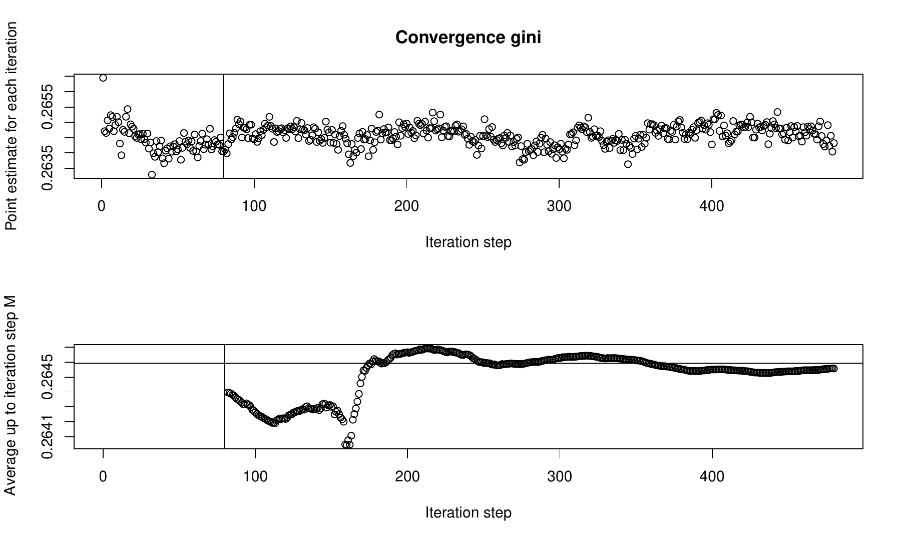
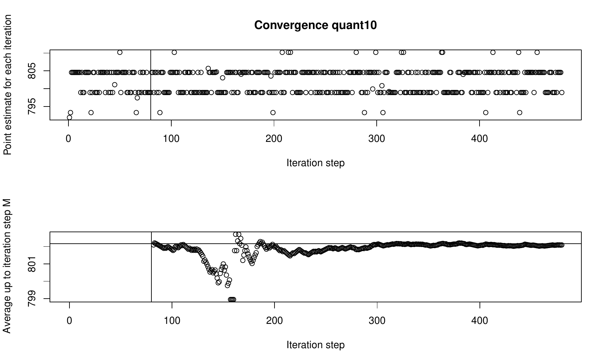
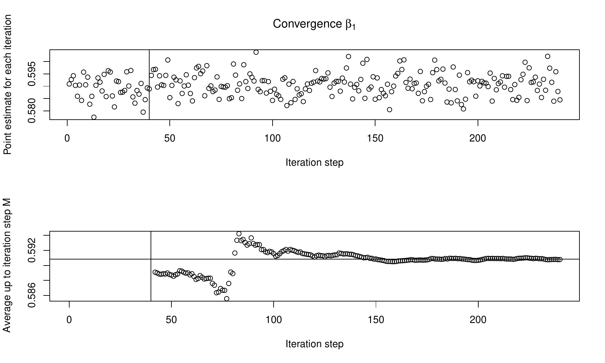
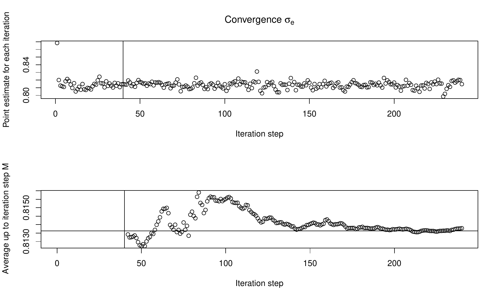

::: article
# Introduction

Interval-censored or grouped data occurs when only the lower $A_{k-1}$
and upper $A_{k}$ interval bounds $(A_{k-1},A_{k})$ of a variable are
observed, and its true value remains unknown. Instead of measuring the
variable of interest on a continuous scale, for instance, income data,
the scale is divided into $n_{k}$ intervals. The variable $k$
$(1\leq k \leq n_{k})$ indicates in which of the $n_{k}$ intervals an
observation falls into. This leads to a loss of information since the
shape of the distribution within the intervals remains unknown. In the
field of survey statistics, asking for interval-censored data is often
done in order to avoid item non-response and thus increase data quality.
Item non-response is avoided because interval-censored data offers a
higher level of data privacy protection [@Hagenaars1988; @Moore2000].
Among others, popular surveys and censuses that collect
interval-censored data are the German Microcensus [@Sta17], the
Colombian census [@Dep05], and the Australian census [@Aus11]. While
item non-response is reduced or avoided, the statistical analysis of the
data requires more elaborate mathematical methods. Even statistical
indicators that are easily calculated for metric data, e.g., the mean,
cannot be estimated using standard formulas [@Fah11]. Also, estimating
linear and linear mixed regression models, which are applied in many
fields of statistics, requires advanced statistical methods when the
dependent variable is interval censored. Therefore, the presented R
package implements three major functions: `kdeAlgo()` to estimate
statistical indicators (e.g., the mean) from interval-censored data,
`semLm()`, and `semLme()` to estimate linear and linear mixed regression
models with an interval-censored dependent variable. The package code
and the open-source contribution guidelines for the package are
available on [GitHub](https://github.com/chiquadrat/smicd). Potential
code contributions, feature requests, and bugs can be reported there by
creating issues.

For the estimation of statistical indicators from interval-censored
data, different approaches are described in the literature. These
approaches can be broadly categorized into four groups: Estimation on
the midpoints [@Fah11], linear interpolation of the distribution
function, non parametric modeling via splines [@Ber16], and fitting a
parametric distribution function to the censored data
[@Dag77; @Mcd84; @Ban02]. Some of these methods are implemented in R
packages available on the Comprehensive R Archive Network (CRAN). The
method of linear interpolation is implemented for the estimation of
quantiles in the R package
[*actuar*](https://CRAN.R-project.org/package=actuar)
[@Dut08a; @Dut08b]. The package also enables the estimation of the mean
on the interval midpoints. Fitting a parametric distribution to
interval-censored data can be done by using the R package
[*fitdistrplus*](https://CRAN.R-project.org/package=fitdistrplus)
[@Del15a; @Del15b].

In survey statistics, interval-censored data is often collected for
income or wealth variables. Thus, the performance of the above-mentioned
methods is commonly evaluated by simulation studies that rely on data
that follows some kind of income distribution. The German statistical
office (DESTATIS) uses the method of linear interpolation for the
estimation of statistical indicators from interval-censored income data
collected by the German Microcensus. This approach gives the same
results as assuming a uniform distribution within the income intervals.
Estimation results are reasonably accurate if the estimated indicators
do not depend on the whole shape of the distribution, e.g., the median
[@Len16]. Fitting a parametric distribution to the data enables the
estimation of indicators that rely on the whole shape of the
distribution. This method works well when the data is censored to only a
few equidistant intervals [@Len16]. Non parametric modeling via splines
shows especially good results for a high number of intervals in
ascending order [@Len16]. However, according to @Len16, all of the
above-mentioned methods show large biases and variances when the
estimation is based on a small number of intervals. Therefore, a novel
kernel density estimation (KDE) algorithm is implemented in the
[*smicd*](https://CRAN.R-project.org/package=smicd) package that
overcomes the drawbacks of the previously mentioned methods
[@Wal19; @Wal20]. The algorithm bases the estimation of statistical
indicators on pseudo samples that are drawn from a fitted non parametric
distribution. The method automatically adapts to the shape of the true
unknown distribution and provides reliable estimates for different
interval-censoring scenarios. It can be applied via the function
`kdeAlgo()`.

Similar to the direct estimation of statistical indicators from
interval-censored data, there exists a variety of ad-hoc approaches and
explicitly formulated mathematical methods for the estimation of linear
regression models with an interval-censored dependent variable. The
following methods and approaches are used for handling interval-censored
dependent variables within linear regression models: Ordinary least
squares (OLS) regression on the midpoints [@Tho03], ordered logit- or
probit-regression [@McC80], and regression methodology formulated for
left-, right-, and interval-censored data [@Tob58; @Ros75; @Ste83]. All
of these methods are implemented in different R packages available on
CRAN. OLS regression on the midpoints is applicable by using the `lm()`
function from the [*stats*](https://CRAN.R-project.org/package=stats)
package [@Cor20], ordered logit regression is implemented in the
[*MASS*](https://CRAN.R-project.org/package=MASS) package
[@Rip19; @Ven02], and interval regression is implemented in the
[*survival*](https://CRAN.R-project.org/package=survival)
[@Ter20; @Ter00] package.

While OLS regression on the midpoints of the intervals is easily
applied, it comes with the disadvantage of giving biased estimation
results [@Cam87]. This approach disregards the uncertainty stemming from
the unknown true distribution of the data within the intervals, and
therefore, leads to biased parameter estimates. Its performance relies
on the number of intervals, and estimation results are only comparable
to more advanced methods when the number of intervals is very large
[@Fry72]. Conceptualizing the model as an ordered logit or probit
regression is feasible by treating the dependent variable as an ordered
factor variable [@McC80]. However, this approach also neglects the
unknown distribution of the data within the intervals. Furthermore, the
predicted values are not on a continuous scale but are in terms of the
probability of belonging to a certain group. To overcome these
disadvantages and obtain unbiased estimation results @Ste83 introduces
regression methodology for models with an interval-censored dependent
variable. [@Wal19] further develops his approach and introduces a novel
stochastic expectation-maximization (SEM) algorithm for the estimation
of linear regression models with an interval-censored dependent variable
that is implemented in the *smicd* package. The model parameters are
unbiasedly estimated as long as the model assumptions are fulfilled. The
function `semLm()` provides the SEM algorithm and enables the use of
fixed (logarithmic) and data-driven (Box-Cox) transformations [@Box64].
The Box-Cox transformation automatically adapts to the shape of the data
and transforms the dependent variable in order to meet the model
assumption.

In order to analyze longitudinal or clustered data (e.g., students
within schools), linear mixed regression models are applicable. These
kinds of models control for the correlated structure of the data by
including random effects in addition to the usual fixed effects. In
order to deal with an interval-censored dependent variable in linear
mixed regression models, there are several approaches described in the
literature. Linear mixed regression models, just like linear regression
models, can be estimated on the interval midpoints of the
censored-dependent variable. Furthermore, conceptualizing the model as
an ordered logit or probit regression model is feasible [@Agr10]. These
approaches inherit the same advantages and disadvantages as previously
discussed. Linear mixed regression on the midpoints can be applied by
the [*lme4*](https://CRAN.R-project.org/package=lme4) [@Dou20; @Dou15]
or [*nlme*](https://CRAN.R-project.org/package=nlme) [@Pin20] package
and the ordered logit regression is implemented in the
[*ordinal*](https://CRAN.R-project.org/package=ordinal) package
[@Chr15]. To my knowledge, there are no R packages for the estimation of
linear mixed regression models with an interval-censored dependent
variable. Therefore, the package *smicd* contains the SEM algorithm
proposed by @Wal19 for the estimation of linear mixed regression models
with an interval-censored dependent variable. If the model assumptions
are fulfilled, the method gives unbiased estimation results. The
function `semLme()` enables the estimation of the regression parameters,
and it also allows for the usage of the logarithmic and Box-Cox
transformation in order to fulfill the model assumptions [@Gur06].

The paper is structured into two main sections. Section
[2](#Sec:DirectR) deals with the direct estimation of statistical
indicators from interval-censored data, whereas Section
[3](#Sec:RegressionR) introduces linear and linear mixed regression
models with an interval-censored dependent variable. Both sections have
been divided into three subsections: first, the statistical methodology
is introduced, then the core functions of the *smicd* package are
presented, and finally, illustrative examples with two different data
sets are provided. In Section [4](#Sec:DisR), the main results are
summarized, and an outlook is given.

# Direct estimation of statistical indicators {#Sec:DirectR}

In the following three subsections, the methodology for the direct
estimation of statistical indicators from interval-censored data is
introduced, the core functionality of the function `kdeAlgo()` is
presented, and statistical indicators are estimated using the synthetic
EU-SILC (European Union Statistics on Income and Living Conditions) data
set from Austria.

## Methodology: Direct estimation of statistical indicators

In order to estimate statistical indicators from interval-censored data,
the proposed algorithm generates metric pseudo samples of an
interval-censored variable. These pseudo samples can be used to estimate
any statistical indicator. They are drawn from a non parametrically
estimated kernel density. Kernel density estimation was first introduced
by [@Rosenblatt1956] and [@Parzen1962]. By its application, the density
$f(x)$ of a continuous independently and identically distributed random
variable is estimated without assuming any distributional shape of the
data. The estimator is defined as:
$$\label{Eq:KerneldefR}
            \hat{f}_{h}(x) =\frac{1}{nh}\sum_{i=1}^{n}
                           K\left( \dfrac{x-x_i}{h}  \right), \qquad i=1, \ldots, n,   (\#eq:EqKerneldefR)$$
where $K\left(\cdot\right)$ is a kernel function, $h>0$ the bandwidth,
and $x=\{x_{1},x_{2},\ldots,x_{n}\}$ denotes a sample of size $n$. The
performance of the estimator is determined by the optimal choice of $h$.
The selection of an optimal $h$ is widely discussed in the literature;
see @Jon96 [@Loa99; @Zam12]. When working with interval-censored data, a
standard KDE cannot be applied since $x$ is not observed on a continuous
scale. Nevertheless, its unobserved true distribution is of continuous
form. As an ad hoc solution, the density $\hat{f}_{h}\left(x\right)$ can
be estimated based on the interval midpoints. The resulting density
estimate will be spiky unless the bandwidth is sufficiently large. A
large bandwidth, however, leads to a loss of information [@Wan13].
Therefore, @Wal19 proposes an iterative KDE algorithm for density
estimation from interval-censored data. The approach is based on @Gro17,
who introduce a similar KDE algorithm in a two-dimensional setting with
an equidistant interval width. @Wal19 shows that the algorithm can be
adjusted to one-dimensional data with an arbitrary class width. For the
estimation of linear and non-linear statistical indicators, the unknown
distribution of $x$ has to be reconstructed by using the observed
interval $k=\{k_{1}, k_{2}, \ldots ,k_{n}\}$ that an observation falls
into. From Bayes' theorem [@Bay63], it follows that the conditional
distribution of $\left(x|k\right)$ is:
$$\pi\left(x|k\right)\propto \pi\left(k|x\right)\pi\left(x\right),$$
with $\pi \left(k|x\right)$ is defined by a product of a Dirac
distribution
$\pi\left(k|x\right)=\prod_{i=1}^{n}\pi\left(k_{i}|x_{i}\right)$ with
$$\pi\left(k_{i}|x_{i}\right)=\begin{cases}
  1  & \text{if } A_{k_{i}-1} \leq x_{i} \leq A_{k_{i}}, \\ 
  0 & \text{else, } 
\end{cases}$$
for $i=1,\ldots,n$. Since $\pi\left(x\right)$ is unknown, it is replaced
by a kernel density estimate $\hat{f}_{h}\left(x\right)$.

## Estimation and computational details

To fit the model, pseudosamples of $x_{i}$ are drawn from the
conditional distribution
$$\pi\left(x_{i}|k_{i}\right) \propto \textbf{I}\left(A_{k_{i}-1} \leq x_{i} \leq A_{k_{i}}\right) f\left(x_{i}\right),$$
where $\textbf{I}\left(\cdot\right)$ denotes the indicator function. The
conditional distribution of $\pi\left(x_{i}|k_{i}\right)$ is given by
the product of a uniform distribution and density $f\left(x_{i}\right)$.
As the density is unknown, it is replaced by an estimate
$\hat{f}_{h}\left(x\right)$, which is obtained by the KDE. In
particular, $x_{i}$ is repeatedly drawn from the given interval
$\left(A_{k_{i}-1}, A_{k_{i}}\right)$ by using the current density
estimate $\hat{f}_{h}\left(x\right)$ as a sampling weight. The explicit
steps of the iterative algorithm as given in @Wal19 are stated below:

1.  Use the midpoints of the intervals as pseudo $\tilde{x}_{i}$ for the
    unknown $x_{i}$. Estimate a pilot estimate of
    $\hat{f}_{h}\left(x\right)$ by applying KDE. Note: Choose a
    sufficiently large bandwidth $h$ in order to avoid rounding spikes.

2.  Evaluate $\hat{f}_{h}\left(x\right)$ on an equal-spaced grid
    $G=\{g_{1}, \ldots , g_{j}\}$ with grid points
    $g_{1}, \ldots ,g_{j}$. The width of the grid is denoted by
    $\delta _{g}$. It is given by
    $$\delta _{g} = \frac{|A_{0}-A_{n_{k}}|}{j-1},$$
    and the grid is defined as:
    $$G=\{g_{1}=A_{0}, g_{2}=A_{0}+\delta _{g},g_{3}= A_{0}+2\delta _{g}, \ldots , g_{j-1}=A_{0}+\left(j-2\right)\delta _{g}, g_{j}=A_{n_{k}} \}.$$

3.  Sample from $\pi\left(x|k\right)$ by drawing randomly from
    $G_k=\{g_j| g_j\in \left(A_{k-1},A_k\right)\}$ with sampling weights
    $\hat{f}_{h}\left(\tilde{x}_{i}\right)$ for $k=1, \ldots ,n_{k}$.
    The sample size for each interval is given by the number of
    observations within each interval. Obtain $\tilde{x}_{i}$ for
    $i=1,\ldots ,n$.

4.  Estimate any statistical indicator of interest $\hat{I}$ using
    $\tilde{x}_{i}$.

5.  Recompute the density $\hat{f}_{h}\left(x\right)$ using the pseudo
    samples $\tilde{x}_{i}$ obtained in iteration Step 3.

6.  Repeat Steps 2-5, with $B^{(KDE)}$ burn-in and $M^{(KDE)}$
    additional iterations.

7.  Discard the $B^{(KDE)}$ burn-in iterations and estimate the final
    $\hat{I}$ by averaging the obtained $M^{(KDE)}$ estimates.

For open-ended intervals, e.g., $\left(15000,+\infty\right)$, the upper
bound has to be replaced by a finite number. @Wal19 shows through
model-based simulations that a value of three times the value of the
lower bound $\left(15000,45000\right)$ gives appropriate estimation
results when working with income data.

The variance of the statistical indicators is estimated by
bootstrapping. Bootstrap methods were first introduced by @Efr79. These
methods serve as an estimation procedure when the variance cannot be
stated as a closed-form solution [@Sha95]. While bootstrapping avoids
the problem of the non-availability of a closed-form solution, it comes
with the disadvantage of long computational times. In the package, a non
parametric bootstrap that accounts for the additional uncertainty coming
from the interval-censored data is implemented. This non parametric
bootstrap is introduced in @Wal19.

## Core functionality: Direct estimation of statistical indicators {#Sec:DirectCoreR}

The presented KDE algorithm is implemented in the function `kdeAlgo()`
(see Table [1](#Tab:CoreDirectR)). The arguments and default settings of
`kdeAlgo()` are briefly summarized in Table [2](#Tab:ArgkdeAlgoR). The
function gives back an S3 object of class `"kdeAlgo"`. A detailed
explanation of all components of a `"kdeAlgo"` object can be found in
the package documentation. The generic functions `plot()` and `print()`
can be applied to `"kdeAlgo"` objects to output the main estimation
results (see Table [1](#Tab:CoreDirectR)). In the next section, the
function `kdeAlgo()` is used to estimate a variety of statistical
indicators from interval-censored EU-SILC data, and its arguments are
explained in more detail.

::: {#Tab:CoreDirectR}
  -------------------------------------------------------------------------------------
  Function Name   Description
  --------------- ---------------------------------------------------------------------
  `kdeAlgo()`     Estimates the statistical indicators and its standard errors from

                  interval-censored data

  `plot()`        Plots convergence of the estimated statistical indicators and

                  estimated density of the pseudo $\tilde{x}_{i}$

  `print()`       Prints the estimated statistical indicators and its standard errors
  -------------------------------------------------------------------------------------

  : Table 1: Implemented functions for the direct estimation of
  statistical indicators.
:::

::: {#Tab:ArgkdeAlgoR}
  ------------------------------------------------------------------------------------------
  Argument             Description                                                Default
  -------------------- ---------------------------------------------------------- ----------
  `xclass`             Interval-censored variable                                 

  `classes`            Numeric vector of interval bounds                          

  `threshold`          Threshold used for poverty indicators                      

                       (% of the median of the target variable)                   `0.6`

  `burnin`             Number of burn-in iterations $B^{(KDE)}$                   `80`

  `samples`            Number of additional iterations $M^{(KDE)}$                `400`

  `bootstrap.se`       If TRUE, standard errors of the statistical                

                       indicators are estimated                                   `FALSE`

  `b`                  Number of bootstraps for the estimation of                 

                       the standard errors                                        `100`

  `bw`                 Smoothing bandwidth used                                   `"nrd0"`

  `evalpoints`         Number of evaluation grid points                           `4000`

  `adjust`             Bandwidth multiplier $bw=adjust*bw$                        `1`

  `custom_indicator`   A list of user-defined statistical indicators              `NULL`

  `upper`              If upper bound of the upper interval is $+\infty$, e.g.,   

                       $(15000,+\infty)$, then $+\infty$ is replaced by           

                       $15000*upper$                                              `3`

  `weights`            Survey weights                                             `NULL`

  `oecd`               Household weights of equivalence scale                     `NULL`
  ------------------------------------------------------------------------------------------

  : Table 2: Arguments of function `kdeAlgo()`.
:::

## Example: Direct estimation of statistical indicators {#Sec:DirectExampleR}

To demonstrate the function `kdeAlgo()`, the equivalized household
income and the corresponding household sample weight from the Austrian
synthetic EU-SILC survey data set are used. The data set is included in
the [*laeken*](https://CRAN.R-project.org/package=laeken) package
[@Tem20; @Tem13]. Its synthetic nature makes it unusable for inferential
statistics. However, the data set has the advantage over the scientific
use file by being freely available which enables the easy
reproducibility of the presented example. Since the total disposable
household income is measured on a continuous scale, it is censored to 22
intervals for demonstration purposes. For a realistic censoring scheme,
the interval bounds are chosen such that they closely follow the
interval bounds used in the German Microcensus from 2013 [@Sta14]. The
German Microcensus is a representative household survey that covers
830,000 persons in 370,000 households (1% of the German population) in
which income is only collected as an interval-censored variable
[@Sta16].

In a first step, the variable total disposable household income called
`hhincome_net` is interval-censored according to 22 intervals using the
function `cut()`. The vector of interval bounds is called `intervals`,
and the newly obtained interval-censored income variable is called
`c.hhincome`.

``` r
R> intervals <- c(
+    0, 150, 300, 500, 700, 900, 1100, 1300, 1500, 1700, 2000, 2300, 2600, 2900, 
+    3200, 3600, 4000, 4500, 5000, 5500, 6000, 7500, Inf
+  )
R> c.hhincome <- cut(hhincome_net, breaks = intervals)
```

In order to get a descriptive overview of the distribution of the
censored income data, the function `table()` is applied.

``` r
R> table(c.hhincome)
c.hhincome
          (0,150]         (150,300]         (300,500] 
               66               113               280 
        (500,700]         (700,900]     (900,1.1e+03] 
              462              1137              1433 
(1.1e+03,1.3e+03] (1.3e+03,1.5e+03] (1.5e+03,1.7e+03] 
             2040              1811              1671 
  (1.7e+03,2e+03]   (2e+03,2.3e+03] (2.3e+03,2.6e+03] 
             2006              1383               849 
(2.6e+03,2.9e+03] (2.9e+03,3.2e+03] (3.2e+03,3.6e+03] 
              508               389               242 
  (3.6e+03,4e+03]   (4e+03,4.5e+03]   (4.5e+03,5e+03] 
              158               107                61 
  (5e+03,5.5e+03]   (5.5e+03,6e+03]   (6e+03,7.5e+03] 
               21                18                52 
    (7.5e+03,Inf]
               17
```

Most incomes are in interval $(1100,1300]$, and only 17 incomes are in
the upper interval. For the estimation of the statistical indicators,
the function `kdeAlgo()` of the *smicd* package is called with the
following arguments.

``` r
R> Indicators <- kdeAlgo(
+    xclass = c.hhincome, classes = intervals, 
+    bootstrap.se = TRUE, custom_indicator = 
+     list(
+      quant05 = function(y, threshold, weights) {
+       wtd.quantile(y, probs = 0.05, weights)
+      }, 
+      quant95 = function(y, threshold, weights) {
+       wtd.quantile(y, probs = 0.95, weights)
+      }
+     ), 
+    weights = hhweight
+  )
```

The variable `c.hhincome` is assigned to the argument `xclass`, and the
vector of interval bounds `intervals` is assigned to the argument
`classes`. The default settings of the arguments `burnin`, `samples`,
`bw`, `evalpoints`, `adjust`, and `upper` are retained. Simulation
results from @Wal19 and @Gro17 show that these settings give good
results when working with income data. Changing these arguments has an
impact on the performance of the KDE algorithm. As default, the
statistical indicators: mean, Gini coefficient, headcount ratio (HCR),
the quantiles (10%, 25%, 50%, 75%, 90%), the poverty gap (PGAP), and the
quintile share ratio (QSR) are estimated [@Gin12; @Fos84]. The HCR and
PGAP rely on a poverty threshold. The default choice of the `threshold`
argument is 60% of the median of the target variable, as suggested by
@Eur14. Besides the mentioned indicators, any other statistical
indicator can be estimated via the argument `custom_indicator`. In the
example, the argument is assigned a list that holds functions to
estimate the 5% and 95% quantile. The custom indicators must depend on
the target variable, the threshold (even if it is not needed for the
specified indicator), and optionally on the weights argument if the
estimation of a weighted indicator is required. To estimate the standard
errors of all indicators, `bootstrap.se = TRUE`, and the number of
bootstrap samples is 100 (the default value as suggested in @Wal19).
Lastly, the household weight (`hhweight`) is assigned to the argument
`weights` in order to estimate weighted statistical indicators. It can
also be controlled for households of different sizes by assigning `oecd`
a variable with household equivalence weights. By applying the `print()`
function to the `"kdeAlgo"` object, the estimated statistical indicators
(default and custom indicators) as well as their standard errors are
printed. For instance, in this example, the estimated mean is about
1,658 Euro and its standard error is 8.486.

``` r
R> print(Indicators)
Value:
    mean   gini    hcr  quant10   quant25   quant50  
1658.329  0.265  0.145  802.227  1117.714  1507.947 
 quant75   quant90   pgap     qsr  quant05   quant95 
 2020.063 2654.707  0.040   3.920  630.326  3142.296  

Standard error:
   mean   gini    hcr quant10 quant25 quant50 
  8.486  0.002  0.002   5.839   5.977   6.605  
quant75 quant90   pgap    qsr quant05 quant95 
 10.548  21.622  0.001  0.044  10.327  24.401 
```

For demonstration purposes, the statistical indicators are also
estimated using the continuous household income variable from the
synthetic EU-SILC data set (Table [3](#Tab:directEst)). The estimation
results of the KDE algorithm using the interval-censored data are very
close to those based on the continuous data. Slightly larger deviations
are observable for the more extreme quantiles. This is due to the fact
that these quantile estimates fall into intervals with a lower number of
observations (compared to the other quantile estimates). Estimation
results for these quantiles could potentially be further improved by
increasing the number of `evalpoints` of the `kdeAlgo()`.

::: {#Tab:directEst}
  ----------- ----------- -------- ----------- ----------- ----------- --
       `mean`      `gini`    `hcr`   `quant10`   `quant25`   `quant50` 

     1657.910       0.265    0.144     805.468    1114.028    1508.657 

    `quant75`   `quant90`   `pgap`       `qsr`   `quant05`   `quant95` 

     2017.585    2653.617    0.040       3.960     619.666    3153.425 
  ----------- ----------- -------- ----------- ----------- ----------- --

  : Table 3: Estimated weighted statistical indicators using the
  continuous household income variable from the synthetic EU-SILC data
  set.
:::

In @Wal19, the performance of the KDE algorithm is evaluated via
detailed simulation studies. By applying the function `plot()`,
`"kdeAlgo"` objects can be plotted. Thereby, convergence plots for all
estimated statistical indicators and a plot of the estimated final
density are obtained.

``` r
R> plot(Indicators)
```

Figure [1](#Fig:kdeAlgoConv) shows convergence plots for two of the
estimated indicators. Additionally, a plot of the estimated final
density with a histogram of the observed data in the background is given
in Figure [2](#Fig:kdeAlgoDens). In Figure [1](#Fig:kdeAlgoConv), the
estimated statistical indicator (Gini, 10% quantile) for each iteration
step of the KDE algorithm and the average over the estimates up to
iteration step M (excluding the burn-in iterations) are plotted. A
vertical line marks the end of the burn-in period. The horizontal line
gives the value of the final estimate (average over the M iterations).
All convergence plots indicate that the number of iterations is chosen
sufficiently large for the estimates to converge.

If convergence were not achieved, the arguments `burnin` and `samples`
should be increased. It is notable that the estimated 10% quantile has
the same value for almost all iterations steps. This is the case because
the quantile, as any other statistical indicator, is estimated using the
pseudo samples that are drawn on 4,000 grid points $G$. Estimating a
quantile on only 4,000 unique outcomes (pseudo values) leads to equal
quantile estimates for numerous iteration steps of the KDE algorithm.

<figure id="Fig:kdeAlgoConv">


<figcaption>Figure 1: Convergence plots of the estimated indicators
(Gini and 10% quantile).</figcaption>
</figure>

{#Fig:kdeAlgoDens width="100%"
alt="graphic without alt text"}

Lastly, it should be mentioned that the computation time can be very
long if the estimation of the standard errors is enabled. Hence, if the
estimation of the standard errors is not required, the argument
`bootstrap.se` should be set to `FALSE`. Furthermore, it should always
be checked how many iterations are needed for the desired statistical
indicator to converge. Reducing the number of required iterations
(arguments `burnin` and `samples`) lowers the computation time
significantly (with and without standard errors).

# Regression analysis {#Sec:RegressionR}

In the following three subsections, the statistical methodology for
linear and linear mixed regression models with an interval-censored
dependent variable is introduced, the core functionality of the
functions `semLM()` and `semLME()` is presented, and examination scores
of students from schools in London are exemplary modeled.

## Methodology: Regression analysis

The theoretical introduction of the new regression method, proposed by
@Wal19, is presented for linear mixed regression models. The theory for
linear regression models can be obtained by simplifying the introduced
method. In its standard form, the linear mixed regression model serves
to analyze the linear relationship between a continuous dependent
variable and some independent variables [@Gol03]. Random parameters
(random slopes and random intercepts) are included in the model to
account for correlated data, e.g., students within schools. The model in
matrix notation [@Lai83] is given by
$$\label{Eq:NestedErrorModelR}
\mathbf{y}=\mathbf{X}\boldsymbol{\beta}+\mathbf{Z}\mathbf{v}+\mathbf{e},   (\#eq:EqNestedErrorModelR)$$
where $\mathbf{y}$ is an $n \times 1$ column vector of the dependent
variable, $n$ is the sample size, $\mathbf{X}$ is a $n \times p$ matrix
where $p$ is equal to the number of predictors, $\boldsymbol{\beta}$ is
a column vector of the fixed effects regression parameters of size
$p \times 1$, $\mathbf{Z}$ is the $n\times q$ design matrix with $q$
random effects, $\mathbf{v}$ is a $q \times 1$ vector of random effects,
and $\mathbf{e}$ is the residual vector of size $n\times 1$. The
distribution of the random effects is given by
$$\mathbf{v}\sim N\left(\mathbf{0}, \mathbf{G}\right), \qquad \text{ where } \mathbf{G}=\begin{bmatrix}
\sigma_{0}^{2}	& \sigma_{01}	& \dots	 & \sigma_{0q}      \\
\sigma_{10}	& \sigma_{1}^{2} 	& \dots  & \sigma_{1q} 	  \\
\vdots	& \vdots 	& \ddots & \vdots \\
\sigma_{q0} 	& \sigma_{q1} & \dots	 & \sigma_{q}^{2}
\end{bmatrix},$$
and the distribution of the residuals is given by
$\mathbf{e}\sim N\left(\mathbf{0},\mathbf{R}\right)$ with
$\mathbf{R}=\mathbf{I}_{n}\sigma_{e}^{2}$, where $\mathbf{I}_{n}$ is the
identity matrix, and $\sigma^{2}_{e}$ is the residual variance. The
random effects $\mathbf{v}$ and the residuals $\mathbf{e}$ are assumed
to be independent. For a more detailed introduction of mixed models, see
@Sea92 [@McC08; @Sni11]. In the case of an interval-censored dependent
variable, the parameters of Model (\@ref(eq:EqNestedErrorModelR)) have
to be estimated without observing $\mathbf{y}$ on a continuous scale.
Instead, only the interval identifier $\mathbf{k}$, now defined as
$n\times 1$ column vector, is observed. Open-ended interval bounds
$A_{0}=-\infty$ and $A_{n_{k}}=+\infty$ and unequal interval widths are
allowed. Since the true distribution of $\mathbf{y}$ is unknown, the aim
is to reconstruct the distribution of $\mathbf{y}$ using the known
intervals $\mathbf{k}$ and the linear relationship stated in Model
(\@ref(eq:EqNestedErrorModelR)). As presented in @Wal19, in order to
reconstruct the unknown distribution of
$f\left(\mathbf{y}|\mathbf{X}, \mathbf{Z}, \mathbf{v}, \mathbf{k}, \boldsymbol{\theta}\right)$,
where
$\boldsymbol{\theta} = \left(\boldsymbol{\beta},\mathbf{R}, \mathbf{G}\right)$,
the Bayes theorem [@Bay63] is applied. Hence,
$$f\left(\mathbf{y}|\mathbf{X}, \mathbf{Z}, \mathbf{v}, \mathbf{k}, \boldsymbol{\theta}\right) \propto f\left(\mathbf{k}|\mathbf{y}, \mathbf{X}, \mathbf{Z}, \mathbf{v}, \boldsymbol{\theta}\right)f\left(\mathbf{y}|\mathbf{X}, \mathbf{Z}, \mathbf{v}, \boldsymbol{\theta}\right),$$
with
$f\left(\mathbf{k}|\mathbf{y}, \mathbf{X}, \mathbf{Z}, \mathbf{v}, \boldsymbol{\theta}\right)=f\left(\mathbf{k}|\mathbf{y}\right)$
because the conditional distribution of the interval identifier
$\mathbf{k}$ only depends on $\mathbf{y}$. It is given by
$f\left(\mathbf{k}|\mathbf{y}\right)=\mathbf{r}$, with $\mathbf{r}$
being an $n \times 1$ column vector
$\mathbf{r}=\left(r_{1},r_{2}, \ldots , r_{n} \right)^{T}$, with
$$r_{i}=\begin{cases}
  1  & \text{if } A_{k_{i}-1} \leq y_{i} \leq A_{k_{i}}, \\ 
  0 & \text{else, }
\end{cases}$$
for $i=1, \ldots, n$ and
$$\label{Eq:distR}
f\left(\mathbf{y}|\mathbf{X}, \mathbf{Z}, \mathbf{v}, \boldsymbol{\theta}\right)  \sim \enspace N\left(\mathbf{X}\boldsymbol{\beta}+\mathbf{Z}\mathbf{v}, \mathbf{R}\right).   (\#eq:EqdistR)$$
The relationship in Equation (\@ref(eq:EqdistR)) follows from the linear
mixed model assumptions (Model (\@ref(eq:EqNestedErrorModelR))). The
unknown parameters
$\boldsymbol{\theta}=\left(\boldsymbol{\beta},\mathbf{R},\mathbf{G}\right)$
are estimated based on pseudo samples $\mathbf{\tilde{y}}$ (since
$\mathbf{y}$ is unknown) that are iteratively drawn from
$f\left(\mathbf{y}|\mathbf{X}, \mathbf{Z}, \mathbf{v}, \mathbf{k}, \boldsymbol{\theta}\right)$.
The next subsection states the computational details of the SEM
algorithm.

## Estimation and computational details

To fit Model (\@ref(eq:EqNestedErrorModelR)), the parameter vector
$\boldsymbol{\hat{\theta}}=\left(\boldsymbol{\widehat{\beta}},\mathbf{\widehat{R}},\mathbf{\widehat{G}}\right)$
is estimated, and pseudo samples of the unknown $\mathbf{y}$ are
iteratively generated by the following SEM algorithm. The pseudo samples
$\mathbf{\tilde{y}}$ are drawn from the conditional distribution
$$f\left(\mathbf{y}|\mathbf{X}, \mathbf{Z}, \mathbf{v},\mathbf{k} ,\boldsymbol{\theta}\right) \propto \textbf{I}\left(A_{\mathbf{k}-1} \leq \mathbf{y} \leq A_{\mathbf{k}}\right) \times N\left(\mathbf{X}\boldsymbol{\beta}+\mathbf{Z}\mathbf{v}, \mathbf{R}\right),$$
where $\textbf{I}\left(\cdot\right)$ denotes the indicator function.
Hence, for $\mathbf{y}$ with explanatory variables $\mathbf{X}$, the
corresponding $\mathbf{\tilde{y}}$ is drawn from
$N\left(\mathbf{X}\boldsymbol{\beta}+\mathbf{Z}\mathbf{v}, \mathbf{R}\right)$
conditional on the given interval
$\left(A_{\mathbf{k}-1} \leq \mathbf{y} \leq A_{\mathbf{k}}\right)$. If
$\boldsymbol{\hat{\theta}}$ is estimated, the conditional distribution
$f\left(\mathbf{y}|\mathbf{X}, \mathbf{Z}, \mathbf{v},\mathbf{k} ,\boldsymbol{\theta}\right)$
follows a two-sided truncated normal distribution. Its probability
density function equals
$$\label{Eq:TwoTruncR}
\hat{f}\left(\mathbf{y}|\mathbf{X}, \mathbf{Z}, \mathbf{\hat{v}}, \mathbf{k}, \boldsymbol{\hat{\theta}}\right)=\frac{\phi\Big(\frac{\mathbf{y}-\boldsymbol{\hat{\mu}}}{\hat{\sigma}_{e}}\Big)}{\hat{\sigma}_{e}\bigg(\Phi \Big(\frac{A_{\mathbf{k}}-\boldsymbol{\hat{\mu}}}{\hat{\sigma}_{e}}\Big)-\Phi \Big(\frac{A_{\mathbf{k}-1}-\boldsymbol{\hat{\mu}}}{\hat{\sigma}_{e}}\Big)\bigg)},   (\#eq:EqTwoTruncR)$$
with
$\boldsymbol{\hat{\mu}} = \mathbf{X}\widehat{\boldsymbol{\beta}}+\mathbf{Z}\mathbf{\hat{v}}$.
$\phi\left(\cdot\right)$ denotes the probability density function of the
standard normal distribution, and $\Phi(\cdot)$ denotes its cumulative
distribution function. From its definition, it follows that
$\Phi \Big(\frac{A_{\mathbf{k}}-\boldsymbol{\hat{\mu}}}{\hat{\sigma}_{e}}\Big) = 1$
if $A_{\mathbf{k}}=+\infty$, and
$\Phi \Big(\frac{A_{\mathbf{k}-1}-\boldsymbol{\hat{\mu}}}{\hat{\sigma}_{e}}\Big)=0$
if $A_{\mathbf{k}-1}=-\infty$. The steps of the SEM algorithm as
described in @Wal19 are:

1.  Estimate
    $\boldsymbol{\hat{\theta}}=\left(\boldsymbol{\widehat{\beta}},\mathbf{\widehat{R}},\mathbf{\widehat{G}}\right)$
    from Model (\@ref(eq:EqNestedErrorModelR)) using the midpoints of
    the intervals as substitutes for the unknown $\mathbf{y}$. The
    parameters are estimated by restricted maximum likelihood theory
    (REML) [@Tho62].

2.  **Stochastic step:** For $i=1,\ldots , n$, draw randomly from
    $N\left(\mathbf{X}\boldsymbol{\widehat{\beta}}+\mathbf{Z}\mathbf{\hat{v}}, \mathbf{\widehat{R}}\right)$
    within the given interval
    $\left(A_{\mathbf{k}-1} \leq \mathbf{y} \leq A_{\mathbf{k}}\right)$
    (the two-sided truncated normal distribution given in Equation
    (\@ref(eq:EqTwoTruncR))) obtaining
    $\left(\mathbf{\tilde{y}},\mathbf{X},\mathbf{Z}\right)$. The drawn
    pseudo $\mathbf{\tilde{y}}$ are used as replacements for the
    unobserved $\mathbf{y}$.

3.  **Maximization step:** Re-estimate the parameter vector
    $\boldsymbol{\hat{\theta}}$ from Model
    (\@ref(eq:EqNestedErrorModelR)) by using the pseudo samples
    $\left(\mathbf{\tilde{y}},\mathbf{X},\mathbf{Z}\right)$ from Step 2.
    Again, parameter estimation is carried out by REML.

4.  Iterate Steps 2-3 $B^{(SEM)}+M^{(SEM)}$ times, with $B^{(SEM)}$
    burn-in iterations and $M^{(SEM)}$ additional iterations.

5.  Discard the burn-in iterations $B^{(SEM)}$ and estimate
    $\boldsymbol{\hat{\theta}}$ by averaging the obtained $M^{(SEM)}$
    estimates.

If open-ended intervals $A_{0}=-\infty$ and $A_{n_{k}}=+\infty$ are
present, the midpoints $M_{1}$ and $M_{n_{k}}$ of these intervals in
iteration Step 1 are computed as follows:
$$\begin{split}
M_{1}&=\left(A_{1}-\overline{D}\right)/2, \\
M_{n_{k}}&=\left(A_{n_{k}-1}+\overline{D}\right)/2,
\end{split}$$
where
$$\overline{D}=\frac{1}{\left(n_{k}-2\right)}\sum_{k=2}^{n_{k}-1}|A_{k-1}-A_{k}|.$$
These midpoints serve as proxies for the unknown interval midpoints in
Step 1 of the algorithm. The SEM algorithm for the linear regression
model is obtained by simplifying the conditional distribution
$f\left(\mathbf{y}|\mathbf{X}, \mathbf{Z}, \mathbf{v}, \boldsymbol{\theta}\right)  \sim \enspace N\left(\mathbf{X}\boldsymbol{\beta}+\mathbf{Z}\mathbf{v}, \mathbf{R}\right)$
to
$f\left(\mathbf{y}|\mathbf{X},\boldsymbol{\beta}, \sigma_{e}^{2}\right) \sim N\left(\mathbf{X}\boldsymbol{\beta}, \sigma_{e}^{2}\right)$
according to the model assumptions of a linear regression model. In the
SEM algorithm for linear models, it is then drawn from
$N\left(\mathbf{X}\boldsymbol{\beta}, \sigma_{e}^{2}\right)$ within the
given interval.

The standard errors of the regression parameters are estimated using
bootstrap methods. For the linear regression model, a non parametric
bootstrap [@Efr81; @Efr82; @Efr86; @Efr93] and for the linear mixed
regression model, a parametric bootstrap [@Wan06; @Tha13] is used to
estimate the standard errors. The non parametric, as well as the
parametric bootstrap, are further developed to account for the
additional uncertainty that is due to the interval-censored dependent
variable. Both newly proposed bootstraps are available in the *smicd*
package, and the theory is explained in [@Wal19].

To assure that the model assumptions are fulfilled, the logarithmic and
the Box-Cox transformations are incorporated into the function `semLm()`
and `semLme()`.

## Core functionality: Regression analysis {#Sec:RegressionCoreR}

The introduced SEM algorithm is implemented in the functions described
in Table [4](#Tab:CoreSEMR). The arguments and default settings of the
estimation functions `semLm()` and `semLme()` are summarized in Table
[5](#Tab:semR). Both functions return an S3 object of class `"sem"`,
`"lm"` or `"sem"`, `"lme"`. A detailed explanation of all the components
of these objects can be found in the *smicd* package documentation. The
generic functions `plot()`, `print()`, and `summary()` can be applied to
objects of class `"sem", "lm"` and `"sem", "lme"` in order to summarize
the main estimation results. In the next section, the functionality of
`semLm()` and `semLme()` is demonstrated based on an illustrative
example.

::: {#Tab:CoreSEMR}
  -----------------------------------------------------------------------------------------
  Function Name   Description
  --------------- -------------------------------------------------------------------------
  `semLm()`       Estimates linear regression models with an interval-censored

                  dependent variable

  `semLme()`      Estimates linear mixed regression models with an

                  interval-censored dependent variable

  `plot()`        Plots convergence of the estimated parameters and estimated

                  density of the pseudo $\mathbf{\tilde{y}}$ from the last iteration step

  `print()`       Prints basic information of the estimated linear and linear mixed

                  regression models

  `summary()`     Summary of the estimated linear and linear mixed regression models
  -----------------------------------------------------------------------------------------

  : Table 4: Implemented functions for the estimation of linear and
  linear mixed regression models.
:::

::: {#Tab:semR}
  ----------------------------------------------------------------------------------
  Argument         Description                                            Default
  ---------------- ------------------------------------------------------ ----------
  `formula`        A two-sided linear formula object                      

  `data`           A data frame containing the variables of the model     

  `classes`        Numeric vector of interval bounds                      

  `burnin`         Burn-in iterations                                     `40`

  `samples`        Additional iterations                                  `200`

  `trafo`          Transformation of the dependent variable: None,        `"None"`

                   logarithmic, or Box-Cox transformation                 

  `adjust`         Extends the number of iterations for the estimation    `2`

                   of the Box-Cox transformation parameter:               

                   $(burnin+samples)*adjust$                              

  `bootstrap.se`   If TRUE, standard errors and confidence intervals of   `FALSE`

                   the regression parameters are estimated                

  `b`              Number of bootstraps for the estimation of             

                   the standard errors                                    `100`
  ----------------------------------------------------------------------------------

  : Table 5: Arguments of functions `semLm()` and `semLme()`.
:::

## Example: Regression analysis {#Sec:RegressionExampleR}

To demonstrate the functions `semLm()` and `semLme()`, the famous London
school data set that is analyzed in @Gol93 is used. The data set
contains the examination results of 4,059 students from 65 schools in
six Inner London Education Authorities. The data set is available in the
R package [*mlmRev*](https://CRAN.R-project.org/package=mlmRev) [@Bat14]
and also included in the package *smicd*. The variables used in the
following example are: general certificate of secondary examination
scores (`examsc`), the standardized London reading test scores at the
age of 11 years (`standLRT`), the sex of the student (`sex`), and the
school identifier (`school`). In the original data set, the variable
`examsc` is measured on a continuous scale. In order to demonstrate the
functionality of the functions `semLm()` and `semLme()`, the variable is
arbitrarily censored to nine intervals. As before, the censoring is
carried out by the function `cut()`, and the vector of interval bounds
is called `intervals`.

``` r
R> intervals <- c(1, 1.5, 2.5, 3.5, 4.5, 5.5, 6.5, 7.7, 8.5, Inf)
R> Exam$examsc.class <- cut(Exam$examsc, intervals)
```

The newly created interval-censored variable is called `examsc.class`.
The distribution is visualized by applying the function `table()`.

``` r
R> table(Exam$examsc.class)
  (1,1.5] (1.5,2.5] (2.5,3.5] (3.5,4.5] (4.5,5.5] (5.5,6.5] 
        1        32       249       937      1606       951 
(6.5,7.7] (7.7,8.5] (8.5,Inf] 
      267        15         1
```

It can be seen that most examination scores are concentrated in the
center intervals. To fit the linear regression model, the function
`semLM()` is called.

``` r
R> LM <- semLm(
+    formula = examsc.class ~ standLRT + sex, data = Exam, 
+    classes = intervals,  bootstrap.se = TRUE
+  )
```

The formula argument is assigned the model equation, where
`examsc.class` is regressed on `standLRT` and `sex`. The argument `data`
is assigned the name of the data set `Exam`, and the vector of interval
bounds `intervals` is assigned to the `classes` argument. The arguments
`burnin` and `samples` are left as defaults. The specified number of
default iterations is sufficiently large for most regression models.
However the convergence of the parameters has to be checked by plotting
the estimation results with the function `plot()` after the estimation.
No transformation is specified for the interval-censored dependent
variable and therefore, `trafo` is assigned its default value. The
argument `adjust` is only relevant if the Box-Cox transformation
`trafo="bc"` is chosen. In this case, the number of iterations for the
estimation of the Box-Cox transformation parameter $\lambda$ can be
specified by this argument. The convergence of the transformation
parameter $\lambda$ has to be checked using the function `plot()`. More
information on the Box-Cox transformation and on the estimation of the
transformation parameter is given in @Wal19. For the estimation of the
standard errors of the regression parameters, the argument
`bootstrap.se` is set to `TRUE`. The number of bootstrap samples `b` is
100, its default value, which again is reasonable for most settings. A
summary of the estimation results is obtained by the application of the
function `summary()`.

``` r
R> summary(LM)
Call:
semLm(formula = examsc.class ~ standLRT + sex, data = Exam,
     classes = intervals, bootstrap.se = TRUE)

Fixed effects:
             Estimate  Std.Error Lower 95%-level Upper 95%-level
(Intercept) 5.0702791 0.01816102       5.0326739       5.1033905
standLRT    0.5908015 0.01349275       0.5614197       0.6163845
sexM       -0.1715966 0.03093346      -0.2308930      -0.1010877

Multiple R-squared: 0.3501  Adjusted R-squared: 0.3498
Variable examsc.class is divided into 9 intervals.
```

The output shows the function call, the estimated regression
coefficients, the bootstrapped standard errors, and the confidence
intervals, as well as the R-squared and the adjusted R-squared.
Furthermore, the output reminds the user that the dependent variable is
censored to nine intervals. All estimates are interpreted as in a linear
regression model with a continuous dependent variable. Hence, if
`standLRT` increases by one unit and all other parameters are kept
constant, `examsc.class` increases by 0.59 on average. The bootstrapped
confidence intervals indicate that all regressors have a significant
effect on the dependent variable.

By using the generic function `plot()` on an object of class `"sem"` and
`"lm"`, convergence plots of each estimated regression parameter and of
the estimated residual variance are obtained. Furthermore, the density
of the generated pseudo $\mathbf{\tilde{y}}$ variable from the last
iteration step is plotted with a histogram of the observed distribution
of the interval-censored variable `examsc.class` in the background.

``` r
R> plot(LM)
```

<figure id="Fig:semCon">


<figcaption>Figure 3: Convergence plots of estimated model parameters
(<span class="math inline"><em>β</em><sub>1</sub></span> and <span
class="math inline"><em>σ</em><sub><em>e</em></sub></span>).</figcaption>
</figure>

{#Fig:semDen
width="90.0%" alt="graphic without alt text"}

In Figure [3](#Fig:semCon), a selection of convergence plots is given,
and in Figure [4](#Fig:semDen), the density of the pseudo
$\mathbf{\tilde{y}}$ from the last iteration step of the SEM algorithm
is plotted. In the convergence plots, the estimated parameter and the
average up to iteration step $M$ (excluding $B$) are plotted for each
iteration step of the SEM algorithm. A vertical line indicates the end
of the burn-in period (40 iterations). The final parameter estimate
marked by the horizontal line is obtained by averaging the $M^{(SEM)}$
additional iterations (200). The selected 240 iterations are enough to
obtain reliable estimates in this example because the estimates have
converged.

As already mentioned, the *smicd* package also enables the estimation of
linear mixed regression models by the function `semLme()`. In the London
school data set, students are nested within schools, and therefore, it
is necessary to control for the correlation within-schools. In order to
do that, the variable `school` is specified as a random intercept. If
necessary, a random slope parameter could also be included in the model.
Again, the variable `sex` is included as an additional regressor. Hence,
the `formula` argument is assigned the following model equation
`examsc.class` $\sim$ `standLRT + sex + (1|school)`. So far, the
function `semLme()` enables the estimation of linear mixed models with a
maximum of one random slope and one random intercept parameter.
Regarding all other arguments, the same specifications as before are
made.

``` r
R> LME <- semLme(
+    formula = examsc.class ~ standLRT + sex + (1|school), 
+    data = Exam, classes = intervals, bootstrap.se = TRUE
+  )
```

By using the generic function `summary()`, the estimation results are
printed. In addition to the fixed effects, the estimated random effects
are obtained as in the *lme4* and *nlme* packages. Since the R-squared
and the adjusted R-squared are not defined for mixed models, the
`summary()` function prints the marginal R-squared and conditional
R-squared [@Nak13; @Joh14].

``` r
> summary(LME)
Call:
semLme(formula = examsc.class ~ standLRT + sex + (1 | school), 
    data = Exam, classes = intervals, bootstrap.se = TRUE)
    
Random effects:
    Groups        Name   Variance  Std.Dev.
    school (Intercept) 0.08755431 0.2958958
  Residual             0.58417586 0.7643140

Fixed effects:
             Estimate    Std.Error Lower 95%-level Upper 95%-level
(Intercept) 5.0777581 0.0005188930       5.0769749       5.0791095
standLRT    0.5605049 0.0003665976       0.5599456       0.5613711
sexM       -0.1711065 0.0008159909      -0.1724193      -0.1692369

Marginal R-squared: 0.324 Conditional R-squared: 0.4121
Variable examsc.class is divided into 9 intervals.
```

Again, interpretation is the same as in linear mixed models with a
continuous dependent variable. By applying the generic function `plot()`
to a `"sem" "lme"` object, the same plots as for the linear regression
model are plotted.

# Discussion and outlook {#Sec:DisR}

Asking for interval-censored data can lead to lower item non-response
rates and increased data quality. While item non-response is potentially
avoided, applying traditional statistical methods becomes infeasible
because the true distribution of the data within each interval is
unknown. The functions of the *smicd* package enable researchers to
easily analyze this kind of data. The paper briefly introduces the new
statistical methodology and presents, in detail, the core functions of
the package:

-   `kdeAlgo()` for the direct estimation of any statistical indicator,
-   `semLm()` to estimate linear models with an interval-censored
    dependent variable,
-   `semLme()` to estimate linear mixed models with an interval-censored
    dependent variable.

The functions are applied in order to estimate statistical indicators
from interval-censored synthetic EU-SILC income data and to analyze
interval-censored examination scores of students from London with linear
and linear mixed regression models.

Further developments of the *smicd* package will include the possibility
to estimate the bootstrapped standard errors in parallel computing
environments. Additionally, it is planned to allow for the use of survey
weights in the linear (mixed) regression models.
:::
