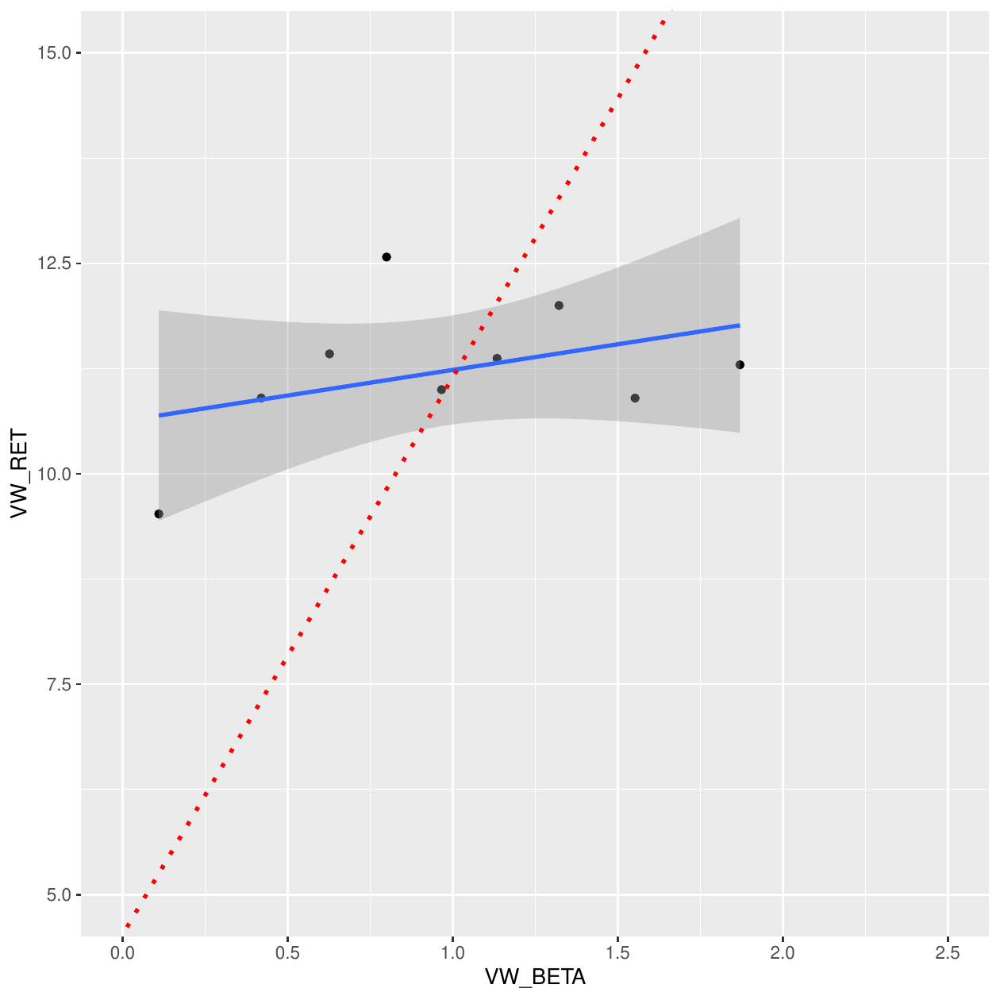
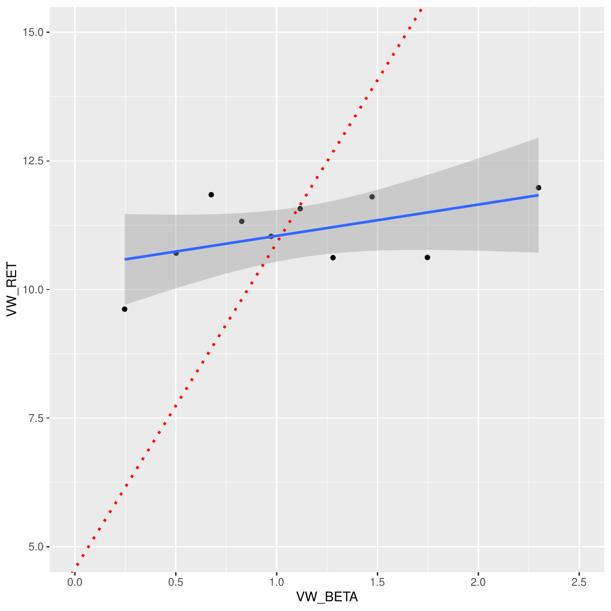
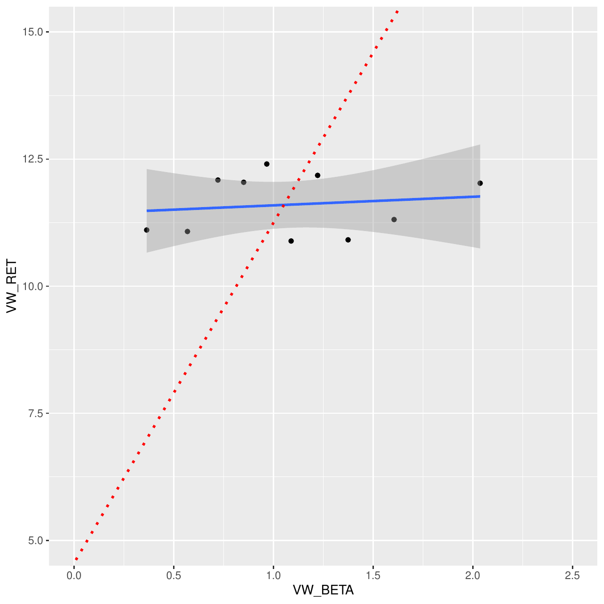

# Overview

Typically the [@CRSP] and [@COMPUSTAT] databases are viewed as the
cornerstones of academic empirical finance research. The former
corresponds to security-related information for publicly listed
companies, such as closing prices and returns. The latter covers
financial statements disclosed by public firms, such as income
statement, balance sheet, and cash-flow related items. We begin our
discussion by demonstrating how to clean, manipulate, and merge both
datasets. After doing so, we conduct the main analysis from the
perspective of empirical asset pricing research based on
[@fama1993common].

The undertaken analysis constitutes a typical portfolio formation
procedure to investigate how investors are compensated for taking
certain types of risk/style. By grouping firms (stocks) with respect to
pre-specified attributes, the researcher can study the implications of
these characteristics (risks) in association with future returns. Such
analysis is known as the cross-section of expected return (see, e.g.,
[@harvey2016and]) since the relationship is investigated on the
firm/portfolio level. Consistent with [@harvey2016and], we find that the
results of the cross-section of expected returns are sensitive to the
research design. In particular, the exclusion of small stocks in the
sample has a significant economic impact. Small stocks tend to trade
less frequently and to be less liquid. Hence, in order to better
understand the cross-section of expected returns, one needs to take into
consideration the underlying limits of arbitrage facing investors
[@li2014limits].

We hope this article would further contribute to reproducible finance
research and to our understandings of the cross-sectional of expected
returns. The article proceeds as follows. In Section [2](#data), we
discuss how to load each dataset along with the pre-analysis needed in
order to merge the data altogether. Section
[3](#forming-size-and-bm-portfolios) is devoted to the replication of
[@fama1993common]'s size and value premiums. The analysis is conducted
using raw and risk-adjusted returns. Section [4](#rendering-results)
then proceeds to investigate the sensitivity of the cross-section of
returns with respect to the research design. Finally, Section
[6](#concluding-remarks) concludes.

# Data

The discussion assumes that the user has already downloaded the CRSP and
the COMPUSTAT datasets in two separate files, both in csv formats.[^1]
The article will rely on different libraries to perform the analysis.
The core packages of interest are
[*data.table*](https://CRAN.R-project.org/package=data.table)
[@data.table] and
[*lubridate*](https://CRAN.R-project.org/package=lubridate)
[@lubridate]. We also refer to
[*ggplot2*](https://CRAN.R-project.org/package=ggplot2) [@ggplot2] to
produce figures and
[*parallel*](https://CRAN.R-project.org/package=parallel) [@parallel] to
perform parallel processing. In a few cases, we refer to
[*plyr*](https://CRAN.R-project.org/package=plyr) [@plyr] and
[*dplyr*](https://CRAN.R-project.org/package=dplyr) [@dplyr] for
additional data manipulation. Nonetheless, the main analysis is
conducted in the *data.table* environment.

``` r
library(data.table)
library(lubridate)
library(ggplot2)
library(plyr)
library(parallel)
rm(list = ls())
```

::: {#crsp}
## CRSP
:::

While there are a lot of pros to working *data.table*, one good
functionality is the option that allows the user to easily specify a
subset of variables while reading the whole data. Mostly, after
downloading the full dataset, we focus on a subset of variables of
interest. We refer to its main function `fread`, rather than the base
command `read.csv`. The `fread` is similar to the base command; however,
it provides faster and more convenient data manipulation. It is highly
relevant when it comes to large data. Additionally, it allows users to
easily utilize multi-threads using the `nThread` argument.

``` r
file.i <- "CRSP_1960_2019.csv"
select.var <- c("PERMCO","date","COMNAM","SHROUT","SHRCD","DLRET",
                "DLSTCD","DLPDT","EXCHCD","RET","PRC","CUSIP")
DT  <- fread(file.i,select = select.var)
```

The above commands load the monthly CRSP dataset with pre-specified
variables. Those are the permanent identifier of the security
(`PERMCO`), date, shares outstanding in thousands (`SHROUT`), share code
(`SHRCD`), exchange code (`EXCHCD`), security return `RET`, price `PRC`,
and the `CUSIP` identifier. Note that the CUSIP is the key link between
the CRSP and COMPUSTAT data. Additionally, we consider delisting-related
variables denoted by `DL`, which are discussed later.

::: {#filters-and-cleaning}
### Filters and Cleaning
:::

After loading the data, we perform a few filters and cleaning
procedures. In particular, we keep common shares, those with 10 or 11
codes. We drop missing values for prices. There are also certain flags
for prices denoted by -44, -55, -66, -77, -88, and -99. We drop these
from the data as well. Additionally, we keep securities listed on major
exchanges (NYSE, AMEX, or NASDAQ). Given these filters, we compute the
market cap for each stock-month in the data.

``` r
DT <- DT[DT$SHRCD %in% 10:11,]
DT <- DT[!is.na(DT$PRC),]
DT <- DT[!DT$PRC %in% (-(4:9)*11),]
DT$RET <- as.numeric(DT$RET)
DT <- DT[!is.na(DT$RET),]
DT$PRC <- abs(DT$PRC)
DT$MKTCAP <- DT$PRC*DT$SHROUT
DT <- DT[DT$EXCHCD %in% 1:3,]
```

There may be duplicates in the data depending on the identifier of
interest. To control for this, consider the following commands:

``` r
DT <- unique(DT)
DT <- DT[order(DT$PERMCO,DT$date),]
DT[ , `:=`( duplicate_N = .N   ) , by= list(PERMCO,date)]
table(DT$duplicate_N)/nrow(DT)*100
```

``` r
#>            1            2            3            4            6            7 
#> 98.014830993  1.902150108  0.044272559  0.018337003  0.010738451  0.009670885
```

Note that the `:=` command creates a new variable to the already
existing *data.table*, where `.N` denotes the data length. By grouping
the data based on the stock identifier and month, we can count whether
there are multiple observations within each case. As we observe from the
above table, about 2% of the observations are duplicates, i.e., multiple
observations for the same stock-month. For instance, the table below
illustrates the case in which we have 7 duplicates:

``` r
head(DT[DT$duplicate_N == 7,],7)
```

``` r
#>    PERMCO     date                     COMNAM SHROUT SHRCD DLRET DLSTCD DLPDT
#> 1:  54311 20160531 LIBERTY MEDIA CORP 3RD NEW  25569    11           NA    NA
#> 2:  54311 20160531 LIBERTY MEDIA CORP 3RD NEW  55684    11           NA    NA
#> 3:  54311 20160531 LIBERTY MEDIA CORP 3RD NEW  10228    11           NA    NA
#> 4:  54311 20160531 LIBERTY MEDIA CORP 3RD NEW  22284    11           NA    NA
#> 5:  54311 20160531 LIBERTY MEDIA CORP 3RD NEW 102277    11           NA    NA
#> 6:  54311 20160531 LIBERTY MEDIA CORP 3RD NEW   9871    11           NA    NA
#> 7:  54311 20160531 LIBERTY MEDIA CORP 3RD NEW 222735    11           NA    NA
#>    EXCHCD       RET   PRC    CUSIP    MKTCAP duplicate_N
#> 1:      3  0.064481 19.48 53122987  498084.1           7
#> 2:      3  0.052778 18.95 53122985 1055211.8           7
#> 3:      3  0.081873 15.56 53122970  159147.7           7
#> 4:      3  0.095723 15.00 53122988  334260.0           7
#> 5:      3 -0.026854 31.89 53122940 3261613.5           7
#> 6:      3 -0.026292 32.59 53122950  321695.9           7
#> 7:      3 -0.017801 31.45 53122960 7005015.8           7
```

Note that the duplicates arise due to different CUSIP identifiers. Since
we are planning to link the data with the COMPUSTAT using CUSIP, we
check whether there are duplicates for the same CUSIP-month:

``` r
DT[ , `:=`( duplicate_N = .N   ) , by= list(CUSIP,date)]
table(DT$duplicate_N)/nrow(DT)*100
```

``` r
#>   1 
#> 100
```

``` r
DT$duplicate_N <- NULL
```

In all cases, observe that there is a unique CUSIP-date observation.
However, if one is working with CRSP alone, it is common to aggregate
duplicates by value-weighting the observations based on market cap to
yield a unique PERMCO-month observation. Additionally, note that the
first 6 CUSIP characters result in the same unique identifier.

In terms of date formatting, we utilize the *lubridate* library to
manipulate dates:

``` r
DT$date <- ymd(DT$date)
DT$date <- ceiling_date(DT$date,"m") - 1
```

It is common to require a minimum history of each security in the data.
For instance, a researcher may need to estimate the market beta on a
rolling window using an initial sample of 2 years. For the sake of
illustration, we require that each security should have at least two
months of data (2 observations). Nonetheless, dropping observations in
the following manner could have major implications in terms
data-snooping and survivor-ship bias. In Section
[4](#rendering-results), we discuss the sensitivity of the portfolio
results to this input.

``` r
crsp_keep <- 2
DT[ , `:=`( N_obs = .N   ) , by= list(CUSIP)]
DT <- DT[DT$N_obs >= crsp_keep,]
DT$N_obs <- NULL
```

Finally, we have 24,581 unique securities, 720 months, and a total of
3,184,762 security-month observations.

::: {#delisted-returns}
### Delisted Returns
:::

An important characteristic of the CRSP database is that it includes
historical companies that were delisted in the past. Not controlling for
such delisting creates a survivor-ship bias, especially when it comes to
researching the cross-section of stock returns - see, e.g.,
[@beaver2007delisting] for further information. To control for delisted
returns, we follow the methodology recommended by [@bali2016empirical].
We demonstrate these steps below. Before we do so, we take a quick look
at the summary statistics of the current monthly returns:

``` r
summary(DT$RET)
```

``` r
#>     Min.  1st Qu.   Median     Mean  3rd Qu.     Max. 
#> -0.99360 -0.06667  0.00000  0.01155  0.07143 24.00000
```

``` r
DT$DLRET <- as.numeric(DT$DLRET)
DT <- DT[order(DT$CUSIP,DT$date),]
DT[,`:=` (last_date = date[.N]),by = list(CUSIP) ]
DT[DT$DLSTCD %in% 100,"DLSTCD"] <- NA
cusip_delist <- unique(DT[!is.na(DT$DLSTCD),])$CUSIP

DT_delist <- DT[DT$CUSIP %in% cusip_delist,]
DT_delist_last <- DT_delist[, .SD[.N],  by= list(CUSIP)]
rm(DT_delist)
DT_delist_last$date <- ceiling_date(DT_delist_last$date + 1,"m")- 1
DT_delist_last$RET <- DT_delist_last$DLRET

na_dlret_index <- is.na(DT_delist_last$RET)
DT_delist_last_na <- DT_delist_last[na_dlret_index,]
DT_delist_last <-DT_delist_last[!na_dlret_index,]

select_code <- c(500,520:551,573,574,580,584)
DT_delist_last_na[DT_delist_last_na$DLSTCD %in% select_code,"RET"] <- -0.3
DT_delist_last_na[!DT_delist_last_na$DLSTCD %in% select_code,"RET"] <- -1

DT_delist_last <- rbind(DT_delist_last,DT_delist_last_na)
DT_delist_last$MKTCAP <- DT_delist_last$MKTCAP*(1 + DT_delist_last$RET)
DT_delist_last$PRC <- DT_delist_last$PRC*(1 + DT_delist_last$RET)

DT <- rbind(DT,DT_delist_last)
DT <- DT[order(DT$CUSIP,DT$date),]
summary(DT$RET) %$
```

``` r
#>     Min.  1st Qu.   Median     Mean  3rd Qu.     Max. 
#> -1.00000 -0.06667  0.00000  0.01151  0.07143 24.00000
```

The above steps adjust for delisted returns. When available, it takes
into consideration the delisting returns provided by CRSP. Otherwise, we
use an arbitrary return according to the suggestion by
[@bali2016empirical]. We can see that the minimum return becomes -100%.
However, at the same time, we observe that the mean return stays roughly
the same due to the large sample size. It is also worth mentioning that
dropping stocks below a certain price level potentially eliminates
outliers and penny stocks that are more likely to get delisted.

::: {#simple-portfolio-formation}
### Simple Portfolio Formation
:::

Before we merge CRSP with COMPUSTAT, let us perform some basic analysis.
For instance, we can easily aggregate the security return on the monthly
level to create either a value-weighted or equally weighted portfolios.
To do so, consider the following commands:

``` r
PORT_RET <- DT[,list(EW_RET = lapply(.SD,mean,na.rm = TRUE)), 
               by = list(date), .SDcols = "RET"]
PORT_RET2 <- DT[,list(VW_RET = lapply(.SD,
                                      function(x) sum(x*MKTCAP/sum(MKTCAP,na.rm = TRUE),na.rm = TRUE))),
                by = list(date), .SDcols = "RET"]
PORT_RET <- merge(PORT_RET,PORT_RET2)
rm(PORT_RET2)
PORT_RET <- PORT_RET[order(PORT_RET$date),]
```

To summarize the returns over time, consider the time series of
cumulative returns for each portfolio. We refer to the *ggplot2* library
and the National Bureau of Economic Research (NBER) recession periods to
do so:

``` r
bar.col <- "gray"
ggplot_recession0 <- geom_rect(fill = bar.col,col = bar.col,
                               aes(xmin=date("1973-11-30"), 
                                   xmax=date("1975-03-31"), 
                                   ymin=-Inf, ymax=Inf))
ggplot_recession1 <- geom_rect(fill = bar.col,col = bar.col,
                               aes(xmin=date("1980-01-31"),
                                   xmax=date("1980-07-31"),
                                   ymin=-Inf, ymax=Inf))
ggplot_recession2 <- geom_rect(fill = bar.col,col = bar.col,
                               aes(xmin=date("1981-07-31"), 
                                   xmax=date("1982-11-30"), 
                                   ymin=-Inf, ymax=Inf))
ggplot_recession3 <- geom_rect(fill = bar.col,col = bar.col,
                               aes(xmin=date("1990-07-31"), 
                                   xmax=date("1991-03-31"), 
                                   ymin=-Inf, ymax=Inf))
ggplot_recession4 <- geom_rect(fill = bar.col,col = bar.col,
                               aes(xmin=date("2001-03-31"), 
                                   xmax=date("2001-11-30"), 
                                   ymin=-Inf, ymax=Inf))
ggplot_recession5 <- geom_rect(fill = bar.col,col = bar.col,
                               aes(xmin=date("2007-12-31"), 
                                   xmax=date("2009-06-30"), 
                                   ymin=-Inf, ymax=Inf))

ds.plot1 <- data.frame(date = PORT_RET$date, CumRet =  cumsum(PORT_RET$EW_RET),
                       Type = "Equally-Weighted" )
ds.plot2 <- data.frame(date = PORT_RET$date, CumRet =  cumsum(PORT_RET$VW_RET),
                       Type = "Value-Weighted" )
ds.plot <- rbind(ds.plot1,ds.plot2)
ds.plot$Type <- as.factor(ds.plot$Type)

p <- ggplot(ds.plot, aes(date, CumRet,colour = Type))
p <- p +  ggplot_recession0 + ggplot_recession1 + 
  ggplot_recession2 + ggplot_recession3 +
  ggplot_recession4 + ggplot_recession5
p <- p + geom_line(alpha = 0.4)
p <- p + xlab("Date") + ylab("Cumulative Return")
p <- p + geom_abline(intercept = 0, slope = 0, color="black",  linetype="dashed", size=0.2)
p
```

{#texor_dummy_label
width="100%" alt="graphic without alt text"}

We note that, overall, the equally-weighted portfolio under-performs the
value-weighted one. The equally-weighted portfolio attributes greater
weight to small-cap stocks. Contrary to [@fama1993common],
interestingly, we observe that the value-weighted stocks outperform the
small-cap stocks. Nonetheless, the pattern became evident beginning in
the late 80s. To take a closer look at the above, we group securities
into size portfolios. At each month, we group securities into 5 groups
based on the market cap cut-off.[^2] To perform the cut-off, we refer to
the `ntile` function from the *dplyr* library. In the following
analysis, we proceed with equal-weighting for the sake of brevity.

``` r
library(dplyr)
cut.n <- 5
DT <- DT[,`:=` (Group_Size = ntile(MKTCAP,cut.n)), by = list(date)]
N_G <- DT[,.N, by = list(date,Group_Size) ]
N_G[,mean(N), by = list(Group_Size)]
```

``` r
#>    Group_Size       V1
#> 1:          2 885.3694
#> 2:          1 885.7667
#> 3:          3 885.3875
#> 4:          4 885.3694
#> 5:          5 884.9500
```

We observe that, on average, each group contains 885 firms over the
sample period. In addition to the group size, we consider the next one
month return on each security. We use the `shift` function from
*data.table* and apply it to each security as follows:

``` r
DT <- DT[order(DT$CUSIP,DT$date),]
DT <- DT[,`:=` (RET_1 = shift(RET,-1)), by = list(CUSIP)]
```

Given the above, we report summary statistics on the size group level:

``` r
DT_size <- DT[,lapply(.SD,mean,na.rm = TRUE),by = list(Group_Size),
              .SDcols = c("RET","RET_1","PRC","SHROUT","MKTCAP","EXCHCD")]
DT_size <- DT_size[order(DT_size$Group_Size),]
DT_size$RET_1 <- DT_size$RET_1*12
DT_size$RET <- DT_size$RET*12
DT_size
```

``` r
#>    Group_Size        RET     RET_1        PRC     SHROUT     MKTCAP   EXCHCD
#> 1:          1 -0.1047989 0.2177438   4.265575   7569.757   13946.99 2.704329
#> 2:          2  0.1463509 0.1069973   9.280118  11101.177   56211.45 2.592039
#> 3:          3  0.2047528 0.1200868  15.410881  15797.729  168506.54 2.396027
#> 4:          4  0.2313902 0.1266713  25.020412  26814.684  538252.87 2.039177
#> 5:          5  0.2132456 0.1225963 105.854839 167534.402 7505924.35 1.457429
```

Clearly, securities ranked in the 5th largest size group have a higher
market-cap, which is associated with higher prices and shares
outstanding. Additionally, note that the large stocks are more likely to
be listed on NYSE (EXCHCD = 1), whereas the small-cap stocks are listed
on NASDAQ (EXCHCD = 3). In terms of returns, the results are sensitive
with respect to whether we consider an in-sample return or next month's
return. In the in-sample, we observe that large-cap outperform
small-cap. Nonetheless, the more relevant case in practice is the
out-of-sample return. In the latter case, we observe that small-cap
stocks outperform large-cap stocks. In annual terms, the small-cap
stocks return 10% higher mean return than large-cap stocks. Ignoring
transaction cost and assuming that investors rebalance their portfolios
on a monthly basis, this evidence is consistent with [@fama1993common]'s
size premium. That is, investors expect a higher return for investing in
small-cap stocks.

::: {#compustat}
## COMPUSTAT
:::

The above discussion relates to the CRSP data alone. In the following,
we focus on the COMPUSTAT data, which contains accounting-related
information for public firms. Similar to the above, we focus on a subset
of variables. For identification, we look into the CUSIP and the CIK
number. The latter is relevant to identify firms via the SEC EDGAR
system - for those interested in merging the data with SEC filings and
perform textual analysis. The `FYEARQ` and `FQTR` are the fiscal year
and quarter of the data point. For accounting variables, we consider
total assets (`atq`), net income (`niq`), and common equity `ceqq`.

``` r
file.j <- "COMPUSTAT_1960_2020.csv"
select.var2 <- tolower(c("FYEARQ","FQTR","cusip","cik","sic","niq","atq","ceqq"))
DT2  <- unique(fread(file.j,select = select.var2))
```

::: {#filters-and-cleaning-1}
### Filters and Cleaning
:::

To link between COMPUSTAT and CRSP, we need to make a small adjustment
for the CUSIP identifiers. In CRSP, the number of characters is 8,
whereas in COMPUSTAT, it is 9.

``` r
table(nchar(DT$CUSIP))
```

``` r
#> 
#>       8 
#> 3187327
```

``` r
table(nchar(DT2$cusip))
```

``` r
#> 
#>       0       9 
#>     130 1806228
```

Note that there a few cases in which the CUSIP is unavailable in
COMPUSTAT. The adjustments are described below:

``` r
DT2 <- DT2[!nchar(DT2$cusip) == 0,]
DT2$CUSIP <- substr(DT2$cusip,0,8)
DT2$cusip <- NULL
DT2 <- unique(DT2[DT2$CUSIP %in% DT$CUSIP,])
```

In order to merge with the CRSP data, which corresponds to calendar
dates, we adjust the fiscal dates in COMPUSTAST. It is common to use 6
months lags to allow the financial disclosures to become publicly
available. To do so, we perform the following adjustments:

``` r
DT2$date <- ymd(DT2$fyearq*10000 + DT2$fqtr*3*100 + 1)
DT2$date <- DT2$date + months(6)
DT2$date <- ceiling_date(DT2$date,"q") - 1
DT2 <- DT2[month(DT2$date) == 6,]
DT2$fyearq <- DT2$fqtr <- NULL
```

Additionally, we keep the annual data rather than the quarterly one and
consider portfolio formation on an annual basis.[^3] In particular, we
keep the June data for the portfolio formation process.

Same as before, let us check for duplicates:

``` r
DT2 <- unique(DT2)
DT2[ , `:=`( duplicate_N = .N   ) , by= list(CUSIP,date)]
table(DT2$duplicate_N)
```

``` r
#> 
#>      1 
#> 247903
```

``` r
DT2$duplicate_N <- NULL
```

The COMPUSTAT dataset have unique CUSIP-date observations.

::: {#summary-statistics}
### Summary Statistics
:::

Given the final COMPUSTAT data, we consider a few summary statistics for
each industry, which is defined using the 4th digit of the SIC code.

``` r
DT2 <- na.omit(DT2)
DT2$ROA <- DT2$niq/DT2$atq
DT2$ROE <- DT2$niq/DT2$ceqq
DT2$BL <- DT2$atq/DT2$ceqq
DT2$Industry <- floor(DT2$sic/1000)

DT2_sum <- DT2[,lapply(.SD,median,na.rm = TRUE), by = list(Industry),
               .SDcols = c("atq","ROA","ROE","BL")]
DT2_sum <- DT2_sum[order(DT2_sum$Industry),]
DT2_sum
```

``` r
#>     Industry      atq          ROA          ROE       BL
#>  1:        0  97.9455 -0.005973224 -0.007163557 2.005072
#>  2:        1 152.8265  0.003908058  0.015030814 2.031069
#>  3:        2 112.5905  0.006157001  0.023091766 1.761200
#>  4:        3  85.0685  0.010216054  0.024022369 1.736357
#>  5:        4 540.3000  0.006908974  0.024877318 2.914309
#>  6:        5 148.0990  0.011941449  0.030180501 2.155898
#>  7:        6 893.6370  0.002491525  0.026317412 8.965721
#>  8:        7  88.5455  0.004830920  0.018396345 1.736342
#>  9:        8  73.5180  0.006937877  0.020926220 1.904278
#> 10:        9  37.3550 -0.003438435  0.006888589 1.562943
```

We observe that financial firms are associated with the highest book
leverage, given the business nature of financial institutions. Also, we
note that the financial industry is associated with the largest total
assets. This is not surprising given the concentration of the financial
industry over time, in which a few entities hold the majority of assets.
To relate to the last point, consider the total assets of the top 10%
firms with respect to the total assets in the industry as a whole.

``` r
DT2_Fin <- DT2[DT2$Industry == 6,]
DT2_Fin <- DT2_Fin[,`:=` (Group_Size = ntile(atq,10)), by = list(date)]
DT2_Fin <- DT2_Fin[,`:=` (Total_Assets = sum(atq)), by = list(date)]
DT2_Fin <- DT2_Fin[,lapply(.SD, function(x) sum(x/Total_Assets)), 
                   by = list(date,Group_Size), .SDcols = "atq"]
DT2_Fin_Top <- DT2_Fin[DT2_Fin$Group_Size == 10,]
DT2_Fin_Top <- DT2_Fin_Top[order(DT2_Fin_Top$date),]
plot(atq~date,data = DT2_Fin_Top,type = "l",
     main = "Proportion of Assets held by Top 10% in Financial Industry",
     ylab = "", xlab = "Date")
grid(10)
```

{#fig:banks
width="100%" alt="graphic without alt text"}

According to Figure [2](#fig:banks), we discern that the top 10%
increased their share of total assets from 34% in the late 60s up to 90%
more recently.

::: {#crsp-compustat}
## CRSP-COMPUSTAT
:::

Note that the COMPUSTAT dataset is annual, while the CRSP is monthly. If
we seek to form portfolios based on book-to-market (BM) ratio, such as
the case for Fama-French, we need to create an annual BM variable in the
COMPUSTAT dataset. Before we merge the data altogether, let us add the
market value of equity (ME) to the COMPUSTAT dataset. Additionally, we
add the stock prices which would be useful for small-cap stocks from the
portfolio formation later on.

``` r
BM <- DT[,c("date","CUSIP","MKTCAP","PRC")]
DT2 <- merge(DT2,BM, by = c("CUSIP","date"), all = F)
DT2$BM_ratio <- DT2$ceqq/(DT2$MKTCAP/1000)
DT2$ME <- DT2$MKTCAP
DT2$PRC_LAST <- DT2$PRC
DT2$MKTCAP <-  DT2$PRC <- NULL
DT2 <- DT2[order(DT2$CUSIP,DT2$date),]
DT2[,`:=` (N_years = 1:.N), by = list(CUSIP)]
rm(BM); gc()
```

``` r
#>            used  (Mb) gc trigger   (Mb)  max used   (Mb)
#> Ncells  1024743  54.8    2730065  145.9   2730065  145.9
#> Vcells 63598437 485.3  149041274 1137.1 148737297 1134.8
```

The above commands link the COMPUSTAT and the CRSP datasets to determine
the market equity of the firms and, hence, the book-to-market ratio.
Also, we denote the stock price as `PRC_LAST` to refer to the recent
stock price in the annual data.

Before we finally merge the data altogether, we need to do one small
trick with the CRSP data. The ultimate goal of this illustration to
attribute the next 12 months' returns with respect to the BM ratio from
the previous June. To do so, consider the following:

``` r
prev_june_f <- function(x) floor_date(floor_date(x,"m") + months(6),"y") - months(6) - 1
DT$date_june <- prev_june_f(DT$date)
DT2$date_june <- DT2$date
DT2$date <- NULL
```

While the `prev_june_f` seems obscure, one should break the function
into different components in order to understand how it works. Consider
the special case where we have:

``` r
x <- DT$date[1:13]
x
```

``` r
#>  [1] "1970-12-31" "1971-01-31" "1971-02-28" "1971-03-31" "1971-04-30"
#>  [6] "1971-05-31" "1971-06-30" "1971-07-31" "1971-08-31" "1971-09-30"
#> [11] "1971-10-31" "1971-11-30" "1971-12-31"
```

The first command of the function shifts the dates six months ahead:

``` r
floor_date(x,"m") + months(6)
```

``` r
#>  [1] "1971-06-01" "1971-07-01" "1971-08-01" "1971-09-01" "1971-10-01"
#>  [6] "1971-11-01" "1971-12-01" "1972-01-01" "1972-02-01" "1972-03-01"
#> [11] "1972-04-01" "1972-05-01" "1972-06-01"
```

The second step identifies the floor of each date on the annual level:

``` r
floor_date(floor_date(x,"m") + months(6),"y")
```

``` r
#>  [1] "1971-01-01" "1971-01-01" "1971-01-01" "1971-01-01" "1971-01-01"
#>  [6] "1971-01-01" "1971-01-01" "1972-01-01" "1972-01-01" "1972-01-01"
#> [11] "1972-01-01" "1972-01-01" "1972-01-01"
```

The final step subtracts 6 months to identify the June of the previous
year. The minus one is added to retrieve June 30th rather than July 1st,
such that:

``` r
floor_date(floor_date(x,"m") + months(6),"y") - months(6) - 1
```

``` r
#>  [1] "1970-06-30" "1970-06-30" "1970-06-30" "1970-06-30" "1970-06-30"
#>  [6] "1970-06-30" "1970-06-30" "1971-06-30" "1971-06-30" "1971-06-30"
#> [11] "1971-06-30" "1971-06-30" "1971-06-30"
```

{#figure:flowchart width="100%"
alt="graphic without alt text"}

Looking at returns between Dec 1970 and Mar 1971, the function traces
these observations back to June 1970 for the first 7 returns. When the
next June data shows up, the `date_june` variable adjusts accordingly.
Finally, the merged dataset is given by:

``` r
DT12 <- merge(DT,DT2,by = c("CUSIP","date_june")) 
```

[ **Note**: The above steps provide details on how to merge between the
two data sets. In Figure [3](#figure:flowchart), we provide a flow chart
summarizing the steps/processes undertaken to develop the final merged
data set `DT12`. ]{style="color: black"}

# Forming Size and BM Portfolios

The `DT12` object contains the final CRSP-COMPUSTAT data. The merging is
conducted to allow for portfolio formation at the end of June each year,
as mentioned above. Such a setting allows a convenient way to form
portfolios without relying on loops. Nonetheless, it would also impose
that portfolio managers balance their portfolios on a monthly basis
according to the market cap from the previous June.

Given the merged dataset, we form groups at the end of June-year based
on market equity (size) and book-to-market ratio (value):

``` r
DT12 <- DT12[,`:=` (Group_ME = ntile(ME,5)), by = list(date_june)]
DT12 <- DT12[,`:=` (Group_BM = ntile(BM_ratio,5)), by = list(date_june,Group_ME)]
```

The above two commands perform dependent portfolio sorting, in which
firms are first sorted based on size and then on BM ratio. We consider
value-weighting to compute the future returns on each size-value
portfolio. This results in 25 value-weighted portfolios.

``` r
PORT_RET <- DT12[,list(VW_RET = sum(RET*ME/sum(ME))  ),
                 by = list(date,Group_ME,Group_BM)]
PORT_RET <- PORT_RET[order(PORT_RET$date,PORT_RET$Group_BM,PORT_RET$Group_ME),]
PORT_RET$VW_RET <- as.numeric(PORT_RET$VW_RET)*100

ret_matrix <- PORT_RET[,lapply(.SD,mean,na.rm = TRUE),
                       by = list(Group_ME,Group_BM), .SDcols = "VW_RET"]
ret_matrix <- ret_matrix[order(ret_matrix$Group_BM,ret_matrix$Group_ME),]
ret_matrix <- matrix(as.numeric(ret_matrix$VW_RET),5)
rownames(ret_matrix) <- 1:5
colnames(ret_matrix) <- paste("BM",1:5,sep = "_")
rownames(ret_matrix)[1] <- "Small"
rownames(ret_matrix)[5] <- "Big"
colnames(ret_matrix)[1] <- "Low"
colnames(ret_matrix)[5] <- "High"
round(data.frame(ret_matrix*12),2)
```

``` r
#>         Low  BM_2  BM_3  BM_4  High
#> Small 12.93 14.73 18.05 20.14 23.40
#> 2      8.45 12.55 14.37 16.72 16.17
#> 3      8.04 11.79 14.30 14.24 15.99
#> 4      9.89 11.53 11.92 14.47 14.77
#> Big    9.84 11.70 10.41 13.13 12.78
```

For each column above, we observe the stock returns (raw) decrease, on
average, with size. This is commonly known as the size effect. At the
same time, we observe that within each size group, the mean return
increases with the BM ratio. The latter denotes what is known as the
value effect. In other words, investors expect higher returns from small
enterprises and undervalued stocks (trading below book value).
Nonetheless, recent discussions debate whether this is the case. For
further information on this, see this
[article](https://www.bloomberg.com/news/articles/2020-02-06/quant-pioneers-of-value-investing-are-trying-to-see-if-it-s-dead).

::: {#risk-adjusted-returns-using-fama-french-risk-factors}
## Risk-Adjusted Returns using Fama-French's Risk Factors {#risk-adjusted-returns-using-fama-french-risk-factors}
:::

The above portfolio results compute the raw returns. In order to price
these portfolios, we decompose the returns into (1) systematic
components (risk-premiums) and (2) non-systematic. The latter denotes
the risk-adjusted returns. Additionally, we consider the excess return
on each portfolio, i.e., the portfolio return minus the 1-month Treasury
yield.

The Fama-French's risk factors are obtained easily using the Kenneth
French public
[library](http://mba.tuck.dartmouth.edu/pages/faculty/ken.french/)
according to the commands below. Note that we focus on the three
factors: market, size, and value:

``` r
FF_file <- 
  "https://mba.tuck.dartmouth.edu/pages/faculty/ken.french/ftp/F-F_Research_Data_Factors_CSV.zip"
temp <- tempfile()
download.file(FF_file,temp)
unz_files <- unzip(temp)
ds <- read.csv(unz_files,skip = 3)
flag_obs <- grep("Annual",ds[,1],ignore.case = TRUE)
ds <- ds[1:(flag_obs-1),]
names(ds)[1] <- "date"
ds <- data.frame(apply(ds, 2, as.numeric))
ds$date <- ceiling_date(ymd(ds$date*100+ 01),"m")-1
tail(ds)
```

``` r
#>            date Mkt.RF   SMB    HML   RF
#> 1123 2020-01-31  -0.11 -3.11  -6.27 0.13
#> 1124 2020-02-29  -8.13  0.96  -4.01 0.12
#> 1125 2020-03-31 -13.39 -5.16 -14.12 0.12
#> 1126 2020-04-30  13.65  2.78  -1.27 0.00
#> 1127 2020-05-31   5.58  2.47  -4.95 0.01
#> 1128 2020-06-30   2.45  2.56  -2.03 0.01
```

We merge the risk factors data with the portfolios time series and
regress the excess returns of each of the 25 portfolios on the three
factors. To do so, we leverage some functional programming using the
`lapply` base function along with the `dlply` function from the *plyr*
library as follows:

``` r
PORT_RET_RA <- merge(PORT_RET,ds)
PORT_RET_RA$RAR <- PORT_RET_RA$VW_RET - PORT_RET_RA$RF

lm_list <- dlply(PORT_RET_RA,c("Group_ME","Group_BM"),
                 function(x)  lm( RAR ~ Mkt.RF +  SMB +   HML, data = x   )    )  
rar_matrix <- lapply(lm_list, coef)
rar_matrix <- sapply(rar_matrix,function(x) x[[1]])
rar_matrix <- matrix(rar_matrix,5,5,byrow = TRUE)

rownames(rar_matrix) <- 1:5
colnames(rar_matrix) <- paste("BM",1:5,sep = "_")
rownames(rar_matrix)[1] <- "Small"
rownames(rar_matrix)[5] <- "Big"
colnames(rar_matrix)[1] <- "Low"
colnames(rar_matrix)[5] <- "High"

rar_matrix <- round(data.frame(rar_matrix*12),2)
rar_matrix
```

``` r
#>         Low  BM_2  BM_3  BM_4  High
#> Small -1.08  2.03  5.55  6.49  8.90
#> 2     -5.77 -0.33  0.78  2.47  1.01
#> 3     -6.51 -1.66  0.96 -0.15 -0.18
#> 4     -2.90 -1.41 -0.90  0.08 -0.10
#> Big    0.35  1.47 -0.47  0.32 -1.29
```

Note that after controlling for the three risk factors, the high-small
portfolio still yields an annual return of 9%. A potential argument may
be that such alpha is attributed to other risk factors that the
three-factor model does not fully price. More recently, Fama-French
suggest five factors model to better representation of systematic
components [@fama2015five].

# Rendering Results

The above results are subjected to certain filtering, the time period,
and the number of months each stock should include in the data. One
major challenge is whether the securities in the analysis are tradable.
For instance, it is common to consider stocks with a price larger than
\$5. The major issue with doing so is that such a filter could cause a
forward-looking bias. By the time the decision maker allocates his/her
portfolio, he/she cannot ascertain whether the stocks would be above or
less than \$5 in the future - this is less of an issue for large-cap
stocks. Hence, to keep stocks that satisfy a minimum price level, it
should be done on a recurring basis. Specifically, rather than dropping
all observations in which the price is less than \$5, one should
consider only the stocks that were qualified by the time of the
portfolio formation. The same issue applies to the window length for
which the data is available and other filters one may be interested in
controlling for.

The following is a generalized portfolio formation function that takes
four arguments. The first two correspond to the minimum price and number
of years that the stock should have to be considered investable in June
each year. The other two arguments set the time period during which the
researcher is interested in computed the mean returns. The function
returns a list containing the raw and risk-adjusted returns of the 25
portfolios along with the average number of stocks within each
portfolio.

``` r
FF3_anomaly <- function(min_price,year_keep = 1,year1 = 1965,year2 =  2019) {
  DT12_sub <- DT12
  keep_cusip_date <- unique(DT12_sub[,list(CUSIP,date_june,N_years,PRC_LAST)])
  keep_cusip_date <- keep_cusip_date[keep_cusip_date$N_years >= year_keep,]
  keep_cusip_date <- keep_cusip_date[keep_cusip_date$PRC_LAST >= min_price ,]
  
  keep_cusip_date <- unique(keep_cusip_date[,list(CUSIP,date_june)])
  DT12_sub <- merge(DT12_sub,keep_cusip_date)
  
  DT12_sub <- DT12_sub[,`:=` (Group_ME = ntile(ME,5)), by = list(date_june)]
  DT12_sub <- DT12_sub[,`:=` (Group_BM = ntile(BM_ratio,5)), by = list(date_june,Group_ME)]
  N_G <- DT12_sub[,.N, by = list(date,Group_ME,Group_BM) ]
  N_G <- (N_G[,mean(N), by = list(Group_ME,Group_BM) ])
  N_G <- N_G[order(N_G$Group_ME,N_G$Group_BM),] 
  N_G <- matrix(N_G$V1,5,5,byrow = TRUE)
  rownames(N_G) <- 1:5
  colnames(N_G) <- paste("BM",1:5,sep = "_")
  rownames(N_G)[1] <- "Small"
  rownames(N_G)[5] <- "Big"
  colnames(N_G)[1] <- "Low"
  colnames(N_G)[5] <- "High"
  N_G <- round((N_G))
  
  PORT_RET <- DT12_sub[,list(VW_RET = sum(RET*ME/sum(ME))  ),
                       by = list(date,Group_ME,Group_BM)]
  PORT_RET <- PORT_RET[order(PORT_RET$date,PORT_RET$Group_BM,PORT_RET$Group_ME),]
  PORT_RET$VW_RET <- as.numeric(PORT_RET$VW_RET)*100
  
  PORT_RET_RA <- merge(PORT_RET,ds)
  PORT_RET_RA$RAR <- PORT_RET_RA$VW_RET - PORT_RET_RA$RF
  PORT_RET_RA_sub <- PORT_RET_RA
  PORT_RET_RA_sub <- PORT_RET_RA_sub[year(PORT_RET_RA_sub$date) >= year1,] 
  PORT_RET_RA_sub <- PORT_RET_RA_sub[year(PORT_RET_RA_sub$date) <= year2 ,] 
  
  ret_matrix <- PORT_RET_RA_sub[,lapply(.SD,mean,na.rm = TRUE),
                                by = list(Group_ME,Group_BM), .SDcols = "VW_RET"]
  ret_matrix <- ret_matrix[order(ret_matrix$Group_BM,ret_matrix$Group_ME),]
  ret_matrix <- matrix(as.numeric(ret_matrix$VW_RET),5)
  rownames(ret_matrix) <- 1:5
  colnames(ret_matrix) <- paste("BM",1:5,sep = "_")
  rownames(ret_matrix)[1] <- "Small"
  rownames(ret_matrix)[5] <- "Big"
  colnames(ret_matrix)[1] <- "Low"
  colnames(ret_matrix)[5] <- "High"
  ret_matrix <- round(data.frame(ret_matrix*12),2)
  
  
  lm_list <- dlply(PORT_RET_RA_sub,c("Group_ME","Group_BM"), 
                   function(x)  lm( RAR ~ Mkt.RF +  SMB +   HML, data = x   )    )  
  rar_matrix <- lapply(lm_list, coef)
  rar_matrix <- sapply(rar_matrix,function(x) x[[1]])
  rar_matrix <- matrix(rar_matrix,5,5,byrow = TRUE)
  rownames(rar_matrix) <- 1:5
  colnames(rar_matrix) <- paste("BM",1:5,sep = "_")
  rownames(rar_matrix)[1] <- "Small"
  rownames(rar_matrix)[5] <- "Big"
  colnames(rar_matrix)[1] <- "Low"
  colnames(rar_matrix)[5] <- "High"
  rar_matrix <- round(data.frame(rar_matrix*12),2)
  
  
  list(N_G,ret_matrix,rar_matrix)
  
}
```

::: {#control-for-minimum-price}
### Control for Minimum Price
:::

Given the above function, we test the sensitivity of the size/value
premiums by including stocks with pre-specified minimum price. In
particular, we run this for a sequence of prices ranging between 0 and
\$50. With the *parallel* library, we can easily perform parallel
computing on four cores. It takes a few seconds to run the following
commands[^4]:

``` r
p_seq <- 0:50
list_port_price <- mclapply(p_seq, function(p) FF3_anomaly(p),mc.cores = 4)
```

Given the list `list_port_price`, we extract the result of interest. In
this case, we focus on the raw returns. For instance, the first item of
this list corresponds to the same results from Section
[3](#forming-size-and-bm-portfolios).

``` r
list_port_price[[1]][[2]]
```

``` r
#>         Low  BM_2  BM_3  BM_4  High
#> Small 12.93 14.73 18.05 20.14 23.40
#> 2      8.45 12.55 14.37 16.72 16.17
#> 3      8.04 11.79 14.30 14.24 15.99
#> 4      9.89 11.53 11.92 14.47 14.77
#> Big    9.84 11.70 10.41 13.13 12.78
```

On the other hand, if we consider \$5 minimum price, we see that the
results are tentative depending on the level of entry:

``` r
list_port_price[[6]][[2]]
```

``` r
#>         Low  BM_2  BM_3  BM_4  High
#> Small  8.86 12.19 14.64 15.31 17.86
#> 2     10.35 11.94 13.51 16.18 15.08
#> 3      8.54 12.39 13.52 14.41 15.07
#> 4     10.16 11.09 11.95 14.20 15.17
#> Big    9.79 11.66 10.62 12.95 12.42
```

To capture this for each matrix of raw returns, we compute the
high-minus-low (HML), i.e., column 5 minus column 1 for each size level.
This results in 5 HML premiums for each size level. We summarize the
results in Figure [4](#fig:value_effect).

``` r
RAR_list <- lapply(list_port_price,function(x) x[[2]])
RAR_list_Value <- t(sapply(RAR_list, function(x) x[,5] - x[,1]  ))
colnames(RAR_list_Value) <- rownames(RAR_list[[1]])
RAR_list_Size <- t(sapply(RAR_list, function(x) x[1,] - x[5,]  ))

ds.plot <- lapply(1:5, function(i) data.frame(HML =  RAR_list_Value[,i],
                                              Min_Price = p_seq, Size = i))
ds.plot <- Reduce(rbind,ds.plot)
ds.plot <- ds.plot[order(ds.plot$Size,ds.plot$Min_Price),]
ds.plot <- ds.plot[ds.plot$Size %in% c(1,3,5),]
ds.plot$Size <- as.factor(ds.plot$Size)
p <- ggplot(ds.plot,aes(x = Min_Price, y = HML, colour = Size, shape = Size))
p <- p + geom_point() + geom_line()
p <- p + geom_abline(intercept = 0, slope = 0, color="black",  linetype="dashed")
p
```

![Figure 4: This figure summarizes the results of the double-sorting
portfolio based on the book-to-market (BM) ratio and size. Stocks are
first sorted into five quintiles with respect to the BM ratio. Then,
within each BM quintile, stocks are sorted based on size. The
double-sorting results in 25 value-weighted portfolios. The $y$-axis
corresponds to the value premium, which is the difference between the
top and the bottom BM quintiles within a given size group. The $x$-axis
controls for the stock's minimum price to be included within each one of
the 25 sorted portfolios. The red, green, and blue lines correspond to
the size groups of small-cap (1), medium-cap (2), and large-cap (5),
respectively. Overall, the plot demonstrates the sensitivity of the
value premium as a function of the minimum price.
](CRSP_COMP_files/figure-latex/unnamed-chunk-40-1.png){#fig:value_effect
width="100%" alt="graphic without alt text"}

We observe that the HML is more evident for small-cap stocks. However,
at the same time, we note that the premium declines as we increase the
minimum price entry. One argument is the following. As we increase the
minimum price, the size effect is mitigated and, hence, the value
premium. On the other hand, this could also be attributed to whether
investors can utilize such alphas for small-cap that tend to be less
liquid.

We repeat the same plot for the size premium. In particular, we compute
the small-minus-big (SMB), i.e., row 1 minus row 5 for each BM level.
This results in 5 SMB premiums for each BM group. Similar to Figure
[4](#fig:value_effect), Figure [5](#fig:size_effect) demonstrates the
sensitivity of the results with respect to the minimum price:

``` r
ds.plot <- lapply(1:5, function(i) data.frame(SMB =  unlist(RAR_list_Size[,i]),
                                              Min_Price = p_seq, BM = i))
ds.plot <- Reduce(rbind,ds.plot)
ds.plot <- ds.plot[order(ds.plot$BM,ds.plot$Min_Price),]
ds.plot <- ds.plot[ds.plot$BM %in% c(1,3,5),]
ds.plot$BM <- as.factor(ds.plot$BM)
p <- ggplot(ds.plot,aes(x = Min_Price, y = SMB, colour = BM, shape = BM))
p <- p + geom_point() + geom_line()
p <- p + geom_abline(intercept = 0, slope = 0, color="black",  linetype="dashed")
p
```

![Figure 5: This figure summarizes the results of the double-sorting
portfolio based on the book-to-market (BM) ratio and size. Stocks are
first sorted into five quintiles with respect to the BM ratio. Then,
within each BM quintile, stocks are sorted based on size. The
double-sorting results in 25 value-weighted portfolios. The $y$-axis
corresponds to the size premium, which is the difference between the top
and the bottom size quintiles withing a given BM group. The $x$-axis
controls for the stock's minimum price to be included within each one of
the 25 sorted portfolios. The red, green, and blue lines correspond to
different BM groups of low (1), medium (2), and high (5), respectively.
Overall, the plot demonstrates the sensitivity of the size premium as a
function of the minimum price.
](CRSP_COMP_files/figure-latex/unnamed-chunk-41-1.png){#fig:size_effect
width="100%" alt="graphic without alt text"}

Consistent with the case for the HML premium, the SMB premium seems to
shrink as we increase the minimum price entry. While different forces
could be attributed to this, it is of great relevance for
researchers/investors to understand the mechanisms behind which.
Interested readers may find the work by @li2014limits very relevant
concerning the impact of liquidity and limits of arbitrage when it comes
to the inclusion/exclusion of small-cap stocks.

# Additional Results

We conduct one additional test related to the capital asset pricing
model (CAPM) by [@sharpe1964capital] and [@lintner1965valuation]. The
following analysis depends only on the CRSP database rather than the
merged CRSP-COMPUSTAT data. Hence, the code is executed based on the
`DT` data object only.

The CAPM postulates a positive linear relationship between the market
beta (systematic risk) and the asset's mean return. Empirically, a large
body of research shows that the relationship is flatter than the one
predicted by the model [@jensen1972capital] or even negative
[@frazzini2014betting]. Consistent with the literature
[@bali2016empirical], we sort stocks into 10 portfolios based on their
monthly beta. In particular, we use $M$ months to estimate the market
beta on a rolling window using the
[*rollRegres*](https://CRAN.R-project.org/package=rollRegres)
[@rollRegress] library. We set $M$ to be either 36, 60, or 120 months.
For each sample size $M$, we estimate the market beta on a rolling
basis. At the end of month $t$, we sort stocks into 10 groups based on
their market beta and compute the value-weighted return over the next
month at $t+1$. For the next month, we repeat the same procedure until
the last month of our data sample.

``` r

BETA <- DT[,c("date","CUSIP","RET")]
BETA <- merge(BETA,ds[,c("date","Mkt.RF","RF")], by = "date")
BETA$E_RET <- (BETA$RET - BETA$RF/100)*100
BETA$RF <- NULL
# keep stocks with at least M months
BETA[, count := (.N), by = CUSIP]
BETA <- BETA[order(BETA$CUSIP,BETA$date),]
BETA <- BETA[BETA$count   > est_window,]

BETA <- BETA %>%
  group_by(CUSIP) %>%
  do(.,mutate(.,Beta = roll_regres(E_RET ~ Mkt.RF,data = .,est_window)$coef[,2]))

BETA <- data.table(BETA)
BETA <- na.omit(BETA[,list(date,CUSIP,Beta)])

DT_capm <- merge(DT,BETA, by = c("CUSIP","date"), all = F)
DT_capm <- DT_capm[order(DT_capm$CUSIP,DT_capm$date),]
DT_capm <- DT_capm[,`:=` (Group_Beta = ntile(Beta,10)), by = list(date)]
```

Note that we execute the `roll_regres` command using the `do` command in
the tidy environment. This approach is the fastest solution to execute a
rolling regression for panel data to the best of our knowledge. For
instance, when $M = 120$, the `DT_capm` data object contains 1,287,611
observations with 9,149 unique securities. The execution takes about 10
seconds. Given the data object `DT_capm`, we compute the next month's
portfolio value-weighted return as follows:

``` r

PORT_RET <- DT_capm[,list(VW_RET = 12*100*sum(RET_1*MKTCAP/sum(MKTCAP),na.rm = T),
                          VW_BETA = sum(Beta*MKTCAP/sum(MKTCAP),na.rm = T)),
                    by = list(date,Group_Beta)]
PORT_RET <- PORT_RET[order(PORT_RET$Group_Beta,PORT_RET$date),]
```

Finally, we summarize the results using *ggplot2* in Figure
[6](#fig:sim). Note that the dashed line denotes the relationship
implied by the CAPM. Figure [6](#fig:sim) is consistent with Figure 2
from [@fama2004capital], where the slope (intercept) denotes the average
annual market excess (risk-free) return. We compute the slope and
intercept of the CAPM line based on the sub-sample of the Fama-French
data set `ds` that corresponds to the same dates of the portfolio
returns.

``` r
CAPM_result <- PORT_RET[,lapply(.SD,mean,na.rm = T),
                        by = list(Group_Beta), 
                        .SDcols = c("EW_RET","VW_RET","EW_BETA","VW_BETA")]
CAPM_result <- CAPM_result[order(CAPM_result$Group_Beta),]
CAPM_result

ds_sub <- ds[ds$date %in% PORT_RET$date,]

p2 <- ggplot(CAPM_result, aes(VW_BETA, VW_RET)) +
  geom_point()
p2 <- p2 + geom_smooth(method = "lm")
p2 <- p2 +ylim(c(5,15)) + xlim(c(0,2.5))
p2 <- p2 + geom_abline(intercept = mean(ds_sub$RF)*12, 
                       slope = mean(ds_sub$Mkt.RF)*12, 
                       color="red", linetype="dotted", size=1)

```

<figure id="fig:sim">
<table>
<caption> </caption>
<tbody>
<tr class="odd">
<td style="text-align: center;"></td>
<td style="text-align: center;"></td>
<td style="text-align: center;"></td>
</tr>
<tr class="even">
<td style="text-align: center;">(a) 36 Months Window</td>
<td style="text-align: center;">(b) 60 Months Window</td>
<td style="text-align: center;">(c) 120 Months Window</td>
</tr>
</tbody>
</table>
<figcaption>Figure 6: <strong>Capital Asset Pricing Model</strong><br />
The dots below report the average annualized monthly return (<span
class="math inline"><em>y</em></span>-axis) versus market beta (<span
class="math inline"><em>x</em></span>-axis) for the value-weighted
portfolios. The solid line is smoothed using linear regression. The
dashed line corresponds to the one predicted by the CAPM over the same
sample period, where the slope (intercept) denotes the average annual
market excess (risk-free) return. Each panel corresponds to a different
estimation window needed to estimate the market beta and form beta
portfolios on a rolling basis.</figcaption>
</figure>

Consistent with [@fama2004capital], we note that the portfolio results
denote a flatter line than the one suggested by the CAPM. At the same
time, we note that the results are noisy and sensitive to the sample
size choice. In unreported results, we find that the negative
relationship suggested by [@frazzini2014betting] is only evident when
the betas are estimated using daily returns and portfolios are equally
weighted.

# Concluding Remarks

This article provides a brief illustration of merging the CRSP (security
prices/returns) data with the COMPUSTAT (financial) data. The
illustration is conducted for portfolio formation using book data. The
final result is combining monthly market data with annual accounting
data. However, researchers interested in performing panel analysis or
applying predictive models using machine learning may prefer merging the
data altogether using the same frequency. We leave this for future
research. Nonetheless, we hope this article would encourage further
reproducible empirical asset pricing research while also helping bridge
the gap between the data science community and the empirical finance
literature.

# Notes

An html vignette is found on <https://rpubs.com/simaan84/CRSP_COMP>. The
Rmd source code can be retrieved using the link.


[^1]: Note that users can work with the database directly using the WRDS
    API.

[^2]: Note that in empirical asset pricing studies, when forming
    portfolios based on a single characteristic (i.e., single-sort), the
    common practice is to choose $G = 10$. On the other hand, for
    double-sorting it is common to choose $G = 5$. This, however,
    depends on data availability. In our case, we choose $G = 5$ for
    both brevity and consistency (see, e.g., [@fama1993common]).

[^3]: Clearly, it all depends on the purpose of the investigation.

[^4]: Note that the `mclapply` can be easily leveraged on Linux
    machines.
