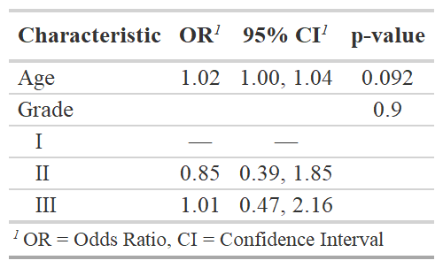
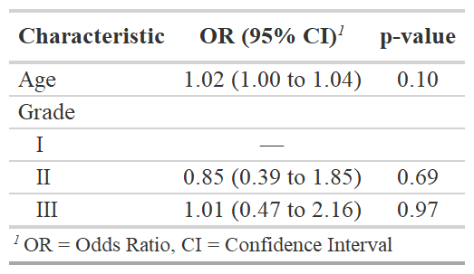

::: article
# Introduction

Table summaries are a fundamental tool in an analyst's toolbox that help
us understand and communicate patterns in our data. The ability to
easily create and export polished and reproducible tables is essential.
The [*gtsummary*](https://CRAN.R-project.org/package=gtsummary)
[@gtsummary] package provides an elegant and flexible framework to
create publication-ready analytical and summary tables in R. This
package works to close the gap between a reproducible RMarkdown report
and the final report. Specifically, *gtsummary* allows the user to fully
customize and format summary tables with code, eliminating the need to
modify any tables by hand after the table has been exported. Removing
the need to modify tables after the table has been created eliminates an
error-prone step in our workflow and increases the reproducibility of
our analyses and reports.

Using *gtsummary*, analysts can easily summarize data frames, present
and compare descriptive statistics between groups, summarize regression
models, and report statistics inline in RMarkdown reports. After
identifying these basic structures of most tables presented in the
medical literature (and other fields), we wrote *gtsummary* to ease the
creation of fully-formatted, ready-to-publish tables.

Additionally, *gtsummary* leverages other analysis and tidying R
packages to create a complete analysis and reporting framework. For
example, we take advantage of the existing
[*broom*](https://CRAN.R-project.org/package=broom) [@broom] tidiers to
prepare regression results for `tbl_regression()` and use
[*gt*](https://CRAN.R-project.org/package=gt) [@gt] to print *gtsummary*
tables to various output formats (e.g., HTML, PDF, Word, or RTF).
Furthermore, *gtsummary* functions are designed to work within a
\"tidy\" framework, utilizing the
[*magrittr*](https://CRAN.R-project.org/package=magrittr) [@magrittr]
pipe operator and
[*tidyselect*](https://CRAN.R-project.org/package=tidyselect)
[@tidyselect] functions used throughout the
[*tidyverse*](https://CRAN.R-project.org/package=tidyverse)
[@tidyverse].

While other R packages are available to present data and regression
model summary tables, such as
[*skimr*](https://CRAN.R-project.org/package=skimr),
[*stargazer*](https://CRAN.R-project.org/package=stargazer),
[*finalfit*](https://CRAN.R-project.org/package=finalfit), and
[*tableone*](https://CRAN.R-project.org/package=tableone), *gtsummary*
is unique in that it is a one-stop-shop for most types of statistical
tables and offers diverse features to customize the content of tables to
a high degree. The default
[*gtsummary*](https://CRAN.R-project.org/package=gtsummary) table is
suitable to be published in a scientific journal with little or no
additional formatting. For example,
[*gtsummary*](https://CRAN.R-project.org/package=gtsummary) has specific
internal algorithms to identify variable data types, so there is no need
for users to specify whether a variable should be displayed with
categorical or continuous summaries, which yields summary tables with
minimal code.

Along with descriptive summaries, *gtsummary* summarizes statistical
models, survey data, survival data and builds cross-tabulations. After
data are summarized in a table, *gtsummary* allows users to combine
tables, either side-by-side (with `tbl_merge()`) , or on top of each
other (with `tbl_stack()`). The table merging and stacking abilities
allows analysts to easily synthesize and compare output from several
tables and share information in a compact format. All tables in this
manuscript were created using *gtsummary* v1.4.1.

# Data Summaries

To showcase *gtsummary* functions, we will use a simulated clinical
trial data set containing baseline characteristics of 200 patients who
received Drug A or Drug B, as well as the outcomes of tumor response and
death. Each variable in the data frame has been assigned an attribute
label with the *labelled* package [@labelled], e.g.,
`trial %>% set_variable_labels(age = "Age")`, that will be shown in the
summary tables. These labels are displayed in the *gtsummary* tables by
default, and had labels not been assigned, the variable name would have
been shown.

::: {#tab:caption}
  --------------------------------------------------------------------------------------------
  colname      label                    class       values
  ------------ ------------------------ ----------- ------------------------------------------
  `trt`        Chemotherapy Treatment   character   `Drug A`, `Drug B`

  `age`        Age                      numeric     `6`, `9`, `10`, `17`, \...

  `marker`     Marker Level (ng/mL)     numeric     `0.003`, `0.005`, `0.013`, `0.015`, \...

  `stage`      T Stage                  factor      `T1`, `T2`, `T3`, `T4`

  `grade`      Grade                    factor      `I`, `II`, `III`

  `response`   Tumor Response           integer     `0`, `1`

  `death`      Patient Died             integer     `0`, `1`

  `ttdeath`    Months to Death/Censor   numeric     `3.53`, `5.33`, `6.32`, `7.27`, \...

                                                    
  --------------------------------------------------------------------------------------------

  : Table 1: Example data frame, `trial`
:::

## `tbl_summary()`

The default output from `tbl_summary()` is meant to be
publication-ready. The `tbl_summary()` function can take, at minimum, a
data frame as the only input, and returns descriptive statistics for
each column in the data frame. This is often the first table of clinical
manuscripts and describes the characteristics of the study cohort. A
simple example is shown below. Notably, by specifying the `by=`
argument, you can stratify the summary table. In the example below, we
have split the table by the treatment a patient received.

``` r
trial %>%
  select(age, grade, response, trt) %>%
  tbl_summary(by = trt)
```

{width="100%"
alt="graphic without alt text"} The function is highly customizable, and
it is initiated with sensible default settings. Specifically,
`tbl_summary()` detects variable types of input data and calculates
descriptive statistics accordingly. For example, variables coded as
`0/1`, `TRUE/FALSE`, and `Yes/No` are presented dichotomously.
Additionally, `NA` values are recognized as missing and listed as
unknown, and if a data set is labeled, the label attributes are
utilized.

Default settings may be customized using the `tbl_summary()` function
arguments.

::: {#tab:caption1}
  ------------------------------------------------------------------------------------
  Argument          Description
  ----------------- ------------------------------------------------------------------
  `label=`          specify the variable labels printed in table

  `type=`           specify the variable type (e.g., continuous, categorical, etc.)

  `statistic=`      change the summary statistics presented

  `digits=`         number of digits the summary statistics will be rounded to

  `missing=`        whether to display a row with the number of missing observations

  `missing_text=`   text label for the missing number row

  `sort=`           change the sorting of categorical levels by frequency

  `percent=`        print column, row, or cell percentages

  `include=`        list of variables to include in summary table

                    
  ------------------------------------------------------------------------------------

  : Table 2: `tbl_summary()` function arguments
:::

For continuous variables, tables display one row of statistics per
variable by default. This can be customized, and in the example below,
the age variable is cast to `"continuous2"` type, meaning the continuous
summary statistics will appear on two or more rows in the table. This
allows the number of non-missing observations and the mean to be
displayed on separate lines.

In the example below, the `"age"` variable's label is updated to
`"Patient Age"`. Default summary statistics for both continuous and
categorical variables are updated using the `statistic=` argument.
*gtsummary* uses [*glue*](https://CRAN.R-project.org/package=glue)
[@glue] syntax to construct the statistics displayed in the table.
Function names appearing in curly brackets will be replaced by the
evaluated value. The `digits=` argument is used to increase the number
of decimal places to which the statistics are rounded, and the missing
row is omitted with `missing = "no"`.

``` r
trial %>%
  select(age, grade, response, trt) %>%
  tbl_summary(
    by = trt,
    type = age ~ "continuous2",
    label = age ~ "Patient Age",
    statistic = list(age ~ c("{N_nonmiss}", "{mean} ({sd})"),
                     c(grade, response) ~ "{n} / {N} ({p}%)"),
    digits = c(grade, response) ~ c(0, 0, 1),
    missing = "no"
  )
```

{width="100%"
alt="graphic without alt text"} **A note about notation:** Throughout
the *gtsummary* package, you will find function arguments that accept a
list of formulas (or a single formula) as the input. In the example
above, the label for the age variable was updated using
`label = age `$\sim$` "Patient Age"`---equivalently,
`label = list(age `$\sim$` "Patient Age")`. To select groups of
variables, utilize the select helpers from the *tidyselect* and
*gtsummary* packages. The `all_continuous()` selector is a convenient
way to select all continuous variables. In the example above, it could
have been used to change the summary statistics for all continuous
variables---`all_continuous() `$\sim$` c("{N_nonmiss}", "{mean} ({sd})")`.
Similarly, users may utilize `all_categorical()` (from *gtsummary*) or
any of the *tidyselect* helpers used throughout the *tidyverse*
packages, such as `starts_with()`, `contains()`, etc.

In addition to summary statistics, the *gtsummary* package has several
functions to add additional information or statistics to `tbl_summary()`
tables.

::: {#tab:caption2}
  ------------------------------------------------------------------------------------------------------
  Function             Description
  -------------------- ---------------------------------------------------------------------------------
  `add_p()`            add *p*-values to the output comparing values across groups

  `add_overall()`      add a column with overall summary statistics

  `add_n()`            add a column with N (or N missing) for each variable

  `add_difference()`   add column for difference between two group, confidence interval, and *p*-value

  `add_stat_label()`   add label for the summary statistics shown in each row

  `add_stat()`         generic function to add a column with user-defined values

  `add_q()`            add a column of *q*-values to control for multiple comparisons

                       
  ------------------------------------------------------------------------------------------------------

  : Table 3: `tbl_summary()` functions to add information
:::

In the example below, descriptive statistics are shown by the treatment
received and overall, as well as a *p*-value comparing the values
between the treatments. Default statistical tests are chosen based on
data type, and the statistical test performed can be customized in the
`add_p()` function. *p*-value formatting can be adjusted using the
`pvalue_fun=` argument, which accepts both a proper function, as well
the formula shortcut notation used throughout the *tidyverse* packages.

``` r
trial %>%
  select(age, grade, response, trt) %>%
  tbl_summary(by = trt) %>%
  add_overall() %>%
  add_p(test = all_continuous() ~ "t.test",
        pvalue_fun = ~style_pvalue(., digits = 2))
```

{width="100%"
alt="graphic without alt text"}

## `tbl_svysummary()`

The `tbl_svysummary()` function is analogous to `tbl_summary()`, except
a [*survey*](https://CRAN.R-project.org/package=survey) [@survey] object
is supplied rather than a data frame. The summary statistics presented
take into account the survey weights, as do any *p*-values presented.

``` r
# convert trial data frame to survey object
svy_trial <- survey::svydesign(data = trial, ids = ~ 1, weights = ~ 1)

tbl_svysummary_1 <-
  svy_trial %>%
  tbl_svysummary(by = trt, include = c(trt, age, grade)) %>%
  add_p()
```

{width="100%"
alt="graphic without alt text"}

## `tbl_cross()`

The `tbl_cross()` function is a wrapper for `tbl_summary()` and creates
a simple, publication-ready cross tabulation.

``` r
trial %>%
  tbl_cross(row = stage, col = trt, percent = "cell") %>%
  add_p(source_note = TRUE)
```

{width="100%" alt="graphic without alt text"}

## `tbl_survfit()`

The `tbl_survfit()` function parses and tabulates `survival::survfit()`
objects presenting survival percentile estimates and survival
probabilities at specified times.

``` r
library(survival)

list(survfit(Surv(ttdeath, death) ~ trt, trial),
     survfit(Surv(ttdeath, death) ~ grade, trial)) %>%
  tbl_survfit(times = c(12, 24),
              label_header = "**{time} Month**") %>%
  add_p()
```

{width="100%"
alt="graphic without alt text"}

## Customization

The *gtsummary* package includes functions specifically made to modify
and format the summary tables. These functions work with any table
constructed with *gtsummary*. The most common uses are changing the
column headers and footnotes or modifying the look of tables through
bolding and italicization.

::: {#tab:caption4}
  ----------------------------------------------------------
  Function                     Description
  ---------------------------- -----------------------------
  `modify_header()`            update column headers

  `modify_footnote()`          update column footnote

  `modify_spanning_header()`   update spanning headers

  `modify_caption()`           update table caption/title

  `bold_labels()`              bold variable labels

  `bold_levels()`              bold variable levels

  `italicize_labels()`         italicize variable labels

  `italicize_levels()`         italicize variable levels

  `bold_p()`                   bold significant *p*-values

                               
  ----------------------------------------------------------

  : Table 4: Functions to style and modify gtsummary tables
:::

The *gtsummary* package utilizes the *gt* package to print the summary
tables. The *gt* package exports approximately one hundred functions to
customize and style tables. When you need to add additional details or
styling not available within *gtsummary*, use the `as_gt()` function to
convert the *gtsummary* object to *gt* and continue customization.

The example below is a common table reported in clinical trials and
observational research where two treatments are compared. The treatment
differences were added with the `add_difference()` function. The table
includes customization using both *gtsummary* and *gt* functions. The
*gtsummary* functions are utilized to bold the variable labels, update
the column headers, and add a spanning header. Additional *gt*
customization was utilized to add table captions and source notes.

``` r
trial %>%
  select(marker, response, trt) %>%
  tbl_summary(by = trt,
              missing = "no",
              statistic = marker ~ "{mean} ({sd})") %>%
  add_difference() %>%
  add_n() %>%
  add_stat_label() %>%
  bold_labels() %>%
  modify_header(list(label ~ "**Variable**", all_stat_cols() ~ "**{level}**")) %>%
  modify_spanning_header(all_stat_cols() ~ "**Randomization Assignment**") %>%
  as_gt() %>%
  gt::tab_header(
    title = gt::md("**Table 1. Treatment Differences**"),
    subtitle = gt::md("_Highly Confidential_")
  ) %>%
  gt::tab_source_note("Data updated June 26, 2015")
```

{width="100%" alt="graphic without alt text"}

# Model Summaries

Regression modeling is one of the most common tools of medical research.
The *gtsummary* package has two functions to help analysts prepare
tabular summaries of regression models: `tbl_regression()` and
`tbl_uvregression()`.

## `tbl_regression()`

The `tbl_regression()` function takes a regression model object in R and
returns a formatted table of regression model results. Like
`tbl_summary()`, `tbl_regression()` creates highly customizable analytic
tables with sensible defaults. Common regression models, such as
logistic regression and Cox proportional hazards regression, are
automatically identified, and the tables headers are pre-filled with
appropriate column headers (i.e., Odds Ratio and Hazard Ratio).

In the example below, the logistic regression model is summarized with
`tbl_regression()`. Note that a reference row for grade has been added,
and the variable labels have been carried through into the table. Using
`exponentiate = TRUE`, we exponentiate the regression coefficients,
yielding the odds ratios. The helper function `add_global_p()` was used
to replace the *p*-values for each term with the global *p*-value for
grade.

``` r
glm(response ~ age + grade, trial, family = binomial) %>%
  tbl_regression(exponentiate = TRUE) %>%
  add_global_p()
```

{width="100%"
alt="graphic without alt text"} The `tbl_regression()` function
leverages the huge effort behind the *broom*,
[*parameters*](https://CRAN.R-project.org/package=parameters)
[@parameters], and
[*broom.helpers*](https://CRAN.R-project.org/package=broom.helpers)
[@broom.helpers] packages to perform the initial formatting of the
regression object. Because `tbl_regression()` utilizes these packages,
there are many model types that are supported out of the box, such as
`lm()`, `glm()`, `lme4::lmer()`, `lme4::glmer()`, `geepack::geeglm()`,
`survival::coxph()`, `survival::survreg()`, `survival::clogit()`,
`nnet::multinom()`, `rstanarm::stan_glm()`, models built with the *mice*
package [@mice], and many more. A custom tidier may be specified as
well, which is helpful when you need to present non-standard
modifications to your model results such as Wald confidence intervals or
results with modified variance-covariance standard errors.

## `tbl_uvregression()`

The `tbl_uvregression()` function is a wrapper for `tbl_regression()`
that is useful when you need a series of univariate regression models.
The user passes a data frame to `tbl_uvregression()`, indicates what the
outcome is, what regression model to run, and the function will return a
formatted table of stacked univariate regression models.

``` r
trial %>%
  select(response, age, grade) %>%
  tbl_uvregression(
    y = response,
    method = glm,
    method.args = list(family = binomial),
    exponentiate = TRUE,
    pvalue_fun = ~style_pvalue(., digits = 2)
  ) %>%
  add_nevent() %>%
  add_global_p()
```

{width="100%"
alt="graphic without alt text"}

# Inline Reporting

Reproducible reports are an important part of good analytic practices.
We often need to report the results from a table in the text of an R
markdown report. The `inline_text()` function reports statistics from
*gtsummary* tables inline in an R markdown document.

Imagine you need to report the results for age from the univariate table
above. Typically, the odds ratio, confidence interval, and *p*-value
would be hard-coded into a report, which can lead to reproducibility
issues if the data is updated and the hard-coded statistics are not
amended. A simple call to the `inline_text()` function will dynamically
add the model results to an RMarkdown report.

> The odds ratio for age was `r inline_text(uvreg, variable = age)`.

Here is how the line will appear in your report.

> The odds ratio for age was 1.02 (95% CI 1.00, 1.04; p=0.091).

The default pattern to display for a regression table is
`"{estimate} ({conf.level*100}% CI {conf.low}, {conf.high}; {p.value})"`
(again using glue syntax), and can be modified with the
`inline_text(pattern=)` argument.

# Merging and Stacking

The *gtsummary* tables shown above are often ready for publication as
they are; however, it is common that more complex tables need to be
constructed. This can be achieved by merging or stacking *gtsummary*
tables using the `tbl_merge()` and `tbl_stack()` functions. For example,
in cancer research we often report models predicting a tumor's response
to treatment and risk of death side-by-side in publications. This type
of table is simple to construct using `tbl_merge()`. First, build a
table for each regression model using `tbl_regression()`, then merge the
two tables with `tbl_merge()`. Any number of *gtsummary* tables can be
merged with this function.

``` r
tbl1 <-
  glm(response ~ age + grade, trial, family = binomial) %>%
  tbl_regression(exponentiate = TRUE)

tbl2 <-
  coxph(Surv(ttdeath, death) ~ age + grade, trial) %>%
  tbl_regression(exponentiate = TRUE)

tbl_merge_1 <-
  tbl_merge(
    tbls = list(tbl1, tbl2),
    tab_spanner = c("**Tumor Response**", "**Time to Death**")
  )
```

{width="100%" alt="graphic without alt text"}
Similarly, any number of *gtsummary* tables may be stacked using the
`tbl_stack()` function.

# Themes

We love themes. The default styling (e.g., statistics displayed in
`tbl_summary()`, how *p*-values are rounded, decimal separator, and
more) follow the reporting guidelines from European Urology, The Journal
of Urology, Urology, and the British Journal of Urology International
[@assel2019guidelines]. However, you will likely submit to another
journal, or your personal preferences differ from the defaults. The
*gtsummary* package is unique from other table building packages with
the ability to set fine-grained customization defaults with themes.
Themes were created to make these customizations easy to navigate and
reuse across documents or projects. With themes, users can control
default settings for existing functions (e.g., always present means
instead of medians in `tbl_summary()`), as well as other changes that
are not modifiable with function arguments. Several themes are available
to follow various journals' reporting guidelines, reduce cell padding
and font size, and language themes to translate *gtsummary* tables to
more than 14 languages.

For example, using the theme for *The Journal of the American Medical
Association* (*JAMA*), large *p*-values are rounded to two decimal
places, confidence intervals are shown as `"lb to ub"` instead of
`"lb, ub"`, and the confidence interval is displayed in the same column
as the model coefficients.

``` r
theme_gtsummary_journal("jama")

glm(response ~ age + grade, trial, family = binomial) %>%
  tbl_regression(exponentiate = TRUE)
```

{width="100%" alt="graphic without alt text"}
The language theme can be used to translate the table to another
language and allows users to specify the decimal and big mark symbols.
For example,
`theme_gtsummary_language(language = "es", decimal.mark = ",", big.mark = ".")`
will translate the output to Spanish and format numeric results as
`1.000,00` instead of `1,000.00` (the default formatting).

A custom theme was used to construct the *gtsummary* tables shown in
this manuscript to match the *R Journal* font and reduce the default
cell padding. Themes are an evolving feature, and we welcome additions
of new journals' reporting guidelines or other themes useful to users. A
full glossary of customizable theme elements is available in the
package's themes vignette
(<http://www.danieldsjoberg.com/gtsummary/articles/themes.html>).

# Print Engines

Tables printed with *gtsummary* can be seamlessly integrated into
RMarkdown documents and knitted into various output types using a number
of print engines. The package was written to be a companion to the *gt*
package from RStudio and is optimized to leverage the advanced
customization features of this print engine, but offers compatibility
with a variety of popular printing methods, including `knitr::kable()`
[@knitr], [*flextable*](https://CRAN.R-project.org/package=flextable)
[@flextable], [*huxtable*](https://CRAN.R-project.org/package=huxtable)
[@huxtable], and
[*kableExtra*](https://CRAN.R-project.org/package=kableExtra)
[@kableExtra]. While *gt* is used as the default for most outputs, you
can easily use your print engine of choice with the conversion helper
functions provided in the package (e.g., `as_flex_table()`). It is
possible to get results in HTML, PDF (via LaTeX), RTF, Microsoft Word,
PowerPoint, Excel, and others, utilizing the various print engines. The
package is designed to interact with these print engines behind the
scenes to reduce the burden on users, and you generally only need to be
aware of them if you want to add advanced customizations.

# Summary

The functions in the *gtsummary* package were designed to reduce the
burden of reporting and to work together to easily construct both simple
and complex tables. It is our hope that the user-friendly syntax and
publication-ready tables will aid analysts in preparing reproducible and
high-quality findings.
:::
