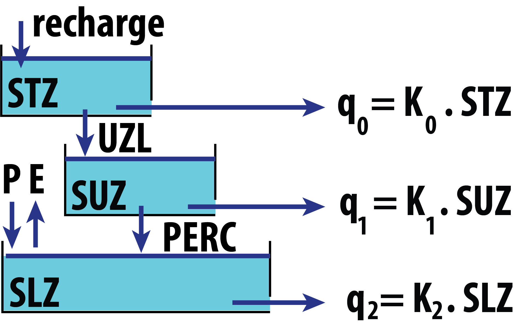
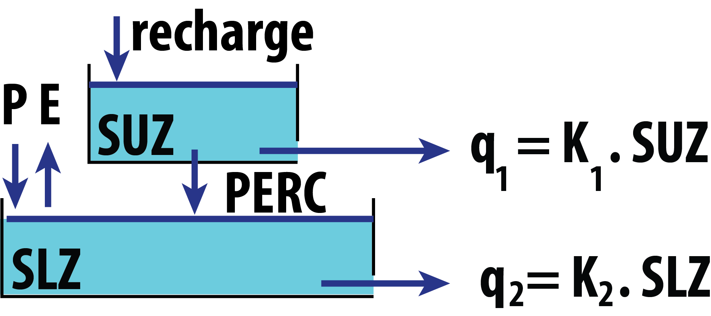

# Introduction

Hydrological modeling is widely used by engineers, meteorologists,
geographers, geologists, and researchers interested in knowing the
runoff of rivers in the coming days or the variations of the snowpack
under certain temperature or precipitation changes, among many other
hydrological processes.\
The Swedish Meteorological and Hydrological Institute (SMHI) ran the
first successful simulation of the HBV model in 1972. It was developed
to forecast river runoff for hydropower generation in Sweden
[@bergstrom:2015]. Up to now, many versions have been developed: HBV-ETH
(Switzerland - @braun:1992 ), HBV-Light (Switzerland - @seibert:2012 ),
HBV-D (Germany - @krysanova:1999 ), HBV-CE (Canada - @stahl_hbv:2008 ),
[*TUWmodel*](https://CRAN.R-project.org/package=TUWmodel) (Austria -
@viglione:2016 ), among others. Despite all these free versions, none of
them allows the users to build their own model using a self-defined
combination of modules.

@buytaert:2008 identified some prerequisites for hydrological model
development: (1) *accessibility* in order to reproduce experimental
results; (2) *modularity* as a key element for the development of new
*'ad-hoc'* models to evaluate several aspects of the hydrological cycle
and to propose improvements; (3) *portability*, so the model can run in
many operating systems; and (4) *open-source code* as a fundamental
scientific requirement that allows users to revise, correct, and suggest
code improvements.

@slater:2019 highlighted some of the key R packages for hydrological
modeling; *TUWmodel* is an R version of the HBV model originally written
in Fortran [@viglione:2016];
[*topmodel*](https://CRAN.R-project.org/package=topmodel) and
[*dynatopmodel*](https://CRAN.R-project.org/package=dynatopmodel) are
the R versions of the well-known semi-distributed models TOPMODEL and
Dynamic TOPMODEL [@topmodel:2018; @metcalfe:2015];
[*airGR*](https://CRAN.R-project.org/package=airGR)
[@coron:2017; @airGR:2020] includes several conceptual rainfall-runoff
models, a snow accumulation and melt model and the associated functions
for their calibration and evaluation; finally, *hydromad*
[@andrews:2011] provides a modeling framework for environmental
hydrology through water balance accounting and flow routing in spatially
aggregated catchments.

Of the models mentioned above, only *airGR*, *hydromad*, and *TUWmodel*
present a snow routine to account for accumulation and melting processes
(temperature index model), but none of them have routines to account for
glacier mass balance. On the other hand, the
[*glacierSMBM*](https://CRAN.R-project.org/package=glacierSMBM) package
[@glacier:2017] allows the modeling of glacier surface mass balance in a
fully distributed manner, but it was designed to work on the mass
balance of a single glacier and to run on a raster-based grid, two
aspects that limit its applicability at the basin scale.

The [*HBV.IANIGLA*](https://CRAN.R-project.org/package=HBV.IANIGLA)
[@toum:2021] package was built with the aim of providing a modular
hydrological model approach that adds to the classic HBV routines
functions for the modeling of the surface mass balance of clean and
debris-covered glaciers, a fundamental aspect in the hydrological cycle
of cold regions of the Andes [@masiokas:2020]. The main objective of
this article is to present the *HBV.IANIGLA* model structure through its
implementation as an R package to serve as a practical guide to better
understand how it works. The paper is organized as follows:

-   In the next section, we describe the modeling philosophy under HBV
    and justify the use of a modular approach. We then present the
    *HBV.IANIGLA* modules and related equations (with some conceptual
    drawings). We end this section with a small study on model
    computation times, a fundamental aspect for sensitivity and
    uncertainty analysis.
-   Following the methodology, we focus on two examples: on a synthetic
    basin and on glacier mass balance. The reader will find more
    reproducible examples in the package vignettes.
-   Finally, we condense the key points of the current version of
    *HBV.IANIGLA* and propose future improvements.

# The HBV.IANIGLA model

## The HBV model

The HBV model has been used for $40$ years for hydrological studies in
mountain regions around the world [@bergstrom:2015]. The model requires
relatively few data inputs (air temperature, precipitation, and
potential evapotranspiration), which makes it very appropriate in scarce
data regions such as the Southern Andes. It has been well-documented by
other authors [@seibert:2012; @parajka:2008; @stahl_hbv:2008], a feature
that facilitates writing new codes and modifying or improving existing
equations. Also , it is a bucket-type model with relatively few free
parameters to calibrate.

The *HBV.IANIGLA* version not only takes into account precipitation
phase partitioning, snow accumulation and melting, actual evaporation
and streamflow discharge, but also incorporates a module for simulating
the surface mass balance of clean and debris-covered glaciers and
another module for glacier-melt routing. In addition, the package has
been designed in a modular fashion, allowing users to build their own
model. To our knowledge, this is the first HBV version and R
hydro-modeling package to combine these two features.

## General modeling philosophy

According to @bergstrom:2015, the HBV model was inspired in the works
developed in the early 1970s by @nash:1970, @oconnell:1970, and
@mandeville:1970. The primary objective of this model was operational:
to forecast streamflow discharge for the Swedish hydropower industry.
This overriding requirement dictated the characteristics of the model:
it should not be too complex but physically sound; the input data should
conform to standard Swedish meteorological measurements; the number of
free parameters should be kept to a minimum; and it should be easy to
understand.

The above features and lessons learned over more than two decades
[@bergstrom:1991] resulted in a hydrological model composed of four
modules: ($1$) a temperature index model with an air temperature-based
precipitation partitioning algorithm; ($2$) a soil moisture routine with
a nonlinear empirical algorithm to account for abstractions, actual
evaporation, and antecedent conditions; ($3$) a bucket-type model (many
variants exist up to now) to simulate the catchment storage effect; and
($4$) a transfer function to adjust the timing of the hydrograph to the
observed discharge.

To date, the model has not only been used in operational hydrology but
also in scientific research. @konz:2010 used the HBV-Light version in
three alpine catchments in Switzerland and Austria to show the value of
glacier mass balances in constraining uncertainty in the parameter
estimation of conceptual models such as HBV. @ali:2018 also applied
HBV-Light to evaluate model performance in a climate change context in
the snow- and ice-dominated Hunza River basin in the Karakoram
Mountains, Pakistan. @finger:2015 compared model performance in
simulations of increasing complexity for glacier mass balance and
streamflow at the outflow of three Swiss watersheds. @stahl_hbv:2008
used HBV-CE to estimate streamflow sensitivity to different climate
change scenarios in British Columbia, Canada. @staudinger:2017 studied
the variation of water storage with elevation in $21$ Swiss alpine and
pre-alpine catchments using four different methods: water balance
analysis, flow recession analysis, calibration of the HBV model, and
calibration of a transfer function hydrograph separation model using
stable isotope observations. In another interesting application,
@ren:2018 combined HBV with a Bayesian neural network to improve
seasonal water supply forecasting in the Yarkant River basin, Central
Asia. Therefore, the original conception of HBV and its evolution have
made it a longstanding multipurpose tool for a diverse and dynamic user
community.

## Modules and equations

Models are based on a perceptual conception of the basin's functioning.
This perception leads to the decision of the equations (hydrological
processes) and the construction of a conceptual model [@beven:2012]. In
the *HBV.IANIGLA* model, these first two stages have already been
decided, as the equations and coding are in the package, but the user
still has a choice on how the watershed or glacier will be discretized
(in terms of land use and spatial aggregation) and on how the different
modules will be assembled. This decision should be guided by the
objective of the project, the knowledge of the hydrological driving
process at the chosen modeling scale, and the data available not only
for the implementation but also for the model evaluation.

{#figure:basin_hbv width="100%"
alt="graphic without alt text"}

The following lines describe the modules that must be assembled to build
a complete *HBV.IANIGLA* hydrological model. There are three other
functions within the package: `PET`, `Pecip_model`, and
`Temp_ model`. The first function contains a potential
evapotranspiration model that provides a simple and straightforward way
to calculate one of the inputs to the soil routine. However, for
real-world applications we strongly recommend the use of the specialized
[*Evapotranspiration*](https://CRAN.R-project.org/package=Evapotranspiration)
package [@pet:2020]. The other two functions are linear models to
extrapolate air temperature and precipitation records. Since we consider
that their use is straightforward, we refer the user to the package
manual.

### Snow and ice melt models -- `SnowGlacier_HBV()`

Precipitation is considered to be either snow or rain, depending on
whether the temperature is above or below a threshold temperature *Tr*
(ºC).

$$\begin{aligned}
\begin{aligned}
P_{rain} & = P \quad         & \textit{if} \quad T_{air} > Tr \\
P_{snow} & = P * SFCF \quad  & \textit{if} \quad T_{air} \leq Tr
\end{aligned}
\end{aligned}$$

After partitioning, the snowfall is corrected using the `SFCF` parameter
to account for the under-capture effect of the precipitation gauge on
snow events.

This function uses a temperature index approach for snow and glacier
melt simulation. This kind of approximation has been widely used in snow
hydrology and glaciology, and different formulations have emerged
[@hock:2003; @seibert:2012; @braun:1992]. The temperature index
formulation takes into account the strong correlation between snow line
retreat and accumulated temperatures above a certain threshold (with
typical values around $0$ºC). Hence although many authors have proposed
more complex formulations (e.g., HBV-Light uses a refreezing and liquid
retention factor) or even a radiation term [@pellicciotti:2005], this
empirical formulation must be parsimonious to avoid problems of
overparameterization [@kirchner:2006].

$$\begin{aligned}
\label{eq:t_ind}
& Melt = (T_{air} - Tt) * f_{x} \quad \quad \textit{if} \quad T_{air} > Tt ,
\end{aligned}   (\#eq:t-ind)$$

where $T_{air}$ is the measured or estimated air temperature, $Tt$ is
the melting temperature, and $f_{x}$ is a generic expression of melting
factors for snow, clean, or debris-covered ice.

If the air temperature is above the threshold ($Tt$), melting occurs at
a rate proportional to the melting factor ($f_{x}$). Both the
temperature threshold and the melting factor are parameters that must be
calibrated by the user. Note that the time units depend on the
resolution of the input data. Although the examples shown in this
article are in a daily time step, the model can be used in the hourly or
monthly resolution. In the next lines, we will describe in detail the
different arguments of the function.

The `model` argument presents three options:

1.  **Temperature index model**: this model is described by equation
    \@ref(eq:t-ind). Here, the user can apply the most common and
    recommended set of temperature index formulations.

2.  **Temperature index model with variable snow cover area**: this
    option is an attempt to offer, within the package, the same
    temperature index model as in the Snowmelt Runoff Model
    [@dewalle:2008]. However, this routine has certain limitation: the
    snow cover series forces the model to simulate a total effective
    value (e.g., snow water equivalent), which is not in-line with the
    original idea of modeling in elevation bands, where average values
    are expected.

3.  **Temperature index model with a variable glacier area**: this
    routine explicitly takes into account the change in glacier area.
    Since the automatic reduction of glacier area forces the simulation
    to the observed values, the user should evaluate the correspondence
    between the simulated and observed mass balances.

The package documentation contains all the necessary information
(vignettes with reproducible examples included) to correctly construct
the `inputData` argument. The data matrix must not contain missing
values (`NA’s`) because *HBV.IANIGLA* is a continuous hydrological
model, meaning that it simulates all the variables in every time step.

The initial conditions of the model are (`initCond`):

1.  **Initial snow water equivalent**: this is a state variable, whose
    initial value will be used in the first loop. Unless field data is
    available, it is recommended to use a zero value. Because
    uncertainties are common in the initial state variables of the
    model, it is recommended to use a warm-up period (between one and
    two years in daily time step modeling). If the period covered by the
    data is very limited, these same values can be used as calibration
    parameters.

2.  **Numeric integer indicating the surface type**: 1: clean ice; 2:
    soil; 3: debris-covered ice. *HBV.IANIGLA* uses this argument to
    know which parameters (`param` argument) to look for. It also
    constrains the function output.

3.  **Area of the glacier(s) (in the elevation band) relative to the
    basin**: this is required only if the surface is a clean or
    debris-covered glacier. The area is used to scale the total amount
    of water produced (rainfall plus melted water) according to the area
    of the polygon in the basin. Thus, if the area of this portion of
    the glacier corresponds to 5% of the basin area, a value of $0.05$
    should be assigned.

The last argument is a numeric vector that stores the parameter values
(`param`) of the modules. For debris-covered glaciers, a dummy value for
the clean glacier melting factor ($f_{ic}$) must be supplied. This value
will not be used internally but simplifies the calibration exercise when
working in a basin with both types of glaciers.

It should be noted that this function allows the construction of a
single and lumped simulation. In order to develop the model for the
example shown in figure [1](#figure:basin_hbv), it will be necessary to
build the model by running the function once per every elevation band
(see examples in `vignette(package = "HBV.IANIGLA")`).

### Soil routine -- `Soil_HBV()`

This routine is based on an empirical formulation that takes into
account actual evapotranspiration, antecedent conditions, and effective
soil infiltration. This relationship is described by the so-called beta
function [@bergstrom:2015],

$$\begin{aligned}
& Inf = (Melt + Rainfall) * \left( \frac{SM}{FC} \right)^\beta ,
\end{aligned}$$

where $Inf$ is the soil box infiltration, $SM$ is the soil moisture
state variable, and $\beta$ is a nonlinear parameter between the total
amount of water entering the soil box, soil moisture storage, and runoff
generation. This equation is not unique among bucket-type hydrological
models. A similar formulation can be found in the VIC model
[@liang:1994]. *HBV.IANIGLA* assumes that all evapotranspiration occurs
from the soil box, so this function implicitly accounts for all
abstractions:

$$\begin{aligned}
& E_{act} = E_{pot} * min \left( \frac{SM}{FC * LP}; 1.00 \right) ,
\end{aligned}$$

where $E_{act}$ is the actual evapotranspiration, $E_{pot}$ is the
potential evapotranspiration, $FC$ is the soil box water capacity
parameter, and $LP$ is a reduction factor.

This type of relationship between potential, actual evapotranspiration,
and soil moisture content has been found by @zhang:2003 in eastern Asia,
suggesting that despite its empirical formulation, in some places, it
could have some physical meaning. Finally, and similar to the snow and
ice melt modules, this routine represents a single and lumped
simulation.

### Routine module -- `Routing_HBV()`

After infiltration, the water follows several complex pathways to
streams [@mcdonnell:2003]. A detailed description and modeling of these
water pathways requires field data and measurements that are generally
not available. An early engineering-based solution to this issue was to
consider this multi-causal delay as a water storage effect at the
catchment scale [@dooge:1973]. This practical modeling approach could be
seen as series of linearly interconnected and interrelated reservoirs
[@sivapalan:2017].

The current *HBV.IANIGLA* (version 0.2.1) has five different bucket
formulations, which are selected by changing the model argument number
(figure [2](#fig:bucket_models)). To solve the time step change in the
bucket water storage, we used the explicit finite difference form of the
mass balance equation over a discrete-time step [@beven:2012]. Although
the general solution has been implemented for a single linear reservoir
(figure [3](#fig:discrete)), we provide solutions for the five-bucket
models.

<figure id="fig:bucket_models">
<table>
<caption> </caption>
<tbody>
<tr class="odd">
<td style="text-align: center;"></td>
<td style="text-align: center;"></td>
</tr>
<tr class="even">
<td style="text-align: center;">(a) Model 1</td>
<td style="text-align: center;">(b) Model 2</td>
</tr>
</tbody>
</table>
<figcaption>Figure 2: Diagrams for two of the five available bucket
models. The reader will find all the diagrams in the help menu
(<code>?Routing</code><span><code>_</code></span><code>HBV</code>).</figcaption>
</figure>

{#fig:discrete width="100%"
alt="graphic without alt text"}

$$\begin{aligned}
& \frac{dS}{dt} = u - Q  \quad \quad \textit{mass balance equation} \\
& Q = K * S \quad \quad \quad \textit{continuity equation} \\ 
& \textit{from (6),} \nonumber \\
& S = \frac{Q}{K} = T * Q \\
& \textit{we replace (7) into (5),} \nonumber \\
& T * \frac{dQ}{dt} = u * Q \nonumber 
\end{aligned}$$

In discrete time steps, we use the explicit finite difference form,

$$\begin{aligned}
& \frac{Q_t - Q_{t-\Delta t}}{\Delta t} = \frac{u_t - Q_{t-\Delta t}}{T} \nonumber \\
& Q_t = \frac{\Delta t}{T} * u_t + (1 - \frac{\Delta t}{T}) * Q_{t-\Delta t} \nonumber \\
& a = (1 - \frac{\Delta t}{T}) \nonumber \\
& b = \frac{\Delta t}{T} \nonumber \\ 
& Q_t = a * Q_{t-\Delta t} + b * u_t  \\
& \frac{S_t - S_{t-\Delta t}}{\Delta t} = u_t - Q_{t-\Delta t} \nonumber \\
& S_t = S_{t-\Delta t} + \Delta t * (u_t - Q_{t-\Delta t})
\end{aligned}$$

### Glacier routine module -- `Glacier_Disch()`

Following an approach similar to previous routines, we adopt bucket
storage and release scheme [@jansson:2003]. In *HBV.IANIGLA*, we use the
approach proposed by @stahl_hbv:2008 for the HBV-EC model, employed to
estimate glacier and streamflow responses to future climate scenarios in
the Bridge River Basin (British Columbia, Canada). The glacier outflow
is calculated as:

{#fig:glacier
width="100%" alt="graphic without alt text"}

$$\begin{aligned}
& K_G = K_{Gmin} + dK_G * \exp \left( SWE/AG \right) \\
& q_G = K_G * S_G ,
\end{aligned}$$

where $K_{G}$ is the actual glacier outflow coefficient, $K_{Gmin}$ a
minimum storage release coefficient, $dK_{G}$ the maximum glacier
outflow increment, $SWE$ the total snow water equivalent over the
glacier, $AG$ a scaling parameter, $S_G$ the glacier water storage, and
$q_G$ the glacier runoff.

Note that the storage coefficient is a function of a minimum coefficient
(denoting poor drainage conditions on the glacier), the snow water
equivalent, and a calibration parameter. When the snowpack is at its
maximum value, drainage occurs at a minimum rate, the opposite occurs in
the late summer when all the snow on the glacier has melted.

For the resolution of the time step change, we also use the explicit
finite difference formulation of the mass balance equation.

### Transfer Function -- `UH()`

To represent the runoff routing in streams, we provide a single
parameter triangular function. This parameter is calibrated to adjust
the timing of the simulated river discharge,

$$\begin{aligned}
& Q = \sum_{i=1}^{B_{max}} Q_{t-i+1} * b_i ,
\end{aligned}$$

where $B_{max}$ is the base of the triangular weighting function, $b_i$
is the weight for the $i^{th}$ step, and $Q_{t-i+1}$ is the sum of the
glacier and soil bucket runoff.

## Computation times

The *HBV.IANIGLA* functions were written using
[*Rcpp*](https://CRAN.R-project.org/package=Rcpp)
[@eddelbuettel:2013; @rcpp:2019], a package that extends the R language
using C++. This approach combines the speed and efficiency of C++, a
compiled language, with the powerful interactive environment of R (see
table [1](#table:performance)), a language where it is easy to implement
specific hydrological workflows (from data retrieval to results
analysis) in a single environment [@slater:2019].

::: {#table:performance}
  -------------------------------------------------------------
   **min**   **lq**   **mean**   **median**   **uq**   **max**
  --------- -------- ---------- ------------ -------- ---------
   $1.79$    $1.95$    $2.65$      $2.01$     $2.19$   $55.81$

  -------------------------------------------------------------

  : Table 1: Summary of computation times (in *milliseconds*) over
  $1000$ runs of the `glacier_hbv` function (see
  `vignette("alerce_mass_balance")`) . The glacier was
  discretized into $8$ elevation bands ($\sim 100$ m range). The model
  was built with the modules `Temp_model`, `Precip_model`, and
  `SnowGlacier` and was run on a daily time step over a period of almost
  $9$ years (from 2010-01-01 to 2018-05-30). The analysis was performed
  on a CPU with an Intel Core i7-4790 processor at 3.60GHz, on a 64-bit
  OS running Ubuntu 18.04 using the
  [*microbechmark*](https://CRAN.R-project.org/package=microbechmark)
  package [@microbench:2019].
:::

Speed is an important issue for hydrological models, as it allows the
user to perform not only uncertainty and sensitivity analysis in
reasonable times, but also to apply demanding optimization algorithms
such as [*DEoptim*](https://CRAN.R-project.org/package=DEoptim)
[@de_opt:2016] or different model structures. This is a recommended
practice in the field of hydrological modeling
[@beven_manifesto_2006; @beven:2008; @pianosi:2016]. In addition, the
package only depends on *Rcpp* (v 0.12.0), a fact that supports its
long-term maintenance.\
If the reader is interested in comparing the computation times of
different R hydrological models we recommend the work of @paul:2020.

# Case studies

## Lumped synthetic catchment

As a first attempt at applying *HBV.IANIGLA*, a synthetic lumped
catchment (the simplest hydrological model) is used to introduce the
construction of the model and to present a basin discharge calibration
exercise.

Initially, the dataset containing: date, air temperature, precipitation,
potential evapotranspiration, and the catchment outflow is loaded, and
then the model construction is conducted (from top to bottom).

``` r
library(HBV.IANIGLA)

# load the lumped catchment dataset
data("lumped_hbv")

# take a look at our dataset
head(lumped_hbv)
summary(lumped_hbv)
```

For a basin without glaciers, the `SnowGlacier` module is used only with
soil as the underlying surface. In this exercise, we provide the correct
initial conditions and parameters for all modules except the
`Routing_HBV` function. Consistent with the development of
hydrologic models, we build our model in a top-down direction, from
precipitation to streamflow routing (note that most hydrological books
are structured in the same way).

``` r
# consider the SnowGlacier module to take into account 
# precipitation partitioning and the snow accumulation/melting. 
snow_module <-
  SnowGlacier_HBV(model = 1, 
                  inputData = as.matrix( lumped_hbv[ , c(2, 3)] ),
                  initCond = c(20, 2), 
                  param = c(1.20, 1.00, 0.00, 2.5) )
                  
# now pass rainfall plus snowmelt to 
# the soil routine. Note that we are using the PET series,                 

soil_module <-
  Soil_HBV(model = 1,
           inputData = cbind(snow_module[ , "Total"], lumped_hbv[ , "PET(mm/d)"]),
           initCond = c(100, 1),
           param = c(200, 0.8, 1.15) ) 
```

The actual evapotranspiration, soil moisture, and recharge series are
obtained from the last module. Subsequently, the recharge is
incorporated into the routing function. Recall that the routing
parameters (`param` argument) are not calibrated.

``` r
routing_module <-
  Routing_HBV(model = 1, 
              lake = F, 
              inputData = as.matrix(soil_module[ , "Rech"]),
              initCond = c(0, 0, 0), 
              param = c(0.9, 0.01, 0.001, 0.5, 0.01) )
              
# finally apply the transfer function in order to adjust 
# the hydrograph timing 

tf_module <-
  round( 
    UH(model = 1,
       Qg = routing_module[ , "Qg"],
       param = c(1.5) ),
    2)
    
# plot the "true" and simulated hydrographs

library(ggplot2)

ggplot(data = data.frame(date = lumped_hbv[ , "Date"],
                         qsim = tf_module,
                         qobs = lumped_hbv[ , "qout(mm/d)"]),
       aes(x = date)) +
  geom_line(aes(y = qsim), col = "dodgerblue") +
  geom_line(aes(y = qobs), col = "red") +
  xlab(label = " ") + ylab(label = "q(mm/d)") +
  theme_minimal() +
  scale_x_date(date_breaks = "1 year") +
  scale_y_continuous(breaks = seq(0, 15, 2.5)) +
  theme(
    title = element_text(color = "black", size = 12, face = "bold"),
    axis.title.x = element_text(color = "black", size = 12, face = "bold"),
    axis.title.y = element_text(color = "black", size = 12, face = "bold"),
    legend.text = element_text(size = 11),
    axis.text = element_text(size = 11),
    axis.text.x = element_text(angle = 90) )
```

{#fig:lumped_model width="100%"
alt="graphic without alt text"}

It is required to manually change the `Routing_HBV` parameters to
approximate the simulation to the observed basin discharge. Users will
find in the package vignette (`vignette("lumped_basin")`) more
information on this example, including the construction of an HBV model
as a function and how to run a sensitivity analysis.

## Semi-distributed glacier mass balance

In mountain areas with scarce meteorological information, temperature
index models are widely used to simulate snow and ice melting
[@hock:2003; @konz:2010; @finger:2015; @ayala:2017]. Since air
temperature is the most readily available meteorological data in remote
areas, the temperature index approach has been widely used in
glaciological and hydrological modeling [@ohmura:2001]. This package has
been built with the `SnowGlacier_HBV` function, a module that uses
this empirical approach to simulate snow, clean ice, and debris-covered
melting.

In this section, we simulate the glacier mass balance for the Alerce
glacier. Located on Monte Tronador ($41.15$º S ; $71.88$º W), nearby the
border between Argentina and Chile in the Andes of Northern Patagonia,
Alerce is a medium-size mountain glacier with an area of about
$2.33 \, km^2$ that ranges between $1629$ and $2358$ masl showing a SE
aspect [@ruiz:2017; @ingmanso:2018].

{#fig:alerce_map width="100%"
alt="graphic without alt text"}

Since $2013$, the Alerce glacier has been part of the monitoring network
of the *National Glacier Inventory* [@ing_fundamentos:2010].
Measurements are conducted following the glaciological method for
seasonal mass balance computation [@kaser_manual:2003]. Puerto Montt
precipitation (*Dirección General de Aguas, Chile*) and Bariloche air
temperature (*Servicio Meteorológico Nacional - Argentina*) were used as
meteorological records to simulate the annual mass balance of the
glacier (`data(alerce_data)`).\
When calibrating the model parameters, simulations showing an annual
mass balance in the range of $MB \pm 400 \, mm$ were considered
acceptable. $MB$ is the annual surface mass balance of the glacier.

``` r
## load the dataset
data(alerce_data)

  # now extract 
    meteo_data   <- alerce_data[["meteo_data"]]   # meteorological forcing series
    mass_balance <- alerce_data[["mass_balance"]] # annual glacier mass balances
    mb_dates     <- alerce_data[["mb_dates"]]     # fix seasonal dates
    gl_topo      <- alerce_data[["topography"]]   # elevation bands
    
    z_tair   <- alerce_data[["station_height"]][1] # topo. elev. air temp.
    z_precip <- alerce_data[["station_height"]][2] # topo. elev. precip.
```

To evaluate the topographic effect on surface mass balance (derived from
field measurements), the glacier was discretized into elevation bands.
To solve this problem, a semi-distributed glacier surface mass balance
model (`glacier_hbv`), an aggregation function (`agg_mb` - since
measurements and simulations are on different temporal scales), and a
goodness-of-fit function (`my_gof`) were constructed. The definition
of this functions are included in
`vignette("alerce_mass_balance")`.

In the following code lines, the sampling strategy for finding
acceptable parameter sets is indicated.

``` r
# air temperature model
tair_range <- rbind(
  t_grad  = c(-9.8, -2)
)

# precip model
precip_range <- rbind(
  p_grad  = c(5, 25)
)

# glacier module
glacier_range <- rbind(
  sfcf = c(1, 2),
  tr   = c(0, 3),
  tt   = c(0, 3),
  fm   = c(1, 4),
  fi   = c(4, 8)
)

## aggregate them in a matrix
param_range <-
  rbind(
    tair_range,
    precip_range,
    glacier_range
  )
```

In the next step, we generate the random parameter sets:

``` r
# set the number of model runs that you want to try
n_run <- 10000

# build the matrix
n_it <- nrow(param_range)

param_sets <- matrix(NA_real_, nrow = n_run, ncol = n_it)

colnames(param_sets) <- rownames(param_range)

set.seed(123) # just for reproducibility 
for(i in 1:n_it){

  param_sets[ , i] <- runif(n = n_run,
                            min = param_range[i, 1],
                            max = param_range[i, 2]
  )

}
```

Now, we combine the functions and extract our best simulations.

``` r
# goodness of fit vector
gof <- c()

# make a loop
for(i in 1:n_run){

  # run the model
  glacier_sim <- glacier_hbv(topography = gl_topo,
                             meteo = meteo_data,
                             z_topo = c(z_tair, z_precip),
                             param_tair = param_sets[i, rownames(tair_range)],
                             param_precip = param_sets[i, rownames(precip_range) ],
                             param_ice = param_sets[i, rownames(glacier_range)] )

  # aggregate the simulation
  annual_mb <- agg_mb(x = glacier_sim,
                      start_date = as.Date( mb_dates$winter[-4] ),
                      end_date = as.Date( mb_dates$winter[-1] ) - 1 )

  # compare the simulations with measurements
  gof[i] <- my_gof(obs_upp = mass_balance$upp,
                   obs_lwr = mass_balance$lwr,
                   sim = annual_mb[ , 3])

  rm(glacier_sim, annual_mb)
}

param_sets <- cbind(param_sets, gof)

# we apply a filter
param_subset <- subset(x = param_sets, subset = gof == 3)
```

Once we have the subsetted our parameter matrix, we run the simulations
to obtain a mean value (one per year).

``` r
# now we run the model again to get our simulations
n_it <- nrow(param_subset)

mb_sim <- matrix(NA_real_, nrow = 3, ncol = n_it)

for(i in 1:n_it){
  glacier_sim <- glacier_hbv(topography = gl_topo,
                             meteo = meteo_data,
                             z_topo = c(z_tair, z_precip),
                             param_tair = param_subset[i, rownames(tair_range)],
                             param_precip = param_subset[i, rownames(precip_range) ],
                             param_ice = param_subset[i, rownames(glacier_range)] )

  annual_mb <- agg_mb(x = glacier_sim,
                      start_date = as.Date( mb_dates$winter[-4] ),
                      end_date = as.Date( mb_dates$winter[-1] ) - 1 )

  mb_sim[ , i] <- annual_mb[ , 3]

  rm(i, glacier_sim, annual_mb)

}

# now we are going to make a data frame with the mean surface mass balance simulation
mean_sim <- cbind( mass_balance,
                   "mb_sim" =  rowMeans(mb_sim)    )

# make the plot
library(ggplot2)
g1 <-
  ggplot(data =  mean_sim, aes(x = year)) +
  geom_pointrange(aes(y = `mb(mm we)`, ymin = `lwr`, color = 'obs',
                      ymax = `upp` ), size = 1,  fill = "white", shape = 21) +
  geom_point(aes(y = `mb_sim`, fill = 'sim'), shape = 23,
             size = 3) +
  geom_hline(yintercept = 0) +
  scale_y_continuous(limits = c(-1500, 500), breaks = seq(-1500, 500, 250) ) +
  scale_color_manual(name = '', values = c('obs' = 'blue') ) +
  scale_fill_manual(name = '', values = c('sim' = 'red') ) +
  ggtitle('') +
  xlab('') + ylab('mb (mm we)') +
  theme_minimal() +
  theme(
    title = element_text(color = "black", size = 12, face = "bold"),
    axis.title.x = element_text(color = "black", size = 12, face = "bold"),
    axis.title.y = element_text(color = "black", size = 12, face = "bold"),
    legend.text = element_text(size = 11),
    axis.text = element_text(size = 11))
```

{#fig:alerce_mb width="100%"
alt="graphic without alt text"}

# Summary

In this study, we present the *HBV.IANIGLA* package, a modular version
of HBV hydrological model that incorporates routines for clean and
debris-covered glacier modeling. We explain its modeling principles and
philosophy; address the package modules and related equations; and
reinforce the importance of C++ code to speed up calculations, a
characteristic that facilitates sensitivity and uncertainty analysis. To
our knowledge, this is the first freely available, open-source modular
version of the HBV model that incorporates routines for glacier surface
mass balance modeling (clean and debris-covered ice).

We present two examples. The first one consists of a synthetic case to
show how to build a model. This is the simplest hydrological modeling
case and should be use to understand how to concatenate the package
functions and how a numerical hydrological model works. The
`vignette("lumped_basin")` also illustrates the importance of
sensitivity analysis and shows how it can be easily done in R. In fact,
any kind of sensitivity or uncertainty analysis [@pianosi:2016] could be
incorporated into *HBV.IANIGLA*. The second example, a real-world
glacier surface mass balance estimation, was selected to show the use of
the glacier module in a semi-distributed case. This module could be of
interest to the glaciological community, extending the use of the R
language to other scientific communities.

The new package version (0.2.1) documentation has been greatly improved
in relation to previous versions, not only by clarifying some aspects of
the existing function's documentation but also by adding six vignettes
with reproducible examples (see vignette(package = \"HBV.IANIGLA\")).

The modular design of the package allows the use of various
spatio-temporal scales with dissimilar objectives in the same
environment (e.g., real-time streamflow forecasting, hydrological model
teaching, or glacier mass balance simulation). The different modules can
be combined with other R-related hydrological packages (e.g.,
*Evapotranspiration*, *DEoptim*, *topmodel*) or functions
[@evap:2019; @de_opt:2016; @topmodel:2018].

*HBV.IANIGLA* can also be combined with packages such as
[*tidyverse*](https://CRAN.R-project.org/package=tidyverse),
[*sp*](https://CRAN.R-project.org/package=sp),
[*raster*](https://CRAN.R-project.org/package=raster),
[*hydroGOF*](https://CRAN.R-project.org/package=hydroGOF), or
[*plotly*](https://CRAN.R-project.org/package=plotly) to build a single
environmental hydrological workflow
[@tidyverse:2019; @sp:2017; @raster:2017; @hydroGOF:2017; @plotly:2019].
Thus, a hydrological project can be developed from the beginning to the
end in the R environment, facilitating reproducible and repeatable
research [@hutton:2016; @ceola:2015]. This type of model design opens up
the possibility for applications beyond the Andes region as well as to
incorporate new functions, such as modules, to explicitly considering
the dynamics of glaciers [@huss:2010].

The package functions were built under generic classes (numeric vectors
and matrices). This is an aspect where future improvements can be made.
Since *HBV.IANIGLA* is available in modules, it could be greatly
enhanced using the object-oriented programming (OOP) paradigm. In doing
so, the model could represent an object with properties (e.g., areas,
polygons, elevations, among others), and the HBV routines as part of the
methods (functional OOP - S4 types). These methods may also include (but
not limited to): sensitivity and uncertainty analysis, automatic
plotting of results, and temporal aggregation functionality. Even some
methods could be recycled from the
[*hydroToolkit*](https://CRAN.R-project.org/package=hydroToolkit) OOP
package [@toum:2020].

The package could also be improved by adding some GUI functionality
keeping in mind that in the words of @chambers:2017, *\...extending R is
about contributing to the language through applications designed for a
wider audience than the package author itself. Moreover, this objective
should not be a target by its own, but a part or a piece of a bigger
project directed to solve real world problems*.

# Acknowledgements

E.T. acknowledges support from CONICET Argentina through a full-time PhD
scholarship. The constructive suggestions from two anonymous reviewers
were very useful for improving the article, the package documentation,
and the vignettes, and are greatly appreciated.

