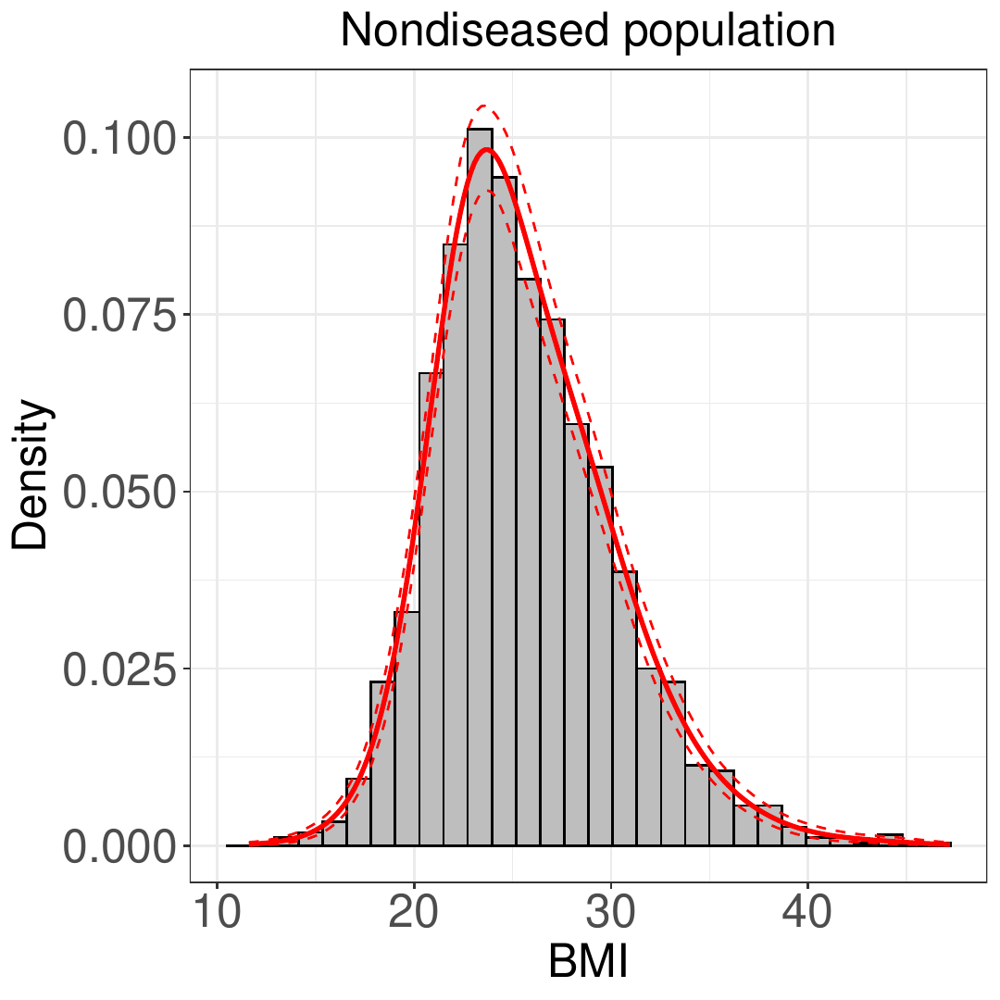

# Introduction

The receiver operating characteristic (ROC) curve [@Metz78] is,
unarguably, the most popular tool used for evaluating the discriminatory
ability of continuous-outcome diagnostic tests. The ROC curve displays
the false positive fraction (FPF) against the true positive fraction
(TPF) for all possible threshold values that can be used to dichotomize
the test result. The ROC curve thus provides a global description of the
trade-off between the FPF and the TPF of the test as the threshold
changes. Plenty of parametric and semi/nonparametric methods are
available for estimating the ROC curve, either from frequentist or
Bayesian viewpoints, and we refer the interested reader to @Pepe98
[Chapter 5], @Zhou2011 [Chapter 4], [@Inacio2020], and references
therein.

It is known that in many situations, the outcome of a test and,
possibly, its discriminatory capacity can be affected by covariates. Two
different ROC-based measures that incorporate covariate information have
been proposed: the covariate-specific or conditional ROC curve [see,
e.g., @Pepe03 Chapter 6] and the covariate-adjusted ROC curve
[@Janes09a]. The formal definition of both curves is given in Section
[2](#sec:notation). Succinctly, a covariate-specific ROC curve is an ROC
curve that conditions on a specific covariate value, thus describing the
accuracy of the test in the 'subpopulation' defined by that covariate
value. On the other hand, the covariate-adjusted ROC curve is a weighted
average of covariate-specific ROC curves. Regarding estimation, since
the seminal paper of [@Pepe98], a plethora of methods have been proposed
in the literature for the estimation of the covariate-specific ROC curve
and associated summary measures. Without being exhaustive, we mention
the work of [@Faraggi03], [@MX11a; @MX11b], [@Inacio13], and
[@Inacio17]. A detailed review can be found in [@MX11c], [@Pardo14], and
[@Inacio2020]. With respect to the covariate-adjusted ROC curve,
estimation has been discussed in [@Janes09a], [@MX11a], [@Zhong12], and
[@Inacio18].

A few R packages for ROC curve analysis are available on the
Comprehensive R Archive Network and, as far as we are aware, all of them
implementing frequentist approaches. The package
[*sROC*](https://CRAN.R-project.org/package=sROC) [@package_sROC]
contains functions to perform nonparametric, kernel-based, estimation of
ROC curves. [*pROC*](https://CRAN.R-project.org/package=pROC)
[@package_pROC] offers a set of tools to visualize, smooth, and compare
ROC curves, and [*nsROC*](https://CRAN.R-project.org/package=nsROC)
[@perez2018] also allows estimating ROC curves, building confidence
bands as well as comparing several curves both for dependent and
independent data (i.e., data arising from paired and unpaired study
designs, respectively). However, covariate information cannot be
explicitly taken into account in any of these packages. The packages
*ROCRegression* (available at
<https://bitbucket.org/mxrodriguez/rocregression>) and
[*npROCRegression*](https://CRAN.R-project.org/package=npROCRegression)
[@package_npROCRegression] provide routines to estimate
semiparametrically and nonparametrically, under a frequentist framework,
the covariate-specific ROC curve. We also mention
[*OptimalCutpoints*](https://CRAN.R-project.org/package=OptimalCutpoints)
[@Lopez2014] and
[*ThresholdROC*](https://CRAN.R-project.org/package=ThresholdROC)
[@Perez2017] that provide a collection of functions for point and
interval estimation of optimal thresholds for continuous diagnostic
tests. To the best of our knowledge, there is no statistical software
package implementing Bayesian inference for ROC curves and associated
summary indices and optimal thresholds.

To close this gap, in this paper we introduce the
[*ROCnReg*](https://CRAN.R-project.org/package=ROCnReg) package that
allows conducting Bayesian inference for the (pooled or marginal) ROC
curve, the covariate-specific ROC curve, and the covariate-adjusted ROC
curve. For the sake of generality, frequentist approaches are also
implemented. Specifically, in what concerns estimation of the pooled ROC
curve, *ROCnReg* implements the frequentist empirical estimator
described in [@Hsieh1996], the kernel-based approach proposed by
[@Zou97], the Bayesian Bootstrap method of [@Gu2008], and the Bayesian
nonparametric method based on a Dirichlet process mixture of normal
distributions model proposed by [@Erkanli2006]. Regarding the
covariate-specific ROC curve, *ROCnReg* implements the frequentist
normal method of [@Faraggi03] and its semiparametric counterpart as
described in [@Pepe98], the kernel-based approach of [@MX11a], and the
Bayesian nonparametric model based on a single-weights dependent
Dirichlet process mixture of normal distributions proposed by
[@Inacio13]. As for the covariate-adjusted ROC curve, the *ROCnReg*
package allows estimation using the frequentist semiparametric approach
of [@Janes09a], the frequentist nonparametric method discussed in
[@MX11a], and the recently proposed Bayesian nonparametric estimator of
[@Inacio18]. Table [1](#tab:overview) shows a summary of all methods
implemented in the package. In addition, *ROCnReg* also provides
functions to obtain ROC-based optimal thresholds to perform the
classification/diagnosis of individuals as, say, diseased or
nondiseased, using two different criteria, namely, the Youden index and
the criterion that sets a target value for the false positive fraction.
These are implemented for both the ROC curve, the covariate-specific,
and the covariate-adjusted ROC curve.

::: {#tab:overview}
  -------------------------------------------------------------------------------------------------------------------------------------------------------------------------------------------
  Method                         Description
  ------------------------------ ------------------------------------------------------------------------------------------------------------------------------------------------------------
  Pooled ROC curve               

  emp                            (Frequentist) empirical estimator [@Hsieh1996].

  kernel                         (Frequentist) kernel-based approach [@Zou97].

  BB                             Bayesian bootstrap method [@Gu2008].

  dpm                            Nonparametric Bayesian approach based on a Dirichlet process mixture of normal distributions [@Erkanli2006].

  Covariate-specific ROC curve   

  sp                             (Frequentist) parametric and semiparametric induced ROC regression approach [@Pepe98; @Faraggi03]

  kernel                         Nonparametric (kernel-based) induced ROC regression approach [@MX11a].

  bnp                            Nonparametric Bayesian model based on a single-weights dependent Dirichlet process mixture of normal distributions [@Inacio13].

  Covariate-adjusted ROC curve   

  sp                             (Frequentist) semiparametric method [@Janes09a].

  kernel                         Nonparametric (kernel-based) induced ROC regression approach [@MX11a].

  bnp                            Nonparametric Bayesian model based on a single-weights dependent Dirichlet process mixture of normal distributions and the Bayesian bootstrap [@Inacio18].
  -------------------------------------------------------------------------------------------------------------------------------------------------------------------------------------------

  : Table 1: Overview of ROC estimation methods included in the
  *ROCnReg* package.
:::

The remainder of the paper is organized as follows. In Section
[2](#sec:notation), we formally introduce the (pooled or marginal) ROC
curve, the covariate-specific ROC curve, and the covariate-adjusted ROC
curve. The description of the Bayesian estimation methods implemented in
the *ROCnReg* package is given in Section [3](#sec:methods). In Section
[4](#sec:illustration), the usage of the main functions and capabilities
of *ROCnReg* are described and illustrated using a synthetic dataset
mimicking endocrine data. The paper concludes with a discussion in
Section [5](#sec:summary).

# Notation and definitions {#sec:notation}

This section sets out the formal definition of the pooled or marginal
ROC curve, the covariate-specific ROC curve, and the covariate-adjusted
ROC curve. It also describes the most commonly used summary measures of
discriminatory accuracy, namely, the area under the ROC curve, the
partial area under the ROC curve, and the Youden Index. For conciseness,
we intentionally avoid giving too many details and refer the interested
reader to [@Pepe03] (and references therein) for an extensive account of
many aspects of ROC curves with and without covariates.

In what follows, we denote as $Y$ the outcome of the diagnostic test and
as $D$ the binary variable indicating the presence ($D = 1$) or absence
($D = 0$) of disease. We also assume that along with $Y$ and the true
disease status $D$, a covariate vector $\mathbf{X}$ is also available
and that it may encompass both continuous and categorical covariates.
For ease of notation, the covariate vector $\mathbf{X}$ is assumed to be
the same in both the diseased ($D = 1$) and nondiseased ($D = 0$)
populations, although this is not always necessarily the case in
practice (e.g., disease stage is, obviously, a disease-specific
covariate). By a slight abuse of notation, we use the subscripts $D$ and
$\bar{D}$ to denote (random) quantities conditional on, respectively,
$D = 1$ and $D = 0$. For example, $Y_{D}$ and $Y_{\bar{D}}$ denote the
test outcomes in the diseased and nondiseased populations, respectively.

## Pooled ROC curve {#sec:pooledroc}

In the case of a continuous-outcome diagnostic test, the classification
is usually made by comparing the test result $Y$ against a threshold
$c$. If the outcome is equal or above the threshold, $Y \geq c$, the
subject will be diagnosed as diseased. On the other hand, if the test
result is below the threshold, $Y < c$, he or she will be classified as
nondiseased. The ROC curve is then defined as the set of all possible
pairs of false positive fractions,
$\text{FPF}\left(c\right) = \Pr(Y \geq c \mid D = 0) = \Pr(Y_{\bar{D}} \geq c)$,
and true positive fractions,
$\text{TPF}\left(c\right) = \Pr(Y \geq c \mid D = 1) = \Pr(Y_D \geq c)$,
that can be obtained by varying the threshold value $c$, i.e.,
$$\left\{\left(\text{FPF}\left(c\right), \text{TPF}\left(c\right)\right): c \in \mathbb{R} \right\}.$$
It is common to represent the ROC curve as
$\left\{\left(p, \text{ROC}(p)\right): p \in [0,1] \right\}$, where
$$\label{ROC}
p=\text{FPF}(c) = 1 -F_{\bar{D}}(c),\quad \text{ROC}(p) = 1 - F_D\left\{F_{\bar{D}}^{-1}(1-p)\right\},   (\#eq:ROC)$$
with $F_{\bar{D}}\left(y\right) = \Pr(Y_{\bar{D}} \leq y)$ and
$F_{D}\left(y\right) = \Pr(Y_{D} \leq y)$ denoting the cumulative
distribution function (CDF) of $Y$ in the nondiseased and diseased
groups, respectively. Several indices can be used as global summary
measures of the accuracy of a test. The most widely used is the area
under the ROC curve (AUC), defined as
$$\label{AUC1}
\text{AUC} = \int_{0}^{1}\text{ROC}\left(p\right)\text{d}p.   (\#eq:AUC1)$$
In addition to its geometric definition, the AUC has also a
probabilistic interpretation [see, e.g., @Pepe03 p. 78]
$$\label{AUC2}
\text{AUC} = \Pr\left(Y_{D} \geq Y_{\bar{D}}\right),   (\#eq:AUC2)$$
that is, the AUC is the probability that a randomly selected diseased
subject has a higher test outcome than that of a randomly selected
nondiseased subject. The AUC takes values between $0.5$, in the case of
an uninformative test that classifies individuals no better than chance,
and $1.0$ for a perfect test. We note that an AUC below $0.5$ simply
means that the classification rule should be reversed. As it is clear
from its definition, the AUC integrates the ROC curve over the whole
range of FPFs. However, depending on the clinical circumstances,
interest might lie only on a relevant interval of FPFs or TPFs, which
leads to the notion of the partial area under the ROC curve (pAUC). The
pAUC over a range of FPFs $\left(0, u_1\right)$, where $u_1$ is
typically low and represents the largest acceptable FPF, is defined as
$$\label{pAUC}
\text{pAUC}\left(u_1\right) = \int_{0}^{u_1}\text{ROC}\left(p\right)\text{d}p.   (\#eq:pAUC)$$
On the other hand, the pAUC over a range of TPFs $(v_1,1)$, where $v_1$
is typically large and represents the lowest acceptable TPF, is defined
as
$$\label{pAUC_TPF}
\text{pAUC}_{\text{TPF}}\left(v_1\right) = \int_{v_1}^{1}\text{ROC}_{\text{TNF}}\left(p\right)\text{d}p,   (\#eq:pAUC-TPF)$$
where $\text{ROC}_{\text{TNF}}$ is a $270^\circ$ rotation of the ROC
curve, which can be expressed as
$$\label{ROC_TNF}
\text{ROC}_{\text{TNF}}(p) = F_{\bar{D}}\{F_{D}^{-1}(1-p)\}.   (\#eq:ROC-TNF)$$
The curve in (\@ref(eq:ROC-TNF)) is referred to as the true negative
fraction (TNF) ROC curve since TNF ( $= 1 - \text{FPF}$) is plotted on
the $y$-axis. We shall highlight that the argument $p$ in the ROC curve
stands for a false positive fraction, whereas in the
$\text{ROC}_{\text{TNF}}$ curve, it stands for a true positive fraction.
In Figure [1](#pAUCs), we graphically illustrate the two partial areas.

<figure id="pAUCs">
<table>
<caption> </caption>
<tbody>
<tr class="odd">
<td style="text-align: center;"></td>
<td style="text-align: center;"></td>
<td style="text-align: center;"></td>
</tr>
<tr class="even">
<td style="text-align: center;">(a)</td>
<td style="text-align: center;">(b)</td>
<td style="text-align: center;">(c)</td>
</tr>
</tbody>
</table>
<figcaption>Figure 1: (a) Shaded area in blue represents the partial
area under the ROC curve over the interval <span
class="math inline">(0,<em>u</em><sub>1</sub>)</span> of FPFs. (b)
Shaded area in blue represents the partial area under the ROC curve over
the interval <span class="math inline">(<em>v</em><sub>1</sub>,1)</span>
of TPFs. (c) The same as in (b) but now represented as an area under the
true negative fraction ROC curve. </figcaption>
</figure>

Another summary index of diagnostic accuracy is the Youden index
[@Shapiro99; @Youden50]
$$\begin{aligned}
\text{YI} & =  \max_{c}\left\{\text{TPF}(c)-\text{FPF}(c)\right\} \label{YI1}
\end{aligned}   (\#eq:YI1)$$

$$\begin{aligned}
& =  \max_{c}\left\{F_{\bar{D}}\left(c\right) - F_{D}\left(c\right)\right\} \label{YI2}
\end{aligned}   (\#eq:YI2)$$

$$\begin{aligned}
& =  \max_{p}\left\{\text{ROC}(p)-p\right\} \label{YI3}.
\end{aligned}   (\#eq:YI3)$$
The YI ranges from $0$ to $1$, taking the value of $0$ in the case of an
uninformative test and $1$ for a perfect test. As for the AUC, a YI
below $0$ means that the classification rule should be reversed. The
value $c^{*}$, which maximizes Equation \@ref(eq:YI1) (or, equivalently,
Equation \@ref(eq:YI2)), is frequently used in practice to classify
subjects as diseased or nondiseased. It should be noted that the Youden
index is equivalent to the Kolmogorov--Smirnov measure of distance
between the distributions of $Y_{D}$ and $Y_{\bar{D}}$ [@Pepe03 p. 80].

## Covariate-specific ROC curve {#sec:croc}

The conditional or covariate-specific ROC curve, given a covariate value
$\mathbf{x}$, is defined as
$$\label{ROCConditional}
\text{ROC}(p\mid\mathbf{x}) = 1-F_{D}\{F_{\bar{D}}^{-1}(1-p\mid\mathbf{x})\mid\mathbf{x}\},   (\#eq:ROCConditional)$$
where
$F_{\bar{D}}(y\mid\mathbf{x}) = \Pr(Y_{\bar{D}}\leq y\mid\mathbf{X}_{\bar{D}}=\mathbf{x})$
and
$F_{D}(y\mid\mathbf{x}) = \Pr(Y_{D}\leq y\mid \mathbf{X}_{D}= \mathbf{x})$
are the conditional CDFs of the test in the nondiseased and diseased
groups, respectively. In this case, a number of possibly different ROC
curves (and therefore discriminatory accuracies) may be obtained for
different values of $\mathbf{x}$. Thus, the covariate-specific ROC curve
is an important tool that helps to understand and determine the optimal
and suboptimal populations where to apply the tests on. That is, the
covariate-specific ROC curve allows determining the populations, defined
by or homogeneous with respect to $\mathbf{x}$, where the diagnostic
test has a 'good' or 'poor' discriminatory capacity. Similarly to the
unconditional case, the covariate-specific TNF-ROC curve is given by
$$\label{ROCConditional_TNF}
\text{ROC}_{\text{TNF}}(p\mid\mathbf{x}) = F_{\bar{D}}\{F_{D}^{-1}(1-p\mid\mathbf{x})\mid\mathbf{x}\},   (\#eq:ROCConditional-TNF)$$
and the covariate-specific AUC, pAUC, and Youden index are
$$\begin{aligned}
\text{AUC}(\mathbf{x}) & =  \int_{0}^{1}\text{ROC}(p\mid\mathbf{x})\text{d}p, \label{AUCConditional}
\end{aligned}   (\#eq:AUCConditional)$$

$$\begin{aligned}
\text{pAUC}(u_1 \mid \mathbf{x}) & =  \int_{0}^{u_1}\text{ROC}(p\mid\mathbf{x})\text{d}p, \label{pAUCConditional}
\end{aligned}   (\#eq:pAUCConditional)$$

$$\begin{aligned}
\text{pAUC}_{\text{TPF}}(v_1 \mid \mathbf{x}) & =  \int_{v_1}^{1}\text{ROC}_{\text{TNF}}(p\mid\mathbf{x})\text{d}p, \label{pAUCConditional2}
\end{aligned}   (\#eq:pAUCConditional2)$$

$$\begin{aligned}
\text{YI}(\mathbf{x}) & =  \max_{c} \lvert \text{TPF}(c\mid\mathbf{x}) - \text{FPF}(c \mid \mathbf{x}) \rvert \label{YIConditional1}
\end{aligned}   (\#eq:YIConditional1)$$

$$\begin{aligned}
& =  \max_{c}\lvert F_{\bar{D}}(c\mid\mathbf{x}) - F_{D}(c\mid\mathbf{x}) \rvert \label{YIConditional2}
\end{aligned}   (\#eq:YIConditional2)$$

$$\begin{aligned}
& =  \max_{p}\lvert \text{ROC}(p\mid\mathbf{x})- p \rvert \label{YIConditional3}.
\end{aligned}   (\#eq:YIConditional3)$$
The value $c^{*}_{\mathbf{x}}$ that achieves the maximum in
(\@ref(eq:YIConditional1)) (or (\@ref(eq:YIConditional2))) is called the
optimal covariate-specific YI threshold and can be used to classify a
subject, with covariate value $\mathbf{x}$, as diseased or nondiseased.

## Covariate-adjusted ROC curve {#sec:aroc}

The covariate-specific ROC curve and associated AUC, pAUCs, and YI
described in the previous section depict the accuracy of the test for
specific covariate values. However, it would be undoubtedly useful to
have a global summary measure that also takes covariate information into
account. Such summary measure was developed by [@Janes09a], who proposed
the covariate-adjusted ROC (AROC) curve, defined as
$$\label{aroc1}
\text{AROC}(p)=\int \text{ROC}(p\mid\mathbf{x})\text{d}H_{D}(\mathbf{x}),   (\#eq:aroc1)$$
where $H_{D}(\mathbf{x}) = \Pr(\mathbf{X}_{D}\leq \mathbf{x})$ is the
CDF of $\mathbf{X}_{D}$. That is, the AROC curve is a weighted average
of covariate-specific ROC curves, weighted according to the distribution
of the covariates in the diseased group. Equivalently, as shown by
[@Janes09a], the AROC curve can also be expressed as
$$\begin{aligned}
\label{aroc2}
\text{AROC}(p) & = \Pr\{Y_{D}>F_{\bar{D}}^{-1}(1-p\mid \mathbf{X}_{D})\} \nonumber \\
& = \Pr\{1-F_{\bar{D}}(Y_D\mid\mathbf{X}_{D})\leq p\}.
\end{aligned}   (\#eq:aroc2)$$
As will be seen in Section [3](#sec:methods), Expression \@ref(eq:aroc2)
is very convenient when it comes to estimating the AROC curve. Also, it
emphasizes that the AROC curve at an FPF of $p$ is the overall TPF when
the thresholds used for defining a positive test result are
covariate-specific and chosen to ensure that the FPF is $p$ in each
subpopulation defined by the covariate values.

In contrast to the pooled ROC curve (see Expressions \@ref(eq:ROC) and
\@ref(eq:ROC-TNF)) and the covariate-specific ROC curve (see Expressions
\@ref(eq:ROCConditional) and \@ref(eq:ROCConditional-TNF)), the AROC
curve (and its $270^\circ$ rotation) cannot be expressed in terms of the
(conditional) CDFs of the test in each group. This does not, however,
preclude the possibility of defining AROC-based summary accuracy
measures, yet more care is needed. Thus, for the AROC curve, the area
under the AROC, as well as the partial areas and YI, are expressed as
follows
$$\begin{aligned}
\text{AAUC} & =  \int_{0}^{1}\text{AROC}(p)\text{d}p, \label{AAUCConditional}
\end{aligned}   (\#eq:AAUCConditional)$$

$$\begin{aligned}
\text{pAAUC}(u_1) & =  \int_{0}^{u_1}\text{AROC}(p)\text{d}p, \label{pAAUCConditional}
\end{aligned}   (\#eq:pAAUCConditional)$$

$$\begin{aligned}
\text{pAAUC}_{\text{TPF}}(v_1) & =  \int_{\text{AROC}^{-1}(v_1)}^{1}\text{AROC}(p)\text{d}p - \{1-\text{AROC}^{-1}(v_1)\}v_1, \label{pAUCConditional3}
\end{aligned}   (\#eq:pAUCConditional3)$$

$$\begin{aligned}
\text{YI}_{\text{AROC}} & =   \max_{p}\left\{\text{AROC}(p)-p\right\} \label{YIAROC}.
\end{aligned}   (\#eq:YIAROC)$$
Note, in particular, that the expressions for both the partial area
under the AROC curve over a range of TPFs (see also Figure [1](#pAUCs)b)
and for the YI are defined in terms of the AROC curve. For the YI, once
the value that achieves the maximum in \@ref(eq:YIAROC) is obtained, say
$p^{*}$, covariate-specific threshold values can be calculated as
follows
$$c^{*}_{\mathbf{x}} = F_{\bar{D}}^{-1}(1-p^{*}\mid \mathbf{X}_{D} = \mathbf{x}).$$
Note that, by construction, these threshold values will ensure that the
FPF is $p^{*}$ in each subpopulation defined by the covariate values.
However, the TPF may vary with the covariate values, i.e.,
$$\text{TPF}\left(c^{*}_{\mathbf{x}}\right) = 1 - F_{D}\left(c^{*}_{\mathbf{x}} \mid \mathbf{X}_{D} = \mathbf{x} \right).$$
To finish this part, we mention that when the accuracy of a test is not
affected by covariates, this does not necessarily mean that the
covariate-specific ROC curve (which, in this case, is the same for all
covariate values) coincides with the pooled ROC curve. It does coincide,
however, with the AROC curve [see @Janes09a; @Pardo14; @Inacio18 for
more details]. As such, in all cases where covariates affect the test
results, even though they might not affect its discriminatory capacity,
inferences based on the pooled ROC curve might be misleading. In such
cases, the AROC curve should be used instead. This also applies to the
selection of (optimal) threshold values, which might be
covariate-specific (i.e., possibly different for different covariate
values).

# Methods {#sec:methods}

For space reasons, we focus ourselves here on the Bayesian methods for
ROC curve inference (with and without covariates) implemented in the
*ROCnReg* package. A detailed description, as well as usage examples, of
the frequentist approaches are available as Supplementary Material at
<https://bitbucket.org/mxrodriguez/rocnreg>.

## Pooled ROC curve {#pooled-roc-curve}

In what follows, let $\{y_{\bar{D}i}\}_{i=1}^{n_{\bar{D}}}$ and
$\{y_{Dj}\}_{j=1}^{n_D}$ be two independent random samples of test
outcomes from the nondiseased and diseased groups of size $n_{\bar{D}}$
and $n_D$, respectively.

### *Bayesian bootstrap based estimator*

The function `pooledROC.bb` implements the Bayesian bootstrap (BB)
approach proposed by [@Gu2008]. Their estimator relies on the notion of
placement value [@Pepe03 Chapter 5], which is simply a standardization
of the test outcomes with respect to a reference group. Specifically,
$U_D= 1-F_{\bar{D}}(Y_D)$ is to be interpreted as a standardization of a
diseased test outcome with respect to the distribution of test results
in the nondiseased population. The ROC curve can be regarded as the CDF
of $U_D$
$$\label{rocbb}
\Pr(U_D\leq p) = \Pr\{1-F_{\bar{D}}(Y_D)\leq p\}=1-F_{D}\{F_{\bar{D}}^{-1}(1-p)\}=\text{ROC}(p),\quad 0\leq p \leq 1.   (\#eq:rocbb)$$
The representation of the ROC given in \@ref(eq:rocbb) provides the
rationale for the two-step algorithm of [@Gu2008], which can be
described as follows. Let $S$ be the number of iterations.

**Step 1:**

:   **Computation of the placement value based on the BB.**\
    For $s=1,\ldots,S$, let
    $$U_{Dj}^{(s)}=\sum_{i=1}^{n_{\bar{D}}}q_{1i}^{(s)}I\left(y_{\bar{D}i}\geq y_{Dj}\right), \quad j=1,\ldots,n_{D},$$
    where
    $\left(q_{11}^{(s)},\ldots,q_{1n_{\bar{D}}}^{(s)}\right)\sim\text{Dirichlet}(n_{\bar{D}};1,\ldots,1)$.

**Step 2:**

:   **Generate a realization of the ROC curve.** Based on
    \@ref(eq:rocbb), generate a realization of $\text{ROC}^{(s)}(p)$,
    the cumulative distribution function of
    $(U_{D1}^{(s)},\ldots,U_{Dn_D}^{(s)})$, where
    $$\text{ROC}^{(s)}(p)=\sum_{j=1}^{n_D}q_{2j}^{(s)}I\left(U_{Dj}^{(s)}\leq p\right),\quad \left(q_{21}^{(s)},\ldots,q_{2n_{D}}^{(s)}\right)\sim\text{Dirichlet}(n_D;1,\ldots,1).$$

The BB estimate of the ROC curve is obtained by averaging over the
ensemble of ROC curves
$\{\text{ROC}^{(1)}(p),\ldots,\text{ROC}^{(S)}(p)\}$, that is,
$$\widehat{\text{ROC}}^{\text{BB}}(p)=\frac{1}{S}\sum_{s=1}^{S}\text{ROC}^{(s)}(p),$$
and a $(1-\alpha)\times 100\%$ pointwise credible band can be obtained
from the $\alpha/2\times 100\%$ and $(1- \alpha/2)\times 100\%$
percentiles of the same ensemble ($\alpha \in (0,1)$). Note that these
pointwise credible bands for the ROC curve are to be interpreted as
credible intervals for the corresponding constituents TPFs.

The Bayesian bootstrap estimator leads to closed-form expressions for
the AUC and pAUC, which are, respectively, given by
$$\begin{aligned}
\text{AUC}^{(s)} &= \int_0^1\text{ROC}^{(s)}(p)\text{d}p = 1-\sum_{j=1}^{n_D}q_{2j}^{(s)}U_{Dj}^{(s)},\\
\text{pAUC}^{(s)}(u_1)&=\int_{0}^{u_1}\text{ROC}^{(s)}(p)\text{d}p = u_1-\sum_{j=1}^{n_D}q_{2j}^{(s)}\min\left\{u_1,U_{Dj}^{(s)}\right\}.
\end{aligned}$$
It is easy to show that
$$\text{pAUC}^{(s)}_{\text{TPF}}(v_1) = \int_{v_1}^{1}\text{ROC}^{(s)}_{\text{TNF}}\left(p\right)\text{d}p = \sum_{i=1}^{n_{\bar{D}}}q_{1i}^{(s)}\max\left\{v_1,U_{\bar{D}i}^{(s)}\right\} - v_1,$$
where
$$U_{\bar{D}i}^{(s)}=\sum_{j=1}^{n_D}q_{2j}^{(s)}I\left(y_{Dj}\geq y_{\bar{D}i}\right), \quad i=1,\ldots,n_{\bar{D}},$$
and it is also easy to demonstrate that the $\text{ROC}_{\text{TNF}}$
curve is the survival function of the placement value
$U_{\bar{D}}=1-F_{D}(Y_{\bar{D}})$. With respect to the Youden index, it
is obtained by maximising, over a grid of possible threshold values, the
following expression
$$\text{YI}^{(s)} = \max_{c}\left\{F^{(s)}_{\bar{D}}\left(c\right) - F^{(s)}_{D}\left(c\right)\right\},$$
where
$$F^{(s)}_{\bar{D}}\left(c\right) = \sum_{i=1}^{n_{\bar{D}}}q_{1i}^{(s)}I\left(y_{\bar{D}i} \leq c\right) \;\;\; and \;\;\; F^{(s)}_{D}\left(c\right) = \sum_{j=1}^{n_{D}}q_{2j}^{(s)}I\left(y_{Dj} \leq c\right).$$
As for the ROC curve, point estimates for the AUC, pAUC,
$\text{pAUC}_{\text{TPF}}$, YI, and $c^{*}$ can be obtained by averaging
over the respective ensembles of $S$ realizations, with credible bands
derived from the percentiles of such ensembles.

### *Dirichlet process mixture of normal distributions based estimator*

The Bayesian nonparametric approach, based on a Dirichlet process
mixture (DPM) of normal distributions, for estimating the pooled ROC
curve [@Erkanli2006] is implemented in the `pooledROC.dpm` function. In
this case, as implicit by the name, the CDFs of the test outcomes in
each group are estimated via a Dirichlet process mixture of normal
distributions. That is, it is assumed that the CDF, say in the diseased
group (the one in the nondiseased group, $\bar{D}$, follows
analogously), is of the form
$$\label{cdfdpm1}
F_{D}(y)=\int \Phi(y\mid \mu,\sigma^2)\text{d}G_{D}(\mu,\sigma^2), \qquad G_D\sim\text{DP}(\alpha_D,G_D^{*}(\mu,\sigma^2)),   (\#eq:cdfdpm1)$$
where $\Phi(y\mid \mu,\sigma^2)$ denotes the CDF of the normal
distribution with mean $\mu$ and variance $\sigma^2$ evaluated at $y$.
Here, $G_D\sim\text{DP}(\alpha_D,G_D^{*})$ is used to denote that the
mixing distribution $G_D$ follows a Dirichlet process (DP) [@Ferguson73]
with centering distribution $G_D^{*}$, for which $E(G_D)=G_D^{*}$, and
precision parameter $\alpha_D$. Usually, due to conjugacy reasons,
$G_D^{*}(\mu,\sigma^2)\equiv \text{N}(\mu\mid m_{D0},S_{D0})\Gamma(\sigma^{-2}\mid a_D,b_D)$,
and this is the centering distribution used by the `pooledROC.dpm`
function. Note that here, $S_{D0}$ denotes the variance of the normal
distribution, and $a_D$ and $b_D$ are, respectively, the shape and rate
parameters of the gamma distribution. All hyperparameter values are
fixed.

For ease of posterior simulation and because it provides a highly
accurate approximation, we make use of the truncated stick-breaking
representation of the DP [@Ishwaran2001], according to which $G_D$ can
be written as
$$G_{D}(\cdot)=\sum_{l=1}^{L_D}\omega_{Dl}\delta_{(\mu_{Dl},\sigma^2_{Dl})}(\cdot),$$
where
$(\mu_{Dl},\sigma^2_{Dl})\overset{\text{iid}}\sim G_D^{*}(\mu,\sigma^2)$,
for $l=1,\ldots,L_D$, and the weights follow the so-called (truncated)
stick-breaking construction: $\omega_{D1}=v_{D1}$,
$\omega_{Dl}=v_{Dl}\prod_{r<l}(1-v_{Dr})$, $l=2,\ldots,L_D$, and
$v_{D1},\ldots,v_{D,L_{D}-1}\overset{\text{iid}}\sim\text{Beta}(1,\alpha_D)$.
Further, one must set $v_{DL_{D}}=1$ in order to ensure that the weights
add up to one. The CDF in \@ref(eq:cdfdpm1) can therefore be written as
$$F_{D}(y)=\sum_{l=1}^{L_D}\omega_{Dl}\Phi(y\mid\mu_{Dl},\sigma_{Dl}^{2}),$$
where we shall note that $L_D$ is not the exact number of components
expected to be observed, but rather an upper bound on it, as some of the
components may be unoccupied. Some comments are in order regarding the
specification of the hyperparameters' values. In what concerns the
centering distribution, $m_{D0}$ represents the prior belief about the
components' means, and $S_{D0}$ represents the confidence in such prior
belief. Similarly, the values of $a_D$ and $b_D$ can be chosen to
represent the prior belief about the components' variance. Of course,
when setting these parameters, it is crucial to consider the measurement
scale of the data. By default, test outcomes are standardized (so that
the resulting mean is zero and the variance is one) in the
`pooledROC.dpm` function and the default values are as follows
$$m_{D0} = 0,\quad S_{D0} = 10, \quad a_D = 2, \quad b_D = 0.5.$$
Because test outcomes are standardized, we expect the means of the
components to be near zero and hence $m_{D0}=0$. The parameter $S_{D0}$
then controls where the drawn $\mu_{Dl}$ can lie, and the value of $10$
implies that approximately $95\%$ of the values roughly lie within $-6$
and $6$. Further, note that $a_D = 2$ leads to a prior with an infinite
variance that is centered around a finite mean ($b_D = 0.5$) and
therefore favors variances less than one. Considering that the
standardized data have a variance of one, it is reasonable to expect the
within component variance to be smaller than the overall variance. The
option of not standardizing the test outcomes is also available in
`pooledROC.dpm`, and in such a case, the defaults for the centering
distribution hyperparameters' values are as following
$$m_{D0}=\bar{y}_D,\quad S_{D0}=100 s^2_D/n_D, \quad a_D=2, \quad b_D=s^2_D/2,$$
with $\bar{y}_D=\frac{1}{n_D}\sum_{j=1}^{n_D}y_{Dj}$ and
$s_D^2=\frac{1}{n_D-1}\sum_{j=1}^{n_D}(y_{Dj}-\bar{y}_D)^2$. Regarding
the precision parameter of the DP, $\alpha_D$, it has a direct
relationship with the number of occupied mixture components. One
possible strategy for specifying $\alpha_D$ is to fix it to a small
value to favor a small number of occupied components relative to the
sample size. In the `pooledROC.dpm` function, we set $\alpha_D=1$, a
commonly used default value [@Gelman2013 p. 553]. Lastly, by default,
$L_D=10$. Before proceeding, we shall emphasize that these two
configurations of hyperparameters values (for standardized and not
standardized test outcomes) have proved to work well for a different
range of test outcomes distributions, but it is certainly not our goal
to encourage users to use it blindly and indeed thought should be
dedicated to this important task. Nevertheless, output from the function
`pooledROC.dpm` may be post-processed, and (informal) model fit
diagnostics obtained; see more in Section [4](#sec:illustration) and in
the Supplementary Materials.

Because the full conditional distributions for all model parameters are
available in closed-form, posterior simulation can be easily conducted
through Gibbs sampler (see the details, for instance, in @Ishwaran2002).
At iteration $s$ of the Gibbs sampler procedure, the ROC curve is
computed as
$$\text{ROC}^{(s)}(p)=1-F_D^{(s)}\left\{F_{\bar{D}}^{-1(s)}(1-p)\right\},  \quad s=1,\ldots, S,$$
with
$$\label{cdfdpm_2} 
F_D^{(s)}(y)=\sum_{l=1}^{L_D}\omega_{Dl}^{(s)}\Phi\left(y\mid\mu_{Dl}^{(s)},\sigma_{Dl}^{2(s)}\right),\quad
F_{\bar{D}}^{(s)}(y)=\sum_{k=1}^{L_{\bar{D}}}\omega_{\bar{D}k}^{(s)}\Phi\left(y\mid\mu_{\bar{D}k}^{(s)},\sigma_{\bar{D}k}^{2(s)}\right),   (\#eq:cdfdpm-2)$$
and where the inversion is performed numerically. There is a closed-form
expression for the AUC [@Erkanli2006] given by
$$\text{AUC}^{(s)}=\sum_{k=1}^{L_{\bar{D}}}\sum_{l=1}^{L_D}\omega_{\bar{D}k}^{(s)}\omega_{Dl}^{(s)}\Phi\left(\frac{b_{kl}^{(s)}}{\sqrt{1+a_{kl}^{2(s)}}}\right),\quad b_{kl}^{(s)}=\frac{\mu_{Dl}^{(s)}-\mu_{\bar{D}k}^{(s)}}{\sigma_{Dl}^{(s)}},\quad a_{kl}^{(s)}=\frac{\sigma_{\bar{D}k}^{(s)}}{\sigma_{Dl}^{(s)}}.$$
Also, when $L_D = L_{\bar{D}}$ = 1, there are closed-form expressions
for the pAUC and $\text{pAUC}_{\text{TPF}}$ which are used in the
package [see @Hillis12]. For the pAUC/$\text{pAUC}_{\text{TPF}}$, when
$L_D > 1$ or $L_{\bar{D}} > 1$, the integrals are approximated
numerically using Simpson's rule. The Youden index/optimal threshold is
computed as in the Bayesian bootstrap method, with the obvious
difference that here the CDFs are expressed as in \@ref(eq:cdfdpm-2). At
the end of the sampling procedure, we have an ensemble of $S$ ROC curves
and AUCs/pAUCs/$\text{pAUC}_{\text{TPF}}\text{s}$/YIs/optimal
thresholds, which, as before, allows obtaining point and interval
estimates.

## Covariate-specific ROC curve {#sec:cROC}

We now let
$\{(\mathbf{x}_{\bar{D}i},y_{\bar{D}i})\}_{i=1}^{n_{\bar{D}}}$ and
$\{(\mathbf{x}_{Dj},y_{Dj})\}_{j=1}^{n_D}$ be two independent random
samples of test outcomes and covariates from the nondiseased and
diseased groups of size $n_{\bar{D}}$ and $n_D$, respectively. Further,
for all $i = 1,\ldots,n_{\bar{D}}$ and $j = 1,\ldots,n_D$, let
$\mathbf{x}_{\bar{D}i}=(x_{\bar{D}i,1},\ldots, x_{\bar{D}i,q})^{\top}$
and $\mathbf{x}_{Dj}=(x_{Dj,1},\ldots, x_{Dj,q})^{\top}$ be
$q$-dimensional vectors of covariates, which can be either continuous or
categorical.

The function `cROC.bnp` implements the Bayesian nonparametric approach
for conducting inference about the covariate-specific ROC curve of
[@Inacio13], which is based on a single-weights dependent Dirichlet
process mixture of normal distributions [@Iorio2009]. Specifically,
under this method, the conditional CDF in the diseased group is modeled
as follows
$$F_{D}(y_{Dj}\mid \mathbf{x}_{Dj})=\int \Phi(y_{Dj}\mid \mu_{D}(\mathbf{x}_{Dj},\boldsymbol{\beta}),\sigma^2)
\text{d}G_D(\boldsymbol{\beta},\sigma^2),\qquad G_D\sim\text{DP}(\alpha_D,G_{D}^{*}(\boldsymbol{\beta},\sigma^2)),$$
with the conditional CDF in the nondiseased group $\bar{D}$ following in
an analogous manner. As in the no-covariate case, by making use of
Sethuraman's truncated representation of the DP, we can write the
conditional CDF as
$$\begin{aligned}
&F_{D}(y_{Dj}\mid\mathbf{x}_{Dj}) = \sum_{l=1}^{L_D}\omega_{Dl}\Phi(y_{Dj}\mid \mu_{D}(\mathbf{x}_{Dj},\boldsymbol{\beta}_{Dl}),\sigma_{Dl}^2),\\
&\omega_{D1}=v_{D1},\quad \omega_{Dl}=v_{Dl}\prod_{r<l}(1-v_{Dr}),\quad l=2,\ldots, L_{D},\\
&v_{Dl}\overset{\text{iid}}\sim\text{Beta}(1,\alpha_D),\quad l = 1,\ldots,L_{D}-1,\quad v_{DL_{D}}=1.
\end{aligned}$$
It is worth mentioning that although the variance of each component does
not depend on covariates, the overall variance of the mixture does
depend on covariates, as it can be written as
$$\text{var}(y_{Dj}\mid\mathbf{x}_{Dj})=\sum_{l=1}^{L_D}\omega_{Dl}\sigma_{Dl}^{2}+\sum_{l=1}^{L_D}\omega_{Dl}\left\{\mu_{D}(\mathbf{x}_{Dj},\boldsymbol{\beta}_{Dl})-\left(\sum_{l=1}^{L_D}\omega_{Dl}\mu_{D}(\mathbf{x}_{Dj},\boldsymbol{\beta}_{Dl})\right)^2\right\}.$$
Note that by assuming that the weights, $w_{Dl}$, do not vary with
covariates, the model might have limited flexibility in practice
[@Maceachern2000]. This issue can, however, be largely mitigated by
using a flexible formulation for
$\mu_{D}(\mathbf{x}_{Dj},\boldsymbol{\beta}_{Dl})$, which is needed not
only for the model to be able to recover nonlinear trends but also to
recover flexible shapes that might arise due to a dependence of the
weights on the covariates. As such, the function `cROC.bnp` in *ROCnReg*
allows modeling the mean function of each component using an additive
smooth structure
$$\label{additive}
\mu_{D}(\mathbf{x}_{Dj},\boldsymbol{\beta}_{Dl})=\beta_{Dl0}+f_{Dl1}(x_{Dj,1})+\ldots+f_{Dlq}(x_{Dj,q}),\qquad l=1,\ldots, L_D,   (\#eq:additive)$$
where the smooth functions, $f_{Dlm}$ $(m = 1, \ldots, q)$, are
approximated using a linear combination of cubic B-splines basis
functions. To avoid notational burden, we have assumed that all $q$
covariates are continuous and modeled in a flexible way. However, the
function `cROC.bnp` can also deal with categorical covariates, linear
effects of continuous covariates, as well as interactions. For the
reasons mentioned before, we recommend that all continuous covariates
are modeled as in \@ref(eq:additive). Nonetheless, posterior predictive
checks, as illustrated in Section [4](#sec:illustration), can also be
used to informally validate the fitted model. We write
$$\label{mu_ddp}
\mu_{D}(\mathbf{x}_{Dj},\boldsymbol{\beta}_{Dl})=\mathbf{z}_{Dj}^{\top}\boldsymbol{\beta}_{Dl}, \quad l=1,\ldots,L_D,\quad j =1,\ldots,n_D,   (\#eq:mu-ddp)$$
where $\mathbf{z}_{Dj}^{\top}$ is the $j$th row of the design matrix
that contains the intercept, the continuous covariates that are modeled
in a linear way (if any), the cubic B-splines basis representation for
those modeled in a flexible way, the categorical covariates (if any),
and their interaction(s) (if believed to exist). Also,
$\boldsymbol{\beta}_{Dl}$ collects, for the $l$th component, the
regression coefficients associated with the aforementioned covariates.
For the covariate effects modeled using cubic B-splines, an important
issue is the selection of the number and location of the knots at which
to anchor the basis functions, as this has the potential to impact
inferences, more so for the former than the latter. The selection of the
number of knots can be assisted by a model selection criterion, for
example, (the adaptation to the case of mixture models of) the deviance
information criterion (DIC) [@Celeux2006], the log pseudo marginal
likelihood (LPML) [@Geisser1979], and the widely applicable information
criterion (WAIC) [@Gelman2014]. In turn, for the location of the
interior knots themselves, we follow [@Rosenberg1995] and use the
quantiles of the covariate values.

The regression coefficients and variances associated with each of the
$L_D$ components are sampled from the conjugate centering distribution
$(\boldsymbol{\beta}_{Dl},\sigma_{Dl}^{-2})\overset{\text{iid}}\sim\text{N}_{Q_D}(\mathbf{m}_D,\mathbf{S}_D)\Gamma(a_D,b_D)$,
with conjugate hyperpriors
$\mathbf{m}_D\sim\text{N}(\mathbf{m}_{D0},\mathbf{S}_{D0})$ and
$\mathbf{S}_D^{-1}\sim\text{Wishart}(\nu_D,(\nu_D\Psi_D)^{-1})$ (a
Wishart distribution with degrees of freedom $\nu_D$ and expectation
$\Psi_D^{-1}$), and where $Q_D$ is the dimension of the vector
$\mathbf{z}_{Dj}$ . Hyperparameters $\mathbf{m}_{D0}$ and $\Psi_D$ must
be chosen to represent the prior belief about the regression
coefficients associated to each mixture component and about their
covariance matrix, respectively, whereas $\mathbf{S}_{D0}$ and $\nu_D$
are chosen to represent the confidence in the prior belief of
$\mathbf{m}_{D0}$ and $\Psi_D$, respectively. As in the no-covariate
case, by default, in `cROC.bnp`, test outcomes and covariates are
standardized, which not only facilitates specification of the
hyperparameter values but also improves the mixing of the Markov chain
Monte Carlo (MCMC) chains. The default values are as follows
$$\mathbf{m}_{D0}=\mathbf{0}_{Q_D}, \quad \mathbf{S}_{D0}=10I_{Q_D},\quad \nu_D=Q_D+2, \quad \Psi_D=I_{Q_D}, \quad a_D=2, \quad b_D=0.5.$$
When test outcomes and covariates are not standardized, the defaults are
the following
$$\mathbf{m}_{D0}=\widehat{\boldsymbol{\beta}}_D,\quad \mathbf{S}_{D0}=\widehat{\boldsymbol{\Sigma}}_D,\quad \nu_D=Q_D+2,\quad \Psi_D=30\widehat{\boldsymbol{\Sigma}}_D,\quad a_D=2, \quad b_D=\widehat{\sigma}_D^2/2,$$
where $\widehat{\boldsymbol{\beta}}_D$ and $\widehat{\sigma}_D$ are the
least squares estimates from fitting the linear model
$y_{Dj}=\mathbf{z}_{Dj}\boldsymbol{\beta}_D+\sigma_D\varepsilon_{Dj}$,
where $E(\varepsilon_{Dj})=0$, $\text{var}(\varepsilon_{Dj})=1$, and
$\widehat{\boldsymbol{\Sigma}}_D$ is the estimated covariance matrix of
$\widehat{\boldsymbol{\beta}}_D$. With regard to the specification of
$\alpha_D$ and $L_D$, as in the DPM model (no-covariate case), we set
them, respectively, to $1$ and $10$. The blocked Gibbs sampler is used
to simulate draws from the posterior distribution, and details about it
can be found, for instance, in the Supplementary Materials of
[@Inacio17].

Similarly to the analogous model for the no-covariate case, at iteration
$s$ of the Gibbs sampler procedure, the covariate-specific ROC curve is
computed as
$$\text{ROC}^{(s)}(p\mid\mathbf{x})=1-F_D^{(s)}\left\{F_{\bar{D}}^{-1(s)}(1-p\mid\mathbf{x})\mid\mathbf{x}\right\},  \quad s=1,\ldots, S,$$
with
$$\label{cdfdpm} 
F_D^{(s)}(y\mid\mathbf{x})=\sum_{l=1}^{L_D}\omega_{Dl}^{(s)}\Phi\left(y\mid \mathbf{z}^{\top}\boldsymbol{\beta}_{Dl}^{(s)},\sigma_{Dl}^{2(s)}\right),\quad
F_{\bar{D}}^{(s)}(y\mid\mathbf{x})=\sum_{k=1}^{L_{\bar{D}}}\omega_{\bar{D}k}^{(s)}\Phi\left(y\mid\mathbf{z}^{\top}\boldsymbol{\beta}_{\bar{D}k}^{(s)},\sigma_{\bar{D}k}^{2(s)}\right),   (\#eq:cdfdpm)$$
and where the inversion is performed numerically. A point estimate for
$\text{ROC}(p\mid\mathbf{x})$ can be obtained by computing the mean of
the ensemble
$\{\text{ROC}^{(1)}(p\mid\mathbf{x}),\ldots,\text{ROC}^{(S)}(p\mid\mathbf{x})\}$,
with pointwise credible bands derived from the percentiles of the
ensemble. Although the results presented in [@Erkanli2006] can be
extended to derive a closed-form expression for the covariate-specific
AUC, for computational reasons, in *ROCnReg*, the integral in
\@ref(eq:AUCConditional) is approximated using Simpson's rule, and the
same applies for the partial areas. Conditionally on a specific
covariate value, the computation of the Youden index and of the optimal
threshold proceeds in a similar way as in the DPM model (see [@Inacio17]
for details). As for the covariate-specific ROC curve, point and
interval estimates can be obtained from the corresponding
covariate-specific ensemble of each summary measure.

We finish this section by noting that a particular case of the above
estimator arises when the effect of all continuous covariates is assumed
to be linear and only one component is considered, i.e.,
$$\label{cROC_bp}
F_{D}^{(s)}(y \mid \mathbf{x}) = \Phi\left(y \mid \tilde{\mathbf{x}}^{\top}\boldsymbol{\beta}^{(s)}_{D},\sigma_{D}^{2(s)}\right),\quad \text{and}\quad F^{(s)}_{\bar{D}}(y \mid \mathbf{x}) = \Phi\left(y \mid \tilde{\mathbf{x}}^{\top}\boldsymbol{\beta}^{(s)}_{\bar{D}},\sigma_{\bar{D}}^{2(s)}\right),   (\#eq:cROC-bp)$$
with $\tilde{\mathbf{x}}^{\top}=\left(1,\mathbf{x}^{\top}\right)$. In
this case, it is easy to show that
$$\label{cROC-a-b-bp}
\text{ROC}^{(s)}(p\mid\mathbf{x})=1-\Phi\left\{a^{(s)}(\mathbf{x})+b^{(s)}\Phi^{-1}(1-p)\right\},   (\#eq:cROC-a-b-bp)$$
where
$$\label{a-b-bp}
a^{(s)}(\mathbf{x}) =\tilde{\mathbf{x}}^{\top}\frac{\left(\boldsymbol{\beta}^{(s)}_{\bar{D}}-\boldsymbol{\beta}^{(s)}_D\right)}{\sigma_D^{(s)}},\quad \text{and}\quad b^{(s)} =\frac{\sigma^{(s)}_{\bar{D}}}{\sigma_D^{(s)}}.   (\#eq:a-b-bp)$$
With this configuration, the model for the covariate-specific ROC curve
can be regarded as a Bayesian counterpart of the induced ROC approach
proposed by [@Faraggi03] (and detailed in the Supplementary Material).
We denote it as the Bayesian normal linear model (for the test
outcomes).

## Covariate-adjusted ROC curve {#sec:AROC}

The estimation of the AROC curve rests on the following three steps:

1.  Estimation of the conditional distribution of test outcomes in the
    nondiseased group,
    $F_{\bar{D}}(y_{\bar{D}i}\mid\mathbf{x}_{\bar{D}i})$.

2.  Computation of the placement value
    $U_D=1-F_{\bar{D}}(Y_D\mid\mathbf{X}_D)$, where, by a slight abuse
    of notation, we are designating it by the same letter used for the
    unconditional case.

3.  Estimation of the cumulative distribution function of $U_D$.

The approach proposed by [@Inacio18] for estimating the AROC curve is
implemented in function `AROC.bnp`, and it combines a single-weights
dependent Dirichlet process mixture of normal distributions in Step 1
and the Bayesian bootstrap in Step 3. Again, here, in Step 1, we also
recommend using cubic B-splines transformations of all continuous
covariates. Using the same notation as before, we model the conditional
density as
$$F_{\bar{D}}(y_{\bar{D}i}\mid\mathbf{x}_{\bar{D}i})=\sum_{l=1}^{L_{\bar{D}}}\omega_{\bar{D}l}\Phi(y_{\bar{D}i}\mid\mathbf{z}_{\bar{D}i}^{\top}\boldsymbol{\beta}_{\bar{D}l},\sigma_{\bar{D}l}^2).$$
The same prior distributions and default values as in the `cROC.bnp`
function are adopted for $\boldsymbol{\beta}_{\bar{D}l}$ and
$\sigma_{\bar{D}l}^2$. Once Step 1 has been completed, and given a
posterior sample from the parameters of interest, the corresponding
realization of the placement value of a diseased subject in the
nondiseased population is easily computed as
$$U_{Dj}^{(s)}=1-F_{\bar{D}}^{(s)}(y_{Dj}\mid\mathbf{x}_{Dj})=\sum_{l=1}^{L_{\bar{D}}}\omega_{\bar{D}l}^{(s)}\Phi\left(y_{Dj}\mid\mathbf{z}_{Dj}^{\top}\boldsymbol{\beta}_{\bar{D}l}^{(s)},\sigma_{\bar{D}l}^{2(s)}\right), \quad j =1,\ldots,n_D,\quad s=1,\ldots, S.$$
Finally, in Step 3, the cumulative distribution function of
$\left\{U_{Dj}^{(s)}\right\}_{j=1}^{n_D}$ is estimated through the
Bayesian bootstrap
$$\text{AROC}^{(s)}(p)=\sum_{j=1}^{n_D}q_{j}^{(s)}I\left(U_{Dj}^{(s)}\leq p\right),\quad (q_{1}^{(s)},\ldots,q_{n_{D}}^{(s)})\sim\text{Dirichlet}(n_D; 1,\ldots,1).$$
As before, closed-form expressions do exist for the AAUC and pAAUC
$$\begin{aligned}
\text{AAUC}^{(s)}&=\int_{0}^{1}\text{AROC}^{(s)}(p)\text{d}p=1-\sum_{j=1}^{n_D}q_j^{(s)}U_{Dj}^{(s)},\\
\text{pAAUC}^{(s)}(u_1)&=\int_{0}^{u_1}\text{AROC}^{(s)}(p)\text{d}p=u_1-\sum_{j=1}^{n_D}q_j^{(s)}\min\left\{u_1,U_{Dj}^{(s)}\right\},
\end{aligned}$$
and the $\text{pAAUC}_{\text{TNF}}$ (Equation
\@ref(eq:pAUCConditional3)) is computed using numerical integration
methods. With regards to the YI, it is obtained by directly plugging in
$\text{AROC}^{(s)}(p)$ in Expression \@ref(eq:YIAROC).

A point estimate for $\text{AROC}(p)$ can be obtained by computing the
mean of the ensemble
$\{\text{AROC}^{(1)}(p),\ldots,\text{AROC}^{(S)}(p)\}$, that is,
$$\widehat{\text{AROC}}(p)=\frac{1}{S}\sum_{s=1}^{S}\text{AROC}^{(s)}(p), %\quad 0\leq p \leq 1,$$
and the percentiles of the ensemble can be used to provide pointwise
credible bands/credible intervals. The same applies for the AAUC, pAAUC,
and YI.

# Package presentation and illustration {#sec:illustration}

This section describes the main functions in the *ROCnReg* package and
illustrates their usage using, due to confidentiality reasons, a
synthetic dataset mimicking endocrine data from a cross-sectional study
carried out by the Galician Endocrinology and Nutrition Foundation. A
detailed description of the original dataset can be found in [@Tome09].
The original data have also been previously analyzed in [@MX11a; @MX11b]
and [@Inacio18]. The synthetic data can be found in the *ROCnReg*
package under the name `endosyn`, and a summary of it follows.

``` r
R> library("ROCnReg")
R> data("endosyn")
R> summary(endosyn)

   cvd_idf            age          gender          bmi       
Min.   :0.0000   Min.   :18.25   Men  :1317   Min.   :12.60  
1st Qu.:0.0000   1st Qu.:29.57   Women:1523   1st Qu.:23.19  
Median :0.0000   Median :39.28                Median :26.24  
Mean   :0.2433   Mean   :41.43                Mean   :26.69  
3rd Qu.:0.0000   3rd Qu.:50.84                3rd Qu.:29.74  
Max.   :1.0000   Max.   :84.66                Max.   :46.20 
```

The dataset is comprised of $2840$ individuals ($1317$ men and $1523$
women, variable `gender`), with an `age` range between $18$ and $85$
years old. Variable `bmi` contains the body mass index (BMI) values, and
`cvd`$\_$`idf` is the variable that indicates the presence (1) or
absence (0) of two or more cardiovascular disease (CVD) risk factors.
Following previous studies, the CVD risk factors considered include
raised triglycerides, reduced HD-cholesterol, raised blood pressure, and
raised fasting plasma glucose. Note that from the $2840$ individuals,
about $24\%$ present two or more CVD risk factors.

Using the *ROCnReg* package, in the subsequent sections, we will
illustrate how to ascertain, through the pooled ROC curve, the
discriminatory capacity of the BMI (which acts as our diagnostic test in
this example) in differentiating individuals with two or more CVD risk
factors (those belonging to the diseased class $D$) from those having
none or just one CVD risk factor (and that therefore belong to the
nondiseased group $\bar{D}$). We will also show how to evaluate, through
the covariate-specific ROC curve, the possible modifying effect of `age`
and `gender` on the discriminatory capacity of the BMI. Finally, the
last part of this section focuses on the covariate-adjusted ROC curve as
a global summary measure of the BMI discriminatory ability when taking
the `age` and `gender` effects into account. In the Supplementary
Material, we show the usage of the package for those methods not
described here in the main text.

## Pooled ROC curve {#sec:pooledroc_ilu}

The *ROCnReg* package allows estimating the pooled ROC curve by means of
the four methods listed in Table [1](#tab:overview). Here, we only
present the syntax for the functions `pooledROC.BB` and `pooledROC.dpm`
that correspond, respectively, to the Bayesian bootstrap estimator and
the approach based on a Dirichlet process mixture (of normal
distributions). The function `pooledROC.emp`, which implements an
empirical estimator, and the function `pooledROC.kernel`, which is based
on kernel methods, are illustrated in the Supplementary Material. The
input arguments in the functions are method-specific (details can be
found in the manual accompanying the package), but in all cases,
numerical and graphical summaries can be obtained by calling the
functions `print.pooledROC`, `summary.pooledROC`, and `plot.pooledROC`,
which can be abbreviated by `print`, `summary`, and `plot`. Recall that
our aim is to ascertain, using the `endosyn` dataset, the discriminatory
capacity of the BMI in differentiating individuals with two or more CVD
risk factors from those having just one or none CVD risk factors.

``` r
R> set.seed(123, "L'Ecuyer-CMRG") # for reproducibility
R> pROC_dpm <- pooledROC.dpm(marker = "bmi", group = "cvd_idf", tag.h = 0, 
+ data = endosyn, standardise = TRUE, p = seq(0, 1, l = 101), ci.level = 0.95,  
+ compute.lpml = TRUE, compute.WAIC = TRUE, compute.DIC = TRUE,
+ pauc = pauccontrol(compute = TRUE, focus = "FPF", value = 0.1), 
+ density = densitycontrol(compute = TRUE), 
+ prior.h = priorcontrol.dpm(L = 10), prior.d = priorcontrol.dpm(L = 10), 
+ mcmc = mcmccontrol(nsave = 8000, nburn = 2000, nskip = 1),
+ parallel = "snow", ncpus = 2, cl = NULL)
```

Before describing in detail the previous call, we first present the
control functions that are used. In particular,

``` r
pauccontrol(compute = FALSE, focus = c("FPF", "TPF"), value = 1)
```

can be used to indicate whether the pAUC should be computed (by default
it is not computed), and in case it is computed (i.e., `compute = TRUE`
), whether the `focus` should be placed on restricted FPFs (pAUC; see
(\@ref(eq:pAUC))) or on restricted TPFs ($\text{pAUC}_{\text{TPF}}$; see
(\@ref(eq:pAUC-TPF))). In both cases, the upper bound $u_1$ (if focus is
the FPF) or the lower bound $v_1$ (if focus is the TPF) should be
indicated in the argument `value`. In addition to the pooled ROC curve,
AUC, and pAUC (if required), the function `pooledROC.dpm` also allows
computing the probability density function (PDF) of the test outcomes in
both the diseased and nondiseased groups. In order to do so, we use

``` r
densitycontrol(compute = FALSE, grid.h = NA, grid.d = NA)
```

By default, PDFs are not returned by the function `pooledROC.dpm`, but
this can be changed by setting `compute = TRUE`, and through `grid.h`
and `grid.d`, the user can specify a grid of test results where the PDFs
are to be evaluated in, respectively, the nondiseased and diseased
groups. Value `NA` signals auto initialization, with default a vector of
length $200$ in the range of the test results. Regarding the
hyperparameters for the Dirichlet process mixture of normals model (used
for the estimation of the PDFs/CDFs of the test outcomes in each group),
they can be controlled using

``` r
priorcontrol.dpm(m0 = NA, S0 = NA, a = 2, b = NA, alpha = 1, L = 10)
```

A detailed description of these hyperparameters is found in Section
[3](#sec:methods). Finally, to set the various parameters controlling
the MCMC procedure (which in our case is simply a Gibbs sampler), we use

``` r
mcmccontrol(nsave = 8000, nburn = 2000, nskip = 1)
```

Here, `nsave` is an integer value with the total number of scans to be
saved, `nburn` is the number of burn-in scans, and `nskip` is the
thinning interval. Unless due to memory usage reasons, we recommend not
thinning and instead monitoring the effective sample size of the MCMC
chain.

Coming back to the `pooledROC.dpm` function, through `marker`, the user
specifies the name of the variable containing the test results. In our
case, these are the values of the BMI. The name of the variable that
distinguishes diseased (two or more CVD risk factors, $D$) from
nondiseased individuals (none or one CVD risk factor, $\bar{D}$) is
represented by the argument `group`, and the value codifying nondiseased
individuals in `group` is specified by `tag.h`. The `data` argument is a
data frame containing the data and all needed variables. Setting
`standardise = TRUE` (the default) will standardize (i.e., subtract the
mean and divide by the standard deviation) the test outcomes. The set of
FPFs at which to estimate the pooled ROC curve is specified in the
argument `p`, and argument `ci.level` allows specifying the level for
the credible intervals (by default: $0.95$). The LPML, WAIC, and DIC are
computed by setting, respectively, the arguments `compute.lpml`,
`compute.WAIC`, and `compute.DIC` to `TRUE`. Argument `pauc` is an
(optional) list of values to replace the default values returned by the
function `pauccontrol`. Here, we ask for the pAUC to be computed, with
the focus on restricted FPFs and upper bound $u_1 = 0.1$. Similarly, the
argument `density` is an (optional) list of values to replace the
default values returned by the function `densitycontrol`, as it is the
argument `mcmc`. Through `prior.h` and `prior.d` arguments, we specify
the hyperparameters in the nondiseased and diseased groups,
respectively. Again, both arguments are (optional) lists of values to
replace the default values returned by the function `priorcontrol.dpm`.
We shall remember that different hyperparameters' default values are set
depending on whether test outcomes are standardized or not. Finally,
arguments `parallel`, `ncpus` and `cl` allow performing parallel
computations (based on the R-package *parallel*). In particular, through
`parallel`, the user specifies the type of parallel operation: either
`"no"` (default), `"multicore"` (not available on Microsoft Windows
operating systems), or `"snow"`. Argument `ncpus` is used to indicate
the number of processes to be used in a parallel operation (when
`parallel = "multicore"`, or `parallel = "snow"`), and `cl` is an
optional parallel or snow cluster to be used when `parallel = "snow"`.
If `cl` is not supplied (as in our example), a cluster on the local
machine is created for the duration of the call.

A numerical summary of the fitted model can be obtained by calling the
function `summary`, which provides, among other information, the
estimated AUC (posterior mean) and $95\%$ credible interval (recall that
we set in the call to the function `ci.level = 0.95`) and, if required,
the LPML, WAIC, and DIC, separately, in the nondiseased (denoted here as
`Group H`) and diseased (`Group D`) groups.

``` r
R> summary(pROC_dpm)
```

``` r
Call:
pooledROC.dpm(marker = "bmi", group = "cvd_idf", tag.h = 0, data = endosyn, 
    standardise = TRUE, p = seq(0, 1, l = 101), ci.level = 0.95, 
    compute.lpml = TRUE, compute.WAIC = TRUE, compute.DIC = TRUE, 
    pauc = pauccontrol(compute = TRUE, focus = "FPF", value = 0.1), 
    density = densitycontrol(compute = TRUE), prior.h = priorcontrol.dpm(L = 10), 
    prior.d = priorcontrol.dpm(L = 10), mcmc = mcmccontrol(nsave = 8000, 
        nburn = 2000, nskip = 1), parallel = "snow", ncpus = 2, cl = NULL)

Approach: Pooled ROC curve - Bayesian DPM
----------------------------------------------
Area under the pooled ROC curve: 0.759 (0.74, 0.777)*
Partial area under the pooled ROC curve (FPF = 0.1): 0.168 (0.139, 0.199)*
 * Credible level:  0.95

Model selection criteria:
                     Group H       Group D
WAIC               12490.485      4017.063
WAIC (Penalty)         8.431         5.468
LPML               -6245.247     -2008.541
DIC                12490.276      4016.920
DIC (Penalty)          8.326         5.396


Sample sizes:
                           Group H     Group D
Number of observations        2149         691
Number of missing data           0           0
```

To complement these numerical results, the *ROCnReg* package also
provides graphical results that can be used to further explore the
fitted model. Specifically, the function `plot` depicts the estimated
pooled ROC curve and AUC (posterior means), jointly with
`ci.level`$\times 100\%$ (pointwise) credible intervals (here $95\%$)

``` r
R> plot(pROC_dpm, cex.main = 1.5, cex.lab = 1.5, cex.axis = 1.5, cex = 1.5)
```

The result of the above code is shown in Figure [2](#pROC_dpm_plot).

{#pROC_dpm_plot width="100%"
alt="graphic without alt text"}

By means of `density = densitycontrol(compute = TRUE)` in the call to
the function, the estimates of the PDFs of the BMI in both groups are to
be returned. This information can be accessed through component `dens`
in the object `pROC`$\_$`dpm` (i.e., `pROC`$\_$`dpm$dens`), which is a
list with elements `h` and `d` associated with the nondiseased and
diseased groups, respectively. Each of the two elements is itself
another list of two components: (1) `grid`, a vector that contains the
grid of test results at which the PDFs have been evaluated (estimated);
and (2) `dens`, a matrix with the PDFs at each iteration of the MCMC
procedure. We can use these results to plot, e.g., the posterior mean
(and 95% pointwise credible bands) of the PDF of the BMI in the healthy
and diseased populations (see Figure [3](#pROC_normal_densities)a
obtained using the R package
[*ggplot2*](https://CRAN.R-project.org/package=ggplot2) by
[@Wickham16]). As can be observed, the estimated densities obtained
under the DPM method follow very closely the histograms of the data.
Further, the estimated densities available in `dens` can be used, as
advised by @Gelman2013 [p. 553], to monitor convergence of the MCMC
chains. The well-known label switching problem often leads to poor
mixing of the chains of the component-specific parameters, but this may
not impact convergence and mixing of the induced density/distribution of
interest. For instance, Figure [4](#pROC_dpm_densities_tp) shows the
trace plots of the MCMC iterations (after burn-in) of the PDFs of the
BMI in the two groups for different (and randomly selected) values of
the BMI, and Figure [5](#pROC_dpm_densities_es) depicts the
corresponding effective sample sizes and Geweke statistics (obtained
using the R package [*coda*](https://CRAN.R-project.org/package=coda) by
[@coda06]). Note that all plots give evidence of a good mixing and do
not suggest a lack of convergence. For conciseness, the R code for
reproducing Figures [3](#pROC_normal_densities)a,
[4](#pROC_dpm_densities_tp), and [5](#pROC_dpm_densities_es) is not
provided here but in the replication code that accompanies the paper.

<figure id="pROC_normal_densities">
<table>
<caption> </caption>
<tbody>
<tr class="odd">
<td style="text-align: center;"></td>
</tr>
<tr class="even">
<td style="text-align: center;">(a) <span>DPM model with 10 mixture
components in each group</span></td>
</tr>
<tr class="odd">
<td style="text-align: center;"></td>
</tr>
<tr class="even">
<td style="text-align: center;">(b) Normal model in each group</td>
</tr>
</tbody>
</table>
<figcaption>Figure 3: Histogram of the (observed) BMI and posterior mean
jointly along with 95% pointwise credible bands (red lines) of the PDF
of the BMI obtained using (a) a Dirichlet process mixture of normals
model (object <code>pROC_dpm</code>); and (b) a normal model (object
<code>pROC_normal</code>). Left: Nondiseased individuals (none or one
CVD risk factor). Right: Diseased individuals (two or more CVD risk
factors).</figcaption>
</figure>

<figure id="pROC_dpm_densities_tp">


<figcaption>Figure 4: Trace plots of the MCMC draws (after burn-in) of
the PDFs of the BMI based on the model <code>pROC_dpm</code>. Results
are shown separately for the nondiseased and diseased populations and
for different values of the BMI.</figcaption>
</figure>

<figure id="pROC_dpm_densities_es">
<p><br />
</p>
<figcaption>Figure 5: Effective sample size and Geweke statistic of the
MCMC chains (after burn-in) and of the PDFs of the BMI based on model
<code>pROC_dpm</code> in the nondiseased and diseased populations. In
both cases, results are shown along BMI values.</figcaption>
</figure>

It is worth noting that the function `pooledROC.dpm` also allows fitting
a normal distribution in each group. This is just a particular case (for
which $L_D=L_{\bar{D}}=1$) of the more general DPM model. In order to
fit such model, one simply needs to set $L=1$ in the `prior.d` and
`prior.h` arguments. The code follows.

``` r
R> set.seed(123, "L'Ecuyer-CMRG") # for reproducibility
R> pROC_normal <- pooledROC.dpm(marker = "bmi", group = "cvd_idf", tag.h = 0, 
+ data = endosyn, standardise = TRUE, p = seq(0, 1, l = 101), ci.level = 0.95, 
+ compute.lpml = TRUE, compute.WAIC = TRUE, compute.DIC = TRUE,
+ pauc = pauccontrol(compute = TRUE, focus = "FPF", value = 0.1), 
+ density = densitycontrol(compute = TRUE), 
+ prior.h = priorcontrol.dpm(L = 1), prior.d = priorcontrol.dpm(L = 1), 
+ mcmc = mcmccontrol(nsave = 8000, nburn = 2000, nskip = 1),
+ parallel = "snow", ncpus = 2)
```

For the sake of space, we omit from the summary the call to the function

``` r
R> summary(pROC_normal)
```

``` r
Call: [...]

Approach: Pooled ROC curve - Bayesian DPM
----------------------------------------------
Area under the pooled ROC curve: 0.748 (0.728, 0.768)*
Partial area under the pooled ROC curve (FPF = 0.1): 0.224 (0.194, 0.253)*
 * Credible level:  0.95

Model selection criteria:
                     Group H       Group D
WAIC               12639.952      4049.004
WAIC (Penalty)         2.431         2.267
LPML               -6319.976     -2024.502
DIC                12639.505      4048.714
DIC (Penalty)          1.986         1.987


Sample sizes:
                           Group H     Group D
Number of observations        2149         691
Number of missing data           0           0
```

The fit of the DPM and normal models in each group can be compared on
the basis of the WAIC, DIC, and/or the LPML. Remember that for the LPML,
the higher its value, the better the model fit, while for the WAIC and
DIC, it is the other way around. By comparing these values, provided in
the summary of each fitted model, we can conclude that the three
criteria favor, in both the diseased and (especially in the) nondiseased
groups, the more general DPM model. This is also corroborated by the
plot of the fitted densities in each group shown in Figure
[3](#pROC_normal_densities)b.

We now estimate the pooled ROC curve using the Bayesian bootstrap
estimator (function `pooledROC.BB`), and comparisons with the results
obtained using the DPM approach are provided.

``` r
R> set.seed(123, "L'Ecuyer-CMRG") # for reproducibility
R> pROC_BB <- pooledROC.BB(marker = "bmi", group = "cvd_idf", tag.h = 0, data = endosyn, 
+ p = seq(0, 1, l = 101), pauc = pauccontrol(compute = TRUE, focus = "TPF", value = 0.8), 
+ B = 5000, ci.level = 0.95, parallel = "snow", ncpus = 2)
		
R> summary(pROC_BB)

Call: [...]
		
Approach: Pooled ROC curve - Bayesian bootstrap
----------------------------------------------
Area under the pooled ROC curve: 0.76 (0.74, 0.779)*
Partial area under the pooled ROC curve (FPF = 0.1): 0.17 (0.14, 0.201)*
 * Credible level:  0.95

Sample sizes:
                           Group H     Group D
Number of observations        2149         691
Number of missing data           0           0
```

Note that the posterior means for the AUC and pAUC obtained using the
DPM method ($0.759$ and $0.168$, respectively) and the Bayesian
bootstrap approach ($0.760$ and $0.170$) are almost identical. This can
also be observed when plotting the estimated ROC curves under the two
methods (Figure [6](#pooled_ROC_dpm_BB)).

{#pooled_ROC_dpm_BB width="100%"
alt="graphic without alt text"}

We finish this section by showing how to use *ROCnReg* to obtain an
(optimal) threshold value which could be further used to 'diagnose' an
individual as diseased (two or more CVD risk factors) or
healthy/nondiseased (none or only one CVD risk factor). To that aim, and
for `pooledROC` objects (i.e., those obtained using functions
`pooledROC.dpm`, `pooledROC.BB`, `pooledROC.emp`, and
`pooledROC.kernel`), we use the function `compute.threshold.pooledROC`,
which allows obtaining (optimal) threshold values using two criteria:
the YI and the one that sets a target value for the FPF. For
illustration, we show here the results using the YI criterion.

``` r
R> th_pROC_dmp <- compute.threshold.pooledROC(pROC_dpm, criterion = "YI", 
+ ci.level = 0.95, parallel = "snow", ncpus = 2)
R> th_pROC_dmp
```

``` r
$call
compute.threshold.pooledROC(object = pROC_dpm, criterion = "YI", 
    ci.level = 0.95, parallel = "snow", ncpus = 2)

$thresholds
     est       ql       qh 
26.46877 26.07129 26.85029 

$YI
      est        ql        qh 
0.4045776 0.3721684 0.4366298 

$FPF
      est        ql        qh 
0.3808336 0.3469580 0.4159478 

$TPF
      est        ql        qh 
0.7854112 0.7528575 0.8161865  	
```

The function returns the posterior mean (`est`) and
`ci.level`$\times 100\%$ (here $95\%$ since `ci.level = 0.95`) credible
interval (lower bound: `ql`, upper bound: `qh`) for the YI and
associated threshold value, as well as for the FPF and TPF associated
with this cutoff value. For our example, the (posterior mean of the) YI
is $0.40$, and the YI-based threshold value is a BMI value of $26.5$,
which falls in the nutritional status defined as pre-obesity by the
World Health Organization. By using this YI-based threshold value, we
would have an FPF of $0.38$ and a TPF of $0.79$.

## Covariate-specific ROC curve {#sec:croc_ilu}

We now turn our attention to the inclusion of covariates in ROC
analysis. As shown in Table [1](#tab:overview), with *ROCnReg*, the user
can estimate the covariate-specific ROC curve by means of three
approaches. As for the functions in *ROCnReg* for estimating the pooled
ROC curve, the input arguments are method-specific, and we refer the
reader to the manual for details. For all methods, numerical and
graphical summaries are obtained using functions `print.cROC`,
`summary.cROC`, and `plot.cROC`. Here, we describe how to use the
function `cROC.bnp` that implements the Bayesian nonparametric approach
for estimating the covariate-specific ROC curve detailed in Section
[3](#sec:methods). Also, for objects of this class, *ROCnReg* provides
the function `predictive.checks`, which implements tools for assessing
model fit via posterior predictive checks.

Recall that, when including covariate information in ROC analysis,
interest resides in evaluating if and how the discriminatory capacity of
the test varies with such covariates. In particular, in our endocrine
study, we aim at evaluating the possible effect of both `age` and
`gender` in the discriminatory capacity of the BMI. In what follows,
with this aim in mind, two different models are fitted using the
function `cROC.bnp`. One which considers a normal distribution in each
group and that incorporates the `age` effect in a linear way and a
second one which caps the maximum number of mixture components in each
group at 10 (i.e., $L_{D}=L_{\bar{D}}=10$) and that models the `age`
effect using cubic B-splines (and thus allows for a nonlinear effect of
age). Following [@MX11a; @MX11b], both models consider the interaction
between `age` and `gender`. For clarity, we first focus on the code that
models the `age` effect in a linear way and use it to describe in detail
the different arguments of the `cROC.bnp` function.

``` r
R> # Dataframe for predictions
R> agep <- seq(22, 80, l = 30)
R> endopred <- data.frame(age = rep(agep,2), gender = factor(rep(c("Women", "Men"), 
+ each = length(agep))))
		
R> set.seed(123, "L'Ecuyer-CMRG") # for reproducibility
R> cROC_bp <- cROC.bnp(formula.h = bmi ~ gender*age, formula.d = bmi ~ gender*age,
+ group = "cvd_idf", tag.h = 0, data = endosyn, newdata = endopred, 
+ standardise = TRUE, p = seq(0, 1, l = 101), ci.level = 0.95, compute.lpml = TRUE, 
+ compute.WAIC = TRUE, compute.DIC = TRUE, pauc = pauccontrol(compute = FALSE), 
+ prior.h = priorcontrol.bnp(L = 1), prior.d = priorcontrol.bnp(L = 1), 
+ density = densitycontrol(compute = TRUE),
+ mcmc = mcmccontrol(nsave = 8000, nburn = 2000, nskip = 1), 
+ parallel = "snow", ncpus = 2)
```

As can be seen, many arguments coincide with those of the function
`pooledROC.dpm` (described in the previous section). We thus focus here
on those that are specific to `cROC.bnp`. The arguments `formula.h` and
`formula.d` are `formula` objects specifying the model for the
regression function (see Equation \@ref(eq:mu-ddp)) in, respectively,
the nondiseased and diseased groups. They are similar to the formula
used with the `glm` function, except that nonlinear functions (modeled
by means of cubic B-splines) can be added using function `f` (an example
will follow later in this section). Note that in both cases, the
left-hand side of the formulas should include the name of the
test/marker (in our case `bmi`). In our application, and for both
groups, the model for the component's means includes, in addition to the
linear effect of `age` and `gender`, the (linear) interaction between
these two covariates (i.e., `gender*age` $\equiv$
`gender + age + gender:age`). Through the `newdata` argument, the user
can specify a new data frame containing the values of the covariates at
which the covariate-specific ROC curve and AUC (and also pAUC and PDFs,
if required) are to be computed. Finally, `prior.h` (the same holds for
`prior.d`) is a (optional) list of values to replace the defaults
returned by `priorcontrol.bnp`, which allows setting the hyperparameters
for the single-weights dependent Dirichlet process mixture of normals
model (see Section [3](#sec:methods) and the manual accompanying the
package for more details)

``` r
priorcontrol.bnp(m0 = NA, S0 = NA, nu = NA, Psi = NA, a = 2, b = NA, 
   alpha = 1, L = 10)
```

In our example, we only modified the upper bound for the number of
components in the mixture model, which by default is $10$, and set it to
$1$.

In this case, the `summary` of the fitted model provides the following
information.

``` r
R> summary(cROC_bp)
```

``` r
Call: [...]
		
Approach: Conditional ROC curve - Bayesian nonparametric
----------------------------------------------------------

Parametric coefficients
Group H:
                   Post. mean    Post. quantile 2.5%    Post. quantile 97.5%
(Intercept)           26.1459                25.8765                 26.4096
genderWomen           -0.9160                -1.2726                 -0.5680
age                    1.1949                 0.9180                  1.4690
genderWomen:age        1.1948                 0.8455                  1.5394


Group D:
                   Post. mean    Post. quantile 2.5%    Post. quantile 97.5%
(Intercept)           29.1865                28.7625                 29.6115
genderWomen            2.0826                 1.3705                  2.7665
age                    0.6578                 0.2162                  1.0904
genderWomen:age       -0.7711                -1.4655                 -0.0956


ROC curve:
                   Post. mean    Post. quantile 2.5%    Post. quantile 97.5%
(Intercept)           -0.6959                -0.8177                 -0.5776
genderWomen           -0.6863                -0.8695                 -0.5046
age                    0.1229                 0.0045                  0.2415
genderWomen:age        0.4499                 0.2745                  0.6245
b                      0.9391                 0.8824                  0.9975


Model selection criteria:
                     Group H       Group D
WAIC               12174.986      4007.980
WAIC (Penalty)         6.283         5.646
LPML               -6087.492     -2003.990
DIC                12173.664      4007.329
DIC (Penalty)          4.994         5.053


Sample sizes:
                           Group H     Group D
Number of observations        2149         691
Number of missing data           0           0
```

The first aspect to note is that, in this case, the `summary` function
does not provide the estimated AUC as there is one (possibly different)
AUC for each combination of covariate values. Also, given that: (1) only
one component has been considered for modeling the CDFs of test results
in the diseased and nondiseased groups, and (2) covariate effects have
been modeled in a linear way, the `summary` function provides the
posterior mean (and quantiles) of the (parametric) coefficients
associated with the regression functions (Equation \@ref(eq:cROC-bp))
and with the covariate-specific ROC curve (Equation \@ref(eq:a-b-bp)).
We note that since in the call to the function we have specified
`standardise = TRUE` (and consequently both the test outcomes and
covariates are standardized), the regression coefficients are on the
scale of the standardized covariates. If we focus on the coefficients
for the covariate-specific ROC curve, it seems that the discriminatory
capacity of the BMI decreases with age, with the decrease being more
pronounced in women (note that the expression of the covariate-specific
ROC curve in Equation \@ref(eq:cROC-a-b-bp) implies that positive
coefficients correspond to a decrease in discriminatory capacity). These
results are possibly better judged by plotting the estimated
covariate-specific ROC curves and associated AUCs. This can be done
using the `plot` function. For the covariate-specific ROC curve, the
depicted graphics will depend on the number and nature of the covariates
included in the analyses. In particular, for our application, we obtain,
separately for men and women, the covariate-specific ROC curves (and
AUCs) along age. These are shown in Figure [7](#cROC_bp_plot), obtained
using the code

``` r
R> op <- par(mfrow = c(2,2))
R> plot(cROC_sp, ask = FALSE)
R> par(op)
```

{#cROC_bp_plot width="100%"
alt="graphic without alt text"}

Although in this example we have modeled the `age` effect linearly and
only one mixture component was considered, *ROCnReg* also allows for
modeling the effect of continuous covariates in a nonlinear way, either
using cubic B-spline basis expansions (through the function `cROC.bnp`)
or kernel-based smoothers (via the function `cROC.kernel` which is
described in the Supplementary Material). Also, as noted before, using
only one mixture component for the single-weights dependent Dirichlet
process mixture of normals model (function `cROC.bnp`) is equivalent to
considering a (Bayesian) normal model, which might be too restrictive
for most data applications. In what follows, we provide more flexibility
to the model for the covariate-specific ROC curve by means of (1)
increasing the number of mixture components and (2) modeling the `age`
effect in a nonlinear way (recall our considerations in Section
[3.2](#sec:cROC) about the lack of flexibility of the single-weights
dependent Dirichlet process mixture of normals model when covariates
effects on the components' means are modeled linearly). The former is
done by modifying the value of `L` in the arguments `prior.h` and
`prior.d`, with $10$ being the default value. Regarding the latter, this
is done by making use of the function `f` when specifying the
component's mean functions through `formula.h` and `formula.d`. In
particular, in our application we are interested in modeling the
factor-by-curve interaction between `age` and `gender` (i.e., we model
the `age` effect 'separately' for men and women). This is done using,
e.g., `bmi  ̃gender + f(age, by = gender, K = c(3,5))`. Through argument
`K`, we indicate the number of internal knots used for constructing the
cubic B-spline basis used to approximate the nonlinear effect of `age`
(with the quantiles of `age` used to anchor the knots). Note that we can
specify a different number of internal knots for men and women
(`K = c(3,5)`), where the order of vector `K` should match the ordering
of the levels of the factor `gender`. We also note that to assist in the
selection of the number of interior knots (in *ROCnReg*, the location is
always based on the quantiles of the corresponding covariates), the user
can make use of the WAIC, DIC, and/or LPML. For instance, for this
application, we fitted different models with a different number of
internal knots, and we have chosen the model that provided the lowest
WAIC (this was done in both the nondiseased and diseased populations,
and we remark that the number of knots does not need to be the same in
the two populations). The final model is shown below.

``` r
R> # Levels of gender, and its ordering. 
R> # Needed if we want to specify different
R> # number of knots for men and women
R> levels(endosyn$gender)

[1] "Men"   "Women"

R> set.seed(123, "L'Ecuyer-CMRG") # for reproducibility
R> cROC_bnp <- cROC.bnp(
+ formula.h = bmi ~ gender + f(age, by = gender, K = c(0,0))
+ formula.d = bmi ~ gender + f(age, by = gender, K = c(4,4)),
+ group = "cvd_idf", tag.h = 0, data = endosyn, newdata = endopred, 
+ standardise = TRUE, p = seq(0, 1, l = 101), ci.level = 0.95, compute.lpml = TRUE, 
+ compute.WAIC = TRUE, compute.DIC = TRUE, pauc = pauccontrol(compute = FALSE), 
+ prior.h = priorcontrol.bnp(L = 10), prior.d = priorcontrol.bnp(L = 10), 
+ density = densitycontrol(compute = TRUE),
+ mcmc = mcmccontrol(nsave = 8000, nburn = 2000, nskip = 1), 
+ parallel = "snow", ncpus = 2)
		
R> summary(cROC_bnp)

Call: [...]
				
Approach: Conditional ROC curve - Bayesian nonparametric
----------------------------------------------------------

Model selection criteria:
                     Group H       Group D
WAIC               11833.000      3909.828
WAIC (Penalty)        31.236        38.583
LPML               -5916.766     -1955.449
DIC                11829.750      3904.532
DIC (Penalty)         29.611        35.934


Sample sizes:
                           Group H     Group D
Number of observations        2149         691
Number of missing data           0           0
```

``` r
R> op <- par(mfrow = c(2,2))
R> plot(cROC_sp, ask = FALSE)
R> par(op)
```

{#cROC_bnp_plot
width="100%" alt="graphic without alt text"}

The graphical results are shown in Figure [8](#cROC_bnp_plot). Note
that, especially for women, age displays a marked nonlinear effect.
Recall that for objects of class `cROC.bnp`, and if required in the call
to the function, the `summary` function provides, separately for the
diseased and nondiseased/healthy groups, the WAIC, LPML, and DIC. Note
that, in both cases, the three criteria support the use of the more
flexible model that uses cubic B-splines and 10 mixture components for
modeling the distribution of the BMI (model `cROC`$\_$`bnp`) over the
more restrictive Bayesian normal linear model (model `cROC`$\_$`bp`).
Because the WAIC, LPML, and DIC are relative criteria, posterior
predictive checks are also available in *ROCnReg* through the function
`predictive.checks`. Specifically, the function generates replicated
datasets from the posterior predictive distribution in the two groups
$D$ and $\bar{D}$ and compares them to the test values (BMI values in
our application) using specific statistics. For the choice of such
statistics, we follow [@Gabry2019], who suggest choosing statistics that
are 'orthogonal' to the model parameters. Since we are using a
location-scale mixture of normals model for the test outcomes, we use
the skewness and kurtosis here and check how well the posterior
predictive distribution captures these two quantities.

``` r
R> op <- par(mfrow = c(2,3))
R> pc_cROC_bp <- predictive.checks(cROC_bp, 
+ statistics = c("kurtosis", "skewness"), devnew = FALSE)
R> par(op)
		
R> op <- par(mfrow = c(2,3))
R> pc_cROC_bnp <- predictive.checks(cROC_bnp, 
+ statistics = c("kurtosis", "skewness"), devnew = FALSE)
R> par(op)
```

Results are shown in Figure [9](#cROC_bnp_pred_checks). As can be seen,
the model that includes the factor-by-curve interaction between `age`
and `gender` and 10 mixture components performs quite well in capturing
both quantities, while the Bayesian normal linear model fails to do so.
Also shown in Figure [9](#cROC_bnp_pred_checks) (and provided by
function `predictive.checks`) are the kernel density estimates of $500$
randomly selected datasets drawn from the posterior predictive
distribution, in each group, compared to the kernel density estimate of
the observed BMI (in each group). Again, the more flexible model, as
opposed to the Bayesian normal linear model, is able to simulate data
that are very much similar to the observed BMI values.

<figure id="cROC_bnp_pred_checks">
<table>
<caption> </caption>
<tbody>
<tr class="odd">
<td style="text-align: center;"></td>
</tr>
<tr class="even">
<td style="text-align: center;">(a) Model including the linear
interaction between <code>age</code> and <code>gender</code> and one
component</td>
</tr>
<tr class="odd">
<td style="text-align: center;"></td>
</tr>
<tr class="even">
<td style="text-align: center;">(b) Model including the factor-by-curve
interaction between <code>age</code> and <code>gender</code> and 10
mixture components</td>
</tr>
</tbody>
</table>
<figcaption>Figure 9: Graphical results as provided by the
<code>predictive.checks</code> function for an object of class
<code>cROC.bnp</code>. Histograms of the statistics <em>skewness</em>
and <em>kurtosis</em> computed from <span
class="math inline">8000</span> draws from the posterior predictive
distribution in the diseased and nondiseased groups. The red line is the
estimated statistic from the observed BMI values. The right-hand side
plots show the kernel density estimate of the observed BMI (solid black
line), jointly with the kernel density estimates for <span
class="math inline">500</span> simulated datasets drawn from the
posterior predictive distributions.</figcaption>
</figure>

As for the pooled ROC curve, *ROCnReg* also provides a function that
allows obtaining (optimal) threshold values for the covariate-specific
ROC curve. For illustration, instead of the threshold values based on
the Youden index, we now use the criterion that sets a target value for
the FPF. The code for model `cROC`$\_$`bnp`, when setting the
$\text{FPF} = 0.3$, is as follows.

``` r
R> th_fpf_cROC_bnp <- compute.threshold.cROC(cROC_bnp, criterion = "FPF", FPF = 0.3, 
+ newdata = endopred, ci.level = 0.95, parallel = "snow", ncpus = 2)
R> names(th_fpf_cROC_bnp)

[1] "newdata"    "thresholds" "TPF"    "FPF"    "call"
```

In addition to the data frame `newdata` containing the covariate values
at which the thresholds are computed, the function
`compute.threshold.cROC` also returns the covariate-specific
`thresholds` corresponding to the specified FPF as well as the
covariate-specific `TPF` attached to these thresholds. In both cases,
the function returns the posterior mean and the `ci.level`$\times 100\%$
(here $95\%$) pointwise credible intervals. Although *ROCnReg* does not
provide a function for plotting the results obtained using
`compute.threshold.cROC`, graphical results can be easily obtained. For
simplicity, we only show here the code for the covariate-specific
threshold values (`thresholds`), but a similar code can be used to plot
the covariate-specific TPFs. Both plots are shown in Figure
[10](#cROC_bnp_th). As can be observed, for an FPF of $0.3$, the BMI
age-specific thresholds tend to increase with age both for men and
women, although for the latter, there is a slight decrease after the age
of about 70 years old. The age-specific TPFs corresponding to the
thresholds for which the FPF is $0.3$ show a nonlinear behavior, and
these are in general higher for women than for men (of the same age).

``` r
R> df <- data.frame(age = th_fpf_cROC_bnp$newdata$age,
+ gender = th_fpf_cROC_bnp$newdata$gender, y = th_fpf_cROC_bnp$thresholds[[1]][,"est"], 
+ ql = th_fpf_cROC_bnp$thresholds[[1]][,"ql"],
+ qh = th_fpf_cROC_bnp$thresholds[[1]][,"qh"])
		
R> g0 <- ggplot(df, aes(x = age, y = y, ymin = ql, ymax = qh)) + geom_line() + 
+ geom_ribbon(alpha = 0.2) + 
+ labs(title = "Covariate-specific thresholds for an FPF = 0.3", 
+ x = "Age (years)", y = "BMI") + 
+ theme(strip.text.x = element_text(size = 20), 
+ plot.title = element_text(hjust = 0.5, size = 20), 
+ axis.text = element_text(size = 20), 
+ axis.title = element_text(size = 20)) + facet_wrap(~gender)
R> print(g0)
```

<figure id="cROC_bnp_th">
<table>
<caption> </caption>
<tbody>
<tr class="odd">
<td style="text-align: center;"></td>
</tr>
<tr class="even">
<td style="text-align: center;">(a) BMI threshold values</td>
</tr>
<tr class="odd">
<td style="text-align: center;"></td>
</tr>
<tr class="even">
<td style="text-align: center;">(b) True positive fractions</td>
</tr>
</tbody>
</table>
<figcaption>Figure 10: Top row: Posterior mean (solid black line) and
95% pointwise credible band for the BMI threshold values, along age,
corresponding to an FPF of 0.3. Bottom row: Posterior mean (solid black
line) and 95% pointwise credible band of the TPFs, along age,
corresponding to the BMI threshold values for which <span
class="math inline">FPF = 0.3</span>.</figcaption>
</figure>

For conciseness, we have not shown here how to perform convergence
diagnostics of the MCMC chains for models fitted using the function
`cROC.bnp`. In very much the same way as shown in the previous section
for the object `pROC`$\_$`dpm`, using the information contained in
component `dens` in the list of returned values (if required), one can
produce trace plots of the conditional densities at some sampled values,
as well as obtain the corresponding effective sample sizes and Geweke
statistics. Some results are provided in the Supplementary Material, and
the associated code can be found in the replication code that
accompanies this paper.

## Covariate-adjusted ROC curve {#sec:aroc_ilu}

In this section, we illustrate how to conduct inference about the
covariate-adjusted ROC curve using *ROCnReg*. Similar to the
covariate-specific ROC curve, three approaches are available for
estimating the AROC curve. The function `AROC.bnp` is illustrated below,
while `AROC.sp` and `AROC.kernel` are exemplified in the Supplementary
Material.

Recall that the AROC curve is a global summary measure of diagnostic
accuracy that takes covariate information into account. In the context
of our endocrine application, we seek to study the overall
discriminatory capacity of the BMI for detecting the presence of CVD
risk factors when adjusting for age and gender. Here, we focus on how to
estimate the AROC curve using the `AROC.bnp` function. The function
syntax is exactly similar to the one of `cROC.bnp`, with the only
difference being that we only need to specify the arguments related to
the nondiseased population. The code and respective summary follow.

``` r
R> set.seed(123, "L'Ecuyer-CMRG") # for reproducibility
R> AROC_bnp <- AROC.bnp(
+ formula.h = bmi ~ gender + f(age, by = gender, K = c(0,0))
+ group = "cvd_idf", tag.h = 0, data = endosyn, standardise = TRUE, 
+ p = seq(0, 1, l = 101), ci.level = 0.95, compute.lpml = TRUE, compute.WAIC = TRUE, 
+ compute.DIC = TRUE, pauc = pauccontrol(compute = FALSE), 
+ prior.h = priorcontrol.bnp(L = 10), density = densitycontrol(compute = TRUE),
+ mcmc = mcmccontrol(nsave = 8000, nburn = 2000, nskip = 1), 
+ parallel = "snow", ncpus = 2)

R> summary(AROC_bnp)

Call: [...]
		
Approach: AROC Bayesian nonparametric
----------------------------------------------
Area under the covariate-adjusted ROC curve: 0.656 (0.629, 0.684)*
 * Credible level:  0.95

Model selection criteria:
                     Group H
WAIC               11833.000
WAIC (Penalty)        31.236
LPML               -5916.766
DIC                11829.750
DIC (Penalty)         29.611


Sample sizes:
                           Group H     Group D
Number of observations        2149         691
Number of missing data           0           0
```

The area under the AROC curve is $0.656$ (95% credible interval:
$(0.629, 0.684)$) thus revealing a reasonable good ability of the BMI to
detect the presence of CVD risk factors when teasing out the age and
gender effects. As for the pooled ROC curve and the covariate-specific
ROC curve, a `plot` function is also available (result in Figure
[11](#AROC_bnp_complete)a).

``` r
R> plot(AROC_bnp, cex.main = 1.5, cex.lab = 1.5, cex.axis = 1.5, cex = 1.3) 
```

Finally, we compare the AROC curve with the pooled ROC curve that was
obtained earlier by using a DPM model with 10 components in each group.
In Figure [11](#AROC_bnp_complete)b, we show the plots of the two
curves, and, as can be noticed, the pooled ROC curve lies well above the
AROC curve, thus evidencing the need for incorporating covariate
information into the analysis.

``` r
R> plot(AROC_bnp$p, AROC_bnp$ROC[,1], type = "l", xlim = c(0,1), ylim = c(0,1),
+ xlab = "FPF", ylab = "TPF", main = "Pooled ROC curve vs AROC curve", cex.main = 1.5, 
+ cex.lab = 1.5, cex.axis = 1.5, cex = 1.5)
R> lines(AROC_bnp$p, AROC_bnp$ROC[,2], col = 1, lty = 2)
R> lines(AROC_bnp$p, AROC_bnp$ROC[,3], col = 1, lty = 2)
R> lines(pROC_dpm$p, pROC_dpm$ROC[,1], col = 2)
R> lines(pROC_dpm$p, pROC_dpm$ROC[,2], col = 2, lty = 2)
R> lines(pROC_dpm$p, pROC_dpm$ROC[,3], col = 2, lty = 2)
R> abline(0, 1, col = "grey", lty = 2)
```

<figure id="AROC_bnp_complete">
<table>
<caption> </caption>
<tbody>
<tr class="odd">
<td style="text-align: center;"></td>
<td style="text-align: center;"></td>
</tr>
<tr class="even">
<td style="text-align: center;">(a) AROC curve</td>
<td style="text-align: center;">(b) AROC vs Poooled ROC curve</td>
</tr>
</tbody>
</table>
<figcaption>Figure 11: (a) Age and gender-adjusted ROC curve: posterior
mean and 95% pointwise credible band. (b) Age and gender-adjusted ROC
curve (in black) and pooled ROC curve (estimated using a DPM of normals
model) (in red). Solid lines represent the posterior means and dashed
lines the 95% pointwise credible bands.</figcaption>
</figure>

## Computational aspects {#sec:comp_times}

We finish this section with some comments on computational aspects. In
our experience, the methods with the largest computing times are those
implemented in `cROC.bnp` when $L_{\bar{D}} > 1$ and in `cROC.kernel`
when confidence bands are to be constructed. In the first case, the main
reason behind the computational burden is the need to invert
$F_{\bar{D}}\left(\cdot \mid \mathbf{x}\right)$ in order to obtain the
covariate-specific ROC curve (see equation (\@ref(eq:ROCConditional))).
Note that when $L_{\bar{D}}>1$, the conditional distribution function in
the nondiseased group is given by a mixture of normal distributions, and
the corresponding quantile function needs to be computed for each
covariate(s) value we might be interested in and for each iteration of
the Gibbs sampler procedure. Regarding the `cROC.kernel` function, the
computing time is mainly driven by the number of bootstrap samples used
for constructing the confidence bands. In
Table [2](#tab:computingtimes), we show the time, in seconds, needed for
fitting the pooled, the covariate-specific, and the covariate-adjusted
ROC curve using the Bayesian nonparametric and the kernel approaches for
the synthetic endocrine data and when both parallel (with 2 and 4
processes) and no parallel options are used. We note that for the
Bayesian approaches, we also computed the densities/conditional
densities, as well as the WAIC, LPML, and DIC, which further increase
the computing time (in the case of the AROC curve, these were only
computed in the nondiseased population). With respect to the
kernel-based approach (in this case, the fit is done separately for men
and women and the corresponding results are presented in the
Supplementary Material), we have used $500$ bootstrap samples to
construct the confidence bands. As it can be appreciated, for these two
intense tasks, using 4 processes drastically improves the computation
time. All computations were performed in a iMac with 3.6GHz quad core
Intel i7 processor and 32GB RAM running under a macOS Catalina 10.15.5
operating system.

::: {#tab:computingtimes}
  -------------------- ------------- ---------------- ----------------
                        No parallel   Snow (2 cores)   Snow (4 cores)

    `pooledROC.dpm`         138            118              111

   `pooledROC.kernel`       376            196              105

       `cROC.bnp`          2052            1117             680

     `cROC.kernel`       Men: 1159       Men: 528         Men: 279

                        Women: 1885     Women: 916       Women: 466

       `AROC.bnp`           126            115              112

     `AROC.kernel`       Men: 847        Men: 404         Men: 214

                        Women: 1707     Women: 833       Women: 438
  -------------------- ------------- ---------------- ----------------

  : Table 2: Time in seconds (rounded to the nearest second) needed to
  fit the pooled, the covariate-specific, and the covariate-adjusted ROC
  curve for the Bayesian nonparametric and kernel approaches.
:::

# Summary and future plans {#sec:summary}

In this paper, we have introduced the capabilities of the R package
*ROCnReg* for conducting inference about the pooled ROC curve, the
covariate-specific ROC curve, and the covariate-adjusted ROC curve and
their associated summary indices. As we have illustrated, the current
version of the package provides several options for estimating ROC
curves, both under frequentist and Bayesian paradigms, either
parametrically, semiparametrically, or nonparametrically. To the best of
our knowledge, this is the first software package implementing Bayesian
inference for ROC curves. Several additions/extensions are planned in
the future, and these, among others, include:

-   Implement the most time-consuming parts in C or C++.
-   Incorporate methods for non-binary disease status (e.g., no disease,
    mild disease, severe disease). That is, implement ROC surface
    models.
-   Implement new (optimal) threshold criteria (e.g., YI including
    costs).

# Computational details

The results in this paper were obtained using R 4.0.3 with the
*ROCnReg* 1.0-5 package. The *ROCnReg* package has several dependencies:
*graphics*, *grDevices*, *parallel*, *splines*, *stats*,
[*moments*](https://CRAN.R-project.org/package=moments)
[@moments_package],
[*nor1mix*](https://CRAN.R-project.org/package=nor1mix)
[@nor1mix_package],
[*Matrix*](https://CRAN.R-project.org/package=Matrix) [@Matrix_package],
[*spatstat*](https://CRAN.R-project.org/package=spatstat)
[@spatstat_package], [*np*](https://CRAN.R-project.org/package=np)
[@Hayfield08], [*lattice*](https://CRAN.R-project.org/package=lattice)
[@lattice_package], [*MASS*](https://CRAN.R-project.org/package=MASS)
[@MASS_package], and
[*pbivnorm*](https://CRAN.R-project.org/package=pbivnorm)
[@pbivnorm_package]. R itself and all packages used are available from
the Comprehensive R Archive Network (CRAN) at
<https://CRAN.R-project.org/>.

# Acknowledgements

We acknowledge the reviewer for their constructive comments that led to
an improved version of the article. MX Rodríguez-Álvarez was funded by
project MTM2017-82379-R (AEI/FEDER, UE), by the Basque Government
through the BERC 2018-2021 program and Elkartek project 3KIA
(KK-2020/00049) and by the Spanish Ministry of Science, Innovation, and
Universities (BCAM Severo Ochoa accreditation SEV-2017-0718).

