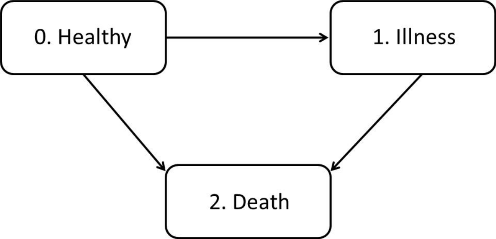
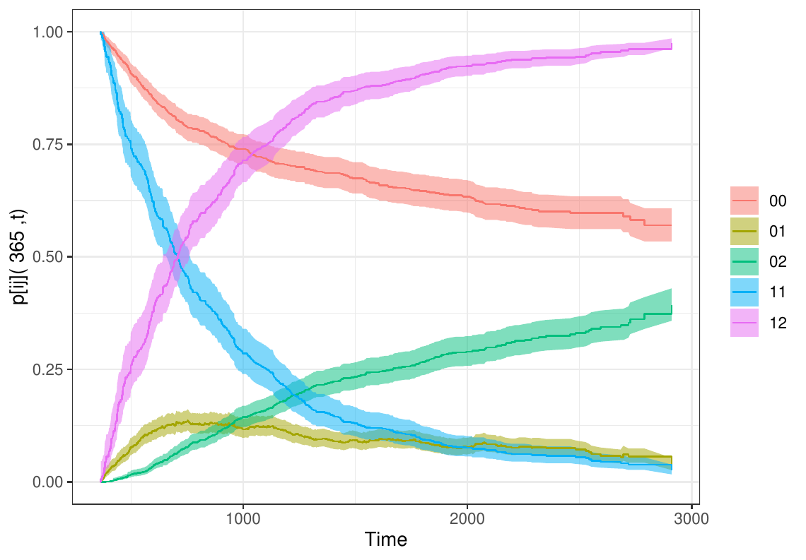
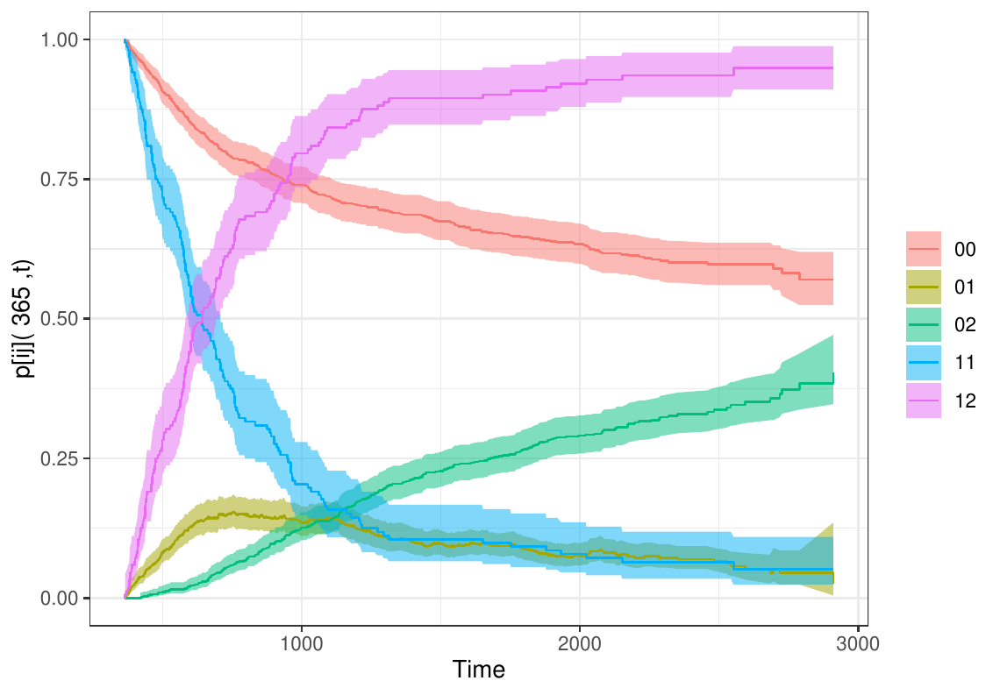

::: article
# Introduction {#intro}

Multi-state models are very useful for describing complex event history
data with multiple endpoints. These models may be considered a
generalization of survival analysis where survival is the ultimate
outcome of interest but where information is available about
intermediate events which individuals may experience during the study
period. For instance, in most biomedical applications, besides the
'healthy' initial state and the absorbing 'dead' state, one may observe
intermediate (transient) states based on health conditions (e.g.,
diseased), disease stages (e.g., stages of cancer or HIV infection),
clinical symptoms (e.g., bleeding episodes), biological markers (e.g.,
CD4 T-lymphocyte cell counts; serum immunoglobulin levels), or they can
represent a non-fatal complication in the course of the illness (e.g.,
cancer recurrence, transplantation, etc.). Graphically, these models may
be illustrated using diagrams with boxes representing the states and
with arrows between the states representing the possible transitions.
The complexity of the multi-state model greatly depends on the number of
states and also on the possible transitions. The illness-death model is
probably the most popular one in the medical literature. The
irreversible version of this model (Figure [1](#fig1)) describes the
pathway from an initial state to an absorbing state either directly or
through an intermediate state. Many event-history data sets from
biomedical studies with multiple endpoints can be reduced to this
generic structure. There exists extensive literature on multi-state
models. Main contributions include books by @Andersen1993 and
@Hougaard2000 (Chapter 5 and 6). Recent reviews on this topic may be
found in the papers by @Putter2007, @MM2009, and @MM-BIOM2018.

{#fig1
width="100%" alt="graphic without alt text"}

One important goal in multi-state modeling is to relate the individual
characteristics with the intensity rates through a covariate vector, but
biomedical researchers are also interested in reporting interpretable
results in a simple and summarized manner. These include estimates of
predictive probabilities, such as the transition probabilities,
occupation probabilities, cumulative incidence functions, and the
sojourn time distributions. The development of
[*survidm*](https://CRAN.R-project.org/package=survidm) R package has
been motivated by several recent contributions that account for these
problems; in particular the newly developed methods based on subsampling
(see @MM-BIOM2018 for further details). The current version of the
package provides seven different approaches to estimate the transition
probabilities, two methods for the sojourn distributions and two
approaches for the cumulative incidence functions. In addition, these
probabilities can also be estimated conditionally on covariate measures.
The package also allows the user to perform multi-state regression where
the estimation of the covariate effects is achieved using Cox regression
in which different effects of the covariates are assumed for different
transitions.

Several researchers have recently developed software for multi-state
survival analysis. A comprehensive list of the available packages in the
Comprehensive R Archive Network (CRAN) can be seen in the CRAN task view
'Survival Analysis' [@Allignol2018]. In R, several packages provide
functions for estimating the transition probabilities (e.g., the package
[*p3state.msm*](https://CRAN.R-project.org/package=p3state.msm)
[@MM-RP2011], [*TPmsm*](https://CRAN.R-project.org/package=TPmsm)
[@AraujoMM2014], [*etm*](https://CRAN.R-project.org/package=etm)
[@Allignol2011], [*mstate*](https://CRAN.R-project.org/package=mstate)
[@Wreede], and [*TP.idm*](https://CRAN.R-project.org/package=TP.idm)
[@Balboa2018]), but none implements all the methods addressed by
[*survidm*](https://CRAN.R-project.org/package=survidm) which includes
all newly developed methods based on the subsampling approach (see
@AlvarezMM2015 and references therein). In addition, not all allow the
users to obtain estimates of the transition probabilities conditional to
covariates. The [*cmprsk*](https://CRAN.R-project.org/package=cmprsk)
and the [*timereg*](https://CRAN.R-project.org/package=timereg) R
packages can be used to estimate the cumulative incidence functions in a
competing risks model. The package survival (via `survfit` and `coxph`
functions) can also be used for competing risks data. The
[*msSurv*](https://CRAN.R-project.org/package=msSurv) can be used to
estimate the state occupation probabilities and the sojourn
distributions for multi-state models subject to right-censoring
(possibly state-dependent) and left-truncation. The package also
provides matrices of transition probabilities between any two states.
However, none of the available software provides an encompassing package
which can be used to estimate all these quantities. Finally, the use of
different packages for estimating these quantities separately is rather
difficult because each of the current programs requests its own data
structure. This paper introduces
[*survidm*](https://CRAN.R-project.org/package=survidm) (available from
the Comprehensive R Archive Network at
<https://cran.r-project.org/web/packages/survidm/>), a software
application for R which performs inference in a progressive
illness-death model. It describes the capabilities of the program for
estimating semiparametric regression models and for implementing
nonparametric estimators for all quantities mentioned above.

The remainder of this paper is organized as follows. The following
section provides a brief introduction to the methodological background.
Then, a detailed description of the package is presented, and its usage
is illustrated through the analysis of a real data set. Finally, the
last section contains the main conclusions of this work.

# Methodology background {#not}

The mathematical background underlying the
[*survidm*](https://CRAN.R-project.org/package=survidm) package is
briefly introduced in this section. A more detailed introduction can be
found in @MM-BIOM2018. The present contribution builds on this article
by offering guidelines for using the software to implement the proposed
methods.

## Notation

A multi-state model is a model for a time-continuous stochastic process
$(Y(t),t\geq 0)$ which at any time occupies one of a few possible
states. In this paper, we consider the progressive illness-death model
depicted in Figure [1](#fig1), and we assume that states are numbered as
$0-healthy$, $1-illness$, and $2-death$. We also assume that all
subjects enter the study in State 0 and that they may either visit State
1 at some time point; or not, going directly to the absorbing state
(State 2).

This model is characterized by the joint distribution of $(Z,T)$, where
$Z$ denotes the sojourn time in the initial State 0, and $T$ is the
total survival time of the process. As usual with survival data,
individuals are generally followed over a certain period of time,
providing right-censored observations which are modeled by considering a
censoring variable $C$, which we assume to be independent of of $(Z,T)$.
Due to censoring, rather than $(Z,T)$, we observe
$\widetilde Z=\min(Z,C)$, $\widetilde T=\min(T,C)$,
$\Delta_1=I(Z\leq C)$, and $\Delta =I(T\leq C)$ for the respective
censoring indicators of $Z$ and $T$. Finally, the available data is
$(\widetilde Z_i,\widetilde T_i,\Delta_{1i},\Delta_i)$, $1\leq i\leq n$,
i.i.d. copies of $(\widetilde Z,\widetilde T,\Delta_1,\Delta)$.

## Regression models for transitions intensities

One important goal in multi-state modeling is to study the relationships
between the different predictors and the outcome. To relate the
individual characteristics to the intensity rates, several models have
been used in the literature. A common simplifying strategy is to
decouple the whole process into various survival models by fitting
separate intensities to all permitted transitions using semiparametric
Cox proportional hazard regression models (Cox, 1972), while making
appropriate adjustments to the risk set. The most common models are
characterized through one of the two model assumptions that can be made
about the dependence of the transition intensities and time. The
transition intensities may be modeled using separated Cox models
assuming the process to be Markovian (also known as the clock forward
modeling approach), which states that past and future are independent
given the present state. They can also be modeled using a semi-Markov
model in which the future of the process does not depend on the current
time but rather on the duration in the current state. Semi-Markov models
are also called 'clock reset' models because each time the patient
enters a new state, the time is reset to 0. The package
[*survidm*](https://CRAN.R-project.org/package=survidm) is restricted to
these two semiparametric multi-state models, but other models are
possible for the analysis of multi-state survival data. For example,
time-homogeneous markov models and model with piecewise constant
intensities are implemented in the
[*msm*](https://CRAN.R-project.org/package=msm) R package
[@Jackson2011]. Aalen additive model [@Aalen2001] and accelerated
failure time models [@Wei1992] are another class of regression models
that can be an alternative to the Cox proportional hazards model.

## Transition probabilities

For two states $h$, $j$ and two time points $s < t$, the so-called
transition probabilities $p_{hj}(s,t)=P(Y(t)=j|Y(s)=h)$ are introduced.
In the progressive illness-death model, there are five different
transition probabilities to estimate: $p_{00}(s,t)$, $p_{01}(s,t)$,
$p_{02}(s,t)$, $p_{11}(s,t)$, and $p_{12}(s,t)$. Since
$p_{00}(s,t)+p_{01}(s,t)+p_{02}(s,t)=1$ and $p_{11}(s,t)+p_{12}(s,t)=1$,
in practice, one only needs to estimate three of these quantities. The
state occupation probabilities are defined as $p_j(t)=P(Y(t)=j)$. If we
assume that all subjects are in State 0 at time $t=0$, then
$p_j(t)=p_{0j}(0,t)$ and, therefore, the occupation probabilities can be
seen as a particular case of the transition probabilities. Estimating
these quantities is interesting since they allow for long-term
predictions of the process.

The standard nonparametric method to estimate a transition probability
matrix is the time-honored Aalen-Johansen (`AJ`) estimator [@AJ1978].
This estimator benefits from the assumption of Markovianity on the
underlying stochastic process extending the time-honored Kaplan-Meier
estimator [@KM1958] to Markov chains. Explicit formulae of the
Aalen-Johansen estimator for the illness-death model are available
[@Borgan1988].

@Moreira2013 propose a modification of the Aalen-Johansen estimator in
the illness-death model based on a preliminary smoothing (also known as
presmoothing, @Dikta1998 [@Cao2005]) of the censoring probability for
the total time (respectively, of the sojourn time in State 0), given the
available information. The presmoothed Aalen-Johansen (PAJ) estimator
proposed by @Moreira2013 is obtained by replacing the censoring
indicators (in the transition probabilities $p_{00}(s, t)$ and
$p_{11}(s, t)$) by an estimator of a binary (logistic) regression
function. The authors verified through simulations that the use of
presmoothing can lead to improved estimators with less variability.

The Markov assumption may be violated in practice. For example, for the
progressive illness-death model, the arrival time to the intermediate
state of the process often influences the subsequent transition hazard,
leading to non-Markov structures. If the Markov property is violated,
then the consistency of the time-honored Aalen-Johansen estimator and of
its presmoothed versions can not be ensured in general. Exceptions to
this are the estimators for $p_{00}(s, t)$ or for the so-called
occupation probabilities, $p_{0j}(0, t)$ [@Datta2001].

Estimators for the transition probabilities in the progressive
illness-death model, which do not rely on the Markov assumption, were
introduced for the first time by @MM2006. The proposed estimators were
defined in terms of multivariate Kaplan-Meier integrals with respect to
the marginal distributions of $Z$ and $T$. These authors showed the
practical superiority of their estimators relative to the Aalen-Johansen
in situations in which the Markov condition is strongly violated.
However, their proposal has the drawback of requiring that the support
of the censoring distribution contains the support of the lifetime
distribution. Otherwise, they only report valid estimators for truncated
transition probabilities. To avoid this issue, corrected estimators
(labeled in this paper as `LIDA`, the acronym of Lifetime Data Analysis,
the journal in which this estimator was published for the first time)
were proposed by @AlvarezMM2015 for $p_{01}(s,t)$ and $p_{11}(s,t)$.

The paper by @AlvarezMM2015 also introduces estimators based on
subsampling. The idea behind subsampling, also referred to as
landmarking [@Houwelingen2007], is to consider the subset of individuals
observed in State $h$ by time $s$. To be specific, given the time point
$s$, to estimate $p_{0j}(s,t)$ for $j=0,1,2,$ the landmark analysis is
restricted to the individuals observed in State 0 at time $s$. Whereas,
to estimate $p_{1j}(s,t)$, $j=1,2$, the landmark analysis proceeds from
the sample restricted to the individuals observed in State 1 at time
$s$. The procedure is then based on (differences between) Kaplan-Meier
estimators derived from these subsets of the data. These estimators are
termed `LM` in the present paper as well as in the
[*survidm*](https://CRAN.R-project.org/package=survidm) package.

In some cases, subsampling leads to small sample sizes which may result
in estimators with high variability. To avoid this problem, a valid
approach is to consider a modification of the landmark estimator based
on presmoothing [@MM-SORT2016]. The presmoothed landmark estimators
(`PLM`) are a good alternative in these situations since they give mass
to all the event times, including the censored observations.

Subsampling was later used by @PutterSpitoni2018 to derive a landmark
Aalen-Johansen estimator (`LMAJ`) of the transition probabilities. The
idea behind the proposed estimator is to use the Aalen-Johansen
estimator of the state occupation probabilities derived from those
subsets (consisting of subjects occupying a given state at a particular
time) for which consistency have already been proved in multi-state
models that are not necessarily Markov [@Datta2001]. In this latter
approach, the application of presmoothed estimators (`PLMAJ`) is
possible too.

Also of interest is the estimation of the transition probabilities given
a covariate (or a vector of covariates) that is observed for an
individual before the individual makes a particular transition of
interest. One standard method, particularly well-suited to the setting
with multiple covariates, is to consider estimators based on a Cox's
regression model [@Cox1972] fitted marginally to each transition with
the corresponding baseline hazard function estimated by the Breslow's
method [@Breslow1972]. One alternative and flexible nonparametric
approach is to consider local smoothing by means of kernel weights based
on local constant (Nadaraya-Watson) regression. Right censoring is
handled by applying inverse probability of censoring weighting. This is
a fully nonparametric approach which provides flexible effects of the
continuous covariates [@MM2015; @RodriguezMM2016; @MM-BIOM2018]. The two
possible approaches are implemented in the
[*survidm*](https://CRAN.R-project.org/package=survidm) package and
labeled as `breslow` and `IPCW`, respectively.

## Cumulative incidence functions

Another quantity of interest in multi-state modeling is the
cause-specific cumulative incidence function, as defined by
@Kalbfleisch2011. In the illness-death model, two cumulative incidence
functions are of particular interest: the cumulative incidence of the
illness and the cumulative incidence of dying without the disease. These
quantity represents the probability of an individual being or having
been diseased at time $t$. One possible estimator for the cause-specific
cumulative incidence function in a competing risks setting can be
performed using the estimator proposed by [@Geskus2011]. This estimator
based on the subdistribution hazard is obtained by applying the
Nelson-Aalen estimator and the product-limit estimator of the
disease-free survival. This estimator can also be expressed in terms of
the Kaplan-Meier weights of the distribution of $Z$, the sojourn time in
State 0, as introduced in the paper by @MM-BIOM2018. A modification of
this estimator based on presmoothing can be introduced to reduce its
variability. Both methods are implemented in the
[*survidm*](https://CRAN.R-project.org/package=survidm) package.
Estimation methods for the cumulative incidence function conditionally
on covariate measures based on local constant (Nadaraya-Watson)
regression are also implemented in the package.

## Sojourn distributions

The estimation of the marginal distributions in multi-state modeling is
an interesting topic too. In the context of the illness-death model, if
the independence assumption between the censoring variable $C$ and the
vector of times $(Z,T)$ is assumed, the marginal distribution of the
sojourn time in State 0, $Z$, can be consistently estimated by the
Kaplan-Meier estimator based on the $(\widetilde Z_i, \Delta_{1i})$'s.
Similarly, the distribution of the total time may be consistently
estimated by the Kaplan-Meier estimator based on the
$(\widetilde T_i, \Delta_{i})$'s. However, the estimation of the
marginal distribution of the sojourn time in State 1 is not such a
simple issue. Nonparametric estimates for this marginal distribution
allowing for state and path-dependent censoring were proposed by
@Satten2002.

# *survidm* in practice {#package}

This section introduces an overview of how the package is structured.

This software enables both numerical and graphical outputs to be
displayed for all methods described in the previous section. This
software is intended to be used with the R statistical program [@R]. Our
package is composed of 17 functions that allow users to obtain estimates
for all proposed methods. Details on the usage of the functions
(described in Table [1](#package:func)) can be obtained with the
corresponding help pages.

::: {#package:func}
  ------------------------------------------------------------------------------------------------------------------------------------------------------------------------------------------
  Function             Description
  -------------------- ---------------------------------------------------------------------------------------------------------------------------------------------------------------------
  `survIDM`            Create a `survIDM` object.

  `coxidm`             Fits proportional hazards regression models for each transition.

  `tprob`              Estimation of the transition probabilities.

  `CIF`                Estimation of the cumulative incidence functions.

  `sojourn`            Nonparametric estimation of the sojourn distribution in the intermediate state.

  `autoplot.survIDM`   Visualization of `survIDM` objects with [*ggplot2*](https://CRAN.R-project.org/package=ggplot2) and [*plotly*](https://CRAN.R-project.org/package=plotly) graphics.

  `plot.survIDM`       Plot for an object of class `survIDM`.

  `print.survIDM`      Print for an object of class `survIDM`.

  `summary.survIDM`    Summary for an object of class `survIDM`.

  `nevents`            Counts the number of observed transitions in the multi-state model.

  `markov.test`        Performs a test for the Markov assumption.

  `KM`                 Computes the Kaplan-Meier product-limit of survival.

  `PKM`                Computes the presmoothed Kaplan-Meier product-limit of survival.

  `Beran`              Computes the conditional survival probability of the response, given the covariate under random censoring.

  `KMW`                Returns a vector with the Kaplan-Meier weights.

  `PKMW`               Returns a vector with the presmoothed Kaplan-Meier weights.

  `LLW`                Returns a vector with the local linear weights.

  `NWW`                Returns a vector with the Nadaraya-Watson weights.
  ------------------------------------------------------------------------------------------------------------------------------------------------------------------------------------------

  : Table 1: Summary of functions in the *survidm* package.
:::

It should be noted that to implement the methods described in the
methodology section, one needs the following variables of data: `time1`,
`event1`, `Stime`, and `event`. Covariates can also be included. The
variable `time1` represents the sojourn time in State 0 and `Stime` the
total time, whereas `event1` and `event` are the respective censoring
indicators. This means that `event1` will take the value 1 if the
subject leaves State 0 and 0 otherwise; `event` takes value 1 if the
subject reaches State 2 and 0 otherwise.

For illustration, we apply the proposed methods to data from a large
clinical trial on Duke's stage III patients affected by colon cancer
that underwent a curative surgery for colorectal cancer [@Moertel1990].
This data set is freely available as part of the R
[*survival*](https://CRAN.R-project.org/package=survival) package. The
data is also available as part of the R package
[*survidm*](https://CRAN.R-project.org/package=survidm). Besides the two
event times (disease-free survival time and death time) and the
corresponding indicator statuses, a vector of covariates including rx
(treatment: Obs(ervation), Lev(amisole), Lev(amisole)+5FU), sex (1 -
male), age (years), nodes (number of lymph nodes with detectable
cancer), surge (time from surgery to registration: 0 = short, 1 = long),
adhere (adherence to nearby organs) are also available. The covariate
'recurrence' is the only time-dependent covariate, while the other
covariates included are fixed. Recurrence can be considered as an
intermediate transient state and modeled using the progressive
illness-death model with transient states 'alive and disease-free' and
'alive with recurrence', and the absorbing state 'dead'. In the
following, we will demonstrate the package capabilities using this data.
Below is an excerpt of the data.frame with one row per individual.
Individuals were chosen in order to represent all possible combinations
of movements among the three states.

``` r
> library("survidm")
> data(colonIDM)
> colonIDM[c(1:2,16,21),1:7]

   time1 event1 Stime event      rx sex age
1    968      1  1521     1 Lev+5FU   1  43
2   3087      0  3087     0 Lev+5FU   1  63
16  1323      1  3214     0     Obs   1  68
21  2789      1  2789     1     Obs   1  64
```

Individual represented in the first line experienced a recurrence of the
tumor and have died. In such cases, `event1` = 1 and `time1` = `Stime`
indicate that the individual observed a direct transition from State 0
to State 1 (with `event1` = 1). Individual represented in line 2 remain
alive and without recurrence at the end of follow-up (`event1` = 0 and
`event` = 0). Individual represented in line 16 of the original data
set, with `event1 = 1` and `event = 0`, corresponds to an individual
with an observed recurrence that remains alive at the end of the
follow-up. Note that in this case, the disease-free survival time is
equal to the death time (`time1` = `Stime`). Finally, individual
represented in line 21 of the original data set has died without
observing a recurrence. We note that `event1 = 1` and `event = 0`
correspond to individuals with an observed recurrence that remain alive
at the end of the follow-up.

Of the total of 929 patients, 468 developed a recurrence, and among
these 414 died, 38 patients died without developing a recurrence. A
summary of the data with the number of the undergoing transitions can be
obtained through the `nevents` function. The colums of the data set must
include at least the four columns named `time1`, `event1`, `Stime`, and
`event` according to the requirements of the `survIDM` function
presented in the help file. Parameter `state.names` enables to change
the default values of states, 'healthy', 'illness', and 'death'.

``` r
> nevents(with(colonIDM, survIDM(time1, event1, Stime, event)),
          state.names = c("healthy", "recurrence", "death"))

           healthy recurrence death
healthy        423        468    38
recurrence       0         54   414
death            0          0   452
```

## Regression models for transitions intensities

To relate the individual characteristics to the intensity rates,
semiparametric multi-state regression models are used. Specifically,
separated Cox models assuming the process to be Markovian (i.e., the
transition intensities only depend on the history of the process through
the current state) or using a semi-Markov model in which the future of
the process does not depend on the current time but rather on the
duration in the current state. Therefore, practical interest to
determine whether the Markov property holds within a particular data set
to determine whether a Markov model or a semi-Markov model is more
appropriate.

### The Markov assumption

The Markov assumption may be checked, among others, by including
covariates depending on the history. For the progressive illness-death
model, the Markov assumption is only relevant for mortality transition
after recurrence. We can examine whether the time spent in the initial
state \"Alive and disease-free\" (i.e., the past) is important in the
transition from the recurrence state to death (i.e., the future). For
doing that, let $Z$ be the time spent in State 0 and $t$ the current
time. Fitting a model
$\alpha_{12} (t; Z) = \alpha_{12,0} (t) exp\{\beta Z\}$, we now need to
test the null hypothesis, $H_0 : \beta=0$, against the general
alternative, $H_1 : \beta \neq 0$. This would assess the assumption that
the transition rate from the disease state into death is unaffected by
the time spent in the previous state.

``` r
> library(survival)
> fit <- coxph(Surv(time1, Stime, event) ~ time1, data = colonIDM,
               subset=c(time1 < Stime))
> fit
            coef  exp(coef)   se(coef)      z     p
time1 -0.0002475  0.9997526  0.0001737 -1.424 0.154

Likelihood ratio test=2.04  on 1 df, p=0.1533
n= 468, number of events= 414 
```

Following this procedure, we verified that the effect of time spent in
State 0 reported a *p*-value of 0.154 (regression coefficient: -
0.0002475), revealing no evidence against the Markov model for the colon
data. Results from this test can also be obtained through the function
`markov.test`, which has an output fairly similar to those obtained from
`coxph` function.

``` r
> mk <- markov.test(survIDM(time1, event1, Stime, event) ~ 1, data = colonIDM)
> mk
```

Since there is no evidence on the lack of Markovianity, a multi-state
Markov regression model based on the Cox model can be fitted through the
following input command:

``` r
> fit.cmm <- coxidm(survIDM(time1, event1, Stime, event) ~ rx + sex + age +
                    nodes + surg + adhere, data = colonIDM)

> summary(fit.cmm)

Cox Markov Model: transition 0 -> 1 

                  coef exp(coef) lower 0.95 upper 0.95     Pr(>|z|)
rxLev     -0.061251858 0.9405863  0.7596976  1.1645457 5.740592e-01
rxLev+5FU -0.515170844 0.5973985  0.4713678  0.7571264 2.031682e-05
sex       -0.149177218 0.8614164  0.7160077  1.0363552 1.137849e-01
age       -0.004669254 0.9953416  0.9876802  1.0030625 2.362711e-01
nodes      0.083943790 1.0875678  1.0686993  1.1067694 5.418662e-21
surg       0.251798521 1.2863368  1.0509673  1.5744186 1.460249e-02
adhere     0.296839791 1.3455997  1.0551768  1.7159575 1.671466e-02


Cox Markov Model: transition 0 -> 2 

                 coef exp(coef) lower 0.95 upper 0.95     Pr(>|z|)
rxLev     -0.29152482 0.7471235  0.3271685   1.706135 4.889711e-01
rxLev+5FU -0.11211853 0.8939383  0.4220165   1.893589 7.697006e-01
sex        0.39293182 1.4813174  0.7641923   2.871399 2.445966e-01
age        0.08422764 1.0878765  1.0476871   1.129608 1.157046e-05
nodes      0.07538428 1.0782984  0.9895116   1.175052 8.552937e-02
surg       0.41564547 1.5153485  0.7703441   2.980851 2.285509e-01
adhere     0.05435239 1.0558566  0.4377875   2.546517 9.036879e-01


Cox Markov Model: transition 1 -> 2 

                  coef exp(coef) lower 0.95 upper 0.95     Pr(>|z|)
rxLev      0.068953592  1.071386  0.8533466   1.345138 5.525534e-01
rxLev+5FU  0.327043851  1.386862  1.0741245   1.790656 1.212756e-02
sex        0.214094887  1.238740  1.0138220   1.513557 3.623833e-02
age        0.009342474  1.009386  1.0014760   1.017359 1.994502e-02
nodes      0.046061552  1.047139  1.0249376   1.069821 2.522475e-05
surg      -0.012258877  0.987816  0.7944594   1.228232 9.121722e-01
adhere     0.137708158  1.147641  0.8851963   1.487895 2.985854e-01
```

The transition intensities characterize the hazard for movement from one
state to another, revealing how the different covariates affect the
various permitted transitions. The results obtained indicate that none
of the covariates were found to have a strong effect on all three
transitions. Save for covariates age and sex, all the remaining
predictors were considered important for recurrence transition.
Interestingly, age displayed a strong linear effect on mortality
transition without recurrence, whereas all the other covariates failed
to show relevant association on this transition. Finally, save for
covariates surg and adhere, all the remaining predictors were considered
important for the mortality transition after recurrence. The `coxidm`
function also returns the analysis of the deviance for each Cox model.
In this case, only an overall *p*-value is presented for categorical
variables. To obtain the outputs, we have to indicate `type`='anova' in
`summary` function.

``` r
> summary(fit.cmm,type = 'anova')

Cox Markov Model: transition 0 -> 1 

        loglik   Chisq Df Pr(>|Chi|)    
NULL   -2954.2                          
rx     -2941.8 24.6964  2  4.338e-06 ***
sex    -2941.0  1.6402  1    0.20030    
age    -2939.8  2.3435  1    0.12581    
nodes  -2909.0 61.6050  1  4.198e-15 ***
surg   -2906.2  5.7134  1    0.01684 *  
adhere -2903.5  5.3740  1    0.02044 *  
---
Signif. codes:  0 ‘***’ 0.001 ‘**’ 0.01 ‘*’ 0.05 ‘.’ 0.1 ‘ ’ 1


Cox Markov Model: transition 0 -> 2 


        loglik   Chisq Df Pr(>|Chi|)    
NULL   -231.79                          
rx     -231.54  0.4938  2     0.7812    
sex    -231.04  1.0065  1     0.3158    
age    -219.26 23.5445  1  1.221e-06 ***
nodes  -218.04  2.4536  1     0.1173    
surg   -217.35  1.3830  1     0.2396    
adhere -217.34  0.0145  1     0.9043    
---
Signif. codes:  0 ‘***’ 0.001 ‘**’ 0.01 ‘*’ 0.05 ‘.’ 0.1 ‘ ’ 1


Cox Markov Model: transition 1 -> 2 


        loglik   Chisq Df Pr(>|Chi|)    
NULL   -1897.5                          
rx     -1895.0  4.8864  2  0.0868804 .  
sex    -1892.8  4.3995  1  0.0359501 *  
age    -1890.8  4.0650  1  0.0437799 *  
nodes  -1883.4 14.7205  1  0.0001247 ***
surg   -1883.4  0.0090  1  0.9242629    
adhere -1882.9  1.0505  1  0.3054007    
---
Signif. codes:  0 ‘***’ 0.001 ‘**’ 0.01 ‘*’ 0.05 ‘.’ 0.1 ‘ ’ 1
```

The effect of the continuous covariates on the log hazards is often
assumed to have a linear functional form in all intensities. To
introduce flexibility into the Cox Markov model, several smoothing
methods may be applied, but P-splines [@Eilers1996] are being most
frequently considered in this context. Results showed a strong nonlinear
effect for nodes (checked through a formal test) when using a Cox model
on the recurrence transition. Figure  [2](#fig2) returns a centered set
of predictions on a log hazard scale. The average predicted value is
zero with a mean value of nodes as the reference (see the vignette
'Splines, plots, and interactions' in [@survival-package]). The main
curve depicts the smooth curve for nodes on a log hazard scale,
indicating that the risk of recurrence increases rapidly until about 6
nodes. The apparent decrease after 23 nodes is not significant due to
the wide confidence intervals.

``` r

> library(ggplot2)
> library(plotly)

> fit2.cmm <- coxidm(survIDM(time1, event1, Stime, event) ~ rx + sex + age +
                  pspline(nodes) + surg + adhere, data = colonIDM)


> d<-data.frame(x=fit2.cmm$term01$nodes$x, y=fit2.cmm$term01$nodes$y,
                y1=fit2.cmm$term01$nodes$y-1.96*fit2.cmm$term01$nodes$se,
                y2=fit2.cmm$term01$nodes$y+1.96*fit2.cmm$term01$nodes$se)

> nonlinear<-ggplot(d, aes(x,y))+theme(axis.text=element_text(size=13))+
             theme_bw()+labs(x = "nodes") +
             labs(y = "Partial for pspline(nodes)")+
             geom_ribbon(aes(ymin=y1,ymax=y2),fill='gray92',alpha=0.9)+
             geom_line(aes(x,y))+
             geom_line(color=1,size=1)

> ggplotly(nonlinear)
```

{#fig2 width="100%"
alt="graphic without alt text"}

The proportional hazards assumption can be tested formally using the
`summary` function. The output can be obtained putting `type=’ph’` in
`summary` function.

``` r
> summary(fit2.cmm, type = 'ph')

Cox Markov Model: transition 0 -> 1 
Test the Proportional Hazards Assumption 

                  chisq   df    p
rx             4.12e-01 2.00 0.81
sex            2.10e+00 1.00 0.15
age            9.37e-04 1.00 0.98
pspline(nodes) 7.60e+00 3.95 0.10
surg           1.97e+00 1.00 0.16
adhere         6.13e-01 1.00 0.43
GLOBAL         1.30e+01 9.94 0.22


Cox Markov Model: transition 0 -> 2 
Test the Proportional Hazards Assumption 

                chisq   df    p
rx             1.6292 2.00 0.44
sex            0.0668 1.00 0.80
age            0.8396 1.00 0.36
pspline(nodes) 0.7859 4.00 0.94
surg           0.4955 1.00 0.48
adhere         2.3606 1.00 0.12
GLOBAL         6.1424 9.99 0.80


Cox Markov Model: transition 1 -> 2 
Test the Proportional Hazards Assumption 

                  chisq    df    p
rx              5.03913  1.99 0.08
sex             0.02204  1.00 0.88
age             0.73628  1.00 0.39
pspline(nodes)  4.25500  4.09 0.39
surg            2.02427  1.00 0.15
adhere          0.00177  1.00 0.97
GLOBAL         13.19170 10.08 0.22
```

A semi-Markov model could be obtained by including the argument
`semiMarkov = TRUE` in the `coxidm` function.

## Occupation probabilities and transition probabilities

The occupation probabilities and the transition probabilities are key
quantities of interest in multi-state models. They offer interpretable
results in a simple and summarized manner.

Estimates and plots of the transition probabilities for all methods
introduced in Section [2](#not) can be obtained using the `tprob`
function. The default method is the Aalen-Johansen estimator (`AJ`)
which assumes the process to be Markovian. The presmoothed version of
the Aalen-Johansen estimator (`PAJ`) also assumes the process to be
Markovian while the remaining methods (`LIDA`, `LM`, `PLM`, `LMAJ`, and
`PLMAJ`) are free of the Markov condition.

When one is confident of the Markov assumption, the Aalen-Johansen is
preferred over the non-Markovian estimators since it reports a smaller
variance in estimation. Estimates and plot for the Aalen-Johansen method
can be obtained through the following input commands:

``` r
> tpAJ <- tprob(survIDM(time1, event1, Stime, event) ~ 1, s = 365,
                method = "AJ", conf = TRUE, data = colonIDM)

> summary(tpAJ, times=365*2:6)

Estimation of pij(s=365,t) 

    t        00        01        02        11        12
  730 0.7966309 0.1300071 0.0733620 0.4686360 0.5313640
 1095 0.7192603 0.1224599 0.1582799 0.2533822 0.7466178
 1460 0.6805333 0.0884287 0.2310380 0.1335300 0.8664700
 1825 0.6444157 0.0859123 0.2696720 0.0932851 0.9067149
 2190 0.6131533 0.0774912 0.3093556 0.0632835 0.9367165

2.5%

    t        00        01        02        11        12
  730 0.7673408 0.1093487 0.0589350 0.4105298 0.4728114
 1095 0.6867036 0.1026150 0.1354061 0.2105314 0.7011204
 1460 0.6468259 0.0714743 0.2030840 0.1047501 0.8346547
 1825 0.6098804 0.0688614 0.2396632 0.0708282 0.8813846
 2190 0.5780541 0.0612090 0.2777007 0.0464018 0.9172849

97.5%

    t        00        01        02        11        12
  730 0.8270390 0.1545683 0.0913208 0.5349666 0.5971676
 1095 0.7533604 0.1461425 0.1850177 0.3049547 0.7950677
 1460 0.7159973 0.1094050 0.2628397 0.1702170 0.8994981
 1825 0.6809066 0.1071852 0.3034384 0.1228620 0.9327733
 2190 0.6503836 0.0981045 0.3446188 0.0863070 0.9565597

> autoplot(tpAJ)
```

Besides being consistent regardless the Markov condition, the landmark
non-Markov estimators (`LM`, `PLM`, `LMAJ`, and `PLMAJ`) can be
preferable in many situations due to their greater accuracy (smaller
bias). When comparing the original nonparametric landmark estimator
(`LM`) and the Aalen-Johansen estimator, some discrepancies are observed
for $t=730$ and $t=1095$ (2 and 3 years, respectively). In addition to
the aforementioned discrepancy between the two estimates, the plots for
the two methods (Figure [3](#fig3)) also show that the confidence bands
are narrower in the case of the Aalen-Johansen, revealing less
variability for this method.

``` r
> tpLM <- tprob(survIDM(time1, event1, Stime, event) ~ 1, s = 365,
               method = "LM", conf = TRUE, data = colonIDM)

> summary(tpLM, times=365*2:6)

Estimation of pij(s=365,t) 

    t        00         01        02         11        12
  730 0.7966309 0.14750103 0.0558681 0.38815789 0.6118421
 1095 0.7192603 0.14320925 0.1375305 0.15789474 0.8421053
 1460 0.6805333 0.09446864 0.2249981 0.10526316 0.8947368
 1825 0.6444157 0.08583643 0.2697479 0.09210526 0.9078947
 2190 0.6131533 0.07465238 0.3121944 0.06432749 0.9356725

2.5%

    t        00         01        02         11        12
  730 0.7673274 0.12294665 0.0411836 0.31792669 0.5390734
 1095 0.6866872 0.12033558 0.1142137 0.10937624 0.7860868
 1460 0.6468058 0.07447488 0.1960521 0.06621973 0.8472552
 1825 0.6098421 0.06804756 0.2387239 0.05591405 0.8630680
 2190 0.5777125 0.05742370 0.2791810 0.03480413 0.8969820

97.5%

    t        00         01         02        11        12
  730 0.8270534 0.17695930 0.07578852 0.4739034 0.6944337
 1095 0.7533784 0.17043081 0.16560740 0.2279357 0.9021157
 1460 0.7160195 0.11982998 0.25821767 0.1673268 0.9448794
 1825 0.6809493 0.10827565 0.30480372 0.1517218 0.9550498
 2190 0.6507682 0.09705015 0.34911161 0.1188947 0.9760319

> autoplot(tpLM)
```

<figure id="fig3">
<p></p>
<figcaption>Figure 3: Transition probability estimates using the
<code>AJ</code> (left hand side) and <code>LM</code> (right hand side)
method, using the colon cancer data.</figcaption>
</figure>

Since the landmark estimators of the transition probabilities are free
of the Markov assumption, they can also be used to introduce such tests
(at least in the scope of the illness-death model) by measuring their
discrepancy to Markovian estimators. The function `markov.test` performs
a local graphical test for the Markov condition. This graphical test is
based on a PP-plot which compares the estimations reported by the
Aalen-Johansen transition probabilities to their non-Markov
counterparts. The corresponding plot for a local test of Markovianity
($s=365$) can be obtained through the following input command:

``` r
> mk <- markov.test(survIDM(time1, event1, Stime, event) ~ 1, s = 365, data = colonIDM)
> autoplot(mk)
```

The plot shown in Figure [4](#fig4) compares the Aalen-Johansen
estimator and the landmark non-Markovian estimator for $p_{01}(s, t)$,
$p_{02}(s, t)$, and $p_{12}(s, t)$, for $s = 365$. Existing deviations
of the plots with respect to the straight line $y = x$ reveals some
evidence on the lack of Markovianity of the underlying process beyond
one year after surgery. For further illustration, this figure jointly
displays the landmark non-Markovian estimator and the Aalen-Johansen
estimator for $p_{12}(s=365, t)$. In this plot, the differences between
both estimators are clearly seen. Thus, in principle, the application of
the Aalen-Johansen method is not recommended here due to possible
biases.

{#fig4 width="100%" alt="graphic without alt text"}

The variability of the nonparametric landmark estimator (`LM`) may be
successfully reduced using presmoothing ideas [@Dikta1998; @Cao2005].
The presmoothed landmark estimator is implemented in the same function
through the method `PLM`. The same ideas can be used to reduce the
variability of the Markovian Aalen-Johansen estimator and the
(non-Markov) Landmark Aalen-Johansen estimator through methods `PAJ` and
`PLMAJ`, respectively.

The package [*survidm*](https://CRAN.R-project.org/package=survidm) also
allows for the computation of the above quantities conditional on
covariates that are observed for an individual before the individual
makes a particular transition of interest. For continuous covariates,
one possible and flexible nonparametric approach is to consider local
smoothing by means of kernel weights based on local constant
(Nadaraya-Watson: `NW`) regression. This estimator is implemented in our
package through function `tprob` using the `method = IPCW`. Below are
the input commands to obtain the estimates of the transition
probabilities at time $s=365$ for an individual of 48 years old. For the
bandwidth in the estimator, we use `dpik` function, which is available
from the R [*KernSmooth*](https://CRAN.R-project.org/package=KernSmooth)
package. This is the data-based bandwidth selector of @WandJones1995.

``` r
> tpIPCW.age <- tprob(survIDM(time1, event1, Stime, event) ~ age, s = 365,
                method = "IPCW", z.value = 48, conf = FALSE, data = colonIDM,
                bw = "dpik", window = "gaussian", method.weights = "NW")

> summary(tpIPCW.age, time=365*2:6)

Estimation of pij(s=365,t) 

    t        00        01         02         11        12
  730 0.7662208 0.1921290 0.04165012 0.28946129 0.7105387
 1095 0.7308496 0.1688189 0.10033149 0.12631010 0.8736899
 1460 0.6980293 0.1088373 0.19313342 0.05905711 0.9409429
 1825 0.6310625 0.1186104 0.25032706 0.05903929 0.9409607
 2190 0.6157095 0.1051797 0.27911080 0.04035816 0.9596418

> autoplot(tpIPCW.age)
```

{#fig6 width="100%"
alt="graphic without alt text"}

The curves depicted in Figure [5](#fig6), which are purely
nonparametric, enable flexible modeling of the data providing flexible
and robust effects of the covariate that can be used at least as a
preliminary attempt, providing insights on the data being analyzed. Such
methods can be used to capture nonstandard data features that may not be
detected through parametric or semiparametric proposals. A general
problem in multivariate nonparametric regression estimation is the
so-called curse of dimensionality. In higher dimensions, the
observations are sparsely distributed even for large sample sizes.
Consequently, estimators based on local averaging (like those based on
kernel smoothing) perform unsatisfactorily in this situation.

An alternative method is to consider estimators based on Cox's
regression model [@Cox1972] fitted marginally to each transition with
the corresponding baseline hazard function estimated by Breslow's method
[@Breslow1972]. The following input commands illustrate the use of the
`tprob` function in this context:

``` r
> tp.breslow.age <- tprob(survIDM(time1, event1, Stime, event) ~ age, s = 365,
                    method = "breslow", z.value = 48, conf = FALSE, data = colonIDM)

> summary(tp.breslow.age, time=365*2:6)

Estimation of pij(s=365,t)

    t        00         01         02         11        12
  730 0.7970855 0.15020199 0.05271253 0.37528949 0.6247105
 1095 0.7198657 0.14999685 0.13013746 0.14814634 0.8518537
 1460 0.6826444 0.10384005 0.21351550 0.09843946 0.9015605
 1825 0.6451532 0.09850122 0.25634562 0.08617378 0.9138262
 2190 0.6139465 0.08891388 0.29713961 0.06066618 0.9393338
```

Note that if the argument `z.value` is missing, then the `tprob`
function computes the predicted conditional transition probabilities at
the average values of the covariate. The Breslow method (based on the
Cox regression model) is particularly well-suited to the setting with
multiple covariates:

``` r
> tp.breslow <- tprob(survIDM(time1, event1, Stime, event) ~ rx + age + nodes, s = 365,
                method = "breslow", z.value = c('Obs', 50, 10), conf = FALSE, 
                data = colonIDM)

> summary(tp.breslow, time=365*2:6)

Estimation of pij(s=365,t)

    t        00        01        02         11        12
  730 0.6423398 0.24905912 0.1086010 0.30017412 0.6998259
 1095 0.5222992 0.21890332 0.2587975 0.09465150 0.9053485
 1460 0.4680828 0.12787851 0.4040387 0.05433167 0.9456683
 1825 0.4181094 0.10712224 0.4747684 0.04519157 0.9548084
 2190 0.3762996 0.08424903 0.5394514 0.02685212 0.9731479
```

## Cumulative Incidence Function

Another quantity of interest in multi-state modeling is the
cause-specific cumulative incidence of the illness (recurrence).
Function `CIF` can be used to obtain the nonparametric estimator of
@Geskus2011 (default method), which is equivalent to the classical
Aalen-Johansen estimator. The corresponding presmoothed version
(Meira-Machado and Sestelo, 2018) is also implemented through the
argument `presmooth = TRUE`:

``` r
> cif <- CIF(survIDM(time1, event1, Stime, event) ~ 1, data = colonIDM, conf = TRUE)
> summary(cif, time=365*1:6)

Estimation of CIF(t)
    t       CIF
  365 0.2378902
  730 0.3844412
 1095 0.4372663
 1460 0.4620841
 1825 0.4859813
 2190 0.5032043

2.5%

    t       CIF
  365 0.2088267
  730 0.3509039
 1095 0.4038141
 1460 0.4296740
 1825 0.4540347
 2190 0.4697608

97.5%

    t       CIF
  365 0.2616792
  730 0.4103338
 1095 0.4666664
 1460 0.4900876
 1825 0.5161684
 2190 0.5319749

> autoplot(cif, ylim=c(0, 0.6), confcol = 2)
```

{#fig7 width="100%" alt="graphic without alt text"}

Figure [6](#fig7) depicts the estimates of cumulative incidence function
for the recurrent state together with a 95% pointwise confidence bands
based on simple bootstrap that resamples each datum with probability
$1/n$. From this plot, it can be seen that individuals have a
probability of recurrence higher than 50%. This cumulative probability
is about 43% at three years after surgery.

Figure [7](#fig8) depicts the estimates of the (conditional) cumulative
incidence function for patients with 1 and 9 lymph nodes with detectable
cancer. Curves depicted in this figure, which are purely nonparametric,
indicate that patients with 9 lymph nodes with detectable cancer have a
considerably higher probability of recurrence. The corresponding input
commands are shown below:

``` r
> cif.1.nodes <- CIF(survIDM(time1, event1, Stime, event) ~ nodes, data = colonIDM,
           conf = FALSE, z.value = 1)
> cif.9.nodes <- CIF(survIDM(time1, event1, Stime, event) ~ nodes, data = colonIDM,
                   conf = FALSE, z.value = 9)

> d<-as.data.frame(cbind(rep(cif.1.nodes$est[,1],2),c(cif.1.nodes$est[,2], 
                 cif.9.nodes$est[,2]), c(rep("1 nodes", length(cif.1.nodes$est[,1])),
                 rep("9 nodes", length(cif.1.nodes$est[,2])))))
                 
> names(d)<-c('time','cif','type')

> cif<-ggplot(d, aes(x=as.numeric(time), y=as.numeric(cif),group=factor(type),
                  color=factor(type)))+theme_bw()+labs(x = 'Time (days)', 
                  y = 'CIF(t|nodes)')
> cif+geom_step(size=1)+ theme(legend.title=element_blank())
```

{#fig8 width="100%"}

## Sojourn distribution 

Another interesting quantity is the sojourn time in each state.
Estimates for the distribution function of the sojourn time in the
recurrence state can be obtained using the estimator by @Satten2002
through function `sojourn`.

``` r
> soj <- sojourn(survIDM(time1, event1, Stime, event) ~ 1,
               data = colonIDM, method = "Satten-Datta", conf = FALSE)
> summary(soj, time=365*1:6)

Estimation of sojourn(t)

    t   sojourn
  365 0.4852424
  730 0.7723636
 1095 0.8755021
 1460 0.8983714
 1825 0.9102335
 2190 0.9220849
```

The estimates for the distribution function of the sojourn time in the
recurrence state, corresponding to the time between entry in recurrence
and death, reveal that the distribution function increases to a value
near 49% and 78% for a time of one and two years, respectively,
revealing a high risk of death shortly after relapse.

The methods for implementing some of the proposed methods can be
computationally demanding. In particular, the use of bootstrap
resampling techniques is time-consuming process because it is necessary
to estimate the model a great number of times. In such cases, we
recommend the use of parallelization (`cluster = TRUE`). This should
considerably increase performance on multi-core/ multi-threading
machines.

# Conclusions

There has been several recent contributions for the inference in the
context of multi-state models. Many of these contributions were made for
the illness-death model. One important and perhaps undervalued aspect of
multi-state models is the possibility to apply them to obtain
predictions of the clinical prognosis. This is usually achieved using
estimates of the transition probabilities and survival estimates.
However, there are several other quantities that could also be used in
the analysis of these data, such as the state occupation probabilities,
the sojourn time distributions, and the cumulative incidence functions.
To provide the biomedical researchers with an easy-to-use tool for
obtaining predictive estimates for all these quantities, we develop an R
package called [*survidm*](https://CRAN.R-project.org/package=survidm).
This package can be used to implement several nonparametric and
semiparametric estimators for the transition probabilities. In addition,
estimators have also implemented that account for the influence of
covariates. Bootstrap confidence bands are provided for all methods. The
software can also be used to perform multi-state regression (using
type-specific Cox models).

One limitation of the
[*survidm*](https://CRAN.R-project.org/package=survidm) R package is
that it can only be used in the progressive illness-death model.
However, this turns out to be an advantage for those users that only
wish to analyze data from a progressive illness-death model. For such
cases, the [*survidm*](https://CRAN.R-project.org/package=survidm)
package is ideal since it is user-friendly (as illustrated in the real
data analysis as well as in the help files of the main functions
`tprob`, `sojourn`, and `CIF`) with a strong resemblance to the
well-known and widely used
[*survival*](https://CRAN.R-project.org/package=survival) package.

# Acknowledgments

This research was financed by Portuguese Funds through FCT - \"Fundação
para a Ciência e a Tecnologia\", within the research grant
PD/BD/142887/2018. Luís Meira-Machado acknowledges financial support
from the Spanish Ministry of Economy and Competitiveness MINECO through
project MTM2017-82379-R funded by (AEI/FEDER, UE) and acronym
\"AFTERAM\".\
:::
