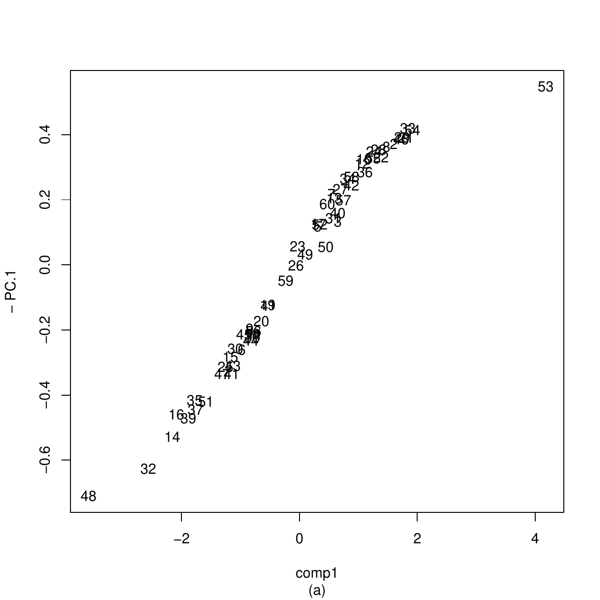

::: article
# Introduction {#secintro}

Techniques such as multidimensional scaling, hierarchical cluster
analysis, and discriminant analysis are often used for multivariate data
analysis to visualize, organize observations into groups, and model
class structure, respectively.

These techniques deal with data of the "individuals $\times$ variables"
type [@mardia; @krzanowski], commonly stored in objects of class
`data frame`. These techniques are available in the R packages
[*stats*](https://CRAN.R-project.org/package=stats),
[*MASS*](https://CRAN.R-project.org/package=MASS) [@mass],
[*ade4*](https://CRAN.R-project.org/package=ade4) [@ade4],
[*FactoMineR*](https://CRAN.R-project.org/package=FactoMineR)
[@factominer], [*cluster*](https://CRAN.R-project.org/package=cluster)
[@cluster].

In the case where the individuals are organized into occasions or
groups, the analyst could be interested in taking into account this data
organization by associating with each occasion a mathematical object and
performing multivariate techniques on these objects. In the
[*dad*](https://CRAN.R-project.org/package=dad) package [@dad], devoted
to such data, the objects are probability density functions. These
densities are either all continuous (numeric data with Lebesgue measure
as reference measure) or all discrete (categorical data with counting
measure as reference measure) and are subjected to the following
analyses:

-   Multidimensional scaling (MDS) of probability density functions aims
    to visualize a set of densities (or occasions) so that the distances
    between the densities are preserved as well as possible;
-   Hierarchical cluster analysis (HCA) of probability density functions
    is used to divide a set of densities (or occasions) into clusters so
    that the densities of the same cluster are as similar as possible
    and are dissimilar from those of the other clusters;
-   Discriminant analysis (DA) of probability density functions deals
    with the same kind of data, knowing a partition of the densities (or
    occasions) into classes. Its first objective is to learn how the a
    priori classes can be explained by the distances between these
    densities. Then, if the training step is judged satisfactory
    according to a criterion named misclassification ratio, its second
    objective is to classify a new density whose class is unknown
    [@boumaza04].

These three multivariate techniques constitute the core of this work.
Theoretically, the *dad* package handles probability density functions
and considers multi-group data as samples allowing their estimation. The
densities could be considered as functional data processed by packages
like [*fda*](https://CRAN.R-project.org/package=fda) [@fda],
[*fda.usc*](https://CRAN.R-project.org/package=fda.usc) [@febrero], or
[*fdadensity*](https://CRAN.R-project.org/package=fdadensity)
[@petersen], or as compositional data processed by packages like
[*compositions*](https://CRAN.R-project.org/package=compositions)
[@tsagris],
[*Compositional*](https://CRAN.R-project.org/package=Compositional)
[@vandenboogaart], or
[*robCompositions*](https://CRAN.R-project.org/package=robCompositions)
[@filzmoser]. The differences or similarities with these approaches are
the subjects of part of the discussion of the manuscript (*Discussion
and concluding remarks* Section).

These three multivariate techniques are essentially based on distance
indices between probability density functions. Literature abounds with
such indices: as an example, the encyclopedia of distances of @deza [p.
235--245] lists some forty. The *dad* package proposes to calculate ten
of them among the most common by considering the case of discrete
densities and that of continuous densities. The results returned by the
three previous multivariate techniques depend on the distance index
used. This is illustrated by simple examples in the context of HCA
(Appendix A) or DA (Appendix B), and criteria of distance choice are
proposed in the *Practical advice* Section.

Thus, for each distance index, the *dad* package implements:

-   its calculation for two densities whose type and parameters are
    known,
-   its estimation for two densities for which there are two samples
    which allow the estimation of their parameters,
-   the generalization of each previous calculation for $T$ ($T > 2$)
    densities taken two by two, the result of which is a symmetric
    matrix.

In order to avoid unnecessary redundancies in the entry of data
characterizing the groups as these characteristics are the same for all
the individuals of the same group, we considered it useful to organize
the data in a list of data frames (object of class `folderh`). Also, in
order to calculate some statistics (means, covariance matrices\...) per
group or distances between each pair of groups, we considered it useful
to store the individuals of each group in one data frame and these data
frames in a list (object of class `folder`). Appendix C details the
rationale for introducing these object classes. The functions of the
package *dad* implementing the three main techniques (MDS, HCA, DA)
apply to such objects. The functions of data management or elementary
calculation (means, variance or correlation matrices, moments) applying
to these objects could have been made invisible in the package without
affecting the presentation of the main techniques. However, to
facilitate the work of the analyst interested in processing multi-group
data or in experimenting with other multivariate techniques on such
data, we have kept them visible. Some of them are presented in
Appendix C and Appendix D.

So, the presentation of the *dad* package will begin with a description
of the data considered in the previous techniques (*Multi-group data:
examples and organization* Section). We will then present functions for
the calculation of the distance or divergence measures between discrete
densities and between Gaussian densities. The special case of
non-Gaussian densities estimated with the Gaussian kernel method is also
considered (*Distance / divergence between densities* Section). Then, we
will present the functions implementing the three techniques introduced
above for the processing of multi-group data: multidimensional scaling
(*MDS of densities* Section), hierarchical cluster analysis (*HCA of
densities* Section), and discriminant analysis (*DA of densities*
Section). Finally, we will give some practical advice (*Practical
advice* Section) and briefly highlight some similarities with functions
of other R packages (*Discussion and concluding remarks* Section). A
summary and appendices complete this presentation.

# Multi-group data: examples and organization {#secmulti}

[]{#datamanagement label="datamanagement"}

::: {#three_way_data}
  --------------------------------------------------------------------------
   {width="100%" alt="graphic without alt text"}

  --------------------------------------------------------------------------

  : Table 1: For each occasion $t = 1,\ldots,T$, the same $p$ variables
  are observed for $n_t$ individuals. The data frame (a) consists of
  ($p+1$) columns, the last one is a factor designating the occasion.
  The data folder (b) consists of $T$ data frames each one having the
  same $p$ column names.
:::

::: {#DataStructureAD}
  --------------------------------------------------------------------------
   {width="100%" alt="graphic without alt text"}

  --------------------------------------------------------------------------

  : Table 2: Each occasion $t$ ($t=1,\ldots,T$) matches a table with
  $n_t$ rows and $p$ columns (see Table [1](#three_way_data)). The
  variable $G$ defined on the occasions takes values $\{1,\ldots,K\}$.
  For each $k=1,\ldots,K$, the value $k$ is taken $T_k$ times. The $G$
  values of the occasions $T+1,\,\ldots$ are not available and have to
  be predicted.
:::

For MDS and HCA, the data $\mathbf{X}$ (Table [1](#three_way_data)a) of
interest have three kinds of objects: occasions $\times$ individuals
$\times$ variables. The occasions define a partition of the individuals
on which the variables are measured. If $T$ denotes the number of
occasions, for each $t$ in $\left\{1,\ldots,T\right\}$, the rows of the
table $\mathbf{X}_t$ correspond to $n_t$ observations
$\mathbf{x}_{t1}\,,\ldots,\,\mathbf{x}_{tn_t}$ of $X_t$ a random vector
with $p$ components.

For DA, the data of interest are similar to the previous ones with the
difference that we have two categories of occasions. The first category
consisting of $T$ occasions is partitioned into $K$ subsets deriving
from a factor $G$ defined on occasions (Table [2](#DataStructureAD)).
The second category consists of occasions, numbered $T+1,\ \ldots$ for
which we have data of type $\mathbf{X}$ but not the value of $G$.

## Datasets

The data of the following examples are available in the *dad* package as
lists of data frames or arrays, and are loaded by means of the usual
`data` function.

1.  Archaeological data: the data are stored in `castles.dated`, a list
    of two data frames whose description is detailed in the subsection
    *Introductory example* of Appendix C. The data frame
    `castles.dated$stones` in which for each of $T=68$ Alsatian castles
    (occasions), $p=4$ numerical characteristics are measured on a batch
    of stones (individuals) used to build the castle. The objective is
    to:

    -   visualize the castles by points in a space of reduced dimension
        so that the castles having stones of similar dimensions are
        close to each other and those having stones of very different
        dimensions are distant;
    -   highlight which characteristics of the stones are at the origin
        of these small or large distances.

    The $68$ castles are dated from the period 1140-1650, which is
    divided into six intervals, numbered 1 to 6, separated by the
    following cutoff points: 1175, 1210, 1245, 1280, 1350. The building
    periods are available in the data frame `castles.dated$periods`. The
    first objective is to analyse the relations between these periods
    and the previous visualization of the castles. The second objective
    is to predict the building period of $67$ non-dated castles the data
    of which are in the data frame `castles.nondated$stones`.\
    This archaeological example [@rudrauf] was at the origin of the
    multi-group techniques presented in this work. It illustrates well
    the MDS and DA techniques even if, as we will see when processing
    the data, from the archeology point of view, the results are not
    very satisfactory and have only an indicative value.

2.  Agronomic data: the data are stored in the `folderh` object
    `varietyleaves` consisting of two data frames `variety` and
    `leaves`, and a key `rose` that is the column name common to the two
    data frames which connects them. The first data frame
    `varietyleaves$leaves` is made up of $581$ rows (leaves of $T = 31$
    rosebushes) and 5 columns corresponding to the number of the
    rosebush to which the leaf belongs and $p = 4$ numerical
    characteristics: number of its leaflets, length of its rachis, then
    the length, and width of its main leaflet. The second data frame
    `varietyleaves$variety` is made up of $T$ rows and two columns: the
    number of the rosebush and its variety. There are $K = 6$ varieties
    (Table [3](#varieties)). This example will illustrate the DA
    technique. The objective of which is to predict the variety of one
    plant from measures of several leaves of the plant.

    ::: {#varieties}
      ------------------- ----------- ----------- ---------------------------
      Variety               Number      Number    Number of leaves

                           of plants   of leaves  per plant

      Canary                   6          65      $=\ \ 8+14+11+16+\ 8+\ 8$

      Electron                 3          42      $=\ \ 9+\ 8+25$

      Lili Marleen             6          65      $=\ 15+10+\ 5+\ 7+15+13$

      Pussta                   6          200     $=\ 35+47+29+20+37+32$

      Starina                  5          105     $=\ 18+17+19+33+18$

      White Meillandina        5          104     $=\ 23+19+16+22+24$
      ------------------- ----------- ----------- ---------------------------

      : Table 3: Numbers of plants and leaves per variety and number of
      leaves per plant.
    :::

3.  Sensory data: the data frame `roses` in which each of $T=10$
    photographs of rosebushes (occasions) was evaluated 3 times, by 14
    assessors, for $p=16$ numerical characteristics, giving a table with
    $16$ columns and $42$ rows per rosebush, for a total of $420$ rows.
    In this case, an individual is a couple (assessor, evaluation
    session). The objective is to visualize the roses and then create
    clusters of roses that are as similar as possible. A part of these
    data will illustrate the techniques MDS and HCA.

4.  Surveys -- census data over years -- : from each census conducted in
    France [@insee] during $T = 7$ different years (1968, 1975, 1982,
    1990, 2010, and 2015), we extract the population of active
    individuals aged 25 to 54 and $p = 2$ categorical variables: diploma
    (4 levels) and socio-professional group (6 levels). From the initial
    data collected by INSEE, we build a list of $T = 7$ arrays of
    dimension $(4,6)$, which is stored in `dspg` object. The objective
    is to visualize the years and to highlight, when they exist, the
    temporal evolutions of the frequencies. The MDS technique seems
    suitable to achieve this objective.

5.  Surveys -- census data 2015 by department -- : from the census of
    the year 2015 [@insee], we consider the same kind of data and
    organize them in a list of $T = 96$ arrays, which correspond to the
    96 departments of metropolitan France. This list is available in the
    `dspgd2015` object. As for the sensory data, the objective is to
    visualize the departments and then create clusters of departments
    that are as similar as possible. In order to give meaning to the
    clusters, a common and advisable practice is to couple the
    techniques HCA and MDS.

In the last two examples, the densities are discrete and are given only
for illustration. Their detailed presentation is in the *dad* vignette
`mds-discrete-distributions`.

## Data management

The previously collected data can be organized into:

-   A single data frame (Table [1](#three_way_data)a), by vertically
    concatenating the $T$ tables $\mathbf{X}_t$, with $p$ columns and
    appending a factor column designating the occasion, or
-   A list of $T$ data frames (Table [1](#three_way_data)b), each having
    $p$ columns, as an object from an `S3` class named `folder` (see
    Appendix C).

To carry out discriminant analysis, the training step requires an a
priori division of the occasions into clusters, that is, a factor $G$
with $K$ levels defined from the occasion set
(Table [2](#DataStructureAD)). The predicting step is to assign a level
for each occasion whose value of the factor $G$ is not available. The
data, therefore, consist of two data frames linked by a hierarchical
relationship "1 to N". Each row of the data frame in
Table [2](#DataStructureAD) is, thus, matched to several rows of the
data frame in Table [1](#three_way_data)a. The list of these two data
frames is an object of `S3` class `folderh` (hierarchical folder) built
by the function `folderh` (see Appendix C).

Notice that in the presentation of the data tables, we arranged them so
that the individuals (rows of Table [1](#three_way_data)a) of the same
occasion are neighbors and so that the occasions (rows of
Table [2](#DataStructureAD)) of the same class are neighbors. However,
in the *dad* package, such a layout is obviously not necessary. Only the
factors $Group$ (Table [1](#three_way_data)a) and $G$
(Table [2](#DataStructureAD)) must be given.

# Distance/divergence between densities {#densitydistance}

In the first subsection, we present the indices which operate on
discrete densities. In the second subsection, we consider the indices
which operate on Gaussian densities and have an analytical expression
depending on the parameters of the densities: means, variances, and
covariances. Therefore, these indices can easily be estimated from the
parameter estimates. In the third subsection, we present an index based
on the estimation of densities on $\mathbb{R}^p$ by the Gaussian kernel
method. This index offers the advantage of being easily calculable even
for non-Gaussian continuous densities.

The main techniques of the *dad* package depend on the distance index
used (Appendix A and B). A brief practical guidance on the choice of
distance index is provided in *Practical advice* Section.

## Calculation of distances/divergences between discrete densities

::: {#dddistances}
  ---------------------- -------------------------------------------------------------------------------------
  Name                   Expression

  Symmetric chi-square   $\sum\limits_{x}{(p_1(x)-p_2(x))^2 / (p_1(x) + p_2(x))}$

  Hellinger              $\left( 2 \sum\limits_{x}{(\sqrt{p_1(x)}-\sqrt{p_2(x)}\;)^2} \right)^{\frac{1}{2}}$

  Jeffreys               $\sum\limits_{x}{ (p_1(x)-p_2(x)) \ \ln (p_1(x)/p_2(x)) }$

  Jensen-Shannon         $\sum\limits_{x} \left( \ p_1(x) \ \ln (2 p_1(x)/ (p_1(x)+p_2(x))) \right.$

                         $\left. + \ p_2(x) \ \ln (2 p_2(x)/ (p_1(x)+p_2(x)))\ \right)$

  Lp                     $\left( \sum\limits_{x}{|p_1(x)-p_2(x)|^p} \right)^{\frac{1}{p}}$
  ---------------------- -------------------------------------------------------------------------------------

  : Table 4: Distance indices between two discrete densities $p_1$ and
  $p_2$ on the same finite support the states of which are denoted $x$
  in the formulas. The sums of the formulas are taken over all the
  states of the support [@deza]. The corresponding *dad* functions are:
  `ddchisqsympar`, `ddhellingerpar`, `ddjeffreyspar`, `ddjensenpar`, and
  `ddlppar`.
:::

Table [4](#dddistances) lists the expressions of distance indices of two
discrete densities and the *dad* functions associated with them. The set
of the states of these densities can be either the set of the levels of
one categorical variable or the Cartesian product of the $q$ sets of the
levels of $q$ categorical variables as in the following example with
$q=2$.

``` r
> x1 <- data.frame(x = factor(c("A", "A", "A", "B", "B", "B")),
+                  y = factor(c("a", "a", "a", "b", "b", "b")))                 
> x2 <- data.frame(x = factor(c("A", "A", "A", "B", "B")),
+                  y = factor(c("a", "a", "b", "a", "b")))
> p1 <- table(x1)/nrow(x1)                 
> p1
   y
x     a   b
  A 0.5 0.0
  B 0.0 0.5
> p2 <- table(x2)/nrow(x2)
> p2
   y
x     a   b
  A 0.4 0.2
  B 0.2 0.2
```

The $L1$ distance and Jeffreys divergence between the densities $p1$ and
$p2$ are computed as follows.

``` r
> ddlppar(p1, p2)
[1] 0.8
> ddjeffreyspar(p1, p2)
[1] Inf
```

The Jensen-Shannon index is equal to the entropy or average quantity of
information of the distribution $(p_1 + p_2) / 2$, from which we
subtract the sum of the entropies of $p_1$ and $p_2$. The other indices
are based on the sum of the differences, possibly weighted, between
$p_1$ and $p_2$ in each state $x$, unlike the Jensen-Shannon index,
which is somewhat more global. These indices are compared in the
subsection *Simulated discrete data* of Appendix B.

## Calculation of distances/divergences between Gaussian densities

Table [5](#gaussdistances) lists the parametric expressions of distance
indices of multivariate densities and the *dad* functions associated
with them. For the univariate case, the expressions are easily deduced.

::: {#gaussdistances}
  --------------------------------- -------------------------------------------------------------------------------------------------------------------------------------------------------------------
  Name                              Expression

  Hellinger $^{\textrm{(a)}}$       $\left(2 - 2^{\frac{p}{2}+1} \det(\Sigma V)^{\frac{1}{4}} \det(\Sigma + V)^{-\frac{1}{2}} \exp(-\frac{1}{4} \|\mu-m\|^2_{(\Sigma+V)^{-1}} )\right)^{\frac{1}{2}}$

  Jeffreys$^{\textrm{(b)}}$         $2^{-1}\, \|\mu-m\|^2_{\Sigma^{-1}+V^{-1}} + 2^{-1}\, \textrm{tr}((\Sigma-V)(V^{-1}-\Sigma^{-1}))$

  L2 $^{\textrm{(c)}}$              $\left( (2\pi)^{-\frac{p}{2}}  \det(2\Sigma)^{-\frac{1}{2}} + (2\pi)^{-\frac{p}{2}} \det(2V)^{-\frac{1}{2}} \right.$

                                    $\left. - 2\,(2\pi)^{-\frac{p}{2}} \det(\Sigma + V)^{-\frac{1}{2}} \exp(-\frac{1}{2} \|\mu-m\|^2_{(\Sigma + V)^{-1}} )
                                    \right)^{\frac{1}{2}}$

  L2N $^{\textrm{(d)}}$             $\left(2 - 2^{\frac{p}{2}+1} \det(\Sigma V)^{\frac{1}{4}} \det(\Sigma + V)^{-\frac{1}{2}} \exp(-\frac{1}{2} \|\mu-m\|^2_{(\Sigma+V)^{-1}} )\right)^{\frac{1}{2}}$

  2-Wasserstein $^{\textrm{(e)}}$   $\left(\|\mu-m\|^2_{I_p} + \textrm{tr}(\Sigma + V - 2(V^{\frac{1}{2}} \Sigma V^{\frac{1}{2}})^{\frac{1}{2}})\right)^{\frac{1}{2}}$
  --------------------------------- -------------------------------------------------------------------------------------------------------------------------------------------------------------------

  : Table 5: Distance indices between the multivariate Gaussian
  densities $f \equiv N(\mu,\Sigma)$ and $g \equiv N(m,V)$. (a) The
  corresponding *dad* function is `hellingerpar`. It is the $L^2$
  distance between the square roots of the densities $f$ and $g$. (b)
  The Jeffreys divergence is the symmetrized Kullback-Leibler
  divergence. Its corresponding function is `jeffreyspar`. (c) The
  corresponding function of the $L^2$ distance is `distl2dpar`. (d) L2N,
  named also normalized $L^2$ distance, stands for the $L^2$ distance
  between $f/\|f\|_{L^2}$ and $g/\|g\|_{L^2}$ and its value is almost
  similar to the Hellinger distance. Its corresponding function is
  `distl2dnormpar`. (e) $I_p$ stands for the identity matrix of order
  $p$. The corresponding function is `wassersteinpar`.
:::

\
For example, the Jeffreys divergence is respectively carried out with
the `jeffreyspar` or `jeffreys` functions depending on whether the
calculations are respectively based on parameters or samples.

``` r
> m1 <- c(1,1)
> v1 <- matrix(c(4,1,1,9),ncol = 2)
> m2 <- c(0,1)
> v2 <- matrix(c(1,0,0,1),ncol = 2)
> jeffreyspar(m1,v1,m2,v2)
```

``` r
[1] 5.314286
```

``` r
> library(MASS)
> set.seed(100)
> x1 <- mvrnorm(40, m1, v1)
> x2 <- mvrnorm(30, m2, v2)
> jeffreys(x1, x2)
```

``` r
[1] 6.780999
```

All these indices are based on a combination of the difference between
the means $\mu$ and $m$ and the dissimilarity between the covariance
matrices $\Sigma$ and $V$. In the case of equal means, the distance
index between Gaussian densities reduces to a dissimilarity between
covariance matrices. If the covariance matrices are equal, all these
indices reduce to an index of the distance between these means, this
index being dependent on the common variance matrix, with the exception
of the Wasserstein index, which uses the identity matrix. These indices
are also compared in the subsection *Simulated Gaussian data* of
Appendix B.

## Calculation of $L^2$ distances between continuous non-Gaussian densities estimated by the kernel method {#nongaussdistances}

Except for the $L^2$ distances, the extension of the other distance
indices of Table [5](#gaussdistances) to any estimated densities still
requires a lot of work. Indeed, we experimented with calculating
distance indices using numerical integration methods but computation
times were so long in the multidimensional case that we did not
implement them in the *dad* package. The solution we recommend is to
estimate the densities by the Gaussian kernel method and use the $L^2$
distances.

-   **Density estimation with the Gaussian kernel method.** The
    probability densities $f_t$ are estimated by the Gaussian kernel
    method:
    $$\label{densiteng}
    \hat{f}_t(\mathbf{z})=\frac{1}{n_t|\mathbf{h}_t|^{1/2}}\frac{1}{(2\pi)^{p/2}}\sum_{i=1}^{n_t}\exp(-\frac{1}{2}(\mathbf{z}-\mathbf{x}_{ti})^\top
    \mathbf{h}_t^{-1}(\mathbf{z}-\mathbf{x}_{ti}))\text{,}   (\#eq:densiteng)$$
    where $\mathbf{h}_t$ is the non-singular bandwidth matrix and
    $|\mathbf{h}_t|$ its determinant. This matrix may be provided by the
    user, or calculated directly according to the AMISE criterion, with
    reference to the normal distribution [@wand], that is:
    $$\label{bandwidth}
    \mathbf{h}_t=h_t\widehat{\mathbf{V}}_t^{1/2}\text{,}   (\#eq:bandwidth)$$
    with:
    $$\label{windowh_normal_reference}
    h_t=\Big(\frac{4}{n_t(p+2)}\Big)^{\frac{1}{p+4}}.   (\#eq:windowh-normal-reference)$$
-   **Calculation of $L^2$ distances between estimated non-Gaussian
    densities.** The calculation of the inner product is carried out
    with the `l2d` function using a sample per density: `x1` and `x2`;
    the result derives from the estimation (\@ref(eq:densiteng)) of the
    densities, the bilinearity of the inner product, and a formula of
    integral calculus [@wand p. 101]. Then, the $L^2$-distance is
    directly deduced. This calculation is carried out with the `distl2d`
    function.
    ``` r
    > set.seed(40)
    > x1 <- c(rnorm(5, mean = 0, sd = 1), rnorm(5, mean = 1, sd  = 2))
    > x2 <- c(rnorm(10, mean = 2, sd = 3), rnorm(5, mean = 0, sd = 2))
    > distl2d(x1, x2, method = "kern")
    ```

    ``` r
    [1] 0.2562896
    ```

The normalized $L^2$ distance between densities is also possible.
Although it has the disadvantage of being time-consuming, it has some
similarities to Hellinger's distance, and in the Gaussian case, the two
distances have almost the same expression (Table [5](#gaussdistances)).

# MDS of densities {#secmdsofd}

Since the function of *dad* package implementing multidimensional
scaling of probability density functions is a direct application of the
function `cmdscale` of R, it is briefly recalled in the case of
continuous densities. The mathematical aspects of this method have been
dealt with in several works (@delicado as MDS; @boumaza98, @kneip, and
@yousfi as functional PCA). In this section, we will privilege the
presentation in MDS form, which offers greater flexibility in the choice
of the distance between densities, while taking inspiration from the
method of interpretation of the results of PCA developed in @boumaza15
in order to interpret the scores resulting from MDS.

## Brief presentation of the method {#rappelfmdsd}

Given $T$ densities and $(\delta_{ts})_{1\leq t,s\leq T}$ the
distances/divergences between each pair of them, the MDS technique looks
for a representation of the densities by $T$ points in a low dimensional
space such that the distances between these points are as similar as
possible to the $(\delta_{ts})$ [@cox]. In R, this multidimensional
positioning technique is performed by the `cmdscale` function, whose
main argument is the symmetric matrix of distances and the main output
is the matrix of coordinates.

If the densities are assumed to be Gaussian, we can use the Hellinger
distance, the Jeffreys divergence, the 2-Wasserstein distance, or the
$L^2$ distance (Table [5](#gaussdistances)). If they are not expected to
be Gaussian, they are estimated using the Gaussian kernel method, and
the only available distance for the moment is the $L^2$-distance
(*Calculation of $L^2$ distances between continuous non-Gaussian
densities estimated by the kernel method* Section).

The *dad* package includes functions for all the calculations required
to implement such a method and to interpret its outputs:

-   The `fmdsd` function which performs multidimensional scaling and
    generates scores;
-   The `plot` function which generates graphics representing the
    densities on the factorial axes;
-   The `interpret` function which returns other aids to interpretation
    based on the moments of the variables.

## The `fmdsd` function

MDS of densities can be carried using the `fmdsd` function, which
applies to an object of the class `folder`
(Table [1](#three_way_data)b). The future or to a data frame and a
grouping variable (Table [1](#three_way_data)a). It is built on the
`cmdscale` function of R. In addition to the `add` argument of
`cmdscale`, the `fmdsd` function has three sets of optional arguments.
The first, consisting of `gaussiand`, `windowh`, and `distance`,
controls the method used to estimate the densities and their distances
(*Distance/divergence between densities* Section). The second consists
of the arguments `data.scaled`, `data.centered`, controls some data
transformations, and the logical argument `common.variance`, which, when
set to `TRUE`, considers that all the occasions have the same covariance
matrix. These three arguments are discussed in Appendix E. The third set
consists of optional arguments which control the function outputs.

## Interpretation of `fmdsd` outputs {#interpretfmds}

The `fmdsd` function returns an object of `S3` class `fmdsd`, consisting
of a list of 11 elements, including the scores, also called principal
coordinates, and the moments of the variables per occasion. The outputs
are displayed with the `print` function, and graphical representations
on the principal planes are generated with the `plot` function.

The interpretation of outputs is based on the relationships between the
principal scores and the moments of the densities, in particular their
means, variances, covariances, and correlations. These relationships are
quantified by correlation coefficients and are represented graphically
by plotting the scores against the moments. These interpretation tools
are provided by the `interpret` function, which has two optional
arguments: `nscores` indicating the indices of the column scores to be
interpreted and `moment` whose default value is `"mean"`.

## Example

The following example is treated in detail in @boumaza15, using PCA of
densities. The data consist of $T = 10$ rose bushes assessed three
times, by a jury of 14 assessors, for $p = 3$ attributes: top-sided
shape ($Sha$), foliage thickness ($Den$), and plant symmetry ($Sym$).
Here, we present the results obtained with the MDS technique. This
presentation is limited to the major steps in the calculation and the
visualization of the results generated by the `fmdsd`, `print`, `plot`,
and `interpret` functions.

``` r
> data("roses")
> rosesf <- as.folder(roses[,c("Sha", "Den", "Sym", "rose")], groups = "rose")
> resultmds <- fmdsd(rosesf, gaussiand = FALSE, distance = "l2") 
```

The function `fmdsd` displays the barplot of the inertia explained by
the first nine principal coordinates (Figure [1](#rosesfmdsdinertia)).

``` r
> names(resultmds)
```

``` r
 [1] "call"         "group"        "variables"    "d"            "inertia"      "scores"      
 [7] "means"        "variances"    "correlations" "skewness"     "kurtosis"
```

By default, the `print` function applied to `resultmds` only displays
the names of the variables, the inertia, and the principal coordinates.

``` r
> print(resultmds) 
```

``` r
group variable:  rose 
variables:  Sha Den Sym 
---------------------------------------------------------------
inertia
  eigenvalue inertia
1    0.02977    25.3
2    0.02261    19.2
3    0.02028    17.2
4    0.01439    12.2
5    0.00980     8.3
6    0.00930     7.9
7    0.00566     4.8
8    0.00344     2.9
9    0.00262     2.2
---------------------------------------------------------------
coordinates
  rose         PC.1         PC.2        PC.3
A    A  0.055191062  0.022167510  0.02655143
B    B -0.004963751 -0.023764758  0.07033084
C    C  0.019611171 -0.122241048 -0.06566866
D    D -0.091777346  0.041132410 -0.04995275
E    E -0.013763431  0.019828288 -0.01341398
F    F  0.016470141 -0.024307858  0.07144865
G    G -0.088949736  0.005722199  0.01223686
H    H -0.025102407 -0.006365474  0.01382440
I    I  0.068203593  0.043999532 -0.02735366
J    J  0.065080705  0.043829197 -0.03800313
```

``` r
> plot(resultmds) 
```

The output is shown in Figure [2](#rosesfpcadpscores).

``` r
> interpret(resultmds) 
```

``` r
Pearson correlations between scores and moments
          PC.1  PC.2  PC.3
mean.Sha -0.65  0.29  0.69
mean.Den  0.83 -0.42  0.08
mean.Sym -0.01  0.94 -0.04
Spearman correlations between scores and moments
          PC.1  PC.2  PC.3
mean.Sha -0.65 -0.26  0.65
mean.Den  0.78 -0.30  0.02
mean.Sym  0.16  0.92 -0.35
```

The returned plots of the `interpret` function are not shown. From the
correlations between the principal coordinates (PC) and the means of the
variables, we deduce that:

-   The higher PC1, the higher \"Den\", and the lower \"Sha\" tends to
    be;
-   The higher PC2, the higher \"Sym\";
-   The higher PC3, the higher \"Sha\" tends to be.

{#rosesfmdsdinertia width="100%"
alt="graphic without alt text"}

<figure id="rosesfpcadpscores">
<p></p>
<figcaption>Figure 2: MDS of densities on sensory data (part of
<code>roses</code> data frame): the first three principal
coordinates.</figcaption>
</figure>

Thus, from this interpretation of the PCs, we can describe the classes
of rose bushes that can be constituted in view of their proximities
*vs.* distances visualized in Figure [2](#rosesfpcadpscores). For
example, the roses of the class $\left\{A, I, J \right\}$ have thick
foliage compared to those of the class $\left\{D, G \right\}$, the rose
bush $C$ is very asymmetrical compared to the other rose bushes, the
rose bushes of the class $\left\{B, F \right\}$ have a top sided shape.

In order to obtain the correlations between the scores and the standard
deviations, we set the optional argument `moment` to `"sd"` as in the
following example. The other possible values of this argument include
`"var"` (variances), `"skewness"`, `"cor"` (correlations for
multivariate densities).

``` r
> interpret(resultmds, moment = "sd")
```

``` r
Pearson correlations between scores and moments
        PC.1  PC.2  PC.3
sd.Sha  0.67  0.21 -0.49
sd.Den -0.01  0.77  0.11
sd.Sym -0.13 -0.44  0.76
Spearman correlations between scores and moments
        PC.1  PC.2  PC.3
sd.Sha  0.50  0.45 -0.58
sd.Den  0.15  0.64 -0.08
sd.Sym -0.26 -0.76  0.75
```

Some of the correlations between the PCs and the standard deviations of
the variables seem high. Reminding that the PCs are related to means,
these correlations are therefore clues of links between standard
deviations and means of the variables. We, therefore, represent roses
using their means and standard deviations (Figure [3](#fmdsdmeansd)). We
highlight that the standard deviations/variances used to assess
discordance between assessors tend to be smaller when the products
subjected to evaluation on a nine-level scale were awarded marks at the
ends of the scale. This result which is actually quite intuitive,
obtained by the use of MDS on probability density functions, would have
been difficult to demonstrate if the means and standard
deviations/variances had been analyzed separately.

<figure id="fmdsdmeansd">
<p></p>
<figcaption>Figure 3: MDS of densities on sensory data (part of
<code>roses</code> data frame): relationships between means and standard
deviations of the variables.</figcaption>
</figure>

# HCA of densities {#sechcaofd}

As for MDS, the `fhclustd` function of the *dad* package implementing
hierarchical cluster analysis of probability density functions is a
direct application of `hclust`, the corresponding function of R. So it
is briefly recalled, and we put the emphasis on the interest of coupling
the implementation of MDS with HCA in order to interpret more easily the
clusters resulting from HCA.

## Brief description of the method and of its outputs

HCA deals with the same kind of data as the MDS technique, namely: $T$
probability density functions and $(\delta_{ts})_{1\leq t,s\leq T}$ the
distances/divergences between each pair of them. Its purpose is to build
a series of nested partitions that can be visualized by means of a
dendrogram (Figure [4](#roseshcadendrogram)). An agglomerative building
algorithm starts with a partition consisting of $T$ clusters (one
density per cluster) then "*it repeats merging the closest pair of
clusters according to some similarity criteria until all the data*
(densities in our context) *are in one cluster*" [@gan]. The criteria
are built on dissimilarities between sets of densities, which themselves
derive from $(\delta_{ts})_{1\leq t,s\leq T}$ obtained as follows:

``` r
> resulthca <- fhclustd(rosesf, gaussiand = FALSE, distance = "l2")
> round(resulthca$distances, digits = 2)
```

``` r
     A    B    C    D    E    F    G    H    I
B 0.14                                        
C 0.19 0.18                                   
D 0.19 0.18 0.21                              
E 0.14 0.14 0.18 0.14                         
F 0.14 0.09 0.18 0.18 0.15                    
G 0.19 0.15 0.20 0.16 0.17 0.17               
H 0.15 0.12 0.17 0.16 0.12 0.14 0.14          
I 0.12 0.15 0.18 0.18 0.14 0.15 0.18 0.15     
J 0.15 0.16 0.19 0.19 0.15 0.16 0.19 0.15 0.08
```

The dendrogram (Figure [4](#roseshcadendrogram) ) is obtained by the
following instruction:

``` r
plot(resulthca, xlab = "Roses", sub = " ", hang = -1)
```

{#roseshcadendrogram
width="100%" alt="graphic without alt text"}

## HCA and MDS on the same densities

By cutting the dendrogram (Figure [4](#roseshcadendrogram) ), a
partition of the set of the $T$ roses is deduced. For example, in four
clusters: $\{D,\ G\}$, $\{C\}$, $\{I,\ J\}$, and
$\{E,\ H,\ A,\ B,\ F\}$. This partition is quite similar to the one we
could visually make on the basis of Figure [2](#rosesfpcadpscores). This
is easy to understand since Figure [4](#roseshcadendrogram) is only an
approximate visualization of the dissimilarities
$(\delta_{ts})_{1\leq t,s\leq T}$ that served both in MDS and in HCA.

In the *Interpretation of `fmdsd` outputs* section, we described the
method used to give meaning to the principal coordinates based on the
moments of the variables, from which we deduced the meaning of the
clusters of roses constituted using the scores of MDS.\
This illustrates the process we propose to follow in practice:

-   Carry out HCA and deduce a partition in HCA-clusters;
-   Carry out MDS and constitute MDS-classes;
-   Specify the characteristics of the MDS-classes according to the
    moments of the variables;
-   Describe HCA-clusters which are similar to MDS-classes;
-   Describe the other HCA-clusters by using, when possible, the
    MDS-scores of the groups making up these clusters.

# DA of densities {#secdaofd}

With the notations introduced at the beginning of the section
*Multi-group data: examples and organization*, the aim of discriminant
analysis of densities [@boumaza04] is to predict the value of $G$
(Table [2](#DataStructureAD)) for the occasion $T+1$ represented by the
density $f_{T+1}$, knowing $n_{T+1}$ observations of the random vector
$X_{T+1}$, which are stored in $\mathbf{X}_{T+1}$
(Table [1](#three_way_data)).

For each $k=1,\ldots,K$, we denote by $g_k$, the density representing
the class $k$ of $G$. The predicted value is:
$$\label{ruledistance}
\widehat{k} = \arg\ \min_{1\leq k\leq K} D(f_{T+1}, g_k)\text{,}   (\#eq:ruledistance)$$
where $D$ is a distance index between densities (*Distance/divergence
between densities* section). The data corresponding to the density $g_k$
are those corresponding to the $T_k$ densities $f_t$ belonging to the
class $k$ of $G$. In Appendix F, we specify the possible procedures for
calculating the densities $g_k$ and highlight the link between DA of
densities and the linear discriminant analysis (*MASS*) in the
homoscedastic Gaussian case.

The *dad* package performs all the calculations required to obtain the
predicted value through the `fdiscd.predict` function whose first two
arguments, `x` and `class.var`, control the input data. It includes the
arguments `distance` and `crit`, which respectively set the distance and
the densities $g_k$ (Appendix F). It also includes the arguments
`gaussiand` and `windowh`, which control the method of density
estimation. The `fdiscd.predict` function returns an object of `S3`
class `fdiscd.predict`, which is a list consisting of prior and
predicted values corresponding to each $f_t$, a confusion matrix, the
distances $(d_{tk})$ between the $f_t$'s and the $g_k$'s, and
proximities. These are calculated from the inverse of the distances in
such a way that their sum is 1, but they are not probabilities and are
useful for a quick comparison of the distances.

In addition, the package calculates the misclassification ratio for the
occasions for which the prior class of $G$ is known through the
`fdiscd.misclass` function. This ratio is computed by using the
leave-one-out method on the $T$ occasions, and the lower it is, the
better the prediction of the variable $G$ by the data $\mathbf{X}$. This
function is based on arguments almost identical to those used by the
`fdiscd.predict` function. It also generates similar outputs, grouped
into an object of the `S3` class `fdiscd.misclass`. However, these two
functions differ in the method used to calculate the distances
$(d_{tk})$: if $f_t$ belongs to the $k$-th class of $G$, the data
corresponding to $f_t$ are not included in the data used to estimate
$g_k$. This function is useful for empirical investigations in order to
identify the optimal values of the arguments minimizing the
misclassification ratio. These values are then used by the
`fdiscd.predict` function for prediction of the $G$ class of an occasion
of unknown class.

## First example: Castles / Stones {#fdiscdexamplecastles}

Let us consider the archaeological data (Section *Multi-group data:
examples and organization*, Example 1). For the sake of clarity, we
combine the six classes to yield three final classes, 1140-1175,
1175-1280, and 1280-1550, numbered 1 to 3.

``` r
> data("castles.dated")
> levels(castles.dated$periods$period) <- c("1", "2", "2", "2", "3", "3")
> castlesfh <- folderh(castles.dated$periods, "castle", castles.dated$stones)
```

The `fdiscd.misclass` function is used to calculate the
misclassification ratios (global and per class).

``` r
> fdiscd.misclass(castlesfh, class.var = "period", distance = "l2")
```

``` r
misallocation ratio:  0.3382353 
           predicted.class
prior.class  1  2  3 total misalloc
      1     10  3  0    13    0.231
      2      5 24  8    37    0.351
      3      0  7 11    18    0.389
      total 15 34 19    68         
---------------------------------------------------------------
 castle prior.class predicted.class misclassed
      1           1               1      FALSE
      2           1               1      FALSE
      3           1               2       TRUE

    ...

    131           2               2      FALSE
    133           3               2       TRUE
    135           2               3       TRUE
    136           2               1       TRUE
```

In order to empirically calibrate the different arguments of the
function, the previous operation is repeated, choosing other values for
the arguments. If the `gaussiand` argument is set to `TRUE`, the
smallest global misclassification ratio is 34%
(Table [6](#tauxcasgaussien)) and is obtained for `crit = 1`, the
default value for this argument, and for `distance = "l2"` or
`"hellinger"`.

Estimating the densities by the Gaussian kernel method by setting
`gaussiand = FALSE`, with the bandwidth defined by (\@ref(eq:bandwidth))
and (\@ref(eq:windowh-normal-reference)), increased the global
misclassification ratio to 40%. If we consider the same proportionality
coefficient $h$ in the formula (\@ref(eq:bandwidth)), that is
$$\label{hwindowh}
\mathbf{h}_t=h \, \widehat{\mathbf{V}}_t^{1/2},   (\#eq:hwindowh)$$
by setting the argument `windowh` of the function `fdiscd.misclass`, we
empirically obtain a value of $h$ that minimizes the misclassification
ratio. For this purpose, we calculate the misclassification ratio for
different values of `windowh` (Table [7](#h_taux)). Note that an optimal
empirical value is about `windowh = 0.6`, with a misclassification ratio
of 32%. One of the best empirical parametrizations of the
`fdiscd.predict` function would be `gaussiand = FALSE`, `windowh = 0.6`,
and `crit = 1`.

::: {#tauxcasgaussien}
  -------- ------ ------ ------
  `crit`     1      2      3

  Ratio     0.34   0.56   0.40
  -------- ------ ------ ------

  : Table 6: Castles/Stones. Misclassification ratio assuming densities
  to be Gaussian and parametrically estimated, depending on the value of
  the `crit` argument used to select the type of $g_k$ density
  (Appendix F).
:::

::: {#h_taux}
  ----------- ------ ------ ------ ------ ------ ------ ------ ------ ------
  `windowh`    0.1    0.2    0.3    0.4    0.5    0.6    0.7    0.8    0.9

  Ratio        0.56   0.44   0.38   0.38   0.37   0.32   0.32   0.35   0.34
  ----------- ------ ------ ------ ------ ------ ------ ------ ------ ------

  : Table 7: Castles/Stones. Misclassification ratio for densities
  estimated by the Gaussian kernel method, depending on the value of the
  `windowh` argument, the proportionality coefficient setting the
  bandwidth.
:::

The misclassification ratios are disappointing. Thus, the method was
used only as an indication to date the castles and its results were
cross-checked with other established facts from other historical sources
[@rudrauf].

## Second example: Rosebushes/Leaves {#fdiscdexampleroses}

Let us consider the agronomic data (Section *Multi-group data: examples
and organization*, Example 2). We consider only the continuous variables
characterizing the leaves, that is, leaving out the discrete variable
"number of leaflets". As in the first example, we carry out discriminant
analysis by applying the `fdiscd.misclass` function for different
parameter values. Table [8](#tauxcasgaussienroses) gives the
classification error rates for the three criteria and some values of the
proportionality parameter. One of the best combinations of parameter
values would, therefore, be `crit` = 3 and `windowh` = 0.2. The error
rate is 0.032, which is clearly better than the result obtained with the
archaeological data of the first example. If the same method is applied
to all variables, including "number of leaflets", the error percentage
is zero for `crit` = 3 and `windowh` = 0.3.

In these two previous examples, it should be noted that the search for
an optimum value of the parameter `windowh` has the disadvantage of
being carried out by trial and error and is a time-consuming procedure.

::: {#tauxcasgaussienroses}
  ----------- ------------ ------------ ------------
   `windowh`   `crit` = 1   `crit` = 2   `crit` = 3

      0.1        0.742        0.806        0.129

      0.2        0.452        0.677      **0.032**

      0.3        0.226        0.452        0.097

      0.4        0.129        0.226        0.097

      0.5        0.097        0.129        0.161

      0.6        0.097        0.129        0.161

      0.7        0.065        0.129        0.194

      0.8        0.065        0.097        0.226

      0.9        0.065        0.097        0.226
  ----------- ------------ ------------ ------------

  : Table 8: Rosebushes/Leaves. Misclassification ratio for the three
  criteria and different values of the proportionality parameter
  `windowh`, the densities being estimated by the Gaussian kernel
  method.
:::

# Practical advice {#secprac}

## Data management

The functions `folder` and `as.folder` play a central role in the
creation of objects handled by the functions `fmdsd` (MDS on continuous
data), `mdsdd` (MDS on discrete data), `fhclustd` (HCA on continuous
data), and `hclustdd` (HCA on discrete data). The functions `folderh`
and `as.folderh` play the same role in DA context: `fdiscd.misclass` and
`fdiscd.predict` in the continuous case, or `discdd.misclass` and
`discdd.predict` in the discrete case.

It is advisable for the user to know how to use them, especially as
their handling is quick and easy (Appendix C).

## Computation times

The computation times of the functions of *dad* depend mainly on the
computation time of the distances between groups in MDS and HCA contexts
or between groups and classes in the DA context. The longest times are
achieved when the densities are estimated by the kernel method
(*Calculation of $L^2$ distances between continuous non-Gaussian
densities estimated by the kernel method* section). When applying the
function `matdisl2` with the option `method = "kern"` on the
archeological data (Example 1 of Appendix G), the computation time is
approximately five times greater than when `method = "gaussiand"`.

Among the main functions of *dad*, the most time-consuming one is
undoubtedly `fdiscd.misclass` when its `gaussiand` argument is set to
`FALSE`. That is, the densities are non parametrically estimated. For
example, applying this function to archaeological data with
`gaussiand = TRUE` takes less than one second while it takes
approximately 30-40 seconds with `gaussiand = FALSE` (Example 2 of
Appendix G). Thus, we recommend doing tests on small datasets when
working on non-Gaussian continuous data.

## Choice of distance

The choice of a distance index depends above all on the modeling
hypotheses: discrete or continuous data. If they are discrete *dad*
proposes five indices (Table [4](#dddistances)). If they are continuous,
it proposes five indices in the Gaussian case
(Table [5](#gaussdistances)) and only one for non-Gaussian data, which
is the $L^2$ distance combined with the estimation of the densities by
the Gaussian kernel method.

The distance indices of discrete or Gaussian densities are compared on
particular examples in the context of HCA (Appendix A) or DA
(Appendix B). It is shown that depending on the technique used and the
criterion for measuring the quality of the results, a distance index can
be better than another for a set of data and worse for another set.
Thus, in the discrete or Gaussian cases, if there is no a priori choice
of distance index, we suggest an empirical approach. As the computation
times are reasonable, we perform the desired analysis by experimenting
with each of the distance indices, then choose the distance index
according to one of the two criteria given by *dad*.

For DA, it is the misclassification ratio obtained by the one-leave-out
procedure by using the function `fdiscd.misclass`. We should choose the
distance index which gives the lowest misclassification ratio.

For MDS, it is the interpretation of principal coordinates in terms of
marginal distributions (discrete densities) or moments (continuous
densities) using the function `interpret`. We should choose the distance
index which gives the highest correlations between principal coordinates
and marginal distributions or moments. For HCA, we combine it with the
MDS method (*HCA and MDS on the same densities* subsection) and,
therefore, we refer to the above to choose the distance index.

# Discussion and concluding remarks {#secdiscu}

The classic statistical methods as multidimensional scaling (MDS),
hierarchical clustering analysis (HCA), and discriminant analysis (DA)
operate on data which are rows of a data frame. They are available in
the R packages [*stats*](https://CRAN.R-project.org/package=stats),
[*MASS*](https://CRAN.R-project.org/package=MASS) [@mass],
[*ade4*](https://CRAN.R-project.org/package=ade4) [@ade4],
[*FactoMineR*](https://CRAN.R-project.org/package=FactoMineR)
[@factominer], [*cluster*](https://CRAN.R-project.org/package=cluster)
[@cluster]. The *dad* package presented in the manuscript generalizes
them to data that are organized into groups or occasions. The graphics
produced by MDS, the clusters constituted by HCA, or the predicted class
provided by DA, concern the occasions and not the individuals who
constitute them.

These methods are multivariate data analysis, but they can also be seen
as functional data analysis since they operate on multivariate functions
estimated from multivariate data. They are theoretically similar to some
functional statistical methods implemented in *fda.usc*, *fda*, and
*fdadensity* packages. The main difference is in the type of data
processed. The functional statistical methods deal with functions of
only one or two variables, while the main functions of *dad* can deal
with more.

These methods can also be seen as compositional data analysis. Indeed,
compositional dataset provides portions of the total [@aitchison] and
the R packages *compositions*, *Compositional*, and *robCompositions*
are devoted to such data by implementing many descriptive or graphical
techniques and models. Regarding the packages *Compositional* and
*robCompositions*, their modeling approach is far enough from our
approach to be addressed in this discussion, while the package
*compositions* presents similarities with our work which we detail in
Appendix H. In the case of a univariate discrete density, the
differences concern the method of interpreting the graphical outputs
provided by `princomp` of *compositions* and `mdsdd` of *dad* even if we
get fairly similar graphics (see the example of Appendix H). In the
multivariate case, *dad* takes into account marginal distributions of
orders 1 and 2 (or more), while in the current version of
*compositions*, only marginal distributions of order 1 are taken into
account.

The most recent version of the *dad* package implements functions which
operate on discrete data. It also extends the three previous methods to
a mixture of numerical and categorical data by transforming the
numerical data into categorical data. It is done by dividing the range
of each numerical variable into intervals using the function
`cut.folder`, an extension of the function `cut` to several variables of
a folder.

In addition, the last versions of functions implementing MDS and HCA
apply to data stored in a data frame and not only to data stored in a
folder.

The following development work is also planned:

-   Automation of the empirical search for the proposed proportionality
    coefficient in the formula (\@ref(eq:hwindowh)), considered optimal
    (in at least some ways) in the context of discriminant analysis;
-   Automation of the empirical search for a similar coefficient
    suitable for use in multidimensional scaling as proposed by @yousfi
    in principal component analysis context.

# Summary {#secsumma}

When we work on multidimensional multi-group data and are interested in
the groups and not in the individuals who make up these groups, we want
to have statistical methods and computer tools making it possible to
describe these groups. The *dad* package is devoted to this.

It mainly provides elaborate functions which implement multivariate
techniques such as *multidimensional scaling*, *hierarchical
classification analysis*, or *discriminant analysis* on such groups.
Moreover, in order to help users in reading the outputs of these
techniques, *dad* provides functions for interpreting the results.

It provides datasets which illustrate such data and easy-to-use
functions which allow to (i) manage multi-group data by associating a
data frame with each group, (ii) compute the distances between groups
based on the mathematical concept of probability distribution/density,
and (iii) secondarily compute elementary statistics by group as for
example frequency distributions and moments.

It defines new data structures called folders (`folder`, `folderh`,
`foldermtg`) and provides specific tools to manage them, such as
selecting or deleting columns from a `folder`, converting numeric
columns of a `folder` to factors. The most noticeable among them allows
to easily import into R plant architectures encoded in `mtg` files and,
thus, have R packages available to analyze the imported data.

# Acknowlegments

The authors thank Gilles Hunault and Julie Bourbeillon, the Associate
Editor, and the reviewers for their valuable comments and contributions
to this work.

# Appendix A: HCA and distance index {#secappenc}

We compare three distance indices in the HCA context with a small,
simple example originating from an exchange with an anonymous reviewer
of a previous version of the manuscript by comparing the $L1$ and $L2$
distances and the symmetrized divergence of Kullback-Leibler. In his
review, he made a severe criticism of the $L2$ distance, which was the
unique distance proposed in the first versions of the *dad* package:
"*Let* $f$ *a uniform density in the interval* $[0,\ 1]$, *and* $g$
*also uniform in* $[0,\ 0.90]$. *Clearly, from the point of view of*
$g$*, it is impossible to reach values in the interval* $(0.90,\ 1]$
*and so, these two densities are not neighbors.*" Indeed, the $L1$ and
$L2$ distances and the symmetrized Kullback-Leibler divergence (KL) are:
$$L1(f,g) = 0.20,\ \	L2(f,g) = 0.33,\ \	KL(f,g) = \infty,$$
so $KL (f, g)$ reflects this impossibility of reaching all the values of
$f$ from $g$, unlike $L1$ and $L2$, which consider them to be relatively
close to each other.

However, if we add the other two densities $v$ and $w$, uniform on
$[0,\ 0.10]$ and $[0, 0.11]$, and if our objective is to obtain either a
partition of $f$, $g$, $v$, and $w$ in 2 classes, or an approximate
representation on a plane of these 4 densities, the choice of $L1$ or
$L2$ is more informative than $KL$ (Table [9](#distancesL1L2KL)) because
with the first two distances, we would easily group $f$ and $g$ on one
side and $v$ and $w$ on the other side, whereas with KL all distances
are infinite.

::: {#distancesL1L2KL}
  ----- ----- ------ ------ ------ ----- ----- ------ ------ ------ ----- ----- ---------- ---------- ----------
   L1                               L2                               KL                               

         $f$   $g$    $v$    $w$          $f$   $g$    $v$    $w$          $f$     $g$        $v$        $w$

   $f$    0    0.20   1.80   1.78   $f$    0    0.33   3.00   2.84   $f$    0    $\infty$   $\infty$   $\infty$

   $g$          0     1.78   1.76   $g$          0     2.98   2.82   $g$            0       $\infty$   $\infty$

   $v$                 0     0.18   $v$                 0     0.95   $v$                       0       $\infty$

   $w$                        0     $w$                        0     $w$                                  0
  ----- ----- ------ ------ ------ ----- ----- ------ ------ ------ ----- ----- ---------- ---------- ----------

  : Table 9: $L1$, $L2$, and symmetrized Kullback-Leibler
  distance/divergence between the uniform probability densities
  $f=U([0, 1])$, $g=U([0, 0.9])$, $v=U([0, 0.10])$, and
  $w=U([0, 0.11])$.
:::

Our belief is that the choice of a distance between groups cannot be
made in the absolute. It is better to specify a criterion for choosing
the distance, which makes sense in the context of the method used, such
as percentage of inertia explained in MDS ([@delicado]), or in the
context of the data analysed. In the *Practical advice* section, we
suggest two other criteria.

# Appendix B: DA and distance index {#secappenf}

In the two examples of *DA of densities* section, the data were not
considered plausibly Gaussian and the distance used is the $L^2$
distance, the only distance computable in *dad* which is suitable for
this type of data. In this appendix, we are interested in other types of
data and in the misclassification ratios according to the distance index
used (*Distance/divergence between densities* section).

## Simulated discrete data

Let $p_1={\cal P}(\lambda_1)$ and $p_2 = {\cal P}(\lambda_2)$ be two
Poisson distributions with respective parameter $\lambda_1 = 1$ and
$\lambda_2 = 2$ and $S_1$ and $S_2$ respective simulated samples of size
30. We simulate a sample $S$ of size 10 according to the distribution
$p_1$, we calculate the dissimilarities $d_1$ and $d_2$ between this
sample and each of the samples $S_1$ and $S_2$, then we compare $d_1$
and $d_2$. We would expect $d_1$ to be less than $d_2$ since the samples
$S$ and $S_1$ are from the same population. Thus, if $d_1> d_2$ we
consider that the sample $S$ is misclassified. We repeat the previous
scenario 1000 times and then calculate the misclassification ratio.

The results obtained for the same 1000 samples and each of the distance
indices of Table [4](#dddistances) are in column (a) of Table
[10](#misclasspoisson). Then we proceed in the same way with 1000
samples of the distribution $p_2$; the misclassification ratios are in
column (b).

::: {#misclasspoisson}
  ---------------------- ----------------------------------------------------------------------------- ----------------------------
  Distance index         \(a\)                                                                         \(b\)

                         Misclassification ratio                                                       Misclassification ratio

                         of 1000 samples from $p_1$                                                    of 1000 samples from $p_2$

  Symmetric chi-square   0.073                                                                         0.183

  Hellinger              0.064                                                                         0.188

  Jeffreys               0.049 $(600^{*})$                                                             0.139 $(643^{*})$

  Jensen-Shannon         0.139                                                                         0.269

  Lp                     0.079                                                                         0.172

                         (\*) number of samples $S$ at infinite distance from samples $S_1$ or $S_2$   
  ---------------------- ----------------------------------------------------------------------------- ----------------------------

  : Table 10: Poisson distributions. Misclassification ratios of 1000
  samples from $p_1={\cal P}_1$ (a) or from $p_2={\cal P}_2$ (b). The
  instructions for R allowing the calculation of the ratios
  corresponding to the symmetric chi-square index are given in the last
  subsection. The other ratios are obtained by means of the
  corresponding distance while keeping the same simulation seed.
:::

We notice that for the Jeffreys divergence, the number of samples $S$ at
infinite distances from $S_1$ or $S_2$ is very large, which makes it
inefficient at discriminating between samples.\
We carried out several simulations as in the previous procedure to
compare the distances. We did not find any stability in the order of
distances according to the misclassification ratios.

## Simulated Gaussian data

As for the discrete case, these distance indices are compared in a
simplified context of discriminant analysis using the same procedure.
Let $p_1$ and $p_2$ be the two Gaussian distributions $N(0,1)$ and
$N(1,4)$.

::: {#misclassgauss}
  ---------------- ----------------------------- -----------------------------
  Distance index   \(a\)                         \(b\)

                   Misclassification ratio       Misclassification ratio

                   for 1000 samples from $p_1$   for 1000 samples from $p_2$

  Hellinger        0.020                         0.051

  Jeffreys         0.018                         0.043

  L2               0.034                         0.040

  L2N              0.026                         0.111

  2-Wasserstein    0.007                         0.169
  ---------------- ----------------------------- -----------------------------

  : Table 11: Gaussian distributions. Misclassification ratios of 1000
  samples from $p_1 = N(0,1)$ (a) or from $p_2 = N(1,4)$ (b). The R
  instructions are similar to those of Poisson samples. It suffices to
  change the function `rpoi` to `rnorm` with the appropriate parameters.
  In these simulations, the seed is set to 123.
:::

The results are given in Table [11](#misclassgauss). We notice that for
the samples from $N (0,1)$ (a), the distance giving the best rate is the
Wasserstein distance. On the other hand, it is the worst for the samples
from $N (1,4)$ (b).

We carried out several simulations and the conclusion is word for word
the same as that of the discrete case with the Poisson distributions.

These results lead us to suggest choosing a distance index based on the
minimum misclassification ratio in the subsection *Choice of distance*
of *Practical advice* Section.

## Computation of the misclassification ratios of Table [10](#misclasspoisson) or [11](#misclassgauss) {#computation-of-the-misclassification-ratios-of-table-misclasspoisson-or-misclassgauss}

The following R instructions are used to compute the misclassification
ratios in DA context with samples from Poisson distributions according
to the symmetric chi-square distance index of
Table [10](#misclasspoisson). The instructions for computing the other
ratios of Table [10](#misclasspoisson) and the ratios of
Table [11](#misclassgauss) are given in supplementary material.

``` r
  > n <- 30
  > ne <- 10
  > nrep <- 1000
  > l1 <- 1
  > l2 <- 2
  > #
  > nmisclass1 <- 0
  > set.seed(135)
  > e1 <- rpois(n, lambda = l1)
  > e2 <- rpois(n, lambda = l2)
  > for(index in (1:nrep))
  +   { x <- rpois(ne, lambda = l1)
  +   d1 <- ddchisqsym(x,e1)
  +   d2 <- ddchisqsym(x,e2)
  +   if(d1 > d2) nmisclass1 <- nmisclass1 + 1
  +   }
  > misclassratio1 <- nmisclass1 / nrep
  > print(misclassratio1)
```

``` r
  [1] 0.073
```

``` r
  > nmisclass2 <- 0
  > set.seed(135)
  > e1 <- rpois(n, lambda = l1)
  > e2 <- rpois(n, lambda = l2)
  > for(index in (1:nrep))
  +   { x <- rpois(ne, lambda = l2)
  +   d1 <- ddchisqsym(x,e1)
  +   d2 <- ddchisqsym(x,e2)
  +   if (d1 < d2) nmisclass2 <- nmisclass2 + 1 
  +   }
  > misclassratio2 <- nmisclass2 / nrep
  > print(misclassratio2)
```

``` r
  [1] 0.183
```

# Appendix C: some useful functions on data folders {#secappena}

The *dad* package uses objects of class `folder` or `folderh`. These
objects are lists of data frames having particular formats.

## Introductory example

Let us consider the archaeological data introduced in *Multi-group data:
examples and organization* section. The data that Jean Michel Rudrauf
[@rudrauf] submitted to us was in the form of a paper binder, each sheet
of which corresponds to a castle (Figure [5](#fleckenstein)).

![Figure 5: The data patiently collected by Jean Michel Rudrauf
corresponds to the castle of Fleckenstein. Its number identification is
102. It was built around 1470 i.e. in the sixth period. The measurements
are `H: height`, `L: width`, `l: edging` and `b: boss`. There are 10
stones whose measurements are complete: 7 stones belong to the staircase
tower (*Tour d'escalier*) and 3 stones belong to a wall located near the
entrance of the castle (*Pierres dans mur près pont d'entrée*). The
corner stones designated by the symbol (a) in column `H`, are excluded
from the study.](figureFleckensteinData.png){#fleckenstein width="100%"
alt="graphic without alt text"}

So for each castle we have:

-   a name,
-   an identification number,
-   a building period (sometimes even a year) if it is known,
-   the p = 4 measurements of a sample of stones.

A most natural and least redundant way for entering such data is to
create:

-   one data frame per castle. This data frame with `p` columns is named
    by the identification number of the castle and contains the
    measurements of the stones. Its number of rows corresponds to the
    number of stones whose all measurements are available.
-   a data frame whose rows are the castles and whose columns correspond
    to the name, the identifier and the building period.

From there, we choose to suggest suitable data structures for
multi-group data and propose management and calculation tools adapted to
these data structures. This is exemplified below.

The archaeological data are stored in the list `castles.dated` of two
data frames. The data frame `castles.dated$periods` consists of `T=68`
rows (castles) and 2 columns: `castle`, the castle identifier, and
`period`, the building period which is a factor with 6 levels. The
second data frame `castles.dated$stones` consists of 1262 rows (stones)
and 5 columns: 4 numeric characteristics of the stones (`height`,
`width`, `edging`, and `boss`) and 1 factor `castle` with 68 levels,
which gives the identifier of the castel to which belongs each stone.
The implementation of DA requires carrying out calculations not only on
all the stones of each castle but also on all the stones of all the
castles of each period. To do this, we can store the stones in a data
frame made up of 6 columns obtained by adding a column `period` to the
file `castles.dated$stones`. Thus, all the stones of a castle have the
same `period` value. In order to avoid this redundancy in data entry and
management, we propose to store the two files `castles.dated$stones` and
`castles.dated$periods` as well as the key `castle` which relates them,
in a `folderh` that is a list of two data frames related by a key. The
procedure for doing this is given in the paragraph *First example:
Castles/Stones* of *DA of densities* section.

Now consider only the `castles.dated$stones` file. To implement both DA
and MDS, it is necessary first to calculate and store the vectors of
means and the covariance matrices of the `p=4` numeric variables for
each castle, then to use the results in the calculation of the distances
between each pair of castles. The calculations of means and covariances
by castle can be carried out directly from the five-column data frame
`castles.dated$stones` using, for example, the following R functions:
`colMeans`, `var`, and `by`. In order to facilitate the extraction of
data relating to a particular castle and control the data entry, or to
check pieces of the computer program, we organize the data in a folder
that is a list of `T` four-column data frames (one data frame per
castle), and we extend the `mean` and `var` functions so that they apply
to such a data structure and return results as lists. So if `x` is the
name of the folder, `x[[t]]` is the data frame which contains the data
of the castle `t`, `mean(x)[[t]]` is its vector of means and
`var(x)[[t]]` is its covariance matrix. We find that by doing so, it is
also easier to remember the names and contents of these objects when
writing computer programs.

## Objects of class `folder`

Such objects, lists of data frames which have the same column names, are
created by the `folder` function, from two (or more) data frames, say
`x1` and `x2`, as follows: `folder(x1, x2)`.

Optional argument `cols.select` defines the way in which the columns of
the two data frames are selected: common columns only
(`cols.select = "intersect"`) or all the columns
(`cols.select = "union"`). For the `"union"` option, if the data frames
do not have exactly the same column names they are complemented by
`NA`'s.

The functions `mean.folder` (or simply `mean`), `skewness.folder`, and
`kurtosis.folder` applied to the object `x` of the class `folder`,
respectively return the list of the vectors of means, skewnesses, and
kurtosises of the numeric columns of the elements of `x`. The functions
`var.folder` and `cor.folder` return the list of the covariance and
correlation matrices. If the data frames of `x` contain non-numeric
columns, these functions exclude these columns from the computation. If
they contain only one numeric column, these functions return lists of
numbers. Note that `map(x, colMeans)`, `map(x, cor)`, and `map(x, var)`
return the same values as before, except in the presence of a factor
column whose levels are numbers: `map(x, colMeans)` and `map(x, cor)`
return an error while `map(x, var)` integrates the factor column in the
covariance matrices.

Hence, in `folder` objects, the observed variables are the same on every
occasion, unlike individuals which can be different from one occasion to
the next. The particular case where individuals are the same on every
occasion, corresponds to data defined as three-way data by @kiers in his
essay on standardization of terminology for multiway analysis. In this
particular case, it would be better to store the data in an object of
class `array`.

## Objects of class `folderh`

Such objects are hierarchical lists of data frames in which two
successive data frames from the list are related by means of a key. We
complete the presentation of the introductory example by a case with
more than two data frames. For three data frames, say `df1`, `df2`, and
`df3`, there are two keys: the first, say `key1`, describes the "1 to N"
relationship between `df1` and `df2`, and the second, say `key2`,
describes the "1 to N" relationship between `df2` and `df3`. The
arguments of the `folderh` function are introduced in the following
order: `df1`, `key1`, `df2`, `key2`, `df3`, and so on, if there are more
than three data frames. An example of such object is given in
Appendix D.

The function `as.data.frame` applied to such a hierarchical folder, say
`fh`, whose constituent elements are listed above, has two main
arguments: `key` (the name of a key of `fh`) and `elt` (the name of a
data frame of `fh`) with the precision that the value of `elt` is
located after the value of `key` in the list of arguments defining `fh`.
In the case of two adjacent names, that is `key` = `key1` and `elt` =
`df2` or `key` = `key2` and `elt` = `df3`, `as.data.frame` returns a
data frame similar to any viewpoint to that returned by the `merge`
function. If `key` = `key1` and `elt` = `df3`, the data frame returned
by the `as.data.frame` function, say `dfr`, has the same rows as `df3`.
The columns of `dfr` are those of the data frames `df3` and `df1`, and
those corresponding to all the keys located between `key1` and `df3` in
the list defining `fh`, noticing that the key columns are the first
columns of `dfr`.

# Appendix D: Import plant architectures encoded in `mtg` files {#secappenb}

The result of this import procedure consists of an object of class
`folderh` and uses an intermediate object of class `foldermtg`. Let us
first specify what an `mtg` file is.

The topological structure of a plant is defined from its decomposition
into elementary components and the connections between them [@godin]. In
Figure [6](#plantexample), the plant is composed of 2 axes (one
principal axis, `A1`, coming from the root and bearing one secondary
axis, `A2`) and each axis is composed of internodes and peduncles: the
principal axis is composed of seven internodes `I1`, \..., `I7` and one
peduncle `F1` and the secondary axis is composed of three internodes
`I8`, `I9` and `I10`. Among the computer file types used to store the
topology of a plant, we are interested in `mtg` (multiscale tree graph)
files which can be opened with a spreadsheet as LibreOffice-Calc, or
Excel [@pradal]. Breaking a plant into axes and breaking each axis into
internodes create two "1 to N" relationships which can be stored in an
object of class `folderh`. This hierarchical folder, say `fh`, is a list
of three data frames `P` (set of 1 plant), `A` (set of 2 axes), and `I`
(set of 10 internodes), and two keys `P` and `A`. It is the result of
the following three R instructions which successively imports an mtg
file into R, creates an object of the `S3` class `foldermtg`, and then
creates `fh`.

``` r
  > mtgfile <- system.file("extdata/plant2.mtg", package = "dad")    
  > x2 <- read.mtg(mtgfile)    
  > fh <- as.folderh(x2, classes = c("P", "A", "I"))   
  > print(fh)
```

``` r
  $P
        P Variety
  v01 v01 Starina
  
  $A
        P   A Length
  v02 v01 v02     30
  v07 v01 v07     12
  
  $I
        A   I Leaflet
  v03 v02 v03       3
  v04 v02 v04       3
  v05 v02 v05       5
  v06 v02 v06       5
  v08 v07 v08       5
  v09 v07 v09       5
  v10 v07 v10       7
  v11 v02 v11       7
  v12 v02 v12       5
  v13 v02 v13       3
  
  attr(,"class")
  [1] "folderh"
  attr(,"keys")
  "P" "A" 
```

{#plantexample
width="100%" alt="graphic without alt text"}

::: {#texor1}
  ---------------------- ---------------- -----------
  Biological component                      File code

  `/P1`                                           v01

  $\wedge$`/A1`                                   v02

  $\wedge$`/I1`                                   v03

  $\wedge$`<I2`                                   v04

  $\wedge$`<I3`                                   v05

  $\wedge$`<I4`                                   v06

                         `+A2`                    v07

                         $\wedge$`/I8`            v08

                         $\wedge$`<I9`            v09

                         $\wedge$`<I10`           v10

  $\wedge$`<I5`                                   v11

  $\wedge$`<I6`                                   v12

  $\wedge$`<I7`                                   v13

  $\wedge$`<F1`                                   v14
  ---------------------- ---------------- -----------

  : Table 12: The first two columns correspond to the plant topology
  stored in an `mtg` file. The third column corresponds to the code of
  each component: the plant (P) is encrypted `v01`, etc.
:::

An object of class `foldermtg` is a list of data frames. It is only an
intermediary to which the only function of R which can be applied to it
is `as.folderh`. This, therefore, makes it possible to retrieve a
hierarchical folder which consists of data frames, one data frame per
type of biological components, on which one can operate statistical
calculations by means of R functions.

# Appendix E: Particular cases of the `fmdsd` function {#secappend}

We assume that the densities associated with the occasions are Gaussian.
For particular values of the arguments `data.centered`, `data.scaled`,
and `common.variance`, the outputs of the fmdsd function are similar to
those returned by other functions.

## `common.variance = TRUE`

The Gaussian densities are assumed with the same covariance matrix which
is estimated using all data. Thus, the distances between the densities
are reduced to the differences between their mean vectors
(Table [5](#gaussdistances)). The Euclidian distances between mean
vectors computed by the R function `dist` are equal to that computed by
the 2-Wasserstein distance between densities. In this case, the R
function `cmdscale` applied on the mean vectors returns exactly the
outputs of the `fmdsd` function.

## `data.centered = TRUE`

The Gaussian densities are assumed with zero mean vectors. Consequently,
the distances between the densities are reduced to the differences
between their covariance matrices (Table [5](#gaussdistances)). With the
2-Wasserstein distance, the distances between the densities are reduced
to the Hilbert-Schmidt distances between the square root of the
covariance matrices while the dual STATIS method [@lavit] uses
Hilbert-Schmidt distances between the covariance matrices. In R, the
calculations can partly be performed with the `DSTATIS` function of the
*multigroup* package [@eslami; @multigroup] or the `statis` function of
the *ade4* package [@ade4] after some transformation. However, the
outputs of these two functions are completely different from those of
the `fmdsd` function (*MDS of densities* Section): `fmdsd` focuses on
the visualization of the occasions, while the other functions focus more
on the visualization of variables or individuals.

## `data.scaled = TRUE`

With the two previous special cases, we have shown that MDS on densities
is a way to take into account globally the means, variances, and
covariances of the occasions and, therefore, a form of generalization of
separate analyses either on averages or on variances and covariances.
The optional argument `data.scaled` is useful when the analyst is
interested to focus only on the relationships between variables.

# Appendix F: DA of densities and classic DA {#secappene}

## Densities associated to the classes of the factor *G* defined on the occasions

In the functions `fdiscd.misclass` and `fdiscd.predict`, for each
$k=1,\ldots,K$, the density $g_k$ representing the class $k$ of $G$ is
estimated using a procedure selected by means of the argument `crit`.
Recalling that the class $k$ contains $T_k$ densities $f_t$, the three
procedures are defined as follows.

1.  All samples related to the $T_k$ occasions of class $k$ are pooled
    and constitute a single sample, which is then used to estimate
    $g_k$.

2.  If $\hat{f}_t$ estimates $f_t$, then $g_k$ is estimated by the mean
    value of the $T_k$ densities pertaining to the class $k$:
    $(1/T_k) \sum \hat{f}_t$.

3.  The mean value of the previous $T_k$ densities is calculated by
    weighting each $\hat{f}_t$ by the size of its corresponding sample:
    $(1/\sum n_t)\ \sum n_t\hat{f}_t$.

The last two procedures are only available if the argument `distance` is
set to `"l2"`. If there is only one occasion per class that is
$T_k=1,\ \forall k$, the three procedures are the same. In this case,
the data are those of the training step of classic DA. However, in the
prediction step, we have to assign a group of individuals not
individually but taken as a whole.

## Homoscedatic Gaussian case

We assume that:

-   the densities $f_t\ (t=1,\ldots,T)$ are Gaussian with the same
    covariance matrix $V$. We denote $f_t$ by $N(m_t,V)$;
-   there is one density $f_t$ per class of $G$. So, there are $K=T$
    classes, and the density of the class $k$ is denoted by $f_k$.
-   the density $f_{T+1}$ is Gaussian $N(m_{T+1},V)$

We have to predict the class value of $f_{T+1}$ using the rule
\@ref(eq:ruledistance) and one of the distances from
Table [5](#gaussdistances). For `distance = "wasserstein"`, we calculate
the distances between the mean vectors
$\|m_{T+1}- m_k\|_{I_p} \ (k=1,\ldots,T)$, and for the other distances
we calculate the distances $\|m_{T+1}- m_k\|_{V^{-1}}\ (k=1,\ldots,T)$.\
In the homoscedastic Gaussian case, this makes DA of densities appear as
a form of extension of linear discriminant analysis where the group of
individuals to be predicted is summarized by the mean vector of the
group.

# Appendix G: Some computation times {#secappeng}

All the following calculations are carried out using a laptop computer
equipped with an i5 processor on the archaeological data. The stone
characteristics are stored in the data frame `x.df`. Then, we create the
corresponding folder `x.folder`.

``` r
  > data(castles.dated)
  > x.df <- castles.dated$stones
  > x.folder <- as.folder(x.df, groups = "castle")
```

## Example 1: Comparison of distance indices in the continuous case

The computation times of the inter-group distances are of the same
magnitude when the densities are supposed Gaussian and parametrically
estimated. Computations with the $L^2$ distance take about one second.

``` r
  > system.time(matdistl2d(x.folder, method = "gaussiand"))
```

``` r
         user      system     elapsed 
         1.13        0.06        1.36 
```

When the densities are estimated by the kernel method, the computation
time is multiplied by about 5.

``` r
  > system.time(matdistl2d(x.folder, method = "kern"))
```

``` r
         user      system     elapsed 
         6.38        0.14        6.53 
```

## Example 2: Computation time of the function `fdiscd.misclass`

We build the hierarchical folder `x.fh` corresponding to the
archeological data. We first apply the function `fdiscd.misclass` with
the option `gaussiand = TRUE` then with the option `gaussiand = FALSE`.

``` r
  > x.fh <- folderh(castles.dated$periods, "castle", castles.dated$stones)
  > system.time(fdiscd.misclass(x.fh, class.var = "period", distance = "l2", gaussiand = TRUE))
```

``` r
         user      system     elapsed 
         0.16        0.02        0.17 
```

``` r
  > system.time(fdiscd.misclass(xfh, class.var = "period", distance = "l2", gaussiand = FALSE))
```

``` r
         user      system     elapsed 
        38.13        0.17       38.64 
```

# Appendix H: MDS on compositional data and compositional data analysis {#secappenh}

<figure id="figure6">
<p></p>
<figcaption>Figure 7: Compositional data. (a) The two first principal
components of <code>princomp.acomp</code> applied on
<code>sa.lognormals</code> data. (b) The two first principal coordinates
of <code>mdsdd</code> on the same data. The signs of the scores are
chosen so that the comparison of the two graphs is easier.</figcaption>
</figure>

<figure id="figure7">
<p></p>
<figcaption>Figure 8: Plots of the scores of the figure a and those of
the figure b. The correlation between <code>comp1</code> and
<code>-PC.1</code> is 0.98 and between <code>comp2</code> and
<code>-PC.2</code> is 0.93.</figcaption>
</figure>

{#mdspc1 width="100%"
alt="graphic without alt text"}

The discrete densities considered in *dad* are compositional data as
they are made up of positive numbers whose sums are one. It is possible
to apply to them the techniques developed in the package *compositions*
after an adapted data formatting work. The opposite, i.e., applying
*dad* techniques to compositional data, is partly true as in the
following example illustrating the functions `princomp.acomp` of
*compositions* and `mdsdd` of *dad* on the same data.

## Data loading

The simulated data `sa.lognormals` of *compositions* are stored in a
matrix $60\,\times\,3$ whose columns are the amounts of `Cu`, `Zn`, and
`Pb` present in 60 samples. They are loaded as follows.

``` r
  > library(compositions)
  > data(SimulatedAmounts)
  > print(sa.lognormals)
```

``` r
                Cu          Zn         Pb
   [1,]  8.8043262  35.1671810  45.895025
  ...
  [60,]  3.9854998   6.1301909  40.579417
```

These initial data are transformed so that each row is of sum 1 by means
of the `acomp` function.

``` r
  > acomp(sa.lognormals) -> x1
  > print(x1)
```

``` r
        Cu          Zn          Pb        
   [1,] 0.097971136 0.391326782 0.51070208
  ...
  [60,] 0.078617049 0.120922730 0.80046022
  attr(,"class")
  [1] acomp
```

The rows of the object `x1` of class `acomp` (relative amounts of `Cu`,
`Zn`, and `Pb` present in 60 samples) are transformed into tables or
arrays. These tables or arrays then are organized in a list to be
subjected to `mdsdd`. The three levels of the unique categorical
variable are denoted `dd.Cu`, `dd.Zn`, and `dd.Pb`.

``` r
  > x <- as.data.frame(x1)
  > nomscol <- colnames(x)
  > x2 <- list()
  > for(i in 1:60) {x2[[i]] <- as.table(as.numeric(x[i,]));
  + 								dimnames(x2[[i]]) <- list("dd" = nomscol)}
  > names(x2) <- rownames(x)
```

## Outputs of `princomp` and `mdsdd`

By applying the `princomp.acomp` (or simply `princomp`) function to
`x1`, we obtain the visualization of the data in a biplot
(Fig. [7](#figure6)a).

The `mdsdd` function (MDS of discrete densities) is applied to `x2`
which are the rows of `x1` considered as discrete densities. We choose
to present the results for the `distance` argument set to `hellinger`.
These results are quite similar to those obtained with other distances
as `chisqsym`, `jeffreys`, or `jensen`.

``` r
  r2 = mdsdd(x2, distance = "hellinger")
```

It provides the figure [7](#figure6)b.

The two figures are almost equivalent: by plotting the coordinates
`comp1` and `comp2` against `PC.1` and `PC.2` of the two previous
graphics we get the figure [8](#figure7).

## Interpretation of the scores

For the interpretation of the axes, the two packages provide quite
different tools. With *compositions*, the biplot makes it possible to
visualize the links between the variables `Cu`, `Zn`, and `Pb` and their
links with the principal components. With *dad*, the interpretation is
done by crossing the scores and the initial data. The interpretation is
based on the strength of the links between the PCs and the probabilities
of occurence of each level. In the compositional data example, almost a
single axis would suffice to explain the general trend: the first
principal coordinate `PC.1` explains 90% of the inertia.

``` r
  > interpret(r2, nscore = 1)
```

``` r
  Pearson correlations between scores and probability distributions of each variable
  ...
  Spearman correlations between scores and probability distributions of each variable
         PC.1
  dd.Cu  0.90
  dd.Zn  0.96
  dd.Pb -1.00
```

The graphical output is shown in Figure [9](#mdspc1). The relative
amounts are highly correlated with `PC.1`, showing that a low relative
amount of the `dd.Pb` level corresponds to a high relative amount of the
levels `dd.Cu` or `dd.Zn`. It is the result suggested by the biplot
(Fig. [7](#figure6)a) returned by the function `princomp.acomp` of the
package *compositions*.
:::
