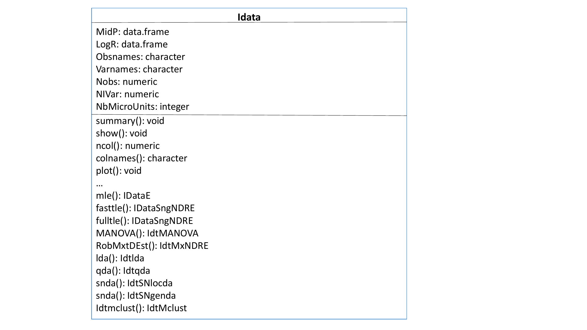
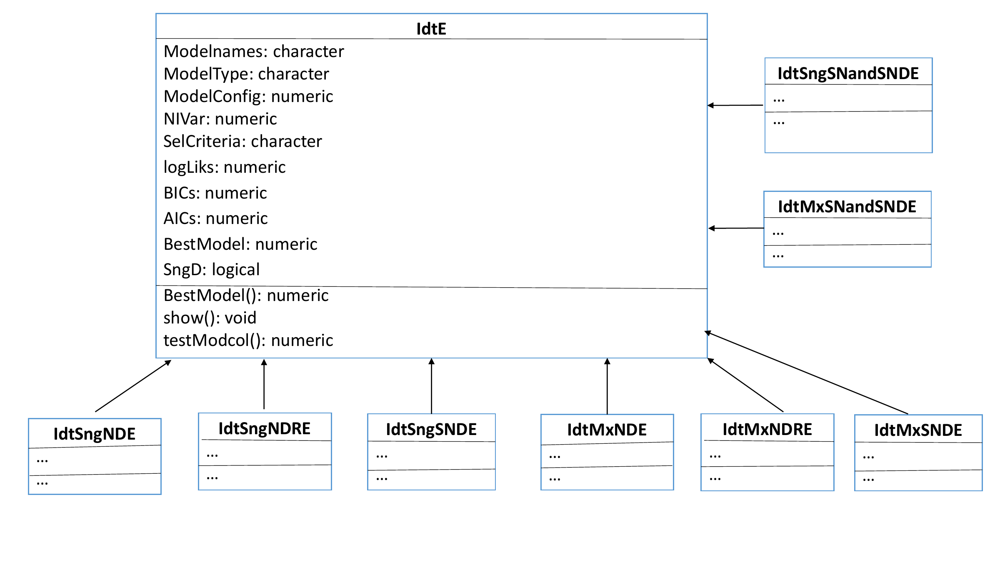
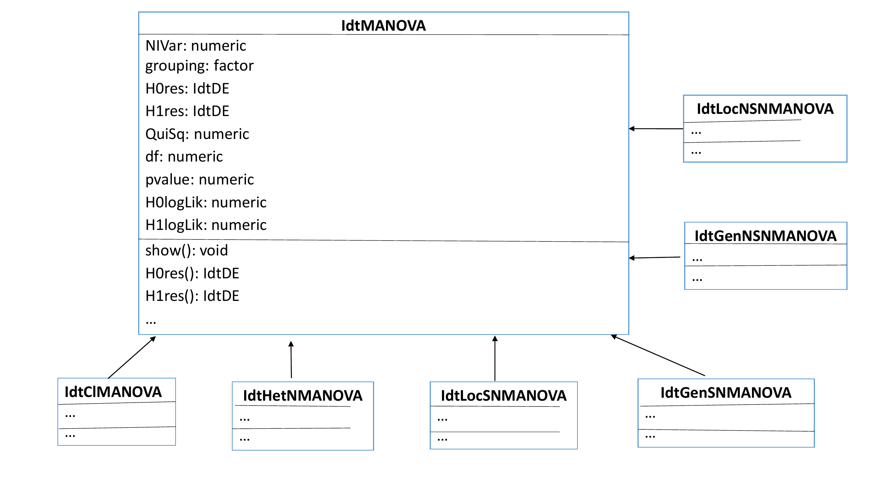
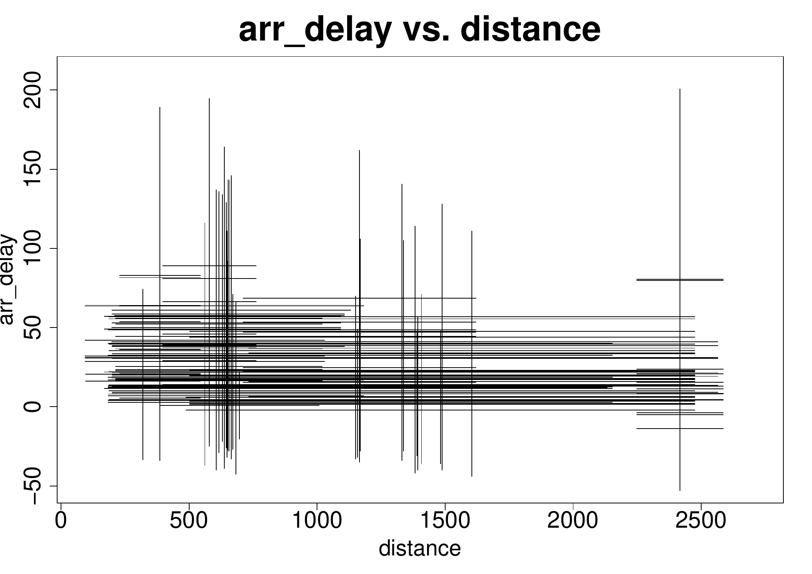
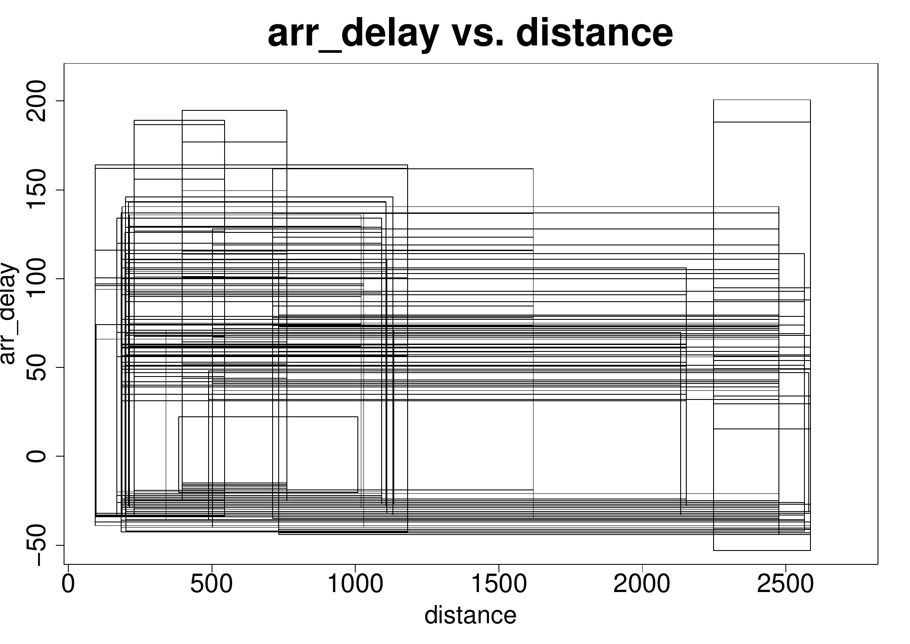

::: article
# Introduction {#introduction .unnumbered}

In classical statistics and multivariate data analysis, the basic units
under analysis are single individuals, described by numerical and/or
categorical variables, each individual taking one single value for each
variable. For instance, a specific football player may be described by
his age, height, weight, goals marked, nationality; a specific passenger
by his/her gender, age, destination, weight of luggage, etc. Data are
organised in a data-array, where each cell $(i,j)$ contains the value of
variable $j$ for individual $i$.

It is however often the case that the data under analysis are not single
observations, but rather sets of values, either related to groups of
units gathered on the basis of some common properties, or observed
repeatedly over time or under different specific conditions. The
classical framework is then somehow restricted to take into account
variability inherent to such data. This is the case when we are
interested in describing football teams and not each specific player, or
flights and not each particular passenger. The same issue often arises
in official statistics analysis. Whether it is for the analysis'
purposes, or for confidentiality reasons, individual data -- here
usually called "microdata" -- is gathered into more general data arrays,
related to parishes, counties, socio-economical groups, etc. -- the
so-called "macro-data". Internal variability should also be considered
when the focus of the analysis lies in concepts (i.e., all elements
sharing a given set of defining properties) rather than in a single
specimen -- whether it is a plant species (and not the specific plant I
hold in my hand), a model of car (and not the particular one I am
driving), etc. Another pertinent case arises when we are facing huge
amounts of data, recorded in very large databases, and elements of
interest are not the individual records but some second-level entities.
For instance, in a database of a hypermarket purchases, we are surely
more interested in describing the behaviour of some client (or some
pre-defined class or group of clients) rather than each purchase by
itself. The analysis requires then that the purchase data for each
person (or group) be somehow aggregated to obtain the information of
interest; here again the observed variability for each client or within
each group is of utmost importance, and cannot be retained by summary
statistics.

Symbolic Data Analysis (see e.g. [@DidNor08], [@Brito14]) provides a
framework where the variability observed may effectively be considered
in the data representation, and methods are developed that take that
into account. To describe groups of individuals or concepts, new
variable types may now assume other forms of realisations, which allow
taking intrinsic variability into account. They may take the form of
finite sets, intervals or distributions. In recent years, different
approaches have been investigated and many methods proposed for the
analysis of such symbolic data, and for the design of a symbolic
counterpart of statistical multivariate data analysis methods. Most
existing methods for the analysis of such data rely however on
non-parametric descriptive approaches. Among these, interval data is by
far the most investigated data type and for which more methods have been
developed.

In [@BriDS12], parametric inference methodologies based on probabilistic
models for interval variables are developed where each interval is
represented by its midpoint and log-range, for which multivariate Normal
and Skew-Normal [@azzval96] distributions are assumed. The intrinsic
nature of the interval variables leads to special structures of the
variance-covariance matrix, which are represented by different possible
configurations.

It should be noticed that we are modelling interval-valued variables,
i.e. variables whose observed values are intervals, and not
single-valued real variables. For this reason, they should not be
confused with real-valued variables whose values are restricted to some
intervals. Data structures for this latter type are available in some R
packages such as [*survreg*](https://CRAN.R-project.org/package=survreg)
[@surv] or [*crch*](https://CRAN.R-project.org/package=crch) [@crch],
but they obviously do not apply in our context.

In this paper, we present the package
[*MAINT.Data*](https://CRAN.R-project.org/package=MAINT.Data) [@DSB21],
which implements the proposed methodologies in R [@R].
[*MAINT.Data*](https://CRAN.R-project.org/package=MAINT.Data) is built
using S4 classes and methods, introducing a specific data class for
representing interval data. Functions for aggregating microdata into
interval data objects are also provided.
[*MAINT.Data*](https://CRAN.R-project.org/package=MAINT.Data) includes
functions and methods for modelling and analysing interval data, in
particular maximum likelihood estimation and statistical tests for the
different considered configurations. Methods for (M)ANOVA [@BriDS12] and
Discriminant Analysis [@DSBri15] of this data class are also provided.
For the Gaussian model, Model-based Clustering [@BriDSDias15], robust
estimation and outlier detection [@DSFBri] are implemented;
corresponding methods for Robust Discriminant Analysis are also
available.

Multivariate analysis of interval-valued data has been addressed from
different perspectives, as Clustering (see, e.g.,
[@CaBrBo06; @CarLec09]), Principal Component Analysis (PCA) (see, e.g.
[@douzal11; @Rade12]), Discriminant Analysis [@DSBri15; @Ramos16],
Regression Analysis [@DiasBrito17; @NetoCar08; @NetoCar10; @NetoCar11],
etc. For a survey the reader may refer to [@Brito14]. Those are mostly
non-parametric exploratory methodologies; recent approaches based on
parametric models have also been proposed in [@BriDS12], [@RadBil11],
and [@NetoCar11].

Many of the methods mentioned above for analysing interval-valued data
may be found in R packages, namely
[*symbolicDA*](https://CRAN.R-project.org/package=symbolicDA)
[@symbolicDA], (general multivariate data analysis/machine learning
approaches, e.g. PCA, Discriminant Analysis, Multidimensional Scaling,
Clustering), [*RSDA*](https://CRAN.R-project.org/package=RSDA) [@RSDA]
(mainly classification and linear models),
[*iRegression*](https://CRAN.R-project.org/package=iRegression)
[@iRegression] (Regression) and
[*GPCSIV*](https://CRAN.R-project.org/package=GPCSIV) [@GPCSIV] (PCA).
We note that most of these packages implement non-parametric methods, an
exception being
[*iRegression*](https://CRAN.R-project.org/package=iRegression) which
comprehends regression based on the parametric approach proposed in
[@NetoCar11]. To the best of our knowledge, no other implementations of
parametric approaches for the (multivariate) analysis of interval-valued
data are publicly available.

The remainder of the paper is organised as follows. In the next section,
we introduce interval data array and fix notation. Section **Models and
estimation** presents the proposed models and the estimation of
corresponding parameters. Section **Multivariate analysis** develops
multivariate analysis methods based on those models. Section **Package**
discusses the main structure and technical implementation of the
[*MAINT.Data*](https://CRAN.R-project.org/package=MAINT.Data) package.
In Section **Applications**, two applications illustrate the use of the
package and its functionalities. Finally, Section **Summary** concludes
the paper, pointing out perspectives for future developments.

# Interval data {#interval .unnumbered}

Let $S=\{s_{1}, \ldots,s_{n}\}$ be the set of $n$ units under analysis.
An interval variable is defined by an application

$Y : S \rightarrow  T$ such that
$s_i \rightarrow Y(s_i)=\left[l_i, u_i \right]$

where $T$ is the set of intervals of an underlying set
$O \subseteq I\!\! R$. Let $I$ be an $n\times p$ matrix containing the
values of $p$ interval variables on $S$. Each $s_{i} \in S$ is then
represented by a $p$-dimensional vector of intervals,
$I_{i}=(I_{i1}, \ldots, I_{ip}), i=1, \ldots, n$, with
$I_{ij} = [l_{ij},u_{ij}],$ with $u_{ij} \ge l_{ij} , j=1,\ldots, p$
(see Table [1](#table_intervals)). The models considered in
[*MAINT.Data*](https://CRAN.R-project.org/package=MAINT.Data) assume all
intervals are non-degenerate, i.e.,
$u_{ij} > l_{ij}, j=1,\ldots, p, i=1,\ldots, n.$

::: {#table_intervals}
  ---------- ------------------- ---------- ------------------- ---------- -------------------
                   $Y_{1}$        $\ldots$        $Y_{j}$        $\ldots$        $Y_{p}$

   $s_{1}$    $[l_{11},u_{11}]$   $\ldots$   $[l_{1j},u_{1j}]$   $\ldots$   $[l_{1p},u_{1p}]$

   $\ldots$       $\ldots$                       $\ldots$                       $\ldots$

   $s_{i}$    $[l_{i1},u_{i1}]$   $\ldots$   $[l_{ij},u_{ij}]$   $\ldots$   $[l_{ip},u_{ip}]$

   $\ldots$       $\ldots$                       $\ldots$                       $\ldots$

   $s_{n}$    $[l_{n1},u_{n1}]$   $\ldots$   $[l_{nj},u_{nj}]$   $\ldots$   $[l_{np},u_{np}]$
  ---------- ------------------- ---------- ------------------- ---------- -------------------

  : Table 1: Matrix $I$ of interval data
:::

The value of an interval variable $Y_j$ for each $s_i \in S$ is defined
by the lower and upper bounds $l_{ij}$ and $u_{ij}$ of
$I_{ij}=Y_j(s_i)$, here assumed to be strictly different (i.e.
degenerate intervals are not considered in this framework). For
modelling purposes, however, an alternative parametrisation that
consists in representing $Y_j(s_i)$ by the MidPoint
$c_{ij}= \displaystyle\frac{l_{ij}+u_{ij}}{2}$ and Log-Range
$r^*_{ij}=\ln(u_{ij}-l_{ij})$ of $I_{ij}$ is often adopted.

We note that the interval-valued data considered here do not represent
uncertainty, but rather intrinsic variability. Such interval data may
occur directly, or result from the aggregation of microdata. "Native"
interval data are common e.g. in Botany and Zoology, one example being
the length of the stem of a given plant species, which of course varies
from specimen to specimen. The aggregation of microdata from potentially
large databases also provides interval data, when individual numerical
records are combined at the required level of granularity leading to a
range of values representing the underlying variability. An example of
such a case is the aggregation of the values of single purchases say, in
the Bakery and Dairy section of a supermarket, for each client, during a
year -- we then obtain, for each client and for each supermarket
section, an interval representing the variability of purchase values.
Such aggregations are usually based on observed minima and maxima, but
specific quantiles may also be considered for this purpose.

# Models and estimation {#model .unnumbered}

## Models specification {#models-specification .unnumbered}

In [@BriDS12], parametric models for interval data, relying on
multivariate Normal or Skew-Normal distributions for the MidPoints and
Log-Ranges of the interval-valued variables have been proposed.

The Gaussian model consists in assuming a joint multivariate Normal
distribution $N(\mathbf{\mu},\mathbf{\Sigma})$ for the MidPoints $C$ and
the logs of the Ranges $R^*$, with
$\mathbf{\mu} =\left[\mathbf{\mu_C}^t \ \mathbf{\mu_{R^*}}^t \right]^t$
and $\mathbf{\Sigma}= \left(
\begin{array}{cc}
\mathbf{\Sigma_{CC}} & \mathbf{\Sigma_{CR^*}}\\
\mathbf{\Sigma_{R^*C}} & \mathbf{\Sigma_{R^*R^*}}\\
\end{array}
\right)$ where $\mathbf{\mu_C}$ and $\mathbf{\mu_{R^*}}$ are
$p$-dimensional column vectors of the mean values of, respectively, the
MidPoints and Log-Ranges, and
$\mathbf{\Sigma_{CC}}, \mathbf{\Sigma_{CR^*}}, \mathbf{\Sigma_{R^*C}}$
and $\mathbf{\Sigma_{R^*R^*}}$ are $p \times p$ matrices with their
variances and covariances. This model has the advantage of allowing for
a straightforward application of classical multivariate methods.

Given that the MidPoint $C_{ij}$ and the Log-Range $R^*_{ij}$ of the
value of an interval variable $Y_j(s_i)$ are related to the same
variable, they should, therefore, be considered together and their
relation taken into account by appropriate configurations of the global
covariance matrix. Intermediate parametrisations between the
non-restricted and the non-correlation setup considered for real-valued
data are, therefore, relevant for the specific case of interval data.

The most general formulation allows for non-zero correlations among all
MidPoints and Log-Ranges (configuration 1); in another setup, interval
variables $Y_j$ are independent, but for each variable, the MidPoint may
be correlated with its Log-Range (configuration 2); a third situation
allows for MidPoints (respectively, Log-Ranges) of different variables
to be correlated, but no correlation between MidPoints and Log-Ranges is
allowed (configuration 3); finally, all MidPoints and Log-Ranges may be
uncorrelated, both among themselves and between each other
(configuration 4). Table [2](#cases) summarizes the different considered
configurations. We note that from the normality assumption it follows
that, in this particular framework, imposing non-correlations with
Log-Ranges is equivalent to imposing non-correlations with Ranges.

::: {#cases}
  --------------- ------------------------------------------ -------------------------------------------------------------------------
   Configuration               Characterization                                          $\mathbf{\Sigma}$

        C1                      Not restricted                                            Not restricted

        C2                  $Y_j$'s not correlated            $\mathbf{\Sigma_{CC}}, \mathbf{\Sigma_{CR^*}}= \mathbf{\Sigma_{R^*C}}$,

                                                                              $\mathbf{\Sigma_{R^*R^*}}$ all diagonal

        C3            $C$'s not-correlated with $R^*$'s             $\mathbf{\Sigma_{CR^*}}=\mathbf{\Sigma_{R^*C}}=\mathbf{0}$

        C4         All $C$'s and $R^*$'s are not-correlated                         $\mathbf{\Sigma}$ diagonal
  --------------- ------------------------------------------ -------------------------------------------------------------------------

  : Table 2: Different cases for the variance-covariance matrix.
:::

It should be remarked that for configurations C2, C3 and C4,
$\mathbf{\mathbf{\Sigma}}$ can be written as a block diagonal matrix,
after a possible rearrangement of rows and columns.

In [@BriDS12] another configuration has been considered, where MidPoints
(respectively, Log-Ranges) of different variables may be correlated, the
MidPoint of each variable may be correlated with its Log-Range, but no
correlation between Midpoints and Log-Ranges of different variables is
allowed. However, this case seems less natural, and leads to
computational difficulties, since $\mathbf{\Sigma}$ can no longer be
written as a block diagonal matrix, and, therefore, it has not been used
in subsequent studies.\
The Gaussian model has many advantages, which explains its generalized
use in multivariate data analysis; in particular, it allows for a direct
modelling of the covariance structure between the variables.
Nevertheless, it does present some limitations, namely the fact that it
imposes a symmetrical distribution on the MidPoints and a specific
relation between mean, variance and skewness for the Ranges. A more
general model that overcomes these limitations may be obtained by
considering the family of Skew-Normal distributions (see, for instance,
[@azz85; @azzval96]). The Skew-Normal generalizes the Gaussian
distribution by introducing an additional shape parameter, while trying
to preserve some of its mathematical properties.

The density of a $q$-dimensional Skew-Normal distribution is given by
$$f(\mathbf{x};\mathbf{\alpha}, \mathbf{\xi}, \mathbf{\Omega})=2\phi_q(\textbf{x}-\mathbf{\xi}; \mathbf{\Omega})\Phi(\mathbf{\alpha}^t\mathbf{\omega}^{-1} (\textbf{x}- \mathbf{\xi})), \textbf{x}\in I\!\! R^{q}$$
where now $\mathbf{\xi}$ and $\mathbf{\alpha}$ are $q$-dimensional
vectors, $\mathbf{\Omega}$ is a symmetric $q \times q$ positive-definite
matrix, $\mathbf{\omega}$ is a diagonal matrix formed by the
square-roots of the diagonal elements of $\mathbf{\Omega}$, $\phi_q$ is
the density of a $N_q(0,\mathbf{\Omega})$ and $\Phi$ is the distribution
function of a standard Gaussian variable.

Notice that the Skew-Normal model encompasses mixed models with marginal
Normal random variables, for which the corresponding shape parameter is
null.

The mean vector, variance-covariance matrix, and skewness coefficients
of a $q$-dimensional Skew-Normal distribution are given by (see
[@azz05])
$$\label{muSN}
\mathbf{\mu} = E(\mathbf{X}) = \mathbf{\xi} + \mathbf{\omega} \mathbf{\mu}_Z   (\#eq:muSN)$$

$$\label{SigmaSN}
\mathbf{\Sigma} = Var(\mathbf{X}) = \mathbf{\Omega}- \mathbf{\omega} \mathbf{\mu}_Z \mathbf{\mu}_Z^t \mathbf{\omega}   (\#eq:SigmaSN)$$

$$\label{gama1SN}
\gamma_{1,\ell} =   \frac{E[(X_{\ell}-E(X_{\ell}))^3]}{Var(X_{\ell})^{3/2}} = \frac{4-\pi}{2} \frac{\mu_{Z;\ell}^3}{(1-\mu_{Z;\ell}^2) ^{3/2}} \  \ , \  \ell=1,\ldots,q   (\#eq:gama1SN)$$
where $\mathbf{\mu}_Z$ is a vector of expected values for standard
Skew-Normal variables, which are defined by
$$\displaystyle \mathbf{\mu}_{Z} = \sqrt{\frac{2}{\pi}} \,\,\frac{\mathbf{\omega}^{-1} \mathbf{\Omega} \mathbf{\omega}^{-1}\mathbf{\alpha}} {\sqrt{1+\mathbf{\alpha}^t \mathbf{\omega}^{-1} \mathbf{\Omega} \mathbf{\omega}^{-1}\mathbf{\alpha}}}$$

As an alternative to the Gaussian model, it may be considered that
$(C, R^*)$ follows jointly a $2p$-multivariate Skew-Normal distribution,
for which the different alternative configurations of the
$\mathbf{\Sigma}$ matrix may be assumed. Given (\@ref(eq:SigmaSN)), a
null covariance $\mathbf{\Sigma}(j,j')$ implies that
$\mathbf{\Omega}(j,j')=\mathbf{\Omega}(j,j)^{\frac{1}{2}}\mathbf{\mu}_{Z_j}\mathbf{\Omega}(j',j')^{\frac{1}{2}}\mathbf{\mu}_{Z_{j'}}$
or, equivalently, $\mathbf{\Omega}(j,j)=$
$\displaystyle \frac{2}{\pi}    \frac{1}{1+\mathbf{\alpha}^t \mathbf{\omega}^{-1}
	\mathbf{\Omega} \mathbf{\omega}^{-1}\mathbf{\alpha}}    \mathbf{\Omega_j}^t \mathbf{\omega}^{-1}\mathbf{\alpha} \mathbf{\alpha}^t \mathbf{\omega}^{-1} \mathbf{\Omega_{j'}}$
where $\mathbf{\Omega_j}$ denotes the $j^{th}$ column of
$\mathbf{\Omega}$. This defines non-linear relations between the
parameters in $\mathbf{\Omega}$ and $\mathbf{\alpha}$.

## Maximum likelihood estimation {#maximum-likelihood-estimation .unnumbered}

As discussed in the previous subsection, [@BriDS12] consider as possible
models for interval-valued data, eight possible combinations of two
multivariate distributions (Gaussian or Skew-Normal) with four
covariance configurations. Given an observed data set, the choice among
these models may be based on their maximised likelihood using usual
information criteria such as the Bayesian Information Criterion (BIC)
[@Schwarz:78], the Akaike Information Criterion (AIC) [@AIC74], or
pairwise likelihood ratio tests. In this subsection we will present the
details of the respective maximum likelihood estimation.

### Gaussian model {#gaussian-model .unnumbered}

Let $\mathbf{X_i}= \left[\mathbf{{C_i}}^t ,\mathbf{{R^*_i}}^t \right]^t$
be the $2p$-dimensional column vector comprising all the MidPoints and
Log-Ranges for unit $s_i$, $\mathbf{\bar{X}}$ be sample mean of the
$\mathbf{X_i}$'s and
$\displaystyle \mathbf{E}=\sum_{i=1}^n \mathbf{(X_i-\bar{X})(X_i-\bar{X})^t}$.
For all configurations, the log-likelihood can be written as

$$\label{lnL}
\displaystyle \ln L(\mathbf{\mu},\mathbf{\Sigma})= l = -np   \ln(2\pi)-\frac{n}{2}   \ln \det\mathbf{\Sigma} -\frac{1}{2}   \mathop{\mathrm{Tr}}(\mathbf{E}\mathbf{\Sigma}^{-1}) - \frac{n}{2} \left(\mathbf{\bar{X}}-\mathbf{\mu}\right)^t\mathbf{\Sigma}^{-1}\left(\mathbf{\bar{X}}-\mathbf{\mu}\right)   (\#eq:lnL)$$

Under the unrestricted configuration C1, the maximum likelihood
estimators of $\mathbf{\mu}$ and $\mathbf{\Sigma}$ are obviously the
classical ones, $\hat{\mathbf{\mu}}=\mathbf{\bar{X}}$ and
$\displaystyle \hat{\mathbf{\Sigma}}= \frac{1}{n} \mathbf{E}$. In the
restricted configurations C2 to C4, the maximum of (\@ref(eq:lnL)) can
be obtained by separately maximising with respect to each block of
$\mathbf{\Sigma}$, and the estimators are obtained from the
non-restricted estimators simply replacing the null parameters in
$\mathbf{\Sigma}$ by zeros (see [@BriDS12]).

### Skew-Normal model {#Estim_SN .unnumbered}

Azzalini and Capitanio (see, e.g., [@azzcap99; @azz05]) have obtained
the log-likelihood of a $q$-dimensional Skew-Normal distribution as\

$$\label{lnLSN}
\displaystyle \ln L(\mathbf{\xi},\mathbf{\Omega},\mathbf{\alpha})= l=  constant -\frac{1}{2} n \ln \det\mathbf{\Omega} -\frac{n}{2} \mathop{\mathrm{Tr}}(\mathbf{\Omega}^{-1}\textbf{V})+\sum_i \zeta_0 (\mathbf{\alpha}^t \mathbf{\omega}^{-1}(\mathbf{X_i}-\mathbf{\xi}))   (\#eq:lnLSN)$$
where
$\mathbf{V}=n^{-1}\sum_i(\mathbf{X_i}-\mathbf{\xi})(\mathbf{X_i}-\mathbf{\xi})^t$
and $\zeta_0(v)=\ln (2\Phi(v))$. The maximisation of (\@ref(eq:lnLSN))
is performed in two steps by defining a new parameter,
$\mathbf{\eta} = \mathbf{\alpha}^t  \mathbf{\omega}^{-1}$, and
separating the maximisation on $\mathbf{\xi}$ and $\mathbf{\eta}$ from
the maximisation on $\mathbf{\Omega}$ given $\mathbf{\xi}$, which has
the analytical solution $\mathbf{\Omega} = \mathbf{V}$.

The optimal likelihood solution for the Skew-Normal model with
restricted configurations may not be obtained by simply replacing
corresponding entries in the appropriate matrices, because of the
non-linear relations between the parameters in $\mathbf{\Omega}$ and
$\mathbf{\alpha}$. For the Skew-Normal model with restricted
configurations, we rely on a centred parametrisation [@ValAzz08], which
employs directly the parameters $\mathbf{\mu}$, $\mathbf{\Sigma}$ and
$\mathbf{\gamma_1}$ given by (\@ref(eq:muSN)), (\@ref(eq:SigmaSN)) and
(\@ref(eq:gama1SN)), respectively. The log-likelihood is maximised with
respect to $\mathbf{\mu}$, $\mathbf{\gamma_1}$ and the free elements in
$\mathbf{\Sigma}$. This optimisation must be done numerically; see
Subsection **Implementation** of Section **Package** for the details of
the implementation adopted in package
[*MAINT.Data*](https://CRAN.R-project.org/package=MAINT.Data).

## Robust estimation and outlier detection {#robust .unnumbered}

Multivariate datasets often include data units that deviate from the
main pattern, usually called *outliers*, which may strongly influence
the maximum likelihood estimators, leading to the need of alternative
(robust) estimators. In the context of interval-valued data this problem
has been addressed in [@DSFBri].

There is an extensive literature on robust estimation of location and
scatter parameters. Trimmed likelihood estimators [@HadiLuc97] are based
on a sample subset, keeping only the $h$ units that contribute most to
the likelihood function. For multivariate Gaussian data, this approach
is equivalent to the well-known Minimum Covariance Determinant (MCD)
method [@Rousseeuw84; @Rousseeuw85] which consists in using the sample
subset that minimises the determinant of the covariance matrix estimate
[@HadiLuc97]. Since finding the true MCD is an NP-hard problem, when $n$
is not small, a good approximation based on a computationally fast
algorithm is usually employed [@RousseeuwVD99].

Outlier detection usually relies on Mahalanobis distances, flagging
units as outliers if their distances from an appropriate estimate of the
multivariate mean $\mathbf{m}$ is above a chosen quantile of an
appropriate distribution. (Squared) Mahalanobis distances are defined as
$D^2_{\mathbf{m,C}}(i)= \mathbf{(X_i-m)^t C^{-1}(X_i-m)}$ where
$\mathbf{C}$ is an estimate of the covariance matrix. Traditionally, a
Chi-square approximation is used for the distribution of MCD-robust
squared Mahalanobis distances; however, [@Cerioli10] proposed finite
sample approximations with better properties for small and even
moderately large sample sizes.

Moreover, more efficient one-step re-weighted MCD estimators are often
used [@HubRVA08]. These are obtained by giving null weight only to the
units for which the raw squared robust Mahalanobis distance exceeds a
high threshold value, e.g., the $97.5\%$ quantile of the classical
Chi-square or, alternatively, of the scaled-F approximation
[@HardRock05]. Furthermore, the resulting covariance estimators are
usually multiplied by consistency and bias correction factors (see
[@Pison02]).

In practice, one needs to specify the number $h$ of data points to be
initially used. Two common choices are to fix this number around $50\%n$
maximising the breakdown point, or around $75\%n$ for larger efficiency
[@HubRVA08]. Recently, in the context of interval data outlier
identification, [@DSFBri] proposed a two-step approach where the outlier
detection procedure is first run to get an estimate of the outlier
proportion and in a second step the procedure is repeated fixing the
trimming parameter at the value obtained in the first step.

The trimmed Maximum Likelihood approach described above has been adapted
to the problem of robust parameter estimation for the Gaussian models
proposed for interval-valued data. For all considered covariance
configurations, the trimmed log-likelihood can be written as
$$\ln \ TL(\mathbf{\mu},\mathbf{\Sigma}) =  -\frac{h}{2} \left( 2p \ \ln(2\pi)   +
\ln\ \det\mathbf{\Sigma} +  \mathop{\mathrm{Tr}}(\tilde{\mathbf{\Sigma}}  \mathbf{\Sigma}^{-1})  + \left(\tilde{\mathbf{\mu}}-\mathbf{\mu}\right)^t\mathbf{\Sigma}^{-1}\left(\tilde{\mathbf{\mu}}-\mathbf{\mu}\right) \right)$$
where $h$ is the number of observations kept in the trimmed sample, and
$\tilde{\mathbf{\mu}} = \frac{1}{h} \displaystyle \sum_{i=1}^h \mathbf{X_i}, \ \tilde{\mathbf{\Sigma}} = \frac{1}{h} \displaystyle \sum_{i=1}^h (\mathbf{X_i}-\tilde{\mathbf{\mu}})(\mathbf{X_i}-\tilde{\mathbf{\mu}})^t$
are the trimmed mean and trimmed sample covariance, respectively.

In the case of a restricted covariance matrix, the block diagonal
structure always implies that trimmed likelihood maximisation is
equivalent to the minimisation of the determinant of the restricted
trimmed sample covariance matrix.

The one-step re-weighted bias-corrected estimators are given by
$$\begin{aligned}
\hat{\mathbf{\mu}}_1 = \frac{\displaystyle \sum_{i=1}^n w_i \mathbf{X_i}}{{h_1}}
\ \ \ \ \ \ \ \ \ \ \ \ \ \ \ \ \ \ \ \ \ \ \ \ \ \ \ \ \ \\
\hat{\mathbf{\Sigma}}_{1} = \frac{l_{h_1}  \ c_1  \displaystyle \sum_{i=1}^n w_i (\mathbf{X_i}-\hat{\mathbf{\mu}}_1)(\mathbf{X_i}-\hat{\mathbf{\mu}}_1)^t}{{h_1}}
\label{musigma}
\end{aligned}   (\#eq:musigma)$$

$$h_1 = \displaystyle  \sum_{i=1}^n w_i  \ \ \ \ \ \
	w_i = \left\{
	\begin{array}{cl}
	1, &   if  \ \ \ l_h  c \
	D_{\tilde{\mathbf{\mu}},\tilde{\mathbf{\Sigma}}}(i) \leq \sqrt{Q_{0.975}}
	\\
	0, & otherwise  \\
	\end{array}
	\right.$$

where $Q_{0.975}$ is the $97.5\%$ quantile of the
$D^2_{\tilde{\mathbf{\mu}},\tilde{\mathbf{\Sigma}}}$ distribution. In
[*MAINT.Data*](https://CRAN.R-project.org/package=MAINT.Data) this
distribution is approximated by a Chi-square distribution with $2p$
degrees of freedom or by a (scaled) F distribution as proposed by
[@HardRock05].

In expression (\@ref(eq:musigma)), $l_h$ and $l_{h_1}$ are consistency
correction factors, whereas $c$ and $c_1$ are finite-sample
bias-correction factors - for more details see [@DSFBri].

These estimates may then be used for outlier detection in an
interval-valued dataset. For that purpose, the robust squared
Mahalanobis distance for unit $i$, based on $\hat{\mathbf{\mu}}_1$ and
$\hat{\mathbf{\Sigma}}_{1}$, is compared with the chosen upper quantile
of either the $\chi^2_{2p}$ distribution or using the approximations
(see [@Cerioli10]):
$$\begin{aligned}
\label{FBeta}
D^2_{\hat{\mathbf{\mu}}_1,\hat{\mathbf{\Sigma}}_1}  \sim \frac{(h_1-1)^2}{h_1}  Beta \left(p,\frac{h_1-2p-1}{2} \right) , \ \ \ \  if \ \  w_i=1 \\
D^2_{\hat{\mathbf{\mu}}_1,\hat{\mathbf{\Sigma}}_1}  \sim \frac{h_1+1}{h_1} \frac{(h_1-1)2p}{h_1-2p}  F \left(2p,h_1-2p \right), \ \ \ \  if \ \  w_i= 0
\end{aligned}   (\#eq:FBeta)$$

# Multivariate analysis {#methods .unnumbered}

## Analysis of Variance {#analysis-of-variance .unnumbered}

The models presented above for interval-valued variables allow
addressing (M)ANOVA problems with interval data - see [@BriDS12]. Since
each interval-valued variable $Y_j$ is modelled by
$\left[C_{ij} , R^*_{ij} \right]$, an analysis of variance of $Y_j$ is
accomplished by a two-dimensional MANOVA.

Assume a one-way design, with a single factor with $k$ levels, and let
$n_\ell$ be the number of units in group $\ell$. Let
$X_{ij}= \left[C_{ij} , R^*_{ij} \right]^t$ be the $2$-dimensional
column vector with the MidPoint and Log-Range of variable $Y_j$ for unit
$s_i$, and let $\mu_{\bullet j \ell}$ be the population means of the
$X_{j}$'s in group $\ell$. In this case, the null hypothesis states that
all $\mu_{\bullet j \ell}$ are equal across groups. In all cases, for
both models and all covariance configurations, we follow a likelihood
ratio approach.

In the Gaussian model, the usual likelihood ratio statistic $\lambda$
can be computed in a straightforward manner. Under the unrestricted case
C1, this statistic is obviously equal to the classical one; in the
restricted covariance cases, its value may be obtained replacing the
null entries corresponding to each configuration in the sum of squares
and cross-products MANOVA matrices (see e.g. [@huberty2006] for the
definition of those matrices). For the Skew-Normal model, given there is
no closed form for the maximum likelihood estimates, the value of
$\lambda$ must be obtained by numerical optimisation (see Subsection
**Implementation** of Section **Package**).

As usual, under the null hypothesis, $-2\ln \lambda$, follows
asymptotically a Chi-square distribution. For small samples a
permutation test may be used to approximate the distribution of this
test statistic.

A simultaneous analysis of all the $Y$'s interval-valued variables may
be accomplished by a $2p$-dimensional MANOVA, following the same
procedure.

## Discriminant Analysis {#discriminant-analysis .unnumbered}

The classical decision theoretic approach to Discriminant Analysis
assumes that a given vector of attributes follows some known
distribution and derives an optimal classification rule that minimises
either the misclassification probability or the expected value of the
misclassification cost. Parametric discriminant analysis of
interval-value data based on the models above has been investigated in
[@DSBri15].

In a problem with $k$ groups, $\Gamma_{\ell}, \ell=1, \ldots, k$, denote
the *a priori* group membership probabilities by $\pi_{\ell}$ and the
within group probability or density function by $f_{\ell}(\textbf{x})$,
where $\textbf{x}$ are attribute vectors. Under the assumption that
misclassification cost are equal across groups, the optimal rule assigns
a unit to the group $\Gamma_{\ell}$ for which
$\pi_{\ell} f_{\ell}(\textbf{x})$ is maximal (see, e.g. [@McLachlan]);
in practice the unknown parameters in these rules must be estimated from
observations with known group membership.

When $f_{\ell}(.)$ is a Gaussian density, and the covariance matrices
are equal across groups, the approach described above leads to a linear
classification rule, whereas when covariance matrices differ from group
to group, a quadratic classification rule is obtained.

Consider the Gaussian model for interval data. For each covariance
configuration, an estimate of the optimum classification rule can be
obtained by direct generalisation of the classical linear and quadratic
discriminant classification rules, leading to group assignments defined
by, respectively,

$$\label{linear}
\Gamma = \mathop{\mathrm{argmax}}_{\ell} (\hat{\mathbf{\mu}}_{\mathbf{\ell}}^t \hat{\mathbf{\Sigma}}^{-1} \textbf{x} - \frac{1}{2} \hat{\mathbf{\mu}}_{\mathbf{\ell}}^t \hat{\mathbf{\Sigma}}^{-1}\hat{\mathbf{\mu}}_{\mathbf{\ell}} + \ln \ \hat{\pi}_{\ell})   (\#eq:linear)$$

$$\label{quad}
\Gamma = \mathop{\mathrm{argmax}}_{\ell}  (- \frac{1}{2}\textbf{x}^t \hat{\mathbf{\Sigma}}_{\mathbf{\ell}}^{-1} \textbf{x} + \hat{\mathbf{\mu}}_{\mathbf{\ell}}^t \hat{\mathbf{\Sigma}}_{\mathbf{\ell}}^{-1} \textbf{x} +
\ln \ \hat{\pi}_{\ell} - \frac{1}{2} (\ln \det \hat{\mathbf{\Sigma}}_{\mathbf{\ell}} + \hat{\mathbf{\mu}}_{\mathbf{\ell}}^t \hat{\mathbf{\Sigma}}_{\mathbf{\ell}}^{-1}\hat{\mathbf{\mu}}_{\mathbf{\ell}}))   (\#eq:quad)$$
where
$\hat{\mathbf{\mu}}_{\mathbf{\ell}}, \hat{\mathbf{\Sigma}}, \hat{\mathbf{\Sigma}}_{\mathbf{\ell}}$
and $\hat{\pi}_{\ell}$ are appropriate estimates of
$\mathbf{\mu}_{\mathbf{\ell}}, \mathbf{\Sigma}, \mathbf{\Sigma}_{\mathbf{\ell}}$
and $\pi_{\ell}$ for the corresponding cases.

In [*MAINT.Data*](https://CRAN.R-project.org/package=MAINT.Data), all
mean and covariance estimates in (\@ref(eq:linear)) and (\@ref(eq:quad))
may be obtained by either classical maximum likelihood or the robust
trimmed maximum likelihood approach (see Section **Robust estimation and
outlier detection**).

We note that for the restricted configurations C2, C3 and C4,
$\hat{\mathbf{\Sigma}}$ and $\hat{\mathbf{\Sigma}}_{\mathbf{\ell}}$ are
obtained from the corresponding unrestricted estimates replacing all the
null covariances by zeros.

For the Skew-Normal case, we consider a Location Model in which the
groups differ only in terms of the location parameter $\mathbf{\xi}$,
and a General Model, where the groups differ in terms of all parameters.
The corresponding classification rules are, respectively,
$$\label{SNlocation}
\Gamma = \mathop{\mathrm{argmax}}_{\ell} (\hat{\mathbf{\xi}}_{\mathbf{\ell}}^t \, \hat{\mathbf{\Omega}}^{-1} \textbf{x} - \frac{1}{2} \hat{\mathbf{\xi}}_{\mathbf{\ell}}^t \, \hat{\mathbf{\Omega}}^{-1}\hat{\mathbf{\xi}}_{\mathbf{\ell}}
+ \ln \ \hat{\pi}_{\ell} +  \zeta_0(\hat{\mathbf{\alpha}}^t \hat{\mathbf{\omega}}^{-1}(\textbf{x}-\hat{\mathbf{\xi}}_{\ell})))   (\#eq:SNlocation)$$

$$\begin{aligned}
 \label{general}
\Gamma = \mathop{\mathrm{argmax}}_{\ell}  (- \frac{1}{2} \textbf{x}^t \hat{\mathbf{\Omega}}_{\mathbf{\ell}}^{-1} \textbf{x} + \hat{\mathbf{\xi}}_{\mathbf{\ell}}^t \, \hat{\mathbf{\Omega}}_{\mathbf{\ell}}^{-1} \textbf{x} +
\ln \ \hat{\pi}_{\ell} - \\ \nonumber
\frac{1}{2} (\ln \; \det \hat{\mathbf{\Omega}}_{\mathbf{\ell}}  + \hat{\mathbf{\xi}}_{\mathbf{\ell}}^t \, \hat{\mathbf{\Omega}}_{\mathbf{\ell}}^{-1}\hat{\mathbf{\xi}}_{\mathbf{\ell}}) + \zeta_0(\hat{\mathbf{\alpha}}_{\mathbf{\ell}}^t \, \hat{\mathbf{\omega}}_{\mathbf{\ell}}^{-1}(\textbf{x}-\hat{\mathbf{\xi}}_{\mathbf{\ell}})))
\end{aligned}   (\#eq:general)$$
where
$\hat{\mathbf{\xi}}_{\mathbf{\ell}}, \hat{\mathbf{\Omega}}, \hat{\mathbf{\Omega}}_{\mathbf{\ell}}, \hat{\mathbf{\alpha}}$
and $\hat{\mathbf{\alpha}}_{\mathbf{\ell}}$ are estimates of location,
scale, association and shape parameters (see [@azzcap99]),
$\hat{\mathbf{\omega}}$ and $\hat{\mathbf{\omega}}_{\mathbf{\ell}}$ are
the square-roots of the diagonal elements of the matrices
$\hat{\mathbf{\Omega}}$ and $\hat{\mathbf{\Omega}}_{\mathbf{\ell}}$,
respectively, and $\zeta_0(v) = \ln (2 \Phi(v))$. In
[*MAINT.Data*](https://CRAN.R-project.org/package=MAINT.Data) these are
all maximum likelihood estimates.

## Model-based Clustering {#clust .unnumbered}

Model-based Clustering considers the data as arising from a distribution
that is a mixture of two or more components
[@BanRaf93; @FraRaf02; @McLachlanPeel00]. Each component, that can be
thought as a cluster, is characterised by a conditional density/mass
function and has an associated probability or "weight". When the
conditional probability is specified as the multivariate Gaussian
density, the probability model for clustering will be a finite mixture
of multivariate Normals (known as the Gaussian mixture model).

The problem consists in estimating the model parameters for each
component, as well as the membership (posterior) probabilities of each
unit. To this purpose, the Expectation-Maximisation (EM) algorithm
[@Dempster77] is commonly used. The method alternates between an
expectation (E) step, which computes the expectation of the
log-likelihood at the current parameter estimates, and a maximisation
(M) step, which estimates parameters maximising the expected
log-likelihood found in the E step.

Model-based Clustering of interval data has been addressed in
[@BriDSDias15], by considering the Gaussian parametrisation described
above (see Section **Models and estimation**). For that purpose, the EM
algorithm has been adapted to the likelihood maximisation in our models,
for the different covariance configurations.

The finite mixture model with $k$ components for $2p$-dimensional data
vector $\mathbf{x}$ is defined by
$$f(\mathbf{x;\varphi})=\sum_{\ell=1}^{k}\tau_{\ell}f_{\ell}(\mathbf{x;\theta_{\ell}})$$
where all $\tau_{\ell} >0$ and $\tau_1+ \ldots + \tau_k=1$;
$\mathbf{\theta_{\ell}}$ denotes parameters of the conditional
distribution of component $\ell$.

Here the conditional distribution is given by
$N(\mathbf{\mu}_{\ell},\mathbf{\Sigma}_{\ell}$); maximum likelihood
parameter estimation involves the maximisation of the log-likelihood
function:
$$\ln L(\mathbf{\varphi};\mathbf{x})=\displaystyle \sum_{i=1}^{n} \ln f(\mathbf{x}_{i};\mathbf{\varphi})$$
where
$\mathbf{\varphi} =(\tau_1, \ldots, \tau_k,\mathbf{\theta_1}, \ldots, \mathbf{\theta_k})$.

In Model-based clustering of interval data,
$\mathbf{X_i}= {\left[\mathbf{C_i}^t ,\mathbf{{R^*_i}}^t \right]}^t$ is
defined as the $2p$-dimensional vector comprising all the MidPoints and
Log-Ranges for $s_i$, and the "complete" data are considered to be
$(\mathbf{x_i,z_i})$, where $\mathbf{z_i} = (z_{i1}, \dots, z_{ik})$ is
assumed as the "missing" data, with $z_{i\ell} = 1$ if $s_i \in$
component $\ell$ and $z_{i\ell} = 0$ otherwise. In the unrestricted
case, the M-step formulas for
$\hat{\mathbf{\Sigma}},\ \hat{\mathbf{\Sigma}}_{\mathbf{\ell}}$ are the
classical ones; for the restricted configurations
$\hat{\mathbf{\Sigma}}$ and
$\hat{\mathbf{\Sigma}}_{\mathbf{\ell}}, \ell=1,\ldots,k$ are obtained
maximising the likelihood for each block separately (see [@BriDS12]).\
For the selection of the appropriate model and the number of components
$k$, we use the Bayesian Information Criterion (BIC).

# Package {#package .unnumbered}

## Design {#Design .unnumbered}

[*MAINT.Data*](https://CRAN.R-project.org/package=MAINT.Data) is built
around S4 classes and methods, the most important being the IData class
and classes derived from the virtual IdtE (IData Estimates) classes.
Further specialised classes used to store the results of various
multivariate analysis (*e.g.* Model-based Clustering, MANOVA and
Discriminant Analysis) are also available. Figure [1](#MD_OV) shows
common interactions between different objects of
[*MAINT.Data*](https://CRAN.R-project.org/package=MAINT.Data) classes.

{#MD_OV width="100%"
alt="graphic without alt text"}

We note that in addition to the flow shown in Figure [1](#MD_OV),
objects containing the results of Discriminant Analysis of Interval Data
may also be obtained from appropriate objects of class `IdtMANOVA`, or
directly from the combination of objects of class IData with a grouping
factor.

Class `Idata`, which is used to store datasets of interval-valued
variables, is the central class in the
[*MAINT.Data*](https://CRAN.R-project.org/package=MAINT.Data) package.
Its design aims at replicating the functionalities of classical data
frames as smoothly as possible. As seen in Figure [1](#MD_OV), objects
of class `IData` may be created in one of two alternative ways: (i)
directly from data frames containing either lower and upper bounds or
MidPoints and Log-Ranges, using the creator function `IData`; (ii) by
aggregation of a data frame of the microdata by a given aggregating
factor and criterion (*e.g.* min-max or a given pair of quantiles),
using the function `AgrMcDt`.

The creator function `IData` takes five arguments as input. The first
one, named *Data* refers to a data frame or matrix containing either the
lower and upper bounds or the MidPoints and Log-Ranges of the observed
intervals, where each row corresponds to a different unit. Then, *Seq*
is a string which describes the sequence of the data for each unit,
namely, lower and upper bounds variable by variable (*"LbUb_VarbVar"*,
default), MidPoints and Log-Ranges variable by variable
(*"MidPLogR_VarbVar"*), all lower bounds followed by all upper bounds
(*"AllLb_AllUb"*), or all MidPoints followed by all Log-Ranges
(*"AllMidP_AllLogR"*). The third and fourth arguments, named *VarNames*
and *ObsNames*, allow the user to specify the variables' and units'
names, respectively. Finally, the last argument *NbMicroUnits* provides
the number of micro observations corresponding to each unit, when
available. A typical call of this function would be
`ExampleIdt <- IData(dataDF,VarNames=c(“Var1”,“Var2”)`) (no names for
the units, number of micro observations corresponding to each unit not
available).

Function `AgrMcDt` has three arguments. The first one, *MicDtDF*
indicates a data frame with the microdata. The second argument, *agrby*
refers to a factor with the categories according to which the microdata
should be aggregated. The last argument *agrcrt* specifies whether
aggregation is done with the minimum and maximum observed values, or
else based on user-defined quantiles. An example is shown in Section
**Applications**.

A UML diagram of class `Idata` is shown in Figure [2](#ID_CL). As seen
here, class `Idata` implements specialised versions of standard R
methods such as `summary`, `print`, `nrow` and `ncol`, `rownames` and
`colnames`, `rbind`, `cbind` and `plot`. Special care has been taken in
the development of indexing operators and of a specialised `cbind`
method, so that they work as smoothly as with data frames, but treating
each column of `Idata` as one interval-valued variable.

The remaining `Idata` methods perform parameter estimation and/or
multivariate analysis leading to objects of class `IdtE` (parameter
estimation), `IdtMANOVA` (Multivariate Analysis of Variance), `Idtda`
(Discriminant Analysis), or `IdtMclust` (Model-based Clustering). All
these methods include a `Covcase` argument used to specify the
covariance configurations assumed, which by default compares the BIC of
the results for all four configurations, and select the one with the
lowest BIC value.

{#ID_CL width="100%"
alt="graphic without alt text"}

The `IdtE` class is an abstract (virtual) class used to store parameter
estimates of the models assumed for interval-valued variables. As shown
in Figure [3](#IDE_CL) there are currently eight such specialisations,
depending on the model assumed and type of estimation performed. The
names of these classes always start with the letters *Idt* followed by
*Sng* or *Mx* (estimates of parameters of a single or several
distributions), *ND*, *SND* or *NandSND* (Gaussian, SkewNormal or both
Gaussian and SkewNormal distributions), and end with *E* or *RE*
(Maximum Likelihood or Robust estimates).

{#IDE_CL width="100%"
alt="graphic without alt text"}

As shown in Figure [4](#IDMNV_CL) the same reasoning applies to classes
derived from the virtual class `IdtMANOVA`. However, in this case, only
Maximum Likelihood estimation has been considered and the
specialisations distinguish classical MANOVA (class `IdtClMANOVA`),
heterocedastic MANOVA based on Gaussian distributions (`IdtHetNMANOVA`),
Skew-Normal based MANOVA assuming that groups may differ only in
location (`IdtLocNMANOVA`) or on all parameters (`IdtGenNMANOVA`), and
analyses that consider both Gaussian and SkewNormal assumptions
(`IdtLocNSNMANOVA` and `IdtGenNSNMANOVA`).

{#IDMNV_CL
width="100%" alt="graphic without alt text"}

Maximum likelihood estimation is performed by the `mle` method, which
has six arguments. The first one, *Idt* refers to an IData object
representing interval-valued units. The second argument, *Model*
indicates the joint distribution assumed for the MidPoint and LogRanges;
alternatives are "Normal" for Gaussian (default), "SKNormal" for
Skew-Normal and "NrmandSKN" for both Gaussian and Skew-Normal
distributions. The next argument, *CovCase* indicates the configurations
of the variance-covariance matrix to be used (default: 1:4). The fourth
argument, *SelCrit* indicates the model selection criterion, BIC
(default) or AIC. The argument *kmax* specifies a tolerance criterion to
identify singular correlation matrices. Finally, *OptCntrl* provides a
list of optional control parameters to be passed to the optimization
routine.

Robust estimation is usually performed by the `fasttle` method. Note
that for small datasets, the `fulltle` method may be used, whose
arguments are common to `fasttle`. The first three arguments of
`fasttle` are the same as for the `mle` method. Arguments *alpha* and
*getalpha* specify how the trimming proportion is chosen. Other
important arguments are the following: *use.correction* indicates
whether to use finite sample correction factors, default is TRUE.
*rawMD2Dist* provides the assumed reference distribution of the raw MCD
squared distances used to find the cutoffs defining the observations
kept in one-step reweighted MCD estimates; alternatives are "ChiSq" for
the usual Chi-square (default), "HardRockeAsF" and "HardRockeAdjF",
respectively asymptotic and adjusted scaled F distributions proposed by
Hardin and Rocke (2005). *MD2Dist* - assumed reference distribution used
to find cutoffs defining the observations assumed as outliers;
alternatives are "ChiS" and "CerioliBetaF", respectivelly for the usual
Chi-square, and the Beta and F distributions proposed by Cerioli (2010).
*reweighted* indicates whether a (Re)weighted estimate of the covariance
matrix should be used in the computation of the trimmed likelihood or
just a "raw" covariance estimate; default is TRUE. Argument *outlin*
specifies the type of outliers to be considered, alternatives are
"MidPandLogR" if outliers may be present in both MidPoints and
LogRanges, "MidP" if outliers are only present in MidPoints, or "LogR"
if outliers are only present in LogRanges.

Method `MANOVA` applies multivariate analysis of variance. The arguments
*Idt*, *Model*, *CovCase*, *SelCrit*, *k2max* and *OptCritl* are
identical to the corresponding ones of method `mle`. Argument *grouping*
indicates the factor whose levels are the different groups. *MxT*
indicates the type of mixing distributions to be considered: "Hom"
(homoscedastic) or "Het" (heteroscedastic) for Gaussian models, "Loc"
(location model) or "Gen" (general model) for Skew-Normal models (see
Section **Discriminant Analysis** above). *CVtol* provides a tolerance
value to identify almost constant variables within groups.

To perform discriminant analysis, three methods may be applied, namely,
`lda` (linear discriminant analysis), `qda` (quadratic discriminant
analysis) and `snda` (skew-normal based discriminant analysis). In all
these methods, the first argument *x* denotes an IData object
representing the interval-valued units, or else an object of class
`IdtMANOVA`. Arguments *grouping*, *CVtol*, *CovCase*, *SelCrit* and
*k2max* are identical to the corresponding ones of method `MANOVA`. The
argument *prior* is used to specify the prior probabilities of group
membership, by default they are fixed at the training set corresponding
proportions. In method `snda`, argument *MxT* indicates the type of
mixing distributions to be considered: "Loc" (location model, default)
or "Gen" (general model).

Method `Idtmclust` performs model-based clustering based on finite
mixtures of Gaussian distributions. Arguments *Idt*, *CovCase*, and
*SelCrit* are identical to the corresponding ones in the previous
methods. The argument *G* provides the number of clusters (segments) of
the mixture, by default it is set as 1:9. *MxT* indicates the type of
mixing distributions to be considered, "Hom" (homoscedastic, default),
"Het" (heteroscedastic), or "HomandHet" (both). Finally, the argument
*control* provides a list of control parameters for the EM algorithm.

## Implementation {#implement .unnumbered}

The implementation of the `Idata` class, as well as maximum likelihood
estimation and multivariate methods based on the Gaussian distribution,
is relatively straightforward. As shown in Figure [2](#ID_CL), the
internal structure of the `Idata` class consists of two data frames,
containing MidPoints and Log-Ranges, respectively, a couple of auxiliary
constants and vector strings, and the integer vector `NbMicroUnits`
which stores the number of microunits aggregated to form each
interval-valued unit, when known. Therefore, `Idata` objects require
roughly twice the memory space used by traditional data frames. The
`Idata` slots may be retrieved by the accessor methods `MidPoints`,
`LogRanges`, `rownames`, `colnames`, `nrow`, and `ncol`.

The structure of the classes derived from the virtual `IdtE` class (see
Figure [3](#IDE_CL)) depends on the type of model specified and
estimation performed. In addition to the common slots of the `IdtE`
class, these classes include vector and/or matrix slots with estimates
that are constant across all covariance configurations, and a list slot
named *ConvConfCases* in which each component contains estimates
obtained under the assumption of a particular configuration. We note
that, although the estimates corresponding to one single configuration
are displayed and used in further analysis, all estimates resulting from
the configurations specified by the argument *CovCase* are stored, and
available to the user. The same logic applies to analyses that consider
more than one model, with the results for all models being stored, but
only one displayed by `summary` and `print` methods.

The maximum likelihood estimation and multivariate analysis based on the
Gaussian distribution do not entail any particular difficulties, usually
involving well known formulae and the replacement of some values by zero
according to the covariance configuration assumed. Covariance matrices
of Gaussian estimators are also computed in a straightforward manner and
passed, if so requested, to the appropriate `stdEr` and `vcov` methods.

Maximum likelihood estimation of Skew-Normal parameters requires the
numerical optimisation of the non-convex function (\@ref(eq:lnLSN)). As
this function often has many different local optima,
[*MAINT.Data*](https://CRAN.R-project.org/package=MAINT.Data) adopts a
repeated local search strategy, calling a given local optimiser from
different starting points. This is implemented in the auxiliary function
`RepLOptim` that works as described below.

First, a local optimiser is called from an initial starting point
leading to a local optimum. Then, this optimum is modified by a random
perturbation, and the modified optimum is used as the starting point of
a new call to the local optimiser. This process is repeated until
several (default: 50) consecutive calls to the optimiser fail to improve
the current best solution, or a limit (default: 250) on the total number
of local optima, is reached. This limit, the maximum number of
non-improving consecutive local optimisations, and several other control
options, are set by default to reasonable values, but can be modified by
the components of a list supplied as the value of the argument
$control$. The same applies to methods (such as `mle` or `MANOVA` or
`snda`) that internally call `RepLOptim`, using in this case a list
supplied to their $Optcontrol$ argument.

The default local optimiser of `RepLOptim` is the `nlminb` PORT function
[@DG90]. However, in the case of maximum likelihood estimation of
Skew-Normal parameters with unrestricted covariance configuration (C1),
[*MAINT.Data*](https://CRAN.R-project.org/package=MAINT.Data) overrides
this default with the `msn.mle` function of Azzalini's
[*sn*](https://CRAN.R-project.org/package=sn) package [@AZ18]. For the
remaining configurations, the local optimisation relies on a
quasi-Newton optimiser (by default `nlminb`) using the analytical
gradient of the centred Skew-Normal parametrisation derived by
[@ValAzz08]. In order to improve computational efficiency, the
computation of the log-likelihood (\@ref(eq:lnLSN)) and of its gradient
was coded in C++, taking advantage of the numerical functions and
classes provided in the
[*Rcpp*](https://CRAN.R-project.org/package=Rcpp) [@DE11] and
[*RcppArmadillo*](https://CRAN.R-project.org/package=RcppArmadillo)
[@franccois2012] packages. We note that global optimality cannot be
ensured and even with this strategy sometimes
[*MAINT.Data*](https://CRAN.R-project.org/package=MAINT.Data) identifies
different local optima in different runs.

Once the optimisation of the log-likelihood (\@ref(eq:lnLSN)) is
completed, [*MAINT.Data*](https://CRAN.R-project.org/package=MAINT.Data)
approximates the covariance of the estimators using the evaluation of
the expected Fisher information matrix implemented in the
[*sn*](https://CRAN.R-project.org/package=sn) package. This
approximation may fail if either the expected information matrix is
ill-conditioned or the parameter estimates fall on the frontier of their
domain. In such cases, posterior calls to the `stdEr` or `vcov` methods
will result in appropriate warning messages.

The robust estimation of Gaussian model parameters by the trimmed
maximum likelihood principle is implemented in the `fulltle` and
`fasttle` methods. Method `fulltle` makes a full combinatorial search
for the Trimmed Maximum Likelihood estimates, and should only be used
when the number of units is relatively small (say, not much larger than
40). Method `fasttle` adapts the fast algorithm of Rousseeuw and
Driessen [@RousseeuwVD99]. Both methods were coded in C++, using
functions and classes from
[*Rcpp*](https://CRAN.R-project.org/package=Rcpp) and
[*RcppArmadillo*](https://CRAN.R-project.org/package=RcppArmadillo).
Furthermore, the methods `RobMxtDESt`, `Roblda` and `Robqda` call
`fasttle` or `fulltle` in order to get robust estimates in different
groups that may be used for robust discriminant analysis.

The interface of the
[*MAINT.Data*](https://CRAN.R-project.org/package=MAINT.Data) robust
methods and classes is partially based on the framework developed in the
popular [*rrcov*](https://CRAN.R-project.org/package=rrcov) package
[@TF09]. In particular, the control options for the estimation algorithm
used in the `fasttle`, `RobMxtDESt`, `Roblda` and `Robqda` methods can
be provided by an argument of class `RobEstControl` which inherits and
extends the class `CovControl` of the package
[*rrcov*](https://CRAN.R-project.org/package=rrcov). This way,
algorithmic options may be specified in a uniform and familiar manner.
The additional slots of class `RobEstControl` specify new options, such
as indicators of the distributions assumed for the robust Mahalanobis
distances, the nature of the outliers (only in MidPoints, only in
Log-Ranges or (default) both in MidPoints and Log-Ranges), whether a
two-step procedure should be used to find trimming parameters, and other
choices that are available in
[*MAINT.Data*](https://CRAN.R-project.org/package=MAINT.Data) but not in
[*rrcov*](https://CRAN.R-project.org/package=rrcov).

The MANOVA methods available in
[*MAINT.Data*](https://CRAN.R-project.org/package=MAINT.Data) are always
based on the maximum likelihood principle. By default, the Chi-square
distribution is used for the test statistic. However, for small samples,
a permutation test has been implemented in the auxiliary function
`MANOVAPermTest` (see [@seber2009]).

The design and interface of class `IdtMclust` is modelled after class
`Mclust` of the [*mclust*](https://CRAN.R-project.org/package=mclust)
package [@mclust]. As a result, the `IdtMclust` `print` and `summary`
methods with their default argument values, display only a very general
description of the clustering results. A characterization of the
obtained clusters, and the partition itself, may be inspected by
changing the `summary` arguments *parameters*, and *classification* from
*FALSE* to *TRUE*. A difference between the `mclust` and `IdtMclust`
classes lies in that in the former case detailed clustering results can
only be retrieved directly from the `Mclust` slots while `IdtMclust`
provides accessor methods such as `parameters`, `pro`, `mean`, `var`,
`cor` and `classification` to retrieve these results. The EM algorithm
used in `IdtMclust` is implemented in C++, using facilities of the
[*Rcpp*](https://CRAN.R-project.org/package=Rcpp) and
[*RcppArmadillo*](https://CRAN.R-project.org/package=RcppArmadillo)
packages.

# Application I: flights dataset {#example .unnumbered}

To illustrate the modelling and methods presented above, we use the
flights dataset from the R data package
[*nycflights13*](https://CRAN.R-project.org/package=nycflights13),
available at *CRAN*, which contains on-time data for all flights that
departed New York city in 2013. The original microdata consists of
336776 flights characterized by nineteen variables.

From this data, we created a `data frame` named *FlightsDF*, after
removing all rows with missing data, and with six columns corresponding
to the following descriptive variables at microdata level: Month,
Carrier (16 different carriers), Departure delay (min), Arrival delay
(min), Air time(min), and Distance (miles).

We consider as units of interest classes formed by crossing Month with
Carrier, leading to 185 units (note that not all the 192 possible
combinations are present in the microdata). Therefore, we created a
`factor`, named *FlightsUnits*, defining the class each individual case
belongs to.

The command

``` r
R> FlightsIdt <- AgrMcDt(FlightsDF,FlightsUnits)
```

creates an interval data object *FlightsIdt*, where the values of the
numerical variables Departure delay (DD), Arrival delay (AD), Air time
(AT) and Distance (DT) are aggregated in the form of intervals for each
unit. Leaving the aggregation argument `agrcrt` at its "minmax" default,
the lower and upper bounds of the obtained intervals are the minimum and
maximum values observed in the microdata, respectively.

However, we prefer to use the robust aggregation alternative, by
filtering out the $5\%$ lowest and highest values for each variable; in
this case the aggregation argument specifies the chosen pair of
quantiles:

``` r
R> FlightsIdt <- AgrMcDt(FlightsDF,FlightsUnits,agrcrt=c(0.05,0.95))
```

We note that the 43 units for which, for any variable, the lower and the
upper bound are equal (degenerate interval) are eliminated, so that the
final interval dataset has 142 units.

Table [3](#flights_int) shows a few rows of the resulting interval data
table. The full interval dataset is available on
[*MAINT.Data*](https://CRAN.R-project.org/package=MAINT.Data).

::: {#flights_int}
  ---------- ---------------- -------------- ----------------- --------------
                Departure        Arrival         Air time         Distance

                  delay           delay                        

    Jan-9E     $[-10,120]$     $[-32,116]$      $[31, 176]$     $[94,1029]$

    Jan-AA      $[-9,65]$       $[-31,59]$      $[115,354]$     $[733,2475]$

   $\cdots$      $\cdots$        $\cdots$        $\cdots$         $\cdots$

    Dec-YV    $[-10.9,68.2]$   $[-33.5,66]$   $[39.4, 102.8]$    $[96,544]$
  ---------- ---------------- -------------- ----------------- --------------

  : Table 3: Flights interval data - partial view.
:::

Figure [5](#AD_DT) illustrates the two alternative outputs -
(a)-crosses, (b)-rectangles - of the method `plot`, resulting
respectively from the commands

``` r
R> plot(FlightsIdt[,"distance"],FlightsIdt[,"arr_delay"],
	cex.main=3, cex.lab=1.9, cex.axis=2)
R> plot(FlightsIdt[,"distance"],FlightsIdt[,"arr_delay"],type="rectangles",
	cex.main=3, cex.lab=1.9, cex.axis=2)
```

showing the intervals corresponding to the 142 units in two different
forms for variables Distance and Arrival delay.

We note that the graphical arguments of traditional R plots are also
available in
[*MAINT.Data*](https://CRAN.R-project.org/package=MAINT.Data) `plot`
methods. In this example, the default graphical settings were adequate
for online display, but resulted in too small axis and legends, when the
resulting graphs were exported to an external text file. Therefore, we
used the `cex.main`, `cex.lab`, and `cex.axis` traditional R plot
arguments, to improve their readability. This particular example worked
well on a PC under Linux, but since graphical characteristics are
machine and operation system dependent, other argument values may be
required in different computer environments.

Figure [6](#AD_MPLR) plots the MidPoints versus the Log-Ranges for
variable Arrival delay, resulting from the command

``` r
R> plot(MidPoints(FlightsIdt)[,"arr_delay.MidP"],
	LogRanges(FlightsIdt)[,"arr_delay.LogR"],
	xlab="Mid Points",ylab="Log Ranges",
	main="Mid Points vs. Log Ranges for Arrival delays",
	cex.main=2, cex.lab=1.5, cex.axis=1.5)
```

We observe a strong positive correlation between the MidPoints and the
Log-Ranges of the Arrival delay, which is not uncommon for
interval-valued variables.

<figure id="AD_DT">
<p></p>
<figcaption>Figure 5: Interval representation of the 142 flights units –
Distance versus Arrival delay.</figcaption>
</figure>

{#AD_MPLR width="100%"
alt="graphic without alt text"}

## Modelling of flights interval data {#modelling-of-flights-interval-data .unnumbered}

The following statistical analyses of the data will be directed towards
the methods proposed earlier. Accordingly, a first analysis relates to
statistically characterize the input variables and possible
relationships between them. Then the interest is in possible outliers in
the interval data. Are there specific carrier/month combinations which
are atypical for the observed features? The identified outliers will be
excluded from the data for the subsequent analyses, which could be
affected by data outliers. The data are split into two groups, the
mainline carriers and the regional carriers. Do these groups differ for
the considered variables (MANOVA)? Is it possible to distinguish the
observations of the two groups from each other (discriminant analysis)?
Are there even more subgroups in the multivariate data, and how can
those be characterized (cluster analysis)?

We start by adjusting the Gaussian and Skew-Normal models for all four
considered covariance configurations using the commands

``` r
R> Flightsmle <-mle(FlightsIdt,Model="NrmandSKN")
R> summary(Flightsmle)
```

which produce the output

``` r
	Log likelihoods:
	NModCovC1  NModCovC2  NModCovC3  NModCovC4 SNModCovC1 SNModCovC2
	-2278.626  -3249.162  -2547.369  -3564.026  -2207.444  -3183.179
	SNModCovC3 SNModCovC4
	-2491.175  -3498.258
	Bayesian (Schwartz) Information Criteria:
	NModCovC1  NModCovC2  NModCovC3  NModCovC4 SNModCovC1 SNModCovC2
	4775.309   6597.440   5233.501   7207.346   4672.591   6505.121
	SNModCovC3 SNModCovC4
	5160.760   7115.455
	Selected model:
	[1] "SNModCovC1"
```

We recall that for the Skew-Normal model only local optima are
identified, so that in different runs slightly different solutions may
be obtained.

Among the eight models $\times$ configurations, the BIC recommends the
Skew-Normal model with covariance configuration C1. The likelihood ratio
tests between pairs of models may be performed by command
`testMod(Flightsmle)`. In this case, for any reasonable significance
level, these tests suggest also the Skew-Normal model with covariance
configuration C1.

The estimates of mean, standard deviation and skewness coefficient
vectors and the variance-covariance matrix may be extracted by the usual
`coef()` method. Alternatively, the standard methods `mean()`, `sd()`,
`var()` and `cor()` may also be used. Furthermore, standard errors and
variances and covariances of the estimates may be obtained, as usual, by
the methods `stdEr()` and `vcov()`.

The estimates for mean values, standard deviations and skewness
coefficients are:

$$\begin{array}{rrcccc|ccccl}
& &	&{C}& &  & &{R^*}& & & \\
& & DD & AD & AT & DT & DD & AD & AT & DT \\
\mathbf{\hat{\mu}^t} = & ( &
38.14 & 27.98 & 179.70 & 1244.63  & 4.45 &	4.72 & 4.89 & 6.84  &)\\	
\mathbf{\hat{\sigma}^t }= & ( &
19.30  & 20.68 & 61.89 & 476.72 &  0.42  &0.32 & 0.59  & 0.66 &)\\
\mathbf{\hat{\gamma}^t }= & ( &
0.000 & -0.001  & 0.271  &  0.247  & 0.000  & 0.000 & -0.046 &-0.064  &)\\
\end{array}$$
\
The estimate of the correlation matrix is :\

$$\mathbf{\hat{R}=}
\left( \begin{array}{cc|cccc|cccc}
& &	&{C} & & & &{R^*} & & \\
&&&&&&&&\\
& & DD & AD & AT & DT & DD & AD & AT & DT\\
{C} &DD & 1.00 & 0.96 & -0.32 & -0.30 & 0.96 & 0.96 &-0.32 & -0.31 \\
&AD & & 1.00 & -0.40 & -0.39 & 0.92 & 0.92 & -0.33 & -0.33 \\
&AT & & & 1.00 & 0.99 & -0.37 & -0.27 & 0.47 & 0.43 \\
&DT &  & & & 1.00 & -0.35 & -0.24 & 0.49 & 0.45 \\
\hline
{R^*}&DD & & & & & 1.00 & 0.97 & -0.31 & -0.29 \\
&AD & & & & & & 1.00 & -0.25 & -0.23 \\
&AT & & & & & & & 1.00 & 0.99 \\
&DT & & & & & & & & 1.00 \\
\end{array} \right)$$
\
We observe that MidPoints are positively correlated with the
corresponding Log-Ranges, with strong correlations for the delay
variables and moderate correlations for Distance and Air Time. The
MidPoints of Departure delay and Arrival delay on the one hand, and Air
time and Distance, on the other hand, have, as expected, strong
correlations; the corresponding Log-Ranges also present high
correlations. The observed correlation values explain the choice of the
unrestricted covariance configuration C1.

Robust estimation results are obtained by the commands:

``` r
R> Flightstle  <-fasttle(FlightsIdt)
R> summary(Flightstle)
```

which produce the output

``` r
Log likelihoods:
NModCovC1 NModCovC2 NModCovC3 NModCovC4
-1416.930 -2069.002 -1720.921 -2490.111
Bayesian (Schwartz) Information Criteria:
NModCovC1 NModCovC2 NModCovC3 NModCovC4
3040.279  4231.831  3573.200  5055.283
Selected model:
[1] "NModCovC1"
```

The estimates for mean values and standard deviations are now:

$$\begin{array}{rrcccc|ccccl}
& &	&{C} & & & &{R^*} & & & \\
& & DD & AD & AT & DT & DD & AD & AT & DT \\
\mathbf{\hat{\mu}^t} = & ( &
35.99 & 26.{}51 & 159.09 & 1096.43  & 4.454 &	4.70 & 5.22 & 7.23  &)\\	
\mathbf{\hat{\sigma}^t }= & ( &
18.02  & 19.65 & 58.82 & 459.60 &  0.42  &0.32 & 0.56  & 0.59 &)\\
\end{array}$$
\
To identify outliers, we employ the default options for the robust
methods and functions implemented in
[*MAINT.Data*](https://CRAN.R-project.org/package=MAINT.Data), namely a
cut-off based on the Chi-square distribution, and a trimming parameter
based on a two step procedure using $75\%$ of the sample in the first
step.

The following command allows obtaining the list of units identified as
outliers:

``` r
R> Flights_Otl <- getIdtOutl(FlightsIdt,Flightstle)
R> print(Flights_Otl)
```

which returns

``` r
Jan-FL  Jan-VX  Feb-FL  Feb-VX  Mar-FL  Mar-VX  Apr-FL  Apr-VX  Apr-YV
6      10      17      21      28      32      39      43      45
May-FL  May-VX  Jun-9E  Jun-FL  Jun-VX  Jun-WN  Jun-YV  Jul-9E  Jul-FL
51      55      58      63      67      68      69      70      75
Jul-VX  Aug-FL  Aug-VX  Aug-YV  Sep-VX  Sep-YV  Oct-FL  Oct-VX  Nov-FL
79      87      91      93     103     105     111     115     123
Nov-OO  Nov-VX  Nov-YV  Dec-FL  Dec-VX
125     128     130     136     140
```

From this list it is visible that FL (AirTran Airways) is an outlier for
almost all months. When inspecting the aggregated data, it can be seen
that the upper bound of the Distance is clearly lower than for the other
airlines, and consequently also the upper bound of Air time. The
contrary happens for airline VX (Virgin America), which is an outlier
for all months. Note, however, that outlyingness can also be caused by a
different multivariate behaviour of an observation.

Figure [7](#Mahalanobis) shows the values of robust Mahalanobis
distances (to the mean) for all 142 units, the horizontal line indicates
the $97.5\%$ quantile of the respective Chi-square distribution; it is
obtained by the command

``` r
R> plot(Flights_Otl, cex.main=2, cex.lab=1.5, cex.axis=0.3)
```

{#Mahalanobis width="100%"
alt="graphic without alt text"}

## MANOVA {#MANOVA .unnumbered}

We now consider a partition of the $110$ regular (i.e. not flagged as
outliers) flights units into two groups according to whether the airline
is a mainline or a regional one; the 5 regional airlines are Endeavor
Air Inc. (9E), ExpressJet Airlines Inc. (EV), Envoy Air (MQ), SkyWest
Airlines Inc. (OO), and Mesa Airlines Inc. (YV).

MANOVA analysis was performed for all flights units, considering this
two group decomposition. We compared both a Gaussian and a Skew-Normal
model, with all four covariance configurations (default), with a
homoscedastic setup (default), and using the BIC (default) as comparison
criterion. For that purpose we used the commands

``` r
R> out1<-Flights_Otl@outliers
R> carr <- substring(rownames(FlightsIdt[-out1,]),5,6)
R> carr_class <- factor(ifelse(carr=="9E"|carr=="EV"|carr=="MQ"|
 carr=="OO"|carr=="YV","REG","MAIN"))
R> MANOVAres <- MANOVA(FlightsIdt[-out1,],carr_class,Model="NrmandSKN")
R> summary(MANOVAres)
```

leading to the output

``` r
Null Model Log likelihoods:
NModCovC1  NModCovC2  NModCovC3  NModCovC4 SNModCovC1 SNModCovC2 SNModCovC3 SNModCovC4
-1437.000  -2094.997  -1743.016  -2521.166  -1397.125  -2060.841  -1735.816  -2444.528
Full Model Log likelihoods:
NModCovC1  NModCovC2  NModCovC3  NModCovC4 SNModCovC1 SNModCovC2 SNModCovC3 SNModCovC4
-1318.227  -1874.335  -1566.672  -2184.943  -1259.869  -1821.942  -1536.026  -2085.836
Full Model Bayesian (Schwartz) Information Criteria:
NModCovC1  NModCovC2  NModCovC3  NModCovC4 SNModCovC1 SNModCovC2 SNModCovC3 SNModCovC4
2880.879   3880.282   3302.561   4482.697   2801.767   3813.102   3278.874   4322.088
Selected Model:
[1] "SNModCovC1"

Chi-squared statistic: 274.5117
degrees of freedom: 8
p-value: 1.082712e-54
```

The Skew-Normal model with variance-covariance configuration C1 is
selected (on the basis of BIC values) as the best model in this case,
results indicate that the two carrier groups are indeed different for
the considered variables.

These results were to be expected given that regional carriers tend to
fly short distances and therefore with shorter air times, than
mainlines.

We then proceeded to investigate whether the two carrier groups are
different when it comes to each of the delay variables, using the
commands

``` r
R> MANOVA_Dep_delay_res <-  MANOVA(FlightsIdt[-out1,"dep_delay"],carr_class,Model="NrmandSKN")
R> summary(MANOVA_Dep_delay_res)
R> MANOVA_Arr_delay_res <-  MANOVA(FlightsIdt[-out1,"arr_delay"],carr_class,Model="NrmandSKN")
R> summary(MANOVA_Arr_delay_res)
```

that produced the outputs

``` r
Null Model Log likelihoods:
NModCovC1  NModCovC2  NModCovC3  NModCovC4 SNModCovC1 SNModCovC2 SNModCovC3 SNModCovC4
-313.5688         NA         NA  -492.4602  -287.8342         NA         NA  -473.1451
Full Model Log likelihoods:
NModCovC1  NModCovC2  NModCovC3  NModCovC4 SNModCovC1 SNModCovC2 SNModCovC3 SNModCovC4
-296.6978         NA         NA  -469.0213  -272.3174         NA         NA  -449.6624
Full Model Bayesian (Schwartz) Information Criteria:
NModCovC1  NModCovC2  NModCovC3  NModCovC4 SNModCovC1 SNModCovC2 SNModCovC3 SNModCovC4
626.2990         NA         NA   966.2455   586.9391         NA         NA   936.9286
Selected Model:
[1] "SNModCovC1"

Chi-squared statistic: 31.03359
degrees of freedom: 2
p-value: 1.824489e-07

Null Model Log likelihoods:
NModCovC1  NModCovC2  NModCovC3  NModCovC4 SNModCovC1 SNModCovC2 SNModCovC3 SNModCovC4
-366.8737         NA         NA  -473.4313  -360.3910         NA         NA  -457.5188
Full Model Log likelihoods:
NModCovC1  NModCovC2  NModCovC3  NModCovC4 SNModCovC1 SNModCovC2 SNModCovC3 SNModCovC4
-357.0406         NA         NA  -456.5808  -351.1153         NA         NA  -441.4999
Full Model Bayesian (Schwartz) Information Criteria:
NModCovC1  NModCovC2  NModCovC3  NModCovC4 SNModCovC1 SNModCovC2 SNModCovC3 SNModCovC4
746.9845         NA         NA   941.3644   744.5350         NA         NA   920.6036
Selected Model:
[1] "SNModCovC1"

Chi-squared statistic: 18.55139
degrees of freedom: 2
p-value: 9.367357e-05
```

The results show that the two carrier groups present different patterns
for both departure and arrival delays.

## Discriminant Analysis {#discriminant-analysis-1 .unnumbered}

We consider again the $110$ regular flights units grouped in two carrier
classes, as in Section **Analysis of Variance**.

The function `DACrossVal` estimates error rates by *c-fold*
cross-validation or by leave-one-out. Its main arguments are: (i) the
data object, (ii) the grouping factor, (iii) a function with the
training algorithm (e.g. lda, qda, snda, see Subsection **Design** of
Section **Package**), (iv) the number of cross-validation folds
(default: 10), (v) the number of replications (default: 20), (vi) a
boolean flag indicating whether the folds should be stratified according
to the original class proportions (default), or randomly generated from
the whole training sample, ignoring class membership, and (vii) a
boolean flag (false by default) stating if the leave-one-out method
should be used instead of *c-fold* cross-validation.

Different discriminant methods were compared by leave-one-out
cross-validation: Linear and Quadratic Discriminant Analysis for the
Gaussian model, and both the Location and the General models of
Skew-Normal discriminant analysis. In each case the variance-covariance
configuration (see Table [2](#cases)) was chosen by minimising the value
of BIC. The global errors, which are also provided, are computed as a
weighted average of the estimated class specific errors.

The code below computes and displays these estimates.

``` r
R>  DACrossVal(FlightsIdt[-out1,],carr_class,TrainAlg=lda,loo=TRUE)
R>  DACrossVal(FlightsIdt[-out1,],carr_class,TrainAlg=qda,loo=TRUE)
R>  DACrossVal(FlightsIdt[-out1,],carr_class,TrainAlg=snda,loo=TRUE)
R>  DACrossVal(FlightsIdt[-out1,],carr_class,TrainAlg=snda,Mxt="Gen",loo=TRUE)
```

We note that while the first two commands are executed quite fast (a few
seconds), the last two (for the Skew-Normal model) typically need
several hours, given that a computationally heavy Skew-Normal estimation
is repeated many times.

These commands lead to the output below. Note that when `snda` is used
without any additional arguments, the default location model is assumed.

``` r
Error rate estimates of algorithm lda
MAIN         REG      Global
0.013888889 0.000000000 0.009090909


Error rate estimates of algorithm qda
MAIN        REG     Global
0.00000000 0.05263158 0.01818182


Error rate estimates of algorithm snda
MAIN         REG      Global
0.08333333 0.07894737 0.08181818

Error rate estimates of algorithm snda with argument Mxt=Gen
MAIN         REG      Global
0.05555556 0.18421053 0.10000000
```

These results suggest that `lda` performs better than the other
alternatives in the problem at hand. The predicted classes using the
`lda` method may be obtained, as usual, by the commands

``` r
R> ldares <- lda(FlightsIdt[-out1,],carr_class)
R> ldapred <- predict(ldares,FlightsIdt[-out1,])
R> print(ldapred$class)	
```

We observed that all but one units are correctly classified, namely
carrier FL in September, the only FL unit which was not flagged as an
outlier.

## Clustering the Flights units {#clustering-the-flights-units .unnumbered}

Model-based Clustering described in Section **Model-based Clustering**
was applied to the Flights dataset, without the identified outliers, to
identify up to 16 components. This is accomplished by the command:

``` r
R> mclust_res <- Idtmclust(FlightsIdt[-out1,],1:16,Mxt="HomandHet")
```

where again, by default, the recommended solution is selected by the
BIC. The corresponding values may be graphically compared using the
command

``` r
R> plotInfCrt(mclust_res, cex.lab=1.5, outlegsize=10, outlegdisp=0.25)
```

which provided the graphic in Figure [8](#BICs) and the output below. A
homocedastic nine component model has been selected with an unrestricted
covariance configuration C1.

{#BICs width="100%"
alt="graphic without alt text"}

``` r
Best BIC values:
HomG9C1   HomG10C1   HomG11C1   HomG15C1   HomG16C1
BIC         2555.407   2602.228   2653.101   2674.13   2692.822
BIC diff           0   46.82063   97.69343   118.7225   137.4153
```

The value returned by `Idtmclust` is an object of class `IdtMclust` with
the same structure, and similar methods, of the corresponding `Mclust`
class of package [*mclust*](https://CRAN.R-project.org/package=mclust)
[@mclust]. In particular, the classification results may be inspected by
the command:

``` r
R> summary(mclust_res,classification=TRUE)
```

which returns

``` r
----------------------------------------------------
Gaussian finite mixture model fitted by EM algorithm
----------------------------------------------------
Homoscedastic C1 model with 9 components
log.likelihood NObs      BIC
-1005.076      110       2555.407

Clustering table:
CP1 CP2 CP3 CP4 CP5 CP6 CP7 CP8 CP9
12  12  14  12  10  12  24   9   5

Classification:
Jan-9E Jan-AA Jan-B6 Jan-DL Jan-EV Jan-MQ Jan-UA Jan-US Jan-WN Feb-9E
"CP5"  "CP2"  "CP7"  "CP4"  "CP5"  "CP6"  "CP7"  "CP3"  "CP3"  "CP1"
Feb-AA Feb-B6 Feb-DL Feb-EV Feb-MQ Feb-UA Feb-US Feb-WN Mar-9E Mar-AA
"CP2"  "CP7"  "CP4"  "CP5"  "CP6"  "CP7"  "CP3"  "CP3"  "CP1"  "CP2"
Mar-B6 Mar-DL Mar-EV Mar-MQ Mar-UA Mar-US Mar-WN Apr-9E Apr-AA Apr-B6
"CP7"  "CP4"  "CP5"  "CP6"  "CP7"  "CP3"  "CP8"  "CP1"  "CP2"  "CP7"
Apr-DL Apr-EV Apr-MQ Apr-UA Apr-US Apr-WN May-9E May-AA May-B6 May-DL
"CP4"  "CP5"  "CP6"  "CP7"  "CP3"  "CP8"  "CP5"  "CP2"  "CP7"  "CP4"
May-EV May-MQ May-UA May-US May-WN May-YV Jun-AA Jun-B6 Jun-DL Jun-EV
"CP1"  "CP6"  "CP7"  "CP3"  "CP8"  "CP9"  "CP2"  "CP7"  "CP4"  "CP5"
Jun-MQ Jun-UA Jun-US Jul-AA Jul-B6 Jul-DL Jul-EV Jul-MQ Jul-UA Jul-US
"CP6"  "CP7"  "CP3"  "CP2"  "CP7"  "CP4"  "CP5"  "CP6"  "CP7"  "CP3"
Jul-WN Jul-YV Aug-9E Aug-AA Aug-B6 Aug-DL Aug-EV Aug-MQ Aug-UA Aug-US
"CP8"  "CP9"  "CP1"  "CP2"  "CP7"  "CP4"  "CP1"  "CP6"  "CP7"  "CP3"
Aug-WN Sep-9E Sep-AA Sep-B6 Sep-DL Sep-EV Sep-FL Sep-MQ Sep-UA Sep-US
"CP8"  "CP1"  "CP2"  "CP7"  "CP4"  "CP1"  "CP9"  "CP6"  "CP7"  "CP3"
Sep-WN Oct-9E Oct-AA Oct-B6 Oct-DL Oct-EV Oct-MQ Oct-UA Oct-US Oct-WN
"CP8"  "CP1"  "CP2"  "CP7"  "CP4"  "CP1"  "CP6"  "CP7"  "CP3"  "CP8"
Oct-YV Nov-9E Nov-AA Nov-B6 Nov-DL Nov-EV Nov-MQ Nov-UA Nov-US Nov-WN
"CP9"  "CP1"  "CP2"  "CP7"  "CP4"  "CP1"  "CP6"  "CP7"  "CP3"  "CP8"
Dec-9E Dec-AA Dec-B6 Dec-DL Dec-EV Dec-MQ Dec-UA Dec-US Dec-WN Dec-YV
"CP5"  "CP2"  "CP7"  "CP4"  "CP5"  "CP6"  "CP7"  "CP3"  "CP8"  "CP9"
```

We observe that units corresponding to the same carrier tend to cluster
together, for instance, component 2 gather all AA units, component 4
gathers DL units and component 6 the MQ units.

In order to have a better description of the obtained partition, we then
print the corresponding mixing probabilities and the component-wise mean
vectors.

``` r
R> print(pro(mclust_res), digits=3)
R> print(mean(mclust_res),digits=3)
```

obtaining

``` r
CP1     CP2     CP3     CP4     CP5     CP6     CP7     CP8     CP9
0.10684 0.10909 0.12727 0.10752 0.09316 0.10909 0.21976 0.08182 0.04545
	
		CP1     CP2     CP3     CP4    CP5    CP6     CP7     CP8    CP9
dep_delay.MidP  40.26   31.02   21.06   27.39  59.83  35.15   34.85   43.51  44.85
arr_delay.MidP  25.84   18.28   15.44   16.45  51.08  31.89   25.00   32.63  34.63
air_time.MidP   99.13  223.40  163.22  208.73 101.86  98.97  193.37  171.20  72.08
distance.MidP  640.43 1604.00 1163.86 1481.65 632.53 616.50 1360.07 1165.50 411.80
dep_delay.LogR   4.59    4.35    4.07    4.19   4.92   4.48    4.41    4.55   4.68
arr_delay.LogR   4.76    4.68    4.42    4.59   5.05   4.71    4.69    4.80   4.80
air_time.LogR    4.83    5.47    5.55    5.56   4.86   4.63    5.71    4.91   3.97
distance.LogR    6.86    7.46    7.58    7.59   6.81   6.69    7.75    6.81   5.85
```

These mean vectors can be compared by a parallel coordinate plot, using
the ` pcoordplot` method as follows

``` r
R> pcoordplot( mclust_res, cex.main=2, cex.lab=2,
     legendpar=list(cex.main=2.5, cex.lab=2.5) )
```

which produces the graph shown in Figure [9](#PC_PLT).

{#PC_PLT width="100%"
alt="graphic without alt text"}

We observe that component 5 is mainly characterised by the largest
delays both at departures and arrivals, also displaying their highest
variability. Component 3, on the other hand, presents the lowest delays,
with lowest variability, and concerns long flights. Component 9
corresponds to the shortest flights, with also low variability of
distance and airtime. Components 4 and 7 present similar patterns in the
distance and airtime variables, although component 4 displays slightly
larger midpoints while component 7 has a higher variability; in terms of
delays, we observe in component 7 higher values together with a more
important variability.

From Figure [8](#BICs) we observe that the best heterocedastic model
corresponds to configuration C2 and identifies six components.

The corresponding mean vectors may again be displayed by a parallel
coordinate plot, using the `pcoordplot` method, now indicating the
solution of interest:

``` r
R> pcoordplot(mclust_res, model="HetG6C2", cex.main=2, cex.lab=2,
     legendpar=list(cex.main=2.5, cex.lab=2.5) )
```

leading to the graph shown in Figure [10](#PC_PLT_Het).

{#PC_PLT_Het width="100%"
alt="graphic without alt text"}

# Application II: diamonds dataset {#Dexample .unnumbered}

This second example explores the diamonds dataset (from the R package
[*tidyverse*](https://CRAN.R-project.org/package=tidyverse) available at
CRAN). The original microdata consists of 53940 diamonds characterised
by ten variables. Descriptive variables are: *carat* (weight of the
diamond), *x* (length in mm), (width in mm), and *z* (depth in mm). All
rows with missing data or null values in at least one of these variables
were removed. Because the distribution of these variables is positive
skewed, they were log-transformed (natural logarithm).

The units of analysis were defined by the variables: *cut* (quality of
the cut: *Fair*, *Good*, *Very Good*, *Premium*, *Ideal*), *color*
(diamond color, with seven levels: *J* (worst) to *D* (best)), and
clarity (measurement of how clear the diamond is, with eight levels:
*I1* (worst), *SI2*, *SI1*, *VS2*, *VS1*, *VVS2*, *VVS1*, *IF* (best)),
totalising 271 units (out of the 280, four were not present in the data,
and five were degenerated). The variable *DiamondsUnits* defines these
combinations.

The commands

``` r
	
R> library(tidyverse)

R> valid_diamonds  <- diamonds %>%
R> filter(carat !=0, x != 0, y != 0, z != 0) %>%
R> drop_na() %>% mutate(logcarat = log(carat),
                        logx     = log(x),
                        logy     = log(y),
                        logz     = log(z))

R> DiamondsUnits <- factor( paste(
    valid_diamonds$cut,valid_diamonds$color,valid_diamonds$clarity, sep="-"
  ) )
	
R> DiamondsIdt <- AgrMcDt(valid_diamonds[,c("logcarat","logx","logy","logz")],
                          agrby=DiamondsUnits)
```

do the initial data processing and create the interval data object
*DiamondsIdt* using the default option (min-max). In the application we
do not filter out potential outliers as we want to use the finite
mixture model to detect them. Indeed, outliers can be seen as an
unstructured component of the mixture model [@AitkinWilson1980].

From the estimation of mixtures from one to eight components, we have

``` r
R> Diamd_mclust_res <- Idtmclust(DiamondsIdt,1:8,Mxt="HomandHet")
R> plotInfCrt(Diamd_mclust_res, cex.lab=1.5, outlegsize=10, outlegdisp=0.25)

Best BIC values:
              HetG3C3     HetG4C3     HetG3C1     HetG5C3     HetG6C3
BIC         -7818.702   -7789.946   -7752.533   -7702.916   -7637.323
BIC diff            0    28.75589    66.16948    115.7865    181.3797
```

{#BICs_D width="100%"
alt="graphic without alt text"}

Selection based on BIC recommends configuration 3 with three components
(see Figure [11](#BICs_D)). Thus, the best solution is a heteroscedastic
solution in which centers are not correlated with ranges.

``` r
R> summary(Diamd_mclust_res)
----------------------------------------------------
Gaussian finite mixture model fitted by EM algorithm
----------------------------------------------------
Heteroscedastic C3 model with 3 components
 log.likelihood NObs       BIC
       4150.242  271 -7818.702

Clustering table:
CP1 CP2 CP3
 11 176  84

R> print(pro(Diamd_mclust_res), digits=3)
   CP1    CP2    CP3
0.0407 0.6328 0.3265
```

We conclude that the size of *CP1* is 0.0407 and contains eleven
observations (hard classification), i.e., it is an outlier or niche
group. Whenever a population/sample is well represented by the Normal
distribution, a single component (or point of support) is enough to
model its density. Often, however, distributions tend to have skewness
and kurtosis that are far from the multivariate Normal distribution. In
that case, Gaussian mixture models (GMM) have been used to estimate
densities as an alternative to nonparametric or semi-parametric Kernels
[@Scott2015]. Indeed, this application of finite mixtures is more
general than model-based clustering as the latter tends to be specific
to the correspondence between modes and clusters or groups. In this
example, the departure from normality (skewness and kurtosis) is modeled
using two additional components.

``` r
R> plot(MidPoints(DiamondsIdt)[,"logz.MidP"],
     LogRanges(DiamondsIdt) [,"logz.LogR"],
     xlab="Mid Points",ylab="Log Ranges",
     main="Mid Points vs. Log Ranges for logdepth in mm",
     col = ifelse(Diamd_mclust_res@classification == 'CP1',1,
                  ifelse(mclust_res@classification == 'CP2',2,7)),
                  pch = 19, cex.lab=1.5)
```

{#logdepth width="100%"
alt="graphic without alt text"}

Figure [12](#logdepth) obtained from the code above illustrates the
approximation of the density of the data by the finite mixture. The core
group is well defined by the multivariate normal distribution. As the
result of skewness, a second group is added. And then, finally, the
heavy (multidimensional) "tail" is given by the outlier component (black
dots) with its large estimated variances and co-variances.

# Summary {#conclusion .unnumbered}

The [*MAINT.Data*](https://CRAN.R-project.org/package=MAINT.Data) R
package implements models and methods for the analysis of
interval-valued data, relying on multivariate Normal or Skew-Normal
distributions for the MidPoints and Log-Ranges of the interval-valued
variables. Implemented in the S4 framework, it introduces a data class
for representing interval data and functions and methods for parametric
modelling and analysis.

The available tools for interval variable management include
interval-data versions of most of the standard R methods such as print
and summary, index and subseting, and plot. Moreover, functions for
aggregating microdata into interval data objects are also provided. The
multivariate methodologies available include maximum likelihood
estimation and statistical tests for the different configurations,
(M)ANOVA, parametric Discriminant Analysis, and Model-based Clustering.
Moreover, outlier detection and estimation based on robust techniques
are provided; discriminant parametric methods based on robust estimates
are implemented accordingly.

[*MAINT.Data*](https://CRAN.R-project.org/package=MAINT.Data), currently
in its 2.6.1 version, offers an integrated solution for the management
and parametric analysis of interval-valued data, from aggregation to
modelling, analysis and visualisation, extending the R "programming with
data" paradigm to new and complex data types.

# Acknowledgements {#acknowledgements .unnumbered}

This work was financed by the Portuguese funding agency, FCT - Fundação
para a Ciência e a Tecnologia, within projects UIDB/00731/2020,
UIDB/50014/2020, UIDB/00315/2020 and PTDC/EEI-TEL/32454/2017.
:::
