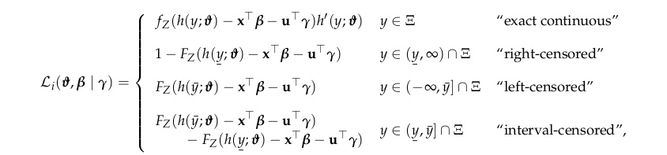

::: article
# Introduction

Datasets with grouped observations are abundant in the applied
statistical practice. Clustering, hierarchical designs, longitudinal
studies, or repeated measurements can all lead to grouped data
structures. The common property of these datasets is that observations
within groups, defined by one or more grouping factors, cannot be
treated as independent. In order to draw a valid inference, the
statistical model has to address the issue of correlated observations.
Mixed-effects models represent one of the main approaches dealing with
this type of regression problem. In this approach, the observations are
assumed to be independent *conditionally* on a set of random effects
that aim to capture unmodeled group-level heterogeneity. The reader is
referred, for example, to the textbook by @demidenko_mixed_2013 for an
exposition and examples of the usage of mixed-effects models. Several
R packages exist that implement mixed-effects models for specific types
of regression problems. The two most notable examples are
[*nlme*](https://CRAN.R-project.org/package=nlme) by @pinheiro_nlme and
[*lme4*](https://CRAN.R-project.org/package=lme4) by @bates_fitting_2015
for linear, non-linear, and generalized linear mixed-effects models,
respectively.

Linear transformation models aim to directly specify the conditional
distribution function of an outcome variable in a regression setting.
@hothorn_mlt proposed a fully parametric approach using a flexible
monotone increasing transformation function that is estimated from the
data. The resulting general model family can be applied to a wide range
of problems with at least ordered discrete outcome variables. In fact,
many of the popular regression models can be expressed as special cases
of the linear transformation model framework. Most recently, @tian_2020
reviewed the approach followed in this study and compared it to an
alternative semiparametric formulation using extensive simulations. By
introducing random effects in the linear transformation model, it
becomes applicable in a very diverse set of regression problems where
the observations are correlated due to repeated measurements or grouped
designs.

The structure of this article is as follows: After a brief, and somewhat
technical, introduction of the methodology and the implementation in
Section [2](#sec:metrafo), Section [3](#sec:applications) demonstrates,
through a series of examples, how the package
[*tramME*](https://CRAN.R-project.org/package=tramME) [@tramME] can be
applied to estimate regression models with various response types and
data structures. Finally, Section [4](#sec:discussion) discusses a few
issues concerning the implementation of our model.

# Mixed-effects transformation models {#sec:metrafo}

The model class in the R package *tramME* is an extension of the
transformation model approach described by @hothorn_most_2018 and
implemented in the R packages
[*mlt*](https://CRAN.R-project.org/package=mlt) and
[*tram*](https://CRAN.R-project.org/package=tram) by @hothorn_mlt and
@Hothorn2020_tram, respectively. These resources provide an introduction
to fully parameterized transformation models for independent
observations.

Formally, we are interested in models that parameterize the conditional
distribution function directly,
$$\begin{aligned}
  {\mathbb{P}}\left(Y\leq y \mid {\mathbf{x}}, {\mathbf{u}}, {\boldsymbol{\gamma}}\right)
  &= F_{Z}\left(h(y; {\boldsymbol{\vartheta}}) - {\mathbf{x}}^{\top}{\boldsymbol{\beta}}- {\mathbf{u}}^{\top}{\boldsymbol{\gamma}}\right) \qquad {\boldsymbol{\gamma}}\sim
    {\mathcal{N}}_{q}({\mathbf{0}}, {\boldsymbol{\Sigma}}{}), \label{eq:memodel}
\end{aligned}   (\#eq:memodel)$$
where $F_{Z}$ denotes a pre-specified error distribution function (or
inverse-link function), which is monotone increasing and maps from the
real numbers to the closed interval $[0, 1]$. Typically, $F_{Z}$ is set
to the CDF of a simple continuous distribution, hence the name "error
distribution". The baseline transformation function is
$h(y;{\boldsymbol{\vartheta}})$, which is also a monotonic increasing
function parameterized with the vector ${\boldsymbol{\vartheta}}$. For
the fixed and random effects design matrices, respectively,
${\mathbf{x}}^{\top}$ and ${\mathbf{u}}^{\top}$ are suitable row
vectors. The vector ${\boldsymbol{\beta}}$ contains the fixed effects,
while ${\boldsymbol{\gamma}}$ comprises of the stacked (possibly
multiple) random effects. The distribution of the random effects is
assumed to be multivariate Gaussian with zero mean and covariance matrix
${\boldsymbol{\Sigma}}{}$, which typically has a sparse block structure.

As Table [1](#tbl:models) shows, specific choices of the error
distribution and the baseline transformation function lead to different
types of regression models. In the R package *tramME*, seven main model
types are distinguished, mainly based on the class of their outcome
variable. Moreover, the functions `SurvregME()` and `PolrME()` allow to
specify multiple error distributions or baseline transformations and
hence increasing the number of available model types.

::: {#tbl:models}
  -------------------------------------------------------------------------------------------------------------------------------------
  Function        Name                                                        $F_{Z}$                 $h(y;{\boldsymbol{\vartheta}})$
  --------------- ----------------------------------------------------------- ----------------------- ---------------------------------
  `LmME()`        Mixed-effects normal linear regression                      Standard Gaussian       Linear basis

  `BoxCoxME()`    Non-normal (Box-Cox-type) linear mixed-effects regression   Standard Gaussian       Bernstein basis

  `ColrME()`      Mixed-effects continuous outcome logistic regression        Standard logistic       Bernstein basis

  `CoxphME()`     Mixed-effects parametric Cox regression                     Minimum extreme value   Bernstein basis

  `SurvregME()`   Mixed-effects parametric survival models                    Multiple options        Multiple options

  `PolrME()`      Mixed-effects regression models for ordinal outcomes        Multiple options        Discrete basis

  `LehmannME()`   Mixed-effects Lehmann-alternative linear regression         Maximum extreme value   Bernstein basis
  -------------------------------------------------------------------------------------------------------------------------------------

  : Table 1: Model types implemented in the *tramME* package. $F_{Z}$
  denotes the error distribution and the column
  $h(y;{\boldsymbol{\vartheta}})$ lists the basis functions the baseline
  transformation function utilizes.
:::

As the table indicates, some of the models specify their transformation
functions as general smooth functions, approximated with the use of
polynomials in Bernstein form. The function
$h(y;{\boldsymbol{\vartheta}})$ has to be monotonic increasing so that
the conditional distribution function is also increasing. When using a
set of order $p$ polynomials in Bernstein form for the approximation of
a general function, this restriction conveniently translates to the
parameter restriction $\vartheta_{i} \leq \vartheta_{i+1}$ for all
$i = 0,\dots,p-1$.

The observations are assumed to be *conditionally independent*, and
hence the likelihood has the form
$$\begin{aligned}
  \mathcal{L} \left({\boldsymbol{\vartheta}}, {\boldsymbol{\beta}}, {\boldsymbol{\Sigma}}{}\right)
  &= \int_{{\mathbb{R}}^{q}}{\mathcal{L}}({\boldsymbol{\vartheta}}, {\boldsymbol{\beta}}, {\boldsymbol{\Sigma}}{}, {\boldsymbol{\gamma}})\mathsf{\,d}{\boldsymbol{\gamma}}\nonumber \\
  &= \int_{{\mathbb{R}}^{q}}\prod_{i=1}^{n}{\mathcal{L}}_{i}({\boldsymbol{\vartheta}}, {\boldsymbol{\beta}}\mid
    {\boldsymbol{\gamma}})\phi({\boldsymbol{\gamma}};{\boldsymbol{\Sigma}}{})\mathsf{\,d}{\boldsymbol{\gamma}}, \label{eq:lik}
\end{aligned}   (\#eq:lik)$$
where
${\mathcal{L}}({\boldsymbol{\vartheta}}, {\boldsymbol{\beta}}, {\boldsymbol{\Sigma}}{}, {\boldsymbol{\gamma}})$
is the joint likelihood function, given the all observations, and
${\mathcal{L}}_{i}({\boldsymbol{\vartheta}}, {\boldsymbol{\beta}}\mid
{\boldsymbol{\gamma}})$ denotes the individual *conditional* likelihood
contributions. $\phi({\boldsymbol{\gamma}};{\boldsymbol{\Sigma}}{})$
stands for the probability density function of the multivariate normal
distribution with zero mean vector and covariance matrix
${\boldsymbol{\Sigma}}{}$. This latter function can be factorized
further according to the covariance structure of the random effects.

One of the main advantages of working directly with the distribution
function of the outcome is that it is simple to introduce (random)
censoring and truncation in the estimation procedure. The conditional
likelihood contributions under different types of censoring can be
written as
{ width="100%"}
where $f_{Z}()$ is the density function of the error distribution,
$h^{\prime}(y;{\boldsymbol{\vartheta}})$ is the first derivative of the
baseline transformation function with respect to $y$, and $\Xi$ denotes
the sample space of $Y$.

The multidimensional integral in Equation \@ref(eq:lik), in general,
does not have an analytical solution, but its value can be approximated
using numerical methods. The package *tramME* applies the Laplace
approximation to this problem, which relies on the quadratic Taylor
expansion of the corresponding joint log-likelihood function.

The maximization of the logarithm of the likelihood function with
respect to ${\boldsymbol{\vartheta}}$, ${\boldsymbol{\beta}}$, and
${\boldsymbol{\Sigma}}{}$, under a set of suitable constraints on
${\boldsymbol{\vartheta}}$ to make $h(y;{\boldsymbol{\vartheta}})$
monotone increasing, results in the maximum likelihood estimates of the
model parameters. Standard likelihood theory, utilizing the ability to
evaluate the log-likelihood function, the score function, and the
Hessian, provides a basis for asymptotic inference in this family of
models; see @hothorn_most_2018 for more details on likelihood inference
in transformation models.

The maximum likelihood estimation in *tramME* is done using the
[*TMB*](https://CRAN.R-project.org/package=TMB) package by
@kristensen_tmb. The Template Model Builder (*TMB*) allows the user to
define and estimate general, non-linear mixed-effects models. It was
built on well-tested and high-performance C++ libraries, which results
in a flexible yet efficient framework for estimating mixed models with
possibly complex random effects structures; see, for example,
@Brooks2017_glmmTMB for performance comparisons in the context of the
package [*glmmTMB*](https://CRAN.R-project.org/package=glmmTMB). In
*tramME*, *TMB* is used to evaluate the integral in
Equation \@ref(eq:lik), using Laplace's method, and to calculate the
derivatives of the log-likelihood function using automatic (or
algorithmic) differentiation.

# Applications {#sec:applications}

In this section, several applications of the transformation mixed models
are presented, and wherever it is possible, also compared to other
existing implementations. The examples shown here are by no means
intended as complete analyses. They demonstrate how mixed-effects
transformation models can be used in a broad range of regression
problems and showcase the most important features implemented in the
package *tramME*.

In each application, a simple version of a transformation mixed model is
compared to the same model implemented by a benchmark package first. In
a second step, extensions to more complex models not available other
packages are fitted using package *tramME*. The R code illustrates
similarities and differences in the user interfaces. The two model
outputs allow a direct comparison of the model-agnostic implementation
in *tramME* to the model-specific implementation in the benchmark
package. The package *tramME* is, however, *not* intended as a
replacement for well-tested implementations of important special cases
of mixed models, such as linear mixed models in
[*lme4*](https://CRAN.R-project.org/package=lme4), but as a tool for
extending these implementations to more complex model variants.

## Normal linear mixed model {#sec:nlmm}

As a first example, we model the average reaction times to a specific
task from a sleep deprivation study described in @belenky_patterns_2003.
Figure [1](#fig:sleepstudy) presents the reaction times against days of
sleep deprivation for each of the 18 participants.

{#fig:sleepstudy
width="100%" alt="graphic without alt text"}

In this first example, we model the distribution of the average reaction
time using random intercepts and random slopes for the effects of days
of sleep deprivation.
$$\begin{aligned}
  {\mathbb{P}}\left(\texttt{Reaction}\leq y\mid \texttt{Days}, \alpha_{i}, \beta_{i}\right) &=
    \Phi\left(\vartheta_{1} + \vartheta_{2}y  - \beta\texttt{Days} -
       {\gamma_{1}}_{i} - {\gamma_{2}}_{i}\texttt{Days}\right) \label{eq:lm}\\
  \begin{pmatrix} {\gamma_{1}}_{i} \\ {\gamma_{2}}_{i} \end{pmatrix}
    & \sim {\mathcal{N}}_{2}\left\{
  \begin{pmatrix} 0 \\ 0 \end{pmatrix},
  \begin{pmatrix} \tau_{1}^{2} & \tau_{12} \\ \tau_{12} & \tau_{2}^{2} \end{pmatrix}
  \right\} \nonumber
\end{aligned}   (\#eq:lm)$$
Note that when the transformation function is assumed to be linear in
the outcome variable, i.e., $h(y) = \vartheta_{1} + \vartheta_{2}y$, we
arrive at a re-parameterized version of the normal linear mixed
effects-model, and hence the results from `tramME::LmME()` are directly
comparable to estimates using other mixed-effects regression packages
such as *lme4*. Estimating the normal linear model with the *tramME*:

``` r
R> library("tramME")
R> sleep_lmME <- LmME(Reaction ~ Days + (Days | Subject), data = sleepstudy)
R> logLik(sleep_lmME)
```

``` r
'log Lik.' -876 (df=6)
```

To make the results from *lme4* comparable to the previous results, we
set `REML = FALSE`, as the transformation mixed model implementation
only supports the maximum likelihood estimation of the normal linear
model specification.

``` r
R> library("lme4")
R> sleep_lmer <- lmer(Reaction ~ Days + (Days | Subject), data = sleepstudy,
+                     REML = FALSE)
R> logLik(sleep_lmer)
```

``` r
'log Lik.' -876 (df=6)
```

The `as.lm = TRUE` option of various methods in *tramME* facilitates the
comparisons between the transformation model parameterization and the
results of a linear mixed model parameterization. Coefficient estimates
and their standard errors from the transformation model approach are

``` r
R> cbind(coef = coef(sleep_lmME, as.lm = TRUE),
+        se = sqrt(diag(vcov(sleep_lmME, as.lm = TRUE, pargroup = "fixef"))))
```

``` r
             coef   se
(Intercept) 251.4 6.63
Days         10.5 1.50
```

while the results from `lmer` are

``` r
R> summary(sleep_lmer)$coefficients
```

``` r
            Estimate Std. Error t value
(Intercept)    251.4       6.63   37.91
Days            10.5       1.50    6.97
```

Similarly, the standard deviations and correlations of the random
effects and the standard deviations of the error terms are essentially
the same

``` r
R> VarCorr(sleep_lmME, as.lm = TRUE) ## random effects
```

``` r

Grouping factor: Subject (18 levels)
Standard deviation:
(Intercept)        Days 
      23.80        5.72 

Correlations:
     (Intercept)
Days      0.0813
```

``` r
R> sigma(sleep_lmME) ## residual SD
```

``` r
[1] 25.6
```

``` r
R> VarCorr(sleep_lmer)
```

``` r
 Groups   Name        Std.Dev. Corr
 Subject  (Intercept) 23.78        
          Days         5.72    0.08
 Residual             25.59        
```

With the `predict` method of *tramME*, we can evaluate the fitted
conditional distribution of the outcome on a scale specified by the
user. Additionally, by setting `type = "quantile"`, we can calculate the
quantiles of the conditional distribution of the response.

``` r
R> ## Update to specify the support
R> sleep_lmME1b <- update(sleep_lmME, support = c(150, 520))
R> ## Set up grid to calculate conditional quantiles
R> nd <- expand.grid(Days = seq(min(sleepstudy$Days), max(sleepstudy$Days),
+                               length.out = 200),
+                    Subject = unique(sleepstudy$Subject))
R> ## The quantiles we want to calculate
R> pr <- c(0.025, 0.05, 0.1, 0.25, 0.5, 0.75, 0.9, 0.95, 0.975)
R> ## Specify the random effects values as predicted by the model
R> re <- ranef(sleep_lmME1b)
R> ## Calculate conditional quantiles
R> pred <- predict(sleep_lmME1b, newdata = nd, prob = pr, ranef = re,
+                  type = "quantile")
```

Note that in the code above, we first update the model and explicitly
set the support of the outcome distribution. It is often helpful to
define the support when we want to calculate the quantiles of the
outcome distribution because in certain extreme cases, the calculated
values may lie outside of the default support and, in these cases,
`predict.tramME` (just as `predict.mlt`) will return censored values.

Because we are interested in conditional quantiles, we have to specify
the values of the random effects on which we want to condition for each
subject. In the example above, we simply set the predicted random
effects values for the subjects of the `sleepstudy` dataset. Although it
is relatively common in practice, one should be careful with using
plug-in estimators of non-linear functions of the random effects (i.e.,
estimating these functions by evaluating at the point estimates of the
random effects) as they can contain substantial bias [@Thorson2016]. To
demonstrate how mixed-effects transformation models relax certain
assumptions of the normal linear reference model and to showcase the
functionality implemented in the *tramME* package, occasionally, we will
rely on these estimators nevertheless.

{#fig:quantiles_lmME
width="100%" alt="graphic without alt text"}

Figure [2](#fig:quantiles_lmME) presents the quantiles of the
conditional distribution of reaction time from the model defined in
Equation \@ref(eq:lm). The random intercepts and slopes capture separate
time trends for each subject in the study. In the normal linear mixed
model (estimated with `LmME`), the conditional quantiles are parallel
lines. We will revisit this example when we relax certain assumptions of
this initial model in Section [3.2](#sec:boxcox).

*tramME* implements a version of score residuals that are defined as the
score contributions of the individual observations with respect to an
additional constant term that is fixed at zero.
$$\begin{aligned}
  {\mathbb{P}}\left(Y\leq y \mid {\mathbf{x}}, {\mathbf{u}}, {\boldsymbol{\gamma}}\right)
  &= F_{Z}\left(h(y; {\boldsymbol{\vartheta}}) - {\mathbf{x}}^{\top}{\boldsymbol{\beta}}- {\mathbf{u}}^{\top}{\boldsymbol{\gamma}}- \alpha_{0}\right)
    \qquad {\boldsymbol{\gamma}}\sim {\mathcal{N}}_{q}({\mathbf{0}}, {\boldsymbol{\Sigma}}{}) \nonumber \\
  r_{i} &= \left.\frac{\partial \ell_{i}({\boldsymbol{\vartheta}}, {\boldsymbol{\beta}}, {\boldsymbol{\Sigma}}{}, \alpha_{0})}
          {\partial \alpha_{0}}\right|_{\alpha_{0} = 0,} \label{eq:resid}
\end{aligned}   (\#eq:resid)$$
where
$\ell_{i}({\boldsymbol{\vartheta}}, {\boldsymbol{\beta}}, {\boldsymbol{\Sigma}}{}, \alpha_{0})$
is the marginal log-likelihood contribution of observation $i$. It is
straightforward to show that, in the case of the normal linear model,
this is equal to the response residuals divided by the MLE of the error
standard deviation. As previously, the comparison with the
parameterization used by *lme4* is made easy by using the option
`as.lm = TRUE`.

``` r
R> resid_lmME <- resid(sleep_lmME, as.lm = TRUE)
R> resid_lmer <- resid(sleep_lmer)
R> all.equal(resid_lmME, resid_lmer)
```

``` r
[1] "Mean relative difference: 8.04e-06"
```

Using the linear predictor of the mixed-effects transformation model,
(${\mathbf{x}}^{\top}\widehat{\boldsymbol{\beta}}+ {\mathbf{u}}^{\top}\widehat{\boldsymbol{\gamma}}$)
calculated as

``` r
R> lp <- predict(sleep_lmME, type = "lp")
```

we can construct plots for checking the residuals
(Figure [3](#fig:resid-plot_lmME)).

{#fig:resid-plot_lmME
width="100%" alt="graphic without alt text"}

As the results of this section show, the transformation model approach
implemented by `LmME()` leads to the same results as the maximum
likelihood estimation of the traditional linear mixed model
parameterization. The advantage of using the package *tramME* over other
well-established implementations is that it can also be applied when
classical model assumptions are not met. For the sleep deprivation
experiments, the data analyst might wonder if assuming normal reaction
times is appropriate and if clocking of reaction times was indeed as
accurate as suggested by the data (milliseconds with four digits). The
former issue requires a relaxation of the conditional normality
assumption and the latter incorporation of interval-censoring in the
likelihood. We will start with model estimation in the presence of
interval-censored reaction times, which is outside the scope of
[*lme4*](https://CRAN.R-project.org/package=lme4).

Let us assume that the measurement device used in the sleep deprivation
study is only able to measure reaction times larger than 200 ms and only
in 50 ms step sizes. If we want to take this reduced accuracy in the
measurements into account, we have to deal with interval-censored
observations as ignoring the censored nature of the outcomes could lead
to biased parameter estimates.

With the following code, we create the interval-censored outcome vector
using the `Surv` function of the
[*survival*](https://CRAN.R-project.org/package=survival) package by
@survival-package.

``` r
R> library("survival")
R> ub <- ceiling(sleepstudy$Reaction / 50) * 50
R> lb <- floor(sleepstudy$Reaction / 50) * 50
R> lb[ub == 200] <- 0
R> sleepstudy$Reaction_ic <- Surv(lb, ub, type = "interval2")
R> head(sleepstudy$Reaction_ic)
```

``` r
[1] [200, 250] [250, 300] [250, 300] [300, 350] [350, 400] [400, 450]
```

Using the interval-censored outcomes in the `LmME()`, function call will
maximize the correct likelihood function.

``` r
R> sleep_lmME2 <- LmME(Reaction_ic ~ Days + (Days | Subject), data = sleepstudy)
R> logLik(sleep_lmME2)
```

``` r
'log Lik.' -201 (df=6)
```

The value of the log-likelihood is different because we are now
calculating log-probabilities instead of log-densities of a continuous
distribution. However, despite the decreased precision of the
measurements, the parameter estimates are similar to what we got with
the exactly observed outcomes.

``` r
R> cbind(coef = coef(sleep_lmME2, as.lm = TRUE),
+        se = sqrt(diag(vcov(sleep_lmME2, as.lm = TRUE, pargroup = "fixef"))))
```

``` r
             coef   se
(Intercept) 251.4 6.83
Days         10.5 1.62
```

``` r
R> sigma(sleep_lmME2)
```

``` r
[1] 28
```

``` r
R> VarCorr(sleep_lmME2, as.lm = TRUE)
```

``` r

Grouping factor: Subject (18 levels)
Standard deviation:
(Intercept)        Days 
      22.30        5.94 

Correlations:
     (Intercept)
Days      0.0536
```

The small estimated value of the correlation coefficient between the
random slope and intercept suggests that a model with independent random
effects might be more appropriate. To estimate such a model, we can use
the same notation as in *lme4*

``` r
R> sleep_lmME3 <- LmME(Reaction_ic ~ Days + (Days || Subject), data = sleepstudy)
R> logLik(sleep_lmME3)
```

``` r
'log Lik.' -201 (df=5)
```

Comparing the two models using a likelihood ratio test, we see no
evidence against the more parsimonious model (`sleep_lmME3`).

``` r
R> anova(sleep_lmME2, sleep_lmME3)
```

``` r
Model comparison

	 Model 1: Reaction_ic ~ Days + (Days | Subject)
	 Model 2: Reaction_ic ~ Days + (Days || Subject)

        npar logLik AIC BIC Chisq Chisq df Pr(>Chisq)
Model 2    5   -200 411 427                          
Model 1    6   -200 413 432  0.02        1       0.89
```

Note that the standard likelihood ratio tests provided by `anova` are
very conservative for model comparisons that involve setting some of the
random effects variances to zero due to the non-standard asymptotics of
tests on the boundary of the parameter space [@Self1987].

## Box-Cox-type mixed-effects models {#sec:boxcox}

Substituting the linear baseline transformation function,
$h(y) = \vartheta_{1}
+ \vartheta_{2}y$, with a general, monotonic increasing smooth function,
we can relax the conditional normality assumption of the model discussed
in Section [3.1](#sec:nlmm). The transformation model approach proposed
by @hothorn_most_2018 uses Bernstein bases to approximate this general
increasing function in a fully parametric manner, i.e.,
$h(y) = {\mathbf{a}}_{\text{Bs},
K+1}(y)^{\top}{\boldsymbol{\vartheta}}$. The resulting model can be
regarded as a version of the Box-Cox regression [@box_analysis_1964],
where the transformation of the response is estimated simultaneously
with the model parameters. It should be pointed out that, although its
approach is similar in spirit, *tramME* does not use the Box-Cox power
transformation to approximate $h(y)$. For an implementation utilizing
the original Box-Cox transform in the context of mixed-effects models,
see the R package
[*boxcoxmix*](https://CRAN.R-project.org/package=boxcoxmix) by
@boxcoxmix.

A more flexible version of the model described in \@ref(eq:lm) will take
the form
$$\begin{aligned}
  {\mathbb{P}}\left(\texttt{Reaction}\leq y\mid \texttt{Days}, \alpha_{i}, \beta_{i}\right) &=
    \Phi\left({\mathbf{a}}(y)^{\top}{\boldsymbol{\vartheta}}- \beta\texttt{Days} -
       {\gamma_{1}}_{i} - {\gamma_{2}}_{i}\texttt{Days}\right) \label{eq:bc} \\
  \begin{pmatrix} {\gamma_{1}}_{i} \\ {\gamma_{2}}_{i} \end{pmatrix}
    & \sim {\mathcal{N}}_{2}\left\{
  \begin{pmatrix} 0 \\ 0 \end{pmatrix},
  \begin{pmatrix} \tau_{1}^{2} & \tau_{12} \\ \tau_{12} & \tau_{2}^{2} \end{pmatrix}
  \right\}. \nonumber
\end{aligned}   (\#eq:bc)$$
The Box-Cox-type transformation mixed model can be estimated using the
`BoxCoxME()` function of the *tramME* package. For this specific
application, we set the order of the polynomials in Bernstein form to
10.

``` r
R> sleep_bc <- BoxCoxME(Reaction ~ Days + (Days | Subject), data = sleepstudy,
+                       order = 10)
R> logLik(sleep_bc)
```

``` r
'log Lik.' -858 (df=15)
```

Note that the log-likelihood of this model is higher than that of the
normal linear model because we are now approximating the baseline
transformation function flexibly at the expense of a larger number of
parameters.

The conditional quantiles calculated -- using the same set of function
calls, and with the same caveats, as in the analogous case of `LmME` --
from the model defined by Equation \@ref(eq:bc) are shown in
Figure [4](#fig:quantiles_boxcox1). Comparing these results to
Figure [2](#fig:quantiles_lmME) reveals departures from conditional
normality in the response distributions: At different lengths of sleep
deprivation, the conditional distribution of the participants' reaction
times is not a shifted normal distribution anymore, but it also changes
its spread and shape.

{#fig:quantiles_boxcox1
width="100%" alt="graphic without alt text"}

The conditional distributions of the outcome can be further inspected
visually with the `plot` method of *tramME*, which is designed to plot
these distributions on a scale specified by the user. The left-hand side
plot in Figure [5](#fig:density_boxcox1) compares the conditional
densities of subjects 308 and 309 at various sleep deprivation lengths.
Clearly, subject 308 is hardly affected by sleep deprivation because the
mean and variance of the distribution of reaction time for this subject
increase only marginally with days of sleep deprivation. In contrast,
subject 309 showed longer mean reaction times and an increased
variability of reaction times with increasing duration of sleep
deprivation. The variance effect is not detectable from a classical
normal linear mixed model but can be observed after a data-driven
response transformation to normality. In the right panel of
Figure [5](#fig:density_boxcox1), the conditional distribution of a
hypothetical reference subject with zero random effects values is
depicted. It should be noted that the latter is, in general, not equal
to the marginal distribution of the outcome, which can be calculated by
integrating the conditional distributions over the vector of random
effects. We will return to this question at the end of this section.

{#fig:density_boxcox1 width="100%"
alt="graphic without alt text"}

The plots in Figure [5](#fig:density_boxcox1) can be generated with the
commands

``` r
R> ## -- Compare two subjects (308 and 309)
R> nd <- subset(sleepstudy, subset = Subject %in% c(308, 309))
R> plot(sleep_bc1b, newdata = nd, type = "density", K = 200)
R> ## -- The reference subject (at the mean of the random effect vector)
R> ## (we only need an arbitrary subject)
R> nd <- subset(sleepstudy, subset = Subject == 308)
R> ## NOTE: we explicitly set the random effects vector to 0
R> plot(sleep_bc1b, newdata = nd, ranef = "zero", type = "density", K = 200)
```

(and with some additional formatting steps that are omitted for the sake
of brevity but can be found in the accompanying material).

In line with the methodology presented by @hothorn_most_2018 and
@hothorn_mlt, we can define more complex mixed-effects transformation
models by interacting the covariates with the basis expansion of the
outcome. In the resulting extended model, the fixed effects are
dependent on the level of the outcome. For the `sleepstudy` example,
this model can be written as
$$\begin{aligned}
  {\mathbb{P}}\left(\texttt{Reaction}\leq y\mid \texttt{Days}, \alpha_{i}, \beta_{i}\right) &=
    \Phi\left({\mathbf{a}}(y)^{\top}{\boldsymbol{\vartheta}}- \beta(y)\texttt{Days} -
       {\gamma_{1}}_{i} - {\gamma_{2}}_{i}\texttt{Days}\right) \label{eq:bc2} \\
  \begin{pmatrix} {\gamma_{1}}_{i} \\ {\gamma_{2}}_{i} \end{pmatrix}
    & \sim {\mathcal{N}}_{2}\left\{
  \begin{pmatrix} 0 \\ 0 \end{pmatrix},
  \begin{pmatrix} \tau_{1}^{2} & \tau_{12} \\ \tau_{12} & \tau_{2}^{2} \end{pmatrix}
  \right\}, \nonumber
\end{aligned}   (\#eq:bc2)$$
which is often referred to as "distribution regression"
[@Chernozhukov_2013].

The model in Equation \@ref(eq:bc2) can be defined in *tramME* using the
`|` operator on the left-hand side of the model formula.

``` r
R> sleep_bc2 <- BoxCoxME(Reaction | Days ~ 1 + (Days | Subject), data = sleepstudy,
+                        order = 10, support = c(150, 520))
R> logLik(sleep_bc2)
```

``` r
'log Lik.' -853 (df=25)
```

Plotting the conditional quantiles calculated from the resulting model
in Figure [6](#fig:quantiles_boxcox2) and comparing it with
Figures [2](#fig:quantiles_lmME) and [4](#fig:quantiles_boxcox1)
demonstrates the increased flexibility of the specification.

{#fig:quantiles_boxcox2
width="100%" alt="graphic without alt text"}

In many cases, the goal of the analysis is to estimate the *marginal*
distribution of the outcomes, i.e., integrating out the random effects
from the conditional model \@ref(eq:memodel). In the general
formulation, there is no analytical solution for the integral, but we
can use numerical methods to approximate the marginal distributions at
various values of the outcome. The following code utilizes the
`simulate` and `predict` methods implemented in the *tramME* package to
get Monte Carlo estimates of the outcome distribution implied by the
model \@ref(eq:bc).

``` r
R> ndraws <- 1000 ## number of MC draws
R> ## Set up the grid on which we evaluate the marginal distribution
R> nd <- expand.grid(
+    Reaction = seq(min(sleepstudy$Reaction), max(sleepstudy$Reaction),
+                   length.out = 100),
+    Days = 0:9,
+    Subject = 1)
R> ## Sample from the distribution of the random effects
R> re <- simulate(sleep_bc, newdata = nd, nsim = ndraws, what = "ranef", seed = 100)
R> ## Evaluate the conditional distribution at each draw
R> ## (done in parallel to speed up computations)
R> cp <- parallel::mclapply(re, function(x) {
+    predict(sleep_bc, newdata = nd, ranef = x, type = "distribution")
+  }, mc.cores = 8)
R> cp <- array(unlist(cp), dim = c(100, 10, ndraws))
R> ## Integral: take the average over these
R> mp_bc <- apply(cp, c(1, 2), mean)
```

Figure [7](#fig:margdist_lm_bc) compares the conditional distributions
obtained by integrating over the vector of random effects in
models \@ref(eq:lm) and \@ref(eq:bc).

{#fig:margdist_lm_bc
width="100%" alt="graphic without alt text"}

## Mixed-effects continuous outcome logistic regression {#sec:colr}

The increased flexibility of the Box-Cox-type model, i.e., using a
general baseline transformation function instead of a linear one, comes
with the price that the coefficient estimates will not be easily
interpretable as expected changes in the mean in the conditional model.
Switching to the standard logistic error distribution provides a
solution to this problem, as the parameter estimates in the resulting
model can be interpreted as log-odds ratios. This *continuous outcome
logistic regression* model was used by @Lohse2017 to analyze body mass
index (BMI) distributions.

@Manuguerra2010 proposed a mixed-effects logistic regression model for
bounded, continuous measurements of pain levels in a randomized,
double-blind, placebo-controlled trial of low-level laser therapy for
subjects with chronic neck pain presented by @chow_effect_2006. The
levels of pain, measured on a visual analog scale, and normalized
between 0 and 1, are plotted in Figure [8](#fig:neckpain) for each
subject at the different follow-up times.

{#fig:neckpain
width="100%" alt="graphic without alt text"}

The mixed-effects model suggested by @Manuguerra2010 parameterizes the
log-odds of experiencing smaller pain levels as a linear function of
fixed and random effects and the baseline transformation. With the
treatment group indicator, `laser`, and `time` denoting the follow-up
times,
$$\begin{aligned}
  \log\left[\frac{{\mathbb{P}}\left(\texttt{pain} \leq y \mid
\texttt{laser}, \texttt{time}, \alpha_{i}\right)}{{\mathbb{P}}\left(\texttt{pain} > y
\mid \texttt{laser}, \texttt{time}, \alpha_{i}\right)}\right] &= h(y) +
\beta_{\text{Active}} + \beta_{\text{7w}} + \beta_{\text{12w}} +
\beta_{\text{7w, Active}} + \beta_{\text{12w, Active}} + \alpha_{i} \\
\alpha_{i} &\sim {\mathcal{N}}(0, \tau^{2}),
\end{aligned}$$
where $h(y)$ is an increasing function of the outcome. Rearranging the
terms in the model above reveals that this indeed is a mixed-effects
transformation model, with the distribution function of the standard
logistic distribution ("expit" function) as $F_{Z}$,
$$\begin{aligned}
\begin{split}
  {\mathbb{P}}\left(\texttt{pain} \leq y \mid \texttt{laser}, \texttt{time}, \alpha_{i}\right)
  = \text{expit}\bigl(
  & h(y) + \beta_{\text{Active}} + \beta_{\text{7w}} +
    \beta_{\text{12w}} \\
  & + \beta_{\text{7w,Active}} + \beta_{\text{12w, Active}} + \alpha_{i} \bigr) \label{eq:colr}
\end{split}\\
  \alpha_{i} \sim {\mathcal{N}}(0,\tau^{2}). \nonumber
\end{aligned}   (\#eq:colr)$$

The `ColrME()` function of the *tramME* package estimates mixed-effects
continuous outcome logistic regression models using polynomials in
Bernstein form to approximate $h(y)$. Applying this model to the
`neck_pain` dataset:

``` r
R> neck_tr <- ColrME(vas ~ laser * time + (1 | id), data = neck_pain,
+                    bounds = c(0, 1), support = c(0, 1))
```

Notice that we explicitly set the bounds and the support of the outcome
variable to $[0, 1]$ because the pain levels are measured on a bounded
scale.

The [*ordinalCont*](https://CRAN.R-project.org/package=ordinalCont)
package by @manuguerra_ordinalCont implements an alternative formulation
of the model \@ref(eq:colr) based on the method described in
@Manuguerra2017. In their approach, the baseline transformation is
parameterized using B-splines and the estimation is carried out in a
penalized likelihood framework.

``` r
R> library("ordinalCont")
R> neck_ocm <- ocm(vas ~ laser * time + (1 | id), data = neck_pain, scale = c(0, 1))
```

Figure [9](#fig:colr_cmp) compares the results of the mixed-effects
transformation model approach to the estimates obtained using the
*ordinalCont* package. Because the two models are not exactly the same,
we see some differences in the parameter estimates as well as in the
fitted baseline transformation functions, but the two model fits are
reasonably close to each other.

{#fig:colr_cmp width="100%"
alt="graphic without alt text"}

The odds ratio estimates of the model fitted by `ColrME()`,

``` r
R> exp(coef(neck_tr))
```

``` r
      laser1        time2        time3 laser1:time2 laser1:time3 
      0.0961       0.5200       0.8125     140.2076      42.4076 
```

as well as the results from the *ordinalCont* package, suggest that
there is an imbalance in the sample at baseline, i.e., the odds of
experiencing less pain in the active treatment group is only about 10%
that of in the control group for any pain levels. Based on the
estimates, the treatment has a strong significant effect, especially at
the seven-week follow-up, but seems to level off after 12 weeks.

If we want to compare the marginal distributions in the treatment and
control groups directly, we have to average over the distribution of the
random effects. Because we only have a random intercept in this example,
we have to evaluate a one-dimensional integral. We could use the same
Monte Carlo method as we did in Section [3.2](#sec:boxcox), or we can
apply the adaptive quadrature method implemented in the *stats* package
of R. The example below uses this approach to demonstrate the multiple
options the user has in dealing with such problems.

``` r
R> ## A function to evaluate the joint cdf of the response and the random effects:
R> ## Takes a vector of random effect and covariates values, evaluates the conditional
R> ## distribution at these values and multiplies it with the pdf of the random effects
R> jointCDF <- function(re, nd, mod) {
+    nd <- nd[rep(1, length(re)), ]
+    nd$id <- seq(nrow(nd)) ## to take vector-valued REs
+    pr <- predict(mod, newdata = nd, ranef = re, type = "distribution") *
+      dnorm(re, 0, sd = sqrt(varcov(mod)[[1]][1, 1]))
+    c(pr)
+  }
R> ## Marginalize the joint cdf by integrating out the random effects
R> ## using adaptive quadrature
R> marginalCDF <- function(nd, mod) {
+    nd$cdf <- integrate(jointCDF, lower = -Inf, upper = Inf, nd = nd, mod = mod)$value
+    nd
+  }
R> ## Set up the grid on which we evaluate the marginal distribution
R> nd <- expand.grid(vas = seq(0, 1, length.out = 100),
+                    time = unique(neck_pain$time),
+                    laser = unique(neck_pain$laser))
R> ## Calls marginalCDF on each row of nd
R> ## (done in parallel to speed up computations)
R> mp_colr <- parallel::mclapply(split(nd, seq(nrow(nd))),
+                                marginalCDF, mod = neck_tr, mc.cores = 8)
R> mp_colr <- do.call("rbind", mp_colr)
```

Figure [10](#fig:margdist_colr) compares the marginal distributions at
different time points and confirms our previous conclusions on baseline
imbalance and treatment effect dynamics.

{#fig:margdist_colr width="100%"
alt="graphic without alt text"}

## Mixed-effects transformation models for time-to-event outcomes

Mixed models for right-censored data are important in survival analysis
and we consider the example dataset `eortc` in the
[*coxme*](https://CRAN.R-project.org/package=coxme) package by
@thereneau_coxme. This simulated dataset emulates the structure of the
outcomes of a breast cancer trial by the European Organization for
Research and Treatment of Cancer, and consists of 2323, possibly
right-censored, data points from 37 enrolling centers. We define a
proportional hazards mixed-effects model with random center
($i=1, \dots, 37$) and treatment (`trt`) effects (nested within centers
and indexed by $j=0, 1$).
$$\begin{aligned}
  {\mathbb{P}}\left(Y\leq y\mid \texttt{trt}, \gamma_{1i}, \gamma_{2j(i)}\right) &= 1
- \exp\left(-\exp\left(h(y) + \beta_{\texttt{trt}} + \gamma_{1i} + \gamma_{2j(i)}
\right)\right) \label{eq:coxph} \\
  \gamma_{1i} & \sim {\mathcal{N}}(0, \tau_{1}^{2}),
  \quad \gamma_{2j(i)} \sim {\mathcal{N}}(0, \tau_{2}^{2}) \nonumber
\end{aligned}   (\#eq:coxph)$$
This model corresponds to a mixed-effects transformation model with the
*minimum extreme value distribution* as the error distribution. Treating
the baseline transformation as a general smooth function, approximated
using polynomials in Bernstein form, we get the fully parametric version
of the Cox proportional hazards model with normally distributed random
effects.

We can fit this model with the `CoxphME()` function of *tramME*.

``` r
R> data("eortc", package = "coxme")
R> eortc$trt <- factor(eortc$trt, levels = c(0, 1))
R> eortc_cp <- CoxphME(Surv(y, uncens) ~ trt + (1 | center/trt), data = eortc,
+                      log_first = TRUE, order = 10)
```

The nested random effects structure is defined with the `/` operator.
The `log_first = TRUE` option casts the outcome variable to the
log-scale before defining the Bernstein bases, which usually improves
the model fit when dealing with skewed conditional distributions, while
we explicitly set the order of the polynomials in Bernstein form with
`order = 10`. The confidence interval for the treatment effect
(transformed to the hazard ratio scale) suggests evidence for the
effectiveness of the treatment,

``` r
R> exp(confint(eortc_cp, parm = "trt1", estimate = TRUE))
```

``` r
     lwr  upr  est
trt1 1.8 2.51 2.12
```

while the profile intervals of the random effects standard deviations
indicate similar magnitude of center-level and treatment-level (within
center) variabilities.

``` r
R> exp(confint(eortc_cp, pargroup = "ranef", type = "profile", estimate = TRUE,
+              ncpus = 2, parallel = "multicore"))
```

``` r
                          lwr   upr   est
trt:center|(Intercept) 0.0841 0.338 0.208
center|(Intercept)     0.0796 0.384 0.254
```

The transformation model framework by @hothorn_mlt allows for
stratification, i.e., specifying separate transformation functions for
different groups defined by a stratification factor. Time-dependent
effects for the covariates can be introduced in the same way as in
distribution regression to relax the proportionality assumption of the
Cox model. To check the appropriateness of the proportional hazards
assumption between treatment and control groups visually, we re-estimate
the model stratifying for the treatment indicator, i.e., fitting
transformation functions for the treatment and control groups
separately, and inspect whether these two functions, which are the
log-cumulative hazards when the error distribution is the minimum
extreme value distribution, are parallel.

``` r
R> eortc_cp2 <- CoxphME(Surv(y, uncens) | 0 + trt ~ 0 + (1 | center/trt), data = eortc,
+                       log_first = TRUE, order = 10)
R> tr <- trafo(eortc_cp2, confidence = "interval")
```

Figure [11](#fig:baseline_cph) plots the stratified transformation
functions against log-time. The two curves are very close to parallel,
which indicates that the treatment effect is constant over time, i.e.,
the proportionality assumption is appropriate in the original model
specification.

{#fig:baseline_cph width="100%"
alt="graphic without alt text"}

In addition to proportionality, Figure [11](#fig:baseline_cph) reveals
another important aspect of the data generating process. The fact that
the baseline log-cumulative hazards are linear in log-time suggests that
the conditional distributions are close to the Weibull distribution,
i.e., we can substitute the general baseline transformation function
with $h(y) = \vartheta_1 +
\vartheta_2\log(y)$. Flipping the signs of the fixed and random effects
terms of \@ref(eq:coxph) and substituting the log-linear function to the
baseline transformation, we get the model
$$\begin{aligned}
  {\mathbb{P}}\left(Y\leq y\mid \texttt{trt}, \gamma_{1i}, \gamma_{2j(i)}\right)
&= 1 - \exp\left(-\exp\left(\vartheta_{1}+\vartheta_{2}\log(y) - \beta_{\texttt{trt}}
  - \gamma_{1i} - \gamma_{2j(i)} \right)\right) \\
  \gamma_{1i} &\sim {\mathcal{N}}(0, \tau_{1}^{2}), \quad \gamma_{2j(i)} \sim {\mathcal{N}}(0, \tau_{2}^{2}).
\end{aligned}$$

The `SurvregME()` function of the *tramME* package implements a variety
of parametric mixed-effects models that represent specific choices of
the error distribution and the baseline transformation function in the
general formulation of Equation \@ref(eq:memodel). There are several
other R packages available for estimating parametric survival models
with mixed effects, such as
[*parfm*](https://CRAN.R-project.org/package=parfm) by @parfm and
[*frailtypack*](https://CRAN.R-project.org/package=frailtypack) by
@frailtypack. However, they typically do not allow for nested
random-effects structures when assuming (log-)normally distributed
frailty terms.

Fitting a mixed-effects Weibull model to the `eortc` dataset:

``` r
R> eortc_w <- SurvregME(Surv(y, uncens) ~ trt + (1 | center/trt), data = eortc,
+                       dist = "weibull")
```

Comparing the parameter estimates of the Cox proportional hazards model
to those from the mixed-effects Weibull model,

``` r
R> ## --- CoxphME
R> c(coef = coef(eortc_cp), se = sqrt(diag(vcov(eortc_cp, pargroup = "shift"))))
```

``` r
coef.trt1   se.trt1 
   0.7535    0.0852 
```

``` r
R> VarCorr(eortc_cp)
```

``` r

Grouping factor: trt:center (74 levels)
Standard deviation:
(Intercept) 
      0.208 

Grouping factor: center (37 levels)
Standard deviation:
(Intercept) 
      0.254 
```

``` r
R> ## --- SurvregME
R> c(coef = -coef(eortc_w), se = sqrt(diag(vcov(eortc_w, pargroup = "shift"))))
```

``` r
coef.trt1   se.trt1 
   0.7531    0.0851 
```

``` r
R> VarCorr(eortc_w)
```

``` r

Grouping factor: trt:center (74 levels)
Standard deviation:
(Intercept) 
      0.208 

Grouping factor: center (37 levels)
Standard deviation:
(Intercept) 
      0.255 
```

as well as their log-likelihood values

``` r
R> c(logLik(eortc_cp), logLik(eortc_w))
```

``` r
[1] -13027 -13032
```

confirms our suspicion that the dataset was indeed simulated from a
conditional Weibull model.

Finally, we can compare the results from *tramME* to parameters
estimated with the R package *coxme*.

``` r
R> library("coxme")
R> eortc_cm <- coxme(Surv(y, uncens) ~ trt + (1 | center/trt), data = eortc)
R> summary(eortc_cm)
```

``` r
Cox mixed-effects model fit by maximum likelihood
  Data: eortc
  events, n = 1463, 2323
  Iterations= 10 54 
                 NULL Integrated Fitted
Log-likelihood -10639     -10518 -10464

                  Chisq   df p AIC   BIC
Integrated loglik   242  3.0 0 236 220.4
 Penalized loglik   349 39.3 0 270  62.6

Model:  Surv(y, uncens) ~ trt + (1 | center/trt) 
Fixed coefficients
      coef exp(coef) se(coef)    z p
trt1 0.742       2.1   0.0827 8.97 0

Random effects
 Group      Variable    Std Dev Variance
 center/trt (Intercept) 0.2045  0.0418  
 center     (Intercept) 0.2627  0.0690  
```

This package follows a different approach to estimate a mixed-effects
Cox model by leaving the baseline hazards unspecified and maximizing the
integrated partial likelihood. As a result, the parameter estimates are
slightly different from the ones we got using the `CoxphME()` function,
but the results are comparable, and the conclusions are identical,
nevertheless.

## Mixed-effects transformation models for discrete ordinal outcomes

Our last example demonstrates how the mixed-effects transformation
framework can be used in modeling correlated discrete ordinal outcomes.
As an example, we take the soup tasting dataset by
@christensen_statistical_2011. The dataset contains 1847 observations
from 185 respondents in a soup tasting experiment. The subjects were
familiarized with a reference product prior to the experiment and,
during the experiment, were asked to distinguish between samples from
the reference product and test product using a six-level ordinal scale
indicating their level of confidence. The scale ranges from "reference,
sure" ($\texttt{sureness} = 1$) to "not reference, sure"
($\texttt{sureness} = 6$). Figure [12](#fig:soup) presents the
proportions of response categories for the test and reference samples
for respondent groups defined by how often they consume soup.

{#fig:soup width="100%"
alt="graphic without alt text"}

Let us assume that we are interested in comparing the distributions of
sureness ratings for reference products and test products while taking
the repeated nature of the design into account. Moreover, in doing so,
we also want to control for how often the respondents usually consume
soup (denoted by the covariate `freq`). With $k=1\dots 5$, indicating
the sureness levels except the last one, $i=1\dots, 185$ indexing the
respondents, and $j=0,1$ indexing the reference and test products
(covariate `prod`), respectively, the regression model we estimate can
be written as
$$\begin{aligned}
  \begin{split}
  {\mathbb{P}}\left(\texttt{sureness} \leq k \mid \texttt{prod}, \texttt{freq}, \gamma_{1i},
    \gamma_{2j(i)}\right) = \Phi\bigl(
  & \vartheta_{k} - \beta_{\text{test}} - \beta_{\text{1-4/month}} -
    \beta_{<\text{1/month}}  \\
  &- \gamma_{1i} - \gamma_{2j(i)}\bigr) \label{eq:polr}
  \end{split} \\
  \gamma_{1i} \sim {\mathcal{N}}(0, \tau_{1}^{2}), &
               \quad \gamma_{2j(i)}\sim {\mathcal{N}}(0, \tau_{2}^{2}). \nonumber
\end{aligned}   (\#eq:polr)$$

The `PolrME()` function of the *tramME* package estimates models for
ordered discrete outcomes. Depending on the choice of the error
distribution, the user can fit proportional odds (logistic
distribution), ordinal probit (standard normal distribution),
proportional hazards (minimum extreme value distribution), or cumulative
maximum extreme value models. In our example, we set `method = ’probit’`
to estimate the probit model,

``` r
R> soup_pr <- PolrME(SURENESS ~ PROD + SOUPFREQ + (1 | RESP/PROD),
+                    data = soup, method = "probit")
R> logLik(soup_pr)
```

``` r
'log Lik.' -2666 (df=10)
```

The R package [*ordinal*](https://CRAN.R-project.org/package=ordinal) by
@christensen_ordinal also implements mixed-effects regression models for
ordered discrete outcomes. As a cross-check, we can re-estimate the same
model with the function `clmm()`,

``` r
R> library("ordinal")
R> soup_or <- clmm(SURENESS ~ PROD + SOUPFREQ + (1 | RESP/PROD), data = soup,
+                  link = "probit")
R> logLik(soup_or)
```

``` r
'log Lik.' -2666 (df=10)
```

Based on the likelihood values and the parameter estimates,

``` r
R> max(abs(coef(soup_or) - coef(soup_pr, with_baseline = TRUE)))
```

``` r
[1] 1.76e-05
```

the results are essentially the same.

We can introduce non-proportional effects in the transformation model
framework by stratifying on a covariate. In our example, we might want
to extend the model to allow for different effect sizes of the soup
consumption frequency covariate, depending on the level of the outcome
variable. Rewriting model \@ref(eq:polr),
$$\begin{aligned}
  {\mathbb{P}}\left(\texttt{sureness} \leq k \mid \texttt{prod}, \texttt{freq}, \gamma_{1i}, \gamma_{2j(i)}\right)
  &= \Phi\left(\vartheta_{k} - \beta_{\text{test}} - \beta_{\text{1-4/month},k}
    - \beta_{<\text{1/month},k} - \gamma_{1i} - \gamma_{2j(i)}\right) \\
  \gamma_{1i} &\sim {\mathcal{N}}(0, \tau_{1}^{2}), \quad \gamma_{2j(i)}\sim {\mathcal{N}}(0, \tau_{2}^{2}),
\end{aligned}$$
and estimating it with *tramME* by stratifying for the soup frequency
factor

``` r
R> soup_pr2 <- PolrME(SURENESS | SOUPFREQ ~ PROD + (1 | RESP/PROD),
+                     data = soup, method = "probit")
R> logLik(soup_pr2)
```

``` r
'log Lik.' -2655 (df=18)
```

The likelihood ratio test comparing the two specifications suggests some
evidence that the extended, partially proportional model fits the data
better.

``` r
R> anova(soup_pr, soup_pr2)
```

``` r
Model comparison

	 Model 1: SURENESS ~ PROD + SOUPFREQ + (1 | RESP/PROD)
	 Model 2: SURENESS | SOUPFREQ ~ PROD + (1 | RESP/PROD)

        npar logLik  AIC  BIC Chisq Chisq df Pr(>Chisq)   
Model 1   10  -2666 5352 5408                             
Model 2   18  -2655 5347 5446  21.9        8     0.0051 **
---
Signif. codes:  0 '***' 0.001 '**' 0.01 '*' 0.05 '.' 0.1 ' ' 1
```

# Discussion {#sec:discussion}

Building the implementation of mixed-effects transformation models on
the package *TMB* leads to significant efficiency gains in the
computationally intensive steps of the maximum likelihood estimation.
This computational efficiency is partly due to the use of Laplace
approximation to integrate over the vector of random effects. However,
several sources point out that Laplace's method can lead to biased
estimates in some distributional settings. @Pinheiro2006_AGQ provide
detailed numerical comparisons of the Laplacian approximation to
adaptive Gaussian quadrature algorithms in the context of multilevel
generalized models. @Joe2008 evaluates the method in the case of
discrete outcome mixed-effects models and concludes that the inaccuracy
increases with the amount of discreteness of the response variable and
decreases as the cluster sizes increase.

It is worth mentioning that the conditional approach of modeling the
distribution of the response, which is the basis of the transformation
models implemented in the *tramME* package, is not the only way one
could approach the problem of correlated outcomes in regression
settings. The main alternative to a conditional (mixed-effects) modeling
approach is a marginal model that parameterizes the marginal
distribution of the outcome and treats the covariance structure as
nuisance parameters. Generalized estimating equations [GEE,
@hardin_generalized_2013] models represent prominent examples of such an
approach. Proponents of marginal models point out that, in a conditional
model, the fixed effects parameter estimates cannot be interpreted as
population averages, which is usually of primary interest in a
regression analysis. @lindsey_appropriateness_1998 emphasize that
marginal parameter estimates from longitudinal studies can only be
interpreted as population averages when the participants are
representative to their populations, which is usually not the case.
Moreover, they argue that defining models based on marginal
distributions very often leads to complicated and implausible
conditional distributions, whereas conditional models can more easily
express physiologically plausible mechanisms on the level of the
individual. @lee_conditional_2004 argue that conditional models are more
fundamental as they allow for both marginal and conditional inferences,
which is not true in the case of marginal models. As we demonstrated in
Sections [3.2](#sec:boxcox) and [3.3](#sec:colr), the marginal
distributions implied by the conditional transformation model can be
easily approximated using numerical techniques.

The *tramME* package, introduced in this article, extends the available
options for modeling grouped data structures with mixed-effects
regressions in several ways: Through its dense code base, *tramME*
provides a unified and efficient estimation framework for a broad range
of regression models. Examples in Section [3](#sec:applications)
demonstrate that using this single package, several very specific
regression problems can be addressed. Relying only on a limited number
of packages, in turn, decreases the likelihood of errors in the
statistical analysis. As the examples show, the modular structure of our
approach naturally leads to extensions of existing models (such as
accounting for censoring or introducing nested or crossed random effects
structures) that would otherwise require a lot of effort to re-implement
from scratch. Moreover, the underlying theory of linear transformation
models provides a flexible basis for the implementation of the package
and for its future extensions.

# Acknowledgments

This work was supported by the Swiss National Science Foundation, grant
number 200021_184603.
:::
