::: article
# Introduction {#sec:intro}

High-dimensional sampling from multivariate distributions with Markov
Chain Monte Carlo (MCMC) algorithms is a fundamental problem with many
applications in science and
engineering [@Iyengar88; @Somerville98; @Genz09; @Schellenberger09; @venzke2019].
In particular, multivariate integration over a convex set and volume
approximation of such sets ---a special case of integration--- have
accumulated a broad amount of effort over the last decades.
Nevertheless, those problems are computationally hard for general
dimensions [@Dyer88]. MCMC algorithms have made remarkable progress
efficiently solving the problems of sampling and volume estimation of
convex bodies while enjoying great theoretical
guarantees [@Chen18; @Lee18; @Mangoubi19]. However, theoretical
algorithms cannot be applied efficiently to real-life computations. For
example, the asymptotic analysis by [@Lovasz06] hides some large
constants in the complexity, and in [@Lee18], the step of the random
walk used for sampling is too small to be an efficient choice in
practice. Therefore, practical algorithms have been designed by relaxing
the theoretical guarantees and applying new algorithmic and statistical
techniques to perform efficiently while at the same time meeting the
requirements for high accuracy
results [@Emiris14; @Cousins15; @CoolBod].

In this paper, we present
[*volesti*](https://CRAN.R-project.org/package=volesti) [@volesti], an R
package containing a variety of high-dimensional MCMC methods for
sampling from multivariate distributions restricted to a convex polytope
and randomized algorithms for volume estimation of convex polytopes. In
particular, it includes efficient implementations of three practical
volume algorithms---Sequence of Balls (SoB) [@Emiris14], Cooling
Gaussians (CG) [@Cousins15], and Cooling convex Bodies (CB) [@CoolBod].
In addition to volume estimation, *volesti* provides efficient
implementations for Random-Directions and Coordinate-Directions Hit and
Run (RDHR and CDHR) [@smithhnr], Ball Walk (BaW) [@Hastings70], Billiard
Walk (BiW) [@POLYAK20146123]. The first three can be used to sample from
multivariate uniform or spherical Gaussian distributions (centered at
any point), while BiW can be employed, by definition, only for uniform
sampling. On the whole, *volesti* is the first R package that:

\(a\)

:   performs high-dimensional volume estimation,

\(b\)

:   efficiently handles three different types of polyhedra in high
    dimensions, namely H-polytopes, V-polytopes, and Z-polytopes,

\(c\)

:   provides---previously absent from R---MCMC sampling algorithms for
    uniform and truncated Gaussian distributions, namely BaW, CDHR, and
    BiW,

\(d\)

:   solves some challenging problems in finance, engineering, and
    applied mathematics.

On top of *volesti* presentation, we illustrate the usage of *volesti*
in the study of convergence of various random walks (e.g.,
Figure [3](#fig:sampling_eg)) and accuracy of volume estimation methods.
Regarding applications, in the last section, we illustrate how one can
(a) exploit *volesti* to detect shock events in stock markets following
the results by [@Cales18], (b) evaluate zonotope approximation in
engineering [@Kopetzki17], and (c) approximate the number of linear
extensions of a partially ordered set, which is useful in various
applications in artificial intelligence and machine learning.

To improve the presentation of the current paper, detailed comparisons
and benchmarking of R packages--including *volesti*--for solving the
problems of MCMC sampling, volume computation, and numerical integration
are presented in a separate blog post [@volesti_blog].

## Related R software and applications

Considering MCMC methods to sample from multivariate distributions are
divided into two main categories: truncated to a convex body and
untruncated distributions. For the first category---which clearly is the
main focus of this paper---an important case is the truncated Gaussian
distribution which arises in several applications in statistics.
[@Bolin15] sample from truncated Gaussian distributions in a novel
importance sampling method to study Markov processes that exceed a
certain level. [@Wadsworth14] use sampling from a specific truncated
Gaussian distribution to develop a novel method for likelihood
inference, while [@Huser13] sample from the same distribution for
likelihood estimation for max-stable processes. In curve prediction,
they exploit Gaussian sampling to compute simultaneous confidence bands
to forecast a full curve from explanatory variables [@Azais10].
[@Grun12] study the posterior distribution for Bayesian inference on
mixed regression models to represent human immunodeficiency virus
ribonucleic acid levels, a Gaussian restricted to a convex polytope.
In [@Albert93], the probit regression model for binary outcomes have an
underlying normal regression structure on latent continuous data;
sampling from the posterior distribution of the parameters involves
sampling from a truncated Gaussian distribution.

Another important special case is the truncated uniform distribution. In
systems biology the flux space of a metabolic network is represented by
a convex polytope [@CousinsChnr]; uniform sampling from the interior of
that polytope could lead to important biological insights. In
computational finance, the set of all possible portfolios in a stock
market is in general a convex polytope. Volume computation and uniform
sampling from that set is useful for crises detection [@Cales18] and
efficient portfolio allocation and analysis [@PST04; @HHPS2002].

Considering R packages for the truncated case, there is
[*tmg*](https://CRAN.R-project.org/package=tmg) [@tmg] implementing
exact Hamiltonian Monte Carlo (HMC) with boundary reflections as well as
[*multinomineq*](https://CRAN.R-project.org/package=multinomineq) [@multinomineq],
[*lineqGPR*](https://CRAN.R-project.org/package=lineqGPR) [@lineqGPR],
[*restrictedMVN*](https://CRAN.R-project.org/package=restrictedMVN) [@restrictedMVN],
[*tmvmixnorm*](https://CRAN.R-project.org/package=tmvmixnorm) [@tmvmixnorm]
implementing variations of the Gibbs sampler. To our knowledge, the only
two R packages for uniform sampling is
[*hitandrun*](https://CRAN.R-project.org/package=hitandrun) [@hitandrun]
and
[*limSolve*](https://CRAN.R-project.org/package=limSolve) [@limSolve],
which exposes the R function `xsample()` [@xsample09]. For the
untruncated case, packages
[*HybridMC*](https://CRAN.R-project.org/package=HybridMC) [@HybridMC],
[*rhmc*](https://CRAN.R-project.org/package=rhmc) [@rhmc],
[*mcmc*](https://CRAN.R-project.org/package=mcmc) [@mcmc], and
[*MHadaptive*](https://CRAN.R-project.org/package=MHadaptive) [@MHadaptive]
provide implementations for HMC and Metropolis Hastings algorithms,
respectively. For volume computation, the only existing package,
[*geometry*](https://CRAN.R-project.org/package=geometry) [@geometry],
computes the volume of the convex hull of a set of points and is based
on the C++ library, qhull [@qhull].

# Algorithms and polytopes {#sec:background}

## Convex polytopes {#subsec:polytopes}

<figure id="fig:poly_representations">
<p>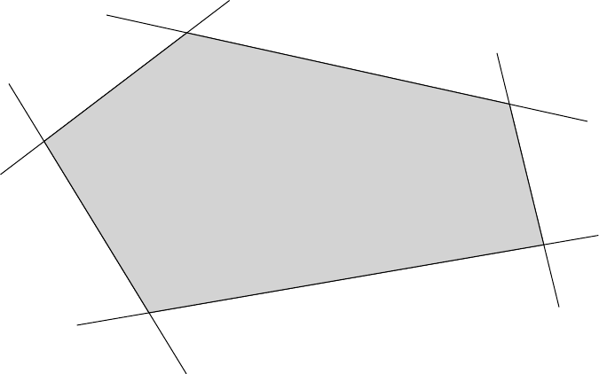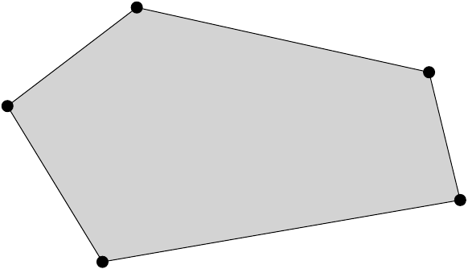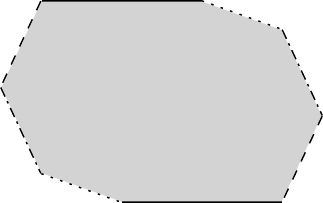</p>
<figcaption>Figure 1: Examples of three different polytope
representations. From left to right: an H-polytope, a V-polytope, and a
Z-polytope (a sum of four segments).</figcaption>
</figure>

Convex polytopes are a special case of convex bodies with special
interest in many scientific fields and applications. For example, in
optimization, the feasible region of a linear program is a polytope, and
in finance, the set of portfolios is usually expressed by a polytope
(i.e., the simplex). More formally, an H-polytope is defined as
$$P:=\{ x\ |\ Ax\leq b \}\subseteq{\mathbb R}^d ,$$
where $A\in{\mathbb R}^{m\times d}$ and $b\in{\mathbb R}^m$, and we say
that $P$ is given in H-representation. Each row $a_i^T\in{\mathbb R}^d$
of matrix $A$ corresponds to a normal vector that defines a halfspace
$a_i^Tx\leq b_i,\ i=[m]$. The intersection of those halfspaces defines
the polytope $P$, and the hyperplanes $a_i^Tx=b_i,\ i=[m]$ are called
facets of $P$. A V-polytope is given by a matrix
$V\in{\mathbb R}^{d\times n}$, which contains $n$ points column-wise,
and we say that $P$ is given in V-representation. The points of $P$ that
cannot be written as convex combinations of other points of $P$ are
called vertices. The polytope $P$ is defined as the convex hull of those
vertices, i.e., the smallest convex set that contains them.
Equivalently, a V-polytope can be seen as the linear map of the
canonical simplex
$\Delta^{n-1} := \{ x\in{\mathbb R}^n\ |\ x_i\geq 0,\ \sum_{i=1}^nx_i=1 \}$
according to matrix $V$, i.e.,
$$\begin{aligned}
P:=\{& x\in{\mathbb R}^d\ |\ \exists y\in \Delta^{n-1} : x=Vy \}
\end{aligned}$$
A Z-polytope (or zonotope) is given by a matrix
$G\in{\mathbb R}^{d\times k}$, which contains $k$ segments column-wise,
which are called generators. In this case, $P$ is defined as the
Minkowski sum of those segments and we say that it is given in
Z-representation. We call *order* of a Z-polytope the ratio between the
number of segments over the dimension. Equivalently, $P$ can be
expressed as the linear map of the hypercube $[-1,1]^k$ with matrix $G$,
i.e. 
$$P:=\{ x\in{\mathbb R}^d\ |\ \exists y\in [-1,1]^k : x=Gy \}.$$
Thus, a Z-polytope is a centrally symmetric convex body, as a linear map
of an other centrally symmetric convex body. Examples of an H-polytope,
a V-polytope and a Z-polytope in two dimensions are illustrated in
Figure [1](#fig:poly_representations). For an excellent introduction to
polytope theory, we recommend the book of @Ziegler95.

## MCMC sampling and geometric random walks {#subsec:sampling}

We more formally define here the four geometric random walks implemented
in *volesti*, namely, Hit and Run (two variations, RDHR, and CDHR), Ball
walk (Baw), and Billiard walk (BiW). They are illustrated in
Figure [2](#fig:random_walks) for two dimensions.

In general, if $f:\mathbb{R}^n\rightarrow\mathbb{R}_{+}$ is a
non-negative integrable function, then it defines a measure $\pi_f$ on
any measurable subset $A$ of ${\mathbb R}^d$,
$$\pi_f(A)=\frac{\int_A f(x)dx}{\int_{\mathbb{R}^d}f(x)dx}$$

<figure id="fig:random_walks">
<p>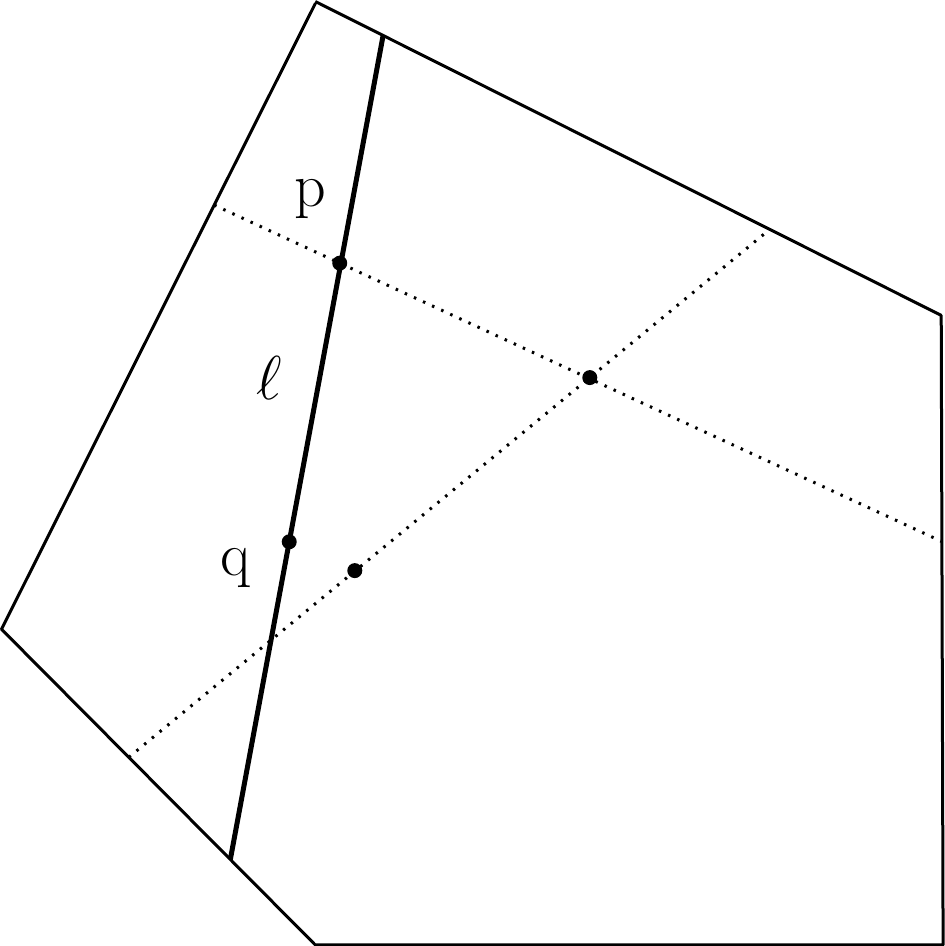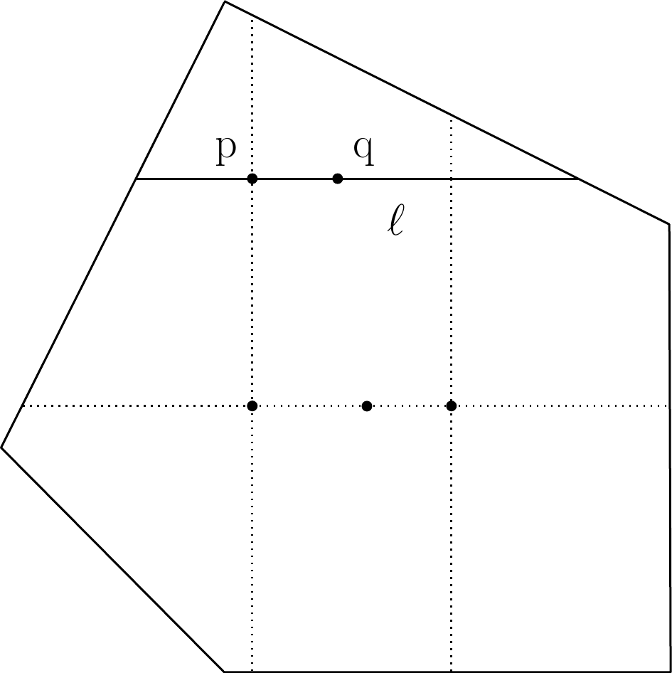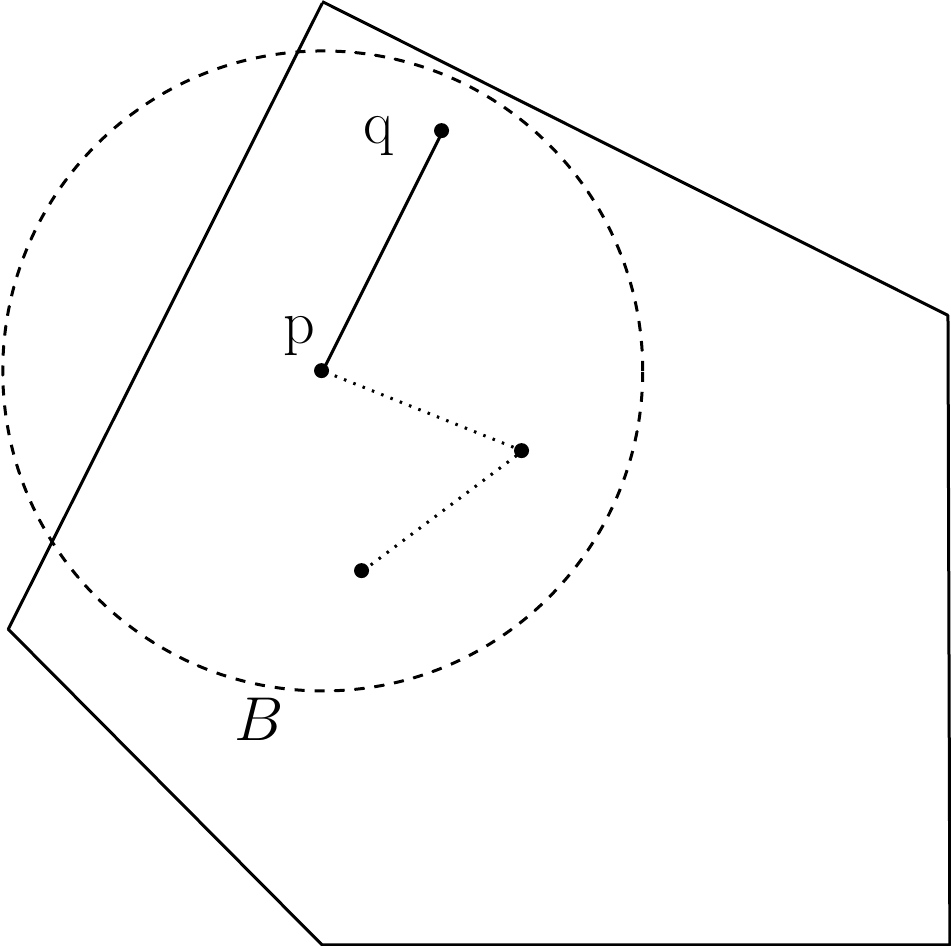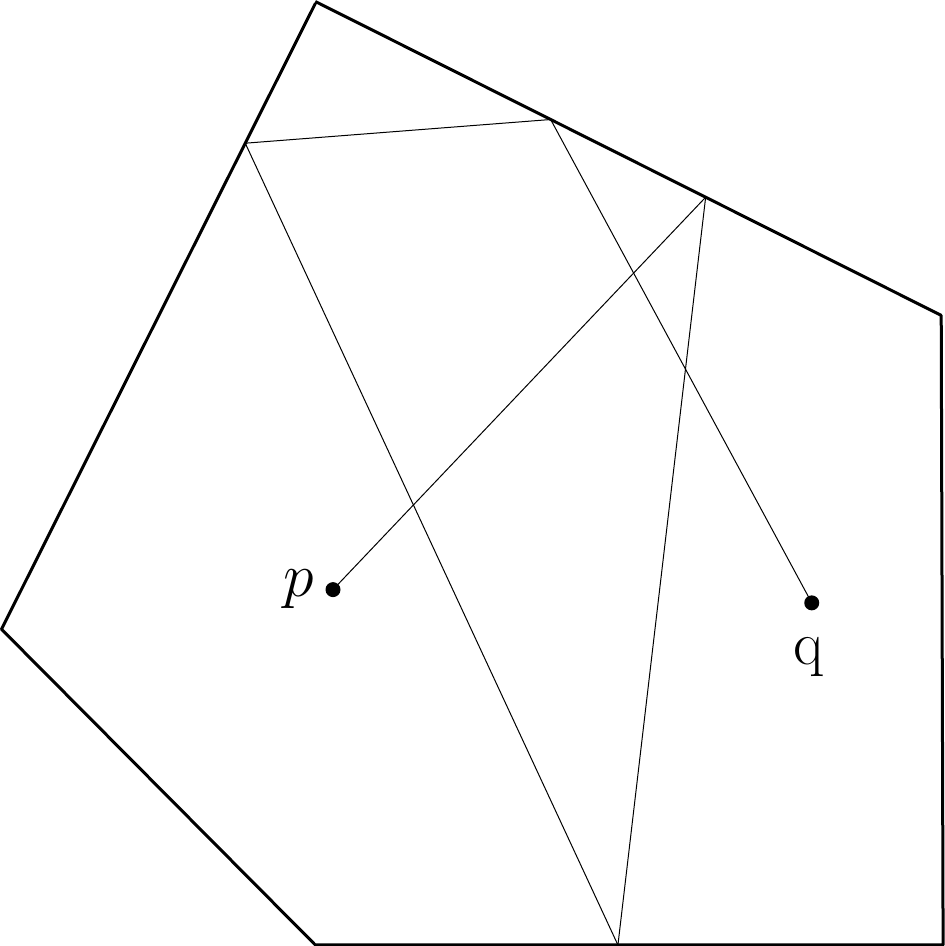</p>
<figcaption>Figure 2: Examples of random walks. From left to right:
RDHR, CDHR, BaW, BiW; <span class="math inline"><em>p</em></span> is the
point at current step and <span class="math inline"><em>q</em></span>
the new point computed; <span class="math inline">ℓ</span> is the line
computed by RDHR and CDHR; <span class="math inline"><em>B</em></span>
is the ball computed by BaW. Dotted lines depict previous
steps.</figcaption>
</figure>

Let $\ell$ be a line in $\mathbb{R}^d$ and let $\pi_{\ell,f}$ be the
restriction of $\pi$ to $\ell$,
$$\pi_{\ell ,f}(P) = \frac{\int_{p+tu\in P}f(p+tu)dt}{\int_{\ell}f(x)dx} ,$$
where $p$ is a point on $\ell$ and $u$ a unit vector parallel to $\ell$.

Algorithm [1](#alg:hnr) describes the general Hit and Run
procedure. When the line $\ell$ in line (1.) of the pseudocode is chosen
uniformly at random from all possible lines passing through $p$, then
the walk is called Random-Directions Hit and Run [@smithhnr]. To pick a
random direction through point $p\in\mathbb{R}^d$, we could sample $d$
numbers $g_1,\dots ,g_d$ from $\mathcal{N}(0,1)$, and then the vector
$u=(g_1,\dots ,g_d)/\sqrt{\sum g_i^2}$ is uniformly distributed on the
surface of the $d$-dimensional unit ball. A special case is called
Coordinate-Directions Hit and Run [@smithhnr], where we pick $\ell$
uniformly at random from the set of $d$ lines that passing through $p$
and are parallel to the coordinate axes.

#### Algorithm 1: Hit_and_run$(P,p,f)$ {#alg:hnr}

\
**Input :** Polytope $P\subset{\mathbb R}^d$, point $p\in P$,
$f:{\mathbb R}^d\rightarrow{\mathbb R}_{+}$   
**Output :** A point $q\in P$\
\

1.  Pick a line $\ell$ through $p$.

2.  **return** a random point on the chord $\ell \cap P$ chosen from the
    distribution $\pi_{\ell,f}$.

The Ball walk (Algorithm [2](#alg:ball)) needs, additionally to
Hit and Run, a radius $\delta$ as input. In particular, Ball walk is a
special case of Metropolis Hastings [@Hastings70] when the target
distribution is truncated. For both Hit and Run and Ball walk $\pi_f$,
is the stationary distribution of the random walk. If
$f(x)=e^{-||x-x_0||^2/2\sigma^2}$, then the target distribution is the
multidimensional spherical Gaussian with variance $\sigma^2$ and its
mode at $x_0$. When $f$ is the indicator function of $P$, then the
target distribution is the uniform distribution.

#### Algorithm 2: Ball_walk$(P,p,\delta ,f)$ {#alg:ball}

\
**Input :** Polytope $P\subset{\mathbb R}^d$, point $p\in P$, radius
$\delta$, $f {\mathbb R}^d\rightarrow{\mathbb R}_{+}$  
**Output :** A point $q\in P$\
\

1.  Pick a uniform random point $x$ from the ball of radius $\delta$
    centered at $p$

2.  **return** $x$ with probability
    $\min \left\{ 1,\frac{f(x)}{f(p)} \right\}$; **return** $p$ with the
    remaining probability.

Billiard walk is a random walk for sampling from the uniform
distribution [@POLYAK20146123]. It tries to emulate the movement of a
gas particle during the physical phenomena of filling uniformly a
vessel. Algorithm [3](#alg:billiard) implements Billiard walk,
where $\langle \cdot , \cdot \rangle$ is the inner product between two
vectors, $||\cdot||$ is the $\ell^2$ norm, and $|\cdot|$ is the length
of a segment.

#### Algorithm 3: Billiard_walk$(P, p, \tau , R)$ {#alg:billiard}

\
**Input :** Polytope $P\subset{\mathbb R}^d$, current point of the
random walk $p\in P$, length of trajectory parameter
$\tau \in {\mathbb R}_{+}$, upper bound on the number of reflections
$R \in \mathbb{N}$   
**Output :** A point $q\in P$\
\

1.  Set the length of the trajectory $L \leftarrow -\tau\ln\eta$,
    $\eta\sim \mathcal{U}(0,1)$;\
    Set the number of reflections $n\leftarrow 0$ and
    $p_0\leftarrow p$;\
    Pick a uniformly distributed direction on the unit sphere, $v$;

2.  Update $n\leftarrow n+1$; **If** $n>R$ **return** $p_0$;

3.  Set $\ell \leftarrow \{p + tv, 0\leq t\leq L\}$;

4.  **If** $\partial P\cap\ell=\emptyset$ **return** $p+Lv$;

5.  Update $p \leftarrow \partial P\cap\ell$; Let $s$ be the inner
    normal vector of the tangent plane on $p$, s.t. $||s|| = 1$; Update
    $L \leftarrow L - |P\cap\ell|$,
    $v \leftarrow v - 2\langle v,s \rangle s$; **goto** 2;

Every random walk starts from a point in the convex body and perform a
number of steps called *walk length*. The larger the walk length is, the
less correlated the final with the starting point will be. The number of
steps to get an uncorrelated point, that is, a point approximately drawn
from $\pi_f$ is called *mixing time*. The number of operations performed
to generate a point is called *cost per step*. Hence, the total cost to
generate a random point is the mixing time multiplied by the cost per
step.

::: {#tab:random_walks}
  ----------------------- ---------------- -------------- --------------------
  random walk               mixing time      cost/step         cost/step

                                             H-polytope    V- $\&$ Z-polytope

  RDHR [@Lovasz06]           $O^*(d^3)$       $O(md)$           $2$ LPs

  CDHR [@Laddha20]         $O^*(d^{10})$       $O(m)$           $2$ LPs

  BaW [@bwmixing]          $O^*(d^{2.5})$     $O(md)$            $1$ LP

  BiW [@POLYAK20146123]        **?**        $O((d+R) m)$        $R$ LPs
  ----------------------- ---------------- -------------- --------------------

  : Table 1: Overview of the random walks implemented in *volesti*. LP
  for linear program; $R$ for the number of reflections per point in
  BiW; $D$ for the diameter of the polytope.
:::

Table [1](#tab:random_walks) displays known complexities for mixing time
and cost per step. For the mixing time of RDHR, we assume that $P$ is
well rounded, i.e., $B_d\subseteq P\subseteq C\sqrt{d}B_d$, where $B_d$
is the unit ball and $C$ a constant. In general, if
$rB_d\subseteq P\subseteq RB_d$ then RDHR mixing time is
$O^*(d^2(R/r)^2)$. For the mixing time of Ball walk in
Table [1](#tab:random_walks), we assume that $P$ is in isotropic
position and the radius of the ball is $\delta = \Theta(1/\sqrt{d})$
[@bwmixing]. There are no theoretical bounds on mixing time for CDHR and
BiW. [@POLYAK20146123] experimentally shows that BiW converges faster
than RDHR when $\tau \approx diam(P)$, i.e., the diameter of $P$. CDHR
is the main paradigm for sampling in practice from H-polytopes, e.g., in
volume computation [@Emiris14] and biology [@CousinsChnr]. The main
reason behind this is the small cost per step and the same convergence
in practice as RDHR [@Emiris14]. For V- and Z-polytopes, the cost per
step of BiW is comparable with that of CDHR. Moreover, it converges fast
to the uniform distribution [@CoolBod]. The fact that all above walks
are implemented in *volesti* enable us to empirically evaluate their
mixing time using R (e.g., Figure [3](#fig:sampling_eg)).

## Volume estimation {#subsec:volume}

As mentioned before, volume computation is a hard problem, so given a
polytope $P$, we have to employ randomized algorithms to approximate
$vol(P)$ within some target relative error $\epsilon$ and high
probability. The keys to the success of those algorithms are the
Multiphase Monte Carlo (MMC) technique and sampling from multivariate
distributions with geometric random walks.

In particular, we define a sequence of functions $\{f_0,\ \dots ,f_q\}$,
$f_i:{\mathbb R}^d\rightarrow {\mathbb R}$. Then, $vol(P)$ is given by
the following telescopic product:
$$\label{telegeneric}
vol(P) = \int_P dx = \int_P f_q(x)dx\frac{\int_P f_{q-1}(x)dx}{\int_P f_q(x)dx}\cdots\frac{\int_P dx}{\int_P f_0(x)dx}   (\#eq:telegeneric)$$

Then, we need to:

-   Fix the sequence such that $q$ is as small as possible.
-   Select $f_i$ such that each integral ratio can be efficiently
    estimated.
-   Estimate $\int_P f_q(x)dx$.

For a long time researchers, e.g., [@LovSim], set $f_i$ to be indicator
functions of concentric balls intersecting $P$. It follows that
$\int_Pf_i(x)dx = vol(B_i\cap P)$, and the sequence of convex bodies
$P=P_1\supseteq\dots\supseteq P_q,\ P_i = B_i\cap P$ forms a telescopic
product of ratios of volumes, while for $vol(P_q)$ there is a closed
formula. Assuming $rB_d\subset P\subset RB_d$, then $q = O(d\lg R/r)$.
The trick now is that we do not have to compute the exact value of each
ratio $r_i=vol(P_i)/vol(P_{i+1})$, but we can use sampling-rejection to
estimate it within some target relative error $\epsilon_i$. If $r_i$ is
bounded, then $O(1/\epsilon_i^2)$ uniformly distributed points in
$P_{i+1}$ suffices. Another crucial aspect is the sandwiching ratio
$R/r$ of $P$ which has to be as small as possible. This was tackled by a
rounding algorithm, that is bringing $P$ to nearly isotropic
position [@LovSim].

The SoB algorithm follows this paradigm and deterministically defines
the sequence of $P_i$ such that
$0.5\leq vol(P_{i}) / vol(P_{i+1})\leq 1$. In the CG algorithm, each
$f_i$ is a spherical multidimensional Gaussian distribution, and the
algorithm uses an annealing schedule [@LovVem] to fix the sequence of
those Gaussians. The SoB algorithm uses a similar annealing schedule but
to fix a sequence of convex bodies $P_i$. As far as performance is
concerned, the CB algorithm is the most efficient choice for H-polytopes
in less than 200 dimensions and for V- and Z-polytopes in any dimension.
For the rest of the cases, the user should choose CG algorithm.

# Package {#sec:package}

The package *volesti* combines the efficiency of C++ and the popularity
and usability of R. The package uses the eigen library [@eigenweb] for
linear algebra, lpsolve library [@lpsolve] for solving linear programs,
and boost random library [@boostrandom] (part of Boost C++ libraries)
for random numbers and distributions. All the code development is
performed on [github
platform](https://github.com/GeomScale/volume_approximation). The
package is available in Comprehensive R Archive Network (CRAN) and is
regularly updated with new features and bug fixes. We employ [continuous
integration](https://github.com/GeomScale/volume_approximation/actions)
to test the package on various systems and deploy environments. There is
detailed
[documentation](https://cran.rstudio.com/web/packages/volesti/volesti.pdf)
of all the exposed R classes and functions publicly available. We
maintain a [contribution
tutorial](https://github.com/GeomScale/volume_approximation/blob/develop/CONTRIBUTING.md)
to help users and researchers who want to contribute to the development
or propose a bug-fix. The package is shipped under the `LGPL-3` license
to be open to all the scientific communities. We use
[*Rcpp*](https://CRAN.R-project.org/package=Rcpp) [@rcpp] to interface
C++ with R. In particular, we create one *Rcpp* function for each
procedure (such as sampling, volume estimation etc.) and we export it as
an R function.

In the following sections, we demonstrate the use of *volesti*. The R
scripts in the following sections use only standard R functions,
*volesti*. In a single script in Section [4](#sec:applications), we use
[*Rfast*](https://CRAN.R-project.org/package=Rfast) to compute the
assets' compound return in a stock market.

## Polytope classes and generators {#subsec:generators}

The package *volesti* comes with three classes to handle different
representations of polytopes. Table [2](#tab:classpol) demonstrates the
exposed R classes. The names of the classes are the names of polytope
representations as defined in the previous section. Each polytope class
has a few variable members that describe a specific polytope,
demonstrated in Table [2](#tab:classpol). The matrices and the vectors
in Table [2](#tab:classpol) correspond to those in the polytope
definitions. The `integer` variable `type` implies the representation:
`1` is for H-polytopes, `2` for V-polytopes, `3` for Z-polytopes. The
`numerical` variable `volume` corresponds to the volume of the polytopes
if it is known. *volesti* provides standard and random polytope
generators. The first produce well-known polytopes such as cubes, cross
polytopes, and simplices and assign the value of the exact volume to
`volume` variable. The second are random generators using various
probability distributions and methods to produce a variety of different
random polytopes; notably the generated polytopes have unknown volume.

::: {#tab:classpol}
  ---------------------------------------------------------------------------------------------------------------------------
       Class         Constructor                                         Variable members
  --------------- ------------------ ----------------------------------------------------------------------------------------
   `"Hpolytope"`   `Hpolytope(A,b)`   $A\in{\mathbb R}^{m\times d}$, $b\in{\mathbb R}^m$, `integer type`, `numerical volume`

   `"Vpolytope"`    `Vpolytope(V)`              $V\in{\mathbb R}^{n\times d}$, `integer type`, `numerical volume`

   `"Zonotope"`     `Zonotope(G)`               $G\in{\mathbb R}^{k\times d}$, `integer type`, `numerical volume`
  ---------------------------------------------------------------------------------------------------------------------------

  : Table 2: Overview of the polytopes' classes in *volesti*.
:::

## Uniform sampling from polytopes

A core feature of *volesti* is approximate sampling from convex bodies
with uniform or spherical Gaussian target distribution using the four
geometric random walks defined above.

The following R script samples $1000$ points from the $100$-dimensional
hypercube $[-1,1]^{100}$ defined as $P$ and stores them in a list.

``` r
R> d = 100
R> P = gen_cube(d, 'H')

R> samples = sample_points(P, random_walk = list(
                           "walk" = "RDHR", "burn-in"=1000, "walk_length" = 5),
                           n = 1000)                              
```

We use the Random Directions Hit-and-Run (RDHR) walk. Other choices are:
Coordinate Directions Hit-and-Run (CDHR), Ball Walk (BaW), and Billiard
Walk (BiW). Setting the parameter `burn-in` to 1000 means that *volesti*
burns the first 1000 points RDHR generates; setting walk_length to 5
means that we keep in the list, one every five generated points. The
default choice for the target distribution is the uniform distribution.

To evaluate the efficiency of *volesti* sampling routines, one could
measure the run-time and estimate the effective sample size [@geyer11]
per second. To estimate the effective sample size in R, a standard
choice is the package
[*coda*](https://CRAN.R-project.org/package=coda) [@coda].
In [@volesti_blog], benchmarks show that *volesti* can be up to
$\sim 2\, 500$ times faster than
[*hitandrun*](https://CRAN.R-project.org/package=hitandrun) for uniform
sampling from a polytope.

<figure id="fig:sampling_eg">
<p>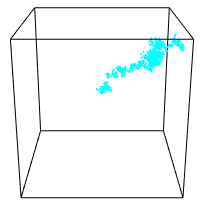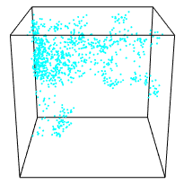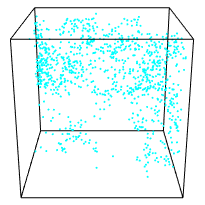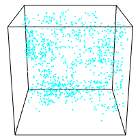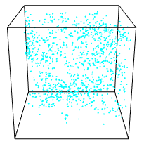</p>
<p>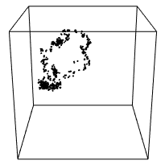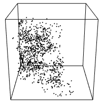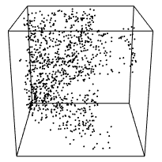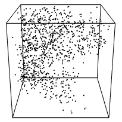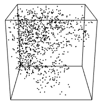</p>
<p>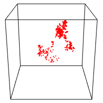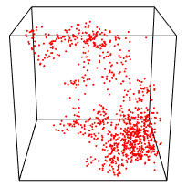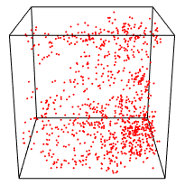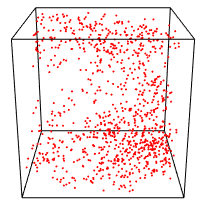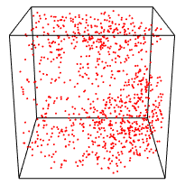</p>
<p>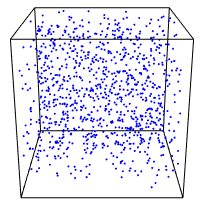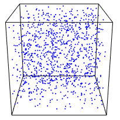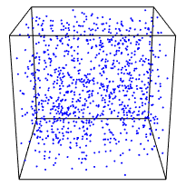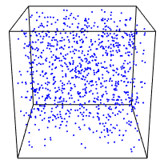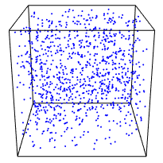</p>
<figcaption>Figure 3: Uniform sampling from a random rotation of the
hypercube <span class="math inline">[−1,1]<sup>200</sup></span>. We map
the sample back to <span
class="math inline">[−1,1]<sup>200</sup></span>, and then we project
them on <span class="math inline">ℝ<sup>3</sup></span> by keeping the
first three coordinates. Each row corresponds to a different walk: BaW,
CDHR, RDHR, BiW. Each column to a different walk length: {1, 50, 100,
150, 200}. That is, the sub-figure in the third row and the forth column
corresponds to RDHR with 150 walk length.</figcaption>
</figure>

Moreover, using *volesti* and R, we can empirically study the mixing
time of the geometric random walks implemented in *volesti*. To this
end, we uniformly sample from a random rotation of the 200-dimensional
hypercube $[-1,1]^{200}$. First, we generate the hypercube and use
`rotate_polytope()` that returns the rotated polytope and the matrix of
the linear transformation.

``` r
R> d = 200
R> num_of_points = 1000
R> P = gen_cube(d, 'H')
R> retList = rotate_polytope(P, rotation = list("seed" = 5))
R> T = retList$T
R> P = retList$P
```

Then, we use `sample_points()` to sample from the rotated cube with
various walk lengths to test the practical mixing of the random walk.

``` r
R> for (i in c(1, seq(from = 50, to = 200, by = 50))){
     points1 = t(T) %*% sample_points(P, n = num_of_points, random_walk = list(
                                      "walk" = "BaW", "walk_length" = i, "seed" = 5))
     points2 = t(T) %*% sample_points(P, n = num_of_points, random_walk = list(
                                      "walk" = "CDHR", "walk_length" = i, "seed" = 5))
     points3 = t(T) %*% sample_points(P, n = num_of_points, random_walk = list(
                                      "walk" = "RDHR", "walk_length" = i, "seed" = 5))
     points4 = t(T) %*% sample_points(P, n = num_of_points, random_walk = list(
                                      "walk" = "BiW", "walk_length" = i, "seed" = 5))
   }
```

Finally, we map the points back to $[-1,1]^{200}$ using the inverse
transformation, and then we project all the sample points on
${\mathbb R}^3$, or equivalently on the 3D cube $[-1,1]^3$, by keeping
the first three coordinates. We plot the results in
Figure [3](#fig:sampling_eg).

Note that, in general, perfect uniform sampling in the rotated polytope
would result to perfect uniformly distributed points in the 3D cube
$[-1,1]^3$. Hence, Figure [3](#fig:sampling_eg) shows an advantage of
BiW in mixing time for this scenario compared to the other walks---it
mixes relatively well even with one step (i.e. walk length). Notice also
that the mixing of both CDHR and RDHR seem similar while it is slightly
better than the mixing of BaW.

### Gaussian sampling from polytopes

In many Bayesian models, the posterior distribution is a multivariate
Gaussian distribution restricted to a specific domain. We illustrate the
usage of *volesti* for the case of the truncation being the canonical
simplex $\Delta^n =\{ x\in R^n\ |\ x_i\geq 0,\ \sum_ix_i=1 \}$, which is
of special interest. This situation typically occurs whenever the
unknown parameters can be interpreted as fractions or probabilities.
Thus, it appears in many important applications [@Altmann14]. In
particular, we consider the following density,
$$\label{eq:gaussian_simplex}
f(x|\mu,\Sigma) \propto  \left\{
\begin{array}{ll}
      exp[-\frac{1}{2}(x-\mu)^T\Sigma(x-\mu)],  &  if  x\in\Delta^n ,\\
      0, & otherwise.\\
\end{array} 
\right.   (\#eq:gaussian-simplex)$$

Clearly, the support of the density in
Equation (\@ref(eq:gaussian-simplex)) is defined by a convex subset of a
linear subspace of ${\mathbb R}^n$. Thus, to sample from
$f(x|\mu,\Sigma)$, we apply a proper linear transformation, induced by a
matrix $N\in{\mathbb R}^{n\times (n-1)}$ that maps the support to a
full-dimensional polytope in ${\mathbb R}^{n-1}$, while the covariance
matrix changes accordingly to $\Sigma' = N^T\Sigma N$. Then, we apply a
Cholesky decomposition to $\Sigma'=LL^T$ and employ the linear
transformation induced by $L$ to transform the distribution into a
spherical Gaussian distribution.

In the following R script we first generate a random 100-dimensional
positive definite matrix $\Sigma$. Then, we sample from the multivariate
Gaussian distribution with the covariance matrix being $\Sigma$ and the
mode being the center of the canonical simplex $\Delta^n$. To achieve
this goal, we first apply all the necessary linear transformations to
both the probability density function and the $\Delta^n$ to obtain the
standard Gaussian distribution, $\mathcal{N}(0,I_n)$, restricted to a
general full-dimensional simplex.

``` r
R> d = 100
R> S = matrix( rnorm(d*d,mean=0,sd=1), d, d) #random covariance matrix 
R> S = S %*% t(S)
R> shift = rep(1/d, d)
R> A = -diag(d)
R> b = rep(0,d)
R> b = b - A %*% shift
R> Aeq = t(as.matrix(rep(1,d), 10,1))
R> N = pracma::nullspace(Aeq)       
R> A = A %*% N #transform the truncation into a full dimensional polytope
R> S = t(N) %*% S %*% N
R> A = A %*% t(chol(S)) #Cholesky decomposition to transform to the standard Gaussian
R> P = Hpolytope(A=A, b=as.numeric(b)) #new truncation
```

Next, we use the `sample_points()` function to sample from the standard
Gaussian distribution restricted to the computed simplex, and we apply
the inverse transformations to obtain a sample in the initial space.

``` r
R> samples = sample_points(P, n = 100000, random_walk = 
                           list("walk"="CDHR", "burn-in"=1000, 
                           "starting_point" = rep(0, d-1),
                           distribution = list("density" = "gaussian", 
                           "mode" = rep(0, d-1)))) 
R> samples_initial_space = N %*% samples + 
   kronecker(matrix(1, 1, 100000), matrix(shift, ncol = 1))
```

In the previous script, we set the starting point of the walk to the
mode of the Gaussian, i.e., the origin. Note that the default choice in
*volesti* for the target distribution in the case of Gaussian sampling
is the standard Gaussian; that is, the target distribution in the above
script.

Considering comparisons, *volesti* is at least one order of magnitude
faster than
[*restrictedMVN*](https://CRAN.R-project.org/package=restrictedMVN) and
*tmg* for computing a sample of similar quality. For more details on
comparison with other packages, we refer to [@volesti_blog].

## Volume estimation {#subsec:volume_volesti}

Let us now give an example of how we approximate the volume of a
polytope in *volesti*. Since this is a randomized algorithm, it makes
sense to compute some statistics for the output values using R when
approximating the volume of the $10$-dimensional cube $[-1,1]^{10}$
generated as an H-polytope.

``` r
R> P = gen_cube(10, 'H')
R> volumes = list()
R> for (i in seq_len(20)) {
     volumes[[i]] = volume(P, settings = list("error" = 0.2))
   }
```

By changing the error to $0.02$, we can obtain more accurate results.
The results are illustrated in Figure [4](#fig:avg_volume). Note that
the exact volume is $1024$.

<figure id="fig:avg_volume">
<p>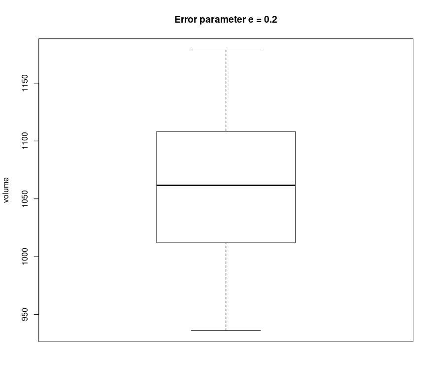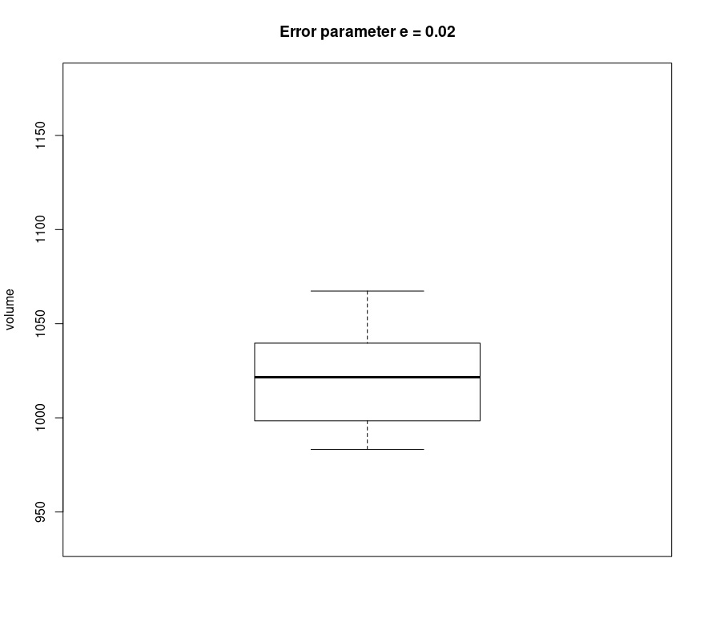</p>
<figcaption>Figure 4: The boxplot of the estimated volumes of the
hypercude <span class="math inline">[−1,1]<sup>10</sup></span> by
<em>volesti</em>. Left, the input error parameter is <span
class="math inline"><em>ϵ</em> = 0.2</span>, and right is <span
class="math inline"><em>ϵ</em> = 0.02</span>.</figcaption>
</figure>

To understand the need for randomized computation in high dimensions
implemented in *volesti*, we can consider the state-of-the-art volume
computation in R today, namely,
[*geometry*](https://CRAN.R-project.org/package=geometry). It implements
a deterministic algorithm in which run-time grows exponentially with the
dimension. Because of the later property,
[*geometry*](https://CRAN.R-project.org/package=geometry) generally,
fails to terminate for polytope in dimension $d\geq 20$.
See [@volesti_blog] for comparison details with
[*geometry*](https://CRAN.R-project.org/package=geometry).

The following script illustrates the usage and efficiency of *volesti*
to compute the volume of high-dimensional polytopes. In particular, a
V-polytope, namely the
[cross-polytope](https://en.wikipedia.org/wiki/Cross-polytope), and an
H-polytope, namely the hypercube.

``` r
R> d = 80
R> P = gen_cross(80, 'V')  #generate a cross polytope in V-representation

R> time = system.time({
          volume_estimation = volume(P, settings = list(
                                     "algorithm" = "CB", "random_walk" = "BiW", 
                                     "seed" = 127)) })
R> exact_volume = 2^d/prod(1:d)
R> cat(time[1], abs(volume_estimation - exact_volume) / exact_volume)

82.874   0.074434

R> P = gen_cube(d, 'H')   #generate a hypercube polytope in H-representation

R> time = system.time({
          volume_estimation = volume(P, settings = list(
                                     "algorithm" = "CB", "random_walk" = "CDHR", 
                                     "seed" = 23)) })
R> exact_volume = 2^d
R> cat(time[1], abs(volume_estimation - exact_volume) / exact_volume)

0.657   0.067633
```

For V- and Z- polytopes the most efficient choice of random walk is BiW,
while for H-polytopes is CDHR. This explains why we use different random
walks in the previous script. However, notice that the run-time for the
H-polytope is two order of magnitude smaller. This happens because the
cost per step of a random walk in a V-polytope increases comparing to
H-polytopes.

Last but not least, *volesti* provides random polytope generators. The
following command estimates the volume of a randomly generated
V-polytope that is the convex hull of $40$ uniformly generated random
points from the $20$-dimensional cube.

``` r
R> P = gen_rand_vpoly(20, 40, generator = list("body" =  "cube", "seed" = 1729))
R> volume_estimation = volume(P)
```

The next call estimates the volume of an H-polytope randomly generated
as an intersection of $180$ linear halfspaces computed by random tangent
hyperplanes on an $60$-dimensional hypersphere.

``` r
R> P = gen_rand_hpoly(60, 180, generator = list('constants' = 'sphere'))
R> volume_estimation = volume(P)
```

Since the exact volume of those polytopes is unknown, the accuracy of
the computed estimation is unknown and statistical methods such as the
effective sample size [@geyer11] could be used.

# Applications {#sec:applications}

We demonstrate *volesti*'s potential to solve challenging problems. More
specifically, we provide detailed use-cases for applications in finance
(crises detection and portfolio scoring), decision and control,
multivariate integration, and artificial intelligence.

## Financial crises detection and portfolio scoring {#subsec:fintools}

In this subsection, we present how one could employ *volesti* to detect
financial crises or shock events in stock markets by following the
method of [@Cales18]. For all the examples in the sequel, we use a set
of $52$ popular exchange-traded funds (ETFs) and the US central bank
(FED) rate of return publicly available from
<https://stanford.edu/class/ee103/portfolio.html>. The following script
is used to load the data.

``` r
R> MatReturns = read.table("https://stanford.edu/class/ee103/data/returns.txt", 
                           sep = ",")
R> MatReturns = MatReturns[-c(1, 2), ]
R> dates = as.character(MatReturns$V1)
R> MatReturns = as.matrix(MatReturns[ ,-c(1, 54)])
R> MatReturns = matrix(as.numeric(MatReturns), nrow = dim(MatReturns )[1], ncol =
                       dim(MatReturns )[2], byrow = FALSE)
R> nassets = dim(MatReturns)[2]
```

The method uses the copula representation to capture the dependence
between portfolios' returns and volatility. A copula is an approximation
of the bivariate joint distribution while both marginals follow the
uniform distribution. In normal times, portfolios are characterized by
slightly positive returns and moderate volatility, in up-market times
(typically bubbles) by high returns and low volatility, and during
financial crises by strongly negative returns and high volatility. Thus,
when a copula implies a positive dependence (see Figure [5](#fig:cop2)
left), then it probably comes from a normal period. On the other side,
when the dependence between portfolios' return and volatility is
negative (see Figure [5](#fig:cop2) right), the copula probably comes
from a crisis period. The first case occurs when the indicator that
computes the ratio between the red mass over the blue mass is smaller
than $1$, and the second case when that indicator is larger than $1$.
The function `copula()` can be used to compute such copulas. When two
vectors of returns are given as input by the user, then the computed
copula is related to the problem of the momentum effect in stock
markets.

<figure id="fig:cop2">
<p>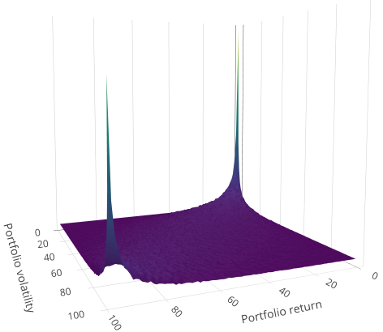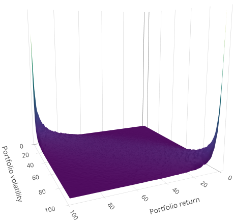</p>
<figcaption>Figure 5: Left, a copula that corresponds to normal period
(<span class="math inline">07/03/2007 − 31/05/2007</span>), <span
class="math inline"><em>I</em> = 0.2316412</span>. Right, a copula that
corresponds to a crisis period (<span
class="math inline">18/12/2008 − 13/03/2009</span>), <span
class="math inline"><em>I</em> = 5.610785</span>; <span
class="math inline"><em>x</em></span> axis is for return and <span
class="math inline"><em>y</em></span> axis is for
volatility.</figcaption>
</figure>

The following script produces Figure [5](#fig:cop2) by setting the
starting and the stopping date for the left and the right plot,
respectively. To compute the copula, we use the compound asset return,
which is the rate of return for capital over a cumulative series of
time [@Cales18].

``` r
R> row1 = which(dates %in% "2008-12-18")
R> row2 = which(dates %in% "2009-03-13")
R> compound_asset_return = Rfast::colprods(1 + MatReturns[row1:row2, ]) - 1  
R> mass = copula(r1 = compound_asset_return, sigma = cov(MatReturns[row1:row2, ]), 
                 m = 100, n = 1e+06, seed = 5)
```

Moreover, the function `compute_indicators()` computes the copulas of
all the sets of `win_len` consecutive days and returns the corresponding
indicators and the states of the market during the given time period.
The next script takes as input the daily returns of all the $52$ assets
from $01/04/2007$ until $04/01/2010$. When the indicator is $\geq 1$ for
more than $30$ days, we issue a warning, and when it is for more than
$60$ days, we mark this period as a crisis (see
Figure [6](#fig:indicators)).

``` r
R> row1 = which(dates %in% "2007-01-04")
R> row2 = which(dates %in% "2010-01-04")
R> market_analysis = compute_indicators(returns =  MatReturns[row1:row2, ],
                                        parameters = list("win_len" = 60, "m" = 100,
                                        "n" = 1e+06, "nwarning" = 30, "ncrisis" = 60, 
                                        "seed" = 5))                            
R> I = market_analysis$indicators
R> market_states = market_analysis$market_states
```

We compare the results with the database for financial crises in
European countries proposed in [@ESRB17]. The only listed crisis for
this period is the sub-prime crisis (from December 2007 to June 2009).
Notice that Figure [6](#fig:indicators) successfully points out $4$
crisis events in that period ($2$ crisis and $2$ warning periods) and
detects sub-prime crisis as a W-shape crisis.

{#fig:indicators
width="100%" alt="graphic without alt text"}

As a second financial application, we will use *volesti* to evaluate the
performance of a given portfolio. In particular, *volesti* computes the
proportion of all possible allocations that the given portfolio
outperforms. This score independently introduced
in [@Pouchkarev05; @Guegan11; @Banerjee11], and is an alternative to
more classical choices for the evaluation of the performance of a
portfolio as the Sharpe-like ratios proposed in the 1960's by
[@Jensen67; @Sharpe66; @Treynor15]. However, the efficient computation
of that score was uncertain until [@Cales18] notice that Varsi's
algorithm [@Varsi73] can be used to perform robust computations in high
dimensions. Varsi's algorithm is implemented in *volesti* by the
function `frustum_of_simplex()` and computes volumes in thousands of
dimensions in just a few milliseconds on modest hardware. As an example,
the following R script let us know that on $03/13/2009$, any portfolio
with a return of $0.002$ outperforms almost $48\%$ of all possible
portfolios.

``` r
R> R = MatReturns[which(dates %in% "2009-03-13"), ]
R> R0 = 0.002
R> tim = system.time({ exact_score = frustum_of_simplex(R, R0) })
R> cat(exact_score, tim[3])

0.4773961  0.001
```

## Zonotope volumes in decision and control {#subsec:eval_zonotopes}

Volume approximation for Z-polytopes (or zonotopes) could be very useful
in several applications in decision and control [@Kopetzki17], in
autonomous driving [@autdriv], or human-robot collaboration [@robcol].
The complexity of algorithms that manipulate Z-polytopes strongly
depends on their order. Thus, to achieve efficient computations, the
common approach in practice is to over-approximate the Z-polytope at
hand $P$, as tight as possible, with a second Z-polytope $P_{red}$ of a
smaller order. Then, the ratio of fitness
$\rho = (vol(P_{red}) / vol(P))^{1/d}$ is a good measure for the quality
of the approximation. However, this ratio cannot be computed for
dimensions typically larger than $10$ (see [@Kopetzki17]). *volesti* is
the first software to the best of our knowledge that efficiently
approximates the ratio of fitness of a high dimensional
Z-polytope--typically up to 100 and order 200--or a Z-polytope of very
high order in lower dimensions--e.g., order 1500 in 10 dimensions.

As an illustration, the following R script generates a random 2D
zonotope, computes the over-approximation with the PCA method, and
estimates the ratio of fitness. The `sample_points` function is then
used to plot the two polygons (Figure [7](#fig:zono_approx)).

``` r
R> Z = gen_rand_zonotope(2, 8, generator = list("distribution" = "uniform", 
                         "seed" = 1729))
R> points1 = sample_points(Z, random_walk = list("walk" = "BRDHR"), n = 10000)
R> retList = zonotope_approximation(Z = Z, fit_ratio = TRUE, 
                                    generator = list("seed" = 5))
R> P = retList$P
R> cat(retList$fit_ratio)

1.116799539

R> points2 = sample_points(P, random_walk = list("walk" = "BRDHR", "seed" = 5), 
                           n = 10000)
```

{#fig:zono_approx
width="100%" alt="graphic without alt text"}

## High-dimensional integration {#subsec:integrals}

Computing the integral of a function over a convex set (i.e., convex
polytope) is a hard fundamental problem with numerous applications.
*volesti* can be used to approximate the value of such an integral by a
simple MCMC integration method, which employs the $vol(P)$ and a uniform
sample in $P$. In particular, let
$$I = \int_P f(x)dx .$$
Then, sample $N$ uniformly distributed points $x_1,\dots ,x_N$ from $P$
and,
$$I\approx vol(P)\frac{1}{N}\sum_{i=1}^N f(x_i) .$$

The following R script generates a V-polytope for $d=5,10,15,20$, and
estimates the integral of
$$\label{eq:f_int}
	f(\mathbf{x}) = \sum_{i=1}^n x_i + 2x_1^2 + x_2 + x_3,   (\#eq:f-int)$$
over the generated V-polytope $P$.

Considering the efficiency of *volesti*, Table [3](#tab:integration)
reports the exact value of $I$ computed by
[*SimplicialCubature*](https://CRAN.R-project.org/package=SimplicialCubature) [@SimplicialCubature].
It computes multivariate integrals over simplices. Hence, to compute an
integral of a function over a convex polytope $P$ in R, one should
compute the Delaunay triangulation with package
[*geometry*](https://CRAN.R-project.org/package=geometry) and then use
the package
[*SimplicialCubature*](https://CRAN.R-project.org/package=SimplicialCubature)
to sum the values of all the integrals over the simplices computed by
the triangulation. The pattern is similar to volume computation. For
$d=5,10$ the exact computation is faster than the approximate. For
$d=15$, *volesti* is $13$ times faster. For $d=20$, the exact approach
halts, while *volesti* returns an estimation in less than a minute.

``` r
R> num_of_points = 5000
R> f = function(x) { sum(x^2) + (2 * x[1]^2 + x[2] + x[3]) }
R> for (d in seq(from = 5, to = 20, by = 5)) {
     P = gen_rand_vpoly(d, 2 * d, generator = list("seed" = 127))
       
     points = sample_points(P, random_walk = list("walk" = "BiW", 
                            "walk_length" = 1, "seed" = 5), n = num_of_points)
     sum_f = 0
     for (i in seq_len(num_of_points)){
       sum_f = sum_f + f(points[, i])
     }
     V = volume(P, settings = list("error" = 0.05, "seed" = 5))
     I2 = (sum_f * V) / num_of_points 
   }
```

::: {#tab:integration}
  -------------------------------------------------------------------------------------------------------
   dimension   *Exact value*   *Estimated value*   *Rel. error*   *Exact Time (sec)*   *Est. Time (sec)*
  ----------- --------------- ------------------- -------------- -------------------- -------------------
       5        0.02738404        0.02446581        0.1065667           0.023                3.983

      10       3.224286e-06      3.204522e-06       0.00612976          3.562                11.95

      15       4.504834e-11      4.867341e-11       0.08047068         471.479              33.256

      20            \-           1.140189e-16           \-                \-                64.058
  -------------------------------------------------------------------------------------------------------

  : Table 3: We compute the integral of the function in
  Equation (\@ref(eq:f-int)) over a random generated V-polytope. *Exact
  value*: the exact value of the integral using
  [*SimplicialCubature*](https://CRAN.R-project.org/package=SimplicialCubature)
  and [*geometry*](https://CRAN.R-project.org/package=geometry);
  *Estimated value*: the estimation of the integral with *volesti*;
  *Rel. error*: the relative error of *volesti*; *Exact Time*: the sum
  of run-times of
  [*geometry*](https://CRAN.R-project.org/package=geometry) and
  [*SimplicialCubature*](https://CRAN.R-project.org/package=SimplicialCubature);
  *Est. Time*: the run-time of *volesti*; \"-\" indicates that the
  program halts.
:::

## Combinatorics and artificial intelligence {#subsec:linear_extensions}

We focus now on a different problem, namely, counting the linear
extensions of a given partially ordered set (poset), which arises in
various applications in artificial intelligence and machine learning,
such as partial order plans [@Muise16] and learning graphical
models [@Niinim16].

Let $G= (V, E)$ be an acyclic digraph with $V= [n] :=\{1,2, \dots,n\}$.
One might want to consider $G$ as a representation of the poset
$V:i > j$ if and only if there is a directed path from node $i$ to node
$j$. A permutation $\pi$ of $[n]$ is called a linear extension of $G$
(or the associated poset $V$) if $\pi^{-1}(i)> \pi^{-1}(j)$ for every
edge $i\rightarrow j \in E$.

Let $P_{LE}(G)$ be the polytope in ${\mathbb R}^n$ defined by
$$P_{LE}(G) =\{x\in {\mathbb R}^n\ |\ 1\geq x_i \geq 0 \text{ for all }i=1,2,\dots ,n\},$$
and $x_i\geq x_j$ for all directed edges $i\rightarrow j \in E$. It is
well known [@Stanley86] that the number of linear extensions of $G$
equals the normalized volume of $P_{LE}(G)$, i.e.,
$$\#_{LE}G=vol(P_{LE}(G))\ n!$$

It is also well known that counting linear extensions is
#P-complete [@Brightwell91]. Thus, as the number of graph nodes (i.e.,
the dimension of $P_{LE}(G)$) grows, the problem becomes intractable for
exact methods. Interestingly, *volesti* provides an efficient
approximation method that could be added to the ones surveyed
by [@Talvitie18].

As a simple example, consider the graph in Figure [8](#fig:graph) that
has 9 linear extensions[^1]. This number can be estimated in
milliseconds using *volesti* as in the following script, where the
estimated number of linear extensions is $9.014706$.

{#fig:graph width="45%"
alt="graphic without alt text"}

``` r
R> A = matrix(c(
              -1,0,1,0,0,0,
              -1,1,0,0,0,-1,
              0,1,0,0,0,0,-1,
              1,1,0,0,0,0,0,
              1,0,0,0,0,0,1,
              0,0,0,0,0,1,0,
              0,0,0,0,1,-1,
              0,0,0,0,0,-1,
              0,0,0,0,0,-1,
              0,0,0,0,0,-1,
              0,0,0,0,0,-1),
              ncol = 5, nrow = 14, byrow = TRUE)
R> b = c(0, 0, 0, 0, 0, 0, 0, 0, 0, 1, 1 , 1, 1, 1)
R> P_LE = Hpolytope(A = A, b = b)
R> time = system.time({ LE = volume(P_LE, settings = list("error" = 0.01, 
                                    "seed" = 1927)) * factorial(5) })
```

# Concluding remarks and future work

*volesti* is an R package that provides MCMC sampling routines for
multivariate distributions restricted to convex polytopes and volume
estimation. It supports three different polytope representations, and
thus, it is useful for several applications. We illustrate the usage of
*volesti* with simple, reproducible examples and show how *volesti* can
be used to address challenging problems in modern applications.

Regarding future work, the expansion of *volesti* to support general
log-concave sampling methods would be of special interest for several
applications. Efficient log-concave sampling could also lead to
additional sophisticated methods to estimate a multivariate integral
over a convex polytope [@Lovasz06b].

# Computational details

The results in this paper were obtained using R 3.4.4, R 3.6.3, and
*volesti* 1.1.2-2. The versions of the imported by *volesti* packages
are [*stats*](https://CRAN.R-project.org/package=stats) 3.4.4 [@stats]
and [*methods*](https://CRAN.R-project.org/package=methods)
3.4.4 [@methods]; of the linked by *volesti* packages,
[*Rcpp*](https://CRAN.R-project.org/package=Rcpp) 1.0.3,
[*BH*](https://CRAN.R-project.org/package=BH) 1.69.0.1 [@BH],
[*RcppEigen*](https://CRAN.R-project.org/package=RcppEigen)
0.3.3.7.0 [@RcppEigen]. The suggested package is
[*testthat*](https://CRAN.R-project.org/package=testthat)
2.0.1 [@testthat]. For comparison to *volesti* and for plots, this paper
uses [*geometry*](https://CRAN.R-project.org/package=geometry) 0.4.5,
[*hitandrun*](https://CRAN.R-project.org/package=hitandrun) 0.5.5,
[*SimplicialCubature*](https://CRAN.R-project.org/package=SimplicialCubature)
1.2, [*Rfast*](https://CRAN.R-project.org/package=Rfast)
2.0.3 [@Rfastpkg],
[*ggplot2*](https://CRAN.R-project.org/package=ggplot2)
3.1.0 [@ggplot2], [*plotly*](https://CRAN.R-project.org/package=plotly)
4.8.0 [@plotly], [*rgl*](https://CRAN.R-project.org/package=rgl)
0.100.50 [@rgl], [*coda*](https://CRAN.R-project.org/package=coda)
0.19.4. All packages used are available from
[CRAN](http://CRAN.R-project.org).

All computations were performed on a PC with
`Intel Pentium(R) CPU G4400 @ 3.30GHz `$\times$` 2 CPU` and `16GB RAM`.

# Acknowledgments

The main part of the work has been done, while A.C. was supported by
[Google Summer of Code](https://summerofcode.withgoogle.com) 2018 and
2019 grants, and V.F. was his mentor. The authors acknowledge fruitful
discussions with Ioannis Emiris, Ludovic Calès, Elias Tsigaridas, the
R-project for statistical computing, and the R community.
:::

[^1]: Example taken from
    <https://people.inf.ethz.ch/fukudak/lect/pclect/notes2016/expoly_order.pdf>
