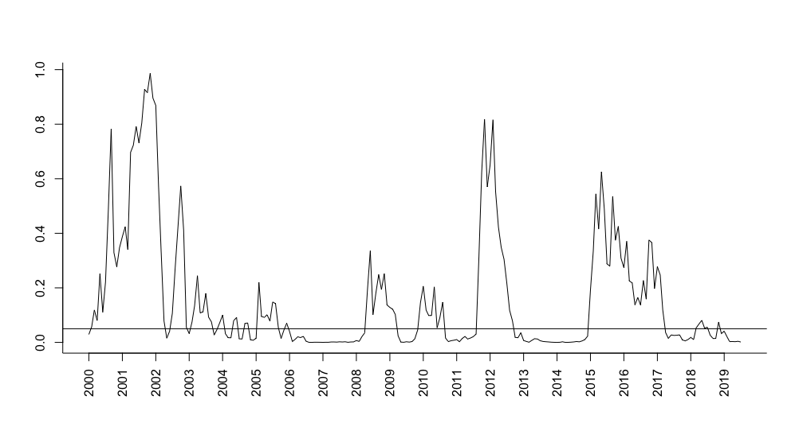
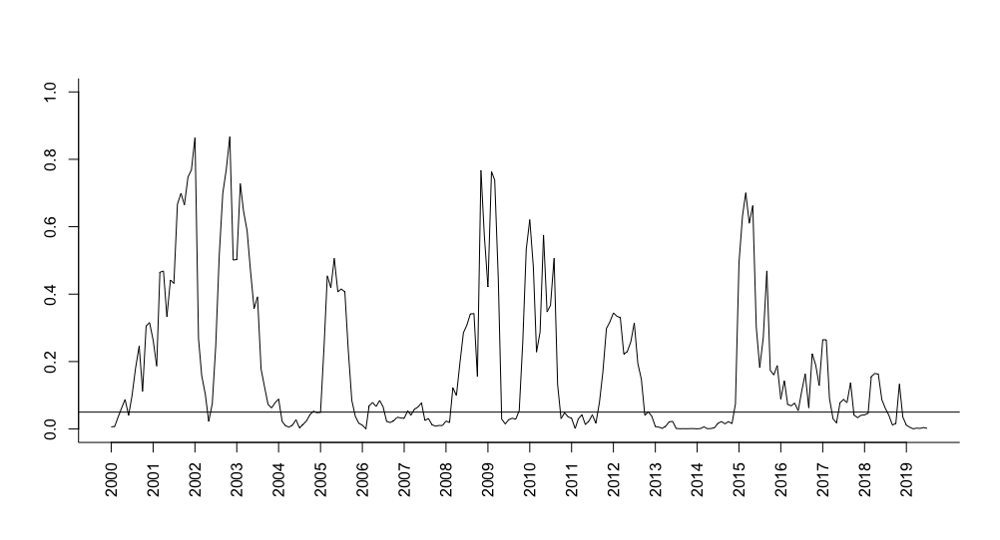
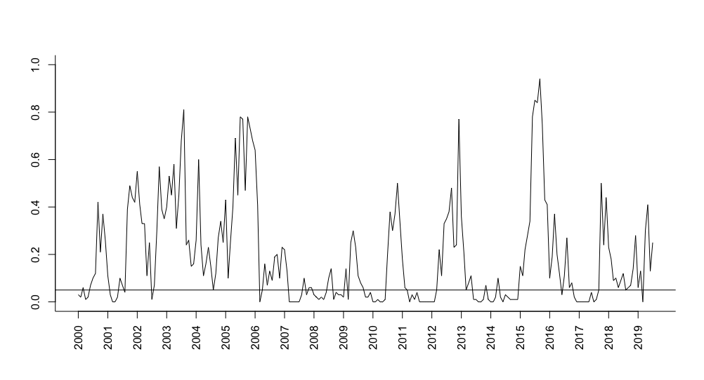
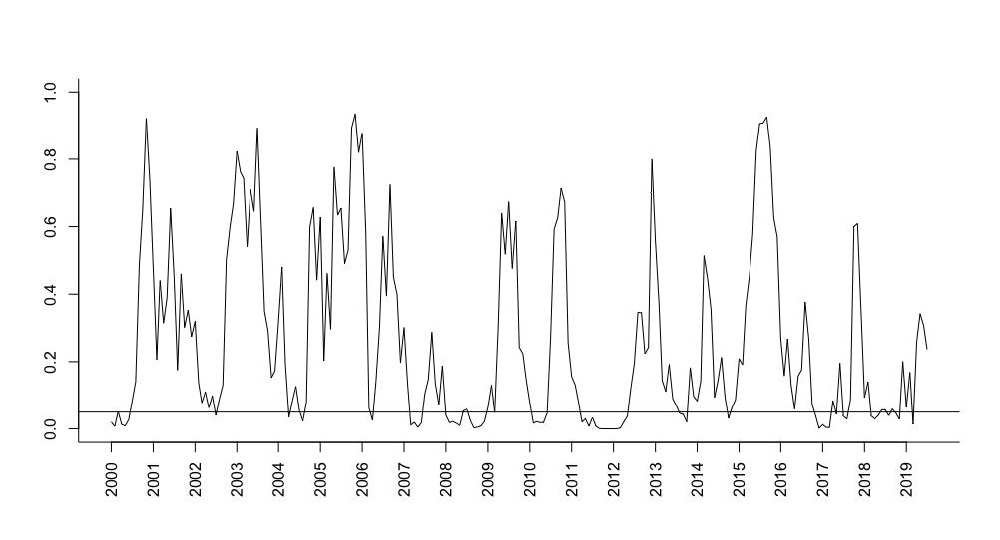
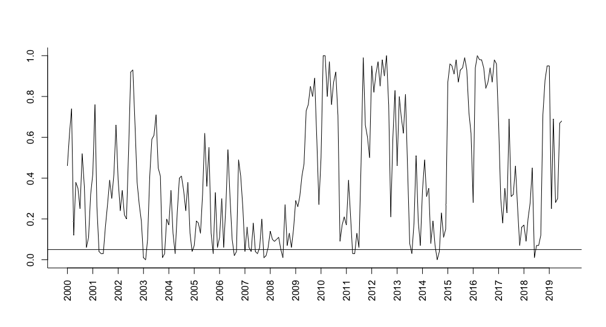
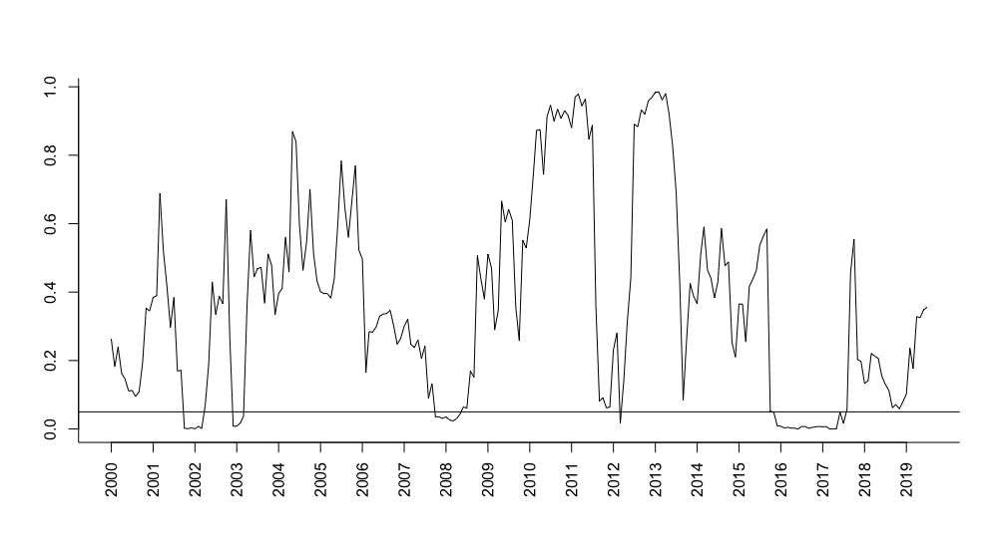

# Introduction

Let $\mathbf{X}_1,\ldots,\mathbf{X}_n$ denote a sample of $n$
i.i.d. $d$-dimensional observations. A $d$-dimensional random vector
$\mathbf{X}$ is said to be elliptically symmetric about some location
parameter $\pmb{\theta}\in R^d$ if its density $\underline{f}$ is of the
form
$$\label{def1}
\mathbf{x}\mapsto{\underline{f}(\mathbf{x};\pmb{\theta},\pmb{\Sigma},f)}=c_{d,f}|\pmb{\Sigma}|^{-1/2}f\left(\|\pmb{\Sigma}^{-1/2}(\mathbf{x}-\pmb{\theta})\|\right),\qquad\mathbf{x}\in\mathbb{R}^d,   (\#eq:def1)$$
where $\pmb{\Sigma}\in\mathcal{S}_d$ (the class of symmetric positive
definite real $d\times d$ matrices) is a *scatter* parameter,
$f:\mathbb{R}^+_0\to\mathbb{R}^+$ is an, a.e., strictly positive
function called *radial density*, and $c_{d,f}$ is a normalizing
constant depending on $f$ and the dimension $d$. Many well-known and
widely used multivariate distributions are elliptical. The multivariate
normal, multivariate Student $t$, multivariate power-exponential,
symmetric multivariate stable, symmetric multivariate Laplace,
multivariate logistic, multivariate Cauchy, and multivariate symmetric
general hyperbolic distribution are all examples of elliptical
distributions. The family of elliptical distributions has several
appealing properties. For instance, it has a simple stochastic
representation, clear parameter interpretation, it is closed under
affine transformations, and its marginal and conditional distributions
are also elliptically symmetric; see [@paindaveine2014elliptical] for
details. Thanks to its mathematical tractability and nice properties, it
became a fundamental assumption in multivariate analysis and many
applications. Numerous statistical procedures, therefore, rest on the
assumption of elliptical symmetry: one- and $K$-sample location and
shape problems
[@UmRandles98; @hallin2002optimal; @hallin2006semiparametrically1; @hallin2006semiparametrically2],
serial dependence and time series [@HPd2004AoS], one- and $K$-sample
principal component problems [@hallin2010optimal; @HPdV2014JASA],
multivariate tail estimation [@dominicy2017multivariate], to cite but a
few. Elliptical densities are also considered in portfolio theory
[@OR83], capital asset pricing models [@hodgson2002testing],
semiparametric density estimation [@liebscher2005semiparametric],
graphical models [@vogel2011elliptical], and many other areas.

Given the omnipresence of the assumption of elliptical symmetry, it is
essential to be able to test whether that assumption actually holds true
or not for the data at hand. Numerous tests have been proposed in the
literature, including @beran1979testing, @baringhaus1991testing,
@koltchinskii2000testing, @manzotti2002statistic, @schott2002testing,
@huffer2007test, @Cassart07, and @BGHL19. Tests for elliptical symmetry
based on Monte Carlo simulations can be found in @diks1999test and
@zhu2000nonparametric; @li1997some recur to graphical methods, and
@zhu2004 build conditional tests. We refer the reader to
@serfling2004multivariate and @sakhanenko2008testing for extensive
reviews and performance comparisons. To the best of our knowledge, none
of these tests is available in the open software R. The focus of this
paper is to close this gap by implementing several well-known tests for
elliptical symmetry together with some recent tests. The test of
[@beran1979testing] is neither distribution-free nor affine-invariant.
Moreover, there are no practical guidelines to the choice of the basis
functions involved in the test statistic. Therefore, we opt not to
include it in the package. @baringhaus1991testing proposes a Cramér-von
Mises type test for spherical symmetry based on the independence between
norm and direction. @dyckerhoff2015depth have shown by simulations that
this test can be used as a test for elliptical symmetry in dimension 2.
This test assumes the location parameter to be known and its asymptotic
distribution is not simple to use (plus no proven validity in dimensions
higher than 2). Hence, we decided not to include it in the package.
Thus, the tests suggested by @koltchinskii2000testing,
@manzotti2002statistic, @schott2002testing, @huffer2007test, @Cassart07,
and @BGHL19 are implemented in the package
[*ellipticalsymmetry*](https://CRAN.R-project.org/package=ellipticalsymmetry).

This paper describes the tests for elliptical symmetry that have been
implemented in the *ellipticalsymmetry* package, together with a
detailed description of the functions that are available in the package.
The use of the implemented functions is illustrated using financial
data.

# Testing for elliptical symmetry

In this section, we focus on the tests for elliptical symmetry that have
been implemented in our new *ellipticalsymmetry* package. Besides formal
definitions of test statistics and limiting distributions, we also
explain the details of computation.

## Test by Koltchinskii and Sakhanenko

[@koltchinskii2000testing] develop a class of omnibus bootstrap tests
for unspecified location that are affine invariant and consistent
against any fixed alternative. The estimators of the unknown parameters
are as follows: $\hat{\pmb{\theta}} = n^{-1}\sum_{i=1}^{n}\mathbf{X}_i$
and
$\hat{\pmb{\Sigma}} = n^{-1}\sum_{i=1}^{n}(\mathbf{X}_i - \hat{\pmb{\theta}})(\mathbf{X}_i - \hat{\pmb{\theta}})'$.
Define
$\mathbf{Y}_i = \hat{\pmb{\Sigma}}^{-1/2}(\mathbf{X}_i-\hat{\pmb{\theta}})$
and let $\mathcal{F}_B$ be a class of Borel functions from
$\mathbb{R}^d$ to $R$. Their test statistics are functionals (for
example, sup-norms) of the stochastic process
$$n^{-1/2}\sum_{i=1}^{n}\left(f(\mathbf{Y}_i) - m_{f}(||\mathbf{Y}_i||)\right),$$
where $f \in \mathcal{F}_B$ and $m_f(\rho)$ is the average value of $f$
on the sphere with radius $\rho>0$. Several examples of classes
$\mathcal{F}_B$ and test statistics based on the sup-norm of the above
process are considered in [@koltchinskii2000testing]. Here, we restrict
our attention
to $\mathcal{F}_B:=\left\{I_{0<||\mathbf{x}||\leq t}\psi\left(\frac{\mathbf{x}}{||\mathbf{x}||}\right):\psi\in G_l,||\psi||_2\leq1,t>0\right\}$,
where $I_{A}$ stands for the indicator function of $A$, $G_l$ for the
linear space of spherical harmonics of degree less than or equal to $l$
in $R^d$, and $||\cdot||_2$ is the $L^2$-norm on the unit sphere
$\mathcal{S}^{d-1}$ in $R^d$. With these quantities in hand, the test
statistic becomes
$$Q_{{KS}}^{(n)} := n^{-1/2}\max_{1\leq j \leq n}\left(\sum_{s=1}^{\text{dim}(G_l)}\left(\sum_{k=1}^{j}\psi_s\left(\frac{\mathbf{Y}_{[k]}}{||\mathbf{Y}_{[k]}||}\right) - \delta_{s1}\right)^2 \right)^{1/2},$$
where $\mathbf{Y}_{[i]}$ denotes the $i$th order statistic from the
sample $\mathbf{Y}_1, \dots, \mathbf{Y}_n$, ordered according to their
$L^2$-norm, $\{\psi_s, \ s =1, \dots,\, \text{dim}(G_l)\}$ denotes an
orthonormal basis of $G_l,\ \psi_1 = 1$, and $\delta_{ij} = 1$ for $i=j$
and $0$ otherwise. The test statistic is relatively simple to construct
if we have formulas for spherical harmonics.

In dimension $2$, spherical harmonics coincide with sines and cosines on
the unit circle. The detailed construction of the test statistic
$Q_{{KS}}^{(n)}$ for dimensions $2$ and $3$ can be found in
@sakhanenko2008testing. In order to be able to use $Q_{{KS}}^{(n)}$ in
higher dimensions, we need corresponding formulas for spherical
harmonics. Using recursive formulas from @muller1966lecture and
equations given in @manzotti2001spherical, we obtained spherical
harmonics of degree one to four in arbitrary dimension. The reader
should bare in mind that the larger degree leads to the better power
performance of this test. A drawback of this test is that it requires
bootstrap procedures to obtain critical values.

In our R package, this test can be run using a function called
`KoltchinskiiSakhanenko()`. The syntax for this function is very simple:

``` r
    KoltchinskiiSakhanenko(X, R=1000, nJobs = -1),
```

where `X` is an input to this function consisting of a data set which
must be a matrix, and `R` stands for the number of bootstrap replicates.
The default number of replicates is set to $1000$. The `nJobs` argument
represents the number of CPU cores to use for the calculation. This is a
purely technical option which is used to speed up the computation of
bootstrap-based tests. The default value `-1` indicates that all cores
except one are used.

## The MPQ test

@manzotti2002statistic develop a test based on spherical harmonics. The
estimators of the unknown parameters are the sample mean denoted as
$\hat{\pmb{\theta}}$, and the unbiased sample covariance matrix given by
$\hat{\pmb{\Sigma}} = \frac{1}{n-1}\sum_{i=1}^{n}(\mathbf{X}_i - \hat{\pmb{\theta}})(\mathbf{X}_i - \hat{\pmb{\theta}})'$.
Define, again,
$\mathbf{Y}_i = \hat{\pmb{\Sigma}}^{-1/2}(\mathbf{X}_i-\hat{\pmb{\theta}})$.
When the $\mathbf{X}_{i}'s$ are elliptically symmetric, then
$\mathbf{Y}_i/||\mathbf{Y}_i||$ should be uniformly distributed on the
unit sphere. @manzotti2002statistic chose this property as the basis of
their test. The uniformity of the standardized vectors
$\mathbf{Y}_i/||\mathbf{Y}_i||$ can be checked in different ways.
[@manzotti2002statistic] opt to verify this uniformity using spherical
harmonics. For a fixed $\varepsilon > 0$, let $\rho_n$ be the
$\varepsilon$ sample quantile of
$||\mathbf{Y}_1||, \dots, ||\mathbf{Y}_n||$. Then, the test statistic is
$$Q_{{MPQ}}^{(n)} = n \mathop{{\sum}}_{h \in \mathcal{S}_{jl}}\bigg( \frac{1}{n} \mathop{{\sum}}_{i=1}^n h\bigg(\frac{\mathbf{Y}_i}{||\mathbf{Y}_i||}\bigg)I(||\mathbf{Y}_i|| > \rho_{n})\bigg)^2$$
for $l\geq j \geq 3$, where
$\mathcal{S}_{jl} = \bigcup_{j\leq i\leq l} \mathcal{H}_i$ and
$\mathcal{H}_i$ is the set of spherical harmonics of degree $i$. In the
implementation of this test we used spherical harmonics of degree $3$
and $4$. The asymptotic distribution of the test statistic
$Q_{{MPQ}}^{(n)}$ is $(1 - \varepsilon) \chi$, where $\chi$ is a
variable with a chi-squared distribution with $\nu_{jl}$ degrees of
freedom, where $\nu_{jl}$ denotes the total number of functions in
$\mathcal{S}_{jl}$. Note that $Q_{{MPQ}}^{(n)}$ is only a necessary
condition statistic for the null hypothesis of elliptical symmetry, and
therefore, this test does not have asymptotic power against all
alternatives. In the *ellipticalsymmetry* package, this test is
implemented as the `MPQ()` function with the following syntax

``` r
    MPQ(X, epsilon = 0.05).
```

As before, `X` is a numeric matrix that represents the data while
`epsilon` is an option that allows the user to indicate the proportion
of points $\mathbf{Y}_i$ close to the origin which will not be used in
the calculation. By doing this, extra assumptions on the radial density
in \@ref(eq:def1) are avoided. The default value of `epsilon` is set to
0.05.

## Schott's test

@schott2002testing develops a Wald-type test for elliptical symmetry
based on the analysis of covariance matrices. The test compares the
sample fourth moments with the expected theoretical ones under
ellipticity. Given that the test statistic involves consistent estimates
of the covariance matrix of the sample fourth moments, the existence of
eight-order moments is required. Furthermore, the test has a very low
power against several alternatives. The final test statistic is of a
simple form, even though it requires lengthy notations.

For an elliptical distribution with mean $\pmb{\theta}$ and covariance
matrix $\pmb{\Sigma}$, the fourth moment defined as
${\pmb M_4} = E\{(\mathbf{X}- \pmb{\theta})(\mathbf{X}- \pmb{\theta})'\otimes (\mathbf{X}- \pmb{\theta})(\mathbf{X}- \pmb{\theta})'\}$,
with $\otimes$ the Kronecker product, has the form
$$\begin{aligned}
\label{eq:M4}
    {\pmb M_4} = (1 + \kappa)((\mathbf{I}_{d^2} + K_{dd})(\pmb{\Sigma}\otimes \pmb{\Sigma}) + vec(\pmb{\Sigma})vec(\pmb{\Sigma})'),
\end{aligned}   (\#eq:M4)$$
where $K_{dd}$ is a commutation matrix [@magnus1988linear],
$\mathbf{I}_d$ is the $d\times d$ identity matrix, and $\kappa$ is a
scalar, which can be expressed using the characteristic function of the
elliptical distribution. Here, the $vec$ operator stacks all components
of a $d\times d$ matrix $\pmb M$ on top of each other to yield the $d^2$
vector ${\rm vec}(\pmb M)$. Let $\hat{\pmb{\Sigma}}$ denotes the usual
unbiased sample covariance matrix and $\hat{\pmb{\theta}}$ the sample
mean. A simple estimator of ${\pmb M_4}$ is given by
$\hat{\pmb M}_4 = \frac{1}{n}\sum_{i=1}^n(\mathbf{X}_i - \hat{\pmb{\theta}})(\mathbf{X}_i - \hat{\pmb{\theta}})'\otimes (\mathbf{X}_i - \hat{\pmb{\theta}})(\mathbf{X}_i - \hat{\pmb{\theta}})',$
and its standardized version is given by
$${ \hat{\pmb M}_{4*}}= (\hat{\pmb{\Sigma}}^{-1/2'}\otimes \hat{\pmb{\Sigma}}^{-1/2'}){\hat{\pmb M}_4} (\hat{\pmb{\Sigma}}^{-1/2}\otimes \hat{\pmb{\Sigma}}^{-1/2}).$$
Then, an estimator of $vec({\pmb M}_4)$ is constructed as
${\pmb G} = vec({\pmb N}_4)vec({\pmb N}_4)'vec(\hat{\pmb M}_{4*})/(3d(d+2))$,
and it is consistent if and only if ${\pmb M}_4$ is of the form
(\@ref(eq:M4)). Here, ${\pmb N}_4$ represents the value of ${\pmb M}_4$
under the multivariate standard normal distribution. Note that the
asymptotic mean of
$\pmb{v} =  n^{1/2}( vec(\hat{\pmb M}_{4*}) - {\pmb G})$ is $0$ if and
only if (\@ref(eq:M4)) holds, and this expression is used to construct
the test statistic. Denote the estimate of the asymptotic covariance
matrix of $n^{1/2}\pmb{v}$ as $\hat{\pmb \Phi}$. The Wald test statistic
is then formalized as $T = \pmb{v}' \hat{\pmb \Phi}^{-} \pmb{v}$, where
$\hat{\pmb \Phi}^{-}$ is a generalized inverse of $\hat{\pmb \Phi}$. For
more technical details, we refer the reader to Section 2 in
@schott2002testing. In order to define Schott's test statistic, we
further have to define the following quantities:
$$(1 + \hat{\kappa}) = \frac{1}{nd(d+2)} \sum_{i=1}^n\{(\mathbf{X}_i - \hat{\pmb{\theta}})'\hat{\pmb{\Sigma}}^{-1}(\mathbf{X}_i - \hat{\pmb{\theta}})\}^2$$

$$(1 + \hat{\eta}) = \frac{1}{nd(d+2)(d+4)}\sum_{i=1}^n\{(\mathbf{X}_i - \hat{\pmb{\theta}})'\hat{\pmb{\Sigma}}^{-1}(\mathbf{X}_i - \hat{\pmb{\theta}})\}^3$$

$$(1 + \hat{\omega}) = \frac{1}{nd(d+2)(d+4)(d+6)}\sum_{i=1}^n\{(\mathbf{X}_i - \hat{\pmb{\theta}})'\hat{\pmb{\Sigma}}^{-1}(\mathbf{X}_i - \hat{\pmb{\theta}})\}^4.$$

Moreover, let
$\hat{\beta}_1 = (1 + \hat{\omega})^{-1}/24,\enspace \hat{\beta}_2 = -3a\{ 24 (1 + \hat{\omega})^2 +12(d+4)a(1 + \hat{\omega})\}^{-1}$,
$a = (1 + \hat{\omega}) + (1 + \hat{\kappa})^3 - 2(1 + \hat{\kappa})(1 + \hat{\eta})$.
Finally, the test statistic becomes
$$T = n\left[ \hat{\beta}_1 \text{tr}(\hat{\pmb M}_{4*}^{2}) + \hat{\beta}_2\text{vec}(\mathbf{I}_d)' \hat{\pmb M}_{4*}^{2}\text{vec}(\mathbf{I}_d) - \{3\hat{\beta}_1 + (d+2)\hat{\beta}_2\}d(d+2)(1+\hat{\kappa})^2 \right].$$
It has an asymptotic chi-squared distribution with degrees of freedom
$\displaystyle \nu_d = d^2 + \frac{d(d-1)(d^2 + 7d - 6)}{24} - 1.$

The Schott test can be performed in our package by using the function
`Schott()` with the very simple syntax `Schott(X)`, where `X` is a
numeric matrix of data values.

## Test by Huffer and Park

@huffer2007test propose a Pearson chi-square type test with
multi-dimensional cells. Under the null hypothesis of ellipticity, the
cells have asymptotically equal expected cell countsm, and after
determining the observed cell counts, the test statistic is easily
computed. Let $\hat{\pmb{\theta}}$ be the sample mean and
$\hat{\pmb{\Sigma}} = n^{-1}\sum_{i=1}^{n}(\mathbf{X}_i - \hat{\pmb{\theta}})(\mathbf{X}_i - \hat{\pmb{\theta}})'$
the sample covariance matrix. Define
$\mathbf{Y}_i = \mathbf{R}(\mathbf{X}_i - \hat{\pmb{\theta}}),$ where
the matrix $\mathbf{R}=\mathbf{R}(\hat{\pmb{\Sigma}})$ is a function of
$\hat{\pmb{\Sigma}}$ such that
$\mathbf{R}\hat{\pmb{\Sigma}} \mathbf{R}= \mathbf{I}_d$. Typically
$\mathbf{R}= \hat{\pmb{\Sigma}}^{-1/2}$ as for the previous tests.
However, Huffer and Park suggest to use the Gram-Schmidt transformation
because that will lead to standardized data whose joint distribution
does not depend on $\pmb{\theta}$ or $\pmb{\Sigma}$. In order to compute
the test statistic, the space $\mathbb{R}^d$ should be divided into $c$
spherical shells centered at the origin such that each shell contains an
equal number of the scaled residuals $\mathbf{Y}_i$. The next step is to
divide $\mathbb{R}^d$ into $g$ sectors such that for any pair of
sectors, there is an orthogonal transformation mapping one onto the
other. Therefore, the $c$ shells and $g$ sectors divide $\mathbb{R}^d$
into $gc$ cells, which, under elliptical symmetry, should contain
$n/(gc)$ of the vectors $\mathbf{Y}_i$. The test statistic then has the
simple form
$$HP_n = \sum_{\pi}(U_{\pi} - np)^2/(np),$$
where $U_{\pi}$ are cell counts for $\pi = (i,j)$ with $1\leq i\leq g$
and $1\leq j \leq c$ and $p=1/(gc)$.

In the R package, we are considering three particular ways to partition
the space: using (i) the $2^d$ orthants, (ii) permutation matrices, and
(iii) a cyclic group consisting of rotations by angles which are
multiples of $2\pi/g$. The first two options can be used for any
dimension, while the angles are supported only for dimension 2. Huffer
and Park's test can be run using a function called `HufferPark()`. The
syntax, including all options, for the function `HufferPark()` is, for
instance,

``` r
HufferPark(X, c, R = NA, sector = "orthants", g = NA, nJobs = -1).
```

We will now provide a detailed description of its arguments. `X` is an
input to this function consisting of a data set. `sector` is an option
that allows the user to specify the type of sectors used to divide the
space. Currently supported options are `"orthants"`, `"permutations"`,
and `"bivariateangles"`. The last one being available only in dimension
$2$. The `g` argument indicates the number of sectors. The user has to
choose `g` only if `sector = "bivariateangles"` and it denotes the
number of regions used to divide the plane. In this case, regions
consist of points whose angle in polar coordinates is between
$2(m-1)\pi/g$ and $2m\pi/g$ for $m \in \{1 \dots g\}$. If `sector` is
set to `"orthants"`, then `g` is fixed and equal to $2^d$, while for
`sector = "permutations"`, `g` is $d!$. No matter what type of sectors
is chosen, the user has to specify the number of spherical shells that
are used to divide the space, which is `c`. The value of `c` should be
such that the average cell counts $\displaystyle n/(gc)$ are not too
small. Several settings with different sample size and different values
of $g$ and $c$ can be found in the simulation studies presented in
Sections 4 and 5 of @huffer2007test. As before, `nJobs` represents the
number of CPU cores to use for the calculation. The default value `-1`
indicates that all cores except one are used.

The asymptotic distribution is available only under
`sector = "orthants"` when the underlying distribution is close to
normal. It is a linear combination of chi-squared random variables, and
it depends on eigenvalues of congruent sectors used to divide the space
$\mathbb{R}^d$. Otherwise, bootstrap procedures are required, and the
user can freely choose the number of bootstrap replicates, denoted as
`R`. Note that by default, `sector` is set to `"orthants"` and `R = NA`.

## Pseudo-Gaussian test

@Cassart07 and [@CHPd2008JSPI] construct Pseudo-Gaussian tests for
specified and unspecified location that are most efficient against a
multivariate form of Fechner-type asymmetry (defined in @Cassart07,
Chapter 3).

These tests are based on Le Cam's asymptotic theory of statistical
experiments. We start by describing the specified-location
Pseudo-Gaussian test. The unknown parameter $\pmb{\Sigma}$ is estimated
by using @tyler1987distribution's estimator of scatter which we simply
denote by $\hat{\pmb{\Sigma}}$. Let
$m_{k}(\pmb{\theta},\pmb{\Sigma}) := n^{-1}\sum_{i=1}^{n}(\|\pmb{\Sigma}^{-1/2}(\mathbf{X}_i-\pmb{\theta})\|)^k$,
$U_i(\pmb{\theta},\pmb{\Sigma}) := \frac{\pmb{\Sigma}^{-1/2}(\mathbf{X}_i-\pmb{\theta})}{\|\pmb{\Sigma}^{-1/2}(\mathbf{X}_i-\pmb{\theta})\|}$
and
$$\begin{aligned}
\nonumber\mathbf{S}^{\mathbf{U}}_i(\pmb{\theta},\pmb{\Sigma}) := ((\mathbf{U}_{i1}(\pmb{\theta},\pmb{\Sigma}))^2 \text{sign}&(\mathbf{U}_{i1}(\pmb{\theta},\pmb{\Sigma})), \dots, (\mathbf{U}_{id}(\pmb{\theta},\pmb{\Sigma}))^2 \text{sign}(\mathbf{U}_{id}(\pmb{\theta},\pmb{\Sigma})))^\prime . 
\end{aligned}$$
The test statistic then has the simple form

$$Q_{{p{\cal G},\pmb{\theta}}}^{(n)} = \frac{d(d+2)}{3n{m_4}(\pmb{\theta},\hat{\pmb{\Sigma})}}\sum_{i,j=1}^n  (\|\hat{\pmb{\Sigma}}^{-1/2}(\mathbf{X}_i-\pmb{\theta})\|)^2 (\|\hat{\pmb{\Sigma}}^{-1/2}(\mathbf{X}_j-\pmb{\theta})\|)^2\mathbf{S}'^{\mathbf{U}}_i(\pmb{\theta},\hat{\pmb{\Sigma}})\mathbf{S}^{\mathbf{U}}_j(\pmb{\theta},\hat{\pmb{\Sigma})},$$
and follows asymptotically a chi-squared distribution $\chi^2_d$ with
$d$ degrees of freedom. Finite moments of order four are required.

In most cases, the assumption of a specified center is, however,
unrealistic. @Cassart07, therefore, proposes also a test for the
scenario when the location is not specified. The estimator of the
unknown $\pmb{\theta}$ is the sample mean denoted by
$\hat{\pmb{\theta}}$. Let
$\mathbf{Y}_i = \hat{\pmb{\Sigma}}^{-1/2} (\mathbf{X}_i - \hat{\pmb{\theta}})$.
The test statistic takes on the guise
$$Q_{{p{\cal G}}}^{(n)} := (\pmb{\Delta}_{{{\cal G}}}(\hat{\pmb{\theta}},\hat{\pmb{\Sigma}}))'(\pmb{\Gamma}_{{{\cal G}}}(\hat{\pmb{\theta}},\hat{\pmb{\Sigma}}))^{-1}\pmb{\Delta}_{{{\cal G}}}(\hat{\pmb{\theta}},\hat{\pmb{\Sigma}}),$$
where
$$\pmb{\Delta}_{{{\cal G}}}(\hat{\pmb{\theta}},\hat{\pmb{\Sigma}})=  n^{-1/2}\sum_{i=1}^{n}\|\mathbf{Y}_i\|\left(c_d(d+1)m_{1}(\hat{\pmb{\theta}},\hat{\pmb{\Sigma}})\mathbf{U}_i(\hat{\pmb{\theta}},\hat{\pmb{\Sigma}})-\|\mathbf{Y}_i\|\mathbf{S}^{\mathbf{U}}_i(\hat{\pmb{\theta}},\hat{\pmb{\Sigma}})\right)$$
and
$$\begin{aligned}
  &\pmb{\Gamma}_{{{\cal G}}}(\hat{\pmb{\theta}},\hat{\pmb{\Sigma}}) :=\\ &\left(\frac{3}{d(d+2)}m_{4}(\hat{\pmb{\theta}},\hat{\pmb{\Sigma}}) - 2c_{d}^2(d+1)m_{1}(\hat{\pmb{\theta}},\hat{\pmb{\Sigma}})m_{3}(\hat{\pmb{\theta}},\hat{\pmb{\Sigma}}) + c_{d}^{2}\frac{(d+1)^2}{d}(m_{1}(\hat{\pmb{\theta}},\hat{\pmb{\Sigma}}))^2m_{2}(\hat{\pmb{\theta}},\hat{\pmb{\Sigma}})\right)\mathbf{I}_d,
\end{aligned}$$
with $c_d = 4\Gamma(d/2)/((d^2-1)\sqrt{\pi}\Gamma(\frac{d-1}{2}))$,
$\Gamma(\cdot)$ being the Gamma function. The test rejects the null
hypothesis of elliptical symmetry at asymptotic level $\alpha$ whenever
the test statistic $Q_{{p{\cal G}}}^{(n)}$ exceeds
$\chi^2_{d;1-\alpha}$, the upper $\alpha$-quantile of a $\chi^2_d$
distribution. We refer to Chapter 3 of [@Cassart07] for formal details.

This test can be run in our package by calling the function
`pseudoGaussian()` with the simple syntax

``` r
   pseudoGaussian(X, location = NA).
```

Besides `X`, which is a numeric matrix of data values, now we have an
extra argument `location`, which allows the user to specify the known
location. The default is set to `NA` which means that the unspecified
location test will be performed unless the user specifies location.

## SkewOptimal test

Recently, @BGHL19 proposed a new test for elliptical symmetry both for
specified and unspecified location. These tests are based on Le Cam's
asymptotic theory of statistical experiments and are optimal against
generalized skew-elliptical alternatives (defined in Section 2 of said
paper), but they remain quite powerful under a much broader class of
non-elliptical distributions.

The test statistic for the specified location scenario has a very simple
form and an asymptotic chi-square distribution. The test rejects the
null hypothesis whenever
$Q_{\pmb{\theta}}^{(n)}=n (\bar{\mathbf{X}}-\pmb{\theta})'\hat{\pmb{\Sigma}}^{-1}(\bar{\mathbf{X}}-\pmb{\theta})$
exceeds the $\alpha$-upper quantile $\chi^2_{d;1-\alpha}$. Here,
$\hat{\pmb{\Sigma}}$ is @tyler1987distribution's estimator of scatter,
and $\bar{\pmb X}$ is the sample mean.

When the location is not specified, @BGHL19 propose tests that have a
simple asymptotic chi-squared distribution under the null hypothesis of
ellipticity, are affine-invariant, computationally fast, have a simple
and intuitive form, only require finite moments of order 2, and offer
much flexibility in the choice of the radial density $f$ at which
optimality (in the maximin sense) is achieved. Note that the Gaussian
$f$ is excluded, though, due to a singular information matrix; see
@BGHL19. We implemented in our package the test statistic based on the
radial density $f$ of the multivariate $t$ distribution, multivariate
power-exponential, and multivariate logistic, though in principle, any
non-Gaussian choice for $f$ is possible. The test requires lengthy
notations, but its implementation is straightforward. For the sake of
generality, we will derive the test statistic for a general (but fixed)
$f$, and later on, provide the expressions of $f$ for the three special
cases implemented in our package. Let
$\varphi_f(x) = -\frac{f'(x)}{f(x)}$ and
$\mathbf{Y}_i = \hat{\pmb{\Sigma}}^{-1/2} (\mathbf{X}_i - \hat{\pmb{\theta}})$
where $\hat{\pmb{\theta}}$ is the sample mean. In order to construct the
test statistic, we first have to define the quantities
$$\begin{aligned}
   \displaystyle {\pmb{\Delta}}_{f}(\hat{\pmb{\theta}},\hat{\pmb{\Sigma}}) =  2n^{-1/2}\dot{\Pi}(0)\sum_{i=1}^n\left[\|\mathbf{Y}_i\|-\frac{d}{ \widehat{\mathcal{K}}_{d,f}(\hat{\pmb{\theta}},\hat{\pmb{\Sigma}})}\varphi_f(\|\mathbf{Y}_i\|)\right]\frac{\mathbf{Y}_i}{\|\mathbf{Y}_i\|}
\end{aligned}$$
and
$$\widehat{\pmb{\Gamma}}_{f}(\hat{\pmb{\theta}},\hat{\pmb{\Sigma}}):=\frac{{4(\dot{\Pi}(0))^2}}{nd}\sum_{i=1}^n\left[\|\mathbf{Y}_i\|-\frac{d}{ \widehat{\mathcal{K}}_{d,f}(\hat{\pmb{\theta}},\hat{\pmb{\Sigma}})}\varphi_f(\|\mathbf{Y}_i\|)\right]^2\mathbf{I}_d,$$
where
$\widehat{\mathcal{K}}_{d,f}(\hat{\pmb{\theta}},\hat{\pmb{\Sigma}}) := \frac{1}{n}\sum_{i=1}^n \left[ \displaystyle \varphi_f'(\|\mathbf{Y}_i\|) + \frac{d-1}{\|\mathbf{Y}_i\|}\varphi_f(\|\mathbf{Y}_i\|) \right]$
and $\Pi$ is the cdf of the standard normal distribution (we use
$\dot{\Pi}(\cdot)$ for the derivative). Finally, the test statistic is
of the form
$Q^{(n)}_f:= ({\pmb{\Delta}}_{f}(\hat{\pmb{\theta}},\hat{\pmb{\Sigma}}))' (\widehat{\pmb{\Gamma}}_{f}(\hat{\pmb{\theta}},\hat{\pmb{\Sigma}}))^{-1}{\pmb{\Delta}}_{f}(\hat{\pmb{\theta}},\hat{\pmb{\Sigma}})$,
and it has a chi-square distribution with $d$ degrees of freedom. The
test is valid under the entire semiparametric hypothesis of elliptical
symmetry with unspecified center and uniformly optimal against any type
of generalized skew-$f$ alternative.

From this general expression, one can readily derive the test statistics
for specific choices of $f$. In our case, the radial density of the
multivariate Student $t$ distribution corresponds to
$f(x) = (1 + \frac{1}{\nu}x^2)^{-(\nu + d)^2}$, where
$\nu \in (0,\infty)$ represents the degrees of freedom, while that of
the multivariate logistic distribution is given by
$\displaystyle f(x)= \frac{\exp{(-x^2)}}{[1+\exp{(-x^2})]^2}$ and of the
multivariate power-exponential by
$\displaystyle f(x)= \exp{\left(-\frac{1}{2}x^{2\beta}\right)}$, where
$\beta \in (0,\infty)$ is a parameter related to kurtosis.

These tests can be run in R using a function called `SkewOptimal()` with
the syntax

``` r
   SkewOptimal(X, location = NA, f = "t", param = NA).
```

Depending on the type of the test, some of the input arguments are not
required. `X` and `location` are the only input arguments for the
specified location test and have the same role as for the
Pseudo-Gaussian test. As before, the default value for `location` is set
to `NA`, which implies that the unspecified location test will be
performed unless the user specifies the location. For the unspecified
location test, besides the data matrix `X`, the input arguments are `f`
and `param`. The `f` argument is a string that specifies the type of the
radial density based on which the test is built. Currently supported
options are `"t"`, `"logistic"`, and `"powerExp"`. Note that the default
is set to `"t"`. The role of the `param` argument is as follows. If
`f = "t"`, then `param` denotes the degrees of freedom of the
multivariate $t$ distribution. Given that the default radial density is
`"t"`, it follows that the default value of `param` represents the
degrees of freedom of the multivariate $t$ distribution, and it is set
to $4$. Note also that the degrees of freedom have to be greater than
$2$. If `f = "powerExp"`, then `param` denotes the kurtosis parameter
$\beta$, in which case the value of `param` has to be different from $1$
because $\beta = 1$ corresponds to the multivariate normal distribution.
The default value is set to $0.5$.

## Time complexity

We conclude the description of tests for elliptical symmetry by
comparing their time complexity in terms of the big O notation
[@cormen2009introduction]. More concretely, we are comparing the number
of simple operations that are required to evaluate the test statistics
and the $p$-values. Table [1](#time) summarizes the time complexity of
the implemented tests.

The test of Koltchinskii and Sakhanenko is computationally more
demanding than the bootstrap version of the test of Huffer and Park.
Among unspecified location tests that do not require bootstrap
procedures, the most computationally expensive test is the MPQ test
under the realistic assumption that $n > d$. Regarding the specified
location tests, we can conclude that the Pseudo-Gaussian test is more
computationally demanding than the SkewOptimal test. Note that both the
test of Koltchinskii and Sakhanenko and the MPQ test are based on
spherical harmonics up to degree $4$. In case we would use spherical
harmonics of higher degrees, the tests would of course become even more
computationally demanding.

We have seen that several tests require bootstrap procedures and
therefore are, by default, computationally demanding. Such tests require
the calculation of the statistic on the resampled data $R$ times in
order to get the $p$-value, where $R$ is the number of bootstrap
replicates. Consequently, the time required to obtain the $p$-value in
such cases is $R$ times the time to calculate the test statistic. For
the tests that do not involve bootstrap procedures, the $p$-value is
calculated using the inverse of the cdf of the asymptotic distribution
under the null hypothesis, which is considered as one simple operation.
The exception here is the test of Huffer and Park, whose asymptotic
distribution is more complicated and includes $O(c)$ operations where
$c$ is an integer and represents an input parameter for this test.

::: {#time}
  ---------------------------------------------------------------------------------------
                                        statistics               $p$-value
  ------------------------------------- ------------------------ ------------------------
  KoltchinskiiSakhanenko                $O(n \log n + nd^5)$     $O(Rn \log n + Rnd^5)$

  MPQ                                   $O(n \log n + nd^5)$     $O(1)$

  Schott                                $O(nd^2 + d^6)$          $O(1)$

  HufferPark                            $O(nd^2 + d^3)$          $O(c)$

  HufferPark (bootstrap)                $O(nd^2 + d^3)$          $O(Rnd^2 + Rd^3)$

  PseudoGaussian (specified location)   $O(n^2d + nd^2 + d^3)$   $O(1)$

  PseudoGaussian                        $O(nd^2 + d^3)$          $O(1)$

  SkewOptimal (specified location)      $O(nd + d^3)$            $O(1)$

  SkewOptimal                           $O(nd^2 + d^3)$          $O(1)$
  ---------------------------------------------------------------------------------------

  : Table 1: Time complexity of the various tests for elliptical
  symmetry
:::

# Illustrations using financial data

Mean-Variance analysis was introduced by [@markowitz] as a model for
portfolio selection. In this model, the portfolio risk expressed through
the historical volatility is minimized for a given expected return, or
the expected return is maximized given the risk. The model is widely
used for making portfolio decisions, primarily because it can be easily
optimized using quadratic programming techniques. However, the model has
some shortcomings, among which the very important one, that it does not
consider the prior wealth of the investor that makes decisions. This
prior wealth is important since it influences the satisfaction that an
investor has from gains. For example, the gain of 50\$ will not bring
the same satisfaction to someone whose wealth is 1\$ as to someone whose
wealth is 1000\$. This satisfaction further affects the decision-making
process in portfolio selection. Because of that and other financial
reasons, a more general concept of expected utility maximization is used
(see, e.g., [@schoemaker2013experiments]). However, the expected utility
maximization is not an easy optimization problem, and some additional
assumptions must be made in order to solve it. Hence, despite the
expected utility maximization being more general, the mean-variance
approach is still used due to its computational simplicity.
[@chamberlain1983characterization] showed that the two approaches
coincide if the returns are elliptically distributed. In other words,
under elliptical symmetry, the mean-variance optimization solves the
expected utility maximization for any increasing concave utility
function. Therefore, we want to test if the assumption of elliptical
symmetry holds or not for financial return data. The data set that we
analyze contains daily stock log-returns of $3$ major equity market
indexes from North America: S&P 500 (US), TSX (Canada) and IPC (Mexico).
The sample consists of 5369 observations from January 2000 through July
2020. To remove temporal dependencies by filtering, following the
suggestion of [@lombardi2009indirect], GARCH(1,1) time series models
were fitted to each series of log-returns.

We test if the returns are elliptically symmetric in different time
periods using a rolling window analysis. The window has a size of one
year, and it is rolled every month, i.e., we start with the window
January 2000 - December 2000, and we test for elliptical symmetry. Then
we shift the starting point by one month, that is, we consider February
2000 - January 2001, and we test again for elliptical symmetry. We keep
doing this until the last possible window. The following tests are used
for every window: the test by Koltchinskii and Sakhanenko with `R = 100`
bootstrap replicates, the MPQ test, Schott's test, the bootstrap test by
Huffer and Park based on orthants with `c = 3` and with the number of
bootstrap replicates `R = 100`, the Pseudo-Gaussian test, and the
SkewOptimal test with the default values of the parameters. For every
window, we calculate the $p$-value. The results are presented in Figure
 [1](#rollingwindow), where the horizontal line present on every plot
indicates the 0.05 significance level.

Even though all these tests address the null hypothesis of elliptical
symmetry, they have different powers for different alternative
distributions, and some tests may fail to detect certain departures from
the null hypothesis. Certain tests are also by nature more conservative
than others. We refer the reader to [@BGHL19] for a comparative
simulation study that includes the majority of the tests available in
this package. This diversity in behavior presents nice opportunities.
For instance, when all tests agree, we can be pretty sure about the
nature of the analyzed data. One could also combine the six tests into a
multiple testing setting by using a Bonferroni correction, though this
is not what we are doing here.

The following general conclusions can be drawn from Figure
 [1](#rollingwindow).

-   In the past 20 years, the return data do not follow the elliptical
    distribution at least half of time. In other words, there are many
    periods between 2000 and 2020 where the data exhibit some form of
    skewness or other type of symmetry, invalidating, thus, the
    mean-variance analysis.
-   The broader periods where the hypothesis of elliptical symmetry
    cannot be rejected are 2000-2004, 2005-2006, 2012-2013, 2015-2017
    (for Schott's test only 2015-2016). In these periods, the tests may
    have only occasional rejections without a longer time period of
    rejections.
-   In the period around the financial crisis in 2008, almost all tests
    reject the null hypothesis of ellipticity. This clearly shows that,
    in the periods of crisis, the assumption of elliptical symmetry is
    less likely to hold.

<figure id="rollingwindow">
<table>
<caption> </caption>
<tbody>
<tr class="odd">
<td style="text-align: center;"></td>
<td style="text-align: center;"></td>
</tr>
<tr class="even">
<td style="text-align: center;">(a) SkewOptimal</td>
<td style="text-align: center;">(b) Pseudo-Gaussian</td>
</tr>
<tr class="odd">
<td style="text-align: center;"></td>
<td style="text-align: center;"></td>
</tr>
<tr class="even">
<td style="text-align: center;">(c) KoltchinskiiSakhanenko</td>
<td style="text-align: center;">(d) MPQ</td>
</tr>
<tr class="odd">
<td style="text-align: center;"></td>
<td style="text-align: center;"></td>
</tr>
<tr class="even">
<td style="text-align: center;">(e) HufferPark</td>
<td style="text-align: center;">(f) Schott</td>
</tr>
</tbody>
</table>
<table>
<caption> </caption>
<tbody>
<tr class="odd">
<td style="text-align: left;">The plots show the <span
class="math inline"><em>p</em></span>-values of the corresponding tests
for all rolling windows that we considered between 2000 and 2020. The
years on the x-axis mark the rolling windows for which the starting
point is January of that year. The horizontal line present on every plot
indicates the 0.05 significance level.</td>
</tr>
</tbody>
</table>
<figcaption>Figure 1: North America indexes (S&amp;P, TSX and
IPC)</figcaption>
</figure>

With the aim of guiding the reader through the functions that are
available in the *ellipticalsymmetry* package, we now focus on the
window January 2008 - December 2008. We start with the test by
Koltchinskii and Sakhanenko.

``` r
> KoltchinskiiSakhanenko(data2008, R = 100)
```

``` r
Test for elliptical symmetry by Koltchinskii and Sakhanenko

data:  data2008
statistic =  6.0884, p-value = 0.01
alternative hypothesis: the distribution is not elliptically symmetric
```

The `KoltchinskiiSakhanenko()` output is simple and clear. It reports
the value of the test statistic and $p$-value. For this particular data
set, the test statistic is equal to $6.0884$ and the $p$-value is
$0.02$. Note that here we specify the number of bootstrap replicates to
be `R = 100`.

The MPQ test and Schott's test can be performed by running very simple
commands:

``` r
> MPQ(data2008) 
```

``` r
Test for elliptical symmetry by Manzotti et al.

data:  data2008
statistic = 25.738, p-value = 0.04047
alternative hypothesis: the distribution is not elliptically symmetric
```

``` r
> Schott(data2008)
```

``` r
	Schott test for elliptical symmetry

data:  data2008
statistic = 24.925, p-value = 0.03531
alternative hypothesis: the distribution is not elliptically symmetric
```

Given the number of the input arguments, the function for the test by
Huffer and Park deserves some further comments. The non-bootstrap
version of the test can be performed by running the command:

``` r
> HufferPark(data2008, c = 3)
```

``` r
Test for elliptical symmetry by Huffer and Park

data:  data2008
statistic = 24.168, p-value = 0.109
alternative hypothesis: the distribution is not elliptically symmetric
```

By specifying `R`, the bootstrap will be applied:

``` r
> HufferPark(data2008, c= 3, R = 100)
```

The $p$-value for the bootstrap version of the test is equal to $0.15$.
Note that in both cases, we used the default value for `sector`, that is
`"orthants"`.

``` r
	Test for elliptical symmetry by Huffer and Park

data:  data2008
statistic = 24.168, p-value = 0.15
alternative hypothesis: the distribution is not elliptically symmetric
```

If we want to change the type of sectors used to divide the space, we
can do it by running the command:

``` r
HufferPark(data2008, c=3, R = 100, sector = "permutations")
```

This version yields a $p$-value equal to $0.19$.

Another very easy-to-use test is the Pseudo-Gaussian test:

``` r
> PseudoGaussian(data2008)
```

``` r
	Pseudo-Gaussian test for elliptical symmetry

data:  data2008
statistic = 9.4853, p-value = 0.02349
alternative hypothesis: the distribution is not elliptically symmetric
```

Eventually, the following simple command will run the `SkewOptimal` test
based on the radial density of the multivariate $t$ distribution with
$4$ degrees of freedom (note that the degrees of freedom could be
readily changed by specifying the `param` argument).

``` r
> SkewOptimal(data2008)
```

``` r
 SkewOptimal test for elliptical symmetry

data:  data2008
statistic = 12.208, p-value = 0.006702
alternative hypothesis: the distribution is not elliptically symmetric
```

The test based on the radial density of the multivariate logistic
distribution can be performed by simply adding `f = "logistic"`:

``` r
> SkewOptimal(data2008, f = "logistic")
```

This version of the SkewOptimal test yields a $p$-value equal to
$0.0003484$. Finally, if we want to run the test based on the radial
density of the multivariate power-exponential distribution, we have to
set `f` to `"powerExp"`. The kurtosis parameter equal to $0.5$ will be
used unless specified otherwise.

``` r
> SkewOptimal(data2008, f = "powerExp")
```

The resulting $p$-value equals $0.002052$. The kurtosis parameter can be
changed by assigning a different value to `param`. For example,

``` r
SkewOptimal(data2008, f = "powerExp", param = 1.2)
```

We can conclude that the null hypothesis is rejected at the $5\%$ level
by all tests except Huffer and Park's tests. Luckily the tests available
in the package mostly agree. In general, in situations of discordance
between two (or more) tests, a practitioner may compare the essence of
the tests as described in this paper and check if, perhaps, one test is
more suitable for the data at hand than the other (e.g., if assumptions
are not met). The freedom of choice among several tests for elliptical
symmetry is an additional feature of our new package.

# Conclusion {#sec:summary}

In this paper, we have described several existing tests for elliptical
symmetry and explained in detail their R implementation in our new
package *ellipticalsymmetry*. The implemented functions are simple to
use, and we illustrate this via a real data analysis. The availability
of several tests for elliptical symmetry is clearly an appealing
strength of our new package.

# Acknowledgments

Slaana Babić was supported by a grant (165880) as a PhD Fellow of the
Research Foundation-Flanders (FWO). Marko Palangetić was supported by
the Odysseus program of the Research Foundation-Flanders.

