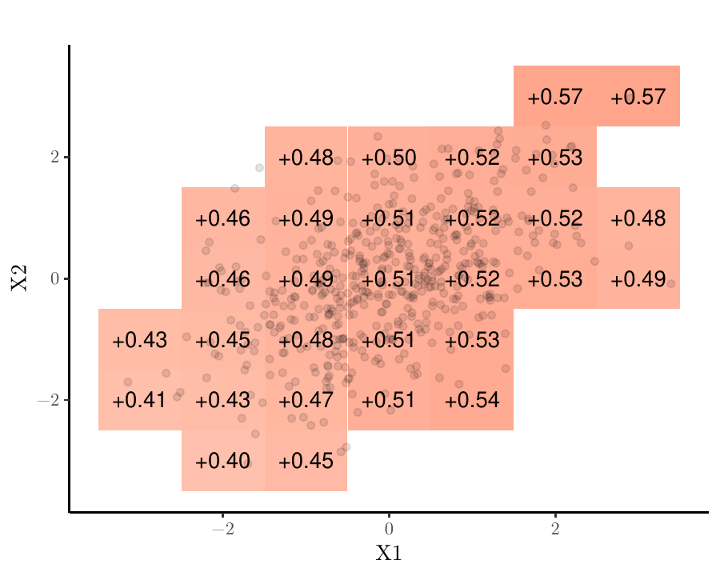
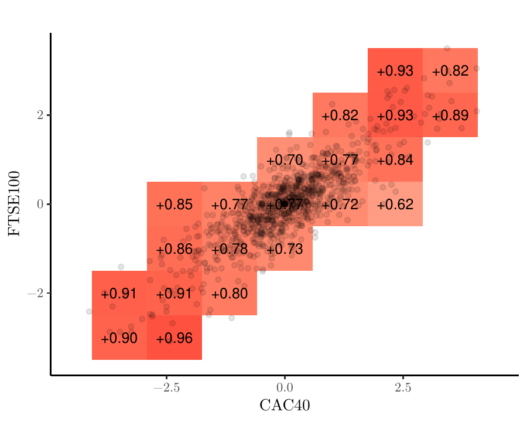
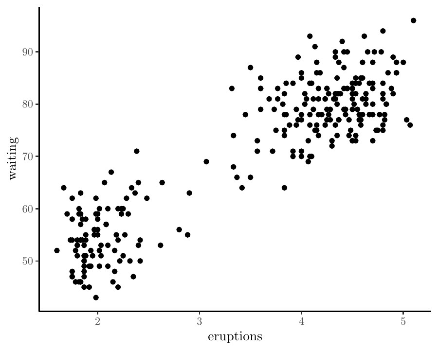
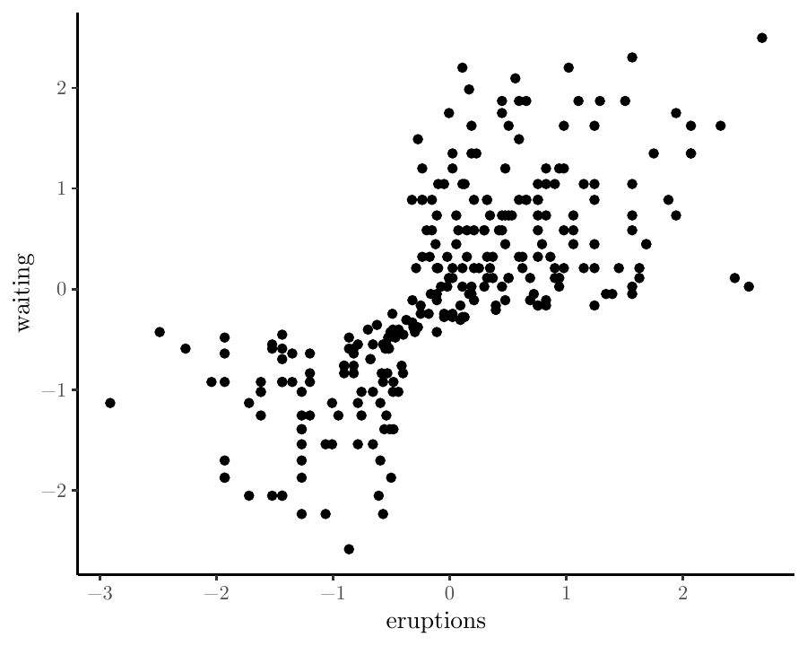
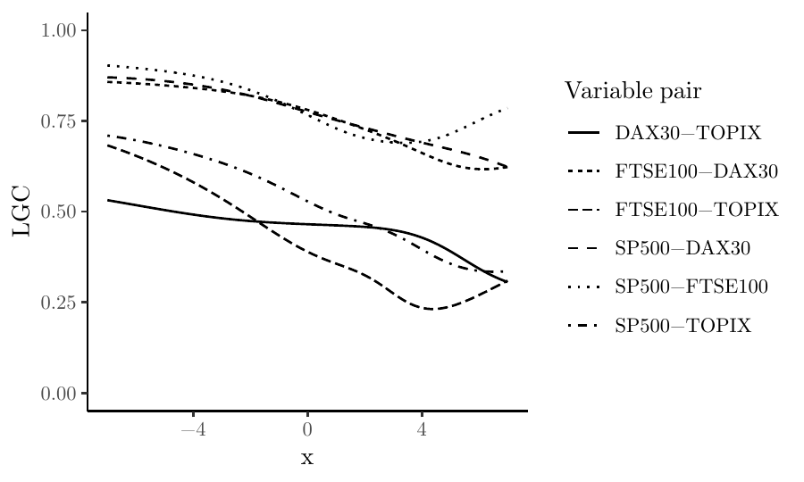
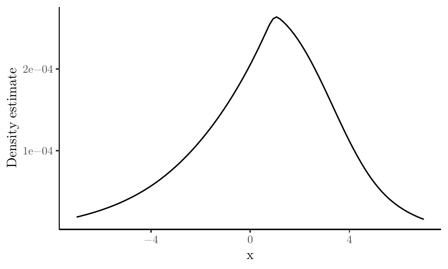

# Introduction {#chap:introduction}

@tjos:huft:2013 propose the *local Gaussian correlation* (LGC) as a new
measure of statistical dependence between two stochastic variables $X_1$
and $X_2$, which has the following important property yet unrivaled in
the literature: It can separate between positive and negative nonlinear
dependence while still reducing to the ordinary Pearson correlation
coefficient if $X_1$ and $X_2$ are jointly normally distributed. The
R-package [*localgauss*](https://CRAN.R-project.org/package=localgauss)
[@bere:klep:tjos:2014] provides two important functions in this context;
one that calculates the sample LGC based on observed values of
$\left(X_1,X_2\right)$, and one that uses the estimated LGC to perform a
local test of independence between $X_1$ and $X_2$ as described in
detail by @bere:tjos:2014.

We have lately seen a number of new applications of the LGC that the
[*localgauss*](https://CRAN.R-project.org/package=localgauss) package
does not support, however. @stov:tjos:huft:2014 use the LGC to test for
financial contagion across markets during crises. @otne:tjos:2017
present a procedure for estimating multivariate density functions via
the LGC, which @otne:tjos:2018 modify in order to compute estimates of
conditional density functions. @laca:tjos:2017 present a test for serial
independence within a time series, which @laca:tjos:2018 extend in order
to include a test for cross-correlation between two time series.
Finally, @otne:tjos:2019 develop the local Gaussian *partial*
correlation (LGPC) as a measure of conditional dependence and a
corresponding test for conditional independence.

This paper describes the [*lg*](https://CRAN.R-project.org/package=lg)
package [@otne:2019], which provides a unified framework to implement
all these methods, as well as a tool for visualizing the LGC and LGPC as
dependence maps. @jord:tjos:2017 use the LGC in spectral analysis of
time series, but those methods have their own computational ecosystem in
the *localgaussSpec* package [@jord:2018].

In Section [2](#chap:background), we provide a brief introduction to the
LGC as well as the methods and applications referred to above. In
Section [3](#chap:lgobject), we describe the core function in the
[*lg*](https://CRAN.R-project.org/package=lg) package and move on to
demonstrate the implementation of various applications in Section
[4](#chap:inference). We conclude this paper in Section
[5](#chap:graphics) by demonstrating the graphical capabilities of the
[*lg*](https://CRAN.R-project.org/package=lg) package.

# Statistical background {#chap:background}

Consider a random vector $X$ having the unknown probability density
function $f_X\left(x\right)$. It is a standard task to estimate $f_X$
based on a random sample $X_1,\ldots, X_n$, and the statistical
literature provides an abundance of methods to accomplish this. One may,
for example, make the assumption that the unknown density function has a
particular parametric form, $f_X \in F_{\theta}$, where
$F_{\theta} = \left\{f(x;\theta), \theta \in \Theta\right\}$ is a family
of probability density functions indexed by some parameter $\theta$, and
where $\Theta$ is the parameter space. Under this assumption, we will
typically produce an estimate of the parameter $\theta$, written
$\widehat \theta$, using the maximum likelihood method. The estimated
probability density function is then given as
$\widehat f_X\left(x\right) = f\left(x; \widehat\theta\right)$.

A different approach is to estimate $f_X\left(\cdot\right)$ without any
prior parametric assumptions. The classical method for nonparametric
density estimation is the kernel estimator
$$\widehat f_X\left(x\right) = \frac{1}{nb}\sum_{i=1}^n K\left(\frac{X_i - x}{b}\right),$$
where $K$ is a symmetric density function (the kernel) and $b$ is a
tuning parameter (the bandwidth) that controls the smoothness of the
estimate $\widehat f_X\left(\cdot\right)$. See @silv:1986 for an
introduction to this topic. There is also a massive statistical
literature on density estimation containing extensions and improvements
to the classical methods to be used in various practical situations.

@hjor:jone:1996 provide one such idea. They consider a parametric family
$F_{\theta}$, but instead of searching for a single parameter value
$\theta_0$ for which $f_X\left(x\right) = f\left(x;\theta_0\right)$ (or
approximately so), they rather assert that different members of
$F_{\theta}$ may approximate $f_X$ locally in different parts of its
domain. In other words, they seek to estimate a parameter *function*
$\theta_0\left(x\right)$ for which
$f_X\left(x\right) = f\left(x;\theta_0\left(x\right)\right)$ (or
approximately so), and do this by maximizing a *local likelihood
function* in each point $x$:
$$\begin{aligned}
\widehat\theta\left(x\right) 
&= \arg\max_{\theta \in \Theta} L_n\left(\theta, x\right) \nonumber\\ 
&= \arg\max_{\theta \in \Theta} \frac{1}{nb}\sum_{i=1}^n K\left(\frac{X_i - x}{b}\right)\log f\left(X_i; \theta\right) - \int \frac{1}{b}K\left(\frac{y - x}{b}\right)f\left(y;\theta\right)\,\textrm{d}y,
\label{eq:loclik}
\end{aligned}   (\#eq:loclik)$$
where, again, $K$ is a symmetric density function and $b$ is a bandwidth
parameter that controls the smoothness of the estimate. The second term
in the local likelihood function is a penalty that ensures that the
estimated density
$\widehat f_X\left(x\right) = f\left(x; \widehat\theta\left(x\right)\right)$
converges correctly to the true density function $f_X\left(x\right)$ as
the sample size $n$ increases to infinity and the bandwidth $b$
decreases towards zero. See @hjor:jone:1996 for a detailed discussion
about this construction.

@tjos:huft:2013 consider the bivariate case $X = \left(X_1, X_2\right)$
and take $F_{\theta}$ to be the family of bivariate normal distributions
consisting of densities on the form

$$\begin{aligned}
f\left(x;\theta\right) 
&= \psi\left(x_1, x_2;\mu_1, \mu_2, \sigma_1, \sigma_2, \rho\right)  \nonumber\\ 
&= \frac{1}{2\pi \sigma_1 \sigma_2\sqrt{1-\rho^2}} \nonumber \\
& \qquad \times\exp \left\{-\frac{1}{2(1-\rho^2)}\left(\frac{\left(x_1-\mu_1\right)^2}{\sigma_1^2}-2\rho\frac{\left(x_1-\mu_1\right)\left(x_2-\mu_2\right)}{\sigma_1 \sigma_2}+\frac{\left(x_2-\mu_2\right)^2}{\sigma_2^2}\right)\right\},
\label{eq:gaussian}
\end{aligned}   (\#eq:gaussian)$$
where $\theta = \left(\mu_1,\mu_2,\sigma_1,\sigma_2,\rho\right)$ is the
vector of parameters. Using a sample $\left\{X_{1i}, X_{2i}\right\}$,
$i = 1, \ldots, n$, they estimate $\theta$ locally in the point $x$ by
maximizing the local likelihood function \@ref(eq:loclik), producing
$$\widehat\theta\left(x\right) = \left(\widehat\mu_1\left(x\right), \widehat\mu_2\left(x\right), \widehat\sigma_1\left(x\right), \widehat\sigma_2\left(x\right), \widehat\rho\left(x\right)\right),$$
and take special interest in the estimated correlation function
$\widehat\rho\left(x\right)$ (i.e., the LGC) because it serves as an
attractive local measure of statistical dependence between $X_1$ and
$X_2$. They show that the LGC reveals many types of nonlinear
statistical dependence that are not captured by the ordinary (global)
Pearson correlation coefficient. Furthermore, the LGC distinguishes
between positive and negative dependence and reduces to the Pearson
$\rho$ if $X_1$ and $X_2$ are jointly normal. We refer to
[@tjos:huft:2013] for a detailed treatment of the theoretical
foundations of the LGC as well as several examples and rather present
two simple illustrations at this point in order to demonstrate the
concept.

<figure id="fig:initial-example">
<table>
<caption> </caption>
<tbody>
<tr class="odd">
<td style="text-align: center;"></td>
<td style="text-align: center;"></td>
</tr>
<tr class="even">
<td style="text-align: center;">(a) <span>Estimated local Gaussian
correlations between two jointly normal variables having correlation
equal to 0.5, based on 1000 observations.</span></td>
<td style="text-align: center;">(b) <span>Local Gaussian correlation
between daily returns from the CAC40 and FTSE100 stock indices based on
1000 consecutive trading days.</span></td>
</tr>
</tbody>
</table>
<figcaption>Figure 1: Two dependence maps</figcaption>
</figure>

In Figure [1](#fig:initial-example), we have plotted the estimated LGC
for two bivariate data sets on a grid; 1000 simulated observations from
a binormal distribution having correlation equal to 0.5, and the daily
return on the CAC40 and FTSE100 stock indices on 1000 consecutive
trading days starting on May 5th 2014 [@datastream]. In the first panel,
we see that the estimated local correlation coincides with the global
correlation, except for the estimation error which is comparable to the
uncertainty observed in other nonparametric estimation methods such as
the kernel density estimator (see, for instance, @otne:tjos:2017 for a
formal asymptotic analysis of relevant convergence rates). In the second
panel, we see clearly that the local correlation, and thus the
dependence, is stronger in the lower left and upper right regions of the
distribution than in the central parts. The phenomenon of local
dependence is well known in the financial literature, and using the LGC
it can be measured, interpreted, and visualized in a natural way. The
interpretation of this particular figure is that extreme observations on
the two stock indices are more strongly dependent than the less extreme
observations.

One may obtain these particular estimates from the older
[*localgauss*](https://CRAN.R-project.org/package=localgauss) package
(as well as the [*lg*](https://CRAN.R-project.org/package=lg) package,
of course), but the plotting routine that was used to produce these
figures is included in the [*lg*](https://CRAN.R-project.org/package=lg)
package and will be described in more detail in Section
[5](#chap:graphics).

Taking the LGC as a measure of dependence opens up a number of
possibilities to construct statistical tests. @bere:tjos:2014 show that
$\rho\left(x\right) \equiv 0$ implies that $X_1$ and $X_2$ are
independent. They show further that independence between $X_1$ and $X_2$
implies $\rho\left(x\right) \equiv 0$ if the population values of the
local mean and standard deviation functions satisfy the following
conditions: $\mu_i\left(x_1, x_2\right) = \mu_i\left(x_i\right)$ and
$\sigma_i\left(x_1, x_2\right) = \sigma_i\left(x_i\right)$ for $i=1,2$.
Equivalence between independence and $\rho\left(x\right) \equiv 0$ holds
in general if the observations have been suitably transformed according
to a procedure presented later in this section. It follows then that
departures from $\widehat\rho\left(x\right) \equiv 0$ may be taken as
evidence against the hypothesis that $X_1$ and $X_2$ are statistically
independent. @bere:tjos:2014 formalize this notion by testing whether
$\rho\left(x\right) \equiv 0$ for all $x\in S \subset \mathbb{R}^2$
using the test statistic

$$\label{eq:test-statistic1}
T_{n,b} = \int_S h\left(\widehat \rho\left(x\right) \right) \,\textrm{d}F_n(x)   (\#eq:test-statistic1)$$
for some non-negative function $h$, for example $h\left(x\right) = x^2$
or $h\left(x\right) = |x|$. Critical values may be obtained by
permutations of the data under the null hypothesis, and we demonstrate
the implementation of this test using the
[*lg*](https://CRAN.R-project.org/package=lg) package in Section
[4.2](#chap:indtests).

Consider next the stationary time series $\left\{X_t\right\}$. The
autocorrelation function (ACF) $\rho_k = \rho\left(X_t, X_{t-k}\right)$
is a well known concept for describing the serial dependence in the time
series, but the ACF is, again, only capable to completely capture
*linear* serial dependence. @laca:tjos:2017 seek to remedy this by
rather calculating the local correlation between $X_t$ and $X_{t-k}$.
This leads to a test for serial independence in a natural way. In fact,
this work is mainly a theoretical exercise in order to accommodate time
series dependence. Testing for independence between $X_t$ and $X_{t-k}$
using observations $\left\{X_t, X_{t-k}\right\}_{t = k+1}^T$ leads to
the same test statistic \@ref(eq:test-statistic1) and bootstrap
procedure as the test for independence between $X_1$ and $X_2$ that we
described above.

@laca:tjos:2018 extend this problem to test for serial cross-dependence
between two time series $\left\{X_t, Y_t\right\}$ by measuring the LGC
between $X_t$ and $Y_{t-k}$. Departures from
$\widehat\rho\left(x,y\right) \equiv 0$ are, again, taken as evidence
against independence, and the test statistic (\@ref(eq:test-statistic1))
provides an aggregate measure of this discrepancy in the specified
region $S$. In this case, however, we can not obtain replicates of the
test statistic under the null hypothesis by simple permutations of the
data. @laca:tjos:2018 suggest two block bootstrap procedures instead to
this end, using fixed and random block sizes, respectively. The tests
for serial dependence and serial cross-dependence are both implemented
in the [*lg*](https://CRAN.R-project.org/package=lg) package, as we
demonstrate in Section [4.2](#chap:indtests).

We find another application of the local Gaussian approximation in work
by @stov:tjos:huft:2014, who measure and test for financial contagion.
They define contagion as \"a significant increase in cross-market
linkages after a shock to one country\" [@forb:rigo:2002 p. 2223] and
employ the LGC to quantify this potential linkage. The authors estimate
the LGC on a grid $\left\{x_1, x_2\right\}_k$, $k=1,\ldots,K$ along the
diagonal $D=\left\{\left(x_1,x_2\right): x_1 = x_2\right\}$ *before* and
*after* some critical event in the financial markets, denoted as the
crisis (C) and the non-crisis (NC) periods, respectively. They compare
the two estimates using the following test statistic,
$$T_{n,b}^D = \sum_{k=1}^K \left\{\widehat\rho_C\left(x_k, x_k\right) - \widehat\rho_{NC}\left(x_k, x_k\right) \right\}w\left(x_k,x_k\right),$$
where $w\left(\cdot, \cdot\right)$ is a weight function that serve the
same purpose as the integration area $S$ in (\@ref(eq:test-statistic1)).
In this case, @stov:tjos:huft:2014 show that a standard bootstrap will
suffice in order to produce approximate replicates of $T_{n,b}^D$ under
the null hypothesis of no financial contagion, and we demonstrate the
implementation of this test using the
[*lg*](https://CRAN.R-project.org/package=lg) package in Section
[4.3](#chap:cont).

Although the original work by @hjor:jone:1996 provide a general
framework for local likelihood density estimation using any $p$-variate
parametric family as the local family, it is evident that the method may
struggle in multivariate applications much in the same way as the kernel
density estimator does. This is a consequence of the curse of
dimensionality, the effect of which is sought remedied by an algorithm
provided by @otne:tjos:2017. The idea is to fit the $p$-variate normal
distribution $\psi\left(\mu, \Sigma\right)$ locally, where $\mu$ is the
vector of $p$ expectations, and $\Sigma$ is the $p\times p$ covariance
matrix (to which the correlation matrix $R$ corresponds), but under the
following structural simplifications:

$$\begin{aligned}
\mu_i\left(x\right) &= \mu_i\left(x_1, \ldots, x_p\right) \stackrel{\textrm{def}}{=} \mu_i\left(x_i\right) \label{eq:simp-mu}
\end{aligned}   (\#eq:simp-mu)$$

$$\begin{aligned}
\sigma_i\left(x\right) &= \sigma_i\left(x_1, \ldots, x_p\right)  \stackrel{\textrm{def}}{=} \sigma_i\left(x_i\right) \label{eq:simp-sig}
\end{aligned}   (\#eq:simp-sig)$$

$$\begin{aligned}
\rho_{ij}\left(x\right) &= \rho_{ij}\left(x_1, \ldots, x_p\right) \stackrel{\textrm{def}}{=} \rho_{ij}\left(x_i, x_j\right). \label{eq:simp-rho}
\end{aligned}   (\#eq:simp-rho)$$
@otne:tjos:2017 estimate the local parameters above by first obtaining
univariate marginal locally Gaussian fits (eqs. \@ref(eq:simp-mu) and
\@ref(eq:simp-sig)), and then pairwise bivariate locally Gaussian fits
(eq. \@ref(eq:simp-rho)). In the second step, the estimates
$\widehat\mu_i\left(x_i\right)$, $\widehat\mu_j\left(x_j\right)$,
$\widehat\sigma_i\left(x_i\right)$, and
$\widehat\sigma_j\left(x_j\right)$ are kept fixed in the estimation of
the pairwise local correlation. They argue further that the following
transformation technique will produce better density estimates in many
situations. The motivation for introducing the simplifications defined
in equations \@ref(eq:simp-mu)-\@ref(eq:simp-rho) can be compared to the
practical advantages of estimating additive regression models, where
$\textrm{E}\left(Y\right) = f\left(x_1, \ldots, x_p\right) \stackrel{\textrm{def}}{=} f_1\left(x_1\right) + \cdots + f_p\left(x_p\right)$.

Denote by $F_i\left(x_i\right)$, $i = 1,\ldots, p$ the marginal
distribution functions of the stochastic vector $X$, and by
$\widehat F_i\left(x_i\right) = n^{-1}\sum_{i=1}^n 1\left(X_i \leq x_i\right)$
their empirical counterparts. They then estimate the density
$f_Z\left(z\right)$ of the vector
$Z = \left\{\Phi^{-1}\left(F_i\left(X_i\right)\right)\right\}_{i=1,\ldots,p}$.
In practice it is approximated by

$$\label{eq:trans}
\widehat Z = \left\{\Phi^{-1}\left(\widehat F_i\left(X_i\right)\right)\right\}_{i=1,\ldots,p},   (\#eq:trans)$$
and where $\Psi\left(\cdot\right)$ is the univariate standard normal
cdf. In that case, they simplify the estimation problem even further and
fix

$$\label{eq:simp}
\mu_i\left(z_i\right) \stackrel{\textrm{def}}{=} 0 \,\, \textrm{ and } \sigma_i\left(z_i\right) \stackrel{\textrm{def}}{=} 1, \,\, i = 1,\ldots,p,   (\#eq:simp)$$
so that the only parameter functions left to estimate are the pairwise
local Gaussian correlations
$R\left(z\right) = \left\{\rho_{ij}\left(z_i, z_j\right)\right\}_{i<j}$.
We use the notation $Z$, $z_i$, and $z_j$ to signify that the estimation
is performed on the (approximate) standard normal scale or $z$-scale for
short. We can then estimate the joint density $f_Z\left(z\right)$ of $Z$
as
$$\label{eq:transformed-density}
\widehat f_Z\left(z\right) = \psi\left(z; \mu\left(z\right) = 0, \sigma\left(z\right) = 1, R = \widehat R\left(z\right)\right),   (\#eq:transformed-density)$$
where $\mu\left(z\right) = \left\{\mu_i\left(z\right)\right\}$ and
$\sigma\left(z\right) = \left\{\sigma_i\left(z\right)\right\}$ for
$i=1,\ldots,p$, and then substitute $f_Z$ for $\widehat f_Z$ in the
following relation obtained by @otne:tjos:2017 in order to estimate the
unknown density $f_X$:
$$\label{eq:backtrans}
f\left(x\right) = f_{Z}\big(\Phi^{-1}\left(F_1\left(x_1\right)\right), \ldots, \Phi^{-1}\left(F_p\left(x_p\right)\right)\big) \times \prod_{i=1}^p \frac{f_i\left(x_i\right)}{\phi\big(\Phi^{-1}\left(F_i\left(x_i\right)\right)\big)},   (\#eq:backtrans)$$
where $\phi\left(\cdot\right)$ is the standard normal pdf. This
estimator is implemented the
[*lg*](https://CRAN.R-project.org/package=lg) package as demonstrated in
Section [4.1](#chap:density).

One particular feature enjoyed by the jointly normally distributed
vector $X$ is that for any partitioning
$X = \left(X^{\left(1\right)}, X^{\left(2\right)}\right)$, the
conditional distribution of
$X^{\left(1\right)}|X^{\left(2\right)} = x^{\left(2\right)}$ is also
normal. In fact, if $X \sim \mathcal{N}\left(\mu,\Sigma\right)$, and
$\mu$ and $\Sigma$ is partitioned according to
$\left(X^{\left(1\right)}, X^{\left(2\right)}\right)$ as
$$\mu = \begin{pmatrix} \mu_1 \\\mu_2 \end{pmatrix} \,\, \textrm{ and } \,\, \Sigma = \begin{pmatrix} \Sigma_{11} & \Sigma_{12} \\ \Sigma_{21} & \Sigma_{22} \end{pmatrix},$$
then
$X^{\left(1\right)}|X^{\left(2\right)} = x^{\left(2\right)} \sim \mathcal{N}\left(\mu^*, \Sigma^*\right)$,
where

$$\begin{aligned}
\mu^* &= \mu_1 + \Sigma_{12}\Sigma_{22}^{-1}\left(x^{\left(2\right)} - \mu_2\right) \label{eq:cond-mu}
\end{aligned}   (\#eq:cond-mu)$$

$$\begin{aligned}
\Sigma^* &= \Sigma_{11} - \Sigma_{12}\Sigma_{22}^{-1}\Sigma_{21}, \label{eq:cond-sig}
\end{aligned}   (\#eq:cond-sig)$$
see e.g. @john:wich:2007 [chapter 4]. @otne:tjos:2018 demonstrate that
this property may be translated into a corresponding local argument
without modification. That is, if the joint density
$f_X\left(\cdot\right)$ can be written on a locally Gaussian form
$$f_X\left(x\right) = \psi\left(x, \mu\left(x\right), \Sigma\left(x\right)\right),$$
then the conditional density of
$X^{\left(1\right)}|X^{\left(2\right)} = x^{\left(2\right)}$ can also be
written on the same locally Gaussian form with local parameters given by
equations (\@ref(eq:cond-mu)) and (\@ref(eq:cond-sig)), except that all
quantities are $x$-dependent. If we use the transformation technique
described above together with simplification (\@ref(eq:simp)), the local
versions of equations (\@ref(eq:cond-mu)) and (\@ref(eq:cond-sig))
simplify to

$$\begin{aligned}
\mu^*\left(z\right) &= R_{12}\left(z\right)R_{22}\left(z\right)^{-1}z^{\left(2\right)},  \label{eq:cond-mu-trans}
\end{aligned}   (\#eq:cond-mu-trans)$$

$$\begin{aligned}
\Sigma^*\left(z\right) &= R_{11}\left(z\right) - R_{12}\left(z\right)R_{22}\left(z\right)^{-1}R_{21}\left(z\right), \label{eq:cond-sig-trans}
\end{aligned}   (\#eq:cond-sig-trans)$$
where we, again, switch to $z$-notation in order to make it clear that
these quantities are estimated on the standard normal $z$-scale. An
estimator
$\widehat f_{X^{\left(1\right)}|X^{\left(2\right)}}\left(\cdot|\cdot\right)$
of the conditional density
$f_{X^{\left(1\right)}|X^{\left(2\right)}}\left(\cdot|\cdot\right)$
follows immediately from an expression corresponding to
(\@ref(eq:backtrans)), and the
[*lg*](https://CRAN.R-project.org/package=lg) package provides functions
for implementing this estimator in R. We describe the implementation of
this functionality in Section [4.1](#chap:density).

Finally, we refer to @otne:tjos:2019 who take the local version of the
conditional covariance matrix (\@ref(eq:cond-sig)) (or
(\@ref(eq:cond-sig-trans)) in the transformed case) as a measure for
conditional dependence, and thus as an instrument to test for
conditional independence. Consider the stochastic vector
$X = \left(X^{\left(1\right)}, X^{\left(2\right)}, X^{\left(3\right)}\right)$,
where $X^{\left(1\right)}$ and $X^{\left(2\right)}$ are scalars and
$X^{\left(3\right)}$ may be a vector. $X^{\left(1\right)}$ is
conditionally independent from $X^{\left(2\right)}$ given
$X^{\left(3\right)}$, written
$X^{\left(1\right)} \perp X^{\left(2\right)} \,|\,X^{\left(3\right)}$,
if the stochastic variables $X^{\left(1\right)}\,|\,X^{\left(3\right)}$
and $X^{\left(2\right)}\,|\,X^{\left(3\right)}$ are independent, or,
equivalently, if the joint conditional density of $X^{\left(1\right)}$
and $X^{\left(2\right)}$ given $X^{\left(3\right)}$ can be written as
the product

$$\label{eq:cond-ind}
f_{X^{\left(1\right)},X^{\left(2\right)}|X^{\left(3\right)}}\left(x^{\left(1\right)}, x^{\left(2\right)}|x^{\left(3\right)}\right) = f_{X^{\left(1\right)}|X^{\left(3\right)}}\left(x^{\left(1\right)}|x^{\left(3\right)}\right) \times f_{X^{\left(2\right)}|X^{\left(3\right)}}\left(x^{\left(2\right)}|x^{\left(3\right)}\right).   (\#eq:cond-ind)$$
In this case, denote by $\alpha\left(z\right)$ the off-diagonal element
in the $2\times2$ local correlation matrix $R^*\left(z\right)$ (which
derives directly from $\Sigma^*\left(z\right)$ as given in
(\@ref(eq:cond-sig-trans))). If $X$ has a local Gaussian distribution,
the conditional independence (\@ref(eq:cond-ind)) is equivalent to
$\alpha\left(z\right) \equiv 0$, and @otne:tjos:2019 take departures
from this relation as evidence against the hypothesis of conditional
independence between $X^{\left(1\right)}$ and $X^{\left(2\right)}$ given
$X^{\left(3\right)}$. The natural way to quantify this is the test
functional

$$\label{eq:ci-test-statistic}
T^{CI}_{n, b} = \int h\left(\widehat\alpha\left(z\right)\right) \, \textrm{d}F_n(z).   (\#eq:ci-test-statistic)$$
@otne:tjos:2019 describe a bootstrap procedure for generating replicates
of $T_{n,b}^{CI}$ under the null hypothesis. In Section
[4.4](#chap:partial), we demonstrate how the
[*lg*](https://CRAN.R-project.org/package=lg) package may be used to
extract estimates of the local partial correlation and perform tests for
conditional independence according to this scheme.

# The first step: Creating the lg-object {#chap:lgobject}

The local Gaussian correlation may be used to perform a number of
statistical analyses, as is evident from the preceding section. The
practitioner must first, however, make three quite specific modeling
choices; namely (i) to choose an estimation method, i.e., the level of
simplification in multivariate applications, (ii) to determine whether
the data should be transformed towards marginal standard normality
before estimating the LGC, and (iii) to choose a set of bandwidths or at
least a method for calculating bandwidths. The architecture of the
[*lg*](https://CRAN.R-project.org/package=lg) package requires the user
to make these choices *before* endeavoring further into specific
applications by imposing a strict, two-step procedure:

1.  Create an lg-object.

2.  Apply relevant analysis functions to the lg-object.

In the following, we assume that one has a *data set* `x` loaded into
the R workspace, which must be an $n\times p$ matrix (one column per
variable, one row per observation), possibly including `NA`s which will
be excluded from the analysis, or a data frame having the same
dimensions. The fundamental syntax for creating an lg-object is
`lg_object <- lg_main(x)`, and we will, in this section, explain how the
modeling decisions (i)-(iii) can be encoded into the lg-object by using
appropriate arguments in this function.

## Selecting the estimation method {#chap:est-method}

Given a data set `x` having $n$ rows and $p \geq 2$ columns, the user
must choose between four distinct estimation methods and specify this
choice by using the argument `est_method` to the `lg_main()`-function.
We look at the built-in bivariate data set `faithful`, which records the
waiting time between eruptions and the duration of the eruption for the
Old Faithful geyser in the Yellowstone National Park, USA (see the help
file in R for more details: `?faithful`), and load the
[*lg*](https://CRAN.R-project.org/package=lg) package in order to
demonstrate the implementation:

``` r
R> x <- faithful
R> library(lg)
```

**1. A full locally Gaussian fit for bivariate data.** If $p = 2$, we
may fit the bivariate normal $\psi\left(x, \theta\right)$ locally to
$f\left(x\right)$, and by a \"full local fit\", we mean that we jointly
estimate the five parameters
$$\theta\left(x\right) = \big(\mu_1\left(x_1, x_2\right), \mu_2\left(x_1, x_2\right), \sigma_1\left(x_1, x_2\right), \sigma_2\left(x_1,x_2\right),\rho\left(x_1, x_2\right)\big)$$
by optimizing the local likelihood function (\@ref(eq:loclik)) in the
grid point $x = \left(x_1, x_2\right)$. To use this estimation method in
the subsequent analysis, specify `est_method = "5par"` in the call to
`lg_main()`:

``` r
R> lg_object <- lg_main(x, est_method = "5par")
```

The resulting `lg_object` is a list of class `lg`, and we may confirm
that the assignment has been carried out correctly by inspecting its
`est_method`-element:

``` r
R> lg_object$est_method 

[1] "5par"
```

Note that the full locally Gaussian fit for raw data is not available if
the number of variables $p$ is greater than 2. The `lg_main()`-function
will check for this and print out an error message if $p>2$ and
`est_method = "5par"`.

**2. A simplified locally Gaussian fit for multivariate data.** As
described in the preceding section, we may construct a simplified
estimation procedure for calculating the LGC in two steps, which in
principle works for any number of dimensions (including $p=2$):

1.  Calculate $\mu_i\left(x_i\right)$ and $\sigma_i\left(x_i\right)$,
    $i = 1,\ldots,p$ by fitting the univariate normal distribution
    locally to each *marginal* density $f_i\left(x_i\right)$ of
    $f\left(x\right)$.

2.  Keep $\widehat\mu_i\left(x\right)$ and
    $\widehat\sigma_i\left(x_i\right)$, $i=1,\ldots,p$ from step 1 fixed
    when estimating $\rho_{ij}\left(x_i, x_j\right)$, $1\leq i<j\leq p$
    by fitting the bivariate normal distribution to each *pair* of
    variables $X_i$ and $X_j$.

To use this method, create the lg-object by running the following line:

``` r
R> lg_object2 <- lg_main(x, est_method = "5par_marginals_fixed")
```

**3. A simplified locally Gaussian fit for marginally standard normal
data.** This estimation method is applicable for marginally standard
normal data, or data that have been transformed to approximate marginal
standard normality by, e.g., the transformation (\@ref(eq:trans)). In
that case, we fix the marginal expectation functions and standard
deviation functions to the constant values $0$ and $1$, respectively,
and estimate only the pairwise local Gaussian correlations as in
(\@ref(eq:transformed-density)). To use this estimation method, create
the lg-object by running

``` r
R> lg_object3 <- lg_main(x, est_method = "1par")
```

Note that the function call above will issue a warning if the option for
transforming the data to marginal standard normality is not at the same
time set to `TRUE`, see the next sub-section on data transformation for
details.

**4. A full locally Gaussian fit for trivariate data.** If the number of
variables $p$ is equal to $3$, and we choose to transform the data to
marginal standard normality (see the next sub-section), the transformed
density $f_Z\left(\cdot\right)$ in (\@ref(eq:transformed-density)) may
be estimated by jointly estimating the three local correlations
$\rho_{12}\left(z_1, z_2, z_3\right)$,
$\rho_{13}\left(z_1, z_2, z_3\right)$, and
$\rho_{23}\left(z_1, z_2, z_3\right)$. This estimation method was
introduced recently by @otne:tjos:2019 in order to increase power of
their conditional independence test, but it can be used in any
application described in this paper that consider trivariate data. To
use this estimation method, create the lg-object by running

``` r
R> lg_object4 <- lg_main(x, est_method = "trivariate")
```

This command will throw an error if the data set `x` does not have
exactly three columns.

## Data transformation

<figure id="fig:faithful">
<table>
<caption> </caption>
<tbody>
<tr class="odd">
<td style="text-align: center;"></td>
<td style="text-align: center;"></td>
</tr>
<tr class="even">
<td style="text-align: center;">(a) <span>The original data.</span></td>
<td style="text-align: center;"><span>The same data transformed to
marginal standard normality.</span></td>
</tr>
</tbody>
</table>
<figcaption>Figure 2: The same data on different scales.</figcaption>
</figure>

Next, the user must determine if the local Gaussian correlation should
be estimated directly on the raw data or on the marginally normal pseudo
observations \@ref(eq:trans). This is carried out by using the logical
`transform_to_marginal_normality`-argument in `lg_main`, for example:

``` r
R> lg_object <- lg_main(x, transform_to_marginal_normality = TRUE)
```

The resulting `lg_object` now includes the element
`transform_to_marginal_normality` set according to the input, and if
this is `TRUE`, it also includes the `transformed_data` and a function
`trans_new()` that may be used later to apply the same transformation
to, e.g., grid points. If the transformation option is set to `FALSE`,
the `transformed_data` element contains the input data `x`, and
`trans_new()` is nothing more than the identity mapping for points in
$\mathbb{R}^p$. See Figure [2](#fig:faithful) for two plots that
demonstrate the effect of the data transformation on the example data.

## Bandwidth selection {#chap:bw}

Finally, the user must specify a set of bandwidths or a method for
calculating them. Given that the different estimation methods described
in Section [3.1](#chap:est-method) require different sets of bandwidths
(i.e, joint, marginal, and/or pairwise), the easiest approach for the
user is to leave the selection and formatting of the bandwidths to the
`lg_main()`-function.

The bandwidth plays a slightly different role in local likelihood
estimation than elsewhere in the nonparametric literature. It controls
the *level of localization* and thus only indirectly the *smoothness* of
the estimates. Indeed, suppose we concentrate on the univariate case for
the moment and assume that the (single) bandwidth $b$ is small. In that
case, we see from the local likelihood function \@ref(eq:loclik) that
only the very few observations closest to a fixed grid point $x_0$ will
have significant weight when determining the local parameter estimates
$\widehat\theta_0\left(x\right)$ at that point. Moving on to another
nearby point, $x_1$ may then lead to a fairly different estimate
$\widehat\theta\left(x_1\right)$ because the set of observations having
weight in this point is very different. This may, again, lead to rougher
parameter estimates $\widehat\theta\left(x\right)$ and in turn also to
rougher density estimates
$f\left(x,\widehat\theta\left(x\right)\right)$.

If the bandwidth $b$ grows large, on the other hand, all observations
receive similar weights, and furthermore: the local likelihood function
\@ref(eq:loclik) becomes approximately proportional to the ordinary
(global) likelihood function
$L_n\left(\theta\right) = \sum_{i=1}^n\log f\left(X_i;\theta\right)$. In
other words, the local parameter estimates
$\widehat \theta\left(x\right)$ are smoothed towards the constant
maximum likelihood estimates $\widehat\theta_{ML}$, and the estimated
density $f\left(x;\widehat\theta\left(x\right)\right)$ towards the
maximum likelihood estimate $f\left(x;\widehat\theta_{ML}\right)$. This
means that the bandwidth may be chosen to reflect the goodness-of-fit of
$f\left(x;\theta\right)$ to the true density $f\left(x\right)$.

In the multivariate applications referred to in this paper, the
bandwidth $b$ in \@ref(eq:loclik) is a diagonal matrix, and $1/b$ is
naturally taken to represent its inverse.

We have in practice seen two automatic bandwidth selectors employed in
the applications referred to in Section [2](#chap:background): a
cross-validation procedure that is fairly slow to compute but accurate
with respect to density estimation, and a plug-in bandwidth that is much
quicker to calculate but less accurate with respect to density
estimation. We use the argument `bw_method` to the `lg_main()`-function
in order to choose between the two.

**1. Choosing bandwidths by cross-validation.** The functional

$$CV\left(b\right) = -\frac{1}{n}\sum_{i=1}^n \log f\Big(X_i; \widehat\theta^{\left(-i\right)}\left(X_i\right)\Big),$$
where $\widehat\theta^{\left(-i\right)}\left(x\right)$ is the parameter
estimate obtained after deleting observation $X_i$ from the data, is
proportional to a quantity that estimates the Kullback-Leibler distance
between $f\left(\cdot, \widehat\theta\left(\cdot\right)\right)$ and the
true density $f\left(\cdot\right)$; see @bere:tjos:2014. The
cross-validated bandwidth $b_{CV}$ is hence given by
$$b_{CV} = \arg\min_b \,\, CV\left(b\right).$$
If we, for example, wish to use the simplified estimation procedure on
the transformed data, we need bandwidths for the marginal estimates of
the local means and standard deviations, as well as a $2\times2$
diagonal bandwidth matrix for each pair of variables. This is
accomplished by the following call to `lg_main()`:

``` r
R> # Create the lg-object with bandwidths chosen by cross-validation
R> lg_object <- lg_main(x,
R+                      est_method = "5par_marginals_fixed",
R+                      transform_to_marginal_normality = TRUE,
R+                      bw_method = "cv")
```

The `lg_object` now contains the necessary bandwidths for this
configuration, as can be seen by inspecting the contents of its
`bw`-element:

``` r
R> # Print out the bandwidths
R> lg_object$bw

$marginal
[1] 0.9989327 0.9875333

$marginal_convergence
[1] 0 0

$joint
x1 x2         bw1      bw2 convergence
1  1  2 0.2946889 0.331971           0
```

This is itself a list, containing the crucial elements `marginal` for
the $p$ marginal bandwidths, and `joint` that contains the $p(p-1)/2$
bandwidth matrices, one for each pair of variables (which in this
bivariate example just *one* variable pair, (`x1, x2`)). The convergence
flags stem from the built-in R functions `optim()` and `optimize()` that
we use to obtain the minimizer of $CV\left(\cdot\right)$, and 0
indicates successful convergence.

**2. Using plug-in bandwidths.** Obtaining cross-validated bandwidths is
unfortunately fairly slow on a standard computer. For sample sizes in
the 500-1000 range, the process may take several minutes, which is
unfeasible when embarking on analyses that require, e.g., resampling. We
have, therefore, implemented a quick plug-in bandwidth selector as well
that may suffice in many practical situations, especially at the initial
or exploratory stage.

@otne:tjos:2017 show that the simplified version of the local Gaussian
fit have the same convergence rates as the corresponding nonparametric
kernel density estimator for which @silv:1986 derives the plug-in
formula $b = 1.08\cdot sd\left(x\right) \cdot n^{-1/5}$. By specifying
`bw_method = "plugin"`, the `lg_main()`-function will select the
bandwidths correspondingly, except that the exponent changes to $-1/6$
for joint bandwidths, and the proportionality constant is by default set
to $1.75$. The latter number is the result of regressing $b_{CV}$ on
$n^{-1/6}$ in a large simulation experiment covering various data
generating processes [@otneim2016multivariate]. We see the effect of
switching to plug-in bandwidths in the code below:

``` r
R> # Make the lg-object with plugin bandwidths
R> lg_object <- lg_main(x,
R+                      est_method = "5par_marginals_fixed",
R+                      transform_to_marginal_normality = TRUE,
R+                      bw_method = "plugin")
R> # Print out the bandwidths
R> lg_object$bw

$marginal
[1] 0.5703274 0.5703274

$marginal_convergence
[1] NA NA

$joint
  x1 x2       bw1       bw2 convergence
1  1  2 0.6875061 0.6875061          NA
```

## Summary of the initialization function

::: {#tab:arguments-lg-main}
  --------------------------------------------------------------------------------------------------
  Argument                Explanation                                                Default value
  ----------------------- ---------------------------------------------------------- ---------------
  `x`                     The data, an $n\times p$ matrix or data frame              

  `bw_method`             Method for calculating the bandwidths                      `"plugin"`

  `est_method`            Estimation method                                          `"1par"`

  `transform_to_`                                                                    

  ` marginal_normality`   Transform the data                                         `TRUE`

  `bw`                    The bandwidths to use if already calculated                `NULL`

  `plugin_constant_`                                                                 

  ` marginal`             Prop. const. in plugin formula for marg. bw.               $1.75$

  `plugin_exponent_`                                                                 

  ` marginal`             Exponent in plugin formula for marg. bw.                   $-1/5$

  `plugin_constant_`                                                                 

  `joint`                 Prop. const. in plugin formula for joint bw.               $1.75$

  `plugin_exponent_`                                                                 

  ` joint`                Exponent in plugin formula for joint bw.                   $-1/6$

  `tol_marginal`          Abs. tolerance when optimizing $CV\left(b\right)$, marg.   $10^{-3}$

  `tol_joint`             Abs. tolerance when optimizing $CV\left(b\right)$, joint   $10^{-3}$
  --------------------------------------------------------------------------------------------------

  : Table 1: Arguments to the initialization function `lg_main()`
:::

In the sub-section above, we present the three most important arguments
to `lg_main()`. Each of them allows the user to configure one of the
three crucial modeling choices. Let us complete this treatment by
covering some possibilities to make further adjustments to those
choices.

1.  The user may supply the bandwidths directly to `lg_main()` by
    passing them to the `bw`-argument. They have to be in the correct
    format, though, which is a list containing the vector `$marginal` if
    `est_method = "5par_marginals_fixed"`, and always a data frame
    `$joint` specifying all variable pairs in the `x1` and `x2` columns
    and the corresponding bandwidths in the `bw1` and `bw2` columns. The
    function `bw_simple()` will assist in creating bandwidth objects.

2.  If `bw_method = "plugin"` the user may change the proportionality
    constant and exponent in the plugin formula for the joint and, if
    applicable, the marginal bandwidths. See Table
    [1](#tab:arguments-lg-main) for the necessary argument names.

3.  If `bw_method = "cv"`, the user may change the numerical tolerance
    in the optimization of $CV\left(b\right)$. See Table
    [1](#tab:arguments-lg-main) for the necessary argument names.

# Statistical inference using the `lg` package {#chap:inference}

We proceed in this section to demonstrate how to implement each of the
tasks that we discussed in Section [2](#chap:background). The general
pattern is to pass the lg-object to one of the estimation or test
functions provided in the [*lg*](https://CRAN.R-project.org/package=lg)
package. We will look at some financial data in the examples: the
monthly returns on the S&P500, FTSE100, DAX30, and TOPIX stock indices
from January 1985 to March 2018 [@datastream].

## Density estimation {#chap:density}

We start by introducing a basic function for estimating the LGC on a
grid as described by @otne:tjos:2017, and thus also a probability
density estimate. We create a grid, `x0`, having the same number of
columns as the data in the code below. Note that we use the pipe
operator `%>%` from the
[*magrittr*](https://CRAN.R-project.org/package=magrittr) package
[@bach:wick:2014] as well as functions from the
[*dplyr*](https://CRAN.R-project.org/package=dplyr) package
[@wick:fran:mull:2018] for easy manipulation of data frames. We then
pass the grid and the lg-object containing our modeling choices to the
`dlg()`-function in order to do the estimation.

<figure id="fig:lgc-plot">
<table>
<caption> </caption>
<tbody>
<tr class="odd">
<td style="text-align: center;"></td>
<td style="text-align: center;"></td>
</tr>
<tr class="even">
<td style="text-align: center;">(a) <span>The estimated pairwise LGC for
the stock data along the diagonal indicating that the pairs of stocks
are more strongly dependent in the lower part of the distribution than
the upper part.</span></td>
<td style="text-align: center;">(b) <span>The corresponding joint
density estimate of the four return series, plotted along the diagonal
in <span class="math inline">ℝ<sup>4</sup></span>.</span></td>
</tr>
</tbody>
</table>
<figcaption>Figure 3: Local correlations and density estimates
calculated using the <code>dlg()-function</code>.</figcaption>
</figure>

``` r
R> # Create an lg-object
R> lg_object <- lg_main(x = stock_data %>% select(-Date),
R+                      est_method = "1par",
R+                      bw_method = "plugin",
R+                      transform_to_marginal_normality = TRUE)
R> 
R> # Construct a grid diagonally through the data.
R> grid_size <- 100
R> x0 <- stock_data %>% 
R+   select(-Date) %>% 
R+   apply(2, function(y) seq(from = -7,
R+                            to = 7,
R+                            length.out = grid_size))
R> 
R> # Estimate the local Gaussian correlation on the grid
R> density_object <- dlg(lg_object, grid = x0)
```

The last line of code creates a list containing a number of elements.
The two most important are `$loc_cor`, which is a matrix of local
correlations having one row per grid point and one column per *pair of
variables* (the columns correspond to the rows in
`density_object$pairs`), and `$f_est`, which is a vector containing the
estimate $\widehat f_X\left(x\right)$ of the joint density
$f_X\left(x\right)$ in the grid points specified in `x0`. The estimated
local correlations for this example is plotted in Figure
[3](#fig:lgc-plot)a, and the corresponding density estimate is plotted
(along the diagonal $x_1=x_2=x_3=x_4=x$) in Figure [3](#fig:lgc-plot)b.

The list `density_object` contains the estimated standard deviations of
the local correlations in `$loc_cor_sd`, as well as lower and upper
confidence bands `$loc_cor_lower` and `$loc_cor_upper` at the 95% level.
We refer to Table [2](#tab:dlg) for a complete overview of the arguments
to `dlg()`.

Note that the configuration `transform_to_marginal_normality = TRUE` and
`est_method = 5par` in the bivariate case coincides with the situation
considered by @tjos:huft:2013. In that case, `dlg()` serves as a wrapper
for the function `localgauss()` in the
[*localgauss*](https://CRAN.R-project.org/package=localgauss)-package
[@bere:klep:tjos:2014].

Obtaining the estimate of a conditional density using the
@otne:tjos:2018 algorithm described in Section [2](#chap:background) is
very similar. However, one must take particular care of the *ordering*
of the variables in the data set. The estimation function, `clg()`, will
*always* assume that the free variables come first and the conditioning
variables last. Let us illustrate this in the following code chunk by
estimating the joint conditional density of S&P500 and FTSE100, given
that DAX30 = TOPIX = 0.

::: {#tab:dlg}
  -------------------------------------------------------------------------------------------------------------------------
  Argument          Explanation                                                                             Default value
  ----------------- --------------------------------------------------------------------------------------- ---------------
  `lg_object`       The lg-object created by `lg_main()`                                                    

  `grid`            The evaluation points for the LGC                                                       `NULL`

  `level`           Level for confidence bands                                                              0.95

  `normalization`   The estimated density does not integrate to one by                                      

  ` _points`       construction. `dlg()` will generate the given number                                    

                    of normal variables, having the same moments as                                         

                    the data, approximate $\int \widehat f_X\left(x\right)\,\textrm{d}x$ by a Monte Carlo   

                    integral, and then normalize the density estimate                                       

                    accordingly                                                                             

  `NULL`                                                                                                    

  `bootstrap`       Calculate bootstrapped confidence intervals instead                                     

                    of asymptotic expressions                                                               `FALSE`

  `B`               Number of bootstrap replicates                                                          `500`
  -------------------------------------------------------------------------------------------------------------------------

  : Table 2: Arguments to the `dlg()`-function
:::

``` r
R> # We must make sure that the free variables come first
R> returns1 <- stock_data %>% select(SP500, FTSE100, DAX30, TOPIX)
R> 
R> # Create the lg-object
R> lg_object <- lg_main(returns1,
R+                      est_method = "1par",
R+                      bw_method = "plugin",
R+                      transform_to_marginal_normality = TRUE)
R> 
R> # Create a grid
R> x0 <- returns1 %>% 
R+   select(SP500, FTSE100) %>% 
R+   apply(2, function(y) seq(from = -7,
R+                            to = 7,
R+                            length.out = grid_size))
R> 
R> # Calculate the conditional density
R> cond_density <- clg(lg_object, grid = x0, cond = c(0, 0))
```

The key argument in the call to `clg()` above is `cond = c(0, 0)`. This
means that the last two variables are conditioning variables (and hence,
that the first $4-2=2$ variables are free). The value of the
conditioning variables are fixed at DAX30 = 0 and TOPIX = 0,
respectively. This also means that the number of columns in the grid
`x0` plus the number of elements in `cond` must equal the number of
variables $p$ in the data set, and the call to `clg()` will result in an
error message if this requirement is not fulfilled. The `clg()`-function
takes mostly the same arguments as `dlg()` listed in Table
[2](#tab:dlg), and the conditional density estimate in our example is
available in the vector `cond_density$f_est`.

## Tests for independence {#chap:indtests}

Three independence tests based on the LGC have appeared in the
literature thus far:

1.  A test for independence between the stochastic variables $X_1$ and
    $X_2$ based on iid data, cf. @bere:tjos:2014.

2.  A test for serial independence between $X_t$ and $X_{t-k}$ within a
    time series $\left\{X_t\right\}$, cf. @laca:tjos:2017.

3.  A test for serial cross-dependence between $X_t$ and $Y_{t-k}$ for
    two time series $\left\{X_t\right\}$ and $\left\{Y_t\right\}$, cf.
    @laca:tjos:2018.

As we noted in Section [2](#chap:background), their practical
implementations are very similar, and the
[*lg*](https://CRAN.R-project.org/package=lg) package provides the
function `ind_test()` to perform the tests. Let us first consider the
i.i.d. case, and generate 500 observations `test_x` from the well known
parabola model $X_2 = X_1^2 + \varepsilon$, where both $X_1$ and
$\varepsilon$ are independent and standard normal. In this case, $X_1$
and $X_2$ are uncorrelated but obviously strongly dependent.
@bere:tjos:2014 considers mainly the full bivariate fit to the raw data,
which we easily encode into the lg-object as before. The implementation
of the test using 100 bootstrap replicates is shown below.

``` r
R> # Make the lg-object
R> lg_object <- lg_main(test_x, 
R+                      est_method = "5par",
R+                      transform_to_marginal_normality = TRUE)
R> # Perform the independence test
R> test_result <- ind_test(lg_object, n_rep = 100)
R> # Print out the p-value of the test
R> test_result$p_value

[1] 0
```

This may take a few minutes to run on a desktop computer due to
bootstrapping. The small $p$-value indicates that we reject the null
hypothesis of independence between $X_1$ and $X_2$ in the parabola model
defined above. We can further specify the function $h$ and the
integration area $S$ in the test statistic \@ref(eq:test-statistic1);
see Table [3](#tab:indtest) for details.

::: {#tab:indtest}
  -----------------------------------------------------------------------------------------------------
  Argument      Explanation                                                     Default value
  ------------- --------------------------------------------------------------- -----------------------
  `lg_object`   The lg-object created by `lg_main()`                            

  `h`           The function $h(\cdot)$ in (\@ref(eq:test-statistic1))          `function(x) x``^``2`

  `S`           The integration area $S$ in (\@ref(eq:test-statistic1)). Must   `function(x)`

                be a logical function on potential                              ` as.logical(rep(1,`

                grid points in $\mathbb{R}^2$                                   ` nrow(x)))`

  `bootstrap`   The bootstrap method, must                                      

  ` _type`      be either `"plain"`, `"block"` or `"stationary"`                `"plain"`

  `block`       Block length for the block bootstrap,                           

  ` _length`    mean block length for the stationary                            

                bootstrap. Calculated by `np::b.star()`                         

                [@hayf:raci:2008] if not provided                               `NULL`

  `n_rep`       Number of bootstrap replicates                                  1000
  -----------------------------------------------------------------------------------------------------

  : Table 3: Arguments to the `ind_test()`-function
:::

The only difference when testing for serial independence within a time
series $\left\{X_t\right\}$ is to create a two-column data set
consisting of $X_t$ and $X_{t-k}$. For example, if we wish to perform
this test for $k=1$ for one of the variables in the stock-exchange
series, create the matrix of observations as below, and proceed exactly
as in the i.i.d. case.

``` r
R> returns2 <- stock_data %>% select(SP500) %>% 
R+   mutate(sp500_lagged = lag(SP500))
```

Finally, the only thing that we must alter in order to perform the third
test for serial cross-dependence is the bootstrap method. In the
applications above, it suffices to use the standard bootstrap, where we
resample with replacement from the data. This is implemented in the
`ind_test()`-function by setting the `bootstrap_type`-argument to
`"plain"`, which is the default option. When testing for serial
cross-dependence, we need to use a block-bootstrap procedure, and
@laca:tjos:2018 consider two options here: The block bootstrap with
either fixed [@kuns:1989] or random [@poli:roma:1994] block sizes. This
choice is specified by choosing `bootstrap_type = "block"` or
`bootstrap_type = "stationary"`, respectively, in the call to
`ind_test()`. @laca:tjos:2018 do not report significant differences in
test performance using the different bootstrap types.

## Test for financial contagion {#chap:cont}

Assume that we observe two financial time series $\left\{X_t\right\}$
and $\left\{Y_t\right\}$ at times $t = 1,\ldots,T$, and that some crisis
occurs at time $T^* < T$. As described in Section [2](#chap:background),
@stov:tjos:huft:2014 measure the local correlation between
$\left\{X_t\right\}$ and $\left\{Y_t\right\}$ *before* and *after*
$T^*$, and take significant differences between these measurements as
evidence against the null hypothesis of no linkage, or contagion,
between the time series. In order to implement this test using the
[*lg*](https://CRAN.R-project.org/package=lg) package, one must create
*two* lg-objects: one for the observations covering the non-crisis
period and one covering the crisis period. We do not enter a discussion
here how to empirically identify such time periods; this is a job that
must be done by the practitioner before performing the statistical test.

Let us illustrate the implementation of this test by looking at the same
financial returns data that we have used in preceding sections. However,
this time we will, in the spirit of @stov:tjos:huft:2014, concentrate on
*GARCH(1,1)-filtrated daily returns on the S&P500 and FTSE100 indices
from 2 January 1985 to 29 April 1987* in order to test for financial
contagion between the US and UK stock markets following the global stock
market crash of 19 October 1987 ("Black Monday"). Assume that these
observations are loaded into the R workspace as the $n_1 \times 2$ data
frame `x_nc` containing the observations covering the $n_1 = 728$ days
preceding the crisis and the $n_2 \times 2$ data frame `x_c` containing
the observations covering the $n_2 = 140$ consecutive trading days
starting on *Black Monday* (see the online code supplement for details
concerning the GARCH-filtration and data processing). In the code below,
we construct one lg-object for each of these data frames with
configuration matching the setup used by @stov:tjos:huft:2014 and
perform the test by means of the `cont_test()`-function.

This function returns a list containing the estimated $p$-value as well
as other useful statistics, including the empirical local correlations
measured in the two time periods. See Table
[4](#tab:arguments-cont-test) for details concerning other arguments
that may be passed to this function.

::: {#tab:arguments-cont-test}
  -------------------------------------------------------------------------------------
  Argument         Explanation                                    Default value
  ---------------- ---------------------------------------------- ---------------------
  `lg_object_nc`   The lg-object covering the non-crisis period   

  `lg_object_c`    The lg-object covering the crisis period       

  `grid_range`     Range of diagonal for measuring the LGC        (5%, 95%) quantiles

  `grid_length`    The number of grid points to use               30

  `n_rep`          Number of bootstrap replicates                 1000

  `weight`         Weight function                                `function(y)`

                                                                  ` rep(1, nrow(y))`
  -------------------------------------------------------------------------------------

  : Table 4: Arguments to the `cont_test()-function`
:::

``` r
R> # Create the two lg-objects
R> lg_object_nc <- lg_main(x_nc, 
R+                         est_method = "5par",
R+                         transform_to_marginal_normality = FALSE)
R> 
R> lg_object_c <- lg_main(x_c, 
R+                         est_method = "5par",
R+                         transform_to_marginal_normality = FALSE)
R> 
R> # Run the test with a limited number of bootstrap replicates for 
R> # demonstration purposes.
R> result <- cont_test(lg_object_nc, lg_object_c, n_rep = 100)
R> 
R> # Print out the p-value
R> result$p_value

[1] 0.01
```

The small $p$-value means that we reject the null-hypothesis of no
financial contagion between the time series after the crisis.

## Partial local correlation {#chap:partial}

Consider the work finally by @otne:tjos:2019, who take the off-diagonal
element in the local correlation matrix corresponding to the local
conditional covariance matrix \@ref(eq:cond-sig) or
\@ref(eq:cond-sig-trans) as a local measure of conditional dependence
between two stochastic variables $X^{\left(1\right)}$ and
$X^{\left(2\right)}$ given the stochastic vector $X^{\left(3\right)}$.
Furthermore, in the case with data having been transformed to marginal
standard normality, they take the statistic
$$\label{eq:condintstat}
T^{CI}_{n, b} = \int h\left(\widehat\alpha\left(z\right)\right) \, \textrm{d}F_n\left(z\right)   (\#eq:condintstat)$$
as a measure of *global* conditional dependence. The
[*lg*](https://CRAN.R-project.org/package=lg) package provides two key
functions in this framework. The first, `partial_cor()`, calculates the
local partial correlations as well as their estimated standard
deviations on a specified grid in the
$\left(x^{\left(1\right)}, x^{\left(2\right)}, x^{\left(3\right)}\right)$-space,
and is essentially a wrapper function for the `clg()`-function presented
in Section [4.1](#chap:density). See Table
[5](#tab:arguments-partial-cor) for details. The second function,
`ci_test()`, performs a test for conditional independence between the
first two variables in a data set given the remaining variables using
the test statistic (\@ref(eq:condintstat)) and a special bootstrap
procedure (described briefly below) for approximating the null
distribution.

::: {#tab:arguments-partial-cor}
  ------------------------------------------------------------------------------------
  Argument      Explanation                                            Default value
  ------------- ------------------------------------------------------ ---------------
  `lg_object`   The lg-object created by `lg_main()`                   

  `grid`        The evaluation points for the LGPC, **must** be a      

                data frame or matrix having 2 columns                  `NULL`

  `cond`        Vector with fixed values for $X^{(3)}$                 `NULL`

  `level`       Significance level for approximated confidence bands   0.95
  ------------------------------------------------------------------------------------

  : Table 5: Arguments to the `partial_cor()-function`
:::

::: {#tab:arguments-ci-test}
  ------------------------------------------------------------------------------------------------
  Argument      Explanation                                                Default value
  ------------- ---------------------------------------------------------- -----------------------
  `lg_object`   The lg-object created by `lg_main()`                       

  `h`           The function $h(\cdot)$ in (\@ref(eq:ci-test-statistic))   `function(x) x``^``2`

  `n_rep`       Number of bootstrap replicates                             500
  ------------------------------------------------------------------------------------------------

  : Table 6: Arguments to the `ci_test()-function`
:::

It is well known in the econometrics literature that conditional
independence tests are instrumental in the empirical detection of
Granger causality [@gran:1980]. For example, if we continue to
concentrate on the monthly stock returns data that we have already
loaded into memory, we may test whether
$$\label{eq:cond-ind-test}
\textrm{H}_0: \qquad R_{\textrm{FTSE100}, t} \perp R_{\textrm{SP500}, t-1} \,\, | \,\, R_{\textrm{FTSE100}, t-1}   (\#eq:cond-ind-test)$$
in the period starting in January 2009, the converse of which is a
sufficient, but not necessary, condition for $R_{\textrm{SP500}, t}$
Granger causing $R_{\textrm{FTSE100}, t}$. We perform the test by
running the code below, where `x` is a data frame having the following
columns strictly ordered as $R_{\textrm{FTSE100}, t}$,
$R_{\textrm{SP500}, t-1}$, and $R_{\textrm{FTSE100}, t-1}$ (see the
online supplement for the pre-processing of data).

The critical values of this test are calculated using the bootstrap
under the null hypothesis by independently resampling replicates from
the conditional density estimates
$\widehat f_{X^{\left(1\right)}|X^{\left(3\right)}}\left(x^{\left(1\right)}|x^{\left(3\right)}\right)$
and
$\widehat f_{X^{\left(2\right)|X^{\left(3\right)}}}\left(x^{\left(2\right)}|x^{\left(3\right)}\right)$,
as obtained by the `clg()`-function, using an approximated accept-reject
algorithm. In order to avoid excessive optimization of the local
likelihood function \@ref(eq:loclik), we estimate
$f_{X^{\left(1\right)|X^{\left(3\right)}}}$ and
$f_{X^{\left(2\right)|X^{\left(3\right)}}}$ on the univariate regular
grids $x_0^{\left(1\right)}$ and $x_0^{\left(2\right)}$, respectively
(while keeping $x^{\left(3\right)}$ fixed at the observed values of
$X^{\left(3\right)}$), and produce interpolating functions
$\tilde f_{X^{\left(1\right)}|X^{\left(3\right)}}$ and
$\tilde f_{X^{\left(2\right)}|X^{\left(3\right)}}$ using cubic splines.
It is much less computationally intensive to generate replicates from
$\tilde f$ than directly from $\widehat f$.

We refer to the documentation of the
[*lg*](https://CRAN.R-project.org/package=lg) package for details on how
to finely tune the behavior of the bootstrapping algorithm by altering
the arguments of the `ci_test()`-function and limiting our treatment to
describing the arguments most suitable for modifications by the user in
Table [6](#tab:arguments-ci-test).

``` r
R> # Create the lg-object
R> lg_object <- lg_main(returns4)
R> 
R> # Perform the test
R> test_result <- ci_test(lg_object, n_rep = 100)
R> 
R> # Print out result
R> test_result$p_value

[1] 0.51
```

The conditional independence test does not provide evidence against the
null-hypothesis \@ref(eq:cond-ind-test).

# Graphics {#chap:graphics}

We conclude this article by describing the `corplot()` function for
drawing dependence maps such as those displayed in Figure
[1](#fig:initial-example). @bere:klep:tjos:2014 report on such
capabilities in the
[*localgauss*](https://CRAN.R-project.org/package=localgauss) package,
but the possibility of creating dependence maps was unfortunately
removed from
[*localgauss*](https://CRAN.R-project.org/package=localgauss) in the
latest version 0.4.0 due to incompatibilities with the
[*ggplot2*](https://CRAN.R-project.org/package=ggplot2) [@wick:2016]
plotting engine. We make up for this loss by providing `corplot()`, a
function that plots the estimated local correlations as provided by
`dlg()`, or the estimated local *partial* correlations as provided by
`partial_cor()`.

The plotting function is highly customizable and provides a number of
options covering most basic graphical options. Users well versed in the
[*ggplot2*](https://CRAN.R-project.org/package=ggplot2) package may also
modify the graphical object returned by `corplot()` in the standard way
by adding layers as demonstrated in the example below.

In the first example, we generate a set of bivariate normally
distributed data using the
[*mvtnorm*](https://CRAN.R-project.org/package=mvtnorm) package
[@gentz:etal:2018] and estimate the local Gaussian correlation on a
regular `grid` using the `dlg()`-function. Passing the resulting
`dlg_object` to `corplot()` without further arguments results in Figure
[4](#fig:graphics1).

``` r
R> # Make a regular grid in the domain of the distribution
R> grid <- expand.grid(seq(-3, 3, length.out = 7),
R+                     seq(-3, 3, length.out = 7))
R> 
R> x <- mvtnorm::rmvnorm(500, sigma = matrix(c(1, rho, rho, 1), 2))
R> lg_object <- lg_main(x, 
R+                      est_method = "5par", 
R+                      transform_to_marginal_normality = FALSE,
R+                      plugin_constant_joint = 4)
R> dlg_object <- dlg(lg_object, grid = grid)
R> 
R> # Make a dependence map using default setup
R> corplot(dlg_object)
```

We may tweak the appearance of our dependence map by passing further
arguments to `corplot()`. Some of the options are demonstrated in the
code chunk below, in which we, for example, superimpose the observations
(by setting `plot_obs = TRUE)` and preventing the estimated local
correlations from being plotted in areas without data. The latter option
is available through the argument `plot_thres`, which works by
calculating a bivariate kernel density estimate
$\tilde f\left(x_1, x_2\right)$ for the pair of variables in question
and only allowing $\widehat \rho\left(x_1,x_2\right)$ to be plotted if
$\tilde f\left(x_1,x_2\right)/\max\tilde f\left(\cdot\right) >$
`plot_thres`. Adding layers to a dependence map using the ordinary
[*ggplot2*](https://CRAN.R-project.org/package=ggplot2) syntax works as
well, which we demonstrate in Figure [5](#fig:graphics2) by changing the
[*ggplot2*](https://CRAN.R-project.org/package=ggplot2) theme.

The plotting function works in the same way when plotting the local
partial correlations returned by `partial_cor()`, and the arguments of
`corplot()` are summarized in Table [7](#tab:arguments-corplot).

::: {#tab:arguments-corplot}
  ---------------------------------------------------------------------------------------
  Argument             Explanation                                        Default value
  -------------------- -------------------------------------------------- ---------------
  `dlg_object`         The object created by `dlg()` or `partial_cor()`   

  `pair`               Which pair to plot if more than two variables      1

  `gaussian_scale`     Logical. Plot on the marginal st. normal scale?    `FALSE`

  `plot_colormap`      Logical. Plot the colormap?                        `TRUE`

  `plot_obs`           Logical. Superimpose observations?                 `FALSE`

  `plot_labels`        Logical. Plot labels on dependence map?            `TRUE`

  `plot_legend`        Logical. Add legend?                               `FALSE`

  `plot_thres`         Threshold for plotting the estimated LGC           0

  `alpha_tile`         Transparency of color tiles                        0.8

  `alpha_point`        Transparency of points                             0.8

  `low_color`          Color representing $\widehat\rho = -1$             `"blue"`

  `high_color`         Color representing $\widehat\rho = +1$             `"red"`

  `break_int`          Break interval for color coding                    0.2

  `label_size`         Size of labels in plot                             3

  `font_family`        Font family for labels                             `"sans"`

  `point_size`         Size of points, if plotted                         `NULL`

  `xlim`, `ylim`       Axis limits                                        `NULL`

  `xlab`, `ylab`       Axis labels                                        `NULL`

  `rholab`             Title of legend                                    `NULL`

  `main`, `subtitle`   Title and subtitle of plot                         `NULL`
  ---------------------------------------------------------------------------------------

  : Table 7: Arguments to the `corplot()`-function
:::

``` r
R> corplot(dlg_object1, 
R+         plot_obs = TRUE, 
R+         plot_thres = 0.01,
R+         plot_labels = FALSE,
R+         alpha_point = 0.3,
R+         main = "",
R+         xlab = "",
R+         ylab = "") +
R+   theme_classic()
```

{#fig:graphics1 width="100%"
alt="graphic without alt text"}

{#fig:graphics2 width="100%"
alt="graphic without alt text"}

# Conclusion

The statistical literature has seen a number of applications of local
Gaussian approximations in the last decade, covering several topics in
dependence modeling and inference, as well as the estimation of
multivariate density and conditional density functions. In this paper,
we demonstrate the implementation of these methods in the R programming
language using the [*lg*](https://CRAN.R-project.org/package=lg)
package, as well as the graphical representation of the estimated local
Gaussian correlation. The package is complete in the sense that all
major methods that have been published within this framework is now
easily accessible to the practitioner. The package is also designed with
a modular infrastructure that allows future methodological developments
using local Gaussian approximations to be easily added to the package.

# Acknowledgements

The author gratefully acknowledges the constructive comments made by two
anonymous referees.

